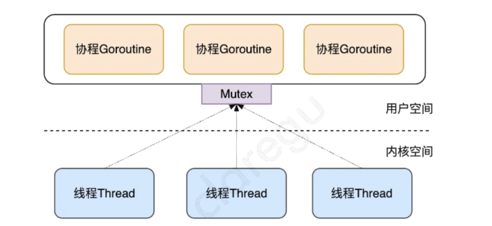
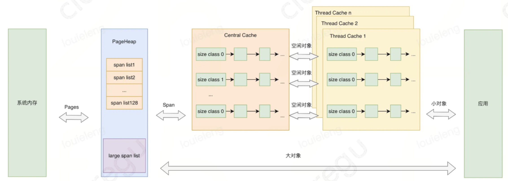

# Go

## 逃逸分析

### 什么是逃逸

逃逸分析是编译器用于决定变量分配到堆上还是栈上的一种行为。

函数的运行都是在栈上面运行的，在栈上面声明临时变量，分配内存，函数运行完毕之后，回收内存，每个函数的栈空间都是独立的，其他函数是无法进行访问的，但是在某些情况下栈上面的数据需要在函数结束之后还能被访问，这时候就会涉及到内存逃逸了，什么是逃逸，就是抓不住。

如果数据从栈上面逃逸，会跑到堆上面，栈上面的数据在函数结束的时候会自动回收，回收代价比较小，栈的内存分配和使用一般只需要两个 CPU 指令 “PUSH” 和 “RELEASE”，分配和释放，而堆分配内存，则是首先需要找到一块合适的内存，之后通过 GC 回收才能释放，对于这种情况，频繁的使用垃圾回收，则会占用比较大的系统开销，所以尽量分配内存到栈上面，减少 GC 的压力，提高程序运行速度。

### 逃逸分析过程

Go 语言最基本的逃逸分析原则：如果一个函数返回一个对变量的引用，那么它就会发生逃逸。

在任何情况下，如果一个值被分配到了栈之外的地方，那么一定是到了堆上面。简而概之：编译器会分析代码的特征和代码声明周期，Go 中的变量只有在编译器可以证明在函数返回后不会再被引用的，才分配到栈上，其他情况都是分配到堆上。

Go 语言里面没有一个关键字或者函数可以直接让变量被编译器分配到堆上，相反，编译器是通过分析代码来决定将变量分配到何处。简单来说，编译器会根据变量是否被外部引用来决定是否逃逸：

- 如果函数外部没有引用，则优先放到栈中；
- 如果函数外部存在引用，则必定放到堆中；

### 指针逃逸

我们知道传递指针可以减少底层值的拷贝，可以提高效率，但是如果拷贝的数据量小，由于指针传递会发生逃逸，可能会使用堆，也可能增加 GC 的负担，所以传递指针不一定是高效的。

### 动态类型逃逸

很多函数参数为 interface 类型，编译期间很难确定其参数的具体类型，也能产生逃逸。

### 逃逸常见情况

1. 发送指针的指针或值包含了指针到 Channel 中，由于在编译阶段无法确定其作用域与传递的路径，所以一般都会逃逸到堆上分配。
2. slice 中的值是指针的指针或包含指针字段。一个例子是类似`[]*string`的类型。这总是导致 slice 的逃逸。即使切片的底层仍可能位于栈上，数据的引用也会转移到堆中。
3. slice 由于 append 操作超出其容量，因此会导致 slice 重新分配。这种情况下，由于在编译时 slice 的初始大小的已知情况下，将会在栈上分配。如果 slice 的底层存储必须基于仅在运行时数据进行扩展，则它将分配在堆上。
4. 调用接口类型的方法。接口类型的方法调用是动态调度，实际使用的具体实现只能在运行时确定。考虑一个接口类型为`io.Reader`的变量 r，对`r.Read(b)`的调用将导致 r 的值和字节片 b 的后续转义并因此分配到堆上。
5. 尽管能够符合分配到栈的场景，但是其大小不能够在编译时确定，也会分配到堆上。

### 如何避免

1. Go 中的接口类型的方法调用是动态调度，因此不能够在编译阶段确定，所有类型结构转换成接口的过程涉及到内存逃逸的情况发生。如果对于性能要求比较高且访问频次比较高的函数调用，应该尽量避免使用接口类型 。
2. 由于切片一般是使用在函数传递的场景下，而且切片在 append 的时候可能会涉及到重新分配内存，如果切片在编译期间的大小不能够确认或者大小超出栈的限制，多数情况下都会分配到堆上。

### 总结

1. 堆上动态分配内存比栈上静态分配内存，开销大很多。
2. 变量分配在栈上需要能在编译期确定它的作用域，否则会分配到堆上。
3. Go 编译器会在编译期考察变量的作用域，并做一系列检查，如果他的作用域在运行期间对编译器是一直可知的，那么就会分配到栈上。简单来说，编译器会根据变量是否被外部引用来决定是否逃逸。
4. 对 Go 程序员来说，编译器的这些逃逸分析规则不需要掌握，只需要通过`go build -gcflags -m`的命令来观察变量逃逸情况就行。
5. 不要盲目使用变量的指针作为函数参数，虽然它会减少复制操作。但其实当参数为变量自身的时候，复制是在栈上完成的操作，开销远比变量逃逸后动态地在堆上分配内存少的多。

## String 面试与分析

### String 的底层数据结构是怎样的

go 语言中字符串的底层实现是一个结构类型，包含两个字段，一个只想字节数组的指针，另一个是字符串的字节长度。

### 字符串可以被修改吗

字符串不可以不修改

### []byte 转化为 string 互相转换会发生内存拷贝吗

会发生内存拷贝，所以程序中应避免出现大量的长字符串的这种转换。

### 字符串拼接有哪几种方式，各自的性能怎么样

| 方法            | 说明                                                         |
| --------------- | ------------------------------------------------------------ |
| +               | + 拼接 2 个字符串时，会生成一个新的字符串，开辟一段新的内存空间，新空间的大小是原来两个字符串的大小之和，所以每拼接一次就要开辟一段空间，性能很差。 |
| Sprintf         | Sprintf 会从临时对象池中获取一个对象，然后格式化操作，最后转化为 string，释放对象，实现很复杂，性能也很差。 |
| strings.Builder | 底层存储使用 []byte，转化为字符串时可复用，每次分配内存的时候，支持预分配内存并且自动扩容，所以总体来说，开辟内存的次数越少，性能相对就高。 |
| bytes.Buffer    | 底层存储使用 []byte，转化为字符串时不可复用，底层实现和 strings.Builder 差不多，性能比 strings.Builder 略差一点，区别是 bytes.Buffer 转化为字符串时重新申请了一块空间，存放生成的字符串变量，而 strings.Builder 直接将底层的 []byte 转换成了字符串类型返回了。 |
| append          | 直接使用 []byte 扩容机制，可复用，支持预分配内存和自动扩容，性能最好。 |

## Slice 面试与分析

### Slice 的底层数据结构是怎样的

slice 的底层实现是一个结构类型，有三个字段，真想一个数组的指针 Pointer、切片的长度 len、切片的容量 cap。

### 从一个切片截取出另一个切片，修改新切片的值会影响原来的切片内容吗

在截取完之后，如果新切片没有触发扩容，则修改切片元素会影响原切片，如果触发了扩容则不会。

### 切片的扩容策略是怎样的

Go 1.17 版本以前：

1. 如果期望容量大于当前容量的两倍就会使用期望容量；
2. 如果当前切片的长度小于 1024 就会将容量翻倍；
3. 如果当前切片的长度大于 1024 就会将每次增加 25% 的容量，直到新容量大于期望容量。

Go 1.18 之后：

1. 如果期望容量大于当前容量的两倍就会使用期望容量；
2. 如果扩容前容量小于 256 就会将容量翻倍；
3. 按照公式扩容，扩容公式为`newcap = oldcap + (oldcap + 3 * 256)/4`。

## Map 面试与分析

### Map 的底层实现原理

Map 的底层实现数据结构实际上是一个哈希表。在运行时表现为指向 hmap 结构的指针，hmap 中记录了桶数组指针、溢出桶指针以及元素个数等字段。每个桶是一个 bmap 的数据结构，可以存储 8 个键值对和 8 个 tophash 以及指向下一个溢出桶的指针。为了内存紧凑，采用的是先存 8 个 key 后再存 value。

### 为什么遍历 Map 是无序的？

Map 在遍历的时候会随机一个桶号和槽位，从这个随机的桶号开始，在每个桶中从这个随机的槽位开始遍历完所有的桶，至于为什么要随机开始？因为 Map 在扩容后，会发生 key 的搬迁，原来落在同一个 bucket 中的 key，搬迁后，有些 key 的位置就会发生改变。而遍历的过程，就是按顺序遍历 bucket，同时按顺序遍历 bucket 中的 key。搬迁后，key 的位置发生了重大的恶变化，有些 key 位置不动，有些迁移到了新位置。这样，遍历 Map 的结果就不可能按原来的顺序。所以，Go 语言强制每次遍历都是随机开始。

### 如何实现有序遍历 Map？

可以在遍历的时候将结果保存到一个 Slice 里，对 Slice 进行排序。

### 为什么 Go Map 是非线程安全的？

Go 官方给出的原因是：Map 适配的场景应该是简单的（不需要从多个 goroutine 中进行安全访问的），而不是为了小部分情况（并发访问），导致大部分程序付出锁的代价，因此决定了不支持。

### 线程安全的 Map 如何实现？

加锁或者使用 sync.Map

### Go sync.Map 和 原生 Map 谁的性能好，为什么？

原生 Map 的性能好，因为 Go sync.Map 为了保证线程安全，以空间换时间，采用了 read 和 dirty 两个 Map，用了原子操作和锁两种方式来实现线程安全，只是在操作 read 的时候用原子操作，当 read 中不存在某个 key 的时候就要加锁操作 dirty，过程中还是会有加锁操作，所以性能上有损耗。

### 为什么 Go Map 的负载因子是 6.5 ？

负载因子 = 哈希表存储的元素个数 / 桶个数

装载因子越大，填入的元素越多，空间利用率就越高，但发生哈希冲突的几率就越大。

装载因子越小，填入的元素越少，冲突发生的几率减小，但空间浪费也会变得更多，而且还会提高扩容操作的次数。

源码里对负载因子的定义是 6.5，是经过测试后取出的一个比较合理的值。每个 bucket 有 8 个空位，假设 Map 里所有的数组桶都装满元素，没有一个数组桶有溢出桶，那么这时的负载因子刚好是 8。而负载因子是 6.5 的时候，说明数组桶快要用完了，存在溢出的情况下，查找一个 key 很可能要去遍历溢出桶，会造成查找性能下降，所以有必要扩容了。

### Map 扩容策略是什么？

当负载因子大于 6.5 发生双倍扩容。

当溢出桶过多，发生等量扩容，溢出桶过多的标志：

1. 当正常桶数量大于 2^15 的时候，溢出桶多于正常桶，溢出桶数量就过多了；
2. 当正常桶数量大于 2^15 的时候，溢出桶一旦多于 2^15，溢出桶数量就过多了。

## sync.Map 面试与分析

### read map 什么时候更新？

delete 和 update 的时候 key 存在于 read，就会更新，当 misses 次数大于等于 dirty 长度时，会将 dirty 提升为 read。

### dirty map 什么时候会更新

- 插入一个新的 key 的时候，会直接插入到 dirty；
- 执行 store 操作的时候，当 read 中存在这个 key，dirty 中不存在这个 key 的时候，会更新，将这个 key/value 插入到 dirty；
- delete 的时候，当 read 中没有这个 key，而 dirty 中存在这个 key 的时候，会更新，将这个 key/value 直接从 dirty map 删除掉；
- 当 misses 数量大于等于 dirty 长度时，会将 dirty 提升为 read，将 dirty 中的所有 key/value 拷贝到 read 中，然后将 dirty 置为 nil；
- 当 dirty 为 nil 的时候，此时插入一个新的 key，会重塑 dirty，新建一个 dirty map 将 read 中非 expunged 状态的 key/value 拷贝到 dirty。

### read map 和 dirty map 的删除逻辑有什么区别？

read 删除是标记删除，并没有在 map 中实际删除这个 key，而是只是将这个 key 对应的 value 置为 nil，等到 misses 大于等于 dirty 长度的时候，将用 dirty 覆盖 read 的时候才会真正删除这个 key，是延迟删除。

dirty 中删除时直接将这个 key 从 dirty 这个 map 中删除掉，是直接删除。

### 那既然在删除 read 的时候没有删除这个 key，而 dirty 覆盖的时候又只覆盖了 read，那么假如 dirty 中也存在这个 key，这个 key 是不是会被遗漏，没有删掉，导致内存泄漏？

不会，因为在将 dirty 提升为 read，覆盖 read 完了之后，会将 dirty 置为 nil，这个 key 会被垃圾回收掉。

### sync.Map 中的 read 和 dirty 有什么关系？

read 可以看作是 dirty 的一个快照，在 dirty 不为空的时候，dirty 包含 map 中的所有有效 key，在 dirty 为空的时候，read 包含 map 中的所有有效 key。

在 read 的 misses 达到 dirty 的长度的时候，会将 dirty 提升为 read，用 dirty 中的所有 key/value 覆盖 read，之后 dirty 置为 nil，当 dirty 为 nil 的时候，插入一个新 key，此时会根据 read 来重塑 dirty，将 read 中非标记删除的 key/value 都 copy 到 dirty。

### sync.Map 中的值是否一定是有效的

不一定，sync.Map 中的值其实是由 entry 中的一个 p 指针指向的，p 可能有三种状态，nil、正常值、还有 expunged。当 p 的状态为 expunged 和 nil 时表示这个值是被删除了的，并不一定都是有效的。

### sync.Map 应用场景

1. 读多写少，因为写入新 key，是要加锁操作 dirty 的，所以写入操作太多性能不会太高。
2. 写操作也多，但是修改的 key 和读取的 key 特别不重合。

### sync.Map 是怎样提升性能的

1. 空间换时间。通过 read map 和 dirty map，优先操作 read map，减少频繁加锁对性能的影响；
2. 延迟删除。删除 key 并不是立即删除这个 key/value，而是先标记为 expunged，然后在 store 的过程中删除。
3. 读写分离设计。大部分读操作都在 read map 中，无需加锁。

## Channel 面试与分析

### channel 是否线程安全？锁用在什么地方？

是线程安全的，hchan 的底层实现中，hchan 结构体中采用 Mutex 锁来保证数据读写安全。在对循环数组 buf 中的数据进行入队和出队操作时，必须先获取互斥锁，才能操作 channel 数据。

### Go channel 的底层实现原理（数据结构）

channel 的底层实现是一个 hchan 的结构

```go
type hchan struct {
	qcount		uint						// 循环队列中的数据总数
	dataqsiz	uint						// 循环队列大小
	buf				unsafe.Pointer	// 指向循环队列的指针
	elemsize	uint16					// 循环队列中的每个元素的大小
	closed		uint32					// 标记位，标记channel是否关闭
	elemtype	*_type					// 循环队列中的元素类型
	sendx			uint						// 已发送元素在循环队列中的索引位置
	recvx			uint						// 已接收元素在循环队列中的索引位置
	recvq			waitq						// 等待从channel接收消息的sudog队列
	sendq			waitq						// 等待向channel写入消息的sudog队列
	lock			mutex						// 互斥锁，对channel的数据读写操作加锁，保证并发安全
}
```

### nil、关闭的 channel、有数据的 channel，再进行读、写、关闭会怎么样？（各类变种题型）例如：go channel close 后读的问题

向为 nil 的 channel 发送数据会怎么样？

会死锁，永久阻塞

### 向 channel 发送数据和从 channel 读数据的流程是什么样的？

### 哪些操作会使 channel 发生 panic ？

1. 往一个已经关闭的 channel 写数据
2. 关闭一个 nil 的 channel
3. 关闭一个已经关闭 的 channel

### 当一个 channel 关闭后，我们是否还能从 channel 读到数据？

可以，如果缓冲区中还有数据会取完数据，如果缓冲区内没有数据，会收到对应数据的零值。

### channel 是创建在堆上还是栈上

堆。

### channel 发送和接收元素的本质是什么？

值的拷贝。

### 有 4 个 goroutine，编号为 1、2、3、4，每秒钟会有一个 goroutine 打印出自己的编号，要求写一个程序，让输出的编号总是按照 1、2、3、4、1、2、3、4...的顺序打印出来

```go
func main() {
	c := make([]chan int, 4)
	for i := range c {
		c[i] = make(chan int)
		go func(i int) {
			for {
				v := <-c[i]
				fmt.Println(v + 1)
				time.Sleep(time.Second)
				c[(i+1)%4] <- (v + 1) % 4
			}
		}(i)
	}
	c[0] <- 0
	time.Sleep(time.Second * 10)
}
```

### 用 channel 实现一个限流器

```go
func main() {
	c := make(chan struct{}, 3)
	for i := 0; i < 20; i++ {
		c <- struct{}{}
		go func(i int) {
			defer func() {
				<-c
			}()
			// do something
		}(i)
	}
	
	time.Sleep(time.Second * 10)
}
```

### 用 channel 实现一个互斥锁

```go
type Mutex struct {
	ch chan struct{}
}

func NewMutex() *Mutex {
	mu := &Mutex{make(chan struct{}, 1)}
	mu.ch <- struct{}{}
	return mu
}

func (mu *Mutex) Lock() {
	<-mu.ch
}

func (mu *Mutex) Unlock() {
	select {
	case mu.ch <- struct{}{}:
	default:
		panic("unlock of unlocked mutex")
	}
}

func (mu *Mutex) TryLock() bool {
	select {
	case <-mu.ch:
		return true
	default:
	}
	return false
}

func (mu *Mutex) LockTimeout(timeout time.Duration) bool {
	timer := time.NewTimer(timeout)
	select {
	case <-mu.ch:
		timer.Stop()
		return true
	case <-timer.C:
	}
	return false
}

func (mu *Mutex) IsLocked() bool {
	return len(mu.ch) == 0
}

func main() {
	mu := NewMutex()
	ok := mu.TryLock()
	fmt.Println("TryLock:", ok)
	ok = mu.TryLock()
	fmt.Println("TryLock:", ok)

	go func() {
		time.Sleep(5 * time.Second)
		mu.Unlock()
	}()

	ok = mu.LockTimeout(3 * time.Second)
	fmt.Println("LockTimeout:", ok)
}
```

## Context 面试与分析

### Context 结构是什么样的？

go语言里的 context 实际上是一个接口，提供了四种方法：

```go
Deadline() (deadline time.Time, ok bool)
Done() <-chan struct{}
Err() error
Value(key interface{}) interface}{}
```

### Context 使用场景和用途？（基本必问）

1. context 主要用来在 goroutine 之间传递上下文信息，比如传递请求的 trace_id，以便于追踪全局唯一请求。
2. 另一个用处是可以用来做取消控制，通过取消信号和超时时间来控制子 goroutine 的退出，防止 goroutine 泄漏。

包括：取消信号、超时时间、截止时间、kv 等。

### context 有哪几种数据结构的实现

有 emptyCtx、cancelCtx、timerCtx、valueCtx 四种实现。

- emptyCtx：emptyCtx 虽然实现了 context 接口，但是不具备任何功能，因为实现很简单，基本都是直接返回空值。
- cancelCtx：cancelCtx 同时实现 context 和 canceler 接口，通过取消函数 cancelFunc 实现退出通知。注意其退出通知机制不但通知自己，同时也通知其子节点。
- timerCtx：timerCtx 是一个实现了 context 接口的具体类型，其内部封装了 cancelCtx 类型实例，同时也有个 deadline 变量，用来实现定时退出通知。
- valueCtx：valueCtx 是一个实现了 context 接口的具体类型，其内部封装了 context 接口类型，同时也封装了一个 kv 的存储变量。

## defer 面试与分析

### defer 的底层数据结构是怎样的

每个 defer 语句都对应一个 _defer 实例，多个实例使用指针连接起来形成一个单链表，保存在 goroutine 数据结构中，每次插入 _defer 实例，均插入到链表的头部，函数结束再一次从头部取出，从而形成后进先出的效果。

### 循环体能用 defer 调用嘛？会有什么问题？为什么？

循环体中不要使用 defer 调用语句，一方面是会影响性能，另一方面是可能会发生一些意想不到的结果。

首先，在循环中使用 defer 会发生内存逃逸，这样 defer 就只能分配在堆中了，相比于栈上分配和内联方式，是性能最差的一种内存分配方式，会导致程序的性能问题。

另外，可能会带来一些系统问题。比如在一个循环中，用 defer 函数来操作文件，如下：

```go
for _, filename := range filenames {
	f, err := os.Open(filename)
	if err != nil {
		return err
	}
	defer f.Close()
}
```

这段代码很可能会用尽所有文件描述符。因为 defer 语句不到函数的最后一刻是不会执行的，也就是说文件始终得不到关闭。

### defer 能修改返回值吗？defer 与 return 的先后关系是怎样的？

当函数的返回时非匿名的，有显示返回值的时候，defer 可以修改返回值。函数的返回其实不是一个原子操作，可以理解为三个步骤：

1. 设置返回值
2. 执行 defer 语句
3. 将结果返回

### 多个 defer 的执行顺序时怎样的？

后进先出，类似于栈，先调用的 defer 语句后执行。

## GMP 调度原理

### GMP 调度模型的设计思想

#### 传统多线程的问题

在现代的操作系统中，为了提高并发处理任务的能力，一个 CPU 核上通常会运行多个线程，多个线程的创建、切换使用、销毁开销通常较大：

1. 一个内核线程的大小通常达到 1M，因为需要分配内存来存放用户栈和内核栈的数据；
2. 在一个线程执行系统调用（发生 IO 事件如网络请求或读写文件）不占用 CPU 时，需要及时让出 CPU，交给其他线程执行，这时会发生线程之间的切换；
3. 线程在 CPU 上进行切换时，需要保持当前线程的上下文，将待执行的线程的上下文恢复到寄存器中，还需要向操作系统内核申请资源；
4. 在高并发的情况下，大量线程的创建、使用、切换、销毁会占用大量的内存，并浪费较多的 CPU 事件在非工作任务的执行上，导致程序并发处理事务的能力降低。

#### Go 语言早期引入的 GM 模型

为了解决传统内核级的线程的创建、切换、销毁开销较大的问题，Go 语言将线程分为了两种类型：内核级线程 M（Machine），轻量级的用户态的协程 Goroutine，至此，Go 语言调度器的三个核心概念出现了两个：

- M：Machine 的缩写，代表了内核线程 OS Thread，CPU 调度的基本单元；
- G：Goroutine 的缩写，用户态、轻量级的协程，一个 G 代表了对一段需要被执行的 Go 语言程序的封装；每个 Goroutine 都有自己独立的栈存放自己程序的运行状态；分配的栈大小为 2kb，可以按需扩缩容；

在早期，Go 将传统线程拆分为了 M 和 G 之后，为了充分利用轻量级的 G 的低内存占用、低切换开销的优点，会在当前一个 M 上绑定多个 G，某个正在运行中的 G 执行完成后，Go 调度器会将该 G 切换走，将其他可以运行的 G 放入 M 上执行，这时一个 Go 程序中只有一个 M 线程。


这个方案的优点是用户态的 G 可以快速切换，不会陷入内核态，缺点是每个 Go 程序都用不了硬件的多核加速能力，并且 G 阻塞会导致跟 G 绑定的 M 阻塞，其他 G 也用不了 M 去执行自己的程序了。

为了解决这些不足，Go 后来快速上线了多线程调度器：



每个 Go 程序，都有多个 M 线程对应多个 G 协程，该方案有以下缺点：

1. 全局锁、中心化状态带来的锁竞争导致的性能下降；
2. M 会频繁交接 G，导致额外开销、性能下降，每个 M 都得能执行任意的 runnable 状态的 G；
3. 每个 M 都需要处理内存缓存，导致大量的内存占用并影响数据局部性；
4. 系统调用频繁阻塞和解除阻塞正在运行的线程，增加了额外开销；

#### 当前高效的 GMP 模型

为了解决多线程调度器的问题，Go 开发者在已有 G、M 的基础上，引入了 P 处理器，由此产生了当前 Go 中经典的 GMP 调度模型。

- P：Processor 的缩写，代表一个虚拟的处理器，它维护一个局部的可运行的 G 队列，可以通过 CAS 的方式无锁访问，工作线程 M 优先使用自己的局部运行队列中的 G，只有必要时才会去访问全局运行队列，这大大减少了锁冲突，提高了大量 G 的并发性。每个G 要想真正运行起来，首先需要被分配一个 P。

如下图所示，是当前 Go 采用的 GMP 调度模型，可运行的 G 是通过处理器 P 和线程 M 绑定起来的，M 的执行是由操作系统调度器将 M 分配到 CPU 上实现的，Go 运行时调度器负责调度 G 到 M 上执行，主要在用户态运行，跟操作系统调度器在内核态运行相对应。


需要说明的是，Go 调度器也叫 Go 运行时调度器，或 Goroutine 调度器，指的是由运行时在用户态提供的多个函数组成的一种机制，目的是为了高效地调度 G 到 M 上去执行。可以跟操作系统的调度器 OS Scheduler 对比来看，后者负责将 M 调度到 CPU 上运行。从操作系统层面来看，运行在用户态的 Go 程序只是一个请求和运行多个线程 M 的普通进程，操作系统不会直接跟上层的 G 打交道。

至于为什么不直接将本地队列放在 M 上，而是要放在 P 上呢？这是因为当一个线程 M 阻塞的时候，可以将和它绑定的 P 上的 G 转移到其他线程 M 去执行，如果直接把可运行 G 组成的本地队列绑定到 M，则万一当前 M 阻塞，它拥有的 G 就不能给到其他 M 去执行了。

所以，基于 GMP 模型的 Go 调度器的核心思想是：

1. 尽可能复用线程 M：避免频繁的线程创建和销毁；
2. 利用多核并行能力：限制同时运行（不包含阻塞）的 M 线程数为 N，N 等于 CPU 的核心数目，这里通过设置 P 处理器的个数为 GOMAXPROCS 来保证，GOMAXPROCS 一般为 CPU 核数，因为 M 和 P 是一一绑定的，没有找到 P 的 M 会放入空闲 M 列表，没有找到 M 的 P 也会放入空闲 P 列表；
3. Work stealing 任务窃取机制：M 优先执行其所绑定的 P 的本地队列的 G，如果本地队列为空，可以从全局队列获取 G 运行，也可以从其他 M 偷取 G 来运行；为了提高并发执行的效率，M 可以从其他 M 绑定的 P 的运行队列偷取 G 执行，这种 GMP 调度模型也叫任务窃取调度模型，这里，任务就是指 G；
4. Hand off 交接机制：M 阻塞，会将 M 上 P 的运行队列交给其他 M 执行，交接效率要高，才能提高 Go 程序整体的并发度；
5. 基于协作的抢占机制：每个真正运行的 G，如果不被打断，将会一直运行下去，为了保证公平，防止新创建的 G 一直获取不到 M 执行造成饥饿问题，Go 程序会保证每个 G 运行 10ms 就要让出 M，交给其他 G 去执行；
6. 基于信号的真抢占机制：尽管基于协作的抢占机制能够缓解长时间 GC 导致整个程序无法工作和大多数 Goroutine 饥饿问题，但是还是有部分情况下，Go 调度器有无法被抢占的情况，例如，for 循环或者垃圾回收长时间占用线程，为了解决这些问题， Go 1.14 引入了基于信号的抢占式调度机制，能够解决 GC 垃圾回收和栈扫描时存在的问题。

#### 多图详解几种常见的调度场景

1. 创建 G：正在 M1 上运行的 P，有一个 G1，通过 go func() 创建 G2 后，由于局部性，G2 优先放入 P 的本地队列；


2. G 运行完成后：M1 上的 G1 运行完成后（调用`goexit()`函数），M1 上运行的 Goroutine 会切换为 G0，G0 负责调度协程的切换（运行`schedule()`）函数，从 M1 上 P 的本地运行队列获取 G2 去执行（函数`execute()`），注意，这里 G0 是程序启动时的线程 M （也叫 M0）的系统栈表示的 G 结构体，负责 M 上 G 的调度：


3. M 上创建的 G 个数大于本地队列长度时：如果 P 本地队列最多能存 4 个 G（实际上是 256 个），正在 M1 上运行的 G2 要通过 go func() 创建 6 个 G，那么，前 4 个 G 放在 P 本地队列中，G2 创建了第 5 个 G（G7）时，P 本地队列中前一半和 G7 一起打乱顺序放入全局队列，P 本地队列剩下的 G 往前移动，G2 创建的第 6 个 G（G8）时，放入 P 本地队列中，因为还有空间：


4. M 的自旋状态：创建新的 G 时，运行的 G 会尝试唤醒其他空闲的 M 绑定 P 去执行，如果 G2 唤醒了 M2，M2 绑定了一个 P2，会先运行 M2 的 G0，这时 M2 没有从 P2 的本地队列中找到 G，会进入自旋状态（spinning），自旋状态的 M2 会尝试从全局空闲线程队列里面获取 G，放到 P2 本地队列去执行，获取的数量满足公式：`n = min(len(globrunqsize)/GOMAXPROCS + 1, len(localrunsize/2))`，含义是每个 P 应该从全局队列承担的 G 数量，为了提高效率，不能太多，要给其他 P 留点：


5. 任务窃取机制：自旋状态的 M 会寻找可运行的 G，如果全局队列为空，则会从其他 P 偷取 G 来执行，个数是其他 P 运行队列的一半：


6. G 发生系统调用时：如果 G 发生系统调度进入阻塞，其所在的 M 也会阻塞，因为会进入内核状态等待系统资源，和 M 绑定的 P 会寻找空闲的 M 执行，这是为了提高效率，不能让 P 本地队列的 G 因所在 M 进入阻塞状态而无法执行，需要说明的是，如果是 M 上的 G 进入 Channel 阻塞，则该 M 不会一起进入阻塞，因为 Channel 数据传输设计内存拷贝，不涉及系统资源等待：


7. G 退出系统调用时：如果刚才进入系统调用的 G2 解除了阻塞，其所在的 M1 会寻找 P 去执行，优先找原来的 P，发现没有找到，则其上的 G2 会进入全局队列，等其他 M 获取执行，M1 进入空闲队列：


#### 结论

1. 为了解决 Go 早期多线程 M 对应多协程 G 调度器的全局锁、中心化状态带来的锁竞争导致的性能下降等问题，Go 开发者引入了处理器 P 结构，形成了当前经典的 GMP 调度模型；
2. Go 调度器是指：运行时在用户态提供的多个函数组成的一种机制，目的是高效地调度 G 到 M 上去执行；
3. Go 调度器的核心思想是：尽可能复用线程 M，避免频繁的线程创建和销毁；利用多核并行能力，限制同时运行 (不包含阻塞)的 M 线程数 等于 CPU 的核心数目；Work Stealing 任务窃取机制，M 可以从其他 M 绑定的 P 的运行队列偷取 G 执行；Hand Off 交接机制，为了提高效率，M 阻塞时，会将 M 上 P 的运行队列交给其他 M 执行；基于协作的抢占机制，为了保证公平性和防止 Goroutine 饥饿问题，Go 程序会保证每个 G 运行 10ms 就让出 M，交给其他 G 去执行，这个 G 运行 10ms 就让出 M 的机制，是由单独的系统监控线程通过 retake() 函数给当前的 G 发送抢占信号实现的，如果所在的 P 没有陷入系统调用且没有满，让出的 G 优先进入本地 P 队列，否则进入全局队列；基于信号的真抢占机制，Go 1.14 引入了基于信号的抢占式调度机制，解决了 GC 垃圾回收和栈扫描时无法被抢占的问题；
4. 由于数据局部性，新创建的 G 优先放入本地队列，在本地队列满了时，会将本地队列的一半 G 和新创建的 G 打乱顺序，一起放入全局队列；本地队列如果一直没有满，也不用担心，全局队列的 G 永远会有 1/61 的机会被获取到，调度循环中，优先从本地队列获取 G 执行，不过每隔 61 次，就会直接从全局队列获取，至于为啥是 61 次，就是要一个既不大又不小的数,而且不能跟其他的常见的 2 的幂次方的数如 64 或 48 重合；
5. M 优先执行其所绑定的 P 的本地运行队列中的 G，如果本地队列没有 G，则会从全局队列获取，为了提高效率和负载均衡，会从全局队列获取多个 G，而不是只取一个，个数是自己应该从全局队列中承担的，globrungsize / nprocs +1；同样，当全局队列没有时，会从其他 M 的 P 上偷取 G 来运行，偷取的个数通常是其他 P 运行队列的一半；
6. G 在运行时中的状态可以简化成三种：等待中 _Gwaiting、可运行 _Grunnable、运行中 _Grunning，运行期间大部分情况是在这三种状态间来回切换；
7. M 的状态可以简化为只有两种：自旋和非自旋。自旋状态，表示 M 绑定了 P 又没有获取 G；非自旋状态，表示正在执行 Go 代码中，或正在进入系统调用或空闲；
8. P 结构体中最重要的，是持有一个可运行 G 的长度为 256 的本地环形队列可以通过 CAS 的方式无锁访问，跟需要加锁访问的全局队列 schedt.rung 相对应；
9. 调度器的启动逻辑是：初始化 g0 和 m，并将二者互相绑定，m0 是程序启动后的初始线程，g0 是 m0 线程的系统栈代表的 G 结构体，负责普通 G 在 M 上的调度切换 --> runtime.schedinit()；负责 M、P 的初始化过程，分别调用 runtime.mcommoninit() 初始化 M 的全局队列 allm 、调用 runtime.procresize() 初始化全局 P 队列 allp --> runtime.newproc()；负责获取空闲的 G 或创建新的 G --> runtime.mstart() 启动调度循环；
10. 调度器的循环逻辑是：运行函数 schedule() --> 通过 runtime.globrunqget() 从全局队列、通过 runtime.runqget() 从 P 本地队列、通过 runtime.findrunnable 从各个地方，获取一个可执行的 G --> 调用 runtime.execute() 执行 G --> 调用 runtime.gogo() 在汇编代码层面上真正执行 G --> 调用 runtime.goexit0() 执行 G 的清理工作，重新将 G 加入 P 的空闲队列 --> 调用 runtime.schedule() 进入下一次调度循环。

## Go 垃圾回收

垃圾收集，简称 GC，是现代编程语言提供的内存管理功能，能够自动释放不需要的内存对象，而不用程序员手动显示释放，从而提高开发效率，并降低内存泄漏的风险。

Go 语言具有自己的垃圾收集器，并在多个版本不断演进优化：

- v1.3 及之前：标记清除法；
- v1.5：三色并发标记法；
- v1.8：混合写屏障机制。

### 标记清除算法

#### 标记清除算法介绍

标记清除算法（Mark Sweep Algorithm），是常见的垃圾收集算法之一，包括标记（Mark）和清除（Sweep）两个阶段：

- 标记阶段：从根对象出发，查找并标记堆中所有存活的对象；
- 清除阶段：遍历堆中所有的对象，回收未标记的对象，并将对应的内存加入空闲链表中。

假设应用程序中的对象关系如下图所示，由该图分析标记清除算法的步骤：


第一步：从根对象出发，依次遍历对象及其子对象，并标记对象的可达状态，如下图：


- 可达对象：对象 A、对象 B、对象 D、对象 E；
- 不可达对象：对象 C、对象 F、对象 G。

第二步：遍历所有对象，清除没有被标记的不可达对象，如下图：


- 可达对象：对象 A、对象 B、对象 D、对象 E；
- 清除不可达对象，内存释放。

#### 标记清除算法的优缺点

- 优点：算法简单明了，实现容易；
- 缺点：STW（Stop The World），标记前需要暂停程序运行；清除数据时会产生内存碎片。

#### 总结


从上图可知，在执行标记清除算法时需要 STW，来避免出现回收写冲突等问题，但这将严重影响程序业务逻辑的运行性能。所以在 Go 语言在 v1.5 版本，使用三色并发标记法来优化这个问题。

### 三色标记法

#### 三色标记法介绍

为了解决标记清除算法带来的长时间的 STW，多数现代的垃圾收集器都会采用三色标记算法。该算法将程序中的对象分为白色、灰色和黑色三类：

- 白色：潜在的垃圾，未被垃圾收集器访问到的对象，在回收开始阶段，所有对象都被标记为 白色，回收结束后，白色对象均不可达，内存会被释放；
- 灰色：活跃的对象，已被垃圾收集器访问到，但存在指向白色对象的外部指针，垃圾收集器需要继续扫描其子对象；
- 黑色：活跃的对象，已被垃圾收集器访问到，其所有字段都已被扫描。

假设应用程序中的对象关系如下图所示，由该图分析三色标记算法的步骤：


第一步：应用程序开始运行时，所有对象默认标记为白色，如下图：


- 使用 3 个标记表，来记录每个对象标记的颜色
- 程序开始运行时，所有对象都存放在白色标记表中

第二步：从根节点开始遍历，把遍历到的对象标记为灰色，放到灰色标记表中，如下图：


- 对象 A、对象 E 被标记为灰色

第三步：遍历灰度集合，将灰色对象标记为黑色，并由灰色标记表移动到黑色标记表中，将黑色对象引用的白色对象标记为灰色，放到灰色标记表中，如下图：


- 对象 A、对象 E 被标记为黑色
- 对象 B、对象 C、对象 F，被标记为灰色

第四步：重复第三步。直到灰色标记表为空，如下图：


第五步：清除所有的白色对象，完成垃圾回收，如下图：


#### 没有 STW 的三色标记法

因为应用程序可能在标记执行的过程中，修改对象的引用关系，所以为了保证对象不被错误回收，仍需要 STW。为了提高性能，首先来分析三色标记法不使用 STW 可能存在的问题。

以上图中假设第一轮扫描已经完成举例，此时灰色对象 F 通过 p 指针指向白色对象 H：


由于现在没有启动 STW，所以任意对象都有可能发生读写操作。假设还没扫描到对象 F 时，已经标记为黑色的对象 E，创建 q 指针指向白色对象 H，如下图：


同时，灰色对象 F 移除 p 指针，此时白色对象 H 只挂在已经完成扫描的黑色对象 E 下，如下图：


接着，按照三色标记法的步骤继续往下执行，最终得到的结果如下图：


从上图可知，对象 E 合法地引用对象 H，但却被垃圾收集器“错误”回收了，这在内存管理中是很严重的问题。

综上分析，在不执行 STW 时，满足下面两个条件会破坏垃圾收集器的正确性：

- 某个黑色对象引用白色对象
- 从灰色对象出发，到达白色对象的、未经访问过的路径遭到破坏

### 屏障技术

#### 强三色不变性和弱三色不变性

根据上面的分析，只要破坏“错误”的两个必要条件，即可保证对象不丢失。所以需要达成以下两种三色不变性中的一种：

- 强三色不变性：黑色对象不会指向白色对象，只会指向灰色对象或黑色对象
- 弱三色不变性：黑色对象指向的白色对象，必须包含一条从灰色对象经由多个白色对象的可达路径

#### 屏障技术

当遵循强三色不变性或弱三色不变性时，我们能够保证垃圾收集的正确性，而屏障技术就是在并发或增量标记过程中保证三色不变性的重要技术。它能够保证代码描述中对内存的操作顺序性既不会在编译期被编译器调整，也不会在运行时被 CPU 的乱序执行所打乱。它像钩子方法，是在用户程序创建对象、读取对象、更新对象指针时执行的一段代码。

Go 语言在垃圾收集器的演进过程中，采用 Diikstra 提出的插入写屏障和 Yuasa 提出的删除写屏障。

##### 插入写屏障

在黑色对象引用一个白色对象时，将白色对象改为灰色。

在对象 A 引用对象 B 时，对象 B 被标记为灰色，满足强三色不变性。对象在内存槽中有两种位置：栈和堆，栈空间的特点是容量小，但要求响应速度快，所以 Go 语言没有选择启用栈上的写屏障机制。

以下图为例分析插入写屏障的过程：


根集合：垃圾收集器在标记过程中最先检查的对象，包括：

- 全局变量：程序在编译期就能确定的那些存在于程序整个生命周期的变量；
- 执行栈：每个 Goroutine 都包含自己的执行栈，执行栈上包含栈上变量及指向堆内存的指针；
- 寄存器：寄存器的值可能表示一个指针，参与计算的这些指针可能指向堆内存。

按照上面介绍的三色标记法，对程序中的对象进行标记，如下图：


此时，用户程序创建对象 K，并让对象 A 引用对象 K，创建对象 L，并让对象 E 引用对象 L，如下图：


由于栈没有开启插入写屏障机制，所以对象 K 没有触发任何标记动作。而堆上对象 L 触发了插入写屏障机制，被标记为灰色，如下图：


接着，继续按三色标记法对程序中的对象进行标记，如下图：


为了避免性能开销，栈没有启用插入写屏障机制，此时可能存在白色对象被引用的情况，如上图的白色对象 K 被黑色对象 A 引用。为了避免对象被“误删”，需要对栈重新扫描，考虑到重新扫描时，可能会一直产生新的白色对象被引用，所以启动 STW 直到栈空间的三色标记结束。

##### 删除写屏障

在灰色对象引用白色对象时，用户将这个引用关系删除，触发写屏障仍然标记被删除的对象为灰色。

被删除的对象，如果自身为灰色或白色，那么被标记为灰色，满足弱三色不变性。

以下图为例分析删除写屏障的过程：


按照上面介绍的三色标记法，对程序中的对象进行标记，如下图：


用户程序将对象 A 原本指向对象 C 的指针指向对象 D，触发删除写屏障，但由于对象 C 已经被标记为灰色，所以不做改变，如下图：


用户程序将对象 C 指向对象 D 的指针删除，触发删除写屏障，被删除的对象 D 被标记为灰色，如下图：


接着，按照三色标记法的步骤继续往下执行，最终得到的结果如下图：


删除写屏障的优势在于标记阶段结束后能够准确回收不需要的内存，不需要重新扫描。但是它的回收精度低，一个对象的最后一个引用指针即使被删除了，该对象仍能够在本轮垃圾回收存在，需要等待下一轮 GC 才能被删除。

##### 混合写屏障

在 v1.7 版本之前，Go 程序运行时会使用上面介绍的插入写屏障，保证强三色不变性，但没有在所有的垃圾收集根对象开启该机制。因为应用程序可能包含很多 Goroutine，而垃圾收集的根对象一般包括全局变量和栈对象，如果运行时需要在成百上千个 Goroutine 的栈上开启写屏障，会带来巨大的额外开销，影响应用程序的性能。因此 Go 语言选择在标记阶段完成时暂停程序、将所有栈对象标记为白色，并重新扫描。

在 v1.8 版本，Go 语言结合插入写屏障和删除写屏障，构成混合写屏障，其基本思想是：对正在被覆盖的对象进行着色，且如果当前栈未扫描完成，则同样对指针进行着色。

- GC 开始时扫描栈对象，将可达对象全部标记为黑色（之后不需要第二次重新扫描，也就不需要 STW），如下图：


- GC 期间，栈上创建的新对象，标记为黑色，如下图：


- 被删除和被添加的对象标记为灰色，如下图：


### 总结

插入写屏障其实主要是针对插入新对象或者说是添加对象之间的引用关系，被插入的对象或者是被引用指向的对象标记为灰色，但是插入写屏障只能在堆上操作，这是因为 go 在并发运行时，大部分的操作都发生在栈上，函数调用会非常频繁。数十万 goroutine 的栈都进行屏障保护会有严重的性能问题。

删除写屏障主要是断开引用关系，被断开连接的下一个对象直接标记为灰色，删除写屏障发生在堆上。

混合写屏障总体来说就是插入写屏障和删除写屏障的之个结合，因为插入写屏障不能再栈上执行，这就导致在一次正常的三色标记流程结束后，需要对栈上重新进行一次 STW，然后再 rescan 一次。增加了 GC 的性能损耗。

所以混合写屏障对栈的操作是：在 GC 刚开始的时候，会将栈上的可达对象全部标记为黑色，gc过程中任何在栈上新创建的对象，均为黑色。这样就可以保证三色标记流程结束后，不需要再对栈上重新进行一次 rescan。在堆上的操作是：堆上被删除的对象标记为灰色，堆上新添加的对象标记为灰色。

那么既然 Go 语言具有垃圾收集器，是不是就不会发生内存泄漏了？

其实，在具有 GC 的语言中，内存泄漏，用更严谨的话来说应该是预期能够很快被释放的内存，由于附着在长期存活的内存或生命周期被意外延长，导致长时间得不到回收。比如：

1. 预期能被快速释放的内存因被根对象引用而没有得到迅速的释放

当有一个全局对象时，可能不经意间将某个变量附着在其上，且忽略释放该变量，则其内存永远不会得到释放。

2. Goroutine 泄漏

Goroutine 作为一种逻辑上理解的轻量级线程，需要维护执行用户代码的上下文信息。在运行过程中也需要消耗一定的内存来保存这些信息，而这些内存在目前版本的 Go 语言是不会被释放的。因此，当一个程序持续不断地产生新的 Goroutine，且不结束已创建的 Goroutine 并复用这部分内存，就会造成内存泄露的现象。

## Go 内存管理

### TCMalloc

Go 内存管理是借鉴了 TCMalloc 的设计思想，TCMalloc 全称 Thead-Caching Malloc，是 google 开发的内存分配器，为了方便理解下面的 go 内存管理，有必要要先熟悉一下TCMalloc。



#### Page

操作系统对内存管理以页为单位，TCMalloc 也是这样，只不过 TCMalloc 里的 Page 大小与操作系统里的大小并不一定相等，而是倍数关系。

#### Span

一组连续的 Page 被称为 Span，比如可以有 4 个页大小的 Span，也可以有 8 个页大小的 Span，Span 比 Page 高一个层级，是为了方便管理一定大小的内存区域，Span 是 TCMalloc 中内存管理的基本单位。

#### Threadcache

每个线程各自的 Cache，一个 Cache 包含多个空闲内存块链表，每个链表连接的都是内存块，同一个链表上内存块的大小是相同的，也可以说按内存块大小，给内存块分了个类，这样可以根据申请的内存大小，快速从合适的链表选择空闲内存块。由于每个线程有自己的 ThreadCache，所以 ThreadCache 访问是无锁的。

#### CentralCache

是所有线程共享的缓存，也是保存的空闲内存块链表，链表的数量与 ThreadCache 中链表数量相同，当 ThreadCache 内存块不足时，可以从 CentralCache 取，当 ThreadCache 内存块多时，可以放回 CentralCache，由于 CentralCache 是共享的，所以它的访问是要加锁的。

#### PageHeap

PageHeap 是堆内存的抽象，PageHeap 存的也是若干链表，链表保存的是 Span 当 CentralCache 没有内存的时，会从 PageHeap 取，把 1 个 Span 拆成若干内存块添加到对应大小的链表中，当 CentralCache 内存多的时候，会放回 PageHeap。

#### TCMalloc 对象分配

小对象直接从 ThreadCache 分配，若 ThreadCache 不够则从 CentralCache 中获取内存，CentralCache 内存不够时会再从 PageHeap 获取内存，大对象在 PageHeap 中选择合适的页组成 Span 用于存储数据。

### Go 内存管理


#### Page

和TCMalloc中page相同，上图中最下方浅蓝色长方形代表一个 Page。

#### mspan

与 TCMalloc 中的 Span 相同，Span 是 Go 内存管理的基本单位，代码中为 mspan，一组连续的 Page 组成 1 个 Span，所以上图一组连续的浅蓝色长方形代表的是一组 Page 组成的 1 个 Span，另外，1 个淡紫色长方形为 1 个 Span。

#### mcache

mcache 与 TCMalloc 中的 ThreadCache 类似，mcache 保存的是各种大小的 Span，并按 Span class 分类，小对象直接从 mcache 分配内存，它起到了缓存的作用，并且可以无锁访问。但 mcache 与 ThreadCache 也有不同点，TCMalloc 中是每个线程 1 个 ThreadCache，Go 中是每个 P 拥有 1 个 mcache，因为在 Go 程序中，当前最多有 GOMAXPROCS 个线程在运行，所以最多需要 GOMAXPROCS 个 mcache 就可以保证各线程对 mcache 的无锁访问，下图是 G、P、M 三者之间的关系：


#### mcentral

mcentral 与 TCMalloc 中的 CentralCache 类似，是所有线程共享的缓存，需要加锁访问，它按 Span class 对 Span 分类，串联成链表，当 mcache 的某个级别 Span 的内存被分配光时，它会向 mcentral 申请 1 个当前级别的 Span。但 mcentral 与 CentralCache 也有不同点，CentralCache 是每个级别的 Span 有 1 个链表，mcache 是每个级别的 Span 有 2 个链表。

#### mheap

mheap 与 TCMalloc 中的 PageHeap 类似，它是堆内存的抽象，把从 OS（系统）申请出的内存页组织成 Span，并保存起来。当 mcentral 的 Span 不够用时会向 mheap 申请，mheap 的 Span 不够用时会向 OS 申请，向 OS 的内存申请是按页来的，然后把申请来的内存页生成 Span 组织起来，同样也是需要加锁访问的。但 mheap 与 PageHeap 也有不同点：mheap 把 Span 组织成了树结构，而不是链表，并且还是 2 棵树，然后把 Span 分配到 heapArena 进行管理，它包含地址映射和 span 是否包含指针等位图，这样做的主要原因是为了更高效的利用内存的分配、回收和再利用。

### 内存分配

Go 中的内存分类并不像 TCMalloc 那样分成小、中、大对象，但是它的小对象里又细分了一个 Tiny 对象，Tiny 对象指大小在 1B 到 16B 之间并且不包含指针的对象。小对象和大对象只用大小划定，无其他区分，其中小对象大小在 16B 到 32KB 之间，大对象大小大于32KB。上面说到 go 的内存管理基本单位是 span，且 span 有不同的规格，要想区分出不同的 span，我们必须要有一个表示，每个 span 通过 spanclass 标识属于哪种规格的 span，Go 有 67 种。


