# 操作系统

## 硬件结构

### 如何写出让 CPU 跑得更快的代码？

#### CPU Cache 的数据结构和读取过程是什么样的？

CPU Cache 通常分为大小不等的三级缓存，分别是 L1 Cache、L2 Cache 和 L3 Cache。

其中，L1 Cache 通常会分为「数据缓存」和「指令缓存」，这意味着数据和指令在 L1 Cache 这一层是分开缓存的。另外，L3 Cache 比 L1 Cache 和 L2 Cache 大很多，这是因为 L1 Cache 和 L2 Cache 都是每个 CPU 核心独有的，而 L3 Cache 是多个 CPU 核心共享的。

CPU Cache 是由很多个 Cache Line 组成的，Cache Line 是 CPU 从内存读取数据的基本单位，而 Cache Line 是由各种标志（Tag）+ 数据块（Data Block）组成。CPU Cache 的数据是从内存中读取过来的，它是以一小块一小块读取数据的，而不是按照单个数组元素来读取数据的，在 CPU Cache 中的，这样一小块一小块的数据，称为 Cache Line（缓存块）。

比如 L1 Cache Line 大小是 64 字节，也就意味着 L1 Cache 一次载入数据的大小是 64 字节。假设，有一个 int array[100] 的数组，当载入 array[0] 时，由于这个数组元素的大小在内存只占 4 字节，不足 64 字节，CPU 就会顺序加载数组元素到 array[15]，意味着 array[0]~array[15] 数组元素都会被缓存在 CPU Cache 中了，因此当下次访问这些数组元素时，会直接从 CPU Cache 读取，而不用再从内存中读取，大大提高了 CPU 读取数据的性能。

事实上，CPU 读取数据的时候，无论数据是否存放到 Cache 中，CPU 都是先访问 Cache，只有当 Cache 中找不到数据时，才会去访问内存，并把内存中的数据读入到 Cache 中，CPU 再从 CPU Cache 读取数据。

那 CPU 怎么知道要访问的内存数据，是否在 Cache 里？如果在的话，如何找到 Cache 对应的数据呢？我们从最简单、基础的直接映射 Cache（Direct Mapped Cache） 说起，来看看整个 CPU Cache 的数据结构和访问逻辑。

CPU 访问内存数据时，是一小块一小块数据读取的，具体这一小块数据的大小，取决于 coherency_line_size 的值，一般 64 字节。在内存中，这一块的数据我们称为内存块（Block），读取的时候我们要拿到数据所在内存块的地址。

对于直接映射 Cache 采用的策略，就是把内存块的地址始终「映射」在一个 CPU Cache Line（缓存块） 的地址，至于映射关系实现方式，则是使用「取模运算」，取模运算的结果就是内存块地址对应的 CPU Cache Line（缓存块） 的地址。

举个例子，内存共被划分为 32 个内存块，CPU Cache 共有 8 个 CPU Cache Line，假设 CPU 想要访问第 15 号内存块，如果 15 号内存块中的数据已经缓存在 CPU Cache Line 中的话，则是一定映射在 7 号 CPU Cache Line 中，因为 15 % 8 的值是 7。

但是这样可能有多个内存快命中同一个 CPU Cache Line。因此，为了区别不同的内存块，在对应的 CPU Cache Line 中我们还会存储一个组标记（Tag）。这个组标记会记录当前 CPU Cache Line 中存储的数据对应的内存块，我们可以用这个组标记来区分不同的内存块。

除了组标记信息外，CPU Cache Line 还有两个信息：

- 一个是，从内存加载过来的实际存放数据（Data）。
- 另一个是，有效位（Valid bit），它是用来标记对应的 CPU Cache Line 中的数据是否是有效的，如果有效位是 0，无论 CPU Cache Line 中是否有数据，CPU 都会直接访问内存，重新加载数据。

CPU 在从 CPU Cache 读取数据的时候，并不是读取 CPU Cache Line 中的整个数据块，而是读取 CPU 所需要的一个数据片段，这样的数据统称为一个字（Word）。那怎么在对应的 CPU Cache Line 中数据块中找到所需的字呢？答案是，需要一个偏移量（Offset）。

因此，一个内存的访问地址，包括组标记、CPU Cache Line 索引、偏移量这三种信息，于是 CPU 就能通过这些信息，在 CPU Cache 中找到缓存的数据。而对于 CPU Cache 里的数据结构，则是由索引 + 有效位 + 组标记 + 数据块组成。


如果内存中的数据已经在 CPU Cache 中了，那 CPU 访问一个内存地址的时候，会经历这 4 个步骤：

1. 根据内存地址中索引信息，计算在 CPU Cache 中的索引，也就是找出对应的 CPU Cache Line 的地址；
2. 找到对应 CPU Cache Line 后，判断 CPU Cache Line 中的有效位，确认 CPU Cache Line 中数据是否是有效的，如果是无效的，CPU 就会直接访问内存，并重新加载数据，如果数据有效，则往下执行；
3. 对比内存地址中组标记和 CPU Cache Line 中的组标记，确认 CPU Cache Line 中的数据是我们要访问的内存数据，如果不是的话，CPU 就会直接访问内存，并重新加载数据，如果是的话，则往下执行；
4. 根据内存地址中偏移量信息，从 CPU Cache Line 的数据块中，读取对应的字。

#### 如何提升数据缓存的命中率？

假设要遍历二维数组，有以下两种形式，虽然代码执行结果是一样，但你觉得哪种形式效率最高呢？为什么高呢？


经过测试，形式一`array[i][j]`执行时间比形式二`array[j][i]`快好几倍。

之所以有这么大的差距，是因为二维数组 array 所占用的内存是连续的，形式一用`array[i][j]`访问数组元素的顺序，正是和内存中数组元素存放的顺序一致。当 CPU 访问`array[0][0]`时，由于该数据不在 Cache 中，于是会「顺序」把跟随其后的 3 个元素从内存中加载到 CPU Cache，这样当 CPU 访问后面的 3 个数组元素时，就能在 CPU Cache 中成功地找到数据，这意味着缓存命中率很高，缓存命中的数据不需要访问内存，这便大大提高了代码的性能。

而如果用形式二的`array[j][i]`来访问，访问的方式跳跃式的，而不是顺序的，那么如果 N 的数值很大，那么操作`array[j][i]`时，是没办法把`array[j+1][i]`也读入到 CPU Cache 中的，既然`array[j+1][i]`没有读取到 CPU Cache，那么就需要从内存读取该数据元素了。很明显，这种不连续性、跳跃式访问数据元素的方式，可能不能充分利用到了 CPU Cache 的特性，从而代码的性能不高。

那访问`array[0][0]`元素时，CPU 具体会一次从内存中加载多少元素到 CPU Cache 呢？这跟 CPU Cache Line 有关，它表示 CPU Cache 一次性能加载数据的大小，可以在 Linux 里通过 coherency_line_size 配置查看 它的大小，通常是 64 个字节。

#### 如何提升指令缓存的命中率？

我们以一个例子来看看，有一个元素为 0 到 100 之间随机数字组成的一维数组：


接下来，对这个数组做两个操作：


- 第一个操作，循环遍历数组，把小于 50 的数组元素置为 0；
- 第二个操作，将数组排序；

那么问题来了，你觉得先遍历再排序速度快，还是先排序再遍历速度快呢？

在回答这个问题之前，我们先了解 CPU 的分支预测器。对于 if 条件语句，意味着此时至少可以选择跳转到两段不同的指令执行，也就是 if 还是 else 中的指令。那么，如果分支预测可以预测到接下来要执行 if 里的指令，还是 else 指令的话，就可以「提前」把这些指令放在指令缓存中，这样 CPU 可以直接从 Cache 读取到指令，于是执行速度就会很快。

当数组中的元素是随机的，分支预测就无法有效工作，而当数组元素都是是顺序的，分支预测器会动态地根据历史命中数据对未来进行预测，这样命中率就会很高。

因此，先排序再遍历速度会更快，这是因为排序之后，数字是从小到大的，那么前几次循环命中 if < 50 的次数会比较多，于是分支预测就会缓存 if 里的`array[i] = 0`指令到 Cache 中，后续 CPU 执行该指令就只需要从 Cache 读取就好了。

#### 如何提升多核 CPU 的缓存命中率？

在单核 CPU，虽然只能执行一个线程，但是操作系统给每个线程分配了一个时间片，时间片用完了，就调度下一个线程，于是各个线程就按时间片交替地占用 CPU，从宏观上看起来各个线程同时在执行。

而现代 CPU 都是多核心的，线程可能在不同 CPU 核心来回切换执行，这对 CPU Cache 不是有利的，虽然 L3 Cache 是多核心之间共享的，但是 L1 和 L2 Cache 都是每个核心独有的，如果一个线程在不同核心来回切换，各个核心的缓存命中率就会受到影响，相反如果线程都在同一个核心上执行，那么其数据的 L1 和 L2 Cache 的缓存命中率可以得到有效提高，缓存命中率高就意味着 CPU 可以减少访问内存的频率。

当有多个同时执行「计算密集型」的线程，为了防止因为切换到不同的核心，而导致缓存命中率下降的问题，我们可以把线程绑定在某一个 CPU 核心上，这样性能可以得到非常可观的提升。

在 Linux 上提供了`sched_setaffinity`方法，来实现将线程绑定到某个 CPU 核心这一功能。

### CPU 缓存一致性

#### 写直达

保持内存与 Cache 一致性最简单的方式是，把数据同时写入内存和 Cache 中，这种方法称为写直达（Write Through）。

在这个方法里，写入前会先判断数据是否已经在 CPU Cache 里面了：

- 如果数据已经在 Cache 里面，先将数据更新到 Cache 里面，再写入到内存里面；
- 如果数据没有在 Cache 里面，就直接把数据更新到内存里面。

写直达法很直观，也很简单，但是问题明显，无论数据在不在 Cache 里面，每次写操作都会写回到内存，这样写操作将会花费大量的时间，无疑性能会受到很大的影响。

#### 写回

既然写直达由于每次写操作都会把数据写回到内存，而导致影响性能，于是为了要减少数据写回内存的频率，就出现了写回（Write Back）的方法。

在写回机制中，当发生写操作时，新的数据仅仅被写入 Cache Block 里，只有当修改过的 Cache Block「被替换」时才需要写到内存中，减少了数据写回内存的频率，这样便可以提高系统的性能。

- 如果当发生写操作时，数据已经在 CPU Cache 里的话，则把数据更新到 CPU Cache 里，同时标记 CPU Cache 里的这个 Cache Block 为脏（Dirty）的，这个脏的标记代表这个时候，我们 CPU Cache 里面的这个 Cache Block 的数据和内存是不一致的，这种情况是不用把数据写到内存里的；
- 如果当发生写操作时，数据所对应的 Cache Block 里存放的是「别的内存地址的数据」的话，就要检查这个 Cache Block 里的数据有没有被标记为脏的：
	- 如果是脏的话，我们就要把这个 Cache Block 里的数据写回到内存，然后再把当前要写入的数据，先从内存读入到 Cache Block 里，然后再把当前要写入的数据写入到 Cache Block，最后也把它标记为脏的；
	- 如果不是脏的话，把当前要写入的数据先从内存读入到 Cache Block 里，接着将数据写入到这个 Cache Block 里，然后再把这个 Cache Block 标记为脏的就好了。

可以发现写回这个方法，在把数据写入到 Cache 的时候，只有在缓存不命中，同时数据对应的 Cache 中的 Cache Block 为脏标记的情况下，才会将数据写到内存中，而在缓存命中的情况下，则在写入后 Cache 后，只需把该数据对应的 Cache Block 标记为脏即可，而不用写到内存里。

这样的好处是，如果我们大量的操作都能够命中缓存，那么大部分时间里 CPU 都不需要读写内存，自然性能相比写直达会高很多。

为什么缓存没命中时，还要定位 Cache Block？这是因为此时是要判断数据即将写入到 cache block 里的位置，是否被「其他数据」占用了此位置，如果这个「其他数据」是脏数据，那么就要帮忙把它写回到内存。

#### 缓存一致性问题

现在 CPU 都是多核的，由于 L1 / L2 Cache 是多个核心各自独有的，那么会带来多核心的缓存一致性（Cache Coherence） 的问题，如果不能保证缓存一致性的问题，就可能造成结果错误。

那缓存一致性的问题具体是怎么发生的呢？我们以一个含有两个核心的 CPU 作为例子看一看。

假设 A 号核心和 B 号核心同时运行两个线程，都操作共同的变量 i（初始值为 0 ）。

这时如果 A 号核心执行了 i++ 语句的时候，为了考虑性能，使用了写回策略，先把值为 1 的执行结果写入到 L1 / L2 Cache 中，然后把 L1 / L2 Cache 中对应的 Block 标记为脏的，这个时候数据其实没有被同步到内存中的，因为写回策略，只有在 A 号核心中的这个 Cache Block 要被替换的时候，数据才会写入到内存里。

如果这时旁边的 B 号核心尝试从内存读取 i 变量的值，则读到的将会是错误的值，因为刚才 A 号核心更新 i 值还没写入到内存中，内存中的值还依然是 0。这个就是所谓的缓存一致性问题，A 号核心和 B 号核心的缓存，在这个时候是不一致，从而会导致执行结果的错误。

那么，要解决这一问题，就需要一种机制，来同步两个不同核心里面的缓存数据。要实现的这个机制的话，要保证做到下面这 2 点：

- 第一点，某个 CPU 核心里的 Cache 数据更新时，必须要传播到其他核心的 Cache，这个称为写传播（Write Propagation）；
- 第二点，某个 CPU 核心里对数据的操作顺序，必须在其他核心看起来顺序是一样的，这个称为事务的串行化（Transaction Serialization）。

第一点写传播很容易就理解，当某个核心在 Cache 更新了数据，就需要同步到其他核心的 Cache 里。而对于第二点事务的串行化，我们举个例子来理解它。

假设我们有一个含有 4 个核心的 CPU，这 4 个核心都操作共同的变量 i（初始值为 0 ）。A 号核心先把 i 值变为 100，而此时同一时间，B 号核心先把 i 值变为 200，这里两个修改，都会「传播」到 C 和 D 号核心。

那么问题就来了，C 号核心先收到了 A 号核心更新数据的事件，再收到 B 号核心更新数据的事件，因此 C 号核心看到的变量 i 是先变成 100，后变成 200。

而如果 D 号核心收到的事件是反过来的，则 D 号核心看到的是变量 i 先变成 200，再变成 100，虽然是做到了写传播，但是各个 Cache 里面的数据还是不一致的。

所以，我们要保证 C 号核心和 D 号核心都能看到相同顺序的数据变化，比如变量 i 都是先变成 100，再变成 200，这样的过程就是事务的串行化。

要实现事务串行化，要做到 2 点：

- CPU 核心对于 Cache 中数据的操作，需要同步给其他 CPU 核心；
- 要引入「锁」的概念，如果两个 CPU 核心里有相同数据的 Cache，那么对于这个 Cache 数据的更新，只有拿到了「锁」，才能进行对应的数据更新。

#### 总线嗅探

写传播的原则就是当某个 CPU 核心更新了 Cache 中的数据，要把该事件广播通知到其他核心。最常见实现的方式是总线嗅探（Bus Snooping）。

当 A 号 CPU 核心修改了 L1 Cache 中 i 变量的值，通过总线把这个事件广播通知给其他所有的核心，然后每个 CPU 核心都会监听总线上的广播事件，并检查是否有相同的数据在自己的 L1 Cache 里面，如果 B 号 CPU 核心的 L1 Cache 中有该数据，那么也需要把该数据更新到自己的 L1 Cache。

可以发现，总线嗅探方法很简单， CPU 需要每时每刻监听总线上的一切活动，但是不管别的核心的 Cache 是否缓存相同的数据，都需要发出一个广播事件，这无疑会加重总线的负载。

另外，总线嗅探只是保证了某个 CPU 核心的 Cache 更新数据这个事件能被其他 CPU 核心知道，但是并不能保证事务串行化。

于是，有一个协议基于总线嗅探机制实现了事务串行化，也用状态机机制降低了总线带宽压力，这个协议就是 MESI 协议，这个协议就做到了 CPU 缓存一致性。

#### MESI 协议

MESI 协议其实是 4 个状态单词的开头字母缩写，分别是：

- Modified，已修改
- Exclusive，独占
- Shared，共享
- Invalidated，已失效

这四个状态来标记 Cache Line 四个不同的状态。

「已修改」状态就是我们前面提到的脏标记，代表该 Cache Block 上的数据已经被更新过，但是还没有写到内存里。而「已失效」状态，表示的是这个 Cache Block 里的数据已经失效了，不可以读取该状态的数据。

「独占」和「共享」状态都代表 Cache Block 里的数据是干净的，也就是说，这个时候 Cache Block 里的数据和内存里面的数据是一致性的。

「独占」和「共享」的差别在于，独占状态的时候，数据只存储在一个 CPU 核心的 Cache 里，而其他 CPU 核心的 Cache 没有该数据。这个时候，如果要向独占的 Cache 写数据，就可以直接自由地写入，而不需要通知其他 CPU 核心，因为只有你这有这个数据，就不存在缓存一致性的问题了，于是就可以随便操作该数据。

另外，在「独占」状态下的数据，如果有其他核心从内存读取了相同的数据到各自的 Cache ，那么这个时候，独占状态下的数据就会变成共享状态。

那么，「共享」状态代表着相同的数据在多个 CPU 核心的 Cache 里都有，所以当我们要更新 Cache 里面的数据的时候，不能直接修改，而是要先向所有的其他 CPU 核心广播一个请求，要求先把其他核心的 Cache 中对应的 Cache Line 标记为「无效」状态，然后再更新当前 Cache 里面的数据。

我们举个具体的例子来看看这四个状态的转换：

1. 当 A 号 CPU 核心从内存读取变量 i 的值，数据被缓存在 A 号 CPU 核心自己的 Cache 里面，此时其他 CPU 核心的 Cache 没有缓存该数据，于是标记 Cache Line 状态为「独占」，此时其 Cache 中的数据与内存是一致的；
2. 然后 B 号 CPU 核心也从内存读取了变量 i 的值，此时会发送消息给其他 CPU 核心，由于 A 号 CPU 核心已经缓存了该数据，所以会把数据返回给 B 号 CPU 核心。在这个时候， A 和 B 核心缓存了相同的数据，Cache Line 的状态就会变成「共享」，并且其 Cache 中的数据与内存也是一致的；
3. 当 A 号 CPU 核心要修改 Cache 中 i 变量的值，发现数据对应的 Cache Line 的状态是共享状态，则要向所有的其他 CPU 核心广播一个请求，要求先把其他核心的 Cache 中对应的 Cache Line 标记为「无效」状态，然后 A 号 CPU 核心才更新 Cache 里面的数据，同时标记 Cache Line 为「已修改」状态，此时 Cache 中的数据就与内存不一致了。
4. 如果 A 号 CPU 核心「继续」修改 Cache 中 i 变量的值，由于此时的 Cache Line 是「已修改」状态，因此不需要给其他 CPU 核心发送消息，直接更新数据即可。
5. 如果 A 号 CPU 核心的 Cache 里的 i 变量对应的 Cache Line 要被「替换」，发现 Cache Line 状态是「已修改」状态，就会在替换前先把数据同步到内存。

所以，可以发现当 Cache Line 状态是「已修改」或者「独占」状态时，修改更新其数据不需要发送广播给其他 CPU 核心，这在一定程度上减少了总线带宽压力。


### CPU 是如何执行任务的？

#### 分析 Cache 伪共享

现在假设有一个双核心的 CPU，这两个 CPU 核心并行运行着两个不同的线程，它们同时从内存中读取两个不同的数据，分别是类型为 long 的变量 A 和 B，这个两个数据的地址在物理内存上是连续的，如果 Cahce Line 的大小是 64 字节，并且变量 A 在 Cahce Line 的开头位置，那么这两个数据是位于同一个 Cache Line 中，又因为 CPU Cache Line 是 CPU 从内存读取数据到 Cache 的单位，所以这两个数据会被同时读入到了两个 CPU 核心中各自 Cache 中。

如果这两个不同核心的线程分别修改不同的数据，比如 1 号 CPU 核心的线程只修改了变量 A，或 2 号 CPU 核心的线程的线程只修改了变量 B，会发生什么呢？

结合保证多核缓存一致的 MESI 协议，来说明这一整个的过程：

1. 最开始变量 A 和 B 都还不在 Cache 里面，假设 1 号核心绑定了线程 A，2 号核心绑定了线程 B，线程 A 只会读写变量 A，线程 B 只会读写变量 B；
2. 1 号核心读取变量 A，由于 CPU 从内存读取数据到 Cache 的单位是 Cache Line，也正好变量 A 和 变量 B 的数据归属于同一个 Cache Line，所以 A 和 B 的数据都会被加载到 Cache，并将此 Cache Line 标记为「独占」状态；
3. 接着，2 号核心开始从内存里读取变量 B，同样的也是读取 Cache Line 大小的数据到 Cache 中，此 Cache Line 中的数据也包含了变量 A 和 变量 B，此时 1 号和 2 号核心的 Cache Line 状态变为「共享」状态；
4. 1 号核心需要修改变量 A，发现此 Cache Line 的状态是「共享」状态，所以先需要通过总线发送消息给 2 号核心，通知 2 号核心把 Cache 中对应的 Cache Line 标记为「已失效」状态，然后 1 号核心对应的 Cache Line 状态变成「已修改」状态，并且修改变量 A。
5. 之后，2 号核心需要修改变量 B，此时 2 号核心的 Cache 中对应的 Cache Line 是已失效状态，另外由于 1 号核心的 Cache 也有此相同的数据，且状态为「已修改」状态，所以要先把 1 号核心的 Cache 对应的 Cache Line 写回到内存，然后 2 号核心再从内存读取 Cache Line 大小的数据到 Cache 中，最后把变量 B 修改到 2 号核心的 Cache 中，并将状态标记为「已修改」状态。

所以，可以发现如果 1 号和 2 号 CPU 核心这样持续交替的分别修改变量 A 和 B，就会重复 4 和 5 这两个步骤，Cache 并没有起到缓存的效果，虽然变量 A 和 B 之间其实并没有任何的关系，但是因为同时归属于一个 Cache Line ，这个 Cache Line 中的任意数据被修改后，都会相互影响，从而出现 4 和 5 这两个步骤。

因此，这种因为多个线程同时读写同一个 Cache Line 的不同变量时，而导致 CPU Cache 失效的现象称为伪共享（False Sharing）。

#### 避免伪共享的方法

因此，对于多个线程共享的热点数据，即经常会修改的数据，应该避免这些数据刚好在同一个 Cache Line 中，否则就会出现为伪共享的问题。

在 Linux 内核中存在`__cacheline_aligned_in_smp`宏定义，是用于解决伪共享的问题。

- 如果在多核（MP）系统里，该宏定义是`__cacheline_aligned`，也就是 Cache Line 的大小；
- 而如果在单核系统里，该宏定义是空的；

因此，针对在同一个 Cache Line 中的共享的数据，如果在多核之间竞争比较严重，为了防止伪共享现象的发生，可以采用上面的宏定义使得变量在 Cache Line 里是对齐的。

所以，避免 Cache 伪共享实际上是用空间换时间的思想，浪费一部分 Cache 空间，从而换来性能的提升。

#### CPU 如何选择线程的？

在 Linux 内核中，进程和线程都是用 task_struct 结构体表示的，区别在于线程的 task_struct 结构体里部分资源是共享了进程已创建的资源，比如内存地址空间、代码段、文件描述符等，所以 Linux 中的线程也被称为轻量级进程，因为线程的 task_struct 相比进程的 task_struct 承载的 资源比较少，因此以「轻」得名。

所以，Linux 内核里的调度器，调度的对象就是 task_struct，接下来我们就把这个数据结构统称为任务。

在 Linux 系统中，根据任务的优先级以及响应要求，主要分为两种，其中优先级的数值越小，优先级越高：

- 实时任务，对系统的响应时间要求很高，也就是要尽可能快的执行实时任务，优先级在 0~99 范围内的就算实时任务；
- 普通任务，响应时间没有很高的要求，优先级在 100~139 范围内都是普通任务级别；

##### 调度类

由于任务有优先级之分，Linux 系统为了保障高优先级的任务能够尽可能早的被执行，于是分为了这几种调度类，如下图：


Deadline 和 Realtime 这两个调度类，都是应用于实时任务的，这两个调度类的调度策略合起来共有这三种，它们的作用如下：

- SCHED_DEADLINE：是按照 deadline 进行调度的，距离当前时间点最近的 deadline 的任务会被优先调度；
- SCHED_FIFO：对于相同优先级的任务，按先来先服务的原则，但是优先级更高的任务，可以抢占低优先级的任务，也就是优先级高的可以「插队」；
- SCHED_RR：对于相同优先级的任务，轮流着运行，每个任务都有一定的时间片，当用完时间片的任务会被放到队列尾部，以保证相同优先级任务的公平性，但是高优先级的任务依然可以抢占低优先级的任务；

而 Fair 调度类是应用于普通任务，都是由 CFS 调度器管理的，分为两种调度策略：

- SCHED_NORMAL：普通任务使用的调度策略；
- SCHED_BATCH：后台任务的调度策略，不和终端进行交互，因此在不影响其他需要交互的任务，可以适当降低它的优先级。

##### 完全公平调度

我们平日里遇到的基本都是普通任务，对于普通任务来说，公平性最重要，在 Linux 里面，实现了一个基于 CFS 的调度算法，也就是完全公平调度（Completely Fair Scheduling）。

这个算法的理念是想让分配给每个任务的 CPU 时间是一样，于是它为每个任务安排一个虚拟运行时间 vruntime，如果一个任务在运行，其运行的越久，该任务的 vruntime 自然就会越大，而没有被运行的任务，vruntime 是不会变化的。

那么，在 CFS 算法调度的时候，会优先选择 vruntime 少的任务，以保证每个任务的公平性。

虽然是普通任务，但是普通任务之间还是有优先级区分的，所以在计算虚拟运行时间 vruntime 还要考虑普通任务的权重值，注意权重值并不是优先级的值，内核中会有一个 nice 级别与权重值的转换表，nice 级别越低的权重值就越大。

##### CPU 运行队列

一个系统通常都会运行着很多任务，多任务的数量基本都是远超 CPU 核心数量，因此这时候就需要排队。

事实上，每个 CPU 都有自己的运行队列（Run Queue, rq），用于描述在此 CPU 上所运行的所有进程，其队列包含三个运行队列，Deadline 运行队列 dl_rq、实时任务运行队列 rt_rq 和 CFS 运行队列 cfs_rq，其中 cfs_rq 是用红黑树来描述的，按 vruntime 大小来排序的，最左侧的叶子节点，就是下次会被调度的任务。

这几种调度类是有优先级的，优先级如下：Deadline > Realtime > Fair，这意味着 Linux 选择下一个任务执行的时候，会按照此优先级顺序进行选择，也就是说先从 dl_rq 里选择任务，然后从 rt_rq 里选择任务，最后从 cfs_rq 里选择任务。因此，实时任务总是会比普通任务优先被执行。

##### 调整优先级

如果我们启动任务的时候，没有特意去指定优先级的话，默认情况下都是普通任务，普通任务的调度类是 Fair，由 CFS 调度器来进行管理。CFS 调度器的目的是实现任务运行的公平性，也就是保障每个任务的运行的时间是差不多的。

如果你想让某个普通任务有更多的执行时间，可以调整任务的 nice 值，从而让优先级高一些的任务执行更多时间。nice 的值能设置的范围是 -20～19， 值越低，表明优先级越高，因此 -20 是最高优先级，19 则是最低优先级，默认优先级是 0。

### 什么是软中断？

在计算机中，中断是系统用来响应硬件设备请求的一种机制，操作系统收到硬件的中断请求，会打断正在执行的进程，然后调用内核中的中断处理程序来响应请求。

中断是一种异步的事件处理机制，可以提高系统的并发处理能力。操作系统收到了中断请求，会打断其他进程的运行，所以中断请求的响应程序，也就是中断处理程序，要尽可能快的执行完，这样可以减少对正常进程运行调度地影响。

而且，中断处理程序在响应中断时，可能还会「临时关闭中断」，这意味着，如果当前中断处理程序没有执行完之前，系统中其他的中断请求都无法被响应，也就说中断有可能会丢失，所以中断处理程序要短且快。

那 Linux 系统为了解决中断处理程序执行过长和中断丢失的问题，将中断过程分成了两个阶段，分别是「上半部和下半部分」。

- 上半部用来快速处理中断，一般会暂时关闭中断请求，主要负责处理跟硬件紧密相关或者时间敏感的事情。
- 下半部用来延迟处理上半部未完成的工作，一般以「内核线程」的方式运行。

举一个计算机中的例子，常见的网卡接收网络包的例子。

网卡收到网络包后，通过 DMA 方式将接收到的数据写入内存，接着会通过硬件中断通知内核有新的数据到了，于是内核就会调用对应的中断处理程序来处理该事件，这个事件的处理也是会分成上半部和下半部。

上部分要做的事情很少，会先禁止网卡中断，避免频繁硬中断，而降低内核的工作效率。接着，内核会触发一个软中断，把一些处理比较耗时且复杂的事情，交给「软中断处理程序」去做，也就是中断的下半部，其主要是需要从内存中找到网络数据，再按照网络协议栈，对网络数据进行逐层解析和处理，最后把数据送给应用程序。

所以，中断处理程序的上部分和下半部可以理解为：

- 上半部直接处理硬件请求，也就是硬中断，主要是负责耗时短的工作，特点是快速执行；
- 下半部是由内核触发，也就说软中断，主要是负责上半部未完成的工作，通常都是耗时比较长的事情，特点是延迟执行；

还有一个区别，硬中断（上半部）是会打断 CPU 正在执行的任务，然后立即执行中断处理程序，而软中断（下半部）是以内核线程的方式执行，并且每一个 CPU 都对应一个软中断内核线程，名字通常为「ksoftirqd/CPU 编号」，比如 0 号 CPU 对应的软中断内核线程的名字是 ksoftirqd/0。

不过，软中断不只是包括硬件设备中断处理程序的下半部，一些内核自定义事件也属于软中断，比如内核调度等、RCU 锁（内核里常用的一种锁）等。

#### 系统里有哪些软中断？

在 Linux 系统里，我们可以通过查看`/proc/softirqs`的 内容来知晓「软中断」的运行情况，以及`/proc/interrupts`的 内容来知晓「硬中断」的运行情况。

#### 如何定位软中断 CPU 使用率过高的问题？

要想知道当前的系统的软中断情况，我们可以使用`top`命令查看，如果要知道是哪种软中断类型导致的，我们可以使用`watch -d cat /proc/softirqs`命令查看每个软中断类型的中断次数的变化速率，一般对于网络 I/O 比较高的 Web 服务器，NET_RX 网络接收中断的变化速率相比其他中断类型快很多。如果发现 NET_RX 网络接收中断次数的变化速率过快，接下来就可以使用`sar -n DEV`查看网卡的网络包接收速率情况，然后分析是哪个网卡有大量的网络包进来。接着，通过`tcpdump`抓包，分析这些包的来源，如果是非法的地址，可以考虑加防火墙，如果是正常流量，则要考虑硬件升级等。

## 操作系统结构

### Linux 内核 vs Windows 内核

什么是内核呢？

计算机是由各种外部硬件设备组成的，比如内存、cpu、硬盘等，如果每个应用都要和这些硬件设备对接通信协议，那这样太累了，所以这个中间人就由内核来负责，让内核作为应用连接硬件设备的桥梁，应用程序只需关心与内核交互，不用关心硬件的细节。

内核有哪些能力呢？现代操作系统，内核一般会提供 4 个基本能力：

- 管理进程、线程，决定哪个进程、线程使用 CPU，也就是进程调度的能力；
- 管理内存，决定内存的分配和回收，也就是内存管理的能力；
- 管理硬件设备，为进程与硬件设备之间提供通信能力，也就是硬件通信能力；
- 提供系统调用，如果应用程序要运行更高权限运行的服务，那么就需要有系统调用，它是用户程序与操作系统之间的接口。

内核是怎么工作的？

内核具有很高的权限，可以控制 cpu、内存、硬盘等硬件，而应用程序具有的权限很小，因此大多数操作系统，把内存分成了两个区域：

- 内核空间，这个内存空间只有内核程序可以访问；
- 用户空间，这个内存空间专门给应用程序使用；

用户空间的代码只能访问一个局部的内存空间，而内核空间的代码可以访问所有内存空间。因此，当程序使用用户空间时，我们常说该程序在用户态执行，而当程序使内核空间时，程序则在内核态执行。

应用程序如果需要进入内核空间，就需要通过系统调用。内核程序执行在内核态，用户程序执行在用户态。当应用程序使用系统调用时，会产生一个中断。发生中断后， CPU 会中断当前在执行的用户程序，转而跳转到中断处理程序，也就是开始执行内核程序。内核处理完后，主动触发中断，把 CPU 执行权限交回给用户程序，回到用户态继续工作。

#### Linux 的设计

Linux 内核设计的理念主要有这几个点：

- MultiTask，多任务
- SMP，对称多处理
- ELF，可执行文件链接格式
- Monolithic Kernel，宏内核

#### Windows 设计

当今 Windows 7、Windows 10 使用的内核叫 Windows NT，NT 全称叫 New Technology。

Windows 和 Linux 一样，同样支持 MultiTask 和 SMP，但不同的是，Window 的内核设计是混合型内核，内核中有一个 MicroKernel 模块，这个就是最小版本的内核，而整个内核实现是一个完整的程序，含有非常多模块。

Windows 的可执行文件的格式与 Linux 也不同，所以这两个系统的可执行文件是不可以在对方上运行的。

Windows 的可执行文件格式叫 PE，称为可移植执行文件，扩展名通常是.exe、.dll、.sys等。

## 内存管理

### 为什么要有虚拟内存？

操作系统会提供一种机制，将不同进程的虚拟地址和不同内存的物理地址映射起来。如果程序要访问虚拟地址的时候，由操作系统转换成不同的物理地址，这样不同的进程运行的时候，写入的是不同的物理地址，这样就不会冲突了。

操作系统引入了虚拟内存，进程持有的虚拟地址会通过 CPU 芯片中的内存管理单元（MMU）的映射关系，来转换变成物理地址，然后再通过物理地址访问内存。

#### 内存分段

程序是由若干个逻辑分段组成的，如可由代码分段、数据分段、栈段、堆段组成。不同的段是有不同的属性的，所以就用分段（Segmentation）的形式把这些段分离出来。

分段机制下，虚拟地址和物理地址是如何映射的？

分段机制下的虚拟地址由两部分组成，段选择因子和段内偏移量。


段选择因子和段内偏移量：

- 段选择子就保存在段寄存器里面。段选择子里面最重要的是段号，用作段表的索引。段表里面保存的是这个段的基地址、段的界限和特权等级等。
- 虚拟地址中的段内偏移量应该位于 0 和段界限之间，如果段内偏移量是合法的，就将段基地址加上段内偏移量得到物理内存地址。

分段的办法很好，解决了程序本身不需要关心具体的物理内存地址的问题，但它也有一些不足之处：

- 第一个就是内存碎片的问题。
- 第二个就是内存交换的效率低的问题。

举个例子，假设有 1G 的物理内存，用户执行了多个程序，其中，游戏占用了 512MB 内存
，浏览器占用了 128MB 内存，音乐占用了 256 MB 内存。

这个时候，如果我们关闭了浏览器，则空闲内存还有 1024 - 512 - 256 = 256MB。

如果这个 256MB 不是连续的，被分成了两段 128 MB 内存，这就会导致没有空间再打开一个 200MB 的程序。

内存碎片主要分为，内部内存碎片和外部内存碎片。内存分段管理可以做到段根据实际需求分配内存，所以有多少需求就分配多大的段，所以不会出现内部内存碎片。

但是由于每个段的长度不固定，所以多个段未必能恰好使用所有的内存空间，会产生了多个不连续的小物理内存，导致新的程序无法被装载，所以会出现外部内存碎片的问题。

解决「外部内存碎片」的问题就是内存交换。可以把音乐程序占用的那 256MB 内存写到硬盘上，然后再从硬盘上读回来到内存里。不过再读回的时候，我们不能装载回原来的位置，而是紧紧跟着那已经被占用了的 512MB 内存后面。这样就能空缺出连续的 256MB 空间，于是新的 200MB 程序就可以装载进来。

这个内存交换空间，在 Linux 系统里，也就是我们常看到的 Swap 空间，这块空间是从硬盘划分出来的，用于内存与硬盘的空间交换。

对于多进程的系统来说，用分段的方式，外部内存碎片是很容易产生的，产生了外部内存碎片，那不得不重新 Swap 内存区域，这个过程会产生性能瓶颈。

因为硬盘的访问速度要比内存慢太多了，每一次内存交换，我们都需要把一大段连续的内存数据写到硬盘上。

所以，如果内存交换的时候，交换的是一个占内存空间很大的程序，这样整个机器都会显得卡顿。

#### 内存分页

分段的好处就是能产生连续的内存空间，但是会出现「外部内存碎片和内存交换的空间太大」的问题。

要解决这些问题，那么就要想出能少出现一些内存碎片的办法。另外，当需要进行内存交换的时候，让需要交换写入或者从磁盘装载的数据更少一点，这样就可以解决问题了。这个办法，也就是内存分页（Paging）。

分页是把整个虚拟和物理内存空间切成一段段固定尺寸的大小。这样一个连续并且尺寸固定的内存空间，我们叫页（Page）。在 Linux 下，每一页的大小为 4KB。

页表是存储在内存里的，内存管理单元 （MMU）就做将虚拟内存地址转换成物理地址的工作。

而当进程访问的虚拟地址在页表中查不到时，系统会产生一个缺页异常，进入系统内核空间分配物理内存、更新进程页表，最后再返回用户空间，恢复进程的运行。

内存分页由于内存空间都是预先划分好的，也就不会像内存分段一样，在段与段之间会产生间隙非常小的内存，这正是分段会产生外部内存碎片的原因。而采用了分页，页与页之间是紧密排列的，所以不会有外部碎片。

内存分页由于内存空间都是预先划分好的，也就不会像内存分段一样，在段与段之间会产生间隙非常小的内存，这正是分段会产生外部内存碎片的原因。而采用了分页，页与页之间是紧密排列的，所以不会有外部碎片。

但是，因为内存分页机制分配内存的最小单位是一页，即使程序不足一页大小，我们最少只能分配一个页，所以页内会出现内存浪费，所以针对内存分页机制会有内部内存碎片的现象。

如果内存空间不够，操作系统会把其他正在运行的进程中的「最近没被使用」的内存页面给释放掉，也就是暂时写在硬盘上，称为换出（Swap Out）。一旦需要的时候，再加载进来，称为换入（Swap In）。所以，一次性写入磁盘的也只有少数的一个页或者几个页，不会花太多时间，内存交换的效率就相对比较高。

更进一步地，分页的方式使得我们在加载程序的时候，不再需要一次性都把程序加载到物理内存中。我们完全可以在进行虚拟内存和物理内存的页之间的映射之后，并不真的把页加载到物理内存里，而是只有在程序运行中，需要用到对应虚拟内存页里面的指令和数据时，再加载到物理内存里面去。

分页机制下，虚拟地址和物理地址是如何映射的？

在分页机制下，虚拟地址分为两部分，页号和页内偏移。页号作为页表的索引，页表包含物理页每页所在物理内存的基地址，这个基地址与页内偏移的组合就形成了物理内存地址，见下图：


总结一下，对于一个内存地址转换，其实就是这样三个步骤：

- 把虚拟内存地址，切分成页号和偏移量；
- 根据页号，从页表里面，查询对应的物理页号；
- 直接拿物理页号，加上前面的偏移量，就得到了物理内存地址。

简单的分页有什么缺陷吗？有空间上的缺陷。

因为操作系统是可以同时运行非常多的进程的，那这不就意味着页表会非常的庞大。

在 32 位的环境下，虚拟地址空间共有 4GB（2^32），假设一个页的大小是 4KB，那么就需要大约 100 万个页，每个「页表项」需要 4 个字节大小来存储，那么整个 4GB 空间的映射就需要有 4MB 的内存来存储页表。

这 4MB 大小的页表，看起来也不是很大。但是要知道每个进程都是有自己的虚拟地址空间的，也就说都有自己的页表。

那么，100 个进程的话，就需要 400MB 的内存来存储页表，这是非常大的内存了，更别说 64 位的环境了。

##### 多级页表

要解决上面的问题，就需要采用一种叫作多级页表（Multi-Level Page Table）的解决方案。

对于单页表的实现方式，在 32 位和页大小 4KB 的环境下，一个进程的页表需要装下 100 多万个「页表项」，并且每个页表项是占用 4 字节大小的，于是相当于每个页表需占用 4MB 大小的空间。

我们把这个 100 多万个「页表项」的单级页表再分页，将页表（一级页表）分为 1024 个页表（二级页表），每个表（二级页表）中包含 1024 个「页表项」，形成二级分页。如下图所示：


但是分了二级表，映射 4GB 地址空间就需要 4KB（一级页表）+ 4MB（二级页表）的内存，这样占用空间不是更大了吗？

当然如果 4GB 的虚拟地址全部都映射到了物理内存上的话，二级分页占用空间确实是更大了，但是，我们往往不会为一个进程分配那么多内存。

每个进程都有 4GB 的虚拟地址空间，而显然对于大多数程序来说，其使用到的空间远未达到 4GB，因为会存在部分对应的页表项都是空的，根本没有分配，对于已分配的页表项，如果存在最近一定时间未访问的页表，在物理内存紧张的情况下，操作系统会将页面换出到硬盘，也就是说不会占用物理内存。

如果使用了二级分页，一级页表就可以覆盖整个 4GB 虚拟地址空间，但如果某个一级页表的页表项没有被用到，也就不需要创建这个页表项对应的二级页表了，即可以在需要时才创建二级页表。做个简单的计算，假设只有 20% 的一级页表项被用到了，那么页表占用的内存空间就只有 4KB（一级页表） + 20% * 4MB（二级页表）= 0.804MB，这对比单级页表的 4MB 是不是一个巨大的节约？

那么为什么不分级的页表就做不到这样节约内存呢？

我们从页表的性质来看，保存在内存中的页表承担的职责是将虚拟地址翻译成物理地址。假如虚拟地址在页表中找不到对应的页表项，计算机系统就不能工作了。所以页表一定要覆盖全部虚拟地址空间，不分级的页表就需要有 100 多万个页表项来映射，而二级分页则只需要 1024 个页表项（此时一级页表覆盖到了全部虚拟地址空间，二级页表在需要时创建）。

我们把二级分页再推广到多级页表，就会发现页表占用的内存空间更少了，这一切都要归功于对局部性原理的充分应用。

##### TLB

多级页表虽然解决了空间上的问题，但是虚拟地址到物理地址的转换就多了几道转换的工序，这显然就降低了这俩地址转换的速度，也就是带来了时间上的开销。

程序是有局部性的，即在一段时间内，整个程序的执行仅限于程序中的某一部分。相应地，执行所访问的存储空间也局限于某个内存区域。

我们就可以利用这一特性，把最常访问的几个页表项存储到访问速度更快的硬件，于是计算机科学家们，就在 CPU 芯片中，加入了一个专门存放程序最常访问的页表项的 Cache，这个 Cache 就是 TLB（Translation Lookaside Buffer） ，通常称为页表缓存、转址旁路缓存、快表等。

在 CPU 芯片里面，封装了内存管理单元（Memory Management Unit）芯片，它用来完成地址转换和 TLB 的访问与交互。

有了 TLB 后，那么 CPU 在寻址时，会先查 TLB，如果没找到，才会继续查常规的页表。

TLB 的命中率其实是很高的，因为程序最常访问的页就那么几个。

#### 段页式内存管理

内存分段和内存分页并不是对立的，它们是可以组合起来在同一个系统中使用的，那么组合起来后，通常称为段页式内存管理。

段页式内存管理实现的方式：

- 先将程序划分为多个有逻辑意义的段，也就是前面提到的分段机制；
- 接着再把每个段划分为多个页，也就是对分段划分出来的连续空间，再划分固定大小的页；

这样，地址结构就由段号、段内页号和页内位移三部分组成。

用于段页式地址变换的数据结构是每一个程序一张段表，每个段又建立一张页表，段表中的地址是页表的起始地址，而页表中的地址则为某页的物理页号，如图所示：


段页式地址变换中要得到物理地址须经过三次内存访问：

- 第一次访问段表，得到页表起始地址；
- 第二次访问页表，得到物理页号；
- 第三次将物理页号与页内位移组合，得到物理地址。

可用软、硬件相结合的方法实现段页式地址变换，这样虽然增加了硬件成本和系统开销，但提高了内存的利用率。

#### Linux 内存布局

Linux 内存主要采用的是页式内存管理，但同时也不可避免地涉及了段机制。

Linux 系统中的每个段都是从 0 地址开始的整个 4GB 虚拟空间（32 位环境下），也就是所有的段的起始地址都是一样的。这意味着，Linux 系统中的代码，包括操作系统本身的代码和应用程序代码，所面对的地址空间都是线性地址空间（虚拟地址），这种做法相当于屏蔽了处理器中的逻辑地址概念，段只被用于访问控制和内存保护。

在 Linux 操作系统中，虚拟地址空间的内部又被分为内核空间和用户空间两部分，不同位数的系统，地址空间的范围也不同。比如最常见的 32 位和 64 位系统。

- 32 位系统的内核空间占用 1G，位于最高处，剩下的 3G 是用户空间；
- 64 位系统的内核空间和用户空间都是 128T，分别占据整个内存空间的最高和最低处，剩下的中间部分是未定义的。

进程在用户态时，只能访问用户空间内存。只有进入内核态后，才可以访问内核空间的内存。虽然每个进程都各自有独立的虚拟内存，但是每个虚拟内存中的内核地址，其实关联的都是相同的物理内存。这样，进程切换到内核态后，就可以很方便地访问内核空间内存。


- 代码段，包括二进制可执行代码；
- 数据段，包括已初始化的静态常量和全局变量；
- BSS 段，包括未初始化的静态变量和全局变量；
- 堆段，包括动态分配的内存，从低地址开始向上增长；
- 文件映射段，包括动态库、共享内存等，从低地址开始向上增长（跟硬件和内核版本有关）；
- 栈段，包括局部变量和函数调用的上下文等。栈的大小是固定的，一般是 8 MB。当然系统也提供了参数，以便我们自定义大小。

### malloc 是如何分配内存的？ 

实际上，malloc() 并不是系统调用，而是 C 库里的函数，用于动态分配内存。malloc 申请内存的时候，会有两种方式向操作系统申请堆内存。

- 方式一：通过 brk() 系统调用从堆分配内存；
- 方式二：通过 mmap() 系统调用在文件映射区域分配内存；

方式一实现的方式很简单，就是通过 brk() 函数将「堆顶」指针向高地址移动，获得新的内存空间。如下图：


方式二通过 mmap() 系统调用中「私有匿名映射」的方式，在文件映射区分配一块内存，也就是从文件映射区“偷”了一块内存。如下图：

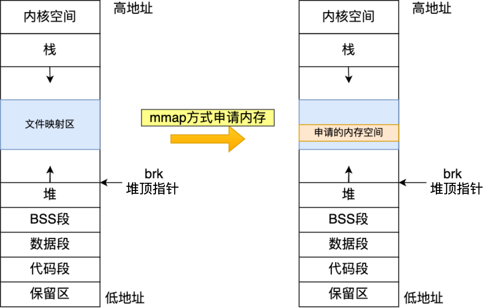

什么场景下 malloc() 会通过 brk() 分配内存？又是什么场景下通过 mmap() 分配内存？

malloc() 源码里默认定义了一个阈值：

- 如果用户分配的内存小于 128 KB，则通过 brk() 申请内存；
- 如果用户分配的内存大于 128 KB，则通过 mmap() 申请内存。

注意，不同的 glibc 版本定义的阈值也是不同的。

#### malloc() 分配的是物理内存吗？

不是的，malloc() 分配的是虚拟内存。

如果分配后的虚拟内存没有被访问的话，虚拟内存是不会映射到物理内存的，这样就不会占用物理内存了。

只有在访问已分配的虚拟地址空间的时候，操作系统通过查找页表，发现虚拟内存对应的页没有在物理内存中，就会触发缺页中断，然后操作系统会建立虚拟内存和物理内存之间的映射关系。

#### malloc(1) 会分配多大的虚拟内存？

malloc() 在分配内存的时候，并不是老老实实按用户预期申请的字节数来分配内存空间大小，而是会预分配更大的空间作为内存池。具体会预分配多大的空间，跟 malloc 使用的内存管理器有关系。

#### free 释放内存，会归还给操作系统吗？

通过 free 释放内存后，堆内存还是存在的，并没有归还给操作系统。这是因为与其把这 1 字节释放给操作系统，不如先缓存着放进 malloc 的内存池里，当进程再次申请 1 字节的内存时就可以直接复用，这样速度快了很多。

当然，当进程退出后，操作系统就会回收进程的所有资源。上面说的 free 内存后堆内存还存在，是针对 malloc 通过 brk() 方式申请的内存的情况。如果 malloc 通过 mmap 方式申请的内存，free 释放内存后就会归归还给操作系统。

#### 为什么不全部使用 mmap 来分配内存？

因为向操作系统申请内存，是要通过系统调用的，执行系统调用是要进入内核态的，然后在回到用户态，运行态的切换会耗费不少时间。所以，申请内存的操作应该避免频繁的系统调用，如果都用 mmap 来分配内存，等于每次都要执行系统调用。

另外，因为 mmap 分配的内存每次释放的时候，都会归还给操作系统，于是每次 mmap 分配的虚拟地址都是缺页状态的，然后在第一次访问该虚拟地址的时候，就会触发缺页中断。

也就是说，频繁通过 mmap 分配的内存话，不仅每次都会发生运行态的切换，还会发生缺页中断（在第一次访问虚拟地址后），这样会导致 CPU 消耗较大。

为了改进这两个问题，malloc 通过 brk() 系统调用在堆空间申请内存的时候，由于堆空间是连续的，所以直接预分配更大的内存来作为内存池，当内存释放的时候，就缓存在内存池中。

等下次在申请内存的时候，就直接从内存池取出对应的内存块就行了，而且可能这个内存块的虚拟地址与物理地址的映射关系还存在，这样不仅减少了系统调用的次数，也减少了缺页中断的次数，这将大大降低 CPU 的消耗。

#### 既然 brk 那么牛逼，为什么不全部使用 brk 来分配？

如果我们连续申请了 10k，20k，30k 这三片内存，如果 10k 和 20k 这两片释放了，变为了空闲内存空间，如果下次申请的内存小于 30k，那么就可以重用这个空闲内存空间。

但是如果下次申请的内存大于 30k，没有可用的空闲内存空间，必须向 OS 申请，实际使用内存继续增大。

因此，随着系统频繁地 malloc 和 free ，尤其对于小块内存，堆内将产生越来越多不可用的碎片，导致“内存泄露”。而这种“泄露”现象使用 valgrind 是无法检测出来的。

所以，malloc 实现中，充分考虑了 brk 和 mmap 行为上的差异及优缺点，默认分配大块内存 (128KB) 才使用 mmap 分配内存空间。

#### free() 函数只传入一个内存地址，为什么能知道要释放多大的内存？

malloc 返回给用户态的内存起始地址比进程的堆空间起始地址多了 16 字节，这个多出来的 16 字节就是保存了该内存块的描述信息，比如有该内存块的大小。

这样当执行 free() 函数时，free 会对传入进来的内存地址向左偏移 16 字节，然后从这个 16 字节的分析出当前的内存块的大小，自然就知道要释放多大的内存了。

### 内存满了，会发生什么？

#### 内存分配的过程是怎样的？

应用程序通过 malloc 函数申请内存的时候，实际上申请的是虚拟内存，此时并不会分配物理内存。

当应用程序读写了这块虚拟内存，CPU 就会去访问这个虚拟内存， 这时会发现这个虚拟内存没有映射到物理内存， CPU 就会产生缺页中断，进程会从用户态切换到内核态，并将缺页中断交给内核的 Page Fault Handler （缺页中断函数）处理。

缺页中断处理函数会看是否有空闲的物理内存，如果有，就直接分配物理内存，并建立虚拟内存与物理内存之间的映射关系。

如果没有空闲的物理内存，那么内核就会开始进行回收内存的工作，回收的方式主要是两种：直接内存回收和后台内存回收。

- 后台内存回收（kswapd）：在物理内存紧张的时候，会唤醒 kswapd 内核线程来回收内存，这个回收内存的过程异步的，不会阻塞进程的执行。
- 直接内存回收（direct reclaim）：如果后台异步回收跟不上进程内存申请的速度，就会开始直接回收，这个回收内存的过程是同步的，会阻塞进程的执行。

如果直接内存回收后，空闲的物理内存仍然无法满足此次物理内存的申请，那么内核就会放最后的大招了 ——触发 OOM （Out of Memory）机制。

OOM Killer 机制会根据算法选择一个占用物理内存较高的进程，然后将其杀死，以便释放内存资源，如果物理内存依然不足，OOM Killer 会继续杀死占用物理内存较高的进程，直到释放足够的内存位置。

#### 哪些内存可以被回收？

系统内存紧张的时候，就会进行回收内存的工作，那具体哪些内存是可以被回收的呢？

主要有两类内存可以被回收，而且它们的回收方式也不同。

- 文件页（File-backed Page）：内核缓存的磁盘数据（Buffer）和内核缓存的文件数据（Cache）都叫作文件页。大部分文件页，都可以直接释放内存，以后有需要时，再从磁盘重新读取就可以了。而那些被应用程序修改过，并且暂时还没写入磁盘的数据（也就是脏页），就得先写入磁盘，然后才能进行内存释放。所以，回收干净页的方式是直接释放内存，回收脏页的方式是先写回磁盘后再释放内存。
- 匿名页（Anonymous Page）：这部分内存没有实际载体，不像文件缓存有硬盘文件这样一个载体，比如堆、栈数据等。这部分内存很可能还要再次被访问，所以不能直接释放内存，它们回收的方式是通过 Linux 的 Swap 机制，Swap 会把不常访问的内存先写到磁盘中，然后释放这些内存，给其他更需要的进程使用。再次访问这些内存时，重新从磁盘读入内存就可以了。

文件页和匿名页的回收都是基于 LRU 算法，也就是优先回收不常访问的内存。LRU 回收算法，实际上维护着 active 和 inactive 两个双向链表，其中：

- active_list 活跃内存页链表，这里存放的是最近被访问过（活跃）的内存页；
- inactive_list 不活跃内存页链表，这里存放的是很少被访问（非活跃）的内存页；

越接近链表尾部，就表示内存页越不常访问。这样，在回收内存时，系统就可以根据活跃程度，优先回收不活跃的内存。

#### 回收内存带来的性能影响

在前面我们知道了回收内存有两种方式。

- 一种是后台内存回收，也就是唤醒 kswapd 内核线程，这种方式是异步回收的，不会阻塞进程。
- 一种是直接内存回收，这种方式是同步回收的，会阻塞进程，这样就会造成很长时间的延迟，以及系统的 CPU 利用率会升高，最终引起系统负荷飙高。

可被回收的内存类型有文件页和匿名页：

- 文件页的回收：对于干净页是直接释放内存，这个操作不会影响性能，而对于脏页会先写回到磁盘再释放内存，这个操作会发生磁盘 I/O 的，这个操作是会影响系统性能的。
- 匿名页的回收：如果开启了 Swap 机制，那么 Swap 机制会将不常访问的匿名页换出到磁盘中，下次访问时，再从磁盘换入到内存中，这个操作是会影响系统性能的。

可以看到，回收内存的操作基本都会发生磁盘 I/O 的，如果回收内存的操作很频繁，意味着磁盘 I/O 次数会很多，这个过程势必会影响系统的性能，整个系统给人的感觉就是很卡。

##### 调整文件页和匿名页的回收倾向

从文件页和匿名页的回收操作来看，文件页的回收操作对系统的影响相比匿名页的回收操作会少一点，因为文件页对于干净页回收是不会发生磁盘 I/O 的，而匿名页的 Swap 换入换出这两个操作都会发生磁盘 I/O。

##### 尽早触发 kswapd 内核线程异步回收内存

可以使用`sar -B 1`命令来观察系统的直接内存回收和后台内存回收的指标，其中有三个字段：

- pgscank/s ：kswapd(后台回收线程) 每秒扫描的 page 个数。
- pgscand/s ：应用程序在内存申请过程中每秒直接扫描的 page 个数。
- pgsteal/s ：扫描的 page 中每秒被回收的个数（pgscank+pgscand）。

如果系统时不时发生抖动，并且在抖动的时间段里如果通过`sar -B`观察到 pgscand 数值很大，那大概率是因为「直接内存回收」导致的。

针对这个问题，解决的办法就是，可以通过尽早的触发「后台内存回收」来避免应用程序进行直接内存回收。那么什么条件下才能触发 kswapd 内核线程回收内存呢？

内核定义了三个内存阈值（watermark，也称为水位），用来衡量当前剩余内存（pages_free）是否充裕或者紧张，分别是：

- 页最小阈值（pages_min）；
- 页低阈值（pages_low）；
- 页高阈值（pages_high）；

这三个内存阈值会划分为四种内存使用情况，如下图：


kswapd 会定期扫描内存的使用情况，根据剩余内存（pages_free）的情况来进行内存回收的工作。

- 图中绿色部分：如果剩余内存（pages_free）大于 页高阈值（pages_high），说明剩余内存是充足的；
- 图中蓝色部分：如果剩余内存（pages_free）在页高阈值（pages_high）和页低阈值（pages_low）之间，说明内存有一定压力，但还可以满足应用程序申请内存的请求；
- 图中橙色部分：如果剩余内存（pages_free）在页低阈值（pages_low）和页最小阈值（pages_min）之间，说明内存压力比较大，剩余内存不多了。这时 kswapd0 会执行内存回收，直到剩余内存大于高阈值（pages_high）为止。虽然会触发内存回收，但是不会阻塞应用程序，因为两者关系是异步的。
- 图中红色部分：如果剩余内存（pages_free）小于页最小阈值（pages_min），说明用户可用内存都耗尽了，此时就会触发直接内存回收，这时应用程序就会被阻塞，因为两者关系是同步的。

可以看到，当剩余内存页（pages_free）小于页低阈值（pages_low），就会触发 kswapd 进行后台回收，然后 kswapd 会一直回收到剩余内存页（pages_free）大于页高阈值（pages_high）。

也就是说 kswapd 的活动空间只有 pages_low 与 pages_min 之间的这段区域，如果剩余内存低于了 pages_min 会触发直接内存回收，高于了 pages_high 又不会唤醒 kswapd。

页低阈值（pages_low）可以通过内核选项`/proc/sys/vm/min_free_kbytes`（该参数代表系统所保留空闲内存的最低限）来间接设置。这时可以增大`min_free_kbytes`这个配置选项来及早地触发后台回收，然后继续观察 pgscand 是否会降为 0。

增大了`min_free_kbytes`配置后，这会使得系统预留过多的空闲内存，从而在一定程度上降低了应用程序可使用的内存量，这在一定程度上浪费了内存。极端情况下设置 `min_free_kbytes`接近实际物理内存大小时，留给应用程序的内存就会太少而可能会频繁地导致 OOM 的发生。

所以在调整`min_free_kbytes`之前，需要先思考一下，应用程序更加关注什么，如果关注延迟那就适当地增大`min_free_kbytes`，如果关注内存的使用量那就适当地调小 `min_free_kbytes`。

##### NUMA 架构下的内存回收策略

说 NUMA 架构前，先给大家说说 SMP 架构，这两个架构都是针对 CPU 的。

SMP 指的是一种多个 CPU 处理器共享资源的电脑硬件架构，也就是说每个 CPU 地位平等，它们共享相同的物理资源，包括总线、内存、IO、操作系统等。每个 CPU 访问内存所用时间都是相同的，因此，这种系统也被称为一致存储访问结构（UMA，Uniform Memory Access）。

随着 CPU 处理器核数的增多，多个 CPU 都通过一个总线访问内存，这样总线的带宽压力会越来越大，同时每个 CPU 可用带宽会减少，这也就是 SMP 架构的问题。

为了解决 SMP 架构的问题，就研制出了 NUMA 结构，即非一致存储访问结构（Non-uniform memory access，NUMA）。

NUMA 架构将每个 CPU 进行了分组，每一组 CPU 用 Node 来表示，一个 Node 可能包含多个 CPU 。每个 Node 有自己独立的资源，包括内存、IO 等，每个 Node 之间可以通过互联模块总线（QPI）进行通信，所以，也就意味着每个 Node 上的 CPU 都可以访问到整个系统中的所有内存。但是，访问远端 Node 的内存比访问本地内存要耗时很多。

在 NUMA 架构下，当某个 Node 内存不足时，系统可以从其他 Node 寻找空闲内存，也可以从本地内存中回收内存。

具体选哪种模式，可以通过`/proc/sys/vm/zone_reclaim_mode`来控制。它支持以下几个选项：

- 0 （默认值）：在回收本地内存之前，在其他 Node 寻找空闲内存；
- 1：只回收本地内存；
- 2：只回收本地内存，在本地回收内存时，可以将文件页中的脏页写回硬盘，以回收内存。
- 4：只回收本地内存，在本地回收内存时，可以用 swap 方式回收内存。

在使用 NUMA 架构的服务器，如果系统出现还有一半内存的时候，却发现系统频繁触发「直接内存回收」，导致了影响了系统性能，那么大概率是因为`zone_reclaim_mode`没有设置为 0 ，导致当本地内存不足的时候，只选择回收本地内存的方式，而不去使用其他 Node 的空闲内存。

虽然说访问远端 Node 的内存比访问本地内存要耗时很多，但是相比内存回收的危害而言，访问远端 Node 的内存带来的性能影响还是比较小的。因此，`zone_reclaim_mode`一般建议设置为 0。

#### 如何保护一个进程不被 OOM 杀掉呢？

在系统空闲内存不足的情况，进程申请了一个很大的内存，如果直接内存回收都无法回收出足够大的空闲内存，那么就会触发 OOM 机制，内核就会根据算法选择一个进程杀掉。

Linux 到底是根据什么标准来选择被杀的进程呢？这就要提到一个在 Linux 内核里有一个`oom_badness()`函数，它会把系统中可以被杀掉的进程扫描一遍，并对每个进程打分，得分最高的进程就会被首先杀掉。

进程得分的结果受下面这两个方面影响：

- 第一，进程已经使用的物理内存页面数。
- 第二，每个进程的 OOM 校准值 oom_score_adj。它是可以通过`proc/[pid]/oom_score_adj`配置的。我们可以在设置 -1000 到 1000 之间的任意一个数值，调整进程被 OOM Kill 的几率。

用「系统总的可用页面数」乘以 「OOM 校准值 oom_score_adj」再除以 1000，最后再加上进程已经使用的物理页面数，计算出来的值越大，那么这个进程被 OOM Kill 的几率也就越大。

每个进程的 oom_score_adj 默认值都为 0，所以最终得分跟进程自身消耗的内存有关，消耗的内存越大越容易被杀掉。我们可以通过调整 oom_score_adj 的数值，来改成进程的得分结果：

- 如果你不想某个进程被首先杀掉，那你可以调整该进程的 oom_score_adj，从而改变这个进程的得分结果，降低该进程被 OOM 杀死的概率。
- 如果你想某个进程无论如何都不能被杀掉，那你可以将 oom_score_adj 配置为 -1000。

我们最好将一些很重要的系统服务的 oom_score_adj 配置为 -1000，比如 sshd，因为这些系统服务一旦被杀掉，我们就很难再登陆进系统了。

但是，不建议将我们自己的业务程序的 oom_score_adj 设置为 -1000，因为业务程序一旦发生了内存泄漏，而它又不能被杀掉，这就会导致随着它的内存开销变大，OOM killer 不停地被唤醒，从而把其他进程一个个给杀掉。

### 在 4GB 物理内存的机器上，申请 8G 内存会怎么样？

这个问题在没有前置条件下，就说出答案就是耍流氓。这个问题要考虑三个前置条件：

- 操作系统是 32 位的，还是 64 位的？
- 申请完 8G 内存后会不会被使用？
- 操作系统有没有使用 Swap 机制？

#### 操作系统虚拟内存大小

应用程序通过 malloc 函数申请内存的时候，实际上申请的是虚拟内存，此时并不会分配物理内存。

当应用程序读写了这块虚拟内存，CPU 就会去访问这个虚拟内存， 这时会发现这个虚拟内存没有映射到物理内存， CPU 就会产生缺页中断，进程会从用户态切换到内核态，并将缺页中断交给内核的 Page Fault Handler （缺页中断函数）处理。

缺页中断处理函数会看是否有空闲的物理内存：

- 如果有，就直接分配物理内存，并建立虚拟内存与物理内存之间的映射关系。
- 如果没有空闲的物理内存，那么内核就会开始进行回收内存的工作，如果回收内存工作结束后，空闲的物理内存仍然无法满足此次物理内存的申请，那么内核就会放最后的大招了触发 OOM （Out of Memory）机制。

32 位操作系统和 64 位操作系统的虚拟地址空间大小是不同的，在 Linux 操作系统中，虚拟地址空间的内部又被分为内核空间和用户空间两部分。

- 32 位系统的内核空间占用 1G，位于最高处，剩下的 3G 是用户空间；
- 64 位系统的内核空间和用户空间都是 128T，分别占据整个内存空间的最高和最低处，剩下的中间部分是未定义的。

##### 32 位系统的场景

因为 32 位操作系统，进程最多只能申请 3 GB 大小的虚拟内存空间，所以进程申请 8GB 内存的话，在申请虚拟内存阶段就会失败（我手上没有 32 位操作系统测试，我估计失败的错误是 cannot allocate memory，也就是无法申请内存失败）。

##### 64 位系统的场景

64 位操作系统，进程可以使用 128 TB 大小的虚拟内存空间，所以进程申请 8GB 内存是没问题的，因为进程申请内存是申请虚拟内存，只要不读写这个虚拟内存，操作系统就不会分配物理内存。

#### Swap 机制的作用

如果申请物理内存大小超过了空闲物理内存大小，就要看操作系统有没有开启 Swap 机制：

- 如果没有开启 Swap 机制，程序就会直接 OOM；
- 如果有开启 Swap 机制，程序可以正常运行。

什么是 Swap 机制？

当系统的物理内存不够用的时候，就需要将物理内存中的一部分空间释放出来，以供当前运行的程序使用。那些被释放的空间可能来自一些很长时间没有什么操作的程序，这些被释放的空间会被临时保存到磁盘，等到那些程序要运行时，再从磁盘中恢复保存的数据到内存中。

另外，当内存使用存在压力的时候，会开始触发内存回收行为，会把这些不常访问的内存先写到磁盘中，然后释放这些内存，给其他更需要的进程使用。再次访问这些内存时，重新从磁盘读入内存就可以了。

这种，将内存数据换出磁盘，又从磁盘中恢复数据到内存的过程，就是 Swap 机制负责的。

Swap 就是把一块磁盘空间或者本地文件，当成内存来使用，它包含换出和换入两个过程：

- 换出（Swap Out） ，是把进程暂时不用的内存数据存储到磁盘中，并释放这些数据占用的内存；
- 换入（Swap In），是在进程再次访问这些内存的时候，把它们从磁盘读到内存中来；

使用 Swap 机制优点是，应用程序实际可以使用的内存空间将远远超过系统的物理内存。由于硬盘空间的价格远比内存要低，因此这种方式无疑是经济实惠的。当然，频繁地读写硬盘，会显著降低操作系统的运行速率，这也是 Swap 的弊端。

Linux 中的 Swap 机制会在内存不足和内存闲置的场景下触发：

- 内存不足：当系统需要的内存超过了可用的物理内存时，内核会将内存中不常使用的内存页交换到磁盘上为当前进程让出内存，保证正在执行的进程的可用性，这个内存回收的过程是强制的直接内存回收（Direct Page Reclaim）。直接内存回收是同步的过程，会阻塞当前申请内存的进程。
- 内存闲置：应用程序在启动阶段使用的大量内存在启动后往往都不会使用，通过后台运行的守护进程（kSwapd），我们可以将这部分只使用一次的内存交换到磁盘上为其他内存的申请预留空间。kSwapd 是 Linux 负责页面置换（Page replacement）的守护进程，它也是负责交换闲置内存的主要进程，它会在空闲内存低于一定水位时，回收内存页中的空闲内存保证系统中的其他进程可以尽快获得申请的内存。kSwapd 是后台进程，所以回收内存的过程是异步的，不会阻塞当前申请内存的进程。

Linux 提供了两种不同的方法启用 Swap，分别是 Swap 分区（Swap Partition）和 Swap 文件（Swapfile）：

- Swap 分区是硬盘上的独立区域，该区域只会用于交换分区，其他的文件不能存储在该区域上，我们可以使用`wapon -s`令查看当前系统上的交换分区；
- Swap 文件是文件系统中的特殊文件，它与文件系统中的其他文件也没有太多的区别；

Swap 换入换出的是什么类型的内存？

内核缓存的文件数据，因为都有对应的磁盘文件，所以在回收文件数据的时候， 直接写回到对应的文件就可以了。

但是像进程的堆、栈数据等，它们是没有实际载体，这部分内存被称为匿名页。而且这部分内存很可能还要再次被访问，所以不能直接释放内存，于是就需要有一个能保存匿名页的磁盘载体，这个载体就是 Swap 分区。

匿名页回收的方式是通过 Linux 的 Swap 机制，Swap 会把不常访问的内存先写到磁盘中，然后释放这些内存，给其他更需要的进程使用。再次访问这些内存时，重新从磁盘读入内存就可以了。

### 如何避免预读失效和缓存污染的问题？

问题其实是操作系统在读磁盘的时候会额外多读一些到内存中，但是最后这些数据也没用到，有什么改善的方法？而且批量读数据的时候，可能会把热点数据挤出去，这个又有什么改善的方法吗？

其实这两个问题是在问如何改进 LRU 算法。因为传统的 LRU 算法存在这两个问题：

- 「预读失效」导致缓存命中率下降；
- 「缓存污染」导致缓存命中率下降。

Redis 的缓存淘汰算法则是通过实现 LFU 算法来避免「缓存污染」而导致缓存命中率下降的问题（Redis 没有预读机制）。

MySQL 和 Linux 操作系统是通过改进 LRU 算法来避免「预读失效和缓存污染」而导致缓存命中率下降的问题。

#### Linux 和 MySQL 的缓存

##### Linux 操作系统的缓存

在应用程序读取文件的数据的时候，Linux 操作系统是会对读取的文件数据进行缓存的，会缓存在文件系统中的 Page Cache（如下图中的页缓存）。

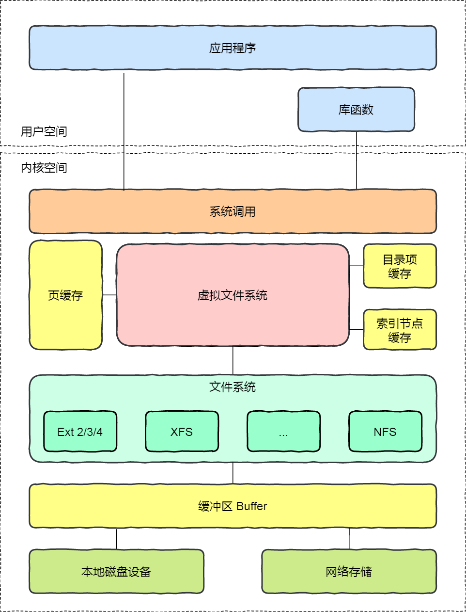

Page Cache 属于内存空间里的数据，由于内存访问比磁盘访问快很多，在下一次访问相同的数据就不需要通过磁盘 I/O 了，命中缓存就直接返回数据即可。因此，Page Cache 起到了加速访问数据的作用。

##### MySQL 的缓存

MySQL 的数据是存储在磁盘里的，为了提升数据库的读写性能，Innodb 存储引擎设计了一个缓冲池（Buffer Pool），Buffer Pool 属于内存空间里的数据。

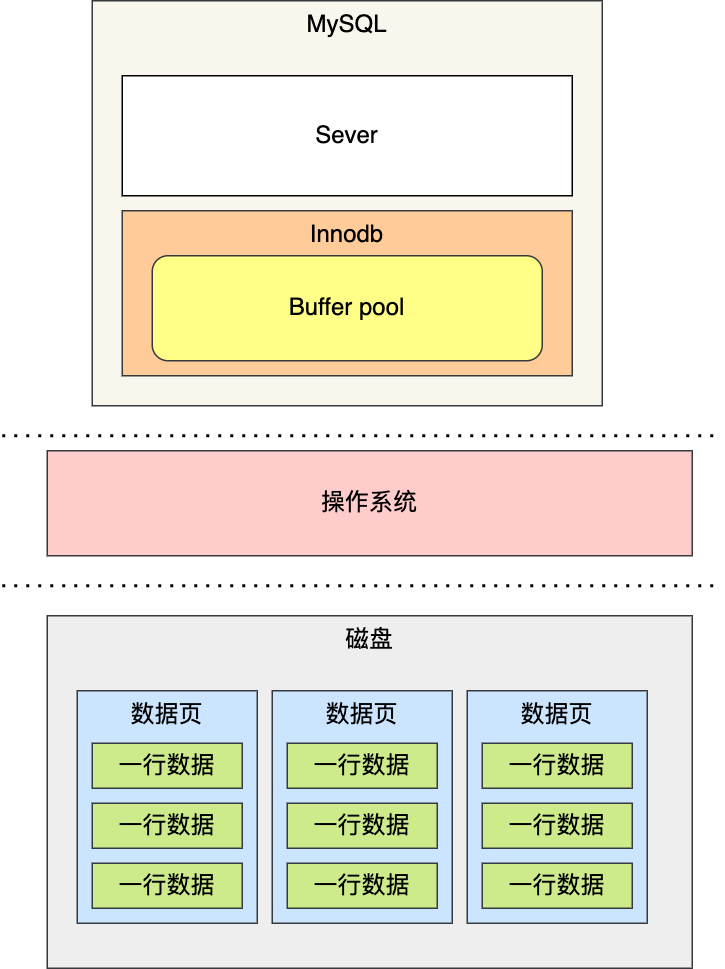

有了缓冲池后：

- 当读取数据时，如果数据存在于 Buffer Pool 中，客户端就会直接读取 Buffer Pool 中的数据，否则再去磁盘中读取。
- 当修改数据时，首先是修改 Buffer Pool 中数据所在的页，然后将其页设置为脏页，最后由后台线程将脏页写入到磁盘。

#### 传统 LRU 是如何管理内存数据的？

Linux 的 Page Cache 和 MySQL 的 Buffer Pool 的大小是有限的，并不能无限的缓存数据，对于一些频繁访问的数据我们希望可以一直留在内存中，而一些很少访问的数据希望可以在某些时机可以淘汰掉，从而保证内存不会因为满了而导致无法再缓存新的数据，同时还能保证常用数据留在内存中。

要实现这个，最容易想到的就是 LRU（Least recently used）算法。

LRU 算法一般是用「链表」作为数据结构来实现的，链表头部的数据是最近使用的，而链表末尾的数据是最久没被使用的。那么，当空间不够了，就淘汰最久没被使用的节点，也就是链表末尾的数据，从而腾出内存空间。

因为 Linux 的 Page Cache 和 MySQL 的 Buffer Pool 缓存的基本数据单位都是页（Page）单位，所以后续以「页」名称代替「数据」。

传统的 LRU 算法的实现思路是这样的：

- 当访问的页在内存里，就直接把该页对应的 LRU 链表节点移动到链表的头部。
- 当访问的页不在内存里，除了要把该页放入到 LRU 链表的头部，还要淘汰 LRU 链表末尾的页。

#### 预读失效，怎么办？

##### 什么是预读机制？

Linux 操作系统为基于 Page Cache 的读缓存机制提供预读机制，一个例子是：

- 应用程序只想读取磁盘上文件 A 的 offset 为 0-3KB 范围内的数据，由于磁盘的基本读写单位为 block（4KB），于是操作系统至少会读 0-4KB 的内容，这恰好可以在一个 page 中装下。
- 但是操作系统出于空间局部性原理（靠近当前被访问数据的数据，在未来很大概率会被访问到），会选择将磁盘块 offset [4KB,8KB)、[8KB,12KB) 以及 [12KB,16KB) 都加载到内存，于是额外在内存中申请了 3 个 page；

预读机制带来的好处就是减少了 磁盘 I/O 次数，提高系统磁盘 I/O 吞吐量。MySQL Innodb 存储引擎的 Buffer Pool 也有类似的预读机制，MySQL 从磁盘加载页时，会提前把它相邻的页一并加载进来，目的是为了减少磁盘 IO。

##### 预读失效会带来什么问题？

如果这些被提前加载进来的页，并没有被访问，相当于这个预读工作是白做了，这个就是预读失效。

如果使用传统的 LRU 算法，就会把「预读页」放到 LRU 链表头部，而当内存空间不够的时候，还需要把末尾的页淘汰掉。

如果这些「预读页」如果一直不会被访问到，就会出现一个很奇怪的问题，不会被访问的预读页却占用了 LRU 链表前排的位置，而末尾淘汰的页，可能是热点数据，这样就大大降低了缓存命中率 。

##### 如何避免预读失效造成的影响？

我们不能因为害怕预读失效，而将预读机制去掉，大部分情况下，空间局部性原理还是成立的。

要避免预读失效带来影响，最好就是让预读页停留在内存里的时间要尽可能的短，让真正被访问的页才移动到 LRU 链表的头部，从而保证真正被读取的热数据留在内存里的时间尽可能长。

Linux 操作系统和 MySQL Innodb 通过改进传统 LRU 链表来避免预读失效带来的影响，具体的改进分别如下：

- Linux 操作系统实现两个了 LRU 链表：活跃 LRU 链表（active_list）和非活跃 LRU 链表（inactive_list）；
- MySQL 的 Innodb 存储引擎是在一个 LRU 链表上划分来 2 个区域：young 区域 和 old 区域。

这两个改进方式，设计思想都是类似的，都是将数据分为了冷数据和热数据，然后分别进行 LRU 算法。不再像传统的 LRU 算法那样，所有数据都只用一个 LRU 算法管理。

Linux 操作系统实现两个了 LRU 链表：

- active list 活跃内存页链表，这里存放的是最近被访问过（活跃）的内存页；
- inactive list 不活跃内存页链表，这里存放的是很少被访问（非活跃）的内存页；

有了这两个 LRU 链表后，预读页就只需要加入到 inactive list 区域的头部，当页被真正访问的时候，才将页插入 active list 的头部。如果预读的页一直没有被访问，就会从 inactive list 移除，这样就不会影响 active list 中的热点数据。

MySQL 的 Innodb 存储引擎是在一个 LRU 链表上划分来 2 个区域，young 区域 和 old 区域。

young 区域在 LRU 链表的前半部分，old 区域则是在后半部分，这两个区域都有各自的头和尾节点，young 区域与 old 区域在 LRU 链表中的占比关系并不是一比一的关系，而是 63:37（默认比例）的关系。

划分这两个区域后，预读的页就只需要加入到 old 区域的头部，当页被真正访问的时候，才将页插入 young 区域的头部。如果预读的页一直没有被访问，就会从 old 区域移除，这样就不会影响 young 区域中的热点数据。

#### 缓存污染，怎么办？

##### 什么是缓存污染？

虽然 Linux （实现两个 LRU 链表）和 MySQL （划分两个区域）通过改进传统的 LRU 数据结构，避免了预读失效带来的影响。

但是如果还是使用「只要数据被访问一次，就将数据加入到活跃 LRU 链表头部（或者 young 区域）」这种方式的话，那么还存在缓存污染的问题。

当我们在批量读取数据的时候，由于数据被访问了一次，这些大量数据都会被加入到「活跃 LRU 链表」里，然后之前缓存在活跃 LRU 链表（或者 young 区域）里的热点数据全部都被淘汰了，如果这些大量的数据在很长一段时间都不会被访问的话，那么整个活跃 LRU 链表（或者 young 区域）就被污染了。

##### 缓存污染会带来什么问题？

缓存污染带来的影响就是很致命的，等这些热数据又被再次访问的时候，由于缓存未命中，就会产生大量的磁盘 I/O，系统性能就会急剧下降。

##### 怎么避免缓存污染造成的影响？

前面的 LRU 算法只要数据被访问一次，就将数据加入活跃 LRU 链表（或者 young 区域），这种 LRU 算法进入活跃 LRU 链表的门槛太低了！正式因为门槛太低，才导致在发生缓存污染的时候，很容就将原本在活跃 LRU 链表里的热点数据淘汰了。

所以，只要我们提高进入到活跃 LRU 链表（或者 young 区域）的门槛，就能有效地保证活跃 LRU 链表（或者 young 区域）里的热点数据不会被轻易替换掉。

Linux 操作系统和 MySQL Innodb 存储引擎分别是这样提高门槛的：

- Linux 操作系统：在内存页被访问第二次的时候，才将页从 inactive list 升级到 active list 里。
- MySQL Innodb：在内存页被访问第二次的时候，并不会马上将该页从 old 区域升级到 young 区域，因为还要进行停留在 old 区域的时间判断：
	- 如果第二次的访问时间与第一次访问的时间在 1 秒内（默认值），那么该页就不会被从 old 区域升级到 young 区域；
	- 如果第二次的访问时间与第一次访问的时间超过 1 秒，那么该页就会从 old 区域升级到 young 区域；

提高了进入活跃 LRU 链表（或者 young 区域）的门槛后，就很好了避免缓存污染带来的影响。

在批量读取数据时候，如果这些大量数据只会被访问一次，那么它们就不会进入到活跃 LRU 链表（或者 young 区域），也就不会把热点数据淘汰，只会待在非活跃 LRU 链表（或者 old 区域）中，后续很快也会被淘汰。

## 进程管理

### 进程、线程基础知识

#### 进程

我们编写的代码只是一个存储在硬盘的静态文件，通过编译后就会生成二进制可执行文件，当我们运行这个可执行文件后，它会被装载到内存中，接着 CPU 会执行程序中的每一条指令，那么这个运行中的程序，就被称为「进程」（Process）。

进程的状态变迁：

- NULL -> 创建状态：一个新进程被创建时的第一个状态；
- 创建状态 -> 就绪状态：当进程被创建完成并初始化后，一切就绪准备运行时，变为就绪状态，这个过程是很快的；
- 就绪态 -> 运行状态：处于就绪状态的进程被操作系统的进程调度器选中后，就分配给 CPU 正式运行该进程；
- 运行状态 -> 结束状态：当进程已经运行完成或出错时，会被操作系统作结束状态处理；
- 运行状态 -> 就绪状态：处于运行状态的进程在运行过程中，由于分配给它的运行时间片用完，操作系统会把该进程变为就绪态，接着从就绪态选中另外一个进程运行；
- 运行状态 -> 阻塞状态：当进程请求某个事件且必须等待时，例如请求 I/O 事件；
- 阻塞状态 -> 就绪状态：当进程要等待的事件完成时，它从阻塞状态变到就绪状态；

如果有大量处于阻塞状态的进程，进程可能会占用着物理内存空间，显然不是我们所希望的，毕竟物理内存空间是有限的，被阻塞状态的进程占用着物理内存就一种浪费物理内存的行为。

所以，在虚拟内存管理的操作系统中，通常会把阻塞状态的进程的物理内存空间换出到硬盘，等需要再次运行的时候，再从硬盘换入到物理内存。

那么，就需要一个新的状态，来描述进程没有占用实际的物理内存空间的情况，这个状态就是挂起状态。这跟阻塞状态是不一样，阻塞状态是等待某个事件的返回。

另外，挂起状态可以分为两种：

- 阻塞挂起状态：进程在外存（硬盘）并等待某个事件的出现；
- 就绪挂起状态：进程在外存（硬盘），但只要进入内存，即刻立刻运行；

在操作系统中，是用进程控制块（process control block，PCB）数据结构来描述进程的。PCB 是进程存在的唯一标识，这意味着一个进程的存在，必然会有一个 PCB，如果进程消失了，那么 PCB 也会随之消失。

PCB 具体包含什么信息呢？

进程描述信息：

- 进程标识符：标识各个进程，每个进程都有一个并且唯一的标识符；
- 用户标识符：进程归属的用户，用户标识符主要为共享和保护服务；

进程控制和管理信息：

- 进程当前状态，如 new、ready、running、waiting 或 blocked 等；
- 进程优先级：进程抢占 CPU 时的优先级；

资源分配清单：

- 有关内存地址空间或虚拟地址空间的信息，所打开文件的列表和所使用的 I/O 设备信息。

CPU 相关信息：

- CPU 中各个寄存器的值，当进程被切换时，CPU 的状态信息都会被保存在相应的 PCB 中，以便进程重新执行时，能从断点处继续执行。

每个 PCB 是如何组织的呢？

通常是通过链表的方式进行组织，把具有相同状态的进程链在一起，组成各种队列。比如：

- 将所有处于就绪状态的进程链在一起，称为就绪队列；
- 把所有因等待某事件而处于等待状态的进程链在一起就组成各种阻塞队列；
- 另外，对于运行队列在单核 CPU 系统中则只有一个运行指针了，因为单核 CPU 在某个时间，只能运行一个程序。

除了链接的组织方式，还有索引方式，它的工作原理：将同一状态的进程组织在一个索引表中，索引表项指向相应的 PCB，不同状态对应不同的索引表。一般会选择链表，因为可能面临进程创建，销毁等调度导致进程状态发生变化，所以链表能够更加灵活的插入和删除。

进程的创建、终止、阻塞、唤醒的过程，这些过程也就是进程的控制。

1. 创建进程

操作系统允许一个进程创建另一个进程，而且允许子进程继承父进程所拥有的资源。

创建进程的过程如下：

- 申请一个空白的 PCB，并向 PCB 中填写一些控制和管理进程的信息，比如进程的唯一标识等；
- 为该进程分配运行时所必需的资源，比如内存资源；
- 将 PCB 插入到就绪队列，等待被调度运行；

2. 终止进程

进程可以有 3 种终止方式：正常结束、异常结束以及外界干预（信号 kill 掉）。

当子进程被终止时，其在父进程处继承的资源应当还给父进程。而当父进程被终止时，该父进程的子进程就变为孤儿进程，会被 1 号进程收养，并由 1 号进程对它们完成状态收集工作。

终止进程的过程如下：

- 查找需要终止的进程的 PCB；
- 如果处于执行状态，则立即终止该进程的执行，然后将 CPU 资源分配给其他进程；
- 如果其还有子进程，则应将该进程的子进程交给 1 号进程接管；
- 将该进程所拥有的全部资源都归还给操作系统；
- 将其从 PCB 所在队列中删除；

3. 阻塞进程

当进程需要等待某一事件完成时，它可以调用阻塞语句把自己阻塞等待。而一旦被阻塞等待，它只能由另一个进程唤醒。

阻塞进程的过程如下：

- 找到将要被阻塞进程标识号对应的 PCB；
- 如果该进程为运行状态，则保护其现场，将其状态转为阻塞状态，停止运行；
- 将该 PCB 插入到阻塞队列中去；

4. 唤醒进程

进程由「运行」转变为「阻塞」状态是由于进程必须等待某一事件的完成，所以处于阻塞状态的进程是绝对不可能叫醒自己的。

如果某进程正在等待 I/O 事件，需由别的进程发消息给它，则只有当该进程所期待的事件出现时，才由发现者进程用唤醒语句叫醒它。

唤醒进程的过程如下：

- 在该事件的阻塞队列中找到相应进程的 PCB；
- 将其从阻塞队列中移出，并置其状态为就绪状态；
- 把该 PCB 插入到就绪队列中，等待调度程序调度；

进程的阻塞和唤醒是一对功能相反的语句，如果某个进程调用了阻塞语句，则必有一个与之对应的唤醒语句。

各个进程之间是共享 CPU 资源的，在不同的时候进程之间需要切换，让不同的进程可以在 CPU 执行，那么这个一个进程切换到另一个进程运行，称为进程的上下文切换。

先来看看 CPU 上下文切换，大多数操作系统都是多任务，通常支持大于 CPU 数量的任务同时运行。实际上，这些任务并不是同时运行的，只是因为系统在很短的时间内，让各个任务分别在 CPU 运行，于是就造成同时运行的错觉。任务是交给 CPU 运行的，那么在每个任务运行前，CPU 需要知道任务从哪里加载，又从哪里开始运行。

所以，操作系统需要事先帮 CPU 设置好 CPU 寄存器和程序计数器。

CPU 寄存器是 CPU 内部一个容量小，但是速度极快的内存（缓存）。程序计数器则是用来存储 CPU 正在执行的指令位置、或者即将执行的下一条指令位置。所以说，CPU 寄存器和程序计数是 CPU 在运行任何任务前，所必须依赖的环境，这些环境就叫做 CPU 上下文。

CPU 上下文切换就是先把前一个任务的 CPU 上下文（CPU 寄存器和程序计数器）保存起来，然后加载新任务的上下文到这些寄存器和程序计数器，最后再跳转到程序计数器所指的新位置，运行新任务。系统内核会存储保持下来的上下文信息，当此任务再次被分配给 CPU 运行时，CPU 会重新加载这些上下文，这样就能保证任务原来的状态不受影响，让任务看起来还是连续运行。

上面说到所谓的「任务」，主要包含进程、线程和中断。所以，可以根据任务的不同，把 CPU 上下文切换分成：进程上下文切换、线程上下文切换和中断上下文切换。

进程是由内核管理和调度的，所以进程的切换只能发生在内核态。进程的上下文切换不仅包含了虚拟内存、栈、全局变量等用户空间的资源，还包括了内核堆栈、寄存器等内核空间的资源。

通常，会把交换的信息保存在进程的 PCB，当要运行另外一个进程的时候，我们需要从这个进程的 PCB 取出上下文，然后恢复到 CPU 中，这使得这个进程可以继续执行，进程的上下文开销是很关键的，我们希望它的开销越小越好，这样可以使得进程可以把更多时间花费在执行程序上，而不是耗费在上下文切换。

发生进程上下文切换有哪些场景？

- 为了保证所有进程可以得到公平调度，CPU 时间被划分为一段段的时间片，这些时间片再被轮流分配给各个进程。这样，当某个进程的时间片耗尽了，进程就从运行状态变为就绪状态，系统从就绪队列选择另外一个进程运行；
- 进程在系统资源不足（比如内存不足）时，要等到资源满足后才可以运行，这个时候进程也会被挂起，并由系统调度其他进程运行；
- 当进程通过睡眠函数 sleep 这样的方法将自己主动挂起时，自然也会重新调度；
- 当有优先级更高的进程运行时，为了保证高优先级进程的运行，当前进程会被挂起，由高优先级进程来运行；
- 发生硬件中断时，CPU 上的进程会被中断挂起，转而执行内核中的中断服务程序。

#### 线程

线程是进程当中的一条执行流程。同一个进程内多个线程之间可以共享代码段、数据段、打开的文件等资源，但每个线程各自都有一套独立的寄存器和栈，这样可以确保线程的控制流是相对独立的。

线程的优点：

- 一个进程中可以同时存在多个线程；
- 各个线程之间可以并发执行；
- 各个线程之间可以共享地址空间和文件等资源；

线程的缺点：

- 当进程中的一个线程崩溃时，会导致其所属进程的所有线程崩溃（这里是针对 C/C++ 语言，Java语言中的线程奔溃不会造成进程崩溃）。

线程与进程的比较如下：

- 进程是资源（包括内存、打开的文件等）分配的单位，线程是 CPU 调度的单位；
- 进程拥有一个完整的资源平台，而线程只独享必不可少的资源，如寄存器和栈；
- 线程同样具有就绪、阻塞、执行三种基本状态，同样具有状态之间的转换关系；
- 线程能减少并发执行的时间和空间开销；

对于，线程相比进程能减少开销，体现在：

- 线程的创建时间比进程快，因为进程在创建的过程中，还需要资源管理信息，比如内存管理信息、文件管理信息，而线程在创建的过程中，不会涉及这些资源管理信息，而是共享它们；
- 线程的终止时间比进程快，因为线程释放的资源相比进程少很多；
- 同一个进程内的线程切换比进程切换快，因为线程具有相同的地址空间（虚拟内存共享），这意味着同一个进程的线程都具有同一个页表，那么在切换的时候不需要切换页表。而对于进程之间的切换，切换的时候要把页表给切换掉，而页表的切换过程开销是比较大的；
- 由于同一进程的各线程间共享内存和文件资源，那么在线程之间数据传递的时候，就不需要经过内核了，这就使得线程之间的数据交互效率更高了；

所谓操作系统的任务调度，实际上的调度对象是线程，而进程只是给线程提供了虚拟内存、全局变量等资源。线程上下文切换，当两个线程是属于同一个进程，因为虚拟内存是共享的，所以在切换时，虚拟内存这些资源就保持不动，只需要切换线程的私有数据、寄存器等不共享的数据。

主要有三种线程的实现方式：

- 用户线程（User Thread）：在用户空间实现的线程，不是由内核管理的线程，是由用户态的线程库来完成线程的管理；
- 内核线程（Kernel Thread）：在内核中实现的线程，是由内核管理的线程；
- 轻量级进程（LightWeight Process）：在内核中来支持用户线程；

用户线程是基于用户态的线程管理库来实现的，那么线程控制块（Thread Control Block, TCB） 也是在库里面来实现的，对于操作系统而言是看不到这个 TCB 的，它只能看到整个进程的 PCB。

所以，用户线程的整个线程管理和调度，操作系统是不直接参与的，而是由用户级线程库函数来完成线程的管理，包括线程的创建、终止、同步和调度等。用户级线程的模型，也就类似多个用户线程对应同一个内核线程。

用户线程的优点：

- 每个进程都需要有它私有的线程控制块（TCB）列表，用来跟踪记录它各个线程状态信息（PC、栈指针、寄存器），TCB 由用户级线程库函数来维护，可用于不支持线程技术的操作系统；
- 用户线程的切换也是由线程库函数来完成的，无需用户态与内核态的切换，所以速度特别快；

用户线程的缺点：

- 由于操作系统不参与线程的调度，如果一个线程发起了系统调用而阻塞，那进程所包含的用户线程都不能执行了。
- 当一个线程开始运行后，除非它主动地交出 CPU 的使用权，否则它所在的进程当中的其他线程无法运行，因为用户态的线程没法打断当前运行中的线程，它没有这个特权，只有操作系统才有，但是用户线程不是由操作系统管理的。
- 由于时间片分配给进程，故与其他进程比，在多线程执行时，每个线程得到的时间片较少，执行会比较慢；

内核线程是由操作系统管理的，线程对应的 TCB 自然是放在操作系统里的，这样线程的创建、终止和管理都是由操作系统负责。内核线程的模型，也就类似一个用户线程对应一个内核线程。

内核线程的优点：

- 在一个进程当中，如果某个内核线程发起系统调用而被阻塞，并不会影响其他内核线程的运行；
- 分配给线程，多线程的进程获得更多的 CPU 运行时间；

内核线程的缺点：

- 在支持内核线程的操作系统中，由内核来维护进程和线程的上下文信息，如 PCB 和 TCB；
- 线程的创建、终止和切换都是通过系统调用的方式来进行，因此对于系统来说，系统开销比较大；

轻量级进程（Light-weight process，LWP）是内核支持的用户线程，一个进程可有一个或多个 LWP，每个 LWP 是跟内核线程一对一映射的，也就是 LWP 都是由一个内核线程支持，而且 LWP 是由内核管理并像普通进程一样被调度。

在大多数系统中，LWP与普通进程的区别也在于它只有一个最小的执行上下文和调度程序所需的统计信息。一般来说，一个进程代表程序的一个实例，而 LWP 代表程序的执行线程，因为一个执行线程不像进程那样需要那么多状态信息，所以 LWP 也不带有这样的信息。

在 LWP 之上也是可以使用用户线程的，那么 LWP 与用户线程的对应关系就有三种：

1. 1 : 1 模式

一个线程对应到一个 LWP 再对应到一个内核线程。

- 优点：实现并行，当一个 LWP 阻塞，不会影响其他 LWP；
- 缺点：每一个用户线程，就产生一个内核线程，创建线程的开销较大。

2. N : 1 模式

多个用户线程对应一个 LWP 再对应一个内核线程，线程管理是在用户空间完成的，此模式中用户的线程对操作系统不可见。

- 优点：用户线程要开几个都没问题，且上下文切换发生用户空间，切换的效率较高；
- 缺点：一个用户线程如果阻塞了，则整个进程都将会阻塞，另外在多核 CPU 中，是没办法充分利用 CPU 的。

3. M : N 模式

根据前面的两个模型混搭一起，就形成 M:N 模型，该模型提供了两级控制，首先多个用户线程对应到多个 LWP，LWP 再一一对应到内核线程。

- 优点：综合了前两种优点，大部分的线程上下文发生在用户空间，且多个线程又可以充分利用多核 CPU 的资源。

#### 调度

进程都希望自己能够占用 CPU 进行工作，一旦操作系统把进程切换到运行状态，也就意味着该进程占用着 CPU 在执行，但是当操作系统把进程切换到其他状态时，那就不能在 CPU 中执行了，于是操作系统会选择下一个要运行的进程。选择一个进程运行这一功能是在操作系统中完成的，通常称为调度程序（scheduler）。

在进程的生命周期中，当进程从一个运行状态到另外一状态变化的时候，其实会触发一次调度。

比如，以下状态的变化都会触发操作系统的调度：

- 从就绪态 -> 运行态：当进程被创建时，会进入到就绪队列，操作系统会从就绪队列选择一个进程运行；
- 从运行态 -> 阻塞态：当进程发生 I/O 事件而阻塞时，操作系统必须选择另外一个进程运行；
- 从运行态 -> 结束态：当进程退出结束后，操作系统得从就绪队列选择另外一个进程运行；

因为，这些状态变化的时候，操作系统需要考虑是否要让新的进程给 CPU 运行，或者是否让当前进程从 CPU 上退出来而换另一个进程运行。

另外，如果硬件时钟提供某个频率的周期性中断，那么可以根据如何处理时钟中断 ，把调度算法分为两类：

- 非抢占式调度算法挑选一个进程，然后让该进程运行直到被阻塞，或者直到该进程退出，才会调用另外一个进程，也就是说不会理时钟中断这个事情。
- 抢占式调度算法挑选一个进程，然后让该进程只运行某段时间，如果在该时段结束时，该进程仍然在运行时，则会把它挂起，接着调度程序从就绪队列挑选另外一个进程。这种抢占式调度处理，需要在时间间隔的末端发生时钟中断，以便把 CPU 控制返回给调度程序进行调度，也就是常说的时间片机制。

调度原则如下：

- 原则一：如果运行的程序，发生了 I/O 事件的请求，那 CPU 使用率必然会很低，因为此时进程在阻塞等待硬盘的数据返回。这样的过程，势必会造成 CPU 突然的空闲。所以，为了提高 CPU 利用率，在这种发送 I/O 事件致使 CPU 空闲的情况下，调度程序需要从就绪队列中选择一个进程来运行。
- 原则二：有的程序执行某个任务花费的时间会比较长，如果这个程序一直占用着 CPU，会造成系统吞吐量（CPU 在单位时间内完成的进程数量）的降低。所以，要提高系统的吞吐率，调度程序要权衡长任务和短任务进程的运行完成数量。
- 原则三：从进程开始到结束的过程中，实际上是包含两个时间，分别是进程运行时间和进程等待时间，这两个时间总和就称为周转时间。进程的周转时间越小越好，如果进程的等待时间很长而运行时间很短，那周转时间就很长，这不是我们所期望的，调度程序应该避免这种情况发生。
- 原则四：处于就绪队列的进程，也不能等太久，当然希望这个等待的时间越短越好，这样可以使得进程更快的在 CPU 中执行。所以，就绪队列中进程的等待时间也是调度程序所需要考虑的原则。
- 原则五：对于鼠标、键盘这种交互式比较强的应用，我们当然希望它的响应时间越快越好，否则就会影响用户体验了。所以，对于交互式比较强的应用，响应时间也是调度程序需要考虑的原则。

针对上面的五种调度原则，总结成如下：

- CPU 利用率：调度程序应确保 CPU 是始终匆忙的状态，这可提高 CPU 的利用率；
- 系统吞吐量：吞吐量表示的是单位时间内 CPU 完成进程的数量，长作业的进程会占用较长的 CPU 资源，因此会降低吞吐量，相反，短作业的进程会提升系统吞吐量；
- 周转时间：周转时间是进程运行+阻塞时间+等待时间的总和，一个进程的周转时间越小越好；
- 等待时间：这个等待时间不是阻塞状态的时间，而是进程处于就绪队列的时间，等待的时间越长，用户越不满意；
- 响应时间：用户提交请求到系统第一次产生响应所花费的时间，在交互式系统中，响应时间是衡量调度算法好坏的主要标准。

不同的调度算法适用的场景也是不同的。下面介绍下单核 CPU 系统中常见的调度算法：

1. 先来先服务调度算法

先来后到，每次从就绪队列选择最先进入队列的进程，然后一直运行，直到进程退出或被阻塞，才会继续从队列中选择第一个进程接着运行。

这似乎很公平，但是当一个长作业先运行了，那么后面的短作业等待的时间就会很长，不利于短作业。对长作业有利，适用于 CPU 繁忙型作业的系统，而不适用于 I/O 繁忙型作业的系统。

2. 最短作业优先调度算法

它会优先选择运行时间最短的进程来运行，这有助于提高系统的吞吐量。

这显然对长作业不利，很容易造成一种极端现象。比如，一个长作业在就绪队列等待运行，而这个就绪队列有非常多的短作业，那么就会使得长作业不断的往后推，周转时间变长，致使长作业长期不会被运行。

3. 高响应比优先调度算法

每次进行进程调度时，先计算「响应比优先级」，然后把「响应比优先级」最高的进程投入运行，「响应比优先级」的计算公式：`优先权 = （等待时间+要求服务时间）/ 要求服务时间`，

从上面的公式，可以发现：

- 如果两个进程的「等待时间」相同时，「要求的服务时间」越短，「响应比」就越高，这样短作业的进程容易被选中运行；
- 如果两个进程「要求的服务时间」相同时，「等待时间」越长，「响应比」就越高，这就兼顾到了长作业进程，因为进程的响应比可以随时间等待的增加而提高，当其等待时间足够长时，其响应比便可以升到很高，从而获得运行的机会；

4. 时间片轮转调度算法

每个进程被分配一个时间段，称为时间片（Quantum），即允许该进程在该时间段中运行。

- 如果时间片用完，进程还在运行，那么将会把此进程从 CPU 释放出来，并把 CPU 分配给另外一个进程；
- 如果该进程在时间片结束前阻塞或结束，则 CPU 立即进行切换；

另外，时间片的长度就是一个很关键的点：

- 如果时间片设得太短会导致过多的进程上下文切换，降低了 CPU 效率；
- 如果设得太长又可能引起对短作业进程的响应时间变长。将

一般来说，时间片设为 20ms~50ms 通常是一个比较合理的折中值。

5. 最高优先级调度算法

对于多用户计算机系统，它们希望调度是有优先级的，即希望调度程序能从就绪队列中选择最高优先级的进程进行运行，进程的优先级可以分为，静态优先级和动态优先级：

- 静态优先级：创建进程时候，就已经确定了优先级了，然后整个运行时间优先级都不会变化；
- 动态优先级：根据进程的动态变化调整优先级，比如如果进程运行时间增加，则降低其优先级，如果进程等待时间（就绪队列的等待时间）增加，则升高其优先级，也就是随着时间的推移增加等待进程的优先级。

该算法也有两种处理优先级高的方法，非抢占式和抢占式：

- 非抢占式：当就绪队列中出现优先级高的进程，运行完当前进程，再选择优先级高的进程。
- 抢占式：当就绪队列中出现优先级高的进程，当前进程挂起，调度优先级高的进程运行。

但是依然有缺点，可能会导致低优先级的进程永远不会运行。

6. 多级反馈队列调度算法

多级反馈队列（Multilevel Feedback Queue）调度算法是「时间片轮转算法」和「最高优先级算法」的综合和发展。

顾名思义：

- 「多级」表示有多个队列，每个队列优先级从高到低，同时优先级越高时间片越短；
- 「反馈」表示如果有新的进程加入优先级高的队列时，立刻停止当前正在运行的进程，转而去运行优先级高的队列。

来看看，它是如何工作的：

- 设置了多个队列，赋予每个队列不同的优先级，每个队列优先级从高到低，同时优先级越高时间片越短；
- 新的进程会被放入到第一级队列的末尾，按先来先服务的原则排队等待被调度，如果在第一级队列规定的时间片没运行完成，则将其转入到第二级队列的末尾，以此类推，直至完成；
- 当较高优先级的队列为空，才调度较低优先级的队列中的进程运行。如果进程运行时，有新进程进入较高优先级的队列，则停止当前运行的进程并将其移入到原队列末尾，接着让较高优先级的进程运行；

可以发现，对于短作业可能可以在第一级队列很快被处理完。对于长作业，如果在第一级队列处理不完，可以移入下次队列等待被执行，虽然等待的时间变长了，但是运行时间也变更长了，所以该算法很好的兼顾了长短作业，同时有较好的响应时间。

### 进程间有哪些通信方式？

#### 管道

```bash
ps auxf | grep mysql
```

上面命令行里的「|」竖线就是一个管道，它的功能是将前一个命令`ps auxf`的输出，作为后一个命令`grep mysql`的输入，从这功能描述，可以看出管道传输数据是单向的，如果想相互通信，我们需要创建两个管道才行。同时，我们得知上面这种管道是没有名字，所以「|」表示的管道称为匿名管道，用完了就销毁。

管道还有另外一个类型是命名管道，也被叫做 FIFO，因为数据是先进先出的传输方式。在使用命名管道前，先需要通过`mkfifo`命令来创建，并且指定管道名字。

管道这种通信方式效率低，不适合进程间频繁地交换数据。

匿名管道的创建，需要通过下面这个系统调用：

```c
int pipe(int fd[2])
```

这里表示创建一个匿名管道，并返回了两个描述符，一个是管道的读取端描述符`fd[0]`，另一个是管道的写入端描述符`fd[1]`。注意，这个匿名管道是特殊的文件，只存在于内存，不存于文件系统中。

其实，所谓的管道，就是内核里面的一串缓存。从管道的一段写入的数据，实际上是缓存在内核中的，另一端读取，也就是从内核中读取这段数据。另外，管道传输的数据是无格式的流且大小受限。

这两个描述符都是在一个进程里面，并没有起到进程间通信的作用，怎么样才能使得管道是跨过两个进程的呢？可以使用 fork 创建子进程，创建的子进程会复制父进程的文件描述符，这样就做到了两个进程各有两个`fd[0]` 与`fd[1]`，两个进程就可以通过各自的 fd 写入和读取同一个管道文件实现跨进程通信了。

管道只能一端写入，另一端读出，所以上面这种模式容易造成混乱，因为父进程和子进程都可以同时写入，也都可以读出。那么，为了避免这种情况，通常的做法是：

- 父进程关闭读取的 fd[0]，只保留写入的 fd[1]；
- 子进程关闭写入的 fd[1]，只保留读取的 fd[0]；

所以说如果需要双向通信，则应该创建两个管道。

但是在我们 shell 里面并不是这样的，在 shell 里面执行`A | B`命令的时候，A 进程和 B 进程都是 shell 创建出来的子进程，A 和 B 之间不存在父子关系，它俩的父进程都是 shell。

所以说，在 shell 里通过`|`匿名管道将多个命令连接在一起，实际上也就是创建了多个子进程，那么在我们编写 shell 脚本时，能使用一个管道搞定的事情，就不要多用一个管道，这样可以减少创建子进程的系统开销。

我们可以得知，对于匿名管道，它的通信范围是存在父子关系的进程。因为管道没有实体，也就是没有管道文件，只能通过 fork 来复制父进程 fd 文件描述符，来达到通信的目的。

另外，对于命名管道，它可以在不相关的进程间也能相互通信。因为命令管道，提前创建了一个类型为管道的设备文件，在进程里只要使用这个设备文件，就可以相互通信。

不管是匿名管道还是命名管道，进程写入的数据都是缓存在内核中，另一个进程读取数据时候自然也是从内核中获取，同时通信数据都遵循先进先出原则，不支持 lseek 之类的文件定位操作。

#### 消息队列

管道的通信方式是效率低的，因此管道不适合进程间频繁地交换数据。对于这个问题，消息队列的通信模式就可以解决。比如，A 进程要给 B 进程发送消息，A 进程把数据放在对应的消息队列后就可以正常返回了，B 进程需要的时候再去读取数据就可以了。同理，B 进程要给 A 进程发送消息也是如此。

再来，消息队列是保存在内核中的消息链表，在发送数据时，会分成一个一个独立的数据单元，也就是消息体（数据块），消息体是用户自定义的数据类型，消息的发送方和接收方要约定好消息体的数据类型，所以每个消息体都是固定大小的存储块，不像管道是无格式的字节流数据。如果进程从消息队列中读取了消息体，内核就会把这个消息体删除。

消息队列生命周期随内核，如果没有释放消息队列或者没有关闭操作系统，消息队列会一直存在，而前面提到的匿名管道的生命周期，是随进程的创建而建立，随进程的结束而销毁。

消息队列不足的点，一是通信不及时，而是消息大小有限制。

消息队列不适合比较大数据的传输，因为在内核中每个消息体都有一个最大长度的限制，同时所有队列所包含的全部消息体的总长度也是有上限。在 Linux 内核中，会有两个宏定义 MSGMAX 和 MSGMNB，它们以字节为单位，分别定义了一条消息的最大长度和一个队列的最大长度。

消息队列通信过程中，存在用户态与内核态之间的数据拷贝开销，因为进程写入数据到内核中的消息队列时，会发生从用户态拷贝数据到内核态的过程，同理另一进程读取内核中的消息数据时，会发生从内核态拷贝数据到用户态的过程。

#### 共享内存

消息队列的读取和写入的过程，都会有发生用户态与内核态之间的消息拷贝过程。那共享内存的方式，就很好的解决了这一问题。

现代操作系统，对于内存管理，采用的是虚拟内存技术，也就是每个进程都有自己独立的虚拟内存空间，不同进程的虚拟内存映射到不同的物理内存中。所以，即使进程 A 和 进程 B 的虚拟地址是一样的，其实访问的是不同的物理内存地址，对于数据的增删查改互不影响。

共享内存的机制，就是拿出一块虚拟地址空间来，映射到相同的物理内存中。

#### 信号量

用了共享内存通信方式，带来新的问题，那就是如果多个进程同时修改同一个共享内存，很有可能就冲突了。例如两个进程都同时写一个地址，那先写的那个进程会发现内容被别人覆盖了。

为了防止多进程竞争共享资源，而造成的数据错乱，所以需要保护机制，使得共享的资源，在任意时刻只能被一个进程访问。正好，信号量就实现了这一保护机制。

信号量其实是一个整型的计数器，主要用于实现进程间的互斥与同步，而不是用于缓存进程间通信的数据。

信号量表示资源的数量，控制信号量的方式有两种原子操作：

- 一个是 P 操作，这个操作会把信号量减去 1，相减后如果信号量 < 0，则表明资源已被占用，进程需阻塞等待；相减后如果信号量 >= 0，则表明还有资源可使用，进程可正常继续执行。
- 另一个是 V 操作，这个操作会把信号量加上 1，相加后如果信号量 <= 0，则表明当前有阻塞中的进程，于是会将该进程唤醒运行；相加后如果信号量 > 0，则表明当前没有阻塞中的进程；

P 操作是用在进入共享资源之前，V 操作是用在离开共享资源之后，这两个操作是必须成对出现的。

举个例子，如果要使得两个进程互斥访问共享内存，我们可以初始化信号量为 1。

具体过程如下：

- 进程 A 在访问共享内存前，先执行了 P 操作，由于信号量的初始值为 1，故在进程 A 执行 P 操作后信号量变为 0，表示共享资源可用，于是进程 A 就可以访问共享内存。
- 若此时，进程 B 也想访问共享内存，执行了 P 操作，结果信号量变为了 -1，这就意味着临界资源已被占用，因此进程 B 被阻塞。
- 直到进程 A 访问完共享内存，才会执行 V 操作，使得信号量恢复为 0，接着就会唤醒阻塞中的线程 B，使得进程 B 可以访问共享内存，最后完成共享内存的访问后，执行 V 操作，使信号量恢复到初始值 1。

可以发现，信号初始化为 1，就代表着是互斥信号量，它可以保证共享内存在任何时刻只有一个进程在访问，这就很好的保护了共享内存。

另外，在多进程里，每个进程并不一定是顺序执行的，它们基本是以各自独立的、不可预知的速度向前推进，但有时候我们又希望多个进程能密切合作，以实现一个共同的任务。例如，进程 A 是负责生产数据，而进程 B 是负责读取数据，这两个进程是相互合作、相互依赖的，进程 A 必须先生产了数据，进程 B 才能读取到数据，所以执行是有前后顺序的。

那么这时候，就可以用信号量来实现多进程同步的方式，我们可以初始化信号量为 0。

具体过程：

- 如果进程 B 比进程 A 先执行了，那么执行到 P 操作时，由于信号量初始值为 0，故信号量会变为 -1，表示进程 A 还没生产数据，于是进程 B 就阻塞等待；
- 接着，当进程 A 生产完数据后，执行了 V 操作，就会使得信号量变为 0，于是就会唤醒阻塞在 P 操作的进程 B；
- 最后，进程 B 被唤醒后，意味着进程 A 已经生产了数据，于是进程 B 就可以正常读取数据了。
- 
可以发现，信号初始化为 0，就代表着是同步信号量，它可以保证进程 A 应在进程 B 之前执行。

#### 信号

对于异常情况下的工作模式，就需要用「信号」的方式来通知进程。

在 Linux 操作系统中， 为了响应各种各样的事件，提供了几十种信号，分别代表不同的意义。我们可以通过`kill -l`命令，查看所有的信号。

运行在 shell 终端的进程，我们可以通过键盘输入某些组合键的时候，给进程发送信号。例如

- Ctrl+C 产生 SIGINT 信号，表示终止该进程；
- Ctrl+Z 产生 SIGTSTP 信号，表示停止该进程，但还未结束；

如果进程在后台运行，可以通过 kill 命令的方式给进程发送信号，但前提需要知道运行中的进程 PID 号，例如：

- kill -9 1050 ，表示给 PID 为 1050 的进程发送 SIGKILL 信号，用来立即结束该进程；

所以，信号事件的来源主要有硬件来源（如键盘 Cltr+C ）和软件来源（如 kill 命令）。

信号是进程间通信机制中唯一的异步通信机制，因为可以在任何时候发送信号给某一进程，一旦有信号产生，我们就有下面这几种，用户进程对信号的处理方式：

1. 执行默认操作。Linux 对每种信号都规定了默认操作，例如，上面列表中的 SIGTERM 信号，就是终止进程的意思。
2. 捕捉信号。我们可以为信号定义一个信号处理函数。当信号发生时，我们就执行相应的信号处理函数。
3. 忽略信号。当我们不希望处理某些信号的时候，就可以忽略该信号，不做任何处理。有两个信号是应用进程无法捕捉和忽略的，即 SIGKILL 和 SEGSTOP，它们用于在任何时候中断或结束某一进程。

#### Socket

想跨网络与不同主机上的进程之间通信，就需要 Socket 通信了。实际上，Socket 通信不仅可以跨网络与不同主机的进程间通信，还可以在同主机上进程间通信。

创建 socket 的系统调用：

```c
int socket(int domain, int type, int protocal)
```

三个参数分别代表：

- domain 参数用来指定协议族，比如 AF_INET 用于 IPV4、AF_INET6 用于 IPV6、AF_LOCAL/AF_UNIX 用于本机；
- type 参数用来指定通信特性，比如 SOCK_STREAM 表示的是字节流，对应 TCP、SOCK_DGRAM 表示的是数据报，对应 UDP、SOCK_RAW 表示的是原始套接字；
- protocal 参数原本是用来指定通信协议的，但现在基本废弃。因为协议已经通过前面两个参数指定完成，protocol 目前一般写成 0 即可。

根据创建 socket 类型的不同，通信的方式也就不同：

- 实现 TCP 字节流通信： socket 类型是 AF_INET 和 SOCK_STREAM；
- 实现 UDP 数据报通信：socket 类型是 AF_INET 和 SOCK_DGRAM；
- 实现本地进程间通信： 「本地字节流 socket 」类型是 AF_LOCAL 和 SOCK_STREAM，「本地数据报 socket 」类型是 AF_LOCAL 和 SOCK_DGRAM。另外，AF_UNIX 和 AF_LOCAL 是等价的，所以 AF_UNIX 也属于本地 socket；

针对 TCP 协议通信的 socket 编程模型如下：

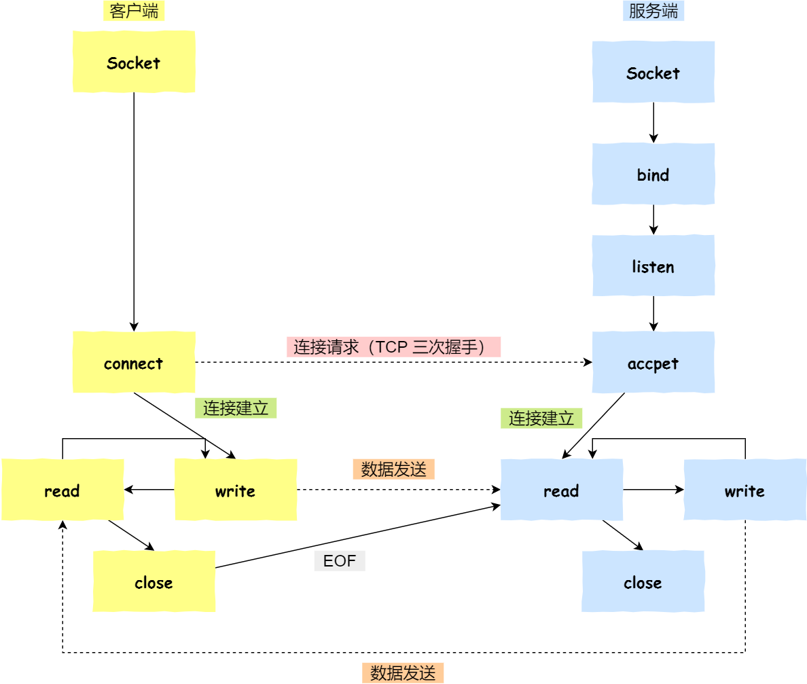

- 服务端和客户端初始化 socket，得到文件描述符；
- 服务端调用 bind，将绑定在 IP 地址和端口；
- 服务端调用 listen，进行监听；
- 服务端调用 accept，等待客户端连接；
- 客户端调用 connect，向服务器端的地址和端口发起连接请求；
- 服务端 accept 返回用于传输的 socket 的文件描述符；
- 客户端调用 write 写入数据；服务端调用 read 读取数据；
- 客户端断开连接时，会调用 close，那么服务端 read 读取数据的时候，就会读取到了 EOF，待处理完数据后，服务端调用 close，表示连接关闭。

这里需要注意的是，服务端调用 accept 时，连接成功了会返回一个已完成连接的 socket，后续用来传输数据。

所以，监听的 socket 和真正用来传送数据的 socket，是「两个」 socket，一个叫作监听 socket，一个叫作已完成连接 socket。

针对 UDP 协议通信的 socket 编程模型如下：

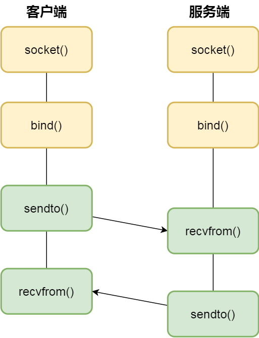

UDP 是没有连接的，所以不需要三次握手，也就不需要像 TCP 调用 listen 和 connect，但是 UDP 的交互仍然需要 IP 地址和端口号，因此也需要 bind。

对于 UDP 来说，不需要要维护连接，那么也就没有所谓的发送方和接收方，甚至都不存在客户端和服务端的概念，只要有一个 socket 多台机器就可以任意通信，因此每一个 UDP 的 socket 都需要 bind。

另外，每次通信时，调用 sendto 和 recvfrom，都要传入目标主机的 IP 地址和端口。

针对本地进程间通信的 socket 编程模型如下：

本地 socket 被用于在同一台主机上进程间通信的场景：

- 本地 socket 的编程接口和 IPv4 、IPv6 套接字编程接口是一致的，可以支持「字节流」和「数据报」两种协议；
- 本地 socket 的实现效率大大高于 IPv4 和 IPv6 的字节流、数据报 socket 实现；

本地字节流 socket 和 本地数据报 socket 在 bind 的时候，不像 TCP 和 UDP 要绑定 IP 地址和端口，而是绑定一个本地文件，这也就是它们之间的最大区别。

### 多线程冲突了怎么办？

#### 竞争与协作

当多线程相互竞争操作共享变量时，由于运气不好，即在执行过程中发生了上下文切换，我们得到了错误的结果，事实上，每次运行都可能得到不同的结果，因此输出的结果存在不确定性（indeterminate）。

由于多线程执行操作共享变量的这段代码可能会导致竞争状态，因此我们将此段代码称为临界区（critical section），它是访问共享资源的代码片段，一定不能给多线程同时执行。

我们希望这段代码是互斥（mutualexclusion）的，也就说保证一个线程在临界区执行时，其他线程应该被阻止进入临界区，说白了，就是这段代码执行过程中，最多只能出现一个线程。

所谓同步，就是并发进程/线程在一些关键点上可能需要互相等待与互通消息，这种相互制约的等待与互通信息称为进程/线程同步。

#### 互斥与同步的实现和使用

为了实现进程/线程间正确的协作，操作系统必须提供实现进程协作的措施和方法，主要的方法有两种，锁和信号量。

##### 锁

使用加锁操作和解锁操作可以解决并发线程/进程的互斥问题。任何想进入临界区的线程，必须先执行加锁操作。若加锁操作顺利通过，则线程可进入临界区；在完成对临界资源的访问后再执行解锁操作，以释放该临界资源。

根据锁的实现不同，可以分为「忙等待锁」和「无等待锁」。

「忙等待锁」当获取不到锁时，线程就会一直 while 循环，不做任何事情，也被称为自旋锁（spin lock）。这是最简单的一种锁，一直自旋，利用 CPU 周期，直到锁可用。在单处理器上，需要抢占式的调度器（即不断通过时钟中断一个线程，运行其他线程）。否则，自旋锁在单 CPU 上无法使用，因为一个自旋的线程永远不会放弃 CPU。

「无等待锁」顾明思议就是获取不到锁的时候，不用自旋。既然不想自旋，那当没获取到锁的时候，就把当前线程放入到锁的等待队列，然后执行调度程序，把 CPU 让给其他线程执行。

##### 信号量

信号量是操作系统提供的一种协调共享资源访问的方法。通常信号量表示资源的数量，对应的变量是一个整型（sem）变量。

另外，还有两个原子操作的系统调用函数来控制信号量的，分别是：

- P 操作：将 sem 减 1，相减后，如果 sem < 0，则进程/线程进入阻塞等待，否则继续，表明 P 操作可能会阻塞；
- V 操作：将 sem 加 1，相加后，如果 sem <= 0，唤醒一个等待中的进程/线程，表明 V 操作不会阻塞；

举个例子，如果 sem = 1，有三个线程进行了 P 操作：

- 第一个线程 P 操作后，sem = 0；
- 第二个线程 P 操作后，sem = -1；
- 第三个线程 P 操作后，sem = -2；

这时，第一个线程执行 V 操作后， sem 是 -1，因为 sem <= 0，所以要唤醒第二或第三个线程。

P 操作是用在进入临界区之前，V 操作是用在离开临界区之后，这两个操作是必须成对出现的。PV 操作的函数是由操作系统管理和实现的，所以操作系统已经使得执行 PV 函数时是具有原子性的。

信号量不仅可以实现临界区的互斥访问控制，还可以线程间的事件同步。

##### 生产者-消费者问题

生产者-消费者问题描述：

- 生产者在生成数据后，放在一个缓冲区中；
- 消费者从缓冲区取出数据处理；
- 任何时刻，只能有一个生产者或消费者可以访问缓冲区；

我们对问题分析可以得出：

- 任何时刻只能有一个线程操作缓冲区，说明操作缓冲区是临界代码，需要互斥；
- 缓冲区空时，消费者必须等待生产者生成数据；缓冲区满时，生产者必须等待消费者取出数据。说明生产者和消费者需要同步。

那么我们需要三个信号量，分别是：

- 互斥信号量 mutex：用于互斥访问缓冲区，初始化值为 1；
- 资源信号量 fullBuffers：用于消费者询问缓冲区是否有数据，有数据则读取数据，初始化值为 0（表明缓冲区一开始为空）；
- 资源信号量 emptyBuffers：用于生产者询问缓冲区是否有空位，有空位则生成数据，初始化值为 n （缓冲区大小）；

如果消费者线程一开始执行`P(fullBuffers)`，由于信号量 fullBuffers 初始值为 0，则此时 fullBuffers 的值从 0 变为 -1，说明缓冲区里没有数据，消费者只能等待。

接着，轮到生产者执行`P(emptyBuffers)`，表示减少 1 个空槽，如果当前没有其他生产者线程在临界区执行代码，那么该生产者线程就可以把数据放到缓冲区，放完后，执行`V(fullBuffers)`，信号量 fullBuffers 从 -1 变成 0，表明有「消费者」线程正在阻塞等待数据，于是阻塞等待的消费者线程会被唤醒。

消费者线程被唤醒后，如果此时没有其他消费者线程在读数据，那么就可以直接进入临界区，从缓冲区读取数据。最后，离开临界区后，把空槽的个数 + 1。

#### 经典同步问题

##### 哲学家就餐问题

先来看看哲学家就餐的问题描述：

- 5 个老大哥哲学家，闲着没事做，围绕着一张圆桌吃面；
- 巧就巧在，这个桌子只有 5 支叉子，每两个哲学家之间放一支叉子；
- 哲学家围在一起先思考，思考中途饿了就会想进餐；
- 奇葩的是，这些哲学家要两支叉子才愿意吃面，也就是需要拿到左右两边的叉子才进餐；
- 吃完后，会把两支叉子放回原处，继续思考；

方案一：

我们用信号量的方式，也就是 PV 操作来尝试解决它，代码如下：

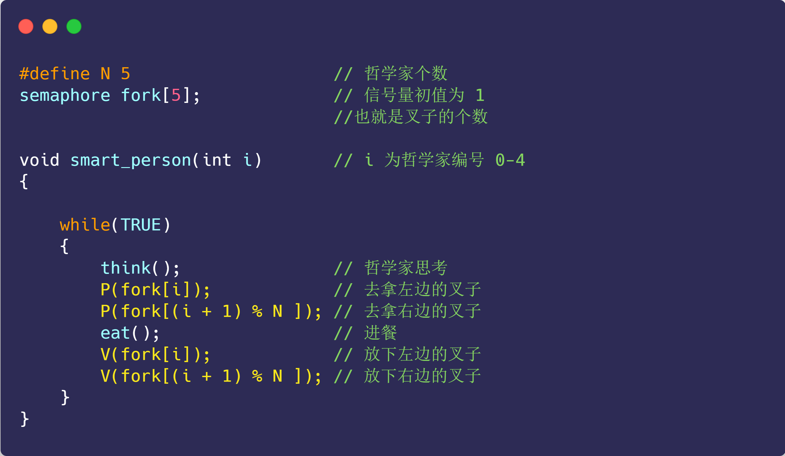

上面的程序，好似很自然。拿起叉子用 P 操作，代表有叉子就直接用，没有叉子时就等待其他哲学家放回叉子。

不过，这种解法存在一个极端的问题：假设五位哲学家同时拿起左边的叉子，桌面上就没有叉子了， 这样就没有人能够拿到他们右边的叉子，也就说每一位哲学家都会在`P(fork[(i + 1) % N ])`这条语句阻塞了，很明显这发生了死锁的现象。

方案二：

既然「方案一」会发生同时竞争左边叉子导致死锁的现象，那么我们就在拿叉子前，加个互斥信号量，代码如下：

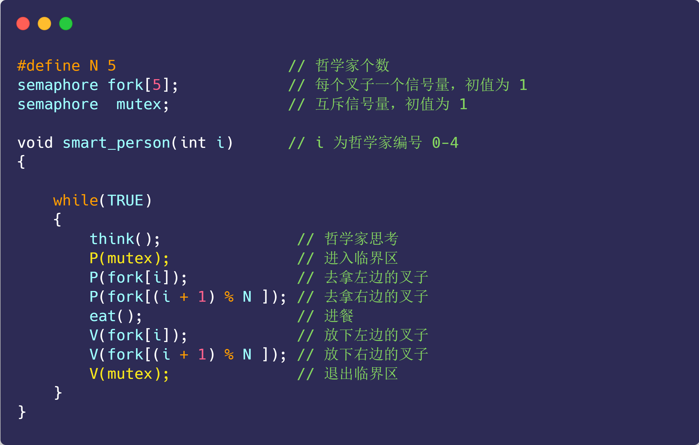

上面程序中的互斥信号量的作用就在于，只要有一个哲学家进入了「临界区」，也就是准备要拿叉子时，其他哲学家都不能动，只有这位哲学家用完叉子了，才能轮到下一个哲学家进餐。

方案二虽然能让哲学家们按顺序吃饭，但是每次进餐只能有一位哲学家，而桌面上是有 5 把叉子，按道理是能可以有两个哲学家同时进餐的，所以从效率角度上，这不是最好的解决方案。

方案三：

那既然方案二使用互斥信号量，会导致只能允许一个哲学家就餐，那么我们就不用它。另外，方案一的问题在于，会出现所有哲学家同时拿左边刀叉的可能性，那我们就避免哲学家可以同时拿左边的刀叉，采用分支结构，根据哲学家的编号的不同，而采取不同的动作。

即让偶数编号的哲学家「先拿左边的叉子后拿右边的叉子」，奇数编号的哲学家「先拿右边的叉子后拿左边的叉子」。

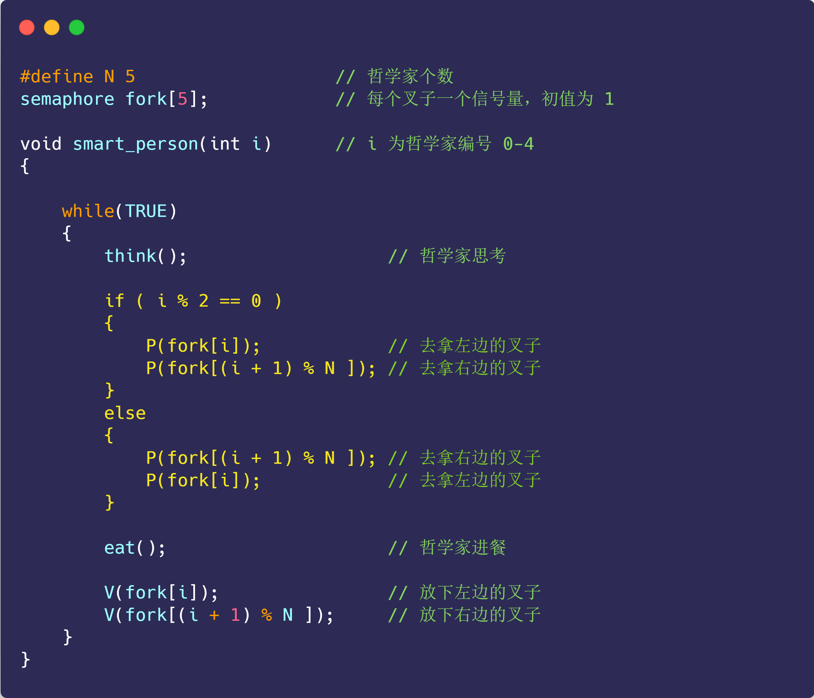

上面的程序，在 P 操作时，根据哲学家的编号不同，拿起左右两边叉子的顺序不同。另外，V 操作是不需要分支的，因为 V 操作是不会阻塞的。

方案三即不会出现死锁，也可以两人同时进餐。

方案四：

在这里再提出另外一种可行的解决方案，我们用一个数组 state 来记录每一位哲学家的三个状态，分别是在进餐状态、思考状态、饥饿状态（正在试图拿叉子）。

那么，一个哲学家只有在两个邻居都没有进餐时，才可以进入进餐状态。

第 i 个哲学家的左邻右舍，则由宏 LEFT 和 RIGHT 定义：

- LEFT : ( i + 5 - 1 ) % 5
- RIGHT : ( i + 1 ) % 5

比如 i 为 2，则 LEFT 为 1，RIGHT 为 3。具体代码实现如下：

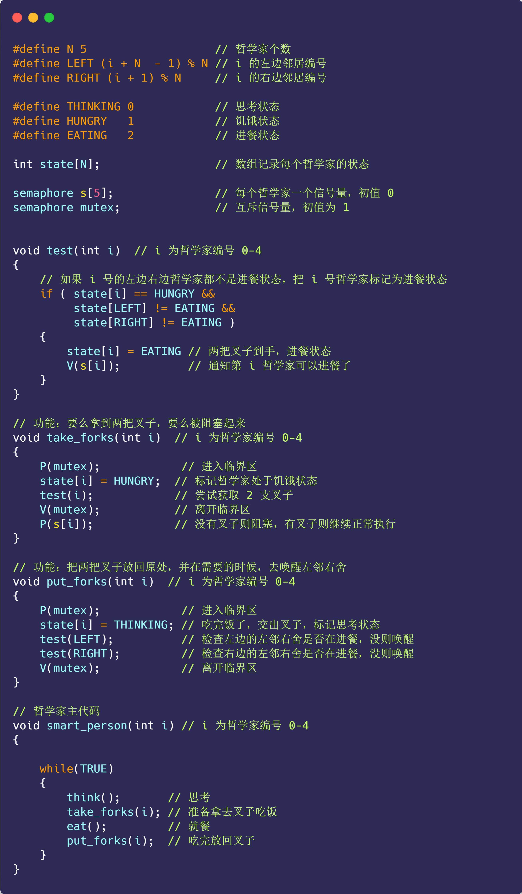

上面的程序使用了一个信号量数组，每个信号量对应一位哲学家，这样在所需的叉子被占用时，想进餐的哲学家就被阻塞。

注意，每个进程/线程将`smart_person`函数作为主代码运行，而其他`take_forks`、`put_forks`和`test`只是普通的函数，而非单独的进程/线程。

##### 读者-写者问题

读者只会读取数据，不会修改数据，而写者即可以读也可以修改数据。读者-写者的问题描述：

- 「读-读」允许：同一时刻，允许多个读者同时读；
- 「读-写」互斥：没有写者时读者才能读，没有读者时写者才能写；
- 「写-写」互斥：没有其他写者时，写者才能写。

方案一：

使用信号量的方式来尝试解决：

- 信号量 wMutex：控制写操作的互斥信号量，初始值为 1 ；
- 读者计数 rCount：正在进行读操作的读者个数，初始化为 0；
- 信号量 rCountMutex：控制对 rCount 读者计数器的互斥修改，初始值为 1；

代码实现如下：

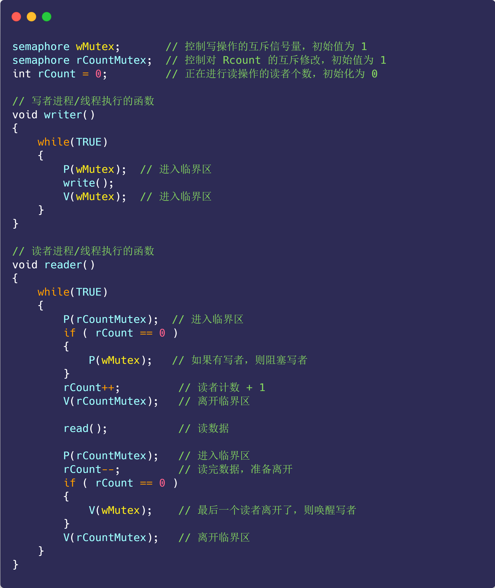

上面的这种实现，是读者优先的策略，因为只要有读者正在读的状态，后来的读者都可以直接进入，如果读者持续不断进入，则写者会处于饥饿状态。

方案二：

那既然有读者优先策略，自然也有写者优先策略：

- 只要有写者准备要写入，写者应尽快执行写操作，后来的读者就必须阻塞；
- 如果有写者持续不断写入，则读者就处于饥饿；

在方案一的基础上新增如下变量：

- 信号量 rMutex：控制读者进入的互斥信号量，初始值为 1；
- 信号量 wDataMutex：控制写者写操作的互斥信号量，初始值为 1；
- 写者计数 wCount：记录写者数量，初始值为 0；
- 信号量 wCountMutex：控制 wCount 互斥修改，初始值为 1；

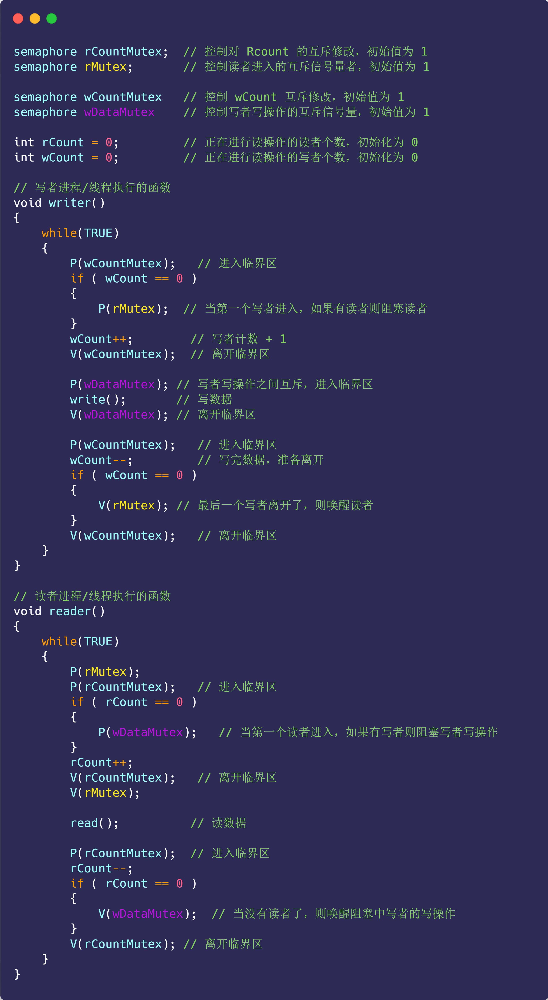

注意，这里 `rMutex` 的作用，开始有多个读者读数据，它们全部进入读者队列，此时来了一个写者，执行了 `P(rMutex)` 之后，后续的读者由于阻塞在 `rMutex` 上，都不能再进入读者队列，而写者到来，则可以全部进入写者队列，因此保证了写者优先。

同时，第一个写者执行了 `P(rMutex)` 之后，也不能马上开始写，必须等到所有进入读者队列的读者都执行完读操作，通过 `V(wDataMutex)` 唤醒写者的写操作。

方案三：

既然读者优先策略和写者优先策略都会造成饥饿的现象，那么我们就来实现一下公平策略。

公平策略：

- 优先级相同；
- 写者、读者互斥访问；
- 只能一个写者访问临界区；
- 可以有多个读者同时访问临界资源；

代码如下：

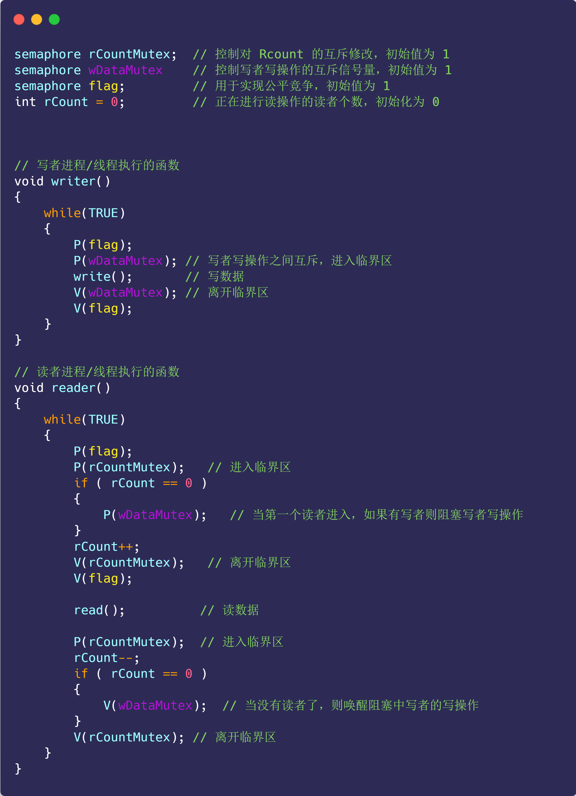

看完代码不知你是否有这样的疑问，为什么加了一个信号量 flag，就实现了公平竞争？

对比方案一的读者优先策略，可以发现，读者优先中只要后续有读者到达，读者就可以进入读者队列， 而写者必须等待，直到没有读者到达。

没有读者到达会导致读者队列为空，即`rCount==0`，此时写者才可以进入临界区执行写操作。

而这里 flag 的作用就是阻止读者的这种特殊权限（特殊权限是只要读者到达，就可以进入读者队列）。

比如：开始来了一些读者读数据，它们全部进入读者队列，此时来了一个写者，执行`P(flag)`操作，使得后续到来的读者都阻塞在 flag 上，不能进入读者队列，这会使得读者队列逐渐为空，即 rCount 减为 0。

这个写者也不能立马开始写（因为此时读者队列不为空），会阻塞在信号量`wDataMutex` 上，读者队列中的读者全部读取结束后，最后一个读者进程执行`V(wDataMutex)`，唤醒刚才的写者，写者则继续开始进行写操作。

### 怎么避免死锁？

在多线程编程中，我们为了防止多线程竞争共享资源而导致数据错乱，都会在操作共享资源之前加上互斥锁，只有成功获得到锁的线程，才能操作共享资源，获取不到锁的线程就只能等待，直到锁被释放。

那么，当两个线程为了保护两个不同的共享资源而使用了两个互斥锁，那么这两个互斥锁应用不当的时候，可能会造成两个线程都在等待对方释放锁，在没有外力的作用下，这些线程会一直相互等待，就没办法继续运行，这种情况就是发生了死锁。

死锁只有同时满足以下四个条件才会发生：

- 互斥条件：互斥条件是指多个线程不能同时使用同一个资源。
- 持有并等待条件：持有并等待条件是指，当线程 A 已经持有了资源 1，又想申请资源 2，而资源 2 已经被线程 C 持有了，所以线程 A 就会处于等待状态，但是线程 A 在等待资源 2 的同时并不会释放自己已经持有的资源 1。
- 不可剥夺条件：不可剥夺条件是指，当线程已经持有了资源 ，在自己使用完之前不能被其他线程获取，线程 B 如果也想使用此资源，则只能在线程 A 使用完并释放后才能获取。
- 环路等待条件：环路等待条件指的是，在死锁发生的时候，两个线程获取资源的顺序构成了环形链。

#### 避免死锁问题的发生

那么避免死锁问题就只需要破环其中一个条件就可以，最常见的并且可行的就是使用资源有序分配法，来破环环路等待条件。

线程 A 和 线程 B 获取资源的顺序要一样，当线程 A 是先尝试获取资源 A，然后尝试获取资源 B 的时候，线程 B 同样也是先尝试获取资源 A，然后尝试获取资源 B。也就是说，线程 A 和 线程 B 总是以相同的顺序申请自己想要的资源。

### 什么是悲观锁、乐观锁？

#### 互斥锁与自旋锁

最底层的两种就是会「互斥锁和自旋锁」，有很多高级的锁都是基于它们实现的，你可以认为它们是各种锁的地基，所以我们必须清楚它俩之间的区别和应用。

有一个线程加锁后，其他线程加锁则就会失败，互斥锁和自旋锁对于加锁失败后的处理方式是不一样的：

- 互斥锁加锁失败后，线程会释放 CPU ，给其他线程；
- 自旋锁加锁失败后，线程会忙等待，直到它拿到锁；

互斥锁是一种「独占锁」，比如当线程 A 加锁成功后，此时互斥锁已经被线程 A 独占了，只要线程 A 没有释放手中的锁，线程 B 加锁就会失败，于是就会释放 CPU 让给其他线程，既然线程 B 释放掉了 CPU，自然线程 B 加锁的代码就会被阻塞。

对于互斥锁加锁失败而阻塞的现象，是由操作系统内核实现的。当加锁失败时，内核会将线程置为「睡眠」状态，等到锁被释放后，内核会在合适的时机唤醒线程，当这个线程成功获取到锁后，于是就可以继续执行。

所以，互斥锁加锁失败时，会从用户态陷入到内核态，让内核帮我们切换线程，虽然简化了使用锁的难度，但是存在一定的性能开销成本。

那这个开销成本是什么呢？会有两次线程上下文切换的成本：

- 当线程加锁失败时，内核会把线程的状态从「运行」状态设置为「睡眠」状态，然后把 CPU 切换给其他线程运行；
- 接着，当锁被释放时，之前「睡眠」状态的线程会变为「就绪」状态，然后内核会在合适的时间，把 CPU 切换给该线程运行。

线程的上下文切换的是什么？当两个线程是属于同一个进程，因为虚拟内存是共享的，所以在切换时，虚拟内存这些资源就保持不动，只需要切换线程的私有数据、寄存器等不共享的数据。

上下文切换的耗时有大佬统计过，大概在几十纳秒到几微秒之间，如果你锁住的代码执行时间比较短，那可能上下文切换的时间都比你锁住的代码执行时间还要长。所以，如果你能确定被锁住的代码执行时间很短，就不应该用互斥锁，而应该选用自旋锁，否则使用互斥锁。

自旋锁是通过 CPU 提供的 CAS 函数（Compare And Swap），在「用户态」完成加锁和解锁操作，不会主动产生线程上下文切换，所以相比互斥锁来说，会快一些，开销也小一些。

一般加锁的过程，包含两个步骤：

- 第一步，查看锁的状态，如果锁是空闲的，则执行第二步；
- 第二步，将锁设置为当前线程持有；

CAS 函数就把这两个步骤合并成一条硬件级指令，形成原子指令，这样就保证了这两个步骤是不可分割的，要么一次性执行完两个步骤，要么两个步骤都不执行。

比如，设锁为变量 lock，整数 0 表示锁是空闲状态，整数 pid 表示线程 ID，那么`CAS(lock, 0, pid)`就表示自旋锁的加锁操作，`CAS(lock, pid, 0)`则表示解锁操作。

使用自旋锁的时候，当发生多线程竞争锁的情况，加锁失败的线程会「忙等待」，直到它拿到锁。这里的「忙等待」可以用 while 循环等待实现，不过最好是使用 CPU 提供的 PAUSE 指令来实现「忙等待」，因为可以减少循环等待时的耗电量。

自旋锁是最比较简单的一种锁，一直自旋，利用 CPU 周期，直到锁可用。需要注意，在单核 CPU 上，需要抢占式的调度器（即不断通过时钟中断一个线程，运行其他线程）。否则，自旋锁在单 CPU 上无法使用，因为一个自旋的线程永远不会放弃 CPU。

自旋锁开销少，在多核系统下一般不会主动产生线程切换，适合异步、协程等在用户态切换请求的编程方式，但如果被锁住的代码执行时间过长，自旋的线程会长时间占用 CPU 资源，所以自旋的时间和被锁住的代码执行的时间是成「正比」的关系，我们需要清楚的知道这一点。

自旋锁与互斥锁使用层面比较相似，但实现层面上完全不同：当加锁失败时，互斥锁用「线程切换」来应对，自旋锁则用「忙等待」来应对。

它俩是锁的最基本处理方式，更高级的锁都会选择其中一个来实现，比如读写锁既可以选择互斥锁实现，也可以基于自旋锁实现。

#### 读写锁

读写锁从字面意思我们也可以知道，它由「读锁」和「写锁」两部分构成，如果只读取共享资源用「读锁」加锁，如果要修改共享资源则用「写锁」加锁。所以，读写锁适用于能明确区分读操作和写操作的场景。

读写锁的工作原理是：

- 当「写锁」没有被线程持有时，多个线程能够并发地持有读锁，这大大提高了共享资源的访问效率，因为「读锁」是用于读取共享资源的场景，所以多个线程同时持有读锁也不会破坏共享资源的数据。
- 但是，一旦「写锁」被线程持有后，读线程的获取读锁的操作会被阻塞，而且其他写线程的获取写锁的操作也会被阻塞。

所以说，写锁是独占锁，因为任何时刻只能有一个线程持有写锁，类似互斥锁和自旋锁，而读锁是共享锁，因为读锁可以被多个线程同时持有。读写锁在读多写少的场景，能发挥出优势。另外，根据实现的不同，读写锁可以分为「读优先锁」和「写优先锁」。

不管优先读锁还是写锁，对方可能会出现饿死问题，那么我们就不偏袒任何一方，搞个「公平读写锁」。公平读写锁比较简单的一种方式是：用队列把获取锁的线程排队，不管是写线程还是读线程都按照先进先出的原则加锁即可，这样读线程仍然可以并发，也不会出现「饥饿」的现象。

#### 乐观锁与悲观锁

互斥锁、自旋锁、读写锁，都是属于悲观锁。悲观锁做事比较悲观，它认为多线程同时修改共享资源的概率比较高，于是很容易出现冲突，所以访问共享资源前，先要上锁。

那相反的，如果多线程同时修改共享资源的概率比较低，就可以采用乐观锁。

乐观锁做事比较乐观，它假定冲突的概率很低，它的工作方式是：先修改完共享资源，再验证这段时间内有没有发生冲突，如果没有其他线程在修改资源，那么操作完成，如果发现有其他线程已经修改过这个资源，就放弃本次操作。

放弃后如何重试，这跟业务场景息息相关，虽然重试的成本很高，但是冲突的概率足够低的话，还是可以接受的。乐观锁全程并没有加锁，所以它也叫无锁编程。

这里举一个场景例子：在线文档。

在线文档可以同时多人编辑的，如果使用了悲观锁，那么只要有一个用户正在编辑文档，此时其他用户就无法打开相同的文档了，这用户体验当然不好了。

那实现多人同时编辑，实际上是用了乐观锁，它允许多个用户打开同一个文档进行编辑，编辑完提交之后才验证修改的内容是否有冲突。

怎么样才算发生冲突？这里举个例子，比如用户 A 先在浏览器编辑文档，之后用户 B 在浏览器也打开了相同的文档进行编辑，但是用户 B 比用户 A 提交早，这一过程用户 A 是不知道的，当 A 提交修改完的内容时，那么 A 和 B 之间并行修改的地方就会发生冲突。

服务端要怎么验证是否冲突了呢？通常方案如下：

- 由于发生冲突的概率比较低，所以先让用户编辑文档，但是浏览器在下载文档时会记录下服务端返回的文档版本号；
- 当用户提交修改时，发给服务端的请求会带上原始文档版本号，服务器收到后将它与当前版本号进行比较，如果版本号不一致则提交失败，如果版本号一致则修改成功，然后服务端版本号更新到最新的版本号。

实际上，我们常见的 SVN 和 Git 也是用了乐观锁的思想，先让用户编辑代码，然后提交的时候，通过版本号来判断是否产生了冲突，发生了冲突的地方，需要我们自己修改后，再重新提交。

乐观锁虽然去除了加锁解锁的操作，但是一旦发生冲突，重试的成本非常高，所以只有在冲突概率非常低，且加锁成本非常高的场景时，才考虑使用乐观锁。

### 一个进程最多可以创建多少个线程

这个问题跟两个东西有关系：

- 进程的虚拟内存空间上限，因为创建一个线程，操作系统需要为其分配一个栈空间，如果线程数量越多，所需的栈空间就要越大，那么虚拟内存就会占用的越多。
- 系统参数限制，虽然 Linux 并没有内核参数来控制单个进程创建的最大线程个数，但是有系统级别的参数来控制整个系统的最大线程个数。

我们可以执行`ulimit -a`这条命令，查看进程创建线程时默认分配的栈空间大小，服务器默认分配给线程的栈空间大小为 8M。

另外我们需要知道 Linux 系统中：

- 32 位系统的内核空间占用 1G ，位于最高处，剩下的 3G 是用户空间;
- 64 位系统的内核空间和用户空间都是 128T ，分别占据整个内存空间的最高和最低处，剩下的中间部分是未定义的。

假设 32 位 Linux 系统里，创建一个线程需要占用 10M 虚拟内存，总共有 3G 虚拟内存可以使用。于是我们可以算出，最多可以创建差不多 300 个（3G/10M）左右的线程。

如果想使得进程创建上千个线程，那么我们可以调整创建线程时分配的栈空间大小，比如调整为 512k：

```bash
ulimit -s 512
```

64 位系统意味着用户空间的虚拟内存最大值是 128T，这个数值是很大的，如果按创建一个线程需占用 10M 栈空间的情况来算，那么理论上可以创建 128T/10M 个线程，也就是 1000多万个线程，所以按 64 位系统的虚拟内存大小，理论上可以创建无数个线程。

事实上，肯定创建不了那么多线程，除了虚拟内存的限制，还有系统的限制。

比如下面这三个内核参数的大小，都会影响创建线程的上限：

- `/proc/sys/kernel/threads-max`，表示系统支持的最大线程数，默认值是 14553；
- `/proc/sys/kernel/pid_max`，表示系统全局的 PID 号数值的限制，每一个进程或线程都有 ID，ID 的值超过这个数，进程或线程就会创建失败，默认值是 32768；
- `/proc/sys/vm/max_map_count`，表示限制一个进程可以拥有的 VMA（虚拟内存区域）的数量，具体什么意思我也没搞清楚，反正如果它的值很小，也会导致创建线程失败，默认值是 65530。

实际测试中，创建了`14374`个线程后，就无法在创建了，而且报错是因为资源的限制。可以通过`top -H`查看当前系统的线程数是多少，查看的发现`Threads`的数量显示是`14553`，与`threads-max`内核参数的值相同，所以我们可以认为是因为这个参数导致无法继续创建线程。

那么，我们可以把`threads-max`参数设置成`99999`，当进程创建了`32326`个线程后，就无法继续创建里，且报错是无法继续申请内存。此时的上限个数很接近`pid_max`内核参数的默认值`32768`，那么我们可以尝试将这个参数设置为`99999`，设置完`pid_max`参数后，继续跑测试线程数的程序，运行后结果创建线程的个数还是一样卡在了`32768`了，因`max_map_count`这个内核参数也是需要调大的，然后，把`max_map_count`内核参数也设置成后`99999`，当创建差不多 5 万个线程后，服务器就卡住不动了，CPU 都已经被占满了，毕竟这个是单核 CPU，所以现在是 CPU 的瓶颈了。

## 调度算法

### 进程调度算法

#### 先来先服务调度算法

每次从就绪队列选择最先进入队列的进程，然后一直运行，直到进程退出或被阻塞，才会继续从队列中选择第一个进程接着运行。

这似乎很公平，但是当一个长作业先运行了，那么后面的短作业等待的时间就会很长，不利于短作业。

FCFS 对长作业有利，适用于 CPU 繁忙型作业的系统，而不适用于 I/O 繁忙型作业的系统。

#### 最短作业优先调度算法

优先选择运行时间最短的进程来运行，这有助于提高系统的吞吐量。

这显然对长作业不利，很容易造成一种极端现象。

比如，一个长作业在就绪队列等待运行，而这个就绪队列有非常多的短作业，那么就会使得长作业不断的往后推，周转时间变长，致使长作业长期不会被运行。

#### 高响应比优先调度算法

高响应比优先 （Highest Response Ratio Next, HRRN）调度算法主要是权衡了短作业和长作业。每次进行进程调度时，先计算「响应比优先级」，然后把「响应比优先级」最高的进程投入运行，「响应比优先级」的计算公式：`优先权 = （等待时间 + 要求服务时间）/ 要求服务时间`。

从上面的公式，可以发现：

- 如果两个进程的「等待时间」相同时，「要求的服务时间」越短，「响应比」就越高，这样短作业的进程容易被选中运行；
- 如果两个进程「要求的服务时间」相同时，「等待时间」越长，「响应比」就越高，这就兼顾到了长作业进程，因为进程的响应比可以随时间等待的增加而提高，当其等待时间足够长时，其响应比便可以升到很高，从而获得运行的机会；

#### 时间片轮转调度算法

每个进程被分配一个时间段，称为时间片（Quantum），即允许该进程在该时间段中运行。

- 如果时间片用完，进程还在运行，那么将会把此进程从 CPU 释放出来，并把 CPU 分配另外一个进程；
- 如果该进程在时间片结束前阻塞或结束，则 CPU 立即进行切换；

另外，时间片的长度就是一个很关键的点：

- 如果时间片设得太短会导致过多的进程上下文切换，降低了 CPU 效率；
- 如果设得太长又可能引起对短作业进程的响应时间变长。将通常时间片设为 20ms~50ms 通常是一个比较合理的折中值。

#### 最高优先级调度算法

对于多用户计算机系统，它们希望调度是有优先级的，即希望调度程序能从就绪队列中选择最高优先级的进程进行运行，这称为最高优先级（Highest Priority First，HPF）调度算法。

进程的优先级可以分为，静态优先级或动态优先级：

- 静态优先级：创建进程时候，就已经确定了优先级了，然后整个运行时间优先级都不会变化；
- 动态优先级：根据进程的动态变化调整优先级，比如如果进程运行时间增加，则降低其优先级，如果进程等待时间（就绪队列的等待时间）增加，则升高其优先级，也就是随着时间的推移增加等待进程的优先级。

该算法也有两种处理优先级高的方法，非抢占式和抢占式：

- 非抢占式：当就绪队列中出现优先级高的进程，运行完当前进程，再选择优先级高的进程。
- 抢占式：当就绪队列中出现优先级高的进程，当前进程挂起，调度优先级高的进程运行。

但是依然有缺点，可能会导致低优先级的进程永远不会运行。

#### 多级反馈队列调度算法

多级反馈队列（Multilevel Feedback Queue）调度算法是「时间片轮转算法」和「最高优先级算法」的综合和发展。

- 「多级」表示有多个队列，每个队列优先级从高到低，同时优先级越高时间片越短。
- 「反馈」表示如果有新的进程加入优先级高的队列时，立刻停止当前正在运行的进程，转而去运行优先级高的队列；

工作流程如下：

- 设置了多个队列，赋予每个队列不同的优先级，每个队列优先级从高到低，同时优先级越高时间片越短；
- 新的进程会被放入到第一级队列的末尾，按先来先服务的原则排队等待被调度，如果在第一级队列规定的时间片没运行完成，则将其转入到第二级队列的末尾，以此类推，直至完成；
- 当较高优先级的队列为空，才调度较低优先级的队列中的进程运行。如果进程运行时，有新进程进入较高优先级的队列，则停止当前运行的进程并将其移入到原队列末尾，接着让较高优先级的进程运行；

可以发现，对于短作业可能可以在第一级队列很快被处理完。对于长作业，如果在第一级队列处理不完，可以移入下次队列等待被执行，虽然等待的时间变长了，但是运行时间也会更长了，所以该算法很好的兼顾了长短作业，同时有较好的响应时间。

### 内存页面置换算法

首先了解一下什么是缺页异常（缺页中断），当 CPU 访问的页面不在物理内存时，便会产生一个缺页中断，请求操作系统将所缺页调入到物理内存。那它与一般中断的主要区别在于：

- 缺页中断在指令执行「期间」产生和处理中断信号，而一般中断在一条指令执行「完成」后检查和处理中断信号。
- 缺页中断返回到该指令的开始重新执行「该指令」，而一般中断返回回到该指令的「下一个指令」执行。

缺页中断的处理流程，如下图：

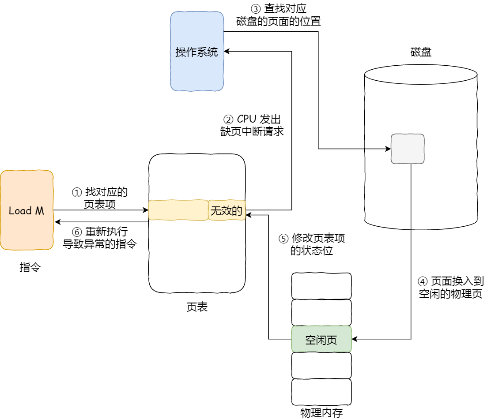

1. 在 CPU 里访问一条 Load M 指令，然后 CPU 会去找 M 所对应的页表项。
2. 如果该页表项的状态位是「有效的」，那 CPU 就可以直接去访问物理内存了，如果状态位是「无效的」，则 CPU 则会发送缺页中断请求。
3. 操作系统收到了缺页中断，则会执行缺页中断处理函数，先会查找该页面在磁盘中的页面的位置。
4. 找到磁盘中对应的页面后，需要把该页面换入到物理内存中，但是在换入前，需要在物理内存中找空闲页，如果找到空闲页，就把页面换入到物理内存中。
5. 页面从磁盘换入到物理内存完成后，则把页表项中的状态位修改为「有效的」。
6. 最后，CPU 重新执行导致缺页异常的指令。

如果在物理内存中找不到空闲页，就说明此时内存已满了，这时候，就需要「页面置换算法」选择一个物理页，如果该物理页有被修改过（脏页），则把它换出到磁盘，然后把该被置换出去的页表项的状态改成「无效的」，最后把正在访问的页面装入到这个物理页中。

#### 最佳页面置换算法

最佳页面置换算法基本思路是，置换在「未来」最长时间不访问的页面。所以，该算法实现需要计算内存中每个逻辑页面的「下一次」访问时间，然后比较，选择未来最长时间不访问的页面。

这很理想，但是实际系统中无法实现，因为程序访问页面时是动态的，我们是无法预知每个页面在「下一次」访问前的等待时间。

#### 先进先出置换算法

既然我们无法预知页面在下一次访问前所需的等待时间，那我们可以选择在内存驻留时间很长的页面进行中置换，这个就是「先进先出置换」算法的思想。

#### 最近最久未使用的置换算法

最近最久未使用（LRU）的置换算法的基本思路是，发生缺页时，选择最长时间没有被访问的页面进行置换，也就是说，该算法假设已经很久没有使用的页面很有可能在未来较长的一段时间内仍然不会被使用。

这种算法近似最优置换算法，最优置换算法是通过「未来」的使用情况来推测要淘汰的页面，而 LRU 则是通过「历史」的使用情况来推测要淘汰的页面。

虽然 LRU 在理论上是可以实现的，但代价很高。为了完全实现 LRU，需要在内存中维护一个所有页面的链表，最近最多使用的页面在表头，最近最少使用的页面在表尾。

困难的是，在每次访问内存时都必须要更新「整个链表」。在链表中找到一个页面，删除它，然后把它移动到表头是一个非常费时的操作。

所以，LRU 虽然看上去不错，但是由于开销比较大，实际应用中比较少使用。

#### 时钟页面置换算法

那有没有一种即能优化置换的次数，也能方便实现的算法呢？时钟页面置换算法就可以两者兼得，它跟 LRU 近似，又是对 FIFO 的一种改进。

该算法的思路是，把所有的页面都保存在一个类似钟面的「环形链表」中，一个表针指向最老的页面。

当发生缺页中断时，算法首先检查表针指向的页面：

- 如果它的访问位位是 0 就淘汰该页面，并把新的页面插入这个位置，然后把表针前移一个位置；
- 如果访问位是 1 就清除访问位，并把表针前移一个位置，重复这个过程直到找到了一个访问位为 0 的页面为止；

#### 最不常用算法

最不常用（LFU）算法，当发生缺页中断时，选择「访问次数」最少的那个页面，并将其淘汰。

它的实现方式是，对每个页面设置一个「访问计数器」，每当一个页面被访问时，该页面的访问计数器就累加 1。在发生缺页中断时，淘汰计数器值最小的那个页面。

看起来很简单，每个页面加一个计数器就可以实现了，但是在操作系统中实现的时候，我们需要考虑效率和硬件成本的。

要增加一个计数器来实现，这个硬件成本是比较高的，另外如果要对这个计数器查找哪个页面访问次数最小，查找链表本身，如果链表长度很大，是非常耗时的，效率不高。

但还有个问题，LFU 算法只考虑了频率问题，没考虑时间的问题，比如有些页面在过去时间里访问的频率很高，但是现在已经没有访问了，而当前频繁访问的页面由于没有这些页面访问的次数高，在发生缺页中断时，就会可能会误伤当前刚开始频繁访问，但访问次数还不高的页面。

那这个问题的解决的办法还是有的，可以定期减少访问的次数，比如当发生时间中断时，把过去时间访问的页面的访问次数除以 2，也就说，随着时间的流失，以前的高访问次数的页面会慢慢减少，相当于加大了被置换的概率。

### 磁盘调度算法

#### 先来先服务算法

先来先服务（First-Come，First-Served，FCFS），顾名思义，先到来的请求，先被服务。

如果大量进程竞争使用磁盘，请求访问的磁道可能会很分散，那先来先服务算法在性能上就会显得很差，因为寻道时间过长。

#### 最短寻道时间优先算法

最短寻道时间优先（Shortest Seek First，SSF）算法的工作方式是，优先选择从当前磁头位置所需寻道时间最短的请求。

但这个算法可能存在某些请求的饥饿，如果是动态请求，产生饥饿的原因是磁头在一小块区域来回移动。

#### 扫描算法

最短寻道时间优先算法会产生饥饿的原因在于：磁头有可能再一个小区域内来回得移动。

为了防止这个问题，可以规定：磁头在一个方向上移动，访问所有未完成的请求，直到磁头到达该方向上的最后的磁道，才调换方向，这就是扫描（Scan）算法。

这种算法也叫做电梯算法，比如电梯保持按一个方向移动，直到在那个方向上没有请求为止，然后改变方向。

扫描调度算法性能较好，不会产生饥饿现象，但是存在这样的问题，中间部分的磁道会比较占便宜，中间部分相比其他部分响应的频率会比较多，也就是说每个磁道的响应频率存在差异。

#### 循环扫描算法

扫描算法使得每个磁道响应的频率存在差异，那么要优化这个问题的话，可以总是按相同的方向进行扫描，使得每个磁道的响应频率基本一致。

循环扫描（Circular Scan, CSCAN ）规定：只有磁头朝某个特定方向移动时，才处理磁道访问请求，而返回时直接快速移动至最靠边缘的磁道，也就是复位磁头，这个过程是很快的，并且返回中途不处理任何请求，该算法的特点，就是磁道只响应一个方向上的请求。

循环扫描算法相比于扫描算法，对于各个位置磁道响应频率相对比较平均。

#### LOOK 与 C-LOOK算法

前面说到的扫描算法和循环扫描算法，都是磁头移动到磁盘「最始端或最末端」才开始调换方向。那这其实是可以优化的，优化的思路就是磁头在移动到「最远的请求」位置，然后立即反向移动。

那针对 SCAN 算法的优化则叫 LOOK 算法，它的工作方式，磁头在每个方向上仅仅移动到最远的请求位置，然后立即反向移动，而不需要移动到磁盘的最始端或最末端，反向移动的途中会响应请求。

而针对 C-SCAN 算法的优化则叫 C-LOOK，它的工作方式，磁头在每个方向上仅仅移动到最远的请求位置，然后立即反向移动，而不需要移动到磁盘的最始端或最末端，反向移动的途中不会响应请求。

## 文件系统

### 文件系统的基本组成

文件系统是操作系统中负责管理持久数据的子系统，说简单点，就是负责把用户的文件存到磁盘硬件中，因为即使计算机断电了，磁盘里的数据并不会丢失，所以可以持久化的保存文件。文件系统的基本数据单位是文件，它的目的是对磁盘上的文件进行组织管理，那组织的方式不同，就会形成不同的文件系统。

Linux 文件系统会为每个文件分配两个数据结构：索引节点（index node）和目录项（directory entry），它们主要用来记录文件的元信息和目录层次结构。

- 索引节点，也就是 inode，用来记录文件的元信息，比如 inode 编号、文件大小、访问权限、创建时间、修改时间、数据在磁盘的位置等等。索引节点是文件的唯一标识，它们之间一一对应，也同样都会被存储在硬盘中，所以索引节点同样占用磁盘空间。
- 目录项，也就是 dentry，用来记录文件的名字、索引节点指针以及与其他目录项的层级关联关系。多个目录项关联起来，就会形成目录结构，但它与索引节点不同的是，目录项是由内核维护的一个数据结构，不存放于磁盘，而是缓存在内存。

由于索引节点唯一标识一个文件，而目录项记录着文件的名字，所以目录项和索引节点的关系是多对一，也就是说，一个文件可以有多个别名。比如，硬链接的实现就是多个目录项中的索引节点指向同一个文件。

注意，目录也是文件，也是用索引节点唯一标识，和普通文件不同的是，普通文件在磁盘里面保存的是文件数据，而目录文件在磁盘里面保存子目录或文件。

目录项和目录是一个东西吗？目录是个文件，持久化存储在磁盘，而目录项是内核一个数据结构，缓存在内存。如果查询目录频繁从磁盘读，效率会很低，所以内核会把已经读过的目录用目录项这个数据结构缓存在内存，下次再次读到相同的目录时，只需从内存读就可以，大大提高了文件系统的效率。

注意，目录项这个数据结构不只是表示目录，也是可以表示文件的。

那文件数据是如何存储在磁盘的呢？

磁盘读写的最小单位是扇区，扇区的大小只有 512B 大小，很明显，如果每次读写都以这么小为单位，那这读写的效率会非常低。所以，文件系统把多个扇区组成了一个逻辑块，每次读写的最小单位就是逻辑块（数据块），Linux 中的逻辑块大小为 4KB，也就是一次性读写 8 个扇区，这将大大提高了磁盘的读写的效率。

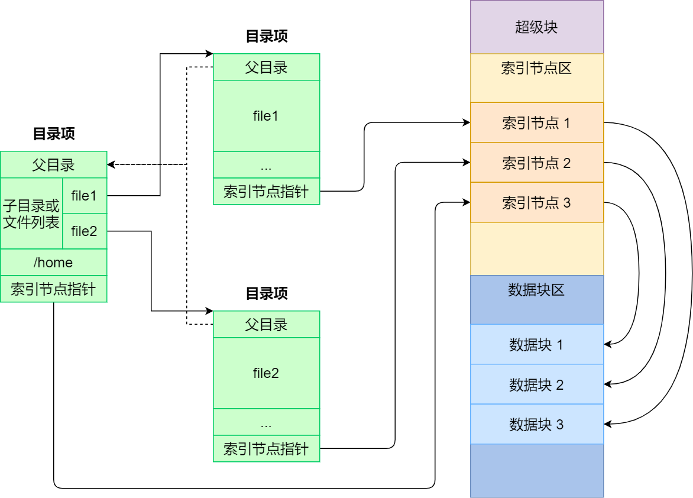

索引节点是存储在硬盘上的数据，那么为了加速文件的访问，通常会把索引节点加载到内存中。

另外，磁盘进行格式化的时候，会被分成三个存储区域，分别是超级块、索引节点区和数据块区：

- 超级块，用来存储文件系统的详细信息，比如块个数、块大小、空闲块等等。
- 索引节点区，用来存储索引节点；
- 数据块区，用来存储文件或目录数据；

我们不可能把超级块和索引节点区全部加载到内存，这样内存肯定撑不住，所以只有当需要使用的时候，才将其加载进内存，它们加载进内存的时机是不同的：

- 超级块：当文件系统挂载时进入内存；
- 索引节点区：当文件被访问时进入内存。

### 虚拟文件系统

文件系统的种类众多，而操作系统希望对用户提供一个统一的接口，于是在用户层与文件系统层引入了中间层，这个中间层就称为虚拟文件系统（Virtual File System，VFS）。VFS 定义了一组所有文件系统都支持的数据结构和标准接口，这样程序员不需要了解文件系统的工作原理，只需要了解 VFS 提供的统一接口即可。

在 Linux 文件系统中，用户空间、系统调用、虚拟文件系统、缓存、文件系统以及存储之间的关系如下图：


Linux 支持的文件系统也不少，根据存储位置的不同，可以把文件系统分为三类：

- 磁盘的文件系统，它是直接把数据存储在磁盘中，比如 Ext 2/3/4、XFS 等都是这类文件系统。
- 内存的文件系统，这类文件系统的数据不是存储在硬盘的，而是占用内存空间，我们经常用到的 /proc 和 /sys 文件系统都属于这一类，读写这类文件，实际上是读写内核中相关的数据。
- 网络的文件系统，用来访问其他计算机主机数据的文件系统，比如 NFS、SMB 等等。

文件系统首先要先挂载到某个目录才可以正常使用，比如 Linux 系统在启动时，会把文件系统挂载到根目录。

### 文件的使用

```c
fd = open(name, flag); # 打开文件
...
write(fd,...);         # 写数据
...
close(fd);             # 关闭文件
```

上面简单的代码是读取一个文件的过程：

- 首先用 open 系统调用打开文件，open 的参数中包含文件的路径名和文件名。
- 使用 write 写数据，其中 write 使用 open 所返回的文件描述符，并不使用文件名作为参数。
- 使用完文件后，要用 close 系统调用关闭文件，避免资源的泄露。

我们打开了一个文件后，操作系统会跟踪进程打开的所有文件，所谓的跟踪呢，就是操作系统为每个进程维护一个打开文件表，文件表里的每一项代表「文件描述符」，所以说文件描述符是打开文件的标识。

操作系统在打开文件表中维护着打开文件的状态和信息：

- 文件指针：系统跟踪上次读写位置作为当前文件位置指针，这种指针对打开文件的某个进程来说是唯一的；
- 文件打开计数器：文件关闭时，操作系统必须重用其打开文件表条目，否则表内空间不够用。因为多个进程可能打开同一个文件，所以系统在删除打开文件条目之前，必须等待最后一个进程关闭文件，该计数器跟踪打开和关闭的数量，当该计数为 0 时，系统关闭文件，删除该条目；
- 文件磁盘位置：绝大多数文件操作都要求系统修改文件数据，该信息保存在内存中，以免每个操作都从磁盘中读取；
- 访问权限：每个进程打开文件都需要有一个访问模式（创建、只读、读写、添加等），该信息保存在进程的打开文件表中，以便操作系统能允许或拒绝之后的 I/O 请求；

在用户视角里，文件就是一个持久化的数据结构，但操作系统并不会关心你想存在磁盘上的任何的数据结构，操作系统的视角是如何把文件数据和磁盘块对应起来。所以，用户和操作系统对文件的读写操作是有差异的，用户习惯以字节的方式读写文件，而操作系统则是以数据块来读写文件，那屏蔽掉这种差异的工作就是文件系统了。

分别看一下，读文件和写文件的过程：

- 当用户进程从文件读取 1 个字节大小的数据时，文件系统则需要获取字节所在的数据块，再返回数据块对应的用户进程所需的数据部分。
- 当用户进程把 1 个字节大小的数据写进文件时，文件系统则找到需要写入数据的数据块的位置，然后修改数据块中对应的部分，最后再把数据块写回磁盘。

所以说，文件系统的基本操作单位是数据块。

### 文件的存储

文件的数据是要存储在硬盘上面的，数据在磁盘上的存放方式，就像程序在内存中存放的方式那样，有以下两种：

- 连续空间存放方式
- 非连续空间存放方式

其中，非连续空间存放方式又可以分为「链表方式」和「索引方式」。

#### 连续空间存放方式

连续空间存放方式顾名思义，文件存放在磁盘「连续的」物理空间中。这种模式下，文件的数据都是紧密相连，读写效率很高，因为一次磁盘寻道就可以读出整个文件。

使用连续存放的方式有一个前提，必须先知道一个文件的大小，这样文件系统才会根据文件的大小在磁盘上找到一块连续的空间分配给文件。

所以，文件头里需要指定「起始块的位置」和「长度」，有了这两个信息就可以很好的表示文件存放方式是一块连续的磁盘空间。注意，此处说的文件头，就类似于 Linux 的 inode。

连续空间存放的方式虽然读写效率高，但是有「磁盘空间碎片」和「文件长度不易扩展」的缺陷。

#### 非连续空间存放方式

先来看看链表的方式，链表的方式存放是离散的，不用连续的，于是就可以消除磁盘碎片，可大大提高磁盘空间的利用率，同时文件的长度可以动态扩展。根据实现的方式的不同，链表可分为「隐式链表」和「显式链接」两种形式。

文件要以「隐式链表」的方式存放的话，实现的方式是文件头要包含「第一块」和「最后一块」的位置，并且每个数据块里面留出一个指针空间，用来存放下一个数据块的位置，这样一个数据块连着一个数据块，从链头开始就可以顺着指针找到所有的数据块，所以存放的方式可以是不连续的。

隐式链表的存放方式的缺点在于无法直接访问数据块，只能通过指针顺序访问文件，以及数据块指针消耗了一定的存储空间。隐式链接分配的稳定性较差，系统在运行过程中由于软件或者硬件错误导致链表中的指针丢失或损坏，会导致文件数据的丢失。

如果取出每个磁盘块的指针，把它放在内存的一个表中，就可以解决上述隐式链表的两个不足。那么，这种实现方式是「显式链接」，它指把用于链接文件各数据块的指针，显式地存放在内存的一张链接表中，该表在整个磁盘仅设置一张，每个表项中存放链接指针，指向下一个数据块号。

由于查找记录的过程是在内存中进行的，因而不仅显著地提高了检索速度，而且大大减少了访问磁盘的次数。但也正是整个表都存放在内存中的关系，它的主要的缺点是不适用于大磁盘。

比如，对于 200GB 的磁盘和 1KB 大小的块，这张表需要有 2 亿项，每一项对应于这 2 亿个磁盘块中的一个块，每项如果需要 4 个字节，那这张表要占用 800MB 内存，很显然 FAT 方案对于大磁盘而言不太合适。

接下来，我们来看看索引的方式。链表的方式解决了连续分配的磁盘碎片和文件动态扩展的问题，但是不能有效支持直接访问（FAT除外），索引的方式可以解决这个问题。

索引的实现是为每个文件创建一个「索引数据块」，里面存放的是指向文件数据块的指针列表，说白了就像书的目录一样，要找哪个章节的内容，看目录查就可以。

另外，文件头需要包含指向「索引数据块」的指针，这样就可以通过文件头知道索引数据块的位置，再通过索引数据块里的索引信息找到对应的数据块。

创建文件时，索引块的所有指针都设为空。当首次写入第 i 块时，先从空闲空间中取得一个块，再将其地址写到索引块的第 i 个条目。

索引的方式优点在于：

- 文件的创建、增大、缩小很方便；
- 不会有碎片的问题；
- 支持顺序读写和随机读写；

由于索引数据也是存放在磁盘块的，如果文件很小，明明只需一块就可以存放的下，但还是需要额外分配一块来存放索引数据，所以缺陷之一就是存储索引带来的开销。

如果文件很大，大到一个索引数据块放不下索引信息，这时又要如何处理大文件的存放呢？我们可以通过组合的方式，来处理大文件的存放。

先来看看链表 + 索引的组合，这种组合称为「链式索引块」，它的实现方式是在索引数据块留出一个存放下一个索引数据块的指针，于是当一个索引数据块的索引信息用完了，就可以通过指针的方式，找到下一个索引数据块的信息。那这种方式也会出现前面提到的链表方式的问题，万一某个指针损坏了，后面的数据也就会无法读取了。

还有另外一种组合方式是索引 + 索引的方式，这种组合称为「多级索引块」，实现方式是通过一个索引块来存放多个索引数据块，一层套一层索引，像极了俄罗斯套娃是吧。

#### Unix 文件的实现方式

先把前面提到的文件实现方式做个比较，如下图：

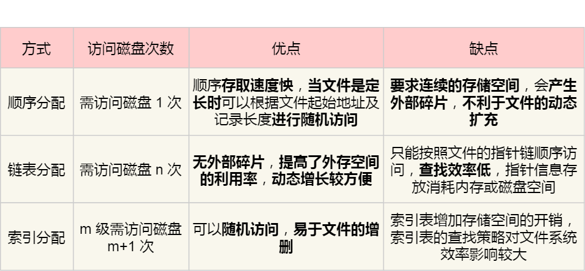

那早期 Unix 文件系统是组合了前面的文件存放方式的优点，如下图：

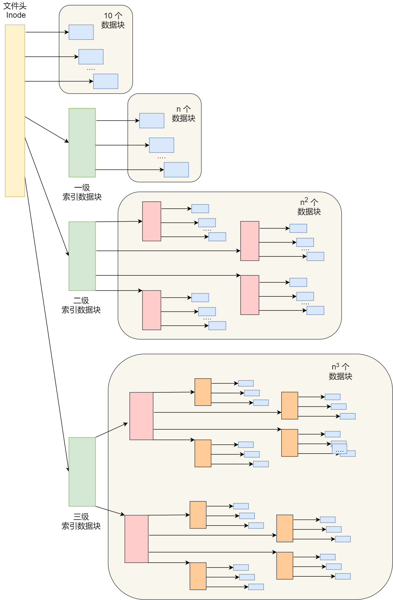

它是根据文件的大小，存放的方式会有所变化：

- 如果存放文件所需的数据块小于 10 块，则采用直接查找的方式；
- 如果存放文件所需的数据块超过 10 块，则采用一级间接索引方式；
- 如果前面两种方式都不够存放大文件，则采用二级间接索引方式；
- 如果二级间接索引也不够存放大文件，这采用三级间接索引方式；

那么，文件头（Inode）就需要包含 13 个指针：

- 10 个指向数据块的指针；
- 第 11 个指向索引块的指针；
- 第 12 个指向二级索引块的指针；
- 第 13 个指向三级索引块的指针；

所以，这种方式能很灵活地支持小文件和大文件的存放：

- 对于小文件使用直接查找的方式可减少索引数据块的开销；
- 对于大文件则以多级索引的方式来支持，所以大文件在访问数据块时需要大量查询；

这个方案就用在了 Linux Ext 2/3 文件系统里，虽然解决大文件的存储，但是对于大文件的访问，需要大量的查询，效率比较低。为了解决这个问题，Ext 4 做了一定的改变。

### 空闲空间管理

#### 空闲表法

空闲表法就是为所有空闲空间建立一张表，表内容包括空闲区的第一个块号和该空闲区的块个数，注意，这个方式是连续分配的。如下图：

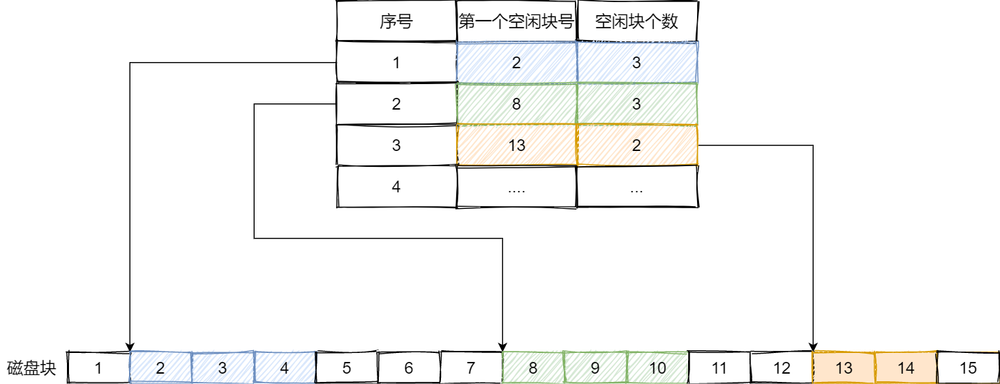

当请求分配磁盘空间时，系统依次扫描空闲表里的内容，直到找到一个合适的空闲区域为止。当用户撤销一个文件时，系统回收文件空间。这时，也需顺序扫描空闲表，寻找一个空闲表条目并将释放空间的第一个物理块号及它占用的块数填到这个条目中。

这种方法仅当有少量的空闲区时才有较好的效果。因为，如果存储空间中有着大量的小的空闲区，则空闲表变得很大，这样查询效率会很低。另外，这种分配技术适用于建立连续文件。

#### 空闲链表法

可以使用「链表」的方式来管理空闲空间，每一个空闲块里有一个指针指向下一个空闲块，这样也能很方便的找到空闲块并管理起来。如下图：

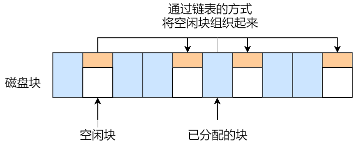

当创建文件需要一块或几块时，就从链头上依次取下一块或几块。反之，当回收空间时，把这些空闲块依次接到链头上。

这种技术只要在主存中保存一个指针，令它指向第一个空闲块。其特点是简单，但不能随机访问，工作效率低，因为每当在链上增加或移动空闲块时需要做很多 I/O 操作，同时数据块的指针消耗了一定的存储空间。

空闲表法和空闲链表法都不适合用于大型文件系统，因为这会使空闲表或空闲链表太大。

#### 位图法

位图是利用二进制的一位来表示磁盘中一个盘块的使用情况，磁盘上所有的盘块都有一个二进制位与之对应。当值为 0 时，表示对应的盘块空闲，值为 1 时，表示对应的盘块已分配。

在 Linux 文件系统就采用了位图的方式来管理空闲空间，不仅用于数据空闲块的管理，还用于 inode 空闲块的管理，因为 inode 也是存储在磁盘的，自然也要有对其管理。

### 文件系统的结构

用户在创建一个新文件时，Linux 内核会通过 inode 的位图找到空闲可用的 inode，并进行分配。要存储数据时，会通过块的位图找到空闲的块，并分配，但仔细计算一下还是有问题的。

数据块的位图是放在磁盘块里的，假设是放在一个块里，一个块 4K，每位表示一个数据块，共可以表示 4 * 1024 * 8 = 2^15 个空闲块，由于 1 个数据块是 4K 大小，那么最大可以表示的空间为 2^15 * 4 * 1024 = 2^27 个 byte，也就是 128M。也就是说按照上面的结构，如果采用「一个块的位图 + 一系列的块」，外加「一个块的 inode 的位图 + 一系列的 inode 的结构」能表示的最大空间也就 128M，这太少了，现在很多文件都比这个大。

在 Linux 文件系统，把这个结构称为一个块组，那么有 N 多的块组，就能够表示 N 大的文件。

下图给出了 Linux Ext2 整个文件系统的结构和块组的内容，文件系统都由大量块组组成，在硬盘上相继排布：

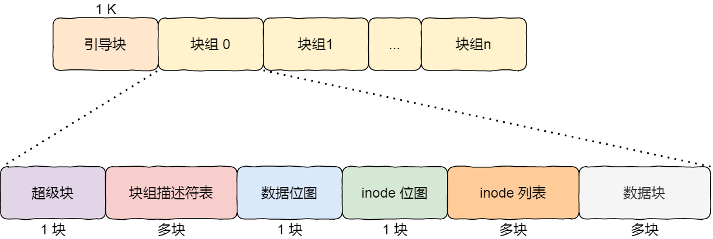

最前面的第一个块是引导块，在系统启动时用于启用引导，接着后面就是一个一个连续的块组了，块组的内容如下：

- 超级块，包含的是文件系统的重要信息，比如 inode 总个数、块总个数、每个块组的 inode 个数、每个块组的块个数等等。
- 块组描述符，包含文件系统中各个块组的状态，比如块组中空闲块和 inode 的数目等，每个块组都包含了文件系统中「所有块组的组描述符信息」。
- 数据位图和 inode 位图， 用于表示对应的数据块或 inode 是空闲的，还是被使用中。
- inode 列表，包含了块组中所有的 inode，inode 用于保存文件系统中与各个文件和目录相关的所有元数据。
- 数据块，包含文件的有用数据。

每个块组里有很多重复的信息，比如超级块和块组描述符表，这两个都是全局信息，而且非常的重要，这么做是有两个原因：

- 如果系统崩溃破坏了超级块或块组描述符，有关文件系统结构和内容的所有信息都会丢失。如果有冗余的副本，该信息是可能恢复的。
- 通过使文件和管理数据尽可能接近，减少了磁头寻道和旋转，这可以提高文件系统的性能。

不过，Ext2 的后续版本采用了稀疏技术。该做法是，超级块和块组描述符表不再存储到文件系统的每个块组中，而是只写入到块组 0、块组 1 和其他 ID 可以表示为 3、 5、7 的幂的块组中。

### 目录的存储

和普通文件不同的是，普通文件的块里面保存的是文件数据，而目录文件的块里面保存的是目录里面一项一项的文件信息。

在目录文件的块中，最简单的保存格式就是列表，就是一项一项地将目录下的文件信息（如文件名、文件 inode、文件类型等）列在表里。

列表中每一项就代表该目录下的文件的文件名和对应的 inode，通过这个 inode，就可以找到真正的文件。

通常，第一项是「.」，表示当前目录，第二项是「..」，表示上一级目录，接下来就是一项一项的文件名和 inode。

如果一个目录有超级多的文件，我们要想在这个目录下找文件，按照列表一项一项的找，效率就不高了。

于是，保存目录的格式改成哈希表，对文件名进行哈希计算，把哈希值保存起来，如果我们要查找一个目录下面的文件名，可以通过名称取哈希。如果哈希能够匹配上，就说明这个文件的信息在相应的块里面。

Linux 系统的 ext 文件系统就是采用了哈希表，来保存目录的内容，这种方法的优点是查找非常迅速，插入和删除也较简单，不过需要一些预备措施来避免哈希冲突。

目录查询是通过在磁盘上反复搜索完成，需要不断地进行 I/O 操作，开销较大。所以，为了减少 I/O 操作，把当前使用的文件目录缓存在内存，以后要使用该文件时只要在内存中操作，从而降低了磁盘操作次数，提高了文件系统的访问速度。

### 软链接和硬链接

有时候我们希望给某个文件取个别名，那么在 Linux 中可以通过硬链接（Hard Link） 和软链接（Symbolic Link） 的方式来实现，它们都是比较特殊的文件，但是实现方式也是不相同的。

硬链接是多个目录项中的「索引节点」指向一个文件，也就是指向同一个 inode，但是 inode 是不可能跨越文件系统的，每个文件系统都有各自的 inode 数据结构和列表，所以硬链接是不可用于跨文件系统的。由于多个目录项都是指向一个 inode，那么只有删除文件的所有硬链接以及源文件时，系统才会彻底删除该文件。

软链接相当于重新创建一个文件，这个文件有独立的 inode，但是这个文件的内容是另外一个文件的路径，所以访问软链接的时候，实际上相当于访问到了另外一个文件，所以软链接是可以跨文件系统的，甚至目标文件被删除了，链接文件还是在的，只不过指向的文件找不到了而已。

### 文件 I/O

#### 缓冲与非缓冲 I/O

文件操作的标准库是可以实现数据的缓存，那么根据「是否利用标准库缓冲」，可以把文件 I/O 分为缓冲 I/O 和非缓冲 I/O：

- 缓冲 I/O，利用的是标准库的缓存实现文件的加速访问，而标准库再通过系统调用访问文件。
- 非缓冲 I/O，直接通过系统调用访问文件，不经过标准库缓存。

这里所说的「缓冲」特指标准库内部实现的缓冲。

比方说，很多程序遇到换行时才真正输出，而换行前的内容，其实就是被标准库暂时缓存了起来，这样做的目的是，减少系统调用的次数，毕竟系统调用是有 CPU 上下文切换的开销的。

#### 直接与非直接 I/O

Linux 内核为了减少磁盘 I/O 次数，在系统调用后，会把用户数据拷贝到内核中缓存起来，这个内核缓存空间也就是「页缓存」，只有当缓存满足某些条件的时候，才发起磁盘 I/O 的请求。

那么，根据「是否利用操作系统的缓存」，可以把文件 I/O 分为直接 I/O 与非直接 I/O：

- 直接 I/O，不会发生内核缓存和用户程序之间数据复制，而是直接经过文件系统访问磁盘。
- 非直接 I/O，读操作时，数据从内核缓存中拷贝给用户程序，写操作时，数据从用户程序拷贝给内核缓存，再由内核决定什么时候写入数据到磁盘。

如果你在使用文件操作类的系统调用函数时，指定了 O_DIRECT 标志，则表示使用直接 I/O。如果没有设置过，默认使用的是非直接 I/O。

如果用了非直接 I/O 进行写数据操作，内核什么情况下才会把缓存数据写入到磁盘？

- 在调用 write 的最后，当发现内核缓存的数据太多的时候，内核会把数据写到磁盘上；
- 用户主动调用 sync，内核缓存会刷到磁盘上；
- 当内存十分紧张，无法再分配页面时，也会把内核缓存的数据刷到磁盘上；
- 内核缓存的数据的缓存时间超过某个时间时，也会把数据刷到磁盘上；

#### 阻塞与非阻塞 I/O VS 同步与异步 I/O

阻塞 I/O，当用户程序执行 read ，线程会被阻塞，一直等到内核数据准备好，并把数据从内核缓冲区拷贝到应用程序的缓冲区中，当拷贝过程完成，read 才会返回。

注意，阻塞等待的是「内核数据准备好」和「数据从内核态拷贝到用户态」这两个过程。

非阻塞 I/O，非阻塞的 read 请求在数据未准备好的情况下立即返回，可以继续往下执行，此时应用程序不断轮询内核，直到数据准备好，内核将数据拷贝到应用程序缓冲区，read 调用才可以获取到结果。

注意，这里最后一次 read 调用，获取数据的过程，是一个同步的过程，是需要等待的过程。这里的同步指的是内核态的数据拷贝到用户程序的缓存区这个过程。

举个例子，访问管道或 socket 时，如果设置了 O_NONBLOCK 标志，那么就表示使用的是非阻塞 I/O 的方式访问，而不做任何设置的话，默认是阻塞 I/O。

应用程序每次轮询内核的 I/O 是否准备好，感觉有点傻乎乎，因为轮询的过程中，应用程序啥也做不了，只是在循环。为了解决这种傻乎乎轮询方式，于是 I/O 多路复用技术就出来了，如 select、poll，它是通过 I/O 事件分发，当内核数据准备好时，再以事件通知应用程序进行操作。

这个做法大大改善了 CPU 的利用率，因为当调用了 I/O 多路复用接口，如果没有事件发生，那么当前线程就会发生阻塞，这时 CPU 会切换其他线程执行任务，等内核发现有事件到来的时候，会唤醒阻塞在 I/O 多路复用接口的线程，然后用户可以进行后续的事件处理。

整个流程要比阻塞 IO 要复杂，似乎也更浪费性能。但 I/O 多路复用接口最大的优势在于，用户可以在一个线程内同时处理多个 socket 的 IO 请求。用户可以注册多个 socket，然后不断地调用 I/O 多路复用接口读取被激活的 socket，即可达到在同一个线程内同时处理多个 IO 请求的目的。而在同步阻塞模型中，必须通过多线程的方式才能达到这个目的。

实际上，无论是阻塞 I/O、非阻塞 I/O，还是基于非阻塞 I/O 的多路复用都是同步调用。因为它们在 read 调用时，内核将数据从内核空间拷贝到应用程序空间，过程都是需要等待的，也就是说这个过程是同步的，如果内核实现的拷贝效率不高，read 调用就会在这个同步过程中等待比较长的时间。

而真正的异步 I/O 是「内核数据准备好」和「数据从内核态拷贝到用户态」这两个过程都不用等待。

当我们发起 aio_read 之后，就立即返回，内核自动将数据从内核空间拷贝到应用程序空间，这个拷贝过程同样是异步的，内核自动完成的，和前面的同步操作不一样，应用程序并不需要主动发起拷贝动作。

### 进程写文件时，进程发生了崩溃，已写入的数据会丢失吗？

大概就是，进程写文件（使用缓冲 IO）过程中，写一半的时候，进程发生了崩溃，已写入的数据会丢失吗？答案，是不会的。

因为进程在执行 write （使用缓冲 IO）系统调用的时候，实际上是将文件数据写到了内核的 page cache，它是文件系统中用于缓存文件数据的缓冲，所以即使进程崩溃了，文件数据还是保留在内核的 page cache，我们读数据的时候，也是从内核的 page cache 读取，因此还是依然读的进程崩溃前写入的数据。

内核会找个合适的时机，将 page cache 中的数据持久化到磁盘。但是如果 page cache 里的文件数据，在持久化到磁盘化到磁盘之前，系统发生了崩溃，那这部分数据就会丢失了。

当然， 我们也可以在程序里调用 fsync 函数，在写文文件的时候，立刻将文件数据持久化到磁盘，这样就可以解决系统崩溃导致的文件数据丢失的问题。

#### Page Cache

Page Cache 的本质是由 Linux 内核管理的内存区域。我们通过 mmap 以及 buffered I/O 将文件读取到内存空间实际上都是读取到 Page Cache 中。

##### 如何查看系统的 Page Cache？

通过读取`/proc/meminfo`文件，能够实时获取系统内存情况：

```bash
$ cat /proc/meminfo
...
Buffers:            1224 kB
Cached:           111472 kB
SwapCached:        36364 kB
Active:          6224232 kB
Inactive:         979432 kB
Active(anon):    6173036 kB
Inactive(anon):   927932 kB
Active(file):      51196 kB
Inactive(file):    51500 kB
...
Shmem:             10000 kB
...
SReclaimable:      43532 kB
...
```

根据上面的数据，你可以简单得出这样的公式（等式两边之和都是 112696 KB）：

```
Buffers + Cached + SwapCached = Active(file) + Inactive(file) + Shmem + SwapCached
```

两边等式都是 Page Cache，即：

```
Page Cache = Buffers + Cached + SwapCached
```

##### page 与 Page Cache

page 是内存管理分配的基本单位， Page Cache 由多个 page 构成。page 在操作系统中通常为 4KB 大小（32bits/64bits），而 Page Cache 的大小则为 4KB 的整数倍。

另一方面，并不是所有 page 都被组织为 Page Cache。

Linux 系统上供用户可访问的内存分为两个类型，即：

- File-backed pages：文件备份页也就是 Page Cache 中的 page，对应于磁盘上的若干数据块；对于这些页最大的问题是脏页回盘；
- Anonymous pages：匿名页不对应磁盘上的任何磁盘数据块，它们是进程的运行的内存空间（例如方法栈、局部变量表等属性）；

为什么 Linux 不把 Page Cache 称为 block cache，这不是更好吗？

这是因为从磁盘中加载到内存的数据不仅仅放在 Page Cache 中，还放在 buffer cache 中。例如通过 Direct I/O 技术的磁盘文件就不会进入 Page Cache 中。当然，这个问题也有 Linux 历史设计的原因，毕竟这只是一个称呼，含义随着 Linux 系统的演进也逐渐不同。

下面比较一下 File-backed pages 与 Anonymous pages 在 Swap 机制下的性能。

内存是一种珍惜资源，当内存不够用时，内存管理单元（Memory Mangament Unit）需要提供调度算法来回收相关内存空间。内存空间回收的方式通常就是 swap，即交换到持久化存储设备上。

File-backed pages（Page Cache）的内存回收代价较低。Page Cache 通常对应于一个文件上的若干顺序块，因此可以通过顺序 I/O 的方式落盘。另一方面，如果 Page Cache 上没有进行写操作（所谓的没有脏页），甚至不会将 Page Cache 回盘，因为数据的内容完全可以通过再次读取磁盘文件得到。Page Cache 的主要难点在于脏页回盘。

Anonymous pages 的内存回收代价较高。这是因为 Anonymous pages 通常随机地写入持久化交换设备。另一方面，无论是否有写操作，为了确保数据不丢失，Anonymous pages 在 swap 时必须持久化到磁盘。

##### Swap 与缺页中断

Swap 机制指的是当物理内存不够用，内存管理单元（Memory Mangament Unit，MMU）需要提供调度算法来回收相关内存空间，然后将清理出来的内存空间给当前内存申请方。

Swap 机制存在的本质原因是 Linux 系统提供了虚拟内存管理机制，每一个进程认为其独占内存空间，因此所有进程的内存空间之和远远大于物理内存。所有进程的内存空间之和超过物理内存的部分就需要交换到磁盘上。

操作系统以 page 为单位管理内存，当进程发现需要访问的数据不在内存时，操作系统可能会将数据以页的方式加载到内存中。上述过程被称为缺页中断，当操作系统发生缺页中断时，就会通过系统调用将 page 再次读到内存中。

但主内存的空间是有限的，当主内存中不包含可以使用的空间时，操作系统会从选择合适的物理内存页驱逐回磁盘，为新的内存页让出位置，选择待驱逐页的过程在操作系统中叫做页面替换（Page Replacement），替换操作又会触发 swap 机制。

如果物理内存足够大，那么可能不需要 Swap 机制，但是 Swap 在这种情况下还是有一定优势：对于有发生内存泄漏几率的应用程序（进程），Swap 交换分区更是重要，这可以确保内存泄露不至于导致物理内存不够用，最终导致系统崩溃。但内存泄露会引起频繁的 swap，此时非常影响操作系统的性能。

Linux 通过一个 swappiness 参数来控制 Swap 机制：这个参数值可为 0-100，控制系统 swap 的优先级：

- 高数值：较高频率的 swap，进程不活跃时主动将其转换出物理内存。
- 低数值：较低频率的 swap，这可以确保交互式不因为内存空间频繁地交换到磁盘而提高响应延迟。

为什么 SwapCached 也是 Page Cache 的一部分？

这是因为当匿名页（Inactive(anon) 以及 Active(anon)）先被交换（swap out）到磁盘上后，然后再加载回（swap in）内存中，由于读入到内存后原来的 Swap File 还在，所以 SwapCached 也可以认为是 File-backed page，即属于 Page Cache。这个过程如下图所示。

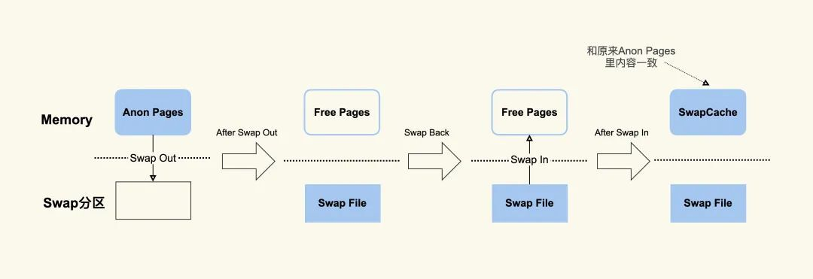

##### Page Cache 与 buffer cache

执行`free`命令，注意到会有两列名为 buffers 和 cached，也有一行名为 “-/+ buffers/cache”。

```bash
~ free -m
             total       used       free     shared    buffers     cached
Mem:        128956      96440      32515          0       5368      39900
-/+ buffers/cache:      51172      77784
Swap:        16002          0      16001
```

其中，cached 列表示当前的页缓存（Page Cache）占用量，buffers 列表示当前的块缓存（buffer cache）占用量。

用一句话来解释：Page Cache 用于缓存文件的页数据，buffer cache 用于缓存块设备（如磁盘）的块数据。

- 页是逻辑上的概念，因此 Page Cache 是与文件系统同级的；
- 块是物理上的概念，因此 buffer cache 是与块设备驱动程序同级的。

Page Cache 与 buffer cache 的共同目的都是加速数据 I/O：

- 写数据时首先写到缓存，将写入的页标记为 dirty，然后向外部存储 flush，也就是缓存写机制中的 write-back（另一种是 write-through，Linux 默认情况下不采用）；
- 读数据时首先读取缓存，如果未命中，再去外部存储读取，并且将读取来的数据也加入缓存。操作系统总是积极地将所有空闲内存都用作 Page Cache 和 buffer cache，当内存不够用时也会用 LRU 等算法淘汰缓存页。

在 Linux 2.4 版本的内核之前，Page Cache 与 buffer cache 是完全分离的。但是，块设备大多是磁盘，磁盘上的数据又大多通过文件系统来组织，这种设计导致很多数据被缓存了两次，浪费内存。

所以在 2.4 版本内核之后，两块缓存近似融合在了一起：如果一个文件的页加载到了 Page Cache，那么同时 buffer cache 只需要维护块指向页的指针就可以了。只有那些没有文件表示的块，或者绕过了文件系统直接操作（如dd命令）的块，才会真正放到 buffer cache 里。

因此，我们现在提起 Page Cache，基本上都同时指 Page Cache 和 buffer cache 两者，本文之后也不再区分，直接统称为 Page Cache。

##### Page Cache 与预读

操作系统为基于 Page Cache 的读缓存机制提供预读机制（PAGE_READAHEAD），一个例子是：

- 用户线程仅仅请求读取磁盘上文件 A 的 offset 为 0-3KB 范围内的数据，由于磁盘的基本读写单位为 block（4KB），于是操作系统至少会读 0-4KB 的内容，这恰好可以在一个 page 中装下。
- 但是操作系统出于局部性原理会选择将磁盘块 offset [4KB,8KB)、[8KB,12KB) 以及 [12KB,16KB) 都加载到内存，于是额外在内存中申请了 3 个 page。

#### Page Cache 与文件持久化的一致性&可靠性

现代 Linux 的 Page Cache 正如其名，是对磁盘上 page（页）的内存缓存，同时可以用于读/写操作。

任何系统引入缓存，就会引发一致性问题：内存中的数据与磁盘中的数据不一致，例如常见后端架构中的 Redis 缓存与 MySQL 数据库就存在一致性问题。

Linux 提供多种机制来保证数据一致性，但无论是单机上的内存与磁盘一致性，还是分布式组件中节点 1 与节点 2 、节点 3 的数据一致性问题，理解的关键是 trade-off：吞吐量与数据一致性保证是一对矛盾。

首先，需要我们理解一下文件的数据。文件 = 数据 + 元数据。元数据用来描述文件的各种属性，也必须存储在磁盘上。因此，我们说保证文件一致性其实包含了两个方面：数据一致+元数据一致。文件的元数据包括：文件大小、创建时间、访问时间、属主属组等信息。

我们考虑如下一致性问题：如果发生写操作并且对应的数据在 Page Cache 中，那么写操作就会直接作用于 Page Cache 中，此时如果数据还没刷新到磁盘，那么内存中的数据就领先于磁盘，此时对应 page 就被称为 Dirty page。

当前 Linux 下以两种方式实现文件一致性：

1. Write Through（写穿）：向用户层提供特定接口，应用程序可主动调用接口来保证文件一致性；
2. Write back（写回）：系统中存在定期任务（表现形式为内核线程），周期性地同步文件系统中文件脏数据块，这是默认的 Linux 一致性方案；

上述两种方式最终都依赖于系统调用，主要分为如下三种系统调用：

- fsync(fd)：将 fd 代表的文件的脏数据和脏元数据全部刷新至磁盘中。
- fdatasync(fd)：将 fd 代表的文件的脏数据刷新至磁盘，同时对必要的元数据刷新至磁盘中，这里所说的必要的概念是指：对接下来访问文件有关键作用的信息，如文件大小，而文件修改时间等不属于必要信息
- sync()：则是对系统中所有的脏的文件数据元数据刷新至磁盘中

上述三种系统调用可以分别由用户进程与内核进程发起。下面我们研究一下内核线程的相关特性。

1. 创建的针对写回任务的内核线程数由系统中持久存储设备决定，为每个存储设备创建单独的刷新线程；
2. 关于多线程的架构问题，Linux 内核采取了 Lighthttp 的做法，即系统中存在一个管理线程和多个刷新线程（每个持久存储设备对应一个刷新线程）。管理线程监控设备上的脏页面情况，若设备一段时间内没有产生脏页面，就销毁设备上的刷新线程；若监测到设备上有脏页面需要回写且尚未为该设备创建刷新线程，那么创建刷新线程处理脏页面回写。而刷新线程的任务较为单调，只负责将设备中的脏页面回写至持久存储设备中。
3. 刷新线程刷新设备上脏页面大致设计如下：
	- 每个设备保存脏文件链表，保存的是该设备上存储的脏文件的 inode 节点。所谓的回写文件脏页面即回写该 inode 链表上的某些文件的脏页面；
	- 系统中存在多个回写时机，第一是应用程序主动调用回写接口（fsync，fdatasync 以及 sync 等），第二管理线程周期性地唤醒设备上的回写线程进行回写，第三是某些应用程序/内核任务发现内存不足时要回收部分缓存页面而事先进行脏页面回写，设计一个统一的框架来管理这些回写任务非常有必要。

Write Through 与 Write back 在持久化的可靠性上有所不同：

- Write Through 以牺牲系统 I/O 吞吐量作为代价，向上层应用确保一旦写入，数据就已经落盘，不会丢失；
- Write back 在系统发生宕机的情况下无法确保数据已经落盘，因此存在数据丢失的问题。不过，在程序挂了，例如被 kill -9，Page Cache 中的数据操作系统还是会确保落盘；

#### Page Cache 的优劣势

##### Page Cache 的优势

1. 加快数据访问

如果数据能够在内存中进行缓存，那么下一次访问就不需要通过磁盘 I/O 了，直接命中内存缓存即可。

由于内存访问比磁盘访问快很多，因此加快数据访问是 Page Cache 的一大优势。

2. 减少 I/O 次数，提高系统磁盘 I/O 吞吐量

得益于 Page Cache 的缓存以及预读能力，而程序又往往符合局部性原理，因此通过一次 I/O 将多个 page 装入 Page Cache 能够减少磁盘 I/O 次数， 进而提高系统磁盘 I/O 吞吐量。

##### Page Cache 的劣势

Page Cache 也有其劣势，最直接的缺点是需要占用额外物理内存空间，物理内存在比较紧俏的时候可能会导致频繁的 swap 操作，最终导致系统的磁盘 I/O 负载的上升。

Page Cache 的另一个缺陷是对应用层并没有提供很好的管理 API，几乎是透明管理。应用层即使想优化 Page Cache 的使用策略也很难进行。因此一些应用选择在用户空间实现自己的 page 管理，而不使用 Page Cache，例如 MySQL InnoDB 存储引擎以 16KB 的页进行管理。

Page Cache 最后一个缺陷是在某些应用场景下比 Direct I/O 多一次磁盘读 I/O 以及磁盘写 I/O。

Direct I/O 即直接 I/O。其名字中的”直接”二字用于区分使用 Page Cache 机制的缓存 I/O。

- 缓存文件 I/O：用户空间要读写一个文件并不直接与磁盘交互，而是中间夹了一层缓存，即 page cache；
- 直接文件 I/O：用户空间读取的文件直接与磁盘交互，没有中间 page cache 层；

“直接”在这里还有另一层语义：其他所有技术中，数据至少需要在内核空间存储一份，但是在 Direct I/O 技术中，数据直接存储在用户空间中，绕过了内核。

此时用户空间直接通过 DMA 的方式与磁盘以及网卡进行数据拷贝。

Direct I/O 的读写非常有特点：

- Write 操作：由于其不使用 page cache，所以其进行写文件，如果返回成功，数据就真的落盘了（不考虑磁盘自带的缓存）；
- Read 操作：由于其不使用 page cache，每次读操作是真的从磁盘中读取，不会从文件系统的缓存中读取。

## 设备管理

### 键盘敲入 A 字母时，操作系统期间发生了什么？

#### 设备控制器

我们的电脑设备可以接非常多的输入输出设备，比如键盘、鼠标、显示器、网卡、硬盘、打印机、音响等等，每个设备的用法和功能都不同，为了屏蔽设备之间的差异，每个设备都有一个叫设备控制器（Device Control） 的组件，比如硬盘有硬盘控制器、显示器有视频控制器等。

因为这些控制器都很清楚的知道对应设备的用法和功能，所以 CPU 是通过设备控制器来和设备打交道的。

设备控制器里有芯片，它可执行自己的逻辑，也有自己的寄存器，用来与 CPU 进行通信，比如：

- 通过写入这些寄存器，操作系统可以命令设备发送数据、接收数据、开启或关闭，或者执行某些其他操作。
- 通过读取这些寄存器，操作系统可以了解设备的状态，是否准备好接收一个新的命令等。

实际上，控制器是有三类寄存器，它们分别是状态寄存器（Status Register）、 命令寄存器（Command Register）以及数据寄存器（Data Register）：

- 数据寄存器，CPU 向 I/O 设备写入需要传输的数据，比如要打印的内容是「Hello」，CPU 就要先发送一个 H 字符给到对应的 I/O 设备。
- 命令寄存器，CPU 发送一个命令，告诉 I/O 设备，要进行输入/输出操作，于是就会交给 I/O 设备去工作，任务完成后，会把状态寄存器里面的状态标记为完成。
- 状态寄存器，目的是告诉 CPU ，现在已经在工作或工作已经完成，如果已经在工作状态，CPU 再发送数据或者命令过来，都是没有用的，直到前面的工作已经完成，状态寄存标记成已完成，CPU 才能发送下一个字符和命令。

CPU 通过读写设备控制器中的寄存器控制设备，这可比 CPU 直接控制输入输出设备，要方便和标准很多。

另外， 输入输出设备可分为两大类 ：块设备（Block Device）和字符设备（Character Device）。

- 块设备，把数据存储在固定大小的块中，每个块有自己的地址，硬盘、USB 是常见的块设备。
- 字符设备，以字符为单位发送或接收一个字符流，字符设备是不可寻址的，也没有任何寻道操作，鼠标是常见的字符设备。

块设备通常传输的数据量会非常大，于是控制器设立了一个可读写的数据缓冲区。

- CPU 写入数据到控制器的缓冲区时，当缓冲区的数据囤够了一部分，才会发给设备。
- CPU 从控制器的缓冲区读取数据时，也需要缓冲区囤够了一部分，才拷贝到内存。

这样做是为了，减少对设备的频繁操作。

那 CPU 是如何与设备的控制寄存器和数据缓冲区进行通信的？存在两个方法：

- 端口 I/O，每个控制寄存器被分配一个 I/O 端口，可以通过特殊的汇编指令操作这些寄存器，比如 in/out 类似的指令。
- 内存映射 I/O，将所有控制寄存器映射到内存空间中，这样就可以像读写内存一样读写数据缓冲区。

#### I/O 控制方式

当 CPU 给设备发送了一个指令，让设备控制器去读设备的数据，它读完的时候，要怎么通知 CPU 呢？

控制器的寄存器一般会有状态标记位，用来标识输入或输出操作是否完成。于是，我们想到第一种轮询等待的方法，让 CPU 一直查寄存器的状态，直到状态标记为完成，很明显，这种方式非常的傻瓜，它会占用 CPU 的全部时间。

那我们就想到第二种方法 —— 中断，通知操作系统数据已经准备好了。我们一般会有一个硬件的中断控制器，当设备完成任务后触发中断到中断控制器，中断控制器就通知 CPU，一个中断产生了，CPU 需要停下当前手里的事情来处理中断。

另外，中断有两种，一种软中断，例如代码调用 INT 指令触发，一种是硬件中断，就是硬件通过中断控制器触发的。

但中断的方式对于频繁读写数据的磁盘，并不友好，这样 CPU 容易经常被打断，会占用 CPU 大量的时间。对于这一类设备的问题的解决方法是使用 DMA（Direct Memory Access） 功能，它可以使得设备在 CPU 不参与的情况下，能够自行完成把设备 I/O 数据放入到内存。那要实现 DMA 功能要有 「DMA 控制器」硬件的支持。

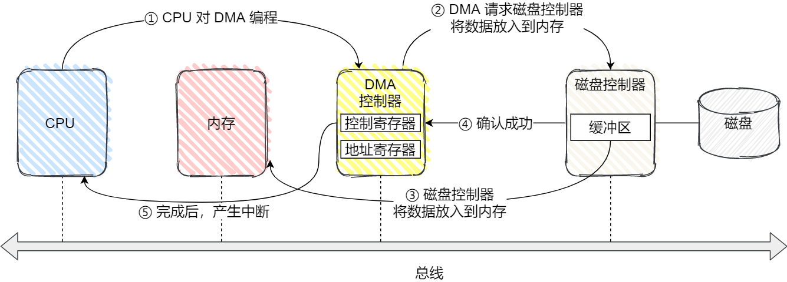

DMA 的工作方式如下：

- CPU 需对 DMA 控制器下发指令，告诉它想读取多少数据，读完的数据放在内存的某个地方就可以了；
- 接下来，DMA 控制器会向磁盘控制器发出指令，通知它从磁盘读数据到其内部的缓冲区中，接着磁盘控制器将缓冲区的数据传输到内存；
- 当磁盘控制器把数据传输到内存的操作完成后，磁盘控制器在总线上发出一个确认成功的信号到 DMA 控制器；
- DMA 控制器收到信号后，DMA 控制器发中断通知 CPU 指令完成，CPU 就可以直接用内存里面现成的数据了。

可以看到， CPU 当要读取磁盘数据的时候，只需给 DMA 控制器发送指令，然后返回去做其他事情，当磁盘数据拷贝到内存后，DMA 控制机器通过中断的方式，告诉 CPU 数据已经准备好了，可以从内存读数据了。仅仅在传送开始和结束时需要 CPU 干预。

#### 设备驱动程序

为了屏蔽「设备控制器」的差异，引入了设备驱动程序。设备控制器不属于操作系统范畴，它是属于硬件，而设备驱动程序属于操作系统的一部分，操作系统的内核代码可以像本地调用代码一样使用设备驱动程序的接口，而设备驱动程序是面向设备控制器的代码，它发出操控设备控制器的指令后，才可以操作设备控制器。

不同的设备控制器虽然功能不同，但是设备驱动程序会提供统一的接口给操作系统，这样不同的设备驱动程序，就可以以相同的方式接入操作系统。

设备完成了事情，则会发送中断来通知操作系统。那操作系统就需要有一个地方来处理这个中断，这个地方也就是在设备驱动程序里，它会及时响应控制器发来的中断请求，并根据这个中断的类型调用响应的中断处理程序进行处理。

通常，设备驱动程序初始化的时候，要先注册一个该设备的中断处理函数。

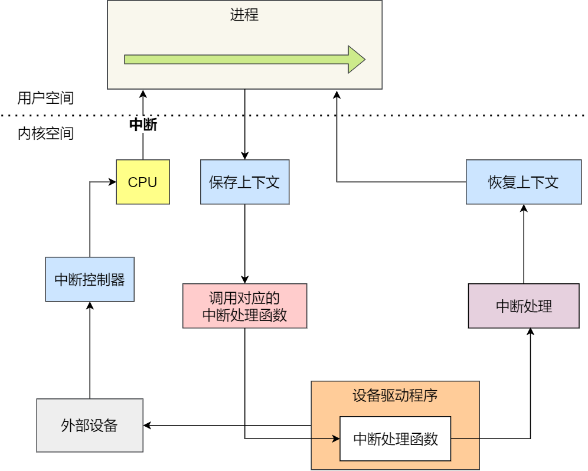

中断处理程序的处理流程：

1. 在 I/O 时，设备控制器如果已经准备好数据，则会通过中断控制器向 CPU 发送中断请求；
2. 保护被中断进程的 CPU 上下文；
3. 转入相应的设备中断处理函数；
4. 进行中断处理；
5. 恢复被中断进程的上下文；

#### 通用块层

对于块设备，为了减少不同块设备的差异带来的影响，Linux 通过一个统一的通用块层，来管理不同的块设备。

通用块层是处于文件系统和磁盘驱动中间的一个块设备抽象层，它主要有两个功能：

- 第一个功能，向上为文件系统和应用程序，提供访问块设备的标准接口，向下把各种不同的磁盘设备抽象为统一的块设备，并在内核层面，提供一个框架来管理这些设备的驱动程序；
- 第二功能，通用块层还会给文件系统和应用程序发来的 I/O 请求排队，接着会对队列重新排序、请求合并等方式，也就是 I/O 调度，主要目的是为了提高磁盘读写的效率。

Linux 内存支持 5 种 I/O 调度算法，分别是：

- 没有调度算法：它不对文件系统和应用程序的 I/O 做任何处理，这种算法常用在虚拟机 I/O 中，此时磁盘 I/O 调度算法交由物理机系统负责。
- 先入先出调度算法：这是最简单的 I/O 调度算法，先进入 I/O 调度队列的 I/O 请求先发生。
- 完全公平调度算法：大部分系统都把这个算法作为默认的 I/O 调度器，它为每个进程维护了一个 I/O 调度队列，并按照时间片来均匀分布每个进程的 I/O 请求。
- 优先级调度：优先级高的 I/O 请求先发生， 它适用于运行大量进程的系统，像是桌面环境、多媒体应用等。
- 最终期限调度算法：分别为读、写请求创建了不同的 I/O 队列，这样可以提高机械磁盘的吞吐量，并确保达到最终期限的请求被优先处理，适用于在 I/O 压力比较大的场景，比如数据库等。

#### 存储系统 I/O 软件分层

可以把 Linux 存储系统的 I/O 由上到下可以分为三个层次，分别是文件系统层、通用块层、设备层。他们整个的层次关系如下图：

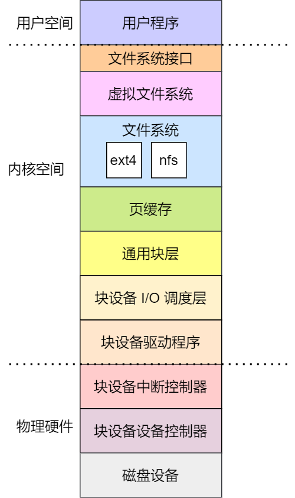

这三个层次的作用是：

- 文件系统层，包括虚拟文件系统和其他文件系统的具体实现，它向上为应用程序统一提供了标准的文件访问接口，向下会通过通用块层来存储和管理磁盘数据。
- 通用块层，包括块设备的 I/O 队列和 I/O 调度器，它会对文件系统的 I/O 请求进行排队，再通过 I/O 调度器，选择一个 I/O 发给下一层的设备层。
- 设备层，包括硬件设备、设备控制器和驱动程序，负责最终物理设备的 I/O 操作。

有了文件系统接口之后，不但可以通过文件系统的命令行操作设备，也可以通过应用程序，调用 read、write 函数，就像读写文件一样操作设备，所以说设备在 Linux 下，也只是一个特殊的文件。

但是，除了读写操作，还需要有检查特定于设备的功能和属性。于是，需要 ioctl 接口，它表示输入输出控制接口，是用于配置和修改特定设备属性的通用接口。

另外，存储系统的 I/O 是整个系统最慢的一个环节，所以 Linux 提供了不少缓存机制来提高 I/O 的效率。

- 为了提高文件访问的效率，会使用页缓存、索引节点缓存、目录项缓存等多种缓存机制，目的是为了减少对块设备的直接调用。
- 为了提高块设备的访问效率， 会使用缓冲区，来缓存块设备的数据。

#### 键盘敲入字母时，期间发生了什么？

先来看看 CPU 的硬件架构图：

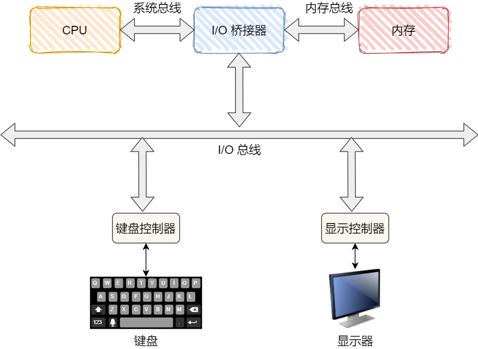

CPU 里面的内存接口，直接和系统总线通信，然后系统总线再接入一个 I/O 桥接器，这个 I/O 桥接器，另一边接入了内存总线，使得 CPU 和内存通信。再另一边，又接入了一个 I/O 总线，用来连接 I/O 设备，比如键盘、显示器等。

那当用户输入了键盘字符，键盘控制器就会产生扫描码数据，并将其缓冲在键盘控制器的寄存器中，紧接着键盘控制器通过总线给 CPU 发送中断请求。

CPU 收到中断请求后，操作系统会保存被中断进程的 CPU 上下文，然后调用键盘的中断处理程序。

键盘的中断处理程序是在键盘驱动程序初始化时注册的，那键盘中断处理函数的功能就是从键盘控制器的寄存器的缓冲区读取扫描码，再根据扫描码找到用户在键盘输入的字符，如果输入的字符是显示字符，那就会把扫描码翻译成对应显示字符的 ASCII 码，比如用户在键盘输入的是字母 A，是显示字符，于是就会把扫描码翻译成 A 字符的 ASCII 码。

得到了显示字符的 ASCII 码后，就会把 ASCII 码放到「读缓冲区队列」，接下来就是要把显示字符显示屏幕了，显示设备的驱动程序会定时从「读缓冲区队列」读取数据放到「写缓冲区队列」，最后把「写缓冲区队列」的数据一个一个写入到显示设备的控制器的寄存器中的数据缓冲区，最后将这些数据显示在屏幕里。

显示出结果后，恢复被中断进程的上下文。

## 网络系统

### 什么是零拷贝？

#### 为什么要有 DMA 技术?

在没有 DMA 技术前，I/O 的过程是这样的：

- CPU 发出对应的指令给磁盘控制器，然后返回；
- 磁盘控制器收到指令后，于是就开始准备数据，会把数据放入到磁盘控制器的内部缓冲区中，然后产生一个中断；
- CPU 收到中断信号后，停下手头的工作，接着把磁盘控制器的缓冲区的数据一次一个字节地读进自己的寄存器，然后再把寄存器里的数据写入到内存，而在数据传输的期间 CPU 是无法执行其他任务的。

整个数据的传输过程，都要需要 CPU 亲自参与搬运数据的过程，而且这个过程，CPU 是不能做其他事情的。简单的搬运几个字符数据那没问题，但是如果我们用千兆网卡或者硬盘传输大量数据的时候，都用 CPU 来搬运的话，肯定忙不过来。

什么是 DMA 技术？简单理解就是，在进行 I/O 设备和内存的数据传输的时候，数据搬运的工作全部交给 DMA 控制器，而 CPU 不再参与任何与数据搬运相关的事情，这样 CPU 就可以去处理别的事务。

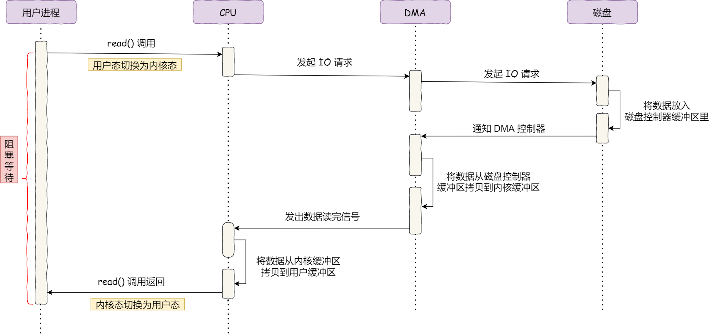

具体过程：

- 用户进程调用 read 方法，向操作系统发出 I/O 请求，请求读取数据到自己的内存缓冲区中，进程进入阻塞状态；
- 操作系统收到请求后，进一步将 I/O 请求发送 DMA，然后让 CPU 执行其他任务；
- DMA 进一步将 I/O 请求发送给磁盘；
- 磁盘收到 DMA 的 I/O 请求，把数据从磁盘读取到磁盘控制器的缓冲区中，当磁盘控制器的缓冲区被读满后，向 DMA 发起中断信号，告知自己缓冲区已满；
- DMA 收到磁盘的信号，将磁盘控制器缓冲区中的数据拷贝到内核缓冲区中，此时不占用 CPU，CPU 可以执行其他任务；
- 当 DMA 读取了足够多的数据，就会发送中断信号给 CPU；
- CPU 收到 DMA 的信号，知道数据已经准备好，于是将数据从内核拷贝到用户空间，系统调用返回；

可以看到， CPU 不再参与「将数据从磁盘控制器缓冲区搬运到内核空间」的工作，这部分工作全程由 DMA 完成。但是 CPU 在这个过程中也是必不可少的，因为传输什么数据，从哪里传输到哪里，都需要 CPU 来告诉 DMA 控制器。

早期 DMA 只存在在主板上，如今由于 I/O 设备越来越多，数据传输的需求也不尽相同，所以每个 I/O 设备里面都有自己的 DMA 控制器。

#### 传统的文件传输有多糟糕？

如果服务端要提供文件传输的功能，我们能想到的最简单的方式是：将磁盘上的文件读取出来，然后通过网络协议发送给客户端。

传统 I/O 的工作方式是，数据读取和写入是从用户空间到内核空间来回复制，而内核空间的数据是通过操作系统层面的 I/O 接口从磁盘读取或写入。

代码通常如下，一般会需要两个系统调用：

```c
read(file, tmp_buf, len);
write(socket, tmp_buf, len);
```

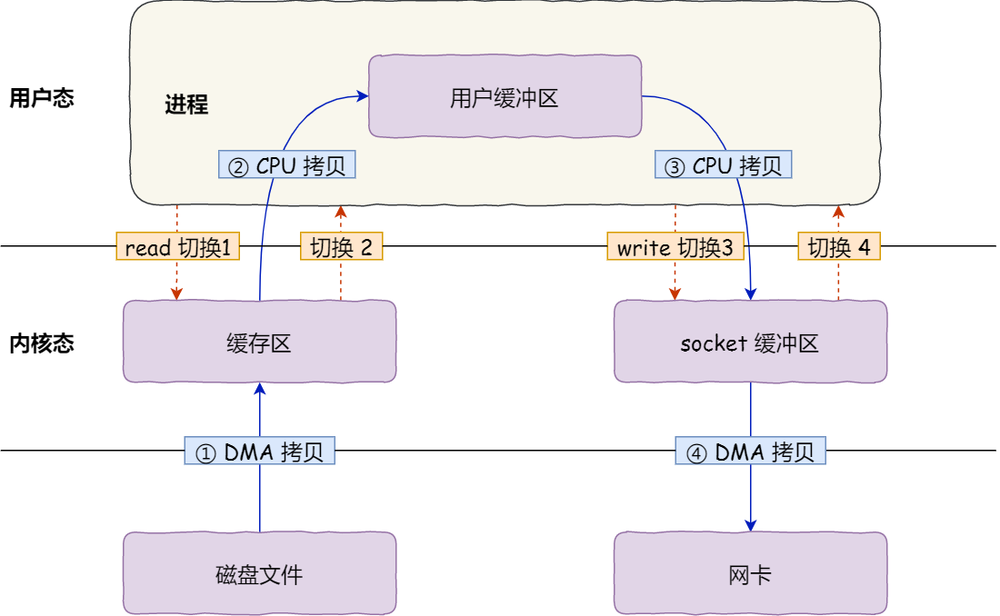

首先，期间共发生了 4 次用户态与内核态的上下文切换，因为发生了两次系统调用，一次是`read()`，一次是`write()`，每次系统调用都得先从用户态切换到内核态，等内核完成任务后，再从内核态切换回用户态。

上下文切换的成本并不小，一次切换需要耗时几十纳秒到几微秒，虽然时间看上去很短，但是在高并发的场景下，这类时间容易被累积和放大，从而影响系统的性能。

其次，还发生了 4 次数据拷贝，其中两次是 DMA 的拷贝，另外两次则是通过 CPU 拷贝的，下面说一下这个过程：

- 第一次拷贝，把磁盘上的数据拷贝到操作系统内核的缓冲区里，这个拷贝的过程是通过 DMA 搬运的。
- 第二次拷贝，把内核缓冲区的数据拷贝到用户的缓冲区里，于是我们应用程序就可以使用这部分数据了，这个拷贝到过程是由 CPU 完成的。
- 第三次拷贝，把刚才拷贝到用户的缓冲区里的数据，再拷贝到内核的 socket 的缓冲区里，这个过程依然还是由 CPU 搬运的。
- 第四次拷贝，把内核的 socket 缓冲区里的数据，拷贝到网卡的缓冲区里，这个过程又是由 DMA 搬运的。

所以，要想提高文件传输的性能，就需要减少「用户态与内核态的上下文切换」和「内存拷贝」的次数。

#### 如何优化文件传输的性能？

如何减少「用户态与内核态的上下文切换」的次数呢？

读取磁盘数据的时候，之所以要发生上下文切换，这是因为用户空间没有权限操作磁盘或网卡，内核的权限最高，这些操作设备的过程都需要交由操作系统内核来完成，所以一般要通过内核去完成某些任务的时候，就需要使用操作系统提供的系统调用函数。

而一次系统调用必然会发生 2 次上下文切换：首先从用户态切换到内核态，当内核执行完任务后，再切换回用户态交由进程代码执行。

所以，要想减少上下文切换到次数，就要减少系统调用的次数。

如何减少「数据拷贝」的次数？

传统的文件传输方式会历经 4 次数据拷贝，而且这里面，「从内核的读缓冲区拷贝到用户的缓冲区里，再从用户的缓冲区里拷贝到 socket 的缓冲区里」，这个过程是没有必要的。

因为文件传输的应用场景中，在用户空间我们并不会对数据「再加工」，所以数据实际上可以不用搬运到用户空间，因此用户的缓冲区是没有必要存在的。

#### 如何实现零拷贝？

##### mmap + write

`read()`系统调用的过程中会把内核缓冲区的数据拷贝到用户的缓冲区里，于是为了减少这一步开销，我们可以用`mmap()`替换`read()`系统调用函数。

```c
buf = mmap(file, len);
write(sockfd, buf, len);
```

`mmap()`系统调用函数会直接把内核缓冲区里的数据「映射」到用户空间，这样，操作系统内核与用户空间就不需要再进行任何的数据拷贝操作。

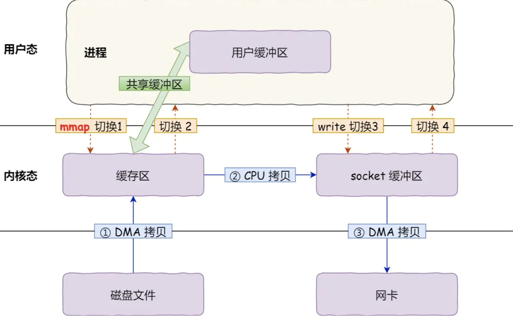

具体过程如下：

- 应用进程调用了`mmap()`后，DMA 会把磁盘的数据拷贝到内核的缓冲区里。接着，应用进程跟操作系统内核「共享」这个缓冲区；
- 应用进程再调用`write()`，操作系统直接将内核缓冲区的数据拷贝到 socket 缓冲区中，这一切都发生在内核态，由 CPU 来搬运数据；
- 最后，把内核的 socket 缓冲区里的数据，拷贝到网卡的缓冲区里，这个过程是由 DMA 搬运的。

通过使用`mmap()`来代替`read()`， 可以减少一次数据拷贝的过程。但这还不是最理想的零拷贝，因为仍然需要通过 CPU 把内核缓冲区的数据拷贝到 socket 缓冲区里，而且仍然需要 4 次上下文切换，因为系统调用还是 2 次。

##### sendfile

在 Linux 内核版本 2.1 中，提供了一个专门发送文件的系统调用函数`sendfile()`，函数形式如下：

```c
#include <sys/socket.h>
ssize_t sendfile(int out_fd, int in_fd, off_t *offset, size_t count);
```

它的前两个参数分别是目的端和源端的文件描述符，后面两个参数是源端的偏移量和复制数据的长度，返回值是实际复制数据的长度。

首先，它可以替代前面的`read()`和`write()`这两个系统调用，这样就可以减少一次系统调用，也就减少了 2 次上下文切换的开销。

其次，该系统调用，可以直接把内核缓冲区里的数据拷贝到 socket 缓冲区里，不再拷贝到用户态，这样就只有 2 次上下文切换，和 3 次数据拷贝。如下图：

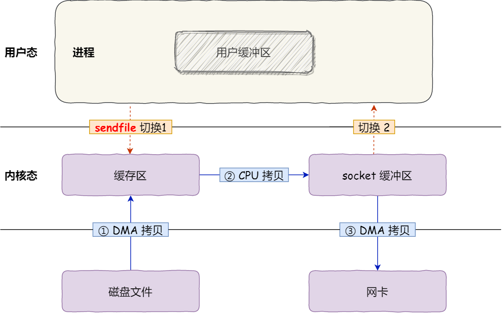

但是这还不是真正的零拷贝技术，如果网卡支持 SG-DMA（The Scatter-Gather Direct Memory Access）技术（和普通的 DMA 有所不同），我们可以进一步减少通过 CPU 把内核缓冲区里的数据拷贝到 socket 缓冲区的过程。你可以在你的 Linux 系统通过下面这个命令，查看网卡是否支持 scatter-gather 特性：

```sh
$ ethtool -k eth0 | grep scatter-gather
scatter-gather: on
```

于是，从 Linux 内核 2.4 版本开始起，对于支持网卡支持 SG-DMA 技术的情况下， `sendfile()`系统调用的过程发生了点变化，具体过程如下：

- 第一步，通过 DMA 将磁盘上的数据拷贝到内核缓冲区里；
- 第二步，缓冲区描述符和数据长度传到 socket 缓冲区，这样网卡的 SG-DMA 控制器就可以直接将内核缓存中的数据拷贝到网卡的缓冲区里，此过程不需要将数据从操作系统内核缓冲区拷贝到 socket 缓冲区中，这样就减少了一次数据拷贝；

所以，这个过程之中，只进行了 2 次数据拷贝，如下图：

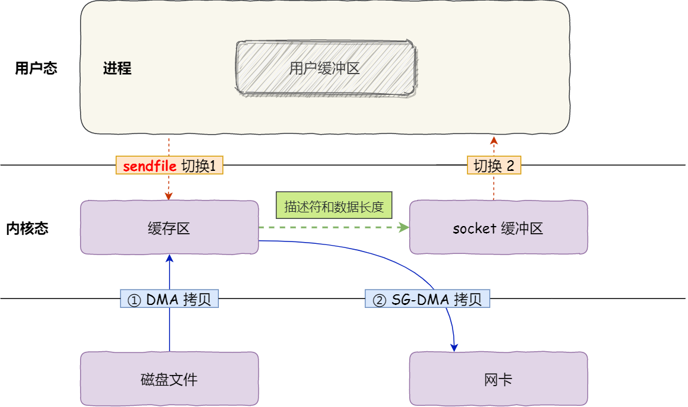

这就是所谓的零拷贝（Zero-copy）技术，因为我们没有在内存层面去拷贝数据，也就是说全程没有通过 CPU 来搬运数据，所有的数据都是通过 DMA 来进行传输的。。

零拷贝技术的文件传输方式相比传统文件传输的方式，减少了 2 次上下文切换和数据拷贝次数，只需要 2 次上下文切换和数据拷贝次数，就可以完成文件的传输，而且 2 次的数据拷贝过程，都不需要通过 CPU，2 次都是由 DMA 来搬运。

所以，总体来看，零拷贝技术可以把文件传输的性能提高至少一倍以上。

##### 使用零拷贝技术的项目

Kafka 这个开源项目，就利用了「零拷贝」技术，从而大幅提升了 I/O 的吞吐率，这也是 Kafka 在处理海量数据为什么这么快的原因之一。

另外，Nginx 也支持零拷贝技术，一般默认是开启零拷贝技术，这样有利于提高文件传输的效率。

#### PageCache 有什么作用？

文件传输过程，其中第一步都是先需要先把磁盘文件数据拷贝「内核缓冲区」里，这个「内核缓冲区」实际上是磁盘高速缓存（PageCache）。由于零拷贝使用了 PageCache 技术，可以使得零拷贝进一步提升了性能，我们接下来看看 PageCache 是如何做到这一点的。

读写磁盘相比读写内存的速度慢太多了，所以我们应该想办法把「读写磁盘」替换成「读写内存」。于是，我们会通过 DMA 把磁盘里的数据搬运到内存里，这样就可以用读内存替换读磁盘。

但是，内存空间远比磁盘要小，内存注定只能拷贝磁盘里的一小部分数据。那问题来了，选择哪些磁盘数据拷贝到内存呢？

程序运行的时候，具有「局部性」，所以通常，刚被访问的数据在短时间内再次被访问的概率很高，于是我们可以用 PageCache 来缓存最近被访问的数据，当空间不足时淘汰最久未被访问的缓存。所以，读磁盘数据的时候，优先在 PageCache 找，如果数据存在则可以直接返回；如果没有，则从磁盘中读取，然后缓存 PageCache 中。

还有一点，读取磁盘数据的时候，需要找到数据所在的位置，但是对于机械磁盘来说，就是通过磁头旋转到数据所在的扇区，再开始「顺序」读取数据，但是旋转磁头这个物理动作是非常耗时的，为了降低它的影响，PageCache 使用了「预读功能」。

所以，PageCache 的优点主要是缓存最近被访问的数据和预读功能。这两个做法，将大大提高读写磁盘的性能。

但是，在传输大文件（GB 级别的文件）的时候，PageCache 会不起作用，那就白白浪费 DMA 多做的一次数据拷贝，造成性能的降低，即使使用了 PageCache 的零拷贝也会损失性能。这是因为如果你有很多 GB 级别文件需要传输，每当用户访问这些大文件的时候，内核就会把它们载入 PageCache 中，于是 PageCache 空间很快被这些大文件占满。

另外，由于文件太大，可能某些部分的文件数据被再次访问的概率比较低，这样就会带来 2 个问题：

- PageCache 由于长时间被大文件占据，其他「热点」的小文件可能就无法充分使用到 PageCache，于是这样磁盘读写的性能就会下降了；
- PageCache 中的大文件数据，由于没有享受到缓存带来的好处，但却耗费 DMA 多拷贝到 PageCache 一次；

所以，针对大文件的传输，不应该使用 PageCache，也就是说不应该使用零拷贝技术，因为可能由于 PageCache 被大文件占据，而导致「热点」小文件无法利用到 PageCache，这样在高并发的环境下，会带来严重的性能问题。

#### 大文件传输用什么方式实现？

在高并发的场景下，针对大文件的传输的方式，应该使用「异步 I/O + 直接 I/O」来替代零拷贝技术。

直接 I/O 应用场景常见的两种：

- 应用程序已经实现了磁盘数据的缓存，那么可以不需要 PageCache 再次缓存，减少额外的性能损耗。在 MySQL 数据库中，可以通过参数设置开启直接 I/O，默认是不开启；
- 传输大文件的时候，由于大文件难以命中 PageCache 缓存，而且会占满 PageCache 导致「热点」文件无法充分利用缓存，从而增大了性能开销，因此，这时应该使用直接 I/O。

另外，由于直接 I/O 绕过了 PageCache，就无法享受内核的这两点的优化：

- 内核的 I/O 调度算法会缓存尽可能多的 I/O 请求在 PageCache 中，最后「合并」成一个更大的 I/O 请求再发给磁盘，这样做是为了减少磁盘的寻址操作；
- 内核也会「预读」后续的 I/O 请求放在 PageCache 中，一样是为了减少对磁盘的操作；

于是，传输大文件的时候，使用「异步 I/O + 直接 I/O」了，就可以无阻塞地读取文件了。

所以，传输文件的时候，我们要根据文件的大小来使用不同的方式：

- 传输大文件的时候，使用「异步 I/O + 直接 I/O」；
- 传输小文件的时候，则使用「零拷贝技术」；

在 nginx 中，我们可以用如下配置，来根据文件的大小来使用不同的方式：

```nginx
location /video/ { 
    sendfile on; 
    aio on; 
    directio 1024m; 
}
```

当文件大小大于 directio 值后，使用「异步 I/O + 直接 I/O」，否则使用「零拷贝技术」。

### I/O 多路复用：select/poll/epoll

#### 最基本的 Socket 模型

要想客户端和服务器能在网络中通信，那必须得使用 Socket 编程，它是进程间通信里比较特别的方式，特别之处在于它是可以跨主机间通信。

创建 Socket 的时候，可以指定网络层使用的是 IPv4 还是 IPv6，传输层使用的是 TCP 还是 UDP。UDP 的 Socket 编程相对简单些，这里以基于 TCP 的 Socket 编程为例。

服务器的程序要先跑起来，然后等待客户端的连接和数据，我们先来看看服务端的 Socket 编程过程是怎样的。

服务端首先调用`socket()`函数，创建网络协议为 IPv4，以及传输协议为 TCP 的 Socket ，接着调用`bind()`函数，给这个 Socket 绑定一个 IP 地址和端口，绑定这两个的目的是什么？

- 绑定端口的目的：当内核收到 TCP 报文，通过 TCP 头里面的端口号，来找到我们的应用程序，然后把数据传递给我们；
- 绑定 IP 地址的目的：一台机器是可以有多个网卡的，每个网卡都有对应的 IP 地址，当绑定一个网卡时，内核在收到该网卡上的包，才会发给我们。

绑定完 IP 地址和端口后，就可以调用`listen()`函数进行监听，此时对应 TCP 状态图中的`listen`，如果我们要判定服务器中一个网络程序有没有启动，可以通过`netstat`命令查看对应的端口号是否有被监听。

服务端进入了监听状态后，通过调用`accept()`函数，来从内核获取客户端的连接，如果没有客户端连接，则会阻塞等待客户端连接的到来。

那客户端是怎么发起连接的呢？客户端在创建好 Socket 后，调用`connect()`函数发起连接，该函数的参数要指明服务端的 IP 地址和端口号，然后 TCP 三次握手就开始了。

在 TCP 连接的过程中，服务器的内核实际上为每个 Socket 维护了两个队列：

- 一个是「还没完全建立」连接的队列，称为 TCP 半连接队列，这个队列都是没有完成三次握手的连接，此时服务端处于`syn_rcvd`的状态；
- 一个是「已经建立」连接的队列，称为 TCP 全连接队列，这个队列都是完成了三次握手的连接，此时服务端处于`established`状态；

当 TCP 全连接队列不为空后，服务端的`accept()`函数，就会从内核中的 TCP 全连接队列里拿出一个已经完成连接的 Socket 返回应用程序，后续数据传输都用这个 Socket。

注意，监听的 Socket 和真正用来传数据的 Socket 是两个：

- 一个叫作监听 Socket；
- 一个叫作已连接 Socket；

连接建立后，客户端和服务端就开始相互传输数据了，双方都可以通过`read()`和`write()`函数来读写数据。

#### 如何服务更多的用户？

服务器单机理论最大能连接多少个客户端？

TCP 连接是由四元组唯一确认的，这个四元组就是：本机IP，本机端口，对端IP，对端端口。

服务器作为服务方，通常会在本地固定监听一个端口，等待客户端的连接。因此服务器的本地 IP 和端口是固定的，于是对于服务端 TCP 连接的四元组只有对端 IP 和端口是会变化的，所以最大 TCP 连接数 = 客户端 IP 数 × 客户端端口数。

对于 IPv4，客户端的 IP 数最多为 2 的 32 次方，客户端的端口数最多为 2 的 16 次方，也就是服务端单机最大 TCP 连接数约为 2 的 48 次方。

这只是理论值，但是服务器肯定承载不了那么大的连接数，主要会受两个方面的限制：

- 文件描述符，Socket 实际上是一个文件，也就会对应一个文件描述符。在 Linux 下，单个进程打开的文件描述符数是有限制的，没有经过修改的值一般都是 1024，不过我们可以通过`ulimit`增大文件描述符的数目；
- 系统内存，每个 TCP 连接在内核中都有对应的数据结构，意味着每个连接都是会占用一定内存的；

那如果服务器的内存只有 2 GB，网卡是千兆的，能支持并发 1 万请求吗？

并发 1 万请求，也就是经典的 C10K 问题 ，C 是 Client 单词首字母缩写，C10K 就是单机同时处理 1 万个请求的问题。

从硬件资源角度看，对于 2GB 内存千兆网卡的服务器，如果每个请求处理占用不到 200KB 的内存和 100Kbit 的网络带宽就可以满足并发 1 万个请求。不过，要想真正实现 C10K 的服务器，要考虑的地方在于服务器的网络 I/O 模型，效率低的模型，会加重系统开销，从而会离 C10K 的目标越来越远。

#### 多进程模型

基于最原始的阻塞网络 I/O， 如果服务器要支持多个客户端，其中比较传统的方式，就是使用多进程模型，也就是为每个客户端分配一个进程来处理请求。

服务器的主进程负责监听客户的连接，一旦与客户端连接完成，`accept()`函数就会返回一个「已连接 Socket」，这时就通过`fork()`函数创建一个子进程，实际上就把父进程所有相关的东西都复制一份，包括文件描述符、内存地址空间、程序计数器、执行的代码等。

这两个进程刚复制完的时候，几乎一模一样。不过，会根据返回值来区分是父进程还是子进程，如果返回值是 0，则是子进程；如果返回值是其他的整数，就是父进程。正因为子进程会复制父进程的文件描述符，于是就可以直接使用「已连接 Socket 」和客户端通信了，

可以发现，子进程不需要关心「监听 Socket」，只需要关心「已连接 Socket」；父进程则相反，将客户服务交给子进程来处理，因此父进程不需要关心「已连接 Socket」，只需要关心「监听 Socket」。

另外，当「子进程」退出时，实际上内核里还会保留该进程的一些信息，也是会占用内存的，如果不做好“回收”工作，就会变成僵尸进程，随着僵尸进程越多，会慢慢耗尽我们的系统资源。

因此，父进程要“善后”好自己的孩子，怎么善后呢？那么有两种方式可以在子进程退出后回收资源，分别是调用`wait()`和`waitpid()`函数。

这种用多个进程来应付多个客户端的方式，在应对 100 个客户端还是可行的，但是当客户端数量高达一万时，肯定扛不住的，因为每产生一个进程，必会占据一定的系统资源，而且进程间上下文切换的“包袱”是很重的，性能会大打折扣。

进程的上下文切换不仅包含了虚拟内存、栈、全局变量等用户空间的资源，还包括了内核堆栈、寄存器等内核空间的资源。

#### 多线程模型

线程是运行在进程中的一个“逻辑流”，单进程中可以运行多个线程，同进程里的线程可以共享进程的部分资源，比如文件描述符列表、进程空间、代码、全局数据、堆、共享库等，这些共享些资源在上下文切换时不需要切换，而只需要切换线程的私有数据、寄存器等不共享的数据，因此同一个进程下的线程上下文切换的开销要比进程小得多。

当服务器与客户端 TCP 完成连接后，通过`pthread_create()`函数创建线程，然后将「已连接 Socket」的文件描述符传递给线程函数，接着在线程里和客户端进行通信，从而达到并发处理的目的。

如果每来一个连接就创建一个线程，线程运行完后，还得操作系统还得销毁线程，虽说线程切换的上写文开销不大，但是如果频繁创建和销毁线程，系统开销也是不小的。

那么，我们可以使用线程池的方式来避免线程的频繁创建和销毁，所谓的线程池，就是提前创建若干个线程，这样当由新连接建立时，将这个已连接的 Socket 放入到一个队列里，然后线程池里的线程负责从队列中取出「已连接 Socket 」进行处理。

需要注意的是，这个队列是全局的，每个线程都会操作，为了避免多线程竞争，线程在操作这个队列前要加锁。

上面基于进程或者线程模型的，其实还是有问题的。新到来一个 TCP 连接，就需要分配一个进程或者线程，那么如果要达到 C10K，意味着要一台机器维护 1 万个连接，相当于要维护 1 万个进程/线程，操作系统就算死扛也是扛不住的。

#### I/O 多路复用

一个进程虽然任一时刻只能处理一个请求，但是处理每个请求的事件时，耗时控制在 1 毫秒以内，这样 1 秒内就可以处理上千个请求，把时间拉长来看，多个请求复用了一个进程，这就是多路复用，这种思想很类似一个 CPU 并发多个进程，所以也叫做时分多路复用。

`select/poll/epoll`内核提供给用户态的多路复用系统调用，进程可以通过一个系统调用函数从内核中获取多个事件。

`select/poll/epoll`是如何获取网络事件的呢？在获取事件时，先把所有连接（文件描述符）传给内核，再由内核返回产生了事件的连接，然后在用户态中再处理这些连接对应的请求即可。

##### select/poll

select 实现多路复用的方式是，将已连接的 Socket 都放到一个文件描述符集合，然后调用 select 函数将文件描述符集合拷贝到内核里，让内核来检查是否有网络事件产生，检查的方式很粗暴，就是通过遍历文件描述符集合的方式，当检查到有事件产生后，将此 Socket 标记为可读或可写， 接着再把整个文件描述符集合拷贝回用户态里，然后用户态还需要再通过遍历的方法找到可读或可写的 Socket，然后再对其处理。

所以，对于 select 这种方式，需要进行 2 次「遍历」文件描述符集合，一次是在内核态里，一个次是在用户态里 ，而且还会发生 2 次「拷贝」文件描述符集合，先从用户空间传入内核空间，由内核修改后，再传出到用户空间中。

select 使用固定长度的 BitsMap，表示文件描述符集合，而且所支持的文件描述符的个数是有限制的，在 Linux 系统中，由内核中的 FD_SETSIZE 限制， 默认最大值为 1024，只能监听 0~1023 的文件描述符。

poll 不再用 BitsMap 来存储所关注的文件描述符，取而代之用动态数组，以链表形式来组织，突破了 select 的文件描述符个数限制，当然还会受到系统文件描述符限制。

但是 poll 和 select 并没有太大的本质区别，都是使用「线性结构」存储进程关注的 Socket 集合，因此都需要遍历文件描述符集合来找到可读或可写的 Socket，时间复杂度为 O(n)，而且也需要在用户态与内核态之间拷贝文件描述符集合，这种方式随着并发数上来，性能的损耗会呈指数级增长。

##### epoll

先复习下 epoll 的用法。如下的代码中，先用`epoll_create`创建一个 epoll 对象 epfd，再通过`epoll_ctl`将需要监视的 socket 添加到 epfd 中，最后调用`epoll_wait`等待数据。

```c
int s = socket(AF_INET, SOCK_STREAM, 0);
bind(s, ...);
listen(s, ...)

int epfd = epoll_create(...);
epoll_ctl(epfd, ...); //将所有需要监听的socket添加到epfd中

while(1) {
    int n = epoll_wait(...);
    for(接收到数据的socket){
        //处理
    }
}
```

epoll 通过两个方面，很好解决了 select/poll 的问题。

第一点，epoll 在内核里使用红黑树来跟踪进程所有待检测的文件描述字，把需要监控的 socket 通过`epoll_ctl()`函数加入内核中的红黑树里，红黑树是个高效的数据结构，增删改一般时间复杂度是`O(logn)`。而`select/poll`内核里没有类似 epoll 红黑树这种保存所有待检测的 socket 的数据结构，所以`select/poll`每次操作时都传入整个 socket 集合给内核，而 epoll 因为在内核维护了红黑树，可以保存所有待检测的 socket ，所以只需要传入一个待检测的 socket，减少了内核和用户空间大量的数据拷贝和内存分配。

第二点， epoll 使用事件驱动的机制，内核里维护了一个链表来记录就绪事件，当某个 socket 有事件发生时，通过回调函数内核会将其加入到这个就绪事件列表中，当用户调用`epoll_wait()`函数时，只会返回有事件发生的文件描述符的个数，不需要像`select/poll`那样轮询扫描整个 socket 集合，大大提高了检测的效率。

从下图你可以看到 epoll 相关的接口作用：

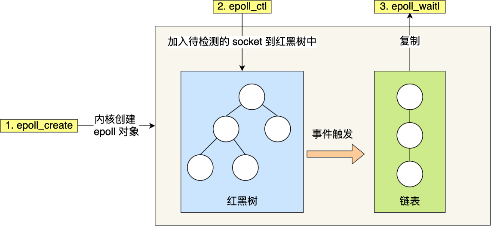

epoll 的方式即使监听的 Socket 数量越多的时候，效率不会大幅度降低，能够同时监听的 Socket 的数目也非常的多了，上限就为系统定义的进程打开的最大文件描述符个数。因而，epoll 被称为解决 C10K 问题的利器。

epoll 支持两种事件触发模式，分别是边缘触发（edge-triggered，ET）和水平触发（level-triggered，LT）。

- 使用边缘触发模式时，当被监控的 Socket 描述符上有可读事件发生时，服务器端只会从`epoll_wait`中苏醒一次，即使进程没有调用 read 函数从内核读取数据，也依然只苏醒一次，因此我们程序要保证一次性将内核缓冲区的数据读取完；
- 使用水平触发模式时，当被监控的 Socket 上有可读事件发生时，服务器端不断地从`epoll_wait`中苏醒，直到内核缓冲区数据被 read 函数读完才结束，目的是告诉我们有数据需要读取；

举个例子，你的快递被放到了一个快递箱里，如果快递箱只会通过短信通知你一次，即使你一直没有去取，它也不会再发送第二条短信提醒你，这个方式就是边缘触发；如果快递箱发现你的快递没有被取出，它就会不停地发短信通知你，直到你取出了快递，它才消停，这个就是水平触发的方式。

这就是两者的区别，水平触发的意思是只要满足事件的条件，比如内核中有数据需要读，就一直不断地把这个事件传递给用户；而边缘触发的意思是只有第一次满足条件的时候才触发，之后就不会再传递同样的事件了。

如果使用水平触发模式，当内核通知文件描述符可读写时，接下来还可以继续去检测它的状态，看它是否依然可读或可写。所以在收到通知后，没必要一次执行尽可能多的读写操作。

如果使用边缘触发模式，I/O 事件发生时只会通知一次，而且我们不知道到底能读写多少数据，所以在收到通知后应尽可能地读写数据，以免错失读写的机会。因此，我们会循环从文件描述符读写数据，那么如果文件描述符是阻塞的，没有数据可读写时，进程会阻塞在读写函数那里，程序就没办法继续往下执行。所以，边缘触发模式一般和非阻塞 I/O 搭配使用，程序会一直执行 I/O 操作，直到系统调用（如 read 和 write）返回错误，错误类型为 EAGAIN 或 EWOULDBLOCK。

一般来说，边缘触发的效率比水平触发的效率要高，因为边缘触发可以减少`epoll_wait`的系统调用次数，系统调用也是有一定的开销的的，毕竟也存在上下文的切换。

`select/poll`只有水平触发模式，`epoll`默认的触发模式是水平触发，但是可以根据应用场景设置为边缘触发模式。

另外，多路复用 API 返回的事件并不一定可读写的，如果使用阻塞 I/O， 那么在调用 read/write 时则会发生程序阻塞，因此最好搭配非阻塞 I/O，以便应对极少数的特殊情况。

#### 高性能网络模式：Reactor 和 Proactor

如果要让服务器服务多个客户端，那么最直接的方式就是为每一条连接创建线程。其实创建进程也是可以的，原理是一样的，进程和线程的区别在于线程比较轻量级些，线程的创建和线程间切换的成本要小些，为了描述简述，后面都以线程为例。

处理完业务逻辑后，随着连接关闭后线程也同样要销毁了，但是这样不停地创建和销毁线程，不仅会带来性能开销，也会造成浪费资源，而且如果要连接几万条连接，创建几万个线程去应对也是不现实的。

要怎么解决这个问题呢？我们可以使用「资源复用」的方式。

也就是不用再为每个连接创建线程，而是创建一个「线程池」，将连接分配给线程，然后一个线程可以处理多个连接的业务。不过，这样又引来一个新的问题，线程怎样才能高效地处理多个连接的业务？

当一个连接对应一个线程时，线程一般采用「read -> 业务处理 -> send」的处理流程，如果当前连接没有数据可读，那么线程会阻塞在 read 操作上（ socket 默认情况是阻塞 I/O），不过这种阻塞方式并不影响其他线程。但是引入了线程池，那么一个线程要处理多个连接的业务，线程在处理某个连接的 read 操作时，如果遇到没有数据可读，就会发生阻塞，那么线程就没办法继续处理其他连接的业务。

要解决这一个问题，最简单的方式就是将 socket 改成非阻塞，然后线程不断地轮询调用 read 操作来判断是否有数据，这种方式虽然该能够解决阻塞的问题，但是解决的方式比较粗暴，因为轮询是要消耗 CPU 的，而且随着一个 线程处理的连接越多，轮询的效率就会越低。

上面的问题在于，线程并不知道当前连接是否有数据可读，从而需要每次通过 read 去试探。

那有没有办法在只有当连接上有数据的时候，线程才去发起读请求呢？答案是有的，实现这一技术的就是 I/O 多路复用。

I/O 多路复用技术会用一个系统调用函数来监听我们所有关心的连接，也就说可以在一个监控线程里面监控很多的连接。

`select/poll/epoll`就是内核提供给用户态的多路复用系统调用，线程可以通过一个系统调用函数从内核中获取多个事件。

`select/poll/epoll`是如何获取网络事件的呢？

在获取事件时，先把我们要关心的连接传给内核，再由内核检测：

- 如果没有事件发生，线程只需阻塞在这个系统调用，而无需像前面的线程池方案那样轮训调用 read 操作来判断是否有数据。
- 如果有事件发生，内核会返回产生了事件的连接，线程就会从阻塞状态返回，然后在用户态中再处理这些连接对应的业务即可。

程序员们基于面向对象的思想，对 I/O 多路复用作了一层封装，即 Reactor 模式。

这里的反应指的是「对事件反应」，也就是来了一个事件，Reactor 就有相对应的反应/响应。Reactor 模式也叫 Dispatcher 模式，即 I/O 多路复用监听事件，收到事件后，根据事件类型分配（Dispatch）给某个进程 / 线程。

Reactor 模式主要由 Reactor 和处理资源池这两个核心部分组成，它俩负责的事情如下：

- Reactor 负责监听和分发事件，事件类型包含连接事件、读写事件；
- 那处理资源池负责处理事件，如 read -> 业务逻辑 -> send；

Reactor 模式是灵活多变的，可以应对不同的业务场景，灵活在于：

- Reactor 的数量可以只有一个，也可以有多个；
- 处理资源池可以是单个进程 / 线程，也可以是多个进程 /线程；

所以总共就会有四种方案，即单 Reactor 单进程 / 线程、单 Reactor 多进程 / 线程、多 Reactor 单进程 / 线程、多 Reactor 多进程 / 线程。其中，「多 Reactor 单进程 / 线程」实现方案相比「单 Reactor 单进程 / 线程」方案，不仅复杂而且也没有性能优势，因此实际中并没有应用。

#### Reactor

##### 单 Reactor 单进程 / 线程

一般来说，C 语言实现的是「单 Reactor 单进程」的方案，因为 C 语编写完的程序，运行后就是一个独立的进程，不需要在进程中再创建线程。而 Java 语言实现的是「单 Reactor 单线程」的方案，因为 Java 程序是跑在 Java 虚拟机这个进程上面的，虚拟机中有很多线程，我们写的 Java 程序只是其中的一个线程而已。

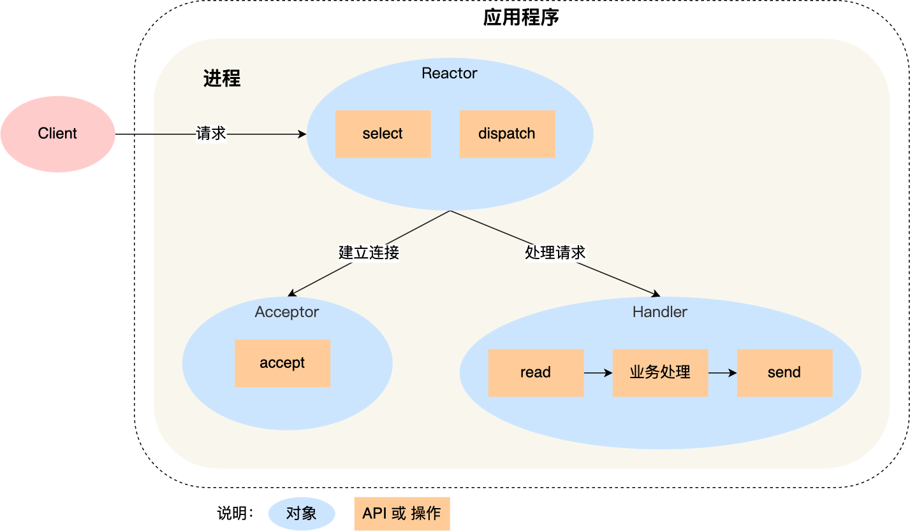

可以看到进程里有 Reactor、Acceptor、Handler 这三个对象：

- Reactor 对象的作用是监听和分发事件；
- Acceptor 对象的作用是获取连接；
- Handler 对象的作用是处理业务；

对象里的 select、accept、read、send 是系统调用函数，dispatch 和 「业务处理」是需要完成的操作，其中 dispatch 是分发事件操作。

介绍下「单 Reactor 单进程」这个方案：

- Reactor 对象通过 select （IO 多路复用接口） 监听事件，收到事件后通过 dispatch 进行分发，具体分发给 Acceptor 对象还是 Handler 对象，还要看收到的事件类型；
- 如果是连接建立的事件，则交由 Acceptor 对象进行处理，Acceptor 对象会通过 accept 方法 获取连接，并创建一个 Handler 对象来处理后续的响应事件；
- 如果不是连接建立事件， 则交由当前连接对应的 Handler 对象来进行响应；
- Handler 对象通过 read -> 业务处理 -> send 的流程来完成完整的业务流程。

单 Reactor 单进程的方案因为全部工作都在同一个进程内完成，所以实现起来比较简单，不需要考虑进程间通信，也不用担心多进程竞争。

但是，这种方案存在 2 个缺点：

- 第一个缺点，因为只有一个进程，无法充分利用 多核 CPU 的性能；
- 第二个缺点，Handler 对象在业务处理时，整个进程是无法处理其他连接的事件的，如果业务处理耗时比较长，那么就造成响应的延迟；

所以，单 Reactor 单进程的方案不适用计算机密集型的场景，只适用于业务处理非常快速的场景。

Redis 是由 C 语言实现的，在 Redis 6.0 版本之前采用的正是「单 Reactor 单进程」的方案，因为 Redis 业务处理主要是在内存中完成，操作的速度是很快的，性能瓶颈不在 CPU 上，所以 Redis 对于命令的处理是单进程的方案。

##### 单 Reactor 多线程 / 多进程

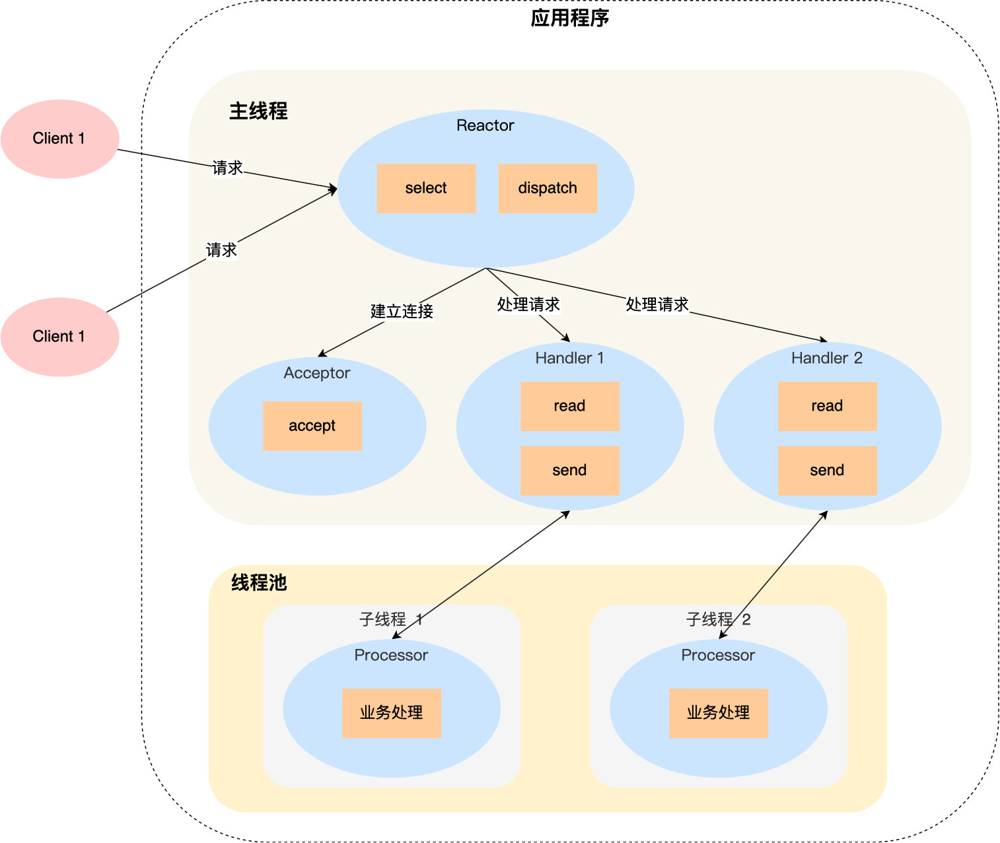

详细说一下这个方案：

- Reactor 对象通过 select （IO 多路复用接口） 监听事件，收到事件后通过 dispatch 进行分发，具体分发给 Acceptor 对象还是 Handler 对象，还要看收到的事件类型；
- 如果是连接建立的事件，则交由 Acceptor 对象进行处理，Acceptor 对象会通过 accept 方法 获取连接，并创建一个 Handler 对象来处理后续的响应事件；
- 如果不是连接建立事件， 则交由当前连接对应的 Handler 对象来进行响应；

上面的三个步骤和单 Reactor 单线程方案是一样的，接下来的步骤就开始不一样了：

- Handler 对象不再负责业务处理，只负责数据的接收和发送，Handler 对象通过 read 读取到数据后，会将数据发给子线程里的 Processor 对象进行业务处理；
- 子线程里的 Processor 对象就进行业务处理，处理完后，将结果发给主线程中的 Handler 对象，接着由 Handler 通过 send 方法将响应结果发送给 client；

单 Reator 多线程的方案优势在于能够充分利用多核 CPU ，那既然引入多线程，那么自然就带来了多线程竞争资源的问题。

例如，子线程完成业务处理后，要把结果传递给主线程的 Handler 进行发送，这里涉及共享数据的竞争。

要避免多线程由于竞争共享资源而导致数据错乱的问题，就需要在操作共享资源前加上互斥锁，以保证任意时间里只有一个线程在操作共享资源，待该线程操作完释放互斥锁后，其他线程才有机会操作共享数据。

聊完单 Reactor 多线程的方案，接着来看看单 Reactor 多进程的方案。

事实上，单 Reactor 多进程相比单 Reactor 多线程实现起来很麻烦，主要因为要考虑子进程 <-> 父进程的双向通信，并且父进程还得知道子进程要将数据发送给哪个客户端。

而多线程间可以共享数据，虽然要额外考虑并发问题，但是这远比进程间通信的复杂度低得多，因此实际应用中也看不到单 Reactor 多进程的模式。

另外，「单 Reactor」的模式还有个问题，因为一个 Reactor 对象承担所有事件的监听和响应，而且只在主线程中运行，在面对瞬间高并发的场景时，容易成为性能的瓶颈的地方。

##### 多 Reactor 多进程 / 线程

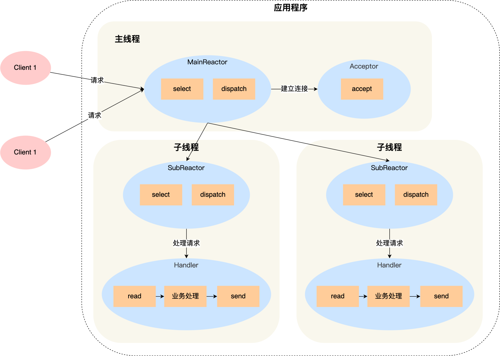

方案详细说明如下：

- 主线程中的 MainReactor 对象通过 select 监控连接建立事件，收到事件后通过 Acceptor 对象中的 accept 获取连接，将新的连接分配给某个子线程；
- 子线程中的 SubReactor 对象将 MainReactor 对象分配的连接加入 select 继续进行监听，并创建一个 Handler 用于处理连接的响应事件。
- 如果有新的事件发生时，SubReactor 对象会调用当前连接对应的 Handler 对象来进行响应。
- Handler 对象通过 read -> 业务处理 -> send 的流程来完成完整的业务流程。

多 Reactor 多线程的方案虽然看起来复杂的，但是实际实现时比单 Reactor 多线程的方案要简单的多，原因如下：

- 主线程和子线程分工明确，主线程只负责接收新连接，子线程负责完成后续的业务处理。
- 主线程和子线程的交互很简单，主线程只需要把新连接传给子线程，子线程无须返回数据，直接就可以在子线程将处理结果发送给客户端。

#### Proactor

前面提到的 Reactor 是非阻塞同步网络模式，而 Proactor 是异步网络模式。

- Reactor 是非阻塞同步网络模式，感知的是就绪可读写事件。在每次感知到有事件发生（比如可读就绪事件）后，就需要应用进程主动调用 read 方法来完成数据的读取，也就是要应用进程主动将 socket 接收缓存中的数据读到应用进程内存中，这个过程是同步的，读取完数据后应用进程才能处理数据。
- Proactor 是异步网络模式， 感知的是已完成的读写事件。在发起异步读写请求时，需要传入数据缓冲区的地址（用来存放结果数据）等信息，这样系统内核才可以自动帮我们把数据的读写工作完成，这里的读写工作全程由操作系统来做，并不需要像 Reactor 那样还需要应用进程主动发起 read/write 来读写数据，操作系统完成读写工作后，就会通知应用进程直接处理数据。

因此，Reactor 可以理解为「来了事件操作系统通知应用进程，让应用进程来处理」，而 Proactor 可以理解为「来了事件操作系统来处理，处理完再通知应用进程」。这里的「事件」就是有新连接、有数据可读、有数据可写的这些 I/O 事件这里的「处理」包含从驱动读取到内核以及从内核读取到用户空间。

无论是 Reactor，还是 Proactor，都是一种基于「事件分发」的网络编程模式，区别在于 Reactor 模式是基于「待完成」的 I/O 事件，而 Proactor 模式则是基于「已完成」的 I/O 事件。

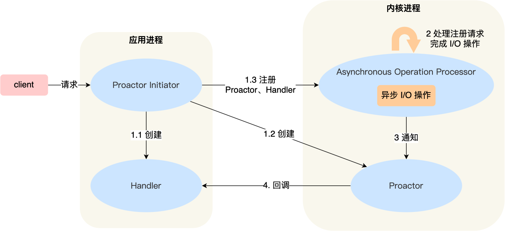

- Proactor Initiator 负责创建 Proactor 和 Handler 对象，并将 Proactor 和 Handler 都通过 Asynchronous Operation Processor 注册到内核；
- Asynchronous Operation Processor 负责处理注册请求，并处理 I/O 操作；
- Asynchronous Operation Processor 完成 I/O 操作后通知 Proactor；
- Proactor 根据不同的事件类型回调不同的 Handler 进行业务处理；
- Handler 完成业务处理；

可惜的是，在 Linux 下的异步 I/O 是不完善的， aio 系列函数是由 POSIX 定义的异步操作接口，不是真正的操作系统级别支持的，而是在用户空间模拟出来的异步，并且仅仅支持基于本地文件的 aio 异步操作，网络编程中的 socket 是不支持的，这也使得基于 Linux 的高性能网络程序都是使用 Reactor 方案。

而 Windows 里实现了一套完整的支持 socket 的异步编程接口，这套接口就是 IOCP，是由操作系统级别实现的异步 I/O，真正意义上异步 I/O，因此在 Windows 里实现高性能网络程序可以使用效率更高的 Proactor 方案。

### 什么是一致性哈希？

#### 使用哈希算法有什么问题？

如果节点数量发生了变化，也就是在对系统做扩容或者缩容时，必须迁移改变了映射关系的数据，否则会出现查询不到数据的问题。

举个例子，假设我们有一个由 A、B、C 三个节点组成分布式 KV 缓存系统，基于计算公式`hash(key) % 3`将数据进行了映射，每个节点存储了不同的数据。

现在有 3 个查询 key 的请求，分别查询 key-01，key-02，key-03 的数据，这三个 key 分别经过 hash() 函数计算后的值为`hash( key-01) = 6`、`hash( key-02) = 7`、`hash(key-03) = 8`，然后再对这些值进行取模运算。

当 3 个节点不能满足业务需求了，这时我们增加了一个节点，节点的数量从 3 变化为 4，意味取模哈希函数中基数的变化，这样会导致大部分映射关系改变。比如，之前的`hash(key-01) % 3 = 0`，就变成了`hash(key-01) % 4 = 2`，查询 key-01 数据时，寻址到了节点 C，而 key-01 的数据是存储在节点 A 上的，不是在节点 C，所以会查询不到数据。

要解决这个问题的办法，就需要我们进行迁移数据，比如节点的数量从 3 变化为 4 时，要基于新的计算公式`hash(key) % 4`，重新对数据和节点做映射。假设总数据条数为 M，哈希算法在面对节点数量变化时，最坏情况下所有数据都需要迁移，所以它的数据迁移规模是 O(M)，这样数据的迁移成本太高了。

#### 使用一致性哈希算法有什么问题？

一致性哈希算法就很好地解决了分布式系统在扩容或者缩容时，发生过多的数据迁移的问题。

一致哈希算法也用了取模运算，但与哈希算法不同的是，哈希算法是对节点的数量进行取模运算，而一致哈希算法是对 2^32 进行取模运算，是一个固定的值。

我们可以把一致哈希算法是对 2^32 进行取模运算的结果值组织成一个圆环，就像钟表一样，钟表的圆可以理解成由 60 个点组成的圆，而此处我们把这个圆想象成由 2^32 个点组成的圆，这个圆环被称为哈希环。

一致性哈希要进行两步哈希：

- 第一步：对存储节点进行哈希计算，也就是对存储节点做哈希映射，比如根据节点的 IP 地址进行哈希；
- 第二步：当对数据进行存储或访问时，对数据进行哈希映射；

所以，一致性哈希是指将「存储节点」和「数据」都映射到一个首尾相连的哈希环上。

对「数据」进行哈希映射得到一个结果要怎么找到存储该数据的节点呢？映射的结果值往顺时针的方向的找到第一个节点，就是存储该数据的节点。

在一致哈希算法中，如果增加或者移除一个节点，仅影响该节点在哈希环上顺时针相邻的后继节点，其它数据也不会受到影响。

但是一致性哈希算法并不保证节点能够在哈希环上分布均匀，这样就会带来一个问题，会有大量的请求集中在一个节点上。

另外，在这种节点分布不均匀的情况下，进行容灾与扩容时，哈希环上的相邻节点容易受到过大影响，容易发生雪崩式的连锁反应。

比如，如果节点 A 被移除了，当节点 A 宕机后，根据一致性哈希算法的规则，其上数据应该全部迁移到相邻的节点 B 上，这样，节点 B 的数据量、访问量都会迅速增加很多倍，一旦新增的压力超过了节点 B 的处理能力上限，就会导致节点 B 崩溃，进而形成雪崩式的连锁反应。

所以，一致性哈希算法虽然减少了数据迁移量，但是存在节点分布不均匀的问题。

#### 如何通过虚拟节点提高均衡度？

要想解决节点能在哈希环上分配不均匀的问题，就是要有大量的节点，节点数越多，哈希环上的节点分布的就越均匀。

但问题是，实际中我们没有那么多节点。所以这个时候我们就加入虚拟节点，也就是对一个真实节点做多个副本。

具体做法是，不再将真实节点映射到哈希环上，而是将虚拟节点映射到哈希环上，并将虚拟节点映射到实际节点，所以这里有「两层」映射关系。

比如对每个节点分别设置 3 个虚拟节点：

- 对节点 A 加上编号来作为虚拟节点：A-01、A-02、A-03
- 对节点 B 加上编号来作为虚拟节点：B-01、B-02、B-03
- 对节点 C 加上编号来作为虚拟节点：C-01、C-02、C-03

节点数量多了后，节点在哈希环上的分布就相对均匀了。这时候，如果有访问请求寻址到「A-01」这个虚拟节点，接着再通过「A-01」虚拟节点找到真实节点 A，这样请求就能访问到真实节点 A 了。

在实际的工程中，虚拟节点的数量会大很多，比如 Nginx 的一致性哈希算法，每个权重为 1 的真实节点就含有160 个虚拟节点。

另外，虚拟节点除了会提高节点的均衡度，还会提高系统的稳定性。当节点变化时，会有不同的节点共同分担系统的变化，因此稳定性更高。

比如，当某个节点被移除时，对应该节点的多个虚拟节点均会移除，而这些虚拟节点按顺时针方向的下一个虚拟节点，可能会对应不同的真实节点，即这些不同的真实节点共同分担了节点变化导致的压力。

而且，有了虚拟节点后，还可以为硬件配置更好的节点增加权重，比如对权重更高的节点增加更多的虚拟机节点即可。

因此，带虚拟节点的一致性哈希方法不仅适合硬件配置不同的节点的场景，而且适合节点规模会发生变化的场景。

## Linux 命令

### 如何查看网络的性能指标？

#### 性能指标有哪些？

通常是以 4 个指标来衡量网络的性能，分别是带宽、延时、吞吐率、PPS（Packet Per Second），它们表示的意义如下：

- 带宽，表示链路的最大传输速率，单位是 b/s （比特 / 秒），带宽越大，其传输能力就越强。
- 延时，表示请求数据包发送后，收到对端响应，所需要的时间延迟。不同的场景有着不同的含义，比如可以表示建立 TCP 连接所需的时间延迟，或一个数据包往返所需的时间延迟。
- 吞吐率，表示单位时间内成功传输的数据量，单位是 b/s（比特 / 秒）或者 B/s（字节 / 秒），吞吐受带宽限制，带宽越大，吞吐率的上限才可能越高。
- PPS，全称是 Packet Per Second（包 / 秒），表示以网络包为单位的传输速率，一般用来评估系统对于网络的转发能力。

当然，除了以上这四种基本的指标，还有一些其他常用的性能指标，比如：

- 网络的可用性，表示网络能否正常通信；
- 并发连接数，表示 TCP 连接数量；
- 丢包率，表示所丢失数据包数量占所发送数据组的比率；
- 重传率，表示重传网络包的比例。

#### 网络配置如何看？

要想知道网络的配置和状态，我们可以使用`ifconfig`或者`ip`命令来查看。

这两个命令功能都差不多，不过它们属于不同的软件包，`ifconfig`属于`net-tools`软件包，`ip`属于`iproute2`软件包，我的印象中`net-tools`软件包没有人继续维护了，而`iproute2`软件包是有开发者依然在维护，所以更推荐你使用`ip`工具。

使用这两个命令，来查看网口 `eth0` 的配置等信息：

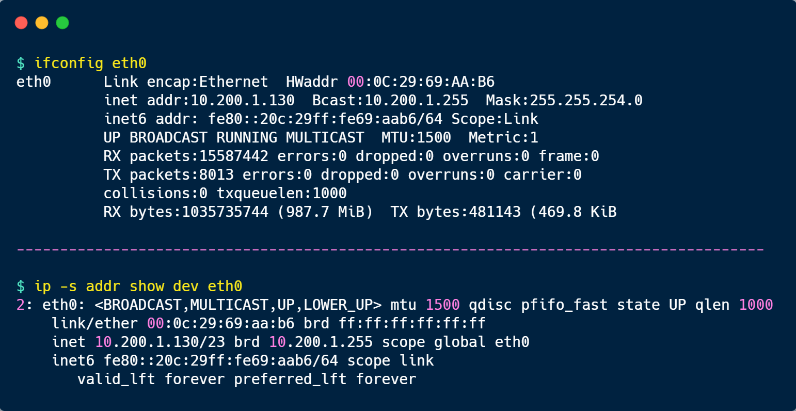

虽然这两个命令输出的格式不尽相同，但是输出的内容基本相同，比如都包含了 IP 地址、子网掩码、MAC 地址、网关地址、MTU 大小、网口的状态以及网络包收发的统计信息，下面就来说说这些信息，它们都与网络性能有一定的关系。

第一，网口的连接状态标志。其实也就是表示对应的网口是否连接到交换机或路由器等设备，如果 `ifconfig` 输出中看到有 `RUNNING`，或者 `ip` 输出中有 `LOWER_UP`，则说明物理网络是连通的，如果看不到，则表示网口没有接网线。

第二，MTU 大小。默认值是 `1500` 字节，其作用主要是限制网络包的大小，如果 IP 层有一个数据报要传，而且网络包的长度比链路层的 MTU 还大，那么 IP 层就需要进行分片，即把数据报分成若干片，这样每一片就都小于 MTU。事实上，每个网络的链路层 MTU 可能会不一样，所以你可能需要调大或者调小 MTU 的数值。

第三，网口的 IP 地址、子网掩码、MAC 地址、网关地址。这些信息必须要配置正确，网络功能才能正常工作。

第四，网络包收发的统计信息。通常有网络收发的字节数、包数、错误数以及丢包情况的信息，如果 `TX`（发送） 和 `RX`（接收） 部分中 errors、dropped、overruns、carrier 以及 collisions 等指标不为 0 时，则说明网络发送或者接收出问题了，这些出错统计信息的指标意义如下：

- errors 表示发生错误的数据包数，比如校验错误、帧同步错误等；
- dropped 表示丢弃的数据包数，即数据包已经收到了 Ring Buffer（这个缓冲区是在内核内存中，更具体一点是在网卡驱动程序里），但因为系统内存不足等原因而发生的丢包；
- overruns 表示超限数据包数，即网络接收/发送速度过快，导致 Ring Buffer 中的数据包来不及处理，而导致的丢包，因为过多的数据包挤压在 Ring Buffer，这样 Ring Buffer 很容易就溢出了；
- carrier 表示发生 carrirer 错误的数据包数，比如双工模式不匹配、物理电缆出现问题等；
- collisions 表示冲突、碰撞数据包数；

`ifconfig`和`ip`命令只显示的是网口的配置以及收发数据包的统计信息，而看不到协议栈里的信息，那接下来就来看看如何查看协议栈里的信息。

#### socket 信息如何查看？

我们可以使用 `netstat` 或者 `ss`，这两个命令查看 socket、网络协议栈、网口以及路由表的信息。

虽然 `netstat` 与 `ss` 命令查看的信息都差不多，但是如果在生产环境中要查看这类信息的时候，尽量不要使用 `netstat` 命令，因为它的性能不好，在系统比较繁忙的情况下，如果频繁使用 `netstat` 命令则会对性能的开销雪上加霜，所以更推荐你使用性能更好的 `ss` 命令。

从下面这张图，你可以看到这两个命令的输出内容：

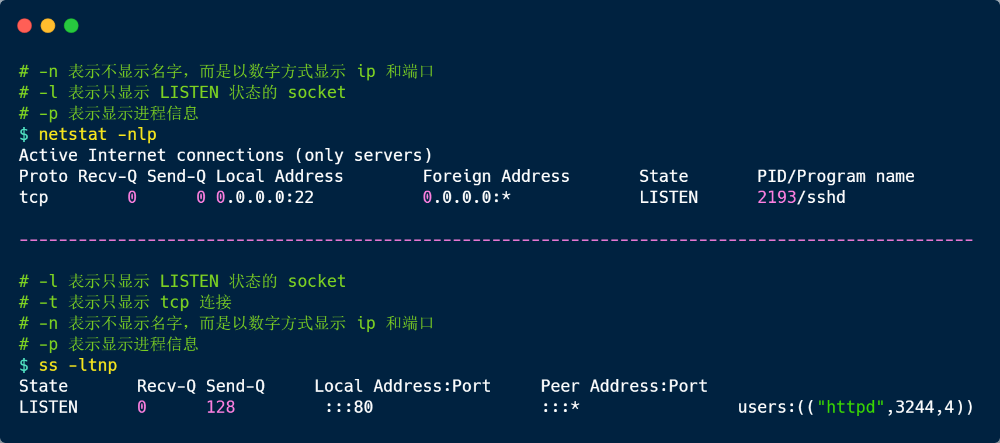

可以发现，输出的内容都差不多， 比如都包含了 socket 的状态（State）、接收队列（Recv-Q）、发送队列（Send-Q）、本地地址（Local Address）、远端地址（Foreign Address）、进程 PID 和进程名称（PID/Program name）等。

接收队列（Recv-Q）和发送队列（Send-Q）比较特殊，在不同的 socket 状态。它们表示的含义是不同的。

- Recv-Q 表示 socket 缓冲区中还没有被应用程序读取的字节数；
- Send-Q 表示 socket 缓冲区中还没有被远端主机确认的字节数；

而当 socket 状态处于 Listen 时：

- Recv-Q 表示全连接队列的长度；
- Send-Q 表示全连接队列的最大长度；

在 TCP 三次握手过程中，当服务器收到客户端的 SYN 包后，内核会把该连接存储到半连接队列，然后再向客户端发送 SYN+ACK 包，接着客户端会返回 ACK，服务端收到第三次握手的 ACK 后，内核会把连接从半连接队列移除，然后创建新的完全的连接，并将其增加到全连接队列 ，等待进程调用 accept() 函数时把连接取出来。也就说，全连接队列指的是服务器与客户端完了 TCP 三次握手后，还没有被 accept() 系统调用取走连接的队列。

那对于协议栈的统计信息，依然还是使用`netstat`或`ss`，它们查看统计信息的命令如下：

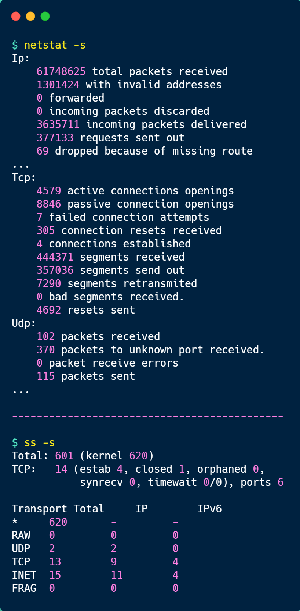

`ss`命令输出的统计信息相比`netsat`比较少，`ss`只显示已经连接（estab）、关闭（closed）、孤儿（orphaned） socket 等简要统计。

而`netstat`则有更详细的网络协议栈信息，比如上面显示了 TCP 协议的主动连接（active connections openings）、被动连接（passive connection openings）、失败重试（failed connection attempts）、发送（segments send out）和接收（segments received）的分段数量等各种信息。

#### 网络吞吐率和 PPS 如何查看？

可以使用 `sar` 命令当前网络的吞吐率和 PPS，用法是给 `sar` 增加 `-n` 参数就可以查看网络的统计信息，比如

- sar -n DEV，显示网口的统计数据；
- sar -n EDEV，显示关于网络错误的统计数据；
- sar -n TCP，显示 TCP 的统计数据

比如，我通过 `sar` 命令获取了网口的统计信息：

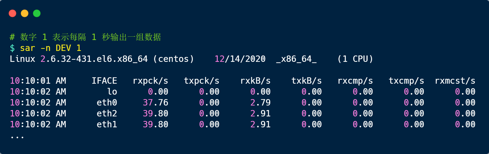

它们的含义：

- `rxpck/s` 和 `txpck/s` 分别是接收和发送的 PPS，单位为包 / 秒。
- `rxkB/s` 和 `txkB/s` 分别是接收和发送的吞吐率，单位是 KB/ 秒。
- `rxcmp/s` 和 `txcmp/s` 分别是接收和发送的压缩数据包数，单位是包 / 秒。

对于带宽，我们可以使用`ethtool`命令来查询，它的单位通常是`Gb/s`或者`Mb/s`，不过注意这里小写字母 b ，表示比特而不是字节。我们通常提到的千兆网卡、万兆网卡等，单位也都是比特（bit）。如下你可以看到， eth0 网卡就是一个千兆网卡：

```sh
$ ethtool eth0 | grep Speed
  Speed: 1000Mb/s
```

#### 连通性和延时如何查看？

要测试本机与远程主机的连通性和延时，通常是使用 `ping` 命令，它是基于 ICMP 协议的，工作在网络层。

比如，如果要测试本机到 `192.168.12.20` IP 地址的连通性和延时：

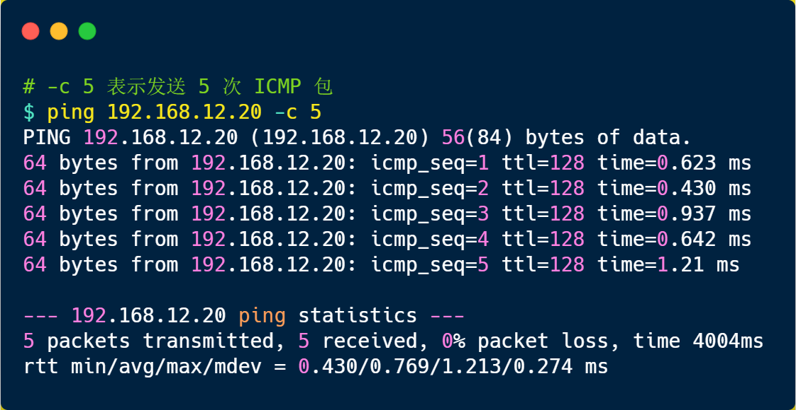

显示的内容主要包含 `icmp_seq`（ICMP 序列号）、`TTL`（生存时间，或者跳数）以及 `time` （往返延时），而且最后会汇总本次测试的情况，如果网络没有丢包，`packet loss` 的百分比就是 0。

不过，需要注意的是，`ping` 不通服务器并不代表 HTTP 请求也不通，因为有的服务器的防火墙是会禁用 ICMP 协议的。