# 架构设计

## 架构设计认知

### 为什么架构设计要做拆分？

- 为什么做架构拆分？通常最直接目的就是做系统之间解耦、子系统之间解耦，或模块之间的解耦。
- 为什么要做系统解耦？系统解耦后，使得原本错综复杂的调用逻辑能有序地分布到各个独立的系统中，从而使得拆封后的各个系统职责更单一，功能更为内聚。
- 为什么要做职责单一？因为职责单一的系统功能逻辑的迭代速度会更快，会提高研发团队响应业务需求的速度，也就是提高了团队的开发效率。
- 为什么要关注开发效率？研发迭代效率的提升是任何一家公司在业务发展期间都最为关注的问题，所以从某种程度上看，架构拆分是系统提效最直接的手段。

### 研发工程师如何用架构师视角回答架构设计方案？

提问：“你之前是如何设计这个系统（或子系统/模块/功能）的？请介绍你的思路。”

#### 案例背景

在电商中，当用户发表一条商品评论，后台的逻辑是点评系统会调用一系列的远程 API 接口，如调用风控系统、广告系统、消息系统……几个甚至十几个系统的接口。

在业务建设之初，考虑到快速开发与上线，商品评论发布是通过同步 RPC（Remote Procedure Call，远程过程调用）远程调用各系统接口完成的。这种方式在系统少、逻辑简单的阶段很符合实际情况的设计。

但随着业务快速发展，通过 RPC 同步调用的问题逐渐暴露出来。由于过多地依赖其他系统，导致评论发布的接口性能很低，可用性也容易受到其他系统影响。而且每当点评系统需求上线时，其他系统都需要跟着进行联调测试，导致需求迭代速度缓慢。

在做系统架构升级改造时，如果你有互联网设计理念，会很容易想到问题在于系统间的耦合度太高。解决办法就是采用异步化解耦，从而通过引入 MQ 消息管道，在架构上进行系统业务逻辑拆分，将原本强依赖的系统间的同步 RPC 调用变成异步消息触发。

#### 案例分析

对于上面的案例，假设你是应聘者，当被问“如何做这个点评系统的改造？”时，你会怎么回答？你会不会直截了当地说“我引入了 MQ 消息队列，做了系统解耦，采用异步消息通知的方式来触发系统调用”呢？

在互联网系统设计方案如此透明的今天，随便在网上搜一下都会有大量类似的解决方案。以上回答不但不会让面试官满意，甚至有可能令人怀疑你的项目经历的真实性。

作为研发工程师，正确的回答方式是要让面试官知道你解决问题的思维。相比一上来就说用了什么技术，阐述解决思维更能证明你的能力，因为解决技术问题的方法有很多，这是“术”，但解决技术问题的底层思维逻辑是一样的，这是“道”。

面对此类问题，需要从以下四个层面来解答：

- 谈复杂来源；
- 谈解决方案；
- 谈评估标准；
- 说技术实现。

#### 问题解答

##### 复杂来源

之所以要先分析系统的复杂度，是因为只有正确分析后才能明确设计原则，进而设计架构方案，整体项目才不会找错方向。

如果一个系统本来因业务逻辑复杂导致功能耦合严重，你却设计了一个 TPS（Transactions Per Second，每秒事务处理量）达到 10000/秒 的高性能架构，那么即使架构性能再优秀，也没有现实意义，因为技术设计没有解决主要问题的复杂度。这是很多研发工程师的通病，设计偏离了方向，只是为了设计而设计。

那么如何正确评估系统的复杂度呢？ 互联网软件通常分为功能性的复杂度和非功能性的复杂度两种。

从功能性复杂度方面来看，你可以从案例中得知，产品业务发展快速、系统越来越多、协作效率越来越低。作为系统负责人，你敏锐地发现问题根源在架构上各业务子系统强耦合。于是你引入消息队列解耦各系统，这是系统业务领域带来的本质上的复杂度，也就是功能性的复杂度，解决的是系统效率的问题。

从非功能性复杂度方面来看，我们假设系统用户每天发送 100 万条点评，那么点评的消息管道一天会产生 100 万条消息，再假设平均一条消息有 10 个子系统读取，那么每秒的处理数据，即点评消息队列系统的 TPS 和 QPS（Queries Per Second，每秒查询次数）就分别是 11（1000000/60*60*24）和 115（10000000/60*60*24）。

不过系统的读写不是完全平均的，设计的目标应该以峰值来计算，即取平均值的 4 倍。于是点评消息队列系统的 TPS 变成了 44，QPS 变成了 460，这个量级的数据意味着并不需要设计高性能架构方案。

接着还要考虑业务规模发展。架构设计的目标应该满足未来业务增长，我们把未来业务增长的预估峰值设定为目前峰值的 4 倍，这样最终的性能要求分别是：TPS 为 176，QPS 是 1840。这样的读写指标还达不到系统压测的性能基线，所以可以确定的是点评系统的复杂度并不在高性能问题上。

对于点评系统来说，还需要考虑高可用的问题。假设点评系统的消息队列挂掉，将导致用户评论发送失败，当然在用户体验层面，解决方式可以在页面端提示用户重新操作，但如果问题影响到了点评消息的读取，导致评论没有走风控策略，就会造成严重的影响。所以高可用性是点评系统的设计复杂度之一，包括点评写入、点评存储，以及点评消息的读取，都需要保证高可用性。

为了方便理解非功能性的复杂度，我只分析了“高性能”和“高可用”这两点，在实际应用中，不同的公司或者团队可能还有其他方面的复杂度分析。例如有的公司会考虑安全性，有的公司会考虑成本等。

所以综合分析来看，点评系统改造的复杂度来源于两点。

- 功能性复杂度：要解决业务发展带来的系统耦合、开发效率缓慢问题。
- 非功能性复杂度：要保证系统的高可用性。

##### 解决方案

在确定了系统面临的主要复杂度问题后，就有了明确的方案设计目标，这时就可以开始进行架构方案设计了。

1. 采用开源的 MQ 消息管道。目前 MQ 消息管道有很多开源解决方案，比如 Kafka、RocketMQ、RabbitMQ 等。在实际项目中，你可以根据不同的应用场景选择合适的成熟开源消息队列方案，这是很多公司常用的做法。
2. 采用开源的 Redis 实现消息队列。方案 1 虽然应用了开源 MQ 实现点评消息的通信，但是因为引入一个消息中间件就会带来运维成本，所以方案 2 可以基于轻量级的 Redis 实现，以降低系统的维护成本和实现复杂度。
3. 采用内存队列 + MySQL 来实现。方案 2 中虽然应用了较为轻量级的 Redis 来实现，但是还需要引入一个缓存系统，同样也会带来运维成本，所以方案 3 是直接基于 MySQL 实现，即基于内存队列的方式，异步持久化到数据库，然后通过定时任务读取 MySQL 中的消息并处理。

一般情况，你至少要设计两到三套备选方案，考虑通过不同的技术方式来解决问题。方案设计不用过于详细，而是要确定技术的可行性和优缺点。

##### 评估标准

设计完三套解决方案之后，摆在眼前的问题就是需要选择最合适的一个。这就需要一套评估标准了。

在互联网软件架构中，架构师常常会把一些通用的设计原则写到设计文档中，比如设计松耦合、系统可监控，这些原则似乎不常用，但好的架构师会通过设计原则来控制项目的技术风险。比如系统无单点，限制了系统技术方案不可出现单点服务的设计；再如系统可降级，限制了系统有具备降级的能力，进而约束了开发人员需要设计数据兜底的技术方案。

这些看似不重要的设计原则，其实是评估架构解决方案的重要手段。做系统架构，需要站在更高的层面考虑系统的全局性关注点，比如性能、可用性、IT 成本、投入资源、实现复杂度、安全性、后续扩展性等。这在不同场景的不同阶段会起到决定性作用。

那么针对案例中的点评系统来说，要如何评估方案呢？这要从点评系统的复杂度来源进行评估。

- 点评系统功能性复杂度

点评系统的功能性复杂度问题，本质上是随着业务发展带来的系统开发效率问题。解决这个问题要试着站得更高一些，以部门负责人的视角，考虑现有研发团队的能力素质、IT 成本、资源投入周期等因素是否匹配上面三种架构解决方案。

- 点评系统非功能性复杂度

为了解决系统的高可用，可以参考三个设计原则。

第一个是系统无单点原则。首先要保证系统各节点在部署的时候至少是冗余的，没有单点。很显然三种设计方案都支持无单点部署方式，都可以做到高可用。

第二个是可水平扩展原则。对于水平扩展，MQ 和 Redis 都具有先天的优势，但内存队列 + MySQL 的方式则需要做分库分表的开发改造，并且还要根据业务提前考虑未来的容量预估。

第三个是可降级原则。降级处理是当系统出现故障的时候，为了系统的可用性，选择有损的或者兜底的方式提供服务。

常用手段有三种：

- 限流，即抛弃超出预估流量外的用户。
- 降级，即抛弃部分不重要的功能，让系统提供有损服务，如商品详情页不展示宝贝收藏的数量，以确保核心功能不受影响。
- 熔断，即抛弃对故障系统的调用。一般情况下熔断会伴随着降级处理，比如展示兜底数据。

针对案例场景中三个解决方案的降级策略，在一般的情况下，我们默认数据库是不可降级的，MQ 和 Redis 都可以通过降级到数据库的方式做容灾处理。所以案例中的三个解决方案，MQ 和 Redis 要考虑降级到 MySQL 或其他方式，这里就还需要根据情况投入降级的开发成本。

##### 技术实现

在确定了具体的架构解决方案之后，需要进一步说明技术上的落地实现方式和深层原理，如果你最终选择基于 Redis 来实现消息队列，那么可以有几种实现方式？各自的优缺点有哪些？对于这些问题，要做到心里有数。比如，基于 Redis List 的 LPUSH 和 RPOP 的实现方式、基于 Redis 的订阅或发布模式，或者基于 Redis 的有序集合（Sorted Set）的实现方式。

## 分布式

### 分布式理论设计

#### 案例背景

首先要知道 CAP 理论：C（Consistency）是数据一致性、A（Availability）是服务可用性、P（Partition tolerance）是分区容错性。C、A、P 只能同时满足两个目标，而由于在分布式系统中，P 是必须要保留的，所以要在 C 和 A 间进行取舍。假如要保证服务的可用性，就选择 AP 模型，而要保证一致性的话，就选择 CP 模型。

很多候选者如果发现面试题（比如“为了数据容灾，我们会做数据的主从备份，那么主从节点的数据一致性对调用端有什么影响呢？”）涉及了对“CAP 的理解和思考”，会下意识地做出类似的答案：“ CAP 理论描述了在出现网络分区的情况下，要在 C 和 A 之间做取舍，所以会影响站在调用端的视角看系统是不可用的”。但这样并不能证明出有能力。

因为在面试中遇到理论问题时，单纯做浮于表面的概念性阐述，很难向面试官证明你的技术能力。 面试官会觉得你是一个刚接触分布式系统，或者对分布式系统理解不够深入的研发，如果这恰好是你第一个面试题，会直接影响面试官对你的第一印象，甚至影响你的定级。

#### 问题解答

##### 理解原理

现在有一个分布式系统 A，它有一个副本 A1，在正常情况下，客户端 Client 写数据到系统 A，然后数据从 A 节点同步到 A1 节点，再返回给 Client 成功状态。这时，客户端 Client 从任何节点 A 或 A1 读取数据，都能读取到最新写入的数据，说明 A 和 A1 的数据是一致的，并且 A 和 A1 也都是可用的。

但由于网络是不可靠的，节点 A 和 A1 的网络随时会因为中断而出现分区。所谓网络分区就是由于网络不通导致节点 A 和 A1 被隔离在不同的网络子集中，此时节点 A 的数据就不能及时同步到节点 A1 中了。

在分布式系统中，由于网络问题导致的网络分区是常态。也就是说出现网络分区时，根据 CAP 理论，需要在 A 和 C 中进行取舍，即要么保证系统的可用性，要么保证数据一致性。

这里你要注意了，上面的例子有个大前提，就是系统出现了网络分区，但实际情况是，在绝大多数时间里并不存在网络分区（网络不会经常出现问题）。那么还要进行三选二吗（CP 或者 AP）？

其实，不同的分布式系统要根据业务场景和业务需求在 CAP 三者中进行权衡。CAP 理论用于指导在系统设计时需要衡量的因素，而非进行绝对地选择。

当网络没有出现分区时，CAP 理论并没有给出衡量 A 和 C 的因素，但如果你做过实际的分布式系统设计，一定会发现系统数据同步的时延（Latency），即例子中节点 A 同步数据到节点 A1 的时间才是衡量 A 和 C 最重要的因素，此时就不会有绝对的 AP 模型还是 CP 模型了，而是源于对实际业务场景的综合考量。

##### 实践经验

你要意识到，互联网分布式的设计方案是数据一致性和系统可用性的权衡，并不是非此即彼，这一点尤为重要。所以即使无法做到强一致性（简单来讲强一致性就是在任何时刻所有的用户查询到的数据都是最新的），也可以根据自身的业务特点，采用适当的方式来使系统达到最终一致性。

这时就要引出 BASE 理论，它是 CAP 理论的延伸。BASE 是 Basically Available（基本可用）、Soft State（软状态）和 Eventually Consistent（最终一致性）三个单词的简写，作用是保证系统的可用性，然后通过最终一致性来代替强一致性，它是目前分布式系统设计中最具指导意义的经验总结。那么在实际项目中，你如何通过 BASE 理论来指导设计实践呢？

BASE 中的基本可用指的是保障核心功能的基本可用，其实是做了“可用性”方面的妥协，比如：

- 电商网站在双十一大促等访问压力较大的时候，关闭商品排行榜等次要功能的展示，从而保证商品交易主流程的可用性，这也是我们常说的服务降级；
- 为了错开双十一高峰期，电商网站会将预售商品的支付时间延后十到二十分钟，这就是流量削峰；
- 在你抢购商品的时候，往往会在队列中等待处理，这也是常用的延迟队列。

软状态和最终一致性指的是允许系统中的数据存在中间状态，这同样是为了系统可用性而牺牲一段时间窗内的数据一致性，从而保证最终的数据一致性的做法。

目前这种处理数据的方式几乎成了互联网的标配设计模式，最经典的例子是在用户下单的时候不需要真正地扣减库存，而是仅在前台计个数，然后通过异步任务在后台批量处理。

##### 技术认知

如果你应聘的是高级研发工程师或架构师，在回答时，还要尽可能地展示知识体系和技术判断力，这是这两个岗位的基本素质。 因为分布式技术错综复杂，各种技术又相互耦合，在面试中，如果你能通过一个 CAP 理论的知识点，扩展出一个脉络清晰的分布式核心技术知识体系，就会与其他人拉开差距。

分布式系统看起来就像一个计算机。计算机包括五大体系结构（即冯诺依曼结构），它有五大部件：分别是控制器、运算器、存储器、输入及输出。你可以这么理解：一个分布式系统也包含这五大部件，其中最重要的是计算与存储。计算与存储由一系列网络节点组成，每个节点之间的通信就是输入与输出，各节点之间的调度管理就是控制器。

那么就可以从以下角度概括：

- 存储器，即分布式存储系统，如 NoSQL 数据库存储；
- 运算器，即分布式计算，如分布式并行计算；
- 输入输出，即分布式系统通信，如同步 RPC 调用和异步消息队列；
- 控制器，即调度管理，如流量调度、任务调度与资源调度。

##### 解题思路

以 Redis 实现分布式锁为例，

- 说明现实存在的问题

一般使用 setnx 方法，通过 Redis 实现锁和超时时间来控制锁的失效时间。但是在极端的情况下，当 Reids 主节点挂掉，但锁还没有同步到从节点时，根据哨兵机制，从就变成了主，继续提供服务。这时，另外的线程可以再来请求锁，此时就会出现两个线程拿到了锁的情况。

- 回归理论的指导

根据对 CAP 理论的理解，Redis 的设计模型是 AP 模型，而分布式锁是一个 CP 场景，那么很明显，将 Redis 这种 AP 模型的架构应用于 CP 的场景，在底层的技术选型上就是错误的。

- 扩展到知识体系

Redis 属于分布式存储系统，你的头脑里就要有对分布式存储系统领域的知识体系。思考它的数据存储、数据分布、数据复制，以及数据一致性都是怎么做的，用了哪些技术来实现，为什么要做这样的技术或算法选型。你要学会从多维度、多角度去对比、分析同一分布式问题的不同方法，然后综合权衡各种方法的优缺点，最终形成自己的技术认知和技术判断力。

- 有技术的判断力

比如通过 Redis，你能想到目前分布式缓存系统的发展现状以及技术实现，如果让你造一个“Redis”出来，你会考虑哪些问题等。虽然在实际工作中不推荐重复“造轮子”，但在面试中要表现出自己具备“造轮子”的能力。

### 亿级商品存储设计

#### 案例背景

先来回顾一下，你在面试时，有没有被问到以下几个问题：

- 如何设计一个支持海量商品存储的高扩展性架构？
- 在做分库分表时，基于 Hash 取模和一致性 Hash 的数据分片是如何实现的？
- 在电商大促时期，如何对热点商品数据做存储策略 ？
- 强一致性和最终一致性的数据共识算法是如何实现的 ？

在分布式系统中，核心的考察点包括了分布式系统中数据的存储、分布、复制，以及相关协议和算法，上述问题都与此相关。而在实际面试中，面试官通常会提出一个业务场景，如“如何设计海量商品数据的存储？”然后在候选者回答问题的过程中，通过一环扣一环的提问，把各考察点串联在一起。

#### 案例分析

在互联网业务场景下，为了解决单台存储设备的局限性，会把数据分布到多台存储节点上，以此实现数据的水平扩展。既然要把数据分布到多个节点，就会存在数据分片的问题。数据分片即按照一定的规则将数据路由到相应的存储节点中，从而降低单存储节点带来的读写压力。常见的实现方案有 Hash（哈希分片）与 Range（范围分片）。

明确了如何分片后，就需要对数据进行复制，数据复制会产生副本，而副本是分布式存储系统解决高可用的唯一手段，这也是我们熟知的主从模式，又叫 master-slave。在分布式存储系统中，通常会设置数据副本的主从节点，当主节点出现故障时，从节点可以替代主节点提供服务，从而保证业务正常运行。

那么如何让从节点替代主节点呢？这就涉及数据一致性的问题了（只有在主从节点数据一致的情况下，才能进行主从替换）。

关于数据一致性，通常要考虑一致性强弱（即强一致性和最终一致性的问题）。而要解决一致性的问题，则要进行一系列的一致性协议：如两阶段提交协议（Two-Phrase Commit，2PC）、Paxos 协议选举、Raft 协议、Gossip 协议。

所以分布式数据存储的问题可以分成：数据分片、数据复制，以及数据一致性带来的相关问题。

#### 案例解答

面试官往往会把“案例背景中”的四个问题串联到具体的场景中，以具体的场景设问，比如“假设你是一家电商网站的架构师，现在要将原有单点上百 G 的商品做数据重构，存储到多个节点上，你会如何设计存储策略 ？”

因为是商品存储扩容的设计问题，很容易想到做数据的分库分表，也就是重新设计数据的分片规则，常用的分片策略有两种，即 Hash（哈希）分片和 Range（范围）分片。从这一点出发会考察你Hash（哈希）分片的具体实现原理。

### 海量并发场景下的一致性问题

#### 案例背景

在互联网分布式场景中，原本一个系统被拆分成多个子系统，要想完成一次写入操作，你需要同时协调多个系统，这就带来了分布式事务的问题（分布式事务是指：一次大的操作由多个小操作组成，这些小的操作分布在不同的服务器上，分布式事务需要保证这些小操作要么全部成功，要么全部失败）。那怎么设计才能实现系统之间的事务一致性呢？ 这就是咱们今天要讨论的问题，也是面试的高频问题。

以京东旅行系统为例，早期的交易系统是通过 .NET 实现的，所有的交易下单逻辑都写在一个独立的系统中。随着技术改造，我们用 Java 重写了核心系统，原本的系统也被拆分成多个子系统，如商品系统、促销系统、订单系统（为了方便理解，我只拿这三个系统举例）。当用户下单时，订单系统生成订单，商品系统扣减库存，促销系统扣减优惠券，只有当三个系统的事务都提交之后，才认为此次下单成功，否则失败。

#### 案例分析

这是一个很典型的分布式事务问题，解决方案也很多，有两阶段提交协议（Two-Phase Commit，2PC）、3PC 、TCC 和基于消息队列的实现方式。

所以当很多候选者听到“怎么实现系统之间的分布式一致性？”的问题之后，会信心满满地选择一个方案，回答说：方案很多，可以选择 2PC ，2PC 实现的流程是……

这种答题思路犯了一个很明显的错误，因为在实际工作中，很少采用前几种方案，基本都是基于 MQ 的可靠消息投递的方式来实现。所以一上来就说 2PC、3PC 或者 TCC 会让我觉得你并没有实际做过。那答题的套路是什么呢？

我建议你先介绍目前主流实现分布式系统事务一致性的方案（也就是基于 MQ 的可靠消息投递的机制）然后回答出可实现方案和关键知识点。另外，为了和面试官进一步交流，你可以提出 2PC 或 TCC （这是一种交流方案）。因为 2PC 或 TCC 在工业界落地代价很大，不适合互联网场景，所以只有少部分的强一致性业务场景（如金融支付领域）会基于这两种方案实现。而你可以围绕它们的解决思路和方案弊端与面试官讨论，这会让你和面试官由不平等的“面试与被面试”变成平等且友好的“双方沟通”，是一种面试套路。

#### 案例解答

##### 基于两阶段提交的解决方案

2PC 是分布式事务教父级协议，它是数据库领域解决分布式事务最典型的协议。它的处理过程分为准备和提交两个阶段，每个阶段都由协调者（Coordinator）和参与者（Participant）共同完成：

- 协调者就是事务管理器；
- 参与者就是具体操作执行的资源管理器。

我们假设订单数据，商品数据和促销数据分别保存在数据库 D1，数据库 D2 和数据库 D3 上。

- 准备阶段，事务管理器首先通知所有资源管理器开启事务，询问是否做好提交事务的准备。如资源管理器此时会将 undo 日志和 redo 日志计入事务日志中，并做出应答，当协调者接收到反馈 Yes 后，则准备阶段结束。
- 提交阶段，当收到所有数据库实例的 Yes 后，事务管理器会发出提交指令。每个数据库接受指令进行本地操作，正式提交更新数据，然后向协调者返回 Ack 消息，事务结束。
- 中断阶段，如果任何一个参与者向协调者反馈了 No 响应，例如用户 B 在数据库 D3 上面的余额在执行其他扣款操作，导致数据库 D3 的数据无法锁定，则只能向事务管理器返回失败。此时，协调者向所有参与者发出 Rollback 请求，参与者接收 Rollback 请求后，会利用其在准备阶段中记录的 undo 日志来进行回滚操作，并且在完成事务回滚之后向协调者发送 Ack 消息，完成事务回滚操作。

以上就是基于 2PC 实现分布式事务的原理。

当你和面试官交流 2PC 的原理时，往往不止于此，就像我们开篇提到的，我们并不会基于 2PC 来实现分布式事务一致性，虽然 2PC 可以借助数据库的本地事务操作，实现起来较为简单，不用侵入业务逻辑，但是它也存在着很多问题。

2PC 在准备阶段会要求每个资源管理器进行资源锁定，如 MySQL 的行锁。否则如果在提交阶段提交之前数据发生改变，就会出现数据不一致的情况。

但正因为要加锁，会导致两阶段提交存在一系列问题，最严重的就是死锁问题，一旦发生故障，数据库就会阻塞，尤其在提交阶段，如果发生故障，数据都还处于资源锁定状态，将无法完成后续的事务提交操作。

其次是性能问题，数据库（如 MySQL ）在执行过程中会对操作的数据行执行数据行锁，如果此时其他的事务刚好也要操作被锁定的数据行，那它们就只能阻塞等待，使分布式事务出现高延迟和性能低下。

再有就是数据不一致性，在提交阶段，当事务管理器向参与者发送提交事务请求之后，如果此时出现了网络异常，只有部分数据库接收到请求，那么会导致未接收到请求的数据库无法提交事务，整个系统出现数据不一致性。

##### 基于 MQ 的可靠消息投递方案

基于 MQ 的可靠消息队列投递方案是目前互联网最为常用的方式，在应对高并发场景下的分布式事务问题时，种方案通过放弃强一致性，而选择最终一致性，来提高系统的可用性。

还是拿下单场景举例，当订单系统调用优惠券系统时，将扣减优惠券的事件放入消息队列中，最终给优惠券系统来执行，然后只要保证事件消息能够在优惠券系统内被执行就可以了，因为消息已经持久化在消息中间件中，即使消息中间件发生了宕机，我们将它重启后也不会出现消息丢失的问题。

基于 MQ 的可靠消息投递的方案不仅可以解决由于业务流程的同步执行而造成的阻塞问题，还可以实现业务解耦合流量削峰。这种方案中的可选型的 MQ 也比较多，比如基于 RabbitMQ 或者 RocketMQ，但并不是引入了消息队列中间件就万事大吉了，通常情况下，面试官会着重通过以下两个知识点来考察你对这种方案的掌握程度。

- MQ 自动应答机制导致的消息丢失

订阅消息事件的优惠券服务在接收订单服务投递的消息后，消息中间件（如 RabbitMQ）默认是开启消息自动应答机制，当优惠券系统消费了消息，消息中间件就会删除这个持久化的消息。

但在优惠券系统执行的过程中，很可能因为执行异常导致流程中断，那这时候消息中间件中就没有这个数据了，进而会导致消息丢失。因此你要采取编程的方式手动发送应答，也就是当优惠券系统执行业务成功之后，消息中间件才能删除这条持久化消息。

这个知识点很容易被忽略掉，但却很重要，会让面试官认为你切切实实的做过，另外还有一个高频的问题，就是在大促的时候，瞬时流量剧增，很多没能及时消费的消息积压在 MQ 队列中，这个问题如何解决呢？

- 高并发场景下的消息积压导致消息丢失

分布式部署环境基于网络进行通信，而在网络通信的过程中，上下游可能因为各种原因而导致消息丢失。比如优惠券系统由于流量过大而触发限流，不能保证事件消息能够被及时地消费，这个消息就会被消息队列不断地重试，最后可能由于超过了最大重试次数而被丢弃到死信队列中。

但实际上，你需要人工干预处理移入死信队列的消息，于是在这种场景下，事件消息大概率会被丢弃。而这个问题源于订单系统作为事件的生产者进行消息投递后，无法感知它下游（即优惠券系统）的所有操作，那么优惠券系统作为事件的消费者，是消费成功还是消费失败，订单系统并不知道。

顺着这个思路，如果让订单知道消费执行结果的响应，即使出现了消息丢失的情况，订单系统也还是可以通过定时任务扫描的方式，将未完成的消息重新投递来进行消息补偿。这是基于消息队列实现分布式事务的关键，是一种双向消息确认的机制。

那么如何落地实现呢？你可以先让订单系统把要发送的消息持久化到本地数据库里，然后将这条消息记录的状态设置为代发送，紧接着订单系统再投递消息到消息队列，优惠券系统消费成功后，也会向消息队列发送一个通知消息。当订单系统接收到这条通知消息后，再把本地持久化的这条消息的状态设置为完成。

这样做后，即使最终 MQ 出现了消息丢失，也可以通过定时任务从订单系统的本地数据库中扫描出一段时间内未完成的消息，进行重新投递，最终保证订单系统和优惠券系统的最终事务一致性。

### 分布式锁

#### 案例背景

分布式锁是解决协调分布式系统之间，同步访问共享资源的一种方式。详细来讲：在分布式环境下，多个系统在同时操作共享资源（如写数据）时，发起操作的系统通常会通过一种方式去协调其他系统，然后获取访问权限，得到访问权限后才可以写入数据，其他系统必须等待权限释放。

很多面试官都会问候选人与分布式锁相关的问题，在一些细节上挖得还比较细。比如在分布式系统中涉及共享资源的访问，一些面试官会深挖如何控制并发访问共享资源；如何解决资源争抢等技术细节，这些问题在下单场景、优惠券场景都会被考察到，足以证明“分布式锁”考点的重要性。

那么假设你正在面试，面试官模拟了系统秒杀的场景：为了防止商品库存超售，在并发场景下用到了分布式锁的机制，做商品扣减库存的串行化操作。然后问你：“你如何实现分布式锁？”你该怎么回答呢？

#### 案例分析

当你听到这个问题后，心里会不会窃喜？觉得这是一道送分题，因为可选方案有很多，比如：

- 基于关系型数据库 MySQL 实现分布式锁；
- 基于分布式缓存 Redis 实现分布式锁；

你从中选择一个熟悉的实现方式，然后和面试官展开拉锯式的问答环节。如果面试官觉得你回答问题的思路清晰有条理，给出的实现方案也可以落地，并且满足你的业务场景，那么他会认可你具备初中级研发工程师该具备的设计能力，但不要高兴得太早。

因为有些面试官会继续追问：“分布式锁用 Zookeeper 实现行不行？”，“分布式锁用 etcd 实现行不行？” 借机考察你对分布式协调组件的掌握。你可能会觉得开源组件那么多，自己不可能每一个都用过，答不出来也无妨。但面试官提问的重点不是停留在组件的使用上，而是你对分布式锁的原理问题的掌握程度。

换句话说，“如果让借助第三方组件，你怎么设计分布式锁？” 这背后涉及了分布式锁的底层设计逻辑，是你需要掌握的。

在给出方案之前，你要明确待解决的问题点是什么。虽然你可以借助数据库 DB、Redis 和 ZooKeeper 等方式实现分布式锁，但要设计一个分布式锁，就需要明确分布式锁经常出现哪些问题，以及如何解决。

- 可用问题：无论何时都要保证锁服务的可用性（这是系统正常执行锁操作的基础）。
- 死锁问题：客户端一定可以获得锁，即使锁住某个资源的客户端在释放锁之前崩溃或者网络不可达（这是避免死锁的设计原则）。
- 脑裂问题：集群同步时产生的数据不一致，导致新的进程有可能拿到锁，但之前的进程以为自己还有锁，那么就出现两个进程拿到了同一个锁的问题。

总的来说，设计分布式锁服务，至少要解决上面最核心的几个问题，才能评估锁的优劣，从问题本质来回答面试中的提问，以不变应万变。接下来，我就以开篇的 “库存扣减” 为例，带你了解分布式锁的常见实现方式、优缺点，以及方案背后的原理。

#### 案例解答

##### 基于关系型数据库实现分布式锁

基于关系型数据库（如 MySQL） 来实现分布式锁是任何阶段的研发同学都需要掌握的，做法如下：先查询数据库是否存在记录，为了防止幻读取（幻读取：事务 A 按照一定条件进行数据读取，这期间事务 B 插入了相同搜索条件的新数据，事务 A 再次按照原先条件进行读取时，发现了事务 B 新插入的数据 ）通过数据库行锁 select for update 锁住这行数据，然后将查询和插入的 SQL 在同一个事务中提交。

比如：

```sql
select id from order where order_id = xxx for update
```

基于关系型数据库实现分布式锁比较简单，不过你要注意，基于 MySQL 行锁的方式会出现交叉死锁，比如事务 1 和事务 2 分别取得了记录 1 和记录 2 的排它锁，然后事务 1 又要取得记录 2 的排它锁，事务 2 也要获取记录 1 的排它锁，那这两个事务就会因为相互锁等待，产生死锁。

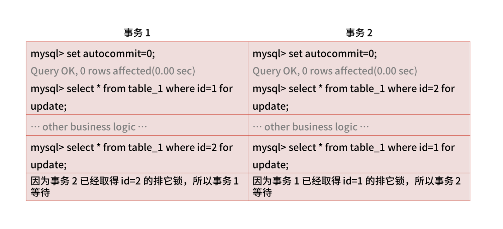

当然，你可以通过“超时控制”解决交叉死锁的问题，但在高并发情况下，出现的大部分请求都会排队等待，所以“基于关系型数据库实现分布式锁”的方式在性能上存在缺陷，所以如果你回答“基于关系型数据库 MySQL 实现分布式锁”，通常会延伸出下面两个问题。

- 数据库的事务隔离级别

如果你想让系统支持海量并发，那数据库的并发处理能力就尤为重要，而影响数据库并发能力最重要的因素是数据库的事务隔离机制。

数据库的四种隔离级别从低到高分别是：

- 读未提交（READ UNCOMMITTED）；
- 读已提交（READ COMMITTED）；
- 可重复读（REPEATABLE READ）；
- 可串行化（SERIALIZABLE）。

其中，可串行化操作就是按照事务的先后顺序，排队执行，然而一个事务操作可能要执行很久才能完成，这就没有并发效率可言了，所以数据库隔离级别越高，系统的并发性能就越差。

- 基于乐观锁的方式实现分布式锁

在数据库层面，select for update 是悲观锁，会一直阻塞直到事务提交，所以为了不产生锁等待而消耗资源，你可以基于乐观锁的方式来实现分布式锁，比如基于版本号的方式，首先在数据库增加一个 int 型字段 ver，然后在 SELECT 同时获取 ver 值，最后在 UPDATE 的时候检查 ver 值是否为与第 2 步或得到的版本值相同。

```sql
## SELECT 同时获取 ver 值

select amount, old_ver from order where order_id = xxx

## UPDATE 的时候检查 ver 值是否与第 2 步获取到的值相同

update order set ver = old_ver + 1, amount = yyy where order_id = xxx and ver = old_ver
```

此时，如果更新结果的记录数为1，就表示成功，如果更新结果的记录数为 0，就表示已经被其他应用更新过了，需要做异常处理。

##### 基于分布式缓存实现分布式锁

因为数据库的性能限制了业务的并发量，所以针对“ 618 和双 11 大促”等请求量剧增的场景，你要引入基于缓存的分布式锁，这个方案可以避免大量请求直接访问数据库，提高系统的响应能力。

基于缓存实现的分布式锁，就是将数据仅存放在系统的内存中，不写入磁盘，从而减少 I/O 读写。接下来，我以 Redis 为例讲解如何实现分布式锁。

在加锁的过程中，实际上就是在给 Key 键设置一个值，为避免死锁，还要给 Key 键设置一个过期时间。

```redis
SET lock_key unique_value NX PX 10000
```

- lock_key 就是 key 键；
- unique_value 是客户端生成的唯一的标识；
- NX 代表只在 lock_key 不存在时，才对 lock_key 进行设置操作；
- PX 10000 表示设置 lock_key 的过期时间为 10s，这是为了避免客户端发生异常而无法释放锁。

而解锁的过程就是将 lock_key 键删除，但不能乱删，要保证执行操作的客户端就是加锁的客户端。而这个时候， unique_value 的作用就体现出来，实现方式可以通过 lua 脚本判断 unique_value 是否为加锁客户端。

选用 Lua 脚本是为了保证解锁操作的原子性。因为 Redis 在执行 Lua 脚本时，可以以原子性的方式执行，从而保证了锁释放操作的原子性。

```redis
// 释放锁时，先比较 unique_value 是否相等，避免锁的误释放
if redis.call("get",KEYS[1]) == ARGV[1] then
    return redis.call("del",KEYS[1])
else
    return 0
end
```

以上，就是基于 Redis 的 SET 命令和 Lua 脚本在 Redis 单节点上完成了分布式锁的加锁、解锁，不过在实际面试中，你不能仅停留在操作上，因为这并不能满足应对面试需要掌握的知识深度， 所以你还要清楚基于 Redis 实现分布式锁的优缺点；Redis 的超时时间设置问题；站在架构设计层面上 Redis 怎么解决集群情况下分布式锁的可靠性问题。需要注意的是，你不用一股脑全部将其说出来，而是要做好准备，以便跟上面试官的思路，同频沟通。

- 基于 Redis 实现分布式锁的优缺点

基于数据库实现分布式锁的方案来说，基于缓存实现的分布式锁主要的优点主要有三点。

1. 性能高效（这是选择缓存实现分布式锁最核心的出发点）。
2. 实现方便。很多研发工程师选择使用 Redis 来实现分布式锁，很大成分上是因为 Redis 提供了 setnx 方法，实现分布式锁很方便。但是需要注意的是，在 Redis2.6.12 的之前的版本中，由于加锁命令和设置锁过期时间命令是两个操作（不是原子性的），当出现某个线程操作完成 setnx 之后，还没有来得及设置过期时间，线程就挂掉了，就会导致当前线程设置 key 一直存在，后续的线程无法获取锁，最终造成死锁的问题，所以要选型 Redis 2.6.12 后的版本或通过 Lua 脚本执行加锁和设置超时时间（Redis 允许将 Lua 脚本传到 Redis 服务器中执行, 脚本中可以调用多条 Redis 命令，并且 Redis 保证脚本的原子性）。
3. 避免单点故障（因为 Redis 是跨集群部署的，自然就避免了单点故障）。

当然，基于 Redis 实现分布式锁也存在缺点，主要是不合理设置超时时间，以及 Redis 集群的数据同步机制，都会导致分布式锁的不可靠性。

- 如何合理设置超时时间

通过超时时间来控制锁的失效时间，不太靠谱，比如在有些场景中，一个线程 A 获取到了锁之后，由于业务代码执行时间可能比较长，导致超过了锁的超时时间，自动失效，后续线程 B 又意外的持有了锁，当线程 A 再次恢复后，通过 del 命令释放锁，就错误的将线程 B 中同样 key 的锁误删除了。

所以，如果锁的超时时间设置过长，会影响性能，如果设置的超时时间过短，有可能业务阻塞没有处理完成，能否合理设置超时时间，是基于缓存实现分布式锁很难解决的一个问题。

那么如何合理设置超时时间呢？ 你可以基于续约的方式设置超时时间：先给锁设置一个超时时间，然后启动一个守护线程，让守护线程在一段时间后，重新设置这个锁的超时时间。实现方式就是：写一个守护线程，然后去判断锁的情况，当锁快失效的时候，再次进行续约加锁，当主线程执行完成后，销毁续约锁即可。

不过这种方式实现起来相对复杂，我建议你结合业务场景进行回答，所以针对超时时间的设置，要站在实际的业务场景中进行衡量。

- Redis 如何解决集群情况下分布式锁的可靠性？

在回答基于 Redis 实现分布式锁时候，你需要具备的答题思路和扩展点。其中也提到了基于 Redis 集群节点实现分布式锁会存在高可用的问题。

由于 Redis 集群数据同步到各个节点时是异步的，如果在 Redis 主节点获取到锁后，在没有同步到其他节点时，Redis 主节点宕机了，此时新的 Redis 主节点依然可以获取锁，所以多个应用服务就可以同时获取到锁。

Redis 官方已经设计了一个分布式锁算法 Redlock 解决了这个问题。而如果你能基于 Redlock 原理回答出怎么解决 Redis 集群节点实现分布式锁的问题，会成为面试的加分项。那官方是怎么解决的呢？

为了避免 Redis 实例故障导致锁无法工作的问题，Redis 的开发者 Antirez 设计了分布式锁算法 Redlock。Redlock 算法的基本思路，是让客户端和多个独立的 Redis 实例依次请求申请加锁，如果客户端能够和半数以上的实例成功地完成加锁操作，那么我们就认为，客户端成功地获得分布式锁，否则加锁失败。

这样一来，即使有某个 Redis 实例发生故障，因为锁的数据在其他实例上也有保存，所以客户端仍然可以正常地进行锁操作，锁的数据也不会丢失。那 Redlock 算法是如何做到的呢？

我们假设目前有 N 个独立的 Redis 实例， 客户端先按顺序依次向 N 个 Redis 实例执行加锁操作。这里的加锁操作和在单实例上执行的加锁操作一样，但是需要注意的是，Redlock 算法设置了加锁的超时时间，为了避免因为某个 Redis 实例发生故障而一直等待的情况。

当客户端完成了和所有 Redis 实例的加锁操作之后，如果有超过半数的 Redis 实例成功的获取到了锁，并且总耗时没有超过锁的有效时间，那么就是加锁成功。

### RPC 技术

#### 案例背景

框架资源多，很多同学在工作中的选择也多，基本上都是拿来就用，停留在基础概念和使用上，不会深究技术实现。所以很多候选人对于 RPC 有关的面试问题存在一个误区，认为面试官只会问这样几个问题：

- RPC 的一次调用过程是怎样的？
- RPC 的服务发现是如何实现的？
- RPC 的负载均衡有哪些？
- ....

这些问题看似专业，却很容易搜索到答案，如果作为面试题很难区分候选人的技术能力。所以针对 RPC 的技术考察，目前大多数面试官会从“实践操作 + 原理掌握”两个角度出发，递进地考察候选人。

#### RPC 实践操作

面试官通常会从线上的实际案例出发，考察候选人对“实践操作”的掌握程度。举个例子：在电商 App 商品详情页中，用户每次刷新页面时，App 都会请求业务网关系统，并由网关系统远程调用多个下游服务（比如商品服务、促销服务、广告服务等）。

针对这个场景，面试官会问“对于整条 RPC 调用链路（从 App 到网关再到各个服务系统），怎么设置 RPC 的超时时间，要考虑哪些问题？”

一些初中级研发会觉得问题很简单，不用想也知道：App 远程调用网关系统的超时时间要大于网关系统调用后端各服务的超时时间之和。这样至少能保证在网关与下游服务的每个 PRC 调用执行完成之前不超时。

如果你这么回答，从“实践”的角度上看，基本是不合格的。

因为 RPC 接口的超时设置看似简单，但其中却涉及了很多技术层面的问题。比如 RPC 都有超时重传的机制，如果后端服务触发超时重传，这时对 App 来说，也会存在请求等待超时的风险，就会出现后端服务还没来得及做降级处理，商品详情页就已经等待超时了。

并且在 RPC 调用的过程中也还会涉及其他的技术点，比如：

- 即使考虑到整个调用链的平均响应时长会受到所有依赖服务的耗时和重传次数影响，那么依据什么来设置 RPC 超时时间和重试次数呢？
- 如果发生超时重传，怎么区分哪些 RPC 服务可重传，哪些不可重传呢？
- 如果请求超过了 PRC 的重传次数，一般会触发服务降级，这又会对商品详情页造成什么影响？
- ...

总的来说，任何一个微服务出现性能问题，都会影响网关系统的平均响应时长，最终对 App 产生影响。所以从 RPC 接口的超时问题上，面试官会考察候选人很多深层次的开发实践能力。

那具体要怎么回答呢？我建议你参考以下解题思路。

- 结合 TP99 请求耗时：首先如果你要回答“超时时间设置和重传次数问题”，需要根据每一个微服务 TP99 的请求耗时，以及业务场景进行综合衡量。
- RPC 调用方式：你要站在业务场景下，讲清楚网关调用各下游服务的串并行方式，服务之间是否存在上下服务依赖。
- 分析核心服务：分析出哪些是核心服务，哪些是非核心服务，核心服务是否有备用方案，非核心服务是否有降级策略。

总的来讲，解答“实践操作类面试题”，一定要结合理论和落地实践，要做到即有理也有据，有理表示要有分析问题的能力，有据表示具备落地实战的经验。很多同学的通病是：回答问题只有方案，没有落地细节，这会让面试官认为你技术不扎实。

#### RPC 原理掌握

以刚刚的“电商 App”场景为例：

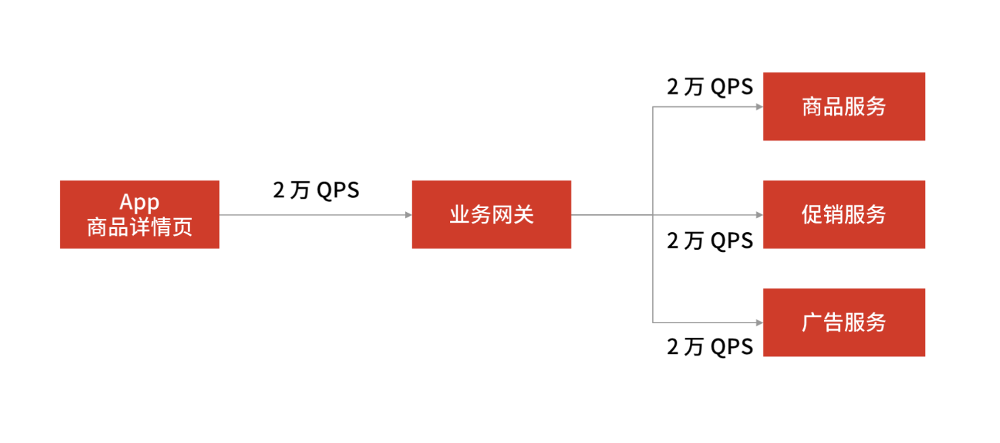

此时，商品详情页的 QPS 已达到了 2 万次/s，在做了服务化拆分之后，此时完成一次请求需要调用 3 次 RPC 服务，计算下来，RPC 服务需要承载大概 6 万次/s 的请求。那么你怎么设计 RPC 框架才能承载 6 万次/s 请求量呢？

能否答好这个问题，很考验候选人对 RPC 原理掌握的深度，我建议你从两个角度分析。

- 优化 RPC 的网络通信性能： 高并发下选择高性能的网络编程 I/O 模型。
- 选型合适的 RPC 序列化方式： 选择合适的序列化方式，进而提升封包和解包的性能。

然而我在面试候选人时发现，一些同学虽然做了准备，但只能说出个别 RPC 框架的大致流程，不能深刻理解每个环节的工作原理，所以整体给我的感觉就是：应用层面通过，原理深度不够。

而我对你的要求是：对于中间件等技术工具和框架，虽然在实际工作中不推荐重复“造轮子”，但在面试中要证明自己具备“造轮子”的能力，因为要评价一个程序员是否对技术栈有全面的认识，考察其“造轮子”的能力是一个不错的切入点。

##### 一次完整的 RPC 流程

因为 RPC 是远程调用，首先会涉及网络通信， 又因为 RPC 用于业务系统之间的数据交互，要保证数据传输的可靠性，所以它一般默认采用 TCP 来实现网络数据传输。

另外，在网络传输中，RPC 不会把请求参数的所有二进制数据一起发送到服务提供方机器上，而是拆分成好几个数据包（或者把好几个数据包封装成一个数据包），所以服务提供方可能一次获取多个或半个数据包，这也就是网络传输中的粘包和半包问题。为了解决这个问题，需要提前约定传输数据的格式，即“RPC 协议”。 大多数的协议会分成数据头和消息体：

- 数据头一般用于身份识别，包括协议标识、数据大小、请求类型、序列化类型等信息；
- 消息体主要是请求的业务参数信息和扩展属性等。

在确定好“ RPC 协议”后，一次完整的 RPC 调用会经过这样几个步骤：

- 调用方持续把请求参数对象序列化成二进制数据，经过 TCP 传输到服务提供方；
- 服务提供方从 TCP 通道里面接收到二进制数据；
- 根据 RPC 协议，服务提供方将二进制数据分割出不同的请求数据，经过反序列化将二进制数据逆向还原出请求对象，找到对应的实现类，完成真正的方法调用；
- 然后服务提供方再把执行结果序列化后，回写到对应的 TCP 通道里面；
- 调用方获取到应答的数据包后，再反序列化成应答对象。

你应该能发现， RPC 通信流程中的核心组成部分包括了协议、序列化与反序列化，以及网络通信。在了解了 RPC 的调用流程后，我们回到“电商 App”的案例中，先来解答序列化的问题。

##### 如何选型序列化方式

RPC 的调用过程会涉及网络数据（二进制数据）的传输，从中延伸的问题是：如何选型序列化和反序列化方式？

要想回答这一点，你需要先明确序列化方式，常见的方式有以下几种。

- JSON：Key-Value 结构的文本序列化框架，易用且应用最广泛，基于 HTTP 协议的 RPC 框架都会选择 JSON 序列化方式，但它的空间开销很大，在通信时需要更多的内存。
- Hessian：一种紧凑的二进制序列化框架，在性能和体积上表现比较好。
- Protobuf：Google 公司的序列化标准，序列化后体积相比 JSON、Hessian 还要小，兼容性也做得不错。

明确“常见的序列化方式”后，你就可以组织回答问题的逻辑了：考虑时间与空间开销，切勿忽略兼容性。

在大量并发请求下，如果序列化的速度慢，势必会增加请求和响应的时间（时间开销）。另外，如果序列化后的传输数据体积较大，也会使网络吞吐量下降（空间开销）。所以，你要先考虑上述两点才能保证 RPC 框架的整体性能。除此之外，在 RPC 迭代中，常常会因为序列化协议的兼容性问题使 RPC 框架不稳定，比如某个类型为集合类的入参服务调用者不能解析，某个类的一个属性不能正常调用......

当然还有安全性、易用性等指标，不过并不是 RPC 的关键指标。总的来说，在面试时，你要综合考虑上述因素，总结出常用序列化协议的选型标准，比如首选 Hessian 与 Protobuf，因为它们在时间开销、空间开销、兼容性等关键指标上表现良好。

##### 如何提升网络通信性能

如何提升 RPC 的网络通信性能，这句话翻译一下就是：一个 RPC 框架如何选择高性能的网络编程 I/O 模型？这样一来，和 I/O 模型相关的知识点就是你需要掌握的了。

对于 RPC 网络通信问题，你首先要掌握网络编程中的五个 I/O 模型：

- 同步阻塞 I/O（BIO）
- 同步非阻塞 I/O
- I/O 多路复用（NIO）
- 信号驱动
- 异步 I/O（AIO）

BIO 的网络模型中，每当客户端发送一个连接请求给服务端，服务端都会启动一个新的线程去处理客户端连接的读写操作，即每个 Socket 都对应一个独立的线程，客户端 Socket 和服务端工作线程的数量是 1 比 1，这会导致服务器的资源不够用，无法实现高并发下的网络开发。所以 BIO 的网络模型只适用于 Socket 连接不多的场景，无法支撑几十甚至上百万的连接场景。

另外，BIO 模型有两处阻塞的地方。

- 服务端阻塞等待客户端发起连接。
- 连接成功后，工作线程阻塞读取客户端 Socket 发送数据。

以上这些就是 BIO 网络模型的问题所在，总结下来就两点：

- Socket 连接数量受限，不适用于高并发场景；
- 有两处阻塞，分别是等待用户发起连接，和等待用户发送数据。

那怎么解决这个问题呢？ 答案是 NIO 网络模型，操作上是用一个线程处理多个连接，使得每一个工作线程都可以处理多个客户端的 Socket 请求，这样工作线程的利用率就能得到提升，所需的工作线程数量也随之减少。此时 NIO 的线程模型就变为 1 个工作线程对应多个客户端 Socket 的请求，这就是所谓的 I/O多路复用。

顺着这个思路，我们继续深入思考：既然服务端的工作线程可以服务于多个客户端的连接请求，那么具体由哪个工作线程服务于哪个客户端请求呢？

这时就需要一个调度者去监控所有的客户端连接，比如当图客户端 A 的输入已经准备好后，就由这个调度者去通知服务端的工作线程，告诉它们由工作线程 1 去服务于客户端 A 的请求。这种思路就是 NIO 编程模型的基本原理，调度者就是 Selector 选择器。

由此可见，NIO 比 BIO 提高了服务端工作线程的利用率，并增加了一个调度者，来实现 Socket 连接与 Socket 数据读写之间的分离。

在目前主流的 RPC 框架中，广泛使用的也是 I/O 多路复用模型，Linux 系统中的 select、poll、epoll等系统调用都是 I/O 多路复用的机制。

### 消息队列的丢失、重复与积压问题

#### 案例背景

以京东系统为例，用户在购买商品时，通常会选择用京豆抵扣一部分的金额，在这个过程中，交易服务和京豆服务通过 MQ 消息队列进行通信。在下单时，交易服务发送“扣减账户 X 100 个京豆”的消息给 MQ 消息队列，而京豆服务则在消费端消费这条命令，实现真正的扣减操作。

#### 案例分析

要知道，在互联网面试中，引入 MQ 消息中间件最直接的目的是：做系统解耦合流量控制，追其根源还是为了解决互联网系统的高可用和高性能问题。

- 系统解耦：用 MQ 消息队列，可以隔离系统上下游环境变化带来的不稳定因素，比如京豆服务的系统需求无论如何变化，交易服务不用做任何改变，即使当京豆服务出现故障，主交易流程也可以将京豆服务降级，实现交易服务和京豆服务的解耦，做到了系统的高可用。
- 流量控制：遇到秒杀等流量突增的场景，通过 MQ 还可以实现流量的“削峰填谷”的作用，可以根据下游的处理能力自动调节流量。

不过引入 MQ 虽然实现了系统解耦合流量控制，也会带来其他问题。

引入 MQ 消息中间件实现系统解耦，会影响系统之间数据传输的一致性。如果两个节点之间存在数据同步，就会带来数据一致性的问题。同理，消息生产端和消息消费端的消息数据一致性问题（也就是如何确保消息不丢失）。

而引入 MQ 消息中间件解决流量控制， 会使消费端处理能力不足从而导致消息积压，这也是你要解决的问题。

所以你能发现，问题与问题之间往往是环环相扣的，面试官会借机考察你解决问题思路的连贯性和知识体系的掌握程度。

那面对“在使用 MQ 消息队列时，如何确保消息不丢失”这个问题时，你要怎么回答呢？首先，你要分析其中有几个考点，比如：

- 如何知道有消息丢失？
- 哪些环节可能丢消息？
- 如何确保消息不丢失？

候选人在回答时，要先让面试官知道你的分析思路，然后再提供解决方案： 网络中的数据传输不可靠，想要解决如何不丢消息的问题，首先要知道哪些环节可能丢消息，以及我们如何知道消息是否丢失了，最后才是解决方案（而不是上来就直接说自己的解决方案）。就好比“架构设计”“架构”体现了架构师的思考过程，而“设计”才是最后的解决方案，两者缺一不可。

#### 案例解答

我们首先来看消息丢失的环节，一条消息从生产到消费完成这个过程，可以划分三个阶段，分别为消息生产阶段，消息存储阶段和消息消费阶段。

- 消息生产阶段： 从消息被生产出来，然后提交给 MQ 的过程中，只要能正常收到 MQ Broker 的 ack 确认响应，就表示发送成功，所以只要处理好返回值和异常，这个阶段是不会出现消息丢失的。
- 消息存储阶段： 这个阶段一般会直接交给 MQ 消息中间件来保证，但是你要了解它的原理，比如 Broker 会做副本，保证一条消息至少同步两个节点再返回 ack。
- 消息消费阶段： 消费端从 Broker 上拉取消息，只要消费端在收到消息后，不立即发送消费确认给 Broker，而是等到执行完业务逻辑后，再发送消费确认，也能保证消息的不丢失。

方案看似万无一失，每个阶段都能保证消息的不丢失，但在分布式系统中，故障不可避免，作为消费生产端，你并不能保证 MQ 是不是弄丢了你的消息，消费者是否消费了你的消息，所以，本着 Design for Failure 的设计原则，你还是需要一种机制，来 Check 消息是否丢失了。

紧接着，你还可以向面试官阐述怎么进行消息检测？ 总体方案解决思路为：在消息生产端，给每个发出的消息都指定一个全局唯一 ID，或者附加一个连续递增的版本号，然后在消费端做对应的版本校验。

具体怎么落地实现呢？你可以利用拦截器机制。 在生产端发送消息之前，通过拦截器将消息版本号注入消息中（版本号可以采用连续递增的 ID 生成，也可以通过分布式全局唯一 ID生成）。然后在消费端收到消息后，再通过拦截器检测版本号的连续性或消费状态，这样实现的好处是消息检测的代码不会侵入到业务代码中，可以通过单独的任务来定位丢失的消息，做进一步的排查。

这里需要你注意：如果同时存在多个消息生产端和消息消费端，通过版本号递增的方式就很难实现了，因为不能保证版本号的唯一性，此时只能通过全局唯一 ID 的方案来进行消息检测，具体的实现原理和版本号递增的方式一致。

现在，你已经知道了哪些环节（消息存储阶段、消息消费阶段）可能会出问题，并有了如何检测消息丢失的方案，然后就要给出解决防止消息丢失的设计方案。

回答完“如何确保消息不会丢失？”之后，面试官通常会追问“怎么解决消息被重复消费的问题？” 比如：在消息消费的过程中，如果出现失败的情况，通过补偿的机制发送方会执行重试，重试的过程就有可能产生重复的消息，那么如何解决这个问题？

这个问题其实可以换一种说法，就是如何解决消费端幂等性问题（幂等性，就是一条命令，任意多次执行所产生的影响均与一次执行的影响相同），只要消费端具备了幂等性，那么重复消费消息的问题也就解决了。

我们还是来看扣减京豆的例子，将账户 X 的金豆个数扣减 100 个，在这个例子中，我们可以通过改造业务逻辑，让它具备幂等性。

最简单的实现方案，就是在数据库中建一张消息日志表， 这个表有两个字段：消息 ID 和消息执行状态。这样，我们消费消息的逻辑可以变为：在消息日志表中增加一条消息记录，然后再根据消息记录，异步操作更新用户京豆余额。

因为我们每次都会在插入之前检查是否消息已存在，所以就不会出现一条消息被执行多次的情况，这样就实现了一个幂等的操作。当然，基于这个思路，不仅可以使用关系型数据库，也可以通过 Redis 来代替数据库实现唯一约束的方案。

想要解决“消息丢失”和“消息重复消费”的问题，有一个前提条件就是要实现一个全局唯一 ID 生成的技术方案。这也是面试官喜欢考察的问题，你也要掌握。

在分布式系统中，全局唯一 ID 生成的实现方法有数据库自增主键、UUID、Redis，Twitter-Snowflake 算法，我总结了几种方案的特点，你可以参考下。

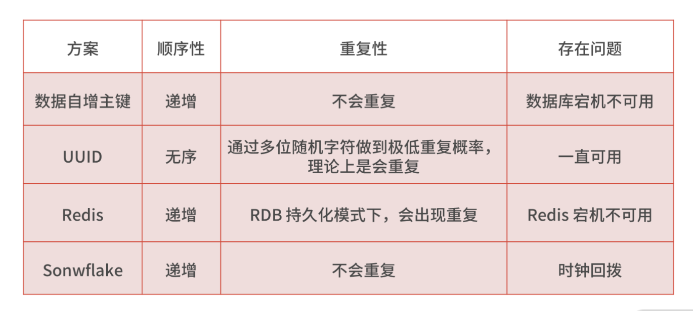

无论哪种方法，如果你想同时满足简单、高可用和高性能，就要有取舍，所以你要站在实际的业务中，说明你的选型所考虑的平衡点是什么。我个人在业务中比较倾向于选择 Snowflake 算法，在项目中也进行了一定的改造，主要是让算法中的 ID 生成规则更加符合业务特点，以及优化诸如时钟回拨等问题。

当然，除了“怎么解决消息被重复消费的问题？”之外，面试官还会问到你“消息积压”。 原因在于消息积压反映的是性能问题，解决消息积压问题，可以说明候选者有能力处理高并发场景下的消费能力问题。

你在解答这个问题时，依旧要传递给面试官一个这样的思考过程： 如果出现积压，那一定是性能问题，想要解决消息从生产到消费上的性能问题，就首先要知道哪些环节可能出现消息积压，然后在考虑如何解决。

因为消息发送之后才会出现积压的问题，所以和消息生产端没有关系，又因为绝大部分的消息队列单节点都能达到每秒钟几万的处理能力，相对于业务逻辑来说，性能不会出现在中间件的消息存储上面。毫无疑问，出问题的肯定是消息消费阶段，那么从消费端入手，如何回答呢？

如果是线上突发问题，要临时扩容，增加消费端的数量，与此同时，降级一些非核心的业务。通过扩容和降级承担流量，这是为了表明你对应急问题的处理能力。

其次，才是排查解决异常问题，如通过监控，日志等手段分析是否消费端的业务逻辑代码出现了问题，优化消费端的业务处理逻辑。

最后，如果是消费端的处理能力不足，可以通过水平扩容来提供消费端的并发处理能力，但这里有一个考点需要特别注意， 那就是在扩容消费者的实例数的同时，必须同步扩容主题 Topic 的分区数量，确保消费者的实例数和分区数相等。如果消费者的实例数超过了分区数，由于分区是单线程消费，所以这样的扩容就没有效果。

比如在 Kafka 中，一个 Topic 可以配置多个 Partition（分区），数据会被写入到多个分区中，但在消费的时候，Kafka 约定一个分区只能被一个消费者消费，Topic 的分区数量决定了消费的能力，所以，可以通过增加分区来提高消费者的处理能力。

## 案例 如何让系统抗住双十一的预约抢购活动？

### 案例背景

在大促活动期间，“预约抢购”已经是各大电商平台的主要促销手段，京东自然也会和一些大的供应商合作，推出一些低价的爆款产品，比如 2019 年的 “1499 元抢购飞天茅台”活动，就让很多人每天准时准点拿着手机拼人品。

那这类电商领域的大促抢购场景涉及专栏的哪些内容呢？它们是怎么通过架构设计的方式组合在一起，实现一个完整的需求流程呢？

我们先把需求梳理一下，总的来说，实现一个抢购系统大概可以分为四个阶段：

- 商品预约：用户进入商品详情页面，获取购买资格，并等待商品抢购倒计时。
- 等待抢购：等待商品抢购倒计时，直到商品开放抢购。
- 商品抢购：商品抢购倒计时结束，用户提交抢购订单，排队等待抢购结果，抢购成功后，扣减系统库存，生成抢购订单。
- 订单支付：等待用户支付成功后，系统更新订单状态，通知用户购买成功。

#### 商品预约阶段

这几年，很多电商平台为了方便流量运营，改造了传统秒杀场景，通过先预约再抢购的方式预热商品，并根据预约量调整运营策略。而且在预约抢购的活动中，为了增加商品售卖量，会允许抢购前，预约资格超过实际的库存数量。

那么问题来了：如何在高并发量的情况下，让每个用户都能得到抢购资格呢？这是预约抢购场景第一个技术考察点。那么可以通过分布式锁来控制抢购资格的发放。

我们基于 Redis 实现分布式锁（这是最常用的方式），在加锁的过程中，实际上是给 Key 键设置一个值，为避免死锁，还要给 Key 键设置一个过期时间。

```redis
SET lock_key unique_value NX PX 10000
```

- lock_key 就是 key 键；
- unique_value 是客户端生成的唯一的标识；
- NX 代表只在 lock_key 不存在时，才对 lock_key 进行设置操作；
- PX 10000 表示设置 lock_key 的过期时间为 10s，这是为了避免客户端发生异常而无法释放锁。

而解锁的过程就是将 lock_key 键删除，但不能乱删，要保证执行操作的客户端就是加锁的客户端。而这个时候， unique_value 的作用就体现出来，你可以通过 Lua 脚本判断 unique_value 是否为加锁客户端。

选用 Lua 脚本是为了保证解锁操作的原子性。因为 Redis 在执行 Lua 脚本时，可以以原子性的方式执行，保证了锁释放操作的原子性。

```redis
// 释放锁时，先比较 unique_value 是否相等，避免锁的误释放
if redis.call("get",KEYS[1]) == ARGV[1] then
    return redis.call("del",KEYS[1])
else
    return 0
end
```

这样一来，就通过使用 SET 命令和 Lua 脚本在 Redis 单节点上完成了分布式锁的加锁和解锁。但你要注意，此方案是基于单节点的 Redis 实例实现的，如果此时 Redis 实例发生故障宕机，那么锁变量就没有了，客户端也就无法进行锁操作，就会影响到业务的正常执行。 所以，基于 Redis 实现分布式锁时，你还要掌握如何保证锁的可靠性，也就是怎么基于多个 Redis 节点实现分布式锁。

#### 等待抢购阶段

用户预约成功之后，在商品详情页面中，会存在一个抢购倒计时，这个倒计时的初始时间是从服务端获取的，用户点击购买按钮时，系统还会去服务端验证是否已经到了抢购时间。

在等待抢购阶段，流量突增，因为在抢购商品之前（尤其是临近开始抢购之前的一分钟内），大部分用户会频繁刷新商品详情页，商品详情页面的读请求量剧增， 如果商品详情页面没有做好流量控制，就容易成为整个预约抢购系统中的性能瓶颈点。

那么问题来了：如何解决等待抢购时间内的流量突增问题呢？有两个解决思路。

- 页面静态化：提前对抢购商品的详情页面做静态化，生成一个静态页面，再把页面放到距离用户最近的 CDN 节点中，这样一来，当浏览器访问页面时，就会自动缓存该页面的静态资源文件（对于静态化技术，很多页面端的模板引擎都支持这样的功能，我就不展开讲了）。
- 服务端限流：对商品详情页中的动态请求接口设置最大并发访问数量（具体的数量根据上线前的性能压测为准），防止超出预期的请求集中访问系统，造成系统压力过载。操作上，你可以在商品详情页的后端系统入口层（如网关系统）中进行接口限流，如果使用 Nginx 来做反向代理，可以直接基于 Nginx 配置限流算法，比如 Nginx 的 ngx_http_limit_req_module（限制单位时间内所有 IP 的请求数量）和 ngx_stream_limit_conn_module（限制单位时间内单个 IP 的请求数量）两个模块就提供了限流控制的功能，所以你还要提前掌握限流策略的原理，如令牌桶算法的原理。

#### 商品抢购阶段

在商品抢购阶段，用户会点击提交订单，这时，抢购系统会先校验库存，当库存足够时，系统会先扣减库存，然后再生成订单。在这个过程中，短时间之内提交订单的写流量非常高，所以为了做流量削峰，会将提单请求暂存在消息队列中，并提示用户“抢购排队中……”然后再由后端服务异步处理用户的请求。

而你可以基于数据库和缓存两种方式，来实现校验库存和扣减库存的操作。

但因为抢购场景的瞬时流量极高，一般不会直接基于数据库来实现（因为每次操作数据库，即使通过消息队列做了流量削峰，对数据库来说压力也很大，会产生性能瓶颈）。如果非要基于数据库的话，你要通过分布式锁来优化扣减库存的并发操作，但此阶段的分布式锁对可靠性的要求会极高（因为在大促抢购阶段，小的可用性故障，都可能造成大的线上事故），所以基于单节点 Redis 实现的分布式锁不合适，你要选择多节点 Redis 实现分布式锁，或者选型 ZooKeeper。

为了避免上述问题，我们一般基于缓存来存储库存，实现扣减库存的操作。这样在提交订单时，库存的查询和锁定就不会给数据库带来性能瓶颈。不过你仍要注意，基于缓存（如 Redis）的库存扣减操作，仍要考虑缓存系统的单点问题，就算是多节点存储库存，也要引入锁的策略，保证 Redis 实现库存的一致性。

实现了校验库存和扣减库存之后，最后一步是生成抢购订单。由于数据库表会承载订单数据，一旦出现瞬时流量，磁盘 I/O、数据库请求连接数等资源都会出现性能瓶颈，你可以考虑对订单表分库分表，通过对用户 ID 字段进行 Hash 取模，实现分库分表，提高系统的并发能力。

从“商品抢购阶段的架构设计”中我们可以总结出三个技术考点：流量削峰、扣减库存、分库分表。

- “流量削峰”的面试考点

流量削峰是由于正式抢购场景下，短时间内的提单请求非常高，所以引入消息队列做异步化，然后在抢购系统的后端服务中，启动若干个队列处理消息队列中的提单请求，再执行校验库存、下单等逻辑。那么如何快速处理消息队列中的提单请求，避免出现大量的消息积压，就是本阶段的考点之一了。

- “扣减库存”的面试考点

我刚刚提到，当基于 Redis 实现库存的扣减时，要考虑怎么解决 Redis 的单点问题。而如果基于 Redis 集群来实现扣减库存，还要解决 Redis 在哨兵模式部署的情况下，因为主从切换带来的数据不一致的问题。

- “分库分表”的面试考点

生成订单后如何实现分库分表？也就是在亿级数据量的分布式存储问题。

当然还有一个容易忽略的问题：带宽的影响。由于抢购入口的请求量会非常大，可能会占用大量带宽，为了不影响提交订单的请求，有时会从网络工程的角度解决，通过单独的子域名绑定独立的网络服务器，这里就会涉及 DNS 的设计与优化手段。

#### 订单支付阶段

在用户支付订单完成之后，一般会由支付平台回调系统接口，更新订单状态。在支付回调成功之后，抢购系统还会通过异步通知的方式，实现订单更新之外的非核心业务处理，比如积分累计、短信通知等，此阶段可以基于 MQ 实现业务的异步操作。

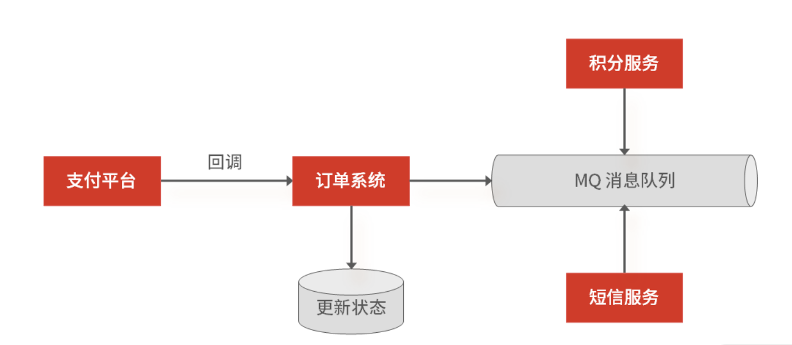

不过针对服务的异常（如宕机），会存在请求数据丢失的可能，比如当支付回调系统后，修改订单状态成功了，但是在异步通知积分系统，更新用户累计积分时，订单系统挂掉了，此时 MQ 还没有收到这条消息，那么这条消息数据就无法还原了。

所以你还要考虑可靠消息投递机制：先做消息的本地存储，再通过异步重试机制，来实现消息的补偿。比如当支付平台回调订单系统，然后在更新状态的同时，插入一个消息，之后再返回第三方支付操作成功的结果。最后，通过数据库中的这条消息，再异步推送其他系统，完成后续的工作。

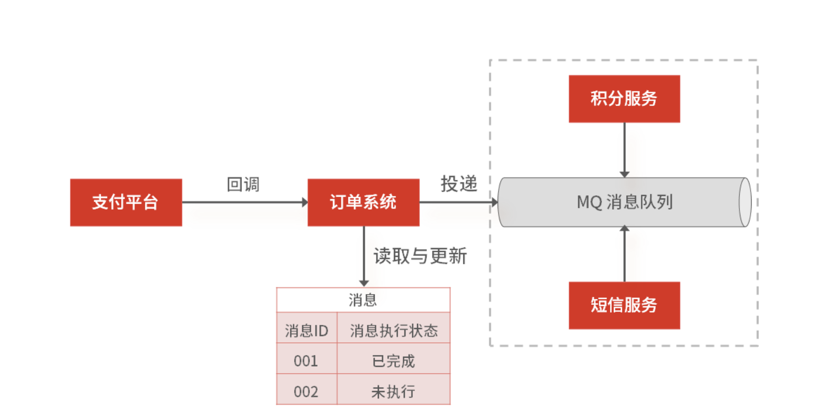

## MySQL

### MySQL 的索引原理与优化

#### 案例背景

很多面试官考察候选人对“数据库知识”的掌握程度，会以“数据库的索引原理和优化方法”作为切入点。

假设面试官问你： 在电商平台的订单中心系统中，通常要根据商品类型、订单状态筛选出需要的订单，并按照订单创建的时间进行排序，那针对下面这条 SQL，你怎么通过索引来提高查询效率呢？

```sql
select * from order where status = 1 order by create_time asc
```

有的同学会认为，单独给 status 建立一个索引就可以了。但是更优的方式是建立一个 status 和 create_time 组合索引，这是为了避免 MySQL 数据库发生文件排序。因为在查询时，你只能用到 status 的索引，但如果要对 create_time 排序，就要用文件排序 filesort，也就是在 SQL 执行计划中，Extra 列会出现 Using filesort。

所以你要利用索引的有序性，在 status 和 create_time 列建立联合索引，这样根据 status 筛选后的数据就是按照 create_time 排好序的，避免在文件排序。

#### 案例分析

通过这个案例，你可以发现“索引知识”的重要性，所以我一般也会拿索引知识来考察候选人，并扩展出 MySQL 索引原理与优化策略的一系列问题，比如：

- 数据库索引底层使用的是什么数据结构和算法呢？
- 为什么 MySQL InnoDB 选择 B+Tree 当默认的索引数据结构？
- 如何通过执行计划查看索引使用详情？
- 有哪些情况会导致索引失效？
- 平时有哪些常见的优化索引的方法？
- ...

总结起来就是如下几点：

- 理解 MySQL InnoDB 的索引原理；
- 掌握 B+Tree 相比于其他索引数据结构（如 B-Tree、二叉树，以及 Hash 表）的优势；
- 掌握 MySQL 执行计划的方法；
- 掌握导致索引失效的常见情况；
- 掌握实际工作中常用的建立高效索引的技巧（如前缀索引、建立覆盖索引等）。

如果你曾经被问到其中某一个问题，那你就有必要认真夯实 MySQL 索引及优化的内容了。

#### 案例解答

##### MySQL InnoDB 的索引原理

从数据结构的角度来看， MySQL 常见索引有 B+Tree 索引、HASH 索引、Full-Text 索引。默认是 InnoDB 引擎，B+Tree 索引类型也是 MySQL 存储引擎采用最多的索引类型。

在创建表时，InnoDB 存储引擎默认使用表的主键作为主键索引，该主键索引就是聚簇索引（Clustered Index），如果表没有定义主键，InnoDB 就自己产生一个隐藏的 6 个字节的主键 ID 值作为主键索引，而创建的主键索引默认使用的是 B+Tree 索引。

接下来我们通过一个简单的例子，说明一下 B+Tree 索引在存储数据中的具体实现，为的是让你理解通过 B+Tree 做索引的原理。

首先，我们创建一张商品表：

```sql
CREATE TABLE `product`  (

  `id` int(11) NOT NULL,

  `product_no` varchar(20)  DEFAULT NULL,

  `name` varchar(255) DEFAULT NULL,

  `price` decimal(10, 2) DEFAULT NULL,

  PRIMARY KEY (`id`) USING BTREE

) CHARACTER SET = utf8 COLLATE = utf8_general_ci ROW_FORMAT = Dynamic;
```

增加几行数据：

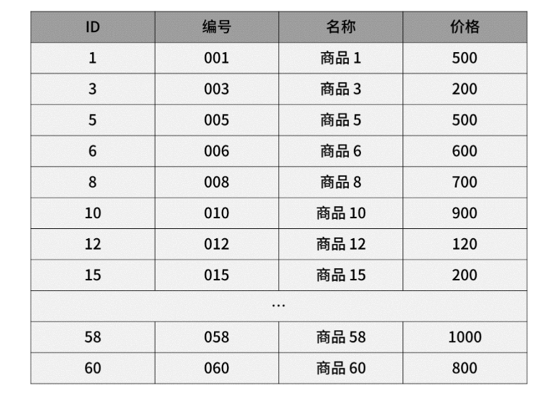

- 通过主键查询（主键索引）商品数据的过程

此时当我们使用主键索引查询商品 15 的时候，那么按照 B+Tree 索引原理，是如何找到对应数据的呢？

```sql
select * from product where id = 15
```

我们可以通过数据手动构建一个 B+Tree，它的每个节点包含 3 个子节点（B+Tree 每个节点允许有 M 个子节点，且 M>2），根节点中的数据值 1、18、36 分别是子节点（1，6，12），（18，24，30）和（36，41，52）中的最小值。

每一层父节点的数据值都会出现在下层子节点的数据值中，因此在叶子节点中，包括了所有的数据值信息，并且每一个叶子节点都指向下一个叶子节点，形成一个链表。我们举例讲解一下 B+Tree 的查询流程，比如想要查找数据值 15，B+Tree 会自顶向下逐层进行查找：

- 将 15 与根节点的数据 (1，18，36) 比较，15 在 1 和 18 之间，所以根据 B+Tree的搜索逻辑，找到第二层的数据块 (1，6，12)；
- 在第二层的数据块 (1，6，12) 中进行查找，因为 15 大于 12，所以找到第三层的数据块 (12，15，17)；
- 在叶子节点的数据块 (12，15，17) 中进行查找，然后我们找到了数据值 15；
- 最终根据数据值 15 找到叶子节点中存储的数据。

整个过程一共进行了 3 次 I/O 操作，所以 B+Tree 相比于 B 树和二叉树来说，最大的优势在于查询效率。

那么问题来了，如果你当前查询数据时候，不是通过主键 ID，而是用商品编码查询商品，那么查询过程又是怎样的呢？

- 通过非主键（辅助索引）查询商品数据的过程

如果你用商品编码查询商品（即使用辅助索引进行查询），会先检索辅助索引中的 B+Tree 的 商品编码，找到对应的叶子节点，获取主键值，然后再通过主键索引中的 B+Tree 树查询到对应的叶子节点，然后获取整行数据。这个过程叫回表。

在面试时，面试官一般不会让你直接描述查询索引的过程，但是会通过考察你对索引优化方法的理解，来评估你对索引原理的掌握程度，比如为什么 MySQL InnoDB 选择 B+Tree 作为默认的索引数据结构？MySQL 常见的优化索引的方法有哪些？

所以接下来，我们就详细了解一下在面试中如何回答索引优化的问题。

##### B+Tree 索引的优势

如果你被问到“为什么 MySQL 会选择 B+Tree 当索引数据结构？”其实在考察你两个方面： B+Tree 的索引原理； B+Tree 索引相比于其他索引类型的优势。

我们刚刚已经讲了 B+Tree 的索引原理，现在就来回答一下 B+Tree 相比于其他常见索引结构，如 B 树、二叉树或 Hash 索引结构的优势在哪儿？

- B+Tree 相对于 B 树 索引结构的优势

B+Tree 只在叶子节点存储数据，而 B 树 的非叶子节点也要存储数据，所以 B+Tree 的单个节点的数据量更小，在相同的磁盘 I/O 次数下，就能查询更多的节点。

另外，B+Tree 叶子节点采用的是双链表连接，适合 MySQL 中常见的基于范围的顺序查找，而 B 树无法做到这一点。

- B+Tree 相对于二叉树索引结构的优势

对于有 N 个叶子节点的 B+Tree，其搜索复杂度为O(logdN)，其中 d 表示节点允许的最大子节点个数为 d 个。在实际的应用当中， d 值是大于100的，这样就保证了，即使数据达到千万级别时，B+Tree 的高度依然维持在 3~4 层左右，也就是说一次数据查询操作只需要做 3~4 次的磁盘 I/O 操作就能查询到目标数据。

而二叉树的每个父节点的儿子节点个数只能是 2 个，意味着其搜索复杂度为 O(logN)，这已经比 B+Tree 高出不少，因此二叉树检索到目标数据所经历的磁盘 I/O 次数要更多。

- B+Tree 相对于 Hash 表存储结构的优势

我们知道范围查询是 MySQL 中常见的场景，但是 Hash 表不适合做范围查询，它更适合做等值的查询，这也是 B+Tree 索引要比 Hash 表索引有着更广泛的适用场景的原因。

至此，你就知道“为什么 MySQL 会选择 B+Tree 来做索引”了。在回答时，你要着眼于 B+Tree 的优势，然后再引入索引原理的查询过程（掌握这些知识点，这个问题其实比较容易回答）。

接下来，我们进入下一个问题：在实际工作中如何查看索引的执行计划。

##### 通过执行计划查看索引使用详情

有一张存储商品信息的演示表 product：

```sql
CREATE TABLE `product`  (

  `id` int(11) NOT NULL,

  `product_no` varchar(20)  DEFAULT NULL,

  `name` varchar(255) DEFAULT NULL,

  `price` decimal(10, 2) DEFAULT NULL,

  PRIMARY KEY (`id`) USING BTREE,

  KEY 'index_name' ('name').

  KEY 'index_id_name' ('id', 'name')

) CHARACTER SET = utf8 COLLATE = utf8_general_ci
```

表中包含了主键索引、name 字段上的普通索引，以及 id 和 name 两个字段的联合索引。现在我们来看一条简单查询语句的执行计划：

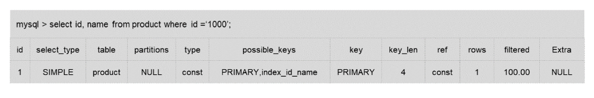

对于执行计划，参数有 possible_keys 字段表示可能用到的索引，key 字段表示实际用的索引，key_len 表示索引的长度，rows 表示扫描的数据行数。

这其中需要你重点关注 type 字段， 表示数据扫描类型，也就是描述了找到所需数据时使用的扫描方式是什么，常见扫描类型的执行效率从低到高的顺序为（考虑到查询效率问题，全表扫描和全索引扫描要尽量避免）：

- ALL（全表扫描）；
- index（全索引扫描）；
- range（索引范围扫描）；
- ref（非唯一索引扫描）；
- eq_ref（唯一索引扫描）；
- const（结果只有一条的主键或唯一索引扫描）。

总的来说，执行计划是研发工程师分析索引详情必会的技能（很多大厂公司招聘 JD 上写着“SQL 语句调优” ），所以你在面试时也要知道执行计划核心参数的含义，如 type。在回答时，也要以重点参数为切入点，再扩展到其他参数，然后再说自己是怎么做 SQL 优化工作的。

##### 索引失效的常见情况

在工作中，我们经常会碰到 SQL 语句不适用已有索引的情况，比如：

- 索引列上做了计算、函数、类型转换操作，这些情况下索引失效是因为查询过程需要扫描整个索引并回表，代价高于直接全表扫描；
- like 匹配使用了前缀匹配符 '%abc'；
- 字符串不加引号导致类型转换。

 如果 MySQL 查询优化器预估走索引的代价比全表扫描的代价还要大，则不走对应的索引，直接全表扫描，如果走索引比全表扫描代价小，则使用索引。

##### 常见优化索引的方法

- 前缀索引优化

前缀索引就是用某个字段中，字符串的前几个字符建立索引，比如我们可以在订单表上对商品名称字段的前 5 个字符建立索引。使用前缀索引是为了减小索引字段大小，可以增加一个索引页中存储的索引值，有效提高索引的查询速度。在一些大字符串的字段作为索引时，使用前缀索引可以帮助我们减小索引项的大小。

但是，前缀索引有一定的局限性，例如 order by 就无法使用前缀索引，无法把前缀索引用作覆盖索引。

- 覆盖索引优化

覆盖索引是指 SQL 中 query 的所有字段，在索引 B+tree 的叶子节点上都能找得到的那些索引，从辅助索引中查询得到记录，而不需要通过聚簇索引查询获得。假设我们只需要查询商品的名称、价格，有什么方式可以避免回表呢？

我们可以建立一个组合索引，即商品ID、名称、价格作为一个组合索引。如果索引中存在这些数据，查询将不会再次检索主键索引，从而避免回表。所以，使用覆盖索引的好处很明显，即不需要查询出包含整行记录的所有信息，也就减少了大量的 I/O 操作。

- 联合索引

联合索引时，存在最左匹配原则，也就是按照最左优先的方式进行索引的匹配。比如联合索引 (userpin, username)，如果查询条件是 WHERE userpin=1 AND username=2，就可以匹配上联合索引；或者查询条件是 WHERE userpin=1，也能匹配上联合索引，但是如果查询条件是 WHERE username=2，就无法匹配上联合索引。

另外，建立联合索引时的字段顺序，对索引效率也有很大影响。越靠前的字段被用于索引过滤的概率越高，实际开发工作中建立联合索引时，要把区分度大的字段排在前面，这样区分度大的字段越有可能被更多的 SQL 使用到。

### MySQL 的事务隔离级别和锁的机制

#### 案例背景

MySQL 的事务隔离级别（Isolation Level），是指：当多个线程操作数据库时，数据库要负责隔离操作，来保证各个线程在获取数据时的准确性。它分为四个不同的层次，按隔离水平高低排序，读未提交 < 读已提交 < 可重复度 < 串行化。

- 读未提交（Read uncommitted）：隔离级别最低、隔离度最弱，脏读、不可重复读、幻读三种现象都可能发生。所以它基本是理论上的存在，实际项目中没有人用，但性能最高。
- 读已提交（Read committed）：它保证了事务不出现中间状态的数据，所有数据都是已提交且更新的，解决了脏读的问题。但读已提交级别依旧很低，它允许事务间可并发修改数据，所以不保证再次读取时能得到同样的数据，也就是还会存在不可重复读、幻读的可能。
- 可重复读（Repeatable reads）：MySQL InnoDB 引擎的默认隔离级别，保证同一个事务中多次读取数据的一致性，解决脏读和不可重复读，但仍然存在幻读的可能。
- 可串行化（Serializable）：选择“可串行化”意味着读取数据时，需要获取共享读锁；更新数据时，需要获取排他写锁；如果 SQL 使用 WHERE 语句，还会获取区间锁。换句话说，事务 A 操作数据库时，事务 B 只能排队等待，因此性能也最低。

至于数据库锁，分为悲观锁和乐观锁，“悲观锁”认为数据出现冲突的可能性很大，“乐观锁”认为数据出现冲突的可能性不大。那悲观锁和乐观锁在基于 MySQL 数据库的应用开发中，是如何实现的呢？

- 悲观锁一般利用 SELECT … FOR UPDATE 类似的语句，对数据加锁，避免其他事务意外修改数据。
- 乐观锁利用 CAS 机制，并不会对数据加锁，而是通过对比数据的时间戳或者版本号，实现版本判断。

#### 案例分析

如果面试官想深挖候选人对数据库内部机制的掌握程度，切入点一般是 MySQL 的事务和锁机制。

- 举例说明什么是脏读、不可重复度和幻读（三者虽然基础，但很多同学容易弄混）？
- MySQL 是怎么解决脏读、不可重复读，和幻读问题的？
- 你怎么理解死锁？
- ...

#### 案例解答

##### 怎么理解脏读、不可重复读和幻读？

脏读： 读到了未提交事务的数据。

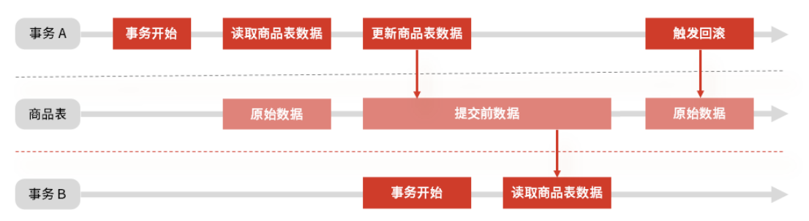

假设有 A 和 B 两个事务，在并发情况下，事务 A 先开始读取商品数据表中的数据，然后再执行更新操作，如果此时事务 A 还没有提交更新操作，但恰好事务 B 开始，然后也需要读取商品数据，此时事务 B 查询得到的是刚才事务 A 更新后的数据。

如果接下来事务 A 触发了回滚，那么事务 B 刚才读到的数据就是过时的数据，这种现象就是脏读。

“脏读”面试关注点：

- 脏读对应的隔离级别是“读未提交”，只有该隔离级别才会出现脏读。
- 脏读的解决办法是升级事务隔离级别，比如“读已提交”。

不可重复读： 事务 A 先读取一条数据，然后执行逻辑的过程中，事务 B 更新了这条数据，事务 A 再读取时，发现数据不匹配，这个现象就是“不可重复读”。

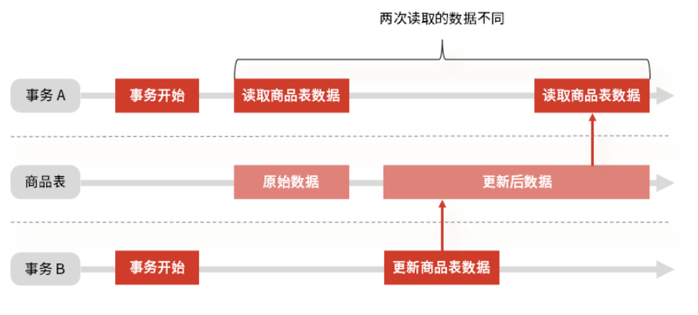

“不可重复读”面试关注点：

- 简单理解是两次读取的数据中间被修改，对应的隔离级别是“读未提交”或“读已提交”。
- 不可重复读的解决办法就是升级事务隔离级别，比如“可重复度”。

幻读： 在一个事务内，同一条查询语句在不同时间段执行，得到不同的结果集。

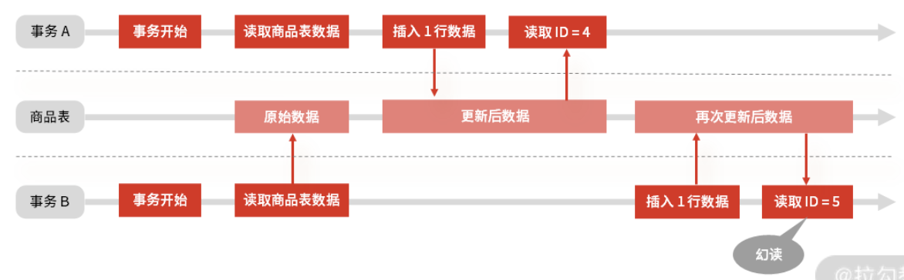

事务 A 读了一次商品表，得到最后的 ID 是 3，事务 B 也同样读了一次，得到最后 ID 也是 3。接下来事务 A 先插入了一行，然后读了一下最新的 ID 是 4，刚好是前面 ID 3 加上 1，然后事务 B 也插入了一行，接着读了一下最新的 ID 发现是 5，而不是 3 加 1。

这时，你发现在使用 ID 做判断或做关键数据时，就会出现问题，这种现象就像是让事务 B 产生了幻觉一样，读取到了一个意想不到的数据，所以叫幻读。当然，不仅仅是新增，删除、修改数据也会发生类似的情况。

“幻读”面试关注点：

- 要想解决幻读不能升级事务隔离级别到“可串行化”，那样数据库也失去了并发处理能力。
- 行锁解决不了幻读，因为即使锁住所有记录，还是阻止不了插入新数据。
- 解决幻读的办法是锁住记录之间的“间隙”，为此 MySQL InnoDB 引入了新的锁，叫间隙锁（Gap Lock），所以在面试中，你也要掌握间隙锁，以及间隙锁与行锁结合的 next-key lock 锁。

##### 怎么理解死锁

除了事务隔离级别，很多同学在面试时，经常会被面试官直奔主题地问：“谈谈你对死锁的理解”。要回答这样开放的问题，你就要在脑海中梳理出系统化的回答思路：死锁是如何产生的，如何避免死锁。

死锁一般发生在多线程（两个或两个以上）执行的过程中。因为争夺资源造成线程之间相互等待，这种情况就产生了死锁。

比如你有资源 1 和 2，以及线程 A 和 B，当线程 A 在已经获取到资源 1 的情况下，期望获取线程 B 持有的资源 2。与此同时，线程 B 在已经获取到资源 2 的情况下，期望获取现场 A 持有的资源 1。

那么线程 A 和线程 B 就处理了相互等待的死锁状态，在没有外力干预的情况下，线程 A 和线程 B 就会一直处于相互等待的状态，从而不能处理其他的请求。

死锁产生的四个必要条件：

- 互斥： 多个线程不能同时使用一个资源。比如线程 A 已经持有的资源，不能再同时被线程 B 持有。如果线程 B 请求获取线程 A 已经占有的资源，那线程 B 只能等待这个资源被线程 A 释放。
- 持有并等待： 当线程 A 已经持有了资源 1，又提出申请资源 2，但是资源 2 已经被线程 C 占用，所以线程 A 就会处于等待状态，但它在等待资源 2 的同时并不会释放自己已经获取的资源 1。
- 不可剥夺： 线程 A 获取到资源 1 之后，在自己使用完之前不能被其他线程（比如线程 B）抢占使用。如果线程 B 也想使用资源 1，只能在线程 A 使用完后，主动释放后再获取。
- 循环等待： 发生死锁时，必然会存在一个线程，也就是资源的环形链。比如线程 A 已经获取了资源 1，但同时又请求获取资源 2。线程 B 已经获取了资源 2，但同时又请求获取资源 1，这就会形成一个线程和资源请求等待的环形图。

死锁只有同时满足互斥、持有并等待、不可剥夺、循环等待时才会发生。并发场景下一旦死锁，一般没有特别好的方法，很多时候只能重启应用。因此，最好是规避死锁，那么具体怎么做呢？答案是：至少破坏其中一个条件（互斥必须满足，你可以从其他三个条件出发）。

- 持有并等待：我们可以一次性申请所有的资源，这样就不存在等待了；
- 不可剥夺：占用部分资源的线程进一步申请其他资源时，如果申请不到，可以主动释放它占有的资源，这样不可剥夺这个条件就破坏掉了。
- 循环等待：可以靠按序申请资源来预防，也就是所谓的资源有序分配原则，让资源的申请和使用有线性顺序，申请的时候可以先申请资源序号小的，再申请资源序号大的，这样的线性化操作就自然就不存在循环了。

### 读多写少：MySQL 如何优化数据查询方案？

#### 案例背景

假设你目前在某电商平台就职，公司面临双 11 大促，投入了大量营销费用用于平台推广，这带来了巨大的流量，如果你是订单系统的技术负责人，要怎么应对突如其来的读写流量呢？

这是一个很典型的应用场景，我想很多研发同学会回答：通过 Redis 作为 MySQL 的缓存，然后当用户查看“订单中心”时，通过查询订单缓存，帮助 MySQL 抗住大部分的查询请求。

如果你也是这么想，说明没认真思考过问题。因为应用缓存的原则之一是保证缓存命中率足够高，不然很多请求会穿透缓存，最终打到数据库上。然而在“订单中心”这样的场景中，每个用户的订单都不同，除非全量缓存数据库订单信息（又会带来架构的复杂度），不然缓存的命中率依旧很低。

所以在这种场景下，缓存只能作为数据库的前置保护机制，但是还会有很多流量打到数据库上，并且随着用户订单不断增多，请求到 MySQL 上的读写流量会越来越多，当单台 MySQL 支撑不了大量的并发请求时，该怎么办？

#### 案例分析

互联网大部分系统的访问流量是读多写少，读写请求量的差距可能达到几个数量级，就好比你在京东上的商品的浏览量肯定远大于你的下单量。

所以你要考虑优化数据库来抗住高查询请求，首先要做的就是区分读写流量区，这样才方便针对读流量做单独扩展，这个过程就是流量的“读写分离”。

读写分离是提升 MySQL 并发的首选方案，因为当单台 MySQL 无法满足要求时，就只能用多个具有相同数据的 MySQL 实例组成的集群来承担大量的读写请求。

MySQL 做读写分离的前提，是把 MySQL 集群拆分成“主 + 从”结构的数据集群，这样才能实现程序上的读写分离，并且 MySQL 集群的主库、从库的数据是通过主从复制实现同步的。

那么面试官会问你“MySQL 集群如何实现主从复制？” 换一种问法就是“当你提交一个事务到 MySQL 集群后，MySQL 都执行了哪些操作？”面试官往往会以该问题为切入点，挖掘你对 MySQL 集群主从复制原理的理解，然后再模拟一个业务场景，让你给出解决主从复制问题的架构设计方案。

所以，针对面试官的套路，你要做好以下的准备：

- 掌握读多写少场景下的架构设计思路，知道缓存不能解决所有问题，“读写分离”是提升系统并发能力的重要手段。
- 深入了解数据库的主从复制，掌握它的原理、问题，以及解决方案。
- 从实践出发，做到技术的认知抽象，从方法论层面来看设计。

#### 案例解答

##### MySQL 主从复制的原理

无论是“MySQL 集群如何实现主从复制”还是“当你提交一个事务到 MySQL 集群后，MySQL 集群都执行了哪些操作？”面试官主要是问你：MySQL 的主从复制的过程是怎样的？

总的来讲，MySQL 的主从复制依赖于 binlog ，也就是记录 MySQL 上的所有变化并以二进制形式保存在磁盘上。复制的过程就是将 binlog 中的数据从主库传输到从库上。这个过程一般是异步的，也就是主库上执行事务操作的线程不会等待复制 binlog 的线程同步完成。

为了方便你记忆，我把 MySQL 集群的主从复制过程梳理成 3 个阶段。

- 写入 Binlog：主库写 binlog 日志，提交事务，并更新本地存储数据。
- 同步 Binlog：把 binlog 复制到所有从库上，每个从库把 binlog 写到暂存日志中。
- 回放 Binlog：回放 binlog，并更新存储数据。

但在面试中你不能简单地只讲这几个阶段，要尽可能详细地说明主库和从库的数据同步过程，为的是让面试官感受到你技术的扎实程度（详细过程如下）。

- MySQL 主库在收到客户端提交事务的请求之后，会先写入 binlog，再提交事务，更新存储引擎中的数据，事务提交完成后，返回给客户端“操作成功”的响应。
- 从库会创建一个专门的 I/O 线程，连接主库的 log dump 线程，来接收主库的 binlog 日志，再把 binlog 信息写入 relay log 的中继日志里，再返回给主库“复制成功”的响应。
- 从库会创建一个用于回放 binlog 的线程，去读 relay log 中继日志，然后回放 binlog 更新存储引擎中的数据，最终实现主从的数据一致性。

在完成主从复制之后，你就可以在写数据时只写主库，在读数据时只读从库，这样即使写请求会锁表或者锁记录，也不会影响读请求的执行。

同时，在读流量比较大时，你可以部署多个从库共同承担读流量，这就是“一主多从”的部署方式，你在垂直电商项目中可以用该方式抵御较高的并发读流量。另外，从库也可以作为一个备库，以避免主库故障导致的数据丢失。

当然，一旦你提及“一主多从”，面试官很容易设陷阱问你：那大促流量大时，是不是只要多增加几台从库，就可以抗住大促的并发读请求了？

当然不是。

因为从库数量增加，从库连接上来的 I/O 线程也比较多，主库也要创建同样多的 log dump 线程来处理复制的请求，对主库资源消耗比较高，同时还受限于主库的网络带宽。所以在实际使用中，一个主库一般跟 2～3 个从库（1 套数据库，1 主 2 从 1 备主），这就是一主多从的 MySQL 集群结构。

其实，你从 MySQL 主从复制过程也能发现，MySQL 默认是异步模式：MySQL 主库提交事务的线程并不会等待 binlog 同步到各从库，就返回客户端结果。这种模式一旦主库宕机，数据就会发生丢失。

而这时，面试官一般会追问你“MySQL 主从复制还有哪些模型？”主要有三种。

- 同步复制：事务线程要等待所有从库的复制成功响应。
- 异步复制：事务线程完全不等待从库的复制成功响应。
- 半同步复制：MySQL 5.7 版本之后增加的一种复制方式，介于两者之间，事务线程不用等待所有的从库复制成功响应，只要一部分复制成功响应回来就行，比如一主二从的集群，只要数据成功复制到任意一个从库上，主库的事务线程就可以返回给客户端。

这种半同步复制的方式，兼顾了异步复制和同步复制的优点，即使出现主库宕机，至少还有一个从库有最新的数据，不存在数据丢失的风险。

讲到这儿，你基本掌握了 MySQL 主从复制的原理，但如果面试官想挖掘你的架构设计能力，还会从架构设计上考察你怎么解决 MySQL 主从复制延迟的问题，比如问你“在系统设计上有哪些方案可以解决主从复制的延迟问题？”

##### 从架构上解决主从复制延迟

我们来结合实际案例设计一个主从复制延迟的解决方案。在电商平台，每次用户发布商品评论时，都会先调用评论审核，目的是对用户发布的商品评论进行如言论监控、图片鉴黄等操作。

评论在更新完主库后，商品发布模块会异步调用审核模块，并把评论 ID 传递给审核模块，然后再由评论审核模块用评论 ID 查询从库中获取到完整的评论信息。此时如果主从数据库存在延迟，在从库中就会获取不到评论信息，整个流程就会出现异常。

这是主从复制延迟导致的查询异常，解决思路有很多，我提供给你几个方案。

- 使用数据冗余

可以在异步调用审核模块时，不仅仅发送商品 ID，而是发送审核模块需要的所有评论信息，借此避免在从库中重新查询数据（这个方案简单易实现，推荐你选择）。但你要注意每次调用的参数大小，过大的消息会占用网络带宽和通信时间。

- 使用缓存解决

可以在写入数据主库的同时，把评论数据写到 Redis 缓存里，这样其他线程再获取评论信息时会优先查询缓存，也可以保证数据的一致性。

不过这种方式会带来缓存和数据库的一致性问题，比如两个线程同时更新数据，操作步骤如下：

线程 A 先更新数据库为 100，此时线程 B 把数据库和缓存中的数据都更新成了 200，然后线程 A 又把缓存更新为 100，这样数据库中的值 200 和缓存中的值 100 就不一致了，这时候可以考虑到锁。

总的来说，通过缓存解决 MySQL 主从复制延迟时，会出现数据库与缓存数据不一致的情况。虽然它和“使用数据冗余”的方案相比并不优雅，但我还是建议你在面试中做一下补充，这样可以引出更多的技术知识，展现自己与其他人的差异。

- 直接查询主库

该方案在使用时一定要谨慎，你要提前明确查询的数据量不大，不然会出现主库写请求锁行，影响读请求的执行，最终对主库造成比较大的压力。

当然了，面试官除了从架构上考察你对 MySQL 主从复制延迟的理解，还会问你一些扩展问题，比如：当 MySQL 做了主从分离后，对于数据库的使用方式就发生了变化，以前只需要使用一个数据库地址操作数据库，现在却要使用一个主库地址和多个从库地址，并且还要区分写入操作和查询操作，那从工程代码上设计，怎么实现主库和从库的数据访问呢？

##### 实现主库和从库的数据库访问

一种简单的做法是：提前把所有数据源配置在工程中，每个数据源对应一个主库或者从库，然后改造代码，在代码逻辑中进行判断，将 SQL 语句发送给某一个指定的数据源来处理。

这个方案简单易实现，但 SQL 路由规则侵入代码逻辑，在复杂的工程中不利于代码的维护。

另一个做法是：独立部署的代理中间件，如 MyCat，这一类中间件部署在独立的服务器上，一般使用标准的 MySQL 通信协议，可以代理多个数据库。

该方案的优点是隔离底层数据库与上层应用的访问复杂度，比较适合有独立运维团队的公司选型；缺陷是所有的 SQL 语句都要跨两次网络传输，有一定的性能损耗，再就是运维中间件是一个专业且复杂的工作，需要一定的技术沉淀。

##### 技术认知

以上就是你在应聘初中级工程师时需要掌握的内容，如果你应聘的是高级研发工程师，在回答问题时，还要尽可能地展示自己对 MySQL 数据复制的抽象能力。因为在网络分布式技术错综复杂的今天，如果你能将技术抽象成一个更高层次的理论体系，很容易在面试中脱颖而出。

以 Raft 协议为例，其内部是通过日志复制同步的方式来实现共识的，例如在领导者选举成功后，它就会开始接收客户端的请求，此时每一个客户端请求都将被解析成一条指令日志，然后并行地向其他节点发起通知，要求其他节点复制这个日志条目，并最终在各个节点中回放日志，实现共识。

我们抽象一下它的运作机制：

如果客户端将要执行的命令发送给集群中的一台服务器，那么这台服务器就会以日志的方式记录这条命令，然后将命令发送给集群内其他的服务，并记录在其他服务器的日志文件中，注意，只要保证各个服务器上的日志是相同的，并且各服务器都能以相同的顺序执行相同的命令的话，那么集群中的每个节点的执行结果也都会是一样的。

这种数据共识的机制就叫复制状态机，目的是通过日志复制和回放的方式来实现集群中所有节点内的状态一致性。

其实 MySQL 中的主从复制，通过 binlog 操作日志来实现从主库到从库的数据复制的，就是应用了这种复制状态机的机制。所以这种方式不是 MySQL 特有的。

### 写多读少：MySQL 如何优化数据存储方案？		

#### 案例背景

假设在这样的背景下，面试官出了一道考题：

公司现有业务不断发展，流量剧增，交易数量突破了千万订单，但是订单数据还是单表存储，主从分离后，虽然减少了缓解读请求的压力，但随着写入压力增加，数据库的查询和写入性能都在下降，这时你要怎么设计架构？

这个问题可以归纳为：数据库写入请求量过大，导致系统出现性能与可用性问题。

要想解决该问题，你可以对存储数据做分片，常见的方式就是对数据库做“分库分表”，在实现上有三种策略：垂直拆分、水平拆分、垂直水平拆分。所以一些候选人通常会直接给出这样的回答“可以分库分表，比如垂直拆分、水平拆分、垂直水平拆分”。

这么回答真的可以吗？

#### 案例分析

大部分研发工程师都能把分库分表策略熟练地回答出来，因为这个技术是常识，那你可能会问了：既然这个技术很普遍，大家都知道，面试官为什么还要问呢？

虽然分库分表技术方案很常见，但是在面试中回答好并不简单。因为面试官不会单纯浮于表面问你“分库分表的思路”，而是会站在业务场景中，当数据出现写多读少时，考察你做分库分表的整体设计方案和技术实现的落地思路。一般会涉及这样几个问题：

- 什么场景该分库？什么场景该分表？
- 复杂的业务如何选择分片策略？
- 如何解决分片后的数据查询问题？

#### 案例解答

##### 如何确定分库还是分表？

针对“如何确定分库还是分表？”的问题，你要结合具体的场景。

- 何时分表

当数据量过大造成事务执行缓慢时，就要考虑分表，因为减少每次查询数据总量是解决数据查询缓慢的主要原因。你可能会问：“查询可以通过主从分离或缓存来解决，为什么还要分表？”但这里的查询是指事务中的查询和更新操作。

- 何时分库

为了应对高并发，一个数据库实例撑不住，即单库的性能无法满足高并发的要求，就把并发请求分散到多个实例中去（这种应对高并发的思路我之前也说过）。

总的来说，分库分表使用的场景不一样： 分表是因为数据量比较大，导致事务执行缓慢；分库是因为单库的性能无法满足要求。

##### 如何选择分片策略？

在明确分库分表的场景后，面试官一般会追问“怎么进行分片？”换句话说就是按照什么分片策略对数据库进行分片？

- 垂直拆分

垂直拆分是根据数据的业务相关性进行拆分。比如一个数据库里面既存在商品数据，又存在订单数据，那么垂直拆分可以把商品数据放到商品库，把订单数据放到订单库。一般情况，垂直拆库常伴随着系统架构上的调整。

比如在对做系统“微服务”改造时，将原本一个单体系统拆分成多个子系统，每个系统提供单独的服务，那么随着应用层面的拆分带来的也有数据层面的拆分，将一个主库的数据表，拆分到多个独立的子库中去。

对数据库进行垂直拆分最常规，优缺点也很明显。

垂直拆分可以把不同的业务数据进行隔离，让系统和数据更为“纯粹”，更有助于架构上的扩展。但它依然不能解决某一个业务的数据大量膨胀的问题，一旦系统中的某一个业务库的数据量剧增，比如商品系统接入了一个大客户的供应链，对于商品数据的存储需求量暴增，在这个时候，就要把数据拆分到多个数据库和数据表中，也就是对数据做水平拆分。

- 水平拆分

垂直拆分随架构改造而拆分，关注点在于业务领域，而水平拆分指的是把单一库表数据按照规则拆分到多个数据库和多个数据表中，比如把单表 1 亿的数据按 Hash 取模拆分到 10 个相同结构的表中，每个表 1 千万的数据。并且拆分出来的表，可以分别存放到不同的物理数据库中，关注点在于数据扩展。拆分的规则就是哈希分片和范围分片。

- Range（范围分片）

按照某一个字段的区间来拆分，最好理解的就是按照时间字段分片，比如可以把一个月的数据放入一张表中，这样在查询时就可以根据时间先定位数据存储在哪个表里面，再按照查询条件来查询。

但是按时间字段进行范围分片的场景并不多，因为会导致数据分布不均，毕竟不是每个月的销量都是平均的。所以常见的 Range 分片是按照字段类型，比如按照商品的所属品类进行分片。这样与 Hash 分片不同的是，Range 分片就可以加入对于业务的预估。

但是同样的，由于不同“商品品类”的业务热点不同，对于商品数据存储也会存在热点数据问题，这个时候处理的手段有两个。

1. 垂直扩展

由于 Range 分片是按照业务特性进行的分片策略，所以可以对热点数据做垂直扩展，即提升单机处理能力。在业务发展突飞猛进的初期，建议使用“增强单机硬件性能”的方式提升系统处理能力，因为此阶段，公司的战略往往是发展业务抢时间，“增强单机硬件性能”是最快的方法。

2. 分片元数据

单机性能总是有极限的，互联网分布式架构设计高并发终极解决方案还是水平扩展，所以结合业务的特性，就需要在 Range 的基础上引入“分片元数据”的概念：分片的规则记录在一张表里面，每次执行查询的时候，先去表里查一下要找的数据在哪个分片中。

这种方式的优点是灵活性高，并且分片规则可以随着业务发展随意改动。比如当某个分片已经是热点了，那就可以把这个分片再拆成几个分片，或者把这个分片的数据移到其他分片中去，然后修改一下分片元数据表，就可以在线完成数据的再分片了。

但你要注意，分片元数据本身需要做高可用。方案缺点是实现起来复杂，需要二次查询，需要保证分片元数据服务的高可用。不过分片元数据表可以通过缓存进行提速。

- 垂直水平拆分

垂直水平拆分，是综合垂直和水平拆分方式的一种混合方式，垂直拆分把不同类型的数据存储到不同库中，再结合水平拆分，使单表数据量保持在合理范围内，提升性能。

##### 如何解决数据查询问题？

分库分表引入的另外一个问题就是数据查询的问题（比较常见），比如面试官会问类似的问题：

在未分库分表之前，我们查询数据总数时，可以直接通过 SQL 的 count() 命令，现在数据分片到多个库表中，如何解决呢？

解题思路很多，你可以考虑其他的存储方案，比如聚合查询使用频繁时，可以将聚合查询的数据同步到 ES 中，或者将计数的数据单独存储在一张表里。如果是每日定时生成的统计类报表数据，也可以将数据同步到 HDFS 中，然后用一些大数据技术来生成报表。

## 缓存

### 缓存原理

#### 案例背景

假如我是面试官，你是候选人，我问你：Redis 属于单线程还是多线程？

这道题其实就在考察 Redis 的线程模型（这几乎是 Redis 必问的问题之一）。

#### 案例分析

很多初级研发工程师基本都知道 Redis 是单线程的，并且能说出 Redis 单线程的一些优缺点，比如，实现简单，可以在无锁的情况下完成所有操作，不存在死锁和线程切换带来的性能和时间上的开销，但同时单线程也不能发挥多核 CPU 的性能。

很明显，如果你停留在上面的回答思路上，只能勉强及格，因为对于这样一道经典的面试题，你回答得没有亮点，几乎丧失了机会。一个相对完整的思路应该基于 Redis 单线程，补充相关的知识点，比如：

- Redis 只有单线程吗？

Redis 是单线程的，主要是指 Redis 的网络 I/O 线程，以及键值的 SET 和 GET 等读写操作都是由一个线程来完成的。但 Redis 的持久化、集群同步等操作，则是由另外的线程来执行的。

- Redis 采用单线程为什么还这么快？

一般来说，单线程的处理能力应该要比多线程差才对，但为什么 Redis 还能达到每秒数万级的处理能力呢？主要有如下几个原因。

首先，一个重要的原因是，Redis 的大部分操作都在内存中完成，并且采用了高效的数据结构，比如哈希表和跳表。

其次，因为是单线程模型避免了多线程之间的竞争，省去了多线程切换带来的时间和性能上的开销，而且也不会导致死锁问题。

最后，也是最重要的一点， Redis 采用了 I/O 多路复用机制处理大量的客户端 Socket 请求，这让 Redis 可以高效地进行网络通信，因为基于非阻塞的 I/O 模型，就意味着 I/O 的读写流程不再阻塞。

但是因为 Redis 不同版本的特殊性，所以对于 Redis 的线程模型要分版本来看。

Redis 4.0 版本之前，使用单线程速度快的原因就是上述的几个原因；

Redis 4.0 版本之后，Redis 添加了多线程的支持，但这时的多线程主要体现在大数据的异步删除功能上，例如 unlink key、flushdb async、flushall async 等。

Redis 6.0 版本之后，为了更好地提高 Redis 的性能，新增了多线程 I/O 的读写并发能力，但是在面试中，能把 Redis 6.0 中的多线程模型回答上来的人很少，如果你能在面试中补充 Redis 6.0 多线程的原理，势必会增加面试官对你的认可。

你可以在面试中这样补充：

虽然 Redis 一直是单线程模型，但是在 Redis 6.0 版本之后，也采用了多个 I/O 线程来处理网络请求，这是因为随着网络硬件的性能提升，Redis 的性能瓶颈有时会出现在网络 I/O 的处理上，所以为了提高网络请求处理的并行度，Redis 6.0 对于网络请求采用多线程来处理。但是对于读写命令，Redis 仍然使用单线程来处理。

线程模型只是高性能考点中的一环，而高可用考点中，包括了持久化、数据复制（主从复制，哨兵复制）等内容。关于持久化和数据复制，面试官不会问得很直白，比如“Redis 的持久化是怎么做的？”而是立足在某一个问题点：

- Redis 是如何实现数据不丢失的（考察持久化）？
- Redis 是如何实现服务高可用的（考察数据复制）？

#### 案例解答

##### Redis 如何实现数据不丢失？

我们知道，缓存数据库的读写都是在内存中，所以它的性能才会高，但在内存中的数据会随着服务器的重启而丢失，为了保证数据不丢失，要把内存中的数据存储到磁盘，以便缓存服务器重启之后，还能够从磁盘中恢复原有的数据，这个过程就是 Redis 的数据持久化。

这也是 Redis 区别于其他缓存数据库的优点之一（比如 Memcached 就不具备持久化功能）。Redis 的数据持久化有三种方式。

- AOF 日志（Append Only File，文件追加方式）：记录所有的操作命令，并以文本的形式追加到文件中。
- RDB 快照（Redis DataBase）：将某一个时刻的内存数据，以二进制的方式写入磁盘。
- 混合持久化方式：Redis 4.0 新增了混合持久化的方式，集成了 RDB 和 AOF 的优点。

接下来我们看一下这三种方式的实现原理。

##### AOF 日志是如何实现的？

通常情况下，关系型数据库（如 MySQL）的日志都是“写前日志”（Write Ahead Log, WAL），也就是说，在实际写数据之前，先把修改的数据记到日志文件中，以便当出现故障时进行恢复，比如 MySQL 的 redo log（重做日志），记录的就是修改后的数据。

而 AOF 里记录的是 Redis 收到的每一条命令，这些命令是以文本形式保存的，不同的是，Redis 的 AOF 日志的记录顺序与传统关系型数据库正好相反，它是写后日志，“写后”是指 Redis 要先执行命令，把数据写入内存，然后再记录日志到文件。

那么面试的考察点来了：Reids 为什么先执行命令，在把数据写入日志呢？为了方便你理解，我整理了关键的记忆点：

- 因为 ，Redis 在写入日志之前，不对命令进行语法检查；
- 所以，只记录执行成功的命令，避免了出现记录错误命令的情况；
- 并且，在命令执行完之后再记录，不会阻塞当前的写操作。

当然，这样做也会带来风险（这一点你也要在面试中给出解释）。

- 数据可能会丢失： 如果 Redis 刚执行完命令，此时发生故障宕机，会导致这条命令存在丢失的风险。
- 可能阻塞其他操作： 虽然 AOF 是写后日志，避免阻塞当前命令的执行，但因为 AOF 日志也是在主线程中执行，所以当 Redis 把日志文件写入磁盘的时候，还是会阻塞后续的操作无法执行。

##### RDB 快照是如何实现的？

因为 AOF 日志记录的是操作命令，不是实际的数据，所以用 AOF 方法做故障恢复时，需要全量把日志都执行一遍，一旦日志非常多，势必会造成 Redis 的恢复操作缓慢。

为了解决这个问题，Redis 增加了 RDB 内存快照（所谓内存快照，就是将内存中的某一时刻状态以数据的形式记录在磁盘中）的操作，它即可以保证可靠性，又能在宕机时实现快速恢复。

和 AOF 不同的是，RDB 记录 Redis 某一时刻的数据，而不是操作，所以在做数据恢复时候，只需要直接把 RDB 文件读入内存，完成快速恢复。

以上是 RDB 的主要原理，这里存在两个考点。

- RDB 做快照时会阻塞线程吗？

因为 Redis 的单线程模型决定了它所有操作都要尽量避免阻塞主线程，所以对于 RDB 快照也不例外，这关系到是否会降低 Redis 的性能。

为了解决这个问题，Redis 提供了两个命令来生成 RDB 快照文件，分别是 save 和 bgsave。save 命令在主线程中执行，会导致阻塞。而 bgsave 命令则会创建一个子进程，用于写入 RDB 文件的操作，避免了对主线程的阻塞，这也是 Redis RDB 的默认配置。

- RDB 做快照的时候数据能修改吗？

这个问题非常重要，考察候选人对 RDB 的技术掌握得够不够深。你可以思考一下，如果在执行快照的过程中，数据如果能被修改或者不能被修改都会带来什么影响？

1. 如果此时可以执行写操作：意味着 Redis 还能正常处理写操作，就可能出现正在执行快照的数据是已经被修改了的情况；
2. 如果此时不可以执行写操作：意味着 Redis 的所有写操作都得等到快照执行完成之后才能执行，那么就又出现了阻塞主线程的问题。

那Redis 是如何解决这个问题的呢？ 它利用了 bgsave 的子进程，具体操作如下：

- 如果主线程执行读操作，则主线程和 bgsave 子进程互相不影响；
- 如果主线程执行写操作，则被修改的数据会复制一份副本，然后 bgsave 子进程会把该副本数据写入 RDB 文件，在这个过程中，主线程仍然可以直接修改原来的数据。

要注意，Redis 对 RDB 的执行频率非常重要，因为这会影响快照数据的完整性以及 Redis 的稳定性，所以在 Redis 4.0 后，增加了 AOF 和 RDB 混合的数据持久化机制： 把数据以 RDB 的方式写入文件，再将后续的操作命令以 AOF 的格式存入文件，既保证了 Redis 重启速度，又降低数据丢失风险。

我们来总结一下，当面试官问你“Redis 是如何实现数据不丢失的”时，你首先要意识到这是在考察你对 Redis 数据持久化知识的掌握程度，那么你的回答思路是：先说明 Redis 有几种持久化的方式，然后分析 AOF 和 RDB 的原理以及存在的问题，最后分析一下 Redis 4.0 版本之后的持久化机制。

##### Redis 如何实现服务高可用？

另外，Redis 不仅仅可以用来当作缓存，很多时候也会直接作为数据存储，那么你就要一个高可用的 Redis 服务，来支撑和保证业务的正常运行。那么你怎么设计一个不宕机的 Redis 高可用服务呢？

思考一下，解决数据高可用的手段是什么？是副本。那么要想设计一个高可用的 Redis 服务，一定要从 Redis 的多服务节点来考虑，比如 Redis 的主从复制、哨兵模式，以及 Redis 集群。这三点是你一定要在面试中回答出来的。

- 主从同步 (主从复制)

这是 Redis 高可用服务的最基础的保证，实现方案就是将从前的一台 Redis 服务器，同步数据到多台从 Redis 服务器上，即一主多从的模式，这样我们就可以对 Redis 做读写分离了，来承载更多的并发操作，这里和 MySQL 的主从复制原理上是一样的。

- Redis Sentinel（哨兵模式）

在使用 Redis 主从服务的时候，会有一个问题，就是当 Redis 的主从服务器出现故障宕机时，需要手动进行恢复，为了解决这个问题，Redis 增加了哨兵模式（因为哨兵模式做到了可以监控主从服务器，并且提供自动容灾恢复的功能）。

- Redis Cluster（集群）

Redis Cluster 是一种分布式去中心化的运行模式，是在 Redis 3.0 版本中推出的 Redis 集群方案，它将数据分布在不同的服务器上，以此来降低系统对单主节点的依赖，从而提高 Redis 服务的读写性能。

Redis Cluster 方案采用哈希槽（Hash Slot），来处理数据和实例之间的映射关系。在 Redis Cluster 方案中，一个切片集群共有 16384 个哈希槽，这些哈希槽类似于数据分区，每个键值对都会根据它的 key，被映射到一个哈希槽中，具体执行过程分为两大步。

- 根据键值对的 key，按照 CRC16 算法计算一个 16 bit 的值。
- 再用 16bit 值对 16384 取模，得到 0~16383 范围内的模数，每个模数代表一个相应编号的哈希槽。

剩下的一个问题就是，这些哈希槽怎么被映射到具体的 Redis 实例上的呢？有两种方案。

- 平均分配： 在使用 cluster create 命令创建 Redis 集群时，Redis 会自动把所有哈希槽平均分布到集群实例上。比如集群中有 9 个实例，则每个实例上槽的个数为 16384/9 个。
- 手动分配： 可以使用 cluster meet 命令手动建立实例间的连接，组成集群，再使用 cluster addslots 命令，指定每个实例上的哈希槽个数，为了方便你的理解，我通过一张图来解释数据、哈希槽，以及实例三者的映射分布关系。


示意图中的分片集群一共有 3 个实例，假设有 4 个哈希槽时，我们就可以通过命令手动分配哈希槽，比如实例 1 保存哈希槽 0 和 1，实例 2 保存哈希槽 2 和 3。

然后在集群运行的过程中，key1 和 key2 计算完 CRC16 值后，对哈希槽总个数 5 进行取模，再根据各自的模数结果，就可以被映射到对应的实例 1 和实例 3 上了。

我们再来总结一下，主从同步是 Redis 高可用最基础的服务高可用方案，但它当发生故障时，需要手动恢复故障，因此就有了哨兵模式用于监控和实现主从服务器的自动容灾。最后我讲了目前最常用的高可用方案 Redis 集群，这三种高可用方式都是你需要掌握的。

### 缓存策略：面试中如何回答缓存穿透、雪崩等问题？

#### 案例背景

我们来模拟一个面试场景：

系统收到用户的频繁查询请求时，会先从缓存中查找数据，如果缓存中有数据，直接从中读取数据，响应给请求方；如果缓存中没有数据，则从数据库中读取数据，然后再更新缓存，这样再获取这条数据时，可以直接从缓存中获取，不用再读取数据库。

这是一种常见的解决“查询请求频繁”的设计方案，那么这种方案在查询请求并发较高时，会存在什么问题呢？

#### 案例分析

从“案例背景”中，你可以发现，在面试中面试官通常考察“缓存设计”的套路是：给定一个场景（如查询请求量较高的场景）先让候选人说明场景中存在的问题，再给出解决方案。

我们以“电商平台商品详情页”为例，商品详情页中缓存了商品名称、描述、价格、优惠政策等信息，在双十一大促时，商品详情页的缓存经常存在缓存穿透、缓存并发、缓存雪崩，以及缓存设计等问题，接下来我们就重点解决这些高频问题，设计出一套高可用高性能的缓存架构方案。

#### 案例解答

##### 缓存穿透问题

缓存穿透指的是每次查询个别 key 时，key 在缓存系统不命中，此时应用系统就会从数据库中查询，如果数据库中存在这条数据，则获取数据并更新缓存系统。但如果数据库中也没有这条数据，这个时候就无法更新缓存，就会造成一个问题：查询缓存中不存在的数据时，每次都要查询数据库。

那么如果有人利用“查询缓存中不存在的数据时，每次都要查询数据库”恶意攻击的话，数据库会承担非常大的压力，甚至宕机。

解决缓存穿透的通用方案是： 给所有指定的 key 预先设定一个默认值，比如空字符串“Null”，当返回这个空字符串“Null”时，我们可以认为这是一个不存在的 key，在业务代码中，就可以判断是否取消查询数据库的操作，或者等待一段时间再请求这个 key。如果此时取到的值不再是“Null”，我们就可以认为缓存中对应的 key 有值了，这就避免出现请求访问到数据库的情况，从而把大量的类似请求挡在了缓存之中。

##### 缓存并发问题

假设在缓存失效的同时，出现多个客户端并发请求获取同一个 key 的情况，此时因为 key 已经过期了，所有请求在缓存数据库中查询 key 不命中，那么所有请求就会到数据库中去查询，然后当查询到数据之后，所有请求再重复将查询到的数据更新到缓存中。

这里就会引发一个问题，所有请求更新的是同一条数据，这不仅会增加数据库的压力，还会因为反复更新缓存而占用缓存资源，这就叫缓存并发。那你怎么解决缓存并发呢？

1. 首先，客户端发起请求，先从缓存中读取数据，判断是否能从缓存中读取到数据；
2. 如果读取到数据，则直接返回给客户端，流程结束；
3. 如果没有读取到数据，那么就在 Redis 中使用 setNX 方法设置一个状态位，表示这是一种锁定状态；
4. 如果锁定状态设置成功，表示已经锁定成功，这时候请求从数据库中读取数据，然后更新缓存，最后再将数据返回给客户端；
5. 如果锁定状态没有设置成功，表示这个状态位已经被其他请求锁定，此时这个请求会等待一段时间再重新发起数据查询；
6. 再次查询后发现缓存中已经有数据了，那么直接返回数据给客户端。

这样就能保证在同一时间只能有一个请求来查询数据库并更新缓存系统，其他请求只能等待重新发起查询，从而解决缓存并发的问题。

##### 缓存雪崩问题

我们在实际开发过程中，通常会不断地往缓存中写数据，并且很多情况下，程序员在开发时，会将缓存的过期时间设置为一个固定的时间常量（比如 1 分钟、5 分钟）。这就可能出现系统在运行中，同时设置了很多缓存 key，并且这些 key 的过期时间都一样的情况，然后当 key 到期时，缓存集体同时失效，如果此时请求并发很高，就会导致大面积的请求打到数据库，造成数据库压力瞬间增大，出现缓存雪崩的现象。

对于缓存雪崩问题，我们可以采用两种方案解决。

- 将缓存失效时间随机打散： 我们可以在原有的失效时间基础上增加一个随机值（比如 1 到 10 分钟）这样每个缓存的过期时间都不重复了，也就降低了缓存集体失效的概率。
- 设置缓存不过期： 我们可以通过后台服务来更新缓存数据，从而避免因为缓存失效造成的缓存雪崩，也可以在一定程度上避免缓存并发问题。

在通常情况下，面试官还会出一些缓存设计问题，比如：

- 怎么设计一个动态缓存热点数据的策略？
- 怎么设计一个缓存操作与业务分离的架构？

这是作为中高级研发工程师必须要掌握的内容。

面试官会这样问：由于数据存储受限，系统并不是将所有数据都需要存放到缓存中的，而只是将其中一部分热点数据缓存起来，那么就引出来一个问题，即如何设计一个缓存策略，可以动态缓存热点数据呢？

我们同样举电商平台场景中的例子，现在要求只缓存用户经常访问的 Top 1000 的商品。

那么缓存策略的总体思路：就是通过判断数据最新访问时间来做排名，并过滤掉不常访问的数据，只留下经常访问的数据，具体细节如下：

1. 先通过缓存系统做一个排序队列（比如存放 1000 个商品），系统会根据商品的访问时间，更新队列信息，越是最近访问的商品排名越靠前。
2. 同时系统会定期过滤掉队列中排名最后的 200 个商品，然后再从数据库中随机读取出 200 个商品加入队列中。
3. 这样当请求每次到达的时候，会先从队列中获取商品 ID，如果命中，就根据 ID 再从另一个缓存数据结构中读取实际的商品信息，并返回。
4. 在 Redis 中可以用 zadd 方法和 zrange 方法来完成排序队列和获取 200 个商品的操作。

前面的内容中，我们都是将缓存操作与业务代码耦合在一起，这样虽然在项目初期实现起来简单容易，但是随着项目的迭代，代码的可维护性会越来越差，并且也不符合架构的“高内聚，低耦合”的设计原则，那么如何解决这个问题呢？

回答的思路可以是这样：将缓存操作与业务代码解耦，实现方案上可以通过 MySQL Binlog + Canal + MQ 的方式。

我举一个实际的场景，比如用户在应用系统的后台添加一条配置信息，配置信息存储到了 MySQL 数据库中，同时数据库更新了 Binlog 日志数据，接着再通过使用 Canal 组件来获取最新的 Binlog 日志数据，然后解析日志数据，并通过事先约定好的数据格式，发送到 MQ 消息队列中，最后再由应用系统将 MQ 中的数据更新到 Redis 中，这样就完成了缓存操作和业务代码之间的解耦。

## 高性能、高可用、高并发

### 如何向面试官证明你做的系统是高可用的？

#### 案例背景

一般来讲，面试官在考察你系统架构的设计能力时，经常会让你说一下你在上一家公司是怎么设计系统架构的，以此了解你的设计能力和思路。

而你在讲解架构设计时，也是在向面试官逐步证明，自己负责的系统是如何做到高可用的。这会涉及一个公认的论证——SLA。服务等级协议（Service-Level Agreement，SLA）最根本的形式是协议双方（服务提供者和用户）签订的一个合约或协议。这个合约规范了双方的商务关系或部分商务关系。简单点儿说，你可以认为 SLA 是服务可用性一个重要衡量指标。

业界一般用几个 9 的 SLA 服务等级来衡量互联网应用的可用性。比如京东的可用性是 4 个 9（京东的服务 99.99% 可用）：京东的服务要保证在所有的运行时间里只有 0.01% 不可用，也就是说一年大概有 52.6 分钟不可用，这个 99.99% 就叫作系统的可用性指标。

52.6 分钟是怎么计算出来的呢？下面是 SLA 的计算公式：


从公式中可以看出， SLA 等于 4 个 9，也就是可用时长达到了 99.99% ，不可用时长则为是0.01%，一年是 365 天， 8760 个小时，一年的不可用时长就是 52.6 分钟，那么：

- SLA 等于 3 个 9，就相当于一年不可用时长等于 526 分钟；
- SLA 等于 5 个 9，就相当于一年不可用时长等于 5.26 分钟。

可以发现，用 SLA 等于 4 个9 作为参照物，少个 9 相当于小数点往后移一位，多个 9 相当于小数点往前移一位（我把系统可用性指标总结成一张表格）。

那么问题就来了： 既然 SLA 是服务可用性的一个衡量指标，那么你在面试时，怎么设置这个指标的阈值才合理呢？

- 一般来讲，2 个 9 表示系统基本可用，年度不可用时间小于 88 小时。
- 3 个 9 是较高可用，年度不可用时间小于 9 个小时。
- 4 个 9 是具有自动恢复能力的高可用，年度不可用时间小于 53 分钟。
- 5 个 9 指极高的可用性，年度不可用时间小于 5 分钟。

在电商平台中（比如淘宝、京东、拼多多），系统可用性大多是 4 个 9。那么你在回答时，一要了解 SLA 的概念，N 个 9 代表什么含义，更要清楚互联网对于 SLA 的主流设定阈值。

讲到这儿，你可能会觉得：那我清楚了 SLA 的概念，然后也了解了 SLA 的主流设定阈值，当面试官问我“你们的系统高可用做得怎么样”时，我回答系统做到了 N 个 9 是不是就可以了？

#### 案例分析

给你 10 秒钟的时间思考一下，当面试官听到你按照时间指标度量系统可用性，会不会满意？

要知道，任何一家互联网公司，都有流量的低峰期和高峰期，你在低峰期停机 1 分钟和高峰期停机 1 分钟，对业务影响的结果完全不同。如果认识不到这一点，面试官很容易认为你很业余，并没有实践经验。

所以，仅凭理论指标在有些情况下是不能满足实际需求的，那有没有更加科学的度量方式呢？答案就是基于一段时间（比如 1 年）的停机影响的请求量占比，进行评估，公式为`高可用评估 = 停机实践影响请求量/总的请求量`。

这样一来，你就可以评估，业务在高峰期停机和在低峰期停机分别造成多少的损失了。所以，如果你再回答系统高可用指标的时候，我建议你可以遵循这样的套路：先摆明度量的两种方式，“N 个 9” 和 “影响请求量占比”，然后再结合实际业务场景表明第二种方式的科学性。

总的来说，作为候选人，要立足业务价值去回答问题，不是仅停留于技术概念的堆砌，这才能体现你的思考。

当然了，以上的内容基本可以满足你应聘初中级研发工程师的需求，如果你要面试高级研发工程师或者是架构师，你还要有一个思路的闭环。为了方便你的记忆，我把这个思路总结为：“可评估”“可监控”“可保证”。

所以，当你向面试官证明系统高可用时，其实是在回答这样几个问题：

- 如何评估系统高可用？
- 如何监控系统高可用？
- 如何保证系统高可用？

#### 案例解答

我们以设计一个保证系统服务 SLA 等于 4 个 9 的监控报警体系为例。监控系统包括三个部分：基础设施监控报警、系统应用监控报警，以及存储服务监控报警。 接下来，我就围绕这三个最核心的框架带你设计一个监控系统，并基于监控系统的设计，让你了解到系统哪些环节会影响系统整体的可用性，从而在面试中对系统高可用设计有更加清晰的掌握。

- 基础设施监控

基础设施监控由三个部分组成：监控报警指标、监控工具以及报警策略。

监控报警指标分为两种类型：

1. 系统要素指标：主要有 CPU、内存，和磁盘。
2. 网络要素指标：主要有带宽、网络 I/O、CDN、DNS、安全策略、和负载策略。

为什么我们要监控这些指标？因为它们是判断系统的基础环境是否为高可用的重要核心指标。

监控工具常用的有ZABBIX（Alexei Vladishev 开源的监控系统，覆盖市场最多的老牌监控系统，资料很多）、Open-Falcon（小米开源的监控系统，小米、滴滴、美团等公司内部都在用）、Prometheus（SoundCloud 开源监控系统，对 K8S 的监控支持更好）。这些工具基本都能监控所有系统的 CPU、内存、磁盘、网络带宽、网络 I/O 等基础关键指标，再结合一些运营商提供的监控平台，就可以覆盖整个基础设施监控。

监控报警策略一般由时间维度、报警级别、阈值设定三部分组成。

为了方便你理解监控报警策略，我举个例子。假设系统的监控指标有CPU、内存和磁盘，监控的时间维度是分钟级，监控的阈值设置为占比。那么你可以定义出如下的监控报警策略：

为了第一时间监测到指标的健康度，报警级别可以分为紧急、重要，以及一般。当 CPU、内存，以及磁盘使用率这三项指标的每分钟采集的指标达到 90% 使用率时，就触发“紧急报警”；达到 80% 触发“重要报警”；70% 触发“一般报警”。

- 系统应用监控

业务状态监控报警，关注点在于系统自身状态的监控报警。和基础设施监控一样，它也是由监控指标，监控工具，报警策略组成，不同的是，系统应用监控报警的核心监控指标主要有流量、耗时、错误、心跳、客户端数、连接数等 6 个核心指标，监控工具有 CAT、SkyWalking、Pinpoint、Zipkin 等。

- 存储服务监控

一般来讲，常用的第三方存储有 DB、ES、Redis、MQ 等。

对于存储服务的监控，除了基础指标监控之外，还有一些比如集群节点、分片信息、存储数据信息等相关特有存储指标的监控。

在面试中，你只需要基于监控系统的三个核心组成部分（基础设施监控、系统应用监控、存储服务监控）来回答问题即可，比如，你可以回答：我为了确保系统的健康可靠，设计了一套监控体系，用于在生产环境对系统的可用性进行监控，具体的指标细节可以结合业务场景进行裁剪，比如你们是游戏领域，所以很关注流量和客户端连接数。

总的来说，让面试官认可你有一个全局的监控视角，比掌握很多监控指标更为重要。

当然，很多互联网公司都很重视系统服务稳定性的工作，因为服务的稳定性直接影响用户的体验和口碑，线上服务稳定性是研发工程师必须要重点关注的问题。所以当你回答完上述问题后，有的面试官为了考察候选人的责任意识，一般还会追问：“如果线上出现告警，你作为核心研发，该怎么做呢？”

对于线上故障，要有应急响应机制，我总结以下几点供你参考：

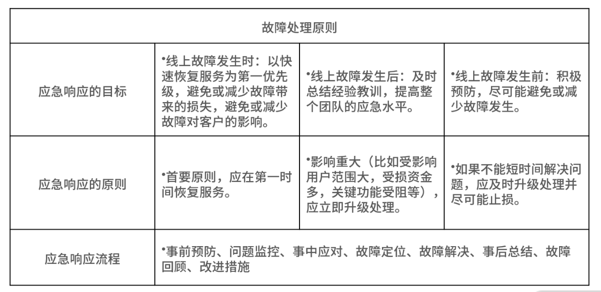

### 如何从架构师角度回答系统容错、降级等高可用问题？

#### 案例背景

先来看这样一道面试题：

某电商平台中有商品系统、促销系统、积分系统。商品的一次查询操作是由网关系统先调用商品系统查询商品列表，然后根据返回的商品列表信息，再查询促销和积分系统，匹配商品信息的促销活动和积分奖励，最终返回给客户端展示给用户。

大部分互联网公司，会有专门的研发团队分别负责这三个系统（比如 A 团队负责商品系统、 B 团队负责促销系统）。这会带来一个问题：出现流量高峰期时，虽然作为服务请求入口的商品系统很容易扩容，但对于商品系统依赖的其他服务，就不会有实时性的响应。

那么促销或积分系统就可能因为无法承担大流量，请求处理缓慢，从而让执行商品查询操作的服务线程阻塞，不能释放，直到所有线程资源被占满，无法处理后续的请求。

对于这种问题，你该如何处理呢？

#### 案例分析

这道面试题就涉及了高可用架构的设计，我们再来分析一下商品的调用链条。在电商平台的商品系统中，一次系统查询的流程经历了三次调用，从网关系统开始，然后依次调用商品系统、促销系统、积分系统的三个服务，如果此时积分系统的响应时间变长，那么整条请求的响应时间也会因此变长，整体服务甚至会发生宕机。这就是服务雪崩现象：即局部故障最终导致了全局故障。

在分布式环境下，系统某一个服务或者组件响应缓慢，从而拖垮整个系统的情况随处可见。那你要怎么避免呢？对于系统可用性，你要通过三个方面来解决：分别是“评估”“检测”和“保证”，具体如下：

1. 用科学的方法评估系统的可用性指标；
2. 通过实时监控预警检测系统的可用性；
3. 通过系统架构设计保证系统的可用性。

解决的思路是：在分布式系统中，当检测到某一个系统或服务响应时长出现异常时，要想办法停止调用该服务，让服务的调用快速返回失败，从而释放此次请求持有的资源。这就是架构设计中经常提到的降级和熔断机制。

对应到面试中，面试官一般会通过如下两个问题考察候选者：

- 熔断和降级是怎么做的（考察你对原理性知识的掌握）？
- 你在项目中如何实现熔断降级（考察你的实战能力）？

你先要了解熔断和降级的原理，再结合实践设计实现它们。

#### 案例解答

##### 熔断设计的原理

而在微服务架构中，服务的熔断机制是指：在服务 A 调用服务 B 时，如果 B 返回错误或超时的次数超过一定阈值，服务 A 的后续请求将不再调用服务 B。这种设计方式就是断路器模式。

在这种模式下，服务调用方为每一个调用的服务维护一个有限状态机，在这个状态机中存在关闭、半打开和打开三种状态。

- 关闭：正常调用远程服务。
- 半打开：尝试调用远程服务。
- 打开：直接返回错误，不调用远程服务。

这三种状态之间切换的过程如下：

- “关闭”转换“打开”：当服务调用失败的次数累积到一定的阈值时，服务熔断状态，将从关闭态切换到打开态。
- “打开”转换“半打开”：当熔断处于打开状态时，我们会启动一个超时计时器，当计时器超时后，状态切换到半打开态。
- “半打开”转换“关闭”：在熔断处于半打开状态时，请求可以达到后端服务，如果累计一定的成功次数后，状态切换到关闭态。

在工作中，研发工程师经常会通过 Netflix 的开源项目 Hystrix 来实现熔断的功能，并不会探究其中的原理，但是很多时候，面试官也会考察你在不通过开源组件的前提下，怎么实现断路器的功能。

##### 如何设计实现一个断路器

- “关闭”转“打开”： 当请求到来，首先判断是否在熔断中，如果没有熔断，则正常调用系统服务，此时统计系统的调用状态，如果失败次数超过阈值，则断路器“打开”。
- “打开”转“半打开”： 如果已经熔断，就初始化一个定时器，定期检测服务状态的可用性，如果服务达到了熔断的倒计时，则设置当前熔断器为“半打开”状态。
- “半打开”转“关闭”： 如果服务状态是半打开，则判断成功次数是否超过阈值，超过则设置断路器的状态为“关闭”。

这样，当某一个服务节点出现问题，服务调用者的熔断器就会实时监测到，并且不再请求有问题的服务节点，避免单个节点的故障导致整体系统的雪崩。

##### 降级设计的原理

降级设计本质上是站在系统整体可用性的角度上考虑问题：当资源和访问量出现矛盾时，在有限的资源下，放弃部分非核心功能或者服务，保证整体的可用性。这是一种有损的系统容错方式。

这样看来，熔断也是降级的一种手段（除此之外还有限流、兜底服务等）。

降级的实现手段是：在请求流量突增的情况下，放弃一些非核心流程或非关键业务，释放系统资源，让核心业务正常运行。比如 618 零点大促，电商平台一般会暂时关闭评论、退款功能。

那么问题来了，当你被问到“怎么做降级设计？”时，要怎么回答呢？

##### 如何设计一个降级机制

从架构设计的角度出发，降级设计就是在做取舍，你要从服务降级和功能降级两方面来考虑。

在实现上，服务降级可以分为读操作降级和写操作降级。

- 读操作降级： 做数据兜底服务，比如将兜底数据提前存储在缓存中，当系统触发降级时，读操作直接降级到缓存，从缓存中读取兜底数据，如果此时缓存中也不存在查询数据，则返回默认值，不在请求数据库。
- 写操作降级： 同样的，将之前直接同步调用写数据库的操作，降级为先写缓存，然后再异步写入数据库。

我们提炼一下这两种情况的设计原则。

- 读操作降级的设计原则，就是取舍非核心服务。
- 写操作降级的设计原则，就是取舍系统一致性：实现方式是把强一致性转换成最终一致性。比如，两个系统服务通过 RPC 来交互，在触发降级时，将同步 RPC 服务调用降级到异步 MQ 消息队列中，然后再由消费服务异步处理。

而功能降级就是在做产品功能上的取舍，既然在做服务降级时，已经取舍掉了非核心服务，那么同样的产品功能层面也要相应的进行简化。在实现方式上，可以通过降级开关控制功能的可用或不可用。

另外，在设计降级时，离不开降级开关的配置，一般是通过参数化配置的方式存储在配置中心（如 Zookeeper），在高并发场景下，手动或自动开启开关，实现系统降级。

### 如何向面试官证明你做的系统是高性能的？

#### 案例背景

很多研发工程师和架构师，他们在介绍系统性能时，一般会说：“我们的架构最高支持 200 万的并发流量”。

如果不考虑实际业务需求，这样的回答没有任何意义，因为高性能与业务是强相关的：

- 如果一台网络游戏服务器，可以支撑 2 百名玩家同时在线开黑，可能就算高性能；
- 如果一台网络直播服务器，可以支撑 2 千名用户同时在线观看，可能就算高性能；
- 如果一台电商平台服务器，可以支撑 2 万名用户同时在线下单，可能就算高性能；

这些数据也许有出入，但逻辑没问题，并且在实际的业务场景中，你要关注很多业务相关性指标，比如游戏需要关注稳定性；视频需要关注延时；电商需要关注一致性……

在明确了业务场景之后，你还要关注系统的性能指标主要有吞吐量、延迟以及 TP。

#### 案例分析

我们在拿到产品经理的 PRD 文档时，心里就会清楚要关心哪些系统性能指标，因为需求文档中会描述同时支持多少人在线访问，你也可以借此估算出系统的并发用户数。一般来讲，系统建立的会话数量就是用户同时访问系统的数量。你也可以通过公式，估算出系统的吞吐量（throughput）和延迟（latency）：`并发度 = 吞吐量 * 延迟`。

延迟和吞吐量，是衡量软件系统最常见的两个指标。

- 吞吐量（系统处理请求的速率）：反映单位时间内处理请求的能力（单位一般是TPS或QPS）。
- 延迟（响应时间）：从客户端发送请求到接收响应的时间（单位一般是ms、s）。

一般来说，延迟和吞吐量既互斥，又不绝对的互斥，你可以通过性能压测分别绘制吞吐量和延迟的曲线图：

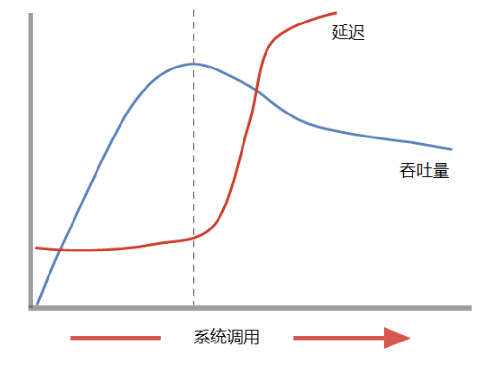

延迟总是非递减的曲线，开始时表现比较平稳，到了某一个特定值后，会迅速增大。而吞吐量曲线在开始时迅速增加，到达峰值后逐渐减小。

总体来看，随着压力增大，单位时间内系统被访问的次数增加。结合延迟和吞吐量观察的话，吞吐量曲线的最高点，往往是延迟曲线最低偏后的一个时间点，这意味着延迟已经开始增大一段时间了。那么对一些延迟要求比较高的系统来说，系统优化性能指标是要找到延迟趋向最低和吞吐量趋向最高的点。

从图中你也可以看出，如果不做流量控制，在系统压力不断增大后，系统便什么也做不成。这也是一些不够健壮的系统，在压力较大的特殊业务场景下（比如一元秒杀、抢购、瞬时流量非常大的系统），直接崩溃，对所有用户拒绝服务的原因。

除了吞吐量和延迟，TP（Top Percentile）也经常被提到。 以 TP 99 为例，它是指请求中 99% 的请求能达到的性能，TP 是一个时间值，比如 TP 99 = 10ms，含义就是 99%的请求，在 10ms 之内可以得到响应。

关于 TP 指标，你要掌握两个考点。

- 计算 TP 指标： 比如 TP 99，把一段时间内所有请求的响应时间，从小到大进行排序，然后取 99% 对应的请求的响应时间，即为 TP99 的值。
- TP指标相比于性能均值的意义： 为什么要用 TP 99 这样的比例方式，而不直接用平均数来定义性能呢？这是为了更符合实际系统的情况。

对初中级研发工程师来说，回答“吞吐率、延迟、TP 99（TP 99 比较有代表性）”这三个指标就够了，但如果你应聘高级研发工程师，还要站在系统全链路的角度上思考问题，从端到端的角度思考系统的性能指标（也就是从架构师的视角分析系统）。

#### 案例解答

##### 用架构师的视角分析系统性能指标

架构师视角说白了就是系统的全链路视角，我们从前端请求流程开始，来讲解一次请求链路会涉及哪些前后端性能指标。

步骤一：DNS解析

用户在浏览器输入 URL 按回车，请求会进行 DNS 查找，浏览器通过 DNS 解析查到域名映射的IP 地址，查找成功后，浏览器会和该 IP 地址建立连接。对应的性能指标为：DNS解析时间。

那你怎么提升域名DNS解析性能呢？

答案是通过 DNS缓存或 DNS 预解析，适当增大域名的TTL 值来增大 DNS 服务器缓存域名的时间，进而提升了缓存的命中率。也可以用 dns-prefetch 标签实现域名的预解析，让浏览器在后台把要用的 DNS请求提前解析，当用户访问的网页中包含了预解析的域名时，再次解析 DNS 就不会有延迟了，比如京东针对静态资源域名的预解析如下：

```
<link rel="dns-prefetch" href="//static.360buyimg.com">
```

步骤二：建立TCP连接

由于 HTTP 是应用层协议，TCP 是传输层协议，所以 HTTP 是基于 TCP 协议基础上进行数据传输的。所以你要建立 TCP 请求连接，这里你也可以用 TCP的连接时间来衡量浏览器与 Web 服务器建立的请求连接时间。

步骤三：服务器响应

这部分就是我们开篇讲到的最重要的性能指标了，即服务器端的延迟和吞吐能力。针对影响服务端性能的指标，还可以细分为基础设施性能指标、数据库性能指标，以及系统应用性能指标。

- 基础设施性能指标主要针对 CPU 利用率、磁盘 I/O，网络带宽、内存利用率等。

举个例子，如果 CPU 占用率超过80%，很可能是系统出了问题。如果内存利用率 100%，可能是因为内存中存放了缓存，因此还要衡量 SWAP 交换空间的利用率。另外，还要考虑容器的 JVM 的Full GC 情况、磁盘 I/O 是否可以优化、网络带宽是否存在瓶颈等问题都会影响系统的最终性能。

- 数据库的性能指标主要有 SQL 查询时间、并发数、连接数、缓存命中率等。
- 系统应用性能指标和系统业务有关，因为业务场景影响架构设计，比如To C 的系统一般会设计成同步 RPC 调用，因为要实时反馈 C 端用户的请求，而 To B 的系统则可以设计成事件驱动模式，通过异步通知的方式，推送或拉取数据，两种架构对比，显然异步事件驱动的吞吐量会更高。

步骤四：白屏时间

当浏览器与 Web 服务器建立连接后，就可以进行数据通信了。Web 服务器接收请求后，开始处理请求，浏览器这时会等待 Web 服务器的处理响应。

由于浏览器自上而下显示 HTML，同时渲染顺序也是自上而下的，所以当用户在浏览器地址栏输入 URL 按回车，到他看到网页的第一个视觉标志为止，这段白屏时间可以作为一个性能的衡量指标（白屏时间越长，用户体验越差）。

优化手段为减少首次文件的加载体积，比如用 gzip 算法压缩资源文件，调整用户界面的浏览行为（现在主流的Feed流也是一种减少白屏时间的方案）。

步骤五：首屏时间

用户端浏览界面的渲染，首屏时间也是一个重要的衡量指标，首屏时间是指：用户在浏览器地址输入 URL 按回车，然后看到当前窗口的区域显示完整页面的时间。一般情况下，一个页面总的白屏时间在 2 秒以内，用户会认为系统响应快，2 ~ 5 秒，用户会觉得响应慢，超过 5 秒很可能造成用户流失。

##### 如何分析系统的性能瓶颈？

通常情况下，系统性能不达标一般会反映在TP 99 的延迟上面，但这只是表层的现象，怎么找到系统真正的性能瓶颈呢？ 你可以遵循这几个步骤。

- 设计阶段，定义系统性能目标

你要在项目初期定义好系统大致的性能目标，比如希望单台服务器能够负载多少 TPS 的请求，因为不同的性能会影响到系统的架构设计，也会带来不同的成本，一旦过了设计阶段，再因为性能问题调整系统架构，成本极高。比如，当前单机性能是 80 TPS，要想优化到100 TPS，可以做一些小的性能优化，但要提升到 1000 TPS，就要进行架构改造了，代价非常大。

- 开发阶段，走查代码和业务流程

也就是评审代码，代码包括应用程序源代码、环境参数配置、程序整个调用流程和处理逻辑。比如，用户在 App 中触发了“立即下单”按钮，服务端的应用程序从线程池里取得了线程来处理请求，然后查询了几次缓存和数据库，都读取和写入了什么数据，再把最终的响应返回给 App，响应的数据报文格式是什么，有哪些状态码和异常值……

- 测试阶段，压测发现系统性能峰值

一般来说，你要在系统上线前，对系统进行全方位的压力测试，绘制出系统吞吐量和延迟曲线，然后找到最佳性能点，并在超过最佳性能点时做限流，如果达不到最佳性能点（比如多数系统的吞吐量，随着压力增大，吞吐量上不去）就需要考虑出现延迟和吞吐量的这几种情况。

1. 定位延迟问题

你要本着端到端的策略，大到整体流程，小到系统模块调用，逐一排查时间消耗在哪里。

你可以使用 kill -3 PID， jstack 等命令打印系统当前的线程执行的堆栈；还可以用一些性能分析工具，如 JProfiler 来监控系统的内存使用情况、垃圾回收、线程运行状况，比如你发现了运行的 100 个线程里面，有 80 个卡在某一个锁的释放上面，这时极有可能这把锁造成的延迟问题。

2. 对于吞吐量问题的定位

对于吞吐量指标要和 CPU使用率一起来看，在请求速率逐步增大时，经常会出现四种情况：

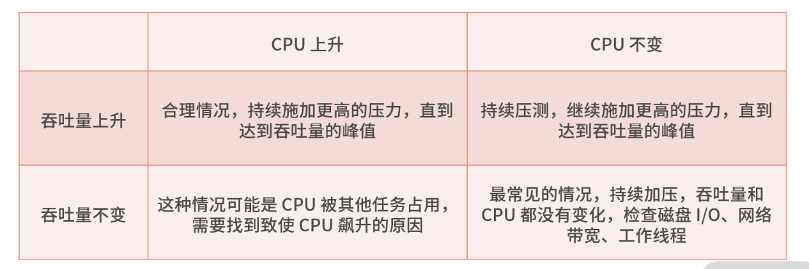

### 如何从架构师角度回答怎么应对千万级流量的问题？

#### 高性能设计中的“术”

##### 前端优化

前端的优化主要有三个环节：减少请求次数、页面静态化、边缘计算。

减少请求次数：减少前端脚本与后端服务的请求次数，有三种方案。

- 增加缓存控制：前端研发同学经常会设置 HTML 的缓存控制头部（Cache-Control 头），这样浏览器在请求同一个文件时，只访问本地保存的资源副本，从而加速文件的访问速度。
- 减少图像的请求次数：你可能经常会发现，大部分网站会将所有用到的多张图片拼成一张，这样多张图片只需要下载一次，然后再通过 CSS 中的 background-image 和 background-position 来定位目标位置选择显示哪一张图片。
- 减少脚本的请求次数：通用的做法就是 CSS 压缩和 JavaScript 压缩，将多个文件压缩成一个，目的是减少传输文件的大小，而更重要的是减少请求数。

而页面静态化就是缓存的一种方式，相当于把整个页面元素缓存起来，那么缓存在哪里呢？

通常是将页面文件事先存储在 CDN 节点中，比如将商品详情页做静态化，就是将商品详情页的页面元素存储在 CDN 节点，然后所有请求就可以直接以由 CDN 来提供服务，就不会到达后端服务了，就减少了对后端服务的压力。

边缘计算，被很多人提及，原因是大数据处理的实时性越来越高，由集中式的服务系统提供实时性的计算能力捉襟见肘，所以很多大厂开始将计算能力放到距离用户最近的 CDN 节点中，这就要求原有的 CDN 节点不只作为静态资源文件的缓存，而是要提供可以定制化的计算能力。

这部分内容会涉及一些新的概念，比如无服务架构 Serverless、BaaS、FaaS，在面试中不要求候选人必须掌握，但它会是你的加分项。

##### 后端优化

后端环节的性能问题，可以从基础设施层面、网络层面、架构层面三个角度进行考量，为了帮助你记忆，我总结了一张脑图给你参考。

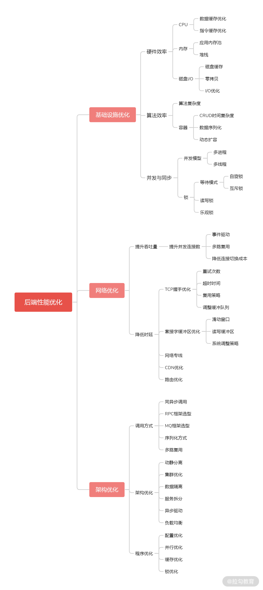

比如，网络层面可以考虑网络专线、CDN 优化；架构层面可以考虑动静分离、集群优化、数据隔离、服务拆分、异步驱动、负载均衡等方案。

以上就是高性能架构设计中的技术点，初中级研发工程师要能知道系统的性能瓶颈在哪儿，以及如何优化，但高级研发工程师，不能只停留掌握技术点上，而是要有自己对技术的理解（例如下面的例子）。接下来，我就通过讲解自己对高性能的认知，帮你了解并培养自己对于技术的思考。

#### 高性能设计中的“道”

你在设计高性能系统架构时，首先是清楚认知系统的硬性性能指标，举个例子。

- 指标需求：我们要保证系统的 TP 99 为 2s；
- 表面意思：系统要保证 99% 的请求的响应时间都在 2s 内；
- 深层意思：对有经验的架构师来说，这样的需求其实是不明确的，任何系统都有自己的承载能力范围，换句话说就是在并发用户数限定范围之内，一定要保证系统的 TP 99 = 2s，例如“我们要保证系统并发数在 100 万用户内的时候，TP 99 为 2s”，对于系统设计者而言，要清楚系统有所能，有所不能。

所以，对一个架构师来说，要设计一个高性能的架构，至少要有以下四个系统设计的思考步骤。

- 明确指标： 比如当系统小于 100 万并发用户时，要保证系统的 TP 99 = 2s 。
- 保护系统： 当系统的并发用户数量超过 100 万，要做到保证有 100 万用户的 TP 99 = 2s ，然后保护系统，并拒绝其他用户的连接请求。
- 用户体验： 为了用户体验，要给系统承载容量外的用户提供优雅的体验，比如服务器排队机制，并附加具体、明确的信息提示。
- 快速扩容： 这一步很容易被一些同学忽略，如今系统的性能指标还有一点就是贵在快速反应，比如能承诺出现流量压力时，可以在 3 分钟内完成扩容，并保证扩容后能承载的并发用户数量的 TP 99 = 2s。

在明确了性能指标之后，高性能架构的落地工作，可以分为以下三个关键技术点。

- 做好系统限流： 通过流量控制来保证系统的稳定性。当实际并发压力超过系统性能设计指标的时候，就拒绝新的请求的连接，让用户进行排队。
- 做好快速扩容： 对于扩容能力，一般要储备额外的计算资源，用于不时之需，也就是事先通过预估流出一部分资源池。

有的同学可能会疑惑，既然有多余的资源为什么不提前扩容呢？这是出于对 IT 成本的考虑，作为系统设计者也要把成本作为系统的设计原则之一。

另一个关键因素是系统的扩容速度。这是在当今互联网软件中非常重要的系统能力之一了，就算架构设计的不够优雅，但如果响应够快，也是能解决问题。

- 做好系统优化： 就是上面讲的前后端优化的技术点，再补充一点，对系统设计者来说，性能设计要贯穿于系统建设的始终。以一个系统的研发管理过程为例，内容大致包括需求阶段、设计阶段、研发阶段、测试阶段、上线阶段、运行阶段。

对于性能设计（不仅仅是性能设计，所有非功能性的设计）要在项目的各阶段都进行考虑，以便根据项目过程的推进随时进行调整和优化。


