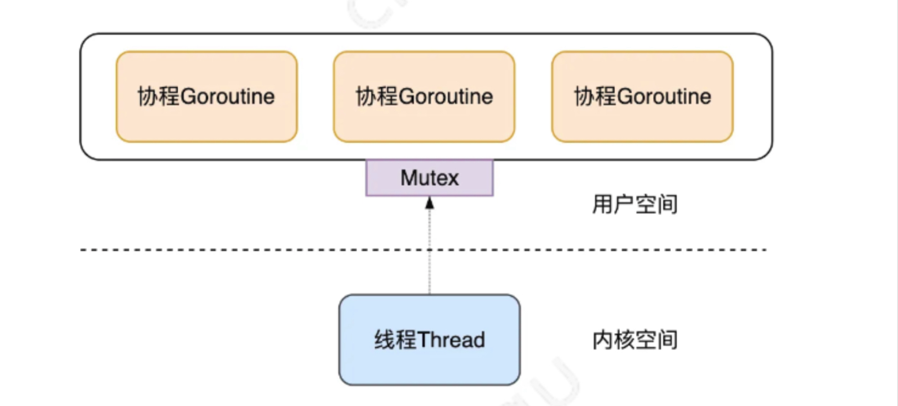
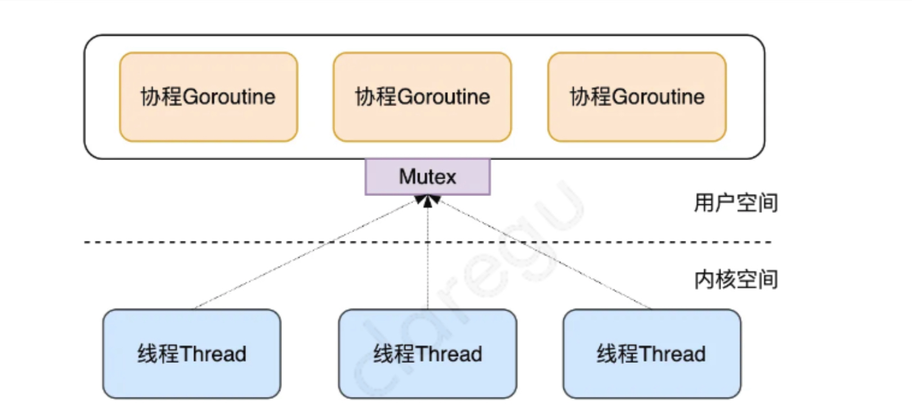
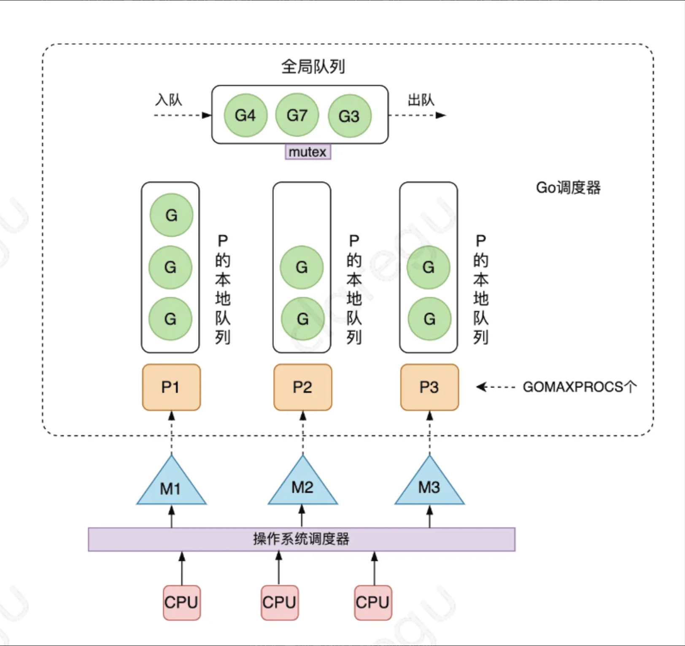
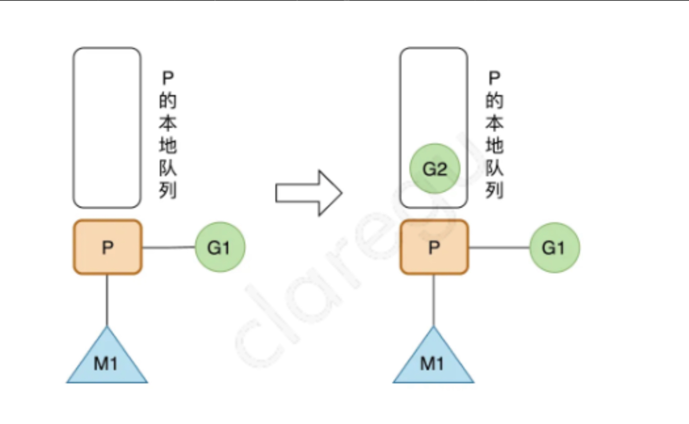

# GMP

## GMP 重点

整篇内容的重点如下：

1. 为了解决 Go 早期多线程 M 对应多协程 G 调度器的全局锁、中心化状态带来的锁竞争导致的性能下降等问题，Go 开发者引入了处理器 P 结构，形成了当前经典的 GMP 调度模型；
2. Go 调度器是指：运行时在用户态提供的多个函数组成的一种机制，目的是高效地调度 G 到 M 上去执行；
3. Go 调度器的核心思想是：尽可能复用线程 M，避免频繁的线程创建和销毁；利用多核并行能力，限制同时运行（不包含阻塞）的 M 线程数等于 CPU 的核心数目；Work Stealing 任务窃取机制，P 可以从其他的 M 绑定的 P 的运行队列偷取 G 执行；Hand Off 交接机制，为了提高效率，M 阻塞时，会将 M 上 P 的运行队列交给其他 M 执行；基于协作的抢占机制，为了保证公平性和防止 Goroutine 饥饿问题，Go 程序会保证每个 G 运行 10ms 就让出 M，交给其他 G 去执行，这个 G 运行 10ms 就让出 M 的机制，是由单独的系统监控线程通过 retake() 函数给当前的 G 发送抢占信号实现的，如果所在的 P 没有陷入系统调用且没有满，让出的 G 优先进入本地 P 队列，否则进入全局队列；基于信号的真抢占机制，Go 1.14 引入了基于信号的抢占式调度机制，解决了 GC 垃圾回收和栈扫描时无法被抢占的问题；
4. 由于数据局部性，新创建的 G 优先放入本地队列，在本地队列满了时，会将本地队列的一半 G 和新创建的 G 打乱顺序，一起放入全局队列；本地队列如果一直没有满，也不用担心，全局队列的 G 永远会有 1/61 的机会被获取到，调度循环中，优先从本地队列获取 G 执行，不过每隔 61 次，就会直接从全局队列获取。
5. M 优先执行其所绑定的 P 的本地运行队列中的 G，如果本地队列没有 G，则会从全局队列获取，为了提高效率和负载均衡，会从全局队列获取多个 G，而不是只取一个，个数是自己应该从全局队列中承担的，globrunqsize / nprocs + 1；同样，当全局队列没有时，会从其他 M 的 P 上偷取 G 来运行，偷取的个数通常是其他 P 运行队列的一半；
6. G 在运行时中的状态可以简化成三种：等待中`_Gwaiting`、可运行`_Grunnable`、运行中`_Grunning`，运行期间大部分情况是在这三种状态间来回切换；
7. M 的状态可以简化为只有两种：自旋和非自旋。自旋状态，表示 M 绑定了 P 又没有获取 G；非自旋状态，表示正在执行 Go 代码中，或正在进入系统调用，或空闲；
8. P 结构体中最重要的，是持有一个可运行 G 的长度为 256 的本地环形队列，可以通过 CAS 的方式无锁访问，跟需要加锁访问的全局队列 schedt.runq 相对应；
9. 调度器的启动逻辑是：初始化 g0 和 m0，并将二者互相绑定，m0 是程序启动后的初始线程，g0 是 m0 线程的系统栈代表的 G 结构体，负责普通 G 在 M 上的调度切换 --> runtime.schedinit()：负责 M、P 的初始化过程，分别调用 runtime.mcommoninit() 初始化 M 的全局队列 allm、调用 runtime.procresize() 初始化全局 P 队列 allp --> runtime.newproc()：负责获取空闲的 G 或创建新的 G --> runtime.mstart() 启动调度循环；
10. 调度器的循环逻辑是：运行函数 schedule() --> 通过 runtime.globrunqget() 从全局队列、通过 runtime.runqget() 从 P 本地队列、runtime.findrunnable 从各个地方，获取一个可执行的 G --> 调用 runtime.execute() 执行G --> 调用 runtime.gogo() 在汇编代码层面上真正执行 G --> 调用 runtime.goexit0() 执行 G 的清理工具，重新将 G 加入 P 的空闲队列 --> 调用 runtime.schedule() 进入下一次调度循环。

## GMP 调度模型的设计思想

### 传统多线程的问题

在现代的操作系统中，为了提高并发处理任务的能力，一个 CPU 核上通常会运行多个线程，多个线程的创建、切换使用、销毁开销通常较大：

1. 一个内核线程的大小通常达到 1 M，因为需要分配内存来存放用户栈和内存栈的数据；
2. 在一个线程执行系统调用（发生 IO 事件如网络请求或读写文件）不占用 CPU 时，需要及时让出 CPU，交给其他线程执行，这时会发生线程之间的切换；
3. 线程在 CPU 上进行切换时，需要保持当前线程的上下文，将待执行的线程的上下文恢复到寄存器中，还需要向操作系统内核申请资源；

在高并发的情况下，大量的线程的创建、使用、切换、销毁会占用大量的内存，并浪费较多的 CPU 时间在非工作任务的执行上，导致程序并发处理事务的能力降低。

### Go 语言早期引入的 GM 模型

为了解决传统内核级的线程的创建、切换、销毁开销较大的问题，Go 语言将线程分为了两种类型：内核级线程 M（Machine），轻量级的用户态的协程 Goroutine，至此，Go 语言调度器的三个核心概念出现了两个：

- M：Machine 的缩写，代表了内核线程 OS Thread，CPU 调度的基本单元；
- G：Goroutine 的缩写，用户态、轻量级的协程，一个 G 代表了对一段需要被执行的 Go 语言程序的封装，每个 Goroutine 都有自己独立的栈存放自己程序的运行状态，分配的栈大小为 2KB，可以按需扩缩容。

在早期，Go 将传统线程拆分了 M 和 G 之后，为了充分利用轻量级的 G 的低内存占用、低切换开销的优点，会在当前一个 M 上绑定多个 G，某个正在运行中的 G 执行完成后，Go 调度器会将该 G 切换走，将其他可以运行的 G 放入 M 上执行，这时一个 Go 程序中只有一个 M 线程：

这个方案的优点是用户态的 G 可以快速切换，不会陷入内核态，缺点是每个 Go 程序都用不了硬件的多核加速能力，并且 G 阻塞会导致跟 G 绑定的 M 阻塞，其他 G 也用不了 M 去执行自己的程序了。为了解决这些不足，Go 后来快速上线了多线程调度器：

每个 Go 程序，都有多个 M 线程对应多个 G 协程，该方案有以下缺点：

1. 全局锁、中心化状态带来的锁竞争导致的性能下降；
2. M 会频繁交接 G，导致额外开销、性能下降，每个 M 都得能执行任意的 runnable 状态的 G；
3. 每个 M 都需要处理内存缓存，导致大量的内存占用并影响数据局部性；
4. 系统调用频繁阻塞和解除阻塞正在运行的线程，增加了额外开销。

### 当前高效的 GMP 模型

为了解决多线程调度器的问题，Go 开发者 Dmitry Vyokov 在已有 G、M 的基础上，引入了 P 处理器，由此产生了当前 Go 中经典的 GMP 调度模型。

- P：Processor 的缩写，代表一个虚拟的处理器，它维护一个局部的可运行的 G 队列，可以通过 CAS 的方式无锁访问，工作线程 M 优先使用自己的局部运行队列中的 G，只有必要时才会去访问全局运行队列，这大大减少了锁冲突，提高了大量 G 的并发性。每个 G 要想真正运行起来，首先需要被分配一个 P。

如下图，是当前 Go 采用的 GMP 调度模型。可运行的 G 是通过处理器 P 和线程 M 绑定起来的，M 的执行是由操作系统调度器将 M 分配到 CPU 上实现的，Go 运行时调度器负责调度 G 到 M 上执行，主要在用户态运行，跟操作系统调度器在内核态运行相对应。

需要说明的是，Go 调度器也叫 Go 运行时调度器，或 Goroutine 调度器，指的是由运行时在用户态提供多个函数组成的一种机制，目的是为了高效地调度 G 到 M 上去执行。可以跟操作系统的调度器 OS Scheduler 对比来看，后者负责将 M 调度到 CPU 上运行。从操作系统层面来看，运行在用户态的 Go 程序只是一个请求和运行多个线程 M 的普通进程，操作系统不会直接跟上层的 G 打交道。

至于为什么不直接将本地队列放在 M 上，而是要放在 P 上呢？这是因为当一个线程 M 阻塞（可能执行系统调用或 IO 请求）的时候，可以将和它绑定的 P 上的 G 转移到其他线程 M 去执行，如果直接把可运行 G 组成的本地队列绑定到 M，则万一当前 M 阻塞，它拥有的 G 就不能给到其他 M 去执行。

> 注意，上面说的阻塞 M 的 IO 不包含网络 IO，Go 对网络 IO 有一个专门的网络轮询器进行处理，G 碰到网络 IO 时，调度器会将 G 交给网络轮询器去处理，然后调度下一个可执行的 G，也就是网络 IO 不会导致线程切换，所以 Go 对于网络 IO 是有特殊优化的，特别适用于网络 IO 密集的场景。

基于 GMP 模型的 Go 调度器的核心思想是：

1. 尽可能复用线程 M：避免频繁的线程创建和销毁；
2. 利用多核并行能力：限制同时运行（不包含阻塞）的 M 线程数为 N，N 等于 CPU 的核心数目，这里通过设置 P 处理器的个数为 GOMAXPROCS 来保证，GOMAXPROCS 一般为 CPU 核数，因为 M 和 P 是一一绑定的，没有找到 P 的 M 会放入空闲 M 列表，没有找到 M 的 P 也会放入空闲 P 列表；
3. Work Stealing 任务窃取机制：M 优先执行其所绑定的 P 的本地队列的 G，如果本地队列为空，可以从全局队列获取 G 运行，也可以从其他 M 偷取 G 来运行。为了提高并发执行的效率，M 可以从其他 M 绑定的 P 的运行队列偷取 G 执行，这种 GMP 调度模型也叫任务窃取调度模型，这里的任务就是指 G；
4. Hand Off 交接机制：M 阻塞，会将 M 上 P 的运行队列交给其他 M 执行，交接效率要高，才能提高 Go 程序整体的并发度；
5. 基于协作的抢占机制：每个真正运行的 G，如果不被打断，将会一直运行下去，为了保证公平，防止新创建的 G 一直获取不到 M 执行造成饥饿问题，Go 程序会保证每个 G 运行 10ms 就要让出 M，交给其他 G 去执行；
6. 基于信号的真抢占机制：尽管基于协作的抢占机制能够缓解长时间 GC 导致整个程序无法工作和大多数 Goroutine 饥饿问题，但是还是有部分情况下，Go 调度器有无法被抢占的情况，例如，for 循环或者垃圾回收长时间占用线程，为了解决这些问题，Go 1.14 引入了基于信号的抢占式调度机制，能够解决 GC 垃圾回收和栈扫描时存在的问题。

## 多图详解几种常见的调度场景

1. 创建 G：正在 M1 上运行的 P，有一个 G1，通过`go func()`创建 G2 后，由于局部性，G2 优先放入 P 的本地队列；

2. G 运行完成后：M1 上的 G1 运行完成后（调用`goexit()`）

