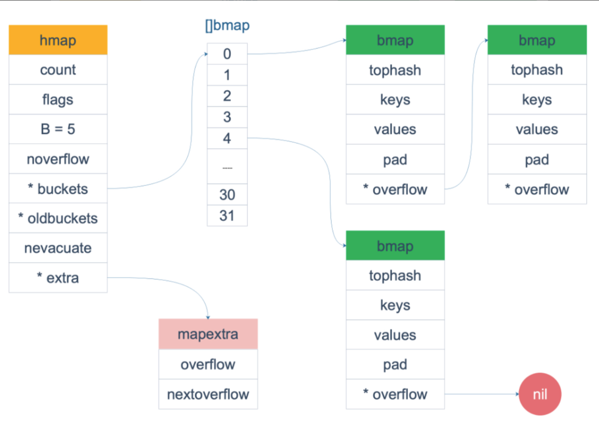

# 其他数据结构及关键字面试解析

## String

### string 的底层数据结构是怎么样的？

Go 语言中字符串的底层实现是一个结构类型，包含两个字段，一个指向字节数组的指针，另一个是字符串的字节长度。

### 字符串可以被修改吗？

字符串不可以被修改。

### []byte 转化为 string 互相转换会发生内存拷贝吗？

会发生内存拷贝，所以程序中应避免出现大量的长字符串的这种转换。

## Slice

### slice 的底层数据结构是怎么样的？

slice 的底层实现是一个结构类型，有三个字段：

1. 指向一个数组的指针 Pointer；
2. 切片的长度 len；
3. 切片的容量 cap。

### 从一个切片截取出另一个切片，修改新切片的值会影响原来的切片内容吗？

在截取完之后，如果新切片没有触发扩容，则修改切片元素会影响原切片，如果触发了扩容则不会。

### 切片的扩容策略是怎样的？

v1.17 及以前

1. 如果期望容量大于当前容量的两倍就会使用期望容量；
2. 如果当前切片的长度小于 1024 就会将容量翻倍；
3. 如果当前切片的长度小于 1024 就会每次增加 25% 的容量，直到新容量大于期望容量；

v1.18 之后


扩容公式如下：

```
newcap = oldcap + (oldcap + 3 * 256)/4
```

## Map

### map 的底层实现原理



map 的底层实现数据结构实际上是一个哈希表。在运行时表现为指向 hmap 结构的指针，hmap 中有记录了桶数组指针，溢出桶指针以及元素个数等字段。每个桶是一个 bmap 的数据结构，可以存储 8 个键值对和 8 个 tophash 以及指向下一个溢出桶的指针。为了内存紧凑，采用的是先存 8 个 key 然后再存 value。

### 为什么遍历 Map 是无序的？

map 在遍历的时候会随机一个桶号和槽位，从这个随机的桶号开始，在每个桶中从这个随机的槽位开始遍历完所有的桶。为什么要随机开始？因为 map 在扩容后，会发生 key 的搬迁，原来落在同一个 bucket 中的 key，搬迁后，有些 key 的位置就会发生改变。而遍历的过程，就是按顺序遍历 bucket，同时按顺序遍历 bucket 中的 key。搬迁后，key 的位置发生了重大变化，所以，go 语言强制每次遍历都随机开始。

### 如何实现有序遍历 map？

可以在遍历的时候将 key 保存到一个 slice 里面，对 slice 进行排序。

### 为什么 Go map 是非线程安全的？

Go 官方给出的原因是：map 适配的场景应该是简单的（不需要从多个 goroutine 中进行安全访问），而不是为了小部分情况（并发访问），导致大部分程序付出锁的代价，所以不支持。

### 线程安全的 Map 如何实现？

加锁或者使用 sync.map 

### Go sync.map 和原生 map 谁的性能好，为什么？

原生 map 的性能好，因为 Go sync.map 为了保证线程安全，以空间换时间，采用了 read 和 dirty 两个 map，用了原子操作和锁两种方式来实现线程安全，只是在操作 read 的时候用院子操作，当 read 中不存在某个 key 的时候就要加锁操作 dirty，过程中还是会有加锁操作，所以性能上有损耗。

### 为什么 Go map 的负载因子是 6.5？

负载因子 = 哈希表存储的元素个数 / 桶个数

装载因子越大，填入的元素越多，空间利用率就越高，但发生哈希冲突的几率就变大。

装在因子越小，填入的元素越少，冲突发生的几率减小，但空间浪费也会变得更多，而且还会提高扩容操作的次数。

源码里对负载因子的定义是 6.5，是经过测试后取出的一个比较合理的值，每个 bucket 有 8 个空位，假设 map 里所有的数组桶都装满元素，没有一个数组桶有溢出桶，那么这时的负载因子刚好是 8，而负载因子是 6.5 的时候，说明数组桶快要用完了，存在溢出的情况下，查找一个 key 很可能要去遍历溢出桶，会造成查找性能下降，所以有必要扩容了。

### map 扩容策略是什么？

当负载因子大于 6.5 发生双倍扩容

当溢出桶过多，发生等量扩容，溢出桶过多的标志：

1. 当正常桶数量小于 2^15 的时候，溢出桶多月正常桶，溢出桶数量就过多了。
2. 当正常桶数量大于 2^15 的时候，溢出桶一旦多于 2^15，溢出桶数量就过多了。


