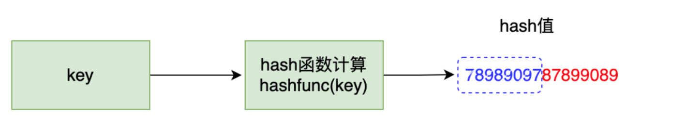

# Map & Sync.Map

## Map

### 哈希冲突

哈希表的原理是多个 k-v 键值对散列的存储在 buckets 中，buckets 可以理解为一个连续的数组，所以给定一个 key/value 键值对，需要存储到合适的位置需要经过两步骤：

1. 计算 hash 值：`hash = hashFunc(key)`
2. 计算索引位置：`index = hash % len(buckets)`

第一步是根据 hash 函数将 key 转化为一个 hash 值；
第二步是用 hash 值对桶的数量取模得到一个索引值，这样就得到了要插入的键值对的位置。

但是这里会出现一个问题，比如有两个键值对 key1/value1 和 key2/value2，经过哈希函数 hashFunc 的计算得到的哈希值 hash1 和 hash2 相同，那么索引值就会想通，所以会产生哈希冲突。

解决哈希冲突的方法一般有两种：拉链法和开放寻址法。

### 拉链法

拉链法是一种最常见的解决哈希冲突的方法，拉链法的主要实现是底层不直接使用连续数组来直接存储数组元素，而是使用通过数组和链表组合使用，数组里存储一个指针，指向链表，当两个 hash key 冲突后就会将数据连接到链表上。

拉链法处理冲突简单，可以动态申请内存，删除增加节点都很方便，当冲突严重，链表长度过长的时候也支持更多的优化策略，比如用红黑树代替链表。

### 开放地址法

开放地址法是将具体的数据元素存储在数组桶中，在要插入新元素时，先根据哈希函数算出 hash 值，根据 hash 值计算索引，如果发现冲突了，计算出的数组索引位置已经有数据了，就继续向后探测，直到找到未使用的数据槽位置，哈希函数可以简单的理解为：`hash(key) = (hash1(key)+i)%len(buckets)`，开放地址法结构如下图：


在存储键值对`<b,101>`的时候，经过 hash 计算，发现原本应该存放在数组下标为 2 的位置已经有值了，存放了`<a,100>`就继续向后探测，发现后面的未被使用，就放在这。

### go 语言 map 的底层结构

go 语言中的 map 其实就是一个只想`hmap`的指针，占用 8 个字节，`hmap`包含多个结构为`bmap`的`bucket`数组，`bucket`底层采用链表结构将这些`bmap`连接起来，处理冲突其实就是采用了优化的拉链法，链表中每个节点存储的不是一个键值对，而是 8 个键值对，其整体结构如下图：


`hmap`的结构体定义如下：

```go
type hmap struct {
		count 			int
		flags				uint8
		B						uint8
		noverflow		uint16
		hash0				uint32

		buckets			unsafe.Pointer
		oldbuckets	unsafe.Pointer
		extra				*mapextra
}
```

字段含义：

| 字段       | 含义                                                         |
| ---------- | ------------------------------------------------------------ |
| count      | map中的元素个数，对应 len(map) 的值                          |
| flags      | 状态标识位，标记 map 的一些状态                              |
| B          | 桶数以 2 为底的对数，即 B = log_2(len(buckets))，那么桶数为 2^3 = 8 |
| noverflow  | 溢出桶数量近似值                                             |
| hash0      | 哈希种子                                                     |
| buckets    | 指向 buckets 数组的指针，buckets 数组的元素为 bmap，如果数组元素个数为 0，其值为 nil |
| oldbuckets | 是一个指向 buckets 数组的指针，在扩容时，oldbuckets 指向老的 buckets 数组（大小为新 buckets 数组的一半），非扩容时，oldbuckets 为空。 |
| nevacuate  | 表示扩容进度的一个计数器，小于该值的桶已经完成迁移           |
| extra      | 指向 mapextra 结构的指针，mapextra 存储 map 中的溢出桶       |

mapextra 结构定义如下：

```go
type mapextra struct {
		overflow			*[]*bmap
		oldoverflow		*[]*bmap
		nextOverflow	*bmap
}
```

| 字段         | 含义                 |
| ------------ | -------------------- |
| overflow     | 溢出桶链表地址       |
| oldOverflow  | 老的溢出桶链表地址   |
| nextOverflow | 下一个空闲溢出桶地址 |

`hmap`中真正用于存储数据的是`buckets`指向的这个`bmap`（桶）数组，每一个`bmap`都能存储 8 个键值对，当 map 中的数据过多，`bmap`数组存不下的时候就会存储到 extra 指向的溢出 bucket（桶）里面。

`bmap`的结构定义：

```go
type bmap struct {
		topbits		[8]uint8
		keys			[8]keytype
		values		[8]valuetype
		overflow	uintptr
}
```

| 字段     | 含义                                                         |
| -------- | ------------------------------------------------------------ |
| topbits  | 存储了 bmap 里 8 个 key/value 键值对的每个 key 根据哈希函数计算出的 hash 值的高 8 位 |
| keys     | 存储了 bmap 里 8 个 key/value 键值对的 key                   |
| values   | 存储了 bmap 里 8 个 key/value 键值对的 value                 |
| overflow | 指向溢出桶的指针                                             |

`tophash`，go 语言的`map`会根据每一个 key 计算出一个 hash 值，对这个 hash 值的使用，go 语言并不是一次性使用的，而是分开使用的，在使用中，把求得的这个 hash 值按照用途一分为二：高位和低位。



假设对一个 key 做 hash 计算得到了一个 hash 如上图所示，蓝色部分就是这个 hash 值的高 8 位，红色是低 8 位，而每个 bmap 中存储的就是这个高 8 位。

通过上图 map 的底层结构图可以分析，bmap 存储了 8 个 `tophash`值，然后存储了 8 个键值对，这 8 个键值对是按照连续存 8 个 key，再连续存 8 个 value 这样，当键值对不够 8 个时，对应位置就留空。这样存储的好好处可以消除字节对齐带来的空间浪费。

### 扩容策略

- 负载因子超过 6.5：双倍扩容
- 溢出桶数量过多（一般认为接近正常桶的数量）：等量扩容

当插入了很多元素，不是完全理想的情况下，肯定会创建很多溢出桶，如果没有触发负载因子的临界值，不会触发扩容。删除很多元素，负载因子又会减小，插入很多元素，会继续创建很多的溢出桶，导致查找元素的时候要去遍历很多的溢出桶链表，性能下降。所以这种情况下需要扩容，新建一个桶数组，把原来的数据拷贝到里面，这样数据排列更紧密，性能更快。

## Sync.Map

