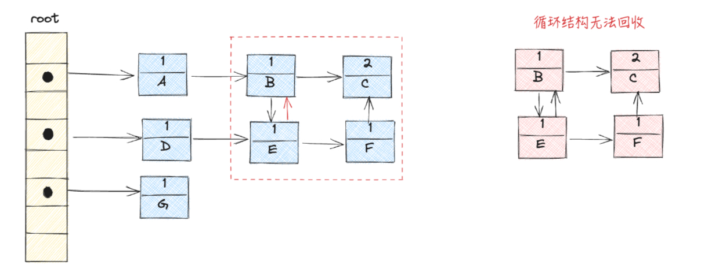
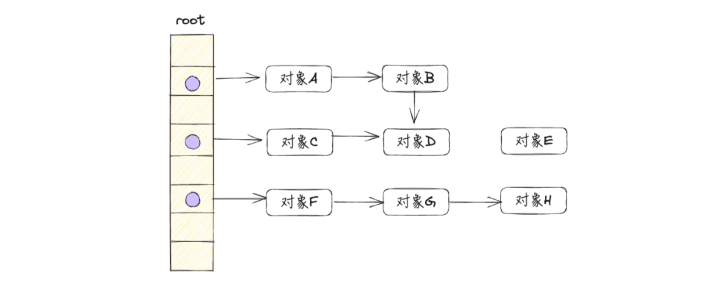
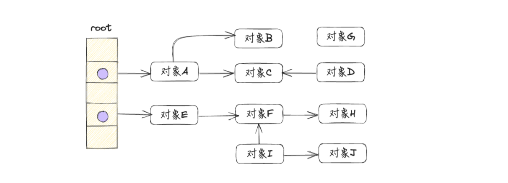
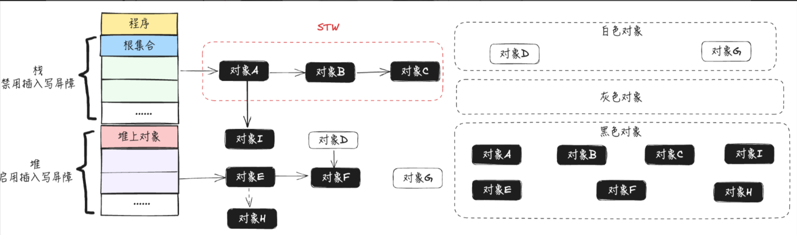

# 垃圾回收

## 常见的 GC 算法

### 引用计数法

引用计数法会为程序中的每个对象在对象头中分配一个空间来保存该对象被引用的次数，如果有其他对象引用了该对象，那么它的引用计数加 1。如果其他对象删除了对该对象的引用，则它的引用计数减 1，当该对象的引用计数为 0 时，此时没用任何引用，就可以被回收。

#### 优点

简单直接，回收速度快，不会出现内存耗尽或达到某个阈值时才回收。

#### 缺点

不能很好的处理循环引用，而且需要有额外的空间实时维护引用计数，也有一定的代价



比如上图，在删除了对象 A 和 D 之后，由于对象 B 和 E 之间存在循环引用，所以上下 B、C、E、F 四个对象都存在引用关系，计数都不为 0，所以不能被回收，如果大量存在这种循环对象，就会造成一定的内存泄漏。

### 标记清除法

标记清除算法主要分为两个阶段：

标记阶段：遍历所有活动对象，并标记那些还在使用的对象标签。

清除阶段：遍历内存中所有对象，清除那些没有被标记的对象。


#### 优点

简单易实现，不需要额外的数据接口，只需遍历一次对象图即可完成标记和清除操作，适合可回收对象不多的场景。

#### 缺点

主要是会造成内存碎片，导致后续需要创建大对象的时候，由于没有连续的足够大的内存空间而创建不了，降低了内存的使用率。

### 复制法

复制算法将内存分成两个相等的区域，并且一次只使用其中一个。当这个区域被用完时，程序会把所有还在使用的对象复制到另一个空区域（保留区域），然后将已使用的区域全部清除。这样，每次只需对一个区域进行垃圾回收，分配内存时也无需处理碎片问题，只需按顺序移动指针进行分配。


#### 优点

主要是避免了内存碎片问题，每次清除针对的都是整块内存。

#### 缺点

内存利用率低，使用的内存会缩小为原来的一半。如果存活的对象很多，将这些对象都复制一遍，并且更新它们的应用地址，这一过程耗时可能较长，回收效率不够高。

### 分代法

分代收集算法可以被视为上述内容的扩展。它的实现思路是根据对象生命周期的差异，将内存划分为多个区域，例如将堆空间划分为新生代和老年代，然后根据每个区域的特点选择最合适的收集算法。

在新生代中，由于存在大量对象很快被销毁、少量对象存活的特点，通常使用“复制算法”。这种算法只需付出少量存活对象的复制成本就可以完成垃圾对象的收集，效率非常高。而在老年代中，由于对象的存活率高，且没有额外空间进行分配担保，通常使用“标记-清理”或“标记-整理”算法来进行回收。

## Go 语言 GC 算法

### 为什么 go 语言 gc 不选择分代与标记整理

1. go 为什么没有选用标记整理或者复制？

标记整理算法或者复制算法主要是为了减少内存碎片，然而，Go 运行时使用的内存分配算法是基于 tcmalloc，虽然不能像复制算法那样消除掉内存碎片化的问题，但也极大地降低了碎片率，所以标记整理显得有时并不是那么明显，并且 Thread Cache 的分配机制使得 Go 在大多数分配场景下可以避免使用锁，从而在高并发情况下展现出强大的性能优势。

2. go 为什么没有选择分代？

go 语言的 struct 类型创建是可以分配到栈上的，而不是像 java 一样 new 出来的对象在堆上。go 会在编译期做静态逃逸分析，可以将生命周期很短的对象直接安排在栈上分配（比如函数内未发生的逃逸的 struct 类型变量），分代 GC 最大的优势就是可以区分长生命周期和短生命周期对象，从而快速回收生命周期短的对象，但是由于 go 语言在编译期会做逃逸分析，所以 go 语言中的短生命周期对象并没有那么多，使得分代 GC 在 go 语言中受益并不明显。此外，分代 GC 还需要额外的写屏障来维护老年代对新年代的引用关系，这也增加了 GC 的开销。

## Go 语言 GC 的主要发展过程

go 语言也不是一开始就是使用的并发三色标记法（GC 程序与用户代码并发执行）加上屏障技术来实现，其主要经历以下三个过程：

- V1.3 及之前：标记清除算法
- V1.5：三色并发标记法
- V1.8：混合写屏障机制

### 什么样的内存 GC 不能回收？

举个例子

```go
type Student struct {
	Name string
	Age  int
}

func main() {
	slice := make([]Student, 6)
	slice = slice[:3]
	fmt.Println(slice)
}
```

程序创建了一个 Student 类型的切片 slice，包含 6 个元素，当 slice 发生缩小，大小缩为原来的一半，只有 3 个元素的时候，底层数组的另外 3 个元素已经无法再访问了。但是堆上的内存是不会被 GC 的，因为根据标记清理方法从根节点开始标记的话，这块内存还是属于可达的，所以不会被 GC 掉。同样的情况还存在于 Map 中，当创建一个 Map 之后，delete 掉 Map 中的某个 key 之后，对应部分的内存也是不会被 GC 的。

### 标记清除算法

从前面标记算法可知，标记清除算法，包括标记和清除两个阶段：

标记阶段：从根对象开始，查找并标记堆中所有存活的对象。

清除阶段：遍历堆中所有对象，回收未被标记的对象。

假设程序开始阶段对象分布如下图所示，下面用图示的方法展示标记清除的过程：



1. 从根对象开始，逐一遍历每个对象及其子对象，并标记它们的可达状态，如下图所示：


- 可达对象：对象 A，对象 B，对象 C，对象 D，对象 F，对象 G，对象 H
- 不可达对象：对象 E

2. 遍历堆上的所有对象，回收没有被标记的不可达对象，如下图所示：


清除完成之后，剩下可达对象 A、B、C、D、F、G、H，不可达对象 E 被清除，内存释放。

注意：以上只是回收器（GC程序）的工作过程，还没有考虑赋值器（用户程序），其实回收器在进行标记和清扫的过程中是要暂停整个用户程序的，暂停整个用户程序也称作 STW。

> 如果不 STW，会出现什么情况？
> 假设现在标记阶段已经完成，对象 A、B、C、D、F、G、H 被打上标记，而对象 E 是未被标记的准备回收的对象，就在此时，清除之前对象 H 又指向了对象 E。


> 那么接下来回收器就会将对象 E 错误删除，其实对象 E 此时已经是可达对象了，是存在引用关系，再被使用的，是不能被 GC 的，所以完整的标记清除算法需要在进行 GC 前进行 STW，即暂停整个用户程序。这样的话，性能必然很低，很难有人可以接受这种性能损耗。

### 三色标记法

简单的标记清除算法会带来长时间的 STW，为了解决这个问题，Go 语言在 V1.5 版本，使用三色并发标记法来优化这个问题。三色标记法将程序中的对象分为三类：白色、灰色和黑色：

- 白色：未被垃圾收集器访问到的对象，也就是潜在的垃圾对象。在回收开始阶段，所有对象都标记为白色；在回收结束后，所有白色对象均不可达，其内存将被释放。
- 灰色：已被垃圾收集器访问到的对象，但是垃圾收集器需要继续扫描它们的子对象，因为其可能存在指向白色对象的外部指针。
- 黑色：已被垃圾收集器访问到的对象，且其引用都已被扫描到，黑色对象中任何一个指针都不可能直接指向白色对象。

标记过程如下：

1. 初始状态：所有对象都是白色的。
2. 扫描根对象：从根对象开始扫描，将所有可达对象标记为灰色，并放入待处理集合中。
3. 处理灰色对象：从待处理集合中取出灰色对象，将它们引用的对象标记为灰色，并将这些新标记的对象加入待处理集合中，同时将自身标记为黑色。
4. 重复扫描：重复第 3 步，直到待处理集合为空。此时，所有白色对象都是不可达的垃圾对象，可以进行回收。

假设应用程序中的对象关系如下图所示，下面用图示的方式展示三色标记的过程：



1. 应用程序开始运行时，所有对象默认标记为白色，如下图所示：


用 3 个集合来存储被标记为 3 种颜色的对象，程序开始运行时，所有对象都存放在白色标记集合中。

2. 从根节点开始遍历，把遍历到的对象标记为灰色，放到灰色标记集合中，如下图所示：


对象 A、对象 E，被标记为灰色。

3. 遍历灰色标记集合，将灰色对象本身标记为黑色，并将它们移动到黑色标记集合中；将黑色对象引用的白色对象标记为灰色，放到灰色标记集合中，如下图所示：


对象 A、对象 E，被标记为黑色；对象 B、对象 C、对象 F，被标记为灰色。

4. 重复第三步，直到灰色标记表为空，如下图所示：


5. 清除所有的白色对象，完成垃圾回收，如下图所示：


明白了三色标记的过程，还需要搞清楚垃圾回收最开始扫描的根集合究竟包含哪些对象，通常情况下根节点包含以下几个部分：

1. 全局变量：程序在编译器就能确定的那些存在于程序整个生命周期的变量；
2. 执行栈上的对象或指针：每个 goroutine 都包含自己的执行栈，这些执行栈上的对象包含栈上的变量及指向分配的堆内存区块的指针；
3. 寄存器中的变量：寄存器的值可能表示一个指针，参与计算的这些指针可能指向某些赋值器分配的堆内存区块。

### 没有 STW 的三色标记法

从上面的分析了解到，STW 会大大的降低用户程序的执行效率，甚至达到用户难以接受的地步。那么 go 经过优化后的并行三色标记法需要 STW 吗？先看一下假设不进行 STW 会不会有什么问题？

以下图的程序对象关系进行分析，假设当前已经完成第一轮扫描，此时灰色对象 F 通过 p 指针指向白色对象 H，如下图所示：


由于没有进行 STW，所有对象都可能发生读写操作。假设还没扫描到对象 F 时，已经标记为黑色的对象 E，创建 q 指针指向白色对象 H，如下图所示：


在新增 q 指针的同时，灰色对象 F 移除 p 指针，此时白色对象 H 只挂在已经完成扫描的黑色对象 E 下，如下图所示：


然后，按照三色标记的规则继续执行，最终会得到如下图所示的结果：


对象 H 其实是被对象 E 正确引用的，但却被垃圾回收器错误地回收了，这将会导致程序严重错误，是不允许的。

从上面的分析来看，在不进行 STW 时，如果同时满足下面两个条件将会破坏垃圾回收器的正确性：

- 一个白色对象被黑色对象引用（白色对象被挂在黑色对象下）
- 灰色对象与他之间的可达关系的白色对象遭到破坏（灰色对象同时丢失了该白色对象的引用）

## 屏障技术

### 强弱三色不变性

根据前面分析垃圾回收器会出现错误回收的两个条件，只要破坏这两个必要条件，就可以保证对象不会被错误回收。也就是两种三色不变形：强三色不变性和弱三色不变性。

- 强三色不变性：不存在黑色对象引用到白色对象的指针，即黑色对象不会指向白色对象，只会指向灰色对象或黑色对象

- 弱三色不变性：所有被黑色对象引用的白色对象都处于灰色对象的保护状态，黑色对象可以指向的白色对象，但是必须包含一条从灰色对象到这个白色对象的可达路径

只要满足了这两种三色不变性其一，就破坏了垃圾回收器的错误回收两个 条件同时存在，就可以保证正确性。go 语言引入内存写屏障技术来实现这两个三色不变性，涉及到 3 种屏障技术：

1. 插入写屏障
2. 删除写屏障
3. 混合写屏障

### 什么是内存屏障

内存屏障其实是一种赋值器技术，对应于在编译期生成的一段特殊代码，用于在程序运行时拦截内存写操作，相当于一个 hook 调用。其作用是通过 hook 内存的写操作时机，做一些标记工作，从而保证垃圾回收的正确性。举个例子：

```go
type Student struct {
	Name string
	Age  *int
}

func func1(s *Student) {
	s.Age = new(int)
}

func func2(s *Student) {
	var st = new(Student)
	st.Name = "google"
}

func main() {
	st1 := new(Student)
	st2 := new(Student)

	go func1(st1)
	go func2(st2)
}
```

对于上述代码，先看一下 他的内存逃逸情况，内存逃逸的原则如下：

1. **尽可能分配到栈上**：在确保程序正确性的前提下，如果可以，将对象分配到栈上。栈上的对象生命周期与 goroutine 紧密相关，当 goroutine 结束时，这些对象会自动释放，避免了垃圾回收的负担，从而提高性能。
2. **堆分配的必要性**：当对象需要在函数调用返回后继续存在，或者对象的大小和结构无法在编译期确定时，就必须将其分配到堆上。这些对象的生命周期由程序的业务逻辑决定，最终由垃圾回收器管理和回收。
3. **不确定性时选择堆分配**：如果无法明确判断对象是否可以分配到栈哈桑，为了保证程序的正确性和稳定性，通常会选择将其分配到堆上。堆上的对象在业务程序的创建时分配，最终由垃圾回收器负责回收。

执行以下命令，查看其内存逃逸情况：

```bash
go build -gcflags "-N -l -m" ./main.go
```

得到输出：

```bash
# command-line-arguments
./main.go:160:12: s does not escape
./main.go:161:13: new(int) escapes to heap
./main.go:164:12: s does not escape
./main.go:165:14: new(Student) does not escape
./main.go:170:12: new(Student) escapes to heap
./main.go:171:12: new(Student) escapes to heap
```

程序当中一共执行了 4 次 new 操作，但只有 3 次逃逸到了堆

```
s.Age = new(int) 逃逸到堆上，因为其生命周期需要超越该 goroutine
var st = new(Student) 分配到栈上，st 对象就只是在栈上使用
st1 := new(Student) 逃逸到堆上，因为其他的 goroutine 要使用该参数
st2 := new(Student) 逃逸到堆上，同上
```

### go 语言中的屏障技术

在 GC 领域中，常见的写屏障（write barrier）有两种：

1. 插入写屏障（Dijistra Insertion Barrier）
2. 删除写屏障（Yuasa Deletion Barrier）

#### 插入写屏障

插入写屏障的原理可以用如下伪代码表示：

```go
// ptr 赋值给 slot
func DijistraWritePointer(slot *unsafe.Pointer, ptr unsafe.Pointer) {
		shade(ptr)	// shade(ptr) 会将新的下游对象 ptr 标记为灰色。通过保守的假设 *slot 可能会变为黑色，并确保 ptr 不会在将赋值为 *slot 前变为白色，进而确保了强三色不变性。
		*slot = ptr // 将新的下游对象 ptr 赋值给当前下游对象 slot。
}
```

上述伪代码可以翻译如下：

```go
添加下游对象(当前下游对象 slot，新下游对象 ptr) {
		// step 1
		将新的下游对象 ptr 标记为灰色
		
		// step 2
		当前下游对象 slot = 新下游对象 ptr
}
```

插入写屏障一般有两种适用场景：

- A 添加新下游对象，比如 A 之前没有下游，新添加一个下游对象 B，B 被标记为灰色；
- A 变更下游对象，比如 A 将下游对象 C 更换为 B，B 被标记为灰色。

由于指针修改时，指向的新对象要被强制标灰，所以插入写屏障满足强三色不变性，不存在黑色对象引用白色对象的情况了，因为白色会强制变成灰色。

> 注意：虽然插入写屏障实现非常的简单，并且也能保证强三色不变性，但却没有在栈上使用，因为栈空间的特点是容量小，但要求响应速度快，在栈上的对象增加写屏障，会大幅度增加写入指针的额外开销，所以在栈空间的对象操作中不使用，仅仅是用在堆空间的对象操作中。

下面用图示的方式展示插入写屏障的过程，假设应用程序中的对象关系如下图所示：

1. 程序初始阶段，所有对象均标记为白色，将所有对象放入到白色集合


注意：对象 E 的箭头是由堆指过来，并不是表示是从堆上开始扫描，其实也是从栈上扫描的，只不过是栈上根节点直接引用的它，它位于堆上，这里方便就用堆上的箭头指向它。

2. 从根节点开始遍历，把遍历到的对象标记为灰色（只遍历一次），放到灰色标记集合中，如下图所示：


3. 遍历灰色集合，将可达对象从白色标记为灰色，放入灰色集合，并将自身标记为黑色放入黑色集合中


4. 由于是并发进行标记，此时对象 E 指向一个新的对象 H，对象 A 指向一个新的对象 I，对象 E 在堆区，触发插入写屏障，对象 A 在栈区，不触发


5. 插入写屏障的作用（黑色对象添加白色对象，将白色对象标记为灰色），对象 H 被标记为灰色，由于栈上没有开启写屏障，所以对象 I 仍然为白色


6. 循环执行上述流程，直到灰色集合没有节点


可以看到出现了黑色对象 A 指向白色对象 I 的情况，会出现回收错误，这是由于在栈上没有开启写屏障导致的，所以在全部三色标记扫描之后，要对栈重新进行三色标记扫描，但这次为了对象不丢失，要对本次扫描启动 STW，直到栈空间的三色标记结束

7. 在正式开始回收工作之前，此时开启 STW，开始重新扫描一次栈上对象


8. 对栈上的对象进行三色标记，直至没有灰色对象



9. 停止 STW，这次 STW 大约的时间在 10~100 ms 之间


10. 将剩余的白色节点全部清除


#### 删除写屏障


