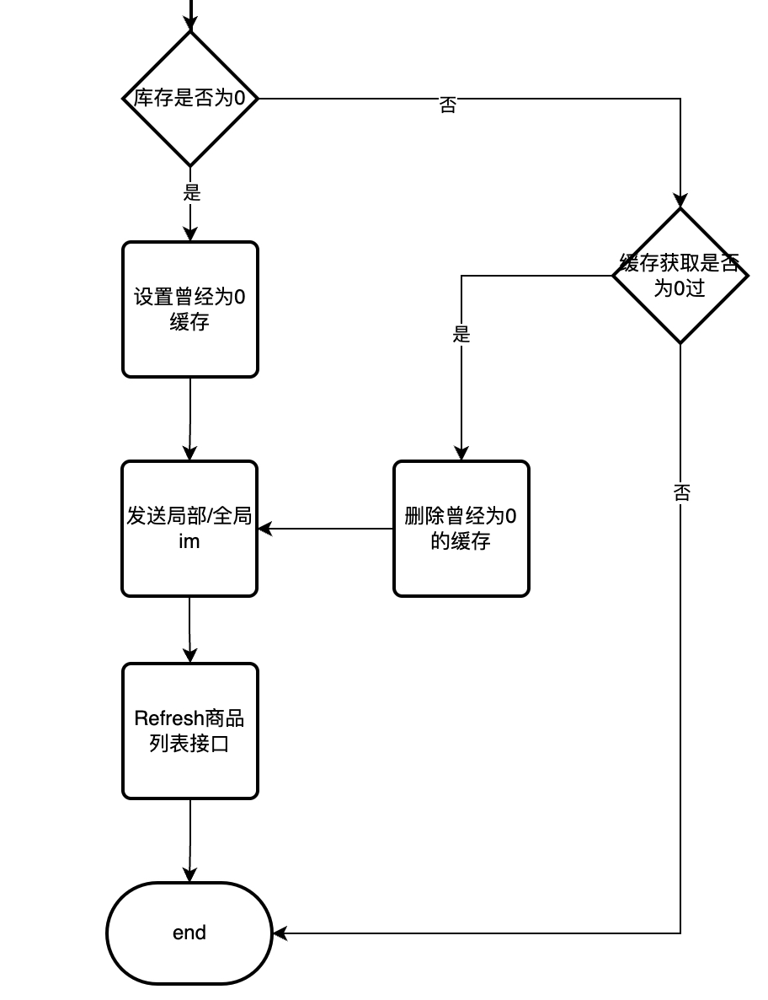

# 工作疑难点

## 直播 C 端

### 直播间库存刷新

线上会出现问题，商品库存不为空，到提单流程会提示已抢光，最终问题就是库存刷新不及时。

第一版：监听商品信息表的库存值变更，如果发现库存为 0，则发送 IM 通知客户端刷新。

第二版：监听数据上游（小店 B）的 bp 消息队列，从挂接表获取最近 1 天的直播间，过滤获取正在直播的直播间，保留这部分直播间，写入一个 redis zset keyA。——> 离线脚本，从 keyA 中获取 5 条最旧的数据，获取商品类型去调用专门的库存接口。

- 如果库存为 0，设置库存曾经为 0 的缓存，发送 IM。
- 如果库存不为 0，查看缓存库存是否曾经为 0 过，是的话删除曾经为 0 的缓存，并且发送 IM，不是的话直接结束。

上述描述完刷新商品列表的缓存（C 端获取商品信息从这里获取），之前的方案是发送 IM 让客户端重新请求一次刷新，现在更快的方案是发送 IM，客户端直接修改库存值。

其实最主要的情况有如下几种：

- 库存 99 ——> 库存 98：这种情况其实没有什么影响，因为从 C 端来看只关心是否有库存。
- 库存 1 ——> 库存 0：这种情况的状态从用户感知应该是有库存变为 0 已抢光，所以如果当前库存变为 0，设置曾经为 0 过，发送 IM 通知变更为已抢光。
- 库存 0 ——> 库存 1：这种情况是相当于上架，如果查看到之前为 0 过说明，之前的状态为已抢光，这时候要删除这个缓存，并且通知 IM 变更已经上架。如果之前没有过，则说明并不是从 0 变为 1 的，类似于上面的 99 变为 98，这种不需要通知，定期刷新即可。

### 明星直播间（高流量直播间）

1. 针对直播电商部分入场、优惠券、讲解卡挂件等不重要且下游链路复杂、qps限制、平响高等功能进行下线。
2. 针对部分重要数据但无法完全降级的功能，脚本定时刷新从缓存中获取数据直接写入到本地缓存中，接口再从本地缓存获取数据。
3. 缓存异步更新（调用下游），减少异步请求量级，加写锁控制。
4. 针对部分重要数据但需要从下游获取数据的，用 singleflight 包拦截高并发请求。——> 因为（某种原因，好像是读 redis 会被拒绝，因为没有 forget key，所以会导致 goroutine 激增），改成了读本地缓存，即步骤2。
5. 直播间库存刷新改造方案 ——> 最终通知 IM，端上直接改库存。

### C 端保障预案

1. 压测
2. 扩缩
3. 熔断、降级

## 直播 B 端

### 数字大屏接口可用性问题

## 数字人 B 端