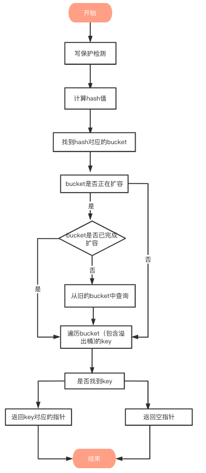
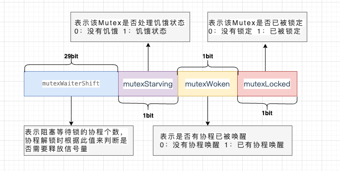
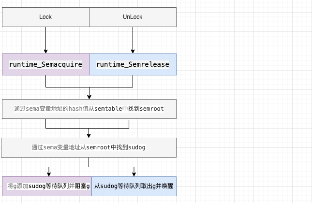
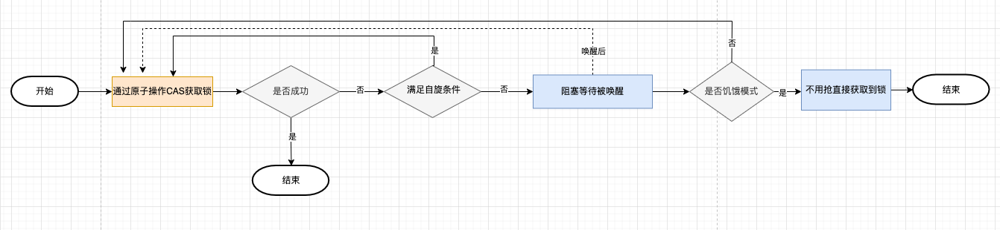
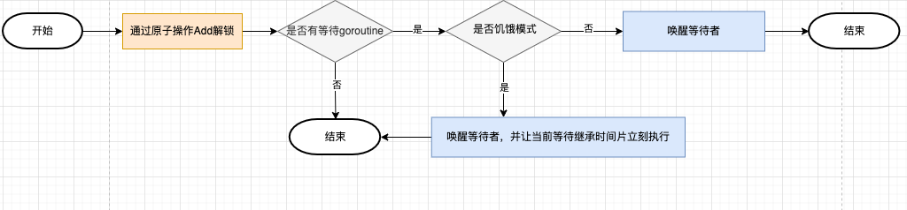
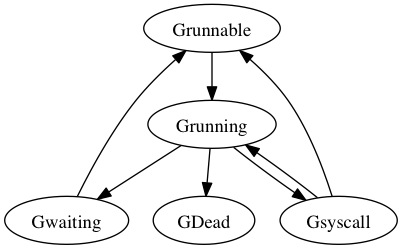
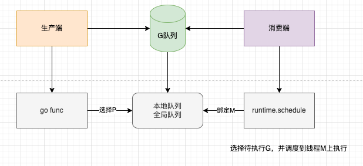

# Go语言

## 函数 & 关键字

### 1. make()、new()、var的区别？

new的特点

- 分配内存。内存里存的值是对应类型的零值。
- 只有一个参数。参数是分配的内存空间所存储的数据类型，Go语言里的任何类型都可以是new的参数，比如int， 数组，结构体，甚至函数类型都可以。
- 返回的是指针。

注: new在项目中很少见，可以被多种方法替代。

make的特点

- 分配和初始化内存。
- 只能用于slice, map和chan这3个类型，不能用于其它类型。
- 如果是用于slice类型，make函数的第2个参数表示slice的长度，这个参数必须给值。
- 返回的是原始类型，也就是slice, map和chan，不是返回指向slice, map和chan的指针。

为什么针对slice, map和chan类型专门定义一个make函数？这是因为slice, map和chan的底层结构上要求在使用slice，map和chan的时候必须初始化，如果不初始化，那slice，map和chan的值就是零值，也就是nil。我们知道：map如果是nil，是不能往map插入元素的，插入元素会引发panic。chan如果是nil，往chan发送数据或者从chan接收数据会引发panic。slice会有点特殊，理论上slice如果是nil，也是没法用的。但是append函数处理了nil slice的情况，可以调用append函数对nil slice做扩容。但是我们使用slice，总是会希望可以自定义长度或者容量，这个时候就需要用到make。

new来创建slice, map和chan的都是nil，并没有什么用。

var的特点

- 声明一个type类型的变量，分配内存空间给type类型的零值。
- 声明一个type类型的指针变量，不会分配内存空间，零值为nil。
- 声明一个type类型的变量，并赋值。

变量初始化，一般包括2步，变量声明 + 变量内存分配，var关键字就是用来声明变量的，new和make函数主要是用来分配内存的

var声明值类型的变量时，系统会默认为他分配内存空间，并赋该类型的零值

比如布尔、数字、字符串、结构体

如果指针类型或者引用类型的变量，系统不会为它分配内存，默认就是nil。此时如果你想直接使用，那么系统会抛异常，必须进行内存分配后，才能使用。

new 和 make 两个内置函数，主要用来分配内存空间，有了内存，变量就能使用了，主要有以下2点区别：

使用场景区别：

make 只能用来分配及初始化类型为slice、map、chan 的数据。

new 可以分配任意类型的数据，并且置零。

返回值区别：

make函数原返回的是slice、map、chan类型本身

### 2. Go 函数返回局部变量的指针是否安全?

一般来说，局部变量会在函数返回后被销毁，因此被返回的引用就成为了"无所指"的引用，程序会进入未知状态。

但这在 Go 中是安全的，Go 编译器将会对每个局部变量进行逃逸分析。如果发现局部变量的作用域超出该函数，则不会将内存分配在栈上，而是分配在堆上，因为他们不在栈区，即使释放函数，其内容也不会受影响

### 3. Go 函数参数传递到底是值传递还是引用传递？

Go语言中所有的传参都是值传递（传值），都是一个副本，一个拷贝。

参数如果是非引用类型（int、string、struct等这些），这样就在函数中就无法修改原内容数据；如果是引用类型（指针、map、slice、chan等这些），这样就可以修改原内容数据。

是否可以修改原内容数据，和传值、传引用没有必然的关系。在C++中，传引用肯定是可以修改原内容数据的，在Go语言里，虽然只有传值，但是我们也可以修改原内容数据，因为参数是引用类型。

### 4. Go defer关键字的实现原理？

Go1.14 中编译器会将 defer 函数直接插入到函数的尾部，无需链表和栈上参数拷贝，性能大幅提升。把 defer 函数在当前函数内展开并直接调用，这种方式被称为 open coded defer。

## Slice 切片

### 1. 切片的扩容策略？

切片在扩容时会进行内存对齐，这个和内存分配策略相关。进行内存对齐之后，新 slice 的容量是要 大于等于老 slice 容量的 2倍或者1.25倍，当原 slice 容量小于 1024 的时候，新 slice 容量变成原来的 2 倍；原 slice 容量超过 1024，新 slice 容量变成原来的1.25倍。

### 2. slice的底层实现原理?

切片是基于数组实现的，它的底层是数组，可以理解为对 底层数组的抽象。

源码包中src/runtime/slice.go 定义了slice的数据结构：

```go
type slice struct {
    array unsafe.Pointer
    len   int
    cap   int
}
```

slice占用24个字节

- array: 指向底层数组的指针，占用8个字节

- len: 切片的长度，占用8个字节

- cap: 切片的容量，cap 总是大于等于 len 的，占用8个字节

### 3. slice深拷贝和浅拷贝

深拷贝：拷贝的是数据本身，创造一个新对象，新创建的对象与原对象不共享内存，新创建的对象在内存中开辟一个新的内存地址，新对象值修改时不会影响原对象值

实现深拷贝的方式：

- copy(slice2, slice1)
- 遍历append赋值

浅拷贝：拷贝的是数据地址，只复制指向的对象的指针，此时新对象和老对象指向的内存地址是一样的，新对象值修改时老对象也会变化

实现浅拷贝的方式：

引用类型的变量，默认赋值操作就是浅拷贝

### 4. slice为什么不是线程安全的？

先看下线程安全的定义：

多个线程访问同一个对象时，调用这个对象的行为都可以获得正确的结果，那么这个对象就是线程安全的。

若有多个线程同时执行写操作，一般都需要考虑线程同步，否则的话就可能影响线程安全。

再看Go语言实现线程安全常用的几种方式：

1. 互斥锁
2. 读写锁
3. 原子操作
4. sync.once
5. sync.atomic
6. channel

slice 底层结构并没有使用加锁等方式，不支持并发读写，所以并不是线程安全的，使用多个 goroutine 对类型为 slice 的变量进行操作，每次输出的值大概率都不会一样，与预期值不一致; slice在并发执行中不会报错，但是数据会丢失。

## Map

### 1. map 的底层实现原理？

Go中的 map 是一个指针，占用8个字节，指向 hmap 结构体

源码包中 src/runtime/map.go 定义了 hmap 的数据结构：

hmap 包含若干个结构为 bmap 的数组，每个 bmap 底层都采用链表结构，bmap 通常叫其 bucket。

### 2. map 遍历为什么是无序的？

使用 range 多次遍历 map 时输出的 key 和 value 的顺序可能不同。这是 Go 语言的设计者们有意为之，旨在提示开发者们，Go 底层实现并不保证 map 遍历顺序稳定，请大家不要依赖 range 遍历结果顺序，主要原因：

- map在遍历时，并不是从固定的0号bucket开始遍历的，每次遍历，都会从一个随机值序号的bucket，再从其中随机的cell开始遍历
- map遍历时，是按序遍历bucket，同时按需遍历bucket中和其overflow bucket中的cell。但是map在扩容后，会发生key的搬迁，这造成原来落在一个bucket中的key，搬迁后，有可能会落到其他bucket中了，从这个角度看，遍历map的结果就不可能是按照原来的顺序了。

### 3. map为什么是非线程安全的？

map默认是并发不安全的，同时对map进行并发读写时，程序会panic，原因如下：

Go 官方在经过了长时间的讨论后，认为 Go map 更应适配典型使用场景（不需要从多个 goroutine 中进行安全访问），而不是为了小部分情况（并发访问），导致大部分程序付出加锁代价（性能），决定了不支持。

如果想实现map线程安全，有两种方式：

- 使用读写锁 map + sync.RWMutex
- 使用Go提供的 sync.Map

### 4. map如何查找？

Go 语言中读取 map 有两种语法：带 comma 和 不带 comma。当要查询的 key 不在 map 里，带 comma 的用法会返回一个 bool 型变量提示 key 是否在 map 中；而不带 comma 的语句则会返回一个 value 类型的零值。如果 value 是 int 型就会返回 0，如果 value 是 string 类型，就会返回空字符串。

map的查找通过生成汇编码可以知道，根据 key 的不同类型/返回参数，编译器会将查找函数用更具体的函数替换，以优化效率。



1. 写保护监测

函数首先会检查 map 的标志位 flags。如果 flags 的写标志位此时被置 1 了，说明有其他协程在执行“写”操作，进而导致程序 panic，这也说明了 map 不是线程安全的

2. 计算hash值

key经过哈希函数计算后，得到的哈希值如下（主流64位机下共 64 个 bit 位）， 不同类型的key会有不同的hash函数

3. 找到hash对应的bucket

bucket定位：哈希值的低B个bit 位，用来定位key所存放的bucket

如果当前正在扩容中，并且定位到的旧bucket数据还未完成迁移，则使用旧的bucket（扩容前的bucket）

4. 遍历bucket查找

tophash值定位：哈希值的高8个bit 位，用来快速判断key是否已在当前bucket中（如果不在的话，需要去bucket的overflow中查找）

5. 返回key对应的指针

### 5. map冲突的解决方式？

比较常用的 Hash 冲突解决方案有链地址法和开放寻址法：

- 链地址法

当哈希冲突发生时，创建新单元，并将新单元添加到冲突单元所在链表的尾部。

- 开放寻址法

当哈希冲突发生时，从发生冲突的那个单元起，按照一定的次序，从哈希表中寻找一个空闲的单元，然后把发生冲突的元素存入到该单元。开放寻址法需要的表长度要大于等于所需要存放的元素数量

开发寻址法有多种方式：线性探测法、平方探测法、随机探测法和双重哈希法。这里以线性探测法来帮助读者理解开放寻址法思想

设 Hash(key) 表示关键字 key 的哈希值， 表示哈希表的槽位数（哈希表的大小）。

线性探测法则可以表示为：

如果 Hash(x) % M 已经有数据，则尝试 (Hash(x) + 1) % M ;

如果 (Hash(x) + 1) % M 也有数据了，则尝试 (Hash(x) + 2) % M ;

如果 (Hash(x) + 2) % M 也有数据了，则尝试 (Hash(x) + 3) % M ;

两种解决方案比较

对于链地址法，基于数组 + 链表进行存储，链表节点可以在需要时再创建，不必像开放寻址法那样事先申请好足够内存，因此链地址法对于内存的利用率会比开方寻址法高。链地址法对装载因子的容忍度会更高，并且适合存储大对象、大数据量的哈希表。而且相较于开放寻址法，它更加灵活，支持更多的优化策略，比如可采用红黑树代替链表。但是链地址法需要额外的空间来存储指针。

对于开放寻址法，它只有数组一种数据结构就可完成存储，继承了数组的优点，对CPU缓存友好，易于序列化操作。但是它对内存的利用率不如链地址法，且发生冲突时代价更高。当数据量明确、装载因子小，适合采用开放寻址法。

在发生哈希冲突时，Python中dict采用的开放寻址法，Java的HashMap采用的是链地址法，而Go map也采用链地址法解决冲突，具体就是插入key到map中时，当key定位的桶填满8个元素后（这里的单元就是桶，不是元素），将会创建一个溢出桶，并且将溢出桶插入当前桶所在链表尾部。

### 6. map 的负载因子为什么是 6.5？

什么是负载因子?

负载因子（load factor），用于衡量当前哈希表中空间占用率的核心指标，也就是每个 bucket 桶存储的平均元素个数。

负载因子 = 哈希表存储的元素个数/桶个数

另外负载因子与扩容、迁移等重新散列（rehash）行为有直接关系：

- 在程序运行时，会不断地进行插入、删除等，会导致 bucket 不均，内存利用率低，需要迁移。
- 在程序运行时，出现负载因子过大，需要做扩容，解决 bucket 过大的问题。

负载因子是哈希表中的一个重要指标，在各种版本的哈希表实现中都有类似的东西，主要目的是为了平衡 buckets 的存储空间大小和查找元素时的性能高低。

在接触各种哈希表时都可以关注一下，做不同的对比，看看各家的考量。

Go 官方发现：装载因子越大，填入的元素越多，空间利用率就越高，但发生哈希冲突的几率就变大。反之，装载因子越小，填入的元素越少，冲突发生的几率减小，但空间浪费也会变得更多，而且还会提高扩容操作的次数

根据这份测试结果和讨论，Go 官方取了一个相对适中的值，把 Go 中的 map 的负载因子硬编码为 6.5，这就是 6.5 的选择缘由。

这意味着在 Go 语言中，当 map存储的元素个数大于或等于 6.5 * 桶个数 时，就会触发扩容行为。

### 7. map如何扩容？

扩容时机：

在向 map 插入新 key 的时候，会进行条件检测，符合下面这 2 个条件，就会触发扩容

```go
if !h.growing() && (overLoadFactor(h.count+1, h.B) || tooManyOverflowBuckets(h.noverflow, h.B)) {
  hashGrow(t, h)
  goto again // Growing the table invalidates everything, so try again
}

// 判断是否在扩容
func (h *hmap) growing() bool {
    return h.oldbuckets != nil
}
```

1. 超过负载

map元素个数 > 6.5 * 桶个数

```go
func overLoadFactor(count int, B uint8) bool {
   return count > bucketCnt && uintptr(count) > loadFactor*bucketShift(B)
}

其中 

bucketCnt = 8，一个桶可以装的最大元素个数
loadFactor = 6.5，负载因子，平均每个桶的元素个数
bucketShift(B): 桶的个数
```

2. 溢出桶太多

当桶总数 < 2 ^ 15 时，如果溢出桶总数 >= 桶总数，则认为溢出桶过多。

当桶总数 >= 2 ^ 15 时，直接与 2 ^ 15 比较，当溢出桶总数 >= 2 ^ 15 时，即认为溢出桶太多了。

```go
func tooManyOverflowBuckets(noverflow uint16, B uint8) bool {
    // If the threshold is too low, we do extraneous work.
    // If the threshold is too high, maps that grow and shrink can hold on to lots of unused memory.
    // "too many" means (approximately) as many overflow buckets as regular buckets.
    // See incrnoverflow for more details.
    if B > 15 {
        B = 15
    }
    // The compiler doesn't see here that B < 16; mask B to generate shorter shift code.
    return noverflow >= uint16(1)<<(B&15)
}
```

对于条件2，其实算是对条件1的补充。因为在负载因子比较小的情况下，有可能 map 的查找和插入效率也很低，而第 1 点识别不出来这种情况。

表面现象就是负载因子比较小，即 map 里元素总数少，但是桶数量多（真实分配的桶数量多，包括大量的溢出桶）。比如不断的增删，这样会造成 overflow 的 bucket 数量增多，但负载因子又不高，达不到第 1 点的临界值，就不能触发扩容来缓解这种情况。这样会造成桶的使用率不高，值存储得比较稀疏，查找插入效率会变得非常低，因此有了第 2 扩容条件。

扩容机制：

双倍扩容：针对条件1，新建一个buckets数组，新的buckets大小是原来的2倍，然后旧buckets数据搬迁到新的buckets。该方法我们称之为双倍扩容。

等量扩容：针对条件2，并不扩大容量，buckets数量维持不变，重新做一遍类似双倍扩容的搬迁动作，把松散的键值对重新排列一次，使得同一个 bucket 中的 key 排列地更紧密，节省空间，提高 bucket 利用率，进而保证更快的存取。该方法我们称之为等量扩容。

扩容函数：

上面说的 hashGrow() 函数实际上并没有真正地“搬迁”，它只是分配好了新的 buckets，并将老的 buckets 挂到了 oldbuckets 字段上。真正搬迁 buckets 的动作在 growWork() 函数中，而调用 growWork() 函数的动作是在 mapassign 和 mapdelete 函数中。也就是插入或修改、删除 key 的时候，都会尝试进行搬迁 buckets 的工作。先检查 oldbuckets 是否搬迁完毕，具体来说就是检查 oldbuckets 是否为 nil

### 8. map和sync.Map谁的性能好，为什么？

sync.Map 支持并发读写，采取了 “空间换时间” 的机制，冗余了两个数据结构，分别是：read 和 dirty

和原始map+RWLock的实现并发的方式相比，减少了加锁对性能的影响。它做了一些优化：可以无锁访问read map，而且会优先操作read map，倘若只操作read map就可以满足要求，那就不用去操作write map(dirty)，所以在某些特定场景中它发生锁竞争的频率会远远小于map+RWLock的实现方式

优点：

适合读多写少的场景

缺点：

写多的场景，会导致 read map 缓存失效，需要加锁，冲突变多，性能急剧下降

## Mutex

### 1. 互斥锁的实现原理？

sync包提供了两种锁类型：互斥锁sync.Mutex 和 读写互斥锁sync.RWMutex，都属于悲观锁。

Mutex是互斥锁，当一个 goroutine 获得了锁后，其他 goroutine 不能获取锁（只能存在一个写者或读者，不能同时读和写）

使用场景：

多个线程同时访问临界区，为保证数据的安全，锁住一些共享资源， 以防止并发访问这些共享数据时可能导致的数据不一致问题。

获取锁的线程可以正常访问临界区，未获取到锁的线程等待锁释放后可以尝试获取锁

互斥锁对应的是底层结构是sync.Mutex结构体，，位于 src/sync/mutex.go中

```go
type Mutex struct {  
     state int32  
     sema  uint32
}
```

state表示锁的状态，有锁定、被唤醒、饥饿模式等，并且是用state的二进制位来标识的，不同模式下会有不同的处理方式。



sema表示信号量，mutex阻塞队列的定位是通过这个变量来实现的，从而实现goroutine的阻塞和唤醒



锁的实现一般会依赖于原子操作、信号量，通过atomic 包中的一些原子操作来实现锁的锁定，通过信号量来实现线程的阻塞与唤醒。

加锁

通过原子操作cas加锁，如果加锁不成功，根据不同的场景选择自旋重试加锁或者阻塞等待被唤醒后加锁。



```go
func (m *Mutex) Lock() {
    // Fast path: 幸运之路，一下就获取到了锁
    if atomic.CompareAndSwapInt32(&m.state, 0, mutexLocked) {
        return
    }
    // Slow path：缓慢之路，尝试自旋或阻塞获取锁
    m.lockSlow()
}
```

解锁

通过原子操作add解锁，如果仍有goroutine在等待，唤醒等待的goroutine。



```go
func (m *Mutex) Unlock() {  
   // Fast path: 幸运之路，解锁
   new := atomic.AddInt32(&m.state, -mutexLocked)  
   if new != 0 {  
            // Slow path：如果有等待的goroutine，唤醒等待的goroutine
            m.unlockSlow()
   }  
}
```

注意点：

- 在 Lock() 之前使用 Unlock() 会导致 panic 异常
- 使用 Lock() 加锁后，再次 Lock() 会导致死锁（不支持重入），需 Unlock() 解锁后才能再加锁
- 锁定状态与 goroutine 没有关联，一个 goroutine 可以 Lock，另一个 goroutine 可以 Unlock

### 2. 互斥锁正常模式和饥饿模式的区别？

在Go一共可以分为两种抢锁的模式，一种是正常模式，另外一种是饥饿模式。

正常模式(非公平锁)

在刚开始的时候，是处于正常模式（Barging），也就是，当一个G1持有着一个锁的时候，G2会自旋的去尝试获取这个锁。

当自旋超过4次还没有能获取到锁的时候，这个G2就会被加入到获取锁的等待队列里面，并阻塞等待唤醒。

正常模式下，所有等待锁的 goroutine 按照 FIFO(先进先出)顺序等待。唤醒的goroutine 不会直接拥有锁，而是会和新请求锁的 goroutine 竞争锁。新请求锁的 goroutine 具有优势：它正在 CPU 上执行，而且可能有好几个，所以刚刚唤醒的 goroutine 有很大可能在锁竞争中失败，长时间获取不到锁，就会切换到饥饿模式。

饥饿模式(公平锁)

当一个 goroutine 等待锁时间超过 1 毫秒时，它可能会遇到饥饿问题。 在版本1.9中，这种场景下Go Mutex 切换到饥饿模式（handoff），解决饥饿问题。

那么也不可能说永远的保持一个饥饿的状态，总归会有吃饱的时候，也就是总有那么一刻Mutex会回归到正常模式，那么回归正常模式必须具备的条件有以下几种：

- G的执行时间小于1ms
- 等待队列已经全部清空了

当满足上述两个条件的任意一个的时候，Mutex会切换回正常模式，而Go的抢锁的过程，就是在这个正常模式和饥饿模式中来回切换进行的。

```go
delta := int32(mutexLocked - 1<<mutexWaiterShift)  
if !starving || old>>mutexWaiterShift == 1 {  
    delta -= mutexStarving
}
atomic.AddInt32(&m.state, delta)
```

对于两种模式，正常模式下的性能是最好的，goroutine 可以连续多次获取锁，饥饿模式解决了取锁公平的问题，但是性能会下降，其实是性能和公平的 一个平衡模式。

### 3. 互斥锁允许自旋的条件？

线程没有获取到锁时常见有2种处理方式：

- 一种是没有获取到锁的线程就一直循环等待判断该资源是否已经释放锁，这种锁也叫做自旋锁，它不用将线程阻塞起来， 适用于并发低且程序执行时间短的场景，缺点是cpu占用较高
- 另外一种处理方式就是把自己阻塞起来，会释放CPU给其他线程，内核会将线程置为「睡眠」状态，等到锁被释放后，内核会在合适的时机唤醒该线程，适用于高并发场景，缺点是有线程上下文切换的开销

Go语言中的Mutex实现了自旋与阻塞两种场景，当满足不了自旋条件时，就会进入阻塞:

允许自旋的条件：

- 锁已被占用，并且锁不处于饥饿模式。
- 积累的自旋次数小于最大自旋次数（active_spin=4）。
- cpu 核数大于 1。
- 有空闲的 P。
- 当前 goroutine 所挂载的 P 下，本地待运行队列为空。

```go
if old&(mutexLocked|mutexStarving) == mutexLocked && runtime_canSpin(iter) {  
    ...
    runtime_doSpin()   
    continue  
}


func sync_runtime_canSpin(i int) bool {  
    if i >= active_spin 
    || ncpu <= 1 
    || gomaxprocs <= int32(sched.npidle+sched.nmspinning)+1 {  
          return false  
     }  
   if p := getg().m.p.ptr(); !runqempty(p) {  
      return false  
 }  
   return true  
}
```

自旋：

```go
func sync_runtime_doSpin() {
    procyield(active_spin_cnt)
} 
```

如果可以进入自旋状态之后就会调用 runtime_doSpin 方法进入自旋， doSpin 方法会调用 procyield(30) 执行30次 PAUSE 指令，什么都不做，但是会消耗CPU时间。 

### 4. 读写锁的实现原理？

读写互斥锁 RWMutex，是对 Mutex 的一个扩展，当一个 goroutine 获得了读锁后，其他 goroutine 可以获取读锁，但不能获取写锁；当一个 goroutine 获得了写锁后，其他 goroutine 既不能获取读锁也不能获取写锁（只能存在一个写者或多个读者，可以同时读）。

使用场景：

读多于写的情况（既保证线程安全，又保证性能不太差）

底层实现结构：

互斥锁对应的是底层结构是 sync.RWMutex 结构体，，位于 src/sync/rwmutex.go 中

```go
type RWMutex struct {
    w           Mutex  // 复用互斥锁
    writerSem   uint32 // 信号量，用于写等待读
    readerSem   uint32 // 信号量，用于读等待写
    readerCount int32  // 当前执行读的 goroutine 数量
    readerWait  int32  // 被阻塞的准备读的 goroutine 的数量
}
```

操作：

加读锁：

```go
func (rw *RWMutex) RLock() {
// 为什么readerCount会小于0呢？往下看发现writer的Lock()会对readerCount做减法操作（原子操作）
  if atomic.AddInt32(&rw.readerCount, 1) < 0 {
    // A writer is pending, wait for it.
    runtime_Semacquire(&rw.readerSem)
  }
}
```

atomic.AddInt32(&rw.readerCount, 1) 调用这个原子方法，对当前在读的数量加1，如果返回负数，那么说明当前有其他写锁，这时候就调用 runtime_SemacquireMutex 休眠当前 goroutine 等待被唤醒

释放读锁：

解锁的时候对正在读的操作减1，如果返回值小于 0 那么说明当前有在写的操作，这个时候调用 rUnlockSlow 进入慢速通道

```go
func (rw *RWMutex) RUnlock() {
    if r := atomic.AddInt32(&rw.readerCount, -1); r < 0 {
        rw.rUnlockSlow(r)
    }
}
```

被阻塞的准备读的 goroutine 的数量减1，readerWait 为 0，就表示当前没有正在准备读的 goroutine 这时候调用 runtime_Semrelease 唤醒写操作.

```go
func (rw *RWMutex) rUnlockSlow(r int32) {
    // A writer is pending.
    if atomic.AddInt32(&rw.readerWait, -1) == 0 {
        // The last reader unblocks the writer.
        runtime_Semrelease(&rw.writerSem, false, 1)
    }
}
```

加写锁：

```go
const rwmutexMaxReaders = 1 << 30

func (rw *RWMutex) Lock() {
    // First, resolve competition with other writers.
    rw.w.Lock()
    // Announce to readers there is a pending writer.
    r := atomic.AddInt32(&rw.readerCount, -rwmutexMaxReaders) + rwmutexMaxReaders
    // Wait for active readers.
    if r != 0 && atomic.AddInt32(&rw.readerWait, r) != 0 {
        runtime_Semacquire(&rw.writerSem)
    }
}
```

首先调用互斥锁的 lock，获取到互斥锁之后，如果计算之后当前仍然有其他 goroutine 持有读锁，那么就调用 runtime_SemacquireMutex 休眠当前的 goroutine 等待所有的读操作完成

这里 readerCount 原子性加上一个很大的负数，是防止后面的协程能拿到读锁，阻塞读。

释放写锁：

```go
func (rw *RWMutex) Unlock() {
    // Announce to readers there is no active writer.
    r := atomic.AddInt32(&rw.readerCount, rwmutexMaxReaders)
    // Unblock blocked readers, if any.
    for i := 0; i < int(r); i++ {
        runtime_Semrelease(&rw.readerSem, false)
    }
    // Allow other writers to proceed.
    rw.w.Unlock()
}
```

解锁的操作，会先调用 atomic.AddInt32(&rw.readerCount, rwmutexMaxReaders) 将恢复之前写入的负数，然后根据当前有多少个读操作在等待，循环唤醒。

注意点：

- 读锁或写锁在 Lock() 之前使用 Unlock() 会导致 panic 异常
- 使用 Lock() 加锁后，再次 Lock() 会导致死锁（不支持重入），需Unlock()解锁后才能再加锁
- 锁定状态与 goroutine 没有关联，一个 goroutine 可以 RLock（Lock），另一个 goroutine 可以 RUnlock（Unlock）

互斥锁和读写锁的区别：

- 读写锁区分读者和写者，而互斥锁不区分
- 互斥锁同一时间只允许一个线程访问该对象，无论读写；读写锁同一时间内只允许一个写者，但是允许多个读者同时读对象。

### 4. 可重入锁如何实现？

可重入锁又称为递归锁，是指在同一个线程在外层方法获取锁的时候，在进入该线程的内层方法时会自动获取锁，不会因为之前已经获取过还没释放再次加锁导致死锁

为什么Go语言中没有可重入锁？

Mutex 不是可重入的锁。Mutex 的实现中没有记录哪个 goroutine 拥有这把锁。理论上，任何 goroutine 都可以随意地 Unlock 这把锁，所以没办法计算重入条件，并且Mutex 重复Lock会导致死锁。

如何实现可重入锁？

实现一个可重入锁需要这两点：

- 记住持有锁的线程
- 统计重入的次数

```go
package main

import (
    "bytes"
    "fmt"
    "runtime"
    "strconv"
    "sync"
    "sync/atomic"
)

type ReentrantLock struct {
    sync.Mutex
    recursion int32 // 这个goroutine 重入的次数
    owner     int64 // 当前持有锁的goroutine id
}

// Get returns the id of the current goroutine.
func GetGoroutineID() int64 {
    var buf [64]byte
    var s = buf[:runtime.Stack(buf[:], false)]
    s = s[len("goroutine "):]
    s = s[:bytes.IndexByte(s, ' ')]
    gid, _ := strconv.ParseInt(string(s), 10, 64)
    return gid
}

func NewReentrantLock() sync.Locker {
    res := &ReentrantLock{
        Mutex:     sync.Mutex{},
        recursion: 0,
        owner:     0,
    }
    return res
}

// ReentrantMutex 包装一个Mutex,实现可重入
type ReentrantMutex struct {
    sync.Mutex
    owner     int64 // 当前持有锁的goroutine id
    recursion int32 // 这个goroutine 重入的次数
}

func (m *ReentrantMutex) Lock() {
    gid := GetGoroutineID()
    // 如果当前持有锁的goroutine就是这次调用的goroutine,说明是重入
    if atomic.LoadInt64(&m.owner) == gid {
        m.recursion++
        return
    }
    m.Mutex.Lock()
    // 获得锁的goroutine第一次调用，记录下它的goroutine id,调用次数加1
    atomic.StoreInt64(&m.owner, gid)
    m.recursion = 1
}

func (m *ReentrantMutex) Unlock() {
    gid := GetGoroutineID()
    // 非持有锁的goroutine尝试释放锁，错误的使用
    if atomic.LoadInt64(&m.owner) != gid {
        panic(fmt.Sprintf("wrong the owner(%d): %d!", m.owner, gid))
    }
    // 调用次数减1
    m.recursion--
    if m.recursion != 0 { // 如果这个goroutine还没有完全释放，则直接返回
        return
    }
    // 此goroutine最后一次调用，需要释放锁
    atomic.StoreInt64(&m.owner, -1)
    m.Mutex.Unlock()
}

func main() {
    var mutex = &ReentrantMutex{}
    mutex.Lock()
    mutex.Lock()
    fmt.Println(111)
    mutex.Unlock()
    mutex.Unlock()
}
```

### 6. Go 原子操作有哪些？

Go atomic包是最轻量级的锁（也称无锁结构），可以在不形成临界区和创建互斥量的情况下完成并发安全的值替换操作，不过这个包只支持int32/int64/uint32/uint64/uintptr这几种数据类型的一些基础操作（增减、交换、载入、存储等

原子操作仅会由一个独立的CPU指令代表和完成。原子操作是无锁的，常常直接通过CPU指令直接实现。 事实上，其它同步技术的实现常常依赖于原子操作。

使用场景：

当我们想要对某个变量并发安全的修改，除了使用官方提供的 mutex，还可以使用 sync/atomic 包的原子操作，它能够保证对变量的读取或修改期间不被其他的协程所影响。

atomic 包提供的原子操作能够确保任一时刻只有一个goroutine对变量进行操作，善用 atomic 能够避免程序中出现大量的锁操作。

常见操作：

atomic 操作的对象是一个地址，你需要把可寻址的变量的地址作为参数传递给方法，而不是把变量的值传递给方法。

增减操作：

```go
func AddInt32(addr *int32, delta int32) (new int32)

func AddInt64(addr *int64, delta int64) (new int64)

func AddUint32(addr *uint32, delta uint32) (new uint32)

func AddUint64(addr *uint64, delta uint64) (new uint64)

func AddUintptr(addr *uintptr, delta uintptr) (new uintptr)
```

需要注意的是，第一个参数必须是指针类型的值，通过指针变量可以获取被操作数在内存中的地址，从而施加特殊的CPU指令，确保同一时间只有一个goroutine能够进行操作。

载入操作：

```go
func LoadInt32(addr *int32) (val int32)

func LoadInt64(addr *int64) (val int64)

func LoadPointer(addr *unsafe.Pointer) (val unsafe.Pointer)

func LoadUint32(addr *uint32) (val uint32)

func LoadUint64(addr *uint64) (val uint64)

func LoadUintptr(addr *uintptr) (val uintptr)

// 特殊类型： Value类型，常用于配置变更
func (v *Value) Load() (x interface{}) {}
```

载入操作能够保证原子的读变量的值，当读取的时候，任何其他CPU操作都无法对该变量进行读写，其实现机制受到底层硬件的支持。

比较并交换：

此类操作的前缀为 CompareAndSwap, 该操作简称 CAS，可以用来实现乐观锁

```go
func CompareAndSwapInt32(addr *int32, old, new int32) (swapped bool)

func CompareAndSwapInt64(addr *int64, old, new int64) (swapped bool)

func CompareAndSwapPointer(addr *unsafe.Pointer, old, new unsafe.Pointer) (swapped bool)

func CompareAndSwapUint32(addr *uint32, old, new uint32) (swapped bool)

func CompareAndSwapUint64(addr *uint64, old, new uint64) (swapped bool)

func CompareAndSwapUintptr(addr *uintptr, old, new uintptr) (swapped bool)
```

该操作在进行交换前首先确保变量的值未被更改，即仍然保持参数 old 所记录的值，满足此前提下才进行交换操作。CAS的做法类似操作数据库时常见的乐观锁机制。

需要注意的是，当有大量的goroutine 对变量进行读写操作时，可能导致CAS操作无法成功，这时可以利用for循环多次尝试。

交换：

```go
func SwapInt32(addr *int32, new int32) (old int32)

func SwapInt64(addr *int64, new int64) (old int64)

func SwapPointer(addr *unsafe.Pointer, new unsafe.Pointer) (old unsafe.Pointer)

func SwapUint32(addr *uint32, new uint32) (old uint32)

func SwapUint64(addr *uint64, new uint64) (old uint64)

func SwapUintptr(addr *uintptr, new uintptr) (old uintptr)
```

相对于CAS，明显此类操作更为暴力直接，并不管变量的旧值是否被改变，直接赋予新值然后返回背替换的值。

存储：

```go
func StoreInt32(addr *int32, val int32)

func StoreInt64(addr *int64, val int64)

func StorePointer(addr *unsafe.Pointer, val unsafe.Pointer)

func StoreUint32(addr *uint32, val uint32)

func StoreUint64(addr *uint64, val uint64)

func StoreUintptr(addr *uintptr, val uintptr)

// 特殊类型： Value类型，常用于配置变更
func (v *Value) Store(x interface{})
```

此类操作确保了写变量的原子性，避免其他操作读到了修改变量过程中的脏数据。

### 7. 原子操作和锁的区别？

- 原子操作由底层硬件支持，而锁是基于原子操作+信号量完成的。若实现相同的功能，前者通常会更有效率
- 原子操作是单个指令的互斥操作；互斥锁/读写锁是一种数据结构，可以完成临界区（多个指令）的互斥操作，扩大原子操作的范围
- 原子操作是无锁操作，属于乐观锁；说起锁的时候，一般属于悲观锁
- 原子操作存在于各个指令/语言层级，比如“机器指令层级的原子操作”，“汇编指令层级的原子操作”，“Go语言层级的原子操作”等。
- 锁也存在于各个指令/语言层级中，比如“机器指令层级的锁”，“汇编指令层级的锁”，“Go语言层级的锁”等

## Goroutine

### 1. goroutine的底层实现原理？

Goroutine可以理解为一种Go语言的协程（轻量级线程），是Go支持高并发的基础，属于用户态的线程，由Go runtime管理而不是操作系统。

底层数据结构

```go
type g struct {
    goid    int64 // 唯一的goroutine的ID
    sched gobuf // goroutine切换时，用于保存g的上下文
    stack stack // 栈
    gopc        // pc of go statement that created this goroutine
    startpc    uintptr // pc of goroutine function
    ...
}

type gobuf struct {
    sp   uintptr // 栈指针位置
    pc   uintptr // 运行到的程序位置
    g    guintptr // 指向 goroutine
    ret  uintptr  // 保存系统调用的返回值
    ...
}

type stack struct {
    lo uintptr // 栈的下界内存地址
    hi uintptr // 栈的上界内存地址
}
```

最终有一个 runtime.g 对象放入调度队列

状态流转：

| 状态                | 含义                                                         |
| ------------------- | ------------------------------------------------------------ |
| 空闲中_Gidle        | G刚刚新建, 仍未初始化                                        |
| 待运行_Grunnable    | 就绪状态，G在运行队列中, 等待M取出并运行                     |
| 运行中_Grunning     | M正在运行这个G, 这时候M会拥有一个P                           |
| 系统调用中_Gsyscall | M正在运行这个G发起的系统调用, 这时候M并不拥有P               |
| 等待中_Gwaiting     | G在等待某些条件完成, 这时候G不在运行也不在运行队列中(可能在channel的等待队列中) |
| 已中止_Gdead        | G未被使用, 可能已执行完毕                                    |
| 栈复制中_Gcopystack | G正在获取一个新的栈空间并把原来的内容复制过去(用于防止GC扫描) |



创建：

通过 go 关键字调用底层函数 runtime.newproc() 创建一个goroutine，当调用该函数之后，goroutine 会被设置成 runnable 状态。

创建好的这个goroutine会新建一个自己的栈空间，同时在G的sched中维护栈地址与程序计数器这些信息。

每个 G 在被创建之后，都会被优先放入到本地队列中，如果本地队列已满，就会被放入到全局队列中。

运行：

goroutine 本身只是一个数据结构，真正让 goroutine 运行起来的是调度器。Go 实现了一个用户态的调度器（GMP模型），这个调度器充分利用现代计算机的多核特性，同时让多个 goroutine 运行，同时 goroutine 设计的很轻量级，调度和上下文切换的代价都比较小。



调度时机：

- 新起一个协程和协程执行完毕
- 会阻塞的系统调用，比如文件io、网络io
- channel、mutex等阻塞操作
- time.sleep
- 垃圾回收之后
- 主动调用 runtime.Gosched()
- 运行过久或系统调用过久等等

每个 M  开始执行 P 的本地队列中的 G 时，goroutine会被设置成running状态。

如果某个 M 把本地队列中的 G 都执行完成之后，然后就会去全局队列中拿 G，这里需要注意，每次去全局队列拿 G 的时候，都需要上锁，避免同样的任务被多次拿。

如果全局队列都被拿完了，而当前 M 也没有更多的 G 可以执行的时候，它就会去其他 P 的本地队列中拿任务，这个机制被称之为 work stealing 机制，每次会拿走一半的任务，向下取整，比如另一个 P 中有 3 个任务，一半就是 1 个任务。

当全局队列为空，M 也没办法从其他的 P 中拿任务的时候，就会让自身进入自选状态，等待有新的 G 进来。最多只会有 GOMAXPROCS 个 M 在自旋状态，过多 M 的自旋会浪费 CPU 资源。

阻塞：

channel 的读写操作、等待锁、等待网络数据、系统调用等都有可能发生阻塞，会调用底层函数 runtime.gopark()，会让出 CPU 时间片，让调度器安排其它等待的任务运行，并在下次某个时候从该位置恢复执行。

唤醒：

处于 waiting 状态的 goroutine，在调用 runtime.goready() 函数之后会被唤醒，唤醒的goroutine 会被重新放到 M 对应的上下文 P 对应的 runqueue 中，等待被调度。

当调用该函数之后，goroutine 会被设置成 runnable 状态。

退出：

当 goroutine 执行完成后，会调用底层函数 runtime.Goexit()。当调用该函数之后，goroutine 会被设置成dead状态。

### 2. goroutine 和线程的区别？

|            | goroutine                                                    | 线程                                                         |
| ---------- | ------------------------------------------------------------ | ------------------------------------------------------------ |
| 内存占用   | 创建一个 goroutine 的栈内存消耗为 2 KB，实际运行过程中，如果栈空间不够用，会自动进行扩容 | 创建一个 线程 的栈内存消耗为 1 MB                            |
| 创建和销毀 | goroutine 因为是由 Go runtime 负责管理的，创建和销毁的消耗非常小，是用户级。 | 线程创建和销毀都会有巨大的消耗，因为要和操作系统打交道，是内核级的，通常解决的办法就是线程池 |
| 切换       | goroutines 切换只需保存三个寄存器：PC、SP、BP。goroutine 的切换约为 200 ns，相当于 2400-3600 条指令。 | 当线程切换时，需要保存各种寄存器，以便恢复现场。线程切换会消耗 1000-1500 ns，相当于 12000-18000 条指令。 |

### 3. goroutine泄漏的场景

泄漏的原因：

- Goroutine 内进行 channel/mutex 等读写操作被一直阻塞。
- Goroutine 内的业务逻辑进入死循环，资源一直无法释放。
- Goroutine 内的业务逻辑进入长时间等待，有不断新增的 Goroutine 进入等待

泄漏场景：

如果输出的 goroutines 数量是在不断增加的，就说明存在泄漏。

1. nil channel

channel 如果忘记初始化，那么无论你是读，还是写操作，都会造成阻塞。

2. 发送不接收

channel 发送数量超过 channel接收数量，就会造成阻塞。

3. 接收不发送

channel 接收数量超过 channel发送数量，也会造成阻塞

4. http request body未关闭

resp.Body.Close() 未被调用时，goroutine不会退出

5. 互斥锁忘记解锁

第一个协程获取 sync.Mutex 加锁了，但是他可能在处理业务逻辑，又或是忘记 Unlock 了。

因此导致后面的协程想加锁，却因锁未释放被阻塞了

6. sync.WaitGroup使用不当

由于 wg.Add 的数量与 wg.Done 数量并不匹配，因此在调用 wg.Wait 方法后一直阻塞等待

如何排查：

单个函数：调用 runtime.NumGoroutine 方法来打印 执行代码前后Goroutine 的运行数量，进行前后比较，就能知道有没有泄露了。

生产/测试环境：使用PProf实时监测Goroutine的数量。

### 4. 如何查看正在执行的goroutine数量?

在程序中引入 pprof，开启 HTTP 监听服务。

```go
package main

import (
    "net/http"
    _ "net/http/pprof"
)

func main() {

    for i := 0; i < 100; i++ {
        go func() {
            select {}
        }()
    }

    go func() {
        http.ListenAndServe("localhost:6060", nil)
    }()

    select {}
}
```

在命令行执行：

```bash
go tool pprof -http=:1248 http://127.0.0.1:6060/debug/pprof/goroutine
```

会自动打开浏览器界面，可以在途中看到 goroutine 的数量以及调用关系，可以看到有103个goroutine：


### 5. 如何控制并发的goroutine数量?

为什么要控制goroutine并发的数量？

在开发过程中，如果不对goroutine加以控制而进行滥用的话，可能会导致服务整体崩溃。比如耗尽系统资源导致程序崩溃，或者CPU使用率过高导致系统忙不过来。

用什么方法控制goroutine并发的数量？

有缓冲channel

利用缓冲满时发送阻塞的特性

```go
package main

import (
    "fmt"
    "runtime"
    "time"
)

var wg = sync.WaitGroup{}

func main() {
    // 模拟用户请求数量
    requestCount := 10
    fmt.Println("goroutine_num", runtime.NumGoroutine())
    // 管道长度即最大并发数
    ch := make(chan bool, 3)
    for i := 0; i < requestCount; i++ {
        wg.Add(1)
        ch <- true
        go Read(ch, i)
    }

     wg.Wait()
}

func Read(ch chan bool, i int) {
    fmt.Printf("goroutine_num: %d, go func: %d\n", runtime.NumGoroutine(), i)
    <-ch
    wg.Done()
}
```

输出结果：

```go
goroutine_num 1
goroutine_num: 4, go func: 1
goroutine_num: 4, go func: 3
goroutine_num: 4, go func: 2
goroutine_num: 4, go func: 0
goroutine_num: 4, go func: 4
goroutine_num: 4, go func: 5
goroutine_num: 4, go func: 6
goroutine_num: 4, go func: 8
goroutine_num: 4, go func: 9
goroutine_num: 4, go func: 7
```

无缓冲channel

任务发送和执行分离，指定消费者并发协程数

```go
package main

import (
    "fmt"
    "runtime"
    "sync"
)

var wg = sync.WaitGroup{}

func main() {
    // 模拟用户请求数量
    requestCount := 10
    fmt.Println("goroutine_num", runtime.NumGoroutine())
    ch := make(chan bool)
    for i := 0; i < 3; i++ {
        go Read(ch, i)
    }

    for i := 0; i < requestCount; i++ {
        wg.Add(1)
        ch <- true
    }

    wg.Wait()
}

func Read(ch chan bool, i int) {
    for _ = range ch {
        fmt.Printf("goroutine_num: %d, go func: %d\n", runtime.NumGoroutine(), i)
        wg.Done()
    }
}
```


## 内存

### 1. 逃逸分析

### 2. 内存分配

### 3. 垃圾回收

#### 3.1 垃圾回收相关。进行内存对齐之后，新 slice 的容量是要 大于等于老 slice 容量的 2倍或者1.25倍，当原 slice 容量小于 1024 的时候，新 slice 容量变成原来的 2 倍；原 slice 容量超过 1024，新 slice 容量变成原来的1.25倍。

## Channel

### 1. 对已经关闭的的 chan 进行读写，会怎么样？

- 读已经关闭的 chan 能一直读到东西，但是读到的内容根据通道内关闭前是否有元素而不同。
	- 如果如果 chan 关闭前，buffer 内有元素还未读 , 会正确读到 chan 内的值，且返回的第二个 bool 值（是否读成功）为 true。
	- 如果 chan 关闭前，buffer 内有元素已经被读完，chan 内无值，接下来所有接收的值都会非阻塞直接成功，返回 channel 元素的零值，但是第二个 bool 值一直为 false。
- 写已经关闭的 chan 会 panic

### 2. 说说 channel 的死锁场景

产生死锁的场景大概有两种：

1. 当一个channel中没有数据，而直接读取时，会发生死锁。（空读）
2. 当channel中数据满了，再尝试写数据就会造成死锁。（满写）

```go
// 空读
q := make(chan int,2)
<-q
```

```go
// 满写
q := make(chan int,2)
q<-1
q<-2
q<-3
```

另外补充，如果向已经关闭的channel中写入数据，并不会产生死锁，而是会panic，但是可以从已经关闭的channel中读取数据。

其实死锁最关键的地方是不让主协程阻塞。比如：

```go
func main() {
    ch := make(chan string)
    go func() {
        ch <- "send"
    }()
    time.Sleep(time.Second * 3) // 加不加这个延时都不会阻塞
}
```

因为虽然子协程一直在阻塞传值语句，但外面的主协程还是正常结束，所以子协程也只能结束。

