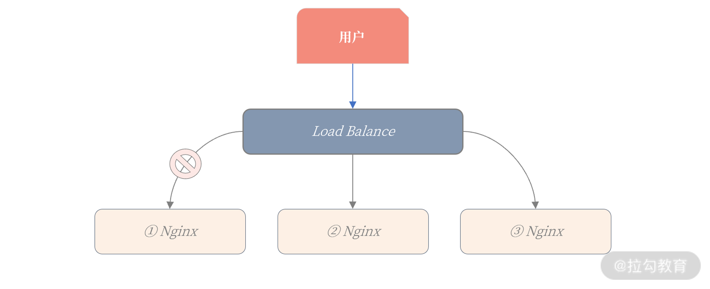
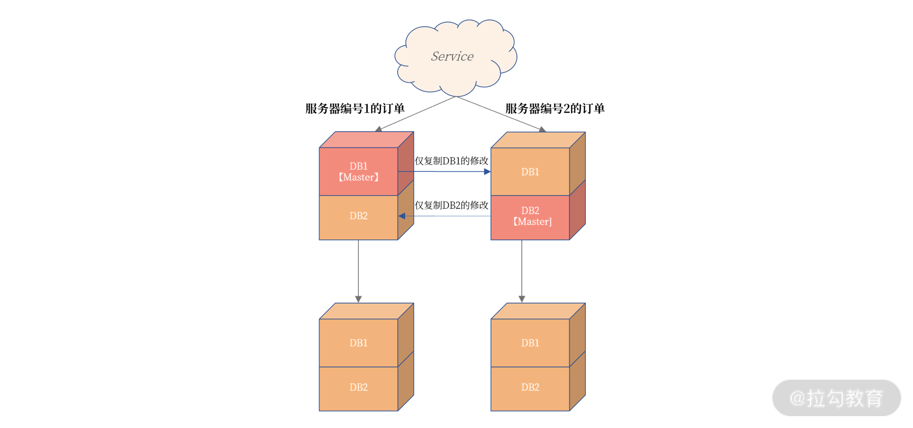
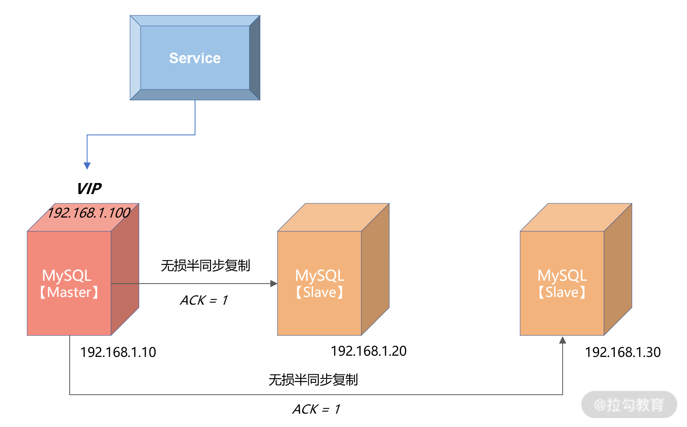
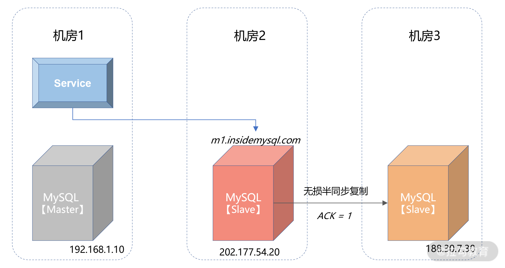
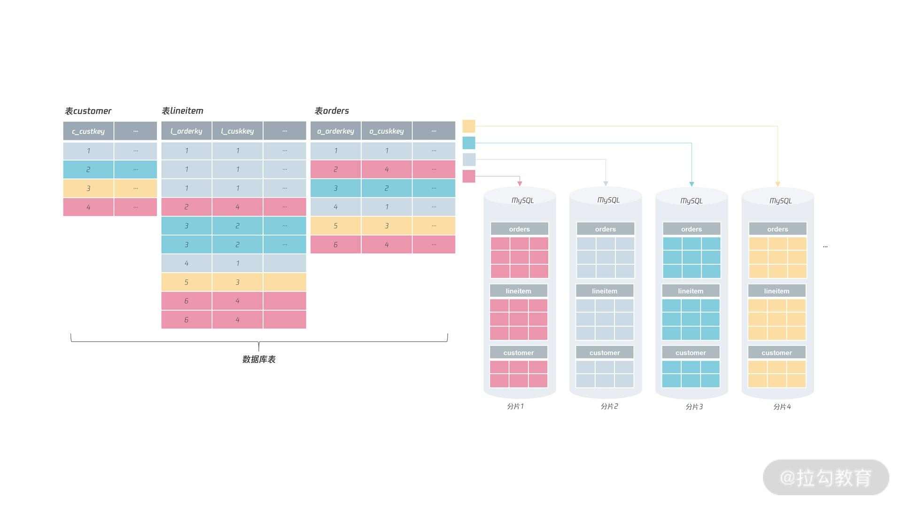

# MySQL 原理

## 架构

### MySQL 架构


最上层的服务并不是 MySQL 独有的，大多数基于网络的客户端 / 服务器的工具或者服务都有类似的架构。比如连接处理、授权认证、安全等等。

第二层架构是 MySQL 比较有意思的部分。大多数 MySQL 的核心服务功能都在这一层，包括查询解析、分析、优化、缓存以及所有的内置函数（例如，日期、时间、数学和加密函数），所有跨存储引擎的功能都在这一层实现：存储过程、触发器、视图等。

第三层包含了存储引擎。存储引擎负责 MySQL 中数据的存储和提取。和 GNU/Linux 下的各种文件系统一样，每个存储引擎都有它的优势和劣势。服务器通过 API 与存储引擎进行通信。这些接口屏蔽了不同存储引擎之间的差异，使得这些差异对上层的查询过程透明。存储引擎 API 包含几十个底层函数，用于执行诸如“开始一个事务”，或者“根据主键提取一行记录”等操作。但存储引擎不会去解析 SQL（InnoDB是例外，它会解析外键定义，因为 MySQL 服务器本身没有实现该功能。），不同存储引擎之间也不会相互通信，而只是简单地响应上层服务器的请求。

每个客户端连接都会在服务器进程中拥有一个线程，这个连接的查询只会在这个单独的线程中执行，该线程只能轮流在某个 CPU 核心或者 CPU 中运行。服务器会负责缓存线程，因此不需要为每一个新建的连接创建或者销毁线程。

当客户端（应用）连接到 MySQL 服务器时，服务器需要对其进行认证。认证基于用户名、原始主机信息和密码。如果使用了安全套接字（SSL）的方式连接，还可以使用 X.509 证书认证。一旦客户端连接成功，服务器会继续验证该客户端是否具有执行某个特定查询的权限（例如，是否允许客户端对 world 数据库的 Country 表执行 SELECT 语句）。

MySQL 会解析查询，并创建内部数据结构（解析树），然后对其进行各种优化，包括重写查询、决定表的读取顺序，以及选择合适的索引等。用户可以通过特殊的关键字提示（hint）优化器，影响它的决策过程。也可以请求优化器解释（explain）优化过程的各个因素，使用户可以知道服务器是如何进行优化决策的，并提供一个参考基准，便于用户重构查询和 schema、修改相关配置，使应用尽可能高效运行。

优化器并不关心使用的是什么存储引擎，但存储引擎对于优化查询是有影响的。优化器会请求存储引擎提供容量或某个具体操作的开销信息，以及表数据的统计信息等。例如，某些存储引擎的某种索引，可能对一些特定的查询有优化。

对于 SELECT 语句，在解析查询之前，服务器会先检查查询缓存（Query Cache），如果能够在其中找到对应的查询，服务器就不必再执行查询解析、优化和执行的整个过程，而是直接返回查询缓存中的结果集。

### 一条 SQL 的执行过程

#### MySQL 执行流程是怎样的？


可以看到，MySQL 的架构共分为两层：Server 层和存储引擎层，

- Server 层负责建立连接、分析和执行 SQL。MySQL 大多数的核心功能模块都在这实现，主要包括连接器，查询缓存、解析器、预处理器、优化器、执行器等。另外，所有的内置函数（如日期、时间、数学和加密函数等）和所有跨存储引擎的功能（如存储过程、触发器、视图等。）都在 Server 层实现。
- 存储引擎层负责数据的存储和提取。支持 InnoDB、MyISAM、Memory 等多个存储引擎，不同的存储引擎共用一个 Server 层。现在最常用的存储引擎是 InnoDB，从 MySQL 5.5 版本开始， InnoDB 成为了 MySQL 的默认存储引擎。我们常说的索引数据结构，就是由存储引擎层实现的，不同的存储引擎支持的索引类型也不相同，比如 InnoDB 支持索引类型是 B+树 ，且是默认使用，也就是说在数据表中创建的主键索引和二级索引默认使用的是 B+ 树索引。

#### 第一步：连接器

如果在 Linux 操作系统里使用 MySQL，那第一步肯定是要先连接 MySQL 服务，然后才能执行 SQL 语句，普遍使用下面这条命令进行连接：

```mysql
# -h 指定 MySQL 服务得 IP 地址，如果是连接本地的 MySQL服务，可以不用这个参数；
# -u 指定用户名，管理员角色名为 root；
# -p 指定密码，如果命令行中不填写密码（为了密码安全，建议不要在命令行写密码），就需要在交互对话里面输入密码
mysql -h$ip -u$user -p
```

连接的过程需要先经过 TCP 三次握手，因为 MySQL 是基于 TCP 协议进行传输的，如果 MySQL 服务并没有启动，则会报错。

如果 MySQL 服务正常运行，完成 TCP 连接的建立后，连接器就要开始验证你的用户名和密码，如果用户名或密码不对，就收到一个 "Access denied for user" 的错误，然后客户端程序结束执行。

如果用户密码都没有问题，连接器就会获取该用户的权限，然后保存起来，后续该用户在此连接里的任何操作，都会基于连接开始时读到的权限进行权限逻辑的判断。

所以，如果一个用户已经建立了连接，即使管理员中途修改了该用户的权限，也不会影响已经存在连接的权限。修改完成后，只有再新建的连接才会使用新的权限设置。

> 如何查看 MySQL 被多少个客户端连接了？

如果想知道当前 MySQL 服务被多少个客户端连接了，可以执行`show processlist`命令进行查看。

> 空闲连接会一直占用着吗？

当然不是，MySQL 定义了空闲连接的最大空闲时长，由 wait_timeout 参数控制的，默认值是 8 小时（28880秒），如果空闲连接超过了这个时间，连接器就会自动将它断开。

```mysql
mysql> show variables like 'wait_timeout';
+---------------+-------+
| Variable_name | Value |
+---------------+-------+
| wait_timeout  | 28800 |
+---------------+-------+
1 row in set (0.00 sec)
```

也可以手动断开空闲的连接，使用的是`kill connection + id`的命令。

```mysql
mysql> kill connection +6;
Query OK, 0 rows affected (0.00 sec)
```

一个处于空闲状态的连接被服务端主动断开后，这个客户端并不会马上知道，等到客户端在发起下一个请求的时候，才会收到报错`ERROR 2013 (HY000): Lost connection to MySQL server during query`。

> MySQL 的连接数有限制吗？

MySQL 服务支持的最大连接数由 max_connections 参数控制，比如我的 MySQL 服务默认是 151 个，超过这个值，系统就会拒绝接下来的连接请求，并报错提示“Too many connections”。

```mysql
mysql> show variables like 'max_connections';
+-----------------+-------+
| Variable_name   | Value |
+-----------------+-------+
| max_connections | 151   |
+-----------------+-------+
1 row in set (0.00 sec)
```

MySQL 的连接也跟 HTTP 一样，有短连接和长连接的概念，它们的区别如下：

```mysql
// 短连接
连接 mysql 服务（TCP 三次握手）
执行sql
断开 mysql 服务（TCP 四次挥手）

// 长连接
连接 mysql 服务（TCP 三次握手）
执行sql
执行sql
执行sql
....
断开 mysql 服务（TCP 四次挥手）
```

可以看到，使用长连接的好处就是可以减少建立连接和断开连接的过程，所以一般是推荐使用长连接。

但是，使用长连接后可能会占用内存增多，因为 MySQL 在执行查询过程中临时使用内存管理连接对象，这些连接对象资源只有在连接断开时才会释放。如果长连接累计很多，将导致 MySQL 服务占用内存太大，有可能会被系统强制杀掉，这样会发生 MySQL 服务异常重启的现象。

> 怎么解决长连接占用内存的问题？

有两种解决方式。

第一种，定期断开长连接。既然断开连接后就会释放连接占用的内存资源，那么我们可以定期断开长连接。

第二种，客户端主动重置连接。MySQL 5.7 版本实现了`mysql_reset_connection()`函数的接口，注意这是接口函数不是命令，那么当客户端执行了一个很大的操作后，在代码里调用`mysql_reset_connection()`来充值连接，达到释放内存的效果。这个过程不需要重连和重新做权限验证，但是会将连接恢复到刚刚创建完时的状态。

至此，连接器的工作做完了，简单总结一下：

- 与客户端进行 TCP 三次握手建立连接；
- 校验客户端的用户名和密码，如果用户名或密码不对，则会报错；
- 如果用户名和密码都对了，会读取该用户的权限，然后后面的权限逻辑判断都基于此时读取到的权限；

#### 第二步：查询缓存

连接器的工作完成后，客户端就可以向 MySQL 服务发送 SQL 语句了，MySQL 服务收到 SQL 语句后，就会解析出 SQL 语句的第一个字段，看看是什么类型的语句。

如果 SQL 是查询语句（select 语句），MySQL 就会先去查询缓存（ Query Cache ）里查找缓存数据，看看之前有没有执行过这一条命令，这个查询缓存是以 key-value 形式保存在内存中的，key 为 SQL 查询语句，value 为 SQL 语句查询的结果。

如果查询的语句命中查询缓存，那么就会直接返回 value 给客户端。如果查询的语句没有命中查询缓存中，那么就要往下继续执行，等执行完后，查询的结果就会被存入查询缓存中。

对于更新比较频繁的表，查询缓存的命中率很低的，因为只要一个表有更新操作，那么这个表的查询缓存就会被清空。

所以，MySQL 8.0 版本直接将查询缓存删掉了，也就是说 MySQL 8.0 开始，执行一条 SQL 查询语句，不会再走到查询缓存这个阶段了。

对于 MySQL 8.0 之前的版本，如果想关闭查询缓存，我们可以通过将参数 query_cache_type 设置成 DEMAND。

注意，这里说的查询缓存是 server 层的，也就是 MySQL 8.0 版本移除的是 server 层的查询缓存，并不是 Innodb 存储引擎中的 buffer pool。

#### 第三步：解析 SQL

在正式执行 SQL 查询语句之前，MySQL 会先对 SQL 语句做解析，这个工作交由「解析器」来完成。

##### 解析器

解析器会做如下两件事情。

第一件事情，词法分析。MySQL 会根据输入的字符串识别出关键字出来，构建出 SQL 语法树，这样方便后面模块获取 SQL 类型、表名、字段名、where 条件等等。

第二件事情，语法分析。根据词法分析的结果，语法解析器会根据语法规则，判断输入的这个 SQL 语句是否满足 MySQL 语法。如果输入的 SQL 语句语法不对，就会在解析器这个阶段报错。

但是注意，表不存在或者字段不存在，并不是在解析器里做的。

#### 第四步：执行 SQL

经过解析器后，接着就要进入执行 SQL 查询语句的流程了，每条 SELECT 查询语句流程主要可以分为下面这三个阶段：

- prepare 阶段，也就是预处理阶段；
- optimize 阶段，也就是优化阶段；
- execute 阶段，也就是执行阶段；

##### 预处理器

预处理阶段做了如下事情：

- 检查 SQL 查询语句中的表或者字段是否存在；
- 将`select *`中的`*`符号扩展为表上的所有列；

如果表不存在。这时 MySQL 就会在执行 SQL 查询语句的 prepare 阶段中报错。

##### 优化器

经过预处理阶段后，还需要为 SQL 查询语句先制定一个执行计划，这个工作交由「优化器」来完成的。

优化器主要负责将 SQL 查询语句的执行方案确定下来，比如在表里面有多个索引的时候，优化器会基于查询成本的考虑，来决定选择使用哪个索引。

要想知道优化器选择了哪个索引，可以在查询语句最前面加个`explain`命令，这样就会输出这条 SQL 语句的执行计划，然后执行计划中的 key 就表示执行过程中使用了哪个索引。

如果查询语句的执行计划里的 key 为 null 说明没有使用索引，那就会全表扫描（type = ALL），这种查询扫描的方式是效率最低档次的。

##### 执行器

经历完优化器后，就确定了执行方案，接下来 MySQL 就真正开始执行语句了，这个工作是由「执行器」完成的。在执行的过程中，执行器就会和存储引擎交互了，交互是以记录为单位的。

接下来，用三种方式执行过程，描述一下执行器和存储引擎的交互过程。

- 主键索引查询
- 全表扫描
- 索引下推

###### 主键索引查询

```mysql
select * from product where id = 1;
```

这条查询语句的查询条件用到了主键索引，而且是等值查询，同时主键 id 是唯一，不会有 id 相同的记录，所以优化器决定选用访问类型为 const 进行查询，也就是使用主键索引查询一条记录，那么执行器与存储引擎的执行流程是这样的：

- 执行器第一次查询，会调用 read_first_record 函数指针指向的函数，因为优化器选择的访问类型为 const，这个函数指针被指向为 InnoDB 引擎索引查询的接口，把条件 id = 1 交给存储引擎，让存储引擎定位符合条件的第一条记录。
- 存储引擎通过主键索引的 B+ 树结构定位到 id = 1 的第一条记录，如果记录是不存在的，就会向执行器上报记录找不到的错误，然后查询结束。如果记录是存在的，就会将记录返回给执行器；
- 执行器从存储引擎读到记录后，接着判断记录是否符合查询条件，如果符合则发送给客户端，如果不符合则跳过该记录。
- 执行器查询的过程是一个 while 循环，所以还会再查一次，但是这次因为不是第一次查询了，所以会调用 read_record 函数指针指向的函数，因为优化器选择的访问类型为 const，这个函数指针被指向为一个永远返回 - 1 的函数，所以当调用该函数的时候，执行器就退出循环，也就是结束查询了。

至此，这个语句就执行完成了。

###### 全表扫描

```mysql
select * from product where name = 'iphone';
```

这条查询语句的查询条件没有用到索引，所以优化器决定选用访问类型为 ALL 进行查询，也就是全表扫描的方式查询，那么这时执行器与存储引擎的执行流程是这样的：

- 执行器第一次查询，会调用 read_first_record 函数指针指向的函数，因为优化器选择的访问类型为 all，这个函数指针被指向为 InnoDB 引擎全扫描的接口，让存储引擎读取表中的第一条记录；
- 执行器会判断读到的这条记录的 name 是不是 iphone，如果不是则跳过；如果是则将记录发给客户的（是的没错，Server 层每从存储引擎读到一条记录就会发送给客户端，之所以客户端显示的时候是直接显示所有记录的，是因为客户端是等查询语句查询完成后，才会显示出所有的记录）。
- 执行器查询的过程是一个 while 循环，所以还会再查一次，会调用 read_record 函数指针指向的函数，因为优化器选择的访问类型为 all，read_record 函数指针指向的还是 InnoDB 引擎全扫描的接口，所以接着向存储引擎层要求继续读刚才那条记录的下一条记录，存储引擎把下一条记录取出后就将其返回给执行器（Server层），执行器继续判断条件，不符合查询条件即跳过该记录，否则发送到客户端；

至此，这个语句就执行完成了。

###### 索引下推

索引下推能够减少二级索引在查询时的回表操作，提高查询的效率，因为它将 Server 层部分负责的事情，交给存储引擎层去处理了。 

举个例子，表如下，对 age 和 reward 字段建立了联合索引：


```mysql
select * from t_user  where age > 20 and reward = 100000;
```

联合索引当遇到范围查询（>、<）就会停止匹配，也就是 age 字段能用到联合索引，但是 reward 字段则无法利用到索引。

那么，不使用索引下推（MySQL 5.6 之前的版本）时，执行器与存储引擎的执行流程是这样的：

- Server 层首先调用存储引擎的接口定位到满足查询条件的第一条二级索引记录，也就是定位到 age > 20 的第一条记录；
- 存储引擎根据二级索引的 B+ 树快速定位到这条记录后，获取主键值，然后进行回表操作，将完整的记录返回给 Server 层；
- Server 层在判断该记录的 reward 是否等于 100000，如果成立则将其发送给客户端；否则跳过该记录；
- 接着，继续向存储引擎索要下一条记录，存储引擎在二级索引定位到记录后，获取主键值，然后回表操作，将完整的记录返回给 Server 层；
- 如此往复，直到存储引擎把表中的所有记录读完。

可以看到，没有索引下推的时候，每查询到一条二级索引记录，都要进行回表操作，然后将记录返回给 Server，接着 Server 再判断该记录的 reward 是否等于 100000 的工作交给了存储引擎层，过程如下：

- Server 层首先调用存储引擎的接口定位到满足查询条件的第一条二级索引记录，也就是定位到 age > 20 的第一条记录；
- 存储引擎定位到二级索引后，先不执行回表操作，而是先判断一下该索引中包含的列（reward列）的条件（reward 是否等于 100000）是否成立。如果条件不成立，则直接跳过该二级索引。如果成立，则执行回表操作，将完成记录返回给 Server 层。
- Server 层在判断其他的查询条件（本次查询没有其他条件）是否成立，如果成立则将其发送给客户端；否则跳过该记录，然后向存储引擎索要下一条记录。
- 如此往复，直到存储引擎把表中的所有记录读完。

可以看到，使用了索引下推后，虽然 reward 列无法使用到联合索引，但是因为它包含在联合索引（age，reward）里，所以直接在存储引擎过滤出满足 reward = 100000 的记录后，才去执行回表操作获取整个记录。相比于没有使用索引下推，节省了很多回表操作。

当你发现执行计划里的 Extr 部分显示了 “Using index condition”，说明使用了索引下推。

### 引擎分类

#### MySQL 存储引擎有哪些？

MyISAM、InnoDB、Merge、Memory(HEAP)、BDB(BerkeleyDB)、Example、Federated、Archive、CSV、Blackhole.....

#### Innodb 和 MyISAM 存储引擎有什么区别？

##### 磁盘文件的对比

使用MyISAM引擎的表：zz_myisam_index，会在本地生成三个磁盘文件：

- zz_myisam_index.frm：该文件中存储表的结构信息。
- zz_myisam_index.MYD：该文件中存储表的行数据。
- zz_myisam_index.MYI：该文件中存储表的索引数据。

MyISAM 引擎的表数据和索引数据，会分别放在两个不同的文件中存储。

而使用 InnoDB 引擎的表：zz_innodb_index，在磁盘中仅有两个文件：

- zz_innodb_index.frm：该文件中存储表的结构信息。
- zz_innodb_index.ibd：该文件中存储表的行数据和索引数据。

##### 索引支持的对比

因为 MyISAM 引擎在设计之初，会将表分为`.frm`、`.MYD`、`.MYI`三个文件放在磁盘存储，表数据和索引数据是分别放在`.MYD`、`.MYI`文件中，所以注定了 MyISAM 引擎只支持非聚簇索引。而 InnoDB 引擎的表数据、索引数据都放在`.ibd`文件中存储，因此 InnoDB 是支持聚簇索引的。

聚簇索引的要求是：索引键和行数据必须在物理空间上也是连续的，而MyISAM表数据和索引数据，分别位于两个磁盘文件中，这也就注定了它无法满足聚簇索引的要求。

但不支持聚簇索引也有好处，也就是无论走任何索引，都只需要一遍查询即可获得数据，而InnoDB引擎的表中，如果不走聚簇（主键）索引查询数据，走其他索引的情况下，都需要经过两遍（回表）查询才能获得数据。

##### 事务机制的对比

InnoDB 引擎中有两个自己专享的日志，即`undo-log`、`redo-log`，先来说说`undo-log`日志，InnoDB 在 MySQL 启动后，会在内存中构建一个`undo_log_buffer`缓冲区，同时在磁盘中也有相应的`undo-log`日志文件。

一条写入类型的SQL语句，在正式执行前都会先记录redo-log、undo-log日志，undo-log中会记录变更前的旧数据，当一个事务提交时，MySQL会正常的将数据落盘，而当一个事务碰到rollback命令需要回滚时，就会找到undo-log中记录的旧数据，接着用来覆盖变更过的新数据，以此做到将数据回滚到变更前的“样貌”。

> 使用 InnoDB 存储引擎的表，可以借助 undo-log 日志实现事务机制，支持多条 SQL 组成一个事务，可以保证发生异常的情况下，组成这个事务的 SQL 到底回滚还是提交。而 MyISAM 并未设计类似的技术，在启动时不会在内存中构建 undo_log_buffer 缓冲区，磁盘中也没有相应的日志文件，因此 MyISAM 并不支持事务机制。

一个引擎是否支持事务，这点尤为重要，因为业务开发过程中，咱们需要关注数据的安全性，拿最为经典的下单为例，用户把钱都付了，总不能由于程序 Bug，然后不给用户新增订单、物流信息吧？再不济至少也要把钱退回给用户，因此就需要用到事务机制来保证原子性。

所以，如果表结构用了 MyISAM 引擎，想要解决这类问题，就只能在客户端做事务补偿，比如上面这个情况，当用户付钱后执行出现异常了，就在客户端中记录一下，然后再向 MySQL 发送一条相应的反 SQL，以此来保障数据的一致性。

##### 故障恢复的对比

接着再来看看`redo-log`日志，InnoDB 在启动时，同样会在内存中构建一个`redo_log_buffer`缓冲区，在磁盘中也会有相应的`redo-log`日志文件，所以当一条或多条 SQL 语句执行成功后，不论 MySQL 在何时宕机，只要这个事务提交了，InnoDB 引擎都能确保该事务的数据不会丢失，也就以此保障了事务的持久性。

InnoDB引擎由于`redo-log`日志的存在，因此只要事务提交，机器断电、程序宕机等各种灾难情况，都可以用`redo-log`日志来恢复数据。但 MyISAM 引擎同样没有`redo-log`日志，所以并不支持数据的故障恢复，如果表是使用 MyISAM 引擎创建的，当一条 SQL 将数据写入到了缓冲区后，SQL 还未被写到`bin-log`日志，此时机器断电、DB 宕机了，重启之后由于数据在宕机前还未落盘，所以丢了也就无法找回。

> 从这一点来说，MyISAM 并没有 InnoDB 引擎可靠，在 InnoDB 中只要事务提交，它就能确保数据永远不丢失，但 MyISAM 不行。这就好比咱们去银行存钱，去 InnoDB 银行存，你只需要把钱送到它那里，它就能确保你的财产安全，但如若去 MyISAM 银行存钱，你必须要把钱送到银行的保险库中才行，否则有可能会因为在送往保险库的过程中“丢失”财产。

##### 锁粒度的对比

MySQL 的存储引擎中，MyISAM 仅支持表锁，而 InnoDB 同时支持表锁、行锁。

为什么 MyISAM 引擎不支持行锁？

举个例子：

```mysql
select * from zz_students;
+------------+--------+------+--------+
| student_id | name   | sex  | height |
+------------+--------+------+--------+
|          1 | 竹子   | 男   | 185cm  |
|        ... | ....   | ..   | .....  |
+------------+--------+------+--------+
```

上述这张学生表中，假设使用的是 MyISAM 引擎，同时对`student_id`字段建立了主键索引，`name`字段建立了普通索引，`sex`、`height`字段建立了联合索引，此时先不管索引合不合理，以目前情况为例，来推导一下 MyISAM 表为啥无法实现行锁。

> 这张表中存在三个索引，那在本地的 .MYI 索引文件中，肯定存在三颗 B+ 树，同时由于 MyISAM 不支持聚簇索引，所以这三个索引是平级的，每棵 B+ 树的索引键，都直接指向 .MYD 数据文件中的行数据地址。

假设 MyISAM 要实现行锁，当要对一个行数据加锁时，可以锁定一棵树中某一个数据，但无法锁定其他树的行数据，举个例子：

```mysql
select * from zz_students where student_id = 1 for update;
```

这条 SQL 必然会走主键索引命中数据，那假设此时对主键索引树上，`ID=1`的数据加锁，接着再来看一种情况：

```mysql
select * from zz_students where name = "竹子" for update;
```

此时这条SQL又会走name字段的普通索引查询数据，那此时又对普通索引树上的「竹子」数据加锁。

> 上面的案例中，MyISAM 如果想要实现行锁，就会遇到这个问题，基于不同索引查询数据时，可能会导致一行数据上加多个锁！这样又会导致多条线程同时操作一个数据，所以又会因为多线程并发执行的原因，造成脏读、幻读、不可重复读这系列问题出现。

但 InnoDB 因为支持聚簇索引，表中就算没有显式定义主键，内部依旧会用一个隐藏列来作为聚簇索引的索引字段，所以 InnoDB 表中的索引，是有主次之分的，所有的次级索引，其索引值都存储聚簇索引的索引键，因此想要对一行数据加锁时，只需要锁定聚簇索引的数据即可。

```mysql
-- 通过主键索引查询数据
select * from zz_students where student_id = 1 for update;
-- 通过普通索引查询数据
select * from zz_students where name = "竹子" for update;
```

依旧是前面的这个例子，通过主键索引查询的 SQL 语句，会直接定位到聚簇索引的数据，然后对`ID=1`的数据加锁。而第二条通过普通索引查询数据的SQL语句，经过查询后会得到一个值：`ID=1`，然后会拿着这个`ID=1`的值再去回表，在聚簇索引中再次查询`ID=1`的数据，找到之后发现上面已经有线程加锁了，当前线程就会阻塞等待上一个线程释放锁。

因为 MyISAM 引擎不支持聚簇索引，所以无法实现行锁，出现多条线程同时读写数据时，只能锁住整张表。而 InnoDB 由于支持聚簇索引，每个索引最终都会指向聚簇索引中的索引键，因此出现并发事务时，InnoDB 只需要锁住聚簇索引的数据即可，而不需要锁住整张表，因此并发性能更高。

> 同时，InnoDB 引擎构建的缓冲区中，会专门申请一块内存作为锁空间，同时再结合 InnoDB 支持事务，所以 InnoDB 是基于事务来生成锁对象，相较于 SQL Server 的行锁来说，InnoDB 的行锁会更节约内存。

##### 并发性能的对比

MyISAM 仅支持表锁，InnoDB 同时支持表锁、行锁，由于这点原因，其实 InnoDB 引擎的并发支持性早已远超 MyISAM 了，毕竟锁的粒度越小，并发冲突的概率也就越低，因此并发支撑就越高。

> 但是 InnoDB 不仅仅只满足于此，为了提升读-写并存场景下的并发度，InnoDB 引擎又基于 undo-log 日志的版本链+事务快照，又推出了 MVCC 多版本并发控制技术，因此对于读-写共存的场景支持并发执行。

但 MyISAM 只支持表锁，因此当一条 SQL 在写数据时，其他 SQL 就算是来读数据的，也需要阻塞等待，为啥呢？因为写数据时需要加排他锁，这是一种独占类型的锁，会排斥一切尝试获取锁的线程，反过来也是同理，当一条线程在读数据时，另一条线程来写数据，依旧会陷入阻塞等待，毕竟写数据要获取排他锁，也就意味着整张表只允许这一个线程操作。

##### 内存利用度的对比

MySQL 在线上运行的时间够久，InnoDB 甚至会将磁盘中的所有数据，全部载入内存，然后所有客户端的读写请求，基本上无需再走磁盘来完成，都采用异步IO的方式完成，即先写内存+后台线程刷写的方式执行，后台线程的刷盘动作，对客户端而言不会有任何感知，在写完内存之后就会直接向客户端返回。

通过缓冲池结合异步IO技术，活生生将一款基于磁盘的引擎，演变成了半内存式的引擎。反观 MyISAM 引擎，内部虽然也有缓冲池以及异步 IO 技术，但对内存的开发度远不足于 InnoDB 引擎，运行期间大量操作依旧会走磁盘完成。

##### 总结

- 存储方式：MyISAM 引擎会将表数据和索引数据分成两个文件存储。
- 索引支持：因为 MyISAM 引擎的表数据和索引数据是分开的，因此不支持聚簇索引。
- 事务支持：由于 MyISAM 引擎没有`undo-log`日志，所以不支持多条 SQL 组成事务并回滚。
- 故障恢复：MyISAM 引擎依靠`bin-log`日志实现，`bin-log`中未写入的数据会永久丢失。
- 锁粒度支持：因为 MyISAM 不支持聚簇索引，因此无法实现行锁，所有并发操作只能加表锁。
- 并发性能：MyISAM 引擎仅支持表锁，所以多条线程出现读-写并发场景时会阻塞。
- 内存利用度：MyISAM 引擎过于依赖 MySQL Server，对缓冲池、异步 IO 技术开发度不够。

#### MyISAM 引擎真的一无是处吗？

##### 统计总数的优化

```mysql
select count(*) from `table_name`;
```

好比要统计订单数、平台用户总数、会员数.....各类需求，基本上都会在数据库中执行`count()`操作，对于`count()`统计行数的操作，在 MyISAM 引擎中会记录表的行数，也就是当执行`count()`时，如果表是 MyISAM 引擎，则可以直接获取之前统计的值并返回。

> 但这个特性在 InnoDB 引擎中是不具备的，当你在 InnoDB 中统计一张表的总数时，会触发全表扫描，InnoDB 会一行行的去统计表的行数。

但是 MyISAM 的这个特性也仅仅只适用于统计全表数据量，如果后面跟了 where 条件：

```mysql
select count(*) from `table_name` where xxx = "xxx";
```

如果是这种情况，那 InnoDB、MyISAM 的工作模式是相同的，先根据 where 后的条件查询数据，再一行行统计总数。

##### 删除数据/表的优化

当使用`delete`命令清空表数据时，如下：

```mysql
delete from `table_name`;
```

MyISAM 会直接重新创建表数据文件，而 InnoDB 则是一行行删除数据，因此对于清空表数据的操作，MyISAM 比 InnoDB 快上无数倍。同时 MyISAM 引擎的表，对于`delete`过的数据不会立即删除，而且先隐藏起来，后续定时删除或手动删除，手动强制清理的命令如下：

```mysql
optimize table `table_name`;
```

这样做有一点好处，就是当你误删一张表的大量数据时，只要你手速够快，手动将本地的`.MYD`、`.MYI`文件拷贝出去，就可以直接基于这两个数据文件恢复数据，而不需要通过日志或第三方工具修复数据。

##### CRUD 速度更快

因为 InnoDB 支持聚簇索引，因此整个表数据都会和聚簇索引一起放在一颗 B+ 树中存储，就算当你没有定义主键时，InnoDB 也会定义一个隐式字段 ROW_ID 来作为聚簇索引字段，这也就意味着：在 InnoDB 的表中，这个聚簇索引你不要也得要！

当查询数据时，如果在基于非聚簇索引查找数据，就算查到了也需要经过一次回表才能得到数据，同时插入数据、修改数据时，都需要维护聚簇索引和非聚簇索引之间的关系。

而 MyISAM 引擎中，所有已创建的索引都是非聚簇索引，每个索引之间都是独立的，在索引中存储的是直接指向行数据的地址，而并非聚簇索引的索引键，因此无论走任何索引，都仅需一次即可获得数据，无需做回表查询。

同时写数据时，也不需要维护不同索引之间的关系，毕竟每个索引都是独立的，因此MyISAM 在理论上，读写数据的效率会高于 InnoDB 引擎。不过放在实际的生产环境中，这条理论是行不通的。

##### MyISAM 真的比 InnoDB 快吗？

如果是对比单个客户端连接的读写性能，那自然 MyISAM 远超于 InnoDB 引擎，毕竟 InnoDB 需要维护聚簇索引，而 MyISAM 因为每个索引都是独立的，因此插入表数据时都是直接追加在表数据文件的末尾即可，而且修改数据也不需要维护其他索引和聚簇索引的关系。

随着连接数的增加，工作线程会不断增加，CPU 使用核数也会不断增加，而 InnoDB 的性能会逐步上升，但 MyISAM 引擎基本上没有太大变化，基本上从头到尾一直都很低。原因是锁机制导致的。

> MyISAM 引擎仅支持表锁，也就意味着无论有多少个客户端连接到来，对于同一张表永远只能允许一条线程操作，除非多个连接都是在读数据，才不会相互排斥。

InnoDB 引擎，由于支持行锁，所以并发冲突很小，在高并发、多连接的场景中，性能会更加出色，而 MyISAM 引擎基本上在并发读写场景中，一张表只允许单线程操作，因此并发冲突很大，吞吐量会因此严重下降。

##### MyISAM 的压缩机制

如今的数据库随着业务发展，数据量的增长一天一个新变化，时间不断推移，数据只会越来越大，这时就很容易出现以下两个问题：

- IO 瓶颈：DB 数据量过大，导致内存无法载入太多数据，会触发大量磁盘 IO，让 DB 整体性能降低。
- 磁盘空间不足：随着业务的发展，部署数据库的机器磁盘无法存储数据，需要不断扩容硬件。

而MyISAM引擎为了解决这个问题，可以通过 myisampack 工具对数据表进行压缩，压缩的效果至少能让数据缩小一半，但压缩后的数据只可读，不可写，这点要牢记！

到了MySQL5.7版本中，该特性也被移植到了InnoDB引擎中，相关的压缩参数如下：

- innodb_compression_level：调整压缩的级别，可控范围在1~9，越高压缩效果越好，但压缩速度也越慢。
- innodb_compression_failure_threshold_pct：当压缩失败的数据页超出该比例时，会加入数据填充来减小失败率，为0表示禁止填充。
- innodb_compression_pad_pct_max：一个数据页中最大允许填充多少比例的空白数据。
- innodb_log_compressed_pages：控制是否对redo-log日志的数据也开启压缩机制。
- innodb_cmp_per_index_enabled：是否对索引文件开启压缩机制。

## InnoDB 存储引擎

### 一行记录的存储格式

#### MySQL 的数据存放在哪个文件？

MySQL 的数据都是保存在磁盘的，那具体是保存在哪个文件呢？

MySQL 存储的行为是由存储引擎实现的，MySQL 支持多种存储引擎，不同的存储引擎保存的文件自然也不同。

以 InnoDB 为例，先看看 MySQL 数据库的文件存放在哪个目录。

```mysql
mysql> SHOW VARIABLES LIKE 'datadir';
+---------------+-----------------+
| Variable_name | Value           |
+---------------+-----------------+
| datadir       | /var/lib/mysql/ |
+---------------+-----------------+
1 row in set (0.00 sec)
```

我们每创建一个 database（数据库）都会在`/var/lib/mysql/`目录里面创建一个以 database 为名的目录，然后保存表结构和表数据的文件都会存放在这个目录里。

比如，我这里有一个名为 my_test 的 database，该 database 里有一张名为 t_order 数据库表。

```mysql
[root@xiaolin ~]#ls /var/lib/mysql/my_test
db.opt  
t_order.frm  
t_order.ibd
```

可以看到，共有三个文件，这三个文件分别代表着：

- db.opt，用来存储当前数据库的默认字符集和字符校验规则。
- t_order.frm ，t_order 的表结构会保存在这个文件。在 MySQL 中建立一张表都会生成一个.frm 文件，该文件是用来保存每个表的元数据信息的，主要包含表结构定义。
- t_order.ibd，t_order 的表数据会保存在这个文件。表数据既可以存在共享表空间文件（文件名：ibdata1）里，也可以存放在独占表空间文件（文件名：表名字.ibd）。这个行为是由参数 innodb_file_per_table 控制的，若设置了参数 innodb_file_per_table 为 1，则会将存储的数据、索引等信息单独存储在一个独占表空间，从 MySQL 5.6.6 版本开始，它的默认值就是 1 了，因此从这个版本之后， MySQL 中每一张表的数据都存放在一个独立的 .ibd 文件。

好了，现在我们知道了一张数据库表的数据是保存在「 表名字.ibd 」的文件里的，这个文件也称为独占表空间文件。

##### 表空间文件的结构是怎么样的？

表空间由段（segment）、区（extent）、页（page）、行（row）组成，InnoDB存储引擎的逻辑存储结构大致如下图：


1. 行（row）

数据库表中的记录都是按行（row）进行存放的，每行记录根据不同的行格式，有不同的存储结构。

2. 页（page）

记录是按照行来存储的，但是数据库的读取并不以「行」为单位，否则一次读取（也就是一次 I/O 操作）只能处理一行数据，效率会非常低。

因此，InnoDB 的数据是按「页」为单位来读写的，也就是说，当需要读一条记录的时候，并不是将这个行记录从磁盘读出来，而是以页为单位，将其整体读入内存。

默认每个页的大小为 16KB，也就是最多能保证 16KB 的连续存储空间。

页是 InnoDB 存储引擎磁盘管理的最小单元，意味着数据库每次读写都是以 16KB 为单位的，一次最少从磁盘中读取 16K 的内容到内存中，一次最少把内存中的 16K 内容刷新到磁盘中。

页的类型有很多，常见的有数据页、undo 日志页、溢出页等等。数据表中的行记录是用「数据页」来管理的。

3. 区（extent）

我们知道 InnoDB 存储引擎是用 B+ 树来组织数据的。

B+ 树中每一层都是通过双向链表连接起来的，如果是以页为单位来分配存储空间，那么链表中相邻的两个页之间的物理位置并不是连续的，可能离得非常远，那么磁盘查询时就会有大量的随机 I/O，随机 I/O 是非常慢的。

解决这个问题也很简单，就是让链表中相邻的页的物理位置也相邻，这样就可以使用顺序 I/O 了，那么在范围查询（扫描叶子节点）的时候性能就会很高。

那具体怎么解决？

在表中数据量大的时候，为某个索引分配空间的时候就不再按照页为单位分配了，而是按照区（extent）为单位分配。每个区的大小为 1MB，对于 16KB 的页来说，连续的 64 个页会被划为一个区，这样就使得链表中相邻的页的物理位置也相邻，就能使用顺序 I/O 了。

4. 段（segment）

表空间是由各个段（segment）组成的，段是由多个区（extent）组成的。段一般分为数据段、索引段和回滚段等。

- 索引段：存放 B + 树的非叶子节点的区的集合；
- 数据段：存放 B + 树的叶子节点的区的集合；
- 回滚段：存放的是回滚数据的区的集合。

#### InnoDB 行格式有哪些？

行格式（row_format），就是一条记录的存储结构。

InnoDB 提供了 4 种行格式，分别是 Redundant、Compact、Dynamic 和 Compressed 行格式。

- Redundant 是很古老的行格式了，MySQL 5.0 版本之前用的行格式，现在基本没人用了。
- 由于 Redundant 不是一种紧凑的行格式，所以 MySQL 5.0 之后引入了 Compact 行记录存储方式，Compact 是一种紧凑的行格式，设计的初衷就是为了让一个数据页中可以存放更多的行记录，从 MySQL 5.1 版本之后，行格式默认设置成 Compact。
- Dynamic 和 Compressed 两个都是紧凑的行格式，他们的行格式都和 Compact 差不多，因为都是基于 Compact 改进一点东西。从 MySQL 5.7 版本之后，默认使用 Dynamic 行格式。

#### Compact 行格式长什么样？


可以看到，一条完整的记录分为「记录的额外信息」和「记录的真实数据」两个部分。

##### 记录的额外信息

记录的额外信息包含 3 个部分：变长字段长度列表、NULL 值列表、记录头信息。

1. 变长字段长度列表

varchar(n) 和 char(n) 的区别是什么，char 是定长的，varchar 是变长的，变长字段实际存储的数据的长度（大小）不固定的。

所以，在存储数据的时候，也要把数据占用的大小存起来，存到「变长字段长度列表」里面，读取数据的时候才能根据这个「变长字段长度列表」去读取对应长度的数据。其他 TEXT、BLOB 等变长字段也是这么实现的。

为了展示「变长字段长度列表」具体是怎么保存「变长字段的真实数据占用的字节数」，我们先创建这样一张表，字符集是 ascii（所以每一个字符占用的 1 字节），行格式是 Compact，t_user 表中 name 和 phone 字段都是变长字段：

```mysql
CREATE TABLE `t_user` (
  `id` int(11) NOT NULL,
  `name` VARCHAR(20) DEFAULT NULL,
  `phone` VARCHAR(20) DEFAULT NULL,
  `age` int(11) DEFAULT NULL,
  PRIMARY KEY (`id`) USING BTREE
) ENGINE = InnoDB DEFAULT CHARACTER SET = ascii ROW_FORMAT = COMPACT;
```

现在 t_user 表里有这三条记录：


接下来，我们看看看看这三条记录的行格式中的 「变长字段长度列表」是怎样存储的。

先来看第一条记录：

- name 列的值为 a，真实数据占用的字节数是 1 字节，十六进制 0x01；
- phone 列的值为 123，真实数据占用的字节数是 3 字节，十六进制 0x03；
- age 列和 id 列不是变长字段，所以这里不用管。

这些变长字段的真实数据占用的字节数会按照列的顺序逆序存放，所以「变长字段长度列表」里的内容是「 03 01」，而不是 「01 03」。


同样可以得出第二条记录的行格式，「变长字段长度列表」里的内容是「 04 02」。

第三条记录中 phone 列的值是 NULL，NULL 时不会存放在行格式中记录的真实数据部分里的，所以「变长字段长度列表」里不需要保存值为 NULL 的变长字段的长度。

> 为什么「变长字段长度列表」的信息要按照逆序存放？

这个设计是用想法的，主要是因为「记录头信息」中指向下一个记录的指针，指向的是下一条记录的「记录头信息」和「真实数据」之间的位置，这样的好处是向左读就是记录头信息，向右读就是真实数据，比较方便。

「变长字段长度列表」中的信息之所以要逆序存放，是因为这样可以使得位置靠前的记录的真实数据和数据对应的字段长度信息可以同时在一个 CPU Cache Line 中，这样就可以提高 CPU Cache 的命中率。

同样的道理，NULL 值列表的信息也需要逆序存放。

> 每个数据库表的行格式都有「变长字段字节数列表」吗？

其实变长字段字节数列表不是必须的。

当数据表没有变长字段的时候，比如全部都是 int 类型的字段，这时候表里的行格式就不会有「变长字段长度列表」了，因为没必要，不如去掉以节省空间。

所以「变长字段长度列表」只出现在数据表有变长字段的时候。

2. NULL 值列表

表中的某些列可能会存储 NULL 值，如果把这些 NULL 值都放到记录的真实数据中会比较浪费空间，所以 Compact 行格式把这些值为 NULL 的列存储到 NULL 值列表中。

如果存在允许 NULL 值的列，则每个列对应一个二进制位（bit），二进制位按照列的顺序逆序排列。

- 二进制位的值为 1 时，代表该列的值为NULL。
- 二进制位的值为 0 时，代表该列的值不为NULL。

另外，NULL 值列表必须用整数个字节的位表示（1字节8位），如果使用的二进制位个数不足整数个字节，则在字节的高位补 0。

> 每个数据库表的行格式都有「NULL 值列表」吗？

NULL 值列表也不是必须的。

当数据表的字段都定义成 NOT NULL 的时候，这时候表里的行格式就不会有 NULL 值列表了。

所以在设计数据库表的时候，通常都是建议将字段设置为 NOT NULL，这样可以至少节省 1 字节的空间（NULL 值列表至少占用 1 字节空间）。

> 「NULL 值列表」是固定 1 字节空间吗？如果这样的话，一条记录有 9 个字段值都是 NULL，这时候怎么表示？

「NULL 值列表」的空间不是固定 1 字节的。

当一条记录有 9 个字段值都是 NULL，那么就会创建 2 字节空间的「NULL 值列表」，以此类推。

3. 记录头信息

记录头信息中包含的内容很多，我就不一一列举了，这里说几个比较重要的：

- delete_mask ：标识此条数据是否被删除。从这里可以知道，我们执行 detele 删除记录的时候，并不会真正的删除记录，只是将这个记录的 delete_mask 标记为 1。
- next_record：下一条记录的位置。从这里可以知道，记录与记录之间是通过链表组织的，指向的是下一条记录的「记录头信息」和「真实数据」之间的位置，这样的好处是向左读就是记录头信息，向右读就是真实数据，比较方便。
- record_type：表示当前记录的类型，0表示普通记录，1表示B+树非叶子节点记录，2表示最小记录，3表示最大记录。

##### 记录的真实数据

记录真实数据部分除了我们定义的字段，还有三个隐藏字段，分别为：row_id、trx_id、roll_pointer。

- row_id

如果我们建表的时候指定了主键或者唯一约束列，那么就没有 row_id 隐藏字段了。如果既没有指定主键，又没有唯一约束，那么 InnoDB 就会为记录添加 row_id 隐藏字段。row_id不是必需的，占用 6 个字节。

- trx_id

事务id，表示这个数据是由哪个事务生成的。 trx_id是必需的，占用 6 个字节。

- 这条记录上一个版本的指针。roll_pointer 是必需的，占用 7 个字节。

#### varchar(n) 中 n 最大取值为多少？

我们要清楚一点，MySQL 规定除了 TEXT、BLOBs 这种大对象类型之外，其他所有的列（不包括隐藏列和记录头信息）占用的字节长度加起来不能超过 65535 个字节。

也就是说，一行记录除了 TEXT、BLOBs 类型的列，限制最大为 65535 字节，注意是一行的总长度，不是一列。

知道了这个前提之后，我们再来看看这个问题：「varchar(n) 中 n 最大取值为多少？」

varchar(n) 字段类型的 n 代表的是最多存储的字符数量，并不是字节大小哦。

要算 varchar(n) 最大能允许存储的字节数，还要看数据库表的字符集，因为字符集代表着，1个字符要占用多少字节，比如 ascii 字符集， 1 个字符占用 1 字节，那么 varchar(100) 意味着最大能允许存储 100 字节的数据。

##### 单字段的情况

假设数据库表只有一个 varchar(n) 类型的列且字符集是 ascii，在这种情况下， varchar(n) 中 n 最大取值是 65535 吗？

举个例子：

```mysql
CREATE TABLE test ( 
`name` VARCHAR(65535)  NULL
) ENGINE = InnoDB DEFAULT CHARACTER SET = ascii ROW_FORMAT = COMPACT;
```

如果创建 varchar(65535) 类型的字段，字符集为 ascii 的数据库表，则会创建报错。也就是说，一行数据的最大字节数 65535，其实是包含「变长字段长度列表」和 「NULL 值列表」所占用的字节数的。所以， 我们在算 varchar(n) 中 n 最大值时，需要减去 storage overhead 占用的字节数。

这是因为我们存储字段类型为 varchar(n) 的数据时，其实分成了三个部分来存储：

- 真实数据
- 真实数据占用的字节数
- NULL 标识，如果不允许为NULL，这部分不需要

> 例子中的「NULL 值列表」所占用的字节数是多少？

创建表的时候，字段是允许为 NULL 的，所以会用 1 字节来表示「NULL 值列表」。

> 例子中的「变长字段长度列表」所占用的字节数是多少？

「变长字段长度列表」所占用的字节数 = 所有「变长字段长度」占用的字节数之和。

所以，我们要先知道每个变长字段的「变长字段长度」需要用多少字节表示？具体情况分为：

- 条件一：如果变长字段允许存储的最大字节数小于等于 255 字节（2 ^ 8 -1），就会用 1 字节表示「变长字段长度」；
- 条件二：如果变长字段允许存储的最大字节数大于 255 字节，就会用 2 字节表示「变长字段长度」；

这里字段类型是 varchar(65535) ，字符集是 ascii，所以代表着变长字段允许存储的最大字节数是 65535，符合条件二，所以会用 2 字节来表示「变长字段长度」。

因为我们这个案例是只有 1 个变长字段，所以「变长字段长度列表」= 1 个「变长字段长度」占用的字节数，也就是 2 字节。

因为我们在算 varchar(n) 中 n 最大值时，需要减去 「变长字段长度列表」和 「NULL 值列表」所占用的字节数的。所以，在数据库表只有一个 varchar(n) 字段且字符集是 ascii 的情况下，varchar(n) 中 n 最大值 = 65535 - 2 - 1 = 65532。

尝试用 varchar(65532) 创建成功了，所以，在算 varchar(n) 中 n 最大值时，需要减去 「变长字段长度列表」和 「NULL 值列表」所占用的字节数的。

当然，我上面这个例子是针对字符集为 ascii 情况，如果采用的是 UTF-8，varchar(n) 最多能存储的数据计算方式就不一样了：

- 在 UTF-8 字符集下，一个字符最多需要三个字节，varchar(n) 的 n 最大取值就是 65532/3 = 21844。 

##### 多字段的情况

如果有多个字段的话，要保证所有字段的长度 + 变长字段字节数列表所占用的字节数 + NULL值列表所占用的字节数 <= 65535。

#### 行溢出后，MySQL 是怎么处理的？

MySQL 中磁盘和内存交互的基本单位是页，一个页的大小一般是 16KB，也就是 16384字节，而一个 varchar(n) 类型的列最多可以存储 65532字节，一些大对象如 TEXT、BLOB 可能存储更多的数据，这时一个页可能就存不了一条记录。这个时候就会发生行溢出，多的数据就会存到另外的「溢出页」中。

如果一个数据页存不了一条记录，InnoDB 存储引擎会自动将溢出的数据存放到「溢出页」中。在一般情况下，InnoDB 的数据都是存放在「数据页」中。但是当发生行溢出时，溢出的数据会存放到「溢出页」中。

当发生行溢出时，在记录的真实数据处只会保存该列的一部分数据，而把剩余的数据放在「溢出页」中，然后真实数据处用 20 字节存储指向溢出页的地址，从而可以找到剩余数据所在的页。大致如图下所示：


上面这个是 Compact 行格式在发生行溢出后的处理。

Compressed 和 Dynamic 这两个行格式和 Compact 非常类似，主要的区别在于处理行溢出数据时有些区别。

这两种格式采用完全的行溢出方式，记录的真实数据处不会存储该列的一部分数据，只存储 20 个字节的指针来指向溢出页。而实际的数据都存储在溢出页中。

### 数据页

#### 从数据库的角度看 B+ 树

##### InnoDB 是如何存储数据的？

记录是按照行来存储的，但是数据库的读取并不以「行」为单位，否则一次读取（也就是一次 I/O 操作）只能处理一行数据，效率会非常低。

因此，InnoDB 的数据是按「数据页」为单位来读写的，也就是说，当需要读一条记录的时候，并不是将这个记录本身从磁盘读出来，而是以页为单位，将其整体读入内存。

数据库的 I/O 操作的最小单位是页，InnoDB 数据页的默认大小是 16KB，意味着数据库每次读写都是以 16KB 为单位的，一次最少从磁盘中读取 16K 的内容到内存中，一次最少把内存中的 16K 内容刷新到磁盘中。

数据页包括七个部分，结构如下图：


这 7 个部分的作用如下图：


在 File Header 中有两个指针，分别指向上一个数据页和下一个数据页，连接起来的页相当于一个双向的链表，采用链表的结构是让数据页之间不需要物理上的连续，只需逻辑上的连续。

数据页中的记录按照「主键」顺序组成单向链表，单向链表的特点就是插入、删除非常方便，但是检索效率不高，最差的情况需要遍历链表上的所有节点才能完成检索。

因此，数据页中有一个页目录，起到记录的索引作用，那 InnoDB 是如何给记录创建页目录的呢？页目录与记录的关系如下：


页目录创建的过程如下：

1. 将所有的记录划分成几个组，这些记录包括最小记录和最大记录，但不包括标记为“已删除”的记录；
2. 每个记录组的最后一条记录就是组内最大的那条记录，并且最后一条记录的头信息中会存储该组一共有多少条记录，作为 n_owned 字段（上图中粉红色字段）；
3. 页目录用来存储每组最后一条记录的地址偏移量，这些地址偏移量会按照先后顺序存储起来，每组的地址偏移量也被称之为槽（slot），每个槽相当于指针指向了不同组的最后一个记录。

从图可以看到，页目录就是由多个槽组成的，槽相当于分组记录的索引。然后，因为记录是按照「主键值」从小到大排序的，所以我们通过槽查找记录时，可以使用二分法快速定位要查询的记录在哪个槽（哪个记录分组），定位到槽后，再遍历槽内的所有记录，找到对应的记录，无需从最小记录开始遍历整个页中的记录链表。

以上面那张图举个例子，5 个槽的编号分别为 0，1，2，3，4，我想查找主键为 11 的用户记录：

- 先二分得出槽中间位是 (0+4)/2=2 ，2号槽里最大的记录为 8。因为 11 > 8，所以需要从 2 号槽后继续搜索记录；
- 再使用二分搜索出 2 号和 4 槽的中间位是 (2+4)/2= 3，3 号槽里最大的记录为 12。因为 11 < 12，所以主键为 11 的记录在 3 号槽里；
- 这里有个问题，「槽对应的值都是这个组的主键最大的记录，如何找到组里最小的记录」？比如槽 3 对应最大主键是 12 的记录，那如何找到最小记录 9。解决办法是：通过槽 3 找到 槽 2 对应的记录，也就是主键为 8 的记录。主键为 8 的记录的下一条记录就是槽 3 当中主键最小的 9 记录，然后开始向下搜索 2 次，定位到主键为 11 的记录，取出该条记录的信息即为我们想要查找的内容。

如果某个槽内的记录很多，然后因为记录都是单向链表串起来的，那这样在槽内查找某个记录的时间复杂度不就是 O(n) 了吗？

这点不用担心，InnoDB 对每个分组中的记录条数都是有规定的，槽内的记录就只有几条：

- 第一个分组中的记录只能有 1 条记录；
- 最后一个分组中的记录条数范围只能在 1-8 条之间；
- 剩下的分组中记录条数范围只能在 4-8 条之间。

##### B+ 树是如何进行查询的？

当我们需要存储大量的记录时，就需要多个数据页，这时我们就需要考虑如何建立合适的索引，才能方便定位记录所在的页。

为了解决这个问题，InnoDB 采用了 B+ 树作为索引。磁盘的 I/O 操作次数对索引的使用效率至关重要，因此在构造索引的时候，我们更倾向于采用“矮胖”的 B+ 树数据结构，这样所需要进行的磁盘 I/O 次数更少，而且 B+ 树 更适合进行关键字的范围查询。

InnoDB 里的 B+ 树中的每一个节点都是一个数据页，结构示意图如下：


通过上图，我们可以看出 B+ 树的特点：

- 只有叶子节点（最底层的节点）才存放了数据，非叶子节点（其他上层节）仅用来存放目录项作为索引。
- 非叶子节点分为不同层次，通过分层来降低每一层的搜索量；
- 所有节点按照索引键大小排序，构成一个双向链表，便于范围查询。

再看看 B+ 树如何实现快速查找主键为 6 的记录，以上图为例子：

- 从根节点开始，通过二分法快速定位到符合页内范围包含查询值的页，因为查询的主键值为 6，在 [1, 7) 范围之间，所以到页 30 中查找更详细的目录项；
- 在非叶子节点（页30）中，继续通过二分法快速定位到符合页内范围包含查询值的页，主键值大于 5，所以就到叶子节点（页16）查找记录；
- 接着，在叶子节点（页16）中，通过槽查找记录时，使用二分法快速定位要查询的记录在哪个槽（哪个记录分组），定位到槽后，再遍历槽内的所有记录，找到主键为 6 的记录。

可以看到，定位记录所在哪一个页时，也是通过二分法快速定位到包含该记录的页。定位到该页后，又会在该页内进行二分法快速定位记录所在的分组（槽号），最后在分组内进行遍历查找。

##### 聚簇索引和二级索引

另外，索引又可以分成聚簇索引和非聚簇索引（二级索引），它们区别就在于叶子节点存放的是什么数据：

- 聚簇索引的叶子节点存放的是实际数据，所有完整的用户记录都存放在聚簇索引的叶子节点；
- 二级索引的叶子节点存放的是主键值，而不是实际数据。

因为表的数据都是存放在聚簇索引的叶子节点里，所以 InnoDB 存储引擎一定会为表创建一个聚簇索引，且由于数据在物理上只会保存一份，所以聚簇索引只能有一个。

InnoDB 在创建聚簇索引时，会根据不同的场景选择不同的列作为索引：

- 如果有主键，默认会使用主键作为聚簇索引的索引键；
- 如果没有主键，就选择第一个不包含 NULL 值的唯一列作为聚簇索引的索引键；
- 在上面两个都没有的情况下，InnoDB 将自动生成一个隐式自增 id 列作为聚簇索引的索引键。

一张表只能有一个聚簇索引，那为了实现非主键字段的快速搜索，就引出了二级索引（非聚簇索引/辅助索引），它也是利用了 B+ 树的数据结构，但是二级索引的叶子节点存放的是主键值，不是实际数据。

二级索引的 B+ 树如下图，数据部分为主键值：


因此，如果某个查询语句使用了二级索引，但是查询的数据不是主键值，这时在二级索引找到主键值后，需要去聚簇索引中获得数据行，这个过程就叫作「回表」，也就是说要查两个 B+ 树才能查到数据。不过，当查询的数据是主键值时，因为只在二级索引就能查询到，不用再去聚簇索引查，这个过程就叫作「索引覆盖」，也就是只需要查一个 B+ 树就能找到数据。

## Buffer pool

### 揭开 Buffer Pool 的面纱

#### 为什么要有 Buffer Pool？

虽然说 MySQL 的数据是存储在磁盘里的，但是也不能每次都从磁盘里面读取数据，这样性能是极差的。

要想提升查询性能，加个缓存就行。所以，当数据从磁盘中取出后，缓存内存中，下次查询同样的数据的时候，直接从内存中读取。

为此，Innodb 存储引擎设计了一个缓冲池（Buffer Pool），来提高数据库的读写性能。

有了缓冲池后：

- 当读取数据时，如果数据存在于 Buffer Pool 中，客户端就会直接读取 Buffer Pool 中的数据，否则再去磁盘中读取。
- 当修改数据时，首先是修改 Buffer Pool 中数据所在的页，然后将其页设置为脏页，最后由后台线程将脏页写入到磁盘。

##### Buffer Pool 有多大？

Buffer Pool 是在 MySQL 启动的时候，向操作系统申请的一片连续的内存空间，默认配置下 Buffer Pool 只有 128MB。

可以通过调整 innodb_buffer_pool_size 参数来设置 Buffer Pool 的大小，一般建议设置成可用物理内存的 60%~80%。

##### Buffer Pool 缓存什么？

InnoDB 会把存储的数据划分为若干个「页」，以页作为磁盘和内存交互的基本单位，一个页的默认大小为 16KB。因此，Buffer Pool 同样需要按「页」来划分。

在 MySQL 启动的时候，InnoDB 会为 Buffer Pool 申请一片连续的内存空间，然后按照默认的 16KB 的大小划分出一个个的页， Buffer Pool 中的页就叫做缓存页。此时这些缓存页都是空闲的，之后随着程序的运行，才会有磁盘上的页被缓存到 Buffer Pool 中。

所以，MySQL 刚启动的时候，你会观察到使用的虚拟内存空间很大，而使用到的物理内存空间却很小，这是因为只有这些虚拟内存被访问后，操作系统才会触发缺页中断，接着将虚拟地址和物理地址建立映射关系。

Buffer Pool 除了缓存「索引页」和「数据页」，还包括了 undo 页，插入缓存、自适应哈希索引、锁信息等等。

为了更好的管理这些在 Buffer Pool 中的缓存页，InnoDB 为每一个缓存页都创建了一个控制块，控制块信息包括「缓存页的表空间、页号、缓存页地址、链表节点」等等。

控制块也是占有内存空间的，它是放在 Buffer Pool 的最前面，接着才是缓存。

> 查询一条记录，就只需要缓冲一条记录吗？

不是的。当我们查询一条记录时，InnoDB 是会把整个页的数据加载到 Buffer Pool 中，因为，通过索引只能定位到磁盘中的页，而不能定位到页中的一条记录。将页加载到 Buffer Pool 后，再通过页里的页目录去定位到某条具体的记录。

#### 如何管理 Buffer Pool？

##### 如何管理空闲页？

Buffer Pool 是一片连续的内存空间，当 MySQL 运行一段时间后，这片连续的内存空间中的缓存页既有空闲的，也有被使用的。

那当我们从磁盘读取数据的时候，总不能通过遍历这一片连续的内存空间来找到空闲的缓存页吧，这样效率太低了。

所以，为了能够快速找到空闲的缓存页，可以使用链表结构，将空闲缓存页的「控制块」作为链表的节点，这个链表称为 Free 链表（空闲链表）。


Free 链表上除了有控制块，还有一个头节点，该头节点包含链表的头节点地址，尾节点地址，以及当前链表中节点的数量等信息。

Free 链表节点是一个一个的控制块，而每个控制块包含着对应缓存页的地址，所以相当于 Free 链表节点都对应一个空闲的缓存页。

有了 Free 链表后，每当需要从磁盘中加载一个页到 Buffer Pool 中时，就从 Free链表中取一个空闲的缓存页，并且把该缓存页对应的控制块的信息填上，然后把该缓存页对应的控制块从 Free 链表中移除。

##### 如何管理脏页？

设计 Buffer Pool 除了能提高读性能，还能提高写性能，也就是更新数据的时候，不需要每次都要写入磁盘，而是将 Buffer Pool 对应的缓存页标记为脏页，然后再由后台线程将脏页写入到磁盘。

那为了能快速知道哪些缓存页是脏的，于是就设计出 Flush 链表，它跟 Free 链表类似的，链表的节点也是控制块，区别在于 Flush 链表的元素都是脏页。

有了 Flush 链表后，后台线程就可以遍历 Flush 链表，将脏页写入到磁盘。

##### 如何提高缓存命中率？

Buffer Pool 的大小是有限的，对于一些频繁访问的数据我们希望可以一直留在 Buffer Pool 中，而一些很少访问的数据希望可以在某些时机可以淘汰掉，从而保证 Buffer Pool 不会因为满了而导致无法再缓存新的数据，同时还能保证常用数据留在 Buffer Pool 中。

要实现这个，最容易想到的就是 LRU（Least recently used）算法。

该算法的思路是，链表头部的节点是最近使用的，而链表末尾的节点是最久没被使用的。那么，当空间不够了，就淘汰最久没被使用的节点，从而腾出空间。

简单的 LRU 算法的实现思路是这样的：

- 当访问的页在 Buffer Pool 里，就直接把该页对应的 LRU 链表节点移动到链表的头部。
- 当访问的页不在 Buffer Pool 里，除了要把页放入到 LRU 链表的头部，还要淘汰 LRU 链表末尾的节点。

简单的 LRU 算法并没有被 MySQL 使用，因为简单的 LRU 算法无法避免下面这两个问题：

- 预读失效；
- Buffer Pool 污染；

> 什么是预读失效？

先来说说 MySQL 的预读机制。程序是有空间局部性的，靠近当前被访问数据的数据，在未来很大概率会被访问到。

所以，MySQL 在加载数据页时，会提前把它相邻的数据页一并加载进来，目的是为了减少磁盘 IO。

但是可能这些被提前加载进来的数据页，并没有被访问，相当于这个预读是白做了，这个就是预读失效。

如果使用简单的 LRU 算法，就会把预读页放到 LRU 链表头部，而当 Buffer Pool空间不够的时候，还需要把末尾的页淘汰掉。

如果这些预读页如果一直不会被访问到，就会出现一个很奇怪的问题，不会被访问的预读页却占用了 LRU 链表前排的位置，而末尾淘汰的页，可能是频繁访问的页，这样就大大降低了缓存命中率。

> 怎么解决预读失效而导致缓存命中率降低的问题？

我们不能因为害怕预读失效，而将预读机制去掉，大部分情况下，局部性原理还是成立的。

要避免预读失效带来影响，最好就是让预读的页停留在 Buffer Pool 里的时间要尽可能的短，让真正被访问的页才移动到 LRU 链表的头部，从而保证真正被读取的热数据留在 Buffer Pool 里的时间尽可能长。

那到底怎么才能避免呢？

MySQL 是这样做的，它改进了 LRU 算法，将 LRU 划分了 2 个区域：old 区域 和 young 区域。

young 区域在 LRU 链表的前半部分，old 区域则是在后半部分。old 区域占整个 LRU 链表长度的比例可以通过 innodb_old_blocks_pct 参数来设置，默认是 37，代表整个 LRU 链表中 young 区域与 old 区域比例是 63:37。

划分这两个区域后，预读的页就只需要加入到 old 区域的头部，当页被真正访问的时候，才将页插入 young 区域的头部。如果预读的页一直没有被访问，就会从 old 区域移除，这样就不会影响 young 区域中的热点数据。

虽然通过划分 old 区域 和 young 区域避免了预读失效带来的影响，但是还有个问题无法解决，那就是 Buffer Pool 污染的问题。

> 什么是 Buffer Pool 污染？

当某一个 SQL 语句扫描了大量的数据时，在 Buffer Pool 空间比较有限的情况下，可能会将 Buffer Pool 里的所有页都替换出去，导致大量热数据被淘汰了，等这些热数据又被再次访问的时候，由于缓存未命中，就会产生大量的磁盘 IO，MySQL 性能就会急剧下降，这个过程被称为 Buffer Pool 污染。

注意， Buffer Pool 污染并不只是查询语句查询出了大量的数据才出现的问题，即使查询出来的结果集很小，也会造成 Buffer Pool 污染。

比如，在一个数据量非常大的表，执行了这条语句：

```mysql
select * from t_user where name like "%xiaolin%";
```

可能这个查询出来的结果就几条记录，但是由于这条语句会发生索引失效，所以这个查询过程是全表扫描的，接着会发生如下的过程：

- 从磁盘读到的页加入到 LRU 链表的 old 区域头部；
- 当从页里读取行记录时，也就是页被访问的时候，就要将该页放到 young 区域头部；
- 接下来拿行记录的 name 字段和字符串 xiaolin 进行模糊匹配，如果符合条件，就加入到结果集里；
- 如此往复，直到扫描完表中的所有记录。

经过这一番折腾，原本 young 区域的热点数据都会被替换掉。

> 怎么解决出现 Buffer Pool 污染而导致缓存命中率下降的问题？

像前面这种全表扫描的查询，很多缓冲页其实只会被访问一次，但是它却只因为被访问了一次而进入到 young 区域，从而导致热点数据被替换了。

LRU 链表中 young 区域就是热点数据，只要我们提高进入到 young 区域的门槛，就能有效地保证 young 区域里的热点数据不会被替换掉。

MySQL 是这样做的，进入到 young 区域条件增加了一个停留在 old 区域的时间判断。

具体是这样做的，在对某个处在 old 区域的缓存页进行第一次访问时，就在它对应的控制块中记录下来这个访问时间：

- 如果后续的访问时间与第一次访问的时间在某个时间间隔内，那么该缓存页就不会被从 old 区域移动到 young 区域的头部；
- 如果后续的访问时间与第一次访问的时间不在某个时间间隔内，那么该缓存页移动到 young 区域的头部；

这个间隔时间是由 innodb_old_blocks_time 控制的，默认是 1000 ms。

也就说，只有同时满足「被访问」与「在 old 区域停留时间超过 1 秒」两个条件，才会被插入到 young 区域头部，这样就解决了 Buffer Pool 污染的问题 。

另外，MySQL 针对 young 区域其实做了一个优化，为了防止 young 区域节点频繁移动到头部。young 区域前面 1/4 被访问不会移动到链表头部，只有后面的 3/4被访问了才会。

##### 脏页什么时候会被刷入磁盘？

引入了 Buffer Pool 后，当修改数据时，首先是修改 Buffer Pool 中数据所在的页，然后将其页设置为脏页，但是磁盘中还是原数据。

因此，脏页需要被刷入磁盘，保证缓存和磁盘数据一致，但是若每次修改数据都刷入磁盘，则性能会很差，因此一般都会在一定时机进行批量刷盘。

如果在脏页还没有来得及刷入到磁盘时，MySQL 宕机了，不就丢失数据了吗？

这个不用担心，InnoDB 的更新操作采用的是 Write Ahead Log 策略，即先写日志，再写入磁盘，通过 redo log 日志让 MySQL 拥有了崩溃恢复能力。

下面几种情况会触发脏页的刷新：

- 当 redo log 日志满了的情况下，会主动触发脏页刷新到磁盘；
- Buffer Pool 空间不足时，需要将一部分数据页淘汰掉，如果淘汰的是脏页，需要先将脏页同步到磁盘；
- MySQL 认为空闲时，后台线程会定期将适量的脏页刷入到磁盘；
- MySQL 正常关闭之前，会把所有的脏页刷入到磁盘；

在我们开启了慢 SQL 监控后，如果你发现「偶尔」会出现一些用时稍长的 SQL，这可能是因为脏页在刷新到磁盘时给数据库带来性能开销，导致数据库操作抖动。

如果间断出现这种现象，就需要调大 Buffer Pool 空间或 redo log 日志的大小。

## 索引

### 索引数据结构

#### 什么是 B+ 树？

B+ 树与 B 树差异的点，主要是以下这几点：

- 叶子节点（最底部的节点）才会存放实际数据（索引+记录），非叶子节点只会存放索引；
- 所有索引都会在叶子节点出现，叶子节点之间构成一个有序链表；
- 非叶子节点的索引也会同时存在在子节点中，并且是在子节点中所有索引的最大（或最小）。
- 非叶子节点中有多少个子节点，就有多少个索引；

1. 单点查询

B 树进行单个索引查询时，最快可以在 O(1) 的时间代价内就查到，而从平均时间代价来看，会比 B+ 树稍快一些。

但是 B 树的查询波动会比较大，因为每个节点即存索引又存记录，所以有时候访问到了非叶子节点就可以找到索引，而有时需要访问到叶子节点才能找到索引。

B+ 树的非叶子节点不存放实际的记录数据，仅存放索引，因此数据量相同的情况下，相比存储即存索引又存记录的 B 树，B+树的非叶子节点可以存放更多的索引，因此 B+ 树可以比 B 树更「矮胖」，查询底层节点的磁盘 I/O次数会更少。

2. 插入和删除效率

B+ 树有大量的冗余节点，这样使得删除一个节点的时候，可以直接从叶子节点中删除，甚至可以不动非叶子节点，这样删除非常快。

B 树则不同，B 树没有冗余节点，删除节点的时候非常复杂，比如删除根节点中的数据，可能涉及复杂的树的变形，

B+ 树的插入也是一样，有冗余节点，插入可能存在节点的分裂（如果节点饱和），但是最多只涉及树的一条路径。而且 B+ 树会自动平衡，不需要像更多复杂的算法，类似红黑树的旋转操作等。

因此，B+ 树的插入和删除效率更高。

3. 范围查询

B 树和 B+ 树等值查询原理基本一致，先从根节点查找，然后对比目标数据的范围，最后递归的进入子节点查找。

因为 B+ 树所有叶子节点间还有一个链表进行连接，这种设计对范围查找非常有帮助，比如说我们想知道 12 月 1 日和 12 月 12 日之间的订单，这个时候可以先查找到 12 月 1 日所在的叶子节点，然后利用链表向右遍历，直到找到 12 月12 日的节点，这样就不需要从根节点查询了，进一步节省查询需要的时间。

而 B 树没有将所有叶子节点用链表串联起来的结构，因此只能通过树的遍历来完成范围查询，这会涉及多个节点的磁盘 I/O 操作，范围查询效率不如 B+ 树。

因此，存在大量范围检索的场景，适合使用 B+树，比如数据库。而对于大量的单个索引查询的场景，可以考虑 B 树，比如 nosql 的MongoDB。

#### MySQL 中的 B+ 树

MySQL 的存储方式根据存储引擎的不同而不同，我们最常用的就是 Innodb 存储引擎，它就是采用了 B+ 树作为了索引的数据结构。

但是 Innodb 使用的 B+ 树有一些特别的点，比如：

- B+ 树的叶子节点之间是用「双向链表」进行连接，这样的好处是既能向右遍历，也能向左遍历。
- B+ 树点节点内容是数据页，数据页里存放了用户的记录以及各种信息，每个数据页默认大小是 16 KB。

Innodb 根据索引类型不同，分为聚集和二级索引。他们区别在于，聚集索引的叶子节点存放的是实际数据，所有完整的用户记录都存放在聚集索引的叶子节点，而二级索引的叶子节点存放的是主键值，而不是实际数据。

因为表的数据都是存放在聚集索引的叶子节点里，所以 InnoDB 存储引擎一定会为表创建一个聚簇索引，且由于数据在物理上只会保存一份，所以聚簇索引只能有一个，而二级索引可以创建多个。

#### 使用 B+ 树作为索引的数据结构的原因

- B+ 树的非叶子节点不存放实际的记录数据，仅存放索引，因此数据量相同的情况下，相比存储既存索引又存记录的 B 树，B+树的非叶子节点可以存放更多的索引，因此 B+ 树可以比 B 树更「矮胖」，查询底层节点的磁盘 I/O次数会更少；
- B+ 树有大量的冗余节点（所有非叶子节点都是冗余索引），这些冗余索引让 B+ 树在插入、删除的效率都更高，比如删除根节点的时候，不会像 B 树那样会发生复杂的树的变化；
- B+ 树叶子节点之间用链表连接了起来，有利于范围查询，而 B 树要实现范围查询，因此只能通过树的遍历来完成范围查询，这会涉及多个节点的磁盘 I/O 操作，范围查询效率不如 B+ 树。

### 索引存储

#### 索引组织表

数据存储有堆表和索引组织表两种方式。

堆表中的数据无序存放，数据的排序完全依赖于索引，堆表的组织结构中，数据和索引分开存储。索引是排序后的数据，而堆表中的数据是无序的，索引的叶子节点存放了数据在堆表中的地址，当堆表的数据发生改变，且位置发生了变更，所有索引中的地址都要更新，这非常影响性能，特别是对于 OLTP 业务。

而索引组织表，数据根据主键排序存放在索引中，在索引组织表中，数据即索引，索引即数据。MySQL InnoDB 存储引擎就是这样的数据组织方式；Oracle、Microsoft SQL Server 后期也推出了支持索引组织表的存储方式。

索引组织表对比堆表，在海量并发的OLTP业务中能有更好的性能表现。

####  二级索引

InnoDB 存储引擎的数据是根据主键索引排序存储的，除了主键索引外，其他的索引都称之为二级索引（Secondeary Index）。通过二级索引只能定位主键值，需要额外再通过主键索引进行查询，才能得到最终的结果。这种“二级索引通过主键索引进行再一次查询”的操作叫作“回表”。

索引组织表这样的二级索引设计有一个非常大的好处：若记录发生了修改，则其他索引无须进行维护，除非记录的主键发生了修改。

与堆表的索引实现对比着看，会发现索引组织表在存在大量变更的场景下，性能优势会非常明显，因为大部分情况下都不需要维护其他二级索引。

### 联合索引

#### 联合索引

联合索引（Compound Index）是指由多个列所组合而成的 B+ 树索引，之前是对一个列排序，现在是对多个列排序。

联合索引既可以是主键索引，也可以是二级索引。

对组合索引（a，b）来说，因为其对列 a、b 做了排序，所以它可以对下面两个查询进行优化：

```mysql
SELECT * FROM table WHERE a = ?

SELECT * FROM table WHERE a = ？ AND b = ？
```

上述 SQL 查询中，WHERE 后查询列 a 和 b 的顺序无关，即使先写 b = ? AND a = ？依然可以使用组合索引（a，b）。

但是下面的 SQL 无法使用组合索引（a，b），因为（a，b）排序并不能推出（b，a）排序：

```mysql
SELECT * FROM table WHERE b = ?
```

此外，同样由于索引（a，b）已排序，因此下面这条 SQL 依然可以使用组合索引（a，b），以此提升查询的效率：

```mysql
SELECT * FROM table WHERE a = ？ ORDER BY b DESC
```

同样的原因，索引（a，b）排序不能得出（b，a）排序，因此下面的 SQL 无法使用组合索引（a，b）：

```mysql
SELECT * FROM table WHERE b = ？ ORDER BY a DESC
```

#### 业务索引设计实战

在真实的业务场景中，你会遇到根据某个列进行查询，然后按照时间排序的方式逆序展示。

比如在微博业务中，用户的微博展示的就是根据用户 ID 查询出用户订阅的微博，然后根据时间逆序展示；又比如在电商业务中，用户订单详情页就是根据用户 ID 查询出用户的订单数据，然后根据购买时间进行逆序展示。

举个例子：

TPC-H 是美国交易处理效能委员会( TPC：Transaction Processing Performance Council ) 组织制定的，用来模拟决策支持类应用的一个测试集的规范定义，其模拟的就是一个类似电商业务，看一下其对核心业务表 rders 的设计：

```mysql
CREATE TABLE `orders` (

  `O_ORDERKEY` int NOT NULL,

  `O_CUSTKEY` int NOT NULL,

  `O_ORDERSTATUS` char(1) NOT NULL,

  `O_TOTALPRICE` decimal(15,2) NOT NULL,

  `O_ORDERDATE` date NOT NULL,

  `O_ORDERPRIORITY` char(15) NOT NULL,

  `O_CLERK` char(15) NOT NULL,

  `O_SHIPPRIORITY` int NOT NULL,

  `O_COMMENT` varchar(79) NOT NULL,

  PRIMARY KEY (`O_ORDERKEY`),

  KEY `ORDERS_FK1` (`O_CUSTKEY`),

  CONSTRAINT `orders_ibfk_1` FOREIGN KEY (`O_CUSTKEY`) REFERENCES `customer` (`C_CUSTKEY`)

) ENGINE=InnoDB DEFAULT
```

其中：

- 字段 o_orderkey 是 INT 类型的主键；
- 字段 o_custkey 是一个关联字段，关联表 customer；
- 字段 o_orderdate、o_orderstatus、o_totalprice、o_orderpriority 用于描述订单的基本详情，分别表示下单的时间、当前订单的状态、订单的总价、订单的优先级。

在有了上述订单表后，当用户查看自己的订单信息，并且需要根据订单时间排序查询时，可通过下面的 SQL：

```mysql
SELECT * FROM orders 

WHERE o_custkey = 147601 ORDER BY o_orderdate DESC
```

但由于上述表结构的索引设计时，索引 ORDERS_FK1 仅对列 O_CUSTKEY 排序，因此在取出用户 147601 的数据后，还需要一次额外的排序才能得到结果，可通过命令EXPLAIN验证：

```mysql
EXPLAIN SELECT * FROM orders

WHERE o_custkey = 147601 ORDER BY o_orderdate DESC 

*************************** 1. row ***************************

           id: 1

  select_type: SIMPLE

        table: orders

   partitions: NULL

         type: ref

possible_keys: ORDERS_FK1

          key: ORDERS_FK1

      key_len: 4

          ref: const

         rows: 19

     filtered: 100.00

        Extra: Using filesort

1 row in set, 1 warning (0.00 sec)
```

在上面的命令 EXPLAIN 输出结果中可以看到，SQL 语句的确可以使用索引 ORDERS_FK1，但在 Extra 列中显示的 Using filesort，表示还需要一次额外的排序才能得到最终的结果。

在 MySQL 8.0 版本中，通过命令 EXPLAIN 的额外选项，FORMAT=tree，观察得更为明确：

```mysql
EXPLAIN FORMAT=tree 

SELECT * FROM orders

WHERE o_custkey = 147601 ORDER BY o_orderdate DESC 

*************************** 1. row ***************************

EXPLAIN: -> Sort: orders.O_ORDERDATE DESC  (cost=18.98 rows=19)

    -> Index lookup on orders using ORDERS_FK1 (O_CUSTKEY=147601)
```

可以看到，上述 SQL 的执行计划显示进行 Index lookup 索引查询，然后进行 Sort 排序，最终得到结果。

由于已对列 o_custky 创建索引，因此上述 SQL 语句并不会执行得特别慢，但是在海量的并发业务访问下，每次 SQL 执行都需要排序就会对业务的性能产生非常明显的影响，比如 CPU 负载变高，QPS 降低。

要解决这个问题，最好的方法是：在取出结果时已经根据字段 o_orderdate 排序，这样就不用额外的排序了。

为此，我们在表 orders 上创建新的组合索引 idx_custkey_orderdate，对字段（o_custkey，o_orderdate）进行索引：

```mysql
ALTER TABLE orders ADD INDEX 

idx_custkey_orderdate(o_custkey,o_orderdate);
```

这时再进行之前的 SQL，根据时间展示用户的订单信息，其执行计划为：

```mysql
EXPLAIN FORMAT=tree 

SELECT * FROM orders

WHERE o_custkey = 147601 ORDER BY o_orderdate 

*************************** 1. row ***************************

EXPLAIN: -> Index lookup on orders using idx_custkey_orderdate (O_CUSTKEY=147601)  (cost=6.65 rows=19)
```

可以看到，这时优化器使用了我们新建的索引 idx_custkey_orderdate，而且没有了 Sort 排序第二个过程。

避免回表，性能提升10倍

由于二级组合索引的叶子节点，包含索引键值和主键值，若查询的字段在二级索引的叶子节点中，则可直接返回结果，无需回表。这种通过组合索引避免回表的优化技术也称为索引覆盖（Covering Index）。

如下面的 SQL 语句：

```mysql
EXPLAIN 

SELECT o_custkey,o_orderdate,o_totalprice 

FROM orders WHERE o_custkey = 147601\G

*************************** 1. row ***************************

           id: 1

  select_type: SIMPLE

        table: orders

   partitions: NULL

         type: ref

possible_keys:

idx_custkey_orderdate,ORDERS_FK1

          key: idx_custkey_orderdate

      key_len: 4

          ref: const

         rows: 19

     filtered: 100.00

        Extra: NULL
```

执行计划显示上述SQL会使用到之前新创建的组合索引 idx_custkey_orderdate，但是，由于组合索引的叶子节点只包含（o_custkey，o_orderdate，_orderid），没有字段 o_totalprice 的值，所以需要通过 o_orderkey 回表找到对应的 o_totalprice。

再通过 EXPLAIN 的额外选项 FORMAT=tree，查看上述 SQL 的执行成本：

```mysql
EXPLAIN FORMAT=tree 

SELECT o_custkey,o_orderdate,o_totalprice 

FROM orders WHERE o_custkey = 147601\G

*************************** 1. row ***************************

EXPLAIN: -> Index lookup on orders using idx_custkey_orderdate (O_CUSTKEY=147601)  (cost=6.65 rows=19)
```

cost=6.65 表示的就是这条 SQL 当前的执行成本。不用关心 cost 的具体单位，你只需明白cost 越小，开销越小，执行速度越快。

如果想要避免回表，可以通过索引覆盖技术，创建(o_custkey，o_orderdate，o_totalprice）的组合索引，如：

```mysql
ALTER TABLE `orders` ADD INDEX

idx_custkey_orderdate_totalprice(o_custkey,o_orderdate,o_totalprice);
```

然后再次通过命令 EXPLAIN 观察执行计划：

```mysql
EXPLAIN 

SELECT o_custkey,o_orderdate,o_totalprice 

FROM orders WHERE o_custkey = 147601\G

*************************** 1. row ***************************

           id: 1

  select_type: SIMPLE

        table: orders

   partitions: NULL

         type: ref

possible_keys:

idx_custkey_orderdate,ORDERS_FK1,idx_custkey_orderdate_totalprice

          key: idx_custkey_orderdate_totalprice

      key_len: 4

          ref: const

         rows: 19

     filtered: 100.00

        Extra: Using index

```

可以看到，这时优化器选择了新创建的组合索引 idx_custkey_orderdate_totalprice，同时这时Extra 列不为 NULL，而是显示 Using index，这就表示优化器使用了索引覆盖技术。

再次观察 SQL 的执行成本，可以看到 cost 有明显的下降，从 6.65 下降为了 2.94：

```mysql
EXPLAIN FORMAT=tree 

SELECT o_custkey,o_orderdate,o_totalprice 

FROM orders WHERE o_custkey = 147601\G

*************************** 1. row ***************************

EXPLAIN: -> Index lookup on orders using idx_custkey_orderdate_totalprice (O_CUSTKEY=147601)  (cost=2.94 rows=19)
```

我们来看下这条 SQL 输出的结果：

```mysql
SELECT o_custkey,o_orderdate,o_totalprice 

FROM orders 

WHERE o_custkey = 147601;

+-----------+-------------+--------------+

| o_custkey | o_orderdate | o_totalprice |

+-----------+-------------+--------------+

|    147601 | 1992-05-11  |    109262.70 |

|    147601 | 1992-05-20  |      4419.68 |

|    147601 | 1993-01-14  |    208550.55 |

|    147601 | 1993-07-12  |    309815.22 |

|    147601 | 1993-10-15  |     60391.27 |

|    147601 | 1994-04-25  |    145497.64 |

|    147601 | 1994-08-11  |    130362.83 |

|    147601 | 1994-11-11  |     85054.05 |

|    147601 | 1994-12-05  |    223393.31 |

|    147601 | 1995-03-28  |    220137.39 |

|    147601 | 1995-10-05  |    126002.46 |

|    147601 | 1996-01-02  |    191792.06 |

|    147601 | 1996-02-02  |    180388.11 |

|    147601 | 1996-04-13  |     18960.24 |

|    147601 | 1996-10-09  |    294150.71 |

|    147601 | 1997-01-22  |     19440.08 |

|    147601 | 1997-02-18  |     75159.87 |

|    147601 | 1997-10-01  |    214565.88 |

|    147601 | 1998-02-16  |    131378.46 |

+-----------+-------------+--------------+

19 rows in set (0.00 sec)
```

可以看到，执行一共返回 19 条记录。这意味着在未使用索引覆盖技术前，这条 SQL 需要总共回表 19 次， 每次从二级索引读取到数据，就需要通过主键去获取字段 o_totalprice。

在使用索引覆盖技术后，无需回表，减少了 19 次的回表开销，

如果你想看索引覆盖技术的巨大威力，可以执行下面这条 SQL：

```mysql
SELECT o_custkey,SUM(o_totalprice) 

FROM orders GROUP BY o_custkey;

```

这条 SQL 表示返回每个用户购买订单的总额，业务侧可以根据这个结果对用户进行打标，删选出大客户，VIP 客户等。

我们先将创建的组合索引 idx_custkey_orderdate_totalprice 设置为不可见，然后查看原先的执行计划：

```mysql
ALTER TABLE orders 

ALTER INDEX idx_custkey_orderdate_totalprice INVISIBLE;

EXPLAIN SELECT o_custkey,SUM(o_totalprice) 

FROM orders GROUP BY o_custkey

*************************** 1. row ***************************

           id: 1

  select_type: SIMPLE

        table: orders

   partitions: NULL

         type: index

possible_keys:

idx_custkey_orderdate,ORDERS_FK1

          key: ORDERS_FK1

      key_len: 4

          ref: NULL

         rows: 5778755

     filtered: 100.00

        Extra: NULL

EXPLAIN FORMAT=tree 

SELECT o_custkey,SUM(o_totalprice) 

FROM orders GROUP BY o_custkey\G

*************************** 1. row ***************************

EXPLAIN: -> Group aggregate: sum(orders.O_TOTALPRICE)

    -> Index scan on orders using ORDERS_FK1  (cost=590131.50 rows=5778755)

```

可以看到，这条 SQL 优化选择了索引 ORDERS_FK1，但由于该索引没有包含字段o_totalprice，因此需要回表，根据 rows 预估出大约要回表 5778755 次。

同时，根据 FORMAT=tree 可以看到这条 SQL 语句的执行成本在 590131.5，对比前面单条数据的回表查询，显然成本高了很多。

所以，执行这条 GROUP BY的SQL，总共需要花费 12.35 秒的时间。

```mysql
SELECT o_custkey,SUM(o_totalprice) 

FROM orders GROUP BY o_custkey;

...

399987 rows in set (12.35 sec)

```

再来对比启用索引覆盖技术后的 SQL 执行计划情况：

```mysql
ALTER TABLE orders 

ALTER INDEX idx_custkey_orderdate_totalprice VISIBLE;

EXPLAIN SELECT o_custkey,SUM(o_totalprice) 

FROM orders GROUP BY o_custkey\G

*************************** 1. row ***************************

           id: 1

  select_type: SIMPLE

        table: orders

   partitions: NULL

         type: index

possible_keys:

idx_custkey_orderdate,ORDERS_FK1,idx_custkey_orderdate_totalprice

          key: idx_custkey_orderdate_totalprice

      key_len: 14

          ref: NULL

         rows: 5778755

     filtered: 100.00

        Extra: Using index

1 row in set, 1 warning (0.00 sec)
```

可以看到，这次的执行计划提升使用了组合索引 idx_custkey_orderdate_totalprice，并且通过Using index 的提示，表示使用了索引覆盖技术。

```mysql
SELECT o_custkey,SUM(o_totalprice) 

FROM orders GROUP BY o_custkey;

...

399987 rows in set (1.04 sec)
```

再次执行上述 SQL 语句，可以看到执行时间从之前的 12.35 秒缩短为了 1.04 秒，SQL 性能提升了 10 倍多。

这就是索引覆盖技术的威力，而且这还只是基于 orders 表总共 600 万条记录。若表 orders 的记录数越多，需要回表的次数也就越多，通过索引覆盖技术性能的提升也就越明显。

### 索引失效

举个例子：


#### 对索引使用左或者左右模糊匹配

当我们使用左或者左右模糊匹配的时候，也就是`like %xx`或者`like %xx%`这两种方式都会造成索引失效。

比如下面的 like 语句，查询 name 后缀为「林」的用户，执行计划中的 type=ALL 就代表了全表扫描，而没有走索引。

```mysql
// name 字段为二级索引
select * from t_user where name like '%林';
```

如果是查询 name 前缀为林的用户，那么就会走索引扫描，执行计划中的 type=range 表示走索引扫描，key=index_name 看到实际走了 index_name 索引：

```mysql
// name 字段为二级索引
select * from t_user where name like '林%';
```

> 为什么 like 关键字左或者左右模糊匹配无法走索引呢？

因为索引 B+ 树是按照「索引值」有序排列存储的，只能根据前缀进行比较。


假设我们要查询 name 字段前缀为「林」的数据，也就是 name like '林%'，扫描索引的过程：

- 首节点查询比较：林这个字的拼音大小比首节点的第一个索引值中的陈字大，但是比首节点的第二个索引值中的周字小，所以选择去节点2继续查询；
- 节点 2 查询比较：节点2的第一个索引值中的陈字的拼音大小比林字小，所以继续看下一个索引值，发现节点2有与林字前缀匹配的索引值，于是就往叶子节点查询，即叶子节点4；
- 节点 4 查询比较：节点4的第一个索引值的前缀符合林字，于是就读取该行数据，接着继续往右匹配，直到匹配不到前缀为林的索引值。

如果使用 name like '%林' 方式来查询，因为查询的结果可能是「陈林、张林、周林」等之类的，所以不知道从哪个索引值开始比较，于是就只能通过全表扫描的方式来查询。

#### 对索引使用函数

有时候我们会用一些 MySQL 自带的函数来得到我们想要的结果，这时候要注意了，如果查询条件中对索引字段使用函数，就会导致索引失效。

比如下面这条语句查询条件中对 name 字段使用了 LENGTH 函数，执行计划中的 type=ALL，代表了全表扫描：

```mysql
// name 为二级索引
select * from t_user where length(name)=6;
```

> 为什么对索引使用函数，就无法走索引了呢？

因为索引保存的是索引字段的原始值，而不是经过函数计算后的值，自然就没办法走索引了。

不过，从 MySQL 8.0 开始，索引特性增加了函数索引，即可以针对函数计算后的值建立一个索引，也就是说该索引的值是函数计算后的值，所以就可以通过扫描索引来查询数据。

举个例子，我通过下面这条语句，对 length(name) 的计算结果建立一个名为 idx_name_length 的索引。

```mysql
alter table t_user add key idx_name_length ((length(name)));
```

然后就可以走索引了。

#### 对索引进行表达式计算

在查询条件中对索引进行表达式计算，也是无法走索引的。

比如，下面这条查询语句，执行计划中 type = ALL，说明是通过全表扫描的方式查询数据的：

```mysql
explain select * from t_user where id + 1 = 10;
```

但是，如果把查询语句的条件改成 where id = 10 - 1，这样就不是在索引字段进行表达式计算了，于是就可以走索引查询了。

> 为什么对索引进行表达式计算，就无法走索引了呢？

原因跟对索引使用函数差不多。

因为索引保存的是索引字段的原始值，而不是 id + 1 表达式计算后的值，所以无法走索引，只能通过把索引字段的取值都取出来，然后依次进行表达式的计算来进行条件判断，因此采用的就是全表扫描的方式。

#### 对索引隐式类型转换

如果索引字段是字符串类型，但是在条件查询中，输入的参数是整型的话，你会在执行计划的结果发现这条语句会走全表扫描。

在原本的 t_user 表增加了 phone 字段，是二级索引且类型是 varchar。


然后我在条件查询中，用整型作为输入参数，此时执行计划中 type = ALL，所以是通过全表扫描来查询数据的。

```mysql
select * from t_user where phone = 1300000001;
```

但是如果索引字段是整型类型，查询条件中的输入参数即使字符串，是不会导致索引失效，还是可以走索引扫描。

我们再看第二个例子，id 是整型，但是下面这条语句还是走了索引扫描的。

```mysql
explain select * from t_user where id = '1';
```

> 为什么第一个例子会导致索引失效，而第二例子不会呢？

要明白这个原因，首先我们要知道 MySQL 的数据类型转换规则是什么？就是看 MySQL 是会将字符串转成数字处理，还是将数字转换成字符串处理。

一个简单的测试方式，就是通过 select “10” > 9 的结果来知道MySQL 的数据类型转换规则是什么：

- 如果规则是 MySQL 会将自动「字符串」转换成「数字」，就相当于 select 10 > 9，这个就是数字比较，所以结果应该是 1；
- 如果规则是 MySQL 会将自动「数字」转换成「字符串」，就相当于 select "10" > "9"，这个是字符串比较，字符串比较大小是逐位从高位到低位逐个比较（按ascii码） ，那么"10"字符串相当于 “1”和“0”字符的组合，所以先是拿 “1” 字符和 “9” 字符比较，因为 “1” 字符比 “9” 字符小，所以结果应该是 0。

在 MySQL 中，上面的结果为 1，说明 MySQL 在遇到字符串和数字比较的时候，会自动把字符串转为数字，然后再进行比较。

所以，第一个例子因为 phone 字段为字符串，所以 MySQL 要会自动把字符串转为数字，相当于：

```mysql
select * from t_user where CAST(phone AS signed int) = 1300000001;
```

可以看到，CAST 函数是作用在了 phone 字段，而 phone 字段是索引，也就是对索引使用了函数！而前面我们也说了，对索引使用函数是会导致索引失效的。

而例子而因为字符串部分是输入参数，也就需要将字符串转为数字，所以这条语句相当于：

```mysql
select * from t_user where id = CAST("1" AS signed int);
```

可以看到，索引字段并没有用任何函数，CAST 函数是用在了输入参数，因此是可以走索引扫描的。

#### 联合索引非最左匹配

对主键字段建立的索引叫做聚簇索引，对普通字段建立的索引叫做二级索引。

那么多个普通字段组合在一起创建的索引就叫做联合索引，也叫组合索引。

创建联合索引时，我们需要注意创建时的顺序问题，因为联合索引 (a, b, c) 和 (c, b, a) 在使用的时候会存在差别。

联合索引要能正确使用需要遵循最左匹配原则，也就是按照最左优先的方式进行索引的匹配。

比如，如果创建了一个 (a, b, c) 联合索引，如果查询条件是以下这几种，就可以匹配上联合索引：

- where a=1；
- where a=1 and b=2 and c=3；
- where a=1 and b=2；

需要注意的是，因为有查询优化器，所以 a 字段在 where 子句的顺序并不重要。

但是，如果查询条件是以下这几种，因为不符合最左匹配原则，所以就无法匹配上联合索引，联合索引就会失效：

- where b=2；
- where c=3；
- where b=2 and c=3；

有一个比较特殊的查询条件：where a = 1 and c = 3 ，符合最左匹配吗？

这种其实严格意义上来说是属于索引截断，不同版本处理方式也不一样。

MySQL 5.5 的话，前面 a 会走索引，在联合索引找到主键值后，开始回表，到主键索引读取数据行，Server 层从存储引擎层获取到数据行后，然后在 Server 层再比对 c 字段的值。

从 MySQL 5.6 之后，有一个索引下推功能，可以在存储引擎层进行索引遍历过程中，对索引中包含的字段先做判断，直接过滤掉不满足条件的记录，再返还给 Server 层，从而减少回表次数。

索引下推的大概原理是：截断的字段不会在 Server 层进行条件判断，而是会被下推到「存储引擎层」进行条件判断（因为 c 字段的值是在 (a, b, c) 联合索引里的），然后过滤出符合条件的数据后再返回给 Server 层。由于在引擎层就过滤掉大量的数据，无需再回表读取数据来进行判断，减少回表次数，从而提升了性能。

> 为什么联合索引不遵循最左匹配原则就会失效？

原因是，在联合索引的情况下，数据是按照索引第一列排序，第一列数据相同时才会按照第二列排序。

也就是说，如果我们想使用联合索引中尽可能多的列，查询条件中的各个列必须是联合索引中从最左边开始连续的列。如果我们仅仅按照第二列搜索，肯定无法走索引。

#### WHERE 子句中的 OR

在 WHERE 子句中，如果在 OR 前的条件列是索引列，而在 OR 后的条件列不是索引列，那么索引会失效。

举个例子，比如下面的查询语句，id 是主键，age 是普通列，从执行计划的结果看，是走了全表扫描。

```mysql
select * from t_user where id = 1 or age = 18;
```

这是因为 OR 的含义就是两个只要满足一个即可，因此只有一个条件列是索引列是没有意义的，只要有条件列不是索引列，就会进行全表扫描。

#### 总结

- 当我们使用左或者左右模糊匹配的时候，也就是 like %xx 或者 like %xx%这两种方式都会造成索引失效。
- 当我们在查询条件中对索引列使用函数，就会导致索引失效。
- 当我们在查询条件中对索引列进行表达式计算，也是无法走索引的。
- MySQL 在遇到字符串和数字比较的时候，会自动把字符串转为数字，然后再进行比较。如果字符串是索引列，而条件语句中的输入参数是数字的话，那么索引列会发生隐式类型转换，由于隐式类型转换是通过 CAST 函数实现的，等同于对索引列使用了函数，所以就会导致索引失效。
- 联合索引要能正确使用需要遵循最左匹配原则，也就是按照最左优先的方式进行索引的匹配，否则就会导致索引失效。
- 在 WHERE 子句中，如果在 OR 前的条件列是索引列，而在 OR 后的条件列不是索引列，那么索引会失效。

### 索引选择

在实际工作中，也会出现这样的问题：MySQL 并没有按照自己的预想来选择索引，比如创建了索引但是选择了全表扫描，这主要因为索引中的数据犯了错。

为什么这么说呢？要理解该问题，要理解 MySQL 数据库中的优化器是怎么执行的，然后才能明白为什么最终优化器没有选择你预想的索引。

#### MySQL 是如何选择索引的？

以之前 rders 的设计表为例，在前面的表 orders 中，对于字段 o_custkey 已经创建了相关的 3 个索引，所以现在表 orders 的情况如下所示：

```mysql
CREATE TABLE `orders` (

  `O_ORDERKEY` int NOT NULL,

  `O_CUSTKEY` int NOT NULL,

  `O_ORDERSTATUS` char(1) NOT NULL,

  `O_TOTALPRICE` decimal(15,2) NOT NULL,

  `O_ORDERDATE` date NOT NULL,

  `O_ORDERPRIORITY` char(15) NOT NULL,

  `O_CLERK` char(15) NOT NULL,

  `O_SHIPPRIORITY` int NOT NULL,

  `O_COMMENT` varchar(79) NOT NULL,

  PRIMARY KEY (`O_ORDERKEY`),

  KEY `idx_custkey_orderdate` (`O_CUSTKEY`,`O_ORDERDATE`),

  KEY `ORDERS_FK1` (`O_CUSTKEY`),

  KEY `idx_custkey_orderdate_totalprice` (`O_CUSTKEY`,`O_ORDERDATE`,`O_TOTALPRICE`),

  CONSTRAINT `orders_ibfk_1` FOREIGN KEY (`O_CUSTKEY`) REFERENCES `customer` (`C_CUSTKEY`)

) ENGINE=InnoDB
```

在查询字段 o_custkey 时，理论上可以使用三个相关的索引：ORDERS_FK1、idx_custkey_orderdate、idx_custkey_orderdate_totalprice。那 MySQL 优化器是怎么从这三个索引中进行选择的呢？

在关系型数据库中，B+ 树索引只是存储的一种数据结构，具体怎么使用，还要依赖数据库的优化器，优化器决定了具体某一索引的选择，也就是常说的执行计划。

而优化器的选择是基于成本（cost），哪个索引的成本越低，优先使用哪个索引。

MySQL 执行过程

MySQL 数据库由 Server 层和 Engine 层组成：

- Server 层有 SQL 分析器、SQL优化器、SQL 执行器，用于负责 SQL 语句的具体执行过程；
- Engine 层负责存储具体的数据，如最常使用的 InnoDB 存储引擎，还有用于在内存中存储临时结果集的 TempTable 引擎。

SQL 优化器会分析所有可能的执行计划，选择成本最低的执行，这种优化器称之为：CBO（Cost-based Optimizer，基于成本的优化器）。

而在 MySQL中，一条 SQL 的计算成本计算如下所示：

```
Cost  = Server Cost + Engine Cost

      = CPU Cost + IO Cost
```

其中，CPU Cost 表示计算的开销，比如索引键值的比较、记录值的比较、结果集的排序……这些操作都在 Server 层完成；

IO Cost 表示引擎层 IO 的开销，MySQL 8.0 可以通过区分一张表的数据是否在内存中，分别计算读取内存 IO 开销以及读取磁盘 IO 的开销。

数据库 mysql 下的表 server_cost、engine_cost 则记录了对于各种成本的计算。

表 server_cost 记录了 Server 层优化器各种操作的成本，这里面包括了所有 CPU Cost，其具体含义如下。

- disk_temptable_create_cost：创建磁盘临时表的成本，默认为20。
- disk_temptable_row_cost：磁盘临时表中每条记录的成本，默认为0.5。
- key_compare_cost：索引键值比较的成本，默认为0.05，成本最小。
- memory_temptable_create_cost：创建内存临时表的成本：默认为1。
- memory_temptable_row_cost：内存临时表中每条记录的成本，默认为0.1。
- row_evaluate_cost：记录间的比较成本，默认为0.1。

可以看到， MySQL 优化器认为如果一条 SQL 需要创建基于磁盘的临时表，则这时的成本是最大的，其成本是基于内存临时表的 20 倍。而索引键值的比较、记录之间的比较，其实开销是非常低的，但如果要比较的记录数非常多，则成本会变得非常大。

而表 engine_cost 记录了存储引擎层各种操作的成本，这里包含了所有的 IO Cost，具体含义如下。

- io_block_read_cost：从磁盘读取一个页的成本，默认值为1。
- memory_block_read_cost：从内存读取一个页的成本，默认值为0.25。

也就是说， MySQL 优化器认为从磁盘读取的开销是内存开销的 4 倍。

不过，上述所有的成本都是可以修改的，比如如果数据库使用是传统的 HDD 盘，性能较差，其随机读取性能要比内存读取慢 50 倍，那你可以通过下面的 SQL 修改成本：

```mysql
INSERT INTO 

engine_cost(engine_name,device_type,cost_name,cost_value,last_update,comment) 

VALUES ('InnoDB',0,'io_block_read_cost',12.5,CURRENT_TIMESTAMP,'Using HDD for InnoDB');

FLUSH OPTIMIZER_COSTS;
```

这时我们通过命令 EXPLAIN的FORMAT=json 来查看各成本的值，

```mysql
EXPLAIN FORMAT=json 

SELECT o_custkey,SUM(o_totalprice) 

FROM orders GROUP BY o_custkey

*************************** 1. row ***************************

 EXPLAIN: {

   "query_block": {

     "select_id": 1,

     "cost_info": {

       "query_cost": "626899.50" # 总成本

     },

     "grouping_operation": {

       "using_filesort": false,

       "table": {

         "table_name": "orders",

         "access_type": "index",

         "possible_keys": [

           "idx_custkey_orderdate",

           "ORDERS_FK1",

           "idx_custkey_orderdate_totalprice"

         ],

         "key": "idx_custkey_orderdate_totalprice",

         "used_key_parts": [

           "O_CUSTKEY",

           "O_ORDERDATE",

           "O_TOTALPRICE"

         ],

         "key_length": "14",

         "rows_examined_per_scan": 5778755,

         "rows_produced_per_join": 5778755,

         "filtered": "100.00",

         "using_index": true,

         "cost_info": {

           "read_cost": "49024.00", # IO Cost(Engine Cost)

           "eval_cost": "577875.50", # CPU Cost(Server Cost)

           "prefix_cost": "626899.50", # 总成本

           "data_read_per_join": "2G" # 总的读取记录字节数

         },

         "used_columns": [

           "O_ORDERKEY",

           "O_CUSTKEY",

           "O_TOTALPRICE"

         ]

       }

     }

    }
```

从第 33 行开始，其中：

- read_cost 表示就是从 InnoDB 存储引擎读取的开销；
- eval_cost 表示 Server 层的 CPU 成本；
- prefix_cost 表示这条 SQL 的总成本；
- data_read_per_join 表示总的读取记录的字节数。

在知道 MySQL 索引选择是基于 SQL 执行成本之后，接下来，我们就能分析一些索引出错问题到底是怎么回事了。

#### MySQL索引出错案例分析

1. 未能使用创建的索引

MySQL 优化器永远是根据成本，选择出最优的执行计划。哪怕是同一条 SQL 语句，只要范围不同，优化器的选择也可能不同。

```mysql
SELECT * FROM orders

WHERE o_orderdate > '1994-01-01' and o_orderdate < '1994-12-31';

SELECT * FROM orders 

WHERE o_orderdate > '1994-02-01' and o_orderdate < '1994-12-31';
```

上面这两条 SQL 都是通过索引字段 o_orderdate 进行查询，然而第一条 SQL 语句的执行计划并未使用索引 idx_orderdate，而是使用了如下的执行计划：

```mysql
EXPLAIN SELECT * FROM orders 

WHERE o_orderdate > '1994-01-01' 

AND o_orderdate < '1994-12-31'\G

*************************** 1. row ***************************

           id: 1

  select_type: SIMPLE

        table: orders

   partitions: NULL

         type: ALL

possible_keys: idx_orderdate

          key: NULL

      key_len: NULL

          ref: NULL

         rows: 5799601

     filtered: 32.35

        Extra: Using where
```

从上述执行计划中可以发现，优化器已经通过 possible_keys 识别出可以使用索引 idx_orderdate，但最终却使用全表扫描的方式取出结果。 最为根本的原因在于：优化器认为使用通过主键进行全表扫描的成本比通过二级索引 idx_orderdate 的成本要低，可以通过 FORMAT=tree 观察得到：

```mysql
EXPLAIN FORMAT=tree 

SELECT * FROM orders 

WHERE o_orderdate > '1994-01-01' 

AND o_orderdate < '1994-12-31'\G

*************************** 1. row ***************************

EXPLAIN: -> Filter: ((orders.O_ORDERDATE > DATE'1994-01-01') and (orders.O_ORDERDATE < DATE'1994-12-31'))  (cost=592267.11 rows=1876082)

    -> Table scan on orders  (cost=592267.11 rows=5799601)

EXPLAIN FORMAT=tree 

SELECT * FROM orders FORCE INDEX(idx_orderdate)

WHERE o_orderdate > '1994-01-01' 

AND o_orderdate < '1994-12-31'\G

*************************** 1. row ***************************

EXPLAIN: -> Index range scan on orders using idx_orderdate, with index condition: ((orders.O_ORDERDATE > DATE'1994-01-01') and (orders.O_ORDERDATE < DATE'1994-12-31'))  (cost=844351.87 rows=1876082)
```

可以看到，MySQL 认为全表扫描，然后再通过 WHERE 条件过滤的成本为 592267.11，对比强制使用二级索引 idx_orderdate 的成本为 844351.87。

成本上看，全表扫描低于使用二级索引。故，MySQL 优化器没有使用二级索引 idx_orderdate。

为什么全表扫描比二级索引查询快呢？ 因为二级索引需要回表，当回表的记录数非常大时，成本就会比直接扫描要慢，因此这取决于回表的记录数。

所以，第二条 SQL 语句，只是时间范围发生了变化，但是 MySQL 优化器就会自动使用二级索引 idx_orderdate了，这时我们再观察执行计划：

```mysql
EXPLAIN SELECT * FROM orders 

WHERE o_orderdate > '1994-02-01' 

AND o_orderdate < '1994-12-31'\G

*************************** 1. row ***************************

           id: 1

  select_type: SIMPLE

        table: orders

   partitions: NULL

         type: range

possible_keys: idx_orderdate

          key: idx_orderdate

      key_len: 3

          ref: NULL

         rows: 1633884

     filtered: 100.00

        Extra: Using index condition
```

并不是 MySQL 选择索引出错，而是 MySQL 会根据成本计算得到最优的执行计划， 根据不同条件选择最优执行计划，而不是同一类型一成不变的执行过程，这才是优秀的优化器该有的样子。

2. 索引创建在有限状态上

B+ 树索引通常要建立在高选择性的字段或字段组合上，如性别，订单ID、日期等，因为这样每个字段值大多并不相同。

但是对于性别这样的字段，其值只有男和女两种，哪怕记录数再多，也只有两种值，这是低选择性的字段，因此无须在性别字段上创建索引。

但在有些低选择性的列上，是有必要创建索引的。比如电商的核心业务表 orders，其有字段 o_orderstatus，表示当前的状态。

在电商业务中会有一个这样的逻辑：即会定期扫描字段 o_orderstatus 为支付中的订单，然后强制让其关闭，从而释放库存，给其他有需求的买家进行购买。

但字段 o_orderstatus 的状态是有限的，一般仅为已完成、支付中、超时已关闭这几种。

通常订单状态绝大部分都是已完成，只有绝少部分因为系统故障原因，会在 15 分钟后还没有完成订单，因此订单状态是存在数据倾斜的。

这时，虽然订单状态是低选择性的，但是由于其有数据倾斜，且我们只是从索引查询少量数据，因此可以对订单状态创建索引：

```mysql
ALTER TABLE orders 

ADD INDEX idx_orderstatus(o_orderstatus)
```

但这时根据下面的这条 SQL，优化器的选择可能如下：

```mysql
EXPLAIN SELECT * FROM orders 

WHERE o_orderstatus = 'P'\G

*************************** 1. row ***************************

           id: 1

  select_type: SIMPLE

        table: orders

   partitions: NULL

         type: ALL

possible_keys: NULL

          key: NULL

      key_len: NULL

          ref: NULL

         rows: 5799601

     filtered: 50.00

        Extra: Using where

```

由于字段 o_orderstatus 仅有三个值，分别为 'O'、'P'、'F'。但 MySQL 并不知道这三个列的分布情况，认为这三个值是平均分布的，但其实是这三个值存在严重倾斜：

```mysql
SELECT o_orderstatus,count(1) 

FROM orders GROUP BY o_orderstatus;

+---------------+----------+

| o_orderstatus | count(1) |

+---------------+----------+

| F             |  2923619 |

| O             |  2923597 |

| P             |   152784 |

+---------------+----------+
```

因此，优化器会认为订单状态为 P 的订单占用 1/3 的数据，使用全表扫描，避免二级索引回表的效率会更高。

然而，由于数据倾斜，订单状态为 P 的数据非常少，根据索引 idx_orderstatus 查询的效率会更高。这种情况下，我们可以利用 MySQL 8.0 的直方图功能，创建一个直方图，让优化器知道数据的分布，从而更好地选择执行计划。直方图的创建命令如下所示：

```mysql
ANALYZE TABLE orders 

UPDATE HISTOGRAM ON o_orderstatus;
```

在创建完直方图后，MySQL会收集到字段 o_orderstatus 的数值分布，可以通过下面的命令查询得到：

```mysql
SELECT 

v value, 

CONCAT(round((c - LAG(c, 1, 0) over()) * 100,1), '%') ratio

FROM information_schema.column_statistics, 

JSON_TABLE(histogram->'$.buckets','$[*]' COLUMNS(v VARCHAR(60) PATH '$[0]', c double PATH '$[1]')) hist

WHERE column_name = 'o_orderstatus';

+-------+-------+

| value | ratio |

+-------+-------+

| F     | 49%   |

| O     | 48.5% |

| P     | 2.5%  |

+-------+-------+
```

可以看到，现在 MySQL 知道状态为 P 的订单只占 2.5%，因此再去查询状态为 P 的订单时，就会使用到索引 idx_orderstatus了，如：

```mysql
EXPLAIN SELECT * FROM orders 

WHERE o_orderstatus = 'P'\G

*************************** 1. row ***************************

           id: 1

  select_type: SIMPLE

        table: orders

   partitions: NULL

         type: ref

possible_keys: idx_orderstatus

          key: idx_orderstatus

      key_len: 4

          ref: const

         rows: 306212

     filtered: 100.00

        Extra: Using index condition
```

#### 总结

MySQL 优化器是 CBO，即一种基于成本的优化器。其会判单每个索引的执行成本，从中选择出最优的执行计划。总结来说：

- MySQL 优化器是 CBO 的；
- MySQL 会选择成本最低的执行计划，你可以通过 EXPLAIN 命令查看每个 SQL 的成本；
- 一般只对高选择度的字段和字段组合创建索引，低选择度的字段如性别，不创建索引；
- 低选择性，但是数据存在倾斜，通过索引找出少部分数据，可以考虑创建索引；
- 若数据存在倾斜，可以创建直方图，让优化器知道索引中数据的分布，进一步校准执行计划。

### 索引应用

#### MySQL 各索引的优劣分析

MySQL的索引带来的优势：

- 整个数据库中，数据表的查询速度直线提升，数据量越大时效果越明显。
- 通过创建唯一索引，可以确保数据表中的数据唯一性，无需额外建立唯一约束。
- 在使用分组和排序时，同样可以显著减少SQL查询的分组和排序的时间。
- 连表查询时，基于主外键字段上建立索引，可以带来十分明显的性能提升。
- 索引默认是B+Tree有序结构，基于索引字段做范围查询时，效率会明显提高。
- 从MySQL整体架构而言，减少了查询SQL的执行时间，提高了数据库整体吞吐量。

带来的劣势：

- 建立索引会生成本地磁盘文件，需要额外的空间存储索引数据，磁盘占用率会变高。
- 写入数据时，需要额外维护索引结构，增、删、改数据时，都需要额外操作索引。
- 写入数据时维护索引需要额外的时间开销，执行写SQL时效率会降低，性能会下降。

##### 主键索引存在的陷阱

相信大家数据库的表中，主键一般都是使用自增ID，但这是为什么呢？有人可能会回答自增ID不会重复，确保了主键唯一性。这样也确实没错，但不会重复的又不仅仅只有自增ID，比如我使用随机的UUID也不会重复，为何不使用UUID呢？这是由于索引存在一个陷阱！

众所周知，一张表中大多数情况下，会将主键索引以聚簇的形式存在磁盘中。聚簇索引在存储数据时，表数据和索引数据是一起存放的。同时，MySQL默认的索引结构是B+Tree，也就代表着索引节点的数据是有序的。

主键索引是聚簇索引，表数据和索引数据在一块、索引结构是有序的，那再反推前面给出的疑惑，为何不使用UUID呢？因为UUID是无序的，如果使用UUID作为主键，那么每当插入一条新数据，都有可能破坏原本的树结构。但使用自增ID就不会有这个问题，所有新插入的数据都会放到最后。

##### 联合索引存在的矛盾

为了多条件查询时的效率更高，一般都会同时对多个字段建立联合索引，但联合索引存在一个致命的问题，比如在用户表中，通过id、name、age三个字段建立一个联合索引，此时来了一条查询SQL，如下：

```mysql
SELECT * FROM `zz_user` WHERE name = "竹子" AND age = "18";
```

而这条SQL语句是无法使用联合索引的，为什么呢？因为查询条件中，未包含联合索引的第一个字段，想要使用联合索引，那么查询条件中必须包含索引的第一个字段。

##### 前缀索引存在的弊端

前缀索引的特点是短小精悍，我们可以利用一个字段的前N个字符创建索引，以这种形式创建的索引也被称之为前缀索引，相较于使用一个完整字段创建索引，前缀索引能够更加节省存储空间，当数据越多时，带来的优势越明显。

不过前缀索引虽然带来了节省空间的好处，但也正由于其索引节点中，未存储一个字段的完整值，所以MySQL也无法通过前缀索引来完成ORDER BY、GROUP BY等分组排序工作，同时也无法完成覆盖扫描等操作。

##### 全文索引存在的硬伤

模糊查询时，通常都会使用like%语法，不过这种方式虽然能够实现效果，但随着表越来越大，数据越来越多时，其性能会出现明显下降，而全文索引的推出则能够完美解决该问题，可以利用全文索引代替like%语法实现模糊查询，它的性能会比 like% 快上N倍。

但是也存在一些问题：

- 由于全文索引是基于分词实现的，所以对一个字段建立全文索引后，MySQL会对该字段做分词处理，这些分词结果也会被存储在全文索引中，因此全文索引的文件会额外的大！
- 由于全文索引对每个字段值都会做分词，因此当修改字段值后，分词是需要时间的，所以修改字段数据后不会立马自动更新全文索引，此时需要咱们写存储过程，并调用它手动更新全文索引中的数据。
- 除开上述两点外，全文索引最大的硬伤在于对中文支持不够友好，类似于英文可以直接通过符号、空格来分词，但中文呢？一个词语来形容就是博大精深，无法精准的对一段文字做分词，因此全文索引在检索中文时，存在些许精准度问题。

因此如果你项目规模较大，通常再引入ElasticSearch、Solr、MeiliSearch等搜索引擎是一个更佳的选择。

##### 唯一索引存在的快慢问题

唯一索引有个很大的好处，就是查询数据时会比普通索引效率更高，因为基于普通索引的字段查询数据，例如：

```mysql
SELECT * FROM TABLE_XX WHERE COLUMN_XX = "XX";
```

假设COLUMN_XX字段上建立了一个普通索引，此时基于这个字段查询数据时，当查询到一条COLUMN_XX = "XX"的数据后，此时会继续走完整个索引树，因为可能会存在多条字段值相同的数据。

但如果COLUMN_XX字段上建立的是唯一索引，当找到一条数据后就会立马停下检索，因此本身建立唯一索引的字段值就具备唯一性。

因此唯一索引查询数据时，会比普通索引快，但插入数据时就不同了，因为要确保数据不重复，所以插入前会检查一遍表中是否存在相同的数据。但普通索引则不需要考虑这个问题，因此普通索引的数据插入会快一些。

##### 哈希索引的致命问题

哈希索引，也就是数据结构为Hash类型的索引，不过估计大家接触的比较少，毕竟创建索引时都默认用的B+树结构。但要比起查询速度，哈希索引绝对是MySQL中当之无愧的魁首！因为采用哈希结构的索引，会以哈希表的形式存储索引字段值，当基于该字段查询数据时，只需要经过一次哈希计算就可获取到数据。

但哈希结构的致命问题在于无序，也就是无法基于哈希索引的字段做排序、分组等工作。

#### 建立索引的正确姿势

##### 建立索引时需要遵守的原则

- 经常频繁用作查询条件的字段应酌情考虑为其创建索引。
- 表的主外键或连表字段，必须建立索引，因为能很大程度提升连表查询的性能。
- 建立索引的字段，一般值的区分性要足够高，这样才能提高索引的检索效率。
- 建立索引的字段，值不应该过长，如果较长的字段要建立索引，可以选择前缀索引。
- 建立联合索引，应当遵循最左前缀原则，将多个字段之间按优先级顺序组合。
- 经常根据范围取值、排序、分组的字段应建立索引，因为索引有序，能加快排序时间。
- 对于唯一索引，如果确认不会利用该字段排序，那可以将结构改为Hash结构。
- 尽量使用联合索引代替单值索引，联合索引比多个单值索引查询效率要高。

同时，除开上述一些建立索引的原则外，在建立索引时还需有些注意点：

- 值经常会增删改的字段，不合适建立索引，因为每次改变后需维护索引结构。
- 一个字段存在大量的重复值时，不适合建立索引，比如之前举例的性别字段。
- 索引不能参与计算，因此经常带函数查询的字段，并不适合建立索引。
- 一张表中的索引数量并不是越多越好，一般控制在3，最多不能超过5。
- 建立联合索引时，一定要考虑优先级，查询频率最高的字段应当放首位。
- 当表的数据较少，不应当建立索引，因为数据量不大时，维护索引反而开销更大。
- 索引的字段值无序时，不推荐建立索引，因为会造成页分裂，尤其是主键索引。

##### 联合索引的最左前缀原则

上面说过“尽量使用联合索引代替单值索引，联合索引比多个单值索引查询效率要高。”

对于这一点是为什么呢？举个例子理解，比如此时基于X、Y、Z字段建立了一个联合索引，实际上也相当于建立了三个索引：（X、X）、（Y、X）、（Y、Z），因此只要查询中使用了这三组字段，都可以让联合索引生效。

> 但如若查询中这三个字段不以AND形式出现，而是单独作为查询条件出现，那单值索引性能会好一些，但三个不同的索引，维护的代价也会高一些。

其实联合索引的最左前缀原则，道理很简单的，就是组成联合索引的多个列，越靠左边优先级越高，同时也只有SQL查询条件中，包含了最左的字段，才能使用联合索引，例如：

```mysql
-- 基于上面的哪个X、Y、Z联合索引
SELECT * FROM tb WHERE Y = "..." AND Z = "...";
```

上面这条SQL就显然并不会使用联合索引，因为不符合最左前缀原则，最左侧的X字段未曾被使用。也正由于MySQL在使用联合索引时会遵循最左前缀原则，所以才在前面建立索引的建议中给出了一条：

- 建立联合索引时，一定要考虑优先级，查询频率最高的字段应当放首位。

因为将查询频率越高的字段放首位，就代表着查询时命中索引的几率越大。同时，MySQL的最左前缀原则，在匹配到范围查询时会停止匹配，比如>、<、between、like这类范围条件，并不会继续使用联合索引，举个栗子：

```mysql
SELECT * FROM tb WHERE X="..." AND Y > "..." AND Z="...";
```

当执行时，虽然上述SQL使用到X、Y、Z作为查询条件，但由于Y字段是>范围查询，因此这里只能使用X索引，而不能使用X、Y或X、Y、Z索引。

再举个例子：

```mysql
select * from user where name = '竹子';
select * from user where name = '竹子' and age = 18;

A. create index index_name on user(name);
   create index index_name on user(age);

B. create index index_name on user(name,age);
```

比如上述这个案例中，对于这两条SQL选第一种方式创建索引，还是第二种呢？答案是B，因为两条sql完全能够利用到第二个创建的联合索引。

#### 使用索引的正确姿势

可以总结一下：

- 查询SQL中尽量不要使用OR关键字，可以使用多SQL或子查询代替。
- 模糊查询尽量不要以%开头，如果实在要实现这个功能可以建立全文索引。
- 编写SQL时一定要注意字段的数据类型，否则MySQL的隐式转换会导致索引失效。
- 一定不要在编写SQL时让索引字段执行计算工作，尽量将计算工作放在客户端中完成。
- 对于索引字段尽量不要使用计算类函数，一定要使用时请记得将函数计算放在=后面。
- 多条件的查询SQL一定要使用联合索引中的第一个字段，否则会打破最左匹配原则。
- 对于需要对比多个字段的查询业务时，可以拆分为连表查询，使用临时表代替。
- 在SQL中不要使用反范围性的查询条件，大部分反范围性、不等性查询都会让索引失效。

##### 索引覆盖

由于表中只能存在一个聚簇索引，一般都为主键索引，而建立的其他索引都为辅助索引，包括联合索引也例外，最终索引节点上存储的都是指向主键索引的值，拿前面的用户表为例：

```mysql
SELECT * FROM `zz_users` WHERE `user_name`="竹子" AND `user_sex`="男";
```

虽然这条SQL会走联合索引查询，但是基于联合索引查询出来的值仅是一个指向主键索引的ID，然后会拿着这个ID再去主键索引中查一遍，也就是回表。

但也可以避免回表，比如假设此时只需要user_name、user_sex、password这三个字段的信息，此时SQL语句可以更改为如下情况：

```mysql
SELECT 
    `user_name`,`user_sex`,`password`
FROM 
    `zz_users` 
WHERE 
    `user_name` = "竹子" AND `user_sex` = "男";
```

因为此时所需的user_name、user_sex、password三个字段数据，在联合索引中完全包含，因此可以直接通过联合索引获取到数据。

但如果查询时用*，因为联合索引中不具备完整的一行数据，只能再次转向聚簇索引中获取完整的行数据，因此到这里大家应该也明白了为什么查询数据时，不能用 * 的原因，这是因为会导致索引覆盖失效，造成回表问题。

还有一个例子：

```mysql
EXPLAIN SELECT 
    `user_name`,`user_sex`
FROM 
    `zz_users`
WHERE 
    `password` = "1234" AND `user_sex` = "男";
```

显然是不符合联合索引的最左前缀匹配原则的，但通过EXPLAIN分析的结果显示，这条SQL竟然使用了索引。

就是要查询的列，在使用的索引中已经包含，被所使用的索引覆盖，这种情况称之为索引覆盖。

##### 索引下推

索引下推是MySQL5.6版本以后引入的一种优化机制，还是以之前的用户表为例，先来看一条SQL语句：

```mysql
INSERT INTO `zz_users` VALUES(5,"竹竹","女","8888","2022-09-20 22:17:21");

SELECT * FROM `zz_users` WHERE `user_name` LIKE "竹%" AND `user_sex`="男";
```

这条SQL会使用联合索引吗？答案是会的，但只能部分使用，因为联合索引的每个节点信息大致如下：

```json
{
    ["熊猫","女","6666"] : 1,
    ["竹子","男","1234"] : 2,
    ["子竹","男","4321"] : 3,
    ["1111","男","4321"] : 4,
    ["竹竹","女","8888"] : 5
}
```

由于前面使用的是模糊查询，但%在结尾，因此可以使用竹这个字作为条件在联合索引中查询，整个查询过程如下：

- 利用联合索引中的user_name字段找出「竹子、竹竹」两个索引节点。
- 返回索引节点存储的值「2、5」给Server层，然后去逐一做回表扫描。
- 在Server层中根据user_sex="男"这个条件逐条判断，最终筛选到「竹子」这条数据。

为什么user_sex="男"这个条件不在联合索引中处理呢？因为前面是模糊查询，所以拼接起来是这样的：竹x男，由于这个x是未知的，因此无法根据最左前缀原则去匹配数据，最终这里只能使用联合索引中user_name字段的一部分，后续的user_sex="男"还需要回到Server层处理。

那什么又叫做索引下推呢？也就是将Server层筛选数据的工作，下推到引擎层处理。

以前面的案例来讲解，MySQL5.6加入索引下推机制后，其执行过程是什么样子的呢？

- 利用联合索引中的user_name字段找出「竹子、竹竹」两个索引节点。
- 根据user_sex="男"这个条件在索引节点中逐个判断，从而得到「竹子」这个节点。
- 最终将「竹子」这个节点对应的「2」返回给Server层，然后聚簇索引中回表拿数据。

相较于没有索引下推之前，原本需要做「2、5」两次回表查询，但在拥有索引下推之后，仅需做「2」一次回表查询。

##### MRR(Multi-Range Read)机制

一般来说，在实际业务中我们应当尽量通过索引覆盖的特性，减少回表操作以降低IO次数，但在很多时候往往又不得不做回表才能查询到数据，但回表显然会导致产生大量磁盘IO，同时更严重的一点是：还会产生大量的离散IO，下面举个例子来理解。


```mysql
SELECT * FROM `zz_student_score` WHERE `score` BETWEEN 0 AND 59;
```

上述这条SQL所做的工作很简单，就是在学生成绩表中查询所有成绩未及格的学生信息，假设成绩字段上存在一个普通索引，那思考一下，这条SQL的执行流程是什么样的呢？

- 先在成绩字段的索引上找到0分的节点，然后拿着ID去回表得到成绩零分的学生信息。
- 再次回到成绩索引，继续找到所有1分的节点，继续回表得到1分的学生信息。
- 再次回到成绩索引，继续找到所有2分的节点......
- 周而复始，不断重复这个过程，直到将0~59分的所有学生信息全部拿到为止。

那此时假设此时成绩`0~5`分的表数据，位于磁盘空间的page_01页上，而成绩为`5~10`分的数据，位于磁盘空间的page_02页上，成绩为`10~15`分的数据，又位于磁盘空间的page_01页上。此时回表查询时就会导致在page_01、page_02两页空间上来回切换，但`0~5`、`10~15`分的数据完全可以合并，然后读一次page_01就可以了，既能减少IO次数，同时还避免了离散IO。

而MRR机制就主要是解决这个问题的，针对于辅助索引的回表查询，减少离散IO，并且将随机IO转换为顺序IO，从而提高查询效率。

MRR机制中，对于辅助索引中查询出的ID，会将其放到缓冲区的read_rnd_buffer中，然后等全部的索引检索工作完成后，或者缓冲区中的数据达到read_rnd_buffer_size大小时，此时MySQL会对缓冲区中的数据排序，从而得到一个有序的ID集合：rest_sort，最终再根据顺序IO去聚簇/主键索引中回表查询数据。

##### Index Skip Scan索引跳跃式扫描

之前提到的最左前缀匹配原则，也就是SQL的查询条件中必须要包含联合索引的第一个字段，这样才能命中联合索引查询，但实际上这条规则也并不是100%遵循的。因为在MySQL8.x版本中加入了一个新的优化机制，也就是索引跳跃式扫描，这种机制使得咱们即使查询条件中，没有使用联合索引的第一个字段，也依旧可以使用联合索引，看起来就像跳过了联合索引中的第一个字段一样，这也是跳跃扫描的名称由来。

举个例子，比如此时通过(A、B、C)三个列建立了一个联合索引，此时有如下一条SQL：

```mysql
SELECT * FROM `tb_xx` WHERE B = `xxx` AND C = `xxx`;
```

按理来说，这条SQL既不符合最左前缀原则，也不具备使用索引覆盖的条件，因此绝对是不会走联合索引查询的，但思考一个问题，这条SQL中都已经使用了联合索引中的两个字段，结果还不能使用索引，这似乎有点亏啊对不？因此MySQL8.x推出了跳跃扫描机制，但跳跃扫描并不是真正的“跳过了”第一个字段，而是优化器为你重构了SQL，比如上述这条SQL则会重构成如下情况：

```mysql
SELECT * FROM `tb_xx` WHERE B = `xxx` AND C = `xxx`
UNION ALL
SELECT * FROM `tb_xx` WHERE B = `xxx` AND C = `xxx` AND A = "yyy"
......
SELECT * FROM `tb_xx` WHERE B = `xxx` AND C = `xxx` AND A = "zzz";
```

其实也就是MySQL优化器会自动对联合索引中的第一个字段的值去重，然后基于去重后的值全部拼接起来查一遍。

### 索引面试题

#### 什么是索引？

索引是数据的目录。

所谓的存储引擎，说白了就是如何存储数据、如何为存储的数据建立索引和如何更新、查询数据等技术的实现方法。MySQL 存储引擎有 MyISAM 、InnoDB、Memory，其中 InnoDB 是在 MySQL 5.5 之后成为默认的存储引擎。

#### 索引的分类

##### 按数据结构分类

从数据结构的角度来看，MySQL 常见索引有 B+Tree 索引、HASH 索引、Full-Text 索引。

每一种存储引擎支持的索引类型不一定相同，表中总结了 MySQL 常见的存储引擎 InnoDB、MyISAM 和 Memory 分别支持的索引类型。


InnoDB 是在 MySQL 5.5 之后成为默认的 MySQL 存储引擎，B+Tree 索引类型也是 MySQL 存储引擎采用最多的索引类型。

在创建表时，InnoDB 存储引擎会根据不同的场景选择不同的列作为索引：

- 如果有主键，默认会使用主键作为聚簇索引的索引键（key）；
- 如果没有主键，就选择第一个不包含 NULL 值的唯一列作为聚簇索引的索引键（key）；
- 在上面两个都没有的情况下，InnoDB 将自动生成一个隐式自增 id 列作为聚簇索引的索引键（key）；

其它索引都属于辅助索引（Secondary Index），也被称为二级索引或非聚簇索引。创建的主键索引和二级索引默认使用的是 B+Tree 索引。

> 为什么 MySQL InnoDB 选择 B+tree 作为索引的数据结构？

1. B+Tree vs B Tree

B+Tree 只在叶子节点存储数据，而 B 树 的非叶子节点也要存储数据，所以 B+Tree 的单个节点的数据量更小，在相同的磁盘 I/O 次数下，就能查询更多的节点。

另外，B+Tree 叶子节点采用的是双链表连接，适合 MySQL 中常见的基于范围的顺序查找，而 B 树无法做到这一点。

2. B+Tree vs 二叉树

对于有 N 个叶子节点的 B+Tree，其搜索复杂度为O(logdN)，其中 d 表示节点允许的最大子节点个数为 d 个。

在实际的应用当中， d 值是大于100的，这样就保证了，即使数据达到千万级别时，B+Tree 的高度依然维持在 3~4 层左右，也就是说一次数据查询操作只需要做 3~4 次的磁盘 I/O 操作就能查询到目标数据。

而二叉树的每个父节点的儿子节点个数只能是 2 个，意味着其搜索复杂度为 O(logN)，这已经比 B+Tree 高出不少，因此二叉树检索到目标数据所经历的磁盘 I/O 次数要更多。

3. B+Tree vs Hash

Hash 在做等值查询的时候效率贼快，搜索复杂度为 O(1)。

但是 Hash 表不适合做范围查询，它更适合做等值的查询，这也是 B+Tree 索引要比 Hash 表索引有着更广泛的适用场景的原因。

##### 按物理存储分类

从物理存储的角度来看，索引分为聚簇索引（主键索引）、二级索引（辅助索引）。

区别为：

- 主键索引的 B+Tree 的叶子节点存放的是实际数据，所有完整的用户记录都存放在主键索引的 B+Tree 的叶子节点里；
- 二级索引的 B+Tree 的叶子节点存放的是主键值，而不是实际数据。

##### 按字段特性分类

从字段的特性，分为主键索引、唯一索引、普通索引、前缀索引。

主键索引就是建立在主键字段上的索引，通常在创建表的时候一起创建，一张表最多只有一个主键索引，索引列的值不允许有空值。

唯一索引建立在 UNIQUE 字段上的索引，一张表可以有多个唯一索引，索引列的值必须唯一，但是允许有空值。

普通索引就是建立在普通字段上的索引，既不要求字段为主键，也不要求字段为 UNIQUE。

前缀索引是指对字符类型字段的前几个字符建立的索引，而不是在整个字段上建立的索引，前缀索引可以建立在字段类型为 char、 varchar、binary、varbinary 的列上。

使用前缀索引的目的是为了减少索引占用的存储空间，提升查询效率。

#####  按字段个数分类

从字段个数的角度来看，索引分为单列索引、联合索引（复合索引）。

- 建立在单列上的索引称为单列索引，比如主键索引；
- 建立在多列上的索引称为联合索引；

#### 什么时候需要 / 不需要创建索引？

索引最大的好处是提高查询速度，，但是索引也是有缺点的，比如：

- 需要占用物理空间，数量越大，占用空间越大；
- 创建索引和维护索引要耗费时间，这种时间随着数据量的增加而增大；
- 会降低表的增删改的效率，因为每次增删改索引，B+ 树为了维护索引有序性，都需要进行动态维护。

所以，索引不是万能钥匙，它也是根据场景来使用的。

##### 什么时候适用索引？

- 字段有唯一性限制的，比如商品编码；
- 经常用于 WHERE 查询条件的字段，这样能够提高整个表的查询速度，如果查询条件不是一个字段，可以建立联合索引。
- 经常用于 GROUP BY 和 ORDER BY 的字段，这样在查询的时候就不需要再去做一次排序了，因为我们都已经知道了建立索引之后在 B+Tree 中的记录都是排序好的。

##### 什么时候不需要创建索引？

- WHERE 条件，GROUP BY，ORDER BY 里用不到的字段，索引的价值是快速定位，如果起不到定位的字段通常是不需要创建索引的，因为索引是会占用物理空间的。
- 字段中存在大量重复数据，不需要创建索引，比如性别字段，只有男女，如果数据库表中，男女的记录分布均匀，那么无论搜索哪个值都可能得到一半的数据。在这些情况下，还不如不要索引，因为 MySQL 还有一个查询优化器，查询优化器发现某个值出现在表的数据行中的百分比很高的时候，它一般会忽略索引，进行全表扫描。
- 表数据太少的时候，不需要创建索引；
- 经常更新的字段不用创建索引，比如不要对电商项目的用户余额建立索引，因为索引字段频繁修改，由于要维护 B+Tree的有序性，那么就需要频繁的重建索引，这个过程是会影响数据库性能的。

#### 有什么优化索引的方法？

##### 前缀索引优化

前缀索引顾名思义就是使用某个字段中字符串的前几个字符建立索引，那我们为什么需要使用前缀来建立索引呢？

使用前缀索引是为了减小索引字段大小，可以增加一个索引页中存储的索引值，有效提高索引的查询速度。在一些大字符串的字段作为索引时，使用前缀索引可以帮助我们减小索引项的大小。

不过，前缀索引有一定的局限性，例如：

- order by 就无法使用前缀索引；
- 无法把前缀索引用作覆盖索引；

##### 覆盖索引优化

覆盖索引是指 SQL 中 query 的所有字段，在索引 B+Tree 的叶子节点上都能找得到的那些索引，从二级索引中查询得到记录，而不需要通过聚簇索引查询获得，可以避免回表的操作。

假设我们只需要查询商品的名称、价格，有什么方式可以避免回表呢？

我们可以建立一个联合索引，即「商品ID、名称、价格」作为一个联合索引。如果索引中存在这些数据，查询将不会再次检索主键索引，从而避免回表。

所以，使用覆盖索引的好处就是，不需要查询出包含整行记录的所有信息，也就减少了大量的 I/O 操作。

##### 主键索引最好是自增的

我们在建表的时候，都会默认将主键索引设置为自增的，具体为什么要这样做呢？又什么好处？

InnoDB 创建主键索引默认为聚簇索引，数据被存放在了 B+Tree 的叶子节点上。也就是说，同一个叶子节点内的各个数据是按主键顺序存放的，因此，每当有一条新的数据插入时，数据库会根据主键将其插入到对应的叶子节点中。

如果我们使用自增主键，那么每次插入的新数据就会按顺序添加到当前索引节点的位置，不需要移动已有的数据，当页面写满，就会自动开辟一个新页面。因为每次插入一条新记录，都是追加操作，不需要重新移动数据，因此这种插入数据的方法效率非常高。

如果我们使用非自增主键，由于每次插入主键的索引值都是随机的，因此每次插入新的数据时，就可能会插入到现有数据页中间的某个位置，这将不得不移动其它数据来满足新数据的插入，甚至需要从一个页面复制数据到另外一个页面，我们通常将这种情况称为页分裂。页分裂还有可能会造成大量的内存碎片，导致索引结构不紧凑，从而影响查询效率。

另外，主键字段的长度不要太大，因为主键字段长度越小，意味着二级索引的叶子节点越小（二级索引的叶子节点存放的数据是主键值），这样二级索引占用的空间也就越小。

##### 索引最好设置为 NOT NULL

为了更好的利用索引，索引列要设置为 NOT NULL 约束。有两个原因：

- 第一原因：索引列存在 NULL 就会导致优化器在做索引选择的时候更加复杂，更加难以优化，因为可为 NULL 的列会使索引、索引统计和值比较都更复杂，比如进行索引统计时，count 会省略值为NULL 的行。
- 第二个原因：NULL 值是一个没意义的值，但是它会占用物理空间，所以会带来的存储空间的问题，因为 InnoDB 存储记录的时候，如果表中存在允许为 NULL 的字段，那么行格式 (opens new window)中至少会用 1 字节空间存储 NULL 值列表。

##### 防止索引失效

用上了索引并不意味着查询的时候会使用到索引，所以要清楚哪些情况导致索引失效，从而避免写出索引失效的查询语句，否则这样的查询效率是很低的。

简单说一下，发生索引失效的情况：

- 当我们使用左或者左右模糊匹配的时候，也就是 like %xx 或者 like %xx%这两种方式都会造成索引失效；
- 当我们在查询条件中对索引列做了计算、函数、类型转换操作，这些情况下都会造成索引失效；
- 联合索引要能正确使用需要遵循最左匹配原则，也就是按照最左优先的方式进行索引的匹配，否则就会导致索引失效。
- 在 WHERE 子句中，如果在 OR 前的条件列是索引列，而在 OR 后的条件列不是索引列，那么索引会失效。

#### 总结


## 事务

### 事务 ACID

#### 事务的起源

##### 原子性

一个事务中的所有操作，要么全部完成，要么全部不完成，不会结束在中间某个环节，而且事务在执行过程中发生错误，会被回滚到事务开始前的状态，就像这个事务从来没有执行过一样，就好比买一件商品，购买成功时，则给商家付了钱，商品到手；购买失败时，则商品在商家手中，消费者的钱也没花出去。

##### 隔离性

数据库允许多个并发事务同时对其数据进行读写和修改的能力，隔离性可以防止多个事务并发执行时由于交叉执行而导致数据的不一致，因为多个事务同时使用相同的数据时，不会相互干扰，每个事务都有一个完整的数据空间，对其他并发事务是隔离的。也就是说，消费者购买商品这个事务，是不影响其他消费者购买的。

##### 一致性

是指事务操作前和操作后，数据满足完整性约束，数据库保持一致性状态。比如，用户 A 和用户 B 在银行分别有 800 元和 600 元，总共 1400 元，用户 A 给用户 B 转账 200 元，分为两个步骤，从 A 的账户扣除 200 元和对 B 的账户增加 200 元。一致性就是要求上述步骤操作后，最后的结果是用户 A 还有 600 元，用户 B 有 800 元，总共 1400 元，而不会出现用户 A 扣除了 200 元，但用户 B 未增加的情况（该情况，用户 A 和 B 均为 600 元，总共 1200 元）。

数据库世界只是现实世界的一个映射，现实世界中存在的约束当然也要在数据库世界中有所体现。如果数据库中的数据全部符合现实世界中的约束（all defined rules），我们说这些数据就是一致的，或者说符合一致性的。

如何保证数据库中数据的一致性？

- 数据库本身能为我们保证一部分一致性需求（就是数据库自身可以保证一部分现实世界的约束永远有效）。
- 更多的一致性需求需要靠写业务代码的程序员自己保证。

原子性和隔离性都会对一致性产生影响，比如我们现实世界中转账操作完成后，有一个一致性需求就是参与转账的账户的总的余额是不变的。如果数据库不遵循原子性要求，也就是转了一半就不转了，那最后就是不符合一致性需求的；类似的，如果数据库不遵循隔离性要求，那一自称转账后的账户余额可能跟所想的就不一样了。所以说，数据库某些操作的原子性和隔离性都是保证一致性的一种手段，在操作执行完成后保证符合所有既定的约束则是一种结果。那满足原子性和隔离 的操作一定就满足一致性 么？那倒也不一定，比如说0元账户要转账20元给别人，虽然满足原子性和隔离性 ，但转账完成了之后0元账户余额就成负的了，这显然是不满足的。那不满足原子性和隔离性的操作就一定不满足一致性么？这也不一定，只要最后的结果符合所有现实世界中的约束，那么就是符合一致性的。

##### 持久性

事务处理结束后，对数据的修改就是永久的，即便系统故障也不会丢失。

#### 事务的概念

事务是一个抽象的概念，它其实对应着一个或多个数据库操作，根据这些操作所执行的不同阶段把事务大致上划分成了这么几个状态：

- 活动的（active）：事务对应的数据库操作正在执行过程中时，我们就说该事务处在活动的状态。
- 部分提交的（partially committed）：当事务中的最后一个操作执行完成，但由于操作都在内存中执行，所造成的影响并没有刷新到磁盘时，我们就说该事务处在部分提交的状态。
- 失败的（failed）：当事务处在活动的或者部分提交的状态时，可能遇到了某些错误（数据库自身的错误、操作系统错误或者直接断电等）而无法继续执行，或者人为的停止当前事务的执行，我们就说该事务处在失败的状态。
- 中止的（aborted）：如果事务执行了半截而变为失败的状态，那么就就是要撤销失败事务对当前数据库造成的影响。这个过程称之为回滚，当回滚操作执行完毕时，也就是数据库恢复到了执行事务之前的状态，我们就说该事务处在了 中止的 状态。
- 提交的（committed）：当一个处在部分提交的状态的事务将修改过的数据都同步到磁盘上之后，我们就可以说该事务处在了提交的状态。

#### InnoDB 引擎通过什么技术来保证事务的这四个特性的呢？

- 持久性是通过 redo log （重做日志）来保证的；
- 原子性是通过 undo log（回滚日志） 来保证的；
- 隔离性是通过 MVCC（多版本并发控制） 或锁机制来保证的；
- 一致性则是通过持久性+原子性+隔离性来保证；

### 事务隔离级别

#### 并发事务会引发什么问题？

MySQL 服务端是允许多个客户端连接的，这意味着 MySQL 会出现同时处理多个事务的情况。

那么在同时处理多个事务的时候，就可能出现脏读（dirty read）、不可重复读（non-repeatable read）、幻读（phantom read）的问题。

##### 脏读

如果一个事务「读到」了另一个「未提交事务修改过的数据」，就意味着发生了「脏读」现象。

举个例子：

假设有 A 和 B 这两个事务同时在处理，事务 A 先开始从数据库中读取小林的余额数据，然后再执行更新操作，如果此时事务 A 还没有提交事务，而此时正好事务 B 也从数据库中读取小林的余额数据，那么事务 B 读取到的余额数据是刚才事务 A 更新后的数据，即使没有提交事务。

因为事务 A 是还没提交事务的，也就是它随时可能发生回滚操作，如果在上面这种情况事务 A 发生了回滚，那么事务 B 刚才得到的数据就是过期的数据，这种现象就被称为脏读。

##### 不可重复读

在一个事务内多次读取同一个数据，如果出现前后两次读到的数据不一样的情况，就意味着发生了「不可重复读」现象。

举个例子：

假设有 A 和 B 这两个事务同时在处理，事务 A 先开始从数据库中读取小林的余额数据，然后继续执行代码逻辑处理，在这过程中如果事务 B 更新了这条数据，并提交了事务，那么当事务 A 再次读取该数据时，就会发现前后两次读到的数据是不一致的，这种现象就被称为不可重复读。

##### 幻读

在一个事务内多次查询某个符合查询条件的「记录数量」，如果出现前后两次查询到的记录数量不一样的情况，就意味着发生了「幻读」现象。

举个例子：

假设有 A 和 B 这两个事务同时在处理，事务 A 先开始从数据库查询账户余额大于 100 万的记录，发现共有 5 条，然后事务 B 也按相同的搜索条件也是查询出了 5 条记录。接下来，事务 A 插入了一条余额超过 100 万的账号，并提交了事务，此时数据库超过 100 万余额的账号个数就变为 6。然后事务 B 再次查询账户余额大于 100 万的记录，此时查询到的记录数量有 6 条，发现和前一次读到的记录数量不一样了，就感觉发生了幻觉一样，这种现象就被称为幻读。

#### 事务的隔离级别有哪些？

上面说的三个现象的严重性排序如下：脏读 > 不可重复读 > 幻读

SQL 标准提出了四种隔离级别来规避这些现象，隔离级别越高，性能效率就越低，这四个隔离级别如下：

- 读未提交（read uncommitted），指一个事务还没提交时，它做的变更就能被其他事务看到；
- 读提交（read committed），指一个事务提交之后，它做的变更才能被其他事务看到；
- 可重复读（repeatable read），指一个事务执行过程中看到的数据，一直跟这个事务启动时看到的数据是一致的，MySQL InnoDB 引擎的默认隔离级别；
- 串行化（serializable ）；会对记录加上读写锁，在多个事务对这条记录进行读写操作时，如果发生了读写冲突的时候，后访问的事务必须等前一个事务执行完成，才能继续执行；

按隔离水平高低排序如下：串行化 > 可重复读 > 读已提交 > 读未提交

- 在「读未提交」隔离级别下，可能发生脏读、不可重复读和幻读现象；
- 在「读提交」隔离级别下，可能发生不可重复读和幻读现象，但是不可能发生脏读现象；
- 在「可重复读」隔离级别下，可能发生幻读现象，但是不可能脏读和不可重复读现象；
- 在「串行化」隔离级别下，脏读、不可重复读和幻读现象都不可能会发生。

所以，要解决脏读现象，就要升级到「读提交」以上的隔离级别；要解决不可重复读现象，就要升级到「可重复读」的隔离级别，要解决幻读现象不建议将隔离级别升级到「串行化」。

不同的数据库厂商对 SQL 标准中规定的 4 种隔离级别的支持不一样，有的数据库只实现了其中几种隔离级别，我们讨论的 MySQL 虽然支持 4 种隔离级别，但是与SQL 标准中规定的各级隔离级别允许发生的现象却有些出入。

MySQL 在「可重复读」隔离级别下，可以很大程度上避免幻读现象的发生（注意是很大程度避免，并不是彻底避免），所以 MySQL 并不会使用「串行化」隔离级别来避免幻读现象的发生，因为使用「串行化」隔离级别会影响性能。

MySQL InnoDB 引擎的默认隔离级别虽然是「可重复读」，但是它很大程度上避免幻读现象，解决的方案有两种：

- 针对快照读（普通 select 语句），是通过 MVCC 方式解决了幻读，因为可重复读隔离级别下，事务执行过程中看到的数据，一直跟这个事务启动时看到的数据是一致的，即使中途有其他事务插入了一条数据，是查询不出来这条数据的，所以就很好了避免幻读问题。
- 针对当前读（select ... for update 等语句），是通过 next-key lock（记录锁+间隙锁）方式解决了幻读，因为当执行 select ... for update 语句的时候，会加上 next-key lock，如果有其他事务在 next-key lock 锁范围内插入了一条记录，那么这个插入语句就会被阻塞，无法成功插入，所以就很好了避免幻读问题。

举个具体的例子来说明这四种隔离级别，有一张账户余额表，里面有一条账户余额为 100 万的记录。然后有两个并发的事务，事务 A 只负责查询余额，事务 B 则会将我的余额改成 200 万，下面是按照时间顺序执行两个事务的行为：


在不同隔离级别下，事务 A 执行过程中查询到的余额可能会不同：

- 在「读未提交」隔离级别下，事务 B 修改余额后，虽然没有提交事务，但是此时的余额已经可以被事务 A 看见了，于是事务 A 中余额 V1 查询的值是 200 万，余额 V2、V3 自然也是 200 万了；
- 在「读提交」隔离级别下，事务 B 修改余额后，因为没有提交事务，所以事务 A 中余额 V1 的值还是 100 万，等事务 B 提交完后，最新的余额数据才能被事务 A 看见，因此额 V2、V3 都是 200 万；
- 在「可重复读」隔离级别下，事务 A 只能看见启动事务时的数据，所以余额 V1、余额 V2 的值都是 100 万，当事务 A 提交事务后，就能看见最新的余额数据了，所以余额 V3 的值是 200 万；
- 在「串行化」隔离级别下，事务 B 在执行将余额 100 万修改为 200 万时，由于此前事务 A 执行了读操作，这样就发生了读写冲突，于是就会被锁住，直到事务 A 提交后，事务 B 才可以继续执行，所以从 A 的角度看，余额 V1、V2 的值是 100 万，余额 V3 的值是 200万。

这四周隔离级别具体是如何实现的呢？

- 对于「读未提交」隔离级别的事务来说，因为可以读到未提交事务修改的数据，所以直接读取最新的数据就好了；
- 对于「串行化」隔离级别的事务来说，通过加读写锁的方式来避免并行访问；
- 对于「读提交」和「可重复读」隔离级别的事务来说，它们是通过 Read View 来实现的，它们的区别在于创建 Read View 的时机不同，大家可以把 Read View 理解成一个数据快照，就像相机拍照那样，定格某一时刻的风景。「读提交」隔离级别是在「每个语句执行前」都会重新生成一个 Read View，而「可重复读」隔离级别是「启动事务时」生成一个 Read View，然后整个事务期间都在用这个 Read View。

注意，执行「开始事务」命令，并不意味着启动了事务。在 MySQL 有两种开启事务的命令，分别是：

- 第一种：begin/start transaction 命令；
- 第二种：start transaction with consistent snapshot 命令；

这两种开启事务的命令，事务的启动时机是不同的：

- 执行了 begin/start transaction 命令后，并不代表事务启动了。只有在执行这个命令后，执行了增删查改操作的 SQL 语句，才是事务真正启动的时机；
- 执行了 start transaction with consistent snapshot 命令，就会马上启动事务。

#### Read View 在 MVCC 里如何工作的？

需要了解两个知识：

- Read View 中四个字段作用；
- 聚簇索引记录中两个跟事务有关的隐藏列；


Read View 有四个重要的字段：

- m_ids ：指的是在创建 Read View 时，当前数据库中「活跃事务」的事务 id 列表，注意是一个列表，“活跃事务”指的就是，启动了但还没提交的事务。
- min_trx_id ：指的是在创建 Read View 时，当前数据库中「活跃事务」中事务 id 最小的事务，也就是 m_ids 的最小值。
- max_trx_id ：这个并不是 m_ids 的最大值，而是创建 Read View 时当前数据库中应该给下一个事务的 id 值，也就是全局事务中最大的事务 id 值 + 1；
- creator_trx_id ：指的是创建该 Read View 的事务的事务 id。

假设在账户余额表插入一条小林余额为 100 万的记录，然后我把这两个隐藏列也画出来，该记录的整个示意图如下：


对于使用 InnoDB 存储引擎的数据库表，它的聚簇索引记录中都包含下面两个隐藏列：

- trx_id，当一个事务对某条聚簇索引记录进行改动时，就会把该事务的事务 id 记录在 trx_id 隐藏列里；
- roll_pointer，每次对某条聚簇索引记录进行改动时，都会把旧版本的记录写入到 undo 日志中，然后这个隐藏列是个指针，指向每一个旧版本记录，于是就可以通过它找到修改前的记录。

在创建 Read View 后，我们可以将记录中的 trx_id 划分这三种情况：


一个事务去访问记录的时候，除了自己的更新记录总是可见之外，还有这几种情况：

- 如果记录的 trx_id 值小于 Read View 中的 min_trx_id 值，表示这个版本的记录是在创建 Read View 前已经提交的事务生成的，所以该版本的记录对当前事务可见。
- 如果记录的 trx_id 值大于等于 Read View 中的 max_trx_id 值，表示这个版本的记录是在创建 Read View 后才启动的事务生成的，所以该版本的记录对当前事务不可见。
- 如果记录的 trx_id 值在 Read View 的 min_trx_id 和 max_trx_id 之间，需要判断 trx_id 是否在 m_ids 列表中：
	- 如果记录的 trx_id 在 m_ids 列表中，表示生成该版本记录的活跃事务依然活跃着（还没提交事务），所以该版本的记录对当前事务不可见。
	- 如果记录的 trx_id 不在 m_ids列表中，表示生成该版本记录的活跃事务已经被提交，所以该版本的记录对当前事务可见。

这种通过「版本链」来控制并发事务访问同一个记录时的行为就叫 MVCC（多版本并发控制）。

#### 可重复读是如何工作的？

可重复读隔离级别是启动事务时生成一个 Read View，然后整个事务期间都在用这个 Read View。

假设事务 A （事务 id 为51）启动后，紧接着事务 B （事务 id 为52）也启动了，那这两个事务创建的 Read View 如下：


事务 A 和 事务 B 的 Read View 具体内容如下：

- 在事务 A 的 Read View 中，它的事务 id 是 51，由于它是第一个启动的事务，所以此时活跃事务的事务 id 列表就只有 51，活跃事务的事务 id 列表中最小的事务 id 是事务 A 本身，下一个事务 id 则是 52。
- 在事务 B 的 Read View 中，它的事务 id 是 52，由于事务 A 是活跃的，所以此时活跃事务的事务 id 列表是 51 和 52，活跃的事务 id 中最小的事务 id 是事务 A，下一个事务 id 应该是 53。

接着，在可重复读隔离级别下，事务 A 和事务 B 按顺序执行了以下操作：

- 事务 B 读取小林的账户余额记录，读到余额是 100 万；
- 事务 A 将小林的账户余额记录修改成 200 万，并没有提交事务；
- 事务 B 读取小林的账户余额记录，读到余额还是 100 万；
- 事务 A 提交事务；
- 事务 B 读取小林的账户余额记录，读到余额依然还是 100 万；

具体分析如下：

事务 B 第一次读小林的账户余额记录，在找到记录后，它会先看这条记录的 trx_id，此时发现 trx_id 为 50，比事务 B 的 Read View 中的 min_trx_id 值（51）还小，这意味着修改这条记录的事务早就在事务 B 启动前提交过了，所以该版本的记录对事务 B 可见的，也就是事务 B 可以获取到这条记录。

接着，事务 A 通过 update 语句将这条记录修改了（还未提交事务），将小林的余额改成 200 万，这时 MySQL 会记录相应的 undo log，并以链表的方式串联起来，形成版本链，如下图：


可以在上图的「记录的字段」看到，由于事务 A 修改了该记录，以前的记录就变成旧版本记录了，于是最新记录和旧版本记录通过链表的方式串起来，而且最新记录的 trx_id 是事务 A 的事务 id（trx_id = 51）。

然后事务 B 第二次去读取该记录，发现这条记录的 trx_id 值为 51，在事务 B 的 Read View 的 min_trx_id 和 max_trx_id 之间，则需要判断 trx_id 值是否在 m_ids 范围内，判断的结果是在的，那么说明这条记录是被还未提交的事务修改的，这时事务 B 并不会读取这个版本的记录。而是沿着 undo log 链条往下找旧版本的记录，直到找到 trx_id 「小于」事务 B 的 Read View 中的 min_trx_id 值的第一条记录，所以事务 B 能读取到的是 trx_id 为 50 的记录，也就是小林余额是 100 万的这条记录。

最后，当事物 A 提交事务后，由于隔离级别时「可重复读」，所以事务 B 再次读取记录时，还是基于启动事务时创建的 Read View 来判断当前版本的记录是否可见。所以，即使事物 A 将小林余额修改为 200 万并提交了事务， 事务 B 第三次读取记录时，读到的记录都是小林余额是 100 万的这条记录。

就是通过这样的方式实现了，「可重复读」隔离级别下在事务期间读到的记录都是事务启动前的记录。

#### 读提交是如何工作的？

读提交隔离级别是在每次读取数据时，都会生成一个新的 Read View。

也意味着，事务期间的多次读取同一条数据，前后两次读的数据可能会出现不一致，因为可能这期间另外一个事务修改了该记录，并提交了事务。

以前面的例子为例：

假设事务 A （事务 id 为51）启动后，紧接着事务 B （事务 id 为52）也启动了，接着按顺序执行了以下操作：

- 事务 B 读取数据（创建 Read View），小林的账户余额为 100 万；
- 事务 A 修改数据（还没提交事务），将小林的账户余额从 100 万修改成了 200 万；
- 事务 B 读取数据（创建 Read View），小林的账户余额为 100 万；
- 事务 A 提交事务；
- 事务 B 读取数据（创建 Read View），小林的账户余额为 200 万；


为什么事务 B 第二次读数据时，读不到事务 A （还未提交事务）修改的数据？

事务 B 在找到小林这条记录时，会看这条记录的 trx_id 是 51，在事务 B 的 Read View 的 min_trx_id 和 max_trx_id 之间，接下来需要判断 trx_id 值是否在 m_ids 范围内，判断的结果是在的，那么说明这条记录是被还未提交的事务修改的，这时事务 B 并不会读取这个版本的记录。而是，沿着 undo log 链条往下找旧版本的记录，直到找到 trx_id 「小于」事务 B 的 Read View 中的 min_trx_id 值的第一条记录，所以事务 B 能读取到的是 trx_id 为 50 的记录，也就是小林余额是 100 万的这条记录。

为什么事务 A 提交后，事务 B 就可以读到事务 A 修改的数据？

在事务 A 提交后，由于隔离级别是「读提交」，所以事务 B 在每次读数据的时候，会重新创建 Read View，此时事务 B 第三次读取数据时创建的 Read View 如下：


事务 B 在找到小林这条记录时，会发现这条记录的 trx_id 是 51，比事务 B 的 Read View 中的 min_trx_id 值（52）还小，这意味着修改这条记录的事务早就在创建 Read View 前提交过了，所以该版本的记录对事务 B 是可见的。

正是因为在读提交隔离级别下，事务每次读数据时都重新创建 Read View，那么在事务期间的多次读取同一条数据，前后两次读的数据可能会出现不一致，因为可能这期间另外一个事务修改了该记录，并提交了事务。

### MySQL 可重复读隔离级别，完全解决幻读了吗？

#### 什么是幻读？

当同一个查询在不同的时间产生不同的结果集时，事务中就会出现所谓的幻象问题。例如，如果 SELECT 执行了两次，但第二次返回了第一次没有返回的行，则该行是“幻像”行。

#### 快照读是如何避免幻读的？

可重复读隔离级别是由 MVCC（多版本并发控制）实现的，实现的方式是开始事务后（执行 begin 语句后），在执行第一个查询语句后，会创建一个 Read View，后续的查询语句利用这个 Read View，通过这个 Read View 就可以在 undo log 版本链找到事务开始时的数据，所以事务过程中每次查询的数据都是一样的，即使中途有其他事务插入了新纪录，是查询不出来这条数据的，所以就很好了避免幻读问题。

#### 当前读是如何避免幻读的？

MySQL 里除了普通查询是快照读，其他都是当前读，比如 update、insert、delete，这些语句执行前都会查询最新版本的数据，然后再做进一步的操作。

假设你要 update 一个记录，另一个事务已经 delete 这条记录并且提交事务了，这样不是会产生冲突吗，所以 update 的时候肯定要知道最新的数据。

另外，select ... for update 这种查询语句是当前读，每次执行的时候都是读取最新的数据。

Innodb 引擎为了解决「可重复读」隔离级别使用「当前读」而造成的幻读问题，就引出了间隙锁。

举个例子：


事务 A 执行了这面这条锁定读语句后，就在对表中的记录加上 id 范围为 (2, +∞] 的 next-key lock（next-key lock 是间隙锁+记录锁的组合）。

然后，事务 B 在执行插入语句的时候，判断到插入的位置被事务 A 加了 next-key lock，于是事物 B 会生成一个插入意向锁，同时进入等待状态，直到事务 A 提交了事务。这就避免了由于事务 B 插入新记录而导致事务 A 发生幻读的现象。

#### 幻读被完全解决了吗？

可重复读隔离级别下虽然很大程度上避免了幻读，但是还是没有能完全解决幻读。

举个例子：


事务 A 执行查询 id = 5 的记录，此时表中是没有该记录的，所以查询不出来。

```mysql
# 事务 A
mysql> begin;
Query OK, 0 rows affected (0.00 sec)

mysql> select * from t_stu where id = 5;
Empty set (0.01 sec)
```

然后事务 B 插入一条 id = 5 的记录，并且提交了事务。

```mysql
# 事务 B
mysql> begin;
Query OK, 0 rows affected (0.00 sec)

mysql> insert into t_stu values(5, '小美', 18);
Query OK, 1 row affected (0.00 sec)

mysql> commit;
Query OK, 0 rows affected (0.00 sec)
```

此时，事务 A 更新 id = 5 这条记录，对没错，事务 A 看不到 id = 5 这条记录，但是他去更新了这条记录，这场景确实很违和，然后再次查询 id = 5 的记录，事务 A 就能看到事务 B 插入的纪录了，幻读就是发生在这种违和的场景。

```mysql
# 事务 A
mysql> update t_stu set name = '小林coding' where id = 5;
Query OK, 1 row affected (0.01 sec)
Rows matched: 1  Changed: 1  Warnings: 0

mysql> select * from t_stu where id = 5;
+----+--------------+------+
| id | name         | age  |
+----+--------------+------+
|  5 | 小林coding   |   18 |
+----+--------------+------+
1 row in set (0.00 sec)
```

整个发生幻读的时序图如下：


在可重复读隔离级别下，事务 A 第一次执行普通的 select 语句时生成了一个 ReadView，之后事务 B 向表中新插入了一条 id = 5 的记录并提交。接着，事务 A 对 id = 5 这条记录进行了更新操作，在这个时刻，这条新记录的 trx_id 隐藏列的值就变成了事务 A 的事务 id，之后事务 A 再使用普通 select 语句去查询这条记录时就可以看到这条记录了，于是就发生了幻读。

因为这种特殊现象的存在，所以我们认为 MySQL Innodb 中的 MVCC 并不能完全避免幻读现象。

除了上面这一种场景会发生幻读现象之外，还有下面这个场景也会发生幻读现象。

- T1 时刻：事务 A 先执行「快照读语句」：select * from t_test where id > 100 得到了 3 条记录。
- T2 时刻：事务 B 往插入一个 id= 200 的记录并提交；
- T3 时刻：事务 A 再执行「当前读语句」 select * from t_test where id > 100 for update 就会得到 4 条记录，此时也发生了幻读现象。

要避免这类特殊场景下发生幻读的现象的话，就是尽量在开启事务之后，马上执行 select ... for update 这类当前读的语句，因为它会对记录加 next-key lock，从而避免其他事务插入一条新记录。

## 锁

### 锁粒度

#### MySQL 有哪些锁？

在 MySQL 里，根据加锁的范围，可以分为全局锁、表级锁和行锁三类。

#### 全局锁

> 全局锁是怎么用的？

要使用全局锁，则要执行这条命令：

```mysql
flush tables with read lock
```

执行后，整个数据库就处于只读状态了，这时其他线程执行以下操作，都会被阻塞：

- 对数据的增删改操作，比如 insert、delete、update等语句；
- 对表结构的更改操作，比如 alter table、drop table 等语句。

如果要释放全局锁，则要执行这条命令：

```mysql
unlock tables
```

当然，当会话断开了，全局锁会被自动释放。

> 全局锁应用场景是什么？

全局锁主要应用于做全库逻辑备份，这样在备份数据库期间，不会因为数据或表结构的更新，而出现备份文件的数据与预期的不一样。

举个例子，在全库逻辑备份期间，假设不加全局锁的场景，看看会出现什么意外的情况：

如果在全库逻辑备份期间，有用户购买了一件商品，一般购买商品的业务逻辑是会涉及到多张数据库表的更新，比如在用户表更新该用户的余额，然后在商品表更新被购买的商品的库存。

那么，有可能出现这样的顺序：

- 先备份了用户表的数据；
- 然后有用户发起了购买商品的操作；
- 接着再备份商品表的数据。

也就是在备份用户表和商品表之间，有用户购买了商品。

这种情况下，备份的结果是用户表中该用户的余额并没有扣除，反而商品表中该商品的库存被减少了，如果后面用这个备份文件恢复数据库数据的话，用户钱没少，而库存少了，等于用户白嫖了一件商品。

所以，在全库逻辑备份期间，加上全局锁，就不会出现上面这种情况了。

> 加全局锁又会带来什么缺点呢？

加上全局锁，意味着整个数据库都是只读状态。

那么如果数据库里有很多数据，备份就会花费很多的时间，关键是备份期间，业务只能读数据，而不能更新数据，这样会造成业务停滞。

> 既然备份数据库数据的时候，使用全局锁会影响业务，那有什么其他方式可以避免？

有的，如果数据库的引擎支持的事务支持可重复读的隔离级别，那么在备份数据库之前先开启事务，会先创建 Read View，然后整个事务执行期间都在用这个 Read View，而且由于 MVCC 的支持，备份期间业务依然可以对数据进行更新操作。

因为在可重复读的隔离级别下，即使其他事务更新了表的数据，也不会影响备份数据库时的 Read View，这就是事务四大特性中的隔离性，这样备份期间备份的数据一直是在开启事务时的数据。

备份数据库的工具是 mysqldump，在使用 mysqldump 时加上 –single-transaction 参数的时候，就会在备份数据库之前先开启事务。这种方法只适用于支持「可重复读隔离级别的事务」的存储引擎。

InnoDB 存储引擎默认的事务隔离级别正是可重复读，因此可以采用这种方式来备份数据库。

但是，对于 MyISAM 这种不支持事务的引擎，在备份数据库时就要使用全局锁的方法。

#### 表级锁

> MySQL 表级锁有哪些？具体怎么用的。

MySQL 里面表级锁有这几种：

- 表锁；
- 元数据锁（MDL）;
- 意向锁；
- AUTO-INC 锁；

##### 表锁

如果我们想对学生表（t_student）加表锁，可以使用下面的命令：

```mysql
//表级别的共享锁，也就是读锁；
lock tables t_student read;

//表级别的独占锁，也就是写锁；
lock tables t_stuent write;
```

需要注意的是，表锁除了会限制别的线程的读写外，也会限制本线程接下来的读写操作。

也就是说如果本线程对学生表加了「共享表锁」，那么本线程接下来如果要对学生表执行写操作的语句，是会被阻塞的，当然其他线程对学生表进行写操作时也会被阻塞，直到锁被释放。

要释放表锁，可以使用下面这条命令，会释放当前会话的所有表锁：

```mysql
unlock tables
```

另外，当会话退出后，也会释放所有表锁。

不过尽量避免在使用 InnoDB 引擎的表使用表锁，因为表锁的颗粒度太大，会影响并发性能，InnoDB 牛逼的地方在于实现了颗粒度更细的行级锁。

##### 元数据锁

我们不需要显示的使用 MDL，因为当我们对数据库表进行操作时，会自动给这个表加上 MDL：

- 对一张表进行 CRUD 操作时，加的是 MDL 读锁；
- 对一张表做结构变更操作的时候，加的是 MDL 写锁；

MDL 是为了保证当用户对表执行 CRUD 操作时，防止其他线程对这个表结构做了变更。

当有线程在执行 select 语句（ 加 MDL 读锁）的期间，如果有其他线程要更改该表的结构（ 申请 MDL 写锁），那么将会被阻塞，直到执行完 select 语句（ 释放 MDL 读锁）。

反之，当有线程对表结构进行变更（ 加 MDL 写锁）的期间，如果有其他线程执行了 CRUD 操作（ 申请 MDL 读锁），那么就会被阻塞，直到表结构变更完成（ 释放 MDL 写锁）。

> MDL 不需要显示调用，那它是在什么时候释放的?

MDL 是在事务提交后才会释放，这意味着事务执行期间，MDL 是一直持有的。

那如果数据库有一个长事务（所谓的长事务，就是开启了事务，但是一直还没提交），那在对表结构做变更操作的时候，可能会发生意想不到的事情，比如下面这个顺序的场景：

1. 首先，线程 A 先启用了事务（但是一直不提交），然后执行一条 select 语句，此时就先对该表加上 MDL 读锁；
2. 然后，线程 B 也执行了同样的 select 语句，此时并不会阻塞，因为「读读」并不冲突；
3. 接着，线程 C 修改了表字段，此时由于线程 A 的事务并没有提交，也就是 MDL 读锁还在占用着，这时线程 C 就无法申请到 MDL 写锁，就会被阻塞，

那么在线程 C 阻塞后，后续有对该表的 select 语句，就都会被阻塞，如果此时有大量该表的 select 语句的请求到来，就会有大量的线程被阻塞住，这时数据库的线程很快就会爆满了。

> 为什么线程 C 因为申请不到 MDL 写锁，而导致后续的申请读锁的查询操作也会被阻塞？

这是因为申请 MDL 锁的操作会形成一个队列，队列中写锁获取优先级高于读锁，一旦出现 MDL 写锁等待，会阻塞后续该表的所有 CRUD 操作。

所以为了能安全的对表结构进行变更，在对表结构变更前，先要看看数据库中的长事务，是否有事务已经对表加上了 MDL 读锁，如果可以考虑 kill 掉这个长事务，然后再做表结构的变更。

##### 意向锁

- 在使用 InnoDB 引擎的表里对某些记录加上「共享锁」之前，需要先在表级别加上一个「意向共享锁」；
- 在使用 InnoDB 引擎的表里对某些记录加上「独占锁」之前，需要先在表级别加上一个「意向独占锁」；

也就是，当执行插入、更新、删除操作，需要先对表加上「意向独占锁」，然后对该记录加独占锁。

而普通的 select 是不会加行级锁的，普通的 select 语句是利用 MVCC 实现一致性读，是无锁的。

不过，select 也是可以对记录加共享锁和独占锁的，具体方式如下：

```mysql
//先在表上加上意向共享锁，然后对读取的记录加共享锁
select ... lock in share mode;

//先表上加上意向独占锁，然后对读取的记录加独占锁
select ... for update;
```

意向共享锁和意向独占锁是表级锁，不会和行级的共享锁和独占锁发生冲突，而且意向锁之间也不会发生冲突，只会和共享表锁（lock tables ... read）和独占表锁（lock tables ... write）发生冲突。

表锁和行锁是满足读读共享、读写互斥、写写互斥的。

如果没有「意向锁」，那么加「独占表锁」时，就需要遍历表里所有记录，查看是否有记录存在独占锁，这样效率会很慢。

那么有了「意向锁」，由于在对记录加独占锁前，先会加上表级别的意向独占锁，那么在加「独占表锁」时，直接查该表是否有意向独占锁，如果有就意味着表里已经有记录被加了独占锁，这样就不用去遍历表里的记录。

所以，意向锁的目的是为了快速判断表里是否有记录被加锁。

##### AUTO-INC 锁

表里的主键通常都会设置成自增的，这是通过对主键字段声明 AUTO_INCREMENT 属性实现的。

之后可以在插入数据时，可以不指定主键的值，数据库会自动给主键赋值递增的值，这主要是通过 AUTO-INC 锁实现的。

AUTO-INC 锁是特殊的表锁机制，锁不是在一个事务提交后才释放，而是在执行完插入语句后就会立即释放。

在插入数据时，会加一个表级别的 AUTO-INC 锁，然后为被 AUTO_INCREMENT 修饰的字段赋值递增的值，等插入语句执行完成后，才会把 AUTO-INC 锁释放掉。

那么，一个事务在持有 AUTO-INC 锁的过程中，其他事务的如果要向该表插入语句都会被阻塞，从而保证插入数据时，被 AUTO_INCREMENT 修饰的字段的值是连续递增的。

但是， AUTO-INC 锁在对大量数据进行插入的时候，会影响插入性能，因为另一个事务中的插入会被阻塞。

因此， 在 MySQL 5.1.22 版本开始，InnoDB 存储引擎提供了一种轻量级的锁来实现自增。

一样也是在插入数据的时候，会为被 AUTO_INCREMENT 修饰的字段加上轻量级锁，然后给该字段赋值一个自增的值，就把这个轻量级锁释放了，而不需要等待整个插入语句执行完后才释放锁。

InnoDB 存储引擎提供了个 innodb_autoinc_lock_mode 的系统变量，是用来控制选择用 AUTO-INC 锁，还是轻量级的锁。

- 当 innodb_autoinc_lock_mode = 0，就采用 AUTO-INC 锁，语句执行结束后才释放锁；
- 当 innodb_autoinc_lock_mode = 2，就采用轻量级锁，申请自增主键后就释放锁，并不需要等语句执行后才释放。
- 当 innodb_autoinc_lock_mode = 1：
	- 普通 insert 语句，自增锁在申请之后就马上释放；
	- 类似 insert … select 这样的批量插入数据的语句，自增锁还是要等语句结束后才被释放；

当 innodb_autoinc_lock_mode = 2 是性能最高的方式，但是当搭配 binlog 的日志格式是 statement 一起使用的时候，在「主从复制的场景」中会发生数据不一致的问题。

举个例子：


session A 往表 t 中插入了 4 行数据，然后创建了一个相同结构的表 t2，然后两个 session 同时执行向表 t2 中插入数据。

如果 innodb_autoinc_lock_mode = 2，意味着「申请自增主键后就释放锁，不必等插入语句执行完」。那么就可能出现这样的情况： 

- session B 先插入了两个记录，(1,1,1)、(2,2,2)；
- 然后，session A 来申请自增 id 得到 id=3，插入了（3,5,5)；
- 之后，session B 继续执行，插入两条记录 (4,3,3)、 (5,4,4)。

可以看到，session B 的 insert 语句，生成的 id 不连续。

当「主库」发生了这种情况，binlog 面对 t2 表的更新只会记录这两个 session 的 insert 语句，如果 binlog_format=statement，记录的语句就是原始语句。记录的顺序要么先记 session A 的 insert 语句，要么先记 session B 的 insert 语句。

但不论是哪一种，这个 binlog 拿去「从库」执行，这时从库是按「顺序」执行语句的，只有当执行完一条 SQL 语句后，才会执行下一条 SQL。因此，在从库上「不会」发生像主库那样两个 session 「同时」执行向表 t2 中插入数据的场景。所以，在备库上执行了 session B 的 insert 语句，生成的结果里面，id 都是连续的。这时，主从库就发生了数据不一致。

要解决这问题，binlog 日志格式要设置为 row，这样在 binlog 里面记录的是主库分配的自增值，到备库执行的时候，主库的自增值是什么，从库的自增值就是什么。

所以，当 innodb_autoinc_lock_mode = 2 时，并且 binlog_format = row，既能提升并发性，又不会出现数据一致性问题。

#### 行级锁

InnoDB 引擎是支持行级锁的，而 MyISAM 引擎并不支持行级锁。

前面也提到，普通的 select 语句是不会对记录加锁的，因为它属于快照读。如果要在查询时对记录加行锁，可以使用下面这两个方式，这种查询会加锁的语句称为锁定读。

```mysql
//对读取的记录加共享锁
select ... lock in share mode;

//对读取的记录加独占锁
select ... for update;
```

上面这两条语句必须在一个事务中，因为当事务提交了，锁就会被释放，所以在使用这两条语句的时候，要加上 begin、start transaction 或者 set autocommit = 0。

共享锁（S锁）满足读读共享，读写互斥。独占锁（X锁）满足写写互斥、读写互斥。

行级锁的类型主要有三类：

- Record Lock，记录锁，也就是仅仅把一条记录锁上；
- Gap Lock，间隙锁，锁定一个范围，但是不包含记录本身；
- Next-Key Lock：Record Lock + Gap Lock 的组合，锁定一个范围，并且锁定记录本身。

##### Record Lock

Record Lock 称为记录锁，锁住的是一条记录。而且记录锁是有 S 锁和 X 锁之分的：

- 当一个事务对一条记录加了 S 型记录锁后，其他事务也可以继续对该记录加 S 型记录锁（S 型与 S 锁兼容），但是不可以对该记录加 X 型记录锁（S 型与 X 锁不兼容）;
- 当一个事务对一条记录加了 X 型记录锁后，其他事务既不可以对该记录加 S 型记录锁（S 型与 X 锁不兼容），也不可以对该记录加 X 型记录锁（X 型与 X 锁不兼容）。

##### Gap Lock

Gap Lock 称为间隙锁，只存在于可重复读隔离级别，目的是为了解决可重复读隔离级别下幻读的现象。

假设，表中有一个范围 id 为（3，5）间隙锁，那么其他事务就无法插入 id = 4 这条记录了，这样就有效的防止幻读现象的发生。

间隙锁虽然存在 X 型间隙锁和 S 型间隙锁，但是并没有什么区别，间隙锁之间是兼容的，即两个事务可以同时持有包含共同间隙范围的间隙锁，并不存在互斥关系，因为间隙锁的目的是防止插入幻影记录而提出的。

##### Next-Key Lock

Next-Key Lock 称为临键锁，是 Record Lock + Gap Lock 的组合，锁定一个范围，并且锁定记录本身。

假设，表中有一个范围 id 为（3，5] 的 next-key lock，那么其他事务即不能插入 id = 4 记录，也不能修改 id = 5 这条记录。

所以，next-key lock 即能保护该记录，又能阻止其他事务将新纪录插入到被保护记录前面的间隙中。

next-key lock 是包含间隙锁+记录锁的，如果一个事务获取了 X 型的 next-key lock，那么另外一个事务在获取相同范围的 X 型的 next-key lock 时，是会被阻塞的。

虽然相同范围的间隙锁是多个事务相互兼容的，但对于记录锁，我们是要考虑 X 型与 S 型关系，X 型的记录锁与 X 型的记录锁是冲突的。

##### 插入意向锁

一个事务在插入一条记录的时候，需要判断插入位置是否已被其他事务加了间隙锁（next-key lock 也包含间隙锁）。

如果有的话，插入操作就会发生阻塞，直到拥有间隙锁的那个事务提交为止（释放间隙锁的时刻），在此期间会生成一个插入意向锁，表明有事务想在某个区间插入新记录，但是现在处于等待状态。

举个例子，假设事务 A 已经对表加了一个范围 id 为（3，5）间隙锁。

当事务 A 还没提交的时候，事务 B 向该表插入一条 id = 4 的新记录，这时会判断到插入的位置已经被事务 A 加了间隙锁，于是事物 B 会生成一个插入意向锁，然后将锁的状态设置为等待状态（PS：MySQL 加锁时，是先生成锁结构，然后设置锁的状态，如果锁状态是等待状态，并不是意味着事务成功获取到了锁，只有当锁状态为正常状态时，才代表事务成功获取到了锁），此时事务 B 就会发生阻塞，直到事务 A 提交了事务。

插入意向锁名字虽然有意向锁，但是它并不是意向锁，它是一种特殊的间隙锁，属于行级别锁。

如果说间隙锁锁住的是一个区间，那么「插入意向锁」锁住的就是一个点。因而从这个角度来说，插入意向锁确实是一种特殊的间隙锁。

插入意向锁与间隙锁的另一个非常重要的差别是：尽管「插入意向锁」也属于间隙锁，但两个事务却不能在同一时间内，一个拥有间隙锁，另一个拥有该间隙区间内的插入意向锁（当然，插入意向锁如果不在间隙锁区间内则是可以的）。

#### MySQL 是怎么加行级锁的？

行级锁加锁规则比较复杂，不同的场景，加锁的形式是不同的。

加锁的对象是索引，加锁的基本单位是 next-key lock，它是由记录锁和间隙锁组合而成的，next-key lock 是前开后闭区间，而间隙锁是前开后开区间。

但是，next-key lock 在一些场景下会退化成记录锁或间隙锁。

那到底是什么场景呢？总结一句，在能使用记录锁或者间隙锁就能避免幻读现象的场景下， next-key lock 就会退化成记录锁或间隙锁。

举个例子：

```mysql
CREATE TABLE `user` (
  `id` bigint NOT NULL AUTO_INCREMENT,
  `name` varchar(30) COLLATE utf8mb4_unicode_ci NOT NULL,
  `age` int NOT NULL,
  PRIMARY KEY (`id`),
  KEY `index_age` (`age`) USING BTREE
) ENGINE=InnoDB  DEFAULT CHARSET=utf8mb4 COLLATE=utf8mb4_unicode_ci;
```

其中，id 是主键索引（唯一索引），age 是普通索引（非唯一索引），name 是普通的列。

表中的有这些行记录：


这次实验环境的 MySQL 版本是 8.0.26，隔离级别是「可重复读」。

##### 唯一索引等值查询

当我们用唯一索引进行等值查询的时候，查询的记录存不存在，加锁的规则也会不同：

- 当查询的记录是「存在」的，在索引树上定位到这一条记录后，将该记录的索引中的 next-key lock 会退化成「记录锁」。
- 当查询的记录是「不存在」的，在索引树找到第一条大于该查询记录的记录后，将该记录的索引中的 next-key lock 会退化成「间隙锁」。

这里的「唯一索引」是用「主键索引」作为案例说明的，加锁只加在主键索引项上。但如果是用二级索引（不管是不是非唯一索引，还是唯一索引）进行锁定读查询的时候，除了会对二级索引项加行级锁（如果是唯一索引的二级索引，加锁规则和主键索引的案例相同），而且还会对查询到的记录的主键索引项上加「记录锁」。

1. 记录存在的情况

假设事务 A 执行了这条等值查询语句，查询的记录是「存在」于表中的。

```mysql
mysql> begin;
Query OK, 0 rows affected (0.00 sec)

mysql> select * from user where id = 1 for update;
+----+--------+-----+
| id | name   | age |
+----+--------+-----+
|  1 | 路飞   |  19 |
+----+--------+-----+
1 row in set (0.02 sec)
```

那么，事务 A 会为 id 为 1 的这条记录就会加上 X 型的记录锁。

接下来，如果有其他事务，对 id 为 1 的记录进行更新或者删除操作的话，这些操作都会被阻塞，因为更新或者删除操作也会对记录加 X 型的记录锁，而 X 锁和 X 锁之间是互斥关系。

> 有什么命令可以分析加了什么锁？

可以通过`select * from performance_schema.data_locks\G; `条语句，查看事务执行 SQL 过程中加了什么锁。


从上图可以看到，共加了两个锁，分别是：

- 表锁：X 类型的意向锁；
- 行锁：X 类型的记录锁；

这里我们重点关注行级锁，图中 LOCK_TYPE 中的 RECORD 表示行级锁，而不是记录锁的意思。

通过 LOCK_MODE 可以确认是 next-key 锁，还是间隙锁，还是记录锁：

- 如果 LOCK_MODE 为 X，说明是 next-key 锁；
- 如果 LOCK_MODE 为 X, REC_NOT_GAP，说明是记录锁；
- 如果 LOCK_MODE 为 X, GAP，说明是间隙锁；

因此，此时事务 A 在 id = 1 记录的主键索引上加的是记录锁，锁住的范围是 id 为 1 的这条记录。这样其他事务就无法对 id 为 1 的这条记录进行更新和删除操作了。

从这里我们也可以得知，加锁的对象是针对索引，因为这里查询语句扫描的 B+ 树是聚簇索引树，即主键索引树，所以是对主键索引加锁。将对应记录的主键索引加记录锁后，就意味着其他事务无法对该记录进行更新和删除操作了。

> 为什么唯一索引等值查询并且查询记录存在的场景下，该记录的索引中的 next-key lock 会退化成记录锁？

原因就是在唯一索引等值查询并且查询记录存在的场景下，仅靠记录锁也能避免幻读的问题。

幻读的定义就是，当一个事务前后两次查询的结果集，不相同时，就认为发生幻读。所以，要避免幻读就是避免结果集某一条记录被其他事务删除，或者有其他事务插入了一条新记录，这样前后两次查询的结果集就不会出现不相同的情况。

- 由于主键具有唯一性，所以其他事务插入 id = 1 的时候，会因为主键冲突，导致无法插入 id = 1 的新记录。这样事务 A 在多次查询 id = 1 的记录的时候，不会出现前后两次查询的结果集不同，也就避免了幻读的问题。
- 由于对 id = 1 加了记录锁，其他事务无法删除该记录，这样事务 A 在多次查询 id = 1 的记录的时候，不会出现前后两次查询的结果集不同，也就避免了幻读的问题。

2. 记录不存在的情况

假设事务 A 执行了这条等值查询语句，查询的记录是「不存在」于表中的。

```mysql
mysql> begin;
Query OK, 0 rows affected (0.00 sec)

mysql> select * from user where id = 2 for update;
Empty set (0.03 sec)
```

接下来，通过`select * from performance_schema.data_locks\G; `这条语句，查看事务执行 SQL 过程中加了什么锁。


从上图可以看到共加了两个锁，分别是表锁（X 类型的意向锁），行锁（X 类型的间隙锁）。因此，此时事务 A 在 id = 5 记录的主键索引上加的是间隙锁，锁住的范围是 (1, 5)。

接下来，如果有其他事务插入 id 值为 2、3、4 这一些记录的话，这些插入语句都会发生阻塞。

注意，如果其他事务插入的 id = 1 或者 id = 5 的记录话，并不会发生阻塞，而是报主键冲突的错误，因为表中已经存在 id = 1 和 id = 5 的记录了。

> 间隙锁的范围(1, 5) ，是怎么确定的？

如果 LOCK_MODE 是 next-key 锁或者间隙锁，那么 LOCK_DATA 就表示锁的范围「右边界」，此次的事务 A 的 LOCK_DATA 是 5。然后锁范围的「左边界」是表中 id 为 5 的上一条记录的 id 值，即 1。

> 为什么唯一索引等值查询并且查询记录「不存在」的场景下，在索引树找到第一条大于该查询记录的记录后，要将该记录的索引中的 next-key lock 会退化成「间隙锁」？

原因就是在唯一索引等值查询并且查询记录不存在的场景下，仅靠间隙锁就能避免幻读的问题。

- 为什么 id = 5 记录上的主键索引的锁不可以是 next-key lock？如果是 next-key lock，就意味着其他事务无法删除 id = 5 这条记录，但是这次的案例是查询 id = 2 的记录，只要保证前后两次查询 id = 2 的结果集相同，就能避免幻读的问题了，所以即使 id =5 被删除，也不会有什么影响，那就没必须加 next-key lock，因此只需要在 id = 5 加间隙锁，避免其他事务插入 id = 2 的新记录就行了。
- 为什么不可以针对不存在的记录加记录锁？锁是加在索引上的，而这个场景下查询的记录是不存在的，自然就没办法锁住这条不存在的记录。

##### 唯一索引范围查询

范围查询和等值查询的加锁规则是不同的。

当唯一索引进行范围查询时，会对每一个扫描到的索引加 next-key 锁，然后如果遇到下面这些情况，会退化成记录锁或者间隙锁：

- 情况一：针对「大于等于」的范围查询，因为存在等值查询的条件，那么如果等值查询的记录是存在于表中，那么该记录的索引中的 next-key 锁会退化成记录锁。
- 情况二：针对「小于或者小于等于」的范围查询，要看条件值的记录是否存在于表中：
	- 当条件值的记录不在表中，那么不管是「小于」还是「小于等于」条件的范围查询，扫描到终止范围查询的记录时，该记录的索引的 next-key 锁会退化成间隙锁，其他扫描到的记录，都是在这些记录的索引上加 next-key 锁。
	- 当条件值的记录在表中，如果是「小于」条件的范围查询，扫描到终止范围查询的记录时，该记录的索引的 next-key 锁会退化成间隙锁，其他扫描到的记录，都是在这些记录的索引上加 next-key 锁；如果「小于等于」条件的范围查询，扫描到终止范围查询的记录时，该记录的索引 next-key 锁不会退化成间隙锁。其他扫描到的记录，都是在这些记录的索引上加 next-key 锁。

1. 针对「大于或者大于等于」的范围查询

> 实验一：针对「大于」的范围查询的情况。

假设事务 A 执行了这条范围查询语句：

```mysql
mysql> begin;
Query OK, 0 rows affected (0.00 sec)

mysql> select * from user where id > 15 for update;
+----+-----------+-----+
| id | name      | age |
+----+-----------+-----+
| 20 | 香克斯    |  39 |
+----+-----------+-----+
1 row in set (0.01 sec)
```

事务 A 加锁变化过程如下：

- 最开始要找的第一行是 id = 20，由于查询该记录不是一个等值查询（不是大于等于条件查询），所以对该主键索引加的是范围为 (15, 20] 的 next-key 锁；
- 由于是范围查找，就会继续往后找存在的记录，虽然我们看见表中最后一条记录是 id = 20 的记录，但是实际在 Innodb 存储引擎中，会用一个特殊的记录来标识最后一条记录，该特殊的记录的名字叫 supremum pseudo-record ，所以扫描第二行的时候，也就扫描到了这个特殊记录的时候，会对该主键索引加的是范围为 (20, +∞] 的 next-key 锁。
- 停止扫描。

可以得知，事务 A 在主键索引上加了两个 X 型 的 next-key 锁。

在 id = 20 这条记录的主键索引上，加了范围为 (15, 20] 的 next-key 锁，意味着其他事务即无法更新或者删除 id = 20 的记录，同时无法插入 id 值为 16、17、18、19 的这一些新记录。在特殊记录（ supremum pseudo-record）的主键索引上，加了范围为 (20, +∞] 的 next-key 锁，意味着其他事务无法插入 id 值大于 20 的这一些新记录。

> 实验二：针对「大于等于」的范围查询的情况。

假设事务 A 执行了这条范围查询语句：

```mysql
mysql> begin;
Query OK, 0 rows affected (0.00 sec)

mysql> select * from user where id >= 15 for update;
+----+-----------+-----+
| id | name      | age |
+----+-----------+-----+
| 15 | 乌索普    |  20 |
| 20 | 香克斯    |  39 |
+----+-----------+-----+
2 rows in set (0.00 sec)
```

事务 A 加锁变化过程如下：

- 最开始要找的第一行是 id = 15，由于查询该记录是一个等值查询（等于 15），所以该主键索引的 next-key 锁会退化成记录锁，也就是仅锁住 id = 15 这一行记录。
- 由于是范围查找，就会继续往后找存在的记录，扫描到的第二行是 id = 20，于是对该主键索引加的是范围为 (15, 20] 的 next-key 锁；
- 接着扫描到第三行的时候，扫描到了特殊记录（ supremum pseudo-record），于是对该主键索引加的是范围为 (20, +∞] 的 next-key 锁。
- 停止扫描。

可以得知，事务 A 在主键索引上加了三个 X 型 的锁。

2. 针对「小于或者小于等于」的范围查询

> 实验一：针对「小于」的范围查询时，查询条件值的记录「不存在」表中的情况。

假设事务 A 执行了这条范围查询语句，注意查询条件值的记录（id 为 6）并不存在于表中。

```mysql
mysql> begin;
Query OK, 0 rows affected (0.00 sec)

mysql> select * from user where id < 6 for update;
+----+--------+-----+
| id | name   | age |
+----+--------+-----+
|  1 | 路飞   |  19 |
|  5 | 索隆   |  21 |
+----+--------+-----+
3 rows in set (0.00 sec)
```

事务 A 加锁变化过程如下：

- 最开始要找的第一行是 id = 1，于是对该主键索引加的是范围为 (-∞, 1] 的 next-key 锁；
- 由于是范围查找，就会继续往后找存在的记录，扫描到的第二行是 id = 5，所以对该主键索引加的是范围为 (1, 5] 的 next-key 锁；
- 由于扫描到的第二行记录（id = 5），满足 id < 6 条件，而且也没有达到终止扫描的条件，接着会继续扫描。
- 扫描到的第三行是 id = 10，该记录不满足 id < 6 条件的记录，所以 id = 10 这一行记录的锁会退化成间隙锁，于是对该主键索引加的是范围为 (5, 10) 的间隙锁。
- 由于扫描到的第三行记录（id = 10），不满足 id < 6 条件，达到了终止扫描的条件，于是停止扫描。

虽然这次范围查询的条件是「小于」，但是查询条件值的记录不存在于表中（ id 为 6 的记录不在表中），所以如果事务 A 的范围查询的条件改成 <= 6 的话，加的锁还是和范围查询条件为 < 6 是一样的。 大家自己也验证下这个结论。

因此，针对「小于或者小于等于」的唯一索引范围查询，如果条件值的记录不在表中，那么不管是「小于」还是「小于等于」的范围查询，扫描到终止范围查询的记录时，该记录中索引的 next-key 锁会退化成间隙锁，其他扫描的记录，则是在这些记录的索引上加 next-key 锁。

> 实验二：针对「小于等于」的范围查询时，查询条件值的记录「存在」表中的情况。

假设事务 A 执行了这条范围查询语句，注意查询条件值的记录（id 为 5）存在于表中。

```mysql
mysql> begin;
Query OK, 0 rows affected (0.00 sec)

mysql> select * from user where id <= 5 for update;
+----+--------+-----+
| id | name   | age |
+----+--------+-----+
|  1 | 路飞   |  19 |
|  5 | 索隆   |  21 |
+----+--------+-----+
2 rows in set (0.00 sec)
```

事务 A 加锁变化过程如下：

- 最开始要找的第一行是 id = 1，于是对该记录加的是范围为 (-∞, 1] 的 next-key 锁；
- 由于是范围查找，就会继续往后找存在的记录，扫描到的第二行是 id = 5，于是对该记录加的是范围为 (1, 5] 的 next-key 锁；
- 由于主键索引具有唯一性，不会存在两个 id = 5 的记录，所以不会再继续扫描，于是停止扫描。

可以得到事务 A 在主键索引上加了两个 X 型 next-key 锁。

> 实验三：再来看针对「小于」的范围查询时，查询条件值的记录「存在」表中的情况。

如果事务 A 的查询语句是小于的范围查询，且查询条件值的记录（id 为 5）存在于表中。

```mysql
select * from user where id < 5 for update;
```

事务 A 加锁变化过程如下：

- 最开始要找的第一行是 id = 1，于是对该记录加的是范围为 (-∞, 1] 的 next-key 锁；
- 由于是范围查找，就会继续往后找存在的记录，扫描到的第二行是 id = 5，该记录是第一条不满足 id < 5 条件的记录，于是该记录的锁会退化为间隙锁，锁范围是 (1,5)。
- 由于找到了第一条不满足 id < 5 条件的记录，于是停止扫描。

##### 非唯一索引等值查询

当我们用非唯一索引进行等值查询的时候，因为存在两个索引，一个是主键索引，一个是非唯一索引（二级索引），所以在加锁时，同时会对这两个索引都加锁，但是对主键索引加锁的时候，只有满足查询条件的记录才会对它们的主键索引加锁。

针对非唯一索引等值查询时，查询的记录存不存在，加锁的规则也会不同：

- 当查询的记录「存在」时，由于不是唯一索引，所以肯定存在索引值相同的记录，于是非唯一索引等值查询的过程是一个扫描的过程，直到扫描到第一个不符合条件的二级索引记录就停止扫描，然后在扫描的过程中，对扫描到的二级索引记录加的是 next-key 锁，而对于第一个不符合条件的二级索引记录，该二级索引的 next-key 锁会退化成间隙锁。同时，在符合查询条件的记录的主键索引上加记录锁。
- 当查询的记录「不存在」时，扫描到第一条不符合条件的二级索引记录，该二级索引的 next-key 锁会退化成间隙锁。因为不存在满足查询条件的记录，所以不会对主键索引加锁。

1. 记录不存在的情况

> 实验一：针对非唯一索引等值查询时，查询的值不存在的情况。

假设事务 A 对非唯一索引（age）进行了等值查询，且表中不存在 age = 25 的记录。

```mysql
mysql> begin;
Query OK, 0 rows affected (0.00 sec)

mysql> select * from user where age = 25 for update;
Empty set (0.00 sec)
```

事务 A 加锁变化过程如下：

- 定位到第一条不符合查询条件的二级索引记录，即扫描到 age = 39，于是该二级索引的 next-key 锁会退化成间隙锁，范围是 (22, 39)。
- 停止查询

事务 A 在 age = 39 记录的二级索引上，加了 X 型的间隙锁，范围是 (22, 39)。意味着其他事务无法插入 age 值为 23、24、25、26、....、38 这些新记录。不过对于插入 age = 22 和 age = 39 记录的语句，在一些情况是可以成功插入的，而一些情况则无法成功插入。

> 当有一个事务持有二级索引的间隙锁 (22, 39) 时，什么情况下，可以让其他事务的插入 age = 22 或者 age = 39 记录的语句成功？又是什么情况下，插入 age = 22 或者 age = 39 记录时的语句会被阻塞？

我们先要清楚，什么情况下插入语句会发生阻塞。

插入语句在插入一条记录之前，需要先定位到该记录在 B+树 的位置，如果插入的位置的下一条记录的索引上有间隙锁，才会发生阻塞。

在分析二级索引的间隙锁是否可以成功插入记录时，我们要先要知道二级索引树是如何存放记录的？

二级索引树是按照二级索引值（age列）按顺序存放的，在相同的二级索引值情况下， 再按主键 id 的顺序存放。知道了这个前提，我们才能知道执行插入语句的时候，插入的位置的下一条记录是谁。

基于前面的实验，事务 A 是在 age = 39 记录的二级索引上，加了 X 型的间隙锁，范围是 (22, 39)。

插入 age = 22 记录的成功和失败的情况分别如下：

- 当其他事务插入一条 age = 22，id = 3 的记录的时候，在二级索引树上定位到插入的位置，而该位置的下一条是 id = 10、age = 22 的记录，该记录的二级索引上没有间隙锁，所以这条插入语句可以执行成功。
- 当其他事务插入一条 age = 22，id = 12 的记录的时候，在二级索引树上定位到插入的位置，而该位置的下一条是 id = 20、age = 39 的记录，正好该记录的二级索引上有间隙锁，所以这条插入语句会被阻塞，无法插入成功。

插入 age = 39 记录的成功和失败的情况分别如下：

- 当其他事务插入一条 age = 39，id = 3 的记录的时候，在二级索引树上定位到插入的位置，而该位置的下一条是 id = 20、age = 39 的记录，正好该记录的二级索引上有间隙锁，所以这条插入语句会被阻塞，无法插入成功。
- 当其他事务插入一条 age = 39，id = 21 的记录的时候，在二级索引树上定位到插入的位置，而该位置的下一条记录不存在，也就没有间隙锁了，所以这条插入语句可以插入成功。

所以，当有一个事务持有二级索引的间隙锁 (22, 39) 时，插入 age = 22 或者 age = 39 记录的语句是否可以执行成功，关键还要考虑插入记录的主键值，因为「二级索引值（age列）+主键值（id列）」才可以确定插入的位置，确定了插入位置后，就要看插入的位置的下一条记录是否有间隙锁，如果有间隙锁，就会发生阻塞，如果没有间隙锁，则可以插入成功。

2. 记录存在的情况

> 实验二：针对非唯一索引等值查询时，查询的值存在的情况。

假设事务 A 对非唯一索引（age）进行了等值查询，且表中存在 age = 22 的记录。

```mysql
mysql> begin;
Query OK, 0 rows affected (0.00 sec)

mysql> select * from user where age = 22 for update;
+----+--------+-----+
| id | name   | age |
+----+--------+-----+
| 10 | 山治   |  22 |
+----+--------+-----+
1 row in set (0.00 sec)
```

事务 A 加锁变化过程如下：

- 由于不是唯一索引，所以肯定存在值相同的记录，于是非唯一索引等值查询的过程是一个扫描的过程，最开始要找的第一行是 age = 22，于是对该二级索引记录加上范围为 (21, 22] 的 next-key 锁。同时，因为 age = 22 符合查询条件，于是对 age = 22 的记录的主键索引加上记录锁，即对 id = 10 这一行加记录锁。
- 接着继续扫描，扫描到的第二行是 age = 39，该记录是第一个不符合条件的二级索引记录，所以该二级索引的 next-key 锁会退化成间隙锁，范围是 (22, 39)。
- 停止查询。

可以看到，事务 A 对二级索引（INDEX_NAME: index_age ）加了两个 X 型锁。

- 在 age = 22 这条记录的二级索引上，加了范围为 (21, 22] 的 next-key 锁，意味着其他事务无法更新或者删除 age = 22 的这一些新记录，针对是否可以插入 age = 21 和 age = 22 的新记录，分析如下：
	- 是否可以插入 age = 21 的新记录，还要看插入的新记录的 id 值，如果插入 age = 21 新记录的 id 值小于 5，那么就可以插入成功，因为此时插入的位置的下一条记录是 id = 5，age = 21 的记录，该记录的二级索引上没有间隙锁。如果插入 age = 21 新记录的 id 值大于 5，那么就无法插入成功，因为此时插入的位置的下一条记录是 id = 10，age = 22 的记录，该记录的二级索引上有间隙锁。
	- 是否可以插入 age = 22 的新记录，还要看插入的新记录的 id 值，从 LOCK_DATA : 22, 10 可以得知，其他事务插入 age 值为 22 的新记录时，如果插入的新记录的 id 值小于 10，那么插入语句会发生阻塞；如果插入的新记录的 id 大于 10，还要看该新记录插入的位置的下一条记录是否有间隙锁，如果没有间隙锁则可以插入成功，如果有间隙锁，则无法插入成功。
- 在 age = 39 这条记录的二级索引上，加了范围 (22, 39) 的间隙锁。意味着其他事务无法插入 age 值为 23、24、..... 、38 的这一些新记录，针对是否可以插入 age = 22 和 age = 39 的新记录，分析如下：
	- 是否可以插入 age = 22 的新记录，还要看插入的新记录的 id 值，如果插入 age = 22 新记录的 id 值小于 10，那么插入语句会被阻塞，无法插入，因为此时插入的位置的下一条记录是 id = 10，age = 22 的记录，该记录的二级索引上有间隙锁（ age = 22 这条记录的二级索引上有 next-key 锁）。如果插入 age = 22 新记录的 id 值大于 10，也无法插入，因为此时插入的位置的下一条记录是 id = 20，age = 39 的记录，该记录的二级索引上有间隙锁。
	- 是否可以插入 age = 39 的新记录，还要看插入的新记录的 id 值，从 LOCK_DATA : 39, 20 可以得知，其他事务插入 age 值为 39 的新记录时，如果插入的新记录的 id 值小于 20，那么插入语句会发生阻塞，如果插入的新记录的 id 大于 20，则可以插入成功。

同时，事务 A 还对主键索引（INDEX_NAME: PRIMARY ）加了 X 型的记录锁。

- 在 id = 10 这条记录的主键索引上，加了记录锁，意味着其他事务无法更新或者删除 id = 10 的这一行记录。

> 为什么这个实验案例中，需要在二级索引索引上加范围 (22, 39) 的间隙锁？

要找到这个问题的答案，我们要明白 MySQL 在可重复读的隔离级别场景下，为什么要引入间隙锁？其实是为了避免幻读现象的发生。

```mysql
select * from user where age = 22 for update;
```

如果事务 A 不在二级索引索引上加范围 (22, 39) 的间隙锁，只在二级索引索引上加范围为 (21, 22] 的 next-key 锁的话，那么就会有幻读的问题。

前面也说过，在非唯一索引上加了范围为 (21, 22] 的 next-key 锁，是无法完全锁住 age = 22 新记录的插入，因为对于是否可以插入 age = 22 的新记录，还要看插入的新记录的 id 值，从 LOCK_DATA : 22, 10 可以得知，其他事务插入 age 值为 22 的新记录时，如果插入的新记录的 id 值小于 10，那么插入语句会发生阻塞，如果插入的新记录的 id 值大于 10，则可以插入成功。

也就是说，只在二级索引（非唯一索引）上加范围为 (21, 22] 的 next-key 锁，其他事务是有可能插入 age 值为 22 的新记录的（比如插入一个 age = 22，id = 12 的新记录），那么如果事务 A 再一次查询 age = 22 的记录的时候，前后两次查询 age = 22 的结果集就不一样了，这时就发生了幻读的现象。

那么当在 age = 39 这条记录的二级索引索引上加了范围为 (22, 39) 的间隙锁后，其他事务是无法插入一个 age = 22，id = 12 的新记录，因为当其他事务插入一条 age = 22，id = 12 的新记录的时候，在二级索引树上定位到插入的位置，而该位置的下一条是 id = 20、age = 39 的记录，正好该记录的二级索引上有间隙锁，所以这条插入语句会被阻塞，无法插入成功，这样就避免幻读现象的发生。

所以，为了避免幻读现象的发生，就需要在二级索引索引上加范围 (22, 39) 的间隙锁。

##### 非唯一索引范围查询

非唯一索引和主键索引的范围查询的加锁也有所不同，不同之处在于非唯一索引范围查询，索引的 next-key lock 不会有退化为间隙锁和记录锁的情况，也就是非唯一索引进行范围查询时，对二级索引记录加锁都是加 next-key 锁。

```mysql
mysql> begin;
Query OK, 0 rows affected (0.00 sec)

mysql> select * from user where age >= 22  for update;
+----+-----------+-----+
| id | name      | age |
+----+-----------+-----+
| 10 | 山治      |  22 |
| 20 | 香克斯    |  39 |
+----+-----------+-----+
2 rows in set (0.01 sec)
```

事务 A 的加锁变化：

- 最开始要找的第一行是 age = 22，虽然范围查询语句包含等值查询，但是这里不是唯一索引范围查询，所以是不会发生退化锁的现象，因此对该二级索引记录加 next-key 锁，范围是 (21, 22]。同时，对 age = 22 这条记录的主键索引加记录锁，即对 id = 10 这一行记录的主键索引加记录锁。
- 由于是范围查询，接着继续扫描已经存在的二级索引记录。扫面的第二行是 age = 39 的二级索引记录，于是对该二级索引记录加 next-key 锁，范围是 (22, 39]，同时，对 age = 39 这条记录的主键索引加记录锁，即对 id = 20 这一行记录的主键索引加记录锁。
- 虽然我们看见表中最后一条二级索引记录是 age = 39 的记录，但是实际在 Innodb 存储引擎中，会用一个特殊的记录来标识最后一条记录，该特殊的记录的名字叫 supremum pseudo-record ，所以扫描第二行的时候，也就扫描到了这个特殊记录的时候，会对该二级索引记录加的是范围为 (39, +∞] 的 next-key 锁。
- 停止查询

可以看到，事务 A 对主键索引和二级索引都加了 X 型的锁。

> 在 age >= 22 的范围查询中，明明查询 age = 22 的记录存在并且属于等值查询，为什么不会像唯一索引那样，将 age = 22 记录的二级索引上的 next-key 锁退化为记录锁？

因为 age 字段是非唯一索引，不具有唯一性，所以如果只加记录锁（记录锁无法防止插入，只能防止删除或者修改），就会导致其他事务插入一条 age = 22 的记录，这样前后两次查询的结果集就不相同了，出现了幻读现象。

##### 没有加索引的查询

前面的案例，我们的查询语句都有使用索引查询，也就是查询记录的时候，是通过索引扫描的方式查询的，然后对扫描出来的记录进行加锁。

如果锁定读查询语句，没有使用索引列作为查询条件，或者查询语句没有走索引查询，导致扫描是全表扫描。那么，每一条记录的索引上都会加 next-key 锁，这样就相当于锁住的全表，这时如果其他事务对该表进行增、删、改操作的时候，都会被阻塞。

不只是锁定读查询语句不加索引才会导致这种情况，update 和 delete 语句如果查询条件不加索引，那么由于扫描的方式是全表扫描，于是就会对每一条记录的索引上都会加 next-key 锁，这样就相当于锁住的全表。

因此，在线上在执行 update、delete、select ... for update 等具有加锁性质的语句，一定要检查语句是否走了索引，如果是全表扫描的话，会对每一个索引加 next-key 锁，相当于把整个表锁住了，这是挺严重的问题。

##### 总结

两个流程图（注意这个流程图是针对「主键索引」的，如果是二级索引的唯一索引，除了流程图中对二级索引的加锁规则之外，还会对查询到的记录的主键索引项加「记录锁」，流程图没有提示这一个点，所以在这里用文字补充说明下）：


### MDL 锁

#### 加索引可能引发的事故，我们要心中有数

在InnoDB事务中，锁是在需要的时候才加上的，但并不是不需要了就立刻释放，而是要等到事务结束时才释放。这个就是两阶段锁协议。

然后，在MySQL5.5版本中引入了 MDL(Metadata Lock)，当对一个表做增删改查操作的时候，加MDL读锁；当要对表做结构变更操作的时候，加 MDL 写锁。

举个例子：


`Session A`开启一个事务，执行了一个简单的查询语句。此时，`Session B`，执行另一个查询语句，可以成功。接着，`Session C`执行了一个`DDL`操作，加了个字段，因为`Session A`的事务没有提交，而且`Session A`持有`MDL`读锁，`Session C`获取不到`MDL`写锁，所以`Session C`堵塞等待`MDL`写锁。又由于`MDL`写锁获取优先级高于`MDL`读锁，因此`Session D`这个时候也获取不到`MDL`读锁，等待`Session C`获取到`MDL`写锁之后它才能获取到`MDL`读锁。

我们发现，DDL操作之前如果存在长事务，一直不提交，DDL操作就会一直被堵塞，还会间接的影响后面其他的查询，导致所有的查询都被堵塞。

这也就是为什么我们把服务干挂的原因了。

#### 目前主流解决方案

##### MySQL5.6 的 Online DDL

MySQL从5.6开始，支持Online DDL。类似于这种的语句`ALTER TABLE user ADD INDEX idx_test_id (test_id), ALGORITHM=INPLACE, LOCK=NONE`在普通的`ALTER TABLE`或者`CREATE INDE`X语句后面添加`ALGORITHM`参数和`LOCK`参数。

> 实际上，ALTERT TABLE语句如果不加ALGORITHM参数，默认就会选择ALGORITHM=INPLACE的形式，如果执行的语句支持INPLACE，否则，会使用ALGORITHM=COPY 

##### 使用pt-online-schema-change

#### MySQL 如何给大表加索引

给大表加索引、加字段属于DDL（数据定义语言）操作，任何对MySQL大表的DDL操作都值得警惕，不然很可能会引起锁表，报错`Waiting for meta data lock`，造成业务崩溃。

##### 方案一：“影子策略”

方案思路：

1. 创建一张与原表（tb）结构相同的新表（tb_new）
2. 在新表上创建索引
3. 重命名原表为其他表名（tb => tb_tmp），新表重命名为原表名（tb_new => tb），此时新表（tb）承担业务
4. 为原表（tb_tmp）新增索引
5. 交换表，新表改回最初的名称（tb => tb_new），原表改回最初的名称（tb_tmp => tb），原表（tb）重新承担业务

“影子策略”有哪些问题？

新表开始承担业务后，如果在该方案结束前对老数据进行修改或删除操作，那将无法实现，可能会产生数据（更新和删除）丢失。

##### 方案二：pt-online-schema-change

PERCONA提供若干维护MySQL的小工具，其中 pt-online-schema-change（简称pt-osc）便可用来相对安全地对大表进行DDL操作。

pt-online-schema-change 方案利用三个触发器（DELETE\UPDATE\INSERT触发器）解决了“影子策略”存在的问题，让新老表数据同步时发生的数据变动也能得到同步。

方案思路：

1. 创建一张与原表结构相同的新表
2. 对新表进行DDL操作（如加索引）
3. 在原表上创建3个触发器（DELETE\UPDATE\INSERT），用来原表复制到新表时（步骤4）的数据改动时的同步
4. 将原表数据以数据块（chunk）的形式复制到新表
5. 表交换，原表重命名为old表，新表重命名原表名
6. 删除旧表，删除触发器

##### 方案三：ONLINE DDL

MySQL5.6.7 之前由于DDL实现机制的局限性，常用“影子策略”和 pt-online-schema-change 方案进行DDL操作，保证相对安全性。在 MySQL5.6.7 版本中新推出了 Online DDL 特性，支持“无锁”DDL。5.7版本已趋于成熟，所以在5.7之后可以直接利用 ONLINE DDL特性。

对于 ONLINE DDL 下的 inplace 方式，分为了 rebuild table 和 no-rebuild table。

Online DDL执行阶段大致可分为三个阶段：初始化、执行和提交

- Initialization阶段：此阶段会使用MDL读锁，禁止其他并发线程修改表结构。服务器将考虑存储引擎能力、语句中指定的操作以及用户指定的ALGORITHM 和 LOCK选项，确定操作期间允许的并发数。
- Execution阶段：此阶段分为两个步骤 Prepared and Executed。此阶段是否需要 MDL 写锁取决 于Initialization 阶段评估的因素，如果需要 MDL 写锁的话，仅在 Prepared 过程会短暂的使用MDL写锁。
- Commit Table Definition阶段：此阶段会将MDL读锁升级到MDL写锁，此阶段一般较快，因此独占锁的时间也较短。用新的表定义替换旧的表定义(如果rebuild table)。

方案思路：

1. 获取对应要操作表的 MDL（metadata lock）写锁
2. MDL写锁 降级成 MDL读锁
3. 真正做DDL操作
4. MDL读锁 升级成 MDL写锁
5. 释放MDL锁

在第3步时，DDL操作时是不会进行锁表的，可以进行DML操作。但可能在拿DML写锁时锁住。

### 死锁

#### 为什么会产生死锁？

可重复读隔离级别下，是存在幻读的问题。Innodb 引擎为了解决「可重复读」隔离级别下的幻读问题，就引出了 next-key 锁，它是记录锁和间隙锁的组合。

- Record Lock，记录锁，锁的是记录本身；
- Gap Lock，间隙锁，锁的就是两个值之间的空隙，以防止其他事务在这个空隙间插入新的数据，从而避免幻读现象。

普通的 select 语句是不会对记录加锁的，因为它是通过 MVCC 的机制实现的快照读，如果要在查询时对记录加行锁，可以使用下面这两个方式：

```mysql
begin;
//对读取的记录加共享锁
select ... lock in share mode;
commit; //锁释放

begin;
//对读取的记录加排他锁
select ... for update;
commit; //锁释放
```

行锁的释放时机是在事务提交（commit）后，锁就会被释放，并不是一条语句执行完就释放行锁。

next-key 锁的加锁规则其实挺复杂的，在一些场景下会退化成记录锁或间隙锁。

需要注意的是，如果 update 语句的 where 条件没有用到索引列，那么就会全表扫描，在一行行扫描的过程中，不仅给行记录加上了行锁，还给行记录两边的空隙也加上了间隙锁，相当于锁住整个表，然后直到事务结束才会释放锁。

所以在线上千万不要执行没有带索引条件的 update 语句，不然会造成业务停滞。

插入意向锁与间隙锁是冲突的，所以当其它事务持有该间隙的间隙锁时，需要等待其它事务释放间隙锁之后，才能获取到插入意向锁。而间隙锁与间隙锁之间是兼容的。

> 为什么间隙锁与间隙锁之间是兼容的？

间隙锁的意义只在于阻止区间被插入，因此是可以共存的。一个事务获取的间隙锁不会阻止另一个事务获取同一个间隙范围的间隙锁，共享和排他的间隙锁是没有区别的，他们相互不冲突，且功能相同，即两个事务可以同时持有包含共同间隙的间隙锁。

这里的共同间隙包括两种场景：

- 其一是两个间隙锁的间隙区间完全一样；
- 其二是一个间隙锁包含的间隙区间是另一个间隙锁包含间隙区间的子集。

但是有一点要注意，next-key lock 是包含间隙锁+记录锁的，如果一个事务获取了 X 型的 next-key lock，那么另外一个事务在获取相同范围的 X 型的 next-key lock 时，是会被阻塞的。

> 插入意向锁是什么？

注意！插入意向锁名字虽然有意向锁，但是它并不是意向锁，它是一种特殊的间隙锁。

尽管插入意向锁是一种特殊的间隙锁，但不同于间隙锁的是，该锁只用于并发插入操作。

如果说间隙锁锁住的是一个区间，那么「插入意向锁」锁住的就是一个点。因而从这个角度来说，插入意向锁确实是一种特殊的间隙锁。

插入意向锁与间隙锁的另一个非常重要的差别是：尽管「插入意向锁」也属于间隙锁，但两个事务却不能在同一时间内，一个拥有间隙锁，另一个拥有该间隙区间内的插入意向锁（当然，插入意向锁如果不在间隙锁区间内则是可以的）。

另外，插入意向锁的生成时机：

- 每插入一条新记录，都需要看一下待插入记录的下一条记录上是否已经被加了间隙锁，如果已加间隙锁，此时会生成一个插入意向锁，然后锁的状态设置为等待状态（PS：MySQL 加锁时，是先生成锁结构，然后设置锁的状态，如果锁状态是等待状态，并不是意味着事务成功获取到了锁，只有当锁状态为正常状态时，才代表事务成功获取到了锁），现象就是 Insert 语句会被阻塞。

#### Insert 语句是怎么加行级锁的？

Insert 语句在正常执行时是不会生成锁结构的，它是靠聚簇索引记录自带的 trx_id 隐藏列来作为隐式锁来保护记录的。

> 什么是隐式锁？

当事务需要加锁时，如果这个锁不可能发生冲突，InnoDB会跳过加锁环节，这种机制称为隐式锁。隐式锁是 InnoDB 实现的一种延迟加锁机制，其特点是只有在可能发生冲突时才加锁，从而减少了锁的数量，提高了系统整体性能。

隐式锁就是在 Insert 过程中不加锁，只有在特殊情况下，才会将隐式锁转换为显示锁，这里我们列举两个场景。

- 如果记录之间加有间隙锁，为了避免幻读，此时是不能插入记录的；
- 如果 Insert 的记录和已有记录存在唯一键冲突，此时也不能插入记录；

1. 记录之间加有间隙锁

每插入一条新记录，都需要看一下待插入记录的下一条记录上是否已经被加了间隙锁，如果已加间隙锁，此时会生成一个插入意向锁，然后锁的状态设置为等待状态（PS：MySQL 加锁时，是先生成锁结构，然后设置锁的状态，如果锁状态是等待状态，并不是意味着事务成功获取到了锁，只有当锁状态为正常状态时，才代表事务成功获取到了锁），现象就是 Insert 语句会被阻塞。

2. 遇到唯一键冲突

如果在插入新记录时，插入了一个与「已有的记录的主键或者唯一二级索引列值相同」的记录（不过可以有多条记录的唯一二级索引列的值同时为NULL，这里不考虑这种情况），此时插入就会失败，然后对于这条记录加上了 S 型的锁。

- 如果主键索引重复，插入新记录的事务会给已存在的主键值重复的聚簇索引记录添加 S 型记录锁。
- 如果唯一二级索引重复，插入新记录的事务都会给已存在的二级索引列值重复的二级索引记录添加 S 型 next-key 锁。

> 分析两个事务执行过程中，执行了相同的 insert 语句的场景。

现在 t_order 表中，只有这些数据，order_no 为唯一二级索引。


在隔离级别可重复读的情况下，开启两个事务，前后执行相同的 Insert 语句，此时事务 B 的 Insert 语句会发生阻塞。


两个事务的加锁过程：

- 事务 A 先插入 order_no 为 1006 的记录，可以插入成功，此时对应的唯一二级索引记录被「隐式锁」保护，此时还没有实际的锁结构（执行完这里的时候，你可以看查 performance_schema.data_locks 信息，可以看到这条记录是没有加任何锁的）；
- 接着，事务 B 也插入 order_no 为 1006 的记录，由于事务 A 已经插入 order_no 值为 1006 的记录，所以事务 B 在插入二级索引记录时会遇到重复的唯一二级索引列值，此时事务 B 想获取一个 S 型 next-key 锁，但是事务 A 并未提交，事务 A 插入的 order_no 值为 1006 的记录上的「隐式锁」会变「显示锁」且锁类型为 X 型的记录锁，所以事务 B 向获取 S 型 next-key 锁时会遇到锁冲突，事务 B 进入阻塞状态。

从这个实验可以得知，并发多个事务的时候，第一个事务插入的记录，并不会加锁，而是会用隐式锁保护唯一二级索引的记录。

但是当第一个事务还未提交的时候，有其他事务插入了与第一个事务相同的记录，第二个事务就会被阻塞，因为此时第一事务插入的记录中的隐式锁会变为显示锁且类型是 X 型的记录锁，而第二个事务是想对该记录加上 S 型的 next-key 锁，X 型与 S 型的锁是冲突的，所以导致第二个事务会等待，直到第一个事务提交后，释放了锁。

如果 order_no 不是唯一二级索引，那么两个事务，前后执行相同的 Insert 语句，是不会发生阻塞的。

#### 如何避免死锁

死锁的四个必要条件：互斥、占有且等待、不可强占用、循环等待。只要系统发生死锁，这些条件必然成立，但是只要破坏任意一个条件就死锁就不会成立。

在数据库层面，有两种策略通过「打破循环等待条件」来解除死锁状态：

- 设置事务等待锁的超时时间。当一个事务的等待时间超过该值后，就对这个事务进行回滚，于是锁就释放了，另一个事务就可以继续执行了。在 InnoDB 中，参数 innodb_lock_wait_timeout 是用来设置超时时间的，默认值时 50 秒。
- 开启主动死锁检测。主动死锁检测在发现死锁后，主动回滚死锁链条中的某一个事务，让其他事务得以继续执行。将参数 innodb_deadlock_detect 设置为 on，表示开启这个逻辑，默认就开启。

上面这个两种策略是「当有死锁发生时」的避免方式。

我们可以回归业务的角度来预防死锁，对订单做幂等性校验的目的是为了保证不会出现重复的订单，那我们可以直接将 order_no 字段设置为唯一索引列，利用它的唯一性来保证订单表不会出现重复的订单，不过有一点不好的地方就是在我们插入一个已经存在的订单记录时就会抛出异常。

#### 字节面试：加了什么锁，导致死锁的？

先创建一张 t_student 表，假设除了 id 字段，其他字段都是普通字段。

```mysql
CREATE TABLE `t_student` (
  `id` int NOT NULL,
  `no` varchar(255) DEFAULT NULL,
  `name` varchar(255) DEFAULT NULL,
  `age` int DEFAULT NULL,
  `score` int DEFAULT NULL,
  PRIMARY KEY (`id`)
) ENGINE=InnoDB DEFAULT CHARSET=utf8mb4;
```

然后，插入相关的数据后，t_student 表中的记录如下：


实验环境为 MySQL 8.0.26，隔离级别为可重复读。

启动两个事务，按照题目的 SQL 执行顺序，过程如下表格：


可以看到，事务 A 和 事务 B 都在执行 insert 语句后，都陷入了等待状态（前提没有打开死锁检测），也就是发生了死锁，因为都在相互等待对方释放锁。

接下来，针对每一条 SQL 语句分析具体加了什么锁。

##### Time 1 阶段加锁分析

Time 1 阶段，事务 A 执行以下语句：

```mysql
# 事务 A
mysql> begin;
Query OK, 0 rows affected (0.00 sec)

mysql> update t_student set score = 100 where id = 25;
Query OK, 0 rows affected (0.01 sec)
Rows matched: 0  Changed: 0  Warnings: 0
```


从上图可以看到，共加了两个锁，分别是：

- 表锁：X 类型的意向锁；
- 行锁：X 类型的间隙锁；

因此，此时事务 A 在主键索引（INDEX_NAME : PRIMARY）上加的是间隙锁，锁范围是(20, 30)。

##### Time 2 阶段加锁分析

Time 2 阶段，事务 B 执行以下语句：

```mysql
# 事务 B
mysql> begin;
Query OK, 0 rows affected (0.00 sec)

mysql> update t_student set score = 100 where id = 26;
Query OK, 0 rows affected (0.01 sec)
Rows matched: 0  Changed: 0  Warnings: 0
```


从上图可以看到，行锁是 X 类型的间隙锁，间隙锁的范围是(20, 30)。

> 事务 A 和 事务 B 的间隙锁范围都是一样的，为什么不会冲突？

间隙锁的意义只在于阻止区间被插入，因此是可以共存的。一个事务获取的间隙锁不会阻止另一个事务获取同一个间隙范围的间隙锁，共享（S型）和排他（X型）的间隙锁是没有区别的，他们相互不冲突，且功能相同。

##### Time 3 阶段加锁分析

Time 3，事务 A 插入了一条记录：

```mysql
# Time 3 阶段，事务 A 插入了一条记录
mysql> insert into t_student(id, no, name, age,score) value (25, 'S0025', 'sony', 28, 90);
    /// 阻塞等待......
```

此时，事务 A 就陷入了等待状态。


可以看到，事务 A 的状态为等待状态（LOCK_STATUS: WAITING），因为向事务 B 生成的间隙锁（范围 (20, 30)）中插入了一条记录，所以事务 A 的插入操作生成了一个插入意向锁（LOCK_MODE:INSERT_INTENTION）。

##### Time 4 阶段加锁分析

Time 4，事务 B 插入了一条记录：

```mysql
# Time 4 阶段，事务 B 插入了一条记录
mysql> insert into t_student(id, no, name, age,score) value (26, 'S0026', 'ace', 28, 90);
    /// 阻塞等待......
```

此时，事务 B 就陷入了等待状态。


可以看到，事务 B 在生成插入意向锁时而导致被阻塞，这是因为事务 B 向事务 A 生成的范围为 (20, 30) 的间隙锁插入了一条记录，而插入意向锁和间隙锁是冲突的，所以事务 B 在获取插入意向锁时就陷入了等待状态。

> 为什么会发生死锁？

本次案例中，事务 A 和事务 B 在执行完后 update 语句后都持有范围为(20, 30）的间隙锁，而接下来的插入操作为了获取到插入意向锁，都在等待对方事务的间隙锁释放，于是就造成了循环等待，满足了死锁的四个条件：互斥、占有且等待、不可强占用、循环等待，因此发生了死锁。

#### 阿里二面：怎么解决MySQL死锁问题的？

- 合理的设计索引，区分度高的列放到组合索引前面，使业务 SQL 尽可能通过索引定位更少的行，减少锁竞争。
- 调整业务逻辑 SQL 执行顺序， 避免 update/delete 长时间持有锁的 SQL 在事务前面。
- 避免大事务，尽量将大事务拆成多个小事务来处理，小事务发生锁冲突的几率也更小。
- 以固定的顺序访问表和行。比如两个更新数据的事务，事务 A 更新数据的顺序为 1，2;事务 B 更新数据的顺序为 2，1。这样更可能会造成死锁。
- 在并发比较高的系统中，不要显式加锁，特别是是在事务里显式加锁。如 select … for update 语句，如果是在事务里（运行了 start transaction 或设置了autocommit 等于0）,那么就会锁定所查找到的记录。
- 尽量按主键/索引去查找记录，范围查找增加了锁冲突的可能性，也不要利用数据库做一些额外额度计算工作。比如有的程序会用到 “select … where … order by rand();”这样的语句，由于类似这样的语句用不到索引，因此将导致整个表的数据都被锁住。
- 优化 SQL 和表设计，减少同时占用太多资源的情况。比如说，减少连接的表，将复杂 SQL 分解为多个简单的 SQL。

### 悲观锁与乐观锁

#### 悲观锁

悲观锁（Pessimistic Lock）： 就是很悲观，每次去拿数据的时候都认为别人会修改。所以每次在拿数据的时候都会上锁。这样别人想拿数据就被挡住，直到悲观锁被释放，悲观锁中的共享资源每次只给一个线程使用，其它线程阻塞，用完后再把资源转让给其它线程

但是在效率方面，处理加锁的机制会产生额外的开销，还有增加产生死锁的机会。另外还会降低并行性，如果已经锁定了一个线程 A，其他线程就必须等待该线程 A 处理完才可以处理

数据库中的行锁，表锁，读锁（共享锁），写锁（排他锁），以及 syncronized 实现的锁均为悲观锁。

悲观并发控制实际上是“先取锁再访问”的保守策略，为数据处理的安全提供了保证，

#### 乐观锁

乐观锁（Optimistic Lock）： 就是很乐观，每次去拿数据的时候都认为别人不会修改。所以不会上锁，但是如果想要更新数据，则会在更新前检查在读取至更新这段时间别人有没有修改过这个数据。如果修改过，则重新读取，再次尝试更新，循环上述步骤直到更新成功（当然也允许更新失败的线程放弃操作）。乐观锁适用于多读的应用类型，这样可以提高吞吐量

相对于悲观锁，在对数据库进行处理的时候，乐观锁并不会使用数据库提供的锁机制。一般的实现乐观锁的方式就是记录数据版本（version）或者是时间戳来实现，不过使用版本记录是最常用的。

乐观控制相信事务之间的数据竞争(data race)的概率是比较小的，因此尽可能直接做下去，直到提交的时候才去锁定，所以不会产生任何锁和死锁。

#### CAS

说到乐观锁，就必须提到一个概念：CAS 什么是 CAS 呢？Compare-and-Swap，即比较并替换，也有叫做 Compare-and-Set 的，比较并设置。

1. 比较：读取到了一个值 A，在将其更新为 B 之前，检查原值是否仍为 A（未被其他线程改动）。
2. 设置：如果是，将 A 更新为 B，结束。如果不是，则什么都不做。

上面的两步操作是原子性的，可以简单地理解为瞬间完成，在 CPU 看来就是一步操作。有了 CAS，就可以实现一个乐观锁，允许多个线程同时读取（因为根本没有加锁操作），但是只有一个线程可以成功更新数据，并导致其他要更新数据的线程回滚重试。 CAS 利用 CPU 指令，从硬件层面保证了操作的原子性，以达到类似于锁的效果。

## 日志

### 日志

#### MySQL 日志：undo log、redo log、binlog 有什么用？

执行一条 update 语句，期间发生了什么？

- 客户端先通过连接器建立连接，连接器自会判断用户身份；
- 因为这是一条 update 语句，所以不需要经过查询缓存，但是表上有更新语句，是会把整个表的查询缓存清空的，所以说查询缓存很鸡肋，在 MySQL 8.0 就被移除这个功能了；
- 解析器会通过词法分析识别出关键字 update，表名等等，构建出语法树，接着还会做语法分析，判断输入的语句是否符合 MySQL 语法；
- 预处理器会判断表和字段是否存在；
- 优化器确定执行计划，因为 where 条件中的 id 是主键索引，所以决定要使用 id 这个索引；
- 执行器负责具体执行，找到这一行，然后更新。

更新语句的流程会涉及到 undo log（回滚日志）、redo log（重做日志） 、binlog （归档日志）这三种日志：

- undo log（回滚日志）：是 Innodb 存储引擎层生成的日志，实现了事务中的原子性，主要用于事务回滚和 MVCC；
- redo log（重做日志）：是 Innodb 存储引擎层生成的日志，实现了事务中的持久性，主要用于掉电等故障恢复；
- binlog （归档日志）：是 Server 层生成的日志，主要用于数据备份和主从复制；

#### 为什么需要 undo log？

我们在执行执行一条“增删改”语句的时候，虽然没有输入 begin 开启事务和 commit 提交事务，但是 MySQL 会隐式开启事务来执行“增删改”语句的，执行完就自动提交事务的，这样就保证了执行完“增删改”语句后，我们可以及时在数据库表看到“增删改”的结果了。

执行一条语句是否自动提交事务，是由 autocommit 参数决定的，默认是开启。所以，执行一条 update 语句也是会使用事务的。

那么，考虑一个问题。一个事务在执行过程中，在还没有提交事务之前，如果 MySQL 发生了崩溃，要怎么回滚到事务之前的数据呢？

如果我们每次在事务执行过程中，都记录下回滚时需要的信息到一个日志里，那么在事务执行中途发生了 MySQL 崩溃后，就不用担心无法回滚到事务之前的数据，我们可以通过这个日志回滚到事务之前的数据。

实现这一机制就是 undo log（回滚日志），它保证了事务的 ACID 特性中的原子性（Atomicity）。

undo log 是一种用于撤销回退的日志。在事务没提交之前，MySQL 会先记录更新前的数据到 undo log 日志文件里面，当事务回滚时，可以利用 undo log 来进行回滚。

每当 InnoDB 引擎对一条记录进行操作（修改、删除、新增）时，要把回滚时需要的信息都记录到 undo log 里，比如：

- 在插入一条记录时，要把这条记录的主键值记下来，这样之后回滚时只需要把这个主键值对应的记录删掉就好了；
- 在删除一条记录时，要把这条记录中的内容都记下来，这样之后回滚时再把由这些内容组成的记录插入到表中就好了；
- 在更新一条记录时，要把被更新的列的旧值记下来，这样之后回滚时再把这些列更新为旧值就好了。

在发生回滚时，就读取 undo log 里的数据，然后做原先相反操作。比如当 delete 一条记录时，undo log 中会把记录中的内容都记下来，然后执行回滚操作的时候，就读取 undo log 里的数据，然后进行 insert 操作。

不同的操作，需要记录的内容也是不同的，所以不同类型的操作（修改、删除、新增）产生的 undo log 的格式也是不同的，具体的每一个操作的 undo log 的格式我就不详细介绍了，感兴趣的可以自己去查查。

一条记录的每一次更新操作产生的 undo log 格式都有一个 roll_pointer 指针和一个 trx_id 事务id：

- 通过 trx_id 可以知道该记录是被哪个事务修改的；
- 通过 roll_pointer 指针可以将这些 undo log 串成一个链表，这个链表就被称为版本链；

另外，undo log 还有一个作用，通过 ReadView + undo log 实现 MVCC（多版本并发控制）。

对于「读提交」和「可重复读」隔离级别的事务来说，它们的快照读（普通 select 语句）是通过 Read View + undo log 来实现的，它们的区别在于创建 Read View 的时机不同：

- 「读提交」隔离级别是在每个 select 都会生成一个新的 Read View，也意味着，事务期间的多次读取同一条数据，前后两次读的数据可能会出现不一致，因为可能这期间另外一个事务修改了该记录，并提交了事务。
- 「可重复读」隔离级别是启动事务时生成一个 Read View，然后整个事务期间都在用这个 Read View，这样就保证了在事务期间读到的数据都是事务启动前的记录。

这两个隔离级别实现是通过「事务的 Read View 里的字段」和「记录中的两个隐藏列（trx_id 和 roll_pointer）」的比对，如果不满足可见行，就会顺着 undo log 版本链里找到满足其可见性的记录，从而控制并发事务访问同一个记录时的行为，这就叫 MVCC（多版本并发控制）。

因此，undo log 两大作用：

- 实现事务回滚，保障事务的原子性。事务处理过程中，如果出现了错误或者用户执 行了 ROLLBACK 语句，MySQL 可以利用 undo log 中的历史数据将数据恢复到事务开始之前的状态。
- 实现 MVCC（多版本并发控制）关键因素之一。MVCC 是通过 ReadView + undo log 实现的。undo log 为每条记录保存多份历史数据，MySQL 在执行快照读（普通 select 语句）的时候，会根据事务的 Read View 里的信息，顺着 undo log 的版本链找到满足其可见性的记录。

很多人疑问 undo log 是如何刷盘（持久化到磁盘）的？

undo log 和数据页的刷盘策略是一样的，都需要通过 redo log 保证持久化。

buffer pool 中有 undo 页，对 undo 页的修改也都会记录到 redo log。redo log 会每秒刷盘，提交事务时也会刷盘，数据页和 undo 页都是靠这个机制保证持久化的。

#### 为什么需要 Buffer Pool？

MySQL 的数据都是存在磁盘中的，那么我们要更新一条记录的时候，得先要从磁盘读取该记录，然后在内存中修改这条记录。那修改完这条记录是选择直接写回到磁盘，还是选择缓存起来呢？

当然是缓存起来好，这样下次有查询语句命中了这条记录，直接读取缓存中的记录，就不需要从磁盘获取数据了。

为此，Innodb 存储引擎设计了一个缓冲池（Buffer Pool），来提高数据库的读写性能。

有了 Buffer Pool 后：

- 当读取数据时，如果数据存在于 Buffer Pool 中，客户端就会直接读取 Buffer Pool 中的数据，否则再去磁盘中读取。
- 当修改数据时，如果数据存在于 Buffer Pool 中，那直接修改 Buffer Pool 中数据所在的页，然后将其页设置为脏页（该页的内存数据和磁盘上的数据已经不一致），为了减少磁盘I/O，不会立即将脏页写入磁盘，后续由后台线程选择一个合适的时机将脏页写入到磁盘。

##### Buffer Pool 缓存什么？

InnoDB 会把存储的数据划分为若干个「页」，以页作为磁盘和内存交互的基本单位，一个页的默认大小为 16KB。因此，Buffer Pool 同样需要按「页」来划分。

在 MySQL 启动的时候，InnoDB 会为 Buffer Pool 申请一片连续的内存空间，然后按照默认的16KB的大小划分出一个个的页， Buffer Pool 中的页就叫做缓存页。此时这些缓存页都是空闲的，之后随着程序的运行，才会有磁盘上的页被缓存到 Buffer Pool 中。

所以，MySQL 刚启动的时候，你会观察到使用的虚拟内存空间很大，而使用到的物理内存空间却很小，这是因为只有这些虚拟内存被访问后，操作系统才会触发缺页中断，申请物理内存，接着将虚拟地址和物理地址建立映射关系。

Buffer Pool 除了缓存「索引页」和「数据页」，还包括了 Undo 页，插入缓存、自适应哈希索引、锁信息等等。

> Undo 页是记录什么？

开启事务后，InnoDB 层更新记录前，首先要记录相应的 undo log，如果是更新操作，需要把被更新的列的旧值记下来，也就是要生成一条 undo log，undo log 会写入 Buffer Pool 中的 Undo 页面。

> 查询一条记录，就只需要缓冲一条记录吗？

不是的。当我们查询一条记录时，InnoDB 是会把整个页的数据加载到 Buffer Pool 中，将页加载到 Buffer Pool 后，再通过页里的「页目录」去定位到某条具体的记录。

#### 为什么需要 redo log ？

Buffer Pool 是提高了读写效率没错，但是问题来了，Buffer Pool 是基于内存的，而内存总是不可靠，万一断电重启，还没来得及落盘的脏页数据就会丢失。

为了防止断电导致数据丢失的问题，当有一条记录需要更新的时候，InnoDB 引擎就会先更新内存（同时标记为脏页），然后将本次对这个页的修改以 redo log 的形式记录下来，这个时候更新就算完成了。

后续，InnoDB 引擎会在适当的时候，由后台线程将缓存在 Buffer Pool 的脏页刷新到磁盘里，这就是 WAL （Write-Ahead Logging）技术。

WAL 技术指的是， MySQL 的写操作并不是立刻写到磁盘上，而是先写日志，然后在合适的时间再写到磁盘上。过程如下图：


> 什么是 redo log？

redo log 是物理日志，记录了某个数据页做了什么修改，比如对 XXX 表空间中的 YYY 数据页 ZZZ 偏移量的地方做了AAA 更新，每当执行一个事务就会产生这样的一条或者多条物理日志。

在事务提交时，只要先将 redo log 持久化到磁盘即可，可以不需要等到将缓存在 Buffer Pool 里的脏页数据持久化到磁盘。

当系统崩溃时，虽然脏页数据没有持久化，但是 redo log 已经持久化，接着 MySQL 重启后，可以根据 redo log 的内容，将所有数据恢复到最新的状态。

> 被修改  Undo 页面，需要记录对应 redo log 吗？

需要的。

开启事务后，InnoDB 层更新记录前，首先要记录相应的 undo log，如果是更新操作，需要把被更新的列的旧值记下来，也就是要生成一条 undo log，undo log 会写入 Buffer Pool 中的 Undo 页面。

不过，在内存修改该 Undo 页面后，需要记录对应的 redo log。

> redo log 和 undo log 区别在哪？

这两种日志是属于 InnoDB 存储引擎的日志，它们的区别在于：

- redo log 记录了此次事务「完成后」的数据状态，记录的是更新之后的值；
- undo log 记录了此次事务「开始前」的数据状态，记录的是更新之前的值；

事务提交之前发生了崩溃，重启后会通过 undo log 回滚事务，事务提交之后发生了崩溃，重启后会通过 redo log 恢复事务。

所以有了 redo log，再通过 WAL 技术，InnoDB 就可以保证即使数据库发生异常重启，之前已提交的记录都不会丢失，这个能力称为 crash-safe（崩溃恢复）。可以看出来， redo log 保证了事务四大特性中的持久性。

> redo log 要写到磁盘，数据也要写磁盘，为什么要多此一举？

写入 redo log 的方式使用了追加操作， 所以磁盘操作是顺序写，而写入数据需要先找到写入位置，然后才写到磁盘，所以磁盘操作是随机写。

磁盘的「顺序写 」比「随机写」 高效的多，因此 redo log 写入磁盘的开销更小。

可以说这是 WAL 技术的另外一个优点：MySQL 的写操作从磁盘的「随机写」变成了「顺序写」，提升语句的执行性能。这是因为 MySQL 的写操作并不是立刻更新到磁盘上，而是先记录在日志上，然后在合适的时间再更新到磁盘上 。

至此， 针对为什么需要 redo log 这个问题我们有两个答案：

- 实现事务的持久性，让 MySQL 有 crash-safe 的能力，能够保证 MySQL 在任何时间段突然崩溃，重启后之前已提交的记录都不会丢失；
- 将写操作从「随机写」变成了「顺序写」，提升 MySQL 写入磁盘的性能。

> 产生的 redo log 是直接写入磁盘的吗？

不是的。

实际上， 执行一个事务的过程中，产生的 redo log 也不是直接写入磁盘的，因为这样会产生大量的 I/O 操作，而且磁盘的运行速度远慢于内存。

所以，redo log 也有自己的缓存—— redo log buffer，每当产生一条 redo log 时，会先写入到 redo log buffer。

redo log buffer 默认大小 16 MB，可以通过 innodb_log_Buffer_size 参数动态的调整大小，增大它的大小可以让 MySQL 处理「大事务」是不必写入磁盘，进而提升写 IO 性能。

##### redo log 什么时候刷盘？

缓存在 redo log buffer 里的 redo log 还是在内存中，它什么时候刷新到磁盘？

主要有下面几个时机：

- MySQL 正常关闭时；
- 当 redo log buffer 中记录的写入量大于 redo log buffer 内存空间的一半时，会触发落盘；
- InnoDB 的后台线程每隔 1 秒，将 redo log buffer 持久化到磁盘。
- 每次事务提交时都将缓存在 redo log buffer 里的 redo log 直接持久化到磁盘（这个策略可由 innodb_flush_log_at_trx_commit 参数控制）。

> innodb_flush_log_at_trx_commit 参数控制的是什么？

单独执行一个更新语句的时候，InnoDB 引擎会自己启动一个事务，在执行更新语句的过程中，生成的 redo log 先写入到 redo log buffer 中，然后等事务提交的时候，再将缓存在 redo log buffer 中的 redo log 按组的方式「顺序写」到磁盘。

上面这种 redo log 刷盘时机是在事务提交的时候，这个默认的行为。

除此之外，InnoDB 还提供了另外两种策略，由参数 innodb_flush_log_at_trx_commit 参数控制，可取的值有：0、1、2，默认值为 1，这三个值分别代表的策略如下：

- 当设置该参数为 0 时，表示每次事务提交时 ，还是将 redo log 留在 redo log buffer 中 ，该模式下在事务提交时不会主动触发写入磁盘的操作。
- 当设置该参数为 1 时，表示每次事务提交时，都将缓存在 redo log buffer 里的 redo log 直接持久化到磁盘，这样可以保证 MySQL 异常重启之后数据不会丢失。
- 当设置该参数为 2 时，表示每次事务提交时，都只是缓存在 redo log buffer 里的 redo log 写到 redo log 文件，注意写入到「 redo log 文件」并不意味着写入到了磁盘，因为操作系统的文件系统中有个 Page Cache，Page Cache 是专门用来缓存文件数据的，所以写入「 redo log文件」意味着写入到了操作系统的文件缓存。

> innodb_flush_log_at_trx_commit 为 0 和 2 的时候，什么时候才将 redo log 写入磁盘？

InnoDB 的后台线程每隔 1 秒：

- 针对参数 0 ：会把缓存在 redo log buffer 中的 redo log ，通过调用 write() 写到操作系统的 Page Cache，然后调用 fsync() 持久化到磁盘。所以参数为 0 的策略，MySQL 进程的崩溃会导致上一秒钟所有事务数据的丢失；
- 针对参数 2 ：调用 fsync，将缓存在操作系统中 Page Cache 里的 redo log 持久化到磁盘。所以参数为 2 的策略，较取值为 0 情况下更安全，因为 MySQL 进程的崩溃并不会丢失数据，只有在操作系统崩溃或者系统断电的情况下，上一秒钟所有事务数据才可能丢失。

> 这三个参数的应用场景是什么？

这三个参数的数据安全性和写入性能的比较如下：

- 数据安全性：参数 1 > 参数 2 > 参数 0
- 写入性能：参数 0 > 参数 2> 参数 1

所以，数据安全性和写入性能是熊掌不可得兼的，要不追求数据安全性，牺牲性能；要不追求性能，牺牲数据安全性。

- 在一些对数据安全性要求比较高的场景中，显然 innodb_flush_log_at_trx_commit 参数需要设置为 1。
- 在一些可以容忍数据库崩溃时丢失 1s 数据的场景中，我们可以将该值设置为 0，这样可以明显地减少日志同步到磁盘的 I/O 操作。
- 安全性和性能折中的方案就是参数 2，虽然参数 2 没有参数 0 的性能高，但是数据安全性方面比参数 0 强，因为参数 2 只要操作系统不宕机，即使数据库崩溃了，也不会丢失数据，同时性能方便比参数 1 高。

##### redo log 文件写满了怎么办？

默认情况下， InnoDB 存储引擎有 1 个重做日志文件组( redo log Group），「重做日志文件组」由有 2 个 redo log 文件组成，这两个 redo 日志的文件名叫 ：ib_logfile0 和 ib_logfile1 。

在重做日志组中，每个 redo log File 的大小是固定且一致的，假设每个 redo log File 设置的上限是 1 GB，那么总共就可以记录 2GB 的操作。

重做日志文件组是以循环写的方式工作的，从头开始写，写到末尾就又回到开头，相当于一个环形。

所以 InnoDB 存储引擎会先写 ib_logfile0 文件，当 ib_logfile0 文件被写满的时候，会切换至 ib_logfile1 文件，当 ib_logfile1 文件也被写满时，会切换回 ib_logfile0 文件。

redo log 是为了防止 Buffer Pool 中的脏页丢失而设计的，那么如果随着系统运行，Buffer Pool 的脏页刷新到了磁盘中，那么 redo log 对应的记录也就没用了，这时候我们擦除这些旧记录，以腾出空间记录新的更新操作。

redo log 是循环写的方式，相当于一个环形，InnoDB 用 write pos 表示 redo log 当前记录写到的位置，用 checkpoint 表示当前要擦除的位置。

- write pos 和 checkpoint 的移动都是顺时针方向；
- write pos ～ checkpoint 之间的部分，用来记录新的更新操作；
- check point ～ write pos 之间的部分：待落盘的脏数据页记录；

如果 write pos 追上了 checkpoint，就意味着 redo log 文件满了，这时 MySQL 不能再执行新的更新操作，也就是说 MySQL 会被阻塞（因此所以针对并发量大的系统，适当设置 redo log 的文件大小非常重要），此时会停下来将 Buffer Pool 中的脏页刷新到磁盘中，然后标记 redo log 哪些记录可以被擦除，接着对旧的 redo log 记录进行擦除，等擦除完旧记录腾出了空间，checkpoint 就会往后移动，然后 MySQL 恢复正常运行，继续执行新的更新操作。

所以，一次 checkpoint 的过程就是脏页刷新到磁盘中变成干净页，然后标记 redo log 哪些记录可以被覆盖的过程。

#### 为什么需要 binlog ？

MySQL 在完成一条更新操作后，Server 层还会生成一条 binlog，等之后事务提交的时候，会将该事务执行过程中产生的所有 binlog 统一写入 binlog 文件。

binlog 文件是记录了所有数据库表结构变更和表数据修改的日志，不会记录查询类的操作，比如 SELECT 和 SHOW 操作。

> 为什么有了 binlog， 还要有 redo log？

最开始 MySQL 里并没有 InnoDB 引擎，MySQL 自带的引擎是 MyISAM，但是 MyISAM 没有 crash-safe 的能力，binlog 日志只能用于归档。而 InnoDB 是另一个公司以插件形式引入 MySQL 的，既然只依靠 binlog 是没有 crash-safe 能力的，所以 InnoDB 使用 redo log 来实现 crash-safe 能力。

##### redo log 和 binlog 有什么区别？

这两个日志有四个区别。

1. 适用对象不同：

- binlog 是 MySQL 的 Server 层实现的日志，所有存储引擎都可以使用；
- redo log 是 Innodb 存储引擎实现的日志；

2. 文件格式不同：

- binlog 有 3 种格式类型，分别是 STATEMENT（默认格式）、ROW、 MIXED，区别如下：
	- STATEMENT：每一条修改数据的 SQL 都会被记录到 binlog 中（相当于记录了逻辑操作，所以针对这种格式， binlog 可以称为逻辑日志），主从复制中 slave 端再根据 SQL 语句重现。但 STATEMENT 有动态函数的问题，比如你用了 uuid 或者 now 这些函数，你在主库上执行的结果并不是你在从库执行的结果，这种随时在变的函数会导致复制的数据不一致；
	- ROW：记录行数据最终被修改成什么样了（这种格式的日志，就不能称为逻辑日志了），不会出现 STATEMENT 下动态函数的问题。但 ROW 的缺点是每行数据的变化结果都会被记录，比如执行批量 update 语句，更新多少行数据就会产生多少条记录，使 binlog 文件过大，而在 STATEMENT 格式下只会记录一个 update 语句而已；
	- MIXED：包含了 STATEMENT 和 ROW 模式，它会根据不同的情况自动使用 ROW 模式和 STATEMENT 模式；
- redo log 是物理日志，记录的是在某个数据页做了什么修改，比如对 XXX 表空间中的 YYY 数据页 ZZZ 偏移量的地方做了AAA 更新；

3. 写入方式不同：

- binlog 是追加写，写满一个文件，就创建一个新的文件继续写，不会覆盖以前的日志，保存的是全量的日志。
- redo log 是循环写，日志空间大小是固定，全部写满就从头开始，保存未被刷入磁盘的脏页日志。

4. 用途不同：

- binlog 用于备份恢复、主从复制；
- redo log 用于掉电等故障恢复。

> 如果不小心整个数据库的数据被删除了，能使用 redo log 文件恢复数据吗？

不可以使用 redo log 文件恢复，只能使用 binlog 文件恢复。

因为 redo log 文件是循环写，是会边写边擦除日志的，只记录未被刷入磁盘的数据的物理日志，已经刷入磁盘的数据都会从 redo log 文件里擦除。

binlog 文件保存的是全量的日志，也就是保存了所有数据变更的情况，理论上只要记录在 binlog 上的数据，都可以恢复，所以如果不小心整个数据库的数据被删除了，得用 binlog 文件恢复数据。

##### 主从复制是怎么实现？

MySQL 的主从复制依赖于 binlog ，也就是记录 MySQL 上的所有变化并以二进制形式保存在磁盘上。复制的过程就是将 binlog 中的数据从主库传输到从库上。

这个过程一般是异步的，也就是主库上执行事务操作的线程不会等待复制 binlog 的线程同步完成。

MySQL 集群的主从复制过程梳理成 3 个阶段：

- 写入 Binlog：主库写 binlog 日志，提交事务，并更新本地存储数据。
- 同步 Binlog：把 binlog 复制到所有从库上，每个从库把 binlog 写到暂存日志中。
- 回放 Binlog：回放 binlog，并更新存储引擎中的数据。

具体详细过程如下：

- MySQL 主库在收到客户端提交事务的请求之后，会先写入 binlog，再提交事务，更新存储引擎中的数据，事务提交完成后，返回给客户端“操作成功”的响应。
- 从库会创建一个专门的 I/O 线程，连接主库的 log dump 线程，来接收主库的 binlog 日志，再把 binlog 信息写入 relay log 的中继日志里，再返回给主库“复制成功”的响应。
- 从库会创建一个用于回放 binlog 的线程，去读 relay log 中继日志，然后回放 binlog 更新存储引擎中的数据，最终实现主从的数据一致性。

在完成主从复制之后，你就可以在写数据时只写主库，在读数据时只读从库，这样即使写请求会锁表或者锁记录，也不会影响读请求的执行。

> 从库是不是越多越好？

不是的。

因为从库数量增加，从库连接上来的 I/O 线程也比较多，主库也要创建同样多的 log dump 线程来处理复制的请求，对主库资源消耗比较高，同时还受限于主库的网络带宽。所以在实际使用中，一个主库一般跟 2～3 个从库（1 套数据库，1 主 2 从 1 备主），这就是一主多从的 MySQL 集群结构。

> MySQL 主从复制还有哪些模型？

主要有三种：

- 同步复制：MySQL 主库提交事务的线程要等待所有从库的复制成功响应，才返回客户端结果。这种方式在实际项目中，基本上没法用，原因有两个：一是性能很差，因为要复制到所有节点才返回响应；二是可用性也很差，主库和所有从库任何一个数据库出问题，都会影响业务。
- 异步复制（默认模型）：MySQL 主库提交事务的线程并不会等待 binlog 同步到各从库，就返回客户端结果。这种模式一旦主库宕机，数据就会发生丢失。
- 半同步复制：MySQL 5.7 版本之后增加的一种复制方式，介于两者之间，事务线程不用等待所有的从库复制成功响应，只要一部分复制成功响应回来就行，比如一主二从的集群，只要数据成功复制到任意一个从库上，主库的事务线程就可以返回给客户端。这种半同步复制的方式，兼顾了异步复制和同步复制的优点，即使出现主库宕机，至少还有一个从库有最新的数据，不存在数据丢失的风险。

##### binlog 什么时候刷盘？

事务执行过程中，先把日志写到 binlog cache（Server 层的 cache），事务提交的时候，再把 binlog cache 写到 binlog 文件中。

一个事务的 binlog 是不能被拆开的，因此无论这个事务有多大（比如有很多条语句），也要保证一次性写入。这是因为有一个线程只能同时有一个事务在执行的设定，所以每当执行一个 begin/start transaction 的时候，就会默认提交上一个事务，这样如果一个事务的 binlog 被拆开的时候，在备库执行就会被当做多个事务分段自行，这样破坏了原子性，是有问题的。

MySQL 给每个线程分配了一片内存用于缓冲 binlog ，该内存叫 binlog cache，参数 binlog_cache_size 用于控制单个线程内 binlog cache 所占内存的大小。如果超过了这个参数规定的大小，就要暂存到磁盘。

> 什么时候 binlog cache 会写到 binlog 文件？

在事务提交的时候，执行器把 binlog cache 里的完整事务写入到 binlog 文件中，并清空 binlog cache。

虽然每个线程有自己 binlog cache，但是最终都写到同一个 binlog 文件：


- 图中的 write，指的就是指把日志写入到 binlog 文件，但是并没有把数据持久化到磁盘，因为数据还缓存在文件系统的 page cache 里，write 的写入速度还是比较快的，因为不涉及磁盘 I/O。
- 图中的 fsync，才是将数据持久化到磁盘的操作，这里就会涉及磁盘 I/O，所以频繁的 fsync 会导致磁盘的 I/O 升高。

MySQL提供一个 sync_binlog 参数来控制数据库的 binlog 刷到磁盘上的频率：

- sync_binlog = 0 的时候，表示每次提交事务都只 write，不 fsync，后续交由操作系统决定何时将数据持久化到磁盘；
- sync_binlog = 1 的时候，表示每次提交事务都会 write，然后马上执行 fsync；
- sync_binlog =N(N>1) 的时候，表示每次提交事务都 write，但累积 N 个事务后才 fsync。

在MySQL中系统默认的设置是 sync_binlog = 0，也就是不做任何强制性的磁盘刷新指令，这时候的性能是最好的，但是风险也是最大的。因为一旦主机发生异常重启，还没持久化到磁盘的数据就会丢失。

而当 sync_binlog 设置为 1 的时候，是最安全但是性能损耗最大的设置。因为当设置为 1 的时候，即使主机发生异常重启，最多丢失一个事务的 binlog，而已经持久化到磁盘的数据就不会有影响，不过就是对写入性能影响太大。

如果能容少量事务的 binlog 日志丢失的风险，为了提高写入的性能，一般会 sync_binlog 设置为 100~1000 中的某个数值。

> 总结一下 update 语句的执行过程。

当优化器分析出成本最小的执行计划后，执行器就按照执行计划开始进行更新操作。

具体更新一条记录`UPDATE t_user SET name = 'xiaolin' WHERE id = 1; `的流程如下:

1. 执行器负责具体执行，会调用存储引擎的接口，通过主键索引树搜索获取 id = 1 这一行记录：
	- 如果 id=1 这一行所在的数据页本来就在 buffer pool 中，就直接返回给执行器更新；
	- 如果记录不在 buffer pool，将数据页从磁盘读入到 buffer pool，返回记录给执行器。
2. 执行器得到聚簇索引记录后，会看一下更新前的记录和更新后的记录是否一样：
	- 如果一样的话就不进行后续更新流程；
	- 如果不一样的话就把更新前的记录和更新后的记录都当作参数传给 InnoDB 层，让 InnoDB 真正的执行更新记录的操作；
3. 开启事务， InnoDB 层更新记录前，首先要记录相应的 undo log，因为这是更新操作，需要把被更新的列的旧值记下来，也就是要生成一条 undo log，undo log 会写入 Buffer Pool 中的 Undo 页面，不过在内存修改该 Undo 页面后，需要记录对应的 redo log。
4. InnoDB 层开始更新记录，会先更新内存（同时标记为脏页），然后将记录写到 redo log 里面，这个时候更新就算完成了。为了减少磁盘I/O，不会立即将脏页写入磁盘，后续由后台线程选择一个合适的时机将脏页写入到磁盘。这就是 WAL 技术，MySQL 的写操作并不是立刻写到磁盘上，而是先写 redo 日志，然后在合适的时间再将修改的行数据写到磁盘上。
5. 至此，一条记录更新完了。
6. 在一条更新语句执行完成后，然后开始记录该语句对应的 binlog，此时记录的 binlog 会被保存到 binlog cache，并没有刷新到硬盘上的 binlog 文件，在事务提交时才会统一将该事务运行过程中的所有 binlog 刷新到硬盘。
7. 事务提交，剩下的就是「两阶段提交」的事情了。

#### 为什么需要两阶段提交？

事务提交后，redo log 和 binlog 都要持久化到磁盘，但是这两个是独立的逻辑，可能出现半成功的状态，这样就造成两份日志之间的逻辑不一致。

举个例子，假设 id = 1 这行数据的字段 name 的值原本是` 'jay'`，然后执行` UPDATE t_user SET name = 'xiaolin' WHERE id = 1; `如果在持久化 redo log 和 binlog 两个日志的过程中，出现了半成功状态，那么就有两种情况：

- 如果在将 redo log 刷入到磁盘之后， MySQL 突然宕机了，而 binlog 还没有来得及写入。MySQL 重启后，通过 redo log 能将 Buffer Pool 中 id = 1 这行数据的 name 字段恢复到新值 xiaolin，但是 binlog 里面没有记录这条更新语句，在主从架构中，binlog 会被复制到从库，由于 binlog 丢失了这条更新语句，从库的这一行 name 字段是旧值 jay，与主库的值不一致性；
- 如果在将 binlog 刷入到磁盘之后， MySQL 突然宕机了，而 redo log 还没有来得及写入。由于 redo log 还没写，崩溃恢复以后这个事务无效，所以 id = 1 这行数据的 name 字段还是旧值 jay，而 binlog 里面记录了这条更新语句，在主从架构中，binlog 会被复制到从库，从库执行了这条更新语句，那么这一行 name 字段是新值 xiaolin，与主库的值不一致性；

可以看到，在持久化 redo log 和 binlog 这两份日志的时候，如果出现半成功的状态，就会造成主从环境的数据不一致性。这是因为 redo log 影响主库的数据，binlog 影响从库的数据，所以 redo log 和 binlog 必须保持一致才能保证主从数据一致。

MySQL 为了避免出现两份日志之间的逻辑不一致的问题，使用了「两阶段提交」来解决，两阶段提交其实是分布式事务一致性协议，它可以保证多个逻辑操作要不全部成功，要不全部失败，不会出现半成功的状态。

两阶段提交把单个事务的提交拆分成了 2 个阶段，分别是「准备（Prepare）阶段」和「提交（Commit）阶段」，每个阶段都由协调者（Coordinator）和参与者（Participant）共同完成。注意，不要把提交（Commit）阶段和 commit 语句混淆了，commit 语句执行的时候，会包含提交（Commit）阶段。

举个拳击比赛的例子，两位拳击手（参与者）开始比赛之前，裁判（协调者）会在中间确认两位拳击手的状态，类似于问你准备好了吗？

- 准备阶段：裁判（协调者）会依次询问两位拳击手（参与者）是否准备好了，然后拳击手听到后做出应答，如果觉得自己准备好了，就会跟裁判说准备好了；如果没有自己还没有准备好（比如拳套还没有带好），就会跟裁判说还没准备好。
- 提交阶段：如果两位拳击手（参与者）都回答准备好了，裁判（协调者）宣布比赛正式开始，两位拳击手就可以直接开打；如果任何一位拳击手（参与者）回答没有准备好，裁判（协调者）会宣布比赛暂停，对应事务中的回滚操作。

##### 两阶段提交的过程是怎样的？

在 MySQL 的 InnoDB 存储引擎中，开启 binlog 的情况下，MySQL 会同时维护 binlog 日志与 InnoDB 的 redo log，为了保证这两个日志的一致性，MySQL 使用了内部 XA 事务，内部 XA 事务由 binlog 作为协调者，存储引擎是参与者。

当客户端执行 commit 语句或者在自动提交的情况下，MySQL 内部开启一个 XA 事务，分两阶段来完成 XA 事务的提交，如下图：


从图中可看出，事务的提交过程有两个阶段，就是将 redo log 的写入拆成了两个步骤：prepare 和 commit，中间再穿插写入binlog，具体如下：

- prepare 阶段：将 XID（内部 XA 事务的 ID） 写入到 redo log，同时将 redo log 对应的事务状态设置为 prepare，然后将 redo log 持久化到磁盘（innodb_flush_log_at_trx_commit = 1 的作用）；
- commit 阶段：把 XID 写入到 binlog，然后将 binlog 持久化到磁盘（sync_binlog = 1 的作用），接着调用引擎的提交事务接口，将 redo log 状态设置为 commit，此时该状态并不需要持久化到磁盘，只需要 write 到文件系统的 page cache 中就够了，因为只要 binlog 写磁盘成功，就算 redo log 的状态还是 prepare 也没有关系，一样会被认为事务已经执行成功；

##### 异常重启会出现什么现象？

来看看在两阶段提交的不同时刻，MySQL 异常重启会出现什么现象？下图中有时刻 A 和时刻 B 都有可能发生崩溃：


不管是时刻 A（redo log 已经写入磁盘， binlog 还没写入磁盘），还是时刻 B （redo log 和 binlog 都已经写入磁盘，还没写入 commit 标识）崩溃，此时的 redo log 都处于 prepare 状态。

在 MySQL 重启后会按顺序扫描 redo log 文件，碰到处于 prepare 状态的 redo log，就拿着 redo log 中的 XID 去 binlog 查看是否存在此 XID：

- 如果 binlog 中没有当前内部 XA 事务的 XID，说明 redolog 完成刷盘，但是 binlog 还没有刷盘，则回滚事务。对应时刻 A 崩溃恢复的情况。
- 如果 binlog 中有当前内部 XA 事务的 XID，说明 redolog 和 binlog 都已经完成了刷盘，则提交事务。对应时刻 B 崩溃恢复的情况。

可以看到，对于处于 prepare 阶段的 redo log，即可以提交事务，也可以回滚事务，这取决于是否能在 binlog 中查找到与 redo log 相同的 XID，如果有就提交事务，如果没有就回滚事务。这样就可以保证 redo log 和 binlog 这两份日志的一致性了。

所以说，两阶段提交是以 binlog 写成功为事务提交成功的标识，因为 binlog 写成功了，就意味着能在 binlog 中查找到与 redo log 相同的 XID。

> 处于 prepare 阶段的 redo log 加上完整 binlog，重启就提交事务，MySQL 为什么要这么设计?

binlog 已经写入了，之后就会被从库（或者用这个 binlog 恢复出来的库）使用。所以，在主库上也要提交这个事务。采用这个策略，主库和备库的数据就保证了一致性。

> 事务没提交的时候，redo log 会被持久化到磁盘吗？

会的。

事务执行中间过程的 redo log 也是直接写在 redo log buffer 中的，这些缓存在 redo log buffer 里的 redo log 也会被「后台线程」每隔一秒一起持久化到磁盘。

也就是说，事务没提交的时候，redo log 也是可能被持久化到磁盘的。

如果 mysql 崩溃了，还没提交事务的 redo log 已经被持久化磁盘了，mysql 重启后，数据不就不一致了？

这种情况 mysql 重启会进行回滚操作，因为事务没提交的时候，binlog 是还没持久化到磁盘的。

所以， redo log 可以在事务没提交之前持久化到磁盘，但是 binlog 必须在事务提交之后，才可以持久化到磁盘。

##### 两阶段提交有什么问题？

两阶段提交虽然保证了两个日志文件的数据一致性，但是性能很差，主要有两个方面的影响：

- 磁盘 I/O 次数高：对于“双1”配置，每个事务提交都会进行两次 fsync（刷盘），一次是 redo log 刷盘，另一次是 binlog 刷盘。
- 锁竞争激烈：两阶段提交虽然能够保证「单事务」两个日志的内容一致，但在「多事务」的情况下，却不能保证两者的提交顺序一致，因此，在两阶段提交的流程基础上，还需要加一个锁来保证提交的原子性，从而保证多事务的情况下，两个日志的提交顺序一致。

> 为什么两阶段提交的磁盘 I/O 次数会很高？

binlog 和 redo log 在内存中都对应的缓存空间，binlog 会缓存在 binlog cache，redo log 会缓存在 redo log buffer，它们持久化到磁盘的时机分别由下面这两个参数控制。一般我们为了避免日志丢失的风险，会将这两个参数设置为 1：

- 当 sync_binlog = 1 的时候，表示每次提交事务都会将 binlog cache 里的 binlog 直接持久到磁盘；
- 当 innodb_flush_log_at_trx_commit = 1 时，表示每次事务提交时，都将缓存在 redo log buffer 里的 redo log 直接持久化到磁盘；

可以看到，如果 sync_binlog 和 当 innodb_flush_log_at_trx_commit 都设置为 1，那么在每个事务提交过程中， 都会至少调用 2 次刷盘操作，一次是 redo log 刷盘，一次是 binlog 落盘，所以这会成为性能瓶颈。

> 为什么锁竞争激烈？

在早期的 MySQL 版本中，通过使用 prepare_commit_mutex 锁来保证事务提交的顺序，在一个事务获取到锁时才能进入 prepare 阶段，一直到 commit 阶段结束才能释放锁，下个事务才可以继续进行 prepare 操作。

通过加锁虽然完美地解决了顺序一致性的问题，但在并发量较大的时候，就会导致对锁的争用，性能不佳。

组提交

MySQL 引入了 binlog 组提交（group commit）机制，当有多个事务提交的时候，会将多个 binlog 刷盘操作合并成一个，从而减少磁盘 I/O 的次数，如果说 10 个事务依次排队刷盘的时间成本是 10，那么将这 10 个事务一次性一起刷盘的时间成本则近似于 1。

引入了组提交机制后，prepare 阶段不变，只针对 commit 阶段，将 commit 阶段拆分为三个过程：

- flush 阶段：多个事务按进入的顺序将 binlog 从 cache 写入文件（不刷盘）；
- sync 阶段：对 binlog 文件做 fsync 操作（多个事务的 binlog 合并一次刷盘）；
- commit 阶段：各个事务按顺序做 InnoDB commit 操作；

上面的每个阶段都有一个队列，每个阶段有锁进行保护，因此保证了事务写入的顺序，第一个进入队列的事务会成为 leader，leader领导所在队列的所有事务，全权负责整队的操作，完成后通知队内其他事务操作结束。

对每个阶段引入了队列后，锁就只针对每个队列进行保护，不再锁住提交事务的整个过程，可以看的出来，锁粒度减小了，这样就使得多个阶段可以并发执行，从而提升效率。

> 有 binlog 组提交，那有 redo log 组提交吗？

这个要看 MySQL 版本，MySQL 5.6 没有 redo log 组提交，MySQL 5.7 有 redo log 组提交。

在 MySQL 5.6 的组提交逻辑中，每个事务各自执行 prepare 阶段，也就是各自将 redo log 刷盘，这样就没办法对 redo log 进行组提交。

所以在 MySQL 5.7 版本中，做了个改进，在 prepare 阶段不再让事务各自执行 redo log 刷盘操作，而是推迟到组提交的 flush 阶段，也就是说 prepare 阶段融合在了 flush 阶段。

这个优化是将 redo log 的刷盘延迟到了 flush 阶段之中，sync 阶段之前。通过延迟写 redo log 的方式，为 redolog 做了一次组写入，这样 binlog 和 redo log 都进行了优化。

接下来介绍每个阶段的过程，注意下面的过程针对的是“双 1” 配置（sync_binlog 和 innodb_flush_log_at_trx_commit 都配置为 1）。

> flush 阶段

第一个事务会成为 flush 阶段的 Leader，此时后面到来的事务都是 Follower ：


接着，获取队列中的事务组，由绿色事务组的 Leader 对 redo log 做一次 write + fsync，即一次将同组事务的 redolog 刷盘：


完成了 prepare 阶段后，将绿色这一组事务执行过程中产生的 binlog 写入 binlog 文件（调用 write，不会调用 fsync，所以不会刷盘，binlog 缓存在操作系统的文件系统中）。


从上面这个过程，可以知道 flush 阶段队列的作用是用于支撑 redo log 的组提交。

如果在这一步完成后数据库崩溃，由于 binlog 中没有该组事务的记录，所以 MySQL 会在重启后回滚该组事务。

> sync 阶段

绿色这一组事务的 binlog 写入到 binlog 文件后，并不会马上执行刷盘的操作，而是会等待一段时间，这个等待的时长由 Binlog_group_commit_sync_delay 参数控制，目的是为了组合更多事务的 binlog，然后再一起刷盘，如下过程：


不过，在等待的过程中，如果事务的数量提前达到了 Binlog_group_commit_sync_no_delay_count 参数设置的值，就不用继续等待了，就马上将 binlog 刷盘。

从上面的过程，可以知道 sync 阶段队列的作用是用于支持 binlog 的组提交。

如果想提升 binlog 组提交的效果，可以通过设置下面这两个参数来实现：

- binlog_group_commit_sync_delay= N，表示在等待 N 微秒后，直接调用 fsync，将处于文件系统中 page cache 中的 binlog 刷盘，也就是将「 binlog 文件」持久化到磁盘。
- binlog_group_commit_sync_no_delay_count = N，表示如果队列中的事务数达到 N 个，就忽视binlog_group_commit_sync_delay 的设置，直接调用 fsync，将处于文件系统中 page cache 中的 binlog 刷盘。

如果在这一步完成后数据库崩溃，由于 binlog 中已经有了事务记录，MySQL会在重启后通过 redo log 刷盘的数据继续进行事务的提交。

> commit 阶段

最后进入 commit 阶段，调用引擎的提交事务接口，将 redo log 状态设置为 commit。

commit 阶段队列的作用是承接 sync 阶段的事务，完成最后的引擎提交，使得 sync 可以尽早的处理下一组事务，最大化组提交的效率。

#### MySQL 磁盘 I/O 很高，有什么优化的方法？

现在我们知道事务在提交的时候，需要将 binlog 和 redo log 持久化到磁盘，那么如果出现 MySQL 磁盘 I/O 很高的现象，我们可以通过控制以下参数，来 “延迟” binlog 和 redo log 刷盘的时机，从而降低磁盘 I/O 的频率：

- 设置组提交的两个参数： binlog_group_commit_sync_delay 和 binlog_group_commit_sync_no_delay_count 参数，延迟 binlog 刷盘的时机，从而减少 binlog 的刷盘次数。这个方法是基于“额外的故意等待”来实现的，因此可能会增加语句的响应时间，但即使 MySQL 进程中途挂了，也没有丢失数据的风险，因为 binlog 早被写入到 page cache 了，只要系统没有宕机，缓存在 page cache 里的 binlog 就会被持久化到磁盘。
- 将 sync_binlog 设置为大于 1 的值（比较常见是 100~1000），表示每次提交事务都 write，但累积 N 个事务后才 fsync，相当于延迟了 binlog 刷盘的时机。但是这样做的风险是，主机掉电时会丢 N 个事务的 binlog 日志。
- 将 innodb_flush_log_at_trx_commit 设置为 2。表示每次事务提交时，都只是缓存在 redo log buffer 里的 redo log 写到 redo log 文件，注意写入到「 redo log 文件」并不意味着写入到了磁盘，因为操作系统的文件系统中有个 Page Cache，专门用来缓存文件数据的，所以写入「 redo log文件」意味着写入到了操作系统的文件缓存，然后交由操作系统控制持久化到磁盘的时机。但是这样做的风险是，主机掉电的时候会丢数据。

#### Undo-log撤销日志

当一条写入类型的SQL执行时，都会记录Undo-log日志，会生成相应的反SQL放入到Undo-log中，例如：

- 如果目前是insert插入操作，则生成一个对应的delete操作。
- 如果目前是delete删除操作，InnoDB中会修改隐藏字段deleted_bit=1，则生成改为0的语句。
- 如果目前的update修改操作，比如将姓名从竹子改成了熊猫，那就生成一个从熊猫改回竹子的操作。

但其实并不是真正的生成反 SQL 语句，Undo-log 并不存在单独的日志文件，也就是磁盘中并不会存在 xx-undo.log 这类的文件，InnoDB 默认是将 Undo-log 存储在 xx.ibdata 共享表数据文件当中，默认采用段的形式存储。

##### 对于事务回滚原理的纠正


一条写SQL执行的流程如上图中的序号所示，当需要回滚事务时，直接用Undo旧记录覆盖表中修改过的新记录即可！

如果是insert操作，由于插入之前这条数据都不存在，那么就不会产生Undo记录，此时回滚时如何删除这条记录呢？因为插入操作不会产生Undo旧记录，因此隐藏字段中的roll_ptr=null，因此直接用null覆盖插入的新记录即可，这样也就实现了删除数据的效果

##### 基于 Undo 版本链实现 MVCC

Undo-log中记录的旧数据并不仅仅只有一条，一条相同的行数据可能存在多条不同版本的Undo记录，内部会通过roll_ptr回滚指针，组成一个单向链表，而这个链表则被称之为Undo版本链，案例如下：

```mysql
-- 事务T1：trx_id=1（两次修改同一条数据）
UPDATE `zz_users` SET user_name = "竹子" WHERE user_id = 1;
UPDATE `zz_users` SET user_sex = "男" WHERE user_id = 1;
```


##### Undo-log 的内存缓冲区

InnoDB在MySQL启动时，会在内存中构建一个BufferPool，而这个缓冲池主要存放两类东西，一类是数据相关的缓冲，如索引、锁、表数据等，另一类则是各种日志的缓冲，如Undo、Bin、Redo....等日志。

而当一条写SQL执行时，不会直接去往磁盘中的xx.ibdata文件写数据，而是会写在undo_log_buffer缓冲区中，因为工作线程直接去写磁盘太影响效率了，写进缓冲区后会由后台线程去刷写磁盘。

##### Undo-log 相关的参数

在MySQL5.5之前没有太多参数，如下：

- innodb_max_undo_log_size：本地磁盘文件中，Undo-log的最大值，默认1GB。
- innodb_rollback_segments：指定回滚段的数量，默认为1个。

其他参数基本上是在MySQL5.6才有的，如下：

- innodb_undo_directory：指定Undo-log的存放目录，默认放在.ibdata文件中。
- innodb_undo_logs：指定回滚段的数量，默认为128个，也就是之前的innodb_rollback_segments。
- innodb_undo_tablespaces：指定Undo-log分成几个文件来存储，必须开启innodb_undo_directory参数。
- innodb_undo_log_truncate：是否开启Undo-log的在线压缩功能，即日志文件超过大小一半时自动压缩，默认OFF关闭。

#### Redo-log 重做日志

Undo-log主要用于实现事务回滚和MVCC机制，而Redo-log则用来实现数据的恢复。

##### 为何需要 Redo-log 日志？

Redo-log是一种预写式日志，即在向内存写入数据前，会先写日志，当后续数据未被刷写到磁盘、MySQL崩溃时，就可以通过日志来恢复数据，确保所有提交的事务都会被持久化。工作线程执行SQL前，写的Redo-log日志，也是写在了内存中的redo_log_buffer缓冲区。

##### Redo-log 的刷盘策略？

刷盘的时机由innodb_flush_log_at_trx_commit参数来控制，默认是处于第二个级别，也就是每次提交事务时都会刷盘，这也就意味着一个事务执行成功后，相应的Redo-log日志绝对会被刷写到磁盘中，因此无需担心会出现丢失风险。

先刷写一次Redo-log日志到磁盘，后台线程再根据Redo-log日志把数据落盘，实际上有好处：

- 日志比数据先落入磁盘，因此就算MySQL崩溃也可以通过日志恢复数据。
- 写日志时是以追加形式写到末尾，而写数据时则是计算数据位置，随机插入。

对于第一点好处就不多说了，重点来聊一聊第二点，因为写日志的时候，只需要将记录追加到日志文件的尾部即可，这是按顺序写入，但写入表数据时，还需要先先计算数据的位置，比如修改一条数据时，需要先判断这条数据在磁盘文件中的那个位置，找到了位置再写入，这是随机写入，顺序写入的速度会比随机写入快很多很多。

##### Redo-log 相关的参数

这里也列举出几个Redo-log日志中，较为重要的系统参数：

- innodb_flush_log_at_trx_commit：设置redo_log_buffer的刷盘策略，默认每次提交事务都刷盘。
- innodb_log_group_home_dir：指定redo-log日志文件的保存路径，默认为./。
- innodb_log_buffer_size：指定redo_log_buffer缓冲区的大小，默认为16MB。
- innodb_log_files_in_group：指定redo日志的磁盘文件个数，默认为2个。
- innodb_log_file_size：指定redo日志的每个磁盘文件的大小限制，默认为48MB。

Redo-log的本地磁盘文件个数，为啥默认是两个呢？因为MySQL通过来回写这两个文件的形式记录Redo-log日志，用两个日志文件组成一个“环形”。

#### Bin- log 变更日志

Bin-log日志也被称之为二进制日志，作用与Redo-log类似，主要是记录所有对数据库表结构变更和表数据修改的操作，对于select、show这类读操作并不会记录。bin-log是MySQL-Server级别的日志，也就是所有引擎都能用的日志，而redo-log、undo-log都是InnoDB引擎专享的，无法跨引擎生效。


再看到这张写SQL的执行流程图，重点观察里面的第⑨步，无论当前表使用的是什么引擎，实际上都需要完成记录bin-log日志这步操作，和之前分析的两种日志相同，bin-log也由内存日志缓冲区+本地磁盘文件两部分组成，这也就意味着：写bin-log日志时，也会先写缓冲区，然后由后台线程去刷盘。

##### bin-log 的缓冲区

redo-log、undo-log的缓冲区都位于InnoDB创建的共享BufferPool中，而bin_log_buffer是位于每条线程中的。

也就是说，MySQL-Server会给每一条工作线程，都分配一个bin_log_buffer，而并不是放在共享缓冲区中，这是为啥呢？因为MySQL设计时要兼容所有引擎，直接将bin-log的缓冲区，设计在线程的工作内存中，这样就能够让所有引擎通用，并且不同线程/事务之间，由于写的都是自己工作内存中的bin-log缓冲，因此并发执行时也不会冲突！

##### 为什么有了 Redo-log 还需要 Bin-log？

MySQL自己的官方引擎实际上最初是MyISAM，InnoDB是Innobase-Oy公司开发的一款可拔插式引擎，由于InnoDB被MySQL支持后使用频率越来越高，后面MySQL官方才用InnoDB替换了MyISAM作为默认引擎。

但因为MyISAM不支持事务，所以MySQL-Server设计的Bin-log无法用于灾难恢复，因此InnoDB在设计时，又重新设计出Redo-log日志，可以利用该日志实现crash-safe灾难恢复能力，确保任何事务提交后数据都不会丢失。

##### 数据误删了如何恢复？

Redo-log、Bin-log都会记录数据库的变更操作，因此用谁比较合适呢？

答案是Bin-log，因为Redo-log采用循环写的方式，一边写会一边擦，里面无法得到完整的数据，而Bin-log是追加写的模式，你不去主动删除磁盘的日志文件，并且磁盘的空间还足够，一般Bin-log日志文件都会在本地，因此当你删库后，可以直接去本地找Bin-log的日志文件，然后拷贝出来一份，再打开最后一个文件，把里面删库的记录手动移除，再利用mysqlbinlog工具导出xx.SQL文件，最后执行该SQL文件即可恢复删库前的数据。

##### Redo-log 两阶段提交

啥叫做事务两阶段提交呢？实则是指Redo-log分两次写入，如下：


注意看之前给出的写SQL执行流程图，其中第⑤、⑩步，分别会写两次Redo-log日志，主要用来做崩溃恢复，但为什么要分两次写呢？写一次不行嘛？

如果只写一次的话，那到底先写bin-log还是redo-log呢？

- 先写bin-log，再写redo-log：当事务提交后，先写bin-log成功，结果在写redo-log时断电宕机了，再重启后由于redo-log中没有该事务的日志记录，因此不会恢复该事务提交的数据。但要注意，主从架构中同步数据是使用bin-log来实现的，而宕机前bin-log写入成功了，就代表这个事务提交的数据会被同步到从机，也就意味着从机会比主机多出一条数据。
- 先写redo-log，再写bin-log：当事务提交后，先写redo-log成功，但在写bin-log时宕机了，主节点重启后，会根据redo-log恢复数据，但从机依旧是依赖bin-log来同步数据的，因此从机无法将这个事务提交的数据同步过去，毕竟bin-log中没有撒，最终从机会比主机少一条数据。

经过上述分析后可得知：如果redo-log只写一次，那不管谁先写，都有可能造成主从同步数据时的不一致问题出现，为了解决该问题，redo-log就被设计成了两阶段提交模式，设置成两阶段提交后，整个执行过程有三处崩溃点：

- redo-log(prepare)：在写入准备状态的redo记录时宕机，事务还未提交，不会影响一致性。
- bin-log：在写bin记录时崩溃，重启后会根据redo记录中的事务ID，回滚前面已写入的数据。
- redo-log(commit)：在bin-log写入成功后，写redo(commit)记录时崩溃，因为bin-log中已经写入成功了，所以从机也可以同步数据，因此重启时直接再次提交事务，写入一条redo(commit)记录即可。

通过这种两阶段提交的方案，就能够确保redo-log、bin-log两者的日志数据是相同的，bin-log中有的主机再恢复，如果bin-log没有则直接回滚主机上写入的数据，确保整个数据库系统的数据一致性。

### 备份

#### 数据库备份

复制技术（Replication）或 InnoDB Cluster 只负责业务的可用性，保障数据安全除了线上的副本数据库，我们还要构建一个完整的离线备份体系。这样即使线上数据库被全部破坏，用户也可以从离线备份恢复出数据。

所以，第一步要做好：线上数据库与离线备份系统的权限隔离。

也就是说，可以访问线上数据库权限的同学一定不能访问离线备份系统，反之亦然。否则，如果两边的数据都遭受破坏，依然无法恢复数据。

而对于 MySQL 数据库来说，数据库备份分为全量备份、增量备份。

#### 全量备份

指备份当前时间点数据库中的所有数据，根据备份内容的不同，全量备份可以分为逻辑备份、物理备份两种方式。

1. 逻辑备份

指备份数据库的逻辑内容，就是每张表中的内容通过 INSERT 语句的形式进行备份。

MySQL 官方提供的逻辑备份工具有 mysqldump 和 mysqlpump。通过 mysqldump 进行备份，可以使用以下 SQL 语句：

```mysql
mysqldump -A --single-transaction > backup.sql
```

上面的命令就是通过 mysqldump 进行全量的逻辑备份，参数 -A 表示备份所有数据库，参数 --single-transaction 表示进行一致性的备份。

虽然 mysqldump 简单易用，但因为它备份是单线程进行的，所以速度会比较慢，于是 MySQL 推出了 mysqlpump 工具。

命令 mysqlpump 的使用几乎与 mysqldump 一模一样，唯一不同的是它可以设置备份的线程数，如：

```mysql
mysqlpump -A --single-transaction --default-parallelism=8 > backup.sql

Dump progress: 1/1 tables, 0/0 rows

Dump progress: 25/37 tables, 881632/42965650 rows

Dump progress: 25/37 tables, 1683132/42965650 rows

......
```

上面的命令显示了通过 mysqlpump 进行备份。参数 --default-parallelism 表示设置备份的并行线程数。此外，与 mysqldump 不同的是，mysqlpump 在备份过程中可以查看备份的进度。

不过在真正的线上生产环境中，并不推荐你使用 mysqlpump， 因为当备份并发线程数超过 1 时，它不能构建一个一致性的备份。另外，mysqlpump 的备份多线程是基于多个表的并行备份，如果数据库中存在一个超级大表，那么对于这个表的备份依然还是单线程的。

那么有没有一种基于记录级别的并行备份，且支持一致性的逻辑备份工具呢？

有的，那就是开源的 mydumper 工具，它的强大之处在于：

- 支持一致性的备份；
- 可以根据表中的记录进行分片，从而进行多线程的备份；
- 对于恢复操作，也可以是多线程的备份；
- 可以指定单个表进行多线程的恢复。

2. 物理备份

当然，逻辑备份虽然好，但是它所需要的时间比较长，因为本质上逻辑备份就是进行 INSERT ... SELECT ... 的操作。

而物理备份直接备份数据库的物理表空间文件和重做日志，不用通过逻辑的 SELECT 取出数据。所以物理备份的速度，通常是比逻辑备份快的，恢复速度也比较快。

但它不如 mydumper 的是，物理备份只能恢复整个实例的数据，而不能按指定表进行恢复。MySQL 8.0 的物理备份工具可以选择官方的 Clone Plugin。

Clone Plugin 是 MySQL 8.0.17 版本推出的物理备份工具插件，在安装完插件后，就可以对MySQL 进行物理备份了。而我们要使用 Clone Plugin 就要先安装 Clone Plugin 插件，推荐在配置文件中进行如下设置：

```mysql
[mysqld]

plugin-load-add=mysql_clone.so

clone=FORCE_PLUS_PERMANENT
```

这时进行物理备份可以通过如下命令：

```mysql
mysql> CLONE LOCAL DATA DIRECTORY = '/path/to/clone_dir';
```

#### 增量备份

数据库中的数据不断变化，我们不可能每时每分对数据库进行全量的备份。

所以，我们需要通过“全量备份 + 增量备份”的方式，构建完整的备份策略。增量备份就是对日志文件进行备份，在 MySQL 数据库中就是二进制日志文件。

因为二进制日志保存了对数据库所有变更的修改，所以“全量备份 + 增量备份”，就可以实现基于时间点的恢复（point in time recovery），也就是“通过全量 + 增量备份”可以恢复到任意时间点。

全量备份时会记录这个备份对应的时间点位，一般是某个 GTID 位置，增量备份可以在这个点位后重放日志，这样就能实现基于时间点的恢复。

如果二进制日志存在一些删库的操作，可以跳过这些点，然后接着重放后续二进制日志，这样就能对极端删库场景进行灾难恢复了。

想要准实时地增量备份 MySQL 的二进制日志，我们可以使用下面的命令：

```mysql
mysqlbinlog --read-from-remote-server --host=host_name --raw --stop-never binlog.000001
```

可以看到，增量备份就是使用之前的 mysqlbinlog，但这次额外加上了参数 --read-from-remote-server，表示可以从远程某个 MySQL 上拉取二进制日志，这个远程 MySQL 就是由参数 --host 指定。参数 --raw 表示根据二进制的方式进行拉取，参数 --stop-never 表示永远不要停止，即一直拉取一直保存，参数 binlog.000001 表示从这个文件开始拉取。

MySQL 增量备份的本质是通过 mysqlbinlog 模拟一个 slave 从服务器，然后主服务器不断将二进制日志推送给从服务器，利用之前介绍的复制技术，实现数据库的增量备份。

增量备份的恢复，就是通过 mysqlbinlog 解析二进制日志，然后进行恢复。

## 性能调优

### explain 执行计划

一条查询语句在经过 MySQL 查询优化器的各种基于成本和规则的优化会后生成一个所谓的执行计划，这个执行计划展示了接下来具体执行查询的方式，比如多表连接的顺序是什么，对于每个表采用什么访问方法来具体执行查询等等。

如果我们想看看某个查询的执行计划的话，可以在具体的查询语句前边加一个 EXPLAIN。

#### 执行计划输出中各列详解

##### table

EXPLAIN语句输出的每条记录都对应着某个单表的访问方法，该条记录的table列代表着该表的表名。

##### id

查询语句中每出现一个 SELECT 关键字，就会为它分配一个唯一的 id 值。这个 id 值就是EXPLAIN 语句的第一个列。

对于连接查询来说，一个 SELECT 关键字后边的 FROM 子句中可以跟随多个表，所以在连接查询的执行计划中，每个表都会对应一条记录，但是这些记录的id值都是相同的，出现在前边的表表示驱动表，出现在后边的表表示被驱动表。

但是这里大家需要特别注意，查询优化器可能对涉及子查询的查询语句进行重写，从而转换为连接查询。所以如果我们想知道查询优化器对某个包含子查询的语句是否进行了重写，直接查看执行计划就好了。

##### select_type

每一个 SELECT 关键字代表的小查询都定义了一个称之为 select_type 的属性，意思是我们只要知道了某个小查询的 select_type 属性，就知道了这个小查询在整个大查询中扮演了一个什么角色。

##### partitions

一般情况下我们的查询语句的执行计划的 partitions 列的值都是 NULL。

##### type

执行计划的一条记录就代表着 MySQL 对某个表的执行查询时的访问方法，其中的 type 列就表明了这个访问方法是个啥，

- system：当表中只有一条记录并且该表使用的存储引擎的统计数据是精确的，比如MyISAM、Memory，那么对该表的访问方法就是 system。
- const：当我们根据主键或者唯一二级索引列与常数进行等值匹配时，对单表的访问方法就是 const。
- eq_ref：在连接查询时，如果被驱动表是通过主键或者唯一二级索引列等值匹配的方式进行访问的（如果该主键或者唯一二级索引是联合索引的话，所有的索引列都必须进行等值比较），则对该被驱动表的访问方法就是eq_ref。
- ref：当通过普通的二级索引列与常量进行等值匹配时来查询某个表，那么对该表的访问方法就可能是 ref。
- fulltext：全文索引。
- ref_or_null：当对普通二级索引进行等值匹配查询，该索引列的值也可以是 NULL 值时，那么对该表的访问方法就可能是ref_or_null。
- index_merge：一般情况下对于某个表的查询只能使用到一个索引，但单表访问方法时特意强调了在某些场景下可以使用 Intersection 、 Union 、 Sort-Union 这三种索引合并的方式来执行查询。
- unique_subquery：类似于两表连接中被驱动表的 eq_ref 访问方法， unique_subquery 是针对在一些包含 IN 子查询的查询语句中，如果查询优化器决定将 IN 子查询转换为 EXISTS 子查询，而且子查询可以使用到主键进行等值匹配的话，那么该子查询执行计划的 type 列的值就是 unique_subquery。
- index_subquery：index_subquery 与 unique_subquery 类似，只不过访问子查询中的表时使用的是普通的索引。
- range：如果使用索引获取某些 范围区间 的记录，那么就可能使用到 range 访问方法。
- index：当我们可以使用索引覆盖，但需要扫描全部的索引记录时，该表的访问方法就是 index。
- ALL：全表扫描。

##### possible_keys和key

EXPLAIN 语句输出的执行计划中， possible_keys 列表示在某个查询语句中，对某个表执行单表查询时可能用到的索引有哪些， key 列表示实际用到的索引有哪些。

possible_keys列中的值并不是越多越好，可能使用的索引越多，查询优化器计算查询成本时就得花费更长时间，所以如果可以的话，尽量删除那些用不到的索引。

##### key_len

key_len 列表示当优化器决定使用某个索引执行查询时，该索引记录的最大长度，它是由这三个部分构成的：

- 对于使用固定长度类型的索引列来说，它实际占用的存储空间的最大长度就是该固定值，对于指定字符集的变长类型的索引列来说，比如某个索引列的类型是 VARCHAR(100) ，使用的字符集是 utf8 ，那么该列实际占用的最大存储空间就是 100 × 3 = 300 个字节。
- 如果该索引列可以存储 NULL 值，则 key_len 比不可以存储 NULL 值时多1个字节。
- 对于变长字段来说，都会有2个字节的空间来存储该变长列的实际长度。

##### ref

使用索引列等值匹配的条件去执行查询时，也就是在访问方法是 const 、 eq_ref 、 ref 、 ref_or_null 、unique_subquery 、 index_subquery 其中之一时， ref 列展示的就是与索引列作等值匹配的是什么，比如只是一个常数或者是某个列。

##### rows

如果查询优化器决定使用全表扫描的方式对某个表执行查询时，执行计划的 rows 列就代表预计需要扫描的行数，如果使用索引来执行查询时，执行计划的 rows 列就代表预计扫描的索引记录行数。

##### filtered

是MySQL 在计算驱动表扇出时采用的一个策略：

- 如果使用的是全表扫描的方式执行的单表查询，那么计算驱动表扇出时需要估计出满足搜索条件的记录到底有多少条。
- 如果使用的是索引执行的单表扫描，那么计算驱动表扇出的时候需要估计出满足除使用到对应索引的搜索条件外的其他搜索条件的记录有多少条。

#### Extra

Extra 列是用来说明一些额外信息的，我们可以通过这些额外信息来更准确的理解 MySQL 到底将如何执行给定的查询语句。 

- No tables used：当查询语句的没有 FROM 子句时将会提示该额外信息。
- Impossible WHERE：查询语句的 WHERE 子句永远为 FALSE 时将会提示该额外信息。
- No matching min/max row：当查询列表处有 MIN 或者 MAX 聚集函数，但是并没有符合 WHERE 子句中的搜索条件的记录时，将会提示该额外信息。
- Using index：当我们的查询列表以及搜索条件中只包含属于某个索引的列，也就是在可以使用索引覆盖的情况下，在Extra 列将会提示该额外信息。
- Using index condition：有些搜索条件中虽然出现了索引列，但却不能使用到索引。
- Using where：当我们使用全表扫描来执行对某个表的查询，并且该语句的 WHERE 子句中有针对该表的搜索条件时，在Extra 列中会提示上述额外信息。
- Using join buffer (Block Nested Loop)：在连接查询执行过程中，当被驱动表不能有效的利用索引加快访问速度， MySQL join buffer 的内存块来加快查询速度。
- Not exists：我们使用左（外）连接时，如果 WHERE 子句中包含要求被驱动表的某个列等于 NULL 值的搜索条件，而且那个列又是不允许存储 NULL 值的，那么在该表的执行计划的 Extra 列就会提示 Not exists 额外信息。
- Using intersect(...) 、 Using union(...) 和 Using sort_union(...)：如果执行计划的 Extra 列出现了 Using intersect(...) 提示，说明准备使用 Intersect 索引合并的方式执行查询，括号中的 ... 表示需要进行索引合并的索引名称；如果出现了 Using union(...) 提示，说明准备使用 Union 索引合并的方式执行查询；出现了 Using sort_union(...) 提示，说明准备使用 Sort-Union 索引合并的方式执行查询。
- Zero limit：当我们的 LIMIT 子句的参数为 0 时，表示压根儿不打算从表中读出任何记录，将会提示该额外信息。
- Using filesort：有一些情况下对结果集中的记录进行排序是可以使用到索引的。
- Using temporary：在许多查询的执行过程中， MySQL 可能会借助临时表来完成一些功能，比如去重、排序之类的，比如我们在执行许多包含 DISTINCT 、 GROUP BY 、 UNION 等子句的查询过程中，如果不能有效利用索引来完成查询，MySQL 很有可能寻求通过建立内部的临时表来执行查询。如果查询中使用到了内部的临时表，在执行计划的 Extra 列将会显示 Using temporary 提示。
- Start temporary, End temporary：查询优化器会优先尝试将 IN 子查询转换成 semi-join ，而 semi-join 又有好多种执行策略，当执行策略为 DuplicateWeedout 时，也就是通过建立临时表来实现为外层查询中的记录进行去重操作时，驱动表查询执行计划的 Extra 列将显示 Start temporary 提示，被驱动表查询执行计划的 Extra 列将显示 End temporary 提示。
- LooseScan：在将 In 子查询转为 semi-join 时，如果采用的是 LooseScan 执行策略，则在驱动表执行计划的 Extra 列就是显示 LooseScan 提示。
- FirstMatch(tbl_name)：在将 In 子查询转为 semi-join 时，如果采用的是 FirstMatch 执行策略，则在被驱动表执行计划的 Extra列就是显示 FirstMatch(tbl_name) 提示。

### 索引调优

见上文

### SQL 优化

#### 编写 SQL时的注意点

##### 查询时尽量不要使用*

一般在写SQL为了方便，所以通常会采用`*`来代替所有字段，但对机器不太友好，因此在写查询语句时一律不要使用`*`代替所有字段，主要原因有以下：

1. 分析成本变高

一条SQL在执行前都会经过分析器解析，当使用`*`时，解析器需要先去解析出当前要查询的表上`*`表示哪些字段，因此会额外增加解析成本。但如果明确写出了查询字段，分析器则不会有这一步解析`*`的开销。

2. 网络开销变大

当使用`*`时，查询时每条数据会返回所有字段值，然后这些查询出的数据会先被放到结果集中，最终查询完成后会统一返回给客户端，但线上程序和 MySQL 都是分机器部署的，所以返回数据时需要经过网络传输，而由于返回的是所有字段数据，因此网络数据包的体积就会变大，从而导致占用的网络带宽变高，影响数据传输的性能和资源开销。但实际上可能仅需要用到其中的某几个字段值，所以写清楚字段后查询，能让网络数据包体积变小，从而减小资源消耗、提升响应速度。

3. 内存占用变高

当查询一条数据时都会将其结果集放入到 BufferPool 的数据缓冲页中，如果每次用`*`来查询数据，查到的结果集自然会更大，占用的内存也会越大，单个结果集的数据越大，整个内存缓冲池中能存下的数据也就越少，当其他 SQL 操作时，在内存中找不到数据，又会去触发磁盘 IO，最终导致 MySQL 整体性能下降。

4. 维护性变差

如果用 MyBatis 框架，一般为了对应查询结果与实体对象的关系，通常都需要配置 resultMap来声明表字段和对象属性的映射关系，但如果每次使用`*`来查询数据，当表结构发生变更时，就算变更的字段结构在当前业务中用不到，也需要去维护已经配置好的 resultMap，所以会导致维护性变差。但声明了需要的字段时，配置的 resultMap 和查询字段相同，因此当变更的表结构不会影响当前业务时，也无需变更当前的 resultMap。

##### 连表查询时尽量不要关联太多表

一旦关联太多的表，就会导致执行效率变慢，执行时间变长，原因如下：

- 数据量会随表数量呈直线性增长，数据量越大检索效率越低。
- 当关联的表数量过多时，无法控制好索引的匹配，涉及的表越多，索引不可控风险越大。

一般来说，交互型的业务中，关联的表数量应当控制在5张表之内，而后台型的业务由于不考虑用户体验感，有时候业务比较复杂，又需要关联十多张表做查询，此时可以这么干，但按照《高性能MySQL》上的推荐，最好也要控制在16~18张表之内（阿里开发规范中要求控制在3张表以内）。

##### 多表查询时一定要以小驱大

所谓的以小驱大即是指用小的数据集去驱动大的数据集，说简单一点就是先查小表，再用小表的结果去大表中检索数据，其实在MySQL的优化器也会有驱动表的优化，当执行多表联查时，MySQL的关联算法为Nest Loop Join，该算法会依照驱动表的结果集作为循环基础数据，然后通过该结果集中一条条数据，作为过滤条件去下一个表中查询数据，最后合并结果得到最终数据集，MySQL优化器选择驱动表的逻辑如下：

- 如果指定了连接条件，满足查询条件的小数据表作为驱动表。
- 如果未指定连接条件，数据总行数少的表作为驱动表。

如果在做连表查询时，你不清楚具体用谁作为驱动表，哪张表去join哪张表，这时可以交给MySQL优化器自己选择，但有时候优化器不一定能够选择正确，因此写SQL时最好自己去选择驱动表，小表放前，大表放后！

```mysql
-- 大表在前，小表在后
select * from zz_student as s left join zz_class as c on s.class_id = c.class_id;
-- 小表在前，大表在后
select * from zz_class as c left join zz_student as s on c.class_id = s.class_id;
```

举个子查询的小表驱动大表的例子：

```mysql
select * from xxx where yyy in (select yyy from zzz where ....);
```

MySQL在执行上述这条SQL时，会先去执行in后面的子查询语句，这时尽量要保证子查询的结果集小于 in 前面主查询的结果集，这样能够在一定程度上减少检索的数据量。通常使用in做子查询时，都要确保 in 的条件位于所有条件的最后面，这样能够在最大程度上减小多表查询的数据匹配量，如下：

```mysql
- 优化前：select xxx,xxx,xxx from table where colum in(sql) and id = 10;
- 优化后：select xxx,xxx,xxx from table where id = 10 and colum in(sql);
```

以小驱大这个规则也可以进一步演化，也就是当查询多张表数据时，如果有多个字段可以连接查询，记得使用and来拼接多个联查条件，因为条件越精准，匹配的数据量就越少，查询速度自然会越快。

对于单表查询时也是如此，比如要对数据做分组过滤，可以先用where过滤掉一部分不需要的数据后，再对处理后的数据做分组排序，因为分组前的数据量越小，分组时的性能会更好！

##### 不要使用like左模糊和全模糊查询

若 like 关键字以`%`号开头会导致索引失效，从而导致 SQL 触发全表查询，因此需要使用模糊查询时，千万要避免`%xxx`、`%xxx%`这两种情况出现，实在需要使用这两类模糊查询时，可以适当建立全文索引来代替，数据量较大时可以使用 ES、Solr.... 这类搜索引擎来代替。

##### 查询时尽量不要对字段做空值判断

当出现基于字段做空值判断的情况时，会导致索引失效，因为判断null的情况不会走索引，因此切记要避免这样的情况，一般在设计字段结构的时候，请使用not null来定义字段，同时如果想为空的字段，可以设计一个`0`、`""`这类空字符代替，一方面要查询空值时可通过查询空字符的方式走索引检索，同时也能避免 MyBatis 注入对象属性时触发空指针异常。

```mysql
select * from xxx where yyy is null;
select * from xxx where yyy not is null;
```

##### 不要在条件查询=前对字段做任何运算

```mysql
select * from zz_users where user_id * 2 = 8;
select * from zz_users where trim(user_name) = "熊猫";
```

MySQL 优化器在生成执行计划时，发现`=`前面涉及到了逻辑运算，因此就不会继续往下走了，会将具体的运算工作留到执行时完成，也正是由于优化器没有继续往下走，因此不会为运算完成后的字段选择索引，最终导致索引失效走全表查询。

千万不要在条件查询的`=`前，对字段做任何运算，包括了函数的使用也不允许，因为经过运算处理后的字段会变成一个具体的值，而并非字段了，所以压根无法使用到索引！

##### !=、!<>、not in、not like、or...要慎用

这类写法也可能导致索引失效，因此在实际过程中可以使用其他的一些语法代替，比如or可以使用union all来代替：

```mysql
select user_name from zz_users where user_id=1 or user_id=2;
-- 可以替换成：
select user_name from zz_users where user_id=1
union all
select user_name from zz_users where user_id=2;
```

虽然这样看起来 SQL 变长了，但实际情况中查询效率反而更高一些，因为后面的 SQL 可以走索引（对于其他的一些关键字也一样，可以使用走索引的 SQL 来代替这些关键字实现）。

##### 必要情况下可以强制指定索引

在表中存在多个索引时，有些复杂 SQL 的情况下，或者在存储过程中，必要时可强制指定某条查询语句走某个索引，因为 MySQL 优化器面对存储过程、复杂 SQL 时并没有那么智能，有时可能选择的索引并不是最好的，这时我们可以通过 force index，如下：

```mysql
select * from zz_users force index(unite_index) where user_name = "熊猫";
```

这样就能够100%强制这条SQL走某个索引查询数据，但这种强制指定索引的方式，一定要建立在对索引结构足够熟悉的情况下，否则效果会适得其反。

##### 避免频繁创建、销毁临时表

临时表是一种数据缓存，对于一些常用的查询结果可以为其建立临时表，这样后续要查询时可以直接基于临时表来获取数据，MySQL默认会在内存中开辟一块临时表数据的存放空间，所以走临时表查询数据是直接基于内存的，速度会比走磁盘检索快上很多倍。但一定要切记一点，只有对于经常查询的数据才对其建立临时表，不要盲目的去无限制创建，否则频繁的创建、销毁会对MySQL造成不小的负担。

##### 尽量将大事务拆分为小事务执行

一个事务在执行中，如果其中包含了写操作，会先获取锁再执行，直到事务结束后MySQL才会释放锁。

而一个事务占有锁之后，会导致其他要操作相同数据的事务被阻塞，如果当一个事务比较大时，会导致一部分数据的锁定周期较长，在高并发情况下会引起大量事务出现阻塞，从而最终拖垮整个MySQL系统。

`show status like 'innodb_log_waits';`查看是否有大事务由于 redo_log_buffer 不足，而在等待写入日志。

大事务也会导致日志写入时出现阻塞，这种情况下会强制触发刷盘机制，大事务的日志需要阻塞到有足够的空间时，才能继续写入日志到缓冲区，这也可能会引起线上出现阻塞。

因此基于上述原因，在面对一个较大的事务时，能走异步处理的可以拆分成异步执行，能拆分成小事务的则拆成小事务，这样可以在很大程度上减小大事务引起的阻塞。

##### 从业务设计层面减少大量数据返回的情况

如果遇到一些奇葩的需求，就是要求一次性将所有数据全部返回，而后在前端去做筛选展现，这样做虽然也可以，但如果一次性返回的数据量过于巨大时，就会引起网络阻塞、内存占用过高、资源开销过大的各类问题出现，因此如果项目中存在这类业务，一定要记住拆分掉它，比如分批返回给客户端。

分批查询的方式也被称之为增量查询，每次基于上次返回数据的界限，再一次读取一批数据返回给客户端，这也就是经典的分页场景，通过分页的思想能够提升单次查询的速度，以及避免大数据量带来的一系列后患问题。

##### 尽量避免深分页的情况出现

分页虽然比较好，但也依旧存在问题，也就是深分页问题，如下：

```mysql
select xx,xx,xx from yyy limit 100000,10; 
```

上述这条SQL相当于查询第1W页数据，在MySQL的实际执行过程中，首先会查询出100010条数据，然后丢弃掉前面的10W条数据，将最后的10条数据返回，这个过程无异极其浪费资源。对于这种深分页的情况该如何处理呢？有两种情况。

如果查询出的结果集，存在递增且连续的字段，可以基于有序字段来进一步做筛选后再获取分页数据，如下：

```mysql
select xx,xx,xx from yyy where 有序字段 >= nnn limit 10; 
```

也就是说这种分页方案是基于递增且连续字段来控制页数的，如下：

```mysql
-- 第一页
select xx,xx,xx from yyy where 有序字段 >= 1 limit 10; 
-- 第二页
select xx,xx,xx from yyy where 有序字段 >= 11 limit 10; 
-- 第N页.....

-- 第10000页
select xx,xx,xx from yyy where 有序字段 >= 100001 limit 10; 
```

这种情况下，MySQL就会先按where条件筛选到数据之后，再获取前十条数据返回，甚至还可以通过between做优化：

```mysql
select xx,xx,xx from yyy where 有序字段 between 1000000 and 1000010; 
```

这种方式就完全舍弃了 limit 关键字来实现分页，但这种方式仅适合于基于递增且连续字段分页。

那么例如搜索分页呢？这种分页情况是无序的，因为搜索到的数据可以位于表中的任意行，所以搜索出的数据中，就算存在有序字段，也不会是连续的，这该如何是好？这种情况下就只能在业务上限制深分页的情况出现了，以百度为例。

虽然搜索mysql关键字之后，显示大约搜索到了一亿条数据，但当咱们把分页往后拉就会发现，最大只能显示76页，当你再尝试往后翻页时就会看到一个提示：“限于网页篇幅，部分结果未予显示”。

上述百度的这个例子中，就从根源上隔绝了深分页的出现，毕竟你都没给用户提供接下来的分页按钮了，这时自然也就无法根据用户操作生成深分页的SQL。

但上述这种思想仅局限于业务允许的情况下，以搜索为例，一般用户最多看前面30页，如果还未找到他需要的内容，基本上就会换个更精准的关键词重新搜索。

如果业务必须要求展现所有分页数据，此时又不存在递增的连续字段咋办？这种情况下要么选择之前哪种很慢的分页方式，要么就直接抛弃所有！每次随机十条数据出来给用户，如果不想重复的话，每次新的分页时，再对随机过的数据加个标识即可。

##### SQL务必要写完整，不要使用缩写法

很多开发者，往往都喜欢缩写语法，能够简写的绝不写全，比如：

```mysql
-- 为字段取别名的简单写法
select user_name "姓名" from zz_users;
-- 为字段取别名的完整写法
select user_name as "姓名" from zz_users;

-- 内连表查询的简单写法
select * from 表1,表2... where 表1.字段 = 表2.字段 ...; 
-- 内连表查询的完整写法
select * from 表1 别名1 inner join 表2 别名2 on 别名1.字段 = 别名2.字段;

......
```

这类情况下还有很多，在写的时候为了图简单，都会将一些能简写的 SQL 就简写，但其实这种做法也略微有些问题，因为隐式的这种写法，在 MySQL 底层都需要做一次转换，将其转换为完整的写法，因此简写的 SQL 会比完整的 SQL 多一步转化过程，如果你考虑极致程度的优化，也切记将 SQL 写成完整的语法。

##### 基于联合索引查询时请务必确保字段的顺序性

想要基于建立的联合索引查询数据，就必须要按照索引字段的顺序去查询数据，否则可能导致不完全利用联合索引，虽然MySQL8.0版本中推出了索引跳跃扫描机制，但这种方案也会存在较大的开销，同时还有很强的局限性，所以最好在写SQL时，依旧遵循索引的最左前缀原则撰写。

##### 客户端的一些操作可以批量化完成

批量新增某些数据、批量修改某些数据的状态.....，这类需求在一个项目中也比较常见，一般的做法比如，循环使用`insert`插入语句，这种做法确实可以实现批量插入的效果，但是每次都需要往 MySQL 发送 SQL 语句，这其中自然会带来额外的网络开销以及耗时，因此可以更改做法，将批量数据一次插入，组合成一条SQL语句发送给MySQL执行，能够在很大程度上节省网络资源的开销，提升批量操作的执行效率。

##### 明确仅返回一条数据的语句可以使用limit 1

```mysql
select * from zz_users where user_name = "竹子";
select * from zz_users where user_name = "竹子" limit 1;
```

上述这两条 SQL 语句都是根据姓名查询一条数据，但后者大多数情况下会比前者好，因为加上 limit 1 关键字后，当程序匹配到一条数据时就会停止扫描，如果不加的情况下会将所有数据都扫描一次。所以一般情况下，如果确定了只需要查询一条数据，就可以加上limit 1提升性能。

但在一些极端情况下，性能可能相差不大，比如要查询的数据位于表/索引文件的最后面，那么依旧会全部扫描一次。还有一种情况是基于主键/唯一索引字段查询数据时，由于这些字段值本身具备唯一性，因此MySQL在执行时，当匹配到第一个值时就会自动停止扫描，因此上述这个方案只适用于普通索引字段、或表中的普通字段。

##### SQL 优化的业内标准

评判任何一件事情到底有没有做好都会有标准，而SQL语句的执行时间也一样，业内也早有了相应的标准：

- 客户端访问时，能够在1s内得到响应，用户会觉得系统响应很快，体验非常好。
- 客户端访问时，1~3秒内得到响应，处于可以接受的阶段，其体验感还算不错。
- 客户端访问时，需要等待3~5秒时才可响应，这是用户就感觉比较慢了，体验有点糟糕。
- 客户端访问时，一旦响应超过5秒，用户体验感特别糟糕，通常会选择离开或刷新重试。

上述这四条是用户体验感的四个等级，一般针对于C端业务而言，基本上都需要将接口响应速度控制到第二等级，即最差也要三秒内给用户返回响应，否则会导致体验感极差，从而让用户对产品留下不好的印象。

所谓的三秒原则通常是基于C端业务而言的，对于B端业务来说，通常用户的容忍度会高一些，也包括B端业务的业务逻辑会比C端更为复杂一些，所以可将响应速度控制到第三等级，也就是5s内能够得到响应。针对于一些特殊类型的业务，如后台计算型的业务，好比跑批对账、定时调度....等，这类因为本身业务就特殊，因此可不关注其响应速度。

这个三秒并不能全部分配给SQL执行，因为用户感受到的响应速度会由多方面的耗时组成，留给SQL语句执行的时间最多只能有500ms，一般在用户量较大的门户网站中，甚至要求控制在10ms、30ms、50ms以内。

#### 分页性能瓶颈分析

面试官提出一个问题，MySQL 中，通过二级索引，查第K大的数，时间复杂度是多少？

要回答这个问题，我们一般分几步来走：

1. 确认问题，对齐Sql语句；
2. 解答问题本身，也就是时间复杂度分析；
3. 针对本身提出这个场景，可能出现的性能瓶颈进行分析；
4. 针对瓶颈，提出多种优化手段。

##### 对齐Sql语句

通常而言，面试官抛出一个问题，不见得就是一个非常完善、非常准确的描述，他其实是希望你能提出问题，通过沟通对齐，这也是工作中必备的能力。

首先问面试官，目前表的结构大概是怎样，索引的建设，又是怎样的，假设通过沟通，我们得到如下简化过的表 t_player：

| 字段名 | 类型                | 描述   |
| ------ | ------------------- | ------ |
| id     | bigint(20) unsigned | 主键id |
| score  | int(11) unsigned    | 分数   |
| name   | varchar(128)        | 姓名   |

只在 score 字段上建了二级索引，大小是从小到大。这里要找第 k 个，其实就是偏移 k-1：

```mysql
select * from t_player order by 
score desc offset k - 1 limit 1
```

##### 时间复杂度分析

这个问题的核心就是查找语句的时间复杂度是多少？

这道题实际是有一定引导性的，故意说索引，就是想让你往树分支上引，走索引，按数值本身查找一个数据，那二级索引的时间复杂度，肯定是O(logN)。

但这题不一样，是找第k个，比如第100个，我们其实是不知道树的分支结构具体是怎样的，也就是说我们不知道左子树有多少个节点，右子树有多少个节点。

进一步而言，我们没法确定走哪条路，树的分支结构不可行。所以这里其实是考察B+树的理解，B+树除了分支，底层还有一个双链表，直接走双链表查询，反而是更快的了。

时间复杂读O(N)，我们反过来想，其实这道题就是考你B+树数据结构，如果直接问你B+树结构，大多数有准备的同学，都能回答清楚，但是通过一个实际问题来问你，只有真正理解其作用，才能快速答出。

下一步，面试官肯定会问你这个操作的性能如何，当然你也可以主动谈起。

##### offset慢问题

如果offset大于10000，这个数据查询就会非常的慢。为什么会慢呢，一般都会答因为遍历，时间复杂度是O(N)。但实际如果你测试一下，你会发现这条语句会慢得离谱，这绝不是所谓遍历能导致的。

更深层次的原因在于，对于前10000个不需要的数据，MySQL每次也要回表去查找，这就导致了10000次随机IO，当然慢成狗。

##### 优化方案

这种场景通常有三种解决方案。

1. 业务上绕过

将limit、offset，改为next，也就是将第x页，改为下一页，这样就可以通过树分支查找。

举个例子，百度的搜索界面，就是典型的分页面。

```mysql
--- 记录score为prev_score
select score from t_player order by 
score desc limit 20
--- 记录score为prev_score
select score from t_player where 
score < prev_score order by score 
desc limit 20
```

使用这种模式，可以利用树索引直接找到目标，也绕过了无效回表问题，在Offset超过一万的情况下，性能通常都能提高两个量级以上。

当然，这种适合给分页做优化，如果回到我们题目本身来说，那查找第k大的数，就需要循环“下一页”下去，损耗反而更大。

2. 硬碰硬

那能否不回表呢？当然可以，我们可以进行索引覆盖。

索引覆盖是说当二级索引查询的数据都在二级索引本身，比如索引Key或主键ID，那么就不必再去查聚簇索引。

我们可以通过 SQL 的拆分，将其他需要查询的信息存在二级索引上，如下：

```mysql
select * from t_player id in (select id from t_player order by score offset 10000 limit 1）
```

这句话是说，先从条件查询中，查找数据对应的数据库唯一id值，因为主键在辅助索引上就有，所以不用回归到聚簇索引的磁盘上拉取。

如此一来，offset部分均不需要去反查聚蔟索引，只有limit出来的10个主键id会去查询聚簇索引，这样只会1次IO。

在业务确实需要用分页的情况下，使用该方案可以大幅度提高性能，通常能满足性能要求。

有同学可能担心本身走B+树的双指针会是瓶颈，测试过一张500w的表，offset 10000，要是没索引覆盖，处理时间甚至可以达到十秒级，有了的话，能降低到十毫秒级，有质的飞跃。

3. 预判边界值

这其实也是根据业务场景的做法，能通过业务预判边界，这种方式并不是通用解决方案。

##### 深层次问题

为什么MySQL不直接丢掉无用数据？

在 MySQL5.6 之后，MySQL 通过索引下推提升了性能。这个问题也类似，答案是Offset未曾下推！我们先review下查找流程：

1. 存储引擎通过二级索引查找，获取主键值；
2. 进行回表操作，将完整记录返回给上层；
3. 上层判断是否需要该记录，需要则返回给客户端，不需要则跳过该记录；
4. 存储引擎接着查找下一条；
5. 重复第二步。

从流程其实我们能看出，存储引擎层是没有Offset信息的。

条件判断，聚合操作，这些都得 SQL 层实现，engine 的定义就是只做数据读写，虽然本身也有做下推的事情，但不够通用的话，它就不定义这些下推条件。

所以，MySQL不做的原因，无非两点：

- 限制场景太多，给多个引擎做有点得不偿失；
- 更核心的，分层设计理念，这件事本身是Sql层的，本就不该存储引擎做。

### 连接池

#### 5s内建立多少个mysql连接？

一道面试题，以100每秒的速度向mysql写数据，持续5s，此时我们的程序和mysql建立了多少个tcp连接？

从编程的角度来看，一个问题的解答过程，无非是寻求输入输出，这里输出是多少个tcp连接，那么就要锁定输入，也就是参数，有哪些因素会影响这个问题？

所以要看两点：从编程的角度来看，一个问题的解答过程，无非是寻求输入输出，这里输出是多少个tcp连接，那么就要锁定输入，也就是参数，有哪些因素会影响这个问题？

1. MySQL 处理能力

- 如果负载正常的情况，mysql 1s内一定能处理100个请求。
- 如果负载比较高，那1s内就处理不完，为了方便讨论，这里假设1s能处理50个请求。

> 正常实体机的mysql，即使配置差到1核1G，也完全能胜任 100/s 的单纯插入请求。只有在mysql本身异常，或有其他进程占用系统资源时，才会出现1s处理不过来 100 个请求的情况。这里的两个分支只是逻辑上的讨论。

2. 连接池

连接池是实现连接复用的手段，和mysql交互时，每次需要建立一个连接，用完就会关掉，这就是短连接。如果在高并发场景，反复建立连接的成本是很高的，所以我们可以使用长连接，即连接用完后先不关闭，放到一个池子里等待复用，这个池子就叫连接池。


如图所示，连接池暂存了使用完成之后的 MySQL 连接以待复用，最大空闲连接数就是这个池子的大小。连接池通过一系列参数控制了针对 MySQL 的连接复用策略，一般是由客户端引擎实现，支持哪些参数也由客户端引擎决定，通常而言所有的客户端引擎都支持如下几个主要参数：

- 最大连接数：支持的最大连接数，即能打开连接的最大上限，如果超过这个阈值，就会出现 too many connections 的提示，这个数字通常可以设置得较大，以应对突如其来的峰值。
- 最大空闲连接数：这个参数在上图有标注，表示连接池中最多有多少个空闲连接，某个连接做完事务之后暂时空闲，如果连接池中空闲连接数没有达到上限，即可放入连接池。该参数其实可以理解为一共可维护多少个长连接来节约连接建立的成本。
- 最长空闲时间：连接池中连接使用完毕后会等到新的请求到来，表明了连接池中的连接在空闲时能在池子里摸鱼多久，如果长时间没有请求到来，说明请求量非常小，此时就需要释放掉连接来节省资源，等待多久，就是由该参数决定，建议是通常情况下10-20s就足够了。
- 最小连接数： 连接池中最小空闲连接数，当连接数少于此值时，连接池会创建新的连接来进行补充，作用主要是保持连接池始终处于就绪状态，如果需要的长连接特别多，且请求是周期性的，比如晚上才有的情况下，可以考虑使用该参数。
- 初始化连接数：初始化连接数目，实际意义不大，由最小连接数补齐即可。

可以看到，最大连接数、最大空闲连接数以及最大空闲时间，这三个参数是起决定作用的。最大连接数保证了长连接+短连接的上限，避免了单一程序耗尽mysql的连接资源。最大空闲连接数决定了长连接的个数，最大空闲时间则决定了长连接的持续性。

回到该题目上看，我们利用控制变量来分析，最大连接数和最大空闲时间我们假设足够大，以保证mysql的正常响应和长连接的可持续性。剩下的就是mysql本身消费能力，和最大空闲连接数即长连接数两个维度的正交了，我们分如下情况：

- 处理能力足够，且连接能完全复用：请求速度为100每秒，如果我们的最大空闲连接参数设置为100，而mysql处于正常状态，每秒能完成100个请求·，则一共建立了100个连接。

- 处理能力不足，最大空闲连接数足够大：请求以100每秒，如果我们的最大空闲连接数设置为100， 而mysql有负载压力，每秒完成50个请求，这里我们假设mysql处理都是按先入先出，即同一秒产生的请求，因为会先复用连接池，所以连接池那部分会先处理完毕，处理流程如图所示：


圆圈中50:x表示这50个连接是在第x秒产生；长连接中doing表示准备处理中，done表示做完；短连接默认都是doing；红色字体表示下一秒就会处理，连线表明某个连接随时间的变化过程。

第一秒，由于连接池为空，产生100个；第二秒，复用连接池的50个，产生50个；复用连接池的50个，产生50个；复用连接池的50个，产生50个；连接池都在忙绿中，新产生100个。

- 处理能力足够，但连接池最大空闲连接数较小：请求速度为100每秒，如果我们的最大空闲连接数设置为50，而mysql处于正常状态，每秒完成100个请求，则100 + 4 *50

- 处理能力不足，且连接池最大空闲连接数较小：请求速度为100每秒，如果我们的最大空闲连接数设置为50， 而mysql有负载压力，每秒只能完成50个请求。这种情况可按照场景2进行分析。

### MySQL 性能优化

#### 系统中性能优化的核心思维

##### 单个节点层面调优的核心思想

在一个程序中，所有的业务执行实体都为线程，应用程序的性能跟线程是直接挂钩的。而程序中的一条线程必须要经过 CPU 的调度才可执行，线程执行时必然也会需要数据、产生数据，最终也会和内存、磁盘打交道。因而单个节点的性能表现，不可避免的会跟CPU、内存、磁盘沾上关系。线程越多，需要的 CPU 调度能力也就越强，需要的内存也越大，磁盘 IO 速率也会要求越快。因此 CPU、内存、磁盘，这三者之间的任意之一达到了瓶颈，程序中的线程数量也会达到极限。达到极限后，系统的性能会成抛物线式下滑，从而可能导致系统整体性能下降乃至瘫痪。

由于如上原因，在考虑性能优化时，必然不能让CPU、内存、磁盘等资源的使用率达到95%+，一般而言，最大利用率控制在80-85%左右的最佳状态。

同时，由于程序的性能跟线程挂钩，所以线程工作模型也是影响性能的重要因素。目前程序设计中主要存在三种线程处理模型：BIO、NIO、AIO（NIO2），BIO是最传统的一对一处理模型，也就是一个客户端请求分配一条线程处理。NIO 的最佳实践为 reactor 模型，而 proactor 模型又作为了 NIO2/AIO 的落地者。绝大部分情况下，AIO 的性能优于 NIO，而 NIO 的性能又远超于 BIO。

##### 优秀且适用的系统架构胜过于千万次调优

应该最适用的架构，能从现有环境及实际业务出发，选用最为合适的技术体系，如：

- 项目业务中读写参半，单节点难以承载压力，项目集群、双主热备值得参考。
- 项目业务中写大于读，引入消息中间件、DB分库、项目集群也可以考虑。
- 项目业务中读大于写，引入缓存/搜索中间件、动静分离、读写分离是些不错的选择。

##### 预防大于一切，调优并非“临时抱佛脚”

提前防范问题出现主要可分为两个阶段：

- 项目初期预测未来的流量压力，提前根据业务设计出合适的架构，确保上线后可以承载业务的正常增长。
- 项目上线后，配备完善的监控系统，在性能瓶颈来临前设好警报线，确保能够在真正的性能瓶颈到来之前解决问题。

对于项目初期的架构思考，值得牢记的一点是：不要“卡点”设计，也不能过度设计造成性能过剩，举例：

项目上线后的正常情况下，流量大概在“一木桶”左右，结果你设计时直接整出一个承载“池塘”级别的流量结构，这显然是不合理的，毕竟架构体系越庞大，项目的成本也自然就越高。
当然，也不能说正常情况下压力在“一木桶”左右，就只设计出一套仅能够承载“一木桶”流量的结构，这种“卡点”设计的策略也不可取，因为你需要适当考虑业务增长带来的风险，如果“卡点”设计，那么很容易让项目上线后，短期内就遭遇性能瓶颈。
因此，如果项目正常的访问压力大概在“桶”级别，那将结构设计到“缸”级别最合理，这样即不必担心过度设计带来的性能过剩，导致成本增高，也无需考虑卡点设计造成的：项目短期遭遇性能瓶颈。
但设计时的这个度，必须由你自己根据项目的业务场景和环境去思量，不存在千篇一律的方法可教。

项目上线后，配备完善的监控警报系统也是必不可少的。不过值得注意的是：

监控系统的作用并不是用来提醒你项目“嗝屁”了的，而是用来提醒你：线上部署的应用系统可能会“挂掉”或快“挂掉”了，毕竟当项目灾难已经发生时再给警报，那到时候的情况就是：“亡羊补牢，为时已晚”。
通常情况下，在监控系统上面设置的性能阈值都会比最大极限值要低5~15%，如：最大极限值是85%，那设置告警值一般是75%左右就会告警，不会真达到85%才告警，只有这样做才能留有足够的时间让运维和开发人员介入排查。当系统发出可能“挂掉”的警告时，开发和运维人员就应当立即排查相关的故障隐患，然后再通过不断的修改和优化，提前将可能会出现的性能瓶颈解决，这才是性能调优的正确方案。

##### 无需追求完美，理性权衡利弊

如果此时的空闲服务器也无法满足当前的访问压力，可以选择：

- 停掉系统中部分非核心的业务，将服务器资源暂时让给该业务。
- 抛弃掉部分用户的请求，只接受处理部分用户的请求，对于抛弃的用户请求直接返回信息提示。

当舍弃一部分是这种场景下最佳方案，千万不能抱有追求完美的想法。类似于京东、淘宝、12306等这些国内的顶级门户网站，在处理高并发场景时照样如此。好比阿里，在双十一的时候都会抽调很多冷门业务的服务器资源给淘宝使用。

##### 性能调优的核心步骤

性能优化永远是建立在性能瓶颈之上的，如果你的系统没有出现瓶颈，那则无需调优，调优之前需要牢记的一点是：不要为了调优而调优，而是需要调优时才调。

而发现性能瓶颈的方式有两种，一种是你的应用中具备完善的监控系统，能够提前感知性能瓶颈的出现。另一种则是：应用中没有搭载监控系统，性能瓶颈已经发生，从而导致应用频繁宕机。大型的系统一般都会搭载完善的监控系统，但大多数中小型项目却不具备该条件，因此，大部分中小型项目发现性能瓶颈时，大多数情况下已经“挂掉”了。

通常而言，性能优化的步骤可分为如下几步：

- 发现性能瓶颈：如有监控系统，那它会主动发出警报；如若没有，那出现瓶颈时应用肯定会出问题，如：无响应、响应缓慢、频繁宕机等。
- 排查瓶颈原因：排查瓶颈是由于故障问题导致的，还是真的存在性能瓶颈。
- 定位瓶颈位置：往往一个系统都会由多个层面协同工作，然后对外提供服务，当发现性能瓶颈时，应当确定瓶颈的范围，如：网络带宽瓶颈、Java应用瓶颈、数据库瓶颈等。
- 解决性能瓶颈：定位到具体的瓶颈后对症下药，从结构、配置、操作等方面出发，着手解决瓶颈问题。

#### MySQL 调优的五个维度

聊到MySQL的性能优化，其实也可以从多个维度出发，共计优化项如下：

- 客户端与连接层的优化：调整客户端DB连接池的参数和DB连接层的参数。
- MySQL结构的优化：合理的设计库表结构，表中字段根据业务选择合适的数据类型、索引。
- MySQL参数优化：调整参数的默认值，根据业务将各类参数调整到合适的大小。
- 整体架构优化：引入中间件减轻数据库压力，优化MySQL架构提高可用性。
- 编码层优化：根据库表结构、索引结构优化业务SQL语句，提高索引命中率。

这几个性能优化收益排序通常为 4 > 2 > 5 > 3 > 1。不过带来的性能收益越大，也就意味着成本会更高。

#### MySQL 连接层优化策略

一个用户请求最终会在 Java 程序中分配一条线程处理，最终会变成一条 SQL 发往 MySQL 执行，而Java程序、MySQL-Server 之间是通过建立网络连接的方式进行通信，这些连接在MySQL 中被称为数据库连接，本质上在 MySQL 内部也是一条条工作线程负责执行 SQL 语句，那么思考一个问题：数据库连接数是越大越好吗？

答案当然是不，数据库连接数越大，也就意味着内部创建出的工作线程会越多，线程越多代表需要的CPU配置得更高，比如现在有 300 个客户端连接，内部创建了 300 条工作线程处理，但服务器的 CPU 仅有 32 个核心，那当前服务器最多只能支持32条线程同时工作，那其他 268 条线程怎么办呢？为了其他线程能够正常执行，CPU 就会以时间片调度的模式工作，不同核心在不同线程间反复切换执行，但由于线程数远超核心数，因此会导致线程上下文切换的开销，远大于线程执行的开销。

对于MySQL连接池的最大连接数，这点无需咱们关心，重点调整的是客户端连接池的连接数，因为MySQL实例一般情况下只为单个项目提供服务，应用程序那边的连接数做了限制，自然也就限制了服务端的连接数。

PostgreSQL 提供的计算公式：最大连接数 = (CPU核心数 * 2) + 有效磁盘数。

这个公式其实不仅仅只适用于 PostgreSQL，在 MySQL、Oracle... 中同样适用，但公式中有一点比较令人产生疑惑，即“有效磁盘数”，这是个啥？其实是指 SSD 固态硬盘，如果部署数据库的服务器，其硬盘是 SSD 类型，那么在发生磁盘 IO 基本上不会产生阻塞。因为 SSD 相较于传统的机械硬盘，它并没有磁片，无需经过旋转磁面的方式寻址，所以 SSD 硬盘的情况下，可以再 +1。

比如目前服务器的硬件配置为CPU：16core、硬盘类型：SSD，此时最佳的最大连接数则为16 * 2+1=33，而常驻连接数可以调整到30左右，这组配置绝对是当前场景下的最佳配置，如若再调大连接数，这反而会让性能更慢，因为会造成线程上下文切换的额外开销。

但是要注意：C3P0、DBCP、Druid、HikariCP...等连接池的底层本质上是一个线程池，对于线程池而言，想要处理足够高的并发，那应该再配备一个较大的等待队列，也就是当目前池中无可用连接时，其他的用户请求/待执行的SQL语句则会加入队列中阻塞等待。

当然，上述这个公式虽说能够应对绝大部分情况，但实际业务中，还需要考虑SQL的执行时长，比如一类业务的SQL执行只需10ms，而另一类SQL由于业务过为繁琐，每次调用时会产生一个大事务，一次执行下来可能需要5s+，那这两种情况都采用相同的连接池可以吗？可以是可以，但大事务会影响其他正常的SQL，因此想要完美的解决这类问题，最好再单独开一个连接池，为大事务或执行耗时较长的SQL提供服务。

##### 偶发高峰类业务的连接数配置

类似于滴滴打车这类业务，在早晚上下班时间段、周末假期时间段，其流量显然会比平常高很多，对于这类业务，常驻线程数不适合太多，因为并发来临时会导致创建大量连接，而并发过后一直保持数据库连接会导致资源被占用，所以对于类似的业务，可以将最大连接数按之前的公式配置，而常驻连接数则可以配成CPU核数+1，同时缩短连接的存活时间，及时释放空闲的数据库连接，以此确保资源的合理分配。

##### 分库分表情况下的连接数配置

前面对的内容都是建立在单库情况下的配置，对于读写分离、双主双写、分库分表的情况下，就不适合这样配置，毕竟部署了多个MySQL节点，也就意味着拥有多台服务器的硬件资源，因此在数据库部署了多节点的情况下，请记得根据每个节点的硬件配置，来规划出合理的连接数。

##### 连接层调优小结

对于连接层的调优，实际上是指调整它的参数，即常驻连接数、最大连接数、空闲连接存活时间以及等待队列的容量，合理的连接数才是最好的，而并非越大越好。

对于最佳连接数的计算，首先要把CPU核数放首位考虑，紧接着是磁盘，最后是网络带宽，因为带宽会影响SQL执行时间，综合考虑后才能计算出最合适的连接数大小。

#### MySQL 结构的优化方案

所谓的MySQL结构优化，主要是指三方面，即表结构、字段结构以及索引结构，这些结构如果不合理，在某些场景下也会影响数据库的性能，因此优化时也可以从结构层面出发，但对于结构的优化，一般在项目的库表设计之初就要考虑，当性能瓶颈出现时再调整结构，早就为时过晚。

##### 表结构的优化

1. 表结构设计时的第一条也是最重要的一条，字段数量一定不要太多，InnoDB 引擎基本上都会将数据操作放到内存中完成，而当一张表的字段数量越多，那么能载入内存的数据页会越少，当操作时数据不在内存，又不得不去磁盘中读取数据，这显然会很大程度上影响MySQL性能。一张表最多最多只能允许设计30个字段左右，否则会导致查询时的性能明显下降。

2. 当然，也并不是说一定要遵守三范式的设计原则，有时候经常做连表查询的字段，可以适当的在一张表中冗余几个字段，这种做法的最大好处是能够减少连表查询次数，用空间换时间的思想。但也并非是无脑做冗余，否则又会回到前面的情况，一张表中存在大量的无用字段，这里的冗余是指经常连表查询的字段。

3. 主键的选择一定要合适。首先一张表中必须要有主键，其次主键最好是顺序递增的数值类型，最好为int类型，一张表如果业务中自带自增属性的字段，最好选择这些字段作为主键，例如学生表中的学号、职工表中的工号....，如果一张表的业务中不带有这类字段，那也可以设计一个与业务无关、无意义的数值序列字段作为主键，因为这样做最适合维护表数据（跟聚簇索引有关）。

4. 对于实时性要求不高的数据建立中间表，通常情况下都会基于多表做联查，以此来确保得到统计所需的数据，但如若对于实时性的要求没那么高，就可以在库中建立相应的中间表，然后每日定期更新中间表的数据，从而达到减小连表查询的开销，同时也能进一步提升查询速度。

啥叫中间表呢？举个最简单的例子，比如排名类的统计业务，就可以这么实现，好比MOBA游戏中的战力排名，以英雄联盟、王者荣耀为例，由于每个玩家的战力在一天内都会不断变化，同时一个用户在任何时间段都有可能去查询战力排名，所以每次查询都基于数据库的多张表去联查，基于这些游戏的用户量而言，其带来的开销必然的巨大的，因此可以对英雄战力设计一张中间表，每日凌晨五点统计一次.....

上述这种做法也是大多数MOBA游戏的实现方式，但实际场景中也会结合Redis来实现，毕竟这种方式速度会更快。


5. 根据业务特性为每张不同的表选择合适的存储引擎。其实存储引擎这块主要是在InnoDB、MyISAM两者之间做抉择，对于一些经常查询，很少发生变更的表，就可以选择MyISAM引擎，比如字典表、标签表、权限表....，因为读远大于写的表中，MyISAM性能表现会更佳，其他的表则可以使用默认的InnoDB引擎。

##### 字段结构的优化

字段结构的优化其实主要指选择合适的数据类型，大多数开发在设计表字段结构时，如果要使用数值类型一般会选择int，使用字符串类型一般会选择varchar，但这些字段类型可以适当的做些调整。同一种数据类型也有不同范围的具体类型可选，在有些情况下就可以选择更合适的类型，例如：

- 对于姓名字段，一般都会限制用户名长度，这时不要无脑用 varchar，使用 char 类型更好。
- 对于一些显然不会拥有太多数据的表，主键ID的类型可以从 int 换成 tinyint、smallint、mediumit。
- 对于日期字段，不要使用字符串类型，而更应该选择datetime、timestamp，一般情况下最好为后者。
- 对于一些固定值的字段，如性别、状态、省份、国籍等字段，可以选择使用数值型代替字符串，如果必须使用字符串类型，最好使用 enum 枚举类型代替 varchar 类型。

总之在选择字段的数据类型时有三个原则：

- 在保证足够使用的范围内，选择最小数据类型，因为它们会占用更少的磁盘、内存和CPU缓存，同时在处理速度也会更快。
- 尽量避免索引字段值为NULL，定义字段时应尽可能使用 NOT NULL 关键字，因为字段空值过多会影响索引性能。
- 在条件允许的情况下，尽量使用最简单的类型代替复杂的类型，如 IP 的存储可以使用 int 而并非 varchar，因为简单的数据类型，操作时通常需要的 CPU 资源更少。

##### 索引结构的优化

索引结构优化主要是指根据业务创建更合适的索引，这里主要可以从四个方面考虑：

1. 索引字段的组成尽量选择多个，如果一个表中需要建立多个索引，应适当根据业务去将多个单列索引组合成一个联合索引，这样做一方面可以节省磁盘空间，第二方面还可以充分使用索引覆盖的方式查询数据，能够在一定程度上提升数据库的整体性能。

2. 对一个值较长的字段建立索引时，可以选用字段值的前N个字符创建索引，也就是对于值较长的字段尽量建立前缀索引，而不是通过完整的字段值建立索引，索引字段值越小，单个B+Tree的节点中能存储的索引键会越多，一个节点存下的索引键越多，索引树会越矮，查询性能自然会越高。

3. 索引类型的选择一定要合理，对于经常做模糊查询的字段，可以建立全文索引来代替普通索引，因为基于普通索引做like查询会导致索引失效，而采用全文索引的方式做模糊查询效率会更高更快，并且全文索引的功能更为强大。

4. 索引结构的选择可以根据业务进行调整，在某些不会做范围查询的字段上建立索引时，可以选用 hash 结构代替 B+Tree 结构，因为 Hash 结构的索引是所有数据结构中最快的，散列度足够的情况下，复杂度仅为 O(1)。

#### MySQL 参数优化的选项

##### 调整InnoDB缓冲区

在 MySQL 参数中，首先最值得调整的就是 InnoDB 缓冲区的大小，因为 InnoDB 将是 MySQL 启动后使用最多的引擎，所以为其分配一个足够大的缓冲区，能够在最大程度上提升 MySQL 的性能，但是缓冲区该分配多少内存呢？有人说是机器内存的 80%，但这会让其他区域没有足够的内存使用，所以最佳比例应该控制在 70~75% 左右，比如一台服务器的内存为 32GB，将 innodb_buffer_pool_size = 22938M（23GB）左右最合理。

同时当 InnoDB 缓冲区空间大于 1GB 时，InnoDB 会自动将缓冲区划分为多个实例空间，这样做的好处在于：多线程并发执行时，可以减少并发冲突。MySQL 官方的建议是每个缓冲区实例必须大于 1GB，因此如果机器内存较小时，例如 8、16GB，可以指定为 1GB，但是机器内存够大时，比如达到了 32GB/64GB 甚至更高，可以适当将每个缓冲区实例调整到2GB左右。

比如现在假设缓冲区共计拥有40GB内存，哪设置将缓冲区实例设置为 innodb_buffer_pool_instances = 20个比较合适。

##### 调整工作线程的缓冲区

除开可以调整InnoDB的缓冲区外，同时还可以调大sort_buffer、read_buffer、join_buffer几个区域，这几个区域属于线程私有区域，也就意味着每条线程都拥有这些区域：

- sort_buffer_size：排序缓冲区大小，影响 group by、order by... 等排序操作。
- read_buffer_size：读取缓冲区大小，影响select...查询操作的性能。
- join_buffer_size：联查缓冲区大小，影响join多表联查的性能。

对于这些区域，最好根据机器内存来设置为一到两倍MB，比如4GB的内存，建议将其调整为 4、8MB，8GB的内存，建议将其调整为8、16MB.....，但这些区域的大小最好控制在64MB以下，因为线程每次执行完一条SQL后，就会将这些区域释放，所以再调大也没有必要了。

对于排序查询的操作，还可以调整一个参数：max_length_for_sort_data，这个参数关乎着MySQL排序的方式，如果排序字段值的最大长度小于该值，则会将所有要排序的字段值载入内存排序，但如果大于该值时，则会一批一批的加载排序字段值进内存，然后一边加载一边做排序。

##### 调整临时表空间

同时还可以调整tmp_table_size、max_heap_table_size两个参数，这两个参数主要是限制临时表可用的内存空间，当创建的临时表空间占用超过tmp_table_size时，就会将其他新创建的临时表转到磁盘中创建，这显然是十分违背临时表的设计初衷，毕竟创建临时表的目的就是用来加快查询速度，结果又最后又把临时表放到磁盘中去了，这反而还多了一步开销。

##### 调整空闲线程的存活时间

对于MySQL最大连接数无需做过多控制，客户端连接池那边做了调整即可，可以通过`show global status like 'Max_used_connections';`查看数据库连接的峰值。一般在客户端做了连接数控制后，这个峰值一般都会在客户端最大连接数的范围之内，对于数据库连接这块唯一需要稍微调整的即是空闲连接的超时时间，即 wait_timeout、interactive_timeout 两个参数，这两个参数必须一同设置，否则不会生效，MySQL 内部默认为8小时，也就是一个连接断开后，默认也会将对应的工作线程缓存八小时后再销毁，这里我们可以手动调整成30min~1h左右，可以让无用的连接能及时释放，减少资源的占用。

#### 架构优化与 SQL 优化

##### 引入缓存中间件解决读压力

正常的项目业务中，往往读请求的数量远超写请求，如果将所有的读请求都落入数据库处理，这自然会对MySQL造成巨大的访问压力，严重的情况下甚至会由于流量过大，直接将数据库打到宕机，因此为了解决这系列问题，通常都会在应用程序和数据库之间架设一个缓存，例如最常用的Redis，在项目中引入Redis作为缓存后，在缓存Key设计合理的情况下，至少能够为MySQL分担70%以上的读压力，查询MySQL之前先查询一次Redis，Redis中有缓存数据则直接返回，没有数据时再将请求交给MySQL处理，从MySQL查询到数据后，再次将数据写入Redis，后续有相同请求再来读取数据时，直接从Redis返回数据即可。

##### 引入消息中间件解决写压力

Redis可以很大程度上减轻 MySQL 的读压力，但当业务系统中的写操作也较为频繁，这时候就引入 MQ 消息中间件做，削峰填谷，关系图如下：


这里结合业务来说明一下，还是拿经典的下单业务来说明情况，一个下单业务通常由「提交订单、支付费用、扣减库存、修改订单状态、添加发票记录、添加附赠服务....」这一系列操作组成，其中「提交订单、支付费用」属于核心业务，因此当用户下单时，这两类请求可以发往MySQL执行落库操作，而对于「扣减库存、修改订单状态、添加发票记录、添加附赠服务....」这类操作则可以发往MQ，当写入MQ成功，则直接返回客户端下单成功，后续再由消费线程去按需拉取后执行。

对于「扣减库存」而言，其实在Redis中也会缓存商品信息，在扣减库存时仅仅只会减掉Redis中的商品库存，确保其他用户看到的库存信息都是实时的，最终的减库存操作，是去异步消费MQ中的消息后，最终才落库的。

##### MySQL主从读写分离

万一经过Redis、MQ后，那些必须要走MySQL执行的请求依旧超出单机MySQL的承载范围时，如若MySQL依旧以单机形式在线上运行，这绝对会导致线上频繁宕机的情况出现。下面则来介绍一些MySQL的架构优化方案，分别是指三种：主从架构、双主架构、分库分表架构。

主从复制，这是大多数中间件都会存在的一种高可用机制，而MySQL中也存在这种架构，也就是使用两台服务器来部署两个MySQL节点，一台为主机，另一台为从机，从节点会一直不断的从主节点上同步增量数据，当主节点发生故障时，从节点可以替换原本的主节点，以此来为客户端提供正常服务，但如果从节点仅仅只是作为一个备胎，这难免有些浪费资源，因此可以在主从架构的模式下，再略微做些调整，即实现读写分离，由于读操作并不会变更数据，所以对于读请求可以分发到从节点上处理，对于会引发数据变更的写请求，则分发到主节点处理，这样从而能够进一步提升MySQL的整体性能。

##### MySQL双主双写热备

前面主从读写分离的方案，更适用于一些读大于写的业务，但对于一些类似于仓储这种写大于读的项目业务，这种方案带来的性能收益不见得有多好，因此从机分担的读压力，可能仅是系统的10~20%流量，因此对于这种场景下，双主双写（双主热备）方案才是最佳选择。这里的两个MySQL节点都为主，同时它们也都为从，，两者之间相互同步数据，同时都具备处理读/写请求的能力，当出现数据库的读/写操作时，可以将请求抛给其中任意一个节点处理。

##### MySQL分库分表思想

多主模式中的每个节点都会存储完整的数据，因此当数据增长达到硬件的最大容量时，就无法继续写入数据了，此时只能通过加大磁盘的形式进一步提高存储容量，但硬件也不可能无限制的加下去，而且由于多主是基于主从架构实现的，因为具备木桶效应，要加得所有节点一起加，否则另一个节点无法同步写入数据时，就会造成所有节点无法写入数据。

分库分表实则是一种分布式存储的思想，根据业务属性的不同，会创建不同的数据库，然后由不同的业务连接不同的数据库，各自之间数据分开存储，节点之间数据不会同步，以这种方式来部署MySQL，即提高了数据库的整体吞吐量和并发能力，同时也不存在之前的存储容量的木桶问题。

### 面试题

#### 基础

##### 基本概念

**问：**你能谈谈MySQL是什么吗？

**答：**MySQL是一个传统的RDBM数据库，也就是关系型数据库，广泛应用于OLTP场景。

**问：**你提到了OLTP，能说说它和OLAP的区别是什么吗？

**答：**OLTP（联机事务处理）是传统的关系型数据库的主要应用，用于基本的、日常的事务处理，例如银行的交易记录。

而OLAP（联机分析处理）是数据仓库系统的主要应用，支持复杂的分析操作，侧重决策支持，并且提供了直观易懂的查询结果。最常见的应用就是复杂的动态报表系统。

总体来说，OLTP用于日常处理、OLAP用于数据分析。

**问：**你知道数据库的三范式分别是什么吗？

**答：**第一范式：字段不可分。强调的是列的原子性，即数据库表的每一列都是不可分割的原子数据项；

第二范式：有主键，非主键字段依赖主键。要求实体的属性完全依赖于主关键字。所谓完全依赖是指不能存在仅依赖主关键字一部分的属性；

第三范式：非主键字段不能相互依赖，任何非主属性不依赖于其它非主属性。

**问：**DML是什么呢？

**答：**DML是数据操作语言，用于检索或者修改数据。我们平常最常用的增删查改就是DML。

**问：**DDL又是什么？

**答：**DDL是数据定义语言，用于操作数据结构，比如创建表，删除表，更改索引等都是DDL。

**问：**那DCL呢？

**答：**DCL是数据控制语言，用于定义数据库用户的权限，比如创建用户，授权用户，删除用户等都是DCL。

##### 数据结构与常见操作

**问：**能说说varchar与char的区别是什么吗？

**答：**char是一种固定长度的类型，varchar则是一种可变长度的类型。比如char(128)和varchar(128)，前者无论字符串长短，在磁盘上，都会占据固定的128字符大小。后者是可变长度，不过它最大也不能超过128。

**问：**既然varchar是变长，那是不是设置varchar（1000）一定比varchar（100）好？

**答：**嗯...不是这样的。虽然varchar是变长，在相同长度下，磁盘空间占用一样，将值设置更大一些，弹性空间也更大。但也不是完全没有代价的...

在内存加载的时候，每次都是按最大空间来分配的。显然，在排序场景，或者一些临时表聚合场景，更大空间会产生明显的不利影响。

**问：**varchar是变长，char是定长，那能用varchar完全代替char么？

**答：**不能。varchar的优点是更灵活。但是char也不是一无是处的。

首先，varchar会额外用一个字节存储长度信息，而char则节约了一个字节；

其次，char的存储空间都是一次性分配的，存储是固定连续的，而varchar的存储的长度是可变的，当varchar更改前后数据长度不一致时，就不可避免的会出现碎片的问题。针对此，需要进行碎片消除作业，也是额外的成本。

一般来说，长度固定的字段，还是用char比较合适，比如Hash，就很适合用char。

**问：**varchar(11)和int(11)中的50，有什么区别？

**答：**varcahr中代表能存11个字符，int中只是代表显示长度，对大多数应用没有意义，只是规定一些工具用来显示字符的个数，比如int(1)和int(20)存储和计算其实是一样的。

**问：**接下来能说说delete和truncate的区别吗？

**答：**delete是删除行；truncate是整表删除。具体来说，有下面几点区别：

1. truncate之后，会释放空间；delete之后，不会释放空间，因为delete只是在行上标记删除，后续可以复用；
2. delete因为是DML，会产生redo log；truncate是DDL则不会；
3. truncate效率更高；
4. truncate之后，id从头开始；delete不会。

##### MySQL特性考察

**问：**你知道MySQL有哪些存储引擎吗？

**答：**首先有Innodb引擎，它提供了对数据库ACID事务的支持，并且还提供了行级锁和外键的约束。Innodb的设计目标就是处理大数据容量的数据库系统；

还有MyIASM引擎，它是原本Mysql的默认引擎，不提供事务的支持，也不支持行级锁和外键；

还有MyIASM引擎，它是原本Mysql的默认引擎，不提供事务的支持，也不支持行级锁和外键；

**问：**那么ACID是什么呢？

**答：**它是原子性、一致性、隔离性和持久性的缩写。

原子性，指的是一个事务只有执行成功和失败回滚两种状态，没有中间态；一致性是说数据状态一定是一致的；隔离性是说事务之间互不影响；持久性是指事务执行完成后，对数据所做的操作持久的保存在数据库中。

从一定程序上来讲，数据库通过原子性、隔离性、持久性来保证一致性。也就是说 ACID 四大特性之中，C（一致性）是目的，A（原子性）、I（隔离性）、D（持久性）是手段。

**问：**主键和外键分别是什么？

**答：**主键是表中的一个或多个字段，它的值用于唯一的标识表中的某一条记录。

外键是说某张表b的主键，在另一张表a中被使用，那么a中该字段可以使用的范围，取决于b。外键约束主要用来维护两个表之间数据的一致性。

**问：**那么一张表一定有主键吗？

**答：**是的。一定有。如果主动设置，则采用设置的。否则会自动生成一个默认的行。

**问：**你怎么查看有多少个Sql语句在执行？

**答：**可以用show processlist，它是显示用户正在运行的线程的命令。需要注意的是，用户都只能看到自己正在运行的线程，除非是root用户，或者专门进行了授权的用户。

#### 原理

##### ACID与隔离级别

**问：**那你先来说说MySQL的四种隔离级别吧。

**答：**SQL标准定义了4类隔离级别，包括一些具体规则，用来限定事务之间的隔离性。

这四种级别分别是读未提交、读已提交、可重复读、串型化。

读未提交，顾名思义，就是可以读到还没有提交的数据；读已提交会读到其它事务已经提交的数据；可重复读确保了同一事务中，读取同一条数据时，会看到同样的数据行；串型化通过强制事务排序，使其不可能相互冲突。

**问：**重点介绍下Repeatable Read吧。

**答：**Repeatable Read就是可重复读。它确保了在同一事务中，读取同一条数据时，会看到同样的数据行。

它也是MyQL的默认事务隔离级别，这种级别事务之间影响很小，通常已经能够满足日常需要了。

**问：**下面我们来聊聊InnoDB中ACID的实现吧，先说一下原子性是怎么实现的。

**答：**事务要么失败，要么成功，不能做一半。聪明的InnoDB，在干活儿之前，先将要做的事情记录到一个叫undo log的日志文件中，如果失败了或者主动rollback，就可以通过undo log的内容，将事务回滚。

**问：**那undo log里面具体记录了什么信息呢？

**答：**undo log属于逻辑日志，它记录的是sql执行相关的信息。当发生回滚时，InnoDB会根据undo log的内容做与之前相反的工作，使数据回到之前的状态。。。

**问：**那持久性又是怎么实现的？

**答：**持久性是用来保证一旦给客户返回成功，数据就不会消失，持久存在。最简单的做法，是每次写完磁盘落地之后，再给客户返回成功。但如果每次读写数据都需要磁盘IO，效率就会很低。

为此，追求极致的InnoDB提供了缓冲。当向数据库写入数据时，会首先写入缓冲池，缓冲池中修改的数据会定期刷新到磁盘中，这一过程称为刷脏。

**问：**如果MySQL宕机，那此时Buffer Pool中修改的数据不是丢失了吗？

**答：**Innodb引入了redo log来解决这个问题。当数据修改时，会先在redo log记录这次操作，然后再修改缓冲池中的数据，当事务提交时，会调用fsync接口对redo log进行刷盘。

如果MySQL宕机，重启时可以读取redo log中的数据，对数据库进行恢复。由于redo log是WAL日志，也就是预写式日志，所有修改先写入日志，所以保证了数据不会因MySQL宕机而丢失，从而满足了持久性要求。

**问：**按你所说，redo log 也需要写磁盘，为什么不直接将数据写磁盘呢？

**答：**嗯。。。主要是有以下两方面的原因：

1. 对Buffer Pool进行刷脏是随机IO，因为每次修改的数据位置随机，但写redo log是追加操作，属于顺序IO；

2. 刷脏是以数据页为单位，MySQL默认页大小是16KB，一个Page上一个小修改都要整页写入，所以积累一些数据一并写入会大大提升性能；而redo log中只包含真正需要写入的部分，无效IO比较少。

**问：**那隔离性怎么实现呢？

**答：**MySQL能支持Repeatable Read这种高隔离级别，主要是锁和MVCC一起努力的结果。

我先说锁吧。事务在读取某数据的瞬间，必须先对其加行级共享锁，直到事务结束才释放；事务在更新某数据的瞬间，必须先对其加行级排他锁，直到事务结束才释放；

为了防止幻读，还会有间隙锁进行区间排它锁定。

然后是MVCC，多版本并发控制，主要是为了实现可重复读，虽然锁也可以，但是为了更高性能考虑，使用了这种多版本快照的方式。

因为是快照，所以一个事务针对同一条Sql查询语句的结果，不会受其它事务影响。

##### 索引原理

**问：**索引的底层实现是什么？

**答：**用的B+树，它是一个N叉排序树，每个节点通常有多个子节点。节点种类有普通节点和叶子节点。根节点可能是一个叶子节点， 也可能是个普通节点。

**问：**那 MySQL 为什么用树做索引？

**答：**一般而言，能做索引的，要么 Hash，要么树，要么就是比较特殊的跳表。Hash 不支持范围查询，跳表不适合这种磁盘场景，而树支持范围查询，且多种多样，很多树适合磁盘存储。所以 MySQL 选择了树来做索引。

**问：**那你能说说为什么是B+树，而不是平衡二叉树、红黑树或者B-树吗？

**答：**平衡二叉树追求绝对平衡，条件比较苛刻，实现起来比较麻烦，每次插入新节点之后需要旋转的次数不能预知。

同时，B+树优势在于每个节点能存储多个信息，这样深度比平衡二叉树会浅很多，减少数据查找的次数。

红黑树放弃了追求完全平衡，只追求大致平衡，在与平衡二叉树的时间复杂度相差不大的情况下，保证每次插入最多只需要三次旋转就能达到平衡，实现起来也更为简单。

但是红黑树多用于内部排序，即全放在内存中，而B+树多用于外存上时，B+也被称为一个磁盘友好的数据结构。

同时，红黑树和平衡二叉树有相同缺点，即每个节点存储一个关键词，数据量大时，导致它们的深度很深，MySQL每次读取时都会消耗大量IO。

**问：**那B+树相比B-树有什么优点呢？

**答：**哈哈，我觉得这就属于同门师兄较劲儿了。B+树非叶子节点只存储key值，而B-树存储key值和data值，这样B+树的层级更少，查询效率更高；

MySQL进行区间访问时，由于B+树叶子节点之间用指针相连，只需要遍历所有的叶子节点即可，而B-树则需要中序遍历一遍。

**问：**接下来讲讲聚簇索引和二级索引吧。

**答：**聚簇索引是主键上的索引，二级索引是非主键字段的索引。这两者相同点是都是基于B+树实现。

区别在于，二级索引的叶子结点只存储索引本身内容，以及主键ID，聚簇索引的叶子结点，会存储完整的行数据。在一定程度上，可以说二级索引就是主键索引的索引。

##### 锁

**问：**下面讲讲MySQL锁的分类吧。

**答：**MySQL从锁粒度粒度上讲，有表级锁、行级锁。从强度上讲，又分为意向共享锁、共享锁、意向排它锁和排它锁。

**问：**那select操作会加锁吗？

**答：**对于普通select语句，InnoDB 不会加任何锁。但是select语句，也可以显示指定加锁。有两种模式，一种是LOCK IN SHARE MODE是加共享锁，还有Select ... for updates是加排它锁。

**问：**什么情况下会发生死锁？

**答：**嗯。。。比如事务A锁住了资源1，然后去申请资源2，但事务B已经占据了资源2，需要资源1，谁都不退让，就死锁了。对于MySQL，最常见的情况，就是资源1、资源2分别对应一个排它锁。

**问：**那间隙锁你有了解么？

**答：**间隙锁就是对索引行进行加锁操作，不仅锁住其本身，还会锁住周围邻近的范围区间。间隙锁的目的是为了解决幻影读。

#### 性能

##### 性能常识和调优思路

**问：**MySQL性能怎么样？

**答：**嗯……我之前做过测试，在 MySQL 5.5 版本，普通8核16G的机器，一张100万的常规表，顺序写性能在 2000tps，读性能的话，如果索引有效，tps 在 5000 左右。

当然，实际性能取决于表结构、SQL语句以及索引过滤等具体情况，需要以测试结果为准。

**问：**那下面来谈谈MySQL的调优思路吧。

**答：**主要有三个维度：首先，针对SQL语句进行优化，包括索引优化、特定查询优化；其次，是对频率控制优化，包括读缓存，写缓冲；最后，如果规模过大，就分库分表。

**问：**那要怎么找到MySQL执行慢的语句呢？

**答：**我们可以看慢查询日志，它是MySQL提供的一种日志记录，用来记录在MySQL中响应时间超过阀值的语句，这个阈值通常默认为10s，也可以按需配置。

Mysql是默认关闭慢查询日志的，所以需要我们手动开启。

**问：**那找到慢语句之后，怎么查看它的执行计划？

**答：**使用explain命令，它可以获取到MySQL语句的执行计划 ，包括会使用的索引、扫描行数、表如何连接等信息。

通过这个命令，我们很容易就看出一条语句是否使用了我们预期的索引，并进行相应的调整。

**问：**怎么调整呢？

**答：**数据是在不断变化的，同时执行器也有判断失误的情况，MySQL有时候的执行计划，会出乎意料。

这种情况，我们可以使用语句强行指定索引：`select xx from table_name force index (index_name) where ...`

**问：**那MySQL索引对性能影响大吗？

**答：**索引可以说是给MySQL的性能插上了翅膀。没有索引查找一个Key时间复杂度需要O(n)，有索引就降低到了O(logn)。

在数据少的时候还不明显，多一些数据，比如100万条数据，不走索引需要遍历100万条数据，如果能走索引，只需要查找1000条数据。所以有无索引，性能天差地别。

**问：**MySQL如果查询压力太大该怎么办？

**答：**如果SQL语句已经足够优秀。那么就看请求压力是否符合二八原则，也就是说80%的压力都集中在20%的数据。

如果是，我们可以增加一层缓存，常用的实现是在MySQL前加个Redis缓存。当然，如果实在太大了，那么只能考虑分库分表啦。

**问：**如果是写入压力太大呢？

**答：**写缓冲。一般而言可以增加消息队列来缓解。这样做有两个好处，一个是缓解数据库压力，第二个可以控制消费频率。

**问：**如果发现线上Insert导致cpu很高，你会怎么解决？

**答：**
1. 查看是不是请求量突然飙升导致，如果是攻击，则增加对应的防护；

2. 查看是否因为数据规模达到一个阈值，导致MySQL的处理能力发生了下降；

3. 查看二级索引是否建立过多，这种情况需要去清理非必要索引。

**问：**为什么二级索引过多，会导致性能下降？

**答：**因为一个二级索引，就相当于一棵B+树。如果我们建了10个索引，这10个索引就相当于10次随机I/O，那粗略估算性能至少也会慢10倍。

**问：**分页操作为什么在offset过大的时候会很慢？

**答：**以offset 10000, limit 10为例。慢的原因有两点：第一，由于offset是其实就是先找到第几大的数字，因此没法使用树的结构来快速检索。只能使用底层链表顺序找10000个节点，时间复杂度O(n)，

其次，即使这10000个节点是不需要的，MySQL也会通过二级索引上的主键id，去聚簇索引上查一遍数据，这可是10000次随机I/O，自然慢成哈士奇。这和它的优化器有关系，也算是MySQL的一个大坑，时至今日，也没有优化。

**问：**那我们怎么优化呢？

**答：**一般有两种优化方案：

方案一：绕过去。将分页替换为上一页、下一页。这样子就可以通过和上次返回数据进行比较，搭上树索引的便车。在ios，android端，上下页是很常见的。

方案二：正面刚。有一个概念叫索引覆盖，就是当辅助索引查询的数据只有主键id和辅助索引本身，那么就不必再去查聚簇索引。

如此一来，减少了offset时10000次随机I/O，只有limit出来的10个主键id会去查询聚簇索引，这样只会十次随机I/O，可以大幅提升性能，通常能满足业务要求。

**问：**那你说一下这两种方式的优缺点吧。

**答：**本质上来说，上下页方案属于产品设计优化。索引覆盖是技术方案优化。

上下页方案能利用树的分支结构实现快速过滤，还能直接通过主键索引查找，性能会高很多。但是它的使用场景受限，而且把主键ID暴露了。

索引覆盖方案维持了分页需求，适用场景更大，性能也提升了不少，但二级索引还是会走下层链表遍历。


如果产品本身，可以接受上下页页面结构，且没用其它过滤条件，可以用方案一。方案二更具有普适性，同时由于合理分表的大小，一般也就500w，二级索引上O(n)的查找损耗，通常也在可接受范围。

**问：**Count操作的性能怎么优化？

**答：**有几种查询场景通用性优化方案。

第一种，是用Redis缓存来计数。每次服务启动，就将个数加载进Redis，当然，无论是Cache Aside还是Write Through，缓存和存储之间都会存在偏差，可以考虑用一个离线任务来矫正Redis中的个数。这种方案适用于对数据精确度，要求不是特别高的场景。

第二种，为count的筛选条件建立联合索引。这样可以实现索引覆盖，在二级索引表中就可以得到结果，不用再回表，回表可是O(n)次随机I/O呢。这种方案适用于有where条件的情况，并且与其它方案不冲突，可共同使用。

第三种，可以多维护一个计数表，通过事务的原子性，维持一个准确的计数。这种方案适用于对数据精度高，读多写少场景。

**问：**你对MySQL分表有了解吗？

**答：**随着业务持续扩张，单表性能一定会达到极限，分表是把一个数据库中的数据表拆分成多张表，通过分布式思路提供可扩展的性能。

**问：**那有哪些分表方式？

**答：**通常来说有水平分表、垂直分表两种划分方式。

垂直分表将一张表的数据，根据场景切分成多张表，本质是由于前期抽象不足，需要将业务数据进一步拆分。

水平分表则是将一张大表拆成多个结构相同的子表。直观来看表结构都是一样的，可以按某个字段来进行业务划分，也可以按照数据量来划分，划分的规则实际就是按某种维度，预判数据量进行拆分。

**问：**那你做过的项目中，分表逻辑怎么实现的？

**答：**分表逻辑一定是在一个公共的，可复用的位置来实现。我之前做的项目，是实现了一个本地依赖包，即将分表逻辑写在公共的代码库里，每个需要调用服务的客户方都集成该公共包，就接入了自动分表的能力。

优点在于简单，不引入新的组件，不增加运维难度。缺点是公共包更改后每个客户端都需要更新。

**问：**如果初期没做分表，已有3000W数据，此时要分库分表怎么做？

**答：**最复杂的情况，持续比较大的访问流量下，并且要求不停服。我们可以分几个阶段来操作：

1. 双写读老阶段：通过中间件，对write sql同时进行两次转发，也就是双写，保持新数据一致，同时开始历史数据拷贝。本阶段建议施行一周；

2. 双写双读阶段：采用灰度策略，一部分流量读老表，一部分流量读新表，读新表的部分在一开始，还可以同时多读一次老表数据，进行比对检查，观察无误后，随着时间慢慢切量到新表。本阶段建议施行至少两周；

3. 双写读新阶段：此时基本已经稳定，可以只读新表，为了安全保证，建议还是多双写一段时间，防止有问题遗漏。本阶段建议周期一个月；

4. 写新读新阶段：此时已经完成了分表的迁移，老表数据可以做个冷备

# MySQL 高可用

## 读写分离

### 读多写少：MySQL 如何优化数据查询方案？

#### 案例背景

假设你目前在某电商平台就职，公司面临双 11 大促，投入了大量营销费用用于平台推广，这带来了巨大的流量，如果你是订单系统的技术负责人，要怎么应对突如其来的读写流量呢？

这是一个很典型的应用场景，我想很多研发同学会回答：通过 Redis 作为 MySQL 的缓存，然后当用户查看“订单中心”时，通过查询订单缓存，帮助 MySQL 抗住大部分的查询请求。

如果你也是这么想，说明没认真思考过问题。因为应用缓存的原则之一是保证缓存命中率足够高，不然很多请求会穿透缓存，最终打到数据库上。然而在“订单中心”这样的场景中，每个用户的订单都不同，除非全量缓存数据库订单信息（又会带来架构的复杂度），不然缓存的命中率依旧很低。

所以在这种场景下，缓存只能作为数据库的前置保护机制，但是还会有很多流量打到数据库上，并且随着用户订单不断增多，请求到 MySQL 上的读写流量会越来越多，当单台 MySQL 支撑不了大量的并发请求时，该怎么办？

#### 案例分析

互联网大部分系统的访问流量是读多写少，读写请求量的差距可能达到几个数量级，就好比你在京东上的商品的浏览量肯定远大于你的下单量。

所以你要考虑优化数据库来抗住高查询请求，首先要做的就是区分读写流量区，这样才方便针对读流量做单独扩展，这个过程就是流量的“读写分离”。

读写分离是提升 MySQL 并发的首选方案，因为当单台 MySQL 无法满足要求时，就只能用多个具有相同数据的 MySQL 实例组成的集群来承担大量的读写请求。

MySQL 做读写分离的前提，是把 MySQL 集群拆分成“主 + 从”结构的数据集群，这样才能实现程序上的读写分离，并且 MySQL 集群的主库、从库的数据是通过主从复制实现同步的。

那么面试官会问你“MySQL 集群如何实现主从复制？” 换一种问法就是“当你提交一个事务到 MySQL 集群后，MySQL 都执行了哪些操作？”面试官往往会以该问题为切入点，挖掘你对 MySQL 集群主从复制原理的理解，然后再模拟一个业务场景，让你给出解决主从复制问题的架构设计方案。

所以，针对面试官的套路，你要做好以下的准备：

- 掌握读多写少场景下的架构设计思路，知道缓存不能解决所有问题，“读写分离”是提升系统并发能力的重要手段。
- 深入了解数据库的主从复制，掌握它的原理、问题，以及解决方案。
- 从实践出发，做到技术的认知抽象，从方法论层面来看设计。

#### 案例解答

##### MySQL 主从复制的原理

无论是“MySQL 集群如何实现主从复制”还是“当你提交一个事务到 MySQL 集群后，MySQL 集群都执行了哪些操作？”面试官主要是问你：MySQL 的主从复制的过程是怎样的？

总的来讲，MySQL 的主从复制依赖于 binlog ，也就是记录 MySQL 上的所有变化并以二进制形式保存在磁盘上。复制的过程就是将 binlog 中的数据从主库传输到从库上。这个过程一般是异步的，也就是主库上执行事务操作的线程不会等待复制 binlog 的线程同步完成。

为了方便你记忆，我把 MySQL 集群的主从复制过程梳理成 3 个阶段。

- 写入 Binlog：主库写 binlog 日志，提交事务，并更新本地存储数据。
- 同步 Binlog：把 binlog 复制到所有从库上，每个从库把 binlog 写到暂存日志中。
- 回放 Binlog：回放 binlog，并更新存储数据。

但在面试中你不能简单地只讲这几个阶段，要尽可能详细地说明主库和从库的数据同步过程，为的是让面试官感受到你技术的扎实程度（详细过程如下）。

- MySQL 主库在收到客户端提交事务的请求之后，会先写入 binlog，再提交事务，更新存储引擎中的数据，事务提交完成后，返回给客户端“操作成功”的响应。
- 从库会创建一个专门的 I/O 线程，连接主库的 log dump 线程，来接收主库的 binlog 日志，再把 binlog 信息写入 relay log 的中继日志里，再返回给主库“复制成功”的响应。
- 从库会创建一个用于回放 binlog 的线程，去读 relay log 中继日志，然后回放 binlog 更新存储引擎中的数据，最终实现主从的数据一致性。

在完成主从复制之后，你就可以在写数据时只写主库，在读数据时只读从库，这样即使写请求会锁表或者锁记录，也不会影响读请求的执行。

同时，在读流量比较大时，你可以部署多个从库共同承担读流量，这就是“一主多从”的部署方式，你在垂直电商项目中可以用该方式抵御较高的并发读流量。另外，从库也可以作为一个备库，以避免主库故障导致的数据丢失。

##### MySQL 一主多从

当然，一旦你提及“一主多从”，面试官很容易设陷阱问你：那大促流量大时，是不是只要多增加几台从库，就可以抗住大促的并发读请求了？

当然不是。

因为从库数量增加，从库连接上来的 I/O 线程也比较多，主库也要创建同样多的 log dump 线程来处理复制的请求，对主库资源消耗比较高，同时还受限于主库的网络带宽。所以在实际使用中，一个主库一般跟 2～3 个从库（1 套数据库，1 主 2 从 1 备主），这就是一主多从的 MySQL 集群结构。

其实，你从 MySQL 主从复制过程也能发现，MySQL 默认是异步模式：MySQL 主库提交事务的线程并不会等待 binlog 同步到各从库，就返回客户端结果。这种模式一旦主库宕机，数据就会发生丢失。

而这时，面试官一般会追问你“MySQL 主从复制还有哪些模型？”，主要有三种：

- 同步复制：事务线程要等待所有从库的复制成功响应。
- 异步复制：事务线程完全不等待从库的复制成功响应。
- 半同步复制：MySQL 5.7 版本之后增加的一种复制方式，介于两者之间，事务线程不用等待所有的从库复制成功响应，只要一部分复制成功响应回来就行，比如一主二从的集群，只要数据成功复制到任意一个从库上，主库的事务线程就可以返回给客户端。

这种半同步复制的方式，兼顾了异步复制和同步复制的优点，即使出现主库宕机，至少还有一个从库有最新的数据，不存在数据丢失的风险。

如果面试官想挖掘你的架构设计能力，还会从架构设计上考察你怎么解决 MySQL 主从复制延迟的问题，比如问你“在系统设计上有哪些方案可以解决主从复制的延迟问题？”

##### 从架构上解决主从复制延迟

我们来结合实际案例设计一个主从复制延迟的解决方案。

在电商平台，每次用户发布商品评论时，都会先调用评论审核，目的是对用户发布的商品评论进行如言论监控、图片鉴黄等操作。

评论在更新完主库后，商品发布模块会异步调用审核模块，并把评论 ID 传递给审核模块，然后再由评论审核模块用评论 ID 查询从库中获取到完整的评论信息。此时如果主从数据库存在延迟，在从库中就会获取不到评论信息，整个流程就会出现异常。

这是主从复制延迟导致的查询异常，解决思路有很多，我提供给你几个方案。

- 使用数据冗余

可以在异步调用审核模块时，不仅仅发送商品 ID，而是发送审核模块需要的所有评论信息，借此避免在从库中重新查询数据（这个方案简单易实现，推荐你选择）。但你要注意每次调用的参数大小，过大的消息会占用网络带宽和通信时间。

- 使用缓存解决

可以在写入数据主库的同时，把评论数据写到 Redis 缓存里，这样其他线程再获取评论信息时会优先查询缓存，也可以保证数据的一致性。

不过这种方式会带来缓存和数据库的一致性问题，比如两个线程同时更新数据，操作步骤如下：

线程 A 先更新数据库为 100，此时线程 B 把数据库和缓存中的数据都更新成了 200，然后线程 A 又把缓存更新为 100，这样数据库中的值 200 和缓存中的值 100 就不一致了。

总的来说，通过缓存解决 MySQL 主从复制延迟时，会出现数据库与缓存数据不一致的情况。虽然它和“使用数据冗余”的方案相比并不优雅，但我还是建议你在面试中做一下补充。

- 直接查询主库

该方案在使用时一定要谨慎，你要提前明确查询的数据量不大，不然会出现主库写请求锁行，影响读请求的执行，最终对主库造成比较大的压力。

面试官除了从架构上考察你对 MySQL 主从复制延迟的理解，还会问你一些扩展问题，比如：当 MySQL 做了主从分离后，对于数据库的使用方式就发生了变化，以前只需要使用一个数据库地址操作数据库，现在却要使用一个主库地址和多个从库地址，并且还要区分写入操作和查询操作，那从工程代码上设计，怎么实现主库和从库的数据访问呢？

##### 实现主库和从库的数据库访问

一种简单的做法是：提前把所有数据源配置在工程中，每个数据源对应一个主库或者从库，然后改造代码，在代码逻辑中进行判断，将 SQL 语句发送给某一个指定的数据源来处理。

这个方案简单易实现，但 SQL 路由规则侵入代码逻辑，在复杂的工程中不利于代码的维护。

另一个做法是：独立部署的代理中间件，如 MyCat，这一类中间件部署在独立的服务器上，一般使用标准的 MySQL 通信协议，可以代理多个数据库。

该方案的优点是隔离底层数据库与上层应用的访问复杂度，比较适合有独立运维团队的公司选型；缺陷是所有的 SQL 语句都要跨两次网络传输，有一定的性能损耗，再就是运维中间件是一个专业且复杂的工作，需要一定的技术沉淀。

##### 技术认知

如果你应聘的是高级研发工程师，在回答问题时，还要尽可能地展示自己对 MySQL 数据复制的抽象能力。因为在网络分布式技术错综复杂的今天，如果你能将技术抽象成一个更高层次的理论体系，很容易在面试中脱颖而出。

以 Raft 协议为例，其内部是通过日志复制同步的方式来实现共识的，例如在领导者选举成功后，它就会开始接收客户端的请求，此时每一个客户端请求都将被解析成一条指令日志，然后并行地向其他节点发起通知，要求其他节点复制这个日志条目，并最终在各个节点中回放日志，实现共识。

如果客户端将要执行的命令发送给集群中的一台服务器，那么这台服务器就会以日志的方式记录这条命令，然后将命令发送给集群内其他的服务，并记录在其他服务器的日志文件中，注意，只要保证各个服务器上的日志是相同的，并且各服务器都能以相同的顺序执行相同的命令的话，那么集群中的每个节点的执行结果也都会是一样的。

这种数据共识的机制就叫复制状态机，目的是通过日志复制和回放的方式来实现集群中所有节点内的状态一致性。

其实 MySQL 中的主从复制，通过 binlog 操作日志来实现从主库到从库的数据复制的，就是应用了这种复制状态机的机制。所以这种方式不是 MySQL 特有的。

除了我上面提到的 Raft 协议以外，在 Redis Cluster 中也用到了 backlog 来实现主从节点的数据复制，其方式和 MySQL 一模一样。

可以这么说，几乎所有的存储系统或数据库，基本都用了这样一套方法来解决数据复制和备份恢复等问题。这一点你可以在学习中进一步体会。

### 读写分离如何在业务中落地？

#### 什么时候需要读写分离？

互联网大部分业务场景都是读多写少的，对于电商等典型业务，读和写的请求对比可能差了不止一个数量级。为了不让数据库的读成为业务瓶颈，同时也为了保证写库的成功率，一般会采用读写分离的技术来保证。

读写分离顾名思义，就是分离读库和写库操作，从 CRUD 的角度，主数据库处理新增、修改、删除等事务性操作，而从数据库处理 SELECT 查询操作。具体的实现上，可以有一主一从，一个主库配置一个从库；也可以一主多从，也就是一个主库，但是配置多个从库，读操作通过多个从库进行，支撑更高的读并发压力。

读写分离的实现是把访问的压力从主库转移到从库，特别在单机数据库无法支撑并发读写，并且业务请求大部分为读操作的情况下。如果业务特点是写多读少，比如一些需要动态更新的业务场景，应用读写分离就不合适了，由于 MySQL InnoDB 等关系型数据库对事务的支持，使得写性能不会太高，一般会选择更高性能的 NoSQL 等存储来实现。

#### MySQL 主从复制技术

读写分离是基于主从复制架构实现的，下面介绍一下 MySQL 中的主从复制技术。

##### binlog 日志

MySQL InnoDB 引擎的主从复制，是通过二进制日志 binlog 来实现。除了数据查询语句 select 以外，binlog 日志记录了其他各类数据写入操作，包括 DDL 和 DML 语句。

binlog 有三种格式：Statement、Row 及 Mixed。

- Statement 格式，基于 SQL 语句的复制

在 Statement 格式中，binlog 会记录每一条修改数据的 SQL 操作，从库拿到后在本地进行回放就可以了。

- Row 格式，基于行信息复制

Row 格式以行为维度，记录每一行数据修改的细节，不记录执行 SQL 语句的上下文相关的信息，仅记录行数据的修改。假设有一个批量更新操作，会以行记录的形式来保存二进制文件，这样可能会产生大量的日志内容。

- Mixed 格式，混合模式复制

Mixed 格式，就是 Statement 与 Row 的结合，在这种方式下，不同的 SQL 操作会区别对待。比如一般的数据操作使用 Row 格式保存，有些表结构的变更语句，使用 Statement 来记录。

##### 主从复制过程

MySQL 主从复制过程如下：

- 主库将变更写入 bin log 日志，从库连接到主库之后，主库会创建一个log dump 线程，用于发送 bin log 的内容。
- 从库开启同步以后，会创建一个 IO 线程用来连接主库，请求主库中更新的 bin log，I/O 线程接收到主库 binlog dump 进程发来的更新之后，保存在本地 relay log中。
- 接着从库中有一个 SQL 线程负责读取 relay log 中的内容，同步到数据库存储中，也就是在自己本地进行回放，最终保证主从数据的一致性。

#### 读写分离要注意的问题

分布式系统通过主从复制实现读写分离，解决了读和写操作的性能瓶颈问题，但同时也增加了整体的复杂性。我们看一下引入主从复制后，额外需要注意哪些问题。

##### 主从复制下的延时问题

由于主库和从库是两个不同的数据源，主从复制过程会存在一个延时，当主库有数据写入之后，同时写入 binlog 日志文件中，然后从库通过 binlog 文件同步数据，由于需要额外执行日志同步和写入操作，这期间会有一定时间的延迟。特别是在高并发场景下，刚写入主库的数据是不能马上在从库读取的，要等待几十毫秒或者上百毫秒以后才可以。

在某些对一致性要求较高的业务场景中，这种主从导致的延迟会引起一些业务问题，比如订单支付，付款已经完成，主库数据更新了，从库还没有，这时候去从库读数据，会出现订单未支付的情况，在业务中是不能接受的。

为了解决主从同步延迟的问题，通常有以下几个方法。

- 敏感业务强制读主库

在开发中有部分业务需要写库后实时读数据，这一类操作通常可以通过强制读主库来解决。

- 关键业务不进行读写分离

对一致性不敏感的业务，比如电商中的订单评论、个人信息等可以进行读写分离，对一致性要求比较高的业务，比如金融支付，不进行读写分离，避免延迟导致的问题。

##### 主从复制如何避免丢数据

假设在数据库主从同步时，主库宕机，并且数据还没有同步到从库，就会出现数据丢失和不一致的情况，虽然这是一个极端场景，一般不会发生，但是 MySQL 在设计时还是考虑到了。

MySQL 数据库主从复制有异步复制、半同步复制和全同步复制的方式。

- 异步复制

异步复制模式下，主库在接受并处理客户端的写入请求时，直接返回执行结果，不关心从库同步是否成功，这样就会存在上面说的问题，主库崩溃以后，可能有部分操作没有同步到从库，出现数据丢失问题。

- 半同步复制

在半同步复制模式下，主库需要等待至少一个从库完成同步之后，才完成写操作。主库在执行完客户端提交的事务后，从库将日志写入自己本地的 relay log 之后，会返回一个响应结果给主库，主库确认从库已经同步完成，才会结束本次写操作。相对于异步复制，半同步复制提高了数据的安全性，避免了主库崩溃出现的数据丢失，但是同时也增加了主库写操作的耗时。

- 全同步复制

全同步复制指的是在多从库的情况下，当主库执行完一个事务，需要等待所有的从库都同步完成以后，才完成本次写操作。全同步复制需要等待所有从库执行完对应的事务，所以整体性能是最差的。

### MySQL 复制：最简单也最容易配置出错

#### MySQL 复制架构

数据库复制本质上就是数据同步。MySQL 数据库是基于二进制日志（binary log）进行数据增量同步，而二进制日志记录了所有对于 MySQL 数据库的修改操作。

在默认 ROW 格式二进制日志中，一条 SQL 操作影响的记录会被全部记录下来，比如一条 SQL语句更新了三行记录，在二进制日志中会记录被修改的这三条记录的前项（before image）和后项（after image）。

对于 INSERT 或 DELETE 操作，则会记录这条被插入或删除记录所有列的信息，我们来看一个例子：

```mysql
DELETE FROM orders_test 

WHERE o_orderdate = '1997-12-31';

Query OK, 2482 rows affected (0.07 sec)
```

可以看到，上面这条 SQL 执行的是删除操作，一共删除了有 2482 行记录。可以在 mysql 命令行下使用命令 SHOW BINLOG EVENTS 查看某个二进制日志文件的内容，比如上述删除操作发生在二进制日志文件 binlog.000004 中，你可以看到：


通过 MySQL 数据库自带的命令 mysqlbinlog，可以解析二进制日志，观察到更为详细的每条记录的信息，比如：

 

从图中，你可以通过二进制日志记录看到被删除记录的完整信息，还有每个列的属性，比如列的类型，是否允许为 NULL 值等。

如果是 UPDATE 操作，二进制日志中还记录了被修改记录完整的前项和后项，比如：


在有二进制日志的基础上，MySQL 数据库就可以通过数据复制技术实现数据同步了。而数据复制的本质就是把一台 MySQL 数据库上的变更同步到另一台 MySQL 数据库上。用户可以根据自己的需要构建所需要的复制拓扑结构，比如：


在上图中，Slave1、Slave2、Slave3 都是 Master 的从服务器，而 Slave11 是 Slave1 的从服务器，Slave1 服务器既是 Master 的从机，又是 Slave11 的主机，所以 Slave1 是个级联的从机。同理，Slave3 也是台级联的从机。

#### MySQL 复制配置

搭建 MySQL 复制实现非常简单，基本步骤如下：

1. 创建复制所需的账号和权限；
2. 从 Master 服务器拷贝一份数据，可以使用逻辑备份工具 mysqldump、mysqlpump，或物理备份工具 Clone Plugin；
3. 通过命令 CHANGE MASTER TO 搭建复制关系；
4. 通过命令 SHOW SLAVE STATUS 观察复制状态。

虽然 MySQL 复制原理和实施非常简单，但在配置时却容易出错，请你务必在配置文件中设置如下配置：

```mysql
gtid_mode = on

enforce_gtid_consistency = 1

binlog_gtid_simple_recovery = 1

relay_log_recovery = ON

master_info_repository = TABLE 

relay_log_info_repository = TABLE
```

上述设置都是用于保证 crash safe，即无论 Master 还是 Slave 宕机，当它们恢复后，连上主机后，主从数据依然一致，不会产生任何不一致的问题。

#### MySQL 复制类型及应用选项

##### 异步复制

在异步复制（async replication）中，Master 不用关心 Slave 是否接收到二进制日志，所以 Master 与 Slave 没有任何的依赖关系。你可以认为 Master 和 Slave 是分别独自工作的两台服务器，数据最终会通过二进制日志达到一致。

异步复制的性能最好，因为它对数据库本身几乎没有任何开销，除非主从延迟非常大，Dump Thread 需要读取大量二进制日志文件。

如果业务对于数据一致性要求不高，当发生故障时，能容忍数据的丢失，甚至大量的丢失，推荐用异步复制，这样性能最好（比如像微博这样的业务，虽然它对性能的要求极高，但对于数据丢失，通常可以容忍）。但往往核心业务系统最关心的就是数据安全，比如监控业务、告警系统。

##### 半同步复制

半同步复制要求 Master 事务提交过程中，至少有 N 个 Slave 接收到二进制日志，这样就能保证当 Master 发生宕机，至少有 N 台 Slave 服务器中的数据是完整的。

半同步复制并不是 MySQL 内置的功能，而是要安装半同步插件，并启用半同步复制功能，设置 N 个 Slave 接受二进制日志成功，比如：

```mysql
plugin-load="rpl_semi_sync_master=semisync_master.so;rpl_semi_sync_slave=semisync_slave.so"

rpl-semi-sync-master-enabled = 1

rpl-semi-sync-slave-enabled = 1

rpl_semi_sync_master_wait_no_slave = 1
```

上面的配置中：

- 第 1 行要求数据库启动时安装半同步插件；
- 第 2、3 行表示分别启用半同步 Master 和半同步 Slave 插件；
- 第 4 行表示半同步复制过程中，提交的事务必须至少有一个 Slave 接收到二进制日志。

在半同步复制中，有损半同步复制是 MySQL 5.7 版本前的半同步复制机制，这种半同步复制在Master 发生宕机时，Slave 会丢失最后一批提交的数据，若这时 Slave 提升（Failover）为Master，可能会发生已经提交的事情不见了，发生了回滚的情况。

有损半同步是在 Master 事务提交后，等待 Slave 返回 ACK，表示至少有 Slave 接收到了二进制日志，如果这时二进制日志还未发送到 Slave，Master 就发生宕机，则此时 Slave 就会丢失 Master 已经提交的数据。

而 MySQL 5.7 的无损半同步复制解决了这个问题，无损半同步复制 WAIT ACK 发生在事务提交之前，这样即便 Slave 没有收到二进制日志，但是 Master 宕机了，由于最后一个事务还没有提交，所以本身这个数据对外也不可见，不存在丢失的问题。

##### 多源复制

无论是异步复制还是半同步复制，都是 1 个 Master 对应 N 个 Slave。其实 MySQL 也支持 N 个 Master 对应 1 个 Slave，这种架构就称之为多源复制。

多源复制允许在不同 MySQL 实例上的数据同步到 1 台 MySQL 实例上，方便在 1 台 Slave 服务器上进行一些统计查询，如常见的 OLAP 业务查询。

比如订单库、库存库、供应商库，通过多源复制同步到了一台 MySQL 实例上，接着就可以通过 MySQL 8.0 提供的复杂 SQL 能力，对业务进行深度的数据分析和挖掘。

##### 延迟复制

前面介绍的复制架构，Slave 在接收二进制日志后会尽可能快地回放日志，这样是为了避免主从之间出现延迟。而延迟复制却允许 Slave 延迟回放接收到的二进制日志，为了避免主服务器上的误操作，马上又同步到了从服务器，导致数据完全丢失。

我们可以通过以下命令设置延迟复制：

```mysql
CHANGE MASTER TO master_delay = 3600
```

这样就人为设置了 Slave 落后 Master 服务器1个小时。

延迟复制在数据库的备份架构设计中非常常见，比如可以设置一个延迟一天的延迟备机，这样本质上说，用户可以有 1 份 24 小时前的快照。

那么当线上发生误操作，如 DROP TABLE、DROP DATABASE 这样灾难性的命令时，用户有一个 24 小时前的快照，数据可以快速恢复。

对金融行业来说，延迟复制是你备份设计中，必须考虑的一个架构部分。

### 读写分离设计：复制延迟？其实是你用错了

#### 逻辑日志的优缺点

MySQL 复制基于的二进制日志是一种逻辑日志，其写入的是每个事务中已变更的每条记录的前项、后项。有了每条记录的变化内容，用户可以方便地通过分析 MySQL 的二进制日志内容，准时地将 MySQL 中的数据同步到异构的数据平台，如 HBase、ES、Hive 等大数据平台。

我们可以发现，逻辑日志简单易懂，方便数据之间的同步，但它的缺点是：事务不能太大，否则会导致二进制日志非常大，一个大事务的提交会非常慢。

假设有个 DELETE 删除操作，删除当月数据，由于数据量可能有 1 亿条记录，可能会产生 100G 的二进制日志，则这条 SQL 在提交时需要等待 100G 的二进制日志写入磁盘，如果二进制日志磁盘每秒写入速度为 100M/秒，至少要等待 1000 秒才能完成这个事务的提交。

所以在 MySQL 中，你一定要对大事务特别对待， 总结起来就是：

1. 设计时，把 DELETE 删除操作转化为 DROP TABLE/PARTITION 操作；
2. 业务设计时，把大事务拆成小事务。

对于第一点（把 DELETE 删除操作转化为 DROP TABLE/PARTITION 操作），主要是在设计时把流水或日志类的表按时间分表或者分区，这样在删除时，二进制日志内容就是一条 DROP TABLE/PARITION 的 SQL，写入速度就非常快了。

而第二点（把大事务拆分成小事务）也能控制二进制日志的大小。比如对于前面的 DELETE 操作，如果设计时没有分表或分区，那么你可以进行如下面的小事务拆分：

```mysql
DELETE FROM ...

WHEREE time between ... and ...

LIMIT 1000;
```

上面的 SQL 就是把一个大的 DELETE 操作拆分成了每次删除 1000 条记录的小操作。而小事务的另一个优势是：可以进行多线程的并发操作，进一步提升删除效率。

MySQL 数据库中，大事务除了会导致提交速度变慢，还会导致主从复制延迟。

试想一下，一个大事务在主服务器上运行了 30 分钟，那么在从服务器上也需要运行 30 分钟。在从机回放这个大事务的过程中，主从服务器之间的数据就产生了延迟；产生大事务的另一种可能性是主服务上没有创建索引，导致一个简单的操作时间变得非常长。这样在从机回放时，也会需要很长的时间从而导致主从的复制延迟。

除了把大事务拆分成小事务，可以避免主从复制延迟，你还可以设置复制回放相关的配置参数，接下来我们就来分析一下主从复制延迟的优化。

#### 主从复制延迟优化

要彻底避免 MySQL 主从复制延迟，数据库版本至少要升级到 5.7，因为之前的MySQL 版本从机回放二进制都是单线程的（5.6 是基于库级别的单线程）。

从 MySQL 5.7 版本开始，MySQL 支持了从机多线程回放二进制日志的方式，通常把它叫作“并行复制”，官方文档中称为“Multi-Threaded Slave（MTS）”。

MySQL 的从机并行复制有两种模式。

1. COMMIT ORDER： 主机怎么并行，从机就怎么并行。
2. WRITESET： 基于每个事务，只要事务更新的记录不冲突，就可以并行。

COMMIT ORDER 模式的从机并行复制，从机完全根据主服务的并行度进行回放。理论上来说，主从延迟极小。但如果主服务器上并行度非常小，事务并不小，比如单线程每次插入 1000 条记录，则从机单线程回放，也会存在一些复制延迟的情况。

而 WRITESET 模式是基于每个事务并行，如果事务间更新的记录不冲突，就可以并行。还是以“单线程每次插入 1000 条记录”为例，如果插入的记录没有冲突，比如唯一索引冲突，那么虽然主机是单线程，但从机可以是多线程并行回放！！！

所以在 WRITESET 模式下，主从复制几乎没有延迟。那么要启用 WRITESET 复制模式，你需要做这样的配置：

```mysql
binlog_transaction_dependency_tracking = WRITESET

transaction_write_set_extraction = XXHASH64

slave-parallel-type = LOGICAL_CLOCK

slave-parallel-workers = 16
```

因为主从复制延迟会影响到后续高可用的切换，以及读写分离的架构设计，所以在真实的业务中，你要对主从复制延迟进行监控。

#### 主从复制延迟监控

##### Seconds_Behind_Master

Seconds_Behind_Master 可以查看复制延迟，但是不准确！用于严格判断主从延迟的问题并不合适， 有这样三个原因。

1. 它计算规则是（当前回放二进制时间 - 二进制日志中的时间），如果 I/O 线程有延迟，那么 Second_Behind_Master 为 0，这时可能已经落后非常多了，例如存在有大事务的情况下；
2. 对于级联复制，最下游的从服务器延迟是不准确的，因为它只表示和上一级主服务器之间的延迟；
3. 若主从时区不一样，那么 second_behind_master 也不准确；

总的来说，线上业务通过 Seconds_Begind_Master 值观察主从复制延迟并不准确，需要额外引入一张表，才能真正监控主从的复制延迟情况。

##### 心跳表

想要实时准确地监控主从复制延迟，可以在主服务器上引入一张心跳表 heartbeat，用于定期更新时间（比如每 3 秒一次）。由于主从复制机制，主机上写入的时间会被复制到从机，这时对于主从复制延迟的判断可以根据如下规则：

主从延迟 = 从机当前时间 - 表 heartbeat 中的时间

这可以很好解决上述 Seconds_Behind_Master 值存在的问题。表 heartbeat 和定期更新时间可以根据类似的设计：

```mysql
USE DBA;

CREATE TABLE heartbeat (

  server-uuid VARCHAR(36) PRIMARY KEY,

  ts TIMESTAMP(6) NOT NULL

);

REPLACE INTO heartbeat(@@server_uuid, NOW())
```

上面的设计中，我们创建了DBA库，以及库下的一张表 heartbeat，用于记录当前时间。

REPLACE 语句用于定期更新当前时间，并存入到表 heartbeat，表 heartbeat 在正常运行情况下只有一条记录。定期执行 REPLACE 语句可以使用定期的脚本调度程序，也可以使用 MySQL自带的事件调度器（event scheduler），如：

```mysql
CREATE EVENT e_heartbeat

ON SCHEDULE

    EVERY 3 SECOND

DO

BEGIN

    REPLACE INTO DBA.heartbeat VALUES (@@server_uuid,NOW())

END
```

#### 读写分离设计

读写分离设计是指：把对数据库的读写请求分布到不同的数据库服务器上。对于写入操作只能请求主服务器，而对读取操作则可以将读取请求分布到不同的从服务器上。

这样能有效降低主服务器的负载，提升从服务器资源利用率，从而进一步提升整体业务的性能。下面这张图显示了一种常见的业务读写分离的架构设计：

上图引入了 Load Balance 负载均衡的组件，这样 Server 对于数据库的请求不用关心后面有多少个从机，对于业务来说也就是透明的，只需访问 Load Balance 服务器的 IP 或域名就可以。


通过配置 Load Balance 服务，还能将读取请求平均或按照权重平均分布到不同的从服务器。这可以根据架构的需要做灵活的设计。

请记住：读写分离设计的前提是从机不能落后主机很多，最好是能准实时数据同步，务必一定要开始并行复制，并确保线上已经将大事务拆成小事务。

当然，若是一些报表类的查询，只要不影响最终结果，业务是能够容忍一些延迟的。但无论如何，请一定要在线上数据库环境中做好主从复制延迟的监控。

如果真的由于一些不可预知的情况发生，比如一个初级 DBA 在主机上做了一个大事务操作，导致主从延迟发生，那么怎么做好读写分离设计的兜底呢？

在 Load Balance 服务器，可以配置较小比例的读取请求访问主机，比如主机设置为 1%，其余三台从服务器各自承担 33% 的读取请求。

如果发生严重的主从复制延迟情况，可以设置下面从机权重为 0，将主机权重设置为 100%，这样就不会因为数据延迟，导致对于业务的影响了。

## 分库分表

### 分库分表

在面试中，关于分库分表知识点通常的问法有如下几种：

1. 在面试中，关于分库分表知识点通常的问法有如下几种：
2. 如果让你设计一个预估有一亿数据的微服务，你将如何设计表？
3. 全表语句查询特别慢，如何进行优化？

#### 分表的必要性

数据库数据会随着业务的发展不断增多，数据操作的开销也会越来越大。简单一条count语句，在1000w数据量下，也需要运行几秒甚至超过十秒。

同时，由于物理服务器的资源有限，数据量过大产生的慢查询，最终会拖累整个服务，整体数据处理能力都将遭遇瓶颈。

如果你的业务出现了这种问题，就是不得不投入大量精力去优化，优化的方式有很多种，包括分库分表、缓存、建立合适的索引、读写分离等等。

#### 什么是分库分表

分库分表是解决数据过大问题的良方，目的就是为了缓解数据库的压力，最大限度减轻数据库压力，提高数据处理的效率。

分库是把一个数据库，按实际场景切分多个库，再将数据表分散到多个库中。

分表是把一个数据库中的数据表拆分成多张表，防止单表过大。

两者都是为了解决数据过大问题，划分方式一般有垂直划分和水平划分两种。

#### 分库分表的艺术

分库分表其实是一家，分库只是在分好表的基础上，将表挪移到不同的库，所以我们着重讨论分表。

为了方便我们讨论，现在拟定有如下数据表：用户得分表user_score，其描述了用户针对某个问题的解答及得分，数据量达到5000w；试题信息表question，其记录了试题的文本，数据量10w。可以看到，查询的瓶颈主要是存在于user_score表。

user_score 如下：

| 字段        | 类型          | 描述                             |
| ----------- | ------------- | -------------------------------- |
| id          | bigint(20)    | 唯一id                           |
| user_id     | bigint(20)    | 用户唯一id                       |
| name        | varchar(64)   | 名字                             |
| score       | float         | 分数                             |
| question_id | bigint(20)    | 试题id，指向试题信息表中的id字段 |
| answer      | varchar(4096) | 解答内容                         |

question 如下：

| 字段    | 类型          | 描述     |
| ------- | ------------- | -------- |
| id      | bigint(20)    | 唯一id   |
| content | varchar(4096) | 试题内容 |

##### 垂直划分

将一张表的数据，根据场景切分成多张表，本质是由于前期抽象不足，需要将业务数据进一步拆分。

一种思路是将长度比较大、不常用的信息，移到扩展表，拿我们的user_score表来说，其数据量庞大，同时answer字段远大于其他字段，如果是查询用户的排名，按得分展示列表的场景，那么一般点击详情才会去看回答，因此，answer非常适合抽成扩展表。

answer 如下：

| 字段    | 类型          | 描述     |
| ------- | ------------- | -------- |
| id      | bigint(20)    | 唯一id   |
| content | varchar(4096) | 解答内容 |

user_score 如下：

| 字段        | 类型            | 描述                             |
| ----------- | --------------- | -------------------------------- |
| id          | unsigned bigint | 唯一id                           |
| user_id     | bigint          | 用户唯一id                       |
| name        | varchar(64)     | 名字                             |
| score       | float           | 分数                             |
| question_id | bigint(20)      | 试题id，指向试题信息表中的id字段 |
| answer_id   | bigint(20)      | 解答id，指向解答表中的id字段     |

##### 水平分表

水平分表本质是将一张大表拆成多个结构相同的子表。

直观来看表结构都是一样的，可以按某个字段来进行业务划分，也可以按照数据量来划分，划分的规则实际就是按某种维度，预判数据量进行拆分。

##### 根据关键字

可以采用关键字进行分表，让相同关键字的数据落在同一张表里。

为了方便理解，还是回到我们的例子，user_score表可以用user_id这个关键字来分表的：使用user_id mod 10，即可把user_score表分为10个小表，小表的名字为user_score_{user_id%10} 这种形式。

这种方案适用于按关键字查询频繁的场景，关键字相同的数据，必须落在同张表，不然要是有列表分页查询，就会很麻烦。

不足之处在于，可能有比较多的大客户落在同一张表，分表数据不均匀。假设在我们的场景，支持代理机构注册一个用户id，多个学生可以使用同一个用户id参加考试，那么某个用户的数据量有可能非常大。

如果user_id 为1和user_id为11的用户占据了80%的数据量，而他们mod 10之后，都会落在user_score_1这张表，那么user_score_1就会出现数据量过大的问题，所以动态调整能力，即调整user_id分表规则的能力，在本方案中或不可缺。

##### 根据大小

直接根据数据量进行分表，比如每200w记录，就自动生成一张新表。

为了方便理解，还是回到我们的例子，user_score 表每 200w 数据来分表，即头 200w 的数据，落在 user_score_1，后面的200w 落在 user_score_2，以此类推。

这种方案适用于数据和关键字无关的场景，如单纯的流水记录表，如果是和某个关键字扯上了关系，那么会导致跨表查询，比如查询某个用户的平均考试分数，就会比较麻烦，因为无法知道一个用户横跨了多少个子表。

本方案优点是大小均匀，性能可控。这里建议每个分表不超过500万行数据，这样对数据库造成的压力不会太大；缺点是有比较多的场景限制。

##### 根据时间

根据时间来进行分表，比如按天、按月、按年。如账单流水表就可以按月分表，或者某些任务处理记录表，都可以按时间来划分。

为了方便理解，还是回到我们的例子，user_score表按每个月来分表，那么2021年1月的数据会落在user_score_202101，2月会落在user_score_202102。这种方案适用于数据和时间成关联，热度也跟时间成关联的场景。

其优点在于思路简单，且很容易清理掉旧数据，整个表能自动变冷。缺点在于业务初期，对业务量的预估，会存在难度：可能一开始月表绰绰有余，后期随着业务量突飞猛进，一个月都有千万条甚至上亿条数据，此时又得进行拆分。另外，用该方案时一定要注意时间分割的节点，会不会造成有相关联的数据出现不一致。

#### 分表的实现方式

分表逻辑一定是在一个公共的，可复用的位置来实现。

一般有两种选择：

- 在公共包里实现；
- 在一个中间件服务实现。

##### 公共包实现

本地依赖包，即将分表逻辑写在公共的代码库里，每个需要调用服务的客户方都集成该公共包，就接入了自动分表的能力。

优点在于简单，不引入新的组件，不增加运维难度。缺点是公共包更改后每个客户端都需要更新。在访问数据库的服务较少且完全可控时，可以选择该方案。

##### 中间件实现

可以是服务级别的中间件，有自己独立的进程，通过该进程来调用数据库，这样分表逻辑就是中心化，完全可控的，代理服务就属于这类。

这种方式的优点是方便更改、耦合性低、架构清晰。缺点是增加了运维成本。

这里给大家推荐一个开源组件——Mycat，它是一个优秀的数据库中间件，其本质就是提供代理服务，对数据库进行访问，提供包括读写分离、分库分表等能力。部署容易，耦合性低。

所以更推荐使用中间件的方式。

#### 针对现有表做拆分

在设计之初就考虑清楚，最好层层评审，一开始就设计一个长期稳定的分表策略，尽量不要对已有表进行拆分。如果实在不得已，需要对老项目进行拆分，通常要考虑如下几个问题：

1. 分表过程中，是否可以停服？
2. 如果不停服，怎么保证数据一致性？

针对不同场景，自然有不同的解决方案，这里只讲一种最复杂的情况，即在持续比较大的访问流量下，如何在不停服的情况下进行拆分？

通常来说， 可以按如下几个阶段操作：

1. 双写读老阶段：通过中间件，对write sql同时进行两次转发，也就是双写，保持新数据一致，同时开始历史数据拷贝。本阶段建议施行一周；
2. 双写双读阶段：采用灰度策略，一部分流量读老表，一部分流量读新表，读新表的部分在一开始，还可以同时多读一次老表数据，进行比对检查，观察无误后，随着时间慢慢切量到新表。本阶段建议施行至少两周；
3. 双写读新阶段：此时基本已经稳定，可以只读新表，为了安全保证，建议还是多双写一段时间，防止有问题遗漏。本阶段建议周期一个月；
4. 写新读新阶段：此时已经完成了分表的迁移，老表数据可以做个冷备。

看着很简单的四个步骤，但在业务量已经比较庞大的情况下，每个步骤的实施都会带来很多麻烦，首先为了安全，每一阶段通常需要比较大的流转时间，也就是说可能已经跨越了多个开发版本。其次是会带来短期性能损失——无论是双写，还是读检查，都做了额外的数据请求。在同样的请求量下，服务响应时间至少增大了一倍。

### 写多读少：MySQL 如何优化数据存储方案？

#### 案例背景

假设在这样的背景下，面试官出了一道考题：

> 公司现有业务不断发展，流量剧增，交易数量突破了千万订单，但是订单数据还是单表存储，主从分离后，虽然减少了缓解读请求的压力，但随着写入压力增加，数据库的查询和写入性能都在下降，这时你要怎么设计架构？

这个问题可以归纳为：数据库写入请求量过大，导致系统出现性能与可用性问题。

要想解决该问题，你可以对存储数据做分片，常见的方式就是对数据库做“分库分表”，在实现上有三种策略：垂直拆分、水平拆分、垂直水平拆分。

#### 案例分析

虽然分库分表技术方案很常见，但是在面试中回答好并不简单。因为面试官不会单纯浮于表面问你“分库分表的思路”，而是会站在业务场景中，当数据出现写多读少时，考察你做分库分表的整体设计方案和技术实现的落地思路。一般会涉及这样几个问题：

- 什么场景该分库？什么场景该分表？
- 复杂的业务如何选择分片策略？
- 如何解决分片后的数据查询问题？

#### 案例解答

##### 如何确定分库还是分表？

针对“如何确定分库还是分表？”的问题，要结合具体的场景。

- 何时分表

当数据量过大造成事务执行缓慢时，就要考虑分表，因为减少每次查询数据总量是解决数据查询缓慢的主要原因。你可能会问：“查询可以通过主从分离或缓存来解决，为什么还要分表？”但这里的查询是指事务中的查询和更新操作。

- 何时分库

为了应对高并发，一个数据库实例撑不住，即单库的性能无法满足高并发的要求，就把并发请求分散到多个实例中去（这种应对高并发的思路我之前也说过）。

总的来说，分库分表使用的场景不一样： 分表是因为数据量比较大，导致事务执行缓慢；分库是因为单库的性能无法满足要求。

##### 如何选择分片策略？

在明确分库分表的场景后，面试官一般会追问“怎么进行分片？”换句话说就是按照什么分片策略对数据库进行分片？

- 垂直拆分

垂直拆分是根据数据的业务相关性进行拆分。比如一个数据库里面既存在商品数据，又存在订单数据，那么垂直拆分可以把商品数据放到商品库，把订单数据放到订单库。一般情况，垂直拆库常伴随着系统架构上的调整。

比如在对做系统“微服务”改造时，将原本一个单体系统拆分成多个子系统，每个系统提供单独的服务，那么随着应用层面的拆分带来的也有数据层面的拆分，将一个主库的数据表，拆分到多个独立的子库中去。

对数据库进行垂直拆分最常规，优缺点也很明显。

垂直拆分可以把不同的业务数据进行隔离，让系统和数据更为“纯粹”，更有助于架构上的扩展。但它依然不能解决某一个业务的数据大量膨胀的问题，一旦系统中的某一个业务库的数据量剧增，比如商品系统接入了一个大客户的供应链，对于商品数据的存储需求量暴增，在这个时候，就要把数据拆分到多个数据库和数据表中，也就是对数据做水平拆分。

- 水平拆分

垂直拆分随架构改造而拆分，关注点在于业务领域，而水平拆分指的是把单一库表数据按照规则拆分到多个数据库和多个数据表中，比如把单表 1 亿的数据按 Hash 取模拆分到 10 个相同结构的表中，每个表 1 千万的数据。并且拆分出来的表，可以分别存放到不同的物理数据库中，关注点在于数据扩展。

拆分的规则就是哈希分片和范围分片。Range（范围分片）是按照某一个字段的区间来拆分，最好理解的就是按照时间字段分片，比如可以把一个月的数据放入一张表中，这样在查询时就可以根据时间先定位数据存储在哪个表里面，再按照查询条件来查询。

但是按时间字段进行范围分片的场景并不多，因为会导致数据分布不均，毕竟不是每个月的销量都是平均的。所以常见的 Range 分片是按照字段类型，比如按照商品的所属品类进行分片。这样与 Hash 分片不同的是，Range 分片就可以加入对于业务的预估。

但是同样的，由于不同“商品品类”的业务热点不同，对于商品数据存储也会存在热点数据问题，这个时候处理的手段有两个。

1. 垂直扩展

由于 Range 分片是按照业务特性进行的分片策略，所以可以对热点数据做垂直扩展，即提升单机处理能力。在业务发展突飞猛进的初期，建议使用“增强单机硬件性能”的方式提升系统处理能力，因为此阶段，公司的战略往往是发展业务抢时间，“增强单机硬件性能”是最快的方法。

2. 分片元数据

单机性能总是有极限的，互联网分布式架构设计高并发终极解决方案还是水平扩展，所以结合业务的特性，就需要在 Range 的基础上引入“分片元数据”的概念：分片的规则记录在一张表里面，每次执行查询的时候，先去表里查一下要找的数据在哪个分片中。

这种方式的优点是灵活性高，并且分片规则可以随着业务发展随意改动。比如当某个分片已经是热点了，那就可以把这个分片再拆成几个分片，或者把这个分片的数据移到其他分片中去，然后修改一下分片元数据表，就可以在线完成数据的再分片了。

但你要注意，分片元数据本身需要做高可用。方案缺点是实现起来复杂，需要二次查询，需要保证分片元数据服务的高可用。不过分片元数据表可以通过缓存进行提速。

- 垂直水平拆分

垂直水平拆分，是综合垂直和水平拆分方式的一种混合方式，垂直拆分把不同类型的数据存储到不同库中，再结合水平拆分，使单表数据量保持在合理范围内，提升性能。

##### 如何解决数据查询问题？

分库分表引入的另外一个问题就是数据查询的问题（比较常见），比如面试官会问类似的问题：

> 在未分库分表之前，我们查询数据总数时，可以直接通过 SQL 的 count() 命令，现在数据分片到多个库表中，如何解决呢？

解题思路很多，你可以考虑其他的存储方案，比如聚合查询使用频繁时，可以将聚合查询的数据同步到 ES 中，或者将计数的数据单独存储在一张表里。如果是每日定时生成的统计类报表数据，也可以将数据同步到 HDFS 中，然后用一些大数据技术来生成报表。

### 为什么需要分库分表，如何实现？

#### 分库分表的背景

互联网业务的一个特点就是用户量巨大，BAT等头部公司都是亿级用户，产生的数据规模也飞速增长，传统的单库单表架构不足以支撑业务发展，存在下面的性能瓶颈：

##### 读写的数据量限制

数据库的数据量增大会直接影响读写的性能，比如一次查询操作，扫描 5 万条数据和 500 万条数据，查询速度肯定是不同的。

关于 MySQL 单库和单表的数据量限制，和不同的服务器配置，以及不同结构的数据存储有关，并没有一个确切的数字。这里参考阿里巴巴的《Java 开发手册》中数据库部分的建表规约：

> 单表行数超过 500 万行或者单表容量超过 2GB，才推荐进行分库分表。

基于阿里巴巴的海量业务数据和多年实践，这一条数据库规约，可以认为是数据库应用中的一个最佳实践。也就是在新业务建表规划时，或者当前数据库单表已经超过对应的限制，可以进行分库分表，同时也要避免过度设计。因为分库分表虽然可以提高性能，但是盲目地进行分库分表只会增加系统的复杂度。

##### 数据库连接限制

数据库的连接是有限制的，不能无限制创建，比如 MySQL 中可以使用 max_connections 查看默认的最大连接数，当访问连接数过多时，就会导致连接失败。以电商为例，假设存储没有进行分库，用户、商品、订单和交易，所有的业务请求都访问同一个数据库，产生的连接数是非常庞大的，可能导致数据库无法支持业务请求。

使用数据库连接池，可以优化连接数问题，但是更好的方式是通过分库等手段，避免数据库连接成为业务瓶颈。

除了这些，如果不进行数据库拆分，大量数据访问都集中在单台机器上，对磁盘 IO、CPU 负载等都会产生很大的压力，并且直接影响业务操作的性能。

#### 分库分表原理

分库分表，顾名思义，就是将原本存储于单个数据库上的数据拆分到多个数据库，把原来存储在单张数据表的数据拆分到多张数据表中，实现数据切分，从而提升数据库操作性能。分库分表的实现可以分为两种方式：垂直切分和水平切分。

##### 垂直切分

垂直拆分一般是按照业务和功能的维度进行拆分，把数据分别放到不同的数据库中。

垂直分库针对的是一个系统中对不同的业务进行拆分，根据业务维度进行数据的分离，剥离为多个数据库。比如电商网站早期，商品数据、会员数据、订单数据都是集中在一个数据库中，随着业务的发展，单库处理能力已成为瓶颈，这个时候就需要进行相关的优化，进行业务维度的拆分，分离出会员数据库、商品数据库和订单数据库等。

垂直分表是针对业务上的字段比较多的大表进行的，一般是把业务宽表中比较独立的字段，或者不常用的字段拆分到单独的数据表中。比如早期的商品表中，可能包含了商品信息、价格、库存等，可以拆分出来价格扩展表、库存扩展表等。

##### 水平切分

水平拆分是把相同的表结构分散到不同的数据库和不同的数据表中，避免访问集中的单个数据库或者单张数据表，具体的分库和分表规则，一般是通过业务主键，进行哈希取模操作。

例如，电商业务中的订单信息访问频繁，可以将订单表分散到多个数据库中，实现分库；在每个数据库中，继续进行拆分到多个数据表中，实现分表。路由策略可以使用订单 ID 或者用户 ID，进行取模运算，路由到不同的数据库和数据表中。

#### 分库分表后引入的问题

下面看一下，引入分库分表后额外增加了哪些系统设计的问题。

- 分布式事务问题

对业务进行分库之后，同一个操作会分散到多个数据库中，涉及跨库执行 SQL 语句，也就出现了分布式事务问题。

比如数据库拆分后，订单和库存在两个库中，一个下单减库存的操作，就涉及跨库事务。关于分布式事务的处理，可以使用分布式事务中间件，实现 TCC 等事务模型；也可以使用基于本地消息表的分布式事务实现。

- 跨库关联查询问题

分库分表后，跨库和跨表的查询操作实现起来会比较复杂，性能也无法保证。在实际开发中，针对这种需要跨库访问的业务场景，一般会使用额外的存储，比如维护一份文件索引。另一个方案是通过合理的数据库字段冗余，避免出现跨库查询。

- 跨库跨表的合并和排序问题

分库分表以后，数据分散存储到不同的数据库和表中，如果查询指定数据列表，或者需要对数据列表进行排序时，就变得异常复杂，则需要在内存中进行处理，整体性能会比较差，一般来说，会限制这类型的操作。具体的实现，可以依赖开源的分库分表中间件来处理，下面就来介绍一下。

#### 分库分表中间件实现

业务中实现分库分表，需要自己去实现路由规则，实现跨库合并排序等操作，具有一定的开发成本，可以考虑使用开源的分库分表中间件。这里比较推荐 Apache ShardingSphere，另外也可以参考淘宝的 TDDL 等。

其中，ShardingSphere 的前身是当当开源的 Sharding-JDBC，目前更名为 ShardingSphere，并且已经加入 Apache 基金会。ShardingSphere 在 Sharding-JDBC 的基础上，额外提供了 Sharding-Proxy，以及正在规划中的 Sharding-Sidecar。其中 Sharding-JDBC 用来实现分库分表，另外也添加了对分布式事务等的支持。

另一款 TDDL（Taobao Distributed Data Layer）是淘宝团队开发的数据库中间件，用于解决分库分表场景下的访问路由，TDDL 在淘宝大规模应用，遗憾的是开源部分还不太完善，社区已经很长时间都没有更新，可以在 TDDL 项目仓库了解更多的信息。

### 存储拆分后，如何解决唯一主键问题？

#### 生成主键有哪些方案

如果用最简单的方式来生成唯一主键，可以怎么做呢？一个最直接的方案是使用单独的自增数据表，存储拆分以后，创建一张单点的数据表，比如现在需要生成订单 ID，我们创建下面一张数据表：

```mysql
CREATE TABLE IF NOT EXISTS `order_sequence`(

   `order_id` INT UNSIGNED AUTO_INCREMENT,

   PRIMARY KEY ( `order_id` )

)ENGINE=InnoDB DEFAULT CHARSET=utf8;
```

当每次需要生成唯一 ID 时，就去对应的这张数据表里新增一条记录，使用返回的自增主键 ID 作为业务 ID。

这个方案实现起来简单，但问题也很明显。首先，性能无法保证，在并发比较高的情况下，如果通过这样的数据表来创建自增 ID，生成主键很容易成为性能瓶颈。第二，存在单点故障，如果生成自增 ID 的数据库挂掉，那么会直接影响创建功能。

在实际开发中，实现唯一主键有多种方案可选，下面介绍几种常见的实现思路，分别是使用 UUID、使用 Snowflake 算法，以及配置自增区间在内存中分配的方式。

#### 使用 UUID 能否实现

UUID 虽然很好地满足了全局唯一这个要求，但是并不适合作为数据库存储的唯一主键。我们输出一个 UUID 看一下，比如：135c8321-bf10-46d3-9980-19ba588554e8，这是一个 36 位的字符串。

首先 UUID 作为数据库主键太长了，会导致比较大的存储开销，另外一个，UUID 是无序的，如果使用 UUID 作为主键，会降低数据库的写入性能。

以 MySQL 为例，MySQL 建议使用自增 ID 作为主键，我们知道 MySQL InnoDB 引擎支持索引，底层数据结构是 B+ 树，如果主键为自增 ID 的话，那么 MySQL 可以按照磁盘的顺序去写入；如果主键是非自增 ID，在写入时需要增加很多额外的数据移动，将每次插入的数据放到合适的位置上，导致出现页分裂，降低数据写入的性能。

#### 基于 Snowflake 算法

Snowflake 是 Twitter 开源的分布式 ID 生成算法，由 64 位的二进制数字组成，一共分为 4 部分：

- 第 1 位默认不使用，作为符号位，总是 0，保证数值是正数；
- 41 位时间戳，表示毫秒数，我们计算一下，41 位数字可以表示 241 毫秒，换算成年，结果是 69 年多一点，一般来说，这个数字足够在业务中使用了；
- 10 位工作机器 ID，支持 210 也就是 1024 个节点；
- 12 位序列号，作为当前时间戳和机器下的流水号，每个节点每毫秒内支持 212 的区间，也就是 4096 个 ID，换算成秒，相当于可以允许 409 万的 QPS，如果在这个区间内超出了 4096，则等待至下一毫秒计算。

Snowflake 算法可以作为一个单独的服务，部署在多台机器上，产生的 ID 是趋势递增的，不需要依赖数据库等第三方系统，并且性能非常高，理论上 409 万的 QPS 是一个非常可观的数字，可以满足大部分业务场景，其中的机器 ID 部分，可以根据业务特点来分配，比较灵活。

Snowflake 算法优点很多，但有一个不足，那就是存在时钟回拨问题，时钟回拨是什么呢？

因为服务器的本地时钟并不是绝对准确的，在一些业务场景中，比如在电商的整点抢购中，为了防止不同用户访问的服务器时间不同，则需要保持服务器时间的同步。为了确保时间准确，会通过 NTP 的机制来进行校对，NTP（Network Time Protocol）指的是网络时间协议，用来同步网络中各个计算机的时间。

如果服务器在同步 NTP 时出现不一致，出现时钟回拨，那么 SnowFlake 在计算中可能出现重复 ID。除了 NTP 同步，闰秒也会导致服务器出现时钟回拨，不过时钟回拨是小概率事件，在并发比较低的情况下一般可以忽略。关于如何解决时钟回拨问题，可以进行延迟等待，直到服务器时间追上来为止。

#### 数据库维护区间分配

下面我们介绍一种基于数据库维护自增ID区间，结合内存分配的策略，这也是淘宝的 TDDL 等数据库中间件使用的主键生成策略。

使用这种方式的步骤如下：

- 首先在数据库中创建 sequence 表，其中的每一行，用于记录某个业务主键当前已经被占用的 ID 区间的最大值。

sequence 表的主要字段是 name 和 value，其中 name 是当前业务序列的名称，value 存储已经分配出去的 ID 最大值。

```mysql
CREATE TABLE `sequence` (

  `id` bigint(20) NOT NULL AUTO_INCREMENT COMMENT 'Id',

  `name` varchar(64) NOT NULL COMMENT 'sequence name',

  `value` bigint(32) NOT NULL COMMENT 'sequence current value',

   PRIMARY KEY (`id`),

  UNIQUE KEY `unique_name` (`name`)

) ENGINE=InnoDB DEFAULT CHARSET=utf8; 
```

- 接下来插入一条行记录，当需要获取主键时，每台服务器主机从数据表中取对应的 ID 区间缓存在本地，同时更新 sequence 表中的 value 最大值记录。

现在我们新建一条记录，比如设置一条 order 更新的规则，插入一行记录如下：

```mysql
INSERT INTO sequence (name,value) values('order_sequence',1000);
```

当服务器在获取主键增长区段时，首先访问对应数据库的 sequence 表，更新对应的记录，占用一个对应的区间。比如我们这里设置步长为 200，原先的 value 值为 1000，更新后的 value 就变为了 1200。

- 取到对应的 ID 区间后，在服务器内部进行分配，涉及的并发问题可以依赖乐观锁等机制解决。

有了对应的 ID 增长区间，在本地就可以使用 AtomicInteger 等方式进行 ID 分配。

不同的机器在相同时间内分配出去的 ID 可能不同，这种方式生成的唯一 ID，不保证严格的时间序递增，但是可以保证整体的趋势递增，在实际生产中有比较多的应用。

为了防止单点故障，sequence 表所在的数据库，通常会配置多个从库，实现高可用。

除了上面的几种方案，实际开发中还可以应用 Redis 作为解决方案，即通过 Redis Incr 命令来实现。

### 分库分表以后，如何实现扩容？

#### 从业务场景出发进行讨论

假设这样一个业务场景，现在要设计电商网站的订单数据库模块，经过对业务增长的估算，预估三年后，数据规模可能达到 6000 万，每日订单数会超过 10 万。

首先选择存储实现，订单作为电商业务的核心数据，应该尽量避免数据丢失，并且对数据一致性有强要求，肯定是选择支持事务的关系型数据库，比如使用 MySQL 及 InnoDB 存储引擎。

然后是数据库的高可用，订单数据是典型读多写少的数据，不仅要面向消费者端的读请求，内部也有很多上下游关联的业务模块在调用，针对订单进行数据查询的调用量会非常大。基于这一点，我们在业务中配置基于主从复制的读写分离，并且设置多个从库，提高数据安全。

最后是数据规模，6000 万的数据量，显然超出了单表的承受范围，参考《阿里巴巴 Java 开发手册》中「单表行数超过 500 万行」进行分表的建议，此时需要考虑进行分库分表，那么如何设计路由规则和拆分方案呢？接下来会对此展开讨论。

#### 路由规则与扩容方案

现在我们考虑 3 种路由规则：对主键进行哈希取模、基于数据范围进行路由、结合哈希和数据范围的分库分表规则。

1. 哈希取模的方式

哈希取模是分库分表中最常见的一种方案，也就是根据不同的业务主键输入，对数据库进行取模，得到插入数据的位置。

6000 万的数据规模，我们按照单表承载百万数量级来拆分，拆分成 64 张表，进一步可以把 64 张表拆分到两个数据库中，每个库中配置 32 张表。当新订单创建时，首先生成订单 ID，对数据库个数取模，计算对应访问的数据库；接下来对数据表取模，计算路由到的数据表，当处理查询操作时，也通过同样的规则处理，这样就实现了通过订单 ID 定位到具体数据表。

通过哈希取模的方式进行路由，优点是数据拆分比较均匀，但缺点是不利于后面的扩容。假设我们的订单增长速度超出预估，数据规模很快达到了几亿的数量级，原先的数据表已经不满足性能要求，数据库需要继续进行拆分。

数据库拆分以后，订单库和表的数量都需要调整，路由规则也需要调整，为了适配新的分库分表规则，保证数据的读写正常，不可避免地要进行数据迁移，具体的操作，可以分为停机迁移和不停机迁移两种方式。

- 停机迁移

停机迁移的方式比较简单，比如我们在使用一些网站或者应用时，经常会收到某段时间内暂停服务的通知，一般是在这段时间内，完成数据迁移，将历史数据按照新的规则重新分配到新的存储中，然后切换服务。

- 不停机迁移

不停机迁移也就是常说的动态扩容，依赖业务上的双写操作实现，需要同时处理存量和增量数据，并且做好各种数据校验。

一般来说，具体的数据库扩容方式有基于原有存储增加节点，以及重新部署一套新的数据库两种策略，针对不同的扩容方式，需要不同的迁移方案和双写策略支持。

如果重新部署新的数据库存储，可以粗略地分为以下的步骤：

- 创建一套新的订单数据库；
- 在某个时间点上，将历史数据按照新的路由规则分配到新的数据库中；
- 在旧数据库的操作中开启双写，同时写入到两个数据库；
- 用新的读写服务逐步替代旧服务，同步进行数据不一致校验，最后完成全面切流。

这是一个非常简化的流程，实际开发中要处理的细节有很多。

2. 基于数据范围进行拆分

基于数据范围进行路由，通常是根据特定的字段进行划分不同区间，对订单表进行拆分中，如果基于数据范围路由，可以按照订单 ID 进行范围的划分。

同样是拆分成 64 张数据表，可以把订单 ID 在 3000万 以下的数据划分到第一个订单库，3000 万以上的数据划分到第二个订单库，在每个数据库中，继续按照每张表 100万 的范围进行划分。

可以看到，基于数据范围进行路由的规则，当进行扩容时，可以直接增加新的存储，将新生成的数据区间映射到新添加的存储节点中，不需要进行节点之间的调整，也不需要迁移历史数据。

但是这种方式的缺点就是数据访问不均匀。如果按照这种规则，另外一个数据库在很长一段时间内都得不到应用，导致数据节点负荷不均，在极端情况下，当前热点库可能出现性能瓶颈，无法发挥分库分表带来的性能优势。

3. 结合数据范围和哈希取模

现在考虑，如果结合以上两种方式数据范围和哈希取模，那么是不是可以实现数据均匀分布，也可以更好地进行扩容？

我们设计这样的一个路由规则，首先对订单 ID 进行哈希取模，然后对取模后的数据再次进行范围分区。

通过哈希取模结合数据区间的方式，可以比较好地平衡两种路由方案的优缺点。当数据写入时，首先通过一次取模，计算出一个数据库，然后使用订单 ID 的范围，进行二次计算，将数据分散到不同的数据表中。

这种方式避免了单纯基于数据范围可能出现的热点存储，并且在后期扩展时，可以直接增加对应的扩展表，避免了复杂的数据迁移工作。

## 分布式 ID

### 分布式 ID 基本原理

传统数据库软件开发中，主键自动生成技术是基本需求。而各个数据库对于该需求也提供了相应的支持，比如 MySQL 的自增键，Oracle 的自增序列等。

数据分片后，不同数据节点生成全局唯一主键是非常棘手的问题。同一个逻辑表内的不同实际表之间的自增键由于无法互相感知而产生重复主键。 虽然可通过约束自增主键初始值和步长的方式避免碰撞，但需引入额外的运维规则，使解决方案缺乏完整性和可扩展性。

为此，需要使用分布式 ID 来解决此问题。

#### 分布式 ID 特性

1. 全局唯一性 - 不能出现重复的 ID 号，既然是唯一标识，这是最基本的要求。
2. 趋势递增 - 在 MySQL InnoDB 引擎中使用的是聚集索引，由于多数 RDBMS 使用 B-tree 的数据结构来存储索引数据，在主键的选择上面我们应该尽量使用有序的主键保证写入性能。
3. 单调递增 - 保证下一个 ID 一定大于上一个 ID，例如事务版本号、IM 增量消息、排序等特殊需求。
4. 信息安全 - 如果 ID 是连续的，恶意用户的扒取工作就非常容易做了，直接按照顺序下载指定 URL 即可；如果是订单号就更危险了，竞对可以直接知道我们一天的单量。所以在一些应用场景下，会需要 ID 无规则、不规则。

#### UUID

UUID 是通用唯一识别码（Universally Unique Identifier)的缩写，开放软件基金会(OSF)规范定义了包括网卡 MAC 地址、时间戳、名字空间（Namespace）、随机或伪随机数、时序等元素。利用这些元素来生成 UUID。UUID 是由 128 位二进制组成，一般转换成十六进制，然后用 String 表示。

##### UUID 的优点

- 通过本地生成，没有经过网络 I/O，性能较快。

##### UUID 的缺点

- 长度过长 - UUID 太长，16 字节 128 位，通常以 36 长度的字符串表示，很多场景不适用。例如：Mysql 官方明确建议主键越短越好，36 个字符长度的 UUID 不符合要求。
- 信息不安全 - 基于 MAC 地址生成 UUID 的算法可能会造成 MAC 地址泄露，这个漏洞曾被用于寻找梅丽莎病毒的制作者位置。
- 无序性 - 不能生成递增有序的数字。这对于一些特定场景不利。例如：MySQL InnoDB 存储引擎使用 B+ 树存储索引数据，而主键也是一种索引。索引数据在 B+ 树中是有序排列的。UUID 的无序性可能会引起数据位置频繁变动，严重影响性能。

##### 适用场景

UUID 的适用场景可以为不需要担心过多的空间占用，以及不需要生成有递增趋势的数字。在 Log4j 里 UuidPatternConverter 中加入了 UUID 来标识每一条日志。

#### 利用第三方存储生成键

提到自增键，最先想到的肯定是直接使用数据库自增键。各数据库对于该需求也提供了相应的支持，比如 MySQL 的自增键，Oracle 的自增序列等。当然，也可以考虑是用 Redis 这样的 Nosql，甚至 ZooKeeper 去生成键

##### 优点

- 非常简单，利用现有的功能实现，成本小
- 有序递增
- 方便排序和分页

##### 缺点

- 强依赖第三方存储，如果第三方存储非高可用系统，若出现丢失数据的情况，就可能出现重复生成 ID 的问题。
- 生成 ID 性能瓶颈依赖于第三方存储的性能。
- 增加了对第三方存储运维的成本。

#### 雪花算法（Snowflake）

雪花算法（Snowflake）是由 Twitter 公布的分布式主键生成算法，它会生成一个 64 bit 的整数，可以保证不同进程主键的不重复性，以及相同进程主键的有序性。

在同一个进程中，它首先是通过时间位保证不重复，如果时间相同则是通过序列位保证。 同时由于时间位是单调递增的，且各个服务器如果大体做了时间同步，那么生成的主键在分布式环境可以认为是总体有序的，这就保证了对索引字段的插入的高效性。

##### 基本原理

使用雪花算法生成的主键，二进制表示形式包含 4 部分，从高位到低位分表为：1bit 符号位、41bit 时间戳位、10bit 工作进程位以及 12bit 序列号位。

- 符号位(1bit)：预留的符号位，恒为零。
- 时间戳位(41bit)：41 位的时间戳可以容纳的毫秒数是 2 的 41 次幂，一年所使用的毫秒数是：365 * 24 * 60 * 60 * 1000。通过计算可知结果约等于 69.73 年。ShardingSphere 的雪花算法的时间纪元从 2016 年 11 月 1 日零点开始，可以使用到 2086 年，相信能满足绝大部分系统的要求。
- 工作进程位(10bit)：该标志在 Java 进程内是唯一的，如果是分布式应用部署应保证每个工作进程的 id 是不同的。该值默认为 0，可通过属性设置。
- 序列号位(12bit)：该序列是用来在同一个毫秒内生成不同的 ID。如果在这个毫秒内生成的数量超过 4096(2 的 12 次幂)，那么生成器会等待到下个毫秒继续生成。

##### 时钟回拨

服务器时钟回拨会导致产生重复序列，因此默认分布式主键生成器提供了一个最大容忍的时钟回拨毫秒数。 如果时钟回拨的时间超过最大容忍的毫秒数阈值，则程序报错；如果在可容忍的范围内，默认分布式主键生成器会等待时钟同步到最后一次主键生成的时间后再继续工作。 最大容忍的时钟回拨毫秒数的默认值为 0，可通过属性设置。

##### 灵活定制

上面只是一个将 64bit 划分的标准，当然也不一定这么做，可以根据不同业务的具体场景来划分，比如下面给出一个业务场景：

- 服务目前 QPS 10 万，预计几年之内会发展到百万。
- 当前机器三地部署，上海，北京，深圳都有。
- 当前机器 10 台左右，预计未来会增加至百台。

这个时候我们根据上面的场景可以再次合理的划分 62bit，QPS 几年之内会发展到百万，那么每毫秒就是千级的请求，目前 10 台机器那么每台机器承担百级的请求，为了保证扩展，后面的循环位可以限制到 1024，也就是 2^10，那么循环位 10 位就足够了。

机器三地部署我们可以用 3bit 总共 8 来表示机房位置，当前的机器 10 台，为了保证扩展到百台那么可以用 7bit 128 来表示，时间位依然是 41bit，那么还剩下 64-10-3-7-41-1 = 2bit，还剩下 2bit 可以用来进行扩展。

##### 优点

- 生成的 ID 都是趋势递增的。
- 不依赖数据库等第三方系统，以服务的方式部署，稳定性更高，生成 ID 的性能也是非常高的。
- 可以根据自身业务特性分配 bit 位，非常灵活。

##### 缺点

- 强依赖机器时钟，如果机器上时钟回拨，会导致发号重复或者服务会处于不可用状态。

##### 适用场景

当我们需要无序不能被猜测的 ID，并且需要一定高性能，且需要 long 型，那么就可以使用我们雪花算法。比如常见的订单 ID，用雪花算法别人就无法猜测你每天的订单量是多少。

##### 防止时钟回拨

雪花算法是强依赖于时间的，而如果机器时间发生回拨，有可能会生成重复的 ID。我们可以针对算法做一些优化，来防止时钟回拨生成重复 ID。

用当前时间和上一次的时间进行判断，如果当前时间小于上一次的时间那么肯定是发生了回拨。普通的算法会直接抛出异常，这里我们可以对其进行优化，一般分为两个情况:

- 如果时间回拨时间较短，比如配置 5ms 以内，那么可以直接等待一定的时间，让机器的时间追上来。
- 如果时间的回拨时间较长，我们不能接受这么长的阻塞等待，那么又有两个策略:
	- 直接拒绝，抛出异常。打日志，通知 RD 时钟回滚。
	- 利用扩展位。上面我们讨论过，不同业务场景位数可能用不到那么多比特位，那么我们可以把扩展位数利用起来。比如：当这个时间回拨比较长的时候，我们可以不需要等待，直接在扩展位加 1。两位的扩展位允许我们有三次大的时钟回拨，一般来说就够了，如果其超过三次我们还是选择抛出异常，打日志。

#### Leaf 

美团提供了一种分布式 ID 解决方案 Leaf，其本质可以视为数据库分段+服务缓存 ID。

##### 基本原理

使用数据库生成 ID，但是做了如下改进：

原方案每次获取 ID 都得读写一次数据库，造成数据库压力大。改为利用 proxy server 批量获取，每次获取一个 segment(step 决定大小)号段的值。用完之后再去数据库获取新的号段，可以大大的减轻数据库的压力。 各个业务不同的发号需求用 biz_tag 字段来区分，每个 biz-tag 的 ID 获取相互隔离，互不影响。如果以后有性能需求需要对数据库扩容，不需要上述描述的复杂的扩容操作，只需要对 biz_tag 分库分表就行。

数据库表设计如下：

```mysql
+-------------+--------------+------+-----+-------------------+-----------------------------+
| Field       | Type         | Null | Key | Default           | Extra                       |
+-------------+--------------+------+-----+-------------------+-----------------------------+
| biz_tag     | varchar(128) | NO   | PRI |                   |                             |
| max_id      | bigint(20)   | NO   |     | 1                 |                             |
| step        | int(11)      | NO   |     | NULL              |                             |
| desc        | varchar(256) | YES  |     | NULL              |                             |
| update_time | timestamp    | NO   |     | CURRENT_TIMESTAMP | on update CURRENT_TIMESTAMP |
+-------------+--------------+------+-----+-------------------+-----------------------------+
```

重要字段说明：

- biz_tag 用来区分业务
- max_id 表示该 biz_tag 目前所被分配的 ID 号段的最大值
- step 表示每次分配的号段长度。原来获取 ID 每次都需要写数据库，现在只需要把 step 设置得足够大，比如 1000。那么只有当 1000 个号被消耗完了之后才会去重新读写一次数据库。读写数据库的频率从 1 减小到了 1/step。

大致架构如下图所示：


test_tag 在第一台 Leaf 机器上是 1~1000 的号段，当这个号段用完时，会去加载另一个长度为 step=1000 的号段，假设另外两台号段都没有更新，这个时候第一台机器新加载的号段就应该是 3001~4000。同时数据库对应的 biz_tag 这条数据的 max_id 会从 3000 被更新成 4000，更新号段的 SQL 语句如下：

```mysql
Begin
UPDATE table SET max_id=max_id+step WHERE biz_tag=xxx
SELECT tag, max_id, step FROM table WHERE biz_tag=xxx
Commit
```

##### 优点

- 比数据库自增键性能高。
- 能保证键趋势递增。
- 容灾性高，如果数据库宕机，由于 proxServer 有缓存，依然可以坚持一段时间。

##### 缺点

- 和主键递增一样，容易被人猜测。
- 数据库宕机后，虽然能支撑一段时间，但是仍然会造成系统不可用。

##### 适用场景

需要趋势递增，并且 ID 大小可控制的，可以使用这套方案。当然这个方案也可以通过一些手段避免被人猜测，把 ID 变成是无序的，比如把我们生成的数据是一个递增的 long 型，把这个 Long 分成几个部分，比如可以分成几组三位数，几组四位数，然后在建立一个映射表，将我们的数据变成无序。

## 高可用

### 高可用设计：你怎么活用三大架构方案？

#### 高可用概念

高可用（High Availability）是系统所能提供无故障服务的一种能力。 简单地说就是避免因服务器宕机而造成的服务不可用。

我们都知道，高可用是每个业务系统设计时，开发人员必须考虑的关键点。比如你的系统在发生不可用时，业务表现如何？用户能否容忍你的不可用时长？

而业界度量高可用能力也有统一标准：判断宕机时间，并以此计算出每年系统可用时间达到几个 9，来判断高可用架构是否健壮。具体如下表所示：


通常来说，系统至少要达到 4 个 9（99.99%），也就是每年宕机时间不超过 52.56 分钟，否则用户体验会非常差，感觉系统不稳定。

不过 4 个 9 宕机 52 分钟对于生产环境的影响还是比较大，但是 5 个 9 对大部分系统来说要求又太高。所以一些云服务商会提出一个 99.995% 的可用性概念，即一年最多的影响服务的时间为 26.28 分钟。

简单了解“高可用”有多么重要之后，接下来我们就来看一下，怎么设计高可用架构。

#### 高可用架构设计

系统要达到高可用，一定要做好软硬件的冗余，消除单点故障（SPOF single point of failure）。

冗余是高可用的基础，通常认为，系统投入硬件资源越多，冗余也就越多，系统可用性也就越高。

除了做好冗余，系统还要做好故障转移（Failover）的处理。也就是在最短的时间内发现故障，然后把业务切换到冗余的资源上。

在明确上述高可用设计的基本概念后之后，我们来看一下高可用架构设计的类型：无状态服务高可用设计、数据库高可用架构设计。

#### 无状态服务高可用设计

无状态的服务（如 Nginx ）高可用设计非常简单，发现问题直接转移就行，甚至可以通过负载均衡服务，当发现有问题，直接剔除：



上图中，当第一台 Nginx 服务器出现问题，导致服务不可用，Load Balance 负载均衡服务发现后，就可以直接把它剔除。

对于上层用户来说，他只会在几秒内的访问出现问题，之后服务就立刻恢复了。无状态的服务，高可用设计就是这么简单。

#### 数据库高可用架构设计

所以，系统高可用设计，真正的难点、痛点不在于无状态服务的设计，而在于数据库的高可用设计，这是因为：

- 数据持久化在数据库中，是有状态的服务；
- 数据库的容量比较大，Failover 的时间相对无状态服务会更多；
- 一些系统，如金融场景的数据库，会要求数据完全不能丢失，这又增加了高可用实现的难度。

其实从架构角度看，数据库高可用本身也是业务高可用，所以我们要从业务全流程的角度出发，思考数据库的高可用设计。

这里提供了三种数据库的高可用架构设计方法，它们不但适用于 MySQL 数据库，也适用于其他数据库。

##### 基于数据层的数据库高可用架构

基于数据层的数据库高可用架构，就是基于数据同步技术。当主服务器 Master 发生宕机，则故障转移到从服务器 Slave。对于 MySQL 数据库来说，就是主从复制技术，如下：


可以发现，原先的 Slave3 从服务器提升为了新主机，然后建立了新的复制拓扑架构，Slave2、Slave3 都连到新 Master 进行数据同步。

为了在故障转移后对 Service 服务无感知，所以需要引入 VIP（Virtual IP）虚拟 IP 技术，当发生宕机时，VIP 也需要漂移到新的主服务器。

那么这个架构的真正难点在于：

1. 如何保障数据一致性；
2. 如何发现主服务器宕机；
3. 故障转移逻辑的处理；

可以通过 MySQL 提供的无损复制技术，来保障“数据一致性”。而“发现主服务器宕机”“处理故障转移逻辑”要由数据库高可用套件完成。

##### 基于业务层的数据库高可用架构

第二种“基于业务层的数据库高可用架构设计”则完全基于业务实现，数据库只是用于存储数据。

当一台数据库主服务器不可用，业务直接写另一台数据库主服务器就可以了。我们来看一下这个架构：


从上图可以看到，Service 服务写入 Master1 主服务器失败后，不用等待故障转移程序启用主从切换，而是直接把数据写入 Master2 主服务器。

这看似是一种非常简单、粗暴的高可用架构实现方式，但能符合这样设计的业务却并不多，因为该设计前提是状态可修改。

比如电商中的订单服务，其基本逻辑就是存储电商业务中每笔订单信息，核心逻辑就是往表Orders 中插入数据，即：

```mysql
INSERT INTO Orders(o_orderkey, ... ) VALUES (...)
```

这里 o_orderkey 是主键。为了实现基于业务层的数据库高可用，可以在主键生成过程中加入额外信息，比如服务器编号，这样订单的主键设计变为了，`PK = 有序UUID-服务器编号`。

这样的话，当写入服务器编号 1 时失败了，业务层会把订单的主键修改为服务器编号 2，这样就实现了业务层的高可用，电商中的这种订单号生成方式也称为“跳单”。

而当查询订单信息时，由于主键中包含了服务器编号，那么业务知道该笔订单存储在哪台服务器，就可以非常快速地路由到指定的服务器。

但这样设计的前提是整个服务的写入主键是可以进行跳单设计，且查询全部依赖主键进行搜索。

##### 融合的高可用架构设计

“基于业务层的数据库高可用架构”中，虽然通过跳单设计，可以实现写入业务的高可用实现。但这时订单服务的查询功能会受到极大影响。在上面的例子中，当发生宕机时，服务器编号为 1 的订单无法查询。

这种基于业务和数据层相结合的高可用设计可以解决宕机后，查询服务受限的问题。其架构图如下所示：



上图中，将不同编号的订单根据不同的数据库进行存放，比如服务器编号为 1 的订单存放在数据库 DB1 中，服务器编号为 2 的订单存放在数据库 DB2 中。

此外，这里也用到了 MySQL 复制中的部分复制技术，即左上角的主服务器仅将 DB1 中的数据同步到右上角的服务器。同理，右上角的主服务器仅将 DB2 中的数据同步到左上角的服务器。下面的两台从服务器不变，依然从原来的 MySQL 实例中同步数据。

这样做的好处是：

- 在常态情况下，上面两台 MySQL 数据库是双活的，都可以有数据的写入，业务的性能得到极大提升。
- 订单数据是完整的，服务器编号为 1 和 2 的数据都在一个 MySQL 实例上。
- 更重要的是，这样当发生宕机时，Service 服务的写入不受到影响，写入服务器编号为 1 的订单通过跳单设计写入 DB2。
- 同时，对于订单读取也不会受到影响，因为数据都是一个实例上，如：


### 高可用套件：选择这么多，你该如何选？

#### 高可用套件

MySQL 的高可用套件用于负责数据库的 Failover 操作，也就是当数据库发生宕机时，MySQL 可以剔除原有主机，选出新的主机，然后对外提供服务，保证业务的连续性。

可以看到，MySQL 复制是高可用的技术基础，用于将数据实时同步到从机。高可用套件是MySQL 高可用实现的解决方案，负责切换新主机。

为了不让业务感知到数据库的宕机切换，这里要用到 VIP（Virtual IP）技术。其中，VIP 不是真实的物理 IP，而是可以随意绑定在任何一台服务器上。

业务访问数据库，不是服务器上与网卡绑定的物理 IP，而是这台服务器上的 VIP。当数据库服务器发生宕机时，高可用套件会把 VIP 插拔到新的服务器上。数据库 Failover后，业务依旧访问的还是 VIP，所以使用 VIP 可以做到对业务透明。

下面这张图显示了业务通过 VIP 进行数据库的访问：



从上图可以看到，MySQL 的主服务器的 IP 地址是 192.168.1.10，两个从服务器的 IP 地址分别为 192.168.1.20、192.168.1.30。

上层服务访问数据库并没有直接通过物理 IP 192.168.1.10，而是访问 VIP，地址为192.168.1.100。这时，如果 MySQL 数据库主服务器发生宕机，会进行如下的处理：


我们可以看到，当发生 Failover 后，由于上层服务访问的是 VIP 192.168.1.100，所以切换对服务来说是透明的，只是在切换过程中，服务会收到连接数据库失败的提示。但是通过重试机制，当下层数据库完成切换后，服务就可以继续使用了。所以，上层服务一定要做好错误重试的逻辑，否则就算启用 VIP，也无法实现透明的切换。

但是 VIP 也是有局限性的，仅限于同机房同网段的 IP 设定。如果是三园区同城跨机房容灾架构，VIP 就不可用了。这时就要用名字服务，常见的名字服务就是 DNS（Domain Name Service），如下所示：


从上图可以看到，这里将域名 m1.insidemysql.com 对应的 IP 指向为了 192.168.1.10，上层业务通过域名进行访问。当发生宕机，进行机房级切换后，结果变为：



可以看到，当发生 Failover 后，高可用套件会把域名指向为新的 MySQL 主服务器，IP 地址为202.177.54.20，这样也实现了对于上层服务的透明性。

虽然使用域名或其他名字服务可以解决跨机房的切换问题，但是引入了新的组件。新组件的高可用的问题也需要特别注意。

### InnoDB Cluster：改变历史的新产品

数据库复制技术的瓶颈在于：只能在一个节点完成写入，然后再将日志同步各个节点，这样单点写入会导致数据库性能无法进行扩展。InnoDB Cluster，它的底层是由 MGR（MySQL Group Replication）。

#### MGR 技术

MGR 是官方在 MySQL 5.7 版本推出的一种基于状态机的数据同步机制。与半同步插件类似，MGR 是通过插件的方式启用或禁用此功能。

注意，我们谈及 MGR，不要简单认为它是一种新的数据同步技术，而是应该把它理解为高可用解决方案，而且特别适合应用于对于数据一致性要求极高的金融级业务场景。

首先，MGR 之间的数据同步并没有采用复制技术，而是采用 GCS（Group Communication System）协议的日志同步技术。

GCS 本身是一种类似 Paxos 算法的协议，要求组中的大部分节点都接收到日志，事务才能提交。所以，MGR 是严格要求数据一致的，特别适合用于金融级的环境。由于是类 Paxos 算法，集群的节点要求数量是奇数个，这样才能满足大多数的要求。

> 无损半同步也能保证数据强一致的要求吗？

可以，虽然通过无损半同步复制也能保证主从数据的一致性，但通过 GCS 进行数据同步有着更好的性能：当启用 MGR 插件时，MySQL 会新开启一个端口用于数据的同步，而不是如复制一样使用 MySQL 服务端口，这样会大大提升复制的效率。

其次，MGR 有两种模式：

- 单主（Single Primary）模式；
- 多主（Multi Primary）模式。

单主模式只有 1 个节点可以写入，多主模式能让每个节点都可以写入。而多个节点之间写入，如果存在变更同一行的冲突，MySQL 会自动回滚其中一个事务，自动保证数据在多个节点之间的完整性和一致性。

最后，在单主模式下，MGR 可以自动进行 Failover 切换，不用依赖外部的各种高可用套件，所有的事情都由数据库自己完成，比如最复杂的选主（Primary Election）逻辑，都是由 MGR 自己完成，用户不用部署额外的 Agent 等组件。

MGR 同样也存在缺点和限制：

1. 仅支持 InnoDB 表，并且每张表一定要有一个主键；
2. 目前一个 MGR 集群，最多只支持 9 个节点；
3. 有一个节点网络出现抖动或不稳定，会影响集群的性能。

第 1、2 点问题不大，因为目前用 MySQL 主流的就是使用 InnoDB 存储引擎，9 个节点也足够用了。

而第 3 点，和复制不一样的是，由于 MGR 使用的是 Paxos 协议，对于网络极其敏感，如果其中一个节点网络变慢，则会影响整个集群性能。而半同步复制，比如 ACK 为1，则 1 个节点网络出现问题，不影响整个集群的性能。所以，在决定使用 MGR 后，切记一定要严格保障网络的质量。

#### 多主模式的注意事项

##### 冲突检测

MGR 多主模式是近几年数据库领域最大的一种创新，而且目前来看，仅 MySQL 支持这种多写的 Share Nothing 架构。

多主模式要求每个事务在本节点提交时，还要去验证其他节点是否有同样的记录也正在被修改。如果有的话，其中一个事务要被回滚。

比如两个节点同时执行下面的 SQL 语句：

```mysql
-- 节点1

UPDATE User set money = money - 100 WHERE id = 1;

-- 节点2

UPDATE User set money = money + 300 WHERE id = 1;
```

如果一开始用户的余额为 200，当节点 1 执行 SQL 后，用户余额变为 100，当节点 2 执行SQL，用户余额变味了 500，这样就导致了节点数据的不同。所以 MGR 多主模式会在事务提交时，进行行记录冲突检测，发现冲突，就会对事务进行回滚。

在上面的例子中，若节点 2 上的事务先提交，则节点 1 提交时会失败，事务会进行回滚。

所以，如果要发挥多主模式的优势，就要避免写入时有冲突。最好的做法是：每个节点写各自的数据库，比如节点 1 写 DB1，节点 2 写 DB2，节点 3 写 DB3，这样集群的写入性能就能线性提升了。

不过这要求我们在架构设计时，就做好这样的考虑，否则多主不一定能带来预期中的性能提升。

##### 自增处理

在多主模式下，自增的逻辑发生了很大的变化。简单来说，自增不再连续自增。

因为，如果连续自增，这要求每次写入时要等待自增值在多个节点中的分配，这样性能会大幅下降，所以 MGR 多主模式下，我们可以通过设置自增起始值和步长来解决自增的性能问题。看下面的参数：

```mysql
group_replication_auto_increment_increment = 7
```

参数 group_replication_auto_increment_increment 默认为 7，自增起始值就是 server-id。

由于是多主模式，允许多个节点并发的产生自增值。尽量不要使用自增值做主键，在 MGR 存在问题，在后续分布式架构中也一样存在类似的自增问题。所以，对于核心业务表，还是使用有序 UUID 的方式更为可靠，性能也会更好。

#### InnoDB Cluster

MGR 是基于 Paxos 算法的数据同步机制，将数据库状态和日志通过 Paxos 算法同步到各个节点，但如果要实现一个完整的数据库高可用解决方案，就需要更高一层级的 InnoDB Cluster 完成。

一个 InnoDB Cluster 由三个组件组成：MGR 集群、MySQL Shell、MySQL Router。具体如下图所示：


其中，MySQL Shell 用来管理 MGR 集群的创建、变更等操作。以后我们最好不要手动去管理 MGR 集群，而是通过 MySQL Shell 封装的各种接口完成 MGR 的各种操作。

MySQL Router 是一个轻量级的代理，用于业务访问 MGR 集群中的数据，当 MGR 发生切换时（这里指 Single Primary 模式），自动路由到新的 MGR 主节点，这样业务就不用感知下层MGR 数据的切换。

为了减少引入 MySQL Router 带来的性能影响，官方建议 MySQL Router 与客户端程序部署在一起，以一种类似 sidecar 的方式进行物理部署。这样能减少额外一次额外的网络开销，基本消除引入 MySQL Router 带来的影响。

所以，这里 MySQL Router 的定位是一种轻量级的路由转发，而不是一个数据库中间件，主要解决数据库切换后，做到对业务无感知。

## 分布式数据库

### 分布式数据库架构：彻底理解什么叫分布式数据库

#### 分布式数据库概念

从 Wiki 定义来看，分布式数据库是一种把数据分散存储在不同物理位置的数据库。

在分布式数据库下，分布式数据库本身分为计算层、元数据层和存储层：

- 计算层就是之前单机数据库中的 SQL 层，用来对数据访问进行权限检查、路由访问，以及对计算结果等操作。
- 元数据层记录了分布式数据库集群下有多少个存储节点，对应 IP、端口等元数据信息是多少。当分布式数据库的计算层启动时，会先访问元数据层，获取所有集群信息，才能正确进行 SQL 的解析和路由等工作。另外，因为元数据信息存放在元数据层，那么分布式数据库的计算层可以有多个，用于实现性能的扩展。
- 存储层用来存放数据，但存储层要和计算层在同一台服务器上，甚至不求在同一个进程中。

分布式数据库的优势是把数据打散到不同的服务器上，这种横向扩展的 Scale Out 能力，能解决单机数据库的性能与存储瓶颈。

从理论上看，分布式数据库的性能可以随着计算层和存储层的扩展，做到性能的线性提升。

从可用性的角度看，如果存储层发生宕机，那么只会影响 1/N 的数据，N 取决于数据被打散到多少台服务器上。所以，分布式数据库的可用性对比单机会有很大提升，单机数据库要实现99.999% 的可用性或许很难，但是分布式数据库就容易多了。

当然，分布式数据库也存在缺点：正因为数据被打散了，分布式数据库会引入很多新问题，比如自增实现、索引设计、分布式事务等（这些将在后面的内容中具体介绍）。

#### 分布式 MySQL 架构

单机 MySQL 架构是客户端通过 MySQL 通信协议访问 MySQL 数据库，MySQL 数据库会通过高可用技术做多副本，当发生宕机进行切换。

对于分布式 MySQL 数据库架构，数据将打散存储在各个 MySQL 实例中，每份数据叫“分片（Shard）”。

在分布式 MySQL 架构下，客户端不再是访问 MySQL 数据库本身，而是访问一个分布式中间件。

这个分布式中间件的通信协议依然采用 MySQL 通信协议（因为原先客户端是如何访问的MySQL 的，现在就如何访问分布式中间件）。分布式中间件会根据元数据信息，自动将用户请求路由到下面的 MySQL 分片中，从而将存储存取到指定的节点。

另外，分布式 MySQL 数据库架构的每一层都要由高可用，保证分布式数据库架构的高可用性。

对于上层的分布式中间件，是可以平行扩展的：即用户可以访问多个分布式中间件，如果其中一个中间件发生宕机，那么直接剔除即可。

因为分布式中间件是无状态的，数据保存在元数据服务中，它的高可用设计比较容易。

对于元数据来说，虽然它的数据量不大，但数据非常关键，一旦宕机则可能导致中间件无法工作，所以，元数据要通过副本技术保障高可用。

最后，每个分片存储本身都有副本，保证分片的可用性。也就是说，如果分片 1 的 MySQL 发生宕机，分片 1 的从服务器会接替原先的 MySQL 主服务器，继续提供服务。

但由于使用了分布式架构，那么即使分片 1 发生宕机，需要 60 秒的时间恢复，这段时间对于业务的访问来说，只影响了 1/N 的数据请求。

可以看到，分布式 MySQL 数据库架构实现了计算层与存储层的分离，每一层都可以进行 Scale Out 平行扩展，每一层又通过高可用技术，保证了计算层与存储层的连续性，大大提升了MySQL 数据库的性能和可靠性，为海量互联网业务服务打下了坚实的基础。

### 分布式数据库表结构设计：如何正确地将数据分片？

#### 选出分片键

在对表中的数据进行分片时，首先要选出一个分片键（Shard Key），即用户可以通过这个字段进行数据的水平拆分。

以之前介绍的电商业务订单表 orders，其表结构如下所示：

```mysql
CREATE TABLE `orders` (

  `O_ORDERKEY` int NOT NULL,

  `O_CUSTKEY` int NOT NULL,

  `O_ORDERSTATUS` char(1) NOT NULL,

  `O_TOTALPRICE` decimal(15,2) NOT NULL,

  `O_ORDERDATE` date NOT NULL,

  `O_ORDERPRIORITY` char(15) NOT NULL,

  `O_CLERK` char(15) NOT NULL,

  `O_SHIPPRIORITY` int NOT NULL,

  `O_COMMENT` varchar(79) NOT NULL,

  PRIMARY KEY (`O_ORDERKEY`),

  KEY `idx_custkey_orderdate` (`O_CUSTKEY`,`O_ORDERDATE`),

  KEY `ORDERS_FK1` (`O_CUSTKEY`),

  KEY `idx_custkey_orderdate_totalprice` (`O_CUSTKEY`,`O_ORDERDATE`,`O_TOTALPRICE`),

  KEY `idx_orderdate` (`O_ORDERDATE`),

  KEY `idx_orderstatus` (`O_ORDERSTATUS`),

  CONSTRAINT `orders_ibfk_1` FOREIGN KEY (`O_CUSTKEY`) REFERENCES `customer` (`C_CUSTKEY`)

) ENGINE=InnoDB
```

对于类似淘宝、京东、拼多多这样业务体量的应用来说，单实例 MySQL 数据库在性能和存储容量上肯定无法满足“双 11、618 ”大促的要求，所以要改造成分布式数据库架构。

而第一步就是要对表选出一个分片键，然后进行分布式架构的设计。

对于上面的表orders，可以选择的分片键有：o_orderkey、o_orderdate、也可以是o_custkey。在选出分片键后，就要选择分片的算法，比较常见的有 RANGE 和 HASH 算法。

比如，表 orders，选择分片键 o_orderdate，根据函数 YEAR 求出订单年份，然后根据RANGE 算法进行分片，这样就能设计出基于 RANGE 分片算法的分布式数据库架构：


从图中我们可以看到，采用 RANGE 算法进行分片后，表 orders 中，1992 年的订单数据存放在分片 1 中、1993 年的订单数据存放在分片 2 中、1994 年的订单数据存放在分片 3中，依次类推，如果要存放新年份的订单数据，追加新的分片即可。

不过，RANGE 分片算法在分布式数据库架构中，是一种非常糟糕的算法，因为对于分布式架构，通常希望能解决传统单实例数据库两个痛点：

- 性能可扩展，通过增加分片节点，性能可以线性提升；
- 存储容量可扩展，通过增加分片节点，解决单点存储容量的数据瓶颈。

那么对于订单表 orders 的 RANGE 分片算法来说，你会发现以上两点都无法实现，因为当年的数据依然存储在一个分片上（即热点还是存在于一个数据节点上）。

如果继续拆细呢？比如根据每天进行 RANGE 分片？这样的确会好一些，但是对“双 11、618”这样的大促来说，依然是单分片在工作，热点依然异常集中。

所以在分布式架构中，RANGE 分区算法是一种比较糟糕的算法。但它也有好处：可以方便数据在不同机器间进行迁移（migrate），比如要把分片 2 中 1992 年的数据迁移到分片 1，直接将表进行迁移就行。

而对海量并发的 OLTP 业务来说，一般推荐用 HASH 的分区算法。这样分片的每个节点都可以有实时的访问，每个节点负载都能相对平衡，从而实现性能和存储层的线性可扩展。

我们来看表 orders 根据 o_orderkey 进行 HASH 分片，分片算法为，`shardId = (o_orderkey) % 4`，分片键是 o_orderkey，总的分片数量是 4（即把原来 1 份数据打散到 4 张表中），具体来讲，分片算法是将 o_orderkey 除以 4 进行取模操作。也就是说，订单号除以 4，余数为 0 的数据存放在分片 1 中，余数为 1 的数据存放在分片 2 中，余数为 2 的数据存放在分片 3 中，以此类推。

这种基于 HASH 算法的分片设计才能较好地应用于大型互联网业务，真正做到分布式数据库架构弹性可扩展的设计要求。

但是，表 orders 分区键选择 o_orderkey 是最好地选择吗？并不是。

库中的其他表如下：



看一下库中的其他表，如表 customer、lineitem，这三张表应该是经常一起使用的，比如查询用户最近的订单明细。

如果用 o_orderkey 作分区键，那么 lineitem 可以用 l_orderkey 作为分区键，但这时会发现表customer 并没有订单的相关信息，即无法使用订单作为分片键。

如果表 customer 选择另一个字段作为分片键，那么业务数据无法做到单元化，也就是对于表customer、orders、lineitem，分片数据无法在同一数据库实例上。

所以，如果要实现分片数据的单元化，最好的选择是把用户字段作为分区键，在表 customer 中就是将 c_custkey 作为分片键，表orders 中将 o_custkey 作为分片键，表 lineitem 中将 l_custkey 作为分片键。

这样做的好处是根据用户维度进行查询时，可以在单个分片上完成所有的操作，不用涉及跨分片的访问，如下面的 SQL：

```mysql
SELECT * FROM orders

INNER JOIN lineitem ON o_orderkey = l_orderkey

INNER JOIN customer ON o_custkey = c_custkey

WHERE o_custkey = 1

ORDER BY o_orderdate DESC LIMIT 10
```

所以，分布式数据库架构设计的原则是：选择一个适合的分片键和分片算法，把数据打散，并且业务的绝大部分查询都是根据分片键进行访问。

那为什么互联网业务这么适合进行分布式架构的设计呢？因为互联网业务大部分是 To C 业务，分片键就是用户的 ID，业务的大部分访问都是根据用户 ID 进行查询，比如：

- 查看某个用户下的微博/短视频；
- 查看某个用户的商品信息/购买记录；
- 查看某个用户自己的余额信息。

#### 分库分表

前面说的分片本质是一张张表，而不是数据库实例，只是每个分片是在 MySQL 数据库实例中，即`分片 = 实例 + 库 + 表 = ip@port:db_name:table_name`。

对于前面的表orders，假设根据 HASH 算法进行分片，那么可以进行如下的分库分表设计：

1. 每个分片的表名库名都一样，如库 tpch，表名 orders；
2. 每个分片的库名不一样，表名一样，如库名 tpch01、tpch02、tpch03、tpch04，表名orders；
3. 每个分片的表名不一样，库名一样，如库名 tpch，表名分别为 orders01、orders02、orders03、orders04；
4. 每个分片的库名不一样，表名也不一样，如分片 1 的表在库名 tpch01下，表名为oders01；分片 2 的表名在库名 tpch02，表名为 orders02；分片 3 的表名在库名tpch03，表名为 orders03；分片 3 的表名在库名 tpch04，表名为 orders04。

在这 4 种分库分表规则中，最推荐的是第 4 种，也是我们通常意义说的分库分表，这样做的好处有以下几点：

- 不同分片的数据可以在同一 MySQL 数据库实例上，便于做容量的规划和后期的扩展；
- 同一分片键的表都在同一库下，方便做整体数据的迁移和扩容。

牢记，分布式数据库并不一定要求有很多个实例，最基本的要求是将数据进行打散分片。接着，用户可以根据自己的需要，进行扩缩容，以此实现数据库性能和容量的伸缩性。

对于上述的分布式数据库架构，一开始我们将 4 个分片数据存储在一个 MySQL 实例上，但是如果遇到一些大促活动，可以对其进行扩容，比如把 4 个分片扩容到 4 个MySQL实例上。如果完成了大促活动，又可以对资源进行回收，将分片又都放到一台 MySQL 实例上，这就是对资源进行缩容。

总的来说，对分布式数据库进行扩缩容在互联网公司是一件常见的操作，比如对阿里来说，每年下半年 7 月开始，他们就要进行双 11 活动的容量评估，然后根据评估结果规划数据库的扩容。

一般来说，电商的双 11 活动后，还有双 12、新年、春节，所以一般会持续到过完年再对数据库进行缩容。

##### 扩缩容

在 HASH 分片的例子中，我们把数据分片到了 4 个节点，然而在生产环境中，为了方便之后的扩缩容操作，推荐一开始就把分片的数量设置为不少于 1000 个。

不用担心分片数量太多，因为分片 1 个还是 1000 个，管理方式都是一样的，但是 1000 个，意味着可以扩容到 1000 个实例上，对于一般业务来说，1000 个实例足够满足业务的需求了（BTW，网传阿里某核心业务的分布式数据库分片数量为 10000个）。

如果到了 1000 个分片依然无法满足业务的需求，这时能不能拆成 2000 个分片呢？从理论上来说是可以的，但是这意味着需要对一张表中的数据进行逻辑拆分，这个工作非常复杂，通常不推荐。

那么扩容在 MySQL 数据库中如何操作呢？其实，本质是搭建一个复制架构，然后通过设置过滤复制，仅回放分片所在的数据库就行，这个数据库配置在从服务器上大致进行如下配置：

```mysql
# 分片1从服务器配置

replicate_do_db ="tpch01"
```

所以在进行扩容时，首先根据下图的方式对扩容的分片进行过滤复制的配置：


然后再找一个业务低峰期，将业务的请求转向新的分片，完成最终的扩容操作：


### 分布式数据库索引设计：二级索引、全局索引的最佳设计实践

#### 主键选择

对主键来说，要保证在所有分片中都唯一，它本质上就是一个全局唯一的索引。如果用大部分同学喜欢的自增作为主键，就会发现存在很大的问题。

因为自增并不能在插入前就获得值，而是要通过填 NULL 值，然后再通过函数 last_insert_id()获得自增的值。所以，如果在每个分片上通过自增去实现主键，可能会出现同样的自增值存在于不同的分片上。

比如，对于电商的订单表 orders，其表结构如下（分片键是o_custkey，表的主键是o_orderkey）：

```mysql
CREATE TABLE `orders` (

  `O_ORDERKEY` int NOT NULL auto_increment,

  `O_CUSTKEY` int NOT NULL,

  `O_ORDERSTATUS` char(1) NOT NULL,

  `O_TOTALPRICE` decimal(15,2) NOT NULL,

  `O_ORDERDATE` date NOT NULL,

  `O_ORDERPRIORITY` char(15) NOT NULL,

  `O_CLERK` char(15) NOT NULL,

  `O_SHIPPRIORITY` int NOT NULL,

  `O_COMMENT` varchar(79) NOT NULL,

  PRIMARY KEY (`O_ORDERKEY`),

  KEY (`O_CUSTKEY`)

  ......

) ENGINE=InnoDB
```

如果把 o_orderkey 设计成上图所示的自增，那么很可能 o_orderkey 同为 1 的记录在不同的分片出现。

所以，在分布式数据库架构下，尽量不要用自增作为表的主键，因为自增性能很差、安全性不高、不适用于分布式架构。

那么该如何设计主键呢？依然还是用全局唯一的键作为主键，比如 MySQL 自动生成的有序 UUID；业务生成的全局唯一键（比如发号器）；或者是开源的 UUID 生成算法，比如雪花算法（但是存在时间回溯的问题）。

#### 索引设计

通过分片键可以把 SQL 查询路由到指定的分片，但是在现实的生产环境中，业务还要通过其他的索引访问表。

还是以前面的表 orders 为例，如果业务还要根据 o_orderkey 字段进行查询，比如查询订单 ID 为 1 的订单详情：

```mysql
SELECT * FROM orders WHERE o_orderkey = 1
```

我们可以看到，由于分片规则不是分片键，所以需要查询 4 个分片才能得到最终的结果，如果下面有 1000 个分片，那么就需要执行 1000 次这样的 SQL，这时性能就比较差了。

但是，我们知道 o_orderkey 是主键，应该只有一条返回记录，也就是说，o_orderkey 只存在于一个分片中。这时，可以有以下两种设计：

- 同一份数据，表 orders 根据 o_orderkey 为分片键，再做一个分库分表的实现；
- 在索引中额外添加分片键的信息。

这两种设计的本质都是通过冗余实现空间换时间的效果，否则就需要扫描所有的分片，当分片数据非常多，效率就会变得极差。

而第一种做法通过对表进行冗余，对于 o_orderkey 的查询，只需要在 o_orderkey = 1 的分片中直接查询就行，效率最高，但是设计的缺点又在于冗余数据量太大。

所以，改进的做法之一是实现一个索引表，表中只包含 o_orderkey 和分片键 o_custkey，如：

```mysql
CREATE TABLE idx_orderkey_custkey （

  o_orderkey INT

  o_custkey INT,

  PRIMARY KEY (o_orderkey)

)
```

如果这张索引表很大，也可以将其分库分表，但是它的分片键是 o_orderkey，如果这时再根据字段 o_orderkey 进行查询，可以进行类似二级索引的回表实现：先通过查询索引表得到记录 o_orderkey = 1 对应的分片键 o_custkey 的值，接着再根据 o_custkey 进行查询，最终定位到想要的数据，如：

```mysql
SELECT * FROM orders WHERE o_orderkey = 1

=>

# step 1

SELECT o_custkey FROM idx_orderkey_custkey 

WHERE o_orderkey = 1

# step 2

SELECT * FROM orders 

WHERE o_custkey = ? AND o_orderkey = 1
```

这个例子是将一条 SQL 语句拆分成 2 条 SQL 语句，但是拆分后的 2 条 SQL 都可以通过分片键进行查询，这样能保证只需要在单个分片中完成查询操作。不论有多少个分片，也只需要查询 2个分片的信息，这样 SQL 的查询性能可以得到极大的提升。

通过索引表的方式，虽然存储上较冗余全表容量小了很多，但是要根据另一个分片键进行数据的存储，依然显得不够优雅。

因此，最优的设计，不是创建一个索引表，而是将分片键的信息保存在想要查询的列中，这样通过查询的列就能直接知道所在的分片信息。

如果我们将订单表 orders 的主键设计为一个字符串，这个字符串中最后一部分包含分片键的信息，如：

```mysql
o_orderkey = string（o_orderkey + o_custkey）
```

那么这时如果根据 o_orderkey 进行查询：

```mysql
SELECT * FROM Orders

WHERE o_orderkey = '1000-1';
```

由于字段 o_orderkey 的设计中直接包含了分片键信息，所以我们可以直接知道这个订单在分片1 中，直接查询分片 1 就行。

同样地，在插入时，由于可以知道插入时 o_custkey 对应的值，所以只要在业务层做一次字符的拼接，然后再插入数据库就行了。

这样的实现方式较冗余表和索引表的设计来说，效率更高，查询可以提前知道数据对应的分片信息，只需 1 次查询就能获取想要的结果。

这样实现的缺点是，主键值会变大一些，存储也会相应变大。但只要主键值是有序的，插入的性能就不会变差。而通过在主键值中保存分片信息，却可以大大提升后续的查询效率，这样空间换时间的设计，总体上看是非常值得的。

当然，这里的设计都是针对于唯一索引的设计，如果是非唯一的二级索引查询，那么非常可惜，依然需要扫描所有的分片才能得到最终的结果，如：

```mysql
SELECT * FROM Orders

WHERE o_orderate >= ? o_orderdate < ?
```

因此，分布式数据库架构设计的要求是业务的绝大部分请求能够根据分片键定位到 1 个分片上。如果业务大部分请求都需要扫描所有分片信息才能获得最终结果，那么就不适合进行分布式架构的改造或设计。

#### 全局表

在分布式数据库中，有时会有一些无法提供分片键的表，但这些表又非常小，一般用于保存一些全局信息，平时更新也较少，绝大多数场景仅用于查询操作。对于这种全局表，可以在每个分片中存储，这样就不用跨分片地进行查询了。

#### 唯一索引

唯一索引的设计，与主键一样，如果只是通过数据库表本身唯一约束创建的索引，则无法保证在所有分片中都是唯一的。

所以，在分布式数据库中，唯一索引一样要通过类似主键的 UUID 的机制实现，用全局唯一去替代局部唯一，但实际上，即便是单机的 MySQL 数据库架构，我们也推荐使用全局唯一的设计。因为你不知道，什么时候，你的业务就会升级到全局唯一的要求了。

### 分布式数据库架构选型：分库分表 or 中间件 ？

现在数据分好了，索引也设计好了，但是如果访问这些数据和索引呢？访问分布式数据库有两种模式：

- 业务直接根据分库分表访问 MySQL 数据库节点；
- 根据中间件访问。

#### 分库分表直接访问

在设计分片时，我们已经明确了每张表的分片键信息，所以业务或服务可以直接根据分片键对应的数据库信息，直接访问底层的 MySQL 数据节点。

在业务代码中会嵌入分库分表的路由逻辑，在业务层计算出对应分片的信息，然后访问数据库：

- 这种处理方式的好处是与单实例数据库没有太大的不同，只是多了一次计算分片的操作，没有额外的开销，性能非常好（我听说支付宝的分布式数据库为了追求极致的性能，用的就是直接访问分片的方式）。
- 这种处理逻辑的缺点是业务需要知道分片信息，感知分片的变化。如果分片 A 发生变化，又或者进行了扩容，业务就需要跟着修改。

为了解决这个缺点，比较好的处理方式是使用 DNS，而不要直接通过 IP 访问分片。这样当分片发生切换，又或者扩容缩容时，业务也不需要进行很大的改动。

又因为业务比较多，需要访问分布式数据库分片逻辑的地方也比较多。所以，可以把分片信息存储在缓存中，当业务启动时，自动加载分片信息。比如，在 Memcached 或 Redis 中保存如下的分片信息，key 可以是分库分表的表名，value通过 JSON 或字典的方式存放分片信息：

```mysql
{

  'key': 'orders',

  'shard_info' : {

    'shard_key' : 'o_custkey',

    'shard_count' : 4，

    'shard_host' : ['shard1.xxx.com','shard2.xxx.com','...']，

    ‘shard_table' : ['tpch00/orders01','tpch01/orders02','...'],

  }

}
```

如果要进行跨分片的访问，则需要业务自己处理相关逻辑。不过分布式数据库设计要求单元化，绝大部分操作需要在一个分片中完成。如果不能，那么可能都不推荐分布数据库的改造。

总之，分库分表的直接访问方式，要求业务控制一切有关分布式数据库的操作，需要明确每个分片的具体信息，做好全流程的把控。

#### 使用中间件技术

另一种比较流行的分布式数据库访问方式是通过分布式数据库中间件。数据库中间件本身模拟成一个 MySQL 数据库，通信协议也都遵循 MySQL 协议：业务之前怎么访问MySQL数据库的，就如何访问MySQL分布式数据库中间件。

这样做的优点是：业务不用关注分布式数据库中的分片信息，把它默认为一个单机数据库使用就好了。这种模式也是大部分同学认为分布式数据库该有的样子。

业界比较知名的 MySQL 分布式数据库中间件产品有：ShardingShpere、DBLE、TDSQL 等。

使用数据库中间件虽好，但其存在一个明显的缺点，即多了一层中间层的访问，单个事务的访问耗时会有上升，对于性能敏感的业务来说，需要有这方面的意识和考虑。

重要的一点是，虽然使用分布式数据库中间件后，单个事务的耗时会有所上升，但整体的吞吐率是不变的，通过增大并发数，可以有效提升分布式数据库的整体性能。

#### 如何选型

那么，选择业务直连分布式数据库？还是通过数据库中间件访问？这是一个架构选型要考虑的问题。

根据我的经验来说，对于较小业务（高峰期每秒事务不超过 1000 的业务），选择通过数据库中间件访问分布式数据库是比较优的方式。

因为这样的业务通常处于爬升期，满足业务的各项功能或许是业务的主要目标。通过分布式中间件屏蔽下面的分片信息，可以让开发同学专注于业务的开发。

另一方面，通过使用中间件提供的分布式事务就能满足简单的跨分片交易，解决分布式数据库中最难的问题。

但如果你的业务是一个海量互联网业务，中间件的瓶颈就会显现，单个事务的耗时会上升，低并发下，性能会有一定下降。而且中间件提供的 2PC 分布式事务性能就更不能满足业务的需求了。所以类似支付宝、阿里这样的业务，并没有使用分布式数据库中间件的架构，而是采用了业务直连的模式。

很多同学或许会问，如果不用数据库中间件，怎么解决 JOIN 这些问题呢？业务层去实现还是很麻烦的。的确，中间件可以完成这部分的功能。但如果真是数据量比较大，跨分片的场景，相信我，中间件也不能满足你的要求。

## 分布式事务

### 分布式事务有哪些解决方案？

#### 分布式事务是什么？

分布式事务关注的是分布式场景下如何处理事务，是指事务的参与者、支持事务操作的服务器、存储等资源分别位于分布式系统的不同节点之上。

简单来说，分布式事务就是一个业务操作，是由多个细分操作完成的，而这些细分操作又分布在不同的服务器上；事务，就是这些操作要么全部成功执行，要么全部不执行。

#### 数据库事务

数据库事务的特性包括原子性（Atomicity）、一致性（Consistency）、隔离性（Isolation）和持久性（Durabilily），简称 ACID。

在数据库执行中，多个并发执行的事务如果涉及到同一份数据的读写就容易出现数据不一致的情况，不一致的异常现象有以下几种：

- 脏读，是指一个事务中访问到了另外一个事务未提交的数据。例如事务 T1 中修改的数据项在尚未提交的情况下被其他事务（T2）读取到，如果 T1 进行回滚操作，则 T2 刚刚读取到的数据实际并不存在。

- 不可重复读，是指一个事务读取同一条记录 2 次，得到的结果不一致。例如事务 T1 第一次读取数据，接下来 T2 对其中的数据进行了更新或者删除，并且 Commit 成功。这时候 T1 再次读取这些数据，那么会得到 T2 修改后的数据，发现数据已经变更，这样 T1 在一个事务中的两次读取，返回的结果集会不一致。

- 幻读，是指一个事务读取 2 次，得到的记录条数不一致。例如事务 T1 查询获得一个结果集，T2 插入新的数据，T2 Commit 成功后，T1 再次执行同样的查询，此时得到的结果集记录数不同。

如果发生了脏读，那么幻读和不可重复读都有可能出现。

#### 不同隔离级别

SQL 标准根据三种不一致的异常现象，将隔离性定义为四个隔离级别（Isolation Level），隔离级别和数据库的性能呈反比，隔离级别越低，数据库性能越高；而隔离级别越高，数据库性能越差，具体如下：

1. Read uncommitted 读未提交

在该级别下，一个事务对数据修改的过程中，不允许另一个事务对该行数据进行修改，但允许另一个事务对该行数据进行读，不会出现更新丢失，但会出现脏读、不可重复读的情况。

2. Read committed 读已提交

在该级别下，未提交的写事务不允许其他事务访问该行，不会出现脏读，但是读取数据的事务允许其他事务访问该行数据，因此会出现不可重复读的情况。

3. Repeatable read 可重复读

在该级别下，在同一个事务内的查询都是和事务开始时刻一致的，保证对同一字段的多次读取结果都相同，除非数据是被本身事务自己所修改，不会出现同一事务读到两次不同数据的情况。因为没有约束其他事务的新增Insert操作，所以 SQL 标准中可重复读级别会出现幻读。

可重复读是 MySQL InnoDB 引擎的默认隔离级别，但是在 MySQL 额外添加了间隙锁（Gap Lock），可以防止幻读。

4. Serializable 序列化

该级别要求所有事务都必须串行执行，可以避免各种并发引起的问题，效率也最低。

对不同隔离级别的解释，其实是为了保持数据库事务中的隔离性（Isolation），目标是使并发事务的执行效果与串行一致，隔离级别的提升带来的是并发能力的下降，两者是负相关的关系。

#### 分布式事务产生的原因

分布式事务是伴随着系统拆分出现的，分布式系统解决了海量数据服务对扩展性的要求，但是增加了架构上的复杂性，在这一点上，分布式事务就是典型的体现。

在实际开发中，分布式事务产生的原因主要来源于存储和服务的拆分。

##### 存储层拆分

存储层拆分，最典型的就是数据库分库分表，一般来说，当单表容量达到千万级，就要考虑数据库拆分，从单一数据库变成多个分库和多个分表。在业务中如果需要进行跨库或者跨表更新，同时要保证数据的一致性，就产生了分布式事务问题。

##### 服务层拆分

服务层拆分也就是业务的服务化，系统架构的演进是从集中式到分布式，业务功能之间越来越解耦合。

比如电商网站系统，业务初期可能是一个单体工程支撑整套服务，但随着系统规模进一步变大，参考康威定律，大多数公司都会将核心业务抽取出来，以作为独立的服务。商品、订单、库存、账号信息都提供了各自领域的服务，业务逻辑的执行散落在不同的服务器上。

用户如果在某网站上进行一个下单操作，那么会同时依赖订单服务、库存服务、支付扣款服务，这几个操作如果有一个失败，那下单操作也就完不成，这就需要分布式事务来保证了。

#### 分布式事务解决方案

分布式事务的解决方案，典型的有两阶段和三阶段提交协议、 TCC 分段提交，和基于消息队列的最终一致性设计。

##### 2PC 两阶段提交

两阶段提交（2PC，Two-phase Commit Protocol）是非常经典的强一致性、中心化的原子提交协议，在各种事务和一致性的解决方案中，都能看到两阶段提交的应用。

##### 3PC 三阶段提交

三阶段提交协议（3PC，Three-phase_commit_protocol）是在 2PC 之上扩展的提交协议，主要是为了解决两阶段提交协议的阻塞问题，从原来的两个阶段扩展为三个阶段，增加了超时机制。

##### TCC 分段提交

TCC 是一个分布式事务的处理模型，将事务过程拆分为 Try、Confirm、Cancel 三个步骤，在保证强一致性的同时，最大限度提高系统的可伸缩性与可用性。

##### 基于消息补偿的最终一致性

异步化在分布式系统设计中随处可见，基于消息队列的最终一致性就是一种异步事务机制，在业务中广泛应用。

在具体实现上，基于消息补偿的一致性主要有本地消息表和第三方可靠消息队列等。

本地消息表，本地消息表的方案最初是由 ebay 的工程师提出，核心思想是将分布式事务拆分成本地事务进行处理，通过消息日志的方式来异步执行。

本地消息表是一种业务耦合的设计，消息生产方需要额外建一个事务消息表，并记录消息发送状态，消息消费方需要处理这个消息，并完成自己的业务逻辑，另外会有一个异步机制来定期扫描未完成的消息，确保最终一致性。

下面是用下单减库存业务来简单模拟本地消息表的实现过程：


1. 系统收到下单请求，将订单业务数据存入到订单库中，并且同时存储该订单对应的消息数据，比如购买商品的 ID 和数量，消息数据与订单库为同一库，更新订单和存储消息为一个本地事务，要么都成功，要么都失败。
2. 库存服务通过消息中间件收到库存更新消息，调用库存服务进行业务操作，同时返回业务处理结果。
3. 消息生产方，也就是订单服务收到处理结果后，将本地消息表的数据删除或者设置为已完成。
4. 设置异步任务，定时去扫描本地消息表，发现有未完成的任务则重试，保证最终一致性。

以上就是基于本地消息表一致性的主流程，在具体实践中，还有许多分支情况，比如消息发送失败、下游业务方处理失败等。

##### 不要求最终一致性的柔性事务

除了上述几种，还有一种不保证最终一致性的柔性事务，也称为尽最大努力通知，这种方式适合可以接受部分不一致的业务场景。

### 对比两阶段提交，三阶段协议有哪些改进？

在分布式系统中，各个节点之间在物理上相互独立，通过网络进行沟通和协调。在关系型数据库中，由于存在事务机制，可以保证每个独立节点上的数据操作满足 ACID。但是，相互独立的节点之间无法准确的知道其他节点中的事务执行情况，所以在分布式的场景下，如果不添加额外的机制，多个节点之间理论上无法达到一致的状态。

#### 协调者统一调度

在分布式事务的定义中，如果想让分布式部署的多台机器中的数据保持一致性，那么就要保证在所有节点的数据写操作，要么全部都执行，要么全部都不执行。但是，一台机器在执行本地事务的时候无法知道其他机器中本地事务的执行结果，节点并不知道本次事务到底应该 Commit 还是 Rollback。

前面的几种一致性算法中，都是通过一个 Leader 进程进行协调，在 2PC（两阶段）和 3PC（三阶段）中也是一样的解决办法。二阶段和三阶段提交协议都是引入了一个协调者的组件来统一调度所有分布式节点的执行，让当前节点知道其他节点的任务执行状态，通过通知和表决的方式，决定执行 Commit 还是 Rollback 操作。

#### 二阶段提交协议

二阶段提交算法的成立是基于以下假设的：

- 在该分布式系统中，存在一个节点作为协调者（Coordinator），其他节点作为参与者（Participants），且节点之间可以进行网络通信；
- 所有节点都采用预写式日志，日志被写入后被保存在可靠的存储设备上，即使节点损坏也不会导致日志数据的丢失；
- 所有节点不会永久性损坏，即使损坏后仍然可以恢复。

两阶段提交中的两个阶段，指的是 Commit-request 阶段和 Commit 阶段，两阶段提交的流程如下：


##### 提交请求阶段

在提交请求阶段，协调者将通知事务参与者准备提交事务，然后进入表决过程。在表决过程中，参与者将告知协调者自己的决策：同意（事务参与者本地事务执行成功）或取消（本地事务执行故障），在第一阶段，参与节点并没有进行Commit操作。

##### 提交阶段

在提交阶段，协调者将基于第一个阶段的投票结果进行决策：提交或取消这个事务。这个结果的处理和前面基于半数以上投票的一致性算法不同，必须当且仅当所有的参与者同意提交，协调者才会通知各个参与者提交事务，否则协调者将通知各个参与者取消事务。

参与者在接收到协调者发来的消息后将执行对应的操作，也就是本地 Commit 或者 Rollback。

##### 两阶段提交存在的问题

两阶段提交协议有几个明显的问题，如下：

- 资源被同步阻塞

在执行过程中，所有参与节点都是事务独占状态，当参与者占有公共资源时，那么第三方节点访问公共资源会被阻塞。

- 协调者可能出现单点故障

一旦协调者发生故障，参与者会一直阻塞下去。

- 在 Commit 阶段出现数据不一致

在第二阶段中，假设协调者发出了事务 Commit 的通知，但是由于网络问题该通知仅被一部分参与者所收到并执行 Commit，其余的参与者没有收到通知，一直处于阻塞状态，那么，这段时间就产生了数据的不一致性。

#### 三阶段提交协议

为了解决二阶段协议中的同步阻塞等问题，三阶段提交协议在协调者和参与者中都引入了超时机制，并且把两阶段提交协议的第一个阶段拆分成了两步：询问，然后再锁资源，最后真正提交。

三阶段中的 Three Phase 分别为 CanCommit、PreCommit、DoCommit 阶段。


##### CanCommit 阶段

3PC 的 CanCommit 阶段其实和 2PC 的准备阶段很像。协调者向参与者发送 Can-Commit 请求，参与者如果可以提交就返回 Yes 响应，否则返回 No 响应。

##### PreCommit 阶段

协调者根据参与者的反应情况来决定是否可以继续事务的 PreCommit 操作。根据响应情况，有以下两种可能：

1. 假如协调者从所有的参与者获得的反馈都是 Yes 响应，那么就会进行事务的预执行：
	- 发送预提交请求，协调者向参与者发送 PreCommit 请求，并进入 Prepared 阶段；
	- 事务预提交，参与者接收到 PreCommit 请求后，会执行事务操作；
	- 响应反馈，如果参与者成功执行了事务操作，则返回 ACK 响应，同时开始等待最终指令。
2. 假如有任何一个参与者向协调者发送了 No 响应，或者等待超时之后，协调者都没有接到参与者的响应，那么就中断事务：
	- 发送中断请求，协调者向所有参与者发送 abort 请求；
	- 中断事务，参与者收到来自协调者的 abort 请求之后，执行事务的中断。

##### DoCommit 阶段

该阶段进行真正的事务提交，也可以分为以下两种情况。

1. 执行提交
	- 发送提交请求。协调者接收到参与者发送的 ACK 响应后，那么它将从预提交状态进入到提交状态，并向所有参与者发送 doCommit 请求。
	- 事务提交。参与者接收到 doCommit 请求之后，执行正式的事务提交，并在完成事务提交之后释放所有事务资源。
	- 响应反馈。事务提交完之后，向协调者发送 ACK 响应。
	- 完成事务。协调者接收到所有参与者的 ACK 响应之后，完成事务。
2. 中断事务 
	- 协调者没有接收到参与者发送的 ACK 响应，可能是因为接受者发送的不是 ACK 响应，也有可能响应超时了，那么就会执行中断事务。
3. 超时提交
	- 参与者如果没有收到协调者的通知，超时之后会执行 Commit 操作。

##### 三阶段提交做了哪些改进

- 引入超时机制

在 2PC 中，只有协调者拥有超时机制，如果在一定时间内没有收到参与者的消息则默认失败，3PC 同时在协调者和参与者中都引入超时机制。

- 添加预提交阶段

在 2PC 的准备阶段和提交阶段之间，插入一个准备阶段，使 3PC 拥有 CanCommit、PreCommit、DoCommit 三个阶段，PreCommit 是一个缓冲，保证了在最后提交阶段之前各参与节点的状态是一致的。

- 三阶段提交协议存在的问题

三阶段提交协议同样存在问题，具体表现为，在阶段三中，如果参与者接收到了 DoCommit 消息后，出现了不能与协调者正常通信的问题，在这种情况下，参与者依然会进行事务的提交，这就出现了数据的不一致性。

#### 两阶段和三阶段提交的应用

两阶段提交是一种比较精简的一致性算法/协议，很多关系型数据库都是采用两阶段提交协议来完成分布式事务处理的，典型的比如 MySQL 的 XA 规范。

在事务处理、数据库和计算机网络中，两阶段提交协议提供了分布式设计中的数据一致性的保障，整个事务的参与者要么一致性全部提交成功，要么全部回滚。MySQL Cluster 内部数据的同步就是用的 2PC 协议。

##### MySQL 的主从复制

在 MySQL 中，二进制日志（Bin Log）是 server 层，主要用来做主从复制和即时点恢复时使用的；而事务日志（Redo Log）是 InnoDB 存储引擎层，用来保证事务安全的。

在数据库运行中，需要保证 bin log 和 redo log 的一致性，如果顺序不一致， 则意味着 Master-Slave 可能不一致。

在开启 bin log 后，如何保证 bin log 和 redo log的一致性呢？MySQL 使用的就是二阶段提交，内部会自动将普通事务当做一个 XA 事务（内部分布式事务）来处理：

- Commit 会被自动的分成 Prepare 和 Commit 两个阶段；
- binlog 会被当做事务协调者（Transaction Coordinator），binlog event 会被当做协调者日志。

### MySQL 数据库如何实现 XA 规范？

#### MySQL 有哪些一致性日志

如果 MySQL 数据库断电了，未提交的事务怎么办？

答案是依靠日志，因为在执行一个操作之前，数据库会首先把这个操作的内容写入到文件系统日志里记录起来，然后再进行操作。当宕机或者断电的时候，即使操作并没有执行完，但是日志在操作前就已经写好了，我们仍然可以根据日志的内容来进行恢复。

MySQL InnoDB 引擎中和一致性相关的有重做日志（redo log）、回滚日志（undo log）和二进制日志（binlog）。

redo log，每当有操作执行前，在数据真正更改前，会先把相关操作写入 redo log。这样当断电，或者发生一些意外，导致后续任务无法完成时，待系统恢复后，可以继续完成这些更改。

和 redo log对应的 undo log，也叫撤销日志，记录事务开始前数据的状态，当一些更改在执行一半时，发生意外而无法完成，就可以根据 undo log 恢复到更改之前的状态。举个例子，事务 T1 更新数据 X，对 X 执行 Update 操作，从 10 更新到 20，对应的 redo log 为 <T1, X, 20>，undo log 为<T1, X, 10>。

bin log 是 MySQL sever 层维护的一种二进制日志，是 MySQL 最重要的日志之一，它记录了所有的 DDL 和 DML 语句，除了数据查询语句 select、show 等，还包含语句所执行的消耗时间。

bin log 与 InnoDB 引擎中的 redo/undo log 不同，bin log 的主要目的是复制和恢复，用来记录对 MySQL 数据更新或潜在发生更新的 SQL 语句，并以事务日志的形式保存在磁盘中。bin log 主要应用在 MySQL 的主从复制过程中，MySQL 集群在 Master 端开启 bin log，Master 把它的 bin log 传递给 slaves 节点，再从节点回放来达到 master-slave 数据一致的目的。

#### XA 规范是如何定义的

XA 是由 X/Open 组织提出的分布式事务规范，XA 规范主要定义了事务协调者（Transaction Manager）和资源管理器（Resource Manager）之间的接口。

事务协调者（Transaction Manager），因为 XA 事务是基于两阶段提交协议的，所以需要有一个协调者，来保证所有的事务参与者都完成了准备工作，也就是 2PC 的第一阶段。如果事务协调者收到所有参与者都准备好的消息，就会通知所有的事务都可以提交，也就是 2PC 的第二阶段。

之所以需要引入事务协调者，是因为在分布式系统中，两台机器理论上无法达到一致的状态，需要引入一个单点进行协调。协调者，也就是事务管理器控制着全局事务，管理事务生命周期，并协调资源。

资源管理器（Resource Manager），负责控制和管理实际资源，比如数据库或 JMS 队列。

目前，主流数据库都提供了对 XA 的支持，在 JMS 规范中，即 Java 消息服务（Java Message Service）中，也基于 XA 定义了对事务的支持。

#### XA 事务的执行流程

XA 事务是两阶段提交的一种实现方式，根据 2PC 的规范，XA 将一次事务分割成了两个阶段，即 Prepare 和 Commit 阶段。

Prepare 阶段，TM 向所有 RM 发送 prepare 指令，RM 接受到指令后，执行数据修改和日志记录等操作，然后返回可以提交或者不提交的消息给 TM。如果事务协调者 TM 收到所有参与者都准备好的消息，会通知所有的事务提交，然后进入第二阶段。

Commit 阶段，TM 接受到所有 RM 的 prepare 结果，如果有 RM 返回是不可提交或者超时，那么向所有 RM 发送 Rollback 命令；如果所有 RM 都返回可以提交，那么向所有 RM 发送 Commit 命令，完成一次事务操作。

#### MySQL 如何实现 XA 规范

MySQL 中 XA 事务有两种情况，内部 XA 和外部 XA，其区别是事务发生在 MySQL 服务器单机上，还是发生在多个外部节点间上。

##### 内部 XA

在 MySQL 的 InnoDB 存储引擎中，开启 bin log 的情况下，MySQL 会同时维护 bin log 与 InnoDB 的 redo log，为了保证这两个日志的一致性，MySQL 使用了 XA 事务，由于是在 MySQL 单机上工作，所以被称为内部 XA。

内部 XA 事务由 bin log 作为协调者，在事务提交时，则需要将提交信息写入二进制日志，也就是说，binlog 的参与者是 MySQL 本身。

##### 外部 XA

外部 XA 就是典型的分布式事务，MySQL 支持 XA START/END/PREPARE/Commit 这些 SQL 语句，通过使用这些命令，可以完成分布式事务。

MySQL 外部 XA 主要应用在数据库代理层，实现对 MySQL 数据库的分布式事务支持，例如开源的数据库中间层，比如淘宝的 TDDL、阿里巴巴 B2B 的 Cobar 等。外部 XA 一般是针对跨多 MySQL 实例的分布式事务，需要应用层作为协调者，比如我们在写业务代码，在代码中决定提交还是回滚，并且在崩溃时进行恢复。

##### Bin log 中的 Xid

当事务提交时，在 binlog 依赖的内部 XA 中，额外添加了 Xid 结构，bin log 有多种数据类型，包括以下三种：

- statement 格式，记录为基本语句，包含 Commit
- row 格式，记录为基于行
- mixed 格式，日志记录使用混合格式

不论是 statement 还是 row 格式，bin log 都会添加一个 XID_EVENT 作为事务的结束，该事件记录了事务的 ID 也就是 Xid，在 MySQL 进行崩溃恢复时根据 bin log 中提交的情况来决定如何恢复。

##### Bin log 同步过程

下面来看看 bin log 下的事务提交过程，整体过程是先写 redo log，再写 binlog，并以 bin log 写成功为事务提交成功的标志。


当有事务提交时：

- 第一步，InnoDB 进入 Prepare 阶段，并且 write/sync redo log，写 redo log，将事务的 XID 写入到 redo log 中，bin log 不作任何操作；
- 第二步，进行 write/sync bin log，写 bin log，也会把 XID 写入到 bin log；
- 第三步，调用 InnoDB 引擎的 Commit 完成事务的提交，将 Commit 信息写入到 redo log。

如果是在第一步和第二步失败，则整个事务回滚；如果是在第三步失败，则 MySQL 在重启后会检查 XID 是否已经提交，若没有提交，也就是事务需要重新执行，就会在存储引擎中再执行一次提交操作，保障 redo log 和 bin log 数据的一致性，防止数据丢失。

在实际执行中，还牵扯到操作系统缓存 Buffer 何时同步到文件系统中，所以 MySQL 支持用户自定义在 Commit 时如何将 log buffer 中的日志刷到 log file 中，通过变量 innodb_flush_log_at_trx_Commit 的值来决定。

### 如何在业务中体现 TCC 事务模型？

#### TCC 事务模型是什么

TCC（Try-Confirm-Cancel）的概念来源于 Pat Helland 发表的一篇名为“Life beyond Distributed Transactions:an Apostate’s Opinion”的论文。

TCC 提出了一种新的事务模型，基于业务层面的事务定义，锁粒度完全由业务自己控制，目的是解决复杂业务中，跨表跨库等大颗粒度资源锁定的问题。TCC 把事务运行过程分成 Try、Confirm / Cancel 两个阶段，每个阶段的逻辑由业务代码控制，避免了长事务，可以获取更高的性能。

##### TCC 的各个阶段

TCC 的具体流程如下图所示：


Try 阶段：调用 Try 接口，尝试执行业务，完成所有业务检查，预留业务资源。

Confirm 或 Cancel 阶段：两者是互斥的，只能进入其中一个，并且都满足幂等性，允许失败重试。

- Confirm 操作：对业务系统做确认提交，确认执行业务操作，不做其他业务检查，只使用 Try 阶段预留的业务资源。
- Cancel 操作：在业务执行错误，需要回滚的状态下执行业务取消，释放预留资源。

Try 阶段失败可以 Cancel，如果 Confirm 和 Cancel 阶段失败了怎么办？

TCC 中会添加事务日志，如果 Confirm 或者 Cancel 阶段出错，则会进行重试，所以这两个阶段需要支持幂等；如果重试失败，则需要人工介入进行恢复和处理等。

##### 应用 TCC 的优缺点

实际开发中，TCC 的本质是把数据库的二阶段提交上升到微服务来实现，从而避免数据库二阶段中长事务引起的低性能风险。

所以说，TCC 解决了跨服务的业务操作原子性问题，比如下订单减库存，多渠道组合支付等场景，通过 TCC 对业务进行拆解，可以让应用自己定义数据库操作的粒度，可以降低锁冲突，提高系统的业务吞吐量。

TCC 的不足主要体现在对微服务的侵入性强，TCC 需要对业务系统进行改造，业务逻辑的每个分支都需要实现 try、Confirm、Cancel 三个操作，并且 Confirm、Cancel 必须保证幂等。

另外 TCC 的事务管理器要记录事务日志，也会损耗一定的性能。

#### 从真实业务场景分析 TCC

下面以一个电商中的支付业务来演示，用户在支付以后，需要进行更新订单状态、扣减账户余额、增加账户积分和扣减商品操作。

在实际业务中为了防止超卖，有下单减库存和付款减库存的区别，支付除了账户余额，还有各种第三方支付等，这里为了描述方便，统一使用扣款减库存，扣款来源是用户账户余额。

##### 业务逻辑拆解

我们把订单业务拆解为以下几个步骤：

- 订单更新为支付完成状态
- 扣减用户账户余额
- 增加用户账户积分
- 扣减当前商品的库存

如果不使用事务，上面的几个步骤都可能出现失败，最终会造成大量的数据不一致，比如订单状态更新失败，扣款却成功了；或者扣款失败，库存却扣减了等情况，这个在业务上是不能接受的，会出现大量的客诉。

如果直接应用事务，不使用分布式事务，这样做实际上是在事务中嵌套了远程服务调用，一旦服务调用出现超时，事务无法提交，就会导致数据库连接被占用，出现大量的阻塞和失败，会导致服务宕机。另一方面，如果没有定义额外的回滚操作，比如遇到异常，非 DB 的服务调用失败时，则无法正确执行回滚。

##### 业务系统改造

下面应用 TCC 事务，需要对业务代码改造，抽象 Try、Confirm 和 Cancel 阶段。

- Try 操作

Try 操作一般都是锁定某个资源，设置一个预备的状态，冻结部分数据。比如，订单服务添加一个预备状态，修改为 UPDATING，也就是更新中的意思，冻结当前订单的操作，而不是直接修改为支付成功。

库存服务设置冻结库存，可以扩展字段，也可以额外添加新的库存冻结表。积分服务和库存一样，添加一个预增加积分，比如本次订单积分是 100，添加一个额外的存储表示等待增加的积分，账户余额服务等也是一样的操作。

- Confirm 操作

Confirm 操作就是把前边的 Try 操作锁定的资源提交，类比数据库事务中的 Commit 操作。在支付的场景中，包括订单状态从准备中更新为支付成功；库存数据扣减冻结库存，积分数据增加预增加积分。

- Cancel 操作

Cancel 操作执行的是业务上的回滚处理，类比数据库事务中的 Rollback 操作。首先订单服务，撤销预备状态，还原为待支付状态或者已取消状态，库存服务删除冻结库存，添加到可销售库存中，积分服务也是一样，将预增加积分扣减掉。

##### 执行业务操作

下面来分析业务的实际执行操作，首先业务请求过来，开始执行 Try 操作，如果 TCC 分布式事务框架感知到各个服务的 Try 阶段都成功了以后，就会执行各个服务的 Confirm 逻辑。

如果 Try 阶段有操作不能正确执行，比如订单失效、库存不足等，就会执行 Cancel 的逻辑，取消事务提交。

#### TCC 对比 2PC 两阶段提交

TCC 事务模型的思想类似 2PC 提交，下面对比 TCC 和基于 2PC 事务 XA 规范对比：


- 第一阶段

在 XA 事务中，各个 RM 准备提交各自的事务分支，事实上就是准备提交资源的更新操作（insert、delete、update 等）；而在 TCC 中，是主业务操作请求各个子业务服务预留资源。

- 第二阶段

XA 事务根据第一阶段每个 RM 是否都 prepare 成功，判断是要提交还是回滚。如果都 prepare 成功，那么就 commit 每个事务分支，反之则 rollback 每个事务分支。

在 TCC 中，如果在第一阶段所有业务资源都预留成功，那么进入 Confirm 步骤，提交各个子业务服务，完成实际的业务处理，否则进入 Cancel 步骤，取消资源预留请求。

##### 与 2PC/XA 两阶段提交的区别

- 2PC/XA 是数据库或者存储资源层面的事务，实现的是强一致性，在两阶段提交的整个过程中，一直会持有数据库的锁。
- TCC 关注业务层的正确提交和回滚，在 Try 阶段不涉及加锁，是业务层的分布式事务，关注最终一致性，不会一直持有各个业务资源的锁。

TCC 的核心思想是针对每个业务操作，都要添加一个与其对应的确认和补偿操作，同时把相关的处理，从数据库转移到业务中，以此实现跨数据库的事务。

### 海量并发场景下，如何回答分布式事务一致性问题？

#### 案例背景

在互联网分布式场景中，原本一个系统被拆分成多个子系统，要想完成一次写入操作，你需要同时协调多个系统，这就带来了分布式事务的问题（分布式事务是指：一次大的操作由多个小操作组成，这些小的操作分布在不同的服务器上，分布式事务需要保证这些小操作要么全部成功，要么全部失败）。那怎么设计才能实现系统之间的事务一致性呢？

以京东旅行系统为例，早期的交易系统是通过 .NET 实现的，所有的交易下单逻辑都写在一个独立的系统中。随着技术改造，原本的系统也被拆分成多个子系统，如商品系统、促销系统、订单系统（为了方便理解，我只拿这三个系统举例）。订单系统生成订单，商品系统扣减库存，促销系统扣减优惠券，只有当三个系统的事务都提交之后，才认为此次下单成功，否则失败。

#### 案例分析

这是一个很典型的分布式事务问题，解决方案也很多，有两阶段提交协议（Two-Phase Commit，2PC）、3PC 、TCC 和基于消息队列的实现方式。

所以当很多候选者听到“怎么实现系统之间的分布式一致性？”的问题之后，会信心满满地选择一个方案，回答说：方案很多，可以选择 2PC ，2PC 实现的流程是……

这种答题思路犯了一个很明显的错误，因为在实际工作中，很少采用前几种方案，基本都是基于 MQ 的可靠消息投递的方式来实现。所以一上来就说 2PC、3PC 或者 TCC 会让我觉得你并没有实际做过。那答题的套路是什么呢？

我建议你先介绍目前主流实现分布式系统事务一致性的方案（也就是基于 MQ 的可靠消息投递的机制）然后回答出可实现方案和关键知识点。另外，为了和面试官进一步交流，你可以提出 2PC 或 TCC （这是一种交流方案）。因为 2PC 或 TCC 在工业界落地代价很大，不适合互联网场景，所以只有少部分的强一致性业务场景（如金融支付领域）会基于这两种方案实现。而你可以围绕它们的解决思路和方案弊端与面试官讨论，这会让你和面试官由不平等的“面试与被面试”变成平等且友好的“双方沟通”，是一种面试套路。

#### 案例解答

##### 基于两阶段提交的解决方案

2PC 是分布式事务教父级协议，它是数据库领域解决分布式事务最典型的协议。它的处理过程分为准备和提交两个阶段，每个阶段都由协调者（Coordinator）和参与者（Participant）共同完成：

- 协调者就是事务管理器；
- 参与者就是具体操作执行的资源管理器。

我们假设订单数据，商品数据和促销数据分别保存在数据库 D1，数据库 D2 和数据库 D3 上。

- 准备阶段，事务管理器首先通知所有资源管理器开启事务，询问是否做好提交事务的准备。如资源管理器此时会将 undo 日志和 redo 日志计入事务日志中，并做出应答，当协调者接收到反馈 Yes 后，则准备阶段结束。
- 提交阶段，当收到所有数据库实例的 Yes 后，事务管理器会发出提交指令。每个数据库接受指令进行本地操作，正式提交更新数据，然后向协调者返回 Ack 消息，事务结束。
- 中断阶段，如果任何一个参与者向协调者反馈了 No 响应，例如用户 B 在数据库 D3 上面的余额在执行其他扣款操作，导致数据库 D3 的数据无法锁定，则只能向事务管理器返回失败。此时，协调者向所有参与者发出 Rollback 请求，参与者接收 Rollback 请求后，会利用其在准备阶段中记录的 undo 日志来进行回滚操作，并且在完成事务回滚之后向协调者发送 Ack 消息，完成事务回滚操作。

当你和面试官交流 2PC 的原理时，往往不止于此，我们并不会基于 2PC 来实现分布式事务一致性，虽然 2PC 可以借助数据库的本地事务操作，实现起来较为简单，不用侵入业务逻辑，但是它也存在着很多问题。

2PC 在准备阶段会要求每个资源管理器进行资源锁定，如 MySQL 的行锁。否则如果在提交阶段提交之前数据发生改变，就会出现数据不一致的情况。

如果商品库存数据为 1，也就是数据库 D1 为 1，在准备阶段询问是否可以扣减库存，商品数据返回可以，此时如果不锁定数据，在提交阶段之前另外一个请求去扣减了数据库 D1 的数据，这时候，在提交阶段再去扣减库存时，数据库 D1 的数据就会超售变成了负 1。

但正因为要加锁，会导致两阶段提交存在一系列问题，最严重的就是死锁问题，一旦发生故障，数据库就会阻塞，尤其在提交阶段，如果发生故障，数据都还处于资源锁定状态，将无法完成后续的事务提交操作。

其次是性能问题，数据库（如 MySQL ）在执行过程中会对操作的数据行执行数据行锁，如果此时其他的事务刚好也要操作被锁定的数据行，那它们就只能阻塞等待，使分布式事务出现高延迟和性能低下。

再有就是数据不一致性，在提交阶段，当事务管理器向参与者发送提交事务请求之后，如果此时出现了网络异常，只有部分数据库接收到请求，那么会导致未接收到请求的数据库无法提交事务，整个系统出现数据不一致性。

##### 基于 MQ 的可靠消息投递方案

基于 MQ 的可靠消息队列投递方案是目前互联网最为常用的方式，在应对高并发场景下的分布式事务问题时，这种方案通过放弃强一致性，而选择最终一致性，来提高系统的可用性。

当订单系统调用优惠券系统时，将扣减优惠券的事件放入消息队列中，最终给优惠券系统来执行，然后只要保证事件消息能够在优惠券系统内被执行就可以了，因为消息已经持久化在消息中间件中，即使消息中间件发生了宕机，我们将它重启后也不会出现消息丢失的问题。

基于 MQ 的可靠消息投递的方案不仅可以解决由于业务流程的同步执行而造成的阻塞问题，还可以实现业务解耦合流量削峰。这种方案中的可选型的 MQ 也比较多，比如基于 RabbitMQ 或者 RocketMQ，但并不是引入了消息队列中间件就万事大吉了，通常情况下，面试官会着重通过以下两个知识点来考察你对这种方案的掌握程度。

- MQ 自动应答机制导致的消息丢失

订阅消息事件的优惠券服务在接收订单服务投递的消息后，消息中间件（如 RabbitMQ）默认是开启消息自动应答机制，当优惠券系统消费了消息，消息中间件就会删除这个持久化的消息。

但在优惠券系统执行的过程中，很可能因为执行异常导致流程中断，那这时候消息中间件中就没有这个数据了，进而会导致消息丢失。因此你要采取手动发送应答的方式务成功之后，消息中间件才能删除这条持久化消息。

这个知识点很容易被忽略掉，但却很重要，会让面试官认为你切切实实的做过，另外还有一个高频的问题，就是在大促的时候，瞬时流量剧增，很多没能及时消费的消息积压在 MQ 队列中，这个问题如何解决呢？

- 高并发场景下的消息积压导致消息丢失

分布式部署环境基于网络进行通信，而在网络通信的过程中，上下游可能因为各种原因而导致消息丢失。比如优惠券系统由于流量过大而触发限流，不能保证事件消息能够被及时地消费，这个消息就会被消息队列不断地重试，最后可能由于超过了最大重试次数而被丢弃到死信队列中。

但实际上，你需要人工干预处理移入死信队列的消息，于是在这种场景下，事件消息大概率会被丢弃。而这个问题源于订单系统作为事件的生产者进行消息投递后，无法感知它下游（即优惠券系统）的所有操作，那么优惠券系统作为事件的消费者，是消费成功还是消费失败，订单系统并不知道。

顺着这个思路，如果让订单知道消费执行结果的响应，即使出现了消息丢失的情况，订单系统也还是可以通过定时任务扫描的方式，将未完成的消息重新投递来进行消息补偿。这是基于消息队列实现分布式事务的关键，是一种双向消息确认的机制。

那么如何落地实现呢？你可以先让订单系统把要发送的消息持久化到本地数据库里，然后将这条消息记录的状态设置为待发送，紧接着订单系统再投递消息到消息队列，优惠券系统消费成功后，也会向消息队列发送一个通知消息。当订单系统接收到这条通知消息后，再把本地持久化的这条消息的状态设置为完成。

这样做后，即使最终 MQ 出现了消息丢失，也可以通过定时任务从订单系统的本地数据库中扫描出一段时间内未完成的消息，进行重新投递，最终保证订单系统和优惠券系统的最终事务一致性。

## 分布式锁

### 分布式锁基本原理

分布式锁的解决方案大致有以下几种：

- 基于数据库实现
- 基于缓存（redis，memcached 等）实现
- 基于 Zookeeper 实现

#### 分布式锁思路

分布式锁的总体思路大同小异，仅在实现细节上有所不同。

分布式锁的主要思路如下：

- 互斥、可重入。创建锁必须是唯一的，表现形式为向数据存储服务器或容器插入一个唯一的 key，一旦有一个线程插入这个 key，其他线程就不能再插入了。
	- 保证 key 唯一性的最简单的方式是使用 UUID。
	- 存储锁的重入次数，以及分布式环境下唯一的线程标识。举例来说，可以使用 JSON 存储结构化数据，为了保证唯一，可以考虑将 mac 地址（IP 地址、机器 ID）、Jvm 进程 ID（应用 ID、服务 ID）、线程 ID 拼接起来作为唯一标识。

```mysql
{"count":1,"expireAt":147506817232,"jvmPid":22224,"mac":"28-D2-44-0E-0D-9A","threadId":14}
```

- 避免死锁。数据库分布式锁和缓存分布式锁（Redis）的思路都是引入超时机制，即成功申请锁后，超过一定时间，锁失效（删除 key），原因在于它们无法感知申请锁的客户端节点状态。而 ZooKeeper 由于其 znode 以目录、文件形式组织，天然就存在物理空间隔离，只要 znode 存在，即表示客户端节点还在工作，所以不存在这种问题。
- 容错。只要大部分 Redis 节点可用，客户端就能正常加锁。
- 自旋重试。获取不到锁时，不要直接返回失败，而是支持一定的周期自旋重试，设置一个总的超时时间，当过了超时时间以后还没有获取到锁则返回失败。

#### 数据库分布式锁

##### 数据库分布式锁原理

1. 创建表

```mysql
CREATE TABLE `methodLock` (
  `id` int(11) NOT NULL AUTO_INCREMENT COMMENT '主键',
  `method_name` varchar(64) NOT NULL DEFAULT '' COMMENT '锁定的方法名',
  `desc` varchar(1024) NOT NULL DEFAULT '备注信息',
  `update_time` timestamp NOT NULL DEFAULT CURRENT_TIMESTAMP ON UPDATE CURRENT_TIMESTAMP COMMENT '保存数据时间，自动生成',
  PRIMARY KEY (`id`),
  UNIQUE KEY `uidx_method_name` (`method_name `) USING BTREE
) ENGINE=InnoDB DEFAULT CHARSET=utf8 COMMENT='锁定中的方法';
```

2. 获取锁

想要锁住某个方法时，执行以下 SQL：

```sql
insert into methodLock(method_name,desc) values (‘method_name’,‘desc’)
```

因为我们对 method_name 做了唯一性约束，这里如果有多个请求同时提交到数据库的话，数据库会保证只有一个操作可以成功，那么我们就可以认为操作成功的那个线程获得了该方法的锁，可以执行方法体内容。

成功插入则获取锁。

3. 释放锁

当方法执行完毕之后，想要释放锁的话，需要执行以下语句：

```mysql
delete from methodLock where method_name ='method_name'
```

##### 数据库分布式锁问题

- 这把锁强依赖数据库的可用性。如果数据库是一个单点，一旦数据库挂掉，会导致业务系统不可用。
- 这把锁没有失效时间，一旦解锁操作失败，就会导致锁记录一直在数据库中，其他线程无法再获得到锁。
- 这把锁只能是非阻塞的，因为数据的 insert 操作，一旦插入失败就会直接报错。没有获得锁的线程并不会进入排队队列，要想再次获得锁就要再次触发获得锁操作。
- 这把锁是非重入的，同一个线程在没有释放锁之前无法再次获得该锁。因为数据中数据已经存在了。

解决办法：

- 单点问题可以用多数据库实例，同时塞 N 个表，N/2+1 个成功就任务锁定成功
- 写一个定时任务，隔一段时间清除一次过期的数据。
- 写一个 while 循环，不断的重试插入，直到成功。
- 在数据库表中加个字段，记录当前获得锁的机器的主机信息和线程信息，那么下次再获取锁的时候先查询数据库，如果当前机器的主机信息和线程信息在数据库可以查到的话，直接把锁分配给他就可以了。

##### 数据库分布式锁小结

- 优点：直接借助数据库，容易理解。
- 缺点：会有各种各样的问题，在解决问题的过程中会使整个方案变得越来越复杂。操作数据库需要一定的开销，性能问题需要考虑。

#### Redis 分布式锁

相比于用数据库来实现分布式锁，基于缓存实现的分布式锁的性能会更好。目前有很多成熟的分布式产品，包括 Redis、memcache、Tair 等。这里以 Redis 举例。

##### Redis 分布式锁原理

这个分布式锁有 3 个重要的考量点：

- 互斥（只能有一个客户端获取锁）
- 不能死锁
- 容错（只要大部分 redis 节点创建了这把锁就可以）

对应的 Redis 指令如下：

- `setnx key val`：当且仅当 key 不存在时，set 一个 key 为 val 的字符串，返回 1；若 key 存在，则什么都不做，返回 0。
- `expire key timeout`：为 key 设置一个超时时间，单位为 second，超过这个时间锁会自动释放，避免死锁。
- `delete key`：删除 key。

> 注意，不要将 setnx 和 expire 作为两个命令组合实现加锁，这样就无法保证原子性。如果客户端在 setnx 之后崩溃，那么将导致锁无法释放。正确的做法应是在 setnx 命令中指定 expire 时间。

##### Redis 分布式锁实现

1. 申请锁

```redis
SET resource_name my_random_value NX PX 30000
```

其中，NX 表示只有 key 不存在的时候才会设置成功（如果此时 redis 中存在这个 key，那么设置失败，返回 nil）。PX 30000 意思是 30s 后锁自动释放。别人创建的时候如果发现已经有了就不能加锁了。

2. 释放锁

释放锁就是删除 key ，但是一般可以用 lua 脚本删除，判断 value 一样才删除：

```mysql
-- 删除锁的时候，找到 key 对应的 value，跟自己传过去的 value 做比较，如果是一样的才删除。
if redis.call("get",KEYS[1]) == ARGV[1] then
    return redis.call("del",KEYS[1])
else
    return 0
end
```

##### Redis 分布式锁小结

为啥要用 random_value 随机值呢？因为如果某个客户端获取到了锁，但是阻塞了很长时间才执行完，比如说超过了 30s，此时可能已经自动释放锁了，此时可能别的客户端已经获取到了这个锁，要是你这个时候直接删除 key 的话会有问题，所以得用随机值加上面的 lua 脚本来释放锁。

但是这样是肯定不行的。因为如果是普通的 redis 单实例，那就是单点故障。或者是 redis 普通主从，那 redis 主从异步复制，如果主节点挂了（key 就没有了），key 还没同步到从节点，此时从节点切换为主节点，别人就可以 set key，从而拿到锁。

##### RedLock 算法

这个场景是假设有一个 redis cluster，有 5 个 redis master 实例。然后执行如下步骤获取一把锁：

1. 获取当前时间戳，单位是毫秒；
2. 跟上面类似，轮流尝试在每个 master 节点上创建锁，过期时间较短，一般就几十毫秒；
3. 尝试在大多数节点上建立一个锁，比如 5 个节点就要求是 3 个节点 n / 2 + 1；
4. 客户端计算建立好锁的时间，如果建立锁的时间小于超时时间，就算建立成功了；
5. 要是锁建立失败了，那么就依次之前建立过的锁删除；
6. 只要别人建立了一把分布式锁，你就得不断轮询去尝试获取锁。

#### ZooKeeper 分布式锁

##### ZooKeeper 分布式锁原理

ZooKeeper 实现分布式锁基于 ZooKeeper 的两个特性：

- 顺序临时节点：ZooKeeper 的存储类似于 DNS 那样的具有层级的命名空间。ZooKeeper 节点类型可以分为持久节点（PERSISTENT ）、临时节点（EPHEMERAL），每个节点还能被标记为有序性（SEQUENTIAL），一旦节点被标记为有序性，那么整个节点就具有顺序自增的特点。
- Watch 机制：ZooKeeper 允许用户在指定节点上注册一些 Watcher，并且在特定事件触发的时候，ZooKeeper 服务端会将事件通知给用户。

这也是 ZooKeeper 客户端 curator 的分布式锁实现。

1. 创建一个目录 mylock；
2. 线程 A 想获取锁就在 mylock 目录下创建临时顺序节点；
3. 获取 mylock 目录下所有的子节点，然后获取比自己小的兄弟节点，如果不存在，则说明当前线程顺序号最小，获得锁；
4. 线程 B 获取所有节点，判断自己不是最小节点，设置监听比自己次小的节点；
5. 线程 A 处理完，删除自己的节点，线程 B 监听到变更事件，判断自己是不是最小的节点，如果是则获得锁。

也可以采用另一种方式，创建临时顺序节点：

如果有一把锁，被多个人给竞争，此时多个人会排队，第一个拿到锁的人会执行，然后释放锁；后面的每个人都会去监听排在自己前面的那个人创建的 node 上，一旦某个人释放了锁，排在自己后面的人就会被 zookeeper 给通知，一旦被通知了之后，就 ok 了，自己就获取到了锁，就可以执行代码了。

##### ZooKeeper 分布式锁小结

ZooKeeper 版本的分布式锁问题相对比较来说少。

- 锁的占用时间限制：redis 就有占用时间限制，而 ZooKeeper 则没有，最主要的原因是 redis 目前没有办法知道已经获取锁的客户端的状态，是已经挂了呢还是正在执行耗时较长的业务逻辑。而 ZooKeeper 通过临时节点就能清晰知道，如果临时节点存在说明还在执行业务逻辑，如果临时节点不存在说明已经执行完毕释放锁或者是挂了。由此看来 redis 如果能像 ZooKeeper 一样添加一些与客户端绑定的临时键，也是一大好事。
- 是否单点故障：redis 本身有很多中玩法，如客户端一致性 hash，服务器端 sentinel 方案或者 cluster 方案，很难做到一种分布式锁方式能应对所有这些方案。而 ZooKeeper 只有一种玩法，多台机器的节点数据是一致的，没有 redis 的那么多的麻烦因素要考虑。

总体上来说 ZooKeeper 实现分布式锁更加的简单，可靠性更高。但 ZooKeeper 因为需要频繁的创建和删除节点，不如 Redis 方式。

#### 分布式锁方案对比

数据库分布式锁，问题比较多，解决起来比较麻烦，不推荐。

性能：

- Redis 分布式锁，其实需要自己不断自旋去尝试获取锁，比较消耗性能。
- ZooKeeper 分布式锁，获取不到锁，注册个监听器即可，不需要不断主动尝试获取锁，性能开销较小。

可靠性：

- 如果是 redis 获取锁的那个客户端出现 bug 挂了，那么只能等待超时时间之后才能释放锁；
- 而 zk 的话，因为创建的是临时 znode，只要客户端挂了，znode 就没了，此时就自动释放锁。

## 面试题

### MySQL 容灾

#### 容灾

**问：**容灾有几种方式？

**答：**从冷热来说，分为冷备和热备。从距离来说，分为同城和异地。

一般而言，大的维度划分就是两者的正交：同城冷备，异地冷备，同城热备，异地热备。

**问：**MySQL如果挂了怎么办呢？

**答：**MySQL可以主从模式部署，如果主挂了，可以将从升级为主。当然，为了节约资源，如果业务允许，在平时运行正常的时候，也可以将部分读请求分流到从节点。

**问：**那主从模式按部署方式又分为哪几种？

**答：**常见的主从模式有几种，具体的模式也得看实际的业务需要。根据实际的情况，选择合适的一种架构模式。

1. 一主一从模式：一个大佬带一个小弟，大佬挂了小弟上位。
2. 一主多从模式：一个大佬带一群小弟，只要不全挂，就还能翻盘。
3. 级联主从模式：一个大佬培养了一个亲信骨干，其它小弟都由亲信骨干培养。

**问：**那主节点和从节点怎么保证一致呢？

**答：**两种方式，一种是双写两个db，还有就是主从复制。前者需要耗费大量成本去保证双写的最终一致性。所以更常见的是主从复制。

**问：**那主从复制，Master做了哪些工作？

**答：**当主节点上进行写操作时，会按照时间先后顺序写入到bin log中。主从复制就是基于bin log进行的，具体流程有两部分。

首先，当从节点连接到主节点时，主节点会创建一个叫做 dump 的线程，有多少个从节点，就会创建多少个dump线程；

然后，当主节点的bin log发生变化的时候，dump线程就会通知从节点，并将相应的bin log内容发送给从节点。

**问：**主从复制，Slave又做了哪些工作呢？

**答：**当开启主从同步的时候，从节点会创建两个线程用来完成数据同步工作：

I/O线程连接到主节点，主节点上的dump线程会将binlog的内容发送给I/O线程。它接收到内容后，再将其写入到本地的relay log。

SQL线程读取I/O线程写入的relay log，并且根据relay log的内容对从数据库做对应的操作。

#### 数据复制

**问：**主从复制有几种模式？

**答：**主要有三种模式：异步模式、半同步模式、全同步模式。

异步模式：这种模式下，主节点不关心dump线程同步情况，直接返回成功给客户。

半同步模式下，主节点只需要接收到其中一台从节点的返回信息，就会给用户返回成功，否则需要等待直到超时回滚。

这样做性能比异步模式会差一些，但可靠性会高一些，保证了binlog至少传输到了一个从节点上，不过没有保证从节点立刻将此事务更新到存储中。

全同步模式是指主节点和从节点全部执行并提交了，才会向客户端返回成功。

注意，是提交，而不只是从节点写入到relay log，这样主从是强一致性的，但性能损耗非常大，必须在网络良好的情况下使用。

**问：**那全同步模式下，性能会不会很差，有优化空间吗？

**答：**全同步主要性能损耗在于同步等待返回，业界有一个方案叫MAR，即异步多线程强同步复制，只有当备机数据完全同步后，才由主机给予应用事务应答，保障数据不丢失，同时还用多线程思路保证了性能。

MAR可以说是半同步和全同步的折中，经常被称为强同步。腾讯的明星产品TDSQL，就是使用的MAR做同步。

**问：**详细说一下强同步细节吧。

**答：**Master上事务写到binlog就算结束，将会话保存到session中。接着执行下一轮循环去处理其它请求，这样就避免让线程阻塞等待应答了。

然后负责主备同步的dump线程会将binlog立即发送给slave，slave的IO线程收到binlog并写入到relay log之后，再给主机一个应答。

在Master，会有一组线程来处理应答，收到应答之后找到对应的会话，还可以批量执行commit，并且给客户端应答。


> 综合来看，MAR强同步复制的特点保证了节点间数据的较强一致性，又将串行同步操作异步化，还引入线程池能力，保证同城情况下TPS几乎不会下降。

**问：**MySQL一般会使用哪种模式的复制呢？

**答：**根据业务需求，如果要求实时性高的话，可以搞同城容灾，同城可以选择全同步模式。

如果要求进一步降低风险的话，异地容灾也得搞起来，异地通常会采取异步模式。

#### 业界容灾方案

**问：**同城容灾和异地容灾的区别是什么？

**答：**同城容灾是在相近区域建立两个数据中心 : 一个负责日常生产运行 ; 一个负责在灾难发生后的重建。同城之间的同步速度比较快，可以支持全同步模式。

异地容灾主备中心之间的距离较远， 因此一般采用异步同步，灾难情况下会有少量的数据丢失。异地灾难备份可以有效防范地震、水灾等各类风险。

由于同城灾难备份和异地灾难备份各有所长，为达到最理想的防灾效果，数据中心应考虑采用同城和异地各建立一个灾难备份中心。

**问：**你有了解过两地三中心吗？

**答：**两地三中心即同城双中心➕一个异地中心。同城双中心由于距离近，数据可以完全同步。异地灾备中心因为距离远，会有一定程度的数据延迟。

同城双中心具有投资成本低、建设速度快、运维管理相对简单、可靠性更高等优点。

同城双中心具有投资成本低、建设速度快、运维管理相对简单、可靠性更高等优点。

**问：**那灾难发生时MySQL该怎么切换呢？

**答：**如果是同城强同步的节点，直接切换主从即可。如果是跨城市，这种主要是灾难之后的止损，灾难地的数据不一定能恢复。

平时事故时间较短，不一定要切到异地冷备。如果时间预期比较长，比如光纤断了要等几小时以上的，就需要考虑切到异地冷备，此时会丢失一部分数据，等到恢复之后，再做数据迁移。

**问：**MySQL异地双活怎么做？

**答：**前面说的异地冷备其实也是异地双活的一种。异地双活是说两个不同城地域，同时进行服务，并且互相容灾。

既然能相互容灾，那么两地数据都需要是完整的，至少是最终完整，所以有个同步的过程。

**问：**那你能说说异地双活的适用场景吗？

**答：**异地双活非常困难，主要涉及到跨城的网络存在较大延迟。要做异地双活，需要对业务场景进行考虑。

如果要完全数据同步，那么两端需要相互同步数据，一般需要数据冲突较少，并且要接受一定的查询延时。

还有一种场景，如果增量数据不受存量影响，比如任务表，那么也可以不双向同步数据，如果一地挂了，可以将用户的新任务调度到异地，等恢复之后，再迁移回来，缺点就是损失一些记录。


