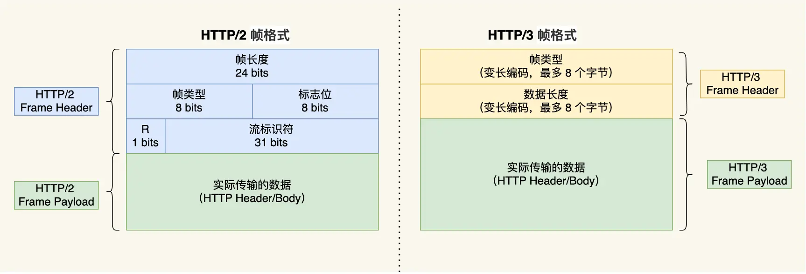
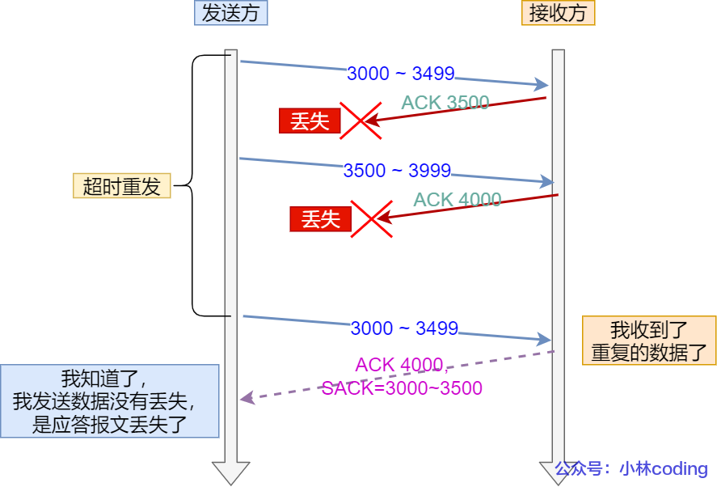

# 计算机网络

## 基础篇

### TCP / IP 网络模型有哪几层？

#### 应用层

最上层的，也是我们能直接接触到的就是应用层（Application Layer），我们电脑或手机使用的应用软件都是在应用层实现。那么，当两个不同设备的应用需要通信的时候，应用就把应用数据传给下一层，也就是传输层。

所以，应用层只需要专注于为用户提供应用功能，比如 HTTP、FTP、Telnet、DNS、SMTP等。

应用层是不用去关心数据是如何传输的，就类似于，我们寄快递的时候，只需要把包裹交给快递员，由他负责运输快递，我们不需要关心快递是如何被运输的。

而且应用层是工作在操作系统中的用户态，传输层及以下则工作在内核态。

#### 传输层

应用层的数据包会传给传输层，传输层（Transport Layer）是为应用层提供网络支持的。

在传输层会有两个传输协议，分别是 TCP 和 UDP。

TCP 的全称叫传输控制协议（Transmission Control Protocol），大部分应用使用的正是 TCP 传输层协议，比如 HTTP 应用层协议。TCP 相比 UDP 多了很多特性，比如流量控制、超时重传、拥塞控制等，这些都是为了保证数据包能可靠地传输给对方。

UDP 相对来说就很简单，简单到只负责发送数据包，不保证数据包是否能抵达对方，但它实时性相对更好，传输效率也高。当然，UDP 也可以实现可靠传输，把 TCP 的特性在应用层上实现就可以，不过要实现一个商用的可靠 UDP 传输协议，也不是一件简单的事情。

应用需要传输的数据可能会非常大，如果直接传输就不好控制，因此当传输层的数据包大小超过 MSS（TCP 最大报文段长度） ，就要将数据包分块，这样即使中途有一个分块丢失或损坏了，只需要重新发送这一个分块，而不用重新发送整个数据包。在 TCP 协议中，我们把每个分块称为一个 TCP 段（TCP Segment）。

当设备作为接收方时，传输层则要负责把数据包传给应用，但是一台设备上可能会有很多应用在接收或者传输数据，因此需要用一个编号将应用区分开来，这个编号就是端口。

比如 80 端口通常是 Web 服务器用的，22 端口通常是远程登录服务器用的。而对于浏览器（客户端）中的每个标签栏都是一个独立的进程，操作系统会为这些进程分配临时的端口号。

由于传输层的报文中会携带端口号，因此接收方可以识别出该报文是发送给哪个应用。

#### 网络层

传输层可能大家刚接触的时候，会认为它负责将数据从一个设备传输到另一个设备，事实上它并不负责。

实际场景中的网络环节是错综复杂的，中间有各种各样的线路和分叉路口，如果一个设备的数据要传输给另一个设备，就需要在各种各样的路径和节点进行选择，而传输层的设计理念是简单、高效、专注，如果传输层还负责这一块功能就有点违背设计原则了。

网络层最常使用的是 IP 协议（Internet Protocol），IP 协议会将传输层的报文作为数据部分，再加上 IP 包头组装成 IP 报文，如果 IP 报文大小超过 MTU（以太网中一般为 1500 字节）就会再次进行分片，得到一个即将发送到网络的 IP 报文。


网络层负责将数据从一个设备传输到另一个设备，世界上那么多设备，又该如何找到对方呢？因此，网络层需要有区分设备的编号。

我们一般用 IP 地址给设备进行编号，对于 IPv4 协议， IP 地址共 32 位，分成了四段（比如，192.168.100.1），每段是 8 位。只有一个单纯的 IP 地址虽然做到了区分设备，但是寻址起来就特别麻烦，全世界那么多台设备，难道一个一个去匹配？这显然不科学。

因此，需要将 IP 地址分成两种意义：

- 一个是网络号，负责标识该 IP 地址是属于哪个「子网」的；
- 一个是主机号，负责标识同一「子网」下的不同主机；

怎么分的呢？这需要配合子网掩码才能算出 IP 地址 的网络号和主机号。

举个例子，比如`10.100.122.0/24`，后面的`/24`表示就是`255.255.255.0`子网掩码，`255.255.255.0`二进制是`「11111111-11111111-11111111-00000000」`，大家数数一共多少个 1？不用数了，是 24 个 1，为了简化子网掩码的表示，用`/24`代替`255.255.255.0`。

知道了子网掩码，该怎么计算出网络地址和主机地址呢？将`10.100.122.2`和` 255.255.255.0`进行按位与运算，就可以得到网络号，如下图：


将 255.255.255.0 取反后与IP地址进行进行按位与运算，就可以得到主机号。

那么在寻址的过程中，先匹配到相同的网络号（表示要找到同一个子网），才会去找对应的主机。

除了寻址能力， IP 协议还有另一个重要的能力就是路由。实际场景中，两台设备并不是用一条网线连接起来的，而是通过很多网关、路由器、交换机等众多网络设备连接起来的，那么就会形成很多条网络的路径，因此当数据包到达一个网络节点，就需要通过路由算法决定下一步走哪条路径。

路由器寻址工作中，就是要找到目标地址的子网，找到后进而把数据包转发给对应的网络内。

所以，IP 协议的寻址作用是告诉我们去往下一个目的地该朝哪个方向走，路由则是根据「下一个目的地」选择路径。寻址更像在导航，路由更像在操作方向盘。

#### 网络接口层

生成了 IP 头部之后，接下来要交给网络接口层（Link Layer）在 IP 头部的前面加上 MAC 头部，并封装成数据帧（Data frame）发送到网络上。

IP 头部中的接收方 IP 地址表示网络包的目的地，通过这个地址我们就可以判断要将包发到哪里，但在以太网的世界中，这个思路是行不通的。

什么是以太网呢？电脑上的以太网接口，Wi-Fi接口，以太网交换机、路由器上的千兆，万兆以太网口，还有网线，它们都是以太网的组成部分。以太网就是一种在「局域网」内，把附近的设备连接起来，使它们之间可以进行通讯的技术。

以太网在判断网络包目的地时和 IP 的方式不同，因此必须采用相匹配的方式才能在以太网中将包发往目的地，而 MAC 头部就是干这个用的，所以，在以太网进行通讯要用到 MAC 地址。

所以说，网络接口层主要为网络层提供「链路级别」传输的服务，负责在以太网、WiFi 这样的底层网络上发送原始数据包，工作在网卡这个层次，使用 MAC 地址来标识网络上的设备。

### 键入网址到网页显示，期间发生了什么？

#### 孤单小弟 —— HTTP

浏览器做的第一步工作是解析 URL，从而生成发送给 Web 服务器的请求信息。

对 URL 进行解析之后，浏览器确定了 Web 服务器和文件名，接下来就是根据这些信息来生成 HTTP 请求消息了。


#### 真实地址查询 —— DNS

通过浏览器解析 URL 并生成 HTTP 消息后，需要委托操作系统将消息发送给 Web 服务器。

但在发送之前，还有一项工作需要完成，那就是查询服务器域名对应的 IP 地址，因为委托操作系统发送消息时，必须提供通信对象的 IP 地址。

所以，有一种服务器就专门保存了 Web 服务器域名与 IP 的对应关系，它就是 DNS 服务器。

DNS 中的域名都是用句点来分隔的，比如`www.server.com`，这里的句点代表了不同层次之间的界限。在域名中，越靠右的位置表示其层级越高。

实际上域名最后还有一个点，比如`www.server.com.`，这个最后的一个点代表根域名。也就是，`.`根域是在最顶层，它的下一层就是`.com`顶级域，再下面是`server.com`。

根域的 DNS 服务器信息保存在互联网中所有的 DNS 服务器中。这样一来，任何 DNS 服务器就都可以找到并访问根域 DNS 服务器了。因此，客户端只要能够找到任意一台 DNS 服务器，就可以通过它找到根域 DNS 服务器，然后再一路顺藤摸瓜找到位于下层的某台目标 DNS 服务器。

域名解析的工作流程如下：

1. 客户端首先会发出一个 DNS 请求，问`www.server.com`的 IP 是啥，并发给本地 DNS 服务器（也就是客户端的 TCP / IP 设置中填写的 DNS 服务器地址）。
2. 本地域名服务器收到客户端的请求后，如果缓存里的表格能找到`www.server.com`，则它直接返回 IP 地址。如果没有，本地 DNS 会去问它的根域名服务器：“老大， 能告诉我`www.server.com`的 IP 地址吗？” 根域名服务器是最高层次的，它不直接用于域名解析，但能指明一条道路。
3. 根 DNS 收到来自本地 DNS 的请求后，发现后置是 .com，说：“`www.server.com`这个域名归`.com`区域管理”，我给你`.com`顶级域名服务器地址给你，你去问问它吧。”
4. 本地 DNS 收到顶级域名服务器的地址后，发起请求问“老二， 你能告诉我`www.server.com`的 IP 地址吗？”
5. 顶级域名服务器说：“我给你负责`www.server.com`区域的权威 DNS 服务器的地址，你去问它应该能问到”。
6. 本地 DNS 于是转向问权威 DNS 服务器：“老三，`www.server.com`对应的IP是啥呀？” `server.com`的权威 DNS 服务器，它是域名解析结果的原出处。为啥叫权威呢？就是我的域名我做主。
7. 权威 DNS 服务器查询后将对应的 IP 地址 X.X.X.X 告诉本地 DNS。
8. 本地 DNS 再将 IP 地址返回客户端，客户端和目标建立连接。

那是不是每次解析域名都要经过那么多的步骤呢？

当然不是了，还有缓存这个东西的嘛。浏览器会先看自身有没有对这个域名的缓存，如果有，就直接返回，如果没有，就去问操作系统，操作系统也会去看自己的缓存，如果有，就直接返回，如果没有，再去 hosts 文件看，也没有，才会去问「本地 DNS 服务器」。

#### 指南好帮手 —— 协议栈

通过 DNS 获取到 IP 后，就可以把 HTTP 的传输工作交给操作系统中的协议栈。

协议栈的内部分为几个部分，分别承担不同的工作。上下关系是有一定的规则的，上面的部分会向下面的部分委托工作，下面的部分收到委托的工作并执行。


应用程序（浏览器）通过调用 Socket 库，来委托协议栈工作。协议栈的上半部分有两块，分别是负责收发数据的 TCP 和 UDP 协议，这两个传输协议会接受应用层的委托执行收发数据的操作。

协议栈的下面一半是用 IP 协议控制网络包收发操作，在互联网上传数据时，数据会被切分成一块块的网络包，而将网络包发送给对方的操作就是由 IP 负责的。

此外 IP 中还包括 ICMP 协议和 ARP 协议。

- ICMP 用于告知网络包传送过程中产生的错误以及各种控制信息。
- ARP 用于根据 IP 地址查询相应的以太网 MAC 地址。

IP 下面的网卡驱动程序负责控制网卡硬件，而最下面的网卡则负责完成实际的收发操作，也就是对网线中的信号执行发送和接收操作。

#### 可靠传输 —— TCP


首先，源端口号和目标端口号是不可少的，如果没有这两个端口号，数据就不知道应该发给哪个应用。

接下来有包的序号，这个是为了解决包乱序的问题。还有应该有的是确认号，目的是确认发出去对方是否有收到。如果没有收到就应该重新发送，直到送达，这个是为了解决丢包的问题。

接下来还有一些状态位。例如 SYN 是发起一个连接，ACK 是回复，RST 是重新连接，FIN 是结束连接等。TCP 是面向连接的，因而双方要维护连接的状态，这些带状态位的包的发送，会引起双方的状态变更。

还有一个重要的就是窗口大小。TCP 要做流量控制，通信双方各声明一个窗口（缓存大小），标识自己当前能够的处理能力，别发送的太快，撑死我，也别发的太慢，饿死我。

除了做流量控制以外，TCP还会做拥塞控制，对于真正的通路堵车不堵车，它无能为力，唯一能做的就是控制自己，也即控制发送的速度。不能改变世界，就改变自己嘛。

在 HTTP 传输数据之前，首先需要 TCP 建立连接，TCP 连接的建立，通常称为三次握手。

这个所谓的「连接」，只是双方计算机里维护一个状态机，在连接建立的过程中，双方的状态变化时序图就像这样：


- 一开始，客户端和服务端都处于 CLOSED 状态。先是服务端主动监听某个端口，处于 LISTEN 状态。
- 然后客户端主动发起连接 SYN，之后处于 SYN-SENT 状态。
- 服务端收到发起的连接，返回 SYN，并且 ACK 客户端的 SYN，之后处于 SYN-RCVD 状态。
- 客户端收到服务端发送的 SYN 和 ACK 之后，发送对 SYN 确认的 ACK，之后处于 ESTABLISHED 状态，因为它一发一收成功了。
- 服务端收到 ACK 的 ACK 之后，处于 ESTABLISHED 状态，因为它也一发一收了。

所以三次握手目的是保证双方都有发送和接收的能力。

TCP 的连接状态查看，在 Linux 可以通过`netstat -napt`命令查看。


如果 HTTP 请求消息比较长，超过了 MSS 的长度，这时 TCP 就需要把 HTTP 的数据拆解成一块块的数据发送，而不是一次性发送所有数据。

数据会被以 MSS 的长度为单位进行拆分，拆分出来的每一块数据都会被放进单独的网络包中。也就是在每个被拆分的数据加上 TCP 头信息，然后交给 IP 模块来发送数据。

- MTU：一个网络包的最大长度，以太网中一般为 1500 字节。
- MSS：除去 IP 和 TCP 头部之后，一个网络包所能容纳的 TCP 数据的最大长度。

TCP 协议里面会有两个端口，一个是浏览器监听的端口（通常是随机生成的），一个是 Web 服务器监听的端口（HTTP 默认端口号是 80， HTTPS 默认端口号是 443）。

在双方建立了连接后，TCP 报文中的数据部分就是存放 HTTP 头部 + 数据，组装好 TCP 报文之后，就需交给下面的网络层处理。

#### 远程定位 —— IP

TCP 模块在执行连接、收发、断开等各阶段操作时，都需要委托 IP 模块将数据封装成网络包发送给通信对象。


在 IP 协议里面需要有源地址 IP 和 目标地址 IP：

- 源地址IP，即是客户端输出的 IP 地址；
- 目标地址，即通过 DNS 域名解析得到的 Web 服务器 IP。

假设客户端有多个网卡，就会有多个 IP 地址，那 IP 头部的源地址应该选择哪个 IP 呢？

当存在多个网卡时，在填写源地址 IP 时，就需要判断到底应该填写哪个地址。这个判断相当于在多块网卡中判断应该使用哪个一块网卡来发送包。

这个时候就需要根据路由表规则，来判断哪一个网卡作为源地址 IP。

在 Linux 操作系统，我们可以使用`route -n`命令查看当前系统的路由表。


假设 Web 服务器的目标地址是 192.168.10.200，首先先和第一条目的子网掩码（Genmask）进行与运算，得到结果为 192.168.10.0，但是第一个条目的 Destination 是 192.168.3.0，两者不一致所以匹配失败。再与第二条目的子网掩码进行 与运算，得到的结果为 192.168.10.0，与第二条目的 Destination 192.168.10.0 匹配成功，所以将使用 eth1 网卡的 IP 地址作为 IP 包头的源地址。

那么假设 Web 服务器的目标地址是 10.100.20.100，那么依然依照上面的路由表规则判断，判断后的结果是和第三条目匹配。第三条目比较特殊，它目标地址和子网掩码都是 0.0.0.0，这表示默认网关，如果其他所有条目都无法匹配，就会自动匹配这一行。并且后续就把包发给路由器，Gateway 即是路由器的 IP 地址。

#### 两点传输 —— MAC


在 MAC 包头里需要发送方 MAC 地址和接收方目标 MAC 地址，用于两点之间的传输。

一般在 TCP/IP 通信里，MAC 包头的协议类型只使用：

- 0800 ： IP 协议
- 0806 ： ARP 协议

MAC 发送方和接收方如何确认?

发送方的 MAC 地址获取就比较简单了，MAC 地址是在网卡生产时写入到 ROM 里的，只要将这个值读取出来写入到 MAC 头部就可以了。

接收方的 MAC 地址就有点复杂了，只要告诉以太网对方的 MAC 的地址，以太网就会帮我们把包发送过去，那么很显然这里应该填写对方的 MAC 地址。

所以先得搞清楚应该把包发给谁，这个只要查一下路由表就知道了。在路由表中找到相匹配的条目，然后把包发给 Gateway 列中的 IP 地址就可以了。

既然知道要发给谁，按如何获取对方的 MAC 地址呢？此时就需要 ARP 协议帮我们找到路由器的 MAC 地址。ARP 协议会在以太网中以广播的形式，对以太网所有的设备喊出：“这个 IP 地址是谁的？请把你的 MAC 地址告诉我”。然后就会有人回答：“这个 IP 地址是我的，我的 MAC 地址是 XXXX”。

如果对方和自己处于同一个子网中，那么通过上面的操作就可以得到对方的 MAC 地址。然后，我们将这个 MAC 地址写入 MAC 头部，MAC 头部就完成了。在后续操作系统会把本次查询结果放到一块叫做 ARP 缓存的内存空间留着以后用，不过缓存的时间就几分钟。

也就是说，在发包时：

- 先查询 ARP 缓存，如果其中已经保存了对方的 MAC 地址，就不需要发送 ARP 查询，直接使用 ARP 缓存中的地址。
- 而当 ARP 缓存中不存在对方 MAC 地址时，则发送 ARP 广播查询。

在 Linux 系统中，我们可以使用`arp -a`命令来查看 ARP 缓存的内容。

#### 出口 —— 网卡

网络包只是存放在内存中的一串二进制数字信息，没有办法直接发送给对方。因此，我们需要将数字信息转换为电信号，才能在网线上传输，也就是说，这才是真正的数据发送过程。

负责执行这一操作的是网卡，要控制网卡还需要靠网卡驱动程序。

网卡驱动获取网络包之后，会将其复制到网卡内的缓存区中，接着会在其开头加上报头和起始帧分界符，在末尾加上用于检测错误的帧校验序列。

- 起始帧分界符是一个用来表示包起始位置的标记
- 末尾的 FCS（帧校验序列）用来检查包传输过程是否有损坏

最后网卡会将包转为电信号，通过网线发送出去。

#### 送别者 —— 交换机

交换机的设计是将网络包原样转发到目的地。交换机工作在 MAC 层，也称为二层网络设备。

首先，电信号到达网线接口，交换机里的模块进行接收，接下来交换机里的模块将电信号转换为数字信号。然后通过包末尾的 FCS 校验错误，如果没问题则放到缓冲区。这部分操作基本和计算机的网卡相同，但交换机的工作方式和网卡不同。

计算机的网卡本身具有 MAC 地址，并通过核对收到的包的接收方 MAC 地址判断是不是发给自己的，如果不是发给自己的则丢弃；相对地，交换机的端口不核对接收方 MAC 地址，而是直接接收所有的包并存放到缓冲区中。因此，和网卡不同，交换机的端口不具有 MAC 地址。

将包存入缓冲区后，接下来需要查询一下这个包的接收方 MAC 地址是否已经在 MAC 地址表中有记录了。

交换机的 MAC 地址表主要包含两个信息：

- 一个是设备的 MAC 地址，
- 另一个是该设备连接在交换机的哪个端口上。

所以，交换机根据 MAC 地址表查找 MAC 地址，然后将信号发送到相应的端口。

当 MAC 地址表找不到指定的 MAC 地址会怎么样？

地址表中找不到指定的 MAC 地址。这可能是因为具有该地址的设备还没有向交换机发送过包，或者这个设备一段时间没有工作导致地址被从地址表中删除了。

这种情况下，交换机无法判断应该把包转发到哪个端口，只能将包转发到除了源端口之外的所有端口上，无论该设备连接在哪个端口上都能收到这个包。

这样做不会产生什么问题，因为以太网的设计本来就是将包发送到整个网络的，然后只有相应的接收者才接收包，而其他设备则会忽略这个包。

有人会说：“这样做会发送多余的包，会不会造成网络拥塞呢？”

其实完全不用过于担心，因为发送了包之后目标设备会作出响应，只要返回了响应包，交换机就可以将它的地址写入 MAC 地址表，下次也就不需要把包发到所有端口了。

局域网中每秒可以传输上千个包，多出一两个包并无大碍。

此外，如果接收方 MAC 地址是一个广播地址，那么交换机会将包发送到除源端口之外的所有端口。

以下两个属于广播地址：

- MAC 地址中的 FF:FF:FF:FF:FF:FF
- IP 地址中的 255.255.255.255

#### 出境大门 —— 路由器

网络包经过交换机之后，现在到达了路由器，并在此被转发到下一个路由器或目标设备。这一步转发的工作原理和交换机类似，也是通过查表判断包转发的目标。

不过在具体的操作过程上，路由器和交换机是有区别的。

- 因为路由器是基于 IP 设计的，俗称三层网络设备，路由器的各个端口都具有 MAC 地址和 IP 地址；
- 而交换机是基于以太网设计的，俗称二层网络设备，交换机的端口不具有 MAC 地址。

路由器的端口具有 MAC 地址，因此它就能够成为以太网的发送方和接收方；同时还具有 IP 地址，从这个意义上来说，它和计算机的网卡是一样的。

当转发包时，首先路由器端口会接收发给自己的以太网包，然后路由表查询转发目标，再由相应的端口作为发送方将以太网包发送出去。

首先，电信号到达网线接口部分，路由器中的模块会将电信号转成数字信号，然后通过包末尾的 FCS 进行错误校验。

如果没问题则检查 MAC 头部中的接收方 MAC 地址，看看是不是发给自己的包，如果是就放到接收缓冲区中，否则就丢弃这个包。

总的来说，路由器的端口都具有 MAC 地址，只接收与自身地址匹配的包，遇到不匹配的包则直接丢弃。

完成包接收操作之后，路由器就会去掉包开头的 MAC 头部。

MAC 头部的作用就是将包送达路由器，其中的接收方 MAC 地址就是路由器端口的 MAC 地址。因此，当包到达路由器之后，MAC 头部的任务就完成了，于是 MAC 头部就会被丢弃。

接下来，路由器会根据 MAC 头部后方的 IP 头部中的内容进行包的转发操作。

转发操作分为几个阶段，首先是查询路由表判断转发目标。


假设地址为 10.10.1.101 的计算机要向地址为 192.168.1.100 的服务器发送一个包，这个包先到达图中的路由器。判断转发目标的第一步，就是根据包的接收方 IP 地址查询路由表中的目标地址栏，以找到相匹配的记录。每个条目的子网掩码和 192.168.1.100 IP 做 & 与运算后，得到的结果与对应条目的目标地址进行匹配，如果匹配就会作为候选转发目标，如果不匹配就继续与下个条目进行路由匹配。

如第二条目的子网掩码 255.255.255.0 与 192.168.1.100 IP 做 & 与运算后，得到结果是 192.168.1.0 ，这与第二条目的目标地址 192.168.1.0 匹配，该第二条目记录就会被作为转发目标。

实在找不到匹配路由时，就会选择默认路由，路由表中子网掩码为 0.0.0.0 的记录表示「默认路由」。

接下来就会进入包的发送操作。

首先，我们需要根据路由表的网关列判断对方的地址。

- 如果网关是一个 IP 地址，则这个IP 地址就是我们要转发到的目标地址，还未抵达终点，还需继续需要路由器转发。
- 如果网关为空，则 IP 头部中的接收方 IP 地址就是要转发到的目标地址，也是就终于找到 IP 包头里的目标地址了，说明已抵达终点。

知道对方的 IP 地址之后，接下来需要通过 ARP 协议根据 IP 地址查询 MAC 地址，并将查询的结果作为接收方 MAC 地址。路由器也有 ARP 缓存，因此首先会在 ARP 缓存中查询，如果找不到则发送 ARP 查询请求。

接下来是发送方 MAC 地址字段，这里填写输出端口的 MAC 地址。还有一个以太类型字段，填写 0800 （十六进制）表示 IP 协议。

网络包完成后，接下来会将其转换成电信号并通过端口发送出去。这一步的工作过程和计算机也是相同的。

发送出去的网络包会通过交换机到达下一个路由器。由于接收方 MAC 地址就是下一个路由器的地址，所以交换机会根据这一地址将包传输到下一个路由器。接下来，下一个路由器会将包转发给再下一个路由器，经过层层转发之后，网络包就到达了最终的目的地。在网络包传输的过程中，源 IP 和目标 IP 始终是不会变的，一直变化的是 MAC 地址，因为需要 MAC 地址在以太网内进行两个设备之间的包传输。

#### 互相扒皮 —— 服务器 与 客户端

数据包抵达服务器后，服务器会先扒开数据包的 MAC 头部，查看是否和服务器自己的 MAC 地址符合，符合就将包收起来。

接着继续扒开数据包的 IP 头，发现 IP 地址符合，根据 IP 头中协议项，知道自己上层是 TCP 协议。

于是，扒开 TCP 的头，里面有序列号，需要看一看这个序列包是不是我想要的，如果是就放入缓存中然后返回一个 ACK，如果不是就丢弃。TCP 头部里面还有端口号， HTTP 的服务器正在监听这个端口号。

于是，服务器自然就知道是 HTTP 进程想要这个包，于是就将包发给 HTTP 进程。

服务器的 HTTP 进程看到，原来这个请求是要访问一个页面，于是就把这个网页封装在 HTTP 响应报文里。

HTTP 响应报文也需要穿上 TCP、IP、MAC 头部，不过这次是源地址是服务器 IP 地址，目的地址是客户端 IP 地址。

穿好头部衣服后，从网卡出去，交由交换机转发到出城的路由器，路由器就把响应数据包发到了下一个路由器，就这样跳啊跳。

最后跳到了客户端的城门把守的路由器，路由器扒开 IP 头部发现是要找城内的人，于是又把包发给了城内的交换机，再由交换机转发到客户端。

客户端收到了服务器的响应数据包后，同样也非常的高兴，客户能拆快递了！

于是，客户端开始扒皮，把收到的数据包的皮扒剩 HTTP 响应报文后，交给浏览器去渲染页面，一份特别的数据包快递，就这样显示出来了！

最后，客户端要离开了，向服务器发起了 TCP 四次挥手，至此双方的连接就断开了。

### Linux 系统是如何收发网络包的？

#### 网络模型

为了使得多种设备能通过网络相互通信，和为了解决各种不同设备在网络互联中的兼容性问题，国际标准化组织制定了开放式系统互联通信参考模型（Open System Interconnection Reference Model），也就是 OSI 网络模型，该模型主要有 7 层，分别是应用层、表示层、会话层、传输层、网络层、数据链路层以及物理层。

每一层负责的职能都不同，如下：

- 应用层，负责给应用程序提供统一的接口；
- 表示层，负责把数据转换成兼容另一个系统能识别的格式；
- 会话层，负责建立、管理和终止表示层实体之间的通信会话；
- 传输层，负责端到端的数据传输；
- 网络层，负责数据的路由、转发、分片；
- 数据链路层，负责数据的封帧和差错检测，以及 MAC 寻址；
- 物理层，负责在物理网络中传输数据帧；

由于 OSI 模型实在太复杂，提出的也只是概念理论上的分层，并没有提供具体的实现方案。

事实上，我们比较常见，也比较实用的是四层模型，即 TCP/IP 网络模型，Linux 系统正是按照这套网络模型来实现网络协议栈的。

TCP/IP 网络模型共有 4 层，分别是应用层、传输层、网络层和网络接口层，每一层负责的职能如下：

- 应用层，负责向用户提供一组应用程序，比如 HTTP、DNS、FTP 等;
- 传输层，负责端到端的通信，比如 TCP、UDP 等；
- 网络层，负责网络包的封装、分片、路由、转发，比如 IP、ICMP 等；
- 网络接口层，负责网络包在物理网络中的传输，比如网络包的封帧、 MAC 寻址、差错检测，以及通过网卡传输网络帧等；

#### Linux 网络协议栈

从下面这张图可以看到，应用层数据在每一层的封装格式。


- 传输层，给应用数据前面增加了 TCP 头；
- 网络层，给 TCP 数据包前面增加了 IP 头；
- 网络接口层，给 IP 数据包前后分别增加了帧头和帧尾；

这些新增的头部和尾部，都有各自的作用，也都是按照特定的协议格式填充，这每一层都增加了各自的协议头，那自然网络包的大小就增大了，但物理链路并不能传输任意大小的数据包，所以在以太网中，规定了最大传输单元（MTU）是 1500 字节，也就是规定了单次传输的最大 IP 包大小。

当网络包超过 MTU 的大小，就会在网络层分片，以确保分片后的 IP 包不会超过 MTU 大小，如果 MTU 越小，需要的分包就越多，那么网络吞吐能力就越差，相反的，如果 MTU 越大，需要的分包就越少，那么网络吞吐能力就越好。


从上图的的网络协议栈，你可以看到：

- 应用程序需要通过系统调用，来跟 Socket 层进行数据交互；
- Socket 层的下面就是传输层、网络层和网络接口层；
- 最下面的一层，则是网卡驱动程序和硬件网卡设备；

#### Linux 接收网络包的流程

网卡是计算机里的一个硬件，专门负责接收和发送网络包，当网卡接收到一个网络包后，会通过 DMA 技术，将网络包写入到指定的内存地址，也就是写入到 Ring Buffer ，这个是一个环形缓冲区，接着就会告诉操作系统这个网络包已经到达。

那应该怎么告诉操作系统这个网络包已经到达了呢？

最简单的一种方式就是触发中断，也就是每当网卡收到一个网络包，就触发一个中断告诉操作系统。

但是，这存在一个问题，在高性能网络场景下，网络包的数量会非常多，那么就会触发非常多的中断，要知道当 CPU 收到了中断，就会停下手里的事情，而去处理这些网络包，处理完毕后，才会回去继续其他事情，那么频繁地触发中断，则会导致 CPU 一直没完没了的处理中断，而导致其他任务可能无法继续前进，从而影响系统的整体效率。

所以为了解决频繁中断带来的性能开销，Linux 内核在 2.6 版本中引入了 NAPI 机制，它是混合「中断和轮询」的方式来接收网络包，它的核心概念就是不采用中断的方式读取数据，而是首先采用中断唤醒数据接收的服务程序，然后 poll 的方法来轮询数据。

因此，当有网络包到达时，会通过 DMA 技术，将网络包写入到指定的内存地址，接着网卡向 CPU 发起硬件中断，当 CPU 收到硬件中断请求后，根据中断表，调用已经注册的中断处理函数。

硬件中断处理函数会做如下的事情：

- 需要先「暂时屏蔽中断」，表示已经知道内存中有数据了，告诉网卡下次再收到数据包直接写内存就可以了，不要再通知 CPU 了，这样可以提高效率，避免 CPU 不停的被中断。
- 接着，发起「软中断」，然后恢复刚才屏蔽的中断。

至此，硬件中断处理函数的工作就已经完成。

硬件中断处理函数做的事情很少，主要耗时的工作都交给软中断处理函数了。

内核中的`ksoftirqd`线程专门负责软中断的处理，当`ksoftirqd`内核线程收到软中断后，就会来轮询处理数据。

`ksoftirqd`线程会从 Ring Buffer 中获取一个数据帧，用 sk_buff 表示，从而可以作为一个网络包交给网络协议栈进行逐层处理。

首先，会先进入到网络接口层，在这一层会检查报文的合法性，如果不合法则丢弃，合法则会找出该网络包的上层协议的类型，比如是 IPv4，还是 IPv6，接着再去掉帧头和帧尾，然后交给网络层。

到了网络层，则取出 IP 包，判断网络包下一步的走向，比如是交给上层处理还是转发出去。当确认这个网络包要发送给本机后，就会从 IP 头里看看上一层协议的类型是 TCP 还是 UDP，接着去掉 IP 头，然后交给传输层。

传输层取出 TCP 头或 UDP 头，根据四元组「源 IP、源端口、目的 IP、目的端口」 作为标识，找出对应的 Socket，并把数据放到 Socket 的接收缓冲区。

最后，应用层程序调用 Socket 接口，将内核的 Socket 接收缓冲区的数据「拷贝」到应用层的缓冲区，然后唤醒用户进程。

#### Linux 发送网络包的流程

首先，应用程序会调用 Socket 发送数据包的接口，由于这个是系统调用，所以会从用户态陷入到内核态中的 Socket 层，内核会申请一个内核态的 sk_buff 内存，将用户待发送的数据拷贝到 sk_buff 内存，并将其加入到发送缓冲区。

接下来，网络协议栈从 Socket 发送缓冲区中取出 sk_buff，并按照 TCP/IP 协议栈从上到下逐层处理。

如果使用的是 TCP 传输协议发送数据，那么先拷贝一个新的 sk_buff 副本 ，这是因为 sk_buff 后续在调用网络层，最后到达网卡发送完成的时候，这个 sk_buff 会被释放掉。而 TCP 协议是支持丢失重传的，在收到对方的 ACK 之前，这个 sk_buff 不能被删除。所以内核的做法就是每次调用网卡发送的时候，实际上传递出去的是 sk_buff 的一个拷贝，等收到 ACK 再真正删除。

接着，对 sk_buff 填充 TCP 头。这里提一下，sk_buff 可以表示各个层的数据包，在应用层数据包叫 data，在 TCP 层我们称为 segment，在 IP 层我们叫 packet，在数据链路层称为 frame。

为什么全部数据包只用一个结构体来描述呢？协议栈采用的是分层结构，上层向下层传递数据时需要增加包头，下层向上层数据时又需要去掉包头，如果每一层都用一个结构体，那在层之间传递数据的时候，就要发生多次拷贝，这将大大降低 CPU 效率。

于是，为了在层级之间传递数据时，不发生拷贝，只用 sk_buff 一个结构体来描述所有的网络包，那它是如何做到的呢？是通过调整 sk_buff 中 data 的指针，比如：

- 当接收报文时，从网卡驱动开始，通过协议栈层层往上传送数据报，通过增加 skb->data 的值，来逐步剥离协议首部。
- 当要发送报文时，创建 sk_buff 结构体，数据缓存区的头部预留足够的空间，用来填充各层首部，在经过各下层协议时，通过减少 skb->data 的值来增加协议首部。

至此，传输层的工作也就都完成了。

然后交给网络层，在网络层里会做这些工作：选取路由（确认下一跳的 IP）、填充 IP 头、netfilter 过滤、对超过 MTU 大小的数据包进行分片。处理完这些工作后会交给网络接口层处理。

网络接口层会通过 ARP 协议获得下一跳的 MAC 地址，然后对 sk_buff 填充帧头和帧尾，接着将 sk_buff 放到网卡的发送队列中。

这一些工作准备好后，会触发「软中断」告诉网卡驱动程序，这里有新的网络包需要发送，驱动程序会从发送队列中读取 sk_buff，将这个 sk_buff 挂到 RingBuffer 中，接着将 sk_buff 数据映射到网卡可访问的内存 DMA 区域，最后触发真实的发送。

当数据发送完成以后，其实工作并没有结束，因为内存还没有清理。当发送完成的时候，网卡设备会触发一个硬中断来释放内存，主要是释放 sk_buff 内存和清理 RingBuffer 内存。

最后，当收到这个 TCP 报文的 ACK 应答时，传输层就会释放原始的 sk_buff 。

发送网络数据的时候，涉及几次内存拷贝操作？

第一次，调用发送数据的系统调用的时候，内核会申请一个内核态的 sk_buff 内存，将用户待发送的数据拷贝到 sk_buff 内存，并将其加入到发送缓冲区。

第二次，在使用 TCP 传输协议的情况下，从传输层进入网络层的时候，每一个 sk_buff 都会被克隆一个新的副本出来。副本 sk_buff 会被送往网络层，等它发送完的时候就会释放掉，然后原始的 sk_buff 还保留在传输层，目的是为了实现 TCP 的可靠传输，等收到这个数据包的 ACK 时，才会释放原始的 sk_buff 。

第三次，当 IP 层发现 sk_buff 大于 MTU 时才需要进行。会再申请额外的 sk_buff，并将原来的 sk_buff 拷贝为多个小的 sk_buff。

## HTTP 篇

### HTTP 常见面试题

#### HTTP 基本概念

HTTP 是什么？HTTP 是超文本传输协议，也就是HyperText Transfer Protocol。

1. 协议

HTTP 是一个用在计算机世界里的协议。它使用计算机能够理解的语言确立了一种计算机之间交流通信的规范（两个以上的参与者），以及相关的各种控制和错误处理方式（行为约定和规范）。

2. 传输

所谓的「传输」，很好理解，就是把一堆东西从 A 点搬到 B 点，或者从 B 点 搬到 A 点。HTTP 协议是一个双向协议。数据虽然是在 A 和 B 之间传输，但允许中间有中转或接力。HTTP 是一个在计算机世界里专门用来在两点之间传输数据的约定和规范。

3. 超文本

HTTP 传输的内容是「超文本」。「超文本」，它就是超越了普通文本的文本，它是文字、图片、视频等的混合体，最关键有超链接，能从一个超文本跳转到另外一个超文本。

HTTP 是一个在计算机世界里专门在「两点」之间「传输」文字、图片、音频、视频等「超文本」数据的「约定和规范」。

#### HTTP 常见的状态码有哪些？

1xx 类状态码属于提示信息，是协议处理中的一种中间状态，实际用到的比较少。

2xx 类状态码表示服务器成功处理了客户端的请求，也是我们最愿意看到的状态。

- 「200 OK」是最常见的成功状态码，表示一切正常。如果是非 HEAD 请求，服务器返回的响应头都会有 body 数据。
- 「204 No Content」也是常见的成功状态码，与 200 OK 基本相同，但响应头没有 body 数据。
- 「206 Partial Content」是应用于 HTTP 分块下载或断点续传，表示响应返回的 body 数据并不是资源的全部，而是其中的一部分，也是服务器处理成功的状态。

3xx 类状态码表示客户端请求的资源发生了变动，需要客户端用新的 URL 重新发送请求获取资源，也就是重定向。

- 「301 Moved Permanently」表示永久重定向，说明请求的资源已经不存在了，需改用新的 URL 再次访问。
- 「302 Found」表示临时重定向，说明请求的资源还在，但暂时需要用另一个 URL 来访问。

301 和 302 都会在响应头里使用字段 Location，指明后续要跳转的 URL，浏览器会自动重定向新的 URL。

- 「304 Not Modified」不具有跳转的含义，表示资源未修改，重定向已存在的缓冲文件，也称缓存重定向，也就是告诉客户端可以继续使用缓存资源，用于缓存控制。

4xx 类状态码表示客户端发送的报文有误，服务器无法处理，也就是错误码的含义。

- 「400 Bad Request」表示客户端请求的报文有错误，但只是个笼统的错误。
- 「403 Forbidden」表示服务器禁止访问资源，并不是客户端的请求出错。
- 「404 Not Found」表示请求的资源在服务器上不存在或未找到，所以无法提供给客户端。

5xx 类状态码表示客户端请求报文正确，但是服务器处理时内部发生了错误，属于服务器端的错误码。

- 「500 Internal Server Error」与 400 类型，是个笼统通用的错误码，服务器发生了什么错误，我们并不知道。
- 「501 Not Implemented」表示客户端请求的功能还不支持，类似“即将开业，敬请期待”的意思。
- 「502 Bad Gateway」通常是服务器作为网关或代理时返回的错误码，表示服务器自身工作正常，访问后端服务器发生了错误。
- 「503 Service Unavailable」表示服务器当前很忙，暂时无法响应客户端，类似“网络服务正忙，请稍后重试”的意思。

#### HTTP 常见字段有哪些？

- Host 字段：客户端发送请求时，用来指定服务器的域名。
- Content-Length 字段：服务器在返回数据时，会有 Content-Length 字段，表明本次回应的数据长度。大家应该都知道 HTTP 是基于 TCP 传输协议进行通信的，而使用了 TCP 传输协议，就会存在一个“粘包”的问题，HTTP 协议通过设置回车符、换行符作为 HTTP header 的边界，通过 Content-Length 字段作为 HTTP body 的边界，这两个方式都是为了解决“粘包”的问题。
- Connection 字段：Connection 字段最常用于客户端要求服务器使用「HTTP 长连接」机制，以便其他请求复用。HTTP 长连接的特点是，只要任意一端没有明确提出断开连接，则保持 TCP 连接状态。
- Content-Type 字段：Content-Type 字段用于服务器回应时，告诉客户端，本次数据是什么格式。客户端请求的时候，可以使用 Accept 字段声明自己可以接受哪些数据格式。
- Content-Encoding 字段：Content-Encoding 字段说明数据的压缩方法。表示服务器返回的数据使用了什么压缩格式。客户端在请求时，用 Accept-Encoding 字段说明自己可以接受哪些压缩方法。

### GET 与 POST

#### GET 和 POST 有什么区别？

根据 RFC 规范，GET 的语义是从服务器获取指定的资源，这个资源可以是静态的文本、页面、图片视频等。GET 请求的参数位置一般是写在 URL 中，URL 规定只能支持 ASCII，所以 GET 请求的参数只允许 ASCII 字符 ，而且浏览器会对 URL 的长度有限制（HTTP协议本身对 URL长度并没有做任何规定）。

根据 RFC 规范，POST 的语义是根据请求负荷（报文body）对指定的资源做出处理，具体的处理方式视资源类型而不同。POST 请求携带数据的位置一般是写在报文 body 中，body 中的数据可以是任意格式的数据，只要客户端与服务端协商好即可，而且浏览器不会对 body 大小做限制。

#### GET 和 POST 方法都是安全和幂等的吗？

先说明下安全和幂等的概念：

- 在 HTTP 协议里，所谓的「安全」是指请求方法不会「破坏」服务器上的资源。
- 所谓的「幂等」，意思是多次执行相同的操作，结果都是「相同」的。

如果从 RFC 规范定义的语义来看：

- GET 方法就是安全且幂等的，因为它是「只读」操作，无论操作多少次，服务器上的数据都是安全的，且每次的结果都是相同的。所以，可以对 GET 请求的数据做缓存，这个缓存可以做到浏览器本身上（彻底避免浏览器发请求），也可以做到代理上（如nginx），而且在浏览器中 GET 请求可以保存为书签。
- POST 因为是「新增或提交数据」的操作，会修改服务器上的资源，所以是不安全的，且多次提交数据就会创建多个资源，所以不是幂等的。所以，浏览器一般不会缓存 POST 请求，也不能把 POST 请求保存为书签。

GET 的语义是请求获取指定的资源。GET 方法是安全、幂等、可被缓存的。

POST 的语义是根据请求负荷（报文主体）对指定的资源做出处理，具体的处理方式视资源类型而不同。POST 不安全，不幂等，（大部分实现）不可缓存。

注意， 上面是从 RFC 规范定义的语义来分析的。但是实际过程中，开发者不一定会按照 RFC 规范定义的语义来实现 GET 和 POST 方法。比如：

- 可以用 GET 方法实现新增或删除数据的请求，这样实现的 GET 方法自然就不是安全和幂等。
- 可以用 POST 方法实现查询数据的请求，这样实现的 POST 方法自然就是安全和幂等。

如果「安全」放入概念是指信息是否会被泄漏的话，虽然 POST 用 body 传输数据，而 GET 用 URL 传输，这样数据会在浏览器地址拦容易看到，但是并不能说 GET 不如 POST 安全的。

因为 HTTP 传输的内容都是明文的，虽然在浏览器地址拦看不到 POST 提交的 body 数据，但是只要抓个包就都能看到了。

所以，要避免传输过程中数据被窃取，就要使用 HTTPS 协议，这样所有 HTTP 的数据都会被加密传输。

### HTTP 缓存技术

对于一些具有重复性的 HTTP 请求，比如每次请求得到的数据都一样的，我们可以把这对「请求-响应」的数据都缓存在本地，那么下次就直接读取本地的数据，不必在通过网络获取服务器的响应了，这样的话 HTTP/1.1 的性能肯定肉眼可见的提升。

所以，避免发送 HTTP 请求的方法就是通过缓存技术，HTTP 设计者早在之前就考虑到了这点，因此 HTTP 协议的头部有不少是针对缓存的字段。

HTTP 缓存有两种实现方式，分别是强制缓存和协商缓存。

#### 什么是强制缓存？

强制缓存指的是只要浏览器判断缓存没有过期，则直接使用浏览器的本地缓存，决定是否使用缓存的主动性在于浏览器这边。

强制缓存是利用下面这两个 HTTP 响应头部（Response Header）字段实现的，它们都用来表示资源在客户端缓存的有效期：

- Cache-Control， 是一个相对时间；
- Expires，是一个绝对时间；

如果 HTTP 响应头部同时有 Cache-Control 和 Expires 字段的话，Cache-Control 的优先级高于 Expires 。

Cache-control 选项更多一些，设置更加精细，所以建议使用 Cache-Control 来实现强缓存。具体的实现流程如下：

- 当浏览器第一次请求访问服务器资源时，服务器会在返回这个资源的同时，在 Response 头部加上 Cache-Control，Cache-Control 中设置了过期时间大小；
- 浏览器再次请求访问服务器中的该资源时，会先通过请求资源的时间与 Cache-Control 中设置的过期时间大小，来计算出该资源是否过期，如果没有，则使用该缓存，否则重新请求服务器；
- 服务器再次收到请求后，会再次更新 Response 头部的 Cache-Control。

#### 什么是协商缓存？

当我们在浏览器使用开发者工具的时候，你可能会看到过某些请求的响应码是 304，这个是告诉浏览器可以使用本地缓存的资源，通常这种通过服务端告知客户端是否可以使用缓存的方式被称为协商缓存。

所以协商缓存就是与服务端协商之后，通过协商结果来判断是否使用本地缓存。

协商缓存可以基于两种头部来实现。

第一种：请求头部中的 If-Modified-Since 字段与响应头部中的 Last-Modified 字段实现，这两个字段的意思是：

- 响应头部中的 Last-Modified：标示这个响应资源的最后修改时间；
- 请求头部中的 If-Modified-Since：当资源过期了，发现响应头中具有 Last-Modified 声明，则再次发起请求的时候带上 Last-Modified 的时间，服务器收到请求后发现有 If-Modified-Since 则与被请求资源的最后修改时间进行对比（Last-Modified），如果最后修改时间较新（大），说明资源又被改过，则返回最新资源，HTTP 200 OK；如果最后修改时间较旧（小），说明资源无新修改，响应 HTTP 304 走缓存。

第二种：请求头部中的 If-None-Match 字段与响应头部中的 ETag 字段，这两个字段的意思是：

- 响应头部中 Etag：唯一标识响应资源；
- 请求头部中的 If-None-Match：当资源过期时，浏览器发现响应头里有 Etag，则再次向服务器发起请求时，会将请求头 If-None-Match 值设置为 Etag 的值。服务器收到请求后进行比对，如果资源没有变化返回 304，如果资源变化了返回 200。

第一种实现方式是基于时间实现的，第二种实现方式是基于一个唯一标识实现的，相对来说后者可以更加准确地判断文件内容是否被修改，避免由于时间篡改导致的不可靠问题。

如果在第一次请求资源的时候，服务端返回的 HTTP 响应头部同时有 Etag 和 Last-Modified 字段，那么客户端再下一次请求的时候，如果带上了 ETag 和 Last-Modified 字段信息给服务端，这时 Etag 的优先级更高，也就是服务端先会判断 Etag 是否变化了，如果 Etag 有变化就不用在判断 Last-Modified 了，如果 Etag 没有变化，然后再看 Last-Modified。

为什么 ETag 的优先级更高？这是因为 ETag 主要能解决 Last-Modified 几个比较难以解决的问题：

1. 在没有修改文件内容情况下文件的最后修改时间可能也会改变，这会导致客户端认为这文件被改动了，从而重新请求；
2. 可能有些文件是在秒级以内修改的，If-Modified-Since 能检查到的粒度是秒级的，使用 Etag 就能够保证这种需求下客户端在 1 秒内能刷新多次；
3. 有些服务器不能精确获取文件的最后修改时间。

注意，协商缓存这两个字段都需要配合强制缓存中 Cache-Control 字段来使用，只有在未能命中强制缓存的时候，才能发起带有协商缓存字段的请求。

当使用 ETag 字段实现的协商缓存的过程：

- 当浏览器第一次请求访问服务器资源时，服务器会在返回这个资源的同时，在 Response 头部加上 ETag 唯一标识，这个唯一标识的值是根据当前请求的资源生成的；
- 当浏览器再次请求访问服务器中的该资源时，首先会先检查强制缓存是否过期：
	- 如果没有过期，则直接使用本地缓存；
	- 如果缓存过期了，会在 Request 头部加上 If-None-Match 字段，该字段的值就是 ETag 唯一标识；
- 服务器再次收到请求后，会根据请求中的 If-None-Match 值与当前请求的资源生成的唯一标识进行比较：
	- 如果值相等，则返回 304 Not Modified，不会返回资源；
	- 如果不相等，则返回 200 状态码和返回资源，并在 Response 头部加上新的 ETag 唯一标识；
- 如果浏览器收到 304 的请求响应状态码，则会从本地缓存中加载资源，否则更新资源。

### HTTP 特性

#### HTTP/1.1 的优点有哪些？

HTTP 最突出的优点是「简单、灵活和易于扩展、应用广泛和跨平台」。

1. 简单

HTTP 基本的报文格式就是 header + body，头部信息也是 key-value 简单文本的形式，易于理解，降低了学习和使用的门槛。

2. 灵活和易于扩展

HTTP 协议里的各类请求方法、URI/URL、状态码、头字段等每个组成要求都没有被固定死，都允许开发人员自定义和扩充。

同时 HTTP 由于是工作在应用层（ OSI 第七层），则它下层可以随意变化，比如：

- HTTPS 就是在 HTTP 与 TCP 层之间增加了 SSL/TLS 安全传输层；
- HTTP/1.1 和 HTTP/2.0 传输协议使用的是 TCP 协议，而到了 HTTP/3.0 传输协议改用了 UDP 协议。

3. 应用广泛和跨平台

互联网发展至今，HTTP 的应用范围非常的广泛，从台式机的浏览器到手机上的各种 APP，从看新闻、刷贴吧到购物、理财、吃鸡，HTTP 的应用遍地开花，同时天然具有跨平台的优越性。

#### HTTP/1.1 的缺点有哪些？

HTTP 协议里有优缺点一体的双刃剑，分别是「无状态、明文传输」，同时还有一大缺点「不安全」。

1. 无状态双刃剑

无状态的好处，因为服务器不会去记忆 HTTP 的状态，所以不需要额外的资源来记录状态信息，这能减轻服务器的负担，能够把更多的 CPU 和内存用来对外提供服务。

无状态的坏处，既然服务器没有记忆能力，它在完成有关联性的操作时会非常麻烦。

例如登录->添加购物车->下单->结算->支付，这系列操作都要知道用户的身份才行。但服务器不知道这些请求是有关联的，每次都要问一遍身份信息。

对于无状态的问题，解法方案有很多种，其中比较简单的方式用 Cookie 技术。

Cookie 通过在请求和响应报文中写入 Cookie 信息来控制客户端的状态。相当于，在客户端第一次请求后，服务器会下发一个装有客户信息的「小贴纸」，后续客户端请求服务器的时候，带上「小贴纸」，服务器就能认得了了，

2. 明文传输双刃剑

明文意味着在传输过程中的信息，是可方便阅读的，比如 Wireshark 抓包都可以直接肉眼查看，为我们调试工作带了极大的便利性。但是也同时存在安全隐私性问题，如果有账号密码信息，就会出现盗号等问题。

3. 不安全

HTTP 比较严重的缺点就是不安全：

- 通信使用明文（不加密），内容可能会被窃听。
- 不验证通信方的身份，因此有可能遭遇伪装。
- 无法证明报文的完整性，所以有可能已遭篡改。

HTTP 的安全问题，可以用 HTTPS 的方式解决，也就是通过引入 SSL/TLS 层，使得在安全上达到了极致。

#### HTTP/1.1 的性能如何？

HTTP 协议是基于 TCP/IP，并且使用了「请求 - 应答」的通信模式，所以性能的关键就在这两点里。

1. 长连接

早期 HTTP/1.0 性能上的一个很大的问题，那就是每发起一个请求，都要新建一次 TCP 连接（三次握手），而且是串行请求，做了无谓的 TCP 连接建立和断开，增加了通信开销。

为了解决上述 TCP 连接问题，HTTP/1.1 提出了长连接的通信方式，也叫持久连接。这种方式的好处在于减少了 TCP 连接的重复建立和断开所造成的额外开销，减轻了服务器端的负载。

持久连接的特点是，只要任意一端没有明确提出断开连接，则保持 TCP 连接状态。当然，如果某个 HTTP 长连接超过一定时间没有任何数据交互，服务端就会主动断开这个连接。

2. 管道网络传输

HTTP/1.1 采用了长连接的方式，这使得管道（pipeline）网络传输成为了可能。

即可在同一个 TCP 连接里面，客户端可以发起多个请求，只要第一个请求发出去了，不必等其回来，就可以发第二个请求出去，可以减少整体的响应时间。

举例来说，客户端需要请求两个资源。以前的做法是，在同一个 TCP 连接里面，先发送 A 请求，然后等待服务器做出回应，收到后再发出 B 请求。那么，管道机制则是允许浏览器同时发出 A 请求和 B 请求。但是服务器必须按照接收请求的顺序发送对这些管道化请求的响应。

如果服务端在处理 A 请求时耗时比较长，那么后续的请求的处理都会被阻塞住，这称为「队头堵塞」。

所以，HTTP/1.1 管道解决了请求的队头阻塞，但是没有解决响应的队头阻塞。

3. 队头阻塞

「请求 - 应答」的模式会造成 HTTP 的性能问题。为什么呢？为当顺序发送的请求序列中的一个请求因为某种原因被阻塞时，在后面排队的所有请求也一同被阻塞了，会招致客户端一直请求不到数据，这也就是「队头阻塞」。

### HTTP 与 HTTPS

#### HTTP 与 HTTPS 有哪些区别？

- HTTP 是超文本传输协议，信息是明文传输，存在安全风险的问题。HTTPS 则解决 HTTP 不安全的缺陷，在 TCP 和 HTTP 网络层之间加入了 SSL/TLS 安全协议，使得报文能够加密传输。
- HTTP 连接建立相对简单， TCP 三次握手之后便可进行 HTTP 的报文传输。而 HTTPS 在 TCP 三次握手之后，还需进行 SSL/TLS 的握手过程，才可进入加密报文传输。
- 两者的默认端口不一样，HTTP 默认端口号是 80，HTTPS 默认端口号是 443。
- HTTPS 协议需要向 CA（证书权威机构）申请数字证书，来保证服务器的身份是可信的。

#### HTTPS 解决了 HTTP 的哪些问题？

HTTP 由于是明文传输，所以安全上存在以下三个风险：

- 窃听风险，比如通信链路上可以获取通信内容；
- 篡改风险，比如强制植入垃圾广告，视觉污染；
- 冒充风险，比如冒充淘宝网站。

HTTPS 在 HTTP 与 TCP 层之间加入了 SSL/TLS 协议，可以很好的解决了上述的风险：

- 信息加密：交互信息无法被窃取；
- 校验机制：无法篡改通信内容，篡改了就不能正常显示；
- 身份证书：证明淘宝是真的淘宝网。

HTTPS 是如何解决上面的三个风险的？

- 混合加密的方式实现信息的机密性，解决了窃听的风险。
- 摘要算法的方式来实现完整性，它能够为数据生成独一无二的「指纹」，指纹用于校验数据的完整性，解决了篡改的风险。
- 将服务器公钥放入到数字证书中，解决了冒充的风险。

1. 混合加密

通过混合加密的方式可以保证信息的机密性，解决了窃听的风险。HTTPS 采用的是对称加密和非对称加密结合的「混合加密」方式：

- 在通信建立前采用非对称加密的方式交换「会话秘钥」，后续就不再使用非对称加密。
- 在通信过程中全部使用对称加密的「会话秘钥」的方式加密明文数据。

采用「混合加密」的方式的原因：

- 对称加密只使用一个密钥，运算速度快，密钥必须保密，无法做到安全的密钥交换。
- 非对称加密使用两个密钥：公钥和私钥，公钥可以任意分发而私钥保密，解决了密钥交换问题但速度慢。

2. 摘要算法 + 数字签名

为了保证传输的内容不被篡改，我们需要对内容计算出一个「指纹」，然后同内容一起传输给对方。对方收到后，先是对内容也计算出一个「指纹」，然后跟发送方发送的「指纹」做一个比较，如果「指纹」相同，说明内容没有被篡改，否则就可以判断出内容被篡改了。

那么，在计算机里会用摘要算法（哈希函数）来计算出内容的哈希值，也就是内容的「指纹」，这个哈希值是唯一的，且无法通过哈希值推导出内容。

通过哈希算法可以确保内容不会被篡改，但是并不能保证「内容 + 哈希值」不会被中间人替换，因为这里缺少对客户端收到的消息是否来源于服务端的证明。

那为了避免这种情况，计算机里会用非对称加密算法来解决，共有两个密钥：

- 一个是公钥，这个是可以公开给所有人的；
- 一个是私钥，这个必须由本人管理，不可泄露。

这两个密钥可以双向加解密的，比如可以用公钥加密内容，然后用私钥解密，也可以用私钥加密内容，公钥解密内容。

流程的不同，意味着目的也不相同：

- 公钥加密，私钥解密。这个目的是为了保证内容传输的安全，因为被公钥加密的内容，其他人是无法解密的，只有持有私钥的人，才能解密出实际的内容；
- 私钥加密，公钥解密。这个目的是为了保证消息不会被冒充，因为私钥是不可泄露的，如果公钥能正常解密出私钥加密的内容，就能证明这个消息是来源于持有私钥身份的人发送的。

一般我们不会用非对称加密来加密实际的传输内容，因为非对称加密的计算比较耗费性能的。

所以非对称加密的用途主要在于通过「私钥加密，公钥解密」的方式，来确认消息的身份，我们常说的数字签名算法，就是用的是这种方式，不过私钥加密内容不是内容本身，而是对内容的哈希值加密。

私钥是由服务端保管，然后服务端会向客户端颁发对应的公钥。如果客户端收到的信息，能被公钥解密，就说明该消息是由服务器发送的。

3. 数字证书

上述介绍了：

- 可以通过哈希算法来保证消息的完整性；
- 可以通过数字签名来保证消息的来源可靠性（能确认消息是由持有私钥的一方发送的）；

但是这还远远不够，还缺少身份验证的环节，万一公钥是被伪造的呢？

CA （数字证书认证机构），将服务器公钥放在数字证书（由数字证书认证机构颁发）中，只要证书是可信的，公钥就是可信的。数字证书的工作流程如下：


#### HTTPS 是如何建立连接的？其间交互了什么？

SSL/TLS 协议基本流程：

- 客户端向服务器索要并验证服务器的公钥。
- 双方协商生产「会话秘钥」。
- 双方采用「会话秘钥」进行加密通信。

前两步也就是 SSL/TLS 的建立过程，也就是 TLS 握手阶段。

TLS 的「握手阶段」涉及四次通信，使用不同的密钥交换算法，TLS 握手流程也会不一样的，现在常用的密钥交换算法有两种：RSA 算法和 ECDHE 算法。下面是基于 RSA 算法的 TLS 握手过程，比较容易理解：


TLS 协议建立的详细流程：

1. ClientHello

首先，由客户端向服务器发起加密通信请求，也就是 ClientHello 请求。在这一步，客户端主要向服务器发送以下信息：

- 客户端支持的 TLS 协议版本，如 TLS 1.2 版本。
- 客户端生产的随机数（Client Random），后面用于生成「会话秘钥」条件之一。
- 客户端支持的密码套件列表，如 RSA 加密算法。

2. SeverHello

服务器收到客户端请求后，向客户端发出响应，也就是 SeverHello。服务器回应的内容有如下内容：

- 确认 TLS 协议版本，如果浏览器不支持，则关闭加密通信。
- 服务器生产的随机数（Server Random），也是后面用于生产「会话秘钥」条件之一。
- 确认的密码套件列表，如 RSA 加密算法。
- 服务器的数字证书。

3. 客户端回应

客户端收到服务器的回应之后，首先通过浏览器或者操作系统中的 CA 公钥，确认服务器的数字证书的真实性。如果证书没有问题，客户端会从数字证书中取出服务器的公钥，然后使用它加密报文，向服务器发送如下信息：

- 一个随机数（pre-master key）。该随机数会被服务器公钥加密。
- 加密通信算法改变通知，表示随后的信息都将用「会话秘钥」加密通信。
- 客户端握手结束通知，表示客户端的握手阶段已经结束。这一项同时把之前所有内容的发生的数据做个摘要，用来供服务端校验。

上面第一项的随机数是整个握手阶段的第三个随机数，会发给服务端，所以这个随机数客户端和服务端都是一样的。

服务器和客户端有了这三个随机数（Client Random、Server Random、pre-master key），接着就用双方协商的加密算法，各自生成本次通信的「会话秘钥」。

4. 服务器的最后回应

服务器收到客户端的第三个随机数（pre-master key）之后，通过协商的加密算法，计算出本次通信的「会话秘钥」。

然后，向客户端发送最后的信息：

- 加密通信算法改变通知，表示随后的信息都将用「会话秘钥」加密通信。
- 服务器握手结束通知，表示服务器的握手阶段已经结束。这一项同时把之前所有内容的发生的数据做个摘要，用来供客户端校验。

至此，整个 TLS 的握手阶段全部结束。接下来，客户端与服务器进入加密通信，就完全是使用普通的 HTTP 协议，只不过用「会话秘钥」加密内容。

客户端校验数字证书的流程是怎样的？


CA 签发证书的过程，如上图左边部分：

- 首先 CA 会把持有者的公钥、用途、颁发者、有效时间等信息打成一个包，然后对这些信息进行 Hash 计算，得到一个 Hash 值；
- 然后 CA 会使用自己的私钥将该 Hash 值加密，生成 Certificate Signature，也就是 CA 对证书做了签名；
- 最后将 Certificate Signature 添加在文件证书上，形成数字证书；

客户端校验服务端的数字证书的过程，如上图右边部分：

- 首先客户端会使用同样的 Hash 算法获取该证书的 Hash 值 H1；
- 通常浏览器和操作系统中集成了 CA 的公钥信息，浏览器收到证书后可以使用 CA 的公钥解密 Certificate Signature 内容，得到一个 Hash 值 H2 ；
- 最后比较 H1 和 H2，如果值相同，则为可信赖的证书，否则则认为证书不可信。

但事实上，证书的验证过程中还存在一个证书信任链的问题，因为我们向 CA 申请的证书一般不是根证书签发的，而是由中间证书签发的，比如百度的证书。这是为了确保根证书的绝对安全性，将根证书隔离地越严格越好，不然根证书如果失守了，那么整个信任链都会有问题。

#### HTTPS 的应用数据是如何保证完整性的？

TLS 在实现上分为握手协议和记录协议两层：

- TLS 握手协议就是我们前面说的 TLS 四次握手的过程，负责协商加密算法和生成对称密钥，后续用此密钥来保护应用程序数据（即 HTTP 数据）；
- TLS 记录协议负责保护应用程序数据并验证其完整性和来源，所以对 HTTP 数据加密是使用记录协议；

TLS 记录协议主要负责消息（HTTP 数据）的压缩，加密及数据的认证，具体过程如下：

- 首先，消息被分割成多个较短的片段，然后分别对每个片段进行压缩。
- 接下来，经过压缩的片段会被加上消息认证码（MAC 值，这个是通过哈希算法生成的），这是为了保证完整性，并进行数据的认证。通过附加消息认证码的 MAC 值，可以识别出篡改。与此同时，为了防止重放攻击，在计算消息认证码时，还加上了片段的编码。
- 再接下来，经过压缩的片段再加上消息认证码会一起通过对称密码进行加密。
- 最后，上述经过加密的数据再加上由数据类型、版本号、压缩后的长度组成的报头就是最终的报文数据。

记录协议完成后，最终的报文数据将传递到传输控制协议 (TCP) 层进行传输。

#### HTTPS 一定安全可靠吗？

这个问题的场景是这样的：客户端通过浏览器向服务端发起 HTTPS 请求时，被「假基站」转发到了一个「中间人服务器」，于是客户端是和「中间人服务器」完成了 TLS 握手，然后这个「中间人服务器」再与真正的服务端完成 TLS 握手。

具体过程如下：

- 客户端向服务端发起 HTTPS 建立连接请求时，然后被「假基站」转发到了一个「中间人服务器」，接着中间人向服务端发起 HTTPS 建立连接请求，此时客户端与中间人进行 TLS 握手，中间人与服务端进行 TLS 握手；
- 在客户端与中间人进行 TLS 握手过程中，中间人会发送自己的公钥证书给客户端，客户端验证证书的真伪，然后从证书拿到公钥，并生成一个随机数，用公钥加密随机数发送给中间人，中间人使用私钥解密，得到随机数，此时双方都有随机数，然后通过算法生成对称加密密钥（A），后续客户端与中间人通信就用这个对称加密密钥来加密数据了。
- 在中间人与服务端进行 TLS 握手过程中，服务端会发送从 CA 机构签发的公钥证书给中间人，从证书拿到公钥，并生成一个随机数，用公钥加密随机数发送给服务端，服务端使用私钥解密，得到随机数，此时双方都有随机数，然后通过算法生成对称加密密钥（B），后续中间人与服务端通信就用这个对称加密密钥来加密数据了。
- 后续的通信过程中，中间人用对称加密密钥（A）解密客户端的 HTTPS 请求的数据，然后用对称加密密钥（B）加密 HTTPS 请求后，转发给服务端，接着服务端发送 HTTPS 响应数据给中间人，中间人用对称加密密钥（B）解密 HTTPS 响应数据，然后再用对称加密密钥（A）加密后，转发给客户端。

从客户端的角度看，其实并不知道网络中存在中间人服务器这个角色。那么中间人就可以解开浏览器发起的 HTTPS 请求里的数据，也可以解开服务端响应给浏览器的 HTTPS 响应数据。相当于，中间人能够 “偷看” 浏览器与服务端之间的 HTTPS 请求和响应的数据。

但是要发生这种场景是有前提的，前提是用户点击接受了中间人服务器的证书。

中间人服务器与客户端在 TLS 握手过程中，实际上发送了自己伪造的证书给浏览器，而这个伪造的证书是能被浏览器（客户端）识别出是非法的，于是就会提醒用户该证书存在问题。

如果用户执意点击「继续浏览此网站」，相当于用户接受了中间人伪造的证书，那么后续整个 HTTPS 通信都能被中间人监听了。

所以，这其实并不能说 HTTPS 不够安全，毕竟浏览器都已经提示证书有问题了，如果用户坚决要访问，那不能怪 HTTPS ，得怪自己手贱。

另外，如果你的电脑中毒了，被恶意导入了中间人的根证书，那么在验证中间人的证书的时候，由于你操作系统信任了中间人的根证书，那么等同于中间人的证书是合法的，这种情况下，浏览器是不会弹出证书存在问题的风险提醒的。这其实也不关 HTTPS 的事情，是你电脑中毒了才导致 HTTPS 数据被中间人劫持的。

所以，HTTPS 协议本身到目前为止还是没有任何漏洞的，即使你成功进行中间人攻击，本质上是利用了客户端的漏洞（用户点击继续访问或者被恶意导入伪造的根证书），并不是 HTTPS 不够安全。

但为什么抓包工具能截取 HTTPS 数据？

很多抓包工具 之所以可以明文看到 HTTPS 数据，工作原理与中间人一致的。

对于 HTTPS 连接来说，中间人要满足以下两点，才能实现真正的明文代理:

1. 中间人作为客户端与真实服务端建立连接这一步不会有问题，因为服务端不会校验客户端的身份；
2. 中间人作为服务端与真实客户端建立连接，这里会有客户端信任服务端的问题，也就是服务端必须有对应域名的私钥；

中间人要拿到私钥只能通过如下方式：

1. 去网站服务端拿到私钥；
2. 去CA处拿域名签发私钥；
3. 自己签发证书，切要被浏览器信任；

抓包工具只能使用第三种方式取得中间人的身份。使用抓包工具进行 HTTPS 抓包的时候，需要在客户端安装 Fiddler 的根证书，这里实际上起认证中心（CA）的作用。

抓包工具能够抓包的关键是客户端会往系统受信任的根证书列表中导入抓包工具生成的证书，而这个证书会被浏览器信任，也就是抓包工具给自己创建了一个认证中心 CA，客户端拿着中间人签发的证书去中间人自己的 CA 去认证，当然认为这个证书是有效的。

那么如何避免被中间人抓取数据？

我们要保证自己电脑的安全，不要被病毒乘虚而入，而且也不要点击任何证书非法的网站，这样 HTTPS 数据就不会被中间人截取到了。当然，我们还可以通过 HTTPS 双向认证来避免这种问题。

一般我们的 HTTPS 是单向认证，客户端只会验证了服务端的身份，但是服务端并不会验证客户端的身份。


### HTTP/1.1、HTTP/2、HTTP/3 演变

#### HTTP/1.1 相比 HTTP/1.0 提高了什么性能？

HTTP/1.1 相比 HTTP/1.0 性能上的改进：

- 使用长连接的方式改善了 HTTP/1.0 短连接造成的性能开销。
- 支持管道（pipeline）网络传输，只要第一个请求发出去了，不必等其回来，就可以发第二个请求出去，可以减少整体的响应时间。

但 HTTP/1.1 还是有性能瓶颈：

- 请求 / 响应头部（Header）未经压缩就发送，首部信息越多延迟越大。只能压缩 Body 的部分；
- 发送冗长的首部。每次互相发送相同的首部造成的浪费较多；
- 服务器是按请求的顺序响应的，如果服务器响应慢，会招致客户端一直请求不到数据，也就是队头阻塞；
- 没有请求优先级控制；
- 请求只能从客户端开始，服务器只能被动响应。

#### HTTP/2 做了什么优化？

HTTP/2 协议是基于 HTTPS 的，所以 HTTP/2 的安全性也是有保障的。

那 HTTP/2 相比 HTTP/1.1 性能上的改进：

- 头部压缩
- 二进制格式
- 并发传输
- 服务器主动推送资源

1. 头部压缩

HTTP/2 会压缩头（Header）如果你同时发出多个请求，他们的头是一样的或是相似的，那么，协议会帮你消除重复的部分。

这就是所谓的 HPACK 算法：在客户端和服务器同时维护一张头信息表，所有字段都会存入这个表，生成一个索引号，以后就不发送同样字段了，只发送索引号，这样就提高速度了。

2. 二进制格式

HTTP/2 不再像 HTTP/1.1 里的纯文本形式的报文，而是全面采用了二进制格式，头信息和数据体都是二进制，并且统称为帧（frame）：头信息帧（Headers Frame）和数据帧（Data Frame）。

这样虽然对人不友好，但是对计算机非常友好，因为计算机只懂二进制，那么收到报文后，无需再将明文的报文转成二进制，而是直接解析二进制报文，这增加了数据传输的效率。

3. 并发传输

我们都知道 HTTP/1.1 的实现是基于请求-响应模型的。同一个连接中，HTTP 完成一个事务（请求与响应），才能处理下一个事务，也就是说在发出请求等待响应的过程中，是没办法做其他事情的，如果响应迟迟不来，那么后续的请求是无法发送的，也造成了队头阻塞的问题。

而 HTTP/2 引出了 Stream 概念，多个 Stream 复用在一条 TCP 连接。

1 个 TCP 连接包含多个 Stream，Stream 里可以包含 1 个或多个 Message，Message 对应 HTTP/1 中的请求或响应，由 HTTP 头部和包体构成。Message 里包含一条或者多个 Frame，Frame 是 HTTP/2 最小单位，以二进制压缩格式存放 HTTP/1 中的内容（头部和包体）。

针对不同的 HTTP 请求用独一无二的 Stream ID 来区分，接收端可以通过 Stream ID 有序组装成 HTTP 消息，不同 Stream 的帧是可以乱序发送的，因此可以并发不同的 Stream ，也就是 HTTP/2 可以并行交错地发送请求和响应。

4. 服务器推送

HTTP/2 还在一定程度上改善了传统的「请求 - 应答」工作模式，服务端不再是被动地响应，可以主动向客户端发送消息。

客户端和服务器双方都可以建立 Stream， Stream ID 也是有区别的，客户端建立的 Stream 必须是奇数号，而服务器建立的 Stream 必须是偶数号。

HTTP/2 有什么缺陷？

HTTP/2 还是存在“队头阻塞”的问题，只不过问题不是在 HTTP 这一层面，而是在 TCP 这一层。

HTTP/2 是基于 TCP 协议来传输数据的，TCP 是字节流协议，TCP 层必须保证收到的字节数据是完整且连续的，这样内核才会将缓冲区里的数据返回给 HTTP 应用，那么当「前 1 个字节数据」没有到达时，后收到的字节数据只能存放在内核缓冲区里，只有等到这 1 个字节数据到达时，HTTP/2 应用层才能从内核中拿到数据，这就是 HTTP/2 队头阻塞问题。

#### HTTP/3 做了哪些优化？

HTTP/2 队头阻塞的问题是因为 TCP，所以 HTTP/3 把 HTTP 下层的 TCP 协议改成了 UDP。

UDP 发送是不管顺序，也不管丢包的，所以不会出现像 HTTP/2 队头阻塞的问题。大家都知道 UDP 是不可靠传输的，但基于 UDP 的 QUIC 协议 可以实现类似 TCP 的可靠性传输。

QUIC 有以下 3 个特点。

1. 无队头阻塞

QUIC 协议也有类似 HTTP/2 Stream 与多路复用的概念，也是可以在同一条连接上并发传输多个 Stream，Stream 可以认为就是一条 HTTP 请求。

QUIC 有自己的一套机制可以保证传输的可靠性的。当某个流发生丢包时，只会阻塞这个流，其他流不会受到影响，因此不存在队头阻塞问题。这与 HTTP/2 不同，HTTP/2 只要某个流中的数据包丢失了，其他流也会因此受影响。

所以，QUIC 连接上的多个 Stream 之间并没有依赖，都是独立的，某个流发生丢包了，只会影响该流，其他流不受影响。

2. 更快的连接建立

对于 HTTP/1 和 HTTP/2 协议，TCP 和 TLS 是分层的，分别属于内核实现的传输层、openssl 库实现的表示层，因此它们难以合并在一起，需要分批次来握手，先 TCP 握手，再 TLS 握手。

HTTP/3 在传输数据前虽然需要 QUIC 协议握手，但是这个握手过程只需要 1 RTT，握手的目的是为确认双方的「连接 ID」，连接迁移就是基于连接 ID 实现的。

但是 HTTP/3 的 QUIC 协议并不是与 TLS 分层，而是 QUIC 内部包含了 TLS，它在自己的帧会携带 TLS 里的“记录”，再加上 QUIC 使用的是 TLS/1.3，因此仅需 1 个 RTT 就可以「同时」完成建立连接与密钥协商，甚至，在第二次连接的时候，应用数据包可以和 QUIC 握手信息（连接信息 + TLS 信息）一起发送，达到 0-RTT 的效果。

3. 连接迁移

基于 TCP 传输协议的 HTTP 协议，由于是通过四元组（源 IP、源端口、目的 IP、目的端口）确定一条 TCP 连接。

那么当移动设备的网络从 4G 切换到 WIFI 时，意味着 IP 地址变化了，那么就必须要断开连接，然后重新建立连接。而建立连接的过程包含 TCP 三次握手和 TLS 四次握手的时延，以及 TCP 慢启动的减速过程，给用户的感觉就是网络突然卡顿了一下，因此连接的迁移成本是很高的。

而 QUIC 协议没有用四元组的方式来“绑定”连接，而是通过连接 ID 来标记通信的两个端点，客户端和服务器可以各自选择一组 ID 来标记自己，因此即使移动设备的网络变化后，导致 IP 地址变化了，只要仍保有上下文信息（比如连接 ID、TLS 密钥等），就可以“无缝”地复用原连接，消除重连的成本，没有丝毫卡顿感，达到了连接迁移的功能。

所以， QUIC 是一个在 UDP 之上的伪 TCP + TLS + HTTP/2 的多路复用的协议。

QUIC 是新协议，对于很多网络设备，根本不知道什么是 QUIC，只会当做 UDP，这样会出现新的问题，因为有的网络设备是会丢掉 UDP 包的，而 QUIC 是基于 UDP 实现的，那么如果网络设备无法识别这个是 QUIC 包，那么就会当作 UDP包，然后被丢弃。

### HTTP/1.1 如何优化？

#### 如何避免发送 HTTP 请求？

对于一些具有重复性的 HTTP 请求，比如每次请求得到的数据都一样的，我们可以把这对「请求-响应」的数据都缓存在本地，那么下次就直接读取本地的数据，不必在通过网络获取服务器的响应了，这样的话 HTTP/1.1 的性能肯定肉眼可见的提升。

所以，避免发送 HTTP 请求的方法就是通过缓存技术，HTTP 设计者早在之前就考虑到了这点，因此 HTTP 协议的头部有不少是针对缓存的字段。

那缓存是如何做到的呢？

客户端会把第一次请求以及响应的数据保存在本地磁盘上，其中将请求的 URL 作为 key，而响应作为 value，两者形成映射关系。

万一缓存的响应不是最新的，而客户端并不知情，那么该怎么办呢？所以，服务器在发送 HTTP 响应时，会估算一个过期的时间，并把这个信息放到响应头部中，这样客户端在查看响应头部的信息时，一旦发现缓存的响应是过期的，则就会重新发送网络请求。

如果客户端从第一次请求得到的响应头部中发现该响应过期了，客户端重新发送请求，假设服务器上的资源并没有变更，还是老样子，那么你觉得还要在服务器的响应带上这个资源吗？

不带的话，可以提高 HTTP 协议的性能，只需要客户端在重新发送请求时，在请求的 Etag 头部带上第一次请求的响应头部中的摘要，这个摘要是唯一标识响应的资源，当服务器收到请求后，会将本地资源的摘要与请求中的摘要做个比较。

如果不同，那么说明客户端的缓存已经没有价值，服务器在响应中带上最新的资源。

如果相同，说明客户端的缓存还是可以继续使用的，那么服务器仅返回不含有包体的 304 Not Modified 响应，告诉客户端仍然有效，这样就可以减少响应资源在网络中传输的延时。

#### 如何减少 HTTP 请求次数？

##### 减少重定向请求次数

服务器上的一个资源可能由于迁移、维护等原因从 url1 移至 url2 后，而客户端不知情，它还是继续请求 url1，这时服务器不能粗暴地返回错误，而是通过 302 响应码和 Location 头部，告诉客户端该资源已经迁移至 url2 了，于是客户端需要再发送 url2 请求以获得服务器的资源。

那么，如果重定向请求越多，那么客户端就要多次发起 HTTP 请求，每一次的 HTTP 请求都得经过网络，这无疑会越降低网络性能。

如果重定向的工作交由代理服务器完成，就能减少 HTTP 请求次数了。

##### 合并请求

如果把多个访问小文件的请求合并成一个大的请求，虽然传输的总资源还是一样，但是减少请求，也就意味着减少了重复发送的 HTTP 头部。

另外由于 HTTP/1.1 是请求响应模型，如果第一个发送的请求，未收到对应的响应，那么后续的请求就不会发送（PS：HTTP/1.1 管道模式是默认不使用的，所以讨论 HTTP/1.1 的队头阻塞问题，是不考虑管道模式的），于是为了防止单个请求的阻塞，所以一般浏览器会同时发起 5-6 个请求，每一个请求都是不同的 TCP 连接，那么如果合并了请求，也就会减少 TCP 连接的数量，因而省去了 TCP 握手和慢启动过程耗费的时间。

##### 延迟发送请求

一般 HTML 里会含有很多 HTTP 的 URL，当前不需要的资源，我们没必要也获取过来，于是可以通过「按需获取」的方式，来减少第一时间的 HTTP 请求次数。

请求网页的时候，没必要把全部资源都获取到，而是只获取当前用户所看到的页面资源，当用户向下滑动页面的时候，再向服务器获取接下来的资源，这样就达到了延迟发送请求的效果。

#### 如何减少 HTTP 响应的数据大小？

##### 无损压缩

无损压缩是指资源经过压缩后，信息不被破坏，还能完全恢复到压缩前的原样，适合用在文本文件、程序可执行文件、程序源代码。

gzip 就是比较常见的无损压缩。客户端支持的压缩算法，会在 HTTP 请求中通过头部中的 Accept-Encoding 字段告诉服务器：

```http
Accept-Encoding: gzip, deflate, br
```

服务器收到后，会从中选择一个服务器支持的或者合适的压缩算法，然后使用此压缩算法对响应资源进行压缩，最后通过响应头部中的 Content-Encoding 字段告诉客户端该资源使用的压缩算法。

```http
Content-Encoding: gzip
```

##### 有损压缩

有损压缩主要将次要的数据舍弃，牺牲一些质量来减少数据量、提高压缩比，这种方法经常用于压缩多媒体数据，比如音频、视频、图片。

可以通过 HTTP 请求头部中的 Accept 字段里的「 q 质量因子」，告诉服务器期望的资源质量。

```http
Accept: audio/*; q=0.2, audio/basic
```

### HTTPS 如何优化？

#### 分析性能损耗

产生性能消耗的两个环节：

- 第一个环节， TLS 协议握手过程；
- 第二个环节，握手后的对称加密报文传输。

对于第二环节，现在主流的对称加密算法 AES、ChaCha20 性能都是不错的，而且一些 CPU 厂商还针对它们做了硬件级别的优化，因此这个环节的性能消耗可以说非常地小。

而第一个环节，TLS 协议握手过程不仅增加了网络延时（最长可以花费掉 2 RTT），而且握手过程中的一些步骤也会产生性能损耗，比如：

- 对于 ECDHE 密钥协商算法，握手过程中会客户端和服务端都需要临时生成椭圆曲线公私钥；
- 客户端验证证书时，会访问 CA 获取 CRL 或者 OCSP，目的是验证服务器的证书是否有被吊销；
- 双方计算 Pre-Master，也就是对称加密密钥；

#### 硬件优化

HTTPS 协议是计算密集型，而不是 I/O 密集型，所以不能把钱花在网卡、硬盘等地方，应该花在 CPU 上。

#### 软件优化

软件的优化方向可以分层两种，一个是软件升级，一个是协议优化。

软件升级就是将正在使用的软件升级到最新版本，因为最新版本不仅提供了最新的特性，也优化了以前软件的问题或性能。

协议的优化就是对「密钥交换过程」进行优化。

##### 密钥交换算法优化

TLS 1.2 版本如果使用的是 RSA 密钥交换算法，那么需要 4 次握手，也就是要花费 2 RTT，才可以进行应用数据的传输，而且 RSA 密钥交换算法不具备前向安全性。

总之使用 RSA 密钥交换算法的 TLS 握手过程，不仅慢，而且安全性也不高。

因此如果可以，尽量选用 ECDHE 密钥交换算法替换 RSA 算法，因为该算法由于支持「False Start」，它是“抢跑”的意思，客户端可以在 TLS 协议的第 3 次握手后，第 4 次握手前，发送加密的应用数据，以此将 TLS 握手的消息往返由 2 RTT 减少到 1 RTT，而且安全性也高，具备前向安全性。

ECDHE 算法是基于椭圆曲线实现的，不同的椭圆曲线性能也不同，应该尽量选择 x25519 曲线，该曲线是目前最快的椭圆曲线。

##### TLS 升级

如果可以，直接把 TLS 1.2 升级成 TLS 1.3，TLS 1.3 大幅度简化了握手的步骤，完成 TLS 握手只要 1 RTT，而且安全性更高。

在 TLS 1.2 的握手中，一般是需要 4 次握手，先要通过 Client Hello （第 1 次握手）和 Server Hello（第 2 次握手） 消息协商出后续使用的加密算法，再互相交换公钥（第 3 和 第 4 次握手），然后计算出最终的会话密钥。

#### 证书优化

为了验证的服务器的身份，服务器会在 TLS 握手过程中，把自己的证书发给客户端，以此证明自己身份是可信的。

##### 证书传输优化

要让证书更便于传输，那必然是减少证书的大小，这样可以节约带宽，也能减少客户端的运算量。所以，对于服务器的证书应该选择椭圆曲线（ECDSA）证书，而不是 RSA 证书，因为在相同安全强度下， ECC 密钥长度比 RSA 短的多。

##### 证书验证优化

客户端在验证证书时，是个复杂的过程，会走证书链逐级验证，验证的过程不仅需要「用 CA 公钥解密证书」以及「用签名算法验证证书的完整性」，而且为了知道证书是否被 CA 吊销，客户端有时还会再去访问 CA， 下载 CRL 或者 OCSP 数据，以此确认证书的有效性。

这个访问过程是 HTTP 访问，因此又会产生一系列网络通信的开销，如 DNS 查询、建立连接、收发数据等。

#### 会话复用

TLS 握手的目的就是为了协商出会话密钥，也就是对称加密密钥，那我们如果我们把首次 TLS 握手协商的对称加密密钥缓存起来，待下次需要建立 HTTPS 连接时，直接「复用」这个密钥，不就减少 TLS 握手的性能损耗了吗？这种方式就是会话复用（TLS session resumption）。

##### Session ID

Session ID 的工作原理是，客户端和服务器首次 TLS 握手连接后，双方会在内存缓存会话密钥，并用唯一的 Session ID 来标识，Session ID 和会话密钥相当于 key-value 的关系。

当客户端再次连接时，hello 消息里会带上 Session ID，服务器收到后就会从内存找，如果找到就直接用该会话密钥恢复会话状态，跳过其余的过程，只用一个消息往返就可以建立安全通信。当然为了安全性，内存中的会话密钥会定期失效。

但是它有两个缺点：

- 服务器必须保持每一个客户端的会话密钥，随着客户端的增多，服务器的内存压力也会越大。
- 现在网站服务一般是由多台服务器通过负载均衡提供服务的，客户端再次连接不一定会命中上次访问过的服务器，于是还要走完整的 TLS 握手过程；

##### Session Ticket

为了解决 Session ID 的问题，就出现了 Session Ticket，服务器不再缓存每个客户端的会话密钥，而是把缓存的工作交给了客户端，类似于 HTTP 的 Cookie。

客户端与服务器首次建立连接时，服务器会加密「会话密钥」作为 Ticket 发给客户端，交给客户端缓存该 Ticket。

客户端再次连接服务器时，客户端会发送 Ticket，服务器解密后就可以获取上一次的会话密钥，然后验证有效期，如果没问题，就可以恢复会话了，开始加密通信。

对于集群服务器的话，要确保每台服务器加密 「会话密钥」的密钥是一致的，这样客户端携带 Ticket 访问任意一台服务器时，都能恢复会话。

Session ID 和 Session Ticket 都不具备前向安全性，因为一旦加密「会话密钥」的密钥被破解或者服务器泄漏「会话密钥」，前面劫持的通信密文都会被破解。

同时应对重放攻击也很困难，这里简单介绍下重放攻击工作的原理。

假设 Alice 想向 Bob 证明自己的身份。 Bob 要求 Alice 的密码作为身份证明，Alice 应尽全力提供（可能是在经过如哈希函数的转换之后）。与此同时，Eve 窃听了对话并保留了密码（或哈希）。

交换结束后，Eve（冒充 Alice ）连接到 Bob。当被要求提供身份证明时，Eve 发送从 Bob 接受的最后一个会话中读取的 Alice 的密码（或哈希），从而授予 Eve 访问权限。

重放攻击的危险之处在于，如果中间人截获了某个客户端的 Session ID 或 Session Ticket 以及 POST 报文，而一般 POST 请求会改变数据库的数据，中间人就可以利用此截获的报文，不断向服务器发送该报文，这样就会导致数据库的数据被中间人改变了，而客户是不知情的。

避免重放攻击的方式就是需要对会话密钥设定一个合理的过期时间。

##### Pre-shared Key

前面的 Session ID 和 Session Ticket 方式都需要在 1 RTT 才能恢复会话。

而 TLS1.3 更为牛逼，对于重连 TLS1.3 只需要 0 RTT，原理和 Ticket 类似，只不过在重连时，客户端会把 Ticket 和 HTTP 请求一同发送给服务端，这种方式叫 Pre-shared Key。

同样的，Pre-shared Key 也有重放攻击的危险。

### HTTP/2 牛逼在哪？

#### HTTP/1.1 协议的性能问题

现在的站点相比以前变化太多了，比如：

- 消息的大小变大了，从几 KB 大小的消息，到几 MB 大小的消息；
- 页面资源变多了，从每个页面不到 10 个的资源，到每页超 100 多个资源；
- 内容形式变多样了，从单纯到文本内容，到图片、视频、音频等内容；
- 实时性要求变高了，对页面的实时性要求的应用越来越多；

这些变化带来的最大性能问题就是 HTTP/1.1 的高延迟，延迟高必然影响的就是用户体验。主要原因如下几个：

- 延迟难以下降，虽然现在网络的「带宽」相比以前变多了，但是延迟降到一定幅度后，就很难再下降了，说白了就是到达了延迟的下限；
- 并发连接有限，谷歌浏览器最大并发连接数是 6 个，而且每一个连接都要经过 TCP 和 TLS 握手耗时，以及 TCP 慢启动过程给流量带来的影响；
- 队头阻塞问题，同一连接只能在完成一个 HTTP 事务（请求和响应）后，才能处理下一个事务；
- HTTP 头部巨大且重复，由于 HTTP 协议是无状态的，每一个请求都得携带 HTTP 头部，特别是对于有携带 Cookie 的头部，而 Cookie 的大小通常很大；
- 不支持服务器推送消息，因此当客户端需要获取通知时，只能通过定时器不断地拉取消息，这无疑浪费大量了带宽和服务器资源。

#### 兼容 HTTP/1.1

HTTP/2 出来的目的是为了改善 HTTP 的性能。协议升级有一个很重要的地方，就是要兼容老版本的协议，否则新协议推广起来就相当困难，所幸 HTTP/2 做到了兼容 HTTP/1.1。

那么，HTTP/2 是怎么做的呢？

第一点，HTTP/2 没有在 URI 里引入新的协议名，仍然用`http://`表示明文协议，`https://`表示加密协议，于是只需要浏览器和服务器在背后自动升级协议，这样可以让用户意识不到协议的升级，很好的实现了协议的平滑升级。

第二点，只在应用层做了改变，还是基于 TCP 协议传输，应用层方面为了保持功能上的兼容，HTTP/2 把 HTTP 分解成了「语义」和「语法」两个部分，「语义」层不做改动，与 HTTP/1.1 完全一致，比如请求方法、状态码、头字段等规则保留不变。

但是，HTTP/2 在「语法」层面做了很多改造，基本改变了 HTTP 报文的传输格式。

#### 头部压缩

HTTP 协议的报文是由「Header + Body」构成的，对于 Body 部分，HTTP/1.1 协议可以使用头字段 「Content-Encoding」指定 Body 的压缩方式，比如用 gzip 压缩，这样可以节约带宽，但报文中的另外一部分 Header，是没有针对它的优化手段。

HTTP/1.1 报文中 Header 部分存在的问题：

- 含很多固定的字段，比如 Cookie、User Agent、Accept 等，这些字段加起来也高达几百字节甚至上千字节，所以有必要压缩；
- 大量的请求和响应的报文里有很多字段值都是重复的，这样会使得大量带宽被这些冗余的数据占用了，所以有必须要避免重复性；
- 字段是 ASCII 编码的，虽然易于人类观察，但效率低，所以有必要改成二进制编码；
HTTP/2 对 Header 部分做了大改造，把以上的问题都解决了。

HTTP/2 没使用常见的 gzip 压缩方式来压缩头部，而是开发了 HPACK 算法，HPACK 算法主要包含三个组成部分：

- 静态字典；
- 动态字典；
- Huffman 编码（压缩算法）；

客户端和服务器两端都会建立和维护「字典」，用长度较小的索引号表示重复的字符串，再用 Huffman 编码压缩数据，可达到 50%~90% 的高压缩率。

#### 二进制帧

HTTP/2 厉害的地方在于将 HTTP/1 的文本格式改成二进制格式传输数据，极大提高了 HTTP 传输效率，而且二进制数据使用位运算能高效解析。

HTTP/2 二进制帧的结构如下图：


帧头（Frame Header）很小，只有 9 个字节，帧开头的前 3 个字节表示帧数据（Frame Playload）的长度。

帧长度后面的一个字节是表示帧的类型，HTTP/2 总共定义了 10 种类型的帧，一般分为数据帧和控制帧两类。帧类型后面的一个字节是标志位，可以保存 8 个标志位，用于携带简单的控制信息，比如：

- END_HEADERS 表示头数据结束标志，相当于 HTTP/1 里头后的空行（“\r\n”）；
- END_Stream 表示单方向数据发送结束，后续不会再有数据帧。
- PRIORITY 表示流的优先级；

帧头的最后 4 个字节是流标识符（Stream ID），但最高位被保留不用，只有 31 位可以使用，因此流标识符的最大值是 2^31，大约是 21 亿，它的作用是用来标识该 Frame 属于哪个 Stream，接收方可以根据这个信息从乱序的帧里找到相同 Stream ID 的帧，从而有序组装信息。

最后面就是帧数据了，它存放的是通过 HPACK 算法压缩过的 HTTP 头部和包体。

#### 并发传输

HTTP/1.1 的实现是基于请求-响应模型的。同一个连接中，HTTP 完成一个事务（请求与响应），才能处理下一个事务，也就是说在发出请求等待响应的过程中，是没办法做其他事情的，如果响应迟迟不来，那么后续的请求是无法发送的，也造成了队头阻塞的问题。

HTTP/2 通过 Stream 这个设计，多个 Stream 复用一条 TCP 连接，达到并发的效果，解决了 HTTP/1.1 队头阻塞的问题，提高了 HTTP 传输的吞吐量。

#### 服务器主动推送资源

HTTP/1.1 不支持服务器主动推送资源给客户端，都是由客户端向服务器发起请求后，才能获取到服务器响应的资源。

比如，客户端通过 HTTP/1.1 请求从服务器那获取到了 HTML 文件，而 HTML 可能还需要依赖 CSS 来渲染页面，这时客户端还要再发起获取 CSS 文件的请求，需要两次消息往返。在 HTTP/2 中，客户端在访问 HTML 时，服务器可以直接主动推送 CSS 文件，减少了消息传递的次数。

### HTTP/3 强势来袭

#### 美中不足的 HTTP/2

HTTP/2 通过头部压缩、二进制编码、多路复用、服务器推送等新特性大幅度提升了 HTTP/1.1 的性能，而美中不足的是 HTTP/2 协议是基于 TCP 实现的，于是存在的缺陷有三个。

##### 队头阻塞

HTTP/2 多个请求是跑在一个 TCP 连接中的，那么当 TCP 丢包时，整个 TCP 都要等待重传，那么就会阻塞该 TCP 连接中的所有请求。

##### TCP 与 TLS 的握手时延迟

发起 HTTP 请求时，需要经过 TCP 三次握手和 TLS 四次握手（TLS 1.2）的过程，因此共需要 3 个 RTT 的时延才能发出请求数据。

另外，TCP 由于具有「拥塞控制」的特性，所以刚建立连接的 TCP 会有个「慢启动」的过程，它会对 TCP 连接产生“减速”效果。

##### 网络迁移需要重新连接

一个 TCP 连接是由四元组（源 IP 地址，源端口，目标 IP 地址，目标端口）确定的，这意味着如果 IP 地址或者端口变动了，就会导致需要 TCP 与 TLS 重新握手，这不利于移动设备切换网络的场景，比如 4G 网络环境切换成 WiFi。这些问题都是 TCP 协议固有的问题，无论应用层的 HTTP/2 在怎么设计都无法逃脱。

#### QUIC 协议的特点

UDP 是一个简单、不可靠的传输协议，而且是 UDP 包之间是无序的，也没有依赖关系。而且，UDP 是不需要连接的，也就不需要握手和挥手的过程，所以天然的就比 TCP 快。

当然，HTTP/3 不仅仅只是简单将传输协议替换成了 UDP，还基于 UDP 协议在「应用层」实现了 QUIC 协议，它具有类似 TCP 的连接管理、拥塞窗口、流量控制的网络特性，相当于将不可靠传输的 UDP 协议变成“可靠”的了，所以不用担心数据包丢失的问题。

##### 无队头阻塞

QUIC 协议也有类似 HTTP/2 Stream 与多路复用的概念，也是可以在同一条连接上并发传输多个 Stream，Stream 可以认为就是一条 HTTP 请求。

由于 QUIC 使用的传输协议是 UDP，UDP 不关心数据包的顺序，如果数据包丢失，UDP 也不关心。

不过 QUIC 协议会保证数据包的可靠性，每个数据包都有一个序号唯一标识。当某个流中的一个数据包丢失了，即使该流的其他数据包到达了，数据也无法被 HTTP/3 读取，直到 QUIC 重传丢失的报文，数据才会交给 HTTP/3。

而其他流的数据报文只要被完整接收，HTTP/3 就可以读取到数据。这与 HTTP/2 不同，HTTP/2 只要某个流中的数据包丢失了，其他流也会因此受影响。

所以，QUIC 连接上的多个 Stream 之间并没有依赖，都是独立的，某个流发生丢包了，只会影响该流，其他流不受影响。

##### 更快的连接建立

对于 HTTP/1 和 HTTP/2 协议，TCP 和 TLS 是分层的，分别属于内核实现的传输层、OpenSSL 库实现的表示层，因此它们难以合并在一起，需要分批次来握手，先 TCP 握手，再 TLS 握手。

HTTP/3 在传输数据前虽然需要 QUIC 协议握手，这个握手过程只需要 1 RTT，握手的目的是为确认双方的「连接 ID」，连接迁移就是基于连接 ID 实现的。

但是 HTTP/3 的 QUIC 协议并不是与 TLS 分层，而是 QUIC 内部包含了 TLS，它在自己的帧会携带 TLS 里的“记录”，再加上 QUIC 使用的是 TLS 1.3，因此仅需 1 个 RTT 就可以「同时」完成建立连接与密钥协商，甚至在第二次连接的时候，应用数据包可以和 QUIC 握手信息（连接信息 + TLS 信息）一起发送，达到 0-RTT 的效果。

##### 连接迁移

QUIC 协议没有用四元组的方式来“绑定”连接，而是通过连接 ID 来标记通信的两个端点，客户端和服务器可以各自选择一组 ID 来标记自己，因此即使移动设备的网络变化后，导致 IP 地址变化了，只要仍保有上下文信息（比如连接 ID、TLS 密钥等），就可以“无缝”地复用原连接，消除重连的成本，没有丝毫卡顿感，达到了连接迁移的功能。

#### HTTP/3 协议

HTTP/3 同 HTTP/2 一样采用二进制帧的结构，不同的地方在于 HTTP/2 的二进制帧里需要定义 Stream，而 HTTP/3 自身不需要再定义 Stream，直接使用 QUIC 里的 Stream，于是 HTTP/3 的帧的结构也变简单了。



从上图可以看到，HTTP/3 帧头只有两个字段：类型和长度。

根据帧类型的不同，大体上分为数据帧和控制帧两大类，Headers 帧（HTTP 头部）和 DATA 帧（HTTP 包体）属于数据帧。

HTTP/3 在头部压缩算法这一方面也做了升级，升级成了 QPACK。与 HTTP/2 中的 HPACK 编码方式相似，HTTP/3 中的 QPACK 也采用了静态表、动态表及 Huffman 编码。HTTP/3 的 QPACK 通过两个特殊的单向流来同步双方的动态表，解决了 HTTP/2 的 HPACK 队头阻塞问题。

### 既然有 HTTP 协议，为什么还要有 RPC？

#### 从 TCP 聊起

假设我们需要在 A 电脑的进程发一段数据到 B 电脑的进程，我们一般会在代码里使用 Socket 进行编程。我们可选项一般也就 TCP 和 UDP 二选一。TCP 可靠，UDP 不可靠，如下：

```socket
fd = socket(AF_INET,SOCK_STREAM,0);
```

其中 SOCK_STREAM，是指使用字节流传输数据，说白了就是 TCP 协议。

在定义了 Socket 之后，我们就可以愉快的对这个 Socket 进行操作，比如用 bind() 绑定 IP 端口，用 connect() 发起建连。

在连接建立之后，我们就可以使用 send() 发送数据，recv() 接收数据。

#### 使用纯裸 TCP 会有什么问题

TCP 是有三个特点，面向连接、可靠、基于字节流。

字节流可以理解为一个双向的通道里流淌的数据，这个数据其实就是我们常说的二进制数据，简单来说就是一大堆 01 串。纯裸 TCP 收发的这些 01 串之间是没有任何边界的，你根本不知道到哪个地方才算一条完整消息。

正因为这个没有任何边界的特点，接收端没办法区分发送端想要表达发送的内容如何，这就是所谓的粘包问题。

于是我们会把每条要发送的数据都包装一下，比如加入消息头，消息头里写清楚一个完整的包长度是多少，根据这个长度可以继续接收数据，截取出来后它们就是我们真正要传输的消息体。而这里头提到的消息头，还可以放各种东西，比如消息体是否被压缩过和消息体格式之类的，只要上下游都约定好了，互相都认就可以了，这就是所谓的协议。

每个使用 TCP 的项目都可能会定义一套类似这样的协议解析标准，他们可能有区别，但原理都类似。于是基于 TCP，就衍生了非常多的协议，比如 HTTP 和 RPC。

#### HTTP 和 RPC

TCP 是传输层的协议，而基于 TCP 造出来的 HTTP 和各类 RPC 协议，它们都只是定义了不同消息格式的应用层协议而已。

HTTP 协议（Hyper Text Transfer Protocol），又叫做超文本传输协议。我们用的比较多，平时上网在浏览器上敲个网址就能访问网页，这里用到的就是 HTTP 协议。

而 RPC（Remote Procedure Call），又叫做远程过程调用。它本身并不是一个具体的协议，而是一种调用方式。

既然有 HTTP 协议，为什么还要有 RPC？

现在电脑上装的各种联网软件，比如 xx管家，xx卫士，它们都作为客户端（Client）需要跟服务端（Server）建立连接收发消息，此时都会用到应用层协议，在这种 Client/Server (C/S) 架构下，它们可以使用自家造的 RPC 协议，因为它只管连自己公司的服务器就 ok 了。

但有个软件不同，浏览器（Browser），不管是 Chrome 还是 IE，它们不仅要能访问自家公司的服务器（Server），还需要访问其他公司的网站服务器，因此它们需要有个统一的标准，不然大家没法交流。于是，HTTP 就是那个时代用于统一 Browser/Server (B/S) 的协议。

也就是说在多年以前，HTTP 主要用于 B/S 架构，而 RPC 更多用于 C/S 架构。但现在其实已经没分那么清了，B/S 和 C/S 在慢慢融合。很多软件同时支持多端，比如某度云盘，既要支持网页版，还要支持手机端和 PC 端，如果通信协议都用 HTTP 的话，那服务器只用同一套就够了。而 RPC 就开始退居幕后，一般用于公司内部集群里，各个微服务之间的通讯。

#### HTTP 和 RPC 有什么区别

##### 服务发现

首先要向某个服务器发起请求，你得先建立连接，而建立连接的前提是，你得知道 IP 地址和端口。这个找到服务对应的 IP 端口的过程，其实就是服务发现。

在 HTTP 中，你知道服务的域名，就可以通过 DNS 服务去解析得到它背后的 IP 地址，默认 80 端口。

而 RPC 的话，就有些区别，一般会有专门的中间服务去保存服务名和IP信息，比如 Consul 或者 Etcd，甚至是 Redis。想要访问某个服务，就去这些中间服务去获得 IP 和端口信息。由于 DNS 也是服务发现的一种，所以也有基于 DNS 去做服务发现的组件，比如CoreDNS。

可以看出服务发现这一块，两者是有些区别，但不太能分高低。

##### 底层连接形式

以主流的 HTTP/1.1 协议为例，其默认在建立底层 TCP 连接之后会一直保持这个连接（Keep Alive），之后的请求和响应都会复用这条连接。

而 RPC 协议，也跟 HTTP 类似，也是通过建立 TCP 长链接进行数据交互，但不同的地方在于，RPC 协议一般还会再建个连接池，在请求量大的时候，建立多条连接放在池内，要发数据的时候就从池里取一条连接出来，用完放回去，下次再复用，可以说非常环保。

由于连接池有利于提升网络请求性能，所以不少编程语言的网络库里都会给 HTTP 加个连接池，比如 Go 就是这么干的。

##### 传输的内容

基于 TCP 传输的消息，说到底，无非都是消息头 Header 和消息体 Body。Header 是用于标记一些特殊信息，其中最重要的是消息体长度。

Body 则是放我们真正需要传输的内容，而这些内容只能是二进制 01 串，毕竟计算机只认识这玩意。所以 TCP 传字符串和数字都问题不大，因为字符串可以转成编码再变成 01 串，而数字本身也能直接转为二进制。但结构体呢，我们得想个办法将它也转为二进制 01 串，这样的方案现在也有很多现成的，比如 Json，Protobuf。

对于主流的 HTTP/1.1，虽然它现在叫超文本协议，支持音频视频，但 HTTP 设计初是用于做网页文本展示的，所以它传的内容以字符串为主。Header 和 Body 都是如此。在 Body 这块，它使用 Json 来序列化结构体数据。

而 RPC，因为它定制化程度更高，可以采用体积更小的 Protobuf 或其他序列化协议去保存结构体数据，同时也不需要像 HTTP 那样考虑各种浏览器行为，比如 302 重定向跳转啥的。因此性能也会更好一些，这也是在公司内部微服务中抛弃 HTTP，选择使用 RPC 的最主要原因。

### 既然有 HTTP 协议，为什么还要有 WebSocket？

#### 使用 HTTP 不断轮询

其实问题的痛点在于，怎么样才能在用户不做任何操作的情况下，网页能收到消息并发生变更。

最常见的解决方案是，网页的前端代码里不断定时发 HTTP 请求到服务器，服务器收到请求后给客户端响应消息。

这其实时一种「伪」服务器推的形式。

它其实并不是服务器主动发消息到客户端，而是客户端自己不断偷偷请求服务器，只是用户无感知而已。

用这种方式的场景也有很多，最常见的就是扫码登录。比如，某信公众号平台，登录页面二维码出现之后，前端网页根本不知道用户扫没扫，于是不断去向后端服务器询问，看有没有人扫过这个码。而且是以大概 1 到 2 秒的间隔去不断发出请求，这样可以保证用户在扫码后能在 1 到 2 秒内得到及时的反馈，不至于等太久。

但这样，会有两个比较明显的问题：

- 当你打开 F12 页面时，你会发现满屏的 HTTP 请求。虽然很小，但这其实也消耗带宽，同时也会增加下游服务器的负担。
- 最坏情况下，用户在扫码后，需要等个 1~2 秒，正好才触发下一次 HTTP 请求，然后才跳转页面，用户会感到明显的卡顿。

使用起来的体验就是，二维码出现后，手机扫一扫，然后在手机上点个确认，这时候卡顿等个 1~2 秒，页面才跳转。

#### 长轮询

HTTP 请求发出后，一般会给服务器留一定的时间做响应，比如 3 秒，规定时间内没返回，就认为是超时。

如果我们的 HTTP 请求将超时设置的很大，比如 30 秒，在这 30 秒内只要服务器收到了扫码请求，就立马返回给客户端网页。如果超时，那就立马发起下一次请求。

这样就减少了 HTTP 请求的个数，并且由于大部分情况下，用户都会在某个 30 秒的区间内做扫码操作，所以响应也是及时的。

比如，某度云网盘就是这么干的。所以你会发现一扫码，手机上点个确认，电脑端网页就秒跳转，体验很好。

像这种发起一个请求，在较长时间内等待服务器响应的机制，就是所谓的长训轮机制。我们常用的消息队列 RocketMQ 中，消费者去取数据时，也用到了这种方式。

#### WebSocket是什么

TCP 连接的两端，同一时间里，双方都可以主动向对方发送数据。这就是所谓的全双工。而现在使用最广泛的HTTP/1.1，也是基于TCP协议的，同一时间里，客户端和服务器只能有一方主动发数据，这就是所谓的半双工。也就是说，好好的全双工 TCP，被 HTTP/1.1 用成了半双工。

这是由于 HTTP 协议设计之初，考虑的是看看网页文本的场景，能做到客户端发起请求再由服务器响应，就够了，根本就没考虑网页游戏这种，客户端和服务器之间都要互相主动发大量数据的场景。

所以，为了更好的支持这样的场景，我们需要另外一个基于TCP的新协议。于是新的应用层协议WebSocket就被设计出来了。

##### 怎么建立WebSocket连接

我们平时刷网页，一般都是在浏览器上刷的，一会刷刷图文，这时候用的是 HTTP 协议，一会打开网页游戏，这时候就得切换成我们新介绍的 WebSocket 协议。

为了兼容这些使用场景。浏览器在 TCP 三次握手建立连接之后，都统一使用 HTTP 协议先进行一次通信。

- 如果此时是普通的 HTTP 请求，那后续双方就还是老样子继续用普通 HTTP 协议进行交互，这点没啥疑问。
- 如果这时候是想建立 WebSocket 连接，就会在 HTTP 请求里带上一些特殊的header 头，如下：

```http
Connection: Upgrade
Upgrade: WebSocket
Sec-WebSocket-Key: T2a6wZlAwhgQNqruZ2YUyg==\r\n
```

这些 header 头的意思是，浏览器想升级协议（Connection: Upgrade），并且想升级成 WebSocket 协议（Upgrade: WebSocket）。同时带上一段随机生成的 base64 码（Sec-WebSocket-Key），发给服务器。

如果服务器正好支持升级成 WebSocket 协议。就会走 WebSocket 握手流程，同时根据客户端生成的 base64 码，用某个公开的算法变成另一段字符串，放在 HTTP 响应的 Sec-WebSocket-Accept 头里，同时带上101状态码，发回给浏览器。HTTP 的响应如下：

```http
HTTP/1.1 101 Switching Protocols\r\n
Sec-WebSocket-Accept: iBJKv/ALIW2DobfoA4dmr3JHBCY=\r\n
Upgrade: WebSocket\r\n
Connection: Upgrade\r\n
```

HTTP 状态码=200（正常响应）的情况，大家见得多了。101 确实不常见，它其实是指协议切换。

之后，浏览器也用同样的公开算法将base64码转成另一段字符串，如果这段字符串跟服务器传回来的字符串一致，那验证通过。

就这样经历了一来一回两次 HTTP 握手，WebSocket就建立完成了，后续双方就可以使用 webscoket 的数据格式进行通信了。

##### WebSocket的消息格式

数据包在WebSocket中被叫做帧，我们来看下它的数据格式长什么样子。


这里面字段很多，但我们只需要关注下面这几个。

opcode字段：这个是用来标志这是个什么类型的数据帧。比如：

- 等于 1 ，是指text类型（string）的数据包
- 等于 2 ，是二进制数据类型（[]byte）的数据包
- 等于 8 ，是关闭连接的信号

payload字段：存放的是我们真正想要传输的数据的长度，单位是字节。比如你要发送的数据是字符串"111"，那它的长度就是3。

存放 payload 长度的字段有好几个，我们既可以用最前面的 7bit, 也可以用后面的 7+16bit 或  7+64bit。

我怎么知道什么情况下应该读 7 bit，什么情况下应该读7+16bit呢？

WebSocket会用最开始的7bit做标志位。不管接下来的数据有多大，都先读最先的7个bit，根据它的取值决定还要不要再读个 16bit 或 64bit。

- 如果最开始的7bit的值是 0~125，那么它就表示了 payload 全部长度，只读最开始的7个bit就完事了。
- 如果是126（0x7E）。那它表示payload的长度范围在 126~65535 之间，接下来还需要再读16bit。这16bit会包含payload的真实长度。

- 如果是127（0x7F）。那它表示payload的长度范围>=65536，接下来还需要再读64bit。这64bit会包含payload的长度。这能放2的64次方byte的数据，换算一下好多个TB，肯定够用了。

payload data字段：这里存放的就是真正要传输的数据，在知道了上面的payload长度后，就可以根据这个值去截取对应的数据。

WebSocket 的数据格式也是数据头（内含payload长度） + payload data 的形式。这是因为 TCP 协议本身就是全双工，但直接使用纯裸TCP去传输数据，会有粘包的"问题"。为了解决这个问题，上层协议一般会用消息头+消息体的格式去重新包装要发的数据。

而消息头里一般含有消息体的长度，通过这个长度可以去截取真正的消息体。

##### WebSocket的使用场景

WebSocket完美继承了 TCP 协议的全双工能力，并且还贴心的提供了解决粘包的方案。它适用于需要服务器和客户端（浏览器）频繁交互的大部分场景，比如网页 / 小程序游戏，网页聊天室，以及一些类似飞书这样的网页协同办公软件。

在使用 WebSocket 协议的网页游戏里，怪物移动以及攻击玩家的行为是服务器逻辑产生的，对玩家产生的伤害等数据，都需要由服务器主动发送给客户端，客户端获得数据后展示对应的效果。

#### WebSocket 如何进行限流

1. 连接限制：通过限制连接数来控制服务器资源的使用情况。可以设置一个最大连接数，当连接数超过这个限制时，新的连接请求就会被拒绝。这种方法通常需要使用一些负载均衡器来实现。
2. 速率限制：通过限制每个客户端的请求速率来控制服务器的负载。可以设置一个固定的速率，每个客户端只能在一定时间内发送一定数量的请求。这种方法通常需要使用一些中间件来实现，例如 Redis 等。
3. 消息大小限制：通过限制每个消息的大小来控制服务器的负载。可以设置一个最大的消息大小，当消息大小超过这个限制时，消息就会被拒绝。这种方法通常需要在 WebSocket 协议的底层实现中进行处理。

## TCP 篇

### TCP 三次握手与四次挥手面试题

#### TCP 基本认识

##### TCP 头格式有哪些？


- 序列号：在建立连接时由计算机生成的随机数作为其初始值，通过 SYN 包传给接收端主机，每发送一次数据，就「累加」一次该「数据字节数」的大小。用来解决网络包乱序问题。
- 确认应答号：指下一次「期望」收到的数据的序列号，发送端收到这个确认应答以后可以认为在这个序号以前的数据都已经被正常接收。用来解决丢包的问题。
- 控制位：
	- ACK：该位为 1 时，「确认应答」的字段变为有效，TCP 规定除了最初建立连接时的 SYN 包之外该位必须设置为 1 。
	- RST：该位为 1 时，表示 TCP 连接中出现异常必须强制断开连接。
	- SYN：该位为 1 时，表示希望建立连接，并在其「序列号」的字段进行序列号初始值的设定。
	- FIN：该位为 1 时，表示今后不会再有数据发送，希望断开连接。当通信结束希望断开连接时，通信双方的主机之间就可以相互交换 FIN 位为 1 的 TCP 段。

##### 为什么需要 TCP 协议？ TCP 工作在哪一层？

IP 层是「不可靠」的，它不保证网络包的交付、不保证网络包的按序交付、也不保证网络包中的数据的完整性。

如果需要保障网络数据包的可靠性，那么就需要由上层（传输层）的 TCP 协议来负责。

因为 TCP 是一个工作在传输层的可靠数据传输的服务，它能确保接收端接收的网络包是无损坏、无间隔、非冗余和按序的。

##### 什么是 TCP ？

TCP 是面向连接的、可靠的、基于字节流的传输层通信协议。

- 面向连接：一定是「一对一」才能连接，不能像 UDP 协议可以一个主机同时向多个主机发送消息，也就是一对多是无法做到的；
- 可靠的：无论的网络链路中出现了怎样的链路变化，TCP 都可以保证一个报文一定能够到达接收端；
- 字节流：用户消息通过 TCP 协议传输时，消息可能会被操作系统「分组」成多个的 TCP 报文，如果接收方的程序如果不知道「消息的边界」，是无法读出一个有效的用户消息的。并且 TCP 报文是「有序的」，当「前一个」TCP 报文没有收到的时候，即使它先收到了后面的 TCP 报文，那么也不能扔给应用层去处理，同时对「重复」的 TCP 报文会自动丢弃。

##### 什么是 TCP 连接？

用于保证可靠性和流量控制维护的某些状态信息，这些信息的组合，包括 Socket、序列号和窗口大小称为连接。所以我们可以知道，建立一个 TCP 连接是需要客户端与服务端达成上述三个信息的共识。

- Socket：由 IP 地址和端口号组成
- 序列号：用来解决乱序问题等
- 窗口大小：用来做流量控制

##### 如何唯一确定一个 TCP 连接呢？

TCP 四元组可以唯一的确定一个连接，四元组包括如下：源地址、源端口、目的地址、目的端口。

源地址和目的地址的字段（32 位）是在 IP 头部中，作用是通过 IP 协议发送报文给对方主机。源端口和目的端口的字段（16 位）是在 TCP 头部中，作用是告诉 TCP 协议应该把报文发给哪个进程。

有一个 IP 的服务端监听了一个端口，它的 TCP 的最大连接数是多少？

服务端通常固定在某个本地端口上监听，等待客户端的连接请求。因此，客户端 IP 和端口是可变的，其理论值计算公式如下：`最大 TCP 连接数 = 客户端的 IP 数 * 客户端的端口数`。

对 IPv4，客户端的 IP 数最多为 2 的 32 次方，客户端的端口数最多为 2 的 16 次方，也就是服务端单机最大 TCP 连接数，约为 2 的 48 次方。

当然，服务端最大并发 TCP 连接数远不能达到理论上限，会受以下因素影响：

- 文件描述符限制，每个 TCP 连接都是一个文件，如果文件描述符被占满了，会发生 Too many open files。Linux 对可打开的文件描述符的数量分别作了三个方面的限制：
	- 系统级：当前系统可打开的最大数量，通过 cat /proc/sys/fs/file-max 查看；
	- 用户级：指定用户可打开的最大数量，通过 cat /etc/security/limits.conf 查看；
	- 进程级：单个进程可打开的最大数量，通过 cat /proc/sys/fs/nr_open 查看；
- 内存限制，每个 TCP 连接都要占用一定内存，操作系统的内存是有限的，如果内存资源被占满后，会发生 OOM。

##### UDP 和 TCP 有什么区别呢？分别的应用场景是？

UDP 不提供复杂的控制机制，利用 IP 提供面向「无连接」的通信服务。UDP 协议真的非常简单，头部只有 8 个字节（64 位），UDP 的头部格式如下：


- 目标和源端口：主要是告诉 UDP 协议应该把报文发给哪个进程。
- 包长度：该字段保存了 UDP 首部的长度跟数据的长度之和。
- 校验和：校验和是为了提供可靠的 UDP 首部和数据而设计，防止收到在网络传输中受损的 UDP 包。

TCP 和 UDP 区别：

1. 连接

- TCP 是面向连接的传输层协议，传输数据前先要建立连接。
- UDP 是不需要连接，即刻传输数据。

2. 服务对象

- TCP 是一对一的两点服务，即一条连接只有两个端点。
- UDP 支持一对一、一对多、多对多的交互通信

3. 可靠性

- TCP 是可靠交付数据的，数据可以无差错、不丢失、不重复、按序到达。
- UDP 是尽最大努力交付，不保证可靠交付数据。但是我们可以基于 UDP 传输协议实现一个可靠的传输协议，比如 QUIC 协议。

4. 拥塞控制、流量控制

- TCP 有拥塞控制和流量控制机制，保证数据传输的安全性。
- UDP 则没有，即使网络非常拥堵了，也不会影响 UDP 的发送速率。

5. 首部开销

- TCP 首部长度较长，会有一定的开销，首部在没有使用「选项」字段时是 `20` 个字节，如果使用了「选项」字段则会变长的。
- UDP 首部只有 8 个字节，并且是固定不变的，开销较小。

6. 传输方式

- TCP 是流式传输，没有边界，但保证顺序和可靠。
- UDP 是一个包一个包的发送，是有边界的，但可能会丢包和乱序。

7. 分片不同

- TCP 的数据大小如果大于 MSS 大小，则会在传输层进行分片，目标主机收到后，也同样在传输层组装 TCP 数据包，如果中途丢失了一个分片，只需要传输丢失的这个分片。
- UDP 的数据大小如果大于 MTU 大小，则会在 IP 层进行分片，目标主机收到后，在 IP 层组装完数据，接着再传给传输层。

TCP 和 UDP 应用场景：

由于 TCP 是面向连接，能保证数据的可靠性交付，因此经常用于：

- FTP 文件传输；
- HTTP / HTTPS；

由于 UDP 面向无连接，它可以随时发送数据，再加上 UDP 本身的处理既简单又高效，因此经常用于：

- 包总量较少的通信，如 DNS 、SNMP 等；
- 视频、音频等多媒体通信；
- 广播通信；

为什么 UDP 头部没有「首部长度」字段，而 TCP 头部有「首部长度」字段呢？

原因是 TCP 有可变长的「选项」字段，而 UDP 头部长度则是不会变化的，无需多一个字段去记录 UDP 的首部长度。

为什么 UDP 头部有「包长度」字段，而 TCP 头部则没有「包长度」字段呢？

TCP 计算负载数据长度的公式为`TCP 数据的长度 = IP 总长度 - IP 首部长度 - TCP 首部长度`，其中 IP 总长度 和 IP 首部长度，在 IP 首部格式是已知的。TCP 首部长度，则是在 TCP 首部格式已知的，所以就可以求得 TCP 数据的长度。

但是UDP 也是基于 IP 层的呀，那 UDP 的数据长度也可以通过这个公式计算呀？ 为何还要有「包长度」呢？有两种说法：

- 第一种说法：因为为了网络设备硬件设计和处理方便，首部长度需要是 4 字节的整数倍。如果去掉 UDP 的「包长度」字段，那 UDP 首部长度就不是 4 字节的整数倍了，所以我觉得这可能是为了补全 UDP 首部长度是 4 字节的整数倍，才补充了「包长度」字段。
- 第二种说法：如今的 UDP 协议是基于 IP 协议发展的，而当年可能并非如此，依赖的可能是别的不提供自身报文长度或首部长度的网络层协议，因此 UDP 报文首部需要有长度字段以供计算。

##### TCP 和 UDP 可以使用同一个端口吗？

可以的。在数据链路层中，通过 MAC 地址来寻找局域网中的主机。在网际层中，通过 IP 地址来寻找网络中互连的主机或路由器。在传输层中，需要通过端口进行寻址，来识别同一计算机中同时通信的不同应用程序。

所以，传输层的「端口号」的作用，是为了区分同一个主机上不同应用程序的数据包。传输层有两个传输协议分别是 TCP 和 UDP，在内核中是两个完全独立的软件模块。

当主机收到数据包后，可以在 IP 包头的「协议号」字段知道该数据包是 TCP/UDP，所以可以根据这个信息确定送给哪个模块（TCP/UDP）处理，送给 TCP/UDP 模块的报文根据「端口号」确定送给哪个应用程序处理。

因此，TCP/UDP 各自的端口号也相互独立，如 TCP 有一个 80 号端口，UDP 也可以有一个 80 号端口，二者并不冲突。

#### TCP 连接建立

##### TCP 三次握手过程是怎样的？

TCP 是面向连接的协议，所以使用 TCP 前必须先建立连接，而建立连接是通过三次握手来进行的。三次握手的过程如下图：


- 一开始，客户端和服务端都处于 CLOSE 状态。先是服务端主动监听某个端口，处于 LISTEN 状态


- 客户端会随机初始化序号（client_isn），将此序号置于 TCP 首部的「序号」字段中，同时把 SYN 标志位置为 1，表示 SYN 报文。接着把第一个 SYN 报文发送给服务端，表示向服务端发起连接，该报文不包含应用层数据，之后客户端处于 SYN-SENT 状态。


- 服务端收到客户端的 SYN 报文后，首先服务端也随机初始化自己的序号（server_isn），将此序号填入 TCP 首部的「序号」字段中，其次把 TCP 首部的「确认应答号」字段填入 client_isn + 1, 接着把 SYN 和 ACK 标志位置为 1。最后把该报文发给客户端，该报文也不包含应用层数据，之后服务端处于 SYN-RCVD 状态。


- 客户端收到服务端报文后，还要向服务端回应最后一个应答报文，首先该应答报文 TCP 首部 ACK 标志位置为 1 ，其次「确认应答号」字段填入 server_isn + 1 ，最后把报文发送给服务端，这次报文可以携带客户到服务端的数据，之后客户端处于 ESTABLISHED 状态。
- 服务端收到客户端的应答报文后，也进入 ESTABLISHED 状态。

从上面的过程可以发现第三次握手是可以携带数据的，前两次握手是不可以携带数据的，这也是面试常问的题。一旦完成三次握手，双方都处于 ESTABLISHED 状态，此时连接就已建立完成，客户端和服务端就可以相互发送数据了。

##### 如何在 Linux 系统中查看 TCP 状态？

TCP 的连接状态查看，在 Linux 可以通过`netstat -napt`命令查看。

##### 为什么是三次握手？不是两次、四次？

相信大家比较常回答的是：“因为三次握手才能保证双方具有接收和发送的能力。”，这回答是没问题，但这回答是片面的，并没有说出主要的原因。

在前面我们知道了什么是 TCP 连接：用于保证可靠性和流量控制维护的某些状态信息，这些信息的组合，包括 Socket、序列号和窗口大小称为连接。

所以，重要的是为什么三次握手才可以初始化 Socket、序列号和窗口大小并建立 TCP 连接。

接下来，以三个方面分析三次握手的原因：

- 三次握手才可以阻止重复历史连接的初始化（主要原因）
- 三次握手才可以同步双方的初始序列号
- 三次握手才可以避免资源浪费

原因一：避免历史连接

三次握手的首要原因是为了防止旧的重复连接初始化造成混乱。

我们考虑一个场景，客户端先发送了 SYN（seq = 90）报文，然后客户端宕机了，而且这个 SYN 报文还被网络阻塞了，服务端并没有收到，接着客户端重启后，又重新向服务端建立连接，发送了 SYN（seq = 100）报文（注意！不是重传 SYN，重传的 SYN 的序列号是一样的）。


客户端连续发送多次 SYN（都是同一个四元组）建立连接的报文，在网络拥堵情况下：

- 一个「旧 SYN 报文」比「最新的 SYN」 报文早到达了服务端，那么此时服务端就会回一个 SYN + ACK 报文给客户端，此报文中的确认号是 91（90+1）。
- 客户端收到后，发现自己期望收到的确认号应该是 100 + 1，而不是 90 + 1，于是就会回 RST 报文。
- 服务端收到 RST 报文后，就会释放连接。
- 后续最新的 SYN 抵达了服务端后，客户端与服务端就可以正常的完成三次握手了。

上述中的「旧 SYN 报文」称为历史连接，TCP 使用三次握手建立连接的最主要原因就是防止「历史连接」初始化了连接。

如果服务端在收到 RST 报文之前，先收到了「新 SYN 报文」，也就是服务端收到客户端报文的顺序是：「旧 SYN 报文」->「新 SYN 报文」，此时会发生什么?

当服务端第一次收到 SYN 报文，也就是收到 「旧 SYN 报文」时，就会回复 SYN + ACK 报文给客户端，此报文中的确认号是 91（90+1）。

然后这时再收到「新 SYN 报文」时，就会回 Challenge Ack 报文给客户端，这个 ack 报文并不是确认收到「新 SYN 报文」的，而是上一次的 ack 确认号，也就是91（90+1）。所以客户端收到此 ACK 报文时，发现自己期望收到的确认号应该是 101，而不是 91，于是就会回 RST 报文。

如果是两次握手连接，就无法阻止历史连接，那为什么 TCP 两次握手为什么无法阻止历史连接呢？

主要是因为在两次握手的情况下，服务端没有中间状态给客户端来阻止历史连接，导致服务端可能建立一个历史连接，造成资源浪费。

在两次握手的情况下，服务端在收到 SYN 报文后，就进入 ESTABLISHED 状态，意味着这时可以给对方发送数据，但是客户端此时还没有进入 ESTABLISHED 状态，假设这次是历史连接，客户端判断到此次连接为历史连接，那么就会回 RST 报文来断开连接，而服务端在第一次握手的时候就进入 ESTABLISHED 状态，所以它可以发送数据的，但是它并不知道这个是历史连接，它只有在收到 RST 报文后，才会断开连接。

如果采用两次握手建立 TCP 连接的场景下，服务端在向客户端发送数据前，并没有阻止掉历史连接，导致服务端建立了一个历史连接，又白白发送了数据，妥妥地浪费了服务端的资源。

因此，要解决这种现象，最好就是在服务端发送数据前，也就是建立连接之前，要阻止掉历史连接，这样就不会造成资源浪费，而要实现这个功能，就需要三次握手。

有人问：客户端发送三次握手（ack 报文）后就可以发送数据了，而被动方此时还是 syn_received 状态，如果 ack 丢了，那客户端发的数据是不是也白白浪费了？

不是的，即使服务端还是在 syn_received 状态，收到了客户端发送的数据，还是可以建立连接的，并且还可以正常收到这个数据包。这是因为数据报文中是有 ack 标识位，也有确认号，这个确认号就是确认收到了第二次握手。

原因二：同步双方初始序列号

TCP 协议的通信双方， 都必须维护一个「序列号」， 序列号是可靠传输的一个关键因素，它的作用：

- 接收方可以去除重复的数据；
- 接收方可以根据数据包的序列号按序接收；
- 可以标识发送出去的数据包中， 哪些是已经被对方收到的（通过 ACK 报文中的序列号知道）；

所以当客户端发送携带「初始序列号」的 SYN 报文的时候，需要服务端回一个 ACK 应答报文，表示客户端的 SYN 报文已被服务端成功接收，那当服务端发送「初始序列号」给客户端的时候，依然也要得到客户端的应答回应，这样一来一回，才能确保双方的初始序列号能被可靠的同步。

原因三：避免资源浪费

如果只有「两次握手」，当客户端发生的 SYN 报文在网络中阻塞，客户端没有接收到 ACK 报文，就会重新发送 SYN ，由于没有第三次握手，服务端不清楚客户端是否收到了自己回复的 ACK 报文，所以服务端每收到一个 SYN 就只能先主动建立一个连接，这会造成什么情况呢？

如果客户端发送的 SYN 报文在网络中阻塞了，重复发送多次 SYN 报文，那么服务端在收到请求后就会建立多个冗余的无效链接，造成不必要的资源浪费。

即两次握手会造成消息滞留情况下，服务端重复接受无用的连接请求 SYN 报文，而造成重复分配资源。

##### 为什么每次建立 TCP 连接时，初始化的序列号都要求不一样呢？

主要原因有两个方面：

- 为了防止历史报文被下一个相同四元组的连接接收（主要方面）；
- 为了安全性，防止黑客伪造的相同序列号的 TCP 报文被对方接收；

假设每次建立连接，客户端和服务端的初始化序列号都是从 0 开始：


过程如下：

- 客户端和服务端建立一个 TCP 连接，在客户端发送数据包被网络阻塞了，然后超时重传了这个数据包，而此时服务端设备断电重启了，之前与客户端建立的连接就消失了，于是在收到客户端的数据包的时候就会发送 RST 报文。
- 紧接着，客户端又与服务端建立了与上一个连接相同四元组的连接；
- 在新连接建立完成后，上一个连接中被网络阻塞的数据包正好抵达了服务端，刚好该数据包的序列号正好是在服务端的接收窗口内，所以该数据包会被服务端正常接收，就会造成数据错乱。

可以看到，如果每次建立连接，客户端和服务端的初始化序列号都是一样的话，很容易出现历史报文被下一个相同四元组的连接接收的问题。

如果每次建立连接客户端和服务端的初始化序列号都「不一样」，就有大概率因为历史报文的序列号「不在」对方接收窗口，从而很大程度上避免了历史报文。

所以，每次初始化序列号不一样很大程度上能够避免历史报文被下一个相同四元组的连接接收，注意是很大程度上，并不是完全避免了（因为序列号会有回绕的问题，所以需要用时间戳的机制来判断历史报文）。

##### 初始序列号 ISN 是如何随机产生的？

起始 ISN 是基于时钟的，每 4 微秒 + 1，转一圈要 4.55 个小时。RFC793 提到初始化序列号 ISN 随机生成算法：ISN = M + F(localhost, localport, remotehost, remoteport)：

- M 是一个计时器，这个计时器每隔 4 微秒加 1。
- F 是一个 Hash 算法，根据源 IP、目的 IP、源端口、目的端口生成一个随机数值。要保证 Hash 算法不能被外部轻易推算得出，用 MD5 算法是一个比较好的选择。

可以看到，随机数是会基于时钟计时器递增的，基本不可能会随机成一样的初始化序列号。

##### 既然 IP 层会分片，为什么 TCP 层还需要 MSS 呢？

- MTU：一个网络包的最大长度，以太网中一般为 1500 字节；
- MSS：除去 IP 和 TCP 头部之后，一个网络包所能容纳的 TCP 数据的最大长度；

如果在 TCP 的整个报文（头部 + 数据）交给 IP 层进行分片，会有什么异常呢？

当 IP 层有一个超过 MTU 大小的数据（TCP 头部 + TCP 数据）要发送，那么 IP 层就要进行分片，把数据分片成若干片，保证每一个分片都小于 MTU。把一份 IP 数据报进行分片以后，由目标主机的 IP 层来进行重新组装后，再交给上一层 TCP 传输层。

这看起来井然有序，但这存在隐患的，那么当如果一个 IP 分片丢失，整个 IP 报文的所有分片都得重传。因为 IP 层本身没有超时重传机制，它由传输层的 TCP 来负责超时和重传。

当某一个 IP 分片丢失后，接收方的 IP 层就无法组装成一个完整的 TCP 报文（头部 + 数据），也就无法将数据报文送到 TCP 层，所以接收方不会响应 ACK 给发送方，因为发送方迟迟收不到 ACK 确认报文，所以会触发超时重传，就会重发「整个 TCP 报文（头部 + 数据）」。因此，可以得知由 IP 层进行分片传输，是非常没有效率的。

所以，为了达到最佳的传输效能 TCP 协议在建立连接的时候通常要协商双方的 MSS 值，当 TCP 层发现数据超过 MSS 时，则就先会进行分片，当然由它形成的 IP 包的长度也就不会大于 MTU ，自然也就不用 IP 分片了。

经过 TCP 层分片后，如果一个 TCP 分片丢失后，进行重发时也是以 MSS 为单位，而不用重传所有的分片，大大增加了重传的效率。

##### 第一次握手丢失了，会发生什么？

当客户端想和服务端建立 TCP 连接的时候，首先第一个发的就是 SYN 报文，然后进入到 SYN_SENT 状态。

在这之后，如果客户端迟迟收不到服务端的 SYN-ACK 报文（第二次握手），就会触发「超时重传」机制，重传 SYN 报文，而且重传的 SYN 报文的序列号都是一样的。

不同版本的操作系统可能超时时间不同，有的 1 秒的，也有 3 秒的，这个超时时间是写死在内核里的，如果想要更改则需要重新编译内核，比较麻烦。当客户端在 1 秒后没收到服务端的 SYN-ACK 报文后，客户端就会重发 SYN 报文，那到底重发几次呢？

在 Linux 里，客户端的 SYN 报文最大重传次数由 tcp_syn_retries 内核参数控制，这个参数是可以自定义的，默认值一般是 5。

通常，第一次超时重传是在 1 秒后，第二次超时重传是在 2 秒，第三次超时重传是在 4 秒后，第四次超时重传是在 8 秒后，第五次是在超时重传 16 秒后。没错，每次超时的时间是上一次的 2 倍。

当第五次超时重传后，会继续等待 32 秒，如果服务端仍然没有回应 ACK，客户端就不再发送 SYN 包，然后断开 TCP 连接。

所以，总耗时是 1+2+4+8+16+32=63 秒，大约 1 分钟左右。

##### 第二次握手丢失了，会发生什么？

当服务端收到客户端的第一次握手后，就会回 SYN-ACK 报文给客户端，这个就是第二次握手，此时服务端会进入 SYN_RCVD 状态。

第二次握手的 SYN-ACK 报文其实有两个目的 ：

- 第二次握手里的 ACK， 是对第一次握手的确认报文；
- 第二次握手里的 SYN，是服务端发起建立 TCP 连接的报文；

所以，如果第二次握手丢了，就会发生比较有意思的事情，具体会怎么样呢？

因为第二次握手报文里是包含对客户端的第一次握手的 ACK 确认报文，所以，如果客户端迟迟没有收到第二次握手，那么客户端就觉得可能自己的 SYN 报文（第一次握手）丢失了，于是客户端就会触发超时重传机制，重传 SYN 报文。

然后，因为第二次握手中包含服务端的 SYN 报文，所以当客户端收到后，需要给服务端发送 ACK 确认报文（第三次握手），服务端才会认为该 SYN 报文被客户端收到了。

那么，如果第二次握手丢失了，服务端就收不到第三次握手，于是服务端这边会触发超时重传机制，重传 SYN-ACK 报文。

在 Linux 下，SYN-ACK 报文的最大重传次数由 tcp_synack_retries 内核参数决定，默认值是 5。

因此，当第二次握手丢失了，客户端和服务端都会重传。

##### 第三次握手丢失了，会发生什么？

客户端收到服务端的 SYN-ACK 报文后，就会给服务端回一个 ACK 报文，也就是第三次握手，此时客户端状态进入到 ESTABLISH 状态。

因为这个第三次握手的 ACK 是对第二次握手的 SYN 的确认报文，所以当第三次握手丢失了，如果服务端那一方迟迟收不到这个确认报文，就会触发超时重传机制，重传 SYN-ACK 报文，直到收到第三次握手，或者达到最大重传次数。

注意，ACK 报文是不会有重传的，当 ACK 丢失了，就由对方重传对应的报文。

##### 什么是 SYN 攻击？如何避免 SYN 攻击？

TCP 连接建立是需要三次握手，假设攻击者短时间伪造不同 IP 地址的 SYN 报文，服务端每接收到一个 SYN 报文，就进入SYN_RCVD 状态，但服务端发送出去的 ACK + SYN 报文，无法得到未知 IP 主机的 ACK 应答，久而久之就会占满服务端的半连接队列，使得服务端不能为正常用户服务。

在 TCP 三次握手的时候，Linux 内核会维护两个队列，分别是：

- 半连接队列，也称 SYN 队列；
- 全连接队列，也称 accept 队列；


- 当服务端接收到客户端的 SYN 报文时，会创建一个半连接的对象，然后将其加入到内核的「 SYN 队列」；
- 接着发送 SYN + ACK 给客户端，等待客户端回应 ACK 报文；
- 服务端接收到 ACK 报文后，从「 SYN 队列」取出一个半连接对象，然后创建一个新的连接对象放入到「 Accept 队列」；
- 应用通过调用 accpet() socket 接口，从「 Accept 队列」取出连接对象。

不管是半连接队列还是全连接队列，都有最大长度限制，超过限制时，默认情况都会丢弃报文。

SYN 攻击方式最直接的表现就会把 TCP 半连接队列打满，这样当 TCP 半连接队列满了，后续再在收到 SYN 报文就会丢弃，导致客户端无法和服务端建立连接。

方式一：调大 netdev_max_backlog

当网卡接收数据包的速度大于内核处理的速度时，会有一个队列保存这些数据包。控制该队列的最大值如下参数，默认值是 1000，我们要适当调大该参数的值，比如设置为 10000。

方式二：增大 TCP 半连接队列

增大 TCP 半连接队列，要同时增大下面这三个参数：

- 增大 net.ipv4.tcp_max_syn_backlog
- 增大 listen() 函数中的 backlog
- 增大 net.core.somaxconn

方式三：开启 net.ipv4.tcp_syncookies

开启 syncookies 功能就可以在不使用 SYN 半连接队列的情况下成功建立连接，相当于绕过了 SYN 半连接来建立连接。具体过程如下：

- 当 「 SYN 队列」满之后，后续服务端收到 SYN 包，不会丢弃，而是根据算法，计算出一个 cookie 值；
- 将 cookie 值放到第二次握手报文的「序列号」里，然后服务端回第二次握手给客户端；
- 服务端接收到客户端的应答报文时，服务端会检查这个 ACK 包的合法性。如果合法，将该连接对象放入到「 Accept 队列」。
- 最后应用程序通过调用 accpet() 接口，从「 Accept 队列」取出的连接。

可以看到，当开启了 tcp_syncookies 了，即使受到 SYN 攻击而导致 SYN 队列满时，也能保证正常的连接成功建立。

net.ipv4.tcp_syncookies 参数主要有以下三个值：

- 0 值，表示关闭该功能；
- 1 值，表示仅当 SYN 半连接队列放不下时，再启用它；
- 2 值，表示无条件开启功能；

方式四：减少 SYN+ACK 重传次数

当服务端受到 SYN 攻击时，就会有大量处于 SYN_REVC 状态的 TCP 连接，处于这个状态的 TCP 会重传 SYN+ACK ，当重传超过次数达到上限后，就会断开连接。

那么针对 SYN 攻击的场景，我们可以减少 SYN-ACK 的重传次数，以加快处于 SYN_REVC 状态的 TCP 连接断开。

SYN-ACK 报文的最大重传次数由 tcp_synack_retries内核参数决定（默认值是 5 次），比如将 tcp_synack_retries 减少到 2 次。

#### TCP 连接断开

##### TCP 四次挥手过程是怎样的？


- 客户端打算关闭连接，此时会发送一个 TCP 首部 FIN 标志位被置为 1 的报文，也即 FIN 报文，之后客户端进入 FIN_WAIT_1 状态。
- 服务端收到该报文后，就向客户端发送 ACK 应答报文，接着服务端进入 CLOSE_WAIT 状态。
- 客户端收到服务端的 ACK 应答报文后，之后进入 FIN_WAIT_2 状态。
- 等待服务端处理完数据后，也向客户端发送 FIN 报文，之后服务端进入 LAST_ACK 状态。
- 客户端收到服务端的 FIN 报文后，回一个 ACK 应答报文，之后进入 TIME_WAIT 状态。
- 服务端收到了 ACK 应答报文后，就进入了 CLOSE 状态，至此服务端已经完成连接的关闭。
- 客户端在经过 2MSL 一段时间后，自动进入 CLOSE 状态，至此客户端也完成连接的关闭。

你可以看到，每个方向都需要一个 FIN 和一个 ACK，因此通常被称为四次挥手。这里一点需要注意是：主动关闭连接的，才有 TIME_WAIT 状态。

##### 为什么挥手需要四次？

- 关闭连接时，客户端向服务端发送 FIN 时，仅仅表示客户端不再发送数据了但是还能接收数据。
- 服务端收到客户端的 FIN 报文时，先回一个 ACK 应答报文，而服务端可能还有数据需要处理和发送，等服务端不再发送数据时，才发送 FIN 报文给客户端来表示同意现在关闭连接。

从上面过程可知，服务端通常需要等待完成数据的发送和处理，所以服务端的 ACK 和 FIN 一般都会分开发送，因此是需要四次挥手。

##### 第一次挥手丢失了，会发生什么？

当客户端（主动关闭方）调用 close 函数后，就会向服务端发送 FIN 报文，试图与服务端断开连接，此时客户端的连接进入到 FIN_WAIT_1 状态。

正常情况下，如果能及时收到服务端（被动关闭方）的 ACK，则会很快变为 FIN_WAIT2状态。

如果第一次挥手丢失了，那么客户端迟迟收不到被动方的 ACK 的话，也就会触发超时重传机制，重传 FIN 报文，重发次数由 tcp_orphan_retries 参数控制。

当客户端重传 FIN 报文的次数超过 tcp_orphan_retries 后，就不再发送 FIN 报文，则会在等待一段时间（时间为上一次超时时间的 2 倍），如果还是没能收到第二次挥手，那么直接进入到 close 状态。

##### 第二次挥手丢失了，会发生什么？

当服务端收到客户端的第一次挥手后，就会先回一个 ACK 确认报文，此时服务端的连接进入到 CLOSE_WAIT 状态。

ACK 报文是不会重传的，所以如果服务端的第二次挥手丢失了，客户端就会触发超时重传机制，重传 FIN 报文，直到收到服务端的第二次挥手，或者达到最大的重传次数。

这里提一下，当客户端收到第二次挥手，也就是收到服务端发送的 ACK 报文后，客户端就会处于 FIN_WAIT2 状态，在这个状态需要等服务端发送第三次挥手，也就是服务端的 FIN 报文。

对于 close 函数关闭的连接，由于无法再发送和接收数据，所以FIN_WAIT2 状态不可以持续太久，而 tcp_fin_timeout 控制了这个状态下连接的持续时长，默认值是 60 秒。

这意味着对于调用 close 关闭的连接，如果在 60 秒后还没有收到 FIN 报文，客户端（主动关闭方）的连接就会直接关闭。但是注意，如果主动关闭方使用 shutdown 函数关闭连接，指定了只关闭发送方向，而接收方向并没有关闭，那么意味着主动关闭方还是可以接收数据的。此时，如果主动关闭方一直没收到第三次挥手，那么主动关闭方的连接将会一直处于 FIN_WAIT2 状态（tcp_fin_timeout 无法控制 shutdown 关闭的连接）。

##### 第三次挥手丢失了，会发生什么？

当服务端（被动关闭方）收到客户端（主动关闭方）的 FIN 报文后，内核会自动回复 ACK，同时连接处于 CLOSE_WAIT 状态，顾名思义，它表示等待应用进程调用 close 函数关闭连接。

此时，内核是没有权利替代进程关闭连接，必须由进程主动调用 close 函数来触发服务端发送 FIN 报文。

服务端处于 CLOSE_WAIT 状态时，调用了 close 函数，内核就会发出 FIN 报文，同时连接进入 LAST_ACK 状态，等待客户端返回 ACK 来确认连接关闭。如果迟迟收不到这个 ACK，服务端就会重发 FIN 报文，重发次数仍然由 tcp_orphan_retries 参数控制，这与客户端重发 FIN 报文的重传次数控制方式是一样的。

##### 第四次挥手丢失了，会发生什么？

当客户端收到服务端的第三次挥手的 FIN 报文后，就会回 ACK 报文，也就是第四次挥手，此时客户端连接进入 TIME_WAIT 状态。

在 Linux 系统，TIME_WAIT 状态会持续 2MSL 后才会进入关闭状态。

然后，服务端（被动关闭方）没有收到 ACK 报文前，还是处于 LAST_ACK 状态。

如果第四次挥手的 ACK 报文没有到达服务端，服务端就会重发 FIN 报文，重发次数仍然由前面介绍过的 tcp_orphan_retries 参数控制。

##### 为什么 TIME_WAIT 等待的时间是 2MSL？

MSL 是 Maximum Segment Lifetime，报文最大生存时间，它是任何报文在网络上存在的最长时间，超过这个时间报文将被丢弃。因为 TCP 报文基于是 IP 协议的，而 IP 头中有一个 TTL 字段，是 IP 数据报可以经过的最大路由数，每经过一个处理他的路由器此值就减 1，当此值为 0 则数据报将被丢弃，同时发送 ICMP 报文通知源主机。

MSL 与 TTL 的区别： MSL 的单位是时间，而 TTL 是经过路由跳数。所以 MSL 应该要大于等于 TTL 消耗为 0 的时间，以确保报文已被自然消亡。

TTL 的值一般是 64，Linux 将 MSL 设置为 30 秒，意味着 Linux 认为数据报文经过 64 个路由器的时间不会超过 30 秒，如果超过了，就认为报文已经消失在网络中了。

TIME_WAIT 等待 2 倍的 MSL，比较合理的解释是： 网络中可能存在来自发送方的数据包，当这些发送方的数据包被接收方处理后又会向对方发送响应，所以一来一回需要等待 2 倍的时间。

比如，如果被动关闭方没有收到断开连接的最后的 ACK 报文，就会触发超时重发 FIN 报文，另一方接收到 FIN 后，会重发 ACK 给被动关闭方， 一来一去正好 2 个 MSL。

可以看到 2MSL时长 这其实是相当于至少允许报文丢失一次。比如，若 ACK 在一个 MSL 内丢失，这样被动方重发的 FIN 会在第 2 个 MSL 内到达，TIME_WAIT 状态的连接可以应对。

2MSL 的时间是从客户端接收到 FIN 后发送 ACK 开始计时的。如果在 TIME-WAIT 时间内，因为客户端的 ACK 没有传输到服务端，客户端又接收到了服务端重发的 FIN 报文，那么 2MSL 时间将重新计时。

在 Linux 系统里 2MSL 默认是 60 秒，那么一个 MSL 也就是 30 秒。Linux 系统停留在 TIME_WAIT 的时间为固定的 60 秒。

##### 为什么需要 TIME_WAIT 状态？

主动发起关闭连接的一方，才会有 TIME-WAIT 状态。

需要 TIME-WAIT 状态，主要是两个原因：

- 防止历史连接中的数据，被后面相同四元组的连接错误的接收；
- 保证「被动关闭连接」的一方，能被正确的关闭；

原因一：防止历史连接中的数据，被后面相同四元组的连接错误的接收

为了能更好的理解这个原因，我们先来了解序列号（SEQ）和初始序列号（ISN）。

- 序列号，是 TCP 一个头部字段，标识了 TCP 发送端到 TCP 接收端的数据流的一个字节，因为 TCP 是面向字节流的可靠协议，为了保证消息的顺序性和可靠性，TCP 为每个传输方向上的每个字节都赋予了一个编号，以便于传输成功后确认、丢失后重传以及在接收端保证不会乱序。序列号是一个 32 位的无符号数，因此在到达 4G 之后再循环回到 0。
- 初始序列号，在 TCP 建立连接的时候，客户端和服务端都会各自生成一个初始序列号，它是基于时钟生成的一个随机数，来保证每个连接都拥有不同的初始序列号。初始化序列号可被视为一个 32 位的计数器，该计数器的数值每 4 微秒加 1，循环一次需要 4.55 小时。

序列号和初始化序列号并不是无限递增的，会发生回绕为初始值的情况，这意味着无法根据序列号来判断新老数据。

假设 TIME-WAIT 没有等待时间或时间过短，被延迟的数据包抵达后会发生什么呢？


如上图：

- 服务端在关闭连接之前发送的 SEQ = 301 报文，被网络延迟了。
- 接着，服务端以相同的四元组重新打开了新连接，前面被延迟的 SEQ = 301 这时抵达了客户端，而且该数据报文的序列号刚好在客户端接收窗口内，因此客户端会正常接收这个数据报文，但是这个数据报文是上一个连接残留下来的，这样就产生数据错乱等严重的问题。

为了防止历史连接中的数据，被后面相同四元组的连接错误的接收，因此 TCP 设计了 TIME_WAIT 状态，状态会持续 2MSL 时长，这个时间足以让两个方向上的数据包都被丢弃，使得原来连接的数据包在网络中都自然消失，再出现的数据包一定都是新建立连接所产生的。

原因二：保证「被动关闭连接」的一方，能被正确的关闭

TIME-WAIT 作用是等待足够的时间以确保最后的 ACK 能让被动关闭方接收，从而帮助其正常关闭。

如果客户端（主动关闭方）最后一次 ACK 报文（第四次挥手）在网络中丢失了，那么按照 TCP 可靠性原则，服务端（被动关闭方）会重发 FIN 报文。

假设客户端没有 TIME_WAIT 状态，而是在发完最后一次回 ACK 报文就直接进入 CLOSE 状态，如果该 ACK 报文丢失了，服务端则重传的 FIN 报文，而这时客户端已经进入到关闭状态了，在收到服务端重传的 FIN 报文后，就会回 RST 报文。

服务端收到这个 RST 并将其解释为一个错误（Connection reset by peer），这对于一个可靠的协议来说不是一个优雅的终止方式。

为了防止这种情况出现，客户端必须等待足够长的时间，确保服务端能够收到 ACK，如果服务端没有收到 ACK，那么就会触发 TCP 重传机制，服务端会重新发送一个 FIN，这样一去一来刚好两个 MSL 的时间。

客户端在收到服务端重传的 FIN 报文时，TIME_WAIT 状态的等待时间，会重置回 2MSL。

##### TIME_WAIT 过多有什么危害？

过多的 TIME-WAIT 状态主要的危害有两种：

- 第一是占用系统资源，比如文件描述符、内存资源、CPU 资源、线程资源等；
- 第二是占用端口资源，端口资源也是有限的，一般可以开启的端口为 32768～61000，也可以通过 net.ipv4.ip_local_port_range 参数指定范围。

客户端和服务端 TIME_WAIT 过多，造成的影响是不同的。

如果客户端（主动发起关闭连接方）的 TIME_WAIT 状态过多，占满了所有端口资源，那么就无法对「目的 IP+ 目的 PORT」都一样的服务端发起连接了，但是被使用的端口，还是可以继续对另外一个服务端发起连接的。

因此，客户端（发起连接方）都是和「目的 IP+ 目的 PORT 」都一样的服务端建立连接的话，当客户端的 TIME_WAIT 状态连接过多的话，就会受端口资源限制，如果占满了所有端口资源，那么就无法再跟「目的 IP+ 目的 PORT」都一样的服务端建立连接了。

不过，即使是在这种场景下，只要连接的是不同的服务端，端口是可以重复使用的，所以客户端还是可以向其他服务端发起连接的，这是因为内核在定位一个连接的时候，是通过四元组（源IP、源端口、目的IP、目的端口）信息来定位的，并不会因为客户端的端口一样，而导致连接冲突。

如果服务端（主动发起关闭连接方）的 TIME_WAIT 状态过多，并不会导致端口资源受限，因为服务端只监听一个端口，而且由于一个四元组唯一确定一个 TCP 连接，因此理论上服务端可以建立很多连接，但是 TCP 连接过多，会占用系统资源，比如文件描述符、内存资源、CPU 资源、线程资源等。

##### 如何优化 TIME_WAIT？

这里给出优化 TIME-WAIT 的几个方式，都是有利有弊：

- 打开 net.ipv4.tcp_tw_reuse 和 net.ipv4.tcp_timestamps 选项；
- net.ipv4.tcp_max_tw_buckets；
- 程序中使用 SO_LINGER ，应用强制使用 RST 关闭。

方式一：net.ipv4.tcp_tw_reuse 和 tcp_timestamps

如下的 Linux 内核参数开启后，则可以复用处于 TIME_WAIT 的 socket 为新的连接所用。

有一点需要注意的是，tcp_tw_reuse 功能只能用客户端（连接发起方），因为开启了该功能，在调用 connect() 函数时，内核会随机找一个 time_wait 状态超过 1 秒的连接给新的连接复用。

```c
net.ipv4.tcp_tw_reuse = 1
```

使用这个选项，还有一个前提，需要打开对 TCP 时间戳的支持，即`net.ipv4.tcp_timestamps=1（默认即为 1）`。

这个时间戳的字段是在 TCP 头部的「选项」里，它由一共 8 个字节表示时间戳，其中第一个 4 字节字段用来保存发送该数据包的时间，第二个 4 字节字段用来保存最近一次接收对方发送到达数据的时间。

由于引入了时间戳，我们在前面提到的 2MSL 问题就不复存在了，因为重复的数据包会因为时间戳过期被自然丢弃。

方式二：net.ipv4.tcp_max_tw_buckets

这个值默认为 18000，当系统中处于 TIME_WAIT 的连接一旦超过这个值时，系统就会将后面的 TIME_WAIT 连接状态重置，这个方法比较暴力。

方式三：程序中使用 SO_LINGER

我们可以通过设置 socket 选项，来设置调用 close 关闭连接行为。

```c
struct linger so_linger;
so_linger.l_onoff = 1;
so_linger.l_linger = 0;
setsockopt(s, SOL_SOCKET, SO_LINGER, &so_linger,sizeof(so_linger));
```

如果 l_onoff 为非 0， 且 l_linger 值为 0，那么调用 close 后，会立该发送一个 RST 标志给对端，该 TCP 连接将跳过四次挥手，也就跳过了 TIME_WAIT 状态，直接关闭。
但这为跨越TIME_WAIT状态提供了一个可能，不过是一个非常危险的行为，不值得提倡。

前面介绍的方法都是试图越过 TIME_WAIT状态的，这样其实不太好。虽然 TIME_WAIT 状态持续的时间是有一点长，显得很不友好，但是它被设计来就是用来避免发生乱七八糟的事情。

如果服务端要避免过多的 TIME_WAIT 状态的连接，就永远不要主动断开连接，让客户端去断开，由分布在各处的客户端去承受 TIME_WAIT。

##### 服务器出现大量 TIME_WAIT 状态的原因有哪些？

首先要知道 TIME_WAIT 状态是主动关闭连接方才会出现的状态，所以如果服务器出现大量的 TIME_WAIT 状态的 TCP 连接，就是说明服务器主动断开了很多 TCP 连接。

问题来了，什么场景下服务端会主动断开连接呢？

第一个场景：HTTP 没有使用长连接

我们先来看看 HTTP 长连接（Keep-Alive）机制是怎么开启的。在 HTTP/1.0 中默认是关闭的，如果浏览器要开启 Keep-Alive，它必须在请求的 header 中添加：

```http
Connection: Keep-Alive
```

然后当服务器收到请求，作出回应的时候，它也被添加到响应中 header 里。

这样做，TCP 连接就不会中断，而是保持连接。当客户端发送另一个请求时，它会使用同一个 TCP 连接。这一直继续到客户端或服务器端提出断开连接。

从 HTTP/1.1 开始， 就默认是开启了 Keep-Alive，现在大多数浏览器都默认是使用 HTTP/1.1，所以 Keep-Alive 都是默认打开的。一旦客户端和服务端达成协议，那么长连接就建立好了。

如果要关闭 HTTP Keep-Alive，需要在 HTTP 请求或者响应的 header 里添加 `Connection:close`信息，也就是说，只要客户端和服务端任意一方的 HTTP header 中有`Connection:close`信息，那么就无法使用 HTTP 长连接的机制。这样在完成一次 HTTP 请求/处理后，就会关闭连接。问题来了，这时候是客户端还是服务端主动关闭连接呢？

在 RFC 文档中，并没有明确由谁来关闭连接，请求和响应的双方都可以主动关闭 TCP 连接。

不过，根据大多数 Web 服务的实现，不管哪一方禁用了 HTTP Keep-Alive，都是由服务端主动关闭连接，那么此时服务端上就会出现 TIME_WAIT 状态的连接。

客户端禁用了 HTTP Keep-Alive，服务端开启 HTTP Keep-Alive，谁是主动关闭方？当客户端禁用了 HTTP Keep-Alive，这时候 HTTP 请求的 header 就会有`Connection:close`信息，这时服务端在发完 HTTP 响应后，就会主动关闭连接。

为什么要这么设计呢？HTTP 是请求-响应模型，发起方一直是客户端，HTTP Keep-Alive 的初衷是为客户端后续的请求重用连接，如果我们在某次 HTTP 请求-响应模型中，请求的 header 定义了`Connection:close`信息，那不再重用这个连接的时机就只有在服务端了，所以我们在 HTTP 请求-响应这个周期的「末端」关闭连接是合理的。

客户端开启了 HTTP Keep-Alive，服务端禁用了 HTTP Keep-Alive，谁是主动关闭方？当客户端开启了 HTTP Keep-Alive，而服务端禁用了 HTTP Keep-Alive，这时服务端在发完 HTTP 响应后，服务端也会主动关闭连接。

为什么要这么设计呢？在服务端主动关闭连接的情况下，只要调用一次 close() 就可以释放连接，剩下的工作由内核 TCP 栈直接进行了处理，整个过程只有一次 syscall；如果是要求客户端关闭，则服务端在写完最后一个 response 之后需要把这个 socket 放入 readable 队列，调用 select / epoll 去等待事件；然后调用一次 read() 才能知道连接已经被关闭，这其中是两次 syscall，多一次用户态程序被激活执行，而且 socket 保持时间也会更长。

因此，当服务端出现大量的 TIME_WAIT 状态连接的时候，可以排查下是否客户端和服务端都开启了 HTTP Keep-Alive，因为任意一方没有开启 HTTP Keep-Alive，都会导致服务端在处理完一个 HTTP 请求后，就主动关闭连接，此时服务端上就会出现大量的 TIME_WAIT 状态的连接。

针对这个场景下，解决的方式也很简单，让客户端和服务端都开启 HTTP Keep-Alive 机制。

第二个场景：HTTP 长连接超时

HTTP 长连接的特点是，只要任意一端没有明确提出断开连接，则保持 TCP 连接状态。

如果使用了 HTTP 长连接，如果客户端完成一个 HTTP 请求后，就不再发起新的请求，此时这个 TCP 连接一直占用着不是挺浪费资源的吗？

对没错，所以为了避免资源浪费的情况，web 服务软件一般都会提供一个参数，用来指定 HTTP 长连接的超时时间，比如 nginx 提供的 keepalive_timeout 参数。

假设设置了 HTTP 长连接的超时时间是 60 秒，nginx 就会启动一个「定时器」，如果客户端在完后一个 HTTP 请求后，在 60 秒内都没有再发起新的请求，定时器的时间一到，nginx 就会触发回调函数来关闭该连接，那么此时服务端上就会出现 TIME_WAIT 状态的连接。

当服务端出现大量 TIME_WAIT 状态的连接时，如果现象是有大量的客户端建立完 TCP 连接后，很长一段时间没有发送数据，那么大概率就是因为 HTTP 长连接超时，导致服务端主动关闭连接，产生大量处于 TIME_WAIT 状态的连接。

可以往网络问题的方向排查，比如是否是因为网络问题，导致客户端发送的数据一直没有被服务端接收到，以至于 HTTP 长连接超时。

第三个场景：HTTP 长连接的请求数量达到上限

Web 服务端通常会有个参数，来定义一条 HTTP 长连接上最大能处理的请求数量，当超过最大限制时，就会主动关闭连接。

比如 nginx 的 keepalive_requests 这个参数，这个参数是指一个 HTTP 长连接建立之后，nginx 就会为这个连接设置一个计数器，记录这个 HTTP 长连接上已经接收并处理的客户端请求的数量。如果达到这个参数设置的最大值时，则 nginx 会主动关闭这个长连接，那么此时服务端上就会出现 TIME_WAIT 状态的连接。

keepalive_requests 参数的默认值是 100 ，意味着每个 HTTP 长连接最多只能跑 100 次请求，这个参数往往被大多数人忽略，因为当 QPS (每秒请求数) 不是很高时，默认值 100 凑合够用。

但是，对于一些 QPS 比较高的场景，比如超过 10000 QPS，甚至达到 30000 , 50000 甚至更高，如果 keepalive_requests 参数值是 100，这时候就 nginx 就会很频繁地关闭连接，那么此时服务端上就会出大量的 TIME_WAIT 状态。

针对这个场景下，解决的方式也很简单，调大 nginx 的 keepalive_requests 参数就行。

##### 服务器出现大量 CLOSE_WAIT 状态的原因有哪些？

CLOSE_WAIT 状态是「被动关闭方」才会有的状态，而且如果「被动关闭方」没有调用 close 函数关闭连接，那么就无法发出 FIN 报文，从而无法使得 CLOSE_WAIT 状态的连接转变为 LAST_ACK 状态。

所以，当服务端出现大量 CLOSE_WAIT 状态的连接的时候，说明服务端的程序没有调用 close 函数关闭连接。

那什么情况会导致服务端的程序没有调用 close 函数关闭连接？这时候通常需要排查代码。

我们先来分析一个普通的 TCP 服务端的流程：

1. 创建服务端 socket，bind 绑定端口、listen 监听端口；
2. 将服务端 socket 注册到 epoll；
3. epoll_wait 等待连接到来，连接到来时，调用 accpet 获取已连接的 socket；
4. 将已连接的 socket 注册到 epoll；
5. epoll_wait 等待事件发生；
6. 对方连接关闭时，我方调用 close。

可能导致服务端没有调用 close 函数的原因如下：

第一个原因：第 2 步没有做，没有将服务端 socket 注册到 epoll，这样有新连接到来时，服务端没办法感知这个事件，也就无法获取到已连接的 socket，那服务端自然就没机会对 socket 调用 close 函数了。

不过这种原因发生的概率比较小，这种属于明显的代码逻辑 bug，在前期 read view 阶段就能发现的了。

第二个原因： 第 3 步没有做，有新连接到来时没有调用 accpet 获取该连接的 socket，导致当有大量的客户端主动断开了连接，而服务端没机会对这些 socket 调用 close 函数，从而导致服务端出现大量 CLOSE_WAIT 状态的连接。

发生这种情况可能是因为服务端在执行 accpet 函数之前，代码卡在某一个逻辑或者提前抛出了异常。

第三个原因：第 4 步没有做，通过 accpet 获取已连接的 socket 后，没有将其注册到 epoll，导致后续收到 FIN 报文的时候，服务端没办法感知这个事件，那服务端就没机会调用 close 函数了。

发生这种情况可能是因为服务端在将已连接的 socket 注册到 epoll 之前，代码卡在某一个逻辑或者提前抛出了异常。

第四个原因：第 6 步没有做，当发现客户端关闭连接后，服务端没有执行 close 函数，可能是因为代码漏处理，或者是在执行 close 函数之前，代码卡在某一个逻辑，比如发生死锁等等。

可以发现，当服务端出现大量 CLOSE_WAIT 状态的连接的时候，通常都是代码的问题，这时候我们需要针对具体的代码一步一步的进行排查和定位，主要分析的方向就是服务端为什么没有调用 close。

##### 如果已经建立了连接，但是客户端突然出现故障了怎么办？

客户端出现故障指的是客户端的主机发生了宕机，或者断电的场景。发生这种情况的时候，如果服务端一直不会发送数据给客户端，那么服务端是永远无法感知到客户端宕机这个事件的，也就是服务端的 TCP 连接将一直处于 ESTABLISH 状态，占用着系统资源。

为了避免这种情况，TCP 搞了个保活机制。这个机制的原理是这样的：

定义一个时间段，在这个时间段内，如果没有任何连接相关的活动，TCP 保活机制会开始作用，每隔一个时间间隔，发送一个探测报文，该探测报文包含的数据非常少，如果连续几个探测报文都没有得到响应，则认为当前的 TCP 连接已经死亡，系统内核将错误信息通知给上层应用程序。

在 Linux 内核可以有对应的参数可以设置保活时间、保活探测的次数、保活探测的时间间隔，以下都为默认值：

```c
net.ipv4.tcp_keepalive_time=7200
net.ipv4.tcp_keepalive_intvl=75  
net.ipv4.tcp_keepalive_probes=9
```

- tcp_keepalive_time=7200：表示保活时间是 7200 秒（2小时），也就 2 小时内如果没有任何连接相关的活动，则会启动保活机制；
- tcp_keepalive_intvl=75：表示每次检测间隔 75 秒；
- tcp_keepalive_probes=9：表示检测 9 次无响应，认为对方是不可达的，从而中断本次的连接。

也就是说在 Linux 系统中，最少需要经过 2 小时 11 分 15 秒才可以发现一个「死亡」连接。

注意，应用程序若想使用 TCP 保活机制需要通过 socket 接口设置 SO_KEEPALIVE 选项才能够生效，如果没有设置，那么就无法使用 TCP 保活机制。

如果开启了 TCP 保活，需要考虑以下几种情况：

- 第一种，对端程序是正常工作的。当 TCP 保活的探测报文发送给对端，对端会正常响应，这样 TCP 保活时间会被重置，等待下一个 TCP 保活时间的到来。
- 第二种，对端主机宕机并重启。当 TCP 保活的探测报文发送给对端后，对端是可以响应的，但由于没有该连接的有效信息，会产生一个 RST 报文，这样很快就会发现 TCP 连接已经被重置。
- 第三种，是对端主机宕机（注意不是进程崩溃，进程崩溃后操作系统在回收进程资源的时候，会发送 FIN 报文，而主机宕机则是无法感知的，所以需要 TCP 保活机制来探测对方是不是发生了主机宕机），或对端由于其他原因导致报文不可达。当 TCP 保活的探测报文发送给对端后，石沉大海，没有响应，连续几次，达到保活探测次数后，TCP 会报告该 TCP 连接已经死亡。

比如，web 服务软件一般都会提供 keepalive_timeout 参数，用来指定 HTTP 长连接的超时时间。如果设置了 HTTP 长连接的超时时间是 60 秒，web 服务软件就会启动一个定时器，如果客户端在完成一个 HTTP 请求后，在 60 秒内都没有再发起新的请求，定时器的时间一到，就会触发回调函数来释放该连接。

##### 如果已经建立了连接，但是服务端的进程崩溃会发生什么？

TCP 的连接信息是由内核维护的，所以当服务端的进程崩溃后，内核需要回收该进程的所有 TCP 连接资源，于是内核会发送第一次挥手 FIN 报文，后续的挥手过程也都是在内核完成，并不需要进程的参与，所以即使服务端的进程退出了，还是能与客户端完成 TCP 四次挥手的过程。

#### Socket 编程

##### 针对 TCP 应该如何 Socket 编程？

- 服务端和客户端初始化 socket，得到文件描述符；
- 服务端调用 bind，将 socket 绑定在指定的 IP 地址和端口；
- 服务端调用 listen，进行监听；
- 服务端调用 accept，等待客户端连接；
- 客户端调用 connect，向服务端的地址和端口发起连接请求；
- 服务端 accept 返回用于传输的 socket 的文件描述符；
- 客户端调用 write 写入数据；服务端调用 read 读取数据；
- 客户端断开连接时，会调用 close，那么服务端 read 读取数据的时候，就会读取到了 EOF，待处理完数据后，服务端调用 close，表示连接关闭。

这里需要注意的是，服务端调用 accept 时，连接成功了会返回一个已完成连接的 socket，后续用来传输数据。

所以，监听的 socket 和真正用来传送数据的 socket，是「两个」 socket，一个叫作监听 socket，一个叫作已完成连接 socket。

成功连接建立之后，双方开始通过 read 和 write 函数来读写数据，就像往一个文件流里面写东西一样。

##### listen 时候参数 backlog 的意义？

Linux内核中会维护两个队列：

- 半连接队列（SYN 队列）：接收到一个 SYN 建立连接请求，处于 SYN_RCVD 状态；
- 全连接队列（Accpet 队列）：已完成 TCP 三次握手过程，处于 ESTABLISHED 状态；


```c
int listen (int socketfd, int backlog)
```

- 参数一 socketfd 为 socketfd 文件描述符
- 参数二 backlog，这参数在历史版本有一定的变化

在早期 Linux 内核 backlog 是 SYN 队列大小，也就是未完成的队列大小。在 Linux 内核 2.2 之后，backlog 变成 accept 队列，也就是已完成连接建立的队列长度，所以现在通常认为 backlog 是 accept 队列。但是上限值是内核参数 somaxconn 的大小，也就说 accpet 队列长度 = min(backlog, somaxconn)。

##### accept 发生在三次握手的哪一步？

先看看客户端连接服务端时，发送了什么？


- 客户端的协议栈向服务端发送了 SYN 包，并告诉服务端当前发送序列号 client_isn，客户端进入 SYN_SENT 状态；
- 服务端的协议栈收到这个包之后，和客户端进行 ACK 应答，应答的值为 client_isn+1，表示对 SYN 包 client_isn 的确认，同时服务端也发送一个 SYN 包，告诉客户端当前我的发送序列号为 server_isn，服务端进入 SYN_RCVD 状态；
- 客户端协议栈收到 ACK 之后，使得应用程序从 connect 调用返回，表示客户端到服务端的单向连接建立成功，客户端的状态为 ESTABLISHED，同时客户端协议栈也会对服务端的 SYN 包进行应答，应答数据为 server_isn+1；
- ACK 应答包到达服务端后，服务端的 TCP 连接进入 ESTABLISHED 状态，同时服务端协议栈使得 accept 阻塞调用返回，这个时候服务端到客户端的单向连接也建立成功。至此，客户端与服务端两个方向的连接都建立成功。

ACK 应答包到达服务端后，服务端的 TCP 连接进入 ESTABLISHED 状态，同时服务端协议栈使得 accept 阻塞调用返回，这个时候服务端到客户端的单向连接也建立成功。至此，客户端与服务端两个方向的连接都建立成功。

##### 客户端调用 close 了，连接是断开的流程是什么？

看看客户端主动调用了 close，会发生什么？


- 客户端调用 close，表明客户端没有数据需要发送了，则此时会向服务端发送 FIN 报文，进入 FIN_WAIT_1 状态；
- 服务端接收到了 FIN 报文，TCP 协议栈会为 FIN 包插入一个文件结束符 EOF 到接收缓冲区中，应用程序可以通过 read 调用来感知这个 FIN 包。这个 EOF 会被放在已排队等候的其他已接收的数据之后，这就意味着服务端需要处理这种异常情况，因为 EOF 表示在该连接上再无额外数据到达。此时，服务端进入 CLOSE_WAIT 状态；
- 接着，当处理完数据后，自然就会读到 EOF，于是也调用 close 关闭它的套接字，这会使得服务端发出一个 FIN 包，之后处于 LAST_ACK 状态；
- 客户端接收到服务端的 FIN 包，并发送 ACK 确认包给服务端，此时客户端将进入 TIME_WAIT 状态；
- 服务端收到 ACK 确认包后，就进入了最后的 CLOSE 状态；
- 客户端经过 2MSL 时间之后，也进入 CLOSE 状态；

##### 没有 accept，能建立 TCP 连接吗？

可以的。accpet 系统调用并不参与 TCP 三次握手过程，它只是负责从 TCP 全连接队列取出一个已经建立连接的 socket，用户层通过 accpet 系统调用拿到了已经建立连接的 socket，就可以对该 socket 进行读写操作了。

##### 没有 listen，能建立 TCP 连接吗？

可以的。客户端是可以自己连自己的形成连接（TCP自连接），也可以两个客户端同时向对方发出请求建立连接（TCP同时打开），这两个情况都有个共同点，就是没有服务端参与，也就是没有 listen，就能 TCP 建立连接。

### TCP 重传、滑动窗口、流量控制、拥塞控制

#### 重传机制

TCP 实现可靠传输的方式之一，是通过序列号与确认应答。在 TCP 中，当发送端的数据到达接收主机时，接收端主机会返回一个确认应答消息，表示已收到消息。但在错综复杂的网络，并不一定能那么顺利能正常的数据传输，万一数据在传输过程中丢失了呢？所以 TCP 针对数据包丢失的情况，会用重传机制解决。

##### 超时重传

重传机制的其中一个方式，就是在发送数据时，设定一个定时器，当超过指定的时间后，没有收到对方的 ACK 确认应答报文，就会重发该数据，也就是我们常说的超时重传。

TCP 会在以下两种情况发生超时重传，数据包丢失和确认应答丢失。

超时时间应该设置为多少呢？

先来了解一下什么是 RTT（Round-Trip Time 往返时延），RTT 指的是数据发送时刻到接收到确认的时刻的差值，也就是包的往返时间。

超时重传时间是以 RTO （Retransmission Timeout 超时重传时间）表示。

假设在重传的情况下，超时时间 RTO 「较长或较短」时，会发生什么事情呢？

- 当超时时间 RTO 较大时，重发就慢，丢了老半天才重发，没有效率，性能差；
- 当超时时间 RTO 较小时，会导致可能并没有丢就重发，于是重发的就快，会增加网络拥塞，导致更多的超时，更多的超时导致更多的重发。

精确的测量超时时间 RTO 的值是非常重要的，这可让我们的重传机制更高效。根据上述的两种情况，我们可以得知，超时重传时间 RTO 的值应该略大于报文往返 RTT 的值。

至此，可能大家觉得超时重传时间 RTO 的值计算，也不是很复杂嘛。好像就是在发送端发包时记下 t0 ，然后接收端再把这个 ack 回来时再记一个 t1，于是 RTT = t1 – t0。没那么简单，这只是一个采样，不能代表普遍情况。实际上「报文往返 RTT 的值」是经常变化的，因为我们的网络也是时常变化的。也就因为「报文往返 RTT 的值」 是经常波动变化的，所以「超时重传时间 RTO 的值」应该是一个动态变化的值。

Linux 计算 RTO 的方式，通常需要采样以下两个：

- 需要 TCP 通过采样 RTT 的时间，然后进行加权平均，算出一个平滑 RTT 的值，而且这个值还是要不断变化的，因为网络状况不断地变化。
- 除了采样 RTT，还要采样 RTT 的波动范围，这样就避免如果 RTT 有一个大的波动的话，很难被发现的情况。

如果超时重发的数据，再次超时的时候，又需要重传的时候，TCP 的策略是超时间隔加倍。

也就是每当遇到一次超时重传的时候，都会将下一次超时时间间隔设为先前值的两倍。两次超时，就说明网络环境差，不宜频繁反复发送。

超时触发重传存在的问题是，超时周期可能相对较长。那是不是可以有更快的方式呢？于是就可以用「快速重传」机制来解决超时重发的时间等待。

##### 快速重传

TCP 还有另外一种快速重传（Fast Retransmit）机制，它不以时间为驱动，而是以数据驱动重传。

举个例子，发送方发出了 1，2，3，4，5 份数据：

- 第一份 Seq1 先送到了，于是就 Ack 回 2；
- 结果 Seq2 因为某些原因没收到，Seq3 到达了，于是还是 Ack 回 2；
- 后面的 Seq4 和 Seq5 都到了，但还是 Ack 回 2，因为 Seq2 还是没有收到；
- 发送端收到了三个 Ack = 2 的确认，知道了 Seq2 还没有收到，就会在定时器过期之前，重传丢失的 Seq2。
- 最后，收到了 Seq2，此时因为 Seq3，Seq4，Seq5 都收到了，于是 Ack 回 6 。

所以，快速重传的工作方式是当收到三个相同的 ACK 报文时，会在定时器过期之前，重传丢失的报文段。

快速重传机制只解决了一个问题，就是超时时间的问题，但是它依然面临着另外一个问题。就是重传的时候，是重传一个，还是重传所有的问题。

举个例子，假设发送方发了 6 个数据，编号的顺序是 Seq1 ~ Seq6 ，但是 Seq2、Seq3 都丢失了，那么接收方在收到 Seq4、Seq5、Seq6 时，都是回复 ACK2 给发送方，但是发送方并不清楚这连续的 ACK2 是接收方收到哪个报文而回复的， 那是选择重传 Seq2 一个报文，还是重传 Seq2 之后已发送的所有报文呢（Seq2、Seq3、 Seq4、Seq5、 Seq6） 呢？

- 如果只选择重传 Seq2 一个报文，那么重传的效率很低。因为对于丢失的 Seq3 报文，还得在后续收到三个重复的 ACK3 才能触发重传。
- 如果选择重传 Seq2 之后已发送的所有报文，虽然能同时重传已丢失的 Seq2 和 Seq3 报文，但是 Seq4、Seq5、Seq6 的报文是已经被接收过了，对于重传 Seq4 ～Seq6 折部分数据相当于做了一次无用功，浪费资源。

可以看到，不管是重传一个报文，还是重传已发送的报文，都存在问题。为了解决不知道该重传哪些 TCP 报文，于是就有 SACK 方法。

##### SACK 方法

还有一种实现重传机制的方式叫：SACK（ Selective Acknowledgment）， 选择性确认。

这种方式需要在 TCP 头部「选项」字段里加一个 SACK 的东西，它可以将已收到的数据的信息发送给「发送方」，这样发送方就可以知道哪些数据收到了，哪些数据没收到，知道了这些信息，就可以只重传丢失的数据。

如下图，发送方收到了三次同样的 ACK 确认报文，于是就会触发快速重发机制，通过 SACK 信息发现只有 200~299 这段数据丢失，则重发时，就只选择了这个 TCP 段进行重复。


如果要支持 SACK，必须双方都要支持。在 Linux 下，可以通过`net.ipv4.tcp_sack`参数打开这个功能（Linux 2.4 后默认打开）。

##### Duplicate SACK

Duplicate SACK 又称 D-SACK，其主要使用了 SACK 来告诉「发送方」有哪些数据被重复接收了。举两个例子：

1. ACK 丢包



- 「接收方」发给「发送方」的两个 ACK 确认应答都丢失了，所以发送方超时后，重传第一个数据包（3000 ~ 3499）
- 于是「接收方」发现数据是重复收到的，于是回了一个 SACK = 3000~3500，告诉「发送方」 3000~3500 的数据早已被接收了，因为 ACK 都到了 4000 了，已经意味着 4000 之前的所有数据都已收到，所以这个 SACK 就代表着 D-SACK。
- 这样「发送方」就知道了，数据没有丢，是「接收方」的 ACK 确认报文丢了。

2. 网络延时


- 数据包（1000~1499） 被网络延迟了，导致「发送方」没有收到 ACK 1500 的确认报文；
- 而后面报文到达的三个相同的 ACK 确认报文，就触发了快速重传机制，但是在重传后，被延迟的数据包（1000~1499）又到了「接收方」；
- 所以「接收方」回了一个 SACK=1000~1500，因为 ACK 已经到了 3000，所以这个 SACK 是 D-SACK，表示收到了重复的包。
- 这样发送方就知道快速重传触发的原因不是发出去的包丢了，也不是因为回应的 ACK 包丢了，而是因为网络延迟了。

可见，D-SACK 有这么几个好处：

1. 可以让「发送方」知道，是发出去的包丢了，还是接收方回应的 ACK 包丢了;
2. 可以知道是不是「发送方」的数据包被网络延迟了;
3. 可以知道网络中是不是把「发送方」的数据包给复制了;

在 Linux 下可以通过`net.ipv4.tcp_dsack`参数开启/关闭这个功能（Linux 2.4 后默认打开）。

#### 滑动窗口

TCP 是每发送一个数据，都要进行一次确认应答。当上一个数据包收到了应答了， 再发送下一个。但这种方式的缺点是效率比较低的,所以，这样的传输方式有一个缺点：数据包的往返时间越长，通信的效率就越低。为解决这个问题，TCP 引入了窗口这个概念。即使在往返时间较长的情况下，它也不会降低网络通信的效率。那么有了窗口，就可以指定窗口大小，窗口大小就是指无需等待确认应答，而可以继续发送数据的最大值。

窗口的实现实际上是操作系统开辟的一个缓存空间，发送方主机在等到确认应答返回之前，必须在缓冲区中保留已发送的数据。如果按期收到确认应答，此时数据就可以从缓存区清除。

假设窗口大小为 3 个 TCP 段，那么发送方就可以「连续发送」 3 个 TCP 段，并且中途若有 ACK 丢失，可以通过「下一个确认应答进行确认」。如下图：


图中的 ACK 600 确认应答报文丢失，也没关系，因为可以通过下一个确认应答进行确认，只要发送方收到了 ACK 700 确认应答，就意味着 700 之前的所有数据「接收方」都收到了。这个模式就叫累计确认或者累计应答。

窗口大小由哪一方决定？

TCP 头里有一个字段叫 Window，也就是窗口大小。这个字段是接收端告诉发送端自己还有多少缓冲区可以接收数据。于是发送端就可以根据这个接收端的处理能力来发送数据，而不会导致接收端处理不过来。

所以，通常窗口的大小是由接收方的窗口大小来决定的。发送方发送的数据大小不能超过接收方的窗口大小，否则接收方就无法正常接收到数据。

先来看看发送方的窗口，下图就是发送方缓存的数据，根据处理的情况分成四个部分，其中深蓝色方框是发送窗口，紫色方框是可用窗口：


- #1 是已发送并收到 ACK确认的数据：1~31 字节
- #2 是已发送但未收到 ACK确认的数据：32~45 字节
- #3 是未发送但总大小在接收方处理范围内（接收方还有空间）：46~51字节
- #4 是未发送但总大小超过接收方处理范围（接收方没有空间）：52字节以后

当发送方把数据「全部」都一下发送出去后，可用窗口的大小就为 0 了，表明可用窗口耗尽，在没收到 ACK 确认之前是无法继续发送数据了。

当收到之前发送的数据 32~36 字节的 ACK 确认应答后，如果发送窗口的大小没有变化，则滑动窗口往右边移动 5 个字节，因为有 5 个字节的数据被应答确认，接下来 52~56 字节又变成了可用窗口，那么后续也就可以发送 52~56 这 5 个字节的数据了。

程序是如何表示发送方的四个部分的呢？

TCP 滑动窗口方案使用三个指针来跟踪在四个传输类别中的每一个类别中的字节。其中两个指针是绝对指针（指特定的序列号），一个是相对指针（需要做偏移）。

- SND.WND：表示发送窗口的大小（大小是由接收方指定的）；
- SND.UNA（Send Unacknoleged）：是一个绝对指针，它指向的是已发送但未收到确认的第一个字节的序列号，也就是 #2 的第一个字节。
- SND.NXT：也是一个绝对指针，它指向未发送但可发送范围的第一个字节的序列号，也就是 #3 的第一个字节。
- 指向 #4 的第一个字节是个相对指针，它需要 SND.UNA 指针加上 SND.WND 大小的偏移量，就可以指向 #4 的第一个字节了。

那么可用窗口大小的计算就可以是`可用窗口大小 = SND.WND - (SND.NXT - SND.UNA)`。

接下来我们看看接收方的窗口，接收窗口相对简单一些，根据处理的情况划分成三个部分：

- #1 + #2 是已成功接收并确认的数据（等待应用进程读取）；
- #3 是未收到数据但可以接收的数据；
- #4 未收到数据并不可以接收的数据；


其中三个接收部分，使用两个指针进行划分:

- RCV.WND：表示接收窗口的大小，它会通告给发送方。
- RCV.NXT：是一个指针，它指向期望从发送方发送来的下一个数据字节的序列号，也就是 #3 的第一个字节。
- 指向 #4 的第一个字节是个相对指针，它需要 RCV.NXT 指针加上 RCV.WND 大小的偏移量，就可以指向 #4 的第一个字节了。

接收窗口和发送窗口的大小是相等的吗？

并不是完全相等，接收窗口的大小是约等于发送窗口的大小的。

因为滑动窗口并不是一成不变的。比如，当接收方的应用进程读取数据的速度非常快的话，这样的话接收窗口可以很快的就空缺出来。那么新的接收窗口大小，是通过 TCP 报文中的 Windows 字段来告诉发送方。那么这个传输过程是存在时延的，所以接收窗口和发送窗口是约等于的关系。

#### 流量控制

发送方不能无脑的发数据给接收方，要考虑接收方处理能力。如果一直无脑的发数据给对方，但对方处理不过来，那么就会导致触发重发机制，从而导致网络流量的无端的浪费。

为了解决这种现象发生，TCP 提供一种机制可以让「发送方」根据「接收方」的实际接收能力控制发送的数据量，这就是所谓的流量控制。

举个例子，如下：

- 客户端是接收方，服务端是发送方
- 假设接收窗口和发送窗口相同，都为 200
- 假设两个设备在整个传输过程中都保持相同的窗口大小，不受外界影响


过程如下：

1. 客户端向服务端发送请求数据报文。这里要说明下，本次例子是把服务端作为发送方，所以没有画出服务端的接收窗口。
2. 服务端收到请求报文后，发送确认报文和 80 字节的数据，于是可用窗口 Usable 减少为 120 字节，同时 SND.NXT 指针也向右偏移 80 字节后，指向 321，这意味着下次发送数据的时候，序列号是 321。
3. 客户端收到 80 字节数据后，于是接收窗口往右移动 80 字节，RCV.NXT 也就指向 321，这意味着客户端期望的下一个报文的序列号是 321，接着发送确认报文给服务端。
4. 服务端再次发送了 120 字节数据，于是可用窗口耗尽为 0，服务端无法再继续发送数据。
5. 客户端收到 120 字节的数据后，于是接收窗口往右移动 120 字节，RCV.NXT 也就指向 441，接着发送确认报文给服务端。
6. 服务端收到对 80 字节数据的确认报文后，SND.UNA 指针往右偏移后指向 321，于是可用窗口 Usable 增大到 80。
7. 服务端收到对 120 字节数据的确认报文后，SND.UNA 指针往右偏移后指向 441，于是可用窗口 Usable 增大到 200。
8. 服务端可以继续发送了，于是发送了 160 字节的数据后，SND.NXT 指向 601，于是可用窗口 Usable 减少到 40。
9. 客户端收到 160 字节后，接收窗口往右移动了 160 字节，RCV.NXT 也就是指向了 601，接着发送确认报文给服务端。
10. 服务端收到对 160 字节数据的确认报文后，发送窗口往右移动了 160 字节，于是 SND.UNA 指针偏移了 160 后指向 601，可用窗口 Usable 也就增大至了 200。

##### 操作系统缓冲区与滑动窗口的关系

前面的流量控制例子，我们假定了发送窗口和接收窗口是不变的，但是实际上，发送窗口和接收窗口中所存放的字节数，都是放在操作系统内存缓冲区中的，而操作系统的缓冲区，会被操作系统调整。

当应用进程没办法及时读取缓冲区的内容时，也会对我们的缓冲区造成影响。

举个例子，当应用程序没有及时读取缓存时，发送窗口和接收窗口的变化。考虑以下场景：

- 客户端作为发送方，服务端作为接收方，发送窗口和接收窗口初始大小为 360；
- 服务端非常的繁忙，当收到客户端的数据时，应用层不能及时读取数据。


过程如下：

1. 客户端发送 140 字节数据后，可用窗口变为 220 （360 - 140）。
2. 服务端收到 140 字节数据，但是服务端非常繁忙，应用进程只读取了 40 个字节，还有 100 字节占用着缓冲区，于是接收窗口收缩到了 260 （360 - 100），最后发送确认信息时，将窗口大小通告给客户端。
3. 客户端收到确认和窗口通告报文后，发送窗口减少为 260。
4. 客户端发送 180 字节数据，此时可用窗口减少到 80。
5. 服务端收到 180 字节数据，但是应用程序没有读取任何数据，这 180 字节直接就留在了缓冲区，于是接收窗口收缩到了 80 （260 - 180），并在发送确认信息时，通过窗口大小给客户端。
6. 客户端收到确认和窗口通告报文后，发送窗口减少为 80。
7. 客户端发送 80 字节数据后，可用窗口耗尽。
8. 服务端收到 80 字节数据，但是应用程序依然没有读取任何数据，这 80 字节留在了缓冲区，于是接收窗口收缩到了 0，并在发送确认信息时，通过窗口大小给客户端。
9. 客户端收到确认和窗口通告报文后，发送窗口减少为 0。

可见最后窗口都收缩为 0 了，也就是发生了窗口关闭。当发送方可用窗口变为 0 时，发送方实际上会定时发送窗口探测报文，以便知道接收方的窗口是否发生了改变。

第二个例子，当服务端系统资源非常紧张的时候，操作系统可能会直接减少了接收缓冲区大小，这时应用程序又无法及时读取缓存数据，那么这时候就有严重的事情发生了，会出现数据包丢失的现象，如下图：


过程如下：

1. 客户端发送 140 字节的数据，于是可用窗口减少到了 220。
2. 服务端因为现在非常的繁忙，操作系统于是就把接收缓存减少了 120 字节，当收到 140 字节数据后，又因为应用程序没有读取任何数据，所以 140 字节留在了缓冲区中，于是接收窗口大小从 360 收缩成了 100，最后发送确认信息时，通告窗口大小给对方。
3. 此时客户端因为还没有收到服务端的通告窗口报文，所以不知道此时接收窗口收缩成了 100，客户端只会看自己的可用窗口还有 220，所以客户端就发送了 180 字节数据，于是可用窗口减少到 40。
4. 服务端收到了 180 字节数据时，发现数据大小超过了接收窗口的大小，于是就把数据包丢失了。
5. 客户端收到第 2 步时，服务端发送的确认报文和通告窗口报文，尝试减少发送窗口到 100，把窗口的右端向左收缩了 80，此时可用窗口的大小就会出现诡异的负值。

所以，如果发生了先减少缓存，再收缩窗口，就会出现丢包的现象。为了防止这种情况发生，TCP 规定是不允许同时减少缓存又收缩窗口的，而是采用先收缩窗口，过段时间再减少缓存，这样就可以避免了丢包情况。

##### 窗口关闭

TCP 通过让接收方指明希望从发送方接收的数据大小（窗口大小）来进行流量控制。如果窗口大小为 0 时，就会阻止发送方给接收方传递数据，直到窗口变为非 0 为止，这就是窗口关闭。

接收方向发送方通告窗口大小时，是通过 ACK 报文来通告的。

那么，当发生窗口关闭时，接收方处理完数据后，会向发送方通告一个窗口非 0 的 ACK 报文，如果这个通告窗口的 ACK 报文在网络中丢失了，那麻烦就大了。


这会导致发送方一直等待接收方的非 0 窗口通知，接收方也一直等待发送方的数据，如不采取措施，这种相互等待的过程，会造成了死锁的现象。

TCP 是如何解决窗口关闭时，潜在的死锁现象呢？为了解决这个问题，TCP 为每个连接设有一个持续定时器，只要 TCP 连接一方收到对方的零窗口通知，就启动持续计时器。

如果持续计时器超时，就会发送窗口探测 ( Window probe ) 报文，而对方在确认这个探测报文时，给出自己现在的接收窗口大小。


- 如果接收窗口仍然为 0，那么收到这个报文的一方就会重新启动持续计时器；
- 如果接收窗口不是 0，那么死锁的局面就可以被打破了。

窗口探测的次数一般为 3 次，每次大约 30-60 秒（不同的实现可能会不一样）。如果 3 次过后接收窗口还是 0 的话，有的 TCP 实现就会发 RST 报文来中断连接。

##### 糊涂窗口综合症

如果接收方太忙了，来不及取走接收窗口里的数据，那么就会导致发送方的发送窗口越来越小。

到最后，如果接收方腾出几个字节并告诉发送方现在有几个字节的窗口，而发送方会义无反顾地发送这几个字节，这就是糊涂窗口综合症。

要知道，我们的 TCP + IP 头有 40 个字节，为了传输那几个字节的数据，要搭上这么大的开销，这太不经济了。

举个例子，考虑以下场景，接收方的窗口大小是 360 字节，但接收方由于某些原因陷入困境，假设接收方的应用层读取的能力如下：

- 接收方每接收 3 个字节，应用程序就只能从缓冲区中读取 1 个字节的数据；
- 在下一个发送方的 TCP 段到达之前，应用程序还从缓冲区中读取了 40 个额外的字节；

过程如下图：


可以发现窗口不断减少了，并且发送的数据都是比较小的了。

所以，糊涂窗口综合症的现象是可以发生在发送方和接收方：

- 接收方可以通告一个小的窗口
- 而发送方可以发送小数据

于是，要解决糊涂窗口综合症，就要同时解决上面两个问题就可以了：

- 让接收方不通告小窗口给发送方
- 让发送方避免发送小数据

接收方通常的策略如下：

当「窗口大小」小于`min( MSS，缓存空间/2 )`，也就是小于 MSS 与 1/2 缓存大小中的最小值时，就会向发送方通告窗口为 0，也就阻止了发送方再发数据过来。

等到接收方处理了一些数据后，窗口大小 >= MSS，或者接收方缓存空间有一半可以使用，就可以把窗口打开让发送方发送数据过来。

发送方通常的策略如下：

使用 Nagle 算法，该算法的思路是延时处理，只有满足下面两个条件中的任意一个条件，才可以发送数据：

- 条件一：要等到窗口大小 >= MSS 并且 数据大小 >= MSS；
- 条件二：收到之前发送数据的 ack 回包；

只要上面两个条件都不满足，发送方一直在囤积数据，直到满足上面的发送条件。

Nagle 伪代码如下：

```c
if 有数据要发送 {
    if 可用窗口大小 >= MSS and 可发送的数据 >= MSS {
    	立刻发送MSS大小的数据
    } else {
        if 有未确认的数据 {
            将数据放入缓存等待接收ACK
        } else {
            立刻发送数据
        }
    }
}
```

注意，如果接收方不能满足「不通告小窗口给发送方」，那么即使开了 Nagle 算法，也无法避免糊涂窗口综合症，因为如果对端 ACK 回复很快的话（达到 Nagle 算法的条件二），Nagle 算法就不会拼接太多的数据包，这种情况下依然会有小数据包的传输，网络总体的利用率依然很低。

所以，接收方得满足「不通告小窗口给发送方」+ 发送方开启 Nagle 算法，才能避免糊涂窗口综合症。

另外，Nagle 算法默认是打开的，如果对于一些需要小数据包交互的场景的程序，比如，telnet 或 ssh 这样的交互性比较强的程序，则需要关闭 Nagle 算法。

可以在 Socket 设置`TCP_NODELAY`选项来关闭这个算法（关闭 Nagle 算法没有全局参数，需要根据每个应用自己的特点来关闭）。

```c
setsockopt(sock_fd, IPPROTO_TCP, TCP_NODELAY, (char *)&value, sizeof(int));
```

#### 拥塞控制

流量控制是避免「发送方」的数据填满「接收方」的缓存，但是并不知道网络的中发生了什么。一般来说，计算机网络都处在一个共享的环境。因此也有可能会因为其他主机之间的通信使得网络拥堵。

在网络出现拥堵时，如果继续发送大量数据包，可能会导致数据包时延、丢失等，这时 TCP 就会重传数据，但是一重传就会导致网络的负担更重，于是会导致更大的延迟以及更多的丢包，这个情况就会进入恶性循环被不断地放大....

所以，TCP 不能忽略网络上发生的事，它被设计成一个无私的协议，当网络发送拥塞时，TCP 会自我牺牲，降低发送的数据量。于是，就有了拥塞控制，控制的目的就是避免「发送方」的数据填满整个网络。为了在「发送方」调节所要发送数据的量，定义了一个叫做「拥塞窗口」的概念。

拥塞窗口 cwnd 是发送方维护的一个的状态变量，它会根据网络的拥塞程度动态变化的。前面提到过发送窗口 swnd 和接收窗口 rwnd 是约等于的关系，那么由于加入了拥塞窗口的概念后，此时发送窗口的值是`swnd = min(cwnd, rwnd)`，也就是拥塞窗口和接收窗口中的最小值。

拥塞窗口 cwnd 变化的规则：

- 只要网络中没有出现拥塞，cwnd 就会增大；
- 但网络中出现了拥塞，cwnd 就减少。

那么怎么知道当前网络是否出现了拥塞呢？其实只要「发送方」没有在规定时间内接收到 ACK 应答报文，也就是发生了超时重传，就会认为网络出现了拥塞。

拥塞控制主要是四个算法，慢启动、拥塞避免、拥塞发生、快速恢复。

##### 慢启动

TCP 在刚建立连接完成后，首先是有个慢启动的过程，这个慢启动的意思就是一点一点的提高发送数据包的数量，如果一上来就发大量的数据，这不是给网络添堵吗？

慢启动的算法记住一个规则就行：当发送方每收到一个 ACK，拥塞窗口 cwnd 的大小就会加 1。

这里假定拥塞窗口 cwnd 和发送窗口 swnd 相等，举个例子：

- 连接建立完成后，一开始初始化 cwnd = 1，表示可以传一个 MSS 大小的数据。
- 当收到一个 ACK 确认应答后，cwnd 增加 1，于是一次能够发送 2 个
- 当收到 2 个的 ACK 确认应答后， cwnd 增加 2，于是就可以比之前多发2 个，所以这一次能够发送 4 个
- 当这 4 个的 ACK 确认到来的时候，每个确认 cwnd 增加 1， 4 个确认 cwnd 增加 4，于是就可以比之前多发 4 个，所以这一次能够发送 8 个。


可以看出慢启动算法，发包的个数是指数性的增长。

那慢启动涨到什么时候是个头呢？

有一个叫慢启动门限`ssthresh （slow start threshold)`状态变量。

- 当 cwnd < ssthresh 时，使用慢启动算法；
- 当 cwnd >= ssthresh 时，就会使用「拥塞避免算法」。

##### 拥塞避免算法

当拥塞窗口 cwnd 「超过」慢启动门限 ssthresh 就会进入拥塞避免算法。一般来说 ssthresh 的大小是 65535 字节。

那么进入拥塞避免算法后，它的规则是：每当收到一个 ACK 时，cwnd 增加 1/cwnd。

接着上面慢启动的例子，现假定 ssthresh 为 8：

- 当 8 个 ACK 应答确认到来时，每个确认增加 1/8，8 个 ACK 确认 cwnd 一共增加 1，于是这一次能够发送 9 个 MSS 大小的数据，变成了线性增长。


所以，我们可以发现，拥塞避免算法就是将原本慢启动算法的指数增长变成了线性增长，还是增长阶段，但是增长速度缓慢了一些。

就这么一直增长着后，网络就会慢慢进入了拥塞的状况了，于是就会出现丢包现象，这时就需要对丢失的数据包进行重传。

当触发了重传机制，也就进入了「拥塞发生算法」。

##### 拥塞发生

当网络出现拥塞，也就是会发生数据包重传，重传机制主要有两种，超时重传和快速重传。这两种使用的拥塞发生算法是不同的，接下来分别来说说。

当发生了「超时重传」，则就会使用拥塞发生算法，这个时候，ssthresh 和 cwnd 的值会发生变化：

- ssthresh 设为 cwnd/2；
- cwnd 重置为 1 （是恢复为 cwnd 初始化值，我这里假定 cwnd 初始化值 1）。

怎么查看系统的 cwnd 初始化值？Linux 针对每一个 TCP 连接的 cwnd 初始化值是 10，也就是 10 个 MSS，我们可以用`ss -nli`命令查看每一个 TCP 连接的 cwnd 初始化值。

拥塞发生算法的变化如下图：


接着，就重新开始慢启动，慢启动是会突然减少数据流的。这真是一旦「超时重传」，马上回到解放前。但是这种方式太激进了，反应也很强烈，会造成网络卡顿。

还有更好的方式，前面我们讲过「快速重传算法」。当接收方发现丢了一个中间包的时候，发送三次前一个包的 ACK，于是发送端就会快速地重传，不必等待超时再重传。

TCP 认为这种情况不严重，因为大部分没丢，只丢了一小部分，则 ssthresh 和 cwnd 变化如下：

- cwnd = cwnd/2 ，也就是设置为原来的一半；
- ssthresh = cwnd；
- 进入快速恢复算法。

##### 快速恢复

快速重传和快速恢复算法一般同时使用，快速恢复算法是认为，你还能收到 3 个重复 ACK 说明网络也不那么糟糕，所以没有必要像 RTO 超时那么强烈。正如前面所说，进入快速恢复之前，cwnd 和 ssthresh 已被更新了：

- cwnd = cwnd/2 ，也就是设置为原来的一半；
- ssthresh = cwnd；

然后，进入快速恢复算法如下：

- 拥塞窗口 cwnd = ssthresh + 3 （ 3 的意思是确认有 3 个数据包被收到了）；
- 重传丢失的数据包；
- 如果再收到重复的 ACK，那么 cwnd 增加 1；
- 如果收到新数据的 ACK 后，把 cwnd 设置为第一步中的 ssthresh 的值，原因是该 ACK 确认了新的数据，说明从 duplicated ACK 时的数据都已收到，该恢复过程已经结束，可以回到恢复之前的状态了，也即再次进入拥塞避免状态；

快速恢复算法的变化过程如下图：


也就是没有像「超时重传」一夜回到解放前，而是还在比较高的值，后续呈线性增长。

### 如何优化 TCP？

#### TCP 三次握手的性能提升

TCP 是面向连接的、可靠的、双向传输的传输层通信协议，所以在传输数据之前需要经过三次握手才能建立连接。那么，三次握手的过程在一个 HTTP 请求的平均时间占比 10% 以上，在网络状态不佳、高并发或者遭遇 SYN 攻击等场景中，如果不能有效正确的调节三次握手中的参数，就会对性能产生很多的影响。

##### 客户端优化

三次握手建立连接的首要目的是「同步序列号」。只有同步了序列号才有可靠传输，TCP 许多特性都依赖于序列号实现，比如流量控制、丢包重传等，这也是三次握手中的报文称为 SYN 的原因，SYN 的全称就叫 Synchronize Sequence Numbers（同步序列号）。

客户端作为主动发起连接方，首先它将发送 SYN 包，于是客户端的连接就会处于 SYN_SENT 状态。

客户端在等待服务端回复的 ACK 报文，正常情况下，服务器会在几毫秒内返回 SYN+ACK ，但如果客户端长时间没有收到 SYN+ACK 报文，则会重发 SYN 包，重发的次数由`tcp_syn_retries`参数控制，默认是 5 次。

通常，第一次超时重传是在 1 秒后，第二次超时重传是在 2 秒，第三次超时重传是在 4 秒后，第四次超时重传是在 8 秒后，第五次是在超时重传 16 秒后。没错，每次超时的时间是上一次的 2 倍。

当第五次超时重传后，会继续等待 32 秒，如果服务端仍然没有回应 ACK，客户端就会终止三次握手。

##### 服务端优化

当服务端收到 SYN 包后，服务端会立马回复 SYN+ACK 包，表明确认收到了客户端的序列号，同时也把自己的序列号发给对方。

此时，服务端出现了新连接，状态是 SYN_RCV。在这个状态下，Linux 内核就会建立一个「半连接队列」来维护「未完成」的握手信息，当半连接队列溢出后，服务端就无法再建立新的连接。SYN 攻击，攻击的是就是这个半连接队列。

如何查看由于 SYN 半连接队列已满，而被丢弃连接的情况？我们可以通过该`netstat -s`命令给出的统计结果中， 可以得到由于半连接队列已满，引发的失败次数。输出的数值是累计值，表示共有多少个 TCP 连接因为半连接队列溢出而被丢弃。隔几秒执行几次，如果有上升的趋势，说明当前存在半连接队列溢出的现象。

如何调整 SYN 半连接队列大小？

要想增大半连接队列，不能只单纯增大`tcp_max_syn_backlog`的值，还需一同增大`somaxconn`和`backlog`，也就是增大 accept 队列。否则，只单纯增大`tcp_max_syn_backlog`是无效的。

如果 SYN 半连接队列已满，只能丢弃连接吗？

并不是这样，开启 syncookies 功能就可以在不使用 SYN 半连接队列的情况下成功建立连接。syncookies 的工作原理：服务器根据当前状态计算出一个值，放在己方发出的 SYN+ACK 报文中发出，当客户端返回 ACK 报文时，取出该值验证，如果合法，就认为连接建立成功。

SYN_RCV 状态的优化

当客户端接收到服务器发来的 SYN+ACK 报文后，就会回复 ACK 给服务器，同时客户端连接状态从 SYN_SENT 转换为 ESTABLISHED，表示连接建立成功。

服务器端连接成功建立的时间还要再往后，等到服务端收到客户端的 ACK 后，服务端的连接状态才变为 ESTABLISHED。如果服务器没有收到 ACK，就会重发 SYN+ACK 报文，同时一直处于 SYN_RCV 状态。

当网络繁忙、不稳定时，报文丢失就会变严重，此时应该调大重发次数。反之则可以调小重发次数。修改重发次数的方法是，调整`tcp_synack_retries`参数。`tcp_synack_retries`的默认重试次数是 5 次，与客户端重传 SYN 类似，它的重传会经历 1、2、4、8、16 秒，最后一次重传后会继续等待 32 秒，如果服务端仍然没有收到 ACK，才会关闭连接，故共需要等待 63 秒。

服务器收到 ACK 后连接建立成功，此时，内核会把连接从半连接队列移除，然后创建新的完全的连接，并将其添加到 accept 队列，等待进程调用 accept 函数时把连接取出来。如果进程不能及时地调用 accept 函数，就会造成 accept 队列（也称全连接队列）溢出，最终导致建立好的 TCP 连接被丢弃。

accept 队列已满，只能丢弃连接吗？

丢弃连接只是 Linux 的默认行为，我们还可以选择向客户端发送 RST 复位报文，告诉客户端连接已经建立失败。打开这一功能需要`tcp_abort_on_overflow`参数设置为 1。

如果要想知道客户端连接不上服务端，是不是服务端 TCP 全连接队列满的原因，那么可以把`tcp_abort_on_overflow`设置为 1，这时如果在客户端异常中可以看到很多`connection reset by peer`的错误，那么就可以证明是由于服务端 TCP 全连接队列溢出的问题。

通常情况下，应当把`tcp_abort_on_overflow`设置为 0，因为这样更有利于应对突发流量。

举个例子，当 accept 队列满导致服务器丢掉了 ACK，与此同时，客户端的连接状态却是 ESTABLISHED，客户端进程就在建立好的连接上发送请求。只要服务器没有为请求回复 ACK，客户端的请求就会被多次「重发」。如果服务器上的进程只是短暂的繁忙造成 accept 队列满，那么当 accept 队列有空位时，再次接收到的请求报文由于含有 ACK，仍然会触发服务器端成功建立连接。所以，`tcp_abort_on_overflow`设为 0 可以提高连接建立的成功率，只有你非常肯定 TCP 全连接队列会长期溢出时，才能设置为 1 以尽快通知客户端。

如何调整 accept 队列的长度呢？

accept 队列的长度取决于`somaxconn`和`backlog`之间的最小值，也就是`min(somaxconn, backlog)`，其中：

- `somaxconn`是 Linux 内核的参数，默认值是 128，可以通过`net.core.somaxconn`来设置其值；
- `backlog`是`listen(int sockfd, int backlog)`函数中的`backlog`大小；

Tomcat、Nginx、Apache 常见的 Web 服务的`backlog`默认值都是 511。

如何查看服务端进程 accept 队列的长度？可以通过`ss -ltn`命令查看。

如何查看由于 accept 连接队列已满，而被丢弃的连接？当超过了 accept 连接队列，服务端则会丢掉后续进来的 TCP 连接，丢掉的 TCP 连接的个数会被统计起来，我们可以使用`netstat -s`命令来查看。注意这个是累计值。可以隔几秒钟执行下，如果这个数字一直在增加的话，说明 accept 连接队列偶尔满了。

##### 如何绕过三次握手？

三次握手建立连接造成的后果就是，HTTP 请求必须在一个 RTT（从客户端到服务器一个往返的时间）后才能发送。

在 Linux 3.7 内核版本之后，提供了 TCP Fast Open 功能，这个功能可以减少 TCP 连接建立的时延。


在客户端首次建立连接时的过程：

1. 客户端发送 SYN 报文，该报文包含 Fast Open 选项，且该选项的 Cookie 为空，这表明客户端请求 Fast Open Cookie；
2. 支持 TCP Fast Open 的服务器生成 Cookie，并将其置于 SYN-ACK 数据包中的 Fast Open 选项以发回客户端；
3. 客户端收到 SYN-ACK 后，本地缓存 Fast Open 选项中的 Cookie。

所以，第一次发起 HTTP GET 请求的时候，还是需要正常的三次握手流程。

之后，如果客户端再次向服务器建立连接时的过程：

1. 客户端发送 SYN 报文，该报文包含「数据」（对于非 TFO 的普通 TCP 握手过程，SYN 报文中不包含「数据」）以及此前记录的 Cookie；
2. 支持 TCP Fast Open 的服务器会对收到 Cookie 进行校验：如果 Cookie 有效，服务器将在 SYN-ACK 报文中对 SYN 和「数据」进行确认，服务器随后将「数据」递送至相应的应用程序；如果 Cookie 无效，服务器将丢弃 SYN 报文中包含的「数据」，且其随后发出的 SYN-ACK 报文将只确认 SYN 的对应序列号；
3. 如果服务器接受了 SYN 报文中的「数据」，服务器可在握手完成之前发送「数据」，这就减少了握手带来的 1 个 RTT 的时间消耗；
4. 客户端将发送 ACK 确认服务器发回的 SYN 以及「数据」，但如果客户端在初始的 SYN 报文中发送的「数据」没有被确认，则客户端将重新发送「数据」；
5. 此后的 TCP 连接的数据传输过程和非 TFO 的正常情况一致。

所以，之后发起 HTTP GET 请求的时候，可以绕过三次握手，这就减少了握手带来的 1 个 RTT 的时间消耗。

Linux 下怎么打开 TCP Fast Open 功能呢？在 Linux 系统中，可以通过设置`tcp_fastopn`内核参数，来打开 Fast Open 功能，`tcp_fastopn`各个值的意义:

- 0 关闭；
- 1 作为客户端使用 Fast Open 功能；
- 2 作为服务端使用 Fast Open 功能；
- 3 无论作为客户端还是服务器，都可以使用 Fast Open 功能。

#### TCP 四次挥手的性能提升

四次挥手过程只涉及了两种报文，分别是 FIN 和 ACK：

- FIN 就是结束连接的意思，谁发出 FIN 报文，就表示它将不会再发送任何数据，关闭这一方向上的传输通道；
- ACK 就是确认的意思，用来通知对方，你方的发送通道已经关闭。

四次挥手的过程：

- 当主动方关闭连接时，会发送 FIN 报文，此时发送方的 TCP 连接将从 ESTABLISHED 变成 FIN_WAIT1。
- 当被动方收到 FIN 报文后，内核会自动回复 ACK 报文，连接状态将从 ESTABLISHED 变成 CLOSE_WAIT，表示被动方在等待进程调用 close 函数关闭连接。
- 当主动方收到这个 ACK 后，连接状态由 FIN_WAIT1 变为 FIN_WAIT2，也就是表示主动方的发送通道就关闭了。
- 当被动方进入 CLOSE_WAIT 时，被动方还会继续处理数据，等到进程的 read 函数返回 0 后，应用程序就会调用 close 函数，进而触发内核发送 FIN 报文，此时被动方的连接状态变为 LAST_ACK。
- 当主动方收到这个 FIN 报文后，内核会回复 ACK 报文给被动方，同时主动方的连接状态由 FIN_WAIT2 变为 TIME_WAIT，在 Linux 系统下大约等待 1 分钟后，TIME_WAIT 状态的连接才会彻底关闭。
- 当被动方收到最后的 ACK 报文后，被动方的连接就会关闭。

每个方向都需要一个 FIN 和一个 ACK，因此通常被称为四次挥手。这里一点需要注意是：主动关闭连接的，才有 TIME_WAIT 状态。

##### 主动方的优化

关闭连接的方式通常有两种，分别是 RST 报文关闭和 FIN 报文关闭。如果进程收到 RST 报文，就直接关闭连接了，不需要走四次挥手流程，是一个暴力关闭连接的方式。

安全关闭连接的方式必须通过四次挥手，它由进程调用 `close` 和 `shutdown` 函数发起 FIN 报文（shutdown 参数须传入 SHUT_WR 或者 SHUT_RDWR 才会发送 FIN）。

调用`close`函数和`shutdown`函数有什么区别？

调用了`close`函数意味着完全断开连接，完全断开不仅指无法传输数据，而且也不能发送数据。 此时，调用了`close`函数的一方的连接叫做「孤儿连接」，如果你用`netstat -p`命令，会发现连接对应的进程名为空。使用`close`函数关闭连接是不优雅的。于是，就出现了一种优雅关闭连接的`shutdown`函数，它可以控制只关闭一个方向的连接：

```c
int shutdown(int sock, int howto);
```

第二个参数决定断开连接的方式，主要有以下三种方式：

- SHUT_RD(0)：关闭连接的「读」这个方向，如果接收缓冲区有已接收的数据，则将会被丢弃，并且后续再收到新的数据，会对数据进行 ACK，然后悄悄地丢弃。也就是说，对端还是会接收到 ACK，在这种情况下根本不知道数据已经被丢弃了。
- SHUT_WR(1)：关闭连接的「写」这个方向，这就是常被称为「半关闭」的连接。如果发送缓冲区还有未发送的数据，将被立即发送出去，并发送一个 FIN 报文给对端。
- SHUT_RDWR(2)：相当于 SHUT_RD 和 SHUT_WR 操作各一次，关闭套接字的读和写两个方向。

FIN_WAIT1 状态的优化

主动方发送 FIN 报文后，连接就处于 FIN_WAIT1 状态，正常情况下，如果能及时收到被动方的 ACK，则会很快变为 FIN_WAIT2 状态。但是当迟迟收不到对方返回的 ACK 时，连接就会一直处于 FIN_WAIT1 状态。此时，内核会定时重发 FIN 报文，其中重发次数由`tcp_orphan_retries`参数控制（注意，orphan 虽然是孤儿的意思，该参数却不只对孤儿连接有效，事实上，它对所有 FIN_WAIT1 状态下的连接都有效），默认值是 0，指 8 次。

如果 FIN_WAIT1 状态连接很多，我们就需要考虑降低`tcp_orphan_retries`的值，当重传次数超过`tcp_orphan_retries`时，连接就会直接关闭掉。

对于普遍正常情况时，调低`tcp_orphan_retries`就已经可以了。如果遇到恶意攻击，FIN 报文根本无法发送出去，这由 TCP 两个特性导致的：

- 首先，TCP 必须保证报文是有序发送的，FIN 报文也不例外，当发送缓冲区还有数据没有发送时，FIN 报文也不能提前发送。
- 其次，TCP 有流量控制功能，当接收方接收窗口为 0 时，发送方就不能再发送数据。所以，当攻击者下载大文件时，就可以通过接收窗口设为 0 ，这就会使得 FIN 报文都无法发送出去，那么连接会一直处于 FIN_WAIT1 状态。

解决这种问题的方法，是调整`tcp_max_orphans`参数，它定义了「孤儿连接」的最大数量。

当进程调用了`close`函数关闭连接，此时连接就会是「孤儿连接」，因为它无法再发送和接收数据。Linux 系统为了防止孤儿连接过多，导致系统资源长时间被占用，就提供了`tcp_max_orphans`参数。如果孤儿连接数量大于它，新增的孤儿连接将不再走四次挥手，而是直接发送 RST 复位报文强制关闭。

FIN_WAIT2 状态的优化

当主动方收到 ACK 报文后，会处于 FIN_WAIT2 状态，就表示主动方的发送通道已经关闭，接下来将等待对方发送 FIN 报文，关闭对方的发送通道。

这时，如果连接是用`shutdown`函数关闭的，连接可以一直处于 FIN_WAIT2 状态，因为它可能还可以发送或接收数据。但对于`close`函数关闭的孤儿连接，由于无法再发送和接收数据，所以这个状态不可以持续太久，而`tcp_fin_timeout`控制了这个状态下连接的持续时长，默认值是 60 秒。

它意味着对于孤儿连接（调用`close`关闭的连接），如果在 60 秒后还没有收到 FIN 报文，连接就会直接关闭。这个 60 秒不是随便决定的，它与 TIME_WAIT 状态持续的时间是相同的。

TIME_WAIT 状态的优化

TIME_WAIT 是主动方四次挥手的最后一个状态，也是最常遇见的状态。当收到被动方发来的 FIN 报文后，主动方会立刻回复 ACK，表示确认对方的发送通道已经关闭，接着就处于 TIME_WAIT 状态。在 Linux 系统，TIME_WAIT 状态会持续 60 秒后才会进入关闭状态。

TIME_WAIT 状态的连接，在主动方看来确实快已经关闭了。然后，被动方没有收到 ACK 报文前，还是处于 LAST_ACK 状态。如果这个 ACK 报文没有到达被动方，被动方就会重发 FIN 报文。重发次数仍然由前面介绍过的`tcp_orphan_retries`参数控制。

TIME-WAIT 的状态尤其重要，主要是两个原因：

- 防止历史连接中的数据，被后面相同四元组的连接错误的接收。

TIME-WAIT 的一个作用是防止收到历史数据，从而导致数据错乱的问题。为了防止历史连接中的数据，被后面相同四元组的连接错误的接收，因此 TCP 设计了 TIME_WAIT 状态，状态会持续 2MSL 时长，这个时间足以让两个方向上的数据包都被丢弃，使得原来连接的数据包在网络中都自然消失，再出现的数据包一定都是新建立连接所产生的。

- 保证「被动关闭连接」的一方，能被正确的关闭。

TIME-WAIT 作用是等待足够的时间以确保最后的 ACK 能让被动关闭方接收，从而帮助其正常关闭。如果客户端（主动关闭方）最后一次 ACK 报文（第四次挥手）在网络中丢失了，那么按照 TCP 可靠性原则，服务端（被动关闭方）会重发 FIN 报文。

假设客户端没有 TIME_WAIT 状态，而是在发完最后一次回 ACK 报文就直接进入 CLOSED 状态，如果该 ACK 报文丢失了，服务端则重传的 FIN 报文，而这时客户端已经进入到关闭状态了，在收到服务端重传的 FIN 报文后，就会回 RST 报文。

服务端收到这个 RST 并将其解释为一个错误（Connection reset by peer），这对于一个可靠的协议来说不是一个优雅的终止方式。

为了防止这种情况出现，客户端必须等待足够长的时间，确保服务端能够收到 ACK，如果服务端没有收到 ACK，那么就会触发 TCP 重传机制，服务端会重新发送一个 FIN，这样一去一来刚好两个 MSL 的时间。客户端在收到服务端重传的 FIN 报文时，TIME_WAIT 状态的等待时间，会重置回 2MSL。

为什么 TIME_WAIT 状态要保持 60 秒呢？

这与孤儿连接 FIN_WAIT2 状态默认保留 60 秒的原理是一样的，因为这两个状态都需要保持 2MSL 时长。MSL 全称是 Maximum Segment Lifetime，它定义了一个报文在网络中的最长生存时间（报文每经过一次路由器的转发，IP 头部的 TTL 字段就会减 1，减到 0 时报文就被丢弃，这就限制了报文的最长存活时间）。

为什么是 2 MSL 的时长呢？这其实是相当于至少允许报文丢失一次。比如，若 ACK 在一个 MSL 内丢失，这样被动方重发的 FIN 会在第 2 个 MSL 内到达，TIME_WAIT 状态的连接可以应对。

为什么不是 4 或者 8 MSL 的时长呢？你可以想象一个丢包率达到百分之一的糟糕网络，连续两次丢包的概率只有万分之一，这个概率实在是太小了，忽略它比解决它更具性价比。

因此，TIME_WAIT 和 FIN_WAIT2 状态的最大时长都是 2 MSL，由于在 Linux 系统中，MSL 的值固定为 30 秒，所以它们都是 60 秒。

TIME_WAIT 状态优化方式一

Linux 提供了`tcp_max_tw_buckets`参数，当 TIME_WAIT 的连接数量超过该参数时，新关闭的连接就不再经历 TIME_WAIT 而直接关闭。

当服务器的并发连接增多时，相应地，同时处于 TIME_WAIT 状态的连接数量也会变多，此时就应当调大`tcp_max_tw_buckets`参数，减少不同连接间数据错乱的概率。`tcp_max_tw_buckets`也不是越大越好，毕竟系统资源是有限的。

TIME_WAIT 状态优化方式二

有一种方式可以在建立新连接时，复用处于 TIME_WAIT 状态的连接，那就是打开`tcp_tw_reuse`参数。但是需要注意，该参数是只用于客户端（建立连接的发起方），因为是在调用`connect()`时起作用的，而对于服务端（被动连接方）是没有用的。

`tcp_tw_reuse`从协议角度理解是安全可控的，可以复用处于 TIME_WAIT 的端口为新的连接所用。什么是协议角度理解的安全可控呢？主要有两点：

- 只适用于连接发起方，也就是 C/S 模型中的客户端；
- 对应的 TIME_WAIT 状态的连接创建时间超过 1 秒才可以被复用。

使用这个选项，还有一个前提，需要打开对 TCP 时间戳的支持（对方也要打开 ）。由于引入了时间戳，它能带来了些好处：

- 我们在前面提到的 2MSL（TIME_WAIT状态的持续时间） 问题就不复存在了，因为重复的数据包会因为时间戳过期被自然丢弃；
- 同时，它还可以防止序列号绕回，也是因为重复的数据包会由于时间戳过期被自然丢弃；

TIME_WAIT 状态优化方式三

我们可以在程序中设置 socket 选项，来设置调用`close`关闭连接行为。如果`l_onoff`为非 0， 且`l_linger`值为 0，那么调用`close`后，会立该发送一个 RST 标志给对端，该 TCP 连接将跳过四次挥手，也就跳过了 TIME_WAIT 状态，直接关闭。

这种方式只推荐在客户端使用，服务端千万不要使用。因为服务端一调用`close`，就发送 RST 报文的话，客户端就总是看到 TCP 连接错误`connnection reset by peer`。

##### 被动方的优化

当被动方收到 FIN 报文时，内核会自动回复 ACK，同时连接处于 CLOSE_WAIT 状态，顾名思义，它表示等待应用进程调用 close 函数关闭连接。

内核没有权利替代进程去关闭连接，因为如果主动方是通过`shutdown`关闭连接，那么它就是想在半关闭连接上接收数据或发送数据。因此，Linux 并没有限制 CLOSE_WAIT 状态的持续时间。

当然，大多数应用程序并不使用`shutdown`函数关闭连接。所以，当你用`netstat`命令发现大量 CLOSE_WAIT 状态。就需要排查你的应用程序，可能因为应用程序出现了 Bug，`read`函数返回 0 时，没有调用`close`函数。

处于 CLOSE_WAIT 状态时，调用了`close`函数，内核就会发出 FIN 报文关闭发送通道，同时连接进入 LAST_ACK 状态，等待主动方返回 ACK 来确认连接关闭。

如果迟迟收不到这个 ACK，内核就会重发 FIN 报文，重发次数仍然由`tcp_orphan_retries`参数控制，这与主动方重发 FIN 报文的优化策略一致。

还有一点我们需要注意的，如果被动方迅速调用`close`函数，那么被动方的 ACK 和 FIN 有可能在一个报文中发送，这样看起来，四次挥手会变成三次挥手，这只是一种特殊情况，不用在意。

如果连接双方同时关闭连接，会怎么样？

由于 TCP 是全双工的协议，所以是会出现两方同时关闭连接的现象，也就是同时发送了 FIN 报文。

此时，上面介绍的优化策略仍然适用。两方发送 FIN 报文时，都认为自己是主动方，所以都进入了 FIN_WAIT1 状态，FIN 报文的重发次数仍由`tcp_orphan_retries`参数控制。

接下来，双方在等待 ACK 报文的过程中，都等来了 FIN 报文。这是一种新情况，所以连接会进入一种叫做 CLOSING 的新状态，它替代了 FIN_WAIT2 状态。接着，双方内核回复 ACK 确认对方发送通道的关闭后，进入 TIME_WAIT 状态，等待 2MSL 的时间后，连接自动关闭。

#### TCP 传输数据的性能提升

TCP 连接是由内核维护的，内核会为每个连接建立内存缓冲区：

- 如果连接的内存配置过小，就无法充分使用网络带宽，TCP 传输效率就会降低；
- 如果连接的内存配置过大，很容易把服务器资源耗尽，这样就会导致新连接无法建立；

##### 滑动窗口是如何影响传输速度的？

TCP 会保证每一个报文都能够抵达对方，它的机制是这样：报文发出去后，必须接收到对方返回的确认报文 ACK，如果迟迟未收到，就会超时重发该报文，直到收到对方的 ACK 为止。

所以，TCP 报文发出去后，并不会立马从内存中删除，因为重传时还需要用到它。

由于 TCP 是内核维护的，所以报文存放在内核缓冲区。如果连接非常多，我们可以通过`free`命令观察到 buff/cache 内存是会增大。

如果 TCP 是每发送一个数据，都要进行一次确认应答。当上一个数据包收到了应答了， 再发送下一个，这种方式的缺点是效率比较低的。所以，这样的传输方式有一个缺点：数据包的往返时间越长，通信的效率就越低。

要解决这一问题不难，并行批量发送报文，再批量确认报文即可。然而，这引出了另一个问题，发送方可以随心所欲的发送报文吗？当然这不现实，我们还得考虑接收方的处理能力。

当接收方硬件不如发送方，或者系统繁忙、资源紧张时，是无法瞬间处理这么多报文的。于是，这些报文只能被丢掉，使得网络效率非常低。

为了解决这种现象发生，TCP 提供一种机制可以让「发送方」根据「接收方」的实际接收能力控制发送的数据量，这就是滑动窗口的由来。

接收方根据它的缓冲区，可以计算出后续能够接收多少字节的报文，这个数字叫做接收窗口。当内核接收到报文时，必须用缓冲区存放它们，这样剩余缓冲区空间变小，接收窗口也就变小了；当进程调用 read 函数后，数据被读入了用户空间，内核缓冲区就被清空，这意味着主机可以接收更多的报文，接收窗口就会变大。

因此，接收窗口并不是恒定不变的，接收方会把当前可接收的大小放在 TCP 报文头部中的窗口字段，这样就可以起到窗口大小通知的作用。

发送方的窗口等价于接收方的窗口吗？如果不考虑拥塞控制，发送方的窗口大小「约等于」接收方的窗口大小，因为窗口通知报文在网络传输是存在时延的，所以是约等于的关系。

窗口字段只有 2 个字节，因此它最多能表达 65535 字节大小的窗口，也就是 64KB 大小。

这个窗口大小最大值，在当今高速网络下，很明显是不够用的。所以后续有了扩充窗口的方法：在 TCP 选项字段定义了窗口扩大因子，用于扩大 TCP 通告窗口，其值大小是 2^14，这样就使 TCP 的窗口大小从 16 位扩大为 30 位（2^16 * 2^ 14 = 2^30），所以此时窗口的最大值可以达到 1GB。Linux 中打开这一功能，需要把`tcp_window_scaling`配置设为 1（默认打开）。

要使用窗口扩大选项，通讯双方必须在各自的 SYN 报文中发送这个选项：

- 主动建立连接的一方在 SYN 报文中发送这个选项；
- 而被动建立连接的一方只有在收到带窗口扩大选项的 SYN 报文之后才能发送这个选项。

这样看来，只要进程能及时地调用 read 函数读取数据，并且接收缓冲区配置得足够大，那么接收窗口就可以无限地放大，发送方也就无限地提升发送速度。

这是不可能的，因为网络的传输能力是有限的，当发送方依据发送窗口，发送超过网络处理能力的报文时，路由器会直接丢弃这些报文。因此，缓冲区的内存并不是越大越好。

##### 如何确定最大传输速度？

TCP 的传输速度，受制于发送窗口与接收窗口，以及网络设备传输能力。其中，窗口大小由内核缓冲区大小决定。如果缓冲区与网络传输能力匹配，那么缓冲区的利用率就达到了最大化。

问题来了，如何计算网络的传输能力呢？

网络是有「带宽」限制的，带宽描述的是网络传输能力，它与内核缓冲区的计量单位不同：

- 带宽是单位时间内的流量，表达是「速度」，比如常见的带宽 100 MB/s；
- 缓冲区单位是字节，当网络速度乘以时间才能得到字节数；

这里需要说一个概念，就是带宽时延积，它决定网络中飞行报文的大小，它的计算方式：`带宽时延积 BDP = RTT * 带宽`，比如最大带宽是 100 MB/s，网络时延（RTT）是 10ms 时，意味着客户端到服务端的网络一共可以存放 100MB/s * 0.01s = 1MB 的字节。这个 1MB 是带宽和时延的乘积，所以它就叫「带宽时延积」（缩写为 BDP，Bandwidth Delay Product）。同时，这 1MB 也表示「飞行中」的 TCP 报文大小，它们就在网络线路、路由器等网络设备上。如果飞行报文超过了 1 MB，就会导致网络过载，容易丢包。

由于发送缓冲区大小决定了发送窗口的上限，而发送窗口又决定了「已发送未确认」的飞行报文的上限。因此，发送缓冲区不能超过「带宽时延积」。

发送缓冲区与带宽时延积的关系：

- 如果发送缓冲区「超过」带宽时延积，超出的部分就没办法有效的网络传输，同时导致网络过载，容易丢包；
- 如果发送缓冲区「小于」带宽时延积，就不能很好的发挥出网络的传输效率。

所以，发送缓冲区的大小最好是往带宽时延积靠近。

##### 怎样调整缓冲区大小？

在 Linux 中发送缓冲区和接收缓冲都是可以用参数调节的。设置完后，Linux 会根据你设置的缓冲区进行动态调节。

发送缓冲区，它的范围通过`tcp_wmem`参数配置，发送缓冲区是自行调节的，当发送方发送的数据被确认后，并且没有新的数据要发送，就会把发送缓冲区的内存释放掉。

而接收缓冲区的调整就比较复杂一些，设置接收缓冲区范围的`tcp_rmem`配置，接收缓冲区可以根据系统空闲内存的大小来调节接收窗口：

- 如果系统的空闲内存很多，就可以自动把缓冲区增大一些，这样传给对方的接收窗口也会变大，因而提升发送方发送的传输数据数量；
- 反之，如果系统的内存很紧张，就会减少缓冲区，这虽然会降低传输效率，可以保证更多的并发连接正常工作。

发送缓冲区的调节功能是自动开启的，而接收缓冲区则需要配置`tcp_moderate_rcvbuf`为 1 来开启调节功能。

接收缓冲区调节时，怎么知道当前内存是否紧张或充分呢？这是通过`tcp_mem`配置完成的.

在高并发服务器中，为了兼顾网速与大量的并发连接，我们应当保证缓冲区的动态调整的最大值达到带宽时延积，而最小值保持默认的 4K 不变即可。而对于内存紧张的服务而言，调低默认值是提高并发的有效手段。

同时，如果这是网络 IO 型服务器，那么，调大`tcp_mem`的上限可以让 TCP 连接使用更多的系统内存，这有利于提升并发能力。需要注意的是，`tcp_wmem`和`tcp_rmem`的单位是字节，而`tcp_mem`的单位是页面大小。而且，千万不要在 socket 上直接设置 SO_SNDBUF 或者 SO_RCVBUF，这样会关闭缓冲区的动态调整功能。

### 如何理解是 TCP 面向字节流协议？

之所以会说 TCP 是面向字节流的协议，UDP 是面向报文的协议，是因为操作系统对 TCP 和 UDP 协议的发送方的机制不同，也就是问题原因在发送方。

先来说说为什么 UDP 是面向报文的协议？

当用户消息通过 UDP 协议传输时，操作系统不会对消息进行拆分，在组装好 UDP 头部后就交给网络层来处理，所以发出去的 UDP 报文中的数据部分就是完整的用户消息，也就是每个 UDP 报文就是一个用户消息的边界，这样接收方在接收到 UDP 报文后，读一个 UDP 报文就能读取到完整的用户消息。

如果收到了两个 UDP 报文，操作系统是怎么区分开的？

操作系统在收到 UDP 报文后，会将其插入到队列里，队列里的每一个元素就是一个 UDP 报文，这样当用户调用`recvfrom()`系统调用读数据的时候，就会从队列里取出一个数据，然后从内核里拷贝给用户缓冲区。

再来说说为什么 TCP 是面向字节流的协议？

当用户消息通过 TCP 协议传输时，消息可能会被操作系统分组成多个的 TCP 报文，也就是一个完整的用户消息被拆分成多个 TCP 报文进行传输。

这时，接收方的程序如果不知道发送方发送的消息的长度，也就是不知道消息的边界时，是无法读出一个有效的用户消息的，因为用户消息被拆分成多个 TCP 报文后，并不能像 UDP 那样，一个 UDP 报文就能代表一个完整的用户消息。我们不能认为一个用户消息对应一个 TCP 报文，正因为这样，所以 TCP 是面向字节流的协议。

当两个消息的某个部分内容被分到同一个 TCP 报文时，就是我们常说的 TCP 粘包问题，这时接收方不知道消息的边界的话，是无法读出有效的消息。要解决这个问题，要交给应用程序。

#### 如何解决粘包？

粘包的问题出现是因为不知道一个用户消息的边界在哪，如果知道了边界在哪，接收方就可以通过边界来划分出有效的用户消息。

##### 固定长度的消息

这种是最简单方法，即每个用户消息都是固定长度的，比如规定一个消息的长度是 64 个字节，当接收方接满 64 个字节，就认为这个内容是一个完整且有效的消息。但是这种方式灵活性不高，实际中很少用。

##### 特殊字符作为边界

我们可以在两个用户消息之间插入一个特殊的字符串，这样接收方在接收数据时，读到了这个特殊字符，就把认为已经读完一个完整的消息。

HTTP 通过设置回车符、换行符作为 HTTP 报文协议的边界。有一点要注意，这个作为边界点的特殊字符，如果刚好消息内容里有这个特殊字符，我们要对这个字符转义，避免被接收方当作消息的边界点而解析到无效的数据。

##### 自定义消息结构

我们可以自定义一个消息结构，由包头和数据组成，其中包头包是固定大小的，而且包头里有一个字段来说明紧随其后的数据有多大。

比如这个消息结构体，首先 4 个字节大小的变量来表示数据长度，真正的数据则在后面。

```c
struct { 
    u_int32_t message_length; 
    char message_data[]; 
} message;
```

当接收方接收到包头的大小（比如 4 个字节）后，就解析包头的内容，于是就可以知道数据的长度，然后接下来就继续读取数据，直到读满数据的长度，就可以组装成一个完整到用户消息来处理了。

### 为什么 TCP 每次建立连接时，初始化序列号都要不一样呢？

主要原因是为了防止历史报文被下一个相同四元组的连接接收。

TCP 四次挥手中的 TIME_WAIT 状态不是会持续 2 MSL 时长，历史报文不是早就在网络中消失了吗？是的，如果能正常四次挥手，由于 TIME_WAIT 状态会持续 2 MSL 时长，历史报文会在下一个连接之前就会自然消失。但是我们并不能保证每次连接都能通过四次挥手来正常关闭连接。

假设每次建立连接，客户端和服务端的初始化序列号都是从 0 开始：


过程如下：

- 客户端和服务端建立一个 TCP 连接，在客户端发送数据包被网络阻塞了，然后超时重传了这个数据包，而此时服务端设备断电重启了，之前与客户端建立的连接就消失了，于是在收到客户端的数据包的时候就会发送 RST 报文。
- 紧接着，客户端又与服务端建立了与上一个连接相同四元组的连接；
- 在新连接建立完成后，上一个连接中被网络阻塞的数据包正好抵达了服务端，刚好该数据包的序列号正好是在服务端的接收窗口内，所以该数据包会被服务端正常接收，就会造成数据错乱。

可以看到，如果每次建立连接，客户端和服务端的初始化序列号都是一样的话，很容易出现历史报文被下一个相同四元组的连接接收的问题。

客户端和服务端的初始化序列号不一样不是也会发生这样的事情吗？是的，即使客户端和服务端的初始化序列号不一样，也会存在收到历史报文的可能。

但是我们要清楚一点，历史报文能否被对方接收，还要看该历史报文的序列号是否正好在对方接收窗口内，如果不在就会丢弃，如果在才会接收。

如果每次建立连接客户端和服务端的初始化序列号都「不一样」，就有大概率因为历史报文的序列号「不在」对方接收窗口，从而很大程度上避免了历史报文。

那客户端和服务端的初始化序列号都是随机的，那还是有可能随机成一样的呀？

RFC793 提到初始化序列号 ISN 随机生成算法：`ISN = M + F(localhost, localport, remotehost, remoteport)`。

- M是一个计时器，这个计时器每隔 4 微秒加1。
- F 是一个 Hash 算法，根据源IP、目的IP、源端口、目的端口生成一个随机数值，要保证 hash 算法不能被外部轻易推算得出。

可以看到，随机数是会基于时钟计时器递增的，基本不可能会随机成一样的初始化序列号。

但是也不是完全避免了。我们先来了解序列号（SEQ）和初始序列号（ISN）：

- 序列号，是 TCP 一个头部字段，标识了 TCP 发送端到 TCP 接收端的数据流的一个字节，因为 TCP 是面向字节流的可靠协议，为了保证消息的顺序性和可靠性，TCP 为每个传输方向上的每个字节都赋予了一个编号，以便于传输成功后确认、丢失后重传以及在接收端保证不会乱序。序列号是一个 32 位的无符号数，因此在到达 4G 之后再循环回到 0。
- 初始序列号，在 TCP 建立连接的时候，客户端和服务端都会各自生成一个初始序列号，它是基于时钟生成的一个随机数，来保证每个连接都拥有不同的初始序列号。初始化序列号可被视为一个 32 位的计数器，该计数器的数值每 4 微秒加 1，循环一次需要 4.55 小时。

序列号和初始化序列号并不是无限递增的，会发生回绕为初始值的情况，这意味着无法根据序列号来判断新老数据。

不要以为序列号的上限值是 4GB，就以为很大，很难发生回绕。在一个速度足够快的网络中传输大量数据时，序列号的回绕时间就会变短。如果序列号回绕的时间极短，我们就会再次面临之前延迟的报文抵达后序列号依然有效的问题。

为了解决这个问题，就需要有 TCP 时间戳。`tcp_timestamps`参数是默认开启的，开启了`tcp_timestamps`参数，TCP 头部就会使用时间戳选项，它有两个好处，一个是便于精确计算 RTT ，另一个是能防止序列号回绕（PAWS）。

### SYN 报文什么时候情况下会被丢弃？

#### 坑爹的 tcp_tw_recycle

TCP 四次挥手过程中，主动断开连接方会有一个 TIME_WAIT 的状态，这个状态会持续 2 MSL 后才会转变为 CLOSED 状态。

在 Linux 操作系统下，TIME_WAIT 状态的持续时间是 60 秒，这意味着这 60 秒内，客户端一直会占用着这个端口。要知道，端口资源也是有限的，一般可以开启的端口为 32768~61000 ，也可以通过` net.ipv4.ip_local_port_range`设置指定范围。

如果客户端（发起连接方）的 TIME_WAIT 状态过多，占满了所有端口资源，那么就无法对「目的 IP+ 目的 PORT」都一样的服务器发起连接了，但是被使用的端口，还是可以继续对另外一个服务器发起连接的。这是因为内核在定位一个连接的时候，是通过四元组（源IP、源端口、目的IP、目的端口）信息来定位的，并不会因为客户端的端口一样，而导致连接冲突。

但是 TIME_WAIT 状态也不是摆设作用，它的作用有两个：

- 防止具有相同四元组的旧数据包被收到，也就是防止历史连接中的数据，被后面的连接接受，否则就会导致后面的连接收到一个无效的数据；
- 保证「被动关闭连接」的一方能被正确的关闭，即保证最后的 ACK 能让被动关闭方接收，从而帮助其正常关闭。

不过，Linux 操作系统提供了两个可以系统参数来快速回收处于 TIME_WAIT 状态的连接，这两个参数都是默认关闭的：

- `net.ipv4.tcp_tw_reuse`，如果开启该选项的话，客户端（连接发起方） 在调用`connect()`函数时，如果内核选择到的端口，已经被相同四元组的连接占用的时候，就会判断该连接是否处于 TIME_WAIT 状态，如果该连接处于 TIME_WAIT 状态并且 TIME_WAIT 状态持续的时间超过了 1 秒，那么就会重用这个连接，然后就可以正常使用该端口了。所以该选项只适用于连接发起方。
- `net.ipv4.tcp_tw_recycle`，如果开启该选项的话，允许处于 TIME_WAIT 状态的连接被快速回收；

要使得这两个选项生效，有一个前提条件，就是要打开 TCP 时间戳，即`net.ipv4.tcp_timestamps=1`（默认即为 1)）。

但是`tcp_tw_recycle`在使用了 NAT 的网络下是不安全的！

对于服务器来说，如果同时开启了`recycle`和`timestamps`选项，则会开启一种称之为「 per-host 的 PAWS 机制」。

PAWS 它的作用是防止 TCP 包中的序列号发生绕回，在开启 tcp_timestamps 选项情况下，一台机器发的所有 TCP 包都会带上发送时的时间戳，PAWS 要求连接双方维护最近一次收到的数据包的时间戳（Recent TSval），每收到一个新数据包都会读取数据包中的时间戳值跟 Recent TSval 值做比较，如果发现收到的数据包中时间戳不是递增的，则表示该数据包是过期的，就会直接丢弃这个数据包。

per-host 是对「对端 IP 做 PAWS 检查」，而非对「IP + 端口」四元组做 PAWS 检查。

但是如果客户端网络环境是用了 NAT 网关，那么客户端环境的每一台机器通过 NAT 网关后，都会是相同的 IP 地址，在服务端看来，就好像只是在跟一个客户端打交道一样，无法区分出来。

Per-host PAWS 机制利用 TCP option 里的 timestamp 字段的增长来判断串扰数据，而 timestamp 是根据客户端各自的 CPU tick 得出的值。

当客户端 A 通过 NAT 网关和服务器建立 TCP 连接，然后服务器主动关闭并且快速回收 TIME-WAIT 状态的连接后，客户端 B 也通过 NAT 网关和服务器建立 TCP 连接，注意客户端 A 和 客户端 B 因为经过相同的 NAT 网关，所以是用相同的 IP 地址与服务端建立 TCP 连接，如果客户端 B 的 timestamp 比 客户端 A 的 timestamp 小，那么由于服务端的 per-host 的 PAWS 机制的作用，服务端就会丢弃客户端主机 B 发来的 SYN 包。

因此，`tcp_tw_recycle`在使用了 NAT 的网络下是存在问题的，如果它是对 TCP 四元组做 PAWS 检查，而不是对「相同的 IP 做 PAWS 检查」，那么就不会存在这个问题了。

#### accpet 队列满了

服务端收到客户端发起的 SYN 请求后，内核会把该连接存储到半连接队列，并向客户端响应 SYN+ACK，接着客户端会返回 ACK，服务端收到第三次握手的 ACK 后，内核会把连接从半连接队列移除，然后创建新的完全的连接，并将其添加到 accept 队列，等待进程调用 accept 函数时把连接取出来。

##### 半连接队列满了

当服务器造成syn攻击，就有可能导致 TCP 半连接队列满了，这时后面来的 syn 包都会被丢弃。

但是，如果开启了syncookies 功能，即使半连接队列满了，也不会丢弃syn 包。

syncookies 是这么做的：服务器根据当前状态计算出一个值，放在己方发出的 SYN+ACK 报文中发出，当客户端返回 ACK 报文时，取出该值验证，如果合法，就认为连接建立成功。

这里给出几种防御 SYN 攻击的方法：

方式一：增大半连接队列

要想增大半连接队列，我们得知不能只单纯增大`tcp_max_syn_backlog`的值，还需一同增大`somaxconn`和`backlog`，也就是增大全连接队列。否则，只单纯增大`tcp_max_syn_backlog`是无效的。

方式二：开启`tcp_syncookies`功能

开启`tcp_syncookies`功能的方式也很简单，修改 Linux 内核参数。

方式三：减少 SYN+ACK 重传次数

当服务端受到 SYN 攻击时，就会有大量处于 SYN_RECV 状态的 TCP 连接，处于这个状态的 TCP 会重传 SYN+ACK ，当重传超过次数达到上限后，就会断开连接。

那么针对 SYN 攻击的场景，我们可以减少 SYN+ACK 的重传次数，以加快处于 SYN_RECV 状态的 TCP 连接断开。

##### 全连接队列满了

在服务端并发处理大量请求时，如果 TCP accpet 队列过小，或者应用程序调用`accept()`不及时，就会造成 accpet 队列满了 ，这时后续的连接就会被丢弃，这样就会出现服务端请求数量上不去的现象。

我们可以通过`ss`命令来看 accpet 队列大小，在「LISTEN 状态」时，`Recv-Q/Send-Q`表示的含义如下：

- `Recv-Q`：当前 accpet 队列的大小，也就是当前已完成三次握手并等待服务端`accept()`的 TCP 连接个数；
- `Send-Q`：当前 accpet 最大队列长度。

如果 Recv-Q 的大小超过 Send-Q，就说明发生了 accpet 队列满的情况。

要解决这个问题，我们可以：

- 调大 accpet 队列的最大长度，调大的方式是通过调大`backlog`以及`somaxconn`参数。
- 检查系统或者代码为什么调用`accept()`不及时；

### 已建立连接的 TCP，收到 SYN 会发生什么？

一个已经建立的 TCP 连接，客户端中途宕机了，而服务端此时也没有数据要发送，一直处于 Established 状态，客户端恢复后，向服务端建立连接，此时服务端会怎么处理？

如果客户端的 SYN 报文里的端口号与历史连接不相同，此时服务端会认为是新的连接要建立，于是就会通过三次握手来建立新的连接。那旧连接里处于 Established 状态的服务端最后会怎么样呢？如果服务端发送了数据包给客户端，由于客户端的连接已经被关闭了，此时客户的内核就会回 RST 报文，服务端收到后就会释放连接。如果服务端一直没有发送数据包给客户端，在超过一段时间后，TCP 保活机制就会启动，检测到客户端没有存活后，接着服务端就会释放掉该连接。

如果客户端恢复后，发送的 SYN 报文中的源端口号跟上一次连接的源端口号一样，也就是处于 Established 状态的服务端收到了这个 SYN 报文。

处于 Established 状态的服务端，如果收到了客户端的 SYN 报文（注意此时的 SYN 报文其实是乱序的，因为 SYN 报文的初始化序列号其实是一个随机数），会回复一个携带了正确序列号和确认号的 ACK 报文，这个 ACK 被称之为 Challenge ACK。

接着，客户端收到这个 Challenge ACK，发现确认号（ack num）并不是自己期望收到的，于是就会回 RST 报文，服务端收到后，就会释放掉该连接。

#### 如何关闭一个 TCP 连接？

第一反应是「杀掉进程」不就行了吗？是的，这个是最粗暴的方式，杀掉客户端进程和服务端进程影响的范围会有所不同：

- 在客户端杀掉进程的话，就会发送 FIN 报文，来断开这个客户端进程与服务端建立的所有 TCP 连接，这种方式影响范围只有这个客户端进程所建立的连接，而其他客户端或进程不会受影响。
- 而在服务端杀掉进程影响就大了，此时所有的 TCP 连接都会被关闭，服务端无法继续提供访问服务。

所以，关闭进程的方式并不可取，最好的方式要精细到关闭某一条 TCP 连接。

伪造一个四元组相同的 RST 报文不就行了？这个思路很好，但是不要忘了还有个序列号的问题，你伪造的 RST 报文的序列号一定能被对方接受吗？如果 RST 报文的序列号不是对方期望收到的序列号，这个 RST 报文会被对方丢弃的，就达不到关闭的连接的效果。

##### killcx 的工具

我们可以伪造一个四元组相同的 SYN 报文，来拿到“合法”的序列号！如果处于 Established 状态的服务端，收到四元组相同的 SYN 报文后，会回复一个 Challenge ACK，这个 ACK 报文里的「确认号」，正好是服务端下一次想要接收的序列号，说白了，就是可以通过这一步拿到服务端下一次预期接收的序列号。然后用这个确认号作为 RST 报文的序列号，发送给服务端，此时服务端会认为这个 RST 报文里的序列号是合法的，于是就会释放连接！

在 Linux 上有个叫 killcx 的工具，就是基于上面这样的方式实现的，它会主动发送 SYN 包获取 SEQ/ACK 号，然后利用 SEQ/ACK 号伪造两个 RST 报文分别发给客户端和服务端，这样双方的 TCP 连接都会被释放，这种方式活跃和非活跃的 TCP 连接都可以杀掉。

##### tcpkill 的工具

除了 killcx 工具能关闭 TCP 连接，还有 tcpkill 工具也可以做到。这两个工具都是通过伪造 RST 报文来关闭指定的 TCP 连接，但是它们拿到正确的序列号的实现方式是不同的。

- tcpkill 工具是在双方进行 TCP 通信时，拿到对方下一次期望收到的序列号，然后将序列号填充到伪造的 RST 报文，并将其发送给对方，达到关闭 TCP 连接的效果。
- killcx 工具是主动发送一个 SYN 报文，对方收到后会回复一个携带了正确序列号和确认号的 ACK 报文，这个 ACK 被称之为 Challenge ACK，这时就可以拿到对方下一次期望收到的序列号，然后将序列号填充到伪造的 RST 报文，并将其发送给对方，达到关闭 TCP 连接的效果。

可以看到， 这两个工具在获取对方下一次期望收到的序列号的方式是不同的。

tcpkill 工具属于被动获取，就是在双方进行 TCP 通信的时候，才能获取到正确的序列号，很显然这种方式无法关闭非活跃的 TCP 连接，只能用于关闭活跃的 TCP 连接。因为如果这条 TCP 连接一直没有任何数据传输，则就永远获取不到正确的序列号。

killcx 工具则是属于主动获取，它是主动发送一个 SYN 报文，通过对方回复的 Challenge ACK 来获取正确的序列号，所以这种方式无论 TCP 连接是否活跃，都可以关闭。

### 四次挥手中收到乱序的 FIN 包会如何处理？


在 FIN_WAIT_2 状态下，是如何处理收到的乱序到 FIN 报文，然后 TCP 连接又是什么时候才进入到 TIME_WAIT 状态?

在 FIN_WAIT_2 状态时，如果收到乱序的 FIN 报文，那么就被会加入到「乱序队列」，并不会进入到 TIME_WAIT 状态。

等再次收到前面被网络延迟的数据包时，会判断乱序队列有没有数据，然后会检测乱序队列中是否有可用的数据，如果能在乱序队列中找到与当前报文的序列号保持的顺序的报文，就会看该报文是否有 FIN 标志，如果发现有 FIN 标志，这时才会进入 TIME_WAIT 状态。

### 在 TIME_WAIT 状态的 TCP 连接，收到 SYN 后会发生什么？

针对这个问题，关键是要看 SYN 的「序列号和时间戳」是否合法，因为处于 TIME_WAIT 状态的连接收到 SYN 后，会判断 SYN 的「序列号和时间戳」是否合法，然后根据判断结果的不同做不同的处理。

什么是「合法」的 SYN？

- 合法 SYN：客户端的 SYN 的「序列号」比服务端「期望下一个收到的序列号」要大，并且 SYN 的「时间戳」比服务端「最后收到的报文的时间戳」要大。
- 非法 SYN：客户端的 SYN 的「序列号」比服务端「期望下一个收到的序列号」要小，或者 SYN 的「时间戳」比服务端「最后收到的报文的时间戳」要小。

上面 SYN 合法判断是基于双方都开启了 TCP 时间戳机制的场景，如果双方都没有开启 TCP 时间戳机制，则 SYN 合法判断如下：

- 合法 SYN：客户端的 SYN 的「序列号」比服务端「期望下一个收到的序列号」要大。
- 非法 SYN：客户端的 SYN 的「序列号」比服务端「期望下一个收到的序列号」要小。

#### 收到合法 SYN

如果处于 TIME_WAIT 状态的连接收到「合法的 SYN 」后，就会重用此四元组连接，跳过 2MSL 而转变为 SYN_RECV 状态，接着就能进行建立连接过程。

用下图作为例子，双方都启用了 TCP 时间戳机制，TSval 是发送报文时的时间戳：


上图中，在收到第三次挥手的 FIN 报文时，会记录该报文的 TSval （21），用`ts_recent`变量保存。然后会计算下一次期望收到的序列号，本次例子下一次期望收到的序列号就是 301，用`rcv_nxt`变量保存。

处于 TIME_WAIT 状态的连接收到 SYN 后，因为 SYN 的 seq（400） 大于 rcv_nxt（301），并且 SYN 的 TSval（30） 大于 ts_recent（21），所以是一个「合法的 SYN」，于是就会重用此四元组连接，跳过 2MSL 而转变为 SYN_RECV 状态，接着就能进行建立连接过程。

#### 收到非法的 SYN

如果处于 TIME_WAIT 状态的连接收到「非法的 SYN 」后，就会再回复一个第四次挥手的 ACK 报文，客户端收到后，发现并不是自己期望收到确认号（ack num），就回 RST 报文给服务端。

用下图作为例子，双方都启用了 TCP 时间戳机制，TSval 是发送报文时的时间戳：


上图中，在收到第三次挥手的 FIN 报文时，会记录该报文的 TSval （21），用 ts_recent 变量保存。然后会计算下一次期望收到的序列号，本次例子下一次期望收到的序列号就是 301，用 rcv_nxt 变量保存。

处于 TIME_WAIT 状态的连接收到 SYN 后，因为 SYN 的 seq（200） 小于 rcv_nxt（301），所以是一个「非法的 SYN」，就会再回复一个与第四次挥手一样的 ACK 报文，客户端收到后，发现并不是自己期望收到确认号，就回 RST 报文给服务端。

处于 TIME_WAIT 状态的连接，收到 RST 会断开连接吗？

- 如果`net.ipv4.tcp_rfc1337`参数为 0，则提前结束 TIME_WAIT 状态，释放连接。
- 如果`net.ipv4.tcp_rfc1337`参数为 1，则会丢掉该 RST 报文。

### TCP 连接，一端断电和进程崩溃有什么区别？

这个问题有几个关键词：没有开启 keepalive、一直没有数据交互、进程崩溃、主机崩溃。

什么是 TCP keepalive 呢？这东西其实就是 TCP 的保活机制，如果两端的 TCP 连接一直没有数据交互，达到了触发 TCP 保活机制的条件，那么内核里的 TCP 协议栈就会发送探测报文。

- 如果对端程序是正常工作的。当 TCP 保活的探测报文发送给对端, 对端会正常响应，这样 TCP 保活时间会被重置，等待下一个 TCP 保活时间的到来。
- 如果对端主机崩溃，或对端由于其他原因导致报文不可达。当 TCP 保活的探测报文发送给对端后，石沉大海，没有响应，连续几次，达到保活探测次数后，TCP 会报告该 TCP 连接已经死亡。

所以，TCP 保活机制可以在双方没有数据交互的情况，通过探测报文，来确定对方的 TCP 连接是否存活。注意，应用程序若想使用 TCP 保活机制需要通过 socket 接口设置`SO_KEEPALIVE`选项才能够生效，如果没有设置，那么就无法使用 TCP 保活机制。

#### 主机崩溃

在没有开启 TCP keepalive，且双方一直没有数据交互的情况下，如果客户端的「主机崩溃」了，会发生什么。

客户端主机崩溃了，服务端是无法感知到的，在加上服务端没有开启 TCP keepalive，又没有数据交互的情况下，服务端的 TCP 连接将会一直处于 ESTABLISHED 连接状态，直到服务端重启进程。

所以，我们可以得知一个点，在没有使用 TCP 保活机制且双方不传输数据的情况下，一方的 TCP 连接处在 ESTABLISHED 状态，并不代表另一方的连接还一定正常。

#### 进程崩溃

TCP 的连接信息是由内核维护的，所以当服务端的进程崩溃后，内核需要回收该进程的所有 TCP 连接资源，于是内核会发送第一次挥手 FIN 报文，后续的挥手过程也都是在内核完成，并不需要进程的参与，所以即使服务端的进程退出了，还是能与客户端完成 TCP四次挥手的过程。

所以，即使没有开启 TCP keepalive，且双方也没有数据交互的情况下，如果其中一方的进程发生了崩溃，这个过程操作系统是可以感知的到的，于是就会发送 FIN 报文给对方，然后与对方进行 TCP 四次挥手。

#### 有数据传输的场景

以上就是问题的回答，接下来我们看看在「有数据传输」的场景下的一些异常情况：

- 第一种，客户端主机宕机，又迅速重启，会发生什么？
- 第二种，客户端主机宕机，一直没有重启，会发生什么？

##### 客户端主机宕机，又迅速重启

在客户端主机宕机后，服务端向客户端发送的报文会得不到任何的响应，在一定时长后，服务端就会触发超时重传机制，重传未得到响应的报文。

服务端重传报文的过程中，客户端主机重启完成后，客户端的内核就会接收重传的报文，然后根据报文的信息传递给对应的进程：

- 如果客户端主机上没有进程绑定该 TCP 报文的目标端口号，那么客户端内核就会回复 RST 报文，重置该 TCP 连接；
- 如果客户端主机上有进程绑定该 TCP 报文的目标端口号，由于客户端主机重启后，之前的 TCP 连接的数据结构已经丢失了，客户端内核里协议栈会发现找不到该 TCP 连接的 socket 结构体，于是就会回复 RST 报文，重置该 TCP 连接。

所以，只要有一方重启完成后，收到之前 TCP 连接的报文，都会回复 RST 报文，以断开连接。

##### 客户端主机宕机，一直没有重启

这种情况，服务端超时重传报文的次数达到一定阈值后，内核就会判定出该 TCP 有问题，然后通过 Socket 接口告诉应用程序该 TCP 连接出问题了，于是服务端的 TCP 连接就会断开。

### 拔掉网线后， 原本的 TCP 连接还存在吗？

实际上，TCP 连接在 Linux 内核中是一个名为`struct socket`的结构体，该结构体的内容包含 TCP 连接的状态等信息。当拔掉网线的时候，操作系统并不会变更该结构体的任何内容，所以 TCP 连接的状态也不会发生改变。

接下来，要看拔掉网线后，双方做了什么动作。所以， 针对这个问题，要分场景来讨论。

#### 拔掉网线后，有数据传输

在客户端拔掉网线后，服务端向客户端发送的数据报文会得不到任何的响应，在等待一定时长后，服务端就会触发超时重传机制，重传未得到响应的数据报文。

如果在服务端重传报文的过程中，客户端刚好把网线插回去了，由于拔掉网线并不会改变客户端的 TCP 连接状态，并且还是处于 ESTABLISHED 状态，所以这时客户端是可以正常接收服务端发来的数据报文的，然后客户端就会回 ACK 响应报文。

此时，客户端和服务端的 TCP 连接依然存在的，就感觉什么事情都没有发生。

但是，如果如果在服务端重传报文的过程中，客户端一直没有将网线插回去，服务端超时重传报文的次数达到一定阈值后，内核就会判定出该 TCP 有问题，然后通过 Socket 接口告诉应用程序该 TCP 连接出问题了，于是服务端的 TCP 连接就会断开。

而等客户端插回网线后，如果客户端向服务端发送了数据，由于服务端已经没有与客户端相同四元祖的 TCP 连接了，因此服务端内核就会回复 RST 报文，客户端收到后就会释放该 TCP 连接。

此时，客户端和服务端的 TCP 连接都已经断开了。

#### 拔掉网线后，没有数据传输

针对拔掉网线后，没有数据传输的场景，还得看是否开启了 TCP keepalive 机制 （TCP 保活机制）。

如果没有开启 TCP keepalive 机制，在客户端拔掉网线后，并且双方都没有进行数据传输，那么客户端和服务端的 TCP 连接将会一直保持存在。

而如果开启了 TCP keepalive 机制，在客户端拔掉网线后，即使双方都没有进行数据传输，在持续一段时间后，TCP 就会发送探测报文：

- 如果对端是正常工作的。当 TCP 保活的探测报文发送给对端, 对端会正常响应，这样 TCP 保活时间会被重置，等待下一个 TCP 保活时间的到来。
- 如果对端主机宕机（注意不是进程崩溃，进程崩溃后操作系统在回收进程资源的时候，会发送 FIN 报文，而主机宕机则是无法感知的，所以需要 TCP 保活机制来探测对方是不是发生了主机宕机），或对端由于其他原因导致报文不可达。当 TCP 保活的探测报文发送给对端后，石沉大海，没有响应，连续几次，达到保活探测次数后，TCP 会报告该 TCP 连接已经死亡。

所以，TCP 保活机制可以在双方没有数据交互的情况，通过探测报文，来确定对方的 TCP 连接是否存活。

### tcp_tw_reuse 为什么默认是关闭的？

既然打开`net.ipv4.tcp_tw_reuse`参数可以快速复用处于 TIME_WAIT 状态的 TCP 连接，那为什么 Linux 默认是关闭状态呢？

其实这题在变相问「如果 TIME_WAIT 状态持续时间过短或者没有，会有什么问题？」因为开启`tcp_tw_reuse`参数可以快速复用处于 TIME_WAIT 状态的 TCP 连接时，相当于缩短了 TIME_WAIT 状态的持续时间。

#### 什么是 TIME_WAIT 状态？

主动关闭连接的，才有 TIME_WAIT 状态。TIME_WAIT 是「主动关闭方」断开连接时的最后一个状态，该状态会持续 2MSL(Maximum Segment Lifetime) 时长，之后进入 CLOSED 状态。

MSL 指的是 TCP 协议中任何报文在网络上最大的生存时间，任何超过这个时间的数据都将被丢弃。虽然 RFC 793 规定 MSL 为 2 分钟，但是在实际实现的时候会有所不同，比如 Linux 默认为 30 秒，那么 2MSL 就是 60 秒。

MSL 是由网络层的 IP 包中的 TTL 来保证的，TTL 是 IP 头部的一个字段，用于设置一个数据报可经过的路由器的数量上限。报文每经过一次路由器的转发，IP 头部的 TTL 字段就会减 1，减到 0 时报文就被丢弃。

MSL 与 TTL 的区别：MSL 的单位是时间，而 TTL 是经过路由跳数。所以 MSL 应该要大于等于 TTL 消耗为 0 的时间，以确保报文已被自然消亡。

TTL 的值一般是 64，Linux 将 MSL 设置为 30 秒，意味着 Linux 认为数据报文经过 64 个路由器的时间不会超过 30 秒，如果超过了，就认为报文已经消失在网络中了。

#### 为什么要设计 TIME_WAIT 状态？

设计 TIME_WAIT 状态，主要有两个原因：

原因一：防止历史连接中的数据，被后面相同四元组的连接错误的接收

为了能更好的理解这个原因，我们先来了解序列号（SEQ）和初始序列号（ISN）。

- 序列号，是 TCP 一个头部字段，标识了 TCP 发送端到 TCP 接收端的数据流的一个字节，因为 TCP 是面向字节流的可靠协议，为了保证消息的顺序性和可靠性，TCP 为每个传输方向上的每个字节都赋予了一个编号，以便于传输成功后确认、丢失后重传以及在接收端保证不会乱序。序列号是一个 32 位的无符号数，因此在到达 4G 之后再循环回到 0。
- 初始序列号，在 TCP 建立连接的时候，客户端和服务端都会各自生成一个初始序列号，它是基于时钟生成的一个随机数，来保证每个连接都拥有不同的初始序列号。初始化序列号可被视为一个 32 位的计数器，该计数器的数值每 4 微秒加 1，循环一次需要 4.55 小时。

序列号和初始化序列号并不是无限递增的，会发生回绕为初始值的情况，这意味着无法根据序列号来判断新老数据。

假设 TIME-WAIT 没有等待时间或时间过短，被延迟的数据包抵达后会发生什么呢？


- 服务端在关闭连接之前发送的 SEQ = 301 报文，被网络延迟了。
- 接着，服务端以相同的四元组重新打开了新连接，前面被延迟的 SEQ = 301 这时抵达了客户端，而且该数据报文的序列号刚好在客户端接收窗口内，因此客户端会正常接收这个数据报文，但是这个数据报文是上一个连接残留下来的，这样就产生数据错乱等严重的问题。

为了防止历史连接中的数据，被后面相同四元组的连接错误的接收，因此 TCP 设计了 TIME_WAIT 状态，状态会持续 2MSL 时长，这个时间足以让两个方向上的数据包都被丢弃，使得原来连接的数据包在网络中都自然消失，再出现的数据包一定都是新建立连接所产生的。

原因二：保证「被动关闭连接」的一方，能被正确的关闭

如果客户端（主动关闭方）最后一次 ACK 报文（第四次挥手）在网络中丢失了，那么按照 TCP 可靠性原则，服务端（被动关闭方）会重发 FIN 报文。

假设客户端没有 TIME_WAIT 状态，而是在发完最后一次回 ACK 报文就直接进入 CLOSED 状态，如果该 ACK 报文丢失了，服务端则重传的 FIN 报文，而这时客户端已经进入到关闭状态了，在收到服务端重传的 FIN 报文后，就会回 RST 报文。

服务端收到这个 RST 并将其解释为一个错误（Connection reset by peer），这对于一个可靠的协议来说不是一个优雅的终止方式。

为了防止这种情况出现，客户端必须等待足够长的时间，确保服务端能够收到 ACK，如果服务端没有收到 ACK，那么就会触发 TCP 重传机制，服务端会重新发送一个 FIN，这样一去一来刚好两个 MSL 的时间。

#### tcp_tw_reuse 是什么？

在 Linux 操作系统下，TIME_WAIT 状态的持续时间是 60 秒，这意味着这 60 秒内，客户端一直会占用着这个端口。要知道，端口资源也是有限的，一般可以开启的端口为 32768~61000 ，也可以通过` net.ipv4.ip_local_port_range`设置指定范围。

如果客户端（主动关闭连接方）的 TIME_WAIT 状态过多，占满了所有端口资源，那么就无法对「目的 IP+ 目的 PORT」都一样的服务器发起连接了，但是被使用的端口，还是可以继续对另外一个服务器发起连接的。这是因为内核在定位一个连接的时候，是通过四元组（源IP、源端口、目的IP、目的端口）信息来定位的，并不会因为客户端的端口一样，而导致连接冲突。

好在 Linux 操作系统提供了两个可以系统参数来快速回收处于 TIME_WAIT 状态的连接，这两个参数都是默认关闭的：

- `net.ipv4.tcp_tw_reuse`，如果开启该选项的话，客户端（连接发起方） 在调用 connect() 函数时，如果内核选择到的端口，已经被相同四元组的连接占用的时候，就会判断该连接是否处于 TIME_WAIT 状态，如果该连接处于 TIME_WAIT 状态并且 TIME_WAIT 状态持续的时间超过了 1 秒，那么就会重用这个连接，然后就可以正常使用该端口了。所以该选项只适用于连接发起方。
- `net.ipv4.tcp_tw_recycle`，如果开启该选项的话，允许处于 TIME_WAIT 状态的连接被快速回收，该参数在 NAT 的网络下是不安全的！

要使得上面这两个参数生效，有一个前提条件，就是要打开 TCP 时间戳，即`net.ipv4.tcp_timestamps=1`（默认即为 1）。

开启了 tcp_timestamps 参数，TCP 头部就会使用时间戳选项，它有两个好处，一个是便于精确计算 RTT ，另一个是能防止序列号回绕（PAWS）。

序列号是一个 32 位的无符号整型，上限值是 4GB，超过 4GB 后就需要将序列号回绕进行重用。这在以前网速慢的年代不会造成什么问题，但在一个速度足够快的网络中传输大量数据时，序列号的回绕时间就会变短。如果序列号回绕的时间极短，我们就会再次面临之前延迟的报文抵达后序列号依然有效的问题。

为了解决这个问题，就需要有 TCP 时间戳。防回绕序列号算法要求连接双方维护最近一次收到的数据包的时间戳（Recent TSval），每收到一个新数据包都会读取数据包中的时间戳值跟 Recent TSval 值做比较，如果发现收到的数据包中时间戳不是递增的，则表示该数据包是过期的，就会直接丢弃这个数据包。

#### 为什么 tcp_tw_reuse 默认是关闭的？

1. 第一个问题

开启`tcp_tw_reuse`的同时，也需要开启`tcp_timestamps`，意味着可以用时间戳的方式有效的判断回绕序列号的历史报文。

但是，对于 RST 报文的时间戳即使过期了，只要 RST 报文的序列号在对方的接收窗口内，也是能被接受的。

假设有这样的场景，如下图：


过程如下：

- 客户端向一个还没有被服务端监听的端口发起了 HTTP 请求，接着服务端就会回 RST 报文给对方，很可惜的是 RST 报文被网络阻塞了。
- 由于客户端迟迟没有收到 TCP 第二次握手，于是重发了 SYN 包，与此同时服务端已经开启了服务，监听了对应的端口。于是接下来，客户端和服务端就进行了 TCP 三次握手、数据传输（HTTP应答-响应）、四次挥手。
- 因为客户端开启了`tcp_tw_reuse`，于是快速复用 TIME_WAIT 状态的端口，又与服务端建立了一个与刚才相同的四元组的连接。
- 接着，前面被网络延迟 RST 报文这时抵达了客户端，而且 RST 报文的序列号在客户端的接收窗口内，由于防回绕序列号算法不会防止过期的 RST，所以 RST 报文会被客户端接受了，于是客户端的连接就断开了。

上面这个场景就是开启`tcp_tw_reuse`风险，因为快速复用 TIME_WAIT 状态的端口，导致新连接可能被回绕序列号的 RST 报文断开了，而如果不跳过 TIME_WAIT 状态，而是停留 2MSL 时长，那么这个 RST 报文就不会出现下一个新的连接。

2. 第二个问题

开启`tcp_tw_reuse`来快速复用 TIME_WAIT 状态的连接，如果第四次挥手的 ACK 报文丢失了，服务端会触发超时重传，重传第三次挥手报文，处于`syn_sent`状态的客户端收到服务端重传第三次挥手报文，则会回 RST 给服务端。如下图：


如果 TIME_WAIT 状态被快速复用后，刚好第四次挥手的 ACK 报文丢失了，那客户端复用 TIME_WAIT 状态后发送的 SYN 报文被处于`last_ack`状态的服务端收到了会发生什么呢？

处于`last_ack`状态的服务端收到了 SYN 报文后，会回复确认号与服务端上一次发送 ACK 报文一样的 ACK 报文，这个 ACK 报文称为 Challenge ACK，并不是确认收到 SYN 报文。处于`syn_sent`状态的客户端收到服务端的 Challenge ACK 后，发现不是自己期望收到的确认号，于是就会回复 RST 报文，服务端收到后，就会断开连接。

### HTTPS 中 TLS 和 TCP 能同时握手吗？

需要下面这两个条件同时满足才可以：

- 客户端和服务端都开启了 TCP Fast Open 功能，且 TLS 版本是 1.3；
- 客户端和服务端已经完成过一次通信。

#### TCP Fast Open

常规的情况下，如果要使用 TCP 传输协议进行通信，则客户端和服务端通信之前，先要经过 TCP 三次握手后，建立完可靠的 TCP 连接后，客户端才能将数据发送给服务端。

其中，TCP 的第一次和第二次握手是不能够携带数据的，而 TCP 的第三次握手是可以携带数据的，因为这时候客户端的 TCP 连接状态已经是 ESTABLISHED，表明客户端这一方已经完成了 TCP 连接建立。

就算客户端携带数据的第三次握手在网络中丢失了，客户端在一定时间内没有收到服务端对该数据的应答报文，就会触发超时重传机制，然后客户端重传该携带数据的第三次握手的报文，直到重传次数达到系统的阈值，客户端就会销毁该 TCP 连接。

TCP Fast Open 是为了绕过 TCP 三次握手发送数据，在 Linux 3.7 内核版本之后，提供了 TCP Fast Open 功能，这个功能可以减少 TCP 连接建立的时延。

要使用 TCP Fast Open 功能，客户端和服务端都要同时支持才会生效。不过，开启了 TCP Fast Open 功能，想要绕过 TCP 三次握手发送数据，得建立第二次以后的通信过程。

过程如下：

- 客户端发送 SYN 报文，该报文包含 Fast Open 选项，且该选项的 Cookie 为空，这表明客户端请求 Fast Open Cookie；
- 支持 TCP Fast Open 的服务器生成 Cookie，并将其置于 SYN-ACK 报文中的 Fast Open 选项以发回客户端；
- 客户端收到 SYN-ACK 后，本地缓存 Fast Open 选项中的 Cookie。

所以，第一次客户端和服务端通信的时候，还是需要正常的三次握手流程。随后，客户端就有了 Cookie 这个东西，它可以用来向服务器 TCP 证明先前与客户端 IP 地址的三向握手已成功完成。对于客户端与服务端的后续通信，客户端可以在第一次握手的时候携带应用数据，从而达到绕过三次握手发送数据的效果。

过程如下：

- 客户端发送 SYN 报文，该报文可以携带「应用数据」以及此前记录的 Cookie；
- 支持 TCP Fast Open 的服务器会对收到 Cookie 进行校验：如果 Cookie 有效，服务器将在 SYN-ACK 报文中对 SYN 和「数据」进行确认，服务器随后将「应用数据」递送给对应的应用程序；如果 Cookie 无效，服务器将丢弃 SYN 报文中包含的「应用数据」，且其随后发出的 SYN-ACK 报文将只确认 SYN 的对应序列号；
- 如果服务器接受了 SYN 报文中的「应用数据」，服务器可在握手完成之前发送「响应数据」，这就减少了握手带来的 1 个 RTT 的时间消耗；
- 客户端将发送 ACK 确认服务器发回的 SYN 以及「应用数据」，但如果客户端在初始的 SYN 报文中发送的「应用数据」没有被确认，则客户端将重新发送「应用数据」；
- 此后的 TCP 连接的数据传输过程和非 TCP Fast Open 的正常情况一致。

所以，如果客户端和服务端同时支持 TCP Fast Open 功能，那么在完成首次通信过程后，后续客户端与服务端 的通信则可以绕过三次握手发送数据，这就减少了握手带来的 1 个 RTT 的时间消耗。

#### TLSv1.3

TCP 连接的第三次握手是可以携带数据的，如果客户端在第三次握手发送了 TLSv1.3 第一次握手数据，是不是就表示「HTTPS 中的 TLS 握手过程可以同时进行三次握手」？。

不是的，因为服务端只有在收到客户端的 TCP 的第三次握手后，才能和客户端进行后续 TLSv1.3 握手。

TLSv1.3 还有个更厉害的地方在于会话恢复机制，在重连 TLSv1.3 只需要 0-RTT，用“pre_shared_key”和“early_data”扩展，在 TCP 连接后立即就建立安全连接发送加密消息，过程如下图：


#### TCP Fast Open + TLSv1.3

客户端和服务端同时支持 TCP Fast Open 功能的情况下，在第二次以后到通信过程中，客户端可以绕过三次握手直接发送数据，而且服务端也不需要等收到第三次握手后才发送数据。

如果 HTTPS 的 TLS 版本是 1.3，那么 TLS 过程只需要 1-RTT。

因此如果「TCP Fast Open + TLSv1.3」情况下，在第二次以后的通信过程中，TLS 和 TCP 的握手过程是可以同时进行的。

如果基于 TCP Fast Open 场景下的 TLSv1.3 0-RTT 会话恢复过程，不仅 TLS 和 TCP 的握手过程是可以同时进行的，而且 HTTP 请求也可以在这期间内一同完成。

### TCP Keepalive 和 HTTP Keep-Alive 是一个东西吗？

- HTTP 的 Keep-Alive，是由应用层（用户态） 实现的，称为 HTTP 长连接；
- TCP 的 Keepalive，是由 TCP 层（内核态） 实现的，称为 TCP 保活机制；

#### HTTP 的 Keep-Alive

HTTP 协议采用的是「请求-应答」的模式，也就是客户端发起了请求，服务端才会返回响应，一来一回这样子。

由于 HTTP 是基于 TCP 传输协议实现的，客户端与服务端要进行 HTTP 通信前，需要先建立 TCP 连接，然后客户端发送 HTTP 请求，服务端收到后就返回响应，至此「请求-应答」的模式就完成了，随后就会释放 TCP 连接。

如果每次请求都要经历这样的过程：建立 TCP -> 请求资源 -> 响应资源 -> 释放连接，那么此方式就是 HTTP 短连接。能不能在第一个 HTTP 请求完后，先不断开 TCP 连接，让后续的 HTTP 请求继续使用此连接？

当然可以，HTTP 的 Keep-Alive 就是实现了这个功能，可以使用同一个 TCP 连接来发送和接收多个 HTTP 请求/应答，避免了连接建立和释放的开销，这个方法称为 HTTP 长连接。HTTP 长连接的特点是，只要任意一端没有明确提出断开连接，则保持 TCP 连接状态。

在 HTTP 1.0 中默认是关闭的，如果浏览器要开启 Keep-Alive，它必须在请求的包头中添加：

```http
Connection: Keep-Alive
```

然后当服务器收到请求，作出回应的时候，它也添加一个头在响应中：

```http
Connection: Keep-Alive
```

这样做，连接就不会中断，而是保持连接。当客户端发送另一个请求时，它会使用同一个连接。这一直继续到客户端或服务器端提出断开连接。

从 HTTP 1.1 开始， 就默认是开启了 Keep-Alive。现在大多数浏览器都默认是使用 HTTP/1.1，所以 Keep-Alive 都是默认打开的。一旦客户端和服务端达成协议，那么长连接就建立好了。

HTTP 长连接不仅仅减少了 TCP 连接资源的开销，而且这给 HTTP 流水线技术提供了可实现的基础。所谓的 HTTP 流水线，是客户端可以先一次性发送多个请求，而在发送过程中不需先等待服务器的回应，可以减少整体的响应时间。

但是服务器还是按照顺序响应，先回应 A 请求，完成后再回应 B 请求。而且要等服务器响应完客户端第一批发送的请求后，客户端才能发出下一批的请求，也就说如果服务器响应的过程发生了阻塞，那么客户端就无法发出下一批的请求，此时就造成了「队头阻塞」的问题。

如果使用了 HTTP 长连接，如果客户端完成一个 HTTP 请求后，就不再发起新的请求，此时这个 TCP 连接一直占用着不是挺浪费资源的吗？

所以为了避免资源浪费的情况，web 服务软件一般都会提供`keepalive_timeout`参数，用来指定 HTTP 长连接的超时时间。

比如设置了 HTTP 长连接的超时时间是 60 秒，web 服务软件就会启动一个定时器，如果客户端在完后一个 HTTP 请求后，在 60 秒内都没有再发起新的请求，定时器的时间一到，就会触发回调函数来释放该连接。

#### TCP 的 Keepalive

TCP 的 Keepalive 这东西其实就是 TCP 的保活机制，如果两端的 TCP 连接一直没有数据交互，达到了触发 TCP 保活机制的条件，那么内核里的 TCP 协议栈就会发送探测报文。

- 如果对端程序是正常工作的。当 TCP 保活的探测报文发送给对端, 对端会正常响应，这样 TCP 保活时间会被重置，等待下一个 TCP 保活时间的到来。
- 如果对端主机宕机（注意不是进程崩溃，进程崩溃后操作系统在回收进程资源的时候，会发送 FIN 报文，而主机宕机则是无法感知的，所以需要 TCP 保活机制来探测对方是不是发生了主机宕机），或对端由于其他原因导致报文不可达。当 TCP 保活的探测报文发送给对端后，石沉大海，没有响应，连续几次，达到保活探测次数后，TCP 会报告该 TCP 连接已经死亡。

所以，TCP 保活机制可以在双方没有数据交互的情况，通过探测报文，来确定对方的 TCP 连接是否存活，这个工作是在内核完成的。

注意，应用程序若想使用 TCP 保活机制需要通过 socket 接口设置`SO_KEEPALIVE`选项才能够生效，如果没有设置，那么就无法使用 TCP 保活机制。

### TCP 协议有什么缺陷？

#### 升级 TCP 的工作很困难

TCP 协议是诞生在 1973 年，至今 TCP 协议依然还在实现更多的新特性。

但是 TCP 协议是在内核中实现的，应用程序只能使用不能修改，如果要想升级 TCP 协议，那么只能升级内核。

而升级内核这个工作是很麻烦的事情，麻烦的事情不是说升级内核这个操作很麻烦，而是由于内核升级涉及到底层软件和运行库的更新，我们的服务程序就需要回归测试是否兼容新的内核版本，所以服务器的内核升级也比较保守和缓慢。

很多 TCP 协议的新特性，都是需要客户端和服务端同时支持才能生效的，比如 TCP Fast Open 这个特性，虽然在 2013 年就被提出了，但是 Windows 很多系统版本依然不支持它，这是因为 PC 端的系统升级滞后很严重，Windows Xp 现在还有大量用户在使用，尽管它已经存在快 20 年。

所以，即使 TCP 有比较好的特性更新，也很难快速推广，用户往往要几年或者十年才能体验到。

#### TCP 建立连接的延迟

基于 TCP 实现的应用协议，都是需要先建立三次握手才能进行数据传输，比如 HTTP 1.0/1.1、HTTP/2、HTTPS。

现在大多数网站都是使用 HTTPS 的，这意味着在 TCP 三次握手之后，还需要经过 TLS 四次握手后，才能进行 HTTP 数据的传输，这在一定程序上增加了数据传输的延迟。

TCP 三次握手的延迟被 TCP Fast Open （快速打开）这个特性解决了，这个特性可以在「第二次建立连接」时减少 TCP 连接建立的时延。

针对 HTTPS 来说，TLS 是在应用层实现的握手，而 TCP 是在内核实现的握手，这两个握手过程是无法结合在一起的，总是得先完成 TCP 握手，才能进行 TLS 握手。

也正是 TCP 是在内核实现的，所以 TLS 是无法对 TCP 头部加密的，这意味着 TCP 的序列号都是明文传输，所以就存安全的问题。

一个典型的例子就是攻击者伪造一个的 RST 报文强制关闭一条 TCP 连接，而攻击成功的关键则是 TCP 字段里的序列号位于接收方的滑动窗口内，该报文就是合法的。

为此 TCP 也不得不进行三次握手来同步各自的序列号，而且初始化序列号时是采用随机的方式（不完全随机，而是随着时间流逝而线性增长，到了 2^32 尽头再回滚）来提升攻击者猜测序列号的难度，以增加安全性。

但是这种方式只能避免攻击者预测出合法的 RST 报文，而无法避免攻击者截获客户端的报文，然后中途伪造出合法 RST 报文的攻击的方式。

大胆想一下，如果 TCP 的序列号也能被加密，或许真的不需要三次握手了，客户端和服务端的初始序列号都从 0 开始，也就不用做同步序列号的工作了，但是要实现这个要改造整个协议栈，太过于麻烦，即使实现出来了，很多老的网络设备未必能兼容。

#### TCP 存在队头阻塞问题

TCP 是字节流协议，TCP 层必须保证收到的字节数据是完整且有序的，如果序列号较低的 TCP 段在网络传输中丢失了，即使序列号较高的 TCP 段已经被接收了，应用层也无法从内核中读取到这部分数据。

这就是 TCP 队头阻塞问题，但这也不能怪 TCP ，因为只有这样做才能保证数据的有序性。

HTTP/2 多个请求是跑在一个 TCP 连接中的，那么当 TCP 丢包时，整个 TCP 都要等待重传，那么就会阻塞该 TCP 连接中的所有请求，所以 HTTP/2 队头阻塞问题就是因为 TCP 协议导致的。

#### 网络迁移需要重新建立 TCP 连接

基于 TCP 传输协议的 HTTP 协议，由于是通过四元组（源 IP、源端口、目的 IP、目的端口）确定一条 TCP 连接。

那么当移动设备的网络从 4G 切换到 WIFI 时，意味着 IP 地址变化了，那么就必须要断开连接，然后重新建立 TCP 连接。

而建立连接的过程包含 TCP 三次握手和 TLS 四次握手的时延，以及 TCP 慢启动的减速过程，给用户的感觉就是网络突然卡顿了一下，因此连接的迁移成本是很高的。

### 如何基于 UDP 协议实现可靠传输？

#### QUIC 是如何实现可靠传输的？

要基于 UDP 实现的可靠传输协议，那么就要在应用层下功夫，也就是要设计好协议的头部字段。

拿 HTTP/3 举例子，在 UDP 报文头部与 HTTP 消息之间，共有 3 层头部：


##### Packet Header

Packet Header 首次建立连接时和日常传输数据时使用的 Header 是不同的。如下图（注意我没有把 Header 所有字段都画出来，只是画出了重要的字段）：


- Long Packet Header 用于首次建立连接。
- Short Packet Header 用于日常传输数据。

QUIC 也是需要三次握手来建立连接的，主要目的是为了协商连接 ID。协商出连接 ID 后，后续传输时，双方只需要固定住连接 ID，从而实现连接迁移功能。所以，你可以看到日常传输数据的 Short Packet Header 不需要在传输 Source Connection ID 字段了，只需要传输 Destination Connection ID。

Short Packet Header 中的 Packet Number 是每个报文独一无二的编号，它是严格递增的，也就是说就算 Packet N 丢失了，重传的 Packet N 的 Packet Number 已经不是 N，而是一个比 N 大的值。

为什么要这么设计呢？

TCP 在重传报文时的序列号和原始报文的序列号是一样的，也正是由于这个特性，引入了 TCP 重传的歧义问题。

当 TCP 发生超时重传后，客户端发起重传，然后接收到了服务端确认 ACK 。由于客户端原始报文和重传报文序列号都是一样的，那么服务端针对这两个报文回复的都是相同的 ACK。

这样的话，客户端就无法判断出是「原始报文的响应」还是「重传报文的响应」，这样在计算 RTT（往返时间） 时应该选择从发送原始报文开始计算，还是重传原始报文开始计算呢？

RTO （超时时间）是基于 RTT 来计算的，那么如果 RTT 计算不精准，那么 RTO （超时时间）也会不精确，这样可能导致重传的概率事件增大。

QUIC 报文中的 Pakcet Number 是严格递增的， 即使是重传报文，它的 Pakcet Number 也是递增的，这样就能更加精确计算出报文的 RTT。

如果 ACK 的 Packet Number 是 N+M，就根据重传报文计算采样 RTT。如果 ACK 的 Pakcet Number 是 N，就根据原始报文的时间计算采样 RTT，没有歧义性的问题。

另外，还有一个好处，QUIC 使用的 Packet Number 单调递增的设计，可以让数据包不再像 TCP 那样必须有序确认，QUIC 支持乱序确认，当数据包 Packet N 丢失后，只要有新的已接收数据包确认，当前窗口就会继续向右滑动。

待发送端获知数据包 Packet N 丢失后，会将需要重传的数据包放到待发送队列，重新编号比如数据包Packet N+M 后重新发送给接收端，对重传数据包的处理跟发送新的数据包类似，这样就不会因为丢包重传将当前窗口阻塞在原地，从而解决了队头阻塞问题。

所以，Packet Number 单调递增的两个好处：

- 可以更加精确计算 RTT，没有 TCP 重传的歧义性问题；
- 可以支持乱序确认，因为丢包重传将当前窗口阻塞在原地，而 TCP 必须是顺序确认的，丢包时会导致窗口不滑动；

##### QUIC Frame Header

一个 Packet 报文中可以存放多个 QUIC Frame。每一个 Frame 都有明确的类型，针对类型的不同，功能也不同，自然格式也不同。

以 Stream 类型的 Frame 格式为例，Stream 可以认为就是一条 HTTP 请求：


- Stream ID 作用：多个并发传输的 HTTP 消息，通过不同的 Stream ID 加以区别，类似于 HTTP2 的 Stream ID；
- Offset 作用：类似于 TCP 协议中的 Seq 序号，保证数据的顺序性和可靠性；
- Length 作用：指明了 Frame 数据的长度。

前面说到 Packet Number 是严格递增，即使重传报文的 Packet Number 也是递增的，既然重传数据包的 Packet N+M 与丢失数据包的 Packet N 编号并不一致，我们怎么确定这两个数据包的内容一样呢？

所以引入 Frame Header 这一层，通过 Stream ID + Offset 字段信息实现数据的有序性，通过比较两个数据包的 Stream ID 与 Stream Offset ，如果都是一致，就说明这两个数据包的内容一致。

举个例子，下图中，数据包 Packet N 丢失了，后面重传该数据包的编号为 Packet N+2，丢失的数据包和重传的数据包 Stream ID 与 Offset 都一致，说明这两个数据包的内容一致。这些数据包传输到接收端后，接收端能根据 Stream ID 与 Offset 字段信息将 Stream x 和 Stream x+y 按照顺序组织起来，然后交给应用程序处理。


总的来说，QUIC 通过单向递增的 Packet Number，配合 Stream ID 与 Offset 字段信息，可以支持乱序确认而不影响数据包的正确组装，摆脱了TCP 必须按顺序确认应答 ACK 的限制，解决了 TCP 因某个数据包重传而阻塞后续所有待发送数据包的问题。

#### QUIC 是如何解决 TCP 队头阻塞问题的？

##### 什么是 TCP 队头阻塞问题？

TCP 队头阻塞的问题，其实就是接收窗口的队头阻塞问题。

接收方收到的数据范围必须在接收窗口范围内，如果收到超过接收窗口范围的数据，就会丢弃该数据，比如接收窗口的范围是 32 ～ 51 字节，如果收到第 52 字节以上数据都会被丢弃。

接收窗口什么时候才能滑动？当接收窗口收到有序数据时，接收窗口才能往前滑动，然后那些已经接收并且被确认的「有序」数据就可以被应用层读取。

但是，当接收窗口收到的数据不是有序的，比如收到第 33～40 字节的数据，由于第 32 字节数据没有收到， 接收窗口无法向前滑动，那么即使先收到第 33～40 字节的数据，这些数据也无法被应用层读取的。只有当发送方重传了第 32 字节数据并且被接收方收到后，接收窗口才会往前滑动，然后应用层才能从内核读取第 32～40 字节的数据。

导致接收窗口的队头阻塞问题，是因为 TCP 必须按序处理数据，也就是 TCP 层为了保证数据的有序性，只有在处理完有序的数据后，滑动窗口才能往前滑动，否则就停留，停留「接收窗口」会使得应用层无法读取新的数据。

其实也不能怪 TCP 协议，它本来设计目的就是为了保证数据的有序性。

##### HTTP/2 的队头阻塞

HTTP/2 通过抽象出 Stream 的概念，实现了 HTTP 并发传输，一个 Stream 就代表 HTTP/1.1 里的请求和响应。

在 HTTP/2 连接上，不同 Stream 的帧是可以乱序发送的（因此可以并发不同的 Stream ），因为每个帧的头部会携带 Stream ID 信息，所以接收端可以通过 Stream ID 有序组装成 HTTP 消息，而同一 Stream 内部的帧必须是严格有序的。

但是 HTTP/2 多个 Stream 请求都是在一条 TCP 连接上传输，这意味着多个 Stream 共用同一个 TCP 滑动窗口，那么当发生数据丢失，滑动窗口是无法往前移动的，此时就会阻塞住所有的 HTTP 请求，这属于 TCP 层队头阻塞。

##### 没有队头阻塞的 QUIC

QUIC 也借鉴 HTTP/2 里的 Stream 的概念，在一条 QUIC 连接上可以并发发送多个 HTTP 请求 (Stream)。但是 QUIC 给每一个 Stream 都分配了一个独立的滑动窗口，这样使得一个连接上的多个 Stream 之间没有依赖关系，都是相互独立的，各自控制的滑动窗口。

假如 Stream2 丢了一个 UDP 包，也只会影响 Stream2 的处理，不会影响其他 Stream，与 HTTP/2 不同，HTTP/2 只要某个流中的数据包丢失了，其他流也会因此受影响。

#### QUIC 是如何做流量控制的？

TCP 流量控制是通过让「接收方」告诉「发送方」，它（接收方）的接收窗口有多大，从而让「发送方」根据「接收方」的实际接收能力控制发送的数据量。

QUIC 实现流量控制的方式：

- 通过 window_update 帧告诉对端自己可以接收的字节数，这样发送方就不会发送超过这个数量的数据。
- 通过 BlockFrame 告诉对端由于流量控制被阻塞了，无法发送数据。

在前面说到，TCP 的接收窗口在收到有序的数据后，接收窗口才能往前滑动，否则停止滑动。

QUIC 是基于 UDP 传输的，而 UDP 没有流量控制，因此 QUIC 实现了自己的流量控制机制，QUIC 的滑动窗口滑动的条件跟 TCP 有一点差别，但是同一个 Stream 的数据也是要保证顺序的，不然无法实现可靠传输，因此同一个 Stream 的数据包丢失了，也会造成窗口无法滑动。

QUIC 的 每个 Stream 都有各自的滑动窗口，不同 Stream 互相独立，队头的 Stream A 被阻塞后，不妨碍 StreamB、C的读取。而对于 HTTP/2 而言，所有的 Stream 都跑在一条 TCP 连接上，而这些 Stream 共享一个滑动窗口，因此同一个Connection内，Stream A 被阻塞后，StreamB、C 必须等待。

QUIC 实现了两种级别的流量控制，分别为 Stream 和 Connection 两种级别：

- Stream 级别的流量控制：Stream 可以认为就是一条 HTTP 请求，每个 Stream 都有独立的滑动窗口，所以每个 Stream 都可以做流量控制，防止单个 Stream 消耗连接（Connection）的全部接收缓冲。
- Connection 流量控制：限制连接中所有 Stream 相加起来的总字节数，防止发送方超过连接的缓冲容量。

##### Stream 级别的流量控制

最开始，接收方的接收窗口初始状态如下：


接着，接收方收到了发送方发送过来的数据，有的数据被上层读取了，有的数据丢包了，此时的接收窗口状况如下：


可以看到，接收窗口的左边界取决于接收到的最大偏移字节数，此时的接收窗口 = 最大窗口数 - 接收到的最大偏移数。

这里就可以看出 QUIC 的流量控制和 TCP 有点区别了：

- TCP 的接收窗口只有在前面所有的 Segment 都接收的情况下才会移动左边界，当在前面还有字节未接收但收到后面字节的情况下，窗口也不会移动。
- QUIC 的接收窗口的左边界滑动条件取决于接收到的最大偏移字节数。

那接收窗口右边界触发的滑动条件是什么呢？看下图：


当图中的绿色部分数据超过最大接收窗口的一半后，最大接收窗口向右移动，接收窗口的右边界也向右扩展，同时给对端发送「窗口更新帧」，当发送方收到接收方的窗口更新帧后，发送窗口的右边界也会往右扩展，以此达到窗口滑动的效果。

绿色部分的数据是已收到的顺序的数据，如果中途丢失了数据包，导致绿色部分的数据没有超过最大接收窗口的一半，那接收窗口就无法滑动了，这个只影响同一个 Stream，其他 Stream 是不会影响的，因为每个 Stream 都有各自的滑动窗口。

QUIC 支持乱序确认，具体是怎么做到的呢？

举个例子，当前发送方的缓冲区大小为8，发送方 QUIC 按序（offset顺序）发送 29-36 的数据包：


31、32、34数据包先到达，基于 offset 被优先乱序确认，但 30 数据包没有确认，所以当前已提交的字节偏移量不变，发送方的缓存区不变。


30 到达并确认，发送方的缓存区收缩到阈值，接收方发送 MAX_STREAM_DATA Frame（协商缓存大小的特定帧）给发送方，请求增长最大绝对字节偏移量。


协商完毕后最大绝对字节偏移量右移，发送方的缓存区变大，同时发送方发现数据包 33 超时。


发送方将超时数据包重新编号为 42 继续发送。


##### Connection 流量控制

而对于 Connection 级别的流量窗口，其接收窗口大小就是各个 Stream 接收窗口大小之和。


上图所示的例子，所有 Streams 的最大窗口数为 120，其中：

- Stream 1 的最大接收偏移为 100，可用窗口 = 120 - 100 = 20
- Stream 2 的最大接收偏移为 90，可用窗口 = 120 - 90 = 30
- Stream 3 的最大接收偏移为 110，可用窗口 = 120 - 110 = 10

那么整个 Connection 的可用窗口 = 20 + 30 + 10 = 60

#### QUIC 对拥塞控制改进

QUIC 协议当前默认使用了 TCP 的 Cubic 拥塞控制算法（我们熟知的慢开始、拥塞避免、快重传、快恢复策略），同时也支持 CubicBytes、Reno、RenoBytes、BBR、PCC 等拥塞控制算法，相当于将 TCP 的拥塞控制算法照搬过来了。

QUIC 是如何改进 TCP 的拥塞控制算法的呢？

QUIC 是处于应用层的，应用程序层面就能实现不同的拥塞控制算法，不需要操作系统，不需要内核支持。这是一个飞跃，因为传统的 TCP 拥塞控制，必须要端到端的网络协议栈支持，才能实现控制效果。而内核和操作系统的部署成本非常高，升级周期很长，所以 TCP 拥塞控制算法迭代速度是很慢的。而 QUIC 可以随浏览器更新，QUIC 的拥塞控制算法就可以有较快的迭代速度。

TCP 更改拥塞控制算法是对系统中所有应用都生效，无法根据不同应用设定不同的拥塞控制策略。但是因为 QUIC 处于应用层，所以就可以针对不同的应用设置不同的拥塞控制算法，这样灵活性就很高了。

#### QUIC 更快的连接建立

对于 HTTP/1 和 HTTP/2 协议，TCP 和 TLS 是分层的，分别属于内核实现的传输层、openssl 库实现的表示层，因此它们难以合并在一起，需要分批次来握手，先 TCP 握手（1RTT），再 TLS 握手（2RTT），所以需要 3RTT 的延迟才能传输数据，就算 Session 会话服用，也需要至少 2 个 RTT。

HTTP/3 在传输数据前虽然需要 QUIC 协议握手，这个握手过程只需要 1 RTT，握手的目的是为确认双方的「连接 ID」，连接迁移就是基于连接 ID 实现的。

但是 HTTP/3 的 QUIC 协议并不是与 TLS 分层，而是QUIC 内部包含了 TLS，它在自己的帧会携带 TLS 里的“记录”，再加上 QUIC 使用的是 TLS1.3，因此仅需 1 个 RTT 就可以「同时」完成建立连接与密钥协商，甚至在第二次连接的时候，应用数据包可以和 QUIC 握手信息（连接信息 + TLS 信息）一起发送，达到 0-RTT 的效果。

如下图右边部分，HTTP/3 当会话恢复时，有效负载数据与第一个数据包一起发送，可以做到 0-RTT（下图的右下角）：


#### QUIC 是如何迁移连接的？

基于 TCP 传输协议的 HTTP 协议，由于是通过四元组（源 IP、源端口、目的 IP、目的端口）确定一条 TCP 连接。那么当移动设备的网络从 4G 切换到 WIFI 时，意味着 IP 地址变化了，那么就必须要断开连接，然后重新建立 TCP 连接。

而建立连接的过程包含 TCP 三次握手和 TLS 四次握手的时延，以及 TCP 慢启动的减速过程，给用户的感觉就是网络突然卡顿了一下，因此连接的迁移成本是很高的。

QUIC 协议没有用四元组的方式来“绑定”连接，而是通过连接 ID来标记通信的两个端点，客户端和服务器可以各自选择一组 ID 来标记自己，因此即使移动设备的网络变化后，导致 IP 地址变化了，只要仍保有上下文信息（比如连接 ID、TLS 密钥等），就可以“无缝”地复用原连接，消除重连的成本，没有丝毫卡顿感，达到了连接迁移的功能。

### TCP 和 UDP 可以使用同一个端口吗？

#### TCP 和 UDP 可以同时绑定相同的端口吗？

其实我感觉这个问题「TCP 和 UDP 可以同时监听相同的端口吗？」表述有问题，这个问题应该表述成「TCP 和 UDP 可以同时绑定相同的端口吗？」

因为「监听」这个动作是在 TCP 服务端网络编程中才具有的，而 UDP 服务端网络编程中是没有「监听」这个动作的。TCP 和 UDP 服务端网络相似的一个地方，就是会调用 bind 绑定端口。

TCP 网络编程如下，服务端执行 listen() 系统调用就是监听端口的动作：


UDP 网络编程如下，服务端是没有监听这个动作的，只有执行 bind() 系统调用来绑定端口的动作：


TCP 和 UDP 可以同时绑定相同的端口吗？可以的。

在数据链路层中，通过 MAC 地址来寻找局域网中的主机。在网际层中，通过 IP 地址来寻找网络中互连的主机或路由器。在传输层中，需要通过端口进行寻址，来识别同一计算机中同时通信的不同应用程序。所以，传输层的「端口号」的作用，是为了区分同一个主机上不同应用程序的数据包。

传输层有两个传输协议分别是 TCP 和 UDP，在内核中是两个完全独立的软件模块。

当主机收到数据包后，可以在 IP 包头的「协议号」字段知道该数据包是 TCP/UDP，所以可以根据这个信息确定送给哪个模块（TCP/UDP）处理，送给 TCP/UDP 模块的报文根据「端口号」确定送给哪个应用程序处理。

因此， TCP/UDP 各自的端口号也相互独立，如 TCP 有一个 80 号端口，UDP 也可以有一个 80 号端口，二者并不冲突。

#### 多个 TCP 服务进程可以绑定同一个端口吗？

如果两个 TCP 服务进程同时绑定的 IP 地址和端口都相同，那么执行 bind() 时候就会出错，错误是“Address already in use”。而 IP 不同，则可以绑定同一个端口。

注意，如果 TCP 服务进程 A 绑定的地址是 0.0.0.0 和端口 8888，而如果 TCP 服务进程 B 绑定的地址是 192.168.1.100 地址（或者其他地址）和端口 8888，那么执行 bind() 时候也会出错。

这是因为 0.0.0.0 地址比较特殊，代表任意地址，意味着绑定了 0.0.0.0 地址，相当于把主机上的所有 IP 地址都绑定了。

如果想多个进程绑定相同的 IP 地址和端口，也是有办法的，就是对 socket 设置`SO_REUSEPORT`属性（内核 3.9 版本提供的新特性）。

重启 TCP 服务进程时，为什么会有“Address in use”的报错信息？

TCP 服务进程需要绑定一个 IP 地址和一个端口，然后就监听在这个地址和端口上，等待客户端连接的到来。然后在实践中，我们可能会经常碰到一个问题，当 TCP 服务进程重启之后，总是碰到“Address in use”的报错信息，TCP 服务进程不能很快地重启，而是要过一会才能重启成功。这是为什么呢？

当我们重启 TCP 服务进程的时候，意味着通过服务器端发起了关闭连接操作，于是就会经过四次挥手，而对于主动关闭方，会在 TIME_WAIT 这个状态里停留一段时间，这个时间大约为 2MSL。

当 TCP 服务进程重启时，服务端会出现 TIME_WAIT 状态的连接，TIME_WAIT 状态的连接使用的 IP+PORT 仍然被认为是一个有效的 IP+PORT 组合，相同机器上不能够在该 IP+PORT 组合上进行绑定，那么执行 bind() 函数的时候，就会返回了 Address already in use 的错误。

而等 TIME_WAIT 状态的连接结束后，重启 TCP 服务进程就能成功。

重启 TCP 服务进程时，如何避免“Address in use”的报错信息？我们可以在调用 bind 前，对 socket 设置`SO_REUSEADDR`属性，可以解决这个问题。

因为`SO_REUSEADDR`作用是：如果当前启动进程绑定的 IP+PORT 与处于TIME_WAIT 状态的连接占用的 IP+PORT 存在冲突，但是新启动的进程使用了 SO_REUSEADDR 选项，那么该进程就可以绑定成功。

前面我提到过这个问题：如果 TCP 服务进程 A 绑定的地址是 0.0.0.0 和端口 8888，而如果 TCP 服务进程 B 绑定的地址是 192.168.1.100 地址（或者其他地址）和端口 8888，那么执行 bind() 时候也会出错。

这个问题也可以由`SO_REUSEADDR`解决，因为它的另外一个作用：绑定的 IP地址 + 端口时，只要 IP 地址不是正好 (exactly) 相同，那么允许绑定。

#### 客户端的端口可以重复使用吗？

客户端在执行 connect 函数的时候，会在内核里随机选择一个端口，然后向服务端发起 SYN 报文，然后与服务端进行三次握手。

所以，客户端的端口选择的发生在 connect 函数，内核在选择端口的时候，会从`net.ipv4.ip_local_port_range`这个内核参数指定的范围来选取一个端口作为客户端端口。该参数的默认值是 32768～61000，意味着端口总可用的数量是 61000 - 32768 = 28232 个。

当客户端与服务端完成 TCP 连接建立后，我们可以通过`netstat -napt`命令查看 TCP 连接。

那么客户端已经用了某个端口，那么还可以继续使用该端口发起连接吗？

如果说不可以继续使用该端口了，默认情况下客户端可以选择的端口是 28232 个，那么意味着客户端只能最多建立 28232 个 TCP 连接，如果真是这样的话，那么这个客户端并发连接也太少了吧，所以这是错误理解。

正确的理解是，TCP 连接是由四元组（源IP地址，源端口，目的IP地址，目的端口）唯一确认的，那么只要四元组中其中一个元素发生了变化，那么就表示不同的 TCP 连接的。所以如果客户端已使用端口 a 与服务端 A 建立了连接，那么客户端要与服务端 B 建立连接，还是可以使用端口 a 的，因为内核是通过四元祖信息来定位一个 TCP 连接的，并不会因为客户端的端口号相同，而导致连接冲突的问题。

多个客户端可以 bind 同一个端口吗？

bind 函数虽然常用于服务端网络编程中，但是它也是用于客户端的。客户端是在调用 connect 函数的时候，由内核随机选取一个端口作为连接的端口。而如果我们想自己指定连接的端口，就可以用 bind 函数来实现：客户端先通过 bind 函数绑定一个端口，然后调用 connect 函数就会跳过端口选择的过程了，转而使用 bind 时确定的端口。

那针对这个问题，要看多个客户端绑定的 IP + PORT 是否都相同，如果都是相同的，那么在执行 bind() 时候就会出错，错误是“Address already in use”。如果 IP 不相同，所以执行 bind() 的时候，能正常绑定。

一般而言，客户端不建议使用 bind 函数，应该交由 connect 函数来选择端口会比较好，因为客户端的端口通常都没什么意义。

客户端 TCP 连接 TIME_WAIT 状态过多，会导致端口资源耗尽而无法建立新的连接吗？

针对这个问题要看，客户端是否都是与同一个服务器（目标地址和目标端口一样）建立连接。如果客户端都是与同一个服务器（目标地址和目标端口一样）建立连接，那么如果客户端 TIME_WAIT 状态的连接过多，当端口资源被耗尽，就无法与这个服务器再建立连接了。但是，因为只要客户端连接的服务器不同，端口资源可以重复使用的。

如何解决客户端 TCP 连接 TIME_WAIT 过多，导致无法与同一个服务器建立连接的问题？

针对这个问题，也是有解决办法的，那就是打开`net.ipv4.tcp_tw_reuse`这个内核参数。因为开启了这个内核参数后，客户端调用 connect 函数时，如果选择到的端口，已经被相同四元组的连接占用的时候，就会判断该连接是否处于 TIME_WAIT 状态，如果该连接处于 TIME_WAIT 状态并且 TIME_WAIT 状态持续的时间超过了 1 秒，那么就会重用这个连接，然后就可以正常使用该端口了。

开启了`net.ipv4.tcp_tw_reuse`内核参数，是客户端（连接发起方） 在调用 connect() 函数时才起作用，所以在服务端开启这个参数是没有效果的。

客户端端口选择的流程总结图如下：


### 服务端没有 listen，客户端发起连接建立，会发生什么？

服务端如果只 bind 了 IP 地址和端口，而没有调用 listen 的话，然后客户端对服务端发起了 TCP 连接建立，此时那么会发生什么呢？答案是：客户端对服务端发起 SYN 报文后，服务端回了 RST 报文。

#### 没有 listen，能建立 TCP 连接吗？

答案，是可以的，客户端是可以自己连自己的形成连接（TCP自连接），也可以两个客户端同时向对方发出请求建立连接（TCP同时打开），这两个情况都有个共同点，就是没有服务端参与，也就是没有listen，就能建立连接。

那没有 listen，为什么还能建立连接？

执行 listen 方法时，会创建半连接队列和全连接队列。三次握手的过程中会在这两个队列中暂存连接信息。所以形成连接，前提是你得有个地方存放着，方便握手的时候能根据 IP + 端口等信息找到对应的 socket。

那么客户端会有半连接队列吗？显然没有，因为客户端没有执行listen，因为半连接队列和全连接队列都是在执行 listen 方法时，内核自动创建的。

但内核还有个全局 hash 表，可以用于存放 sock 连接的信息。在 TCP 自连接的情况中，客户端在 connect 方法时，最后会将自己的连接信息放入到这个全局 hash 表中，然后将信息发出，消息在经过回环地址重新回到 TCP 传输层的时候，就会根据 IP + 端口信息，再一次从这个全局 hash 中取出信息。于是握手包一来一回，最后成功建立连接。

TCP 同时打开的情况也类似，只不过从一个客户端变成了两个客户端而已。

### 没有 accept，能建立 TCP 连接吗？

平时客户端和服务端建立连接时的代码流程如下：

```c
// 服务端
int main()
{
    /*Step 1: 创建服务器端监听socket描述符listen_fd*/    
    listen_fd = socket(AF_INET, SOCK_STREAM, 0);

    /*Step 2: bind绑定服务器端的IP和端口，所有客户端都向这个IP和端口发送和请求数据*/    
    bind(listen_fd, xxx);

    /*Step 3: 服务端开启监听*/    
    listen(listen_fd, 128);

    /*Step 4: 服务器等待客户端的链接，返回值cfd为客户端的socket描述符*/    
    cfd = accept(listen_fd, xxx);

      /*Step 5: 读取客户端发来的数据*/
      n = read(cfd, buf, sizeof(buf));
}
```

```c
// 客户端
int main()
{
    /*Step 1: 创建客户端端socket描述符cfd*/    
    cfd = socket(AF_INET, SOCK_STREAM, 0);

    /*Step 2: connect方法,对服务器端的IP和端口号发起连接*/    
    ret = connect(cfd, xxxx);

    /*Step 4: 向服务器端写数据*/
    write(cfd, buf, strlen(buf));
}
```

客户端比较简单，创建好 socket 之后，直接就发起 connect 方法。此时回到服务端，会发现之前一直阻塞的 accept 方法，返回结果了。

如果没有这个 accept 方法，TCP 连接还能建立起来吗？就算不执行 accept() 方法，三次握手照常进行，并顺利建立连接。在服务端执行 accept() 前，如果客户端发送消息给服务端，服务端是能够正常回复 ack 确认包的。

#### 三次握手的细节分析

服务端代码，对 socket 执行 bind 方法可以绑定监听端口，然后执行 listen 方法后，就会进入监听（LISTEN）状态。内核会为每一个处于 LISTEN 状态的 socket 分配两个队列，分别叫半连接队列和全连接队列。

##### 半连接队列、全连接队列是什么

- 半连接队列（SYN队列），服务端收到第一次握手后，会将 socket 加入到这个队列中，队列内的 socket 都处于 SYN_RECV 状态。
- 全连接队列（ACCEPT队列），在服务端收到第三次握手后，会将半连接队列的 socket 取出，放到全连接队列中。队列里的 socket 都处于 ESTABLISHED 状态。这里面的连接，就等着服务端执行 accept() 后被取出了。

所以建立连接的过程中根本不需要 accept() 参与， 执行 accept() 只是为了从全连接队列里取出一条连接。

虽然都叫队列，但其实全连接队列（icsk_accept_queue）是个链表，而半连接队列（syn_table）是个哈希表。

##### 为什么半连接队列要设计成哈希表

先对比下全连接里队列，他本质是个链表，因为也是线性结构，说它是个队列也没毛病。它里面放的都是已经建立完成的连接，这些连接正等待被取走。而服务端取走连接的过程中，并不关心具体是哪个连接，只要是个连接就行，所以直接从队列头取就行了。这个过程算法复杂度为O(1)。

而半连接队列却不太一样，因为队列里的都是不完整的连接，等待着第三次握手的到来。那么现在有一个第三次握手来了，则需要从队列里把相应IP端口的连接取出，如果半连接队列还是个链表，那我们就需要依次遍历，才能拿到我们想要的那个连接，算法复杂度就是O(n)。而如果将半连接队列设计成哈希表，那么查找半连接的算法复杂度就回到O(1)了。

因此出于效率考虑，全连接队列被设计成链表，而半连接队列被设计为哈希表。

##### 全连接队列满了会怎么样？

如果队列满了，服务端还收到客户端的第三次握手ACK，默认当然会丢弃这个ACK。但除了丢弃之外，还有一些附带行为，这会受`tcp_abort_on_overflow`参数的影响。

- `tcp_abort_on_overflow`设置为 0，全连接队列满了之后，会丢弃这个第三次握手 ACK 包，并且开启定时器，重传第二次握手的 SYN+ACK，如果重传超过一定限制次数，还会把对应的半连接队列里的连接给删掉。
- `tcp_abort_on_overflow`设置为 1，全连接队列满了之后，就直接发 RST 给客户端，效果上看就是连接断了。

服务端端口未监听时，客户端尝试去连接，服务端也会回一个 RST。所以客户端这时候收到 RST 之后，其实无法区分到底是端口未监听，还是全连接队列满了。

##### 半连接队列要是满了会怎么样

一般是丢弃，但这个行为可以通过`tcp_syncookies`参数去控制。但比起这个，更重要的是先了解下半连接队列为什么会被打满。

首先一般情况下，半连接的"生存"时间其实很短，只有在第一次和第三次握手间，如果半连接都满了，说明服务端疯狂收到第一次握手请求，可能遇到了 SYN Flood 攻击。

所谓 SYN Flood 攻击，可以简单理解为，攻击方模拟客户端疯狂发第一次握手请求过来，在服务端回复第二次握手过去之后，客户端不发第三次握手过来，这样做，可以把服务端半连接队列打满，从而导致正常连接不能正常进来。

那这种情况怎么处理？有没有一种方法可以绕过半连接队列？通过`tcp_syncookies`参数，当它被设置为 1 的时候，客户端发来第一次握手 SYN 时，服务端不会将其放入半连接队列中，而是直接生成一个 cookies，这个 cookies 会跟着第二次握手，发回客户端。客户端在发第三次握手的时候带上这个 cookies，服务端验证到它就是当初发出去的那个，就会建立连接并放入到全连接队列中。可以看出整个过程不再需要半连接队列的参与。

生成的 cookies，保存在哪呢？是不是会有一个队列保存这些 cookies？如果有 cookies 队列，那它会跟半连接队列一样，到头来，还是会被 SYN Flood 攻击打满。实际上 cookies 并不会有一个专门的队列保存，它是通过通信双方的 IP 地址端口、时间戳、MSS 等信息进行实时计算的，保存在 TCP 报头的 seq 里。当服务端收到客户端发来的第三次握手包时，会通过 seq 还原出通信双方的 IP 地址端口、时间戳、MSS，验证通过则建立连接。

cookies 方案为什么不直接取代半连接队列？cookies 方案虽然能防 SYN Flood 攻击，但是也有一些问题。因为服务端并不会保存连接信息，所以如果传输过程中数据包丢了，也不会重发第二次握手的信息。

另外，编码解码 cookies，都是比较耗 CPU 的，利用这一点，如果此时攻击者构造大量的第三次握手包（ACK包），同时带上各种瞎编的 cookies 信息，服务端收到 ACK 包后以为是正经 cookies，跑去解码（耗CPU），最后发现不是正经数据包后才丢弃。

这种通过构造大量 ACK 包去消耗服务端资源的攻击，叫 ACK 攻击，受到攻击的服务器可能会因为 CPU 资源耗尽导致没能响应正经请求。

##### 没有 listen，为什么还能建立连接

客户端是可以自己连自己的形成连接（TCP自连接），也可以两个客户端同时向对方发出请求建立连接（TCP同时打开），这两个情况都有个共同点，就是没有服务端参与，也就是没有listen，就能建立连接。

执行 listen 方法时，会创建半连接队列和全连接队列。三次握手的过程中会在这两个队列中暂存连接信息。所以形成连接，前提是你得有个地方存放着，方便握手的时候能根据 IP 端口等信息找到 socket 信息。

那么客户端会有半连接队列吗？显然没有，因为客户端没有执行 listen，因为半连接队列和全连接队列都是在执行 listen 方法时，内核自动创建的。

但内核还有个全局 hash 表，可以用于存放 socket 连接的信息。在 TCP 自连接的情况中，客户端在 connect 方法时，最后会将自己的连接信息放入到这个全局 hash 表中，然后将信息发出，消息在经过回环地址重新回到 TCP 传输层的时候，就会根据 IP 端口信息，再一次从这个全局 hash 中取出信息。于是握手包一来一回，最后成功建立连接。TCP 同时打开的情况也类似，只不过从一个客户端变成了两个客户端而已。

### 用了 TCP 协议，数据一定不会丢吗？

#### 数据包的发送流程

我们两个手机的聊天软件客户端，要通信，中间会通过服务器，为了简化，去掉服务器，假设是个端到端的通信，也假设使用的是 TCP 通信。

为了发送数据包，两端首先会通过三次握手，建立 TCP 连接。一个数据包，从聊天框里发出，消息会从聊天软件所在的用户空间拷贝到内核空间的发送缓冲区（send buffer），数据包就这样顺着传输层、网络层，进入到数据链路层，在这里数据包会经过流控（qdisc），再通过 RingBuffer 发到物理层的网卡。数据就这样顺着网卡发到了纷繁复杂的网络世界里。这里头数据会经过 n 多个路由器和交换机之间的跳转，最后到达目的机器的网卡处。

此时目的机器的网卡会通知 DMA 将数据包信息放到 RingBuffer 中，再触发一个硬中断给 CPU，CPU 触发软中断让`ksoftirqd`去 RingBuffer 收包，于是一个数据包就这样顺着物理层，数据链路层，网络层，传输层，最后从内核空间拷贝到用户空间里的聊天软件里。

整体的宏观过程是这样，但是也会发生容易丢包的场景。

#### 建立连接时丢包

在服务端，第一次握手之后，会先建立个半连接，然后再发出第二次握手。这时候需要有个地方可以暂存这些半连接。这个地方就叫半连接队列。如果之后第三次握手来了，半连接就会升级为全连接，然后暂存到另外一个叫全连接队列的地方，坐等程序执行 accept() 方法将其取走使用。

是队列就有长度，有长度就有可能会满，如果它们满了，那新来的包就会被丢弃。

可以通过下面的方式查看是否存在这种丢包行为。

```bash
# 全连接队列溢出次数
netstat -s | grep overflowed
    4343 times the listen queue of a socket overflowed

# 半连接队列溢出次数
netstat -s | grep -i "SYNs to LISTEN sockets dropped"
    109 times the listen queue of a socket overflowed 

```

从现象来看就是连接建立失败。

#### 流量控制丢包

应用层能发网络数据包的软件有那么多，如果所有数据不加控制一股脑冲入到网卡，网卡会吃不消，那怎么办？让数据按一定的规则排个队依次处理，也就是所谓的 qdisc（Queueing Disciplines，排队规则），这也是我们常说的流量控制机制。

排队，得先有个队列，而队列有个长度。我们可以通过下面的`ifconfig`命令查看到，里面涉及到的`txqueuelen`后面的数字 1000，其实就是流控队列的长度。当发送数据过快，流控队列长度`txqueuelen`又不够大时，就容易出现丢包现象。通过`ifconfig`命令，查看 TX 下的`dropped`字段，当它大于 0 时，则有可能是发生了流控丢包。

```bash
# ifconfig eth0
eth0: flags=4163<UP,BROADCAST,RUNNING,MULTICAST>  mtu 1500
        inet 172.21.66.69  netmask 255.255.240.0  broadcast 172.21.79.255
        inet6 fe80::216:3eff:fe25:269f  prefixlen 64  scopeid 0x20<link>
        ether 00:16:3e:25:26:9f  txqueuelen 1000  (Ethernet)
        RX packets 6962682  bytes 1119047079 (1.0 GiB)
        RX errors 0  dropped 0  overruns 0  frame 0
        TX packets 9688919  bytes 2072511384 (1.9 GiB)
        TX errors 0  dropped 0 overruns 0  carrier 0  collisions 0
```

当遇到这种情况时，我们可以尝试修改下流控队列的长度。比如像下面这样将 eth0 网卡的流控队列长度从 1000 提升为 1500。

```bash
ifconfig eth0 txqueuelen 1500
```

#### 网卡丢包

网卡和它的驱动导致丢包的场景也比较常见，原因很多，比如网线质量差，接触不良。除此之外，还有一些其他的场景。

##### RingBuffer 过小导致丢包

在接收数据时，会将数据暂存到 RingBuffer 接收缓冲区中，然后等着内核触发软中断慢慢收走。如果这个缓冲区过小，而这时候发送的数据又过快，就有可能发生溢出，此时也会产生丢包。

我们可以通过`ifconfig`去查看是否发生过这样的事情。查看`overruns`指标，它记录了由于 RingBuffer 长度不足导致的溢出次数。

```bash
# ifconfig
eth0:  RX errors 0  dropped 0  overruns 0  frame 0
```

也可以使用`ethtool`命令查看。

```bash
ethtool -S eth0|grep rx_queue_0_drops
```

但这里需要注意的是，因为一个网卡里是可以有多个 RingBuffer 的，所以上面的`rx_queue_0_drops`里的0代表的是第 0 个 RingBuffer 的丢包数，对于多队列的网卡，这个 0 还可以改成其他数字。

当发现有这类型丢包的时候，可以通过下面的命令查看当前网卡的配置：

```bash
# ethtool -g eth0
Ring parameters for eth0:
Pre-set maximums:
RX:        4096
RX Mini:    0
RX Jumbo:    0
TX:        4096
Current hardware settings:
RX:        1024
RX Mini:    0
RX Jumbo:    0
TX:        1024
```

含义是 RingBuffer 最大支持 4096 的长度，但现在实际只用了 1024。想要修改这个长度可以执行`ethtool -G eth1 rx 4096 tx 4096`将发送和接收 RingBuffer 的长度都改为 4096。RingBuffer 增大之后，可以减少因为容量小而导致的丢包情况。

##### 网卡性能不足

网卡作为硬件，传输速度是有上限的。当网络传输速度过大，达到网卡上限时，就会发生丢包。这种情况一般常见于压测场景。

我们可以通过`ethtool`加网卡名，获得当前网卡支持的最大速度。

```bash
# ethtool eth0
Settings for eth0:
    Speed: 1000Mb/s
```

这里网卡能支持的最大传输速度 speed=1000Mb/s。也就是俗称的千兆网卡，但注意这里的单位是 Mb，这里的 b 是指 bit，而不是 Byte。1Byte=8bit。所以 1000Mb/s 还要除以 8，也就是理论上网卡最大传输速度是 1000/8 = 12.5MB/s。

可以通过`sar`命令从网络接口层面来分析数据包的收发情况。

```bash
# sar -n DEV 1
Linux 3.10.0-1127.19.1.el7.x86_64      2022年07月27日     _x86_64_    (1 CPU)

08时35分39秒     IFACE   rxpck/s   txpck/s    rxkB/s    txkB/s    rxcmp/s   txcmp/s  rxmcst/s
08时35分40秒      eth0      6.06      4.04      0.35    121682.33   0.00    0.00     0.00
```

其中 txkB/s 是指当前每秒发送的字节（byte）总数，rxkB/s 是指每秒接收的字节（byte）总数。

当两者加起来的值约等于 12~13w 字节的时候，也就对应大概 125MB/s 的传输速度。此时达到网卡性能极限，就会开始丢包。

遇到这个问题，优先看下你的服务是不是真有这么大的真实流量，如果是的话可以考虑下拆分服务，或者就忍痛充钱升级下配置吧。

#### 接收缓冲区丢包

我们一般使用 TCP socket 进行网络编程的时候，内核都会分配一个发送缓冲区和一个接收缓冲区。

当我们想要发一个数据包，会在代码里执行 send(msg)，这时候数据包并不是一把梭直接就走网卡飞出去的。而是将数据拷贝到内核发送缓冲区就完事返回了，至于什么时候发数据，发多少数据，这个后续由内核自己做决定。而接收缓冲区作用也类似，从外部网络收到的数据包就暂存在这个地方，然后坐等用户空间的应用程序将数据包取走。

这两个缓冲区是有大小限制的，可以通过下面的命令去查看。

```bash
# 查看接收缓冲区
# sysctl net.ipv4.tcp_rmem
net.ipv4.tcp_rmem = 4096    87380   6291456

# 查看发送缓冲区
# sysctl net.ipv4.tcp_wmem
net.ipv4.tcp_wmem = 4096    16384   4194304
```

不管是接收缓冲区还是发送缓冲区，都能看到三个数值，分别对应缓冲区的最小值，默认值和最大值 （min、default、max）。缓冲区会在 min 和 max 之间动态调整。

那么问题来了，如果缓冲区设置过小会怎么样？对于发送缓冲区，执行 send 的时候，如果是阻塞调用，那就会等，等到缓冲区有空位可以发数据。如果是非阻塞调用，就会立刻返回一个 EAGAIN 错误信息，意思是 Try again。让应用程序下次再重试。这种情况下一般不会发生丢包。

当接受缓冲区满了，事情就不一样了，它的 TCP 接收窗口会变为 0，也就是所谓的零窗口，并且会通过数据包里的 win=0，告诉发送端接收窗口为 0。一般这种情况下，发送端就该停止发消息了，但如果这时候确实还有数据发来，就会发生丢包。

#### 两端之间的网络丢包

前面提到的是两端机器内部的网络丢包，除此之外，两端之间那么长的一条链路都属于外部网络，这中间有各种路由器和交换机还有光缆啥的，丢包也是很经常发生的。

这些丢包行为发生在中间链路的某些个机器上，我们当然是没权限去登录这些机器。但我们可以通过一些命令观察整个链路的连通情况。

##### ping 命令查看丢包

比如我们知道目的地的域名是 baidu.com。想知道你的机器到 baidu 服务器之间，有没有产生丢包行为。可以使用`ping`命令。

但这样其实你只能知道你的机器和目的机器之间有没有丢包。那如果你想知道你和目的机器之间的这条链路，哪个节点丢包了，有没有办法呢?

##### mtr 命令

`mtr`命令可以查看到你的机器和目的机器之间的每个节点的丢包情况。


其中 -r 是指 report，以报告的形式打印结果。可以看到 Host 那一列，出现的都是链路中间每一跳的机器，Loss 的那一列就是指这一跳对应的丢包率。需要注意的是，中间有一些是 host 是 ???，那个是因为 mtr 默认用的是 ICMP 包，有些节点限制了 ICMP 包，导致不能正常展示。

还有个小细节，Loss 那一列，我们在 icmp 的场景下，关注最后一行，如果是 0%，那不管前面 loss 是 100% 还是 80% 都无所谓，那些都是节点限制导致的虚报。

但如果最后一行是 20%，再往前几行都是 20% 左右，那说明丢包就是从最接近的那一行开始产生的，长时间是这样，那很可能这一跳出了点问题。如果是公司内网的话，你可以带着这条线索去找对应的网络同事。如果是外网的话，那耐心点等等吧，别人家的开发会比你更着急。

#### 发生丢包了怎么办

用TCP协议去做传输。建立了 TCP 连接的两端，发送端在发出数据后会等待接收端回复 ack 包，ack 包的目的是为了告诉对方自己确实收到了数据，但如果中间链路发生了丢包，那发送端会迟迟收不到确认 ack，于是就会进行重传。以此来保证每个数据包都确确实实到达了接收端。

假设现在网断了，我们还用聊天软件发消息，聊天软件会使用 TCP 不断尝试重传数据，如果重传期间网络恢复了，那数据就能正常发过去。但如果多次重试直到超时都还是失败，这时候你将收获一个红色感叹号。

#### 用了TCP协议就一定不会丢包吗

我们知道 TCP 位于传输层，在它的上面还有各种应用层协议，比如常见的 HTTP 或者各类 RPC 协议。

TCP 保证的可靠性，是传输层的可靠性。也就是说，TCP 只保证数据从 A 机器的传输层可靠地发到 B 机器的传输层。至于数据到了接收端的传输层之后，能不能保证到应用层，TCP 并不管。

假设现在，我们输入一条消息，从聊天框发出，走到传输层 TCP 协议的发送缓冲区，不管中间有没有丢包，最后通过重传都保证发到了对方的传输层 TCP 接收缓冲区，此时接收端回复了一个 ack，发送端收到这个 ack 后就会将自己发送缓冲区里的消息给扔掉。到这里 TCP 的任务就结束了。

TCP任务是结束了，但聊天软件的任务没结束。聊天软件还需要将数据从TCP的接收缓冲区里读出来，如果在读出来这一刻，手机由于内存不足或其他各种原因，导致软件崩溃闪退了。发送端以为自己发的消息已经发给对方了，但接收端却并没有收到这条消息。于是乎，消息就丢了。虽然概率很小，但它就是发生了。

#### 这类丢包问题怎么解决？

大家有没有发现，有时候我们在手机里聊了一大堆内容，然后登录电脑版，它能将最近的聊天记录都同步到电脑版上。也就是说服务器可能记录了我们最近发过什么数据，假设每条消息都有个 id，服务器和聊天软件每次都拿最新消息的 id 进行对比，就能知道两端消息是否一致，就像对账一样。

对于发送方，只要定时跟服务端的内容对账一下，就知道哪条消息没发送成功，直接重发就好了。

如果接收方的聊天软件崩溃了，重启后跟服务器稍微通信一下就知道少了哪条数据，同步上来就是了，所以也不存在上面提到的丢包情况。

可以看出，TCP只保证传输层的消息可靠性，并不保证应用层的消息可靠性。如果我们还想保证应用层的消息可靠性，就需要应用层自己去实现逻辑做保证。

### TCP 四次挥手，可以变成三次吗？

TCP 四次挥手中，能不能把第二次的 ACK 报文， 放到第三次 FIN 报文一起发送？

#### TCP 四次挥手

具体过程如下：

- 客户端主动调用关闭连接的函数，于是就会发送 FIN 报文，这个 FIN 报文代表客户端不会再发送数据了，进入 FIN_WAIT_1 状态；
- 服务端收到了 FIN 报文，然后马上回复一个 ACK 确认报文，此时服务端进入 CLOSE_WAIT 状态。在收到 FIN 报文的时候，TCP 协议栈会为 FIN 包插入一个文件结束符 EOF 到接收缓冲区中，服务端应用程序可以通过 read 调用来感知这个 FIN 包，这个 EOF 会被放在已排队等候的其他已接收的数据之后，所以必须要得继续 read 接收缓冲区已接收的数据；
- 接着，当服务端在 read 数据的时候，最后自然就会读到 EOF，接着 read() 就会返回 0，这时服务端应用程序如果有数据要发送的话，就发完数据后才调用关闭连接的函数，如果服务端应用程序没有数据要发送的话，可以直接调用关闭连接的函数，这时服务端就会发一个 FIN 包，这个 FIN 报文代表服务端不会再发送数据了，之后处于 LAST_ACK 状态；
- 客户端接收到服务端的 FIN 包，并发送 ACK 确认包给服务端，此时客户端将进入 TIME_WAIT 状态；
- 服务端收到 ACK 确认包后，就进入了最后的 CLOSE 状态；
- 客户端经过 2MSL 时间之后，也进入 CLOSE 状态；

#### 为什么 TCP 挥手需要四次呢？

服务器收到客户端的 FIN 报文时，内核会马上回一个 ACK 应答报文，但是服务端应用程序可能还有数据要发送，所以并不能马上发送 FIN 报文，而是将发送 FIN 报文的控制权交给服务端应用程序：

- 如果服务端应用程序有数据要发送的话，就发完数据后，才调用关闭连接的函数；
- 如果服务端应用程序没有数据要发送的话，可以直接调用关闭连接的函数。

FIN 报文一定得调用关闭连接的函数，才会发送吗？不一定。如果进程退出了，不管是不是正常退出，还是异常退出（如进程崩溃），内核都会发送 FIN 报文，与对方完成四次挥手。

#### 粗暴关闭 vs 优雅关闭

关闭的连接的函数有两种函数：

- close 函数，同时 socket 关闭发送方向和读取方向，也就是 socket 不再有发送和接收数据的能力。如果有多进程/多线程共享同一个 socket，如果有一个进程调用了 close 关闭只是让 socket 引用计数 -1，并不会导致 socket 不可用，同时也不会发出 FIN 报文，其他进程还是可以正常读写该 socket，直到引用计数变为 0，才会发出 FIN 报文。
- shutdown 函数，可以指定 socket 只关闭发送方向而不关闭读取方向，也就是 socket 不再有发送数据的能力，但是还是具有接收数据的能力。如果有多进程/多线程共享同一个 socket，shutdown 则不管引用计数，直接使得该 socket 不可用，然后发出 FIN 报文，如果有别的进程企图使用该 socket，将会受到影响。

如果客户端是用 close 函数来关闭连接，那么在 TCP 四次挥手过程中，如果收到了服务端发送的数据，由于客户端已经不再具有发送和接收数据的能力，所以客户端的内核会回 RST 报文给服务端，然后内核会释放连接，这时就不会经历完成的 TCP 四次挥手，所以我们常说，调用 close 是粗暴的关闭。

当服务端收到 RST 后，内核就会释放连接，当服务端应用程序再次发起读操作或者写操作时，就能感知到连接已经被释放了：

- 如果是读操作，则会返回 RST 的报错，也就是我们常见的 Connection reset by peer。
- 如果是写操作，那么程序会产生 SIGPIPE 信号，应用层代码可以捕获并处理信号，如果不处理，则默认情况下进程会终止，异常退出。

相对的，shutdown 函数因为可以指定只关闭发送方向而不关闭读取方向，所以即使在 TCP 四次挥手过程中，如果收到了服务端发送的数据，客户端也是可以正常读取到该数据的，然后就会经历完整的 TCP 四次挥手，所以我们常说，调用 shutdown 是优雅的关闭。

但是注意，shutdown 函数也可以指定「只关闭读取方向，而不关闭发送方向」，但是这时候内核是不会发送 FIN 报文的，因为发送 FIN 报文是意味着我方将不再发送任何数据，而 shutdown 如果指定「不关闭发送方向」，就意味着 socket 还有发送数据的能力，所以内核就不会发送 FIN。

#### 什么情况会出现三次挥手？

当被动关闭方在 TCP 挥手过程中，「没有数据要发送」并且「开启了 TCP 延迟确认机制」，那么第二和第三次挥手就会合并传输，这样就出现了三次挥手。

什么是 TCP 延迟确认机制？

当发送没有携带数据的 ACK，它的网络效率也是很低的，因为它也有 40 个字节的 IP 头 和 TCP 头，但却没有携带数据报文。 为了解决 ACK 传输效率低问题，所以就衍生出了 TCP 延迟确认。 TCP 延迟确认的策略：

- 当有响应数据要发送时，ACK 会随着响应数据一起立刻发送给对方
- 当没有响应数据要发送时，ACK 将会延迟一段时间，以等待是否有响应数据可以一起发送
- 如果在延迟等待发送 ACK 期间，对方的第二个数据报文又到达了，这时就会立刻发送 ACK

## IP 篇

### IP 基础知识

IP 在 TCP/IP 参考模型中处于第三层，也就是网络层。网络层的主要作用是：实现主机与主机之间的通信，也叫点对点（end to end）通信。

网络层与数据链路层有什么关系呢？IP 的作用是主机之间通信用的，而 MAC 的作用则是实现「直连」的两个设备之间通信，而 IP 则负责在「没有直连」的两个网络之间进行通信传输。源IP地址和目标IP地址在传输过程中是不会变化的（前提：没有使用 NAT 网络），只有源 MAC 地址和目标 MAC 一直在变化。

IP 地址（IPv4 地址）由 32 位正整数来表示，IP 地址在计算机是以二进制的方式处理的。人类为了方便记忆采用了点分十进制的标记方式，也就是将 32 位 IP 地址以每 8 位为组，共分为 4 组，每组以「.」隔开，再将每组转换成十进制。也就是 2^32，实际上，IP 地址并不是根据主机台数来配置的，而是以网卡。像服务器、路由器等设备都是有 2 个以上的网卡，也就是它们会有 2 个以上的 IP 地址。

现在不仅电脑配了 IP 地址， 手机、IPad 等电子设备都配了 IP 呀，照理来说肯定会超过 43 亿啦，那是怎么能够支持这么多 IP 的呢？因为会根据一种可以更换 IP 地址的技术 NAT，使得可连接计算机数超过 43 亿台。 

#### IP 地址的分类

IP 地址分类成了 5 种类型，分别是 A 类、B 类、C 类、D 类、E 类。


上图中黄色部分为分类号，用以区分 IP 地址类别。

A、B、C 分类地址最大主机个数是如何计算的呢？最大主机个数，就是要看主机号的位数，如 C 类地址的主机号占 8 位，那么 C 类地址的最大主机个数：2^8 - 2 = 254。

为什么要减 2 呢？因为在 IP 地址中，有两个 IP 是特殊的，分别是主机号全为 1 和 全为 0 地址。

- 主机号全为 1 指定某个网络下的所有主机，用于广播
- 主机号全为 0 指定某个网络

广播地址用于在同一个链路中相互连接的主机之间发送数据包。广播地址可以分为本地广播和直接广播两种：

- 在本网络内广播的叫做本地广播。例如网络地址为 192.168.0.0/24 的情况下，广播地址是 192.168.0.255 。因为这个广播地址的 IP 包会被路由器屏蔽，所以不会到达 192.168.0.0/24 以外的其他链路上。
- 在不同网络之间的广播叫做直接广播。例如网络地址为 192.168.0.0/24 的主机向 192.168.1.255/24 的目标地址发送 IP 包。收到这个包的路由器，将数据转发给 192.168.1.0/24，从而使得所有 192.168.1.1~192.168.1.254 的主机都能收到这个包（由于直接广播有一定的安全问题，多数情况下会在路由器上设置为不转发。） 。

而 D 类和 E 类地址是没有主机号的，所以不可用于主机 IP，D 类常被用于多播，E 类是预留的分类，暂时未使用。

多播用于将包发送给特定组内的所有主机。多播使用的 D 类地址，其前四位是 1110 就表示是多播地址，而剩下的 28 位是多播的组编号。从 224.0.0.0 ~ 239.255.255.255 都是多播的可用范围，其划分为以下三类：

- 224.0.0.0 ~ 224.0.0.255 为预留的组播地址，只能在局域网中，路由器是不会进行转发的。
- 224.0.1.0 ~ 238.255.255.255 为用户可用的组播地址，可以用于 Internet 上。
- 239.0.0.0 ~ 239.255.255.255 为本地管理组播地址，可供内部网在内部使用，仅在特定的本地范围内有效。

IP 分类的缺点：

1. 缺点一，同一网络下没有地址层次，比如一个公司里用了 B 类地址，但是可能需要根据生产环境、测试环境、开发环境来划分地址层次，而这种 IP 分类是没有地址层次划分的功能，所以这就缺少地址的灵活性。
2. 缺点二，A、B、C类有个尴尬处境，就是不能很好的与现实网络匹配。C 类地址能包含的最大主机数量实在太少了，只有 254 个，估计一个网吧都不够用。而 B 类地址能包含的最大主机数量又太多了，6 万多台机器放在一个网络下面，一般的企业基本达不到这个规模，闲着的地址就是浪费。这两个缺点，都可以在 CIDR 无分类地址解决。

#### 无分类地址 CIDR

这种方式不再有分类地址的概念，32 比特的 IP 地址被划分为两部分，前面是网络号，后面是主机号。

怎么划分网络号和主机号的呢？

表示形式 a.b.c.d/x，其中 /x 表示前 x 位属于网络号， x 的范围是 0 ~ 32，这就使得 IP 地址更加具有灵活性。比如 10.100.122.2/24，这种地址表示形式就是 CIDR，/24 表示前 24 位是网络号，剩余的 8 位是主机号。

还有另一种划分网络号与主机号形式，那就是子网掩码，掩码的意思就是掩盖掉主机号，剩余的就是网络号。将子网掩码和 IP 地址按位计算 AND，就可得到网络号。

为什么要分离网络号和主机号？

因为两台计算机要通讯，首先要判断是否处于同一个广播域内，即网络地址是否相同。如果网络地址相同，表明接受方在本网络上，那么可以把数据包直接发送到目标主机。路由器寻址工作中，也就是通过这样的方式来找到对应的网络号的，进而把数据包转发给对应的网络内。

怎么进行子网划分？

子网掩码还有一个作用，那就是划分子网。子网划分实际上是将主机地址分为两个部分：子网网络地址和子网主机地址。

假设对 C 类地址进行子网划分，网络地址 192.168.1.0，使用子网掩码 255.255.255.192 对其进行子网划分。C 类地址中前 24 位是网络号，最后 8 位是主机号，根据子网掩码可知从 8 位主机号中借用 2 位作为子网号。


由于子网网络地址被划分成 2 位，那么子网地址就有 4 个，分别是 00、01、10、11，划分后的 4 个子网如下表格：


#### 公有 IP 地址与私有 IP 地址

在 A、B、C 分类地址，实际上有分公有 IP 地址和私有 IP 地址。平时我们办公室、家里、学校用的 IP 地址，一般都是私有 IP 地址。因为这些地址允许组织内部的 IT 人员自己管理、自己分配，而且可以重复。因此，你学校的某个私有 IP 地址和我学校的可以是一样的。

所以，公有 IP 地址是有个组织统一分配的，假设你要开一个博客网站，那么你就需要去申请购买一个公有 IP，这样全世界的人才能访问。并且公有 IP 地址基本上要在整个互联网范围内保持唯一。

#### IP 地址与路由控制

IP 地址的网络地址这一部分是用于进行路由控制。路由控制表中记录着网络地址与下一步应该发送至路由器的地址。在主机和路由器上都会有各自的路由器控制表。

在发送 IP 包时，首先要确定 IP 包首部中的目标地址，再从路由控制表中找到与该地址具有相同网络地址的记录，根据该记录将 IP 包转发给相应的下一个路由器。如果路由控制表中存在多条相同网络地址的记录，就选择相同位数最多的网络地址，也就是最长匹配。

举个例子：


1. 主机 A 要发送一个 IP 包，其源地址是 10.1.1.30 和目标地址是 10.1.2.10，由于没有在主机 A 的路由表找到与目标地址 10.1.2.10 相同的网络地址，于是包被转发到默认路由（路由器 1 ）。
2. 路由器 1 收到 IP 包后，也在路由器 1 的路由表匹配与目标地址相同的网络地址记录，发现匹配到了，于是就把 IP 数据包转发到了 10.1.0.2 这台路由器 2。
3. 路由器 2 收到后，同样对比自身的路由表，发现匹配到了，于是把 IP 包从路由器 2 的 10.1.2.1 这个接口出去，最终经过交换机把 IP 数据包转发到了目标主机。

环回地址是不会流向网络。环回地址是在同一台计算机上的程序之间进行网络通信时所使用的一个默认地址。计算机使用一个特殊的 IP 地址 127.0.0.1 作为环回地址。与该地址具有相同意义的是一个叫做 localhost 的主机名。使用这个 IP 或主机名时，数据包不会流向网络。

#### IP 分片与重组

每种数据链路的最大传输单元 MTU 都是不相同的，如 FDDI 数据链路 MTU 4352、以太网的 MTU 是 1500 字节等。每种数据链路的 MTU 之所以不同，是因为每个不同类型的数据链路的使用目的不同。使用目的不同，可承载的 MTU 也就不同。其中，我们最常见数据链路是以太网，它的 MTU 是 1500 字节。

那么当 IP 数据包大小大于 MTU 时， IP 数据包就会被分片。经过分片之后的 IP 数据报在被重组的时候，只能由目标主机进行，路由器是不会进行重组的。假设发送方发送一个 4000 字节的大数据报，若要传输在以太网链路，则需要把数据报分片成 3 个小数据报进行传输，再交由接收方重组成大数据报。

在分片传输中，一旦某个分片丢失，则会造成整个 IP 数据报作废，所以 TCP 引入了 MSS 也就是在 TCP 层进行分片不由 IP 层分片，那么对于 UDP 我们尽量不要发送一个大于 MTU 的数据报文。

#### IPv6 基本认识

IPv4 的地址是 32 位的，大约可以提供 42 亿个地址，但是早在 2011 年 IPv4 地址就已经被分配完了。IPv6 的地址是 128 位的，这可分配的地址数量是大的惊人，但 IPv6 除了有更多的地址之外，还有更好的安全性和扩展性，说简单点就是 IPv6 相比于 IPv4 能带来更好的网络体验。

但是因为 IPv4 和 IPv6 不能相互兼容，所以不但要我们电脑、手机之类的设备支持，还需要网络运营商对现有的设备进行升级，所以这可能是 IPv6 普及率比较慢的一个原因。

IPv6 的亮点如下：

- IPv6 可自动配置，即使没有 DHCP 服务器也可以实现自动分配 IP 地址，真是便捷到即插即用啊。
- IPv6 包头包首部长度采用固定的值 40 字节，去掉了包头校验和，简化了首部结构，减轻了路由器负荷，大大提高了传输的性能。
- IPv6 有应对伪造 IP 地址的网络安全功能以及防止线路窃听的功能，大大提升了安全性。

IPv6 地址长度是 128 位，是以每 16 位作为一组，每组用冒号 「:」 隔开。如果出现连续的 0 时还可以将这些 0 省略，并用两个冒号 「::」隔开。但是，一个 IP 地址中只允许出现一次两个连续的冒号。

IPv6 的地址主要有以下类型地址：

- 单播地址，用于一对一的通信
- 组播地址，用于一对多的通信
- 任播地址，用于通信最近的节点，最近的节点是由路由协议决定
- 没有广播地址

对于一对一通信的 IPv6 地址，主要划分了三类单播地址，每类地址的有效范围都不同。

- 在同一链路单播通信，不经过路由器，可以使用链路本地单播地址，IPv4 没有此类型
- 在内网里单播通信，可以使用唯一本地地址，相当于 IPv4 的私有 IP
- 在互联网通信，可以使用全局单播地址，相当于 IPv4 的公有 IP

#### IPv4 首部与 IPv6 首部

IPv4 首部与 IPv6 首部的差异如下图：


IPv6 相比 IPv4 的首部改进：

- 取消了首部校验和字段。 因为在数据链路层和传输层都会校验，因此 IPv6 直接取消了 IP 的校验。
- 取消了分片/重新组装相关字段。 分片与重组是耗时的过程，IPv6 不允许在中间路由器进行分片与重组，这种操作只能在源与目标主机，这将大大提高了路由器转发的速度。
- 取消选项字段。 选项字段不再是标准 IP 首部的一部分了，但它并没有消失，而是可能出现在 IPv6 首部中的「下一个首部」指出的位置上。删除该选项字段使的 IPv6 的首部成为固定长度的 40 字节。

### IP 协议相关技术

#### DNS

我们在上网的时候，通常使用的方式是域名，而不是 IP 地址，因为域名方便人类记忆。那么实现这一技术的就是 DNS 域名解析，DNS 可以将域名网址自动转换为具体的 IP 地址。

DNS 中的域名都是用句点来分隔的，比如`www.server.com`这里的句点代表了不同层次之间的界限。在域名中，越靠右的位置表示其层级越高。根域是在最顶层，它的下一层就是`com`顶级域，再下面是`server.com`。

根域的 DNS 服务器信息保存在互联网中所有的 DNS 服务器中。这样一来，任何 DNS 服务器就都可以找到并访问根域 DNS 服务器了。

因此，客户端只要能够找到任意一台 DNS 服务器，就可以通过它找到根域 DNS 服务器，然后再一路顺藤摸瓜找到位于下层的某台目标 DNS 服务器。

浏览器首先看一下自己的缓存里有没有，如果没有就向操作系统的缓存要，还没有就检查本机域名解析文件 hosts，如果还是没有，就会 DNS 服务器进行查询，查询的过程如下：

1. 客户端首先会发出一个 DNS 请求，问`www.server.com`的 IP 是啥，并发给本地 DNS 服务器（也就是客户端的 TCP/IP 设置中填写的 DNS 服务器地址）。
2. 本地域名服务器收到客户端的请求后，如果缓存里的表格能找到`www.server.com`，则它直接返回 IP 地址。如果没有，本地 DNS 会去问它的根域名服务器，根域名服务器是最高层次的，它不直接用于域名解析，但能指明一条道路。
3. 根 DNS 收到来自本地 DNS 的请求后，发现后置是`.com`，指明去顶级域名`.com`查找。
4. 顶级域名服务器指明`www.server.com`区域的权威 DNS 服务器的地址。
5. 本地 DNS 于是转向问权威 DNS 服务器，权威 DNS 服务器查询后将对应的 IP 地址 X.X.X.X 告诉本地 DNS。
6，本地 DNS 再将 IP 地址返回客户端，客户端和目标建立连接。

至此，我们完成了 DNS 的解析过程。整体过程如下图：


#### ARP

在传输一个 IP 数据报的时候，确定了源 IP 地址和目标 IP 地址后，就会通过主机「路由表」确定 IP 数据包下一跳。然而，网络层的下一层是数据链路层，所以我们还要知道「下一跳」的 MAC 地址。

由于主机的路由表中可以找到下一跳的 IP 地址，所以可以通过 ARP 协议，求得下一跳的 MAC 地址。简单地说，ARP 是借助 ARP 请求与 ARP 响应两种类型的包确定 MAC 地址的。

- 主机会通过广播发送 ARP 请求，这个包中包含了想要知道的 MAC 地址的主机 IP 地址。
- 当同个链路中的所有设备收到 ARP 请求时，会去拆开 ARP 请求包里的内容，如果 ARP 请求包中的目标 IP 地址与自己的 IP 地址一致，那么这个设备就将自己的 MAC 地址塞入 ARP 响应包返回给主机。

操作系统通常会把第一次通过 ARP 获取的 MAC 地址缓存起来，以便下次直接从缓存中找到对应 IP 地址的 MAC 地址。不过，MAC 地址的缓存是有一定期限的，超过这个期限，缓存的内容将被清除。

ARP 协议是已知 IP 地址求 MAC 地址，那 RARP 协议正好相反，它是已知 MAC 地址求 IP 地址。例如将打印机服务器等小型嵌入式设备接入到网络时就经常会用得到。

通常这需要架设一台 RARP 服务器，在这个服务器上注册设备的 MAC 地址及其 IP 地址。然后再将这个设备接入到网络，接着该设备会发送一条带着自己 MAC 信息询问 IP 地址的请求信息，RARP 服务器接到这个消息后返回 MAC 信息和 IP 地址给这个设备。最后，设备就根据从 RARP 服务器所收到的应答信息设置自己的 IP 地址。

#### DHCP

我们的电脑通常都是通过 DHCP 动态获取 IP 地址，大大省去了配 IP 信息繁琐的过程。举个例子：


过程如下：

- 客户端首先发起 DHCP 发现报文（DHCP DISCOVER） 的 IP 数据报，由于客户端没有 IP 地址，也不知道 DHCP 服务器的地址，所以使用的是 UDP 广播通信，其使用的广播目的地址是 255.255.255.255（端口 67） 并且使用 0.0.0.0（端口 68） 作为源 IP 地址。DHCP 客户端将该 IP 数据报传递给链路层，链路层然后将帧广播到所有的网络中设备。
- DHCP 服务器收到 DHCP 发现报文时，用 DHCP 提供报文（DHCP OFFER） 向客户端做出响应。该报文仍然使用 IP 广播地址 255.255.255.255，该报文信息携带服务器提供可租约的 IP 地址、子网掩码、默认网关、DNS 服务器以及 IP 地址租用期。
- 客户端收到一个或多个服务器的 DHCP 提供报文后，从中选择一个服务器，并向选中的服务器发送 DHCP 请求报文（DHCP REQUEST进行响应，回显配置的参数。
- 最后，服务端用 DHCP ACK 报文对 DHCP 请求报文进行响应，应答所要求的参数。

一旦客户端收到 DHCP ACK 后，交互便完成了，并且客户端能够在租用期内使用 DHCP 服务器分配的 IP 地址。

如果租约的 DHCP IP 地址快期后，客户端会向服务器发送 DHCP 请求报文：

- 服务器如果同意继续租用，则用 DHCP ACK 报文进行应答，客户端就会延长租期。
- 服务器如果不同意继续租用，则用 DHCP NACK 报文，客户端就要停止使用租约的 IP 地址。

可以发现，DHCP 交互中，全程都是使用 UDP 广播通信。

那如果 DHCP 服务器和客户端不是在同一个局域网内，路由器又不会转发广播包，那不是每个网络都要配一个 DHCP 服务器？所以，为了解决这一问题，就出现了 DHCP 中继代理。有了 DHCP 中继代理以后，对不同网段的 IP 地址分配也可以由一个 DHCP 服务器统一进行管理。


- DHCP 客户端会向 DHCP 中继代理发送 DHCP 请求包，而 DHCP 中继代理在收到这个广播包以后，再以单播的形式发给 DHCP 服务器。
- 服务器端收到该包以后再向 DHCP 中继代理返回应答，并由 DHCP 中继代理将此包广播给 DHCP 客户端 。

因此，DHCP 服务器即使不在同一个链路上也可以实现统一分配和管理 IP 地址。

#### NAT

IPv4 的地址是非常紧缺的，在前面我们也提到可以通过无分类地址来减缓 IPv4 地址耗尽的速度，但是互联网的用户增速是非常惊人的，所以 IPv4 地址依然有被耗尽的危险。于是，提出了一种网络地址转换 NAT 的方法，再次缓解了 IPv4 地址耗尽的问题。

简单的来说 NAT 就是同个公司、家庭、教室内的主机对外部通信时，把私有 IP 地址转换成公有 IP 地址。

那不是 N 个私有 IP 地址，就要 N 个公有 IP 地址？确实是，普通的 NAT 转换没什么意义。由于绝大多数的网络应用都是使用传输层协议 TCP 或 UDP 来传输数据的。因此，可以把 IP 地址 + 端口号一起进行转换。这样，就用一个全球 IP 地址就可以了，这种转换技术就叫网络地址与端口转换 NAPT。

举个例子：


图中有两个客户端 192.168.1.10 和 192.168.1.11 同时与服务器 183.232.231.172 进行通信，并且这两个客户端的本地端口都是 1025。

此时，两个私有 IP 地址都转换 IP 地址为公有地址 120.229.175.121，但是以不同的端口号作为区分。

于是，生成一个 NAPT 路由器的转换表，就可以正确地转换地址跟端口的组合，令客户端 A、B 能同时与服务器之间进行通信。

这种转换表在 NAT 路由器上自动生成。例如，在 TCP 的情况下，建立 TCP 连接首次握手时的 SYN 包一经发出，就会生成这个表。而后又随着收到关闭连接时发出 FIN 包的确认应答从表中被删除。

由于 NAT/NAPT 都依赖于自己的转换表，因此会有以下的问题：

- 外部无法主动与 NAT 内部服务器建立连接，因为 NAPT 转换表没有转换记录。
- 转换表的生成与转换操作都会产生性能开销。
- 通信过程中，如果 NAT 路由器重启了，所有的 TCP 连接都将被重置。

如何解决 NAT 潜在的问题呢？

- 第一种就是改用 IPv6：IPv6 可用范围非常大，以至于每台设备都可以配置一个公有 IP 地址，就不搞那么多花里胡哨的地址转换了，但是 IPv6 普及速度还需要一些时间。
- 第二种 NAT 穿透技术：NAT 穿越技术拥有这样的功能，它能够让网络应用程序主动发现自己位于 NAT 设备之后，并且会主动获得 NAT 设备的公有 IP，并为自己建立端口映射条目，注意这些都是 NAT 设备后的应用程序自动完成的。

也就是说，在 NAT 穿透技术中，NAT设备后的应用程序处于主动地位，它已经明确地知道 NAT 设备要修改它外发的数据包，于是它主动配合 NAT 设备的操作，主动地建立好映射，这样就不像以前由 NAT 设备来建立映射了。就是客户端主动从 NAT 设备获取公有 IP 地址，然后自己建立端口映射条目，然后用这个条目对外通信，就不需要 NAT 设备来进行转换了。

#### ICMP

ICMP 全称是 Internet Control Message Protocol，也就是互联网控制报文协议。ICMP 主要的功能包括：确认 IP 包是否成功送达目标地址、报告发送过程中 IP 包被废弃的原因和改善网络设置等。

在 IP 通信中如果某个 IP 包因为某种原因未能达到目标地址，那么这个具体的原因将由 ICMP 负责通知。

比如，主机 A 向主机 B 发送了数据包，经过路由器 1 和路由器 2，由于某种原因，途中的路由器 2 未能发现主机 B 的存在，这时，路由器 2 就会向主机 A 发送一个 ICMP 目标不可达数据包，说明发往主机 B 的包未能成功。ICMP 的这种通知消息会使用 IP 进行发送 。

ICMP 大致可以分为两大类：

- 一类是用于诊断的查询消息，也就是「查询报文类型」
- 另一类是通知出错原因的错误消息，也就是「差错报文类型」

#### IGMP

组播地址，也就是 D 类地址，既然是组播，那就说明是只有一组的主机能收到数据包，不在一组的主机不能收到数组包，怎么管理是否是在一组呢？那么，就需要 IGMP 协议了。

IGMP 是因特网组管理协议，工作在主机（组播成员）和最后一跳路由之间。

- IGMP 报文向路由器申请加入和退出组播组，默认情况下路由器是不会转发组播包到连接中的主机，除非主机通过 IGMP 加入到组播组，主机申请加入到组播组时，路由器就会记录 IGMP 路由器表，路由器后续就会转发组播包到对应的主机了。
- IGMP 报文采用 IP 封装，IP 头部的协议号为 2，而且 TTL 字段值通常为 1，因为 IGMP 是工作在主机与连接的路由器之间。

IGMP 分为了三个版本分别是，IGMPv1、IGMPv2、IGMPv3。以 IGMPv2 作为例子，介绍下两个机制：

- 常规查询与响应工作机制，过程如下：


1. 路由器会周期性发送目的地址为 224.0.0.1（表示同一网段内所有主机和路由器） IGMP 常规查询报文。
2. 主机 1 和 主机 3 收到这个查询，随后会启动「报告延迟计时器」，计时器的时间是随机的，通常是 0~10 秒，计时器超时后主机就会发送 IGMP 成员关系报告报文（源 IP 地址为自己主机的 IP 地址，目的 IP 地址为组播地址）。如果在定时器超时之前，收到同一个组内的其他主机发送的成员关系报告报文，则自己不再发送，这样可以减少网络中多余的 IGMP 报文数量。
3. 路由器收到主机的成员关系报文后，就会在 IGMP 路由表中加入该组播组，后续网络中一旦该组播地址的数据到达路由器，它会把数据包转发出去。

- 离开组播组工作机制，有两种情况，第一种网段中仍有该组播组，情况如下：


1. 主机 1 要离开组 224.1.1.1，发送 IGMPv2 离组报文，报文的目的地址是 224.0.0.2（表示发向网段内的所有路由器）
2. 路由器 收到该报文后，以 1 秒为间隔连续发送 IGMP 特定组查询报文（共计发送 2 个），以便确认该网络是否还有 224.1.1.1 组的其他成员。
3. 主机 3 仍然是组 224.1.1.1 的成员，因此它立即响应这个特定组查询。路由器知道该网络中仍然存在该组播组的成员，于是继续向该网络转发 224.1.1.1 的组播数据包。

第二种网段中没有该组播组，情况如下：


1. 主机 1 要离开组播组 224.1.1.1，发送 IGMP 离组报文。
2. 路由器收到该报文后，以 1 秒为间隔连续发送 IGMP 特定组查询报文（共计发送 2 个）。此时在该网段内，组 224.1.1.1 已经没有其他成员了，因此没有主机响应这个查询。
3. 一定时间后，路由器认为该网段中已经没有 224.1.1.1 组播组成员了，将不会再向这个网段转发该组播地址的数据包。

### ping 的工作原理

#### IP协议的助手 —— ICMP 协议

ping 是基于 ICMP 协议工作的，所以要明白 ping 的工作，首先我们先来熟悉 ICMP 协议。

ICMP 全称是 Internet Control Message Protocol，也就是互联网控制报文协议。ICMP 主要的功能包括：确认 IP 包是否成功送达目标地址、报告发送过程中 IP 包被废弃的原因和改善网络设置等。

在 IP 通信中如果某个 IP 包因为某种原因未能达到目标地址，那么这个具体的原因将由 ICMP 负责通知。

ICMP 报文是封装在 IP 包里面，它工作在网络层，是 IP 协议的助手。


ICMP 包头的类型字段，大致可以分为两大类：

- 一类是用于诊断的查询消息，也就是「查询报文类型」
- 另一类是通知出错原因的错误消息，也就是「差错报文类型」

#### 查询报文类型

回送消息 —— 类型 0 和 8，回送消息用于进行通信的主机或路由器之间，判断所发送的数据包是否已经成功到达对端的一种消息，ping 命令就是利用这个消息实现的。

可以向对端主机发送回送请求的消息（ICMP Echo Request Message，类型 8），也可以接收对端主机发回来的回送应答消息（ICMP Echo Reply Message，类型 0）。


相比原生的 ICMP，这里多了两个字段：

- 标识符：用以区分是哪个应用程序发 ICMP 包，比如用进程 PID 作为标识符；
- 序号：序列号从 0 开始，每发送一次新的回送请求就会加 1， 可以用来确认网络包是否有丢失。

在选项数据中，ping 还会存放发送请求的时间值，来计算往返时间，说明路程的长短。

#### 差错报文类型

接下来，说明几个常用的 ICMP 差错报文的例子：

- 目标不可达消息（Destination Unreachable Message） —— 类型为 3

IP 路由器无法将 IP 数据包发送给目标地址时，会给发送端主机返回一个目标不可达的 ICMP 消息，并在这个消息中显示不可达的具体原因，原因记录在 ICMP 包头的代码字段。

由此，根据 ICMP 不可达的具体消息，发送端主机也就可以了解此次发送不可达的具体原因。

- 原点抑制消息（ICMP Source Quench Message） —— 类型 4

在使用低速广域线路的情况下，连接 WAN 的路由器可能会遇到网络拥堵的问题。ICMP 原点抑制消息的目的就是为了缓和这种拥堵情况。当路由器向低速线路发送数据时，其发送队列的缓存变为零而无法发送出去时，可以向 IP 包的源地址发送一个 ICMP 原点抑制消息。收到这个消息的主机借此了解在整个线路的某一处发生了拥堵的情况，从而增大 IP 包的传输间隔，减少网络拥堵的情况。

然而，由于这种 ICMP 可能会引起不公平的网络通信，一般不被使用。

- 重定向消息（ICMP Redirect Message） —— 类型 5

如果路由器发现发送端主机使用了「不是最优」的路径发送数据，那么它会返回一个 ICMP 重定向消息给这个主机。

在这个消息中包含了最合适的路由信息和源数据。这主要发生在路由器持有更好的路由信息的情况下。路由器会通过这样的 ICMP 消息告知发送端，让它下次发给另外一个路由器。

- 超时消息（ICMP Time Exceeded Message） —— 类型 11

IP 包中有一个字段叫做 TTL （Time To Live，生存周期），它的值随着每经过一次路由器就会减 1，直到减到 0 时该 IP 包会被丢弃。

此时，路由器将会发送一个 ICMP 超时消息给发送端主机，并通知该包已被丢弃。

设置 IP 包生存周期的主要目的，是为了在路由控制遇到问题发生循环状况时，避免 IP 包无休止地在网络上被转发。

此外，有时可以用 TTL 控制包的到达范围，例如设置一个较小的 TTL 值。

#### ping —— 查询报文类型的使用

同个子网下的主机 A 和 主机 B，主机 A 执行ping 主机 B 后，我们来看看其间发送了什么？


ping 命令执行的时候，源主机首先会构建一个 ICMP 回送请求消息数据包。

ICMP 数据包内包含多个字段，最重要的是两个：

- 第一个是类型，对于回送请求消息而言该字段为 8；
- 另外一个是序号，主要用于区分连续 ping 的时候发出的多个数据包。

每发出一个请求数据包，序号会自动加 1。为了能够计算往返时间 RTT，它会在报文的数据部分插入发送时间。


然后，由 ICMP 协议将这个数据包连同地址 192.168.1.2 一起交给 IP 层。IP 层将以 192.168.1.2 作为目的地址，本机 IP 地址作为源地址，协议字段设置为 1 表示是 ICMP 协议，再加上一些其他控制信息，构建一个 IP 数据包。


接下来，需要加入 MAC 头。如果在本地 ARP 映射表中查找出 IP 地址 192.168.1.2 所对应的 MAC 地址，则可以直接使用；如果没有，则需要发送 ARP 协议查询 MAC 地址，获得 MAC 地址后，由数据链路层构建一个数据帧，目的地址是 IP 层传过来的 MAC 地址，源地址则是本机的 MAC 地址；还要附加上一些控制信息，依据以太网的介质访问规则，将它们传送出去。


主机 B 收到这个数据帧后，先检查它的目的 MAC 地址，并和本机的 MAC 地址对比，如符合，则接收，否则就丢弃。接收后检查该数据帧，将 IP 数据包从帧中提取出来，交给本机的 IP 层。同样，IP 层检查后，将有用的信息提取后交给 ICMP 协议。

主机 B 会构建一个 ICMP 回送响应消息数据包，回送响应数据包的类型字段为 0，序号为接收到的请求数据包中的序号，然后再发送出去给主机 A。


在规定的时候间内，源主机如果没有接到 ICMP 的应答包，则说明目标主机不可达；如果接收到了 ICMP 回送响应消息，则说明目标主机可达。此时，源主机会检查，用当前时刻减去该数据包最初从源主机上发出的时刻，就是 ICMP 数据包的时间延迟。

整体过程如下：


当然这只是最简单的，同一个局域网里面的情况。如果跨网段的话，还会涉及网关的转发、路由器的转发等等。但是对于 ICMP 的头来讲，是没什么影响的。会影响的是根据目标 IP 地址，选择路由的下一跳，还有每经过一个路由器到达一个新的局域网，需要换 MAC 头里面的 MAC 地址。

可以看出 ping 这个程序是使用了 ICMP 里面的 ECHO REQUEST（类型为 8 ） 和 ECHO REPLY （类型为 0）。

#### traceroute —— 差错报文类型的使用

有一款充分利用 ICMP 差错报文类型的应用叫做 traceroute（在UNIX、MacOS中是这个命令，而在Windows中对等的命令叫做 tracert ）。

1. 作用一：故意设置特殊的 TTL，来追踪去往目的地时沿途经过的路由器。

traceroute 的参数指向某个目的 IP 地址：

```sh
traceroute 192.168.1.100
```

这个作用是如何工作的呢？它的原理就是利用 IP 包的生存期限 从 1 开始按照顺序递增的同时发送 UDP 包，强制接收 ICMP 超时消息的一种方法。

比如，将 TTL 设置 为 1，则遇到第一个路由器，就牺牲了，接着返回 ICMP 差错报文网络包，类型是时间超时。接下来将 TTL 设置为 2，第一个路由器过了，遇到第二个路由器也牺牲了，也同时返回了 ICMP 差错报文数据包，如此往复，直到到达目的主机。

这样的过程，traceroute 就可以拿到了所有的路由器 IP。当然有的路由器根本就不会返回这个 ICMP，所以对于有的公网地址，是看不到中间经过的路由的。

发送方如何知道发出的 UDP 包是否到达了目的主机呢？

traceroute 在发送 UDP 包时，会填入一个不可能的端口号值作为 UDP 目标端口号：33434。然后对于每个下一个探针，它都会增加一个，这些端口都是通常认为不会被使用，不过，没有人知道当某些应用程序监听此类端口时会发生什么。

当目的主机，收到 UDP 包后，会返回 ICMP 差错报文消息，但这个差错报文消息的类型是「端口不可达」。所以，当差错报文类型是端口不可达时，说明发送方发出的 UDP 包到达了目的主机。

2. 作用二：故意设置不分片，从而确定路径的 MTU。

这样做的目的是为了路径 MTU 发现。因为有的时候我们并不知道路由器的 MTU 大小，以太网的数据链路上的 MTU 通常是 1500 字节，但是非以太网的 MTU 值就不一样了，所以我们要知道 MTU 的大小，从而控制发送的包大小。


它的工作原理如下：

首先在发送端主机发送 IP 数据报时，将 IP 包首部的分片禁止标志位设置为 1。根据这个标志位，途中的路由器不会对大数据包进行分片，而是将包丢弃。

随后，通过一个 ICMP 的不可达消息将数据链路上 MTU 的值一起给发送主机，不可达消息的类型为「需要进行分片但设置了不分片位」。

发送主机端每次收到 ICMP 差错报文时就减少包的大小，以此来定位一个合适的 MTU 值，以便能到达目标主机。

### 断网了，还能 ping 通 127.0.0.1 吗？

#### 什么是127.0.0.1

首先，这是个 IPV4 地址。IPV4 地址有 32 位，一个字节有 8 位，共 4 个字节。其中 127 开头的都属于回环地址，也是 IPV4 的特殊地址，没什么道理，就是人为规定的。而 127.0.0.1是众多回环地址中的一个。之所以不是 127.0.0.2 ，而是 127.0.0.1，是因为源码里就是这么定义的，也没什么道理。

在IPV4下的回环地址是 127.0.0.1，在IPV6下，表达为 : :1 。中间把连续的 0 给省略了，之所以不是 7 个冒号，而是 2 个冒号: ， 是因为一个 IPV6 地址中只允许出现⼀次两个连续的冒号。

#### 什么是 ping

ping 是应用层命令，它的功能比较简单，就是尝试发送一个小小的消息到目标机器上，判断目的机器是否可达，其实也就是判断目标机器网络是否能连通。

ping 应用的底层，用的是网络层的 ICMP 协议。虽然 ICMP 协议和 IP 协议都属于网络层协议，但其实 ICMP 也是利用了 IP 协议进行消息的传输。

#### TCP 发数据和 ping 的区别

一般情况下，我们会使用 TCP 进行网络数据传输，那么我们可以看下它和 ping 的区别，如下图：


ping 和其他应用层软件都属于应用层。

对比一下，比方说聊天软件，如果用的是 TCP 的方式去发送消息。为了发送消息，那就得先知道往哪发。linux 里万物皆文件，那你要发消息的目的地，也是个文件，这里就引出了socket 的概念。

要使用 socket , 那么首先需要创建它。在 TCP 传输中创建的方式是`socket(AF_INET, SOCK_STREAM, 0);`，其中`AF_INET`表示将使用 IPV4 里 host:port 的方式去解析待会你输入的网络地址。SOCK_STREAM 是指使用面向字节流的 TCP 协议，工作在传输层。

创建好了 socket 之后，就可以愉快的把要传输的数据写到这个文件里。调用 socket 的 sendto 接口的过程中进程会从用户态进入到内核态，最后会调用到`sock_sendmsg`方法。

然后进入传输层，带上TCP头。网络层带上 IP 头，数据链路层带上 MAC 头等一系列操作后。进入网卡的发送队列 ring buffer ，顺着网卡就发出去了。

回到 ping ， 整个过程也基本跟 TCP 发数据类似，差异的地方主要在于，创建 socket 的时候用的是`socket(AF_INET,SOCK_RAW,IPPROTO_ICMP)`，SOCK_RAW 是原始套接字 ，工作在网络层， 所以构建ICMP（网络层协议）的数据，是再合适不过了。ping 在进入内核态后最后也是调用的 sock_sendmsg 方法，进入到网络层后加上 ICMP 和 IP 头后，数据链路层加上MAC头，也是顺着网卡发出。因此本质上 ping 跟普通应用发消息在程序流程上没太大差别。

#### 为什么断网了还能 ping 通 127.0.0.1

有网的情况下，ping 最后是通过网卡将数据发送出去的。那么断网的情况下，网卡已经不工作了，ping 回环地址却一切正常，我们可以看下这种情况下的工作原理。

从应用层到传输层再到网络层。这段路径跟 ping 外网的时候是几乎是一样的。到了网络层，系统会根据目的 IP，在路由表中获取对应的路由信息，而这其中就包含选择哪个网卡把消息发出。


当发现目标 IP 是外网 IP 时，会从"真网卡"发出。当发现目标 IP 是回环地址时，就会选择本地网卡。本地网卡，其实就是个假网卡，它没有 ring buffer，假网卡会把数据推到一个叫 input_pkt_queue 的链表中，这个链表其实是所有网卡共享的，上面挂着发给本机的各种消息。消息被发送到这个链表后，会在触发一个软中断。

专门处理软中断的工具人`ksoftirqd`，这是个内核线程，它在收到软中断后就会立马去链表里把消息取出，然后顺着数据链路层、网络层等层层往上传递最后给到应用程序。

ping 回环地址和通过 TCP 等各种协议发送数据到回环地址都是走这条路径。整条路径从发到收，都没有经过"真网卡"。之所以 127.0.0.1 叫本地回环地址，可以理解为，消息发出到这个地址上，不会出网络，本机打个转就回来了。

#### ping 回环地址和 ping 本机地址有什么区别

执行`ifconfig`。

```bash
$ ifconfig
lo0: flags=8049<UP,LOOPBACK,RUNNING,MULTICAST> mtu 16384
    inet 127.0.0.1 netmask 0xff000000
    ...
en0: flags=8863<UP,BROADCAST,SMART,RUNNING,SIMPLEX,MULTICAST> mtu 1500
    inet 192.168.31.6 netmask 0xffffff00 broadcast 192.168.31.255
    ...
```

能看到 lo0，表示本地回环接口，对应的地址，就是我们前面提到的 127.0.0.1 ，也就是回环地址。eth0，表示本机第一块网卡，对应的 IP 地址是 192.168.31.6，管它叫本机 IP。

ping 本机 IP 跟 ping 回环地址一样，相关的网络数据，都是走的 lo0，本地回环接口。

只要走了本地回环接口，那数据都不会发送到网络中，在本机网络协议栈中兜一圈，就发回来了。因此 ping 回环地址和 ping 本机地址没有区别。

#### 127.0.0.1 和 localhost 以及 0.0.0.0 有区别吗

首先 localhost 就不叫 IP，它是一个域名，就跟 "baidu.com" 是一个形式的东西，只不过默认会把它解析为 127.0.0.1 ，当然这可以在 /etc/hosts 文件下进行修改。所以默认情况下，使用 localhost 跟使用 127.0.0.1 确实是没区别的。

其次就是 0.0.0.0，执行 ping 0.0.0.0 ，是会失败的，因为它在 IPV4 中表示的是无效的目标地址。

```bash
$ ping 0.0.0.0
PING 0.0.0.0 (0.0.0.0): 56 data bytes
ping: sendto: No route to host
ping: sendto: No route to host
```

但它还是很有用处的，我们启动服务器的时候，一般会 listen 一个 IP 和端口，等待客户端的连接。如果此时 listen 的是本机的 0.0.0.0 , 那么它表示本机上的所有 IPV4 地址。

举个例子。刚刚提到的 127.0.0.1 和 192.168.31.6 ，都是本机的 IPV4 地址，如果监听 0.0.0.0，那么用上面两个地址，都能访问到这个服务器。当然， 客户端 connect 时，不能使用 0.0.0.0，必须指明要连接哪个服务器 IP。
