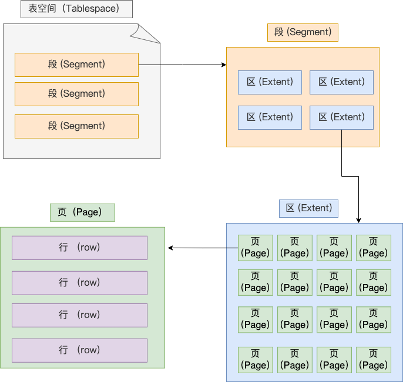
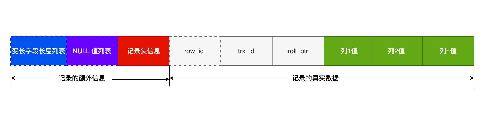
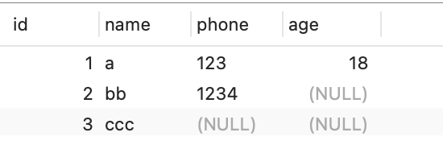

# MySQL 原理

## 架构

### MySQL 架构


最上层的服务并不是 MySQL 独有的，大多数基于网络的客户端 / 服务器的工具或者服务都有类似的架构。比如连接处理、授权认证、安全等等。

第二层架构是 MySQL 比较有意思的部分。大多数 MySQL 的核心服务功能都在这一层，包括查询解析、分析、优化、缓存以及所有的内置函数（例如，日期、时间、数学和加密函数），所有跨存储引擎的功能都在这一层实现：存储过程、触发器、视图等。

第三层包含了存储引擎。存储引擎负责 MySQL 中数据的存储和提取。和 GNU/Linux 下的各种文件系统一样，每个存储引擎都有它的优势和劣势。服务器通过 API 与存储引擎进行通信。这些接口屏蔽了不同存储引擎之间的差异，使得这些差异对上层的查询过程透明。存储引擎 API 包含几十个底层函数，用于执行诸如“开始一个事务”，或者“根据主键提取一行记录”等操作。但存储引擎不会去解析 SQL（InnoDB是例外，它会解析外键定义，因为 MySQL 服务器本身没有实现该功能。），不同存储引擎之间也不会相互通信，而只是简单地响应上层服务器的请求。

每个客户端连接都会在服务器进程中拥有一个线程，这个连接的查询只会在这个单独的线程中执行，该线程只能轮流在某个 CPU 核心或者 CPU 中运行。服务器会负责缓存线程，因此不需要为每一个新建的连接创建或者销毁线程。

当客户端（应用）连接到 MySQL 服务器时，服务器需要对其进行认证。认证基于用户名、原始主机信息和密码。如果使用了安全套接字（SSL）的方式连接，还可以使用 X.509 证书认证。一旦客户端连接成功，服务器会继续验证该客户端是否具有执行某个特定查询的权限（例如，是否允许客户端对 world 数据库的 Country 表执行 SELECT 语句）。

MySQL 会解析查询，并创建内部数据结构（解析树），然后对其进行各种优化，包括重写查询、决定表的读取顺序，以及选择合适的索引等。用户可以通过特殊的关键字提示（hint）优化器，影响它的决策过程。也可以请求优化器解释（explain）优化过程的各个因素，使用户可以知道服务器是如何进行优化决策的，并提供一个参考基准，便于用户重构查询和 schema、修改相关配置，使应用尽可能高效运行。

优化器并不关心使用的是什么存储引擎，但存储引擎对于优化查询是有影响的。优化器会请求存储引擎提供容量或某个具体操作的开销信息，以及表数据的统计信息等。例如，某些存储引擎的某种索引，可能对一些特定的查询有优化。

对于 SELECT 语句，在解析查询之前，服务器会先检查查询缓存（Query Cache），如果能够在其中找到对应的查询，服务器就不必再执行查询解析、优化和执行的整个过程，而是直接返回查询缓存中的结果集。

### 一条 SQL 的执行过程

#### MySQL 执行流程是怎样的？


可以看到，MySQL 的架构共分为两层：Server 层和存储引擎层，

- Server 层负责建立连接、分析和执行 SQL。MySQL 大多数的核心功能模块都在这实现，主要包括连接器，查询缓存、解析器、预处理器、优化器、执行器等。另外，所有的内置函数（如日期、时间、数学和加密函数等）和所有跨存储引擎的功能（如存储过程、触发器、视图等。）都在 Server 层实现。
- 存储引擎层负责数据的存储和提取。支持 InnoDB、MyISAM、Memory 等多个存储引擎，不同的存储引擎共用一个 Server 层。现在最常用的存储引擎是 InnoDB，从 MySQL 5.5 版本开始， InnoDB 成为了 MySQL 的默认存储引擎。我们常说的索引数据结构，就是由存储引擎层实现的，不同的存储引擎支持的索引类型也不相同，比如 InnoDB 支持索引类型是 B+树 ，且是默认使用，也就是说在数据表中创建的主键索引和二级索引默认使用的是 B+ 树索引。

#### 第一步：连接器

如果在 Linux 操作系统里使用 MySQL，那第一步肯定是要先连接 MySQL 服务，然后才能执行 SQL 语句，普遍使用下面这条命令进行连接：

```mysql
# -h 指定 MySQL 服务得 IP 地址，如果是连接本地的 MySQL服务，可以不用这个参数；
# -u 指定用户名，管理员角色名为 root；
# -p 指定密码，如果命令行中不填写密码（为了密码安全，建议不要在命令行写密码），就需要在交互对话里面输入密码
mysql -h$ip -u$user -p
```

连接的过程需要先经过 TCP 三次握手，因为 MySQL 是基于 TCP 协议进行传输的，如果 MySQL 服务并没有启动，则会报错。

如果 MySQL 服务正常运行，完成 TCP 连接的建立后，连接器就要开始验证你的用户名和密码，如果用户名或密码不对，就收到一个 "Access denied for user" 的错误，然后客户端程序结束执行。

如果用户密码都没有问题，连接器就会获取该用户的权限，然后保存起来，后续该用户在此连接里的任何操作，都会基于连接开始时读到的权限进行权限逻辑的判断。

所以，如果一个用户已经建立了连接，即使管理员中途修改了该用户的权限，也不会影响已经存在连接的权限。修改完成后，只有再新建的连接才会使用新的权限设置。

> 如何查看 MySQL 被多少个客户端连接了？

如果想知道当前 MySQL 服务被多少个客户端连接了，可以执行`show processlist`命令进行查看。

> 空闲连接会一直占用着吗？

当然不是，MySQL 定义了空闲连接的最大空闲时长，由 wait_timeout 参数控制的，默认值是 8 小时（28880秒），如果空闲连接超过了这个时间，连接器就会自动将它断开。

```mysql
mysql> show variables like 'wait_timeout';
+---------------+-------+
| Variable_name | Value |
+---------------+-------+
| wait_timeout  | 28800 |
+---------------+-------+
1 row in set (0.00 sec)
```

也可以手动断开空闲的连接，使用的是`kill connection + id`的命令。

```mysql
mysql> kill connection +6;
Query OK, 0 rows affected (0.00 sec)
```

一个处于空闲状态的连接被服务端主动断开后，这个客户端并不会马上知道，等到客户端在发起下一个请求的时候，才会收到报错`ERROR 2013 (HY000): Lost connection to MySQL server during query`。

> MySQL 的连接数有限制吗？

MySQL 服务支持的最大连接数由 max_connections 参数控制，比如我的 MySQL 服务默认是 151 个，超过这个值，系统就会拒绝接下来的连接请求，并报错提示“Too many connections”。

```mysql
mysql> show variables like 'max_connections';
+-----------------+-------+
| Variable_name   | Value |
+-----------------+-------+
| max_connections | 151   |
+-----------------+-------+
1 row in set (0.00 sec)
```

MySQL 的连接也跟 HTTP 一样，有短连接和长连接的概念，它们的区别如下：

```mysql
// 短连接
连接 mysql 服务（TCP 三次握手）
执行sql
断开 mysql 服务（TCP 四次挥手）

// 长连接
连接 mysql 服务（TCP 三次握手）
执行sql
执行sql
执行sql
....
断开 mysql 服务（TCP 四次挥手）
```

可以看到，使用长连接的好处就是可以减少建立连接和断开连接的过程，所以一般是推荐使用长连接。

但是，使用长连接后可能会占用内存增多，因为 MySQL 在执行查询过程中临时使用内存管理连接对象，这些连接对象资源只有在连接断开时才会释放。如果长连接累计很多，将导致 MySQL 服务占用内存太大，有可能会被系统强制杀掉，这样会发生 MySQL 服务异常重启的现象。

> 怎么解决长连接占用内存的问题？

有两种解决方式。

第一种，定期断开长连接。既然断开连接后就会释放连接占用的内存资源，那么我们可以定期断开长连接。

第二种，客户端主动重置连接。MySQL 5.7 版本实现了`mysql_reset_connection()`函数的接口，注意这是接口函数不是命令，那么当客户端执行了一个很大的操作后，在代码里调用`mysql_reset_connection()`来充值连接，达到释放内存的效果。这个过程不需要重连和重新做权限验证，但是会将连接恢复到刚刚创建完时的状态。

至此，连接器的工作做完了，简单总结一下：

- 与客户端进行 TCP 三次握手建立连接；
- 校验客户端的用户名和密码，如果用户名或密码不对，则会报错；
- 如果用户名和密码都对了，会读取该用户的权限，然后后面的权限逻辑判断都基于此时读取到的权限；

#### 第二步：查询缓存

连接器的工作完成后，客户端就可以向 MySQL 服务发送 SQL 语句了，MySQL 服务收到 SQL 语句后，就会解析出 SQL 语句的第一个字段，看看是什么类型的语句。

如果 SQL 是查询语句（select 语句），MySQL 就会先去查询缓存（ Query Cache ）里查找缓存数据，看看之前有没有执行过这一条命令，这个查询缓存是以 key-value 形式保存在内存中的，key 为 SQL 查询语句，value 为 SQL 语句查询的结果。

如果查询的语句命中查询缓存，那么就会直接返回 value 给客户端。如果查询的语句没有命中查询缓存中，那么就要往下继续执行，等执行完后，查询的结果就会被存入查询缓存中。

对于更新比较频繁的表，查询缓存的命中率很低的，因为只要一个表有更新操作，那么这个表的查询缓存就会被清空。

所以，MySQL 8.0 版本直接将查询缓存删掉了，也就是说 MySQL 8.0 开始，执行一条 SQL 查询语句，不会再走到查询缓存这个阶段了。

对于 MySQL 8.0 之前的版本，如果想关闭查询缓存，我们可以通过将参数 query_cache_type 设置成 DEMAND。

注意，这里说的查询缓存是 server 层的，也就是 MySQL 8.0 版本移除的是 server 层的查询缓存，并不是 Innodb 存储引擎中的 buffer pool。

#### 第三步：解析 SQL

在正式执行 SQL 查询语句之前，MySQL 会先对 SQL 语句做解析，这个工作交由「解析器」来完成。

##### 解析器

解析器会做如下两件事情。

第一件事情，词法分析。MySQL 会根据输入的字符串识别出关键字出来，构建出 SQL 语法树，这样方便后面模块获取 SQL 类型、表名、字段名、where 条件等等。

第二件事情，语法分析。根据词法分析的结果，语法解析器会根据语法规则，判断输入的这个 SQL 语句是否满足 MySQL 语法。如果输入的 SQL 语句语法不对，就会在解析器这个阶段报错。

但是注意，表不存在或者字段不存在，并不是在解析器里做的。

#### 第四步：执行 SQL

经过解析器后，接着就要进入执行 SQL 查询语句的流程了，每条 SELECT 查询语句流程主要可以分为下面这三个阶段：

- prepare 阶段，也就是预处理阶段；
- optimize 阶段，也就是优化阶段；
- execute 阶段，也就是执行阶段；

##### 预处理器

预处理阶段做了如下事情：

- 检查 SQL 查询语句中的表或者字段是否存在；
- 将`select *`中的`*`富豪扩展为表上的所有列；

如果表不存在。这时 MySQL 就会在执行 SQL 查询语句的 prepare 阶段中报错。

##### 优化器

经过预处理阶段后，还需要为 SQL 查询语句先制定一个执行计划，这个工作交由「优化器」来完成的。

优化器主要负责将 SQL 查询语句的执行方案确定下来，比如在表里面有多个索引的时候，优化器会基于查询成本的考虑，来决定选择使用哪个索引。

要想知道优化器选择了哪个索引，可以在查询语句最前面加个`explain`命令，这样就会输出这条 SQL 语句的执行计划，然后执行计划中的 key 就表示执行过程中使用了哪个索引。

如果查询语句的执行计划里的 key 为 null 说明没有使用索引，那就会全表扫描（type = ALL），这种查询扫描的方式是效率最低档次的。

##### 执行器

经历完优化器后，就确定了执行方案，接下来 MySQL 就真正开始执行语句了，这个工作是由「执行器」完成的。在执行的过程中，执行器就会和存储引擎交互了，交互是以记录为单位的。

接下来，用三种方式执行过程，描述一下执行器和存储引擎的交互过程。

- 主键索引查询
- 全表扫描
- 索引下推

###### 主键索引查询

```mysql
select * from product where id = 1;
```

这条查询语句的查询条件用到了主键索引，而且是等值查询，同时主键 id 是唯一，不会有 id 相同的记录，所以优化器决定选用访问类型为 const 进行查询，也就是使用主键索引查询一条记录，那么执行器与存储引擎的执行流程是这样的：

- 执行器第一次查询，会调用 read_first_record 函数指针指向的函数，因为优化器选择的访问类型为 const，这个函数指针被指向为 InnoDB 引擎索引查询的接口，把条件 id = 1 交给存储引擎，让存储引擎定位符合条件的第一条记录。
- 存储引擎通过主键索引的 B+ 树结构定位到 id = 1 的第一条记录，如果记录是不存在的，就会向执行器上报记录找不到的错误，然后查询结束。如果记录是存在的，就会将记录返回给执行器；
- 执行器从存储引擎读到记录后，接着判断记录是否符合查询条件，如果符合则发送给客户端，如果不符合则跳过该记录。
- 执行器查询的过程是一个 while 循环，所以还会再查一次，但是这次因为不是第一次查询了，所以会调用 read_record 函数指针指向的函数，因为优化器选择的访问类型为 const，这个函数指针被指向为一个永远返回 - 1 的函数，所以当调用该函数的时候，执行器就退出循环，也就是结束查询了。

至此，这个语句就执行完成了。

###### 全表扫描

```mysql
select * from product where name = 'iphone';
```

这条查询语句的查询条件没有用到索引，所以优化器决定选用访问类型为 ALL 进行查询，也就是全表扫描的方式查询，那么这时执行器与存储引擎的执行流程是这样的：

- 执行器第一次查询，会调用 read_first_record 函数指针指向的函数，因为优化器选择的访问类型为 all，这个函数指针被指向为 InnoDB 引擎全扫描的接口，让存储引擎读取表中的第一条记录；
- 执行器会判断读到的这条记录的 name 是不是 iphone，如果不是则跳过；如果是则将记录发给客户的（是的没错，Server 层每从存储引擎读到一条记录就会发送给客户端，之所以客户端显示的时候是直接显示所有记录的，是因为客户端是等查询语句查询完成后，才会显示出所有的记录）。
- 执行器查询的过程是一个 while 循环，所以还会再查一次，会调用 read_record 函数指针指向的函数，因为优化器选择的访问类型为 all，read_record 函数指针指向的还是 InnoDB 引擎全扫描的接口，所以接着向存储引擎层要求继续读刚才那条记录的下一条记录，存储引擎把下一条记录取出后就将其返回给执行器（Server层），执行器继续判断条件，不符合查询条件即跳过该记录，否则发送到客户端；

至此，这个语句就执行完成了。

###### 索引下推

索引下推能够减少二级索引在查询时的回表操作，提高查询的效率，因为它将 Server 层部分负责的事情，交给存储引擎层去处理了。 

举个例子，表如下，对 age 和 reward 字段建立了联合索引：


```mysql
select * from t_user  where age > 20 and reward = 100000;
```

联合索引当遇到范围查询（>、<）就会停止匹配，也就是 age 字段能用到联合索引，但是 reward 字段则无法利用到索引。

那么，不使用索引下推（MySQL 5.6 之前的版本）时，执行器与存储引擎的执行流程是这样的：

- Server 层首先调用存储引擎的接口定位到满足查询条件的第一条二级索引记录，也就是定位到 age > 20 的第一条记录；
- 存储引擎根据二级索引的 B+ 树快速定位到这条记录后，获取主键值，然后进行回表操作，将完整的记录返回给 Server 层；
- Server 层在判断该记录的 reward 是否等于 100000，如果成立则将其发送给客户端；否则跳过该记录；
- 接着，继续向存储引擎索要下一条记录，存储引擎在二级索引定位到记录后，获取主键值，然后回表操作，将完整的记录返回给 Server 层；
- 如此往复，直到存储引擎把表中的所有记录读完。

可以看到，没有索引下推的时候，每查询到一条二级索引记录，都要进行回表操作，然后将记录返回给 Server，接着 Server 再判断该记录的 reward 是否等于 100000 的工作交给了存储引擎层，过程如下：

- Server 层首先调用存储引擎的接口定位到满足查询条件的第一条二级索引记录，也就是定位到 age > 20 的第一条记录；
- 存储引擎定位到二级索引后，先不执行回表操作，而是先判断一下该索引中包含的列（reward列）的条件（reward 是否等于 100000）是否成立。如果条件不成立，则直接跳过该二级索引。如果成立，则执行回表操作，将完成记录返回给 Server 层。
- Server 层在判断其他的查询条件（本次查询没有其他条件）是否成立，如果成立则将其发送给客户端；否则跳过该记录，然后向存储引擎索要下一条记录。
- 如此往复，直到存储引擎把表中的所有记录读完。

可以看到，使用了索引下推后，虽然 reward 列无法使用到联合索引，但是因为它包含在联合索引（age，reward）里，所以直接在存储引擎过滤出满足 reward = 100000 的记录后，才去执行回表操作获取整个记录。相比于没有使用索引下推，节省了很多回表操作。

当你发现执行计划里的 Extr 部分显示了 “Using index condition”，说明使用了索引下推。

### 引擎分类

#### MySQL MySQL 存储引擎有哪些？

MyISAM、InnoDB、Merge、Memory(HEAP)、BDB(BerkeleyDB)、Example、Federated、Archive、CSV、Blackhole.....

#### Innodb 和 MyISAM 存储引擎有什么区别？

##### 磁盘文件的对比

使用MyISAM引擎的表：zz_myisam_index，会在本地生成三个磁盘文件：

- zz_myisam_index.frm：该文件中存储表的结构信息。
- zz_myisam_index.MYD：该文件中存储表的行数据。
- zz_myisam_index.MYI：该文件中存储表的索引数据。

MyISAM 引擎的表数据和索引数据，会分别放在两个不同的文件中存储。

而使用 InnoDB 引擎的表：zz_innodb_index，在磁盘中仅有两个文件：

- zz_innodb_index.frm：该文件中存储表的结构信息。
- zz_innodb_index.ibd：该文件中存储表的行数据和索引数据。

##### 索引支持的对比

因为 MyISAM 引擎在设计之初，会将表分为`.frm`、`.MYD`、`.MYI`三个文件放在磁盘存储，表数据和索引数据是分别放在`.MYD`、`.MYI`文件中，所以注定了 MyISAM 引擎只支持非聚簇索引。而 InnoDB 引擎的表数据、索引数据都放在`.ibd`文件中存储，因此 InnoDB 是支持聚簇索引的。

聚簇索引的要求是：索引键和行数据必须在物理空间上也是连续的，而MyISAM表数据和索引数据，分别位于两个磁盘文件中，这也就注定了它无法满足聚簇索引的要求。

但不支持聚簇索引也有好处，也就是无论走任何索引，都只需要一遍查询即可获得数据，而InnoDB引擎的表中，如果不走聚簇（主键）索引查询数据，走其他索引的情况下，都需要经过两遍（回表）查询才能获得数据。

##### 事务机制的对比

InnoDB 引擎中有两个自己专享的日志，即`undo-log`、`redo-log`，先来说说`undo-log`日志，InnoDB 在 MySQL 启动后，会在内存中构建一个`undo_log_buffer`缓冲区，同时在磁盘中也有相应的`undo-log`日志文件。

一条写入类型的SQL语句，在正式执行前都会先记录redo-log、undo-log日志，undo-log中会记录变更前的旧数据，当一个事务提交时，MySQL会正常的将数据落盘，而当一个事务碰到rollback命令需要回滚时，就会找到undo-log中记录的旧数据，接着用来覆盖变更过的新数据，以此做到将数据回滚到变更前的“样貌”。

> 使用 InnoDB 存储引擎的表，可以借助 undo-log 日志实现事务机制，支持多条 SQL 组成一个事务，可以保证发生异常的情况下，组成这个事务的 SQL 到底回滚还是提交。而 MyISAM 并未设计类似的技术，在启动时不会在内存中构建 undo_log_buffer 缓冲区，磁盘中也没有相应的日志文件，因此 MyISAM 并不支持事务机制。

一个引擎是否支持事务，这点尤为重要，因为业务开发过程中，咱们需要关注数据的安全性，拿最为经典的下单为例，用户把钱都付了，总不能由于程序 Bug，然后不给用户新增订单、物流信息吧？再不济至少也要把钱退回给用户，因此就需要用到事务机制来保证原子性。

所以，如果表结构用了 MyISAM 引擎，想要解决这类问题，就只能在客户端做事务补偿，比如上面这个情况，当用户付钱后执行出现异常了，就在客户端中记录一下，然后再向 MySQL 发送一条相应的反 SQL，以此来保障数据的一致性。

##### 故障恢复的对比

接着再来看看`redo-log`日志，InnoDB 在启动时，同样会在内存中构建一个`redo_log_buffer`缓冲区，在磁盘中也会有相应的`redo-log`日志文件，所以当一条或多条 SQL 语句执行成功后，不论 MySQL 在何时宕机，只要这个事务提交了，InnoDB 引擎都能确保该事务的数据不会丢失，也就以此保障了事务的持久性。

InnoDB引擎由于`redo-log`日志的存在，因此只要事务提交，机器断电、程序宕机等各种灾难情况，都可以用`redo-log`日志来恢复数据。但 MyISAM 引擎同样没有`redo-log`日志，所以并不支持数据的故障恢复，如果表是使用 MyISAM 引擎创建的，当一条 SQL 将数据写入到了缓冲区后，SQL 还未被写到`bin-log`日志，此时机器断电、DB 宕机了，重启之后由于数据在宕机前还未落盘，所以丢了也就无法找回。

> 从这一点来说，MyISAM 并没有 InnoDB 引擎可靠，在 InnoDB 中只要事务提交，它就能确保数据永远不丢失，但 MyISAM 不行。这就好比咱们去银行存钱，去 InnoDB 银行存，你只需要把钱送到它那里，它就能确保你的财产安全，但如若去 MyISAM 银行存钱，你必须要把钱送到银行的保险库中才行，否则有可能会因为在送往保险库的过程中“丢失”财产。

##### 锁粒度的对比

MySQL 的存储引擎中，MyISAM 仅支持表锁，而 InnoDB 同时支持表锁、行锁。

为什么 MyISAM 引擎不支持行锁？

举个例子：

```mysql
select * from zz_students;
+------------+--------+------+--------+
| student_id | name   | sex  | height |
+------------+--------+------+--------+
|          1 | 竹子   | 男   | 185cm  |
|        ... | ....   | ..   | .....  |
+------------+--------+------+--------+
```

上述这张学生表中，假设使用的是 MyISAM 引擎，同时对`student_id`字段建立了主键索引，`name`字段建立了普通索引，`sex`、`height`字段建立了联合索引，此时先不管索引合不合理，以目前情况为例，来推导一下 MyISAM 表为啥无法实现行锁。

> 这张表中存在三个索引，那在本地的 .MYI 索引文件中，肯定存在三颗 B+ 树，同时由于 MyISAM 不支持聚簇索引，所以这三个索引是平级的，每棵 B+ 树的索引键，都直接指向 .MYD 数据文件中的行数据地址。

假设 MyISAM 要实现行锁，当要对一个行数据加锁时，可以锁定一棵树中某一个数据，但无法锁定其他树的行数据，举个例子：

```mysql
select * from zz_students where student_id = 1 for update;
```

这条 SQL 必然会走主键索引命中数据，那假设此时对主键索引树上，`ID=1`的数据加锁，接着再来看一种情况：

```mysql
select * from zz_students where name = "竹子" for update;
```

此时这条SQL又会走name字段的普通索引查询数据，那此时又对普通索引树上的「竹子」数据加锁。

> 上面的案例中，MyISAM 如果想要实现行锁，就会遇到这个问题，基于不同索引查询数据时，可能会导致一行数据上加多个锁！这样又会导致多条线程同时操作一个数据，所以又会因为多线程并发执行的原因，造成脏读、幻读、不可重复读这系列问题出现。

但 InnoDB 因为支持聚簇索引，表中就算没有显式定义主键，内部依旧会用一个隐藏列来作为聚簇索引的索引字段，所以 InnoDB 表中的索引，是有主次之分的，所有的次级索引，其索引值都存储聚簇索引的索引键，因此想要对一行数据加锁时，只需要锁定聚簇索引的数据即可。

```mysql
-- 通过主键索引查询数据
select * from zz_students where student_id = 1 for update;
-- 通过普通索引查询数据
select * from zz_students where name = "竹子" for update;
```

依旧是前面的这个例子，通过主键索引查询的 SQL 语句，会直接定位到聚簇索引的数据，然后对`ID=1`的数据加锁。而第二条通过普通索引查询数据的SQL语句，经过查询后会得到一个值：`ID=1`，然后会拿着这个`ID=1`的值再去回表，在聚簇索引中再次查询`ID=1`的数据，找到之后发现上面已经有线程加锁了，当前线程就会阻塞等待上一个线程释放锁。

因为 MyISAM 引擎不支持聚簇索引，所以无法实现行锁，出现多条线程同时读写数据时，只能锁住整张表。而 InnoDB 由于支持聚簇索引，每个索引最终都会指向聚簇索引中的索引键，因此出现并发事务时，InnoDB 只需要锁住聚簇索引的数据即可，而不需要锁住整张表，因此并发性能更高。

> 同时，InnoDB 引擎构建的缓冲区中，会专门申请一块内存作为锁空间，同时再结合 InnoDB 支持事务，所以 InnoDB 是基于事务来生成锁对象，相较于 SQL Server 的行锁来说，InnoDB 的行锁会更节约内存。

##### 并发性能的对比

MyISAM 仅支持表锁，InnoDB 同时支持表锁、行锁，由于这点原因，其实 InnoDB 引擎的并发支持性早已远超 MyISAM 了，毕竟锁的粒度越小，并发冲突的概率也就越低，因此并发支撑就越高。

> 但是 InnoDB 不仅仅只满足于此，为了提升读-写并存场景下的并发度，InnoDB 引擎又基于 undo-log 日志的版本链+事务快照，又推出了 MVCC 多版本并发控制技术，因此对于读-写共存的场景支持并发执行。

但 MyISAM 只支持表锁，因此当一条 SQL 在写数据时，其他 SQL 就算是来读数据的，也需要阻塞等待，为啥呢？因为写数据时需要加排他锁，这是一种独占类型的锁，会排斥一切尝试获取锁的线程，反过来也是同理，当一条线程在读数据时，另一条线程来写数据，依旧会陷入阻塞等待，毕竟写数据要获取排他锁，也就意味着整张表只允许这一个线程操作。

##### 内存利用度的对比

MySQL 在线上运行的时间够久，InnoDB 甚至会将磁盘中的所有数据，全部载入内存，然后所有客户端的读写请求，基本上无需再走磁盘来完成，都采用异步IO的方式完成，即先写内存+后台线程刷写的方式执行，后台线程的刷盘动作，对客户端而言不会有任何感知，在写完内存之后就会直接向客户端返回。

通过缓冲池结合异步IO技术，活生生将一款基于磁盘的引擎，演变成了半内存式的引擎。反观 MyISAM 引擎，内部虽然也有缓冲池以及异步 IO 技术，但对内存的开发度远不足于 InnoDB 引擎，运行期间大量操作依旧会走磁盘完成。

##### 总结

- 存储方式：MyISAM 引擎会将表数据和索引数据分成两个文件存储。
- 索引支持：因为 MyISAM 引擎的表数据和索引数据是分开的，因此不支持聚簇索引。
- 事务支持：由于 MyISAM 引擎没有`undo-log`日志，所以不支持多条 SQL 组成事务并回滚。
- 故障恢复：MyISAM 引擎依靠`bin-log`日志实现，`bin-log`中未写入的数据会永久丢失。
- 锁粒度支持：因为 MyISAM 不支持聚簇索引，因此无法实现行锁，所有并发操作只能加表锁。
- 并发性能：MyISAM 引擎仅支持表锁，所以多条线程出现读-写并发场景时会阻塞。
- 内存利用度：MyISAM 引擎过于依赖 MySQL Server，对缓冲池、异步 IO 技术开发度不够。

#### MyISAM 引擎真的一无是处吗？

##### 统计总数的优化

```mysql
select count(*) from `table_name`;
```

好比要统计订单数、平台用户总数、会员数.....各类需求，基本上都会在数据库中执行`count()`操作，对于`count()`统计行数的操作，在 MyISAM 引擎中会记录表的行数，也就是当执行`count()`时，如果表是 MyISAM 引擎，则可以直接获取之前统计的值并返回。

> 但这个特性在 InnoDB 引擎中是不具备的，当你在 InnoDB 中统计一张表的总数时，会触发全表扫描，InnoDB 会一行行的去统计表的行数。

但是 MyISAM 的这个特性也仅仅只适用于统计全表数据量，如果后面跟了 where 条件：

```mysql
select count(*) from `table_name` where xxx = "xxx";
```

如果是这种情况，那 InnoDB、MyISAM 的工作模式是相同的，先根据 where 后的条件查询数据，再一行行统计总数。

##### 删除数据/表的优化

当使用`delete`命令清空表数据时，如下：

```mysql
delete from `table_name`;
```

MyISAM 会直接重新创建表数据文件，而 InnoDB 则是一行行删除数据，因此对于清空表数据的操作，MyISAM 比 InnoDB 快上无数倍。同时 MyISAM 引擎的表，对于`delete`过的数据不会立即删除，而且先隐藏起来，后续定时删除或手动删除，手动强制清理的命令如下：

```mysql
optimize table `table_name`;
```

这样做有一点好处，就是当你误删一张表的大量数据时，只要你手速够快，手动将本地的`.MYD`、`.MYI`文件拷贝出去，就可以直接基于这两个数据文件恢复数据，而不需要通过日志或第三方工具修复数据。

##### CRUD 速度更快

因为 InnoDB 支持聚簇索引，因此整个表数据都会和聚簇索引一起放在一颗 B+ 树中存储，就算当你没有定义主键时，InnoDB 也会定义一个隐式字段 ROW_ID 来作为聚簇索引字段，这也就意味着：在 InnoDB 的表中，这个聚簇索引你不要也得要！

当查询数据时，如果在基于非聚簇索引查找数据，就算查到了也需要经过一次回表才能得到数据，同时插入数据、修改数据时，都需要维护聚簇索引和非聚簇索引之间的关系。

而 MyISAM 引擎中，所有已创建的索引都是非聚簇索引，每个索引之间都是独立的，在索引中存储的是直接指向行数据的地址，而并非聚簇索引的索引键，因此无论走任何索引，都仅需一次即可获得数据，无需做回表查询。

同时写数据时，也不需要维护不同索引之间的关系，毕竟每个索引都是独立的，因此MyISAM 在理论上，读写数据的效率会高于 InnoDB 引擎。不过放在实际的生产环境中，这条理论是行不通的。

##### MyISAM 真的比 InnoDB 快吗？

如果是对比单个客户端连接的读写性能，那自然 MyISAM 远超于 InnoDB 引擎，毕竟 InnoDB 需要维护聚簇索引，而 MyISAM 因为每个索引都是独立的，因此插入表数据时都是直接追加在表数据文件的末尾即可，而且修改数据也不需要维护其他索引和聚簇索引的关系。

随着连接数的增加，工作线程会不断增加，CPU 使用核数也会不断增加，而 InnoDB 的性能会逐步上升，但 MyISAM 引擎基本上没有太大变化，基本上从头到尾一直都很低。原因是锁机制导致的。

> MyISAM 引擎仅支持表锁，也就意味着无论有多少个客户端连接到来，对于同一张表永远只能允许一条线程操作，除非多个连接都是在读数据，才不会相互排斥。

InnoDB 引擎，由于支持行锁，所以并发冲突很小，在高并发、多连接的场景中，性能会更加出色，而 MyISAM 引擎基本上在并发读写场景中，一张表只允许单线程操作，因此并发冲突很大，吞吐量会因此严重下降。

##### MyISAM 的压缩机制

如今的数据库随着业务发展，数据量的增长一天一个新变化，时间不断推移，数据只会越来越大，这时就很容易出现以下两个问题：

- IO 瓶颈：DB 数据量过大，导致内存无法载入太多数据，会触发大量磁盘 IO，让 DB 整体性能降低。
- 磁盘空间不足：随着业务的发展，部署数据库的机器磁盘无法存储数据，需要不断扩容硬件。

而MyISAM引擎为了解决这个问题，可以通过 myisampack 工具对数据表进行压缩，压缩的效果至少能让数据缩小一半，但压缩后的数据只可读，不可写，这点要牢记！

到了MySQL5.7版本中，该特性也被移植到了InnoDB引擎中，相关的压缩参数如下：

- innodb_compression_level：调整压缩的级别，可控范围在1~9，越高压缩效果越好，但压缩速度也越慢。
- innodb_compression_failure_threshold_pct：当压缩失败的数据页超出该比例时，会加入数据填充来减小失败率，为0表示禁止填充。
- innodb_compression_pad_pct_max：一个数据页中最大允许填充多少比例的空白数据。
- innodb_log_compressed_pages：控制是否对redo-log日志的数据也开启压缩机制。
- innodb_cmp_per_index_enabled：是否对索引文件开启压缩机制。

## InnoDB 存储引擎

### 一行记录的存储格式

#### MySQL 的数据存放在哪个文件？

MySQL 的数据都是保存在磁盘的，那具体是保存在哪个文件呢？

MySQL 存储的行为是由存储引擎实现的，MySQL 支持多种存储引擎，不同的存储引擎保存的文件自然也不同。

以 InnoDB 为例，先看看 MySQL 数据库的文件存放在哪个目录。

```mysql
mysql> SHOW VARIABLES LIKE 'datadir';
+---------------+-----------------+
| Variable_name | Value           |
+---------------+-----------------+
| datadir       | /var/lib/mysql/ |
+---------------+-----------------+
1 row in set (0.00 sec)
```

我们每创建一个 database（数据库）都会在`/var/lib/mysql/`目录里面创建一个以 database 为名的目录，然后保存表结构和表数据的文件都会存放在这个目录里。

比如，我这里有一个名为 my_test 的 database，该 database 里有一张名为 t_order 数据库表。

```mysql
[root@xiaolin ~]#ls /var/lib/mysql/my_test
db.opt  
t_order.frm  
t_order.ibd
```

可以看到，共有三个文件，这三个文件分别代表着：

- db.opt，用来存储当前数据库的默认字符集和字符校验规则。
- t_order.frm ，t_order 的表结构会保存在这个文件。在 MySQL 中建立一张表都会生成一个.frm 文件，该文件是用来保存每个表的元数据信息的，主要包含表结构定义。
- t_order.ibd，t_order 的表数据会保存在这个文件。表数据既可以存在共享表空间文件（文件名：ibdata1）里，也可以存放在独占表空间文件（文件名：表名字.ibd）。这个行为是由参数 innodb_file_per_table 控制的，若设置了参数 innodb_file_per_table 为 1，则会将存储的数据、索引等信息单独存储在一个独占表空间，从 MySQL 5.6.6 版本开始，它的默认值就是 1 了，因此从这个版本之后， MySQL 中每一张表的数据都存放在一个独立的 .ibd 文件。

好了，现在我们知道了一张数据库表的数据是保存在「 表名字.ibd 」的文件里的，这个文件也称为独占表空间文件。

##### 表空间文件的结构是怎么样的？

表空间由段（segment）、区（extent）、页（page）、行（row）组成，InnoDB存储引擎的逻辑存储结构大致如下图：



1. 行（row）

数据库表中的记录都是按行（row）进行存放的，每行记录根据不同的行格式，有不同的存储结构。

2. 页（page）

记录是按照行来存储的，但是数据库的读取并不以「行」为单位，否则一次读取（也就是一次 I/O 操作）只能处理一行数据，效率会非常低。

因此，InnoDB 的数据是按「页」为单位来读写的，也就是说，当需要读一条记录的时候，并不是将这个行记录从磁盘读出来，而是以页为单位，将其整体读入内存。

默认每个页的大小为 16KB，也就是最多能保证 16KB 的连续存储空间。

页是 InnoDB 存储引擎磁盘管理的最小单元，意味着数据库每次读写都是以 16KB 为单位的，一次最少从磁盘中读取 16K 的内容到内存中，一次最少把内存中的 16K 内容刷新到磁盘中。

页的类型有很多，常见的有数据页、undo 日志页、溢出页等等。数据表中的行记录是用「数据页」来管理的。

3. 区（extent）

我们知道 InnoDB 存储引擎是用 B+ 树来组织数据的。

B+ 树中每一层都是通过双向链表连接起来的，如果是以页为单位来分配存储空间，那么链表中相邻的两个页之间的物理位置并不是连续的，可能离得非常远，那么磁盘查询时就会有大量的随机 I/O，随机 I/O 是非常慢的。

解决这个问题也很简单，就是让链表中相邻的页的物理位置也相邻，这样就可以使用顺序 I/O 了，那么在范围查询（扫描叶子节点）的时候性能就会很高。

那具体怎么解决？

在表中数据量大的时候，为某个索引分配空间的时候就不再按照页为单位分配了，而是按照区（extent）为单位分配。每个区的大小为 1MB，对于 16KB 的页来说，连续的 64 个页会被划为一个区，这样就使得链表中相邻的页的物理位置也相邻，就能使用顺序 I/O 了。

4. 段（segment）

表空间是由各个段（segment）组成的，段是由多个区（extent）组成的。段一般分为数据段、索引段和回滚段等。

- 索引段：存放 B + 树的非叶子节点的区的集合；
- 数据段：存放 B + 树的叶子节点的区的集合；
- 回滚段：存放的是回滚数据的区的集合。

#### InnoDB 行格式有哪些？

行格式（row_format），就是一条记录的存储结构。

InnoDB 提供了 4 种行格式，分别是 Redundant、Compact、Dynamic 和 Compressed 行格式。

- Redundant 是很古老的行格式了，MySQL 5.0 版本之前用的行格式，现在基本没人用了。
- 由于 Redundant 不是一种紧凑的行格式，所以 MySQL 5.0 之后引入了 Compact 行记录存储方式，Compact 是一种紧凑的行格式，设计的初衷就是为了让一个数据页中可以存放更多的行记录，从 MySQL 5.1 版本之后，行格式默认设置成 Compact。
- Dynamic 和 Compressed 两个都是紧凑的行格式，他们的行格式都和 Compact 差不多，因为都是基于 Compact 改进一点东西。从 MySQL 5.7 版本之后，默认使用 Dynamic 行格式。

#### Compact 行格式长什么样？



可以看到，一条完整的记录分为「记录的额外信息」和「记录的真实数据」两个部分。

##### 记录的额外信息

记录的额外信息包含 3 个部分：变长字段长度列表、NULL 值列表、记录头信息。

1. 变长字段长度列表

varchar(n) 和 char(n) 的区别是什么，char 是定长的，varchar 是变长的，变长字段实际存储的数据的长度（大小）不固定的。

所以，在存储数据的时候，也要把数据占用的大小存起来，存到「变长字段长度列表」里面，读取数据的时候才能根据这个「变长字段长度列表」去读取对应长度的数据。其他 TEXT、BLOB 等变长字段也是这么实现的。

为了展示「变长字段长度列表」具体是怎么保存「变长字段的真实数据占用的字节数」，我们先创建这样一张表，字符集是 ascii（所以每一个字符占用的 1 字节），行格式是 Compact，t_user 表中 name 和 phone 字段都是变长字段：

```mysql
CREATE TABLE `t_user` (
  `id` int(11) NOT NULL,
  `name` VARCHAR(20) DEFAULT NULL,
  `phone` VARCHAR(20) DEFAULT NULL,
  `age` int(11) DEFAULT NULL,
  PRIMARY KEY (`id`) USING BTREE
) ENGINE = InnoDB DEFAULT CHARACTER SET = ascii ROW_FORMAT = COMPACT;
```

现在 t_user 表里有这三条记录：



接下来，我们看看看看这三条记录的行格式中的 「变长字段长度列表」是怎样存储的。

先来看第一条记录：

- name 列的值为 a，真实数据占用的字节数是 1 字节，十六进制 0x01；
- phone 列的值为 123，真实数据占用的字节数是 3 字节，十六进制 0x03；
- age 列和 id 列不是变长字段，所以这里不用管。

这些变长字段的真实数据占用的字节数会按照列的顺序逆序存放，所以「变长字段长度列表」里的内容是「 03 01」，而不是 「01 03」。


同样可以得出第二条记录的行格式，「变长字段长度列表」里的内容是「 04 02」。

第三条记录中 phone 列的值是 NULL，NULL 时不会存放在行格式中记录的真实数据部分里的，所以「变长字段长度列表」里不需要保存值为 NULL 的变长字段的长度。

> 为什么「变长字段长度列表」的信息要按照逆序存放？

这个设计是用想法的，主要是因为「记录头信息」中指向下一个记录的指针，指向的是下一条记录的「记录头信息」和「真实数据」之间的位置，这样的好处是向左读就是记录头信息，向右读就是真实数据，比较方便。

「变长字段长度列表」中的信息之所以要逆序存放，是因为这样可以使得位置靠前的记录的真实数据和数据对应的字段长度信息可以同时在一个 CPU Cache Line 中，这样就可以提高 CPU Cache 的命中率。

同样的道理，NULL 值列表的信息也需要逆序存放。

> 每个数据库表的行格式都有「变长字段字节数列表」吗？

其实变长字段字节数列表不是必须的。

当数据表没有变长字段的时候，比如全部都是 int 类型的字段，这时候表里的行格式就不会有「变长字段长度列表」了，因为没必要，不如去掉以节省空间。

所以「变长字段长度列表」只出现在数据表有变长字段的时候。

2. NULL 值列表

表中的某些列可能会存储 NULL 值，如果把这些 NULL 值都放到记录的真实数据中会比较浪费空间，所以 Compact 行格式把这些值为 NULL 的列存储到 NULL 值列表中。

如果存在允许 NULL 值的列，则每个列对应一个二进制位（bit），二进制位按照列的顺序逆序排列。

- 二进制位的值为 1 时，代表该列的值为NULL。
- 二进制位的值为 0 时，代表该列的值不为NULL。

另外，NULL 值列表必须用整数个字节的位表示（1字节8位），如果使用的二进制位个数不足整数个字节，则在字节的高位补 0。

> 每个数据库表的行格式都有「NULL 值列表」吗？

NULL 值列表也不是必须的。

当数据表的字段都定义成 NOT NULL 的时候，这时候表里的行格式就不会有 NULL 值列表了。

所以在设计数据库表的时候，通常都是建议将字段设置为 NOT NULL，这样可以至少节省 1 字节的空间（NULL 值列表至少占用 1 字节空间）。

> 「NULL 值列表」是固定 1 字节空间吗？如果这样的话，一条记录有 9 个字段值都是 NULL，这时候怎么表示？

「NULL 值列表」的空间不是固定 1 字节的。

当一条记录有 9 个字段值都是 NULL，那么就会创建 2 字节空间的「NULL 值列表」，以此类推。

3. 记录头信息

记录头信息中包含的内容很多，我就不一一列举了，这里说几个比较重要的：

- delete_mask ：标识此条数据是否被删除。从这里可以知道，我们执行 detele 删除记录的时候，并不会真正的删除记录，只是将这个记录的 delete_mask 标记为 1。
- next_record：下一条记录的位置。从这里可以知道，记录与记录之间是通过链表组织的，指向的是下一条记录的「记录头信息」和「真实数据」之间的位置，这样的好处是向左读就是记录头信息，向右读就是真实数据，比较方便。
- record_type：表示当前记录的类型，0表示普通记录，1表示B+树非叶子节点记录，2表示最小记录，3表示最大记录。

##### 记录的真实数据

记录真实数据部分除了我们定义的字段，还有三个隐藏字段，分别为：row_id、trx_id、roll_pointer。

- row_id

如果我们建表的时候指定了主键或者唯一约束列，那么就没有 row_id 隐藏字段了。如果既没有指定主键，又没有唯一约束，那么 InnoDB 就会为记录添加 row_id 隐藏字段。row_id不是必需的，占用 6 个字节。

- trx_id

事务id，表示这个数据是由哪个事务生成的。 trx_id是必需的，占用 6 个字节。

- 这条记录上一个版本的指针。roll_pointer 是必需的，占用 7 个字节。

#### varchar(n) 中 n 最大取值为多少？

我们要清楚一点，MySQL 规定除了 TEXT、BLOBs 这种大对象类型之外，其他所有的列（不包括隐藏列和记录头信息）占用的字节长度加起来不能超过 65535 个字节。

也就是说，一行记录除了 TEXT、BLOBs 类型的列，限制最大为 65535 字节，注意是一行的总长度，不是一列。

知道了这个前提之后，我们再来看看这个问题：「varchar(n) 中 n 最大取值为多少？」

varchar(n) 字段类型的 n 代表的是最多存储的字符数量，并不是字节大小哦。

要算 varchar(n) 最大能允许存储的字节数，还要看数据库表的字符集，因为字符集代表着，1个字符要占用多少字节，比如 ascii 字符集， 1 个字符占用 1 字节，那么 varchar(100) 意味着最大能允许存储 100 字节的数据。

##### 单字段的情况

假设数据库表只有一个 varchar(n) 类型的列且字符集是 ascii，在这种情况下， varchar(n) 中 n 最大取值是 65535 吗？

举个例子：

```mysql
CREATE TABLE test ( 
`name` VARCHAR(65535)  NULL
) ENGINE = InnoDB DEFAULT CHARACTER SET = ascii ROW_FORMAT = COMPACT;
```

如果创建 varchar(65535) 类型的字段，字符集为 ascii 的数据库表，则会创建报错。也就是说，一行数据的最大字节数 65535，其实是包含「变长字段长度列表」和 「NULL 值列表」所占用的字节数的。所以， 我们在算 varchar(n) 中 n 最大值时，需要减去 storage overhead 占用的字节数。

这是因为我们存储字段类型为 varchar(n) 的数据时，其实分成了三个部分来存储：

- 真实数据
- 真实数据占用的字节数
- NULL 标识，如果不允许为NULL，这部分不需要

> 例子中的「NULL 值列表」所占用的字节数是多少？

创建表的时候，字段是允许为 NULL 的，所以会用 1 字节来表示「NULL 值列表」。

> 例子中的「变长字段长度列表」所占用的字节数是多少？

「变长字段长度列表」所占用的字节数 = 所有「变长字段长度」占用的字节数之和。

所以，我们要先知道每个变长字段的「变长字段长度」需要用多少字节表示？具体情况分为：

- 条件一：如果变长字段允许存储的最大字节数小于等于 255 字节（2 ^ 8 -1），就会用 1 字节表示「变长字段长度」；
- 条件二：如果变长字段允许存储的最大字节数大于 255 字节，就会用 2 字节表示「变长字段长度」；

这里字段类型是 varchar(65535) ，字符集是 ascii，所以代表着变长字段允许存储的最大字节数是 65535，符合条件二，所以会用 2 字节来表示「变长字段长度」。

因为我们这个案例是只有 1 个变长字段，所以「变长字段长度列表」= 1 个「变长字段长度」占用的字节数，也就是 2 字节。

因为我们在算 varchar(n) 中 n 最大值时，需要减去 「变长字段长度列表」和 「NULL 值列表」所占用的字节数的。所以，在数据库表只有一个 varchar(n) 字段且字符集是 ascii 的情况下，varchar(n) 中 n 最大值 = 65535 - 2 - 1 = 65532。

尝试用 varchar(65532) 创建成功了，所以，在算 varchar(n) 中 n 最大值时，需要减去 「变长字段长度列表」和 「NULL 值列表」所占用的字节数的。

当然，我上面这个例子是针对字符集为 ascii 情况，如果采用的是 UTF-8，varchar(n) 最多能存储的数据计算方式就不一样了：

- 在 UTF-8 字符集下，一个字符最多需要三个字节，varchar(n) 的 n 最大取值就是 65532/3 = 21844。 

##### 多字段的情况

如果有多个字段的话，要保证所有字段的长度 + 变长字段字节数列表所占用的字节数 + NULL值列表所占用的字节数 <= 65535。

#### 行溢出后，MySQL 是怎么处理的？

MySQL 中磁盘和内存交互的基本单位是页，一个页的大小一般是 16KB，也就是 16384字节，而一个 varchar(n) 类型的列最多可以存储 65532字节，一些大对象如 TEXT、BLOB 可能存储更多的数据，这时一个页可能就存不了一条记录。这个时候就会发生行溢出，多的数据就会存到另外的「溢出页」中。

如果一个数据页存不了一条记录，InnoDB 存储引擎会自动将溢出的数据存放到「溢出页」中。在一般情况下，InnoDB 的数据都是存放在「数据页」中。但是当发生行溢出时，溢出的数据会存放到「溢出页」中。

当发生行溢出时，在记录的真实数据处只会保存该列的一部分数据，而把剩余的数据放在「溢出页」中，然后真实数据处用 20 字节存储指向溢出页的地址，从而可以找到剩余数据所在的页。大致如图下所示：


上面这个是 Compact 行格式在发生行溢出后的处理。

Compressed 和 Dynamic 这两个行格式和 Compact 非常类似，主要的区别在于处理行溢出数据时有些区别。

这两种格式采用完全的行溢出方式，记录的真实数据处不会存储该列的一部分数据，只存储 20 个字节的指针来指向溢出页。而实际的数据都存储在溢出页中。

### 数据页

#### 从数据库的角度看 B+ 树


