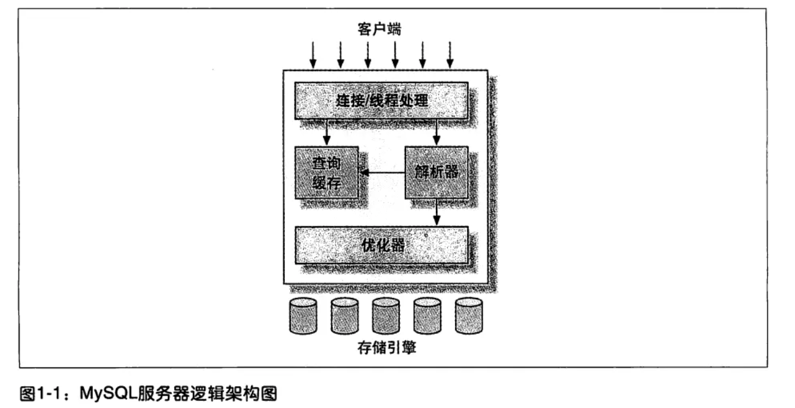
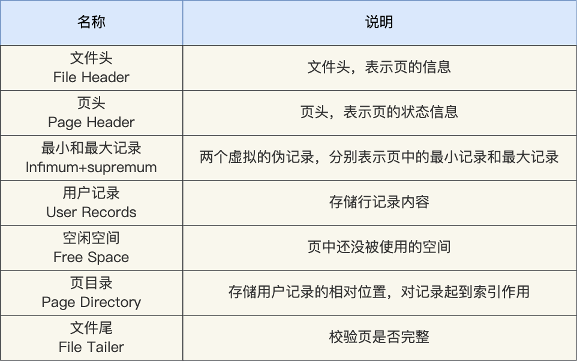

# MySQL 原理

## 架构

### MySQL 架构



最上层的服务并不是 MySQL 独有的，大多数基于网络的客户端 / 服务器的工具或者服务都有类似的架构。比如连接处理、授权认证、安全等等。

第二层架构是 MySQL 比较有意思的部分。大多数 MySQL 的核心服务功能都在这一层，包括查询解析、分析、优化、缓存以及所有的内置函数（例如，日期、时间、数学和加密函数），所有跨存储引擎的功能都在这一层实现：存储过程、触发器、视图等。

第三层包含了存储引擎。存储引擎负责 MySQL 中数据的存储和提取。和 GNU/Linux 下的各种文件系统一样，每个存储引擎都有它的优势和劣势。服务器通过 API 与存储引擎进行通信。这些接口屏蔽了不同存储引擎之间的差异，使得这些差异对上层的查询过程透明。存储引擎 API 包含几十个底层函数，用于执行诸如“开始一个事务”，或者“根据主键提取一行记录”等操作。但存储引擎不会去解析 SQL（InnoDB是例外，它会解析外键定义，因为 MySQL 服务器本身没有实现该功能。），不同存储引擎之间也不会相互通信，而只是简单地响应上层服务器的请求。

每个客户端连接都会在服务器进程中拥有一个线程，这个连接的查询只会在这个单独的线程中执行，该线程只能轮流在某个 CPU 核心或者 CPU 中运行。服务器会负责缓存线程，因此不需要为每一个新建的连接创建或者销毁线程。

当客户端（应用）连接到 MySQL 服务器时，服务器需要对其进行认证。认证基于用户名、原始主机信息和密码。如果使用了安全套接字（SSL）的方式连接，还可以使用 X.509 证书认证。一旦客户端连接成功，服务器会继续验证该客户端是否具有执行某个特定查询的权限（例如，是否允许客户端对 world 数据库的 Country 表执行 SELECT 语句）。

MySQL 会解析查询，并创建内部数据结构（解析树），然后对其进行各种优化，包括重写查询、决定表的读取顺序，以及选择合适的索引等。用户可以通过特殊的关键字提示（hint）优化器，影响它的决策过程。也可以请求优化器解释（explain）优化过程的各个因素，使用户可以知道服务器是如何进行优化决策的，并提供一个参考基准，便于用户重构查询和 schema、修改相关配置，使应用尽可能高效运行。

优化器并不关心使用的是什么存储引擎，但存储引擎对于优化查询是有影响的。优化器会请求存储引擎提供容量或某个具体操作的开销信息，以及表数据的统计信息等。例如，某些存储引擎的某种索引，可能对一些特定的查询有优化。

对于 SELECT 语句，在解析查询之前，服务器会先检查查询缓存（Query Cache），如果能够在其中找到对应的查询，服务器就不必再执行查询解析、优化和执行的整个过程，而是直接返回查询缓存中的结果集。

### 一条 SQL 的执行过程

#### MySQL 执行流程是怎样的？


可以看到，MySQL 的架构共分为两层：Server 层和存储引擎层，

- Server 层负责建立连接、分析和执行 SQL。MySQL 大多数的核心功能模块都在这实现，主要包括连接器，查询缓存、解析器、预处理器、优化器、执行器等。另外，所有的内置函数（如日期、时间、数学和加密函数等）和所有跨存储引擎的功能（如存储过程、触发器、视图等。）都在 Server 层实现。
- 存储引擎层负责数据的存储和提取。支持 InnoDB、MyISAM、Memory 等多个存储引擎，不同的存储引擎共用一个 Server 层。现在最常用的存储引擎是 InnoDB，从 MySQL 5.5 版本开始， InnoDB 成为了 MySQL 的默认存储引擎。我们常说的索引数据结构，就是由存储引擎层实现的，不同的存储引擎支持的索引类型也不相同，比如 InnoDB 支持索引类型是 B+树 ，且是默认使用，也就是说在数据表中创建的主键索引和二级索引默认使用的是 B+ 树索引。

#### 第一步：连接器

如果在 Linux 操作系统里使用 MySQL，那第一步肯定是要先连接 MySQL 服务，然后才能执行 SQL 语句，普遍使用下面这条命令进行连接：

```mysql
# -h 指定 MySQL 服务得 IP 地址，如果是连接本地的 MySQL服务，可以不用这个参数；
# -u 指定用户名，管理员角色名为 root；
# -p 指定密码，如果命令行中不填写密码（为了密码安全，建议不要在命令行写密码），就需要在交互对话里面输入密码
mysql -h$ip -u$user -p
```

连接的过程需要先经过 TCP 三次握手，因为 MySQL 是基于 TCP 协议进行传输的，如果 MySQL 服务并没有启动，则会报错。

如果 MySQL 服务正常运行，完成 TCP 连接的建立后，连接器就要开始验证你的用户名和密码，如果用户名或密码不对，就收到一个 "Access denied for user" 的错误，然后客户端程序结束执行。

如果用户密码都没有问题，连接器就会获取该用户的权限，然后保存起来，后续该用户在此连接里的任何操作，都会基于连接开始时读到的权限进行权限逻辑的判断。

所以，如果一个用户已经建立了连接，即使管理员中途修改了该用户的权限，也不会影响已经存在连接的权限。修改完成后，只有再新建的连接才会使用新的权限设置。

> 如何查看 MySQL 被多少个客户端连接了？

如果想知道当前 MySQL 服务被多少个客户端连接了，可以执行`show processlist`命令进行查看。

> 空闲连接会一直占用着吗？

当然不是，MySQL 定义了空闲连接的最大空闲时长，由 wait_timeout 参数控制的，默认值是 8 小时（28880秒），如果空闲连接超过了这个时间，连接器就会自动将它断开。

```mysql
mysql> show variables like 'wait_timeout';
+---------------+-------+
| Variable_name | Value |
+---------------+-------+
| wait_timeout  | 28800 |
+---------------+-------+
1 row in set (0.00 sec)
```

也可以手动断开空闲的连接，使用的是`kill connection + id`的命令。

```mysql
mysql> kill connection +6;
Query OK, 0 rows affected (0.00 sec)
```

一个处于空闲状态的连接被服务端主动断开后，这个客户端并不会马上知道，等到客户端在发起下一个请求的时候，才会收到报错`ERROR 2013 (HY000): Lost connection to MySQL server during query`。

> MySQL 的连接数有限制吗？

MySQL 服务支持的最大连接数由 max_connections 参数控制，比如我的 MySQL 服务默认是 151 个，超过这个值，系统就会拒绝接下来的连接请求，并报错提示“Too many connections”。

```mysql
mysql> show variables like 'max_connections';
+-----------------+-------+
| Variable_name   | Value |
+-----------------+-------+
| max_connections | 151   |
+-----------------+-------+
1 row in set (0.00 sec)
```

MySQL 的连接也跟 HTTP 一样，有短连接和长连接的概念，它们的区别如下：

```mysql
// 短连接
连接 mysql 服务（TCP 三次握手）
执行sql
断开 mysql 服务（TCP 四次挥手）

// 长连接
连接 mysql 服务（TCP 三次握手）
执行sql
执行sql
执行sql
....
断开 mysql 服务（TCP 四次挥手）
```

可以看到，使用长连接的好处就是可以减少建立连接和断开连接的过程，所以一般是推荐使用长连接。

但是，使用长连接后可能会占用内存增多，因为 MySQL 在执行查询过程中临时使用内存管理连接对象，这些连接对象资源只有在连接断开时才会释放。如果长连接累计很多，将导致 MySQL 服务占用内存太大，有可能会被系统强制杀掉，这样会发生 MySQL 服务异常重启的现象。

> 怎么解决长连接占用内存的问题？

有两种解决方式。

第一种，定期断开长连接。既然断开连接后就会释放连接占用的内存资源，那么我们可以定期断开长连接。

第二种，客户端主动重置连接。MySQL 5.7 版本实现了`mysql_reset_connection()`函数的接口，注意这是接口函数不是命令，那么当客户端执行了一个很大的操作后，在代码里调用`mysql_reset_connection()`来充值连接，达到释放内存的效果。这个过程不需要重连和重新做权限验证，但是会将连接恢复到刚刚创建完时的状态。

至此，连接器的工作做完了，简单总结一下：

- 与客户端进行 TCP 三次握手建立连接；
- 校验客户端的用户名和密码，如果用户名或密码不对，则会报错；
- 如果用户名和密码都对了，会读取该用户的权限，然后后面的权限逻辑判断都基于此时读取到的权限；

#### 第二步：查询缓存

连接器的工作完成后，客户端就可以向 MySQL 服务发送 SQL 语句了，MySQL 服务收到 SQL 语句后，就会解析出 SQL 语句的第一个字段，看看是什么类型的语句。

如果 SQL 是查询语句（select 语句），MySQL 就会先去查询缓存（ Query Cache ）里查找缓存数据，看看之前有没有执行过这一条命令，这个查询缓存是以 key-value 形式保存在内存中的，key 为 SQL 查询语句，value 为 SQL 语句查询的结果。

如果查询的语句命中查询缓存，那么就会直接返回 value 给客户端。如果查询的语句没有命中查询缓存中，那么就要往下继续执行，等执行完后，查询的结果就会被存入查询缓存中。

对于更新比较频繁的表，查询缓存的命中率很低的，因为只要一个表有更新操作，那么这个表的查询缓存就会被清空。

所以，MySQL 8.0 版本直接将查询缓存删掉了，也就是说 MySQL 8.0 开始，执行一条 SQL 查询语句，不会再走到查询缓存这个阶段了。

对于 MySQL 8.0 之前的版本，如果想关闭查询缓存，我们可以通过将参数 query_cache_type 设置成 DEMAND。

注意，这里说的查询缓存是 server 层的，也就是 MySQL 8.0 版本移除的是 server 层的查询缓存，并不是 Innodb 存储引擎中的 buffer pool。

#### 第三步：解析 SQL

在正式执行 SQL 查询语句之前，MySQL 会先对 SQL 语句做解析，这个工作交由「解析器」来完成。

##### 解析器

解析器会做如下两件事情。

第一件事情，词法分析。MySQL 会根据输入的字符串识别出关键字出来，构建出 SQL 语法树，这样方便后面模块获取 SQL 类型、表名、字段名、where 条件等等。

第二件事情，语法分析。根据词法分析的结果，语法解析器会根据语法规则，判断输入的这个 SQL 语句是否满足 MySQL 语法。如果输入的 SQL 语句语法不对，就会在解析器这个阶段报错。

但是注意，表不存在或者字段不存在，并不是在解析器里做的。

#### 第四步：执行 SQL

经过解析器后，接着就要进入执行 SQL 查询语句的流程了，每条 SELECT 查询语句流程主要可以分为下面这三个阶段：

- prepare 阶段，也就是预处理阶段；
- optimize 阶段，也就是优化阶段；
- execute 阶段，也就是执行阶段；

##### 预处理器

预处理阶段做了如下事情：

- 检查 SQL 查询语句中的表或者字段是否存在；
- 将`select *`中的`*`富豪扩展为表上的所有列；

如果表不存在。这时 MySQL 就会在执行 SQL 查询语句的 prepare 阶段中报错。

##### 优化器

经过预处理阶段后，还需要为 SQL 查询语句先制定一个执行计划，这个工作交由「优化器」来完成的。

优化器主要负责将 SQL 查询语句的执行方案确定下来，比如在表里面有多个索引的时候，优化器会基于查询成本的考虑，来决定选择使用哪个索引。

要想知道优化器选择了哪个索引，可以在查询语句最前面加个`explain`命令，这样就会输出这条 SQL 语句的执行计划，然后执行计划中的 key 就表示执行过程中使用了哪个索引。

如果查询语句的执行计划里的 key 为 null 说明没有使用索引，那就会全表扫描（type = ALL），这种查询扫描的方式是效率最低档次的。

##### 执行器

经历完优化器后，就确定了执行方案，接下来 MySQL 就真正开始执行语句了，这个工作是由「执行器」完成的。在执行的过程中，执行器就会和存储引擎交互了，交互是以记录为单位的。

接下来，用三种方式执行过程，描述一下执行器和存储引擎的交互过程。

- 主键索引查询
- 全表扫描
- 索引下推

###### 主键索引查询

```mysql
select * from product where id = 1;
```

这条查询语句的查询条件用到了主键索引，而且是等值查询，同时主键 id 是唯一，不会有 id 相同的记录，所以优化器决定选用访问类型为 const 进行查询，也就是使用主键索引查询一条记录，那么执行器与存储引擎的执行流程是这样的：

- 执行器第一次查询，会调用 read_first_record 函数指针指向的函数，因为优化器选择的访问类型为 const，这个函数指针被指向为 InnoDB 引擎索引查询的接口，把条件 id = 1 交给存储引擎，让存储引擎定位符合条件的第一条记录。
- 存储引擎通过主键索引的 B+ 树结构定位到 id = 1 的第一条记录，如果记录是不存在的，就会向执行器上报记录找不到的错误，然后查询结束。如果记录是存在的，就会将记录返回给执行器；
- 执行器从存储引擎读到记录后，接着判断记录是否符合查询条件，如果符合则发送给客户端，如果不符合则跳过该记录。
- 执行器查询的过程是一个 while 循环，所以还会再查一次，但是这次因为不是第一次查询了，所以会调用 read_record 函数指针指向的函数，因为优化器选择的访问类型为 const，这个函数指针被指向为一个永远返回 - 1 的函数，所以当调用该函数的时候，执行器就退出循环，也就是结束查询了。

至此，这个语句就执行完成了。

###### 全表扫描

```mysql
select * from product where name = 'iphone';
```

这条查询语句的查询条件没有用到索引，所以优化器决定选用访问类型为 ALL 进行查询，也就是全表扫描的方式查询，那么这时执行器与存储引擎的执行流程是这样的：

- 执行器第一次查询，会调用 read_first_record 函数指针指向的函数，因为优化器选择的访问类型为 all，这个函数指针被指向为 InnoDB 引擎全扫描的接口，让存储引擎读取表中的第一条记录；
- 执行器会判断读到的这条记录的 name 是不是 iphone，如果不是则跳过；如果是则将记录发给客户的（是的没错，Server 层每从存储引擎读到一条记录就会发送给客户端，之所以客户端显示的时候是直接显示所有记录的，是因为客户端是等查询语句查询完成后，才会显示出所有的记录）。
- 执行器查询的过程是一个 while 循环，所以还会再查一次，会调用 read_record 函数指针指向的函数，因为优化器选择的访问类型为 all，read_record 函数指针指向的还是 InnoDB 引擎全扫描的接口，所以接着向存储引擎层要求继续读刚才那条记录的下一条记录，存储引擎把下一条记录取出后就将其返回给执行器（Server层），执行器继续判断条件，不符合查询条件即跳过该记录，否则发送到客户端；

至此，这个语句就执行完成了。

###### 索引下推

索引下推能够减少二级索引在查询时的回表操作，提高查询的效率，因为它将 Server 层部分负责的事情，交给存储引擎层去处理了。 

举个例子，表如下，对 age 和 reward 字段建立了联合索引：


```mysql
select * from t_user  where age > 20 and reward = 100000;
```

联合索引当遇到范围查询（>、<）就会停止匹配，也就是 age 字段能用到联合索引，但是 reward 字段则无法利用到索引。

那么，不使用索引下推（MySQL 5.6 之前的版本）时，执行器与存储引擎的执行流程是这样的：

- Server 层首先调用存储引擎的接口定位到满足查询条件的第一条二级索引记录，也就是定位到 age > 20 的第一条记录；
- 存储引擎根据二级索引的 B+ 树快速定位到这条记录后，获取主键值，然后进行回表操作，将完整的记录返回给 Server 层；
- Server 层在判断该记录的 reward 是否等于 100000，如果成立则将其发送给客户端；否则跳过该记录；
- 接着，继续向存储引擎索要下一条记录，存储引擎在二级索引定位到记录后，获取主键值，然后回表操作，将完整的记录返回给 Server 层；
- 如此往复，直到存储引擎把表中的所有记录读完。

可以看到，没有索引下推的时候，每查询到一条二级索引记录，都要进行回表操作，然后将记录返回给 Server，接着 Server 再判断该记录的 reward 是否等于 100000 的工作交给了存储引擎层，过程如下：

- Server 层首先调用存储引擎的接口定位到满足查询条件的第一条二级索引记录，也就是定位到 age > 20 的第一条记录；
- 存储引擎定位到二级索引后，先不执行回表操作，而是先判断一下该索引中包含的列（reward列）的条件（reward 是否等于 100000）是否成立。如果条件不成立，则直接跳过该二级索引。如果成立，则执行回表操作，将完成记录返回给 Server 层。
- Server 层在判断其他的查询条件（本次查询没有其他条件）是否成立，如果成立则将其发送给客户端；否则跳过该记录，然后向存储引擎索要下一条记录。
- 如此往复，直到存储引擎把表中的所有记录读完。

可以看到，使用了索引下推后，虽然 reward 列无法使用到联合索引，但是因为它包含在联合索引（age，reward）里，所以直接在存储引擎过滤出满足 reward = 100000 的记录后，才去执行回表操作获取整个记录。相比于没有使用索引下推，节省了很多回表操作。

当你发现执行计划里的 Extr 部分显示了 “Using index condition”，说明使用了索引下推。

### 引擎分类

#### MySQL MySQL 存储引擎有哪些？

MyISAM、InnoDB、Merge、Memory(HEAP)、BDB(BerkeleyDB)、Example、Federated、Archive、CSV、Blackhole.....

#### Innodb 和 MyISAM 存储引擎有什么区别？

##### 磁盘文件的对比

使用MyISAM引擎的表：zz_myisam_index，会在本地生成三个磁盘文件：

- zz_myisam_index.frm：该文件中存储表的结构信息。
- zz_myisam_index.MYD：该文件中存储表的行数据。
- zz_myisam_index.MYI：该文件中存储表的索引数据。

MyISAM 引擎的表数据和索引数据，会分别放在两个不同的文件中存储。

而使用 InnoDB 引擎的表：zz_innodb_index，在磁盘中仅有两个文件：

- zz_innodb_index.frm：该文件中存储表的结构信息。
- zz_innodb_index.ibd：该文件中存储表的行数据和索引数据。

##### 索引支持的对比

因为 MyISAM 引擎在设计之初，会将表分为`.frm`、`.MYD`、`.MYI`三个文件放在磁盘存储，表数据和索引数据是分别放在`.MYD`、`.MYI`文件中，所以注定了 MyISAM 引擎只支持非聚簇索引。而 InnoDB 引擎的表数据、索引数据都放在`.ibd`文件中存储，因此 InnoDB 是支持聚簇索引的。

聚簇索引的要求是：索引键和行数据必须在物理空间上也是连续的，而MyISAM表数据和索引数据，分别位于两个磁盘文件中，这也就注定了它无法满足聚簇索引的要求。

但不支持聚簇索引也有好处，也就是无论走任何索引，都只需要一遍查询即可获得数据，而InnoDB引擎的表中，如果不走聚簇（主键）索引查询数据，走其他索引的情况下，都需要经过两遍（回表）查询才能获得数据。

##### 事务机制的对比

InnoDB 引擎中有两个自己专享的日志，即`undo-log`、`redo-log`，先来说说`undo-log`日志，InnoDB 在 MySQL 启动后，会在内存中构建一个`undo_log_buffer`缓冲区，同时在磁盘中也有相应的`undo-log`日志文件。

一条写入类型的SQL语句，在正式执行前都会先记录redo-log、undo-log日志，undo-log中会记录变更前的旧数据，当一个事务提交时，MySQL会正常的将数据落盘，而当一个事务碰到rollback命令需要回滚时，就会找到undo-log中记录的旧数据，接着用来覆盖变更过的新数据，以此做到将数据回滚到变更前的“样貌”。

> 使用 InnoDB 存储引擎的表，可以借助 undo-log 日志实现事务机制，支持多条 SQL 组成一个事务，可以保证发生异常的情况下，组成这个事务的 SQL 到底回滚还是提交。而 MyISAM 并未设计类似的技术，在启动时不会在内存中构建 undo_log_buffer 缓冲区，磁盘中也没有相应的日志文件，因此 MyISAM 并不支持事务机制。

一个引擎是否支持事务，这点尤为重要，因为业务开发过程中，咱们需要关注数据的安全性，拿最为经典的下单为例，用户把钱都付了，总不能由于程序 Bug，然后不给用户新增订单、物流信息吧？再不济至少也要把钱退回给用户，因此就需要用到事务机制来保证原子性。

所以，如果表结构用了 MyISAM 引擎，想要解决这类问题，就只能在客户端做事务补偿，比如上面这个情况，当用户付钱后执行出现异常了，就在客户端中记录一下，然后再向 MySQL 发送一条相应的反 SQL，以此来保障数据的一致性。

##### 故障恢复的对比

接着再来看看`redo-log`日志，InnoDB 在启动时，同样会在内存中构建一个`redo_log_buffer`缓冲区，在磁盘中也会有相应的`redo-log`日志文件，所以当一条或多条 SQL 语句执行成功后，不论 MySQL 在何时宕机，只要这个事务提交了，InnoDB 引擎都能确保该事务的数据不会丢失，也就以此保障了事务的持久性。

InnoDB引擎由于`redo-log`日志的存在，因此只要事务提交，机器断电、程序宕机等各种灾难情况，都可以用`redo-log`日志来恢复数据。但 MyISAM 引擎同样没有`redo-log`日志，所以并不支持数据的故障恢复，如果表是使用 MyISAM 引擎创建的，当一条 SQL 将数据写入到了缓冲区后，SQL 还未被写到`bin-log`日志，此时机器断电、DB 宕机了，重启之后由于数据在宕机前还未落盘，所以丢了也就无法找回。

> 从这一点来说，MyISAM 并没有 InnoDB 引擎可靠，在 InnoDB 中只要事务提交，它就能确保数据永远不丢失，但 MyISAM 不行。这就好比咱们去银行存钱，去 InnoDB 银行存，你只需要把钱送到它那里，它就能确保你的财产安全，但如若去 MyISAM 银行存钱，你必须要把钱送到银行的保险库中才行，否则有可能会因为在送往保险库的过程中“丢失”财产。

##### 锁粒度的对比

MySQL 的存储引擎中，MyISAM 仅支持表锁，而 InnoDB 同时支持表锁、行锁。

为什么 MyISAM 引擎不支持行锁？

举个例子：

```mysql
select * from zz_students;
+------------+--------+------+--------+
| student_id | name   | sex  | height |
+------------+--------+------+--------+
|          1 | 竹子   | 男   | 185cm  |
|        ... | ....   | ..   | .....  |
+------------+--------+------+--------+
```

上述这张学生表中，假设使用的是 MyISAM 引擎，同时对`student_id`字段建立了主键索引，`name`字段建立了普通索引，`sex`、`height`字段建立了联合索引，此时先不管索引合不合理，以目前情况为例，来推导一下 MyISAM 表为啥无法实现行锁。

> 这张表中存在三个索引，那在本地的 .MYI 索引文件中，肯定存在三颗 B+ 树，同时由于 MyISAM 不支持聚簇索引，所以这三个索引是平级的，每棵 B+ 树的索引键，都直接指向 .MYD 数据文件中的行数据地址。

假设 MyISAM 要实现行锁，当要对一个行数据加锁时，可以锁定一棵树中某一个数据，但无法锁定其他树的行数据，举个例子：

```mysql
select * from zz_students where student_id = 1 for update;
```

这条 SQL 必然会走主键索引命中数据，那假设此时对主键索引树上，`ID=1`的数据加锁，接着再来看一种情况：

```mysql
select * from zz_students where name = "竹子" for update;
```

此时这条SQL又会走name字段的普通索引查询数据，那此时又对普通索引树上的「竹子」数据加锁。

> 上面的案例中，MyISAM 如果想要实现行锁，就会遇到这个问题，基于不同索引查询数据时，可能会导致一行数据上加多个锁！这样又会导致多条线程同时操作一个数据，所以又会因为多线程并发执行的原因，造成脏读、幻读、不可重复读这系列问题出现。

但 InnoDB 因为支持聚簇索引，表中就算没有显式定义主键，内部依旧会用一个隐藏列来作为聚簇索引的索引字段，所以 InnoDB 表中的索引，是有主次之分的，所有的次级索引，其索引值都存储聚簇索引的索引键，因此想要对一行数据加锁时，只需要锁定聚簇索引的数据即可。

```mysql
-- 通过主键索引查询数据
select * from zz_students where student_id = 1 for update;
-- 通过普通索引查询数据
select * from zz_students where name = "竹子" for update;
```

依旧是前面的这个例子，通过主键索引查询的 SQL 语句，会直接定位到聚簇索引的数据，然后对`ID=1`的数据加锁。而第二条通过普通索引查询数据的SQL语句，经过查询后会得到一个值：`ID=1`，然后会拿着这个`ID=1`的值再去回表，在聚簇索引中再次查询`ID=1`的数据，找到之后发现上面已经有线程加锁了，当前线程就会阻塞等待上一个线程释放锁。

因为 MyISAM 引擎不支持聚簇索引，所以无法实现行锁，出现多条线程同时读写数据时，只能锁住整张表。而 InnoDB 由于支持聚簇索引，每个索引最终都会指向聚簇索引中的索引键，因此出现并发事务时，InnoDB 只需要锁住聚簇索引的数据即可，而不需要锁住整张表，因此并发性能更高。

> 同时，InnoDB 引擎构建的缓冲区中，会专门申请一块内存作为锁空间，同时再结合 InnoDB 支持事务，所以 InnoDB 是基于事务来生成锁对象，相较于 SQL Server 的行锁来说，InnoDB 的行锁会更节约内存。

##### 并发性能的对比

MyISAM 仅支持表锁，InnoDB 同时支持表锁、行锁，由于这点原因，其实 InnoDB 引擎的并发支持性早已远超 MyISAM 了，毕竟锁的粒度越小，并发冲突的概率也就越低，因此并发支撑就越高。

> 但是 InnoDB 不仅仅只满足于此，为了提升读-写并存场景下的并发度，InnoDB 引擎又基于 undo-log 日志的版本链+事务快照，又推出了 MVCC 多版本并发控制技术，因此对于读-写共存的场景支持并发执行。

但 MyISAM 只支持表锁，因此当一条 SQL 在写数据时，其他 SQL 就算是来读数据的，也需要阻塞等待，为啥呢？因为写数据时需要加排他锁，这是一种独占类型的锁，会排斥一切尝试获取锁的线程，反过来也是同理，当一条线程在读数据时，另一条线程来写数据，依旧会陷入阻塞等待，毕竟写数据要获取排他锁，也就意味着整张表只允许这一个线程操作。

##### 内存利用度的对比

MySQL 在线上运行的时间够久，InnoDB 甚至会将磁盘中的所有数据，全部载入内存，然后所有客户端的读写请求，基本上无需再走磁盘来完成，都采用异步IO的方式完成，即先写内存+后台线程刷写的方式执行，后台线程的刷盘动作，对客户端而言不会有任何感知，在写完内存之后就会直接向客户端返回。

通过缓冲池结合异步IO技术，活生生将一款基于磁盘的引擎，演变成了半内存式的引擎。反观 MyISAM 引擎，内部虽然也有缓冲池以及异步 IO 技术，但对内存的开发度远不足于 InnoDB 引擎，运行期间大量操作依旧会走磁盘完成。

##### 总结

- 存储方式：MyISAM 引擎会将表数据和索引数据分成两个文件存储。
- 索引支持：因为 MyISAM 引擎的表数据和索引数据是分开的，因此不支持聚簇索引。
- 事务支持：由于 MyISAM 引擎没有`undo-log`日志，所以不支持多条 SQL 组成事务并回滚。
- 故障恢复：MyISAM 引擎依靠`bin-log`日志实现，`bin-log`中未写入的数据会永久丢失。
- 锁粒度支持：因为 MyISAM 不支持聚簇索引，因此无法实现行锁，所有并发操作只能加表锁。
- 并发性能：MyISAM 引擎仅支持表锁，所以多条线程出现读-写并发场景时会阻塞。
- 内存利用度：MyISAM 引擎过于依赖 MySQL Server，对缓冲池、异步 IO 技术开发度不够。

#### MyISAM 引擎真的一无是处吗？

##### 统计总数的优化

```mysql
select count(*) from `table_name`;
```

好比要统计订单数、平台用户总数、会员数.....各类需求，基本上都会在数据库中执行`count()`操作，对于`count()`统计行数的操作，在 MyISAM 引擎中会记录表的行数，也就是当执行`count()`时，如果表是 MyISAM 引擎，则可以直接获取之前统计的值并返回。

> 但这个特性在 InnoDB 引擎中是不具备的，当你在 InnoDB 中统计一张表的总数时，会触发全表扫描，InnoDB 会一行行的去统计表的行数。

但是 MyISAM 的这个特性也仅仅只适用于统计全表数据量，如果后面跟了 where 条件：

```mysql
select count(*) from `table_name` where xxx = "xxx";
```

如果是这种情况，那 InnoDB、MyISAM 的工作模式是相同的，先根据 where 后的条件查询数据，再一行行统计总数。

##### 删除数据/表的优化

当使用`delete`命令清空表数据时，如下：

```mysql
delete from `table_name`;
```

MyISAM 会直接重新创建表数据文件，而 InnoDB 则是一行行删除数据，因此对于清空表数据的操作，MyISAM 比 InnoDB 快上无数倍。同时 MyISAM 引擎的表，对于`delete`过的数据不会立即删除，而且先隐藏起来，后续定时删除或手动删除，手动强制清理的命令如下：

```mysql
optimize table `table_name`;
```

这样做有一点好处，就是当你误删一张表的大量数据时，只要你手速够快，手动将本地的`.MYD`、`.MYI`文件拷贝出去，就可以直接基于这两个数据文件恢复数据，而不需要通过日志或第三方工具修复数据。

##### CRUD 速度更快

因为 InnoDB 支持聚簇索引，因此整个表数据都会和聚簇索引一起放在一颗 B+ 树中存储，就算当你没有定义主键时，InnoDB 也会定义一个隐式字段 ROW_ID 来作为聚簇索引字段，这也就意味着：在 InnoDB 的表中，这个聚簇索引你不要也得要！

当查询数据时，如果在基于非聚簇索引查找数据，就算查到了也需要经过一次回表才能得到数据，同时插入数据、修改数据时，都需要维护聚簇索引和非聚簇索引之间的关系。

而 MyISAM 引擎中，所有已创建的索引都是非聚簇索引，每个索引之间都是独立的，在索引中存储的是直接指向行数据的地址，而并非聚簇索引的索引键，因此无论走任何索引，都仅需一次即可获得数据，无需做回表查询。

同时写数据时，也不需要维护不同索引之间的关系，毕竟每个索引都是独立的，因此MyISAM 在理论上，读写数据的效率会高于 InnoDB 引擎。不过放在实际的生产环境中，这条理论是行不通的。

##### MyISAM 真的比 InnoDB 快吗？

如果是对比单个客户端连接的读写性能，那自然 MyISAM 远超于 InnoDB 引擎，毕竟 InnoDB 需要维护聚簇索引，而 MyISAM 因为每个索引都是独立的，因此插入表数据时都是直接追加在表数据文件的末尾即可，而且修改数据也不需要维护其他索引和聚簇索引的关系。

随着连接数的增加，工作线程会不断增加，CPU 使用核数也会不断增加，而 InnoDB 的性能会逐步上升，但 MyISAM 引擎基本上没有太大变化，基本上从头到尾一直都很低。原因是锁机制导致的。

> MyISAM 引擎仅支持表锁，也就意味着无论有多少个客户端连接到来，对于同一张表永远只能允许一条线程操作，除非多个连接都是在读数据，才不会相互排斥。

InnoDB 引擎，由于支持行锁，所以并发冲突很小，在高并发、多连接的场景中，性能会更加出色，而 MyISAM 引擎基本上在并发读写场景中，一张表只允许单线程操作，因此并发冲突很大，吞吐量会因此严重下降。

##### MyISAM 的压缩机制

如今的数据库随着业务发展，数据量的增长一天一个新变化，时间不断推移，数据只会越来越大，这时就很容易出现以下两个问题：

- IO 瓶颈：DB 数据量过大，导致内存无法载入太多数据，会触发大量磁盘 IO，让 DB 整体性能降低。
- 磁盘空间不足：随着业务的发展，部署数据库的机器磁盘无法存储数据，需要不断扩容硬件。

而MyISAM引擎为了解决这个问题，可以通过 myisampack 工具对数据表进行压缩，压缩的效果至少能让数据缩小一半，但压缩后的数据只可读，不可写，这点要牢记！

到了MySQL5.7版本中，该特性也被移植到了InnoDB引擎中，相关的压缩参数如下：

- innodb_compression_level：调整压缩的级别，可控范围在1~9，越高压缩效果越好，但压缩速度也越慢。
- innodb_compression_failure_threshold_pct：当压缩失败的数据页超出该比例时，会加入数据填充来减小失败率，为0表示禁止填充。
- innodb_compression_pad_pct_max：一个数据页中最大允许填充多少比例的空白数据。
- innodb_log_compressed_pages：控制是否对redo-log日志的数据也开启压缩机制。
- innodb_cmp_per_index_enabled：是否对索引文件开启压缩机制。

## InnoDB 存储引擎

### 一行记录的存储格式

#### MySQL 的数据存放在哪个文件？

MySQL 的数据都是保存在磁盘的，那具体是保存在哪个文件呢？

MySQL 存储的行为是由存储引擎实现的，MySQL 支持多种存储引擎，不同的存储引擎保存的文件自然也不同。

以 InnoDB 为例，先看看 MySQL 数据库的文件存放在哪个目录。

```mysql
mysql> SHOW VARIABLES LIKE 'datadir';
+---------------+-----------------+
| Variable_name | Value           |
+---------------+-----------------+
| datadir       | /var/lib/mysql/ |
+---------------+-----------------+
1 row in set (0.00 sec)
```

我们每创建一个 database（数据库）都会在`/var/lib/mysql/`目录里面创建一个以 database 为名的目录，然后保存表结构和表数据的文件都会存放在这个目录里。

比如，我这里有一个名为 my_test 的 database，该 database 里有一张名为 t_order 数据库表。

```mysql
[root@xiaolin ~]#ls /var/lib/mysql/my_test
db.opt  
t_order.frm  
t_order.ibd
```

可以看到，共有三个文件，这三个文件分别代表着：

- db.opt，用来存储当前数据库的默认字符集和字符校验规则。
- t_order.frm ，t_order 的表结构会保存在这个文件。在 MySQL 中建立一张表都会生成一个.frm 文件，该文件是用来保存每个表的元数据信息的，主要包含表结构定义。
- t_order.ibd，t_order 的表数据会保存在这个文件。表数据既可以存在共享表空间文件（文件名：ibdata1）里，也可以存放在独占表空间文件（文件名：表名字.ibd）。这个行为是由参数 innodb_file_per_table 控制的，若设置了参数 innodb_file_per_table 为 1，则会将存储的数据、索引等信息单独存储在一个独占表空间，从 MySQL 5.6.6 版本开始，它的默认值就是 1 了，因此从这个版本之后， MySQL 中每一张表的数据都存放在一个独立的 .ibd 文件。

好了，现在我们知道了一张数据库表的数据是保存在「 表名字.ibd 」的文件里的，这个文件也称为独占表空间文件。

##### 表空间文件的结构是怎么样的？

表空间由段（segment）、区（extent）、页（page）、行（row）组成，InnoDB存储引擎的逻辑存储结构大致如下图：


1. 行（row）

数据库表中的记录都是按行（row）进行存放的，每行记录根据不同的行格式，有不同的存储结构。

2. 页（page）

记录是按照行来存储的，但是数据库的读取并不以「行」为单位，否则一次读取（也就是一次 I/O 操作）只能处理一行数据，效率会非常低。

因此，InnoDB 的数据是按「页」为单位来读写的，也就是说，当需要读一条记录的时候，并不是将这个行记录从磁盘读出来，而是以页为单位，将其整体读入内存。

默认每个页的大小为 16KB，也就是最多能保证 16KB 的连续存储空间。

页是 InnoDB 存储引擎磁盘管理的最小单元，意味着数据库每次读写都是以 16KB 为单位的，一次最少从磁盘中读取 16K 的内容到内存中，一次最少把内存中的 16K 内容刷新到磁盘中。

页的类型有很多，常见的有数据页、undo 日志页、溢出页等等。数据表中的行记录是用「数据页」来管理的。

3. 区（extent）

我们知道 InnoDB 存储引擎是用 B+ 树来组织数据的。

B+ 树中每一层都是通过双向链表连接起来的，如果是以页为单位来分配存储空间，那么链表中相邻的两个页之间的物理位置并不是连续的，可能离得非常远，那么磁盘查询时就会有大量的随机 I/O，随机 I/O 是非常慢的。

解决这个问题也很简单，就是让链表中相邻的页的物理位置也相邻，这样就可以使用顺序 I/O 了，那么在范围查询（扫描叶子节点）的时候性能就会很高。

那具体怎么解决？

在表中数据量大的时候，为某个索引分配空间的时候就不再按照页为单位分配了，而是按照区（extent）为单位分配。每个区的大小为 1MB，对于 16KB 的页来说，连续的 64 个页会被划为一个区，这样就使得链表中相邻的页的物理位置也相邻，就能使用顺序 I/O 了。

4. 段（segment）

表空间是由各个段（segment）组成的，段是由多个区（extent）组成的。段一般分为数据段、索引段和回滚段等。

- 索引段：存放 B + 树的非叶子节点的区的集合；
- 数据段：存放 B + 树的叶子节点的区的集合；
- 回滚段：存放的是回滚数据的区的集合。

#### InnoDB 行格式有哪些？

行格式（row_format），就是一条记录的存储结构。

InnoDB 提供了 4 种行格式，分别是 Redundant、Compact、Dynamic 和 Compressed 行格式。

- Redundant 是很古老的行格式了，MySQL 5.0 版本之前用的行格式，现在基本没人用了。
- 由于 Redundant 不是一种紧凑的行格式，所以 MySQL 5.0 之后引入了 Compact 行记录存储方式，Compact 是一种紧凑的行格式，设计的初衷就是为了让一个数据页中可以存放更多的行记录，从 MySQL 5.1 版本之后，行格式默认设置成 Compact。
- Dynamic 和 Compressed 两个都是紧凑的行格式，他们的行格式都和 Compact 差不多，因为都是基于 Compact 改进一点东西。从 MySQL 5.7 版本之后，默认使用 Dynamic 行格式。

#### Compact 行格式长什么样？


可以看到，一条完整的记录分为「记录的额外信息」和「记录的真实数据」两个部分。

##### 记录的额外信息

记录的额外信息包含 3 个部分：变长字段长度列表、NULL 值列表、记录头信息。

1. 变长字段长度列表

varchar(n) 和 char(n) 的区别是什么，char 是定长的，varchar 是变长的，变长字段实际存储的数据的长度（大小）不固定的。

所以，在存储数据的时候，也要把数据占用的大小存起来，存到「变长字段长度列表」里面，读取数据的时候才能根据这个「变长字段长度列表」去读取对应长度的数据。其他 TEXT、BLOB 等变长字段也是这么实现的。

为了展示「变长字段长度列表」具体是怎么保存「变长字段的真实数据占用的字节数」，我们先创建这样一张表，字符集是 ascii（所以每一个字符占用的 1 字节），行格式是 Compact，t_user 表中 name 和 phone 字段都是变长字段：

```mysql
CREATE TABLE `t_user` (
  `id` int(11) NOT NULL,
  `name` VARCHAR(20) DEFAULT NULL,
  `phone` VARCHAR(20) DEFAULT NULL,
  `age` int(11) DEFAULT NULL,
  PRIMARY KEY (`id`) USING BTREE
) ENGINE = InnoDB DEFAULT CHARACTER SET = ascii ROW_FORMAT = COMPACT;
```

现在 t_user 表里有这三条记录：


接下来，我们看看看看这三条记录的行格式中的 「变长字段长度列表」是怎样存储的。

先来看第一条记录：

- name 列的值为 a，真实数据占用的字节数是 1 字节，十六进制 0x01；
- phone 列的值为 123，真实数据占用的字节数是 3 字节，十六进制 0x03；
- age 列和 id 列不是变长字段，所以这里不用管。

这些变长字段的真实数据占用的字节数会按照列的顺序逆序存放，所以「变长字段长度列表」里的内容是「 03 01」，而不是 「01 03」。


同样可以得出第二条记录的行格式，「变长字段长度列表」里的内容是「 04 02」。

第三条记录中 phone 列的值是 NULL，NULL 时不会存放在行格式中记录的真实数据部分里的，所以「变长字段长度列表」里不需要保存值为 NULL 的变长字段的长度。

> 为什么「变长字段长度列表」的信息要按照逆序存放？

这个设计是用想法的，主要是因为「记录头信息」中指向下一个记录的指针，指向的是下一条记录的「记录头信息」和「真实数据」之间的位置，这样的好处是向左读就是记录头信息，向右读就是真实数据，比较方便。

「变长字段长度列表」中的信息之所以要逆序存放，是因为这样可以使得位置靠前的记录的真实数据和数据对应的字段长度信息可以同时在一个 CPU Cache Line 中，这样就可以提高 CPU Cache 的命中率。

同样的道理，NULL 值列表的信息也需要逆序存放。

> 每个数据库表的行格式都有「变长字段字节数列表」吗？

其实变长字段字节数列表不是必须的。

当数据表没有变长字段的时候，比如全部都是 int 类型的字段，这时候表里的行格式就不会有「变长字段长度列表」了，因为没必要，不如去掉以节省空间。

所以「变长字段长度列表」只出现在数据表有变长字段的时候。

2. NULL 值列表

表中的某些列可能会存储 NULL 值，如果把这些 NULL 值都放到记录的真实数据中会比较浪费空间，所以 Compact 行格式把这些值为 NULL 的列存储到 NULL 值列表中。

如果存在允许 NULL 值的列，则每个列对应一个二进制位（bit），二进制位按照列的顺序逆序排列。

- 二进制位的值为 1 时，代表该列的值为NULL。
- 二进制位的值为 0 时，代表该列的值不为NULL。

另外，NULL 值列表必须用整数个字节的位表示（1字节8位），如果使用的二进制位个数不足整数个字节，则在字节的高位补 0。

> 每个数据库表的行格式都有「NULL 值列表」吗？

NULL 值列表也不是必须的。

当数据表的字段都定义成 NOT NULL 的时候，这时候表里的行格式就不会有 NULL 值列表了。

所以在设计数据库表的时候，通常都是建议将字段设置为 NOT NULL，这样可以至少节省 1 字节的空间（NULL 值列表至少占用 1 字节空间）。

> 「NULL 值列表」是固定 1 字节空间吗？如果这样的话，一条记录有 9 个字段值都是 NULL，这时候怎么表示？

「NULL 值列表」的空间不是固定 1 字节的。

当一条记录有 9 个字段值都是 NULL，那么就会创建 2 字节空间的「NULL 值列表」，以此类推。

3. 记录头信息

记录头信息中包含的内容很多，我就不一一列举了，这里说几个比较重要的：

- delete_mask ：标识此条数据是否被删除。从这里可以知道，我们执行 detele 删除记录的时候，并不会真正的删除记录，只是将这个记录的 delete_mask 标记为 1。
- next_record：下一条记录的位置。从这里可以知道，记录与记录之间是通过链表组织的，指向的是下一条记录的「记录头信息」和「真实数据」之间的位置，这样的好处是向左读就是记录头信息，向右读就是真实数据，比较方便。
- record_type：表示当前记录的类型，0表示普通记录，1表示B+树非叶子节点记录，2表示最小记录，3表示最大记录。

##### 记录的真实数据

记录真实数据部分除了我们定义的字段，还有三个隐藏字段，分别为：row_id、trx_id、roll_pointer。

- row_id

如果我们建表的时候指定了主键或者唯一约束列，那么就没有 row_id 隐藏字段了。如果既没有指定主键，又没有唯一约束，那么 InnoDB 就会为记录添加 row_id 隐藏字段。row_id不是必需的，占用 6 个字节。

- trx_id

事务id，表示这个数据是由哪个事务生成的。 trx_id是必需的，占用 6 个字节。

- 这条记录上一个版本的指针。roll_pointer 是必需的，占用 7 个字节。

#### varchar(n) 中 n 最大取值为多少？

我们要清楚一点，MySQL 规定除了 TEXT、BLOBs 这种大对象类型之外，其他所有的列（不包括隐藏列和记录头信息）占用的字节长度加起来不能超过 65535 个字节。

也就是说，一行记录除了 TEXT、BLOBs 类型的列，限制最大为 65535 字节，注意是一行的总长度，不是一列。

知道了这个前提之后，我们再来看看这个问题：「varchar(n) 中 n 最大取值为多少？」

varchar(n) 字段类型的 n 代表的是最多存储的字符数量，并不是字节大小哦。

要算 varchar(n) 最大能允许存储的字节数，还要看数据库表的字符集，因为字符集代表着，1个字符要占用多少字节，比如 ascii 字符集， 1 个字符占用 1 字节，那么 varchar(100) 意味着最大能允许存储 100 字节的数据。

##### 单字段的情况

假设数据库表只有一个 varchar(n) 类型的列且字符集是 ascii，在这种情况下， varchar(n) 中 n 最大取值是 65535 吗？

举个例子：

```mysql
CREATE TABLE test ( 
`name` VARCHAR(65535)  NULL
) ENGINE = InnoDB DEFAULT CHARACTER SET = ascii ROW_FORMAT = COMPACT;
```

如果创建 varchar(65535) 类型的字段，字符集为 ascii 的数据库表，则会创建报错。也就是说，一行数据的最大字节数 65535，其实是包含「变长字段长度列表」和 「NULL 值列表」所占用的字节数的。所以， 我们在算 varchar(n) 中 n 最大值时，需要减去 storage overhead 占用的字节数。

这是因为我们存储字段类型为 varchar(n) 的数据时，其实分成了三个部分来存储：

- 真实数据
- 真实数据占用的字节数
- NULL 标识，如果不允许为NULL，这部分不需要

> 例子中的「NULL 值列表」所占用的字节数是多少？

创建表的时候，字段是允许为 NULL 的，所以会用 1 字节来表示「NULL 值列表」。

> 例子中的「变长字段长度列表」所占用的字节数是多少？

「变长字段长度列表」所占用的字节数 = 所有「变长字段长度」占用的字节数之和。

所以，我们要先知道每个变长字段的「变长字段长度」需要用多少字节表示？具体情况分为：

- 条件一：如果变长字段允许存储的最大字节数小于等于 255 字节（2 ^ 8 -1），就会用 1 字节表示「变长字段长度」；
- 条件二：如果变长字段允许存储的最大字节数大于 255 字节，就会用 2 字节表示「变长字段长度」；

这里字段类型是 varchar(65535) ，字符集是 ascii，所以代表着变长字段允许存储的最大字节数是 65535，符合条件二，所以会用 2 字节来表示「变长字段长度」。

因为我们这个案例是只有 1 个变长字段，所以「变长字段长度列表」= 1 个「变长字段长度」占用的字节数，也就是 2 字节。

因为我们在算 varchar(n) 中 n 最大值时，需要减去 「变长字段长度列表」和 「NULL 值列表」所占用的字节数的。所以，在数据库表只有一个 varchar(n) 字段且字符集是 ascii 的情况下，varchar(n) 中 n 最大值 = 65535 - 2 - 1 = 65532。

尝试用 varchar(65532) 创建成功了，所以，在算 varchar(n) 中 n 最大值时，需要减去 「变长字段长度列表」和 「NULL 值列表」所占用的字节数的。

当然，我上面这个例子是针对字符集为 ascii 情况，如果采用的是 UTF-8，varchar(n) 最多能存储的数据计算方式就不一样了：

- 在 UTF-8 字符集下，一个字符最多需要三个字节，varchar(n) 的 n 最大取值就是 65532/3 = 21844。 

##### 多字段的情况

如果有多个字段的话，要保证所有字段的长度 + 变长字段字节数列表所占用的字节数 + NULL值列表所占用的字节数 <= 65535。

#### 行溢出后，MySQL 是怎么处理的？

MySQL 中磁盘和内存交互的基本单位是页，一个页的大小一般是 16KB，也就是 16384字节，而一个 varchar(n) 类型的列最多可以存储 65532字节，一些大对象如 TEXT、BLOB 可能存储更多的数据，这时一个页可能就存不了一条记录。这个时候就会发生行溢出，多的数据就会存到另外的「溢出页」中。

如果一个数据页存不了一条记录，InnoDB 存储引擎会自动将溢出的数据存放到「溢出页」中。在一般情况下，InnoDB 的数据都是存放在「数据页」中。但是当发生行溢出时，溢出的数据会存放到「溢出页」中。

当发生行溢出时，在记录的真实数据处只会保存该列的一部分数据，而把剩余的数据放在「溢出页」中，然后真实数据处用 20 字节存储指向溢出页的地址，从而可以找到剩余数据所在的页。大致如图下所示：


上面这个是 Compact 行格式在发生行溢出后的处理。

Compressed 和 Dynamic 这两个行格式和 Compact 非常类似，主要的区别在于处理行溢出数据时有些区别。

这两种格式采用完全的行溢出方式，记录的真实数据处不会存储该列的一部分数据，只存储 20 个字节的指针来指向溢出页。而实际的数据都存储在溢出页中。

### 数据页

#### 从数据库的角度看 B+ 树

##### InnoDB 是如何存储数据的？

记录是按照行来存储的，但是数据库的读取并不以「行」为单位，否则一次读取（也就是一次 I/O 操作）只能处理一行数据，效率会非常低。

因此，InnoDB 的数据是按「数据页」为单位来读写的，也就是说，当需要读一条记录的时候，并不是将这个记录本身从磁盘读出来，而是以页为单位，将其整体读入内存。

数据库的 I/O 操作的最小单位是页，InnoDB 数据页的默认大小是 16KB，意味着数据库每次读写都是以 16KB 为单位的，一次最少从磁盘中读取 16K 的内容到内存中，一次最少把内存中的 16K 内容刷新到磁盘中。

数据页包括七个部分，结构如下图：


这 7 个部分的作用如下图：



在 File Header 中有两个指针，分别指向上一个数据页和下一个数据页，连接起来的页相当于一个双向的链表，采用链表的结构是让数据页之间不需要物理上的连续，只需逻辑上的连续。

数据页中的记录按照「主键」顺序组成单向链表，单向链表的特点就是插入、删除非常方便，但是检索效率不高，最差的情况需要遍历链表上的所有节点才能完成检索。

因此，数据页中有一个页目录，起到记录的索引作用，那 InnoDB 是如何给记录创建页目录的呢？页目录与记录的关系如下：


页目录创建的过程如下：

1. 将所有的记录划分成几个组，这些记录包括最小记录和最大记录，但不包括标记为“已删除”的记录；
2. 每个记录组的最后一条记录就是组内最大的那条记录，并且最后一条记录的头信息中会存储该组一共有多少条记录，作为 n_owned 字段（上图中粉红色字段）；
3. 页目录用来存储每组最后一条记录的地址偏移量，这些地址偏移量会按照先后顺序存储起来，每组的地址偏移量也被称之为槽（slot），每个槽相当于指针指向了不同组的最后一个记录。

从图可以看到，页目录就是由多个槽组成的，槽相当于分组记录的索引。然后，因为记录是按照「主键值」从小到大排序的，所以我们通过槽查找记录时，可以使用二分法快速定位要查询的记录在哪个槽（哪个记录分组），定位到槽后，再遍历槽内的所有记录，找到对应的记录，无需从最小记录开始遍历整个页中的记录链表。

以上面那张图举个例子，5 个槽的编号分别为 0，1，2，3，4，我想查找主键为 11 的用户记录：

- 先二分得出槽中间位是 (0+4)/2=2 ，2号槽里最大的记录为 8。因为 11 > 8，所以需要从 2 号槽后继续搜索记录；
- 再使用二分搜索出 2 号和 4 槽的中间位是 (2+4)/2= 3，3 号槽里最大的记录为 12。因为 11 < 12，所以主键为 11 的记录在 3 号槽里；
- 这里有个问题，「槽对应的值都是这个组的主键最大的记录，如何找到组里最小的记录」？比如槽 3 对应最大主键是 12 的记录，那如何找到最小记录 9。解决办法是：通过槽 3 找到 槽 2 对应的记录，也就是主键为 8 的记录。主键为 8 的记录的下一条记录就是槽 3 当中主键最小的 9 记录，然后开始向下搜索 2 次，定位到主键为 11 的记录，取出该条记录的信息即为我们想要查找的内容。

如果某个槽内的记录很多，然后因为记录都是单向链表串起来的，那这样在槽内查找某个记录的时间复杂度不就是 O(n) 了吗？

这点不用担心，InnoDB 对每个分组中的记录条数都是有规定的，槽内的记录就只有几条：

- 第一个分组中的记录只能有 1 条记录；
- 最后一个分组中的记录条数范围只能在 1-8 条之间；
- 剩下的分组中记录条数范围只能在 4-8 条之间。

##### B+ 树是如何进行查询的？

当我们需要存储大量的记录时，就需要多个数据页，这时我们就需要考虑如何建立合适的索引，才能方便定位记录所在的页。

为了解决这个问题，InnoDB 采用了 B+ 树作为索引。磁盘的 I/O 操作次数对索引的使用效率至关重要，因此在构造索引的时候，我们更倾向于采用“矮胖”的 B+ 树数据结构，这样所需要进行的磁盘 I/O 次数更少，而且 B+ 树 更适合进行关键字的范围查询。

InnoDB 里的 B+ 树中的每一个节点都是一个数据页，结构示意图如下：


通过上图，我们可以看出 B+ 树的特点：

- 只有叶子节点（最底层的节点）才存放了数据，非叶子节点（其他上层节）仅用来存放目录项作为索引。
- 非叶子节点分为不同层次，通过分层来降低每一层的搜索量；
- 所有节点按照索引键大小排序，构成一个双向链表，便于范围查询。

再看看 B+ 树如何实现快速查找主键为 6 的记录，以上图为例子：

- 从根节点开始，通过二分法快速定位到符合页内范围包含查询值的页，因为查询的主键值为 6，在 [1, 7) 范围之间，所以到页 30 中查找更详细的目录项；
- 在非叶子节点（页30）中，继续通过二分法快速定位到符合页内范围包含查询值的页，主键值大于 5，所以就到叶子节点（页16）查找记录；
- 接着，在叶子节点（页16）中，通过槽查找记录时，使用二分法快速定位要查询的记录在哪个槽（哪个记录分组），定位到槽后，再遍历槽内的所有记录，找到主键为 6 的记录。

可以看到，定位记录所在哪一个页时，也是通过二分法快速定位到包含该记录的页。定位到该页后，又会在该页内进行二分法快速定位记录所在的分组（槽号），最后在分组内进行遍历查找。

##### 聚簇索引和二级索引

另外，索引又可以分成聚簇索引和非聚簇索引（二级索引），它们区别就在于叶子节点存放的是什么数据：

- 聚簇索引的叶子节点存放的是实际数据，所有完整的用户记录都存放在聚簇索引的叶子节点；
- 二级索引的叶子节点存放的是主键值，而不是实际数据。

因为表的数据都是存放在聚簇索引的叶子节点里，所以 InnoDB 存储引擎一定会为表创建一个聚簇索引，且由于数据在物理上只会保存一份，所以聚簇索引只能有一个。

InnoDB 在创建聚簇索引时，会根据不同的场景选择不同的列作为索引：

- 如果有主键，默认会使用主键作为聚簇索引的索引键；
- 如果没有主键，就选择第一个不包含 NULL 值的唯一列作为聚簇索引的索引键；
- 在上面两个都没有的情况下，InnoDB 将自动生成一个隐式自增 id 列作为聚簇索引的索引键。

一张表只能有一个聚簇索引，那为了实现非主键字段的快速搜索，就引出了二级索引（非聚簇索引/辅助索引），它也是利用了 B+ 树的数据结构，但是二级索引的叶子节点存放的是主键值，不是实际数据。

二级索引的 B+ 树如下图，数据部分为主键值：


因此，如果某个查询语句使用了二级索引，但是查询的数据不是主键值，这时在二级索引找到主键值后，需要去聚簇索引中获得数据行，这个过程就叫作「回表」，也就是说要查两个 B+ 树才能查到数据。不过，当查询的数据是主键值时，因为只在二级索引就能查询到，不用再去聚簇索引查，这个过程就叫作「索引覆盖」，也就是只需要查一个 B+ 树就能找到数据。

## Buffer pool

### 揭开 Buffer Pool 的面纱

#### 为什么要有 Buffer Pool？

虽然说 MySQL 的数据是存储在磁盘里的，但是也不能每次都从磁盘里面读取数据，这样性能是极差的。

要想提升查询性能，加个缓存就行。所以，当数据从磁盘中取出后，缓存内存中，下次查询同样的数据的时候，直接从内存中读取。

为此，Innodb 存储引擎设计了一个缓冲池（Buffer Pool），来提高数据库的读写性能。

有了缓冲池后：

- 当读取数据时，如果数据存在于 Buffer Pool 中，客户端就会直接读取 Buffer Pool 中的数据，否则再去磁盘中读取。
- 当修改数据时，首先是修改 Buffer Pool 中数据所在的页，然后将其页设置为脏页，最后由后台线程将脏页写入到磁盘。

##### Buffer Pool 有多大？

Buffer Pool 是在 MySQL 启动的时候，向操作系统申请的一片连续的内存空间，默认配置下 Buffer Pool 只有 128MB。

可以通过调整 innodb_buffer_pool_size 参数来设置 Buffer Pool 的大小，一般建议设置成可用物理内存的 60%~80%。

##### Buffer Pool 缓存什么？

InnoDB 会把存储的数据划分为若干个「页」，以页作为磁盘和内存交互的基本单位，一个页的默认大小为 16KB。因此，Buffer Pool 同样需要按「页」来划分。

在 MySQL 启动的时候，InnoDB 会为 Buffer Pool 申请一片连续的内存空间，然后按照默认的 16KB 的大小划分出一个个的页， Buffer Pool 中的页就叫做缓存页。此时这些缓存页都是空闲的，之后随着程序的运行，才会有磁盘上的页被缓存到 Buffer Pool 中。

所以，MySQL 刚启动的时候，你会观察到使用的虚拟内存空间很大，而使用到的物理内存空间却很小，这是因为只有这些虚拟内存被访问后，操作系统才会触发缺页中断，接着将虚拟地址和物理地址建立映射关系。

Buffer Pool 除了缓存「索引页」和「数据页」，还包括了 undo 页，插入缓存、自适应哈希索引、锁信息等等。

为了更好的管理这些在 Buffer Pool 中的缓存页，InnoDB 为每一个缓存页都创建了一个控制块，控制块信息包括「缓存页的表空间、页号、缓存页地址、链表节点」等等。

控制块也是占有内存空间的，它是放在 Buffer Pool 的最前面，接着才是缓存。

> 查询一条记录，就只需要缓冲一条记录吗？

不是的。当我们查询一条记录时，InnoDB 是会把整个页的数据加载到 Buffer Pool 中，因为，通过索引只能定位到磁盘中的页，而不能定位到页中的一条记录。将页加载到 Buffer Pool 后，再通过页里的页目录去定位到某条具体的记录。

#### 如何管理 Buffer Pool？

##### 如何管理空闲页？

Buffer Pool 是一片连续的内存空间，当 MySQL 运行一段时间后，这片连续的内存空间中的缓存页既有空闲的，也有被使用的。

那当我们从磁盘读取数据的时候，总不能通过遍历这一片连续的内存空间来找到空闲的缓存页吧，这样效率太低了。

所以，为了能够快速找到空闲的缓存页，可以使用链表结构，将空闲缓存页的「控制块」作为链表的节点，这个链表称为 Free 链表（空闲链表）。


Free 链表上除了有控制块，还有一个头节点，该头节点包含链表的头节点地址，尾节点地址，以及当前链表中节点的数量等信息。

Free 链表节点是一个一个的控制块，而每个控制块包含着对应缓存页的地址，所以相当于 Free 链表节点都对应一个空闲的缓存页。

有了 Free 链表后，每当需要从磁盘中加载一个页到 Buffer Pool 中时，就从 Free链表中取一个空闲的缓存页，并且把该缓存页对应的控制块的信息填上，然后把该缓存页对应的控制块从 Free 链表中移除。

##### 如何管理脏页？

设计 Buffer Pool 除了能提高读性能，还能提高写性能，也就是更新数据的时候，不需要每次都要写入磁盘，而是将 Buffer Pool 对应的缓存页标记为脏页，然后再由后台线程将脏页写入到磁盘。

那为了能快速知道哪些缓存页是脏的，于是就设计出 Flush 链表，它跟 Free 链表类似的，链表的节点也是控制块，区别在于 Flush 链表的元素都是脏页。

有了 Flush 链表后，后台线程就可以遍历 Flush 链表，将脏页写入到磁盘。

##### 如何提高缓存命中率？

Buffer Pool 的大小是有限的，对于一些频繁访问的数据我们希望可以一直留在 Buffer Pool 中，而一些很少访问的数据希望可以在某些时机可以淘汰掉，从而保证 Buffer Pool 不会因为满了而导致无法再缓存新的数据，同时还能保证常用数据留在 Buffer Pool 中。

要实现这个，最容易想到的就是 LRU（Least recently used）算法。

该算法的思路是，链表头部的节点是最近使用的，而链表末尾的节点是最久没被使用的。那么，当空间不够了，就淘汰最久没被使用的节点，从而腾出空间。

简单的 LRU 算法的实现思路是这样的：

- 当访问的页在 Buffer Pool 里，就直接把该页对应的 LRU 链表节点移动到链表的头部。
- 当访问的页不在 Buffer Pool 里，除了要把页放入到 LRU 链表的头部，还要淘汰 LRU 链表末尾的节点。

简单的 LRU 算法并没有被 MySQL 使用，因为简单的 LRU 算法无法避免下面这两个问题：

- 预读失效；
- Buffer Pool 污染；

> 什么是预读失效？

先来说说 MySQL 的预读机制。程序是有空间局部性的，靠近当前被访问数据的数据，在未来很大概率会被访问到。

所以，MySQL 在加载数据页时，会提前把它相邻的数据页一并加载进来，目的是为了减少磁盘 IO。

但是可能这些被提前加载进来的数据页，并没有被访问，相当于这个预读是白做了，这个就是预读失效。

如果使用简单的 LRU 算法，就会把预读页放到 LRU 链表头部，而当 Buffer Pool空间不够的时候，还需要把末尾的页淘汰掉。

如果这些预读页如果一直不会被访问到，就会出现一个很奇怪的问题，不会被访问的预读页却占用了 LRU 链表前排的位置，而末尾淘汰的页，可能是频繁访问的页，这样就大大降低了缓存命中率。

> 怎么解决预读失效而导致缓存命中率降低的问题？

我们不能因为害怕预读失效，而将预读机制去掉，大部分情况下，局部性原理还是成立的。

要避免预读失效带来影响，最好就是让预读的页停留在 Buffer Pool 里的时间要尽可能的短，让真正被访问的页才移动到 LRU 链表的头部，从而保证真正被读取的热数据留在 Buffer Pool 里的时间尽可能长。

那到底怎么才能避免呢？

MySQL 是这样做的，它改进了 LRU 算法，将 LRU 划分了 2 个区域：old 区域 和 young 区域。

young 区域在 LRU 链表的前半部分，old 区域则是在后半部分。old 区域占整个 LRU 链表长度的比例可以通过 innodb_old_blocks_pct 参数来设置，默认是 37，代表整个 LRU 链表中 young 区域与 old 区域比例是 63:37。

划分这两个区域后，预读的页就只需要加入到 old 区域的头部，当页被真正访问的时候，才将页插入 young 区域的头部。如果预读的页一直没有被访问，就会从 old 区域移除，这样就不会影响 young 区域中的热点数据。

虽然通过划分 old 区域 和 young 区域避免了预读失效带来的影响，但是还有个问题无法解决，那就是 Buffer Pool 污染的问题。

> 什么是 Buffer Pool 污染？

当某一个 SQL 语句扫描了大量的数据时，在 Buffer Pool 空间比较有限的情况下，可能会将 Buffer Pool 里的所有页都替换出去，导致大量热数据被淘汰了，等这些热数据又被再次访问的时候，由于缓存未命中，就会产生大量的磁盘 IO，MySQL 性能就会急剧下降，这个过程被称为 Buffer Pool 污染。

注意， Buffer Pool 污染并不只是查询语句查询出了大量的数据才出现的问题，即使查询出来的结果集很小，也会造成 Buffer Pool 污染。

比如，在一个数据量非常大的表，执行了这条语句：

```mysql
select * from t_user where name like "%xiaolin%";
```

可能这个查询出来的结果就几条记录，但是由于这条语句会发生索引失效，所以这个查询过程是全表扫描的，接着会发生如下的过程：

- 从磁盘读到的页加入到 LRU 链表的 old 区域头部；
- 当从页里读取行记录时，也就是页被访问的时候，就要将该页放到 young 区域头部；
- 接下来拿行记录的 name 字段和字符串 xiaolin 进行模糊匹配，如果符合条件，就加入到结果集里；
- 如此往复，直到扫描完表中的所有记录。

经过这一番折腾，原本 young 区域的热点数据都会被替换掉。

> 怎么解决出现 Buffer Pool 污染而导致缓存命中率下降的问题？

像前面这种全表扫描的查询，很多缓冲页其实只会被访问一次，但是它却只因为被访问了一次而进入到 young 区域，从而导致热点数据被替换了。

LRU 链表中 young 区域就是热点数据，只要我们提高进入到 young 区域的门槛，就能有效地保证 young 区域里的热点数据不会被替换掉。

MySQL 是这样做的，进入到 young 区域条件增加了一个停留在 old 区域的时间判断。

具体是这样做的，在对某个处在 old 区域的缓存页进行第一次访问时，就在它对应的控制块中记录下来这个访问时间：

- 如果后续的访问时间与第一次访问的时间在某个时间间隔内，那么该缓存页就不会被从 old 区域移动到 young 区域的头部；
- 如果后续的访问时间与第一次访问的时间不在某个时间间隔内，那么该缓存页移动到 young 区域的头部；

这个间隔时间是由 innodb_old_blocks_time 控制的，默认是 1000 ms。

也就说，只有同时满足「被访问」与「在 old 区域停留时间超过 1 秒」两个条件，才会被插入到 young 区域头部，这样就解决了 Buffer Pool 污染的问题 。

另外，MySQL 针对 young 区域其实做了一个优化，为了防止 young 区域节点频繁移动到头部。young 区域前面 1/4 被访问不会移动到链表头部，只有后面的 3/4被访问了才会。

##### 脏页什么时候会被刷入磁盘？

引入了 Buffer Pool 后，当修改数据时，首先是修改 Buffer Pool 中数据所在的页，然后将其页设置为脏页，但是磁盘中还是原数据。

因此，脏页需要被刷入磁盘，保证缓存和磁盘数据一致，但是若每次修改数据都刷入磁盘，则性能会很差，因此一般都会在一定时机进行批量刷盘。

如果在脏页还没有来得及刷入到磁盘时，MySQL 宕机了，不就丢失数据了吗？

这个不用担心，InnoDB 的更新操作采用的是 Write Ahead Log 策略，即先写日志，再写入磁盘，通过 redo log 日志让 MySQL 拥有了崩溃恢复能力。

下面几种情况会触发脏页的刷新：

- 当 redo log 日志满了的情况下，会主动触发脏页刷新到磁盘；
- Buffer Pool 空间不足时，需要将一部分数据页淘汰掉，如果淘汰的是脏页，需要先将脏页同步到磁盘；
- MySQL 认为空闲时，后台线程会定期将适量的脏页刷入到磁盘；
- MySQL 正常关闭之前，会把所有的脏页刷入到磁盘；

在我们开启了慢 SQL 监控后，如果你发现「偶尔」会出现一些用时稍长的 SQL，这可能是因为脏页在刷新到磁盘时给数据库带来性能开销，导致数据库操作抖动。

如果间断出现这种现象，就需要调大 Buffer Pool 空间或 redo log 日志的大小。

## 索引

### 索引数据结构

#### 什么是 B+ 树？

B+ 树与 B 树差异的点，主要是以下这几点：

- 叶子节点（最底部的节点）才会存放实际数据（索引+记录），非叶子节点只会存放索引；
- 所有索引都会在叶子节点出现，叶子节点之间构成一个有序链表；
- 非叶子节点的索引也会同时存在在子节点中，并且是在子节点中所有索引的最大（或最小）。
- 非叶子节点中有多少个子节点，就有多少个索引；

1. 单点查询

B 树进行单个索引查询时，最快可以在 O(1) 的时间代价内就查到，而从平均时间代价来看，会比 B+ 树稍快一些。

但是 B 树的查询波动会比较大，因为每个节点即存索引又存记录，所以有时候访问到了非叶子节点就可以找到索引，而有时需要访问到叶子节点才能找到索引。

B+ 树的非叶子节点不存放实际的记录数据，仅存放索引，因此数据量相同的情况下，相比存储即存索引又存记录的 B 树，B+树的非叶子节点可以存放更多的索引，因此 B+ 树可以比 B 树更「矮胖」，查询底层节点的磁盘 I/O次数会更少。

2. 插入和删除效率

B+ 树有大量的冗余节点，这样使得删除一个节点的时候，可以直接从叶子节点中删除，甚至可以不动非叶子节点，这样删除非常快。

B 树则不同，B 树没有冗余节点，删除节点的时候非常复杂，比如删除根节点中的数据，可能涉及复杂的树的变形，

B+ 树的插入也是一样，有冗余节点，插入可能存在节点的分裂（如果节点饱和），但是最多只涉及树的一条路径。而且 B+ 树会自动平衡，不需要像更多复杂的算法，类似红黑树的旋转操作等。

因此，B+ 树的插入和删除效率更高。

3. 范围查询

B 树和 B+ 树等值查询原理基本一致，先从根节点查找，然后对比目标数据的范围，最后递归的进入子节点查找。

因为 B+ 树所有叶子节点间还有一个链表进行连接，这种设计对范围查找非常有帮助，比如说我们想知道 12 月 1 日和 12 月 12 日之间的订单，这个时候可以先查找到 12 月 1 日所在的叶子节点，然后利用链表向右遍历，直到找到 12 月12 日的节点，这样就不需要从根节点查询了，进一步节省查询需要的时间。

而 B 树没有将所有叶子节点用链表串联起来的结构，因此只能通过树的遍历来完成范围查询，这会涉及多个节点的磁盘 I/O 操作，范围查询效率不如 B+ 树。

因此，存在大量范围检索的场景，适合使用 B+树，比如数据库。而对于大量的单个索引查询的场景，可以考虑 B 树，比如 nosql 的MongoDB。

#### MySQL 中的 B+ 树

MySQL 的存储方式根据存储引擎的不同而不同，我们最常用的就是 Innodb 存储引擎，它就是采用了 B+ 树作为了索引的数据结构。

但是 Innodb 使用的 B+ 树有一些特别的点，比如：

- B+ 树的叶子节点之间是用「双向链表」进行连接，这样的好处是既能向右遍历，也能向左遍历。
- B+ 树点节点内容是数据页，数据页里存放了用户的记录以及各种信息，每个数据页默认大小是 16 KB。

Innodb 根据索引类型不同，分为聚集和二级索引。他们区别在于，聚集索引的叶子节点存放的是实际数据，所有完整的用户记录都存放在聚集索引的叶子节点，而二级索引的叶子节点存放的是主键值，而不是实际数据。

因为表的数据都是存放在聚集索引的叶子节点里，所以 InnoDB 存储引擎一定会为表创建一个聚簇索引，且由于数据在物理上只会保存一份，所以聚簇索引只能有一个，而二级索引可以创建多个。

#### 使用 B+ 树作为索引的数据结构的原因

- B+ 树的非叶子节点不存放实际的记录数据，仅存放索引，因此数据量相同的情况下，相比存储既存索引又存记录的 B 树，B+树的非叶子节点可以存放更多的索引，因此 B+ 树可以比 B 树更「矮胖」，查询底层节点的磁盘 I/O次数会更少；
- B+ 树有大量的冗余节点（所有非叶子节点都是冗余索引），这些冗余索引让 B+ 树在插入、删除的效率都更高，比如删除根节点的时候，不会像 B 树那样会发生复杂的树的变化；
- B+ 树叶子节点之间用链表连接了起来，有利于范围查询，而 B 树要实现范围查询，因此只能通过树的遍历来完成范围查询，这会涉及多个节点的磁盘 I/O 操作，范围查询效率不如 B+ 树。

### 索引存储

#### 索引组织表

数据存储有堆表和索引组织表两种方式。

堆表中的数据无序存放，数据的排序完全依赖于索引，堆表的组织结构中，数据和索引分开存储。索引是排序后的数据，而堆表中的数据是无序的，索引的叶子节点存放了数据在堆表中的地址，当堆表的数据发生改变，且位置发生了变更，所有索引中的地址都要更新，这非常影响性能，特别是对于 OLTP 业务。

而索引组织表，数据根据主键排序存放在索引中，在索引组织表中，数据即索引，索引即数据。MySQL InnoDB 存储引擎就是这样的数据组织方式；Oracle、Microsoft SQL Server 后期也推出了支持索引组织表的存储方式。

索引组织表对比堆表，在海量并发的OLTP业务中能有更好的性能表现。

####  二级索引

InnoDB 存储引擎的数据是根据主键索引排序存储的，除了主键索引外，其他的索引都称之为二级索引（Secondeary Index）。通过二级索引只能定位主键值，需要额外再通过主键索引进行查询，才能得到最终的结果。这种“二级索引通过主键索引进行再一次查询”的操作叫作“回表”。

索引组织表这样的二级索引设计有一个非常大的好处：若记录发生了修改，则其他索引无须进行维护，除非记录的主键发生了修改。

与堆表的索引实现对比着看，会发现索引组织表在存在大量变更的场景下，性能优势会非常明显，因为大部分情况下都不需要维护其他二级索引。

### 联合索引

#### 联合索引

联合索引（Compound Index）是指由多个列所组合而成的 B+ 树索引，之前是对一个列排序，现在是对多个列排序。

联合索引既可以是主键索引，也可以是二级索引。

对组合索引（a，b）来说，因为其对列 a、b 做了排序，所以它可以对下面两个查询进行优化：

```mysql
SELECT * FROM table WHERE a = ?

SELECT * FROM table WHERE a = ？ AND b = ？
```

上述 SQL 查询中，WHERE 后查询列 a 和 b 的顺序无关，即使先写 b = ? AND a = ？依然可以使用组合索引（a，b）。

但是下面的 SQL 无法使用组合索引（a，b），因为（a，b）排序并不能推出（b，a）排序：

```mysql
SELECT * FROM table WHERE b = ?
```

此外，同样由于索引（a，b）已排序，因此下面这条 SQL 依然可以使用组合索引（a，b），以此提升查询的效率：

```mysql
SELECT * FROM table WHERE a = ？ ORDER BY b DESC
```

同样的原因，索引（a，b）排序不能得出（b，a）排序，因此下面的 SQL 无法使用组合索引（a，b）：

```mysql
SELECT * FROM table WHERE b = ？ ORDER BY a DESC
```

#### 业务索引设计实战

在真实的业务场景中，你会遇到根据某个列进行查询，然后按照时间排序的方式逆序展示。

比如在微博业务中，用户的微博展示的就是根据用户 ID 查询出用户订阅的微博，然后根据时间逆序展示；又比如在电商业务中，用户订单详情页就是根据用户 ID 查询出用户的订单数据，然后根据购买时间进行逆序展示。

举个例子：

TPC-H 是美国交易处理效能委员会( TPC：Transaction Processing Performance Council ) 组织制定的，用来模拟决策支持类应用的一个测试集的规范定义，其模拟的就是一个类似电商业务，看一下其对核心业务表 rders 的设计：

```mysql
CREATE TABLE `orders` (

  `O_ORDERKEY` int NOT NULL,

  `O_CUSTKEY` int NOT NULL,

  `O_ORDERSTATUS` char(1) NOT NULL,

  `O_TOTALPRICE` decimal(15,2) NOT NULL,

  `O_ORDERDATE` date NOT NULL,

  `O_ORDERPRIORITY` char(15) NOT NULL,

  `O_CLERK` char(15) NOT NULL,

  `O_SHIPPRIORITY` int NOT NULL,

  `O_COMMENT` varchar(79) NOT NULL,

  PRIMARY KEY (`O_ORDERKEY`),

  KEY `ORDERS_FK1` (`O_CUSTKEY`),

  CONSTRAINT `orders_ibfk_1` FOREIGN KEY (`O_CUSTKEY`) REFERENCES `customer` (`C_CUSTKEY`)

) ENGINE=InnoDB DEFAULT
```

其中：

- 字段 o_orderkey 是 INT 类型的主键；
- 字段 o_custkey 是一个关联字段，关联表 customer；
- 字段 o_orderdate、o_orderstatus、o_totalprice、o_orderpriority 用于描述订单的基本详情，分别表示下单的时间、当前订单的状态、订单的总价、订单的优先级。

在有了上述订单表后，当用户查看自己的订单信息，并且需要根据订单时间排序查询时，可通过下面的 SQL：

```mysql
SELECT * FROM orders 

WHERE o_custkey = 147601 ORDER BY o_orderdate DESC
```

但由于上述表结构的索引设计时，索引 ORDERS_FK1 仅对列 O_CUSTKEY 排序，因此在取出用户 147601 的数据后，还需要一次额外的排序才能得到结果，可通过命令EXPLAIN验证：

```mysql
EXPLAIN SELECT * FROM orders

WHERE o_custkey = 147601 ORDER BY o_orderdate DESC 

*************************** 1. row ***************************

           id: 1

  select_type: SIMPLE

        table: orders

   partitions: NULL

         type: ref

possible_keys: ORDERS_FK1

          key: ORDERS_FK1

      key_len: 4

          ref: const

         rows: 19

     filtered: 100.00

        Extra: Using filesort

1 row in set, 1 warning (0.00 sec)
```

在上面的命令 EXPLAIN 输出结果中可以看到，SQL 语句的确可以使用索引 ORDERS_FK1，但在 Extra 列中显示的 Using filesort，表示还需要一次额外的排序才能得到最终的结果。

在 MySQL 8.0 版本中，通过命令 EXPLAIN 的额外选项，FORMAT=tree，观察得更为明确：

```mysql
EXPLAIN FORMAT=tree 

SELECT * FROM orders

WHERE o_custkey = 147601 ORDER BY o_orderdate DESC 

*************************** 1. row ***************************

EXPLAIN: -> Sort: orders.O_ORDERDATE DESC  (cost=18.98 rows=19)

    -> Index lookup on orders using ORDERS_FK1 (O_CUSTKEY=147601)
```

可以看到，上述 SQL 的执行计划显示进行 Index lookup 索引查询，然后进行 Sort 排序，最终得到结果。

由于已对列 o_custky 创建索引，因此上述 SQL 语句并不会执行得特别慢，但是在海量的并发业务访问下，每次 SQL 执行都需要排序就会对业务的性能产生非常明显的影响，比如 CPU 负载变高，QPS 降低。

要解决这个问题，最好的方法是：在取出结果时已经根据字段 o_orderdate 排序，这样就不用额外的排序了。

为此，我们在表 orders 上创建新的组合索引 idx_custkey_orderdate，对字段（o_custkey，o_orderdate）进行索引：

```mysql
ALTER TABLE orders ADD INDEX 

idx_custkey_orderdate(o_custkey,o_orderdate);
```

这时再进行之前的 SQL，根据时间展示用户的订单信息，其执行计划为：

```mysql
EXPLAIN FORMAT=tree 

SELECT * FROM orders

WHERE o_custkey = 147601 ORDER BY o_orderdate 

*************************** 1. row ***************************

EXPLAIN: -> Index lookup on orders using idx_custkey_orderdate (O_CUSTKEY=147601)  (cost=6.65 rows=19)
```

可以看到，这时优化器使用了我们新建的索引 idx_custkey_orderdate，而且没有了 Sort 排序第二个过程。

避免回表，性能提升10倍

由于二级组合索引的叶子节点，包含索引键值和主键值，若查询的字段在二级索引的叶子节点中，则可直接返回结果，无需回表。这种通过组合索引避免回表的优化技术也称为索引覆盖（Covering Index）。

如下面的 SQL 语句：

```mysql
EXPLAIN 

SELECT o_custkey,o_orderdate,o_totalprice 

FROM orders WHERE o_custkey = 147601\G

*************************** 1. row ***************************

           id: 1

  select_type: SIMPLE

        table: orders

   partitions: NULL

         type: ref

possible_keys:

idx_custkey_orderdate,ORDERS_FK1

          key: idx_custkey_orderdate

      key_len: 4

          ref: const

         rows: 19

     filtered: 100.00

        Extra: NULL
```

执行计划显示上述SQL会使用到之前新创建的组合索引 idx_custkey_orderdate，但是，由于组合索引的叶子节点只包含（o_custkey，o_orderdate，_orderid），没有字段 o_totalprice 的值，所以需要通过 o_orderkey 回表找到对应的 o_totalprice。

再通过 EXPLAIN 的额外选项 FORMAT=tree，查看上述 SQL 的执行成本：

```mysql
EXPLAIN FORMAT=tree 

SELECT o_custkey,o_orderdate,o_totalprice 

FROM orders WHERE o_custkey = 147601\G

*************************** 1. row ***************************

EXPLAIN: -> Index lookup on orders using idx_custkey_orderdate (O_CUSTKEY=147601)  (cost=6.65 rows=19)
```

cost=6.65 表示的就是这条 SQL 当前的执行成本。不用关心 cost 的具体单位，你只需明白cost 越小，开销越小，执行速度越快。

如果想要避免回表，可以通过索引覆盖技术，创建(o_custkey，o_orderdate，o_totalprice）的组合索引，如：

```mysql
ALTER TABLE `orders` ADD INDEX

idx_custkey_orderdate_totalprice(o_custkey,o_orderdate,o_totalprice);
```

然后再次通过命令 EXPLAIN 观察执行计划：

```mysql
EXPLAIN 

SELECT o_custkey,o_orderdate,o_totalprice 

FROM orders WHERE o_custkey = 147601\G

*************************** 1. row ***************************

           id: 1

  select_type: SIMPLE

        table: orders

   partitions: NULL

         type: ref

possible_keys:

idx_custkey_orderdate,ORDERS_FK1,idx_custkey_orderdate_totalprice

          key: idx_custkey_orderdate_totalprice

      key_len: 4

          ref: const

         rows: 19

     filtered: 100.00

        Extra: Using index

```

可以看到，这时优化器选择了新创建的组合索引 idx_custkey_orderdate_totalprice，同时这时Extra 列不为 NULL，而是显示 Using index，这就表示优化器使用了索引覆盖技术。

再次观察 SQL 的执行成本，可以看到 cost 有明显的下降，从 6.65 下降为了 2.94：

```mysql
EXPLAIN FORMAT=tree 

SELECT o_custkey,o_orderdate,o_totalprice 

FROM orders WHERE o_custkey = 147601\G

*************************** 1. row ***************************

EXPLAIN: -> Index lookup on orders using idx_custkey_orderdate_totalprice (O_CUSTKEY=147601)  (cost=2.94 rows=19)
```

我们来看下这条 SQL 输出的结果：

```mysql
SELECT o_custkey,o_orderdate,o_totalprice 

FROM orders 

WHERE o_custkey = 147601;

+-----------+-------------+--------------+

| o_custkey | o_orderdate | o_totalprice |

+-----------+-------------+--------------+

|    147601 | 1992-05-11  |    109262.70 |

|    147601 | 1992-05-20  |      4419.68 |

|    147601 | 1993-01-14  |    208550.55 |

|    147601 | 1993-07-12  |    309815.22 |

|    147601 | 1993-10-15  |     60391.27 |

|    147601 | 1994-04-25  |    145497.64 |

|    147601 | 1994-08-11  |    130362.83 |

|    147601 | 1994-11-11  |     85054.05 |

|    147601 | 1994-12-05  |    223393.31 |

|    147601 | 1995-03-28  |    220137.39 |

|    147601 | 1995-10-05  |    126002.46 |

|    147601 | 1996-01-02  |    191792.06 |

|    147601 | 1996-02-02  |    180388.11 |

|    147601 | 1996-04-13  |     18960.24 |

|    147601 | 1996-10-09  |    294150.71 |

|    147601 | 1997-01-22  |     19440.08 |

|    147601 | 1997-02-18  |     75159.87 |

|    147601 | 1997-10-01  |    214565.88 |

|    147601 | 1998-02-16  |    131378.46 |

+-----------+-------------+--------------+

19 rows in set (0.00 sec)
```

可以看到，执行一共返回 19 条记录。这意味着在未使用索引覆盖技术前，这条 SQL 需要总共回表 19 次， 每次从二级索引读取到数据，就需要通过主键去获取字段 o_totalprice。

在使用索引覆盖技术后，无需回表，减少了 19 次的回表开销，

如果你想看索引覆盖技术的巨大威力，可以执行下面这条 SQL：

```mysql
SELECT o_custkey,SUM(o_totalprice) 

FROM orders GROUP BY o_custkey;

```

这条 SQL 表示返回每个用户购买订单的总额，业务侧可以根据这个结果对用户进行打标，删选出大客户，VIP 客户等。

我们先将创建的组合索引 idx_custkey_orderdate_totalprice 设置为不可见，然后查看原先的执行计划：

```mysql
ALTER TABLE orders 

ALTER INDEX idx_custkey_orderdate_totalprice INVISIBLE;

EXPLAIN SELECT o_custkey,SUM(o_totalprice) 

FROM orders GROUP BY o_custkey

*************************** 1. row ***************************

           id: 1

  select_type: SIMPLE

        table: orders

   partitions: NULL

         type: index

possible_keys:

idx_custkey_orderdate,ORDERS_FK1

          key: ORDERS_FK1

      key_len: 4

          ref: NULL

         rows: 5778755

     filtered: 100.00

        Extra: NULL

EXPLAIN FORMAT=tree 

SELECT o_custkey,SUM(o_totalprice) 

FROM orders GROUP BY o_custkey\G

*************************** 1. row ***************************

EXPLAIN: -> Group aggregate: sum(orders.O_TOTALPRICE)

    -> Index scan on orders using ORDERS_FK1  (cost=590131.50 rows=5778755)

```

可以看到，这条 SQL 优化选择了索引 ORDERS_FK1，但由于该索引没有包含字段o_totalprice，因此需要回表，根据 rows 预估出大约要回表 5778755 次。

同时，根据 FORMAT=tree 可以看到这条 SQL 语句的执行成本在 590131.5，对比前面单条数据的回表查询，显然成本高了很多。

所以，执行这条 GROUP BY的SQL，总共需要花费 12.35 秒的时间。

```mysql
SELECT o_custkey,SUM(o_totalprice) 

FROM orders GROUP BY o_custkey;

...

399987 rows in set (12.35 sec)

```

再来对比启用索引覆盖技术后的 SQL 执行计划情况：

```mysql
ALTER TABLE orders 

ALTER INDEX idx_custkey_orderdate_totalprice VISIBLE;

EXPLAIN SELECT o_custkey,SUM(o_totalprice) 

FROM orders GROUP BY o_custkey\G

*************************** 1. row ***************************

           id: 1

  select_type: SIMPLE

        table: orders

   partitions: NULL

         type: index

possible_keys:

idx_custkey_orderdate,ORDERS_FK1,idx_custkey_orderdate_totalprice

          key: idx_custkey_orderdate_totalprice

      key_len: 14

          ref: NULL

         rows: 5778755

     filtered: 100.00

        Extra: Using index

1 row in set, 1 warning (0.00 sec)
```

可以看到，这次的执行计划提升使用了组合索引 idx_custkey_orderdate_totalprice，并且通过Using index 的提示，表示使用了索引覆盖技术。

```mysql
SELECT o_custkey,SUM(o_totalprice) 

FROM orders GROUP BY o_custkey;

...

399987 rows in set (1.04 sec)
```

再次执行上述 SQL 语句，可以看到执行时间从之前的 12.35 秒缩短为了 1.04 秒，SQL 性能提升了 10 倍多。

这就是索引覆盖技术的威力，而且这还只是基于 orders 表总共 600 万条记录。若表 orders 的记录数越多，需要回表的次数也就越多，通过索引覆盖技术性能的提升也就越明显。

### 索引失效

举个例子：


#### 对索引使用左或者左右模糊匹配

当我们使用左或者左右模糊匹配的时候，也就是`like %xx`或者`like %xx%`这两种方式都会造成索引失效。

比如下面的 like 语句，查询 name 后缀为「林」的用户，执行计划中的 type=ALL 就代表了全表扫描，而没有走索引。

```mysql
// name 字段为二级索引
select * from t_user where name like '%林';
```

如果是查询 name 前缀为林的用户，那么就会走索引扫描，执行计划中的 type=range 表示走索引扫描，key=index_name 看到实际走了 index_name 索引：

```mysql
// name 字段为二级索引
select * from t_user where name like '林%';
```

> 为什么 like 关键字左或者左右模糊匹配无法走索引呢？

因为索引 B+ 树是按照「索引值」有序排列存储的，只能根据前缀进行比较。


假设我们要查询 name 字段前缀为「林」的数据，也就是 name like '林%'，扫描索引的过程：

- 首节点查询比较：林这个字的拼音大小比首节点的第一个索引值中的陈字大，但是比首节点的第二个索引值中的周字小，所以选择去节点2继续查询；
- 节点 2 查询比较：节点2的第一个索引值中的陈字的拼音大小比林字小，所以继续看下一个索引值，发现节点2有与林字前缀匹配的索引值，于是就往叶子节点查询，即叶子节点4；
- 节点 4 查询比较：节点4的第一个索引值的前缀符合林字，于是就读取该行数据，接着继续往右匹配，直到匹配不到前缀为林的索引值。

如果使用 name like '%林' 方式来查询，因为查询的结果可能是「陈林、张林、周林」等之类的，所以不知道从哪个索引值开始比较，于是就只能通过全表扫描的方式来查询。

#### 对索引使用函数

有时候我们会用一些 MySQL 自带的函数来得到我们想要的结果，这时候要注意了，如果查询条件中对索引字段使用函数，就会导致索引失效。

比如下面这条语句查询条件中对 name 字段使用了 LENGTH 函数，执行计划中的 type=ALL，代表了全表扫描：

```mysql
// name 为二级索引
select * from t_user where length(name)=6;
```

> 为什么对索引使用函数，就无法走索引了呢？

因为索引保存的是索引字段的原始值，而不是经过函数计算后的值，自然就没办法走索引了。

不过，从 MySQL 8.0 开始，索引特性增加了函数索引，即可以针对函数计算后的值建立一个索引，也就是说该索引的值是函数计算后的值，所以就可以通过扫描索引来查询数据。

举个例子，我通过下面这条语句，对 length(name) 的计算结果建立一个名为 idx_name_length 的索引。

```mysql
alter table t_user add key idx_name_length ((length(name)));
```

然后就可以走索引了。

#### 对索引进行表达式计算

在查询条件中对索引进行表达式计算，也是无法走索引的。

比如，下面这条查询语句，执行计划中 type = ALL，说明是通过全表扫描的方式查询数据的：

```mysql
explain select * from t_user where id + 1 = 10;
```

但是，如果把查询语句的条件改成 where id = 10 - 1，这样就不是在索引字段进行表达式计算了，于是就可以走索引查询了。

> 为什么对索引进行表达式计算，就无法走索引了呢？

原因跟对索引使用函数差不多。

因为索引保存的是索引字段的原始值，而不是 id + 1 表达式计算后的值，所以无法走索引，只能通过把索引字段的取值都取出来，然后依次进行表达式的计算来进行条件判断，因此采用的就是全表扫描的方式。

#### 对索引隐式类型转换

如果索引字段是字符串类型，但是在条件查询中，输入的参数是整型的话，你会在执行计划的结果发现这条语句会走全表扫描。

在原本的 t_user 表增加了 phone 字段，是二级索引且类型是 varchar。


然后我在条件查询中，用整型作为输入参数，此时执行计划中 type = ALL，所以是通过全表扫描来查询数据的。

```mysql
select * from t_user where phone = 1300000001;
```

但是如果索引字段是整型类型，查询条件中的输入参数即使字符串，是不会导致索引失效，还是可以走索引扫描。

我们再看第二个例子，id 是整型，但是下面这条语句还是走了索引扫描的。

```mysql
explain select * from t_user where id = '1';
```

> 为什么第一个例子会导致索引失效，而第二例子不会呢？

要明白这个原因，首先我们要知道 MySQL 的数据类型转换规则是什么？就是看 MySQL 是会将字符串转成数字处理，还是将数字转换成字符串处理。

一个简单的测试方式，就是通过 select “10” > 9 的结果来知道MySQL 的数据类型转换规则是什么：

- 如果规则是 MySQL 会将自动「字符串」转换成「数字」，就相当于 select 10 > 9，这个就是数字比较，所以结果应该是 1；
- 如果规则是 MySQL 会将自动「数字」转换成「字符串」，就相当于 select "10" > "9"，这个是字符串比较，字符串比较大小是逐位从高位到低位逐个比较（按ascii码） ，那么"10"字符串相当于 “1”和“0”字符的组合，所以先是拿 “1” 字符和 “9” 字符比较，因为 “1” 字符比 “9” 字符小，所以结果应该是 0。

在 MySQL 中，上面的结果为 1，说明 MySQL 在遇到字符串和数字比较的时候，会自动把字符串转为数字，然后再进行比较。

所以，第一个例子因为 phone 字段为字符串，所以 MySQL 要会自动把字符串转为数字，相当于：

```mysql
select * from t_user where CAST(phone AS signed int) = 1300000001;
```

可以看到，CAST 函数是作用在了 phone 字段，而 phone 字段是索引，也就是对索引使用了函数！而前面我们也说了，对索引使用函数是会导致索引失效的。

而例子而因为字符串部分是输入参数，也就需要将字符串转为数字，所以这条语句相当于：

```mysql
select * from t_user where id = CAST("1" AS signed int);
```

可以看到，索引字段并没有用任何函数，CAST 函数是用在了输入参数，因此是可以走索引扫描的。

#### 联合索引非最左匹配

对主键字段建立的索引叫做聚簇索引，对普通字段建立的索引叫做二级索引。

那么多个普通字段组合在一起创建的索引就叫做联合索引，也叫组合索引。

创建联合索引时，我们需要注意创建时的顺序问题，因为联合索引 (a, b, c) 和 (c, b, a) 在使用的时候会存在差别。

联合索引要能正确使用需要遵循最左匹配原则，也就是按照最左优先的方式进行索引的匹配。

比如，如果创建了一个 (a, b, c) 联合索引，如果查询条件是以下这几种，就可以匹配上联合索引：

- where a=1；
- where a=1 and b=2 and c=3；
- where a=1 and b=2；

需要注意的是，因为有查询优化器，所以 a 字段在 where 子句的顺序并不重要。

但是，如果查询条件是以下这几种，因为不符合最左匹配原则，所以就无法匹配上联合索引，联合索引就会失效：

- where b=2；
- where c=3；
- where b=2 and c=3；

有一个比较特殊的查询条件：where a = 1 and c = 3 ，符合最左匹配吗？

这种其实严格意义上来说是属于索引截断，不同版本处理方式也不一样。

MySQL 5.5 的话，前面 a 会走索引，在联合索引找到主键值后，开始回表，到主键索引读取数据行，Server 层从存储引擎层获取到数据行后，然后在 Server 层再比对 c 字段的值。

从 MySQL 5.6 之后，有一个索引下推功能，可以在存储引擎层进行索引遍历过程中，对索引中包含的字段先做判断，直接过滤掉不满足条件的记录，再返还给 Server 层，从而减少回表次数。

索引下推的大概原理是：截断的字段不会在 Server 层进行条件判断，而是会被下推到「存储引擎层」进行条件判断（因为 c 字段的值是在 (a, b, c) 联合索引里的），然后过滤出符合条件的数据后再返回给 Server 层。由于在引擎层就过滤掉大量的数据，无需再回表读取数据来进行判断，减少回表次数，从而提升了性能。

> 为什么联合索引不遵循最左匹配原则就会失效？

原因是，在联合索引的情况下，数据是按照索引第一列排序，第一列数据相同时才会按照第二列排序。

也就是说，如果我们想使用联合索引中尽可能多的列，查询条件中的各个列必须是联合索引中从最左边开始连续的列。如果我们仅仅按照第二列搜索，肯定无法走索引。

#### WHERE 子句中的 OR

在 WHERE 子句中，如果在 OR 前的条件列是索引列，而在 OR 后的条件列不是索引列，那么索引会失效。

举个例子，比如下面的查询语句，id 是主键，age 是普通列，从执行计划的结果看，是走了全表扫描。

```mysql
select * from t_user where id = 1 or age = 18;
```

这是因为 OR 的含义就是两个只要满足一个即可，因此只有一个条件列是索引列是没有意义的，只要有条件列不是索引列，就会进行全表扫描。

#### 总结

- 当我们使用左或者左右模糊匹配的时候，也就是 like %xx 或者 like %xx%这两种方式都会造成索引失效。
- 当我们在查询条件中对索引列使用函数，就会导致索引失效。
- 当我们在查询条件中对索引列进行表达式计算，也是无法走索引的。
- MySQL 在遇到字符串和数字比较的时候，会自动把字符串转为数字，然后再进行比较。如果字符串是索引列，而条件语句中的输入参数是数字的话，那么索引列会发生隐式类型转换，由于隐式类型转换是通过 CAST 函数实现的，等同于对索引列使用了函数，所以就会导致索引失效。
- 联合索引要能正确使用需要遵循最左匹配原则，也就是按照最左优先的方式进行索引的匹配，否则就会导致索引失效。
- 在 WHERE 子句中，如果在 OR 前的条件列是索引列，而在 OR 后的条件列不是索引列，那么索引会失效。

### 索引选择

在实际工作中，也会出现这样的问题：MySQL 并没有按照自己的预想来选择索引，比如创建了索引但是选择了全表扫描，这主要因为索引中的数据犯了错。

为什么这么说呢？要理解该问题，要理解 MySQL 数据库中的优化器是怎么执行的，然后才能明白为什么最终优化器没有选择你预想的索引。

#### MySQL 是如何选择索引的？

以之前 rders 的设计表为例，在前面的表 orders 中，对于字段 o_custkey 已经创建了相关的 3 个索引，所以现在表 orders 的情况如下所示：

```mysql
CREATE TABLE `orders` (

  `O_ORDERKEY` int NOT NULL,

  `O_CUSTKEY` int NOT NULL,

  `O_ORDERSTATUS` char(1) NOT NULL,

  `O_TOTALPRICE` decimal(15,2) NOT NULL,

  `O_ORDERDATE` date NOT NULL,

  `O_ORDERPRIORITY` char(15) NOT NULL,

  `O_CLERK` char(15) NOT NULL,

  `O_SHIPPRIORITY` int NOT NULL,

  `O_COMMENT` varchar(79) NOT NULL,

  PRIMARY KEY (`O_ORDERKEY`),

  KEY `idx_custkey_orderdate` (`O_CUSTKEY`,`O_ORDERDATE`),

  KEY `ORDERS_FK1` (`O_CUSTKEY`),

  KEY `idx_custkey_orderdate_totalprice` (`O_CUSTKEY`,`O_ORDERDATE`,`O_TOTALPRICE`),

  CONSTRAINT `orders_ibfk_1` FOREIGN KEY (`O_CUSTKEY`) REFERENCES `customer` (`C_CUSTKEY`)

) ENGINE=InnoDB
```

在查询字段 o_custkey 时，理论上可以使用三个相关的索引：ORDERS_FK1、idx_custkey_orderdate、idx_custkey_orderdate_totalprice。那 MySQL 优化器是怎么从这三个索引中进行选择的呢？

在关系型数据库中，B+ 树索引只是存储的一种数据结构，具体怎么使用，还要依赖数据库的优化器，优化器决定了具体某一索引的选择，也就是常说的执行计划。

而优化器的选择是基于成本（cost），哪个索引的成本越低，优先使用哪个索引。

MySQL 执行过程

MySQL 数据库由 Server 层和 Engine 层组成：

- Server 层有 SQL 分析器、SQL优化器、SQL 执行器，用于负责 SQL 语句的具体执行过程；
- Engine 层负责存储具体的数据，如最常使用的 InnoDB 存储引擎，还有用于在内存中存储临时结果集的 TempTable 引擎。

SQL 优化器会分析所有可能的执行计划，选择成本最低的执行，这种优化器称之为：CBO（Cost-based Optimizer，基于成本的优化器）。

而在 MySQL中，一条 SQL 的计算成本计算如下所示：

```
Cost  = Server Cost + Engine Cost

      = CPU Cost + IO Cost
```

其中，CPU Cost 表示计算的开销，比如索引键值的比较、记录值的比较、结果集的排序……这些操作都在 Server 层完成；

IO Cost 表示引擎层 IO 的开销，MySQL 8.0 可以通过区分一张表的数据是否在内存中，分别计算读取内存 IO 开销以及读取磁盘 IO 的开销。

数据库 mysql 下的表 server_cost、engine_cost 则记录了对于各种成本的计算。

表 server_cost 记录了 Server 层优化器各种操作的成本，这里面包括了所有 CPU Cost，其具体含义如下。

- disk_temptable_create_cost：创建磁盘临时表的成本，默认为20。
- disk_temptable_row_cost：磁盘临时表中每条记录的成本，默认为0.5。
- key_compare_cost：索引键值比较的成本，默认为0.05，成本最小。
- memory_temptable_create_cost：创建内存临时表的成本：默认为1。
- memory_temptable_row_cost：内存临时表中每条记录的成本，默认为0.1。
- row_evaluate_cost：记录间的比较成本，默认为0.1。

可以看到， MySQL 优化器认为如果一条 SQL 需要创建基于磁盘的临时表，则这时的成本是最大的，其成本是基于内存临时表的 20 倍。而索引键值的比较、记录之间的比较，其实开销是非常低的，但如果要比较的记录数非常多，则成本会变得非常大。

而表 engine_cost 记录了存储引擎层各种操作的成本，这里包含了所有的 IO Cost，具体含义如下。

- io_block_read_cost：从磁盘读取一个页的成本，默认值为1。
- memory_block_read_cost：从内存读取一个页的成本，默认值为0.25。

也就是说， MySQL 优化器认为从磁盘读取的开销是内存开销的 4 倍。

不过，上述所有的成本都是可以修改的，比如如果数据库使用是传统的 HDD 盘，性能较差，其随机读取性能要比内存读取慢 50 倍，那你可以通过下面的 SQL 修改成本：

```mysql
INSERT INTO 

engine_cost(engine_name,device_type,cost_name,cost_value,last_update,comment) 

VALUES ('InnoDB',0,'io_block_read_cost',12.5,CURRENT_TIMESTAMP,'Using HDD for InnoDB');

FLUSH OPTIMIZER_COSTS;
```

这时我们通过命令 EXPLAIN的FORMAT=json 来查看各成本的值，

```mysql
EXPLAIN FORMAT=json 

SELECT o_custkey,SUM(o_totalprice) 

FROM orders GROUP BY o_custkey

*************************** 1. row ***************************

 EXPLAIN: {

   "query_block": {

     "select_id": 1,

     "cost_info": {

       "query_cost": "626899.50" # 总成本

     },

     "grouping_operation": {

       "using_filesort": false,

       "table": {

         "table_name": "orders",

         "access_type": "index",

         "possible_keys": [

           "idx_custkey_orderdate",

           "ORDERS_FK1",

           "idx_custkey_orderdate_totalprice"

         ],

         "key": "idx_custkey_orderdate_totalprice",

         "used_key_parts": [

           "O_CUSTKEY",

           "O_ORDERDATE",

           "O_TOTALPRICE"

         ],

         "key_length": "14",

         "rows_examined_per_scan": 5778755,

         "rows_produced_per_join": 5778755,

         "filtered": "100.00",

         "using_index": true,

         "cost_info": {

           "read_cost": "49024.00", # IO Cost(Engine Cost)

           "eval_cost": "577875.50", # CPU Cost(Server Cost)

           "prefix_cost": "626899.50", # 总成本

           "data_read_per_join": "2G" # 总的读取记录字节数

         },

         "used_columns": [

           "O_ORDERKEY",

           "O_CUSTKEY",

           "O_TOTALPRICE"

         ]

       }

     }

    }
```

从第 33 行开始，其中：

- read_cost 表示就是从 InnoDB 存储引擎读取的开销；
- eval_cost 表示 Server 层的 CPU 成本；
- prefix_cost 表示这条 SQL 的总成本；
- data_read_per_join 表示总的读取记录的字节数。

在知道 MySQL 索引选择是基于 SQL 执行成本之后，接下来，我们就能分析一些索引出错问题到底是怎么回事了。

#### MySQL索引出错案例分析

1. 未能使用创建的索引

MySQL 优化器永远是根据成本，选择出最优的执行计划。哪怕是同一条 SQL 语句，只要范围不同，优化器的选择也可能不同。

```mysql
SELECT * FROM orders

WHERE o_orderdate > '1994-01-01' and o_orderdate < '1994-12-31';

SELECT * FROM orders 

WHERE o_orderdate > '1994-02-01' and o_orderdate < '1994-12-31';
```

上面这两条 SQL 都是通过索引字段 o_orderdate 进行查询，然而第一条 SQL 语句的执行计划并未使用索引 idx_orderdate，而是使用了如下的执行计划：

```mysql
EXPLAIN SELECT * FROM orders 

WHERE o_orderdate > '1994-01-01' 

AND o_orderdate < '1994-12-31'\G

*************************** 1. row ***************************

           id: 1

  select_type: SIMPLE

        table: orders

   partitions: NULL

         type: ALL

possible_keys: idx_orderdate

          key: NULL

      key_len: NULL

          ref: NULL

         rows: 5799601

     filtered: 32.35

        Extra: Using where
```

从上述执行计划中可以发现，优化器已经通过 possible_keys 识别出可以使用索引 idx_orderdate，但最终却使用全表扫描的方式取出结果。 最为根本的原因在于：优化器认为使用通过主键进行全表扫描的成本比通过二级索引 idx_orderdate 的成本要低，可以通过 FORMAT=tree 观察得到：

```mysql
EXPLAIN FORMAT=tree 

SELECT * FROM orders 

WHERE o_orderdate > '1994-01-01' 

AND o_orderdate < '1994-12-31'\G

*************************** 1. row ***************************

EXPLAIN: -> Filter: ((orders.O_ORDERDATE > DATE'1994-01-01') and (orders.O_ORDERDATE < DATE'1994-12-31'))  (cost=592267.11 rows=1876082)

    -> Table scan on orders  (cost=592267.11 rows=5799601)

EXPLAIN FORMAT=tree 

SELECT * FROM orders FORCE INDEX(idx_orderdate)

WHERE o_orderdate > '1994-01-01' 

AND o_orderdate < '1994-12-31'\G

*************************** 1. row ***************************

EXPLAIN: -> Index range scan on orders using idx_orderdate, with index condition: ((orders.O_ORDERDATE > DATE'1994-01-01') and (orders.O_ORDERDATE < DATE'1994-12-31'))  (cost=844351.87 rows=1876082)
```

可以看到，MySQL 认为全表扫描，然后再通过 WHERE 条件过滤的成本为 592267.11，对比强制使用二级索引 idx_orderdate 的成本为 844351.87。

成本上看，全表扫描低于使用二级索引。故，MySQL 优化器没有使用二级索引 idx_orderdate。

为什么全表扫描比二级索引查询快呢？ 因为二级索引需要回表，当回表的记录数非常大时，成本就会比直接扫描要慢，因此这取决于回表的记录数。

所以，第二条 SQL 语句，只是时间范围发生了变化，但是 MySQL 优化器就会自动使用二级索引 idx_orderdate了，这时我们再观察执行计划：

```mysql
EXPLAIN SELECT * FROM orders 

WHERE o_orderdate > '1994-02-01' 

AND o_orderdate < '1994-12-31'\G

*************************** 1. row ***************************

           id: 1

  select_type: SIMPLE

        table: orders

   partitions: NULL

         type: range

possible_keys: idx_orderdate

          key: idx_orderdate

      key_len: 3

          ref: NULL

         rows: 1633884

     filtered: 100.00

        Extra: Using index condition
```

并不是 MySQL 选择索引出错，而是 MySQL 会根据成本计算得到最优的执行计划， 根据不同条件选择最优执行计划，而不是同一类型一成不变的执行过程，这才是优秀的优化器该有的样子。

2. 索引创建在有限状态上

B+ 树索引通常要建立在高选择性的字段或字段组合上，如性别，订单ID、日期等，因为这样每个字段值大多并不相同。

但是对于性别这样的字段，其值只有男和女两种，哪怕记录数再多，也只有两种值，这是低选择性的字段，因此无须在性别字段上创建索引。

但在有些低选择性的列上，是有必要创建索引的。比如电商的核心业务表 orders，其有字段 o_orderstatus，表示当前的状态。

在电商业务中会有一个这样的逻辑：即会定期扫描字段 o_orderstatus 为支付中的订单，然后强制让其关闭，从而释放库存，给其他有需求的买家进行购买。

但字段 o_orderstatus 的状态是有限的，一般仅为已完成、支付中、超时已关闭这几种。

通常订单状态绝大部分都是已完成，只有绝少部分因为系统故障原因，会在 15 分钟后还没有完成订单，因此订单状态是存在数据倾斜的。

这时，虽然订单状态是低选择性的，但是由于其有数据倾斜，且我们只是从索引查询少量数据，因此可以对订单状态创建索引：

```mysql
ALTER TABLE orders 

ADD INDEX idx_orderstatus(o_orderstatus)
```

但这时根据下面的这条 SQL，优化器的选择可能如下：

```mysql
EXPLAIN SELECT * FROM orders 

WHERE o_orderstatus = 'P'\G

*************************** 1. row ***************************

           id: 1

  select_type: SIMPLE

        table: orders

   partitions: NULL

         type: ALL

possible_keys: NULL

          key: NULL

      key_len: NULL

          ref: NULL

         rows: 5799601

     filtered: 50.00

        Extra: Using where

```

由于字段 o_orderstatus 仅有三个值，分别为 'O'、'P'、'F'。但 MySQL 并不知道这三个列的分布情况，认为这三个值是平均分布的，但其实是这三个值存在严重倾斜：

```mysql
SELECT o_orderstatus,count(1) 

FROM orders GROUP BY o_orderstatus;

+---------------+----------+

| o_orderstatus | count(1) |

+---------------+----------+

| F             |  2923619 |

| O             |  2923597 |

| P             |   152784 |

+---------------+----------+
```

因此，优化器会认为订单状态为 P 的订单占用 1/3 的数据，使用全表扫描，避免二级索引回表的效率会更高。

然而，由于数据倾斜，订单状态为 P 的数据非常少，根据索引 idx_orderstatus 查询的效率会更高。这种情况下，我们可以利用 MySQL 8.0 的直方图功能，创建一个直方图，让优化器知道数据的分布，从而更好地选择执行计划。直方图的创建命令如下所示：

```mysql
ANALYZE TABLE orders 

UPDATE HISTOGRAM ON o_orderstatus;
```

在创建完直方图后，MySQL会收集到字段 o_orderstatus 的数值分布，可以通过下面的命令查询得到：

```mysql
SELECT 

v value, 

CONCAT(round((c - LAG(c, 1, 0) over()) * 100,1), '%') ratio

FROM information_schema.column_statistics, 

JSON_TABLE(histogram->'$.buckets','$[*]' COLUMNS(v VARCHAR(60) PATH '$[0]', c double PATH '$[1]')) hist

WHERE column_name = 'o_orderstatus';

+-------+-------+

| value | ratio |

+-------+-------+

| F     | 49%   |

| O     | 48.5% |

| P     | 2.5%  |

+-------+-------+
```

可以看到，现在 MySQL 知道状态为 P 的订单只占 2.5%，因此再去查询状态为 P 的订单时，就会使用到索引 idx_orderstatus了，如：

```mysql
EXPLAIN SELECT * FROM orders 

WHERE o_orderstatus = 'P'\G

*************************** 1. row ***************************

           id: 1

  select_type: SIMPLE

        table: orders

   partitions: NULL

         type: ref

possible_keys: idx_orderstatus

          key: idx_orderstatus

      key_len: 4

          ref: const

         rows: 306212

     filtered: 100.00

        Extra: Using index condition
```

#### 总结

MySQL 优化器是 CBO，即一种基于成本的优化器。其会判单每个索引的执行成本，从中选择出最优的执行计划。总结来说：

- MySQL 优化器是 CBO 的；
- MySQL 会选择成本最低的执行计划，你可以通过 EXPLAIN 命令查看每个 SQL 的成本；
- 一般只对高选择度的字段和字段组合创建索引，低选择度的字段如性别，不创建索引；
- 低选择性，但是数据存在倾斜，通过索引找出少部分数据，可以考虑创建索引；
- 若数据存在倾斜，可以创建直方图，让优化器知道索引中数据的分布，进一步校准执行计划。

### 索引应用

#### MySQL 各索引的优劣分析

MySQL的索引带来的优势：

- 整个数据库中，数据表的查询速度直线提升，数据量越大时效果越明显。
- 通过创建唯一索引，可以确保数据表中的数据唯一性，无需额外建立唯一约束。
- 在使用分组和排序时，同样可以显著减少SQL查询的分组和排序的时间。
- 连表查询时，基于主外键字段上建立索引，可以带来十分明显的性能提升。
- 索引默认是B+Tree有序结构，基于索引字段做范围查询时，效率会明显提高。
- 从MySQL整体架构而言，减少了查询SQL的执行时间，提高了数据库整体吞吐量。

带来的劣势：

- 建立索引会生成本地磁盘文件，需要额外的空间存储索引数据，磁盘占用率会变高。
- 写入数据时，需要额外维护索引结构，增、删、改数据时，都需要额外操作索引。
- 写入数据时维护索引需要额外的时间开销，执行写SQL时效率会降低，性能会下降。

##### 主键索引存在的陷阱

相信大家数据库的表中，主键一般都是使用自增ID，但这是为什么呢？有人可能会回答自增ID不会重复，确保了主键唯一性。这样也确实没错，但不会重复的又不仅仅只有自增ID，比如我使用随机的UUID也不会重复，为何不使用UUID呢？这是由于索引存在一个陷阱！

众所周知，一张表中大多数情况下，会将主键索引以聚簇的形式存在磁盘中。聚簇索引在存储数据时，表数据和索引数据是一起存放的。同时，MySQL默认的索引结构是B+Tree，也就代表着索引节点的数据是有序的。

主键索引是聚簇索引，表数据和索引数据在一块、索引结构是有序的，那再反推前面给出的疑惑，为何不使用UUID呢？因为UUID是无序的，如果使用UUID作为主键，那么每当插入一条新数据，都有可能破坏原本的树结构。但使用自增ID就不会有这个问题，所有新插入的数据都会放到最后。

##### 联合索引存在的矛盾

为了多条件查询时的效率更高，一般都会同时对多个字段建立联合索引，但联合索引存在一个致命的问题，比如在用户表中，通过id、name、age三个字段建立一个联合索引，此时来了一条查询SQL，如下：

```mysql
SELECT * FROM `zz_user` WHERE name = "竹子" AND age = "18";
```

而这条SQL语句是无法使用联合索引的，为什么呢？因为查询条件中，未包含联合索引的第一个字段，想要使用联合索引，那么查询条件中必须包含索引的第一个字段。

##### 前缀索引存在的弊端

前缀索引的特点是短小精悍，我们可以利用一个字段的前N个字符创建索引，以这种形式创建的索引也被称之为前缀索引，相较于使用一个完整字段创建索引，前缀索引能够更加节省存储空间，当数据越多时，带来的优势越明显。

不过前缀索引虽然带来了节省空间的好处，但也正由于其索引节点中，未存储一个字段的完整值，所以MySQL也无法通过前缀索引来完成ORDER BY、GROUP BY等分组排序工作，同时也无法完成覆盖扫描等操作。

##### 全文索引存在的硬伤

模糊查询时，通常都会使用like%语法，不过这种方式虽然能够实现效果，但随着表越来越大，数据越来越多时，其性能会出现明显下降，而全文索引的推出则能够完美解决该问题，可以利用全文索引代替like%语法实现模糊查询，它的性能会比 like% 快上N倍。

但是也存在一些问题：

- 由于全文索引是基于分词实现的，所以对一个字段建立全文索引后，MySQL会对该字段做分词处理，这些分词结果也会被存储在全文索引中，因此全文索引的文件会额外的大！
- 由于全文索引对每个字段值都会做分词，因此当修改字段值后，分词是需要时间的，所以修改字段数据后不会立马自动更新全文索引，此时需要咱们写存储过程，并调用它手动更新全文索引中的数据。
- 除开上述两点外，全文索引最大的硬伤在于对中文支持不够友好，类似于英文可以直接通过符号、空格来分词，但中文呢？一个词语来形容就是博大精深，无法精准的对一段文字做分词，因此全文索引在检索中文时，存在些许精准度问题。

因此如果你项目规模较大，通常再引入ElasticSearch、Solr、MeiliSearch等搜索引擎是一个更佳的选择。

##### 唯一索引存在的快慢问题

唯一索引有个很大的好处，就是查询数据时会比普通索引效率更高，因为基于普通索引的字段查询数据，例如：

```mysql
SELECT * FROM TABLE_XX WHERE COLUMN_XX = "XX";
```

假设COLUMN_XX字段上建立了一个普通索引，此时基于这个字段查询数据时，当查询到一条COLUMN_XX = "XX"的数据后，此时会继续走完整个索引树，因为可能会存在多条字段值相同的数据。

但如果COLUMN_XX字段上建立的是唯一索引，当找到一条数据后就会立马停下检索，因此本身建立唯一索引的字段值就具备唯一性。

因此唯一索引查询数据时，会比普通索引快，但插入数据时就不同了，因为要确保数据不重复，所以插入前会检查一遍表中是否存在相同的数据。但普通索引则不需要考虑这个问题，因此普通索引的数据插入会快一些。

##### 哈希索引的致命问题

哈希索引，也就是数据结构为Hash类型的索引，不过估计大家接触的比较少，毕竟创建索引时都默认用的B+树结构。但要比起查询速度，哈希索引绝对是MySQL中当之无愧的魁首！因为采用哈希结构的索引，会以哈希表的形式存储索引字段值，当基于该字段查询数据时，只需要经过一次哈希计算就可获取到数据。

但哈希结构的致命问题在于无序，也就是无法基于哈希索引的字段做排序、分组等工作。

#### 建立索引的正确姿势

##### 建立索引时需要遵守的原则

- 经常频繁用作查询条件的字段应酌情考虑为其创建索引。
- 表的主外键或连表字段，必须建立索引，因为能很大程度提升连表查询的性能。
- 建立索引的字段，一般值的区分性要足够高，这样才能提高索引的检索效率。
- 建立索引的字段，值不应该过长，如果较长的字段要建立索引，可以选择前缀索引。
- 建立联合索引，应当遵循最左前缀原则，将多个字段之间按优先级顺序组合。
- 经常根据范围取值、排序、分组的字段应建立索引，因为索引有序，能加快排序时间。
- 对于唯一索引，如果确认不会利用该字段排序，那可以将结构改为Hash结构。
- 尽量使用联合索引代替单值索引，联合索引比多个单值索引查询效率要高。

同时，除开上述一些建立索引的原则外，在建立索引时还需有些注意点：

- 值经常会增删改的字段，不合适建立索引，因为每次改变后需维护索引结构。
- 一个字段存在大量的重复值时，不适合建立索引，比如之前举例的性别字段。
- 索引不能参与计算，因此经常带函数查询的字段，并不适合建立索引。
- 一张表中的索引数量并不是越多越好，一般控制在3，最多不能超过5。
- 建立联合索引时，一定要考虑优先级，查询频率最高的字段应当放首位。
- 当表的数据较少，不应当建立索引，因为数据量不大时，维护索引反而开销更大。
- 索引的字段值无序时，不推荐建立索引，因为会造成页分裂，尤其是主键索引。

##### 联合索引的最左前缀原则

上面说过“尽量使用联合索引代替单值索引，联合索引比多个单值索引查询效率要高。”

对于这一点是为什么呢？举个栗子理解，比如此时基于X、Y、Z字段建立了一个联合索引，实际上也相当于建立了三个索引：X、X、Y、X、Y、Z，因此只要查询中使用了这三组字段，都可以让联合索引生效。

> 但如若查询中这三个字段不以AND形式出现，而是单独作为查询条件出现，那单值索引性能会好一些，但三个不同的索引，维护的代价也会高一些。

其实联合索引的最左前缀原则，道理很简单的，就是组成联合索引的多个列，越靠左边优先级越高，同时也只有SQL查询条件中，包含了最左的字段，才能使用联合索引，例如：

```mysql
-- 基于上面的哪个X、Y、Z联合索引
SELECT * FROM tb WHERE Y = "..." AND Z = "...";
```

上面这条SQL就显然并不会使用联合索引，因为不符合最左前缀原则，最左侧的X字段未曾被使用。也正由于MySQL在使用联合索引时会遵循最左前缀原则，所以才在前面建立索引的建议中给出了一条：

- 建立联合索引时，一定要考虑优先级，查询频率最高的字段应当放首位。

因为将查询频率越高的字段放首位，就代表着查询时命中索引的几率越大。同时，MySQL的最左前缀原则，在匹配到范围查询时会停止匹配，比如>、<、between、like这类范围条件，并不会继续使用联合索引，举个栗子：

```mysql
SELECT * FROM tb WHERE X="..." AND Y > "..." AND Z="...";
```

当执行时，虽然上述SQL使用到X、Y、Z作为查询条件，但由于Y字段是>范围查询，因此这里只能使用X索引，而不能使用X、Y或X、Y、Z索引。

再举个例子：

```mysql
select * from user where name = '竹子';
select * from user where name = '竹子' and age = 18;

A. create index index_name on user(name);
   create index index_name on user(age);

B. create index index_name on user(name,age);
```

比如上述这个案例中，对于这两条SQL选第一种方式创建索引，还是第二种呢？答案是B，因为两条sql完全能够利用到第二个创建的联合索引。

#### 使用索引的正确姿势

可以总结一下：

- 查询SQL中尽量不要使用OR关键字，可以使用多SQL或子查询代替。
- 模糊查询尽量不要以%开头，如果实在要实现这个功能可以建立全文索引。
- 编写SQL时一定要注意字段的数据类型，否则MySQL的隐式转换会导致索引失效。
- 一定不要在编写SQL时让索引字段执行计算工作，尽量将计算工作放在客户端中完成。
- 对于索引字段尽量不要使用计算类函数，一定要使用时请记得将函数计算放在=后面。
- 多条件的查询SQL一定要使用联合索引中的第一个字段，否则会打破最左匹配原则。
- 对于需要对比多个字段的查询业务时，可以拆分为连表查询，使用临时表代替。
- 在SQL中不要使用反范围性的查询条件，大部分反范围性、不等性查询都会让索引失效。

##### 索引覆盖

由于表中只能存在一个聚簇索引，一般都为主键索引，而建立的其他索引都为辅助索引，包括联合索引也例外，最终索引节点上存储的都是指向主键索引的值，拿前面的用户表为例：

```mysql
SELECT * FROM `zz_users` WHERE `user_name`="竹子" AND `user_sex`="男";
```

虽然这条SQL会走联合索引查询，但是基于联合索引查询出来的值仅是一个指向主键索引的ID，然后会拿着这个ID再去主键索引中查一遍，也就是回表。

但也可以避免回表，比如假设此时只需要user_name、user_sex、password这三个字段的信息，此时SQL语句可以更改为如下情况：

```mysql
SELECT 
    `user_name`,`user_sex`,`password`
FROM 
    `zz_users` 
WHERE 
    `user_name` = "竹子" AND `user_sex` = "男";
```

因为此时所需的user_name、user_sex、password三个字段数据，在联合索引中完全包含，因此可以直接通过联合索引获取到数据。

但如果查询时用*，因为联合索引中不具备完整的一行数据，只能再次转向聚簇索引中获取完整的行数据，因此到这里大家应该也明白了为什么查询数据时，不能用 * 的原因，这是因为会导致索引覆盖失效，造成回表问题。

还有一个例子：

```mysql
EXPLAIN SELECT 
    `user_name`,`user_sex`
FROM 
    `zz_users`
WHERE 
    `password` = "1234" AND `user_sex` = "男";
```

显然是不符合联合索引的最左前缀匹配原则的，但通过EXPLAIN分析的结果显示，这条SQL竟然使用了索引。

就是要查询的列，在使用的索引中已经包含，被所使用的索引覆盖，这种情况称之为索引覆盖。

##### 索引下推

索引下推是MySQL5.6版本以后引入的一种优化机制，还是以之前的用户表为例，先来看一条SQL语句：

```mysql
INSERT INTO `zz_users` VALUES(5,"竹竹","女","8888","2022-09-20 22:17:21");

SELECT * FROM `zz_users` WHERE `user_name` LIKE "竹%" AND `user_sex`="男";
```

这条SQL会使用联合索引吗？答案是会的，但只能部分使用，因为联合索引的每个节点信息大致如下：

```json
{
    ["熊猫","女","6666"] : 1,
    ["竹子","男","1234"] : 2,
    ["子竹","男","4321"] : 3,
    ["1111","男","4321"] : 4,
    ["竹竹","女","8888"] : 5
}
```

由于前面使用的是模糊查询，但%在结尾，因此可以使用竹这个字作为条件在联合索引中查询，整个查询过程如下：

- 利用联合索引中的user_name字段找出「竹子、竹竹」两个索引节点。
- 返回索引节点存储的值「2、5」给Server层，然后去逐一做回表扫描。
- 在Server层中根据user_sex="男"这个条件逐条判断，最终筛选到「竹子」这条数据。

为什么user_sex="男"这个条件不在联合索引中处理呢？因为前面是模糊查询，所以拼接起来是这样的：竹x男，由于这个x是未知的，因此无法根据最左前缀原则去匹配数据，最终这里只能使用联合索引中user_name字段的一部分，后续的user_sex="男"还需要回到Server层处理。

那什么又叫做索引下推呢？也就是将Server层筛选数据的工作，下推到引擎层处理。

以前面的案例来讲解，MySQL5.6加入索引下推机制后，其执行过程是什么样子的呢？

- 利用联合索引中的user_name字段找出「竹子、竹竹」两个索引节点。
- 根据user_sex="男"这个条件在索引节点中逐个判断，从而得到「竹子」这个节点。
- 最终将「竹子」这个节点对应的「2」返回给Server层，然后聚簇索引中回表拿数据。

相较于没有索引下推之前，原本需要做「2、5」两次回表查询，但在拥有索引下推之后，仅需做「2」一次回表查询。

##### MRR(Multi-Range Read)机制

一般来说，在实际业务中我们应当尽量通过索引覆盖的特性，减少回表操作以降低IO次数，但在很多时候往往又不得不做回表才能查询到数据，但回表显然会导致产生大量磁盘IO，同时更严重的一点是：还会产生大量的离散IO，下面举个例子来理解。


```mysql
SELECT * FROM `zz_student_score` WHERE `score` BETWEEN 0 AND 59;
```

上述这条SQL所做的工作很简单，就是在学生成绩表中查询所有成绩未及格的学生信息，假设成绩字段上存在一个普通索引，那思考一下，这条SQL的执行流程是什么样的呢？

- 先在成绩字段的索引上找到0分的节点，然后拿着ID去回表得到成绩零分的学生信息。
- 再次回到成绩索引，继续找到所有1分的节点，继续回表得到1分的学生信息。
- 再次回到成绩索引，继续找到所有2分的节点......
- 周而复始，不断重复这个过程，直到将0~59分的所有学生信息全部拿到为止。

那此时假设此时成绩0~5分的表数据，位于磁盘空间的page_01页上，而成绩为5~10分的数据，位于磁盘空间的page_02页上，成绩为10~15分的数据，又位于磁盘空间的page_01页上。此时回表查询时就会导致在page_01、page_02两页空间上来回切换，但0~5、10~15分的数据完全可以合并，然后读一次page_01就可以了，既能减少IO次数，同时还避免了离散IO。

而MRR机制就主要是解决这个问题的，针对于辅助索引的回表查询，减少离散IO，并且将随机IO转换为顺序IO，从而提高查询效率。

MRR机制中，对于辅助索引中查询出的ID，会将其放到缓冲区的read_rnd_buffer中，然后等全部的索引检索工作完成后，或者缓冲区中的数据达到read_rnd_buffer_size大小时，此时MySQL会对缓冲区中的数据排序，从而得到一个有序的ID集合：rest_sort，最终再根据顺序IO去聚簇/主键索引中回表查询数据。

##### Index Skip Scan索引跳跃式扫描

之前提到的最左前缀匹配原则，也就是SQL的查询条件中必须要包含联合索引的第一个字段，这样才能命中联合索引查询，但实际上这条规则也并不是100%遵循的。因为在MySQL8.x版本中加入了一个新的优化机制，也就是索引跳跃式扫描，这种机制使得咱们即使查询条件中，没有使用联合索引的第一个字段，也依旧可以使用联合索引，看起来就像跳过了联合索引中的第一个字段一样，这也是跳跃扫描的名称由来。

举个例子，比如此时通过(A、B、C)三个列建立了一个联合索引，此时有如下一条SQL：

```mysql
SELECT * FROM `tb_xx` WHERE B = `xxx` AND C = `xxx`;
```

按理来说，这条SQL既不符合最左前缀原则，也不具备使用索引覆盖的条件，因此绝对是不会走联合索引查询的，但思考一个问题，这条SQL中都已经使用了联合索引中的两个字段，结果还不能使用索引，这似乎有点亏啊对不？因此MySQL8.x推出了跳跃扫描机制，但跳跃扫描并不是真正的“跳过了”第一个字段，而是优化器为你重构了SQL，比如上述这条SQL则会重构成如下情况：

```mysql
SELECT * FROM `tb_xx` WHERE B = `xxx` AND C = `xxx`
UNION ALL
SELECT * FROM `tb_xx` WHERE B = `xxx` AND C = `xxx` AND A = "yyy"
......
SELECT * FROM `tb_xx` WHERE B = `xxx` AND C = `xxx` AND A = "zzz";
```

其实也就是MySQL优化器会自动对联合索引中的第一个字段的值去重，然后基于去重后的值全部拼接起来查一遍。

### 索引面试题

#### 什么是索引？

索引是数据的目录。

所谓的存储引擎，说白了就是如何存储数据、如何为存储的数据建立索引和如何更新、查询数据等技术的实现方法。MySQL 存储引擎有 MyISAM 、InnoDB、Memory，其中 InnoDB 是在 MySQL 5.5 之后成为默认的存储引擎。

#### 索引的分类

##### 按数据结构分类

从数据结构的角度来看，MySQL 常见索引有 B+Tree 索引、HASH 索引、Full-Text 索引。

每一种存储引擎支持的索引类型不一定相同，表中总结了 MySQL 常见的存储引擎 InnoDB、MyISAM 和 Memory 分别支持的索引类型。


InnoDB 是在 MySQL 5.5 之后成为默认的 MySQL 存储引擎，B+Tree 索引类型也是 MySQL 存储引擎采用最多的索引类型。

在创建表时，InnoDB 存储引擎会根据不同的场景选择不同的列作为索引：

- 如果有主键，默认会使用主键作为聚簇索引的索引键（key）；
- 如果没有主键，就选择第一个不包含 NULL 值的唯一列作为聚簇索引的索引键（key）；
- 在上面两个都没有的情况下，InnoDB 将自动生成一个隐式自增 id 列作为聚簇索引的索引键（key）；

其它索引都属于辅助索引（Secondary Index），也被称为二级索引或非聚簇索引。创建的主键索引和二级索引默认使用的是 B+Tree 索引。

> 为什么 MySQL InnoDB 选择 B+tree 作为索引的数据结构？

1. B+Tree vs B Tree

B+Tree 只在叶子节点存储数据，而 B 树 的非叶子节点也要存储数据，所以 B+Tree 的单个节点的数据量更小，在相同的磁盘 I/O 次数下，就能查询更多的节点。

另外，B+Tree 叶子节点采用的是双链表连接，适合 MySQL 中常见的基于范围的顺序查找，而 B 树无法做到这一点。

2. B+Tree vs 二叉树

对于有 N 个叶子节点的 B+Tree，其搜索复杂度为O(logdN)，其中 d 表示节点允许的最大子节点个数为 d 个。

在实际的应用当中， d 值是大于100的，这样就保证了，即使数据达到千万级别时，B+Tree 的高度依然维持在 3~4 层左右，也就是说一次数据查询操作只需要做 3~4 次的磁盘 I/O 操作就能查询到目标数据。

而二叉树的每个父节点的儿子节点个数只能是 2 个，意味着其搜索复杂度为 O(logN)，这已经比 B+Tree 高出不少，因此二叉树检索到目标数据所经历的磁盘 I/O 次数要更多。

3. B+Tree vs Hash

Hash 在做等值查询的时候效率贼快，搜索复杂度为 O(1)。

但是 Hash 表不适合做范围查询，它更适合做等值的查询，这也是 B+Tree 索引要比 Hash 表索引有着更广泛的适用场景的原因。

##### 按物理存储分类

从物理存储的角度来看，索引分为聚簇索引（主键索引）、二级索引（辅助索引）。

区别为：

- 主键索引的 B+Tree 的叶子节点存放的是实际数据，所有完整的用户记录都存放在主键索引的 B+Tree 的叶子节点里；
- 二级索引的 B+Tree 的叶子节点存放的是主键值，而不是实际数据。

##### 按字段特性分类

从字段的特性，分为主键索引、唯一索引、普通索引、前缀索引。

主键索引就是建立在主键字段上的索引，通常在创建表的时候一起创建，一张表最多只有一个主键索引，索引列的值不允许有空值。

唯一索引建立在 UNIQUE 字段上的索引，一张表可以有多个唯一索引，索引列的值必须唯一，但是允许有空值。

普通索引就是建立在普通字段上的索引，既不要求字段为主键，也不要求字段为 UNIQUE。

前缀索引是指对字符类型字段的前几个字符建立的索引，而不是在整个字段上建立的索引，前缀索引可以建立在字段类型为 char、 varchar、binary、varbinary 的列上。

使用前缀索引的目的是为了减少索引占用的存储空间，提升查询效率。

#####  按字段个数分类

从字段个数的角度来看，索引分为单列索引、联合索引（复合索引）。

- 建立在单列上的索引称为单列索引，比如主键索引；
- 建立在多列上的索引称为联合索引；

#### 什么时候需要 / 不需要创建索引？

索引最大的好处是提高查询速度，，但是索引也是有缺点的，比如：

- 需要占用物理空间，数量越大，占用空间越大；
- 创建索引和维护索引要耗费时间，这种时间随着数据量的增加而增大；
- 会降低表的增删改的效率，因为每次增删改索引，B+ 树为了维护索引有序性，都需要进行动态维护。

所以，索引不是万能钥匙，它也是根据场景来使用的。

##### 什么时候适用索引？

- 字段有唯一性限制的，比如商品编码；
- 经常用于 WHERE 查询条件的字段，这样能够提高整个表的查询速度，如果查询条件不是一个字段，可以建立联合索引。
- 经常用于 GROUP BY 和 ORDER BY 的字段，这样在查询的时候就不需要再去做一次排序了，因为我们都已经知道了建立索引之后在 B+Tree 中的记录都是排序好的。

##### 什么时候不需要创建索引？

- WHERE 条件，GROUP BY，ORDER BY 里用不到的字段，索引的价值是快速定位，如果起不到定位的字段通常是不需要创建索引的，因为索引是会占用物理空间的。
- 字段中存在大量重复数据，不需要创建索引，比如性别字段，只有男女，如果数据库表中，男女的记录分布均匀，那么无论搜索哪个值都可能得到一半的数据。在这些情况下，还不如不要索引，因为 MySQL 还有一个查询优化器，查询优化器发现某个值出现在表的数据行中的百分比很高的时候，它一般会忽略索引，进行全表扫描。
- 表数据太少的时候，不需要创建索引；
- 经常更新的字段不用创建索引，比如不要对电商项目的用户余额建立索引，因为索引字段频繁修改，由于要维护 B+Tree的有序性，那么就需要频繁的重建索引，这个过程是会影响数据库性能的。

#### 有什么优化索引的方法？

##### 前缀索引优化

前缀索引顾名思义就是使用某个字段中字符串的前几个字符建立索引，那我们为什么需要使用前缀来建立索引呢？

使用前缀索引是为了减小索引字段大小，可以增加一个索引页中存储的索引值，有效提高索引的查询速度。在一些大字符串的字段作为索引时，使用前缀索引可以帮助我们减小索引项的大小。

不过，前缀索引有一定的局限性，例如：

- order by 就无法使用前缀索引；
- 无法把前缀索引用作覆盖索引；

##### 覆盖索引优化

覆盖索引是指 SQL 中 query 的所有字段，在索引 B+Tree 的叶子节点上都能找得到的那些索引，从二级索引中查询得到记录，而不需要通过聚簇索引查询获得，可以避免回表的操作。

假设我们只需要查询商品的名称、价格，有什么方式可以避免回表呢？

我们可以建立一个联合索引，即「商品ID、名称、价格」作为一个联合索引。如果索引中存在这些数据，查询将不会再次检索主键索引，从而避免回表。

所以，使用覆盖索引的好处就是，不需要查询出包含整行记录的所有信息，也就减少了大量的 I/O 操作。

##### 主键索引最好是自增的

我们在建表的时候，都会默认将主键索引设置为自增的，具体为什么要这样做呢？又什么好处？

InnoDB 创建主键索引默认为聚簇索引，数据被存放在了 B+Tree 的叶子节点上。也就是说，同一个叶子节点内的各个数据是按主键顺序存放的，因此，每当有一条新的数据插入时，数据库会根据主键将其插入到对应的叶子节点中。

如果我们使用自增主键，那么每次插入的新数据就会按顺序添加到当前索引节点的位置，不需要移动已有的数据，当页面写满，就会自动开辟一个新页面。因为每次插入一条新记录，都是追加操作，不需要重新移动数据，因此这种插入数据的方法效率非常高。

如果我们使用非自增主键，由于每次插入主键的索引值都是随机的，因此每次插入新的数据时，就可能会插入到现有数据页中间的某个位置，这将不得不移动其它数据来满足新数据的插入，甚至需要从一个页面复制数据到另外一个页面，我们通常将这种情况称为页分裂。页分裂还有可能会造成大量的内存碎片，导致索引结构不紧凑，从而影响查询效率。

另外，主键字段的长度不要太大，因为主键字段长度越小，意味着二级索引的叶子节点越小（二级索引的叶子节点存放的数据是主键值），这样二级索引占用的空间也就越小。

##### 索引最好设置为 NOT NULL

为了更好的利用索引，索引列要设置为 NOT NULL 约束。有两个原因：

- 第一原因：索引列存在 NULL 就会导致优化器在做索引选择的时候更加复杂，更加难以优化，因为可为 NULL 的列会使索引、索引统计和值比较都更复杂，比如进行索引统计时，count 会省略值为NULL 的行。
- 第二个原因：NULL 值是一个没意义的值，但是它会占用物理空间，所以会带来的存储空间的问题，因为 InnoDB 存储记录的时候，如果表中存在允许为 NULL 的字段，那么行格式 (opens new window)中至少会用 1 字节空间存储 NULL 值列表。

##### 防止索引失效

用上了索引并不意味着查询的时候会使用到索引，所以要清楚哪些情况导致索引失效，从而避免写出索引失效的查询语句，否则这样的查询效率是很低的。

简单说一下，发生索引失效的情况：

- 当我们使用左或者左右模糊匹配的时候，也就是 like %xx 或者 like %xx%这两种方式都会造成索引失效；
- 当我们在查询条件中对索引列做了计算、函数、类型转换操作，这些情况下都会造成索引失效；
- 联合索引要能正确使用需要遵循最左匹配原则，也就是按照最左优先的方式进行索引的匹配，否则就会导致索引失效。
- 在 WHERE 子句中，如果在 OR 前的条件列是索引列，而在 OR 后的条件列不是索引列，那么索引会失效。

#### 总结


## 事务

### 事务 ACID

#### 事务的起源

##### 原子性

一个事务中的所有操作，要么全部完成，要么全部不完成，不会结束在中间某个环节，而且事务在执行过程中发生错误，会被回滚到事务开始前的状态，就像这个事务从来没有执行过一样，就好比买一件商品，购买成功时，则给商家付了钱，商品到手；购买失败时，则商品在商家手中，消费者的钱也没花出去。

##### 隔离性

数据库允许多个并发事务同时对其数据进行读写和修改的能力，隔离性可以防止多个事务并发执行时由于交叉执行而导致数据的不一致，因为多个事务同时使用相同的数据时，不会相互干扰，每个事务都有一个完整的数据空间，对其他并发事务是隔离的。也就是说，消费者购买商品这个事务，是不影响其他消费者购买的。

##### 一致性

是指事务操作前和操作后，数据满足完整性约束，数据库保持一致性状态。比如，用户 A 和用户 B 在银行分别有 800 元和 600 元，总共 1400 元，用户 A 给用户 B 转账 200 元，分为两个步骤，从 A 的账户扣除 200 元和对 B 的账户增加 200 元。一致性就是要求上述步骤操作后，最后的结果是用户 A 还有 600 元，用户 B 有 800 元，总共 1400 元，而不会出现用户 A 扣除了 200 元，但用户 B 未增加的情况（该情况，用户 A 和 B 均为 600 元，总共 1200 元）。

数据库世界只是现实世界的一个映射，现实世界中存在的约束当然也要在数据库世界中有所体现。如果数据库中的数据全部符合现实世界中的约束（all defined rules），我们说这些数据就是一致的，或者说符合一致性的。

如何保证数据库中数据的一致性？

- 数据库本身能为我们保证一部分一致性需求（就是数据库自身可以保证一部分现实世界的约束永远有效）。
- 更多的一致性需求需要靠写业务代码的程序员自己保证。

原子性和隔离性都会对一致性产生影响，比如我们现实世界中转账操作完成后，有一个 一致性需求就是参与转账的账户的总的余额是不变的。如果数据库不遵循原子性要求，也就是转了一半就不转了，那最后就是不符合一致性需求的；类似的，如果数据库不遵循隔离性要求，那一自称转账后的账户余额可能跟所想的就不一样了。所以说，数据库某些操作的原子性和隔离性都是保证一致性的一种手段，在操作执行完成后保证符合所有既定的约束则是一种结果。那满足原子性和隔离 的操作一定就满足一致性 么？那倒也不一定，比如说0元账户要转账20元给别人，虽然满足原子性和隔离性 ，但转账完成了之后0元账户余额就成负的了，这显然是不满足的。那不满足原子性和隔离性的操作就一定不满足一致性么？这也不一定，只要最后的结果符合所有现实世界中的约束，那么就是符合一致性的。

##### 持久性

事务处理结束后，对数据的修改就是永久的，即便系统故障也不会丢失。

#### 事务的概念

事务是一个抽象的概念，它其实对应着一个或多个数据库操作，根据这些操作所执行的不同阶段把事务大致上划分成了这么几个状态：

- 活动的（active）：事务对应的数据库操作正在执行过程中时，我们就说该事务处在活动的状态。
- 部分提交的（partially committed）：当事务中的最后一个操作执行完成，但由于操作都在内存中执行，所造成的影响并没有刷新到磁盘时，我们就说该事务处在部分提交的状态。
- 失败的（failed）：当事务处在活动的或者部分提交的状态时，可能遇到了某些错误（数据库自身的错误、操作系统错误或者直接断电等）而无法继续执行，或者人为的停止当前事务的执行，我们就说该事务处在失败的状态。
- 中止的（aborted）：如果事务执行了半截而变为失败的状态，那么就就是要撤销失败事务对当前数据库造成的影响。这个过程称之为回滚，当回滚操作执行完毕时，也就是数据库恢复到了执行事务之前的状态，我们就说该事务处在了 中止的 状态。
- 提交的（committed）：当一个处在部分提交的状态的事务将修改过的数据都同步到磁盘上之后，我们就可以说该事务处在了提交的状态。

#### InnoDB 引擎通过什么技术来保证事务的这四个特性的呢？

- 持久性是通过 redo log （重做日志）来保证的；
- 原子性是通过 undo log（回滚日志） 来保证的；
- 隔离性是通过 MVCC（多版本并发控制） 或锁机制来保证的；
- 一致性则是通过持久性+原子性+隔离性来保证；

### 事务隔离级别

#### 并发事务会引发什么问题？

MySQL 服务端是允许多个客户端连接的，这意味着 MySQL 会出现同时处理多个事务的情况。

那么在同时处理多个事务的时候，就可能出现脏读（dirty read）、不可重复读（non-repeatable read）、幻读（phantom read）的问题。

##### 脏读

如果一个事务「读到」了另一个「未提交事务修改过的数据」，就意味着发生了「脏读」现象。

举个例子：

假设有 A 和 B 这两个事务同时在处理，事务 A 先开始从数据库中读取小林的余额数据，然后再执行更新操作，如果此时事务 A 还没有提交事务，而此时正好事务 B 也从数据库中读取小林的余额数据，那么事务 B 读取到的余额数据是刚才事务 A 更新后的数据，即使没有提交事务。

因为事务 A 是还没提交事务的，也就是它随时可能发生回滚操作，如果在上面这种情况事务 A 发生了回滚，那么事务 B 刚才得到的数据就是过期的数据，这种现象就被称为脏读。

##### 不可重复读

在一个事务内多次读取同一个数据，如果出现前后两次读到的数据不一样的情况，就意味着发生了「不可重复读」现象。

举个例子：

假设有 A 和 B 这两个事务同时在处理，事务 A 先开始从数据库中读取小林的余额数据，然后继续执行代码逻辑处理，在这过程中如果事务 B 更新了这条数据，并提交了事务，那么当事务 A 再次读取该数据时，就会发现前后两次读到的数据是不一致的，这种现象就被称为不可重复读。

##### 幻读

在一个事务内多次查询某个符合查询条件的「记录数量」，如果出现前后两次查询到的记录数量不一样的情况，就意味着发生了「幻读」现象。

举个例子：

假设有 A 和 B 这两个事务同时在处理，事务 A 先开始从数据库查询账户余额大于 100 万的记录，发现共有 5 条，然后事务 B 也按相同的搜索条件也是查询出了 5 条记录。接下来，事务 A 插入了一条余额超过 100 万的账号，并提交了事务，此时数据库超过 100 万余额的账号个数就变为 6。然后事务 B 再次查询账户余额大于 100 万的记录，此时查询到的记录数量有 6 条，发现和前一次读到的记录数量不一样了，就感觉发生了幻觉一样，这种现象就被称为幻读。

#### 事务的隔离级别有哪些？

上面说的三个现象的严重性排序如下：脏读 > 不可重复读 > 幻读

SQL 标准提出了四种隔离级别来规避这些现象，隔离级别越高，性能效率就越低，这四个隔离级别如下：

- 读未提交（read uncommitted），指一个事务还没提交时，它做的变更就能被其他事务看到；
- 读提交（read committed），指一个事务提交之后，它做的变更才能被其他事务看到；
- 可重复读（repeatable read），指一个事务执行过程中看到的数据，一直跟这个事务启动时看到的数据是一致的，MySQL InnoDB 引擎的默认隔离级别；
- 串行化（serializable ）；会对记录加上读写锁，在多个事务对这条记录进行读写操作时，如果发生了读写冲突的时候，后访问的事务必须等前一个事务执行完成，才能继续执行；

按隔离水平高低排序如下：串行化 > 可重复读 > 读已提交 > 读未提交

- 在「读未提交」隔离级别下，可能发生脏读、不可重复读和幻读现象；
- 在「读提交」隔离级别下，可能发生不可重复读和幻读现象，但是不可能发生脏读现象；
- 在「可重复读」隔离级别下，可能发生幻读现象，但是不可能脏读和不可重复读现象；
- 在「串行化」隔离级别下，脏读、不可重复读和幻读现象都不可能会发生。

所以，要解决脏读现象，就要升级到「读提交」以上的隔离级别；要解决不可重复读现象，就要升级到「可重复读」的隔离级别，要解决幻读现象不建议将隔离级别升级到「串行化」。

不同的数据库厂商对 SQL 标准中规定的 4 种隔离级别的支持不一样，有的数据库只实现了其中几种隔离级别，我们讨论的 MySQL 虽然支持 4 种隔离级别，但是与SQL 标准中规定的各级隔离级别允许发生的现象却有些出入。

MySQL 在「可重复读」隔离级别下，可以很大程度上避免幻读现象的发生（注意是很大程度避免，并不是彻底避免），所以 MySQL 并不会使用「串行化」隔离级别来避免幻读现象的发生，因为使用「串行化」隔离级别会影响性能。

MySQL InnoDB 引擎的默认隔离级别虽然是「可重复读」，但是它很大程度上避免幻读现象，解决的方案有两种：

- 针对快照读（普通 select 语句），是通过 MVCC 方式解决了幻读，因为可重复读隔离级别下，事务执行过程中看到的数据，一直跟这个事务启动时看到的数据是一致的，即使中途有其他事务插入了一条数据，是查询不出来这条数据的，所以就很好了避免幻读问题。
- 针对当前读（select ... for update 等语句），是通过 next-key lock（记录锁+间隙锁）方式解决了幻读，因为当执行 select ... for update 语句的时候，会加上 next-key lock，如果有其他事务在 next-key lock 锁范围内插入了一条记录，那么这个插入语句就会被阻塞，无法成功插入，所以就很好了避免幻读问题。

举个具体的例子来说明这四种隔离级别，有一张账户余额表，里面有一条账户余额为 100 万的记录。然后有两个并发的事务，事务 A 只负责查询余额，事务 B 则会将我的余额改成 200 万，下面是按照时间顺序执行两个事务的行为：


在不同隔离级别下，事务 A 执行过程中查询到的余额可能会不同：

- 在「读未提交」隔离级别下，事务 B 修改余额后，虽然没有提交事务，但是此时的余额已经可以被事务 A 看见了，于是事务 A 中余额 V1 查询的值是 200 万，余额 V2、V3 自然也是 200 万了；
- 在「读提交」隔离级别下，事务 B 修改余额后，因为没有提交事务，所以事务 A 中余额 V1 的值还是 100 万，等事务 B 提交完后，最新的余额数据才能被事务 A 看见，因此额 V2、V3 都是 200 万；
- 在「可重复读」隔离级别下，事务 A 只能看见启动事务时的数据，所以余额 V1、余额 V2 的值都是 100 万，当事务 A 提交事务后，就能看见最新的余额数据了，所以余额 V3 的值是 200 万；
- 在「串行化」隔离级别下，事务 B 在执行将余额 100 万修改为 200 万时，由于此前事务 A 执行了读操作，这样就发生了读写冲突，于是就会被锁住，直到事务 A 提交后，事务 B 才可以继续执行，所以从 A 的角度看，余额 V1、V2 的值是 100 万，余额 V3 的值是 200万。


