# Redis学习与面试

## Redis 入门

### Redis 是什么？

Redis 是一个开源的内存数据结构存储，用作数据库、缓存、消息代理和流式计算引擎。Redis 提供数据结构，如string、hash、list、set、sorted set、bitmap、hyperloglogs、geospatial index 和 stream，Redis 具有内置的复制、Lua脚本、LRU逐出、事务和不同级别的磁盘持久型，并通过 Redis 哨兵和 Redis 集群自动分区提供高可用性。

### Base 理论

可以说 Base 理论是 CAP 中一致性的妥协，和传统事务的 ACID 截然不同，Base 不追求强一致性，而是允许数据在一段时间内是不一致的，但最终达到一致状态，从而获得更高的可用性和性能。

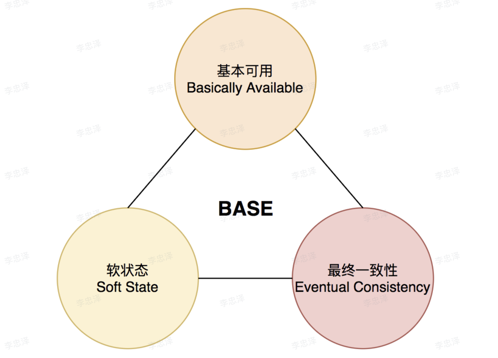

## Redis 对象

### Redis Object

#### Object 是什么？

Redis 是 key-value 存储，key 和 value 在 Redis 中都被抽象为对象，key 只能是 String 对象，而 Value 支持丰富的对象种类，包括 String、List、Set、Hash、Sorted Set、Stream等。

#### Object在内存中是什么样子

redisObject定义如下：

```c
// from Redis 5.0.5
#define LRU_BITS 24

typedef struct redisObject {
    unsigned type:4;
    unsigned encoding:4;
    unsigned lru:LRU_BITS; /* LRU time or
                            * LFU data */
    int refcount;
    void *ptr;
} robj;
```

type：是哪种Redis对象；

encoding：表示用哪种底层编码，用OBJECT ENCODING [key] 可以看到对应的编码方式；

lru：记录对象访问信息，用于内存淘汰；

refcount：引用计数，用来描述有多少个指针，指向该对象；

ptr：内容指针，指向实际内容。

### String

String就是字符串，它是Redis中最基本的数据对象，最大为512MB。可以通过`proto-max-bulk-len`来修改。

#### 应用场景

一般可以用来存字节数据、文本数据、序列化后的对象数据等。

#### 常用操作

常用操作聚焦于创建、查询、更新和删除。

- 创建：即产生一个字符串对象数据，可以用SET、SETNX。
- 查询操作：可以用GET，如果想一次获取多个，可以用MGET。
- 更新：其实也是用SET来更新的。
- 删除：针对String对象本身的销毁，用DEL命令。

##### 写操作

`SET key value` 

功能：设置一个key的值为特定的value，成功则返回OK。String对象的创建或者更新都是该命令。

`SETNX key value`

功能：用于在指定的key不存在时，为key设置指定的值，返回值0表示key存在不做操作，1表示设置成功。

`DEL key [key ...]`

功能：删除对象，返回值为删除成功了几行。

##### 读操作

`GET key`

功能：查询某个key，存在就返回对应的value，如果不存在返回nil。

`MGET key [key ...]`

功能：一次查询多个key，如果某个key不存在，对应位置返回nil。

#### 底层实现

String看起来简单，但实际有三种编码方式：

- INT 编码：这个很好理解，就是存一个整型，可以用long表示的整数就以这种编码存储；
- EMBSTR 编码：如果字符串小于等于阈值字节，使用EMBSTR编码；
- RAW 编码：字符串大于阈值字节，则用RAW编码。

这个阈值追溯源码的话，是用常量`OBJ_ENCODING_EMBSTR_SIZE_LIMIT`来表示，3.2版本之前是39字节，3.2版之后是44字节。

EMBSTR 和 RAW 都是由 redisObject 和 SDS 两个结构组成，它们的差异在于，EMBSTR 下redisObject 和 SDS 是连续的内存，RAW 编码下 redisObject 和 SDS 的内存是分开的。

EMBSTR 优点是 redisObject 和 SDS 两个结构可以一次性分配空间，缺点在于如果重新分配空间，整体都需要再分配，所以 EMBSTR 设计为只读，任何写操作之后 EMBSTR 都会变成RAW，理念是发生过修改的字符串通常会认为是易变的。

EMBSTR 内存如下：

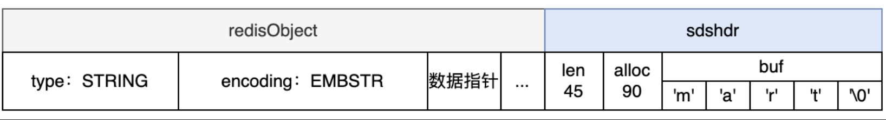

RAW 内存如下：

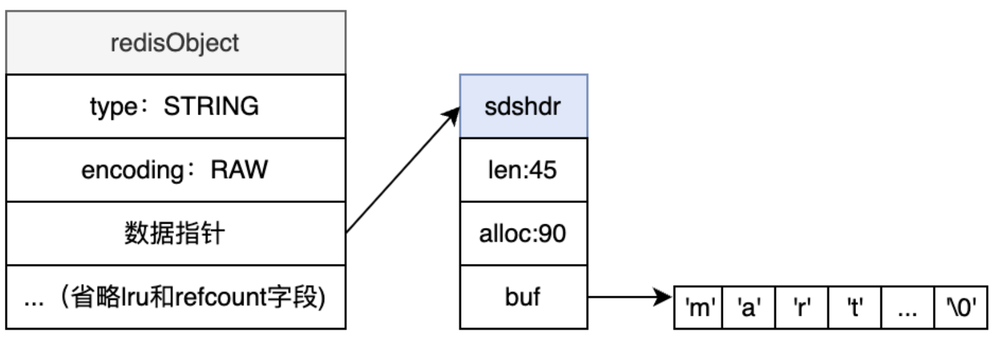

随着我们的操作，编码可能会转换：

INT -> RAW：当存的内容不再是整数，或者大小超过了long的时候；

EMBSTR -> RAW：任何写操作之后 EMBSTR 都会变成RAW。

字符串编码 EMBSTR 和 RAW 都包含一个结构叫 SDS，它是 Simple Dynamic String 的缩写，即简单动态字符串，这是 Redis 内部作为基石的字符串封装。

#### 为什么要 SDS？

在C语言中，字符串用一个 '\0' 结尾的 char 数组表示。

比如 "hello niuniu" 即 "hello niuniu\0" 。

C语言作为一个比较亲和底层的语言，很多基建就是这么简单，但是，对于某个应用来说不一定好用：

- 每次计算字符串长度的复杂度为O(N)；
- 对字符串进行追加，需要重新分配内存；
- 非二进制安全。

在 Redis 内部，字符串的追加和长度计算很常见，这两个简单的操作不应该成为性能的瓶颈，于是 Redis 封装了一个叫 SDS 的字符串结构，用来解决上述问题。

首先，Redis 中 SDS 分为 sdshdr8、sdshdr16、sdshdr32、sdshdr64，它们的字段属性都是一样，区别在于应对不同大小的字符串，我们以 sdshdr8 为例：

```c
// from Redis 7.0.8
struct __attribute__ ((__packed__)) sdshdr8 {
    uint8_t len; /* used */
    uint8_t alloc; /* excluding the header and null terminator */
    unsigned char flags; /* 3 lsb of type, 5 unused bits */
    char buf[];
};
```

其中有两个关键字段，一个是 len，表示使用了多少；一个是 alloc，表示一共分配了多少内存。这两个字段的差值（alloc-len）就是预留空间的大小。flags 则是标记是哪个分类，比如sdshdr8 的分类就是：

```c
#define SDS_TYPE_8  1
```

从 SDS 的结构中，可以看出来 SDS 是如何解决这三个问题的：

- 增加长度字段len，快速返回长度；
- 增加空余空间（alloc-len），为后续追加数据留余地；
- 不再以'\0'作为判断标准，二进制安全。

SDS可以预留空间，那么预留空间有多大呢，规则如下：

- len小于1M的情况下，alloc是2倍len大小，即预留len大小的空间；
- len大于1M的情况下，alloc是1M+len，即预留1M大小的空间。

简单来说，预留空间为 min(len，1M)。

### String面试与分析

#### 面试题

##### Set一个已有的数据会发生什么？

分析：常用操作考察。

回答：会覆盖原有的值，覆盖或者擦出键的过期时间。

##### 浮点型在String是用什么表示？

分析：基础知识考查，只有三种编码模式，INT只针对与整型，所以浮点型必然是字符串存储。

回答：要将一个浮点数放入字符串对象里面，需要先将这个浮点数转换成字符串值，然后再保存转换所得的字符串值，比如浮点数3.14，对应就变成了"3.14"这个字符串。所以浮点数在字符串对象里面是用字符串值表示的。

##### String 可以有多大？

分析：基础知识考查，需要知道明确的数值，更进一步需要来源背书，再进一步需要思考为什么是这个数值。

回答：一个Redis字符串最大为512MB，官网有明确注明，看源码里也是直接写死的。可以通过`proto-max-bulk-len`来修改。

##### Redis 字符串是怎么实现的？

分析：这个问题，首先需要分情况说出编码类型，分别应用在什么场景。EMBSTR编码和RAW编码的选择阈值也比较重要，回答的时候，可以先说自己用的Redis版本的数值，面试官会感觉你确实有关注过编码的阈值。如果能记得是3.2版本之前是39，3.2版本之后才是44，也可以说出来，有一定程度的加分，但是说了这个差别可能会引导面试官追问为什么，如果记不清就不要说版本差别了。

回答：Redis字符串底层是String对象，String对象有三种编码方式：INT型、EMBSTR型、RAW型。如果是存一个整型，可以用long表示的整数就以INT编码存储；如果存字符串，当字符串长度小于等于一个阈值，使用EMBSTR编码；字符串大于阈值，则用RAW编码。在我用的5.0.5版本中阈值是44。

##### 为什么EMBSTR的阈值是44？

分析：这个问题是上个问题的追问，有以下几个要点：

1. Redis使用的是 jemalloc 作为内存分配器；
2. jemalloc 是以64字节作为内存单元做内存分配，如果超出了64个字节就超过了一个内存单元，则会用到RAW编码；反之，如果小于等于64个字节，就认为是一个小字符串，会用到EMBSTR编码。
3. 围绕64字节的关键分界来分析版本变化，Redis的字符串对象是由redisObject和sdshdr这两部分组成，redisObject大小为 4 + 4 + 24 + 32 + 64 = 128bits = 16bytes，这个是一直没变过的。

```c
// from Redis 3.9.5
#define LRU_BITS 24

typedef struct redisObject {
    unsigned type:4;
    unsigned encoding:4;
    unsigned lru:LRU_BITS; /* LRU time or
                            * LFU data */
    int refcount;
    void *ptr;
} robj;
```

回顾sdshdr结构：

```mysql
// from Redis 3.9.5
struct __attribute__ ((__packed__)) sdshdr8 {
    uint8_t len; /* used */
    uint8_t alloc; /* excluding the header and null terminator */
    unsigned char flags; /* 3 lsb of type, 5 unused bits */
    char buf[];
};
```

sdshdr占用的内存大小：1byte + 1byte+ 1byte + 内联数组的大小，由于内联数组中还有一个'\0'占位一个字节，所以能用的大小为 64 - 16(redisObject) - 3(sdshdr非内容属性）- 1('\0') = 44。

回答：Redis是使用 jemalloc 内存分配器，jemalloc以64字节为阈值区分大小字符串。所以EMBSTR的边界数值，其实是受64这个阈值影响。redisObject 占用的内存大小由 redisObject和 sdshdr 这两部分组成，redisObject 16字节，sdshdr中已分配、已申请、标记三个字段固定占了3个字节，'\0'占了一个字节，能存放的数据就是 64-(16+4)= 44。

##### 你知道为什么EMBSTR曾经的阈值是39吗？

分析：实际上一般面试官一般不会主动这么问，一般聊到这个还是因为在上面问题里提到了版本差异。要回答的话，要从SDS结构来分析，sdshdr3.2之前版本结构如下：

```c
struct SDS {
  unsigned int capacity; // 4byte
  unsigned int len; // 4byte
  byte[] content; // 内联数组，长度为 capacity
}
```

当时都是通用的SDS结构，非数据字段一共占据了8个字节，为了节约内存，就在3.2版本之后将SDS分为sdshdr5（这个结构不被使用）、sdshdr8、sdshdr16、sdshdr32、sdshdr64，EMBSTR使用sdshdr8节约了6个字节，但多引入了一个flags字段占据1字节，所以相比3.2版本之前的SDS多了5个字节，从这一点也能看出Redis也是不断在优化内存和性能的。

回答：3.2之后的版本，SDS结构进行了拆分，EMBSTR用的sdshdr8，总容量和已使用容量字段减少了6个字节，但由于增加了一个flags字段，所以最终节约了5个字节。

##### SDS有什么用？

分析：Redis是用C语言写的，SDS可以说是对C字符串的封装，一般对比普通C字符串。可以从计算长度、扩容、缩容、二进制存储这几个场景来描述。

回答：主要有三点：

1. SDS包含已使用容量字段，O(1)时间快速返回有字符串长度，相比之下，C原生字符串需要O(n)。
2. 有预留空间，在扩容时如果预留空间足够，就不用再重新分配内存，节约性能，缩容时也可以将减少的空间先保留下来，后续可以再使用。
3. 不再以‘\0’作为判断标准，二进制安全，可以很方便地存储一些二进制数据。

### List

Redis List是一组连接起来的字符串集合。 List最大元素个数是 2^32 - 1 (4,294,967,295)。现在是 2 ^ 64 - 1。

#### 应用场景

List作为一个列表存储，属于比较底层的数据结构，可以使用的场景非常多，比如存储一批任务数据，存储一批消息等。

#### 常用操作

常用操作还是聚焦于创建、查询、更新和删除。

- 创建：即产生一个List对象，一般用LPUSH、RPUSH，分别对应从左侧进队列和右侧进队列。
- 查询：可以用LRANGE来进行范围查询，可以用LLEN查询元素个数。
- 更新：对列表对象而言就是追加元素、删除元素等操作，涉及LPUSH, LPOP, RPUSH, RPOP等操作。
- 删除：针对List对象本身的生成和销毁，用DEL命令。

##### 写操作

`LPUSH key value [value ...]`

功能：从头部增加元素，返回值为List中元素的总数。

`RPUSH key value [value ...]`

功能：从尾部增加元素，返回值为List中元素的总数。

`LPOP key`

功能：移出并获取列表的第一个元素。

`RPOP key`

功能：移出并获取列表的最后一个元素。

`DEL key [key ...]`

功能：删除对象，返回值为删除成功了几行。

##### 读操作

`LLEN key`

功能：查看List的长度，即List中元素的总数。

`LRANGE key start stop`

功能：查看start到stop为角标的元素。

#### 底层实现

##### 编码方式

3.2 版本之前，List 对象有两种编码方式，一种 ZIPLIST，另一种是 LINKEDLIST。

当满足如下条件时，用 ZIPLIST 编码：

1. 列表对象保存的所有字符串对象长度都小于64字节；
2. 列表对象元素个数少于 512 个，注意，这是 LIST 的限制，而不是 ZIPLIST 的限制/

ZIPLIST底层用压缩列表实现，ZIPLIST内存排列得很紧凑，可以有效节约内存空间。

如果不满足 ZIPLIST 编码的条件，则使用 LINKEDLIST 编码。使用 LINKEDLIST 数据是以链表的形式连接在一起，实际上删除更为灵活，但是内存不如ZIPLIST紧凑，所以只有在列表个数或节点数据长度比较大的时候，才会使用LINKEDLIST编码，以加快处理性能，一定程度上牺牲了内存。

##### QUICKLIST横空出世

上面的分析有说到，ZIPLIST 是为了在数据较少时节约内存，LINKEDLIST 是为了数据多时提高更新效率，ZIPLIST 数据稍多时插入数据会导致很多内存复制。但如果节点非常多的情况，LINKEDLIST 链表的节点就很多，会占用不少的内存。

3.2版本就引入了 QUICKLIST。QUICKLIST 其实就是 ZIPLIST 和 LINKEDLIST 的结合体。

LINKEDLIST 原来是单个节点，只能存一个数据，现在单个节点存的是一个 ZIPLIST，即多个数据。

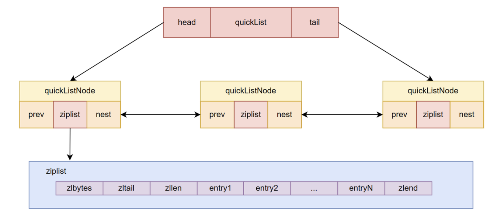

这种方案其实是用 ZIPLIST、LINKEDLIST 综合的结构，取代二者本身。当数据较少的时候，QUICKLIST 的节点就只有一个，此时其实相当于就是一个 ZIPLIST。当数据很多的时候，则同时利用了 ZIPLIST 和 LINKEDLIST 的优势。

##### ZIPLIST 优化

ZIPLIST 本身存在一个连锁更新的问题，所以 Redis 7.0 之后，使用了 LISTPACK 的编码模式取代了 ZIPLIST，而他们其实本质都是一种压缩的列表，所以其实可以统一叫做压缩列表。

### 底层数据结构压缩列表

压缩列表，顾名思义，就是排列紧凑的列表。压缩列表在Redis中有两种编码方式，一种是ZIPLIST，一种是LISTPACK，LISTPACK是在Redis 5.0引入，直到Redis7.0完全替换了ZIPLIST，可以说是ZIPLIST的进阶版本。压缩列表主要用做为底层数据结构提供紧凑型的数据存储方式。

#### ZIPLIST 整体结构

虽然已经有LISTPACK，但实际面试中聊得比较多的，还是ZIPLIST。Redis代码注释中，非常清晰描述了ZIPLIST的结构：

```c
* The general layout of the ziplist is as follows:
*
* <zlbytes> <zltail> <zllen> <entry> <entry> .. <entry> <zlend>
```

比如这就是有3个节点的ziplist结构：


- zlbytes：表示该ZIPLIST一共占了多少字节数，这个数字是包含zlbytes本身占据的字节的。
- zltail：表示相对最后一个节点偏移了多少个字节，通过这个字段可以快速定位到尾部节点。
- zllen：表示有多少个数据节点，在本例中就有3个节点。
- entry1~entry3：表示压缩列表数据节点。
- zlend：一个特殊的entry节点，表示ZIPLIST的结束。

#### ZIPLIST 节点结构

ZIPLIST ENTRIES定义如下：

```c
 <prevlen> <encoding> <entry-data>
```

- prevlen：表示上一个节点的数据长度。通过这个字段可以定位上一个节点的数据，实现从后往前操作，所以压缩列表才可以从后往前遍历。如果前一节点的长度小于254字节， 那么prevlen属性需要用1字节长的空间来保存这个长度值。如果前一节点的长度大于等于254字节，那么prevlen属性需要用5字节长的空间来保存这个长度值。
- encoding：编码类型。
- entry-data：实际的数据。

##### encoding

encoding字段是一个整型数据，其二进制编码由内容数据的类型和内容数据的字节长度两部分组成，根据内容类型有如下几种情况：

| 编码                                             | 大小  | 类型                                                         |
| ------------------------------------------------ | ----- | ------------------------------------------------------------ |
| 00pppppp                                         | 1字节 | String类型，且字符串长度小于2^6，即小于等于63                |
| 01pppppp\|qqqqqqqq                               | 2字节 | String类型，长度小于2^14次方，即小于等于16383                |
| 10000000\|qqqqqqqq\|rrrrrrrr\|ssssssss\|tttttttt | 5字节 | String类型，长度小于2^32次方                                 |
| 11000000                                         | 1字节 | 2个字节的int16类型                                           |
| 11010000                                         | 1字节 | 4个字节的int32类型                                           |
| 11111110                                         | 1字节 | 8个字节的int64类型                                           |
| 1111xxxx                                         | 1字节 | xxxx从1到13一共13个值，这时就用这13个值来表示真正的数据。注意，这里是表示真正的数据，而不是数据长度了，这种情况<entry-data>就没有了 |

注意，如果是String类型，那么encoding有两部分，一般是前几位标识类型、后几位标识长度。

但如果是int类型，整体1字节编码，就只是标识了类型，为什么没有大小呢，因为int的具体类型就自带了大小，比如int32，就是32位，4字节的大小，不需要encoding特别标识。

encoding的编码规则比较复杂，我们其实只需要理解它的核心思想，面试中能讲清楚怎么区分不同类型即可，不用去背它的这些具体编码，这个很难记住，也没有必要去记。

#### ZIPLIST 查询数据

##### 查询 ZIPLIST 的数据总量

由于 ZIPLIST 的 header 定义了记录节点数量的字段 zllen，所以通常是可以在 O(1) 时间复杂度直接返回的，为什么说通常呢？是因为 zllen 是2个字节的，当 zllen 大于 65535 时，zllen 就存不下了，此时 zllen 等于65535，所以真实的节点数量需要遍历来得到。

这样设计的原因是Redis中应用ZIPLIST都是为了节点个数少的场景，所以将zllen设计得较小，节约内存空间。

##### 在ZIPLIST中查询指定数据的节点

在ZIPLIST中查询指定数据的节点，需要遍历这个压缩列表，平均时间复杂度是O(N)。

#### ZIPLIST更新数据

ZIPLIST的更新就是增加、删除数据，ZIPLIST提供头尾增减的能力，但是操作平均时间复杂度是O(N)，因为在头部增加一个节点会导致后面节点都往后移动，所以更新的平均时间复杂度，可以看作O(N)。

其中要注意的是更新操作可能带来连锁更新。注意上面所说的增加节点导致后移，不是连锁更新。连锁更新是指这个后移，发生了不止一次，而是多次。

比如增加一个头部新节点，后面依赖它的节点，需要prevlen字段记录它的大小，原本只用1字节记录，因为更新可能膨胀为5字节，然后这个entry的大小就也膨胀了。所以，当这个新数据插入导致的后移完成之后，还需要逐步迭代更新。这种现象就是连锁更新，时间复杂度是O(N^2)。

大家可能会比较担心连锁更新带来的性能问题，但在实际的业务中，很少会刚好遇到需要迭代更新超过2个节点的情况，所以ZIPLIST更新平均时间复杂度，还是可以看作O(N)。不过，ZIPLIST最大的问题还是连锁更新导致性能不稳定。

#### LISTPACK 优化

##### 连锁更新原因分析

LISTPACK是为了解决ZIPLIST最大的痛点——连锁更新，我们先来看，ZIPLIST的问题本源。

我们知道，ZIPLIST需要支持LIST，LIST是一种双端访问结构，所以需要能从后往前遍历，上面有讲，ZIPLIST的数据节点的结构是这样的：

```c
<prevlen> <encoding> <entry-data>
```

其中，prevlen就表示上一个节点的数据长度，通过这个字段可以定位上一个节点的数据，可以说，连锁更新问题，就是因为prevlen导致的。

##### 解决方案

我们需要一种不记录prevlen，并且还能找到上一个节点的起始位置的办法，Redis使用了很巧妙的一种方式。我们直接看LISTPACK的节点定义：

```c
<encoding-type><element-data><element-tot-len>
```

encoding-type是编码类型，element-data是数据内容，element-tot-len存储整个节点除它自身之外的长度。

element-tot-len 所占用的每个字节的第一个 bit 用于标识是否结束。0是结束，1是继续，剩下7个bit来存储数据大小。当我们需要找到当前元素的上一个元素时，我们可以从后向前依次查找每个字节，找到上一个Entry的 element-tot-len 字段的结束标识，就可以算出上一个节点的首位置了。

举个例子：

如果上个节点的element-tot-len为 00000001 10000100，每个字节第一个bit标志是否结束，所以这里的element-tot-len一共就两个字节，大小为0000001 0000100，即132字节。

### List面试与分析

#### 面试题

##### List 是完全先入先出吗？

分析：题目所说的完全先入先出，很明显就是指只允许从尾部入队、从头部出队，而 List 是一个双端操作对象，所以不是完全先入先出，他也可以后入先出。这道题就是考察是否对 List有最基本的认识。

回答：List是双端操作对象，所以不是完全的先入先出，List也可以后入先出。

##### List 对象底层编码方式是什么？

分析：在 Redis3.2 版本之前和之后，List对象的底层编码方式是不同的。面试的时候如果能对不同版本Redis的List对象底层编码方式做出分析，是一个加分项。

回答：在 3.2 版本之前，List 对象的编码是 ZIPLIST 和 LINKEDLIST。ZIPLIST 适用于元素数量较少、且元素都较短的情况，否则用 LINKEDLIST。

3.2 版本之后，List 对象的编码全部由 QUICKLIST 实现。QUICKLIST 是一个压缩列表组成的双向链表，结合了 ZIPLIST 和 LINKEDLIST 两者的优点，在后面比较新的版本中 ZIPLIST 优化为了 LISTPACK。

##### ZIPLIST是怎么压缩数据的？

分析：这个问题就是对 ZIPLIST 数据结构本身的考察。ZIPLIST 是为了节约内存而开发的，回答这个问题可以从 ZIPLIST 的结构入手。下图是 ZIPLIST 的结构：

```c
* The general layout of the ziplist is as follows:
*
* <zlbytes> <zltail> <zllen> <entry> <entry> .. <entry> <zlend>
```

其中entry结构为：

```c
<prevlen> <encoding> <entry-data>
```

为了方便记忆和理解，可以将 ZIPLIST 分为三部分讲述：

1. 结构头，即header，包括`<zlbytes> <zltail> <zllen>`字段。
2. 数据部分，即entry列表，entry中有`<prevlen> <encoding> <entry-data>`字段。
3. 结尾标识，即zlend。

回答：ZIPLIST 可以看作三个部分，结构头、数据部分、结尾标识。其中，结构头记录了字节数、起始地址距尾部节点距离、节点个数；数据部分记录了上个节点的长度、内容编码，内容本身；最后有一个1字节的结尾标识。

##### ZIPLIST 下 List 可以从后往前遍历吗？

分析：首先，一切的基石，在于要知道 List 是一种双端数据结构，无论哪种底层编码，都需要能支持从后往前遍历。

接着，需要阐述 ZIPLIST 是如何做到从后往前遍历的，其实还是在考察ZIPLIST的数据结构。

ZIPLIST 下 entry 的结构包含了上一个节点的长度，所以可以通过上一个节点的长度，找到上个节点的起始位置，这样就能实现从后往前遍历。

回答：可以，List 是双端数据结构，无论哪种底层编码，都需要能支持从后往前遍历。ZIPLIST每个节点中都保存了上一个节点的长度，所以可以用当前节点地址减去上一个节点长度来找到上个节点起始位置，进而实现从后往前的遍历。

##### 在ZIPLIST数据结构下，查询节点个数的时间复杂度是多少？

分析：由于 ZIPLIST 的 header 中定义了记录节点数量的字段 zllen，所以通常是可以在 O(1) 时间复杂度直接返回，为什么说通常呢？是因为 zllen 是2个字节的，当 zllen 大于 65535 时，zllen 就存不下了，所以真实的节点数量需要遍历来得到。

回答：在 ZIPLIST 编码下，查询节点个数的时间复杂度是 O(1)，因为 ZIPLIST 中的 header 定义了记录节点数量的字段，但是这里也有个限制，记录节点数量的字段只有 2 字节，也就说如果节点数量超过 65535，就失效了，此时只能通过 O(n) 复杂度的遍历来查节点总数。

##### LINKEDLIST编码下，查询节点个数的时间复杂度是多少？

分析：这个问题我们可以回顾一下LINKEDLIST的表头结构：

```c
// from Redis 5.0.5
typedef struct list {
    listNode *head;
    listNode *tail;
    void *(*dup)(void *ptr);
    void (*free)(void *ptr);
    int (*match)(void *ptr, void *key);
    unsigned long len;
} list;
```

LINKEDLIST的表头结构中定义了链表所包含节点数量的字段 len，所以 LINKEDLIST 编码下，查询节点个数的时间复杂度是 O(1)。

回答：LINKEDLIST 编码下，查询节点个数的时间复杂度是 O(1)。因为 LINKEDLIST 的表头结构中定义了链表所包含节点数量的字段 len。

### Set

#### 是什么？

Redis 的 Set 是一个不重复、无序的字符串集合。其中 IntSet 是有序的。

#### 适用场景

适用于无序集合场景，比如某个用户关注了哪些公众号，这些信息就可以放进一个集合，Set还提供了查交集、并集的功能，可以很方便地实现共同关注的能力。

#### 常用操作

我们还是从创建、查询、更新、删除这几个基本操作来了解 Set。

- 创建：即产生一个Set对象，可以使用 SADD 创建。
- 查询：Set 的查询非常丰富，SISMEMBR 可以查询元素是否存在的；SCARD、SMEMBERS、SSCAN可以查询集合元素数据；SINTER、SUNION、SDIFF可以对多个集合查交集并集和差异。
- 更新：可以使用SADD增加元素，SREM删除元素。
- 删除：DEL可以删除一个Set对象。

##### 写操作

`SADD key member [member ...]`

功能：添加元素，返回值为成功添加了几个元素。

`SREM key member [member ...]`

功能：删除元素，返回值为成功删除了几个元素。

##### 读操作

`SISMEMBER key member`

功能：查询元素是否存在。

`SCARD key`

功能：查询集合元素个数。

`SMEMBERS key`

功能：查看集合的所有元素。

`SSCAN key cursor [MATCH pattern] [COUNT count]`

功能：查看集合元素，可以理解为指定游标进行查询，可以指定个数，默认个数为10。也可以使用 Match 模糊查询。

`SINTER key [key ...]`

功能：返回在第一个集合里，同时在后面所有集合都存在的元素。

`SUNION key [key ...]`

功能：返回所有集合的并集，集合个数大于等于2。

`SDIFF key [key ...]`

功能：返回第一个集合有，且在后续集合中不存在的元素，集合个数大于等于2，注意，是以第一个集合和后面比，看第一个集合多了哪些元素。

#### 底层实现

Redis出于性能和内存的综合考虑，也支持两种编码方式，如果集群元素都是整数，且元素数量不超过512个，就可以用INTSET编码，结构如下图，可以看到INTSET排列比较紧凑，内存占用少，但是查询时需要二分查找。

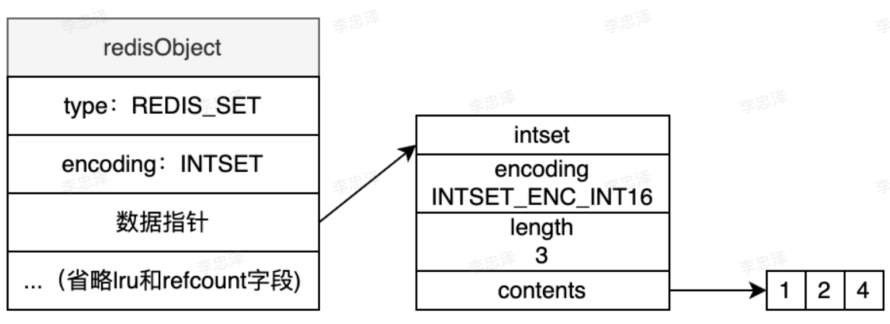

如果不满足 INTSET 的条件，就需要用 HASHTABLE，HASHTABLE 结构如下图，可以看到HASHTABLE 查询一个元素的性能很高，能 O(1) 时间就能找到一个元素是否存在。

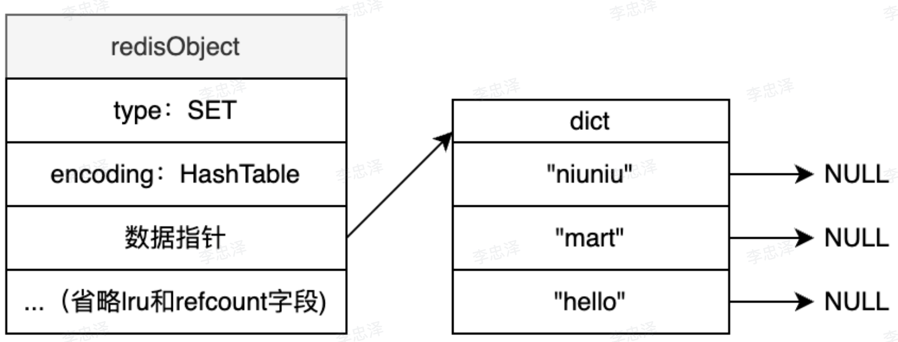

### HSet

#### 是什么？

Redis HSet是一个 field、value 都为 string 的 hash 表，存储在 Redis 的内存中。

Redis 中每个 hash 可以存储 2^32 - 1 键值对（40多亿）。

#### 适用场景

适用于 O(1) 时间字典查找某个 field 对应数据的场景，比如任务信息的配置，就可以任务类型为 field，任务配置参数为 value。

#### 常用操作

还是从创建、查询、更新、删除这几个基本操作来了解HSet。

- 创建：即产生一个 HSet 对象，可以使用 HSET、HSETNX 创建。
- 查询：支持 HGET 查询单个元素；HGETALL 查询所有数据；HLEN 查询数据总数；HSCAN 进行游标迭代查询。
- 更新：HSET可以用于增加新元素，HDEL删除元素。
- 删除：DEL可以删除一个HSet对象。

##### 写操作

`HSET key field value`

功能：为集合对应 field 设置 value 数据。

`HSETNX key field value`

功能：如果 field 不存在，则为集合对应 field 设置 value 数据。

`HDEL key field [field ...]`

功能：删除指定 field，可以一次删除多个。

`DEL key [key ...]`

功能：删除 HSET 对象。

##### 读操作

`HGETALL key`

功能：查找全部数据。

`HGET key field`

功能：查找某个field。

`HLEN key`

功能：查找HSet中元素总数。

`HSCAN key cursor [MATCH pattern] [COUNT count]`

功能：从指定位置查询一定数量的 HSet 数据。

#### 底层原理

HSet底层有两种编码结构，一个是压缩列表，一个是 HASHTABLE。同时满足以下两个条件，用压缩列表：

1. HSet 对象保存的所有值和键的长度都小于64字节；
2. HSet 对象元素个数少于512个。

两个条件任何一条不满足，编码结构就用HASHTABLE。

ZIPLIST 之前有讲解过，其实就是在数据量较小时将数据紧凑排列，对应到HSet，就是将filed-value当作entry放入ZIPLIST，结构如下：

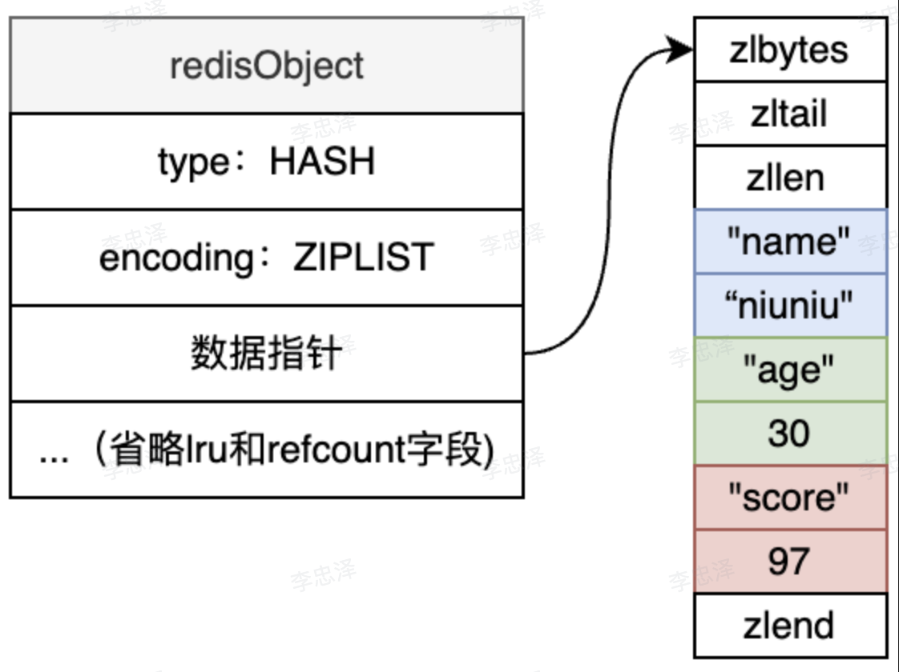

HASHTABLE 在之前无序集合Set中也有应用，和 Set 的区别在于，在 Set 中 value 始终为NULL，但是在HSet中，是有对应的值的。

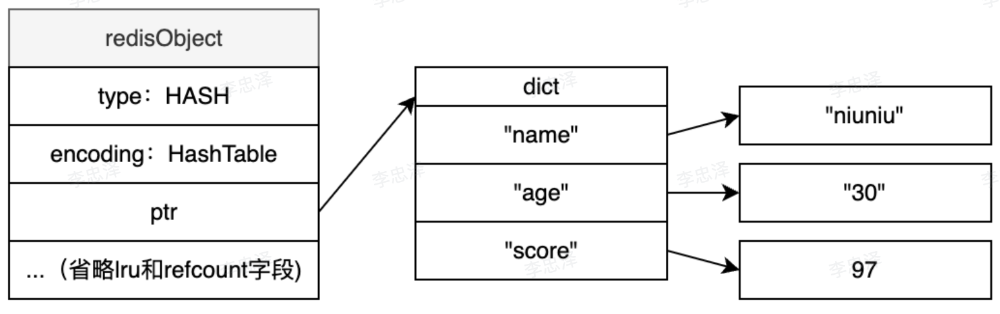

### 底层结构 HASHTABLE

#### HASHTABLE概述

HASHTABLE，可以想象成目录，要翻看什么内容，直接通过目录能找到页数，翻过去看。如果没有目录，我们需要一页一页往后翻，效率很低。在计算机世界里，HASHTABLE 就扮演着这样一个快速索引的角色，通过 HASHTABLE 我们可以只用 O(1) 时间复杂度就能快速找到 key 对应的 value。

#### HASHTABLE结构

Redis 中 HASHTABLE 的结构如下：

```c
// from Redis 5.0.5
/* This is our hash table structure.  */
typedef struct dictht {
    dictEntry **table;
    unsigned long size;
    unsigned long sizemask;
    unsigned long used;
} dictht;
```

- table：指向实际hash存储。存储可以看做一个数组，所以是 *table的表示，在C语言中 *table 可以表示一个数组。
- size：哈希表大小。实际就是 dictEntry 有多少元素空间。
- sizemask：哈希表大小的掩码表示，总是等于 size-1。这个属性和哈希值一起决定一个键应该被放到 table 数组的哪个索引上面，规则 Index = hash&sizemask。
- used：表示已经使用的节点数量。通过这个字段可以很方便地查询到目前 HASHTABLE 元素总量。

#### Hash表渐进式扩容

渐进式扩容顾名思义就是一点一点慢慢扩容，而不是一股脑直接做完，那具体流程是怎样的呢？

其实为了实现渐进式扩容，Redis中没有直接把dictht暴露给上层，而是再封装了一层：

```c
// from Redis 5.0.5
typedef struct dict {
    dictType *type;
    void *privdata;
    dictht ht[2];
    long rehashidx; /* rehashing not in progress if rehashidx == -1 */
    unsigned long iterators; /* number of iterators currently running */
} dict;
```

可以看到dict结构里面，包含了2个 dictht 结构，也就是2个 HASHTABLE 结构。

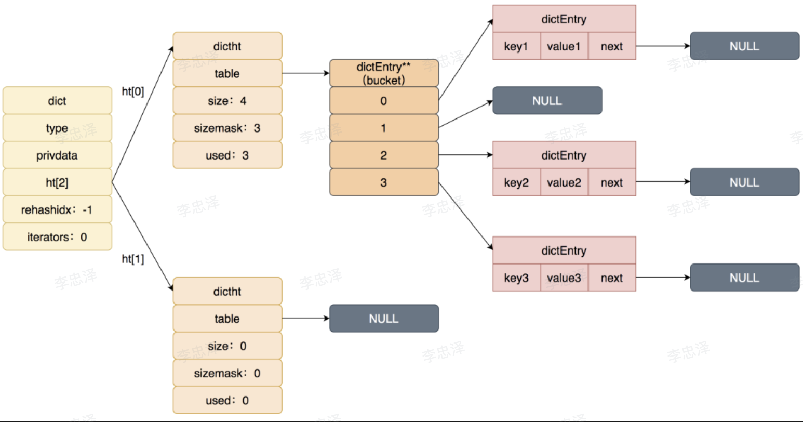

实际上平常使用的就是一个HASHTABLE，在触发扩容之后，就会两个HASHTABLE同时使用，详细过程是这样的：

当向字典添加元素时，发现需要扩容就会进行Rehash。Rehash的流程大概分成三步：

首先，生成新Hash表ht[1]，为 ht[1] 分配空间。新表大小为第一个大于等于原表2倍used的2次方幂。举个例子，原表如果 used=500，2倍就是1000，那第一个大于1000的2次方幂则为1024。此时字典同时持有 ht[0] 和 ht[1] 两个哈希表。字典的偏移索引从静默状态-1，设置为0，表示 Rehash 工作正式开始。

然后，迁移 ht[0 ]数据到 ht[1]。在 Rehash 进行期间，每次对字典执行增删查改操作，程序会顺带迁移一个 ht[0] 上的数据，并更新偏移索引。与此同时，部分情况周期函数也会进行迁移。

随着字典操作的不断执行，最终在某个时间点上，ht[0] 的所有键值对都会被 Rehash 至 ht[1]，此时再将 ht[1] 和 ht[0] 指针对象互换，同时把偏移索引的值设为 -1，表示 Rehash 操作已完成。

总结一下，渐进式扩容的核心就是定时迁移+操作时顺带迁移。

#### 扩容时机

Redis 提出了一个负载因子的概念，负载因子表示目前 Redis HASHTABLE 的负载情况，是游刃有余，还是不堪重负了。我们设负载因子为 k，那么 k = ht[0].used / ht[0].size，也就是使用空间和总空间大小的比例。

Redis会根据负载因子的情况来扩容：

1. 负载因子大于等于1，说明此时空间已经非常紧张。新数据是在链表上叠加的，越来越多的数据其实无法在 O(1) 时间复杂度找到，还需要遍历一次链表，如果此时服务器没有执行 BGSAVE 或 BGREWRITEAOF 这两个复制命令，就会发生扩容。
2. 负载因子大于5，这时候说明 HASHTABLE 真的已经不堪重负了，此时即使是有复制命令在进行，也要进行 Rehash 扩容。

##### 缩容

扩容是数据太多存不下了，那如果太富裕呢，比如原来可能数据较多，发生了扩容，但后面数据不再需要，被删除了，此时多余的空间就是一种浪费。

缩容过程其实和扩容是相似的，也是渐进式缩容。同样的，Redis还是用负载因子来控制什么时候缩容。当负载因子小于 0.1，即负载率小于 10%，此时进行缩容，新表大小为第一个大于等于原表 used 的2次方幂。

### Set&HSet 面试与分析

#### 面试考点分析

Set是一个无序集合对象，HSet是字典对象，他们底层都有着相同的实现HashTable。

面试的考察点集中在 Set、HSet常规操作和底层实现，常规操作必须熟练掌握，底层实现要了解其编码方式，其中HashTable是重中之重，面试大热门考点。

#### 面试题

##### Set是有序的吗？

分析：Set 的底层实现是整数集合或字典，前者是有序的，后者是无序的。

回答：Set 的底层实现是整数集合或字典，前者是有序的，后者是无序的。整体来看，建议不依赖SET的顺序。

##### Set编码方式？

分析：Set 底层使用了两种编码，一种是整数集合，另一种是字典。成员的数据结构和成员数量会触发 Set 更改底层编码，当 Set 同时满足元素都是整数且元素个数不超过512这两个条件，会使用整数集合编码，否则使用字典编码。

回答：Set 使用整数集合和字典作为底层编码，当元素都是整数同时元素个数不超过512个，会使用整数集合编码，否则使用字典编码。

##### HSet 的编码方式是什么？

分析：HSet 底层有两种编码结构，一个是 ZIPLIST，一个是 HashTable。ZIPLIST 适用于元素较少且单个元素长度较小的情况，这里的阈值分别是元素个数少于512个，值和键长度都小于64字节。

回答：一个是 ZIPLIST，一个是 HashTable。ZIPLIST 适用于元素较少且单个元素长度较小的情况，其它情况使用 HashTable。

##### HSet 查找某个 key 的平均时间复杂度是多少？

分析：这种问对象复杂度的，要考虑多种底层编码。ZIPLIST 需要遍历，平均复杂度为 O(N)，HashTable 是字典，可以 O(1) 找到对应 key。

回答：HSet 有两种底层结构，ZIPLIST 是 O(N)，HashTable 则是 O(1)。

##### HashTable 查找元素总数的平均时间复杂度是多少?

分析：这题考察的是 Redis 字典的表头结构，如果表头结构中有储存键值对个数的字段，那么查找元素总数的平均时间复杂度就是 O(1)，而如果没有这个字段，那字典就需要去遍历所有的键值对。

下面是Redis字典的表头结构：

```c
// from Redis 5.0.5 
typedef struct dictht {
    dictEntry **table;
    unsigned long size;
    unsigned long sizemark;
    // 键值对数量
    unsigned long used;
} dictht;
```

可以发现字典的表头结构中的used，就记录了当前键值对数量的字段。

回答：HashTable 查找元素总数的平均时间复杂度是 O(1)，因为 HashTable 的表头结构中有储存键值对数量的字段 used。

##### 为什么要用两种编码方式?

分析：我们可以从编码转换的条件来进行思考，Set的底层编码从 INTSET 到 HASHTABLE 的条件是元素个数或者元素类型的变化。所以采用两种编码方式的原因是 INTSET 更节约内存，所以在小数据量时使用，而数据多起来了，需要 HASHTABLE 的查找性能。

实际上如果 Set 中保存的所有元素都是整数，而且元素个数不是特别多的情况下，使用 intset会比较节约内存，Redis 用一个含有三个字段的结构体来表示 intset，分别是编码方式、元素数量和实际存储元素的有序柔性数组：

```c
typedef struct intset {
    uint32_t encoding;  //编码格式
    uint32_t length;    //元素数量
    int8_t contents[];  //保存元素的数组
} intset; 
```

intset 用来保存元素的数组默认情况下是 int16 编码，后续如果插入更大的整数，才会升级到int32 或者 int64 编码。这种策略可以尽可能的节约内存以及提升整数集合的灵活性。

但是升级也有弊端，升级之后，整个数组的编码会变成与最大元素的类型一致。假如这个时候，元素的数量非常多，就不那么节约内存了，而且数组遍历的平均时间复杂度是 O(logn)，不如使用字典编码。

回答：Set 的底层编码是整数集合和字典，当元素数量小并且全部是整数的时候，会使用整数集合编码，更加的节约内存。元素数量变大会使用字典编码，查找元素的速度会更快。

##### 一个数据在 HashTable中 的存储位置，是怎么计算的?

分析：当一个新的键值对要插入到 HashTable 中时，首先会使用哈希函数计算这个 key 的哈希值，Redis 使用的哈希算法是 MurmurHash2 哈希算法，然后把哈希值和哈希掩码做与运算得到索引值，哈希掩码其实就是哈希表数组的大小减去1。然后程序会根据索引值把键值对插入到相应的位置。

回答：首先会通过哈希函数计算出 key 的哈希值，然后与哈希掩码做与运算得到索引值，索引值就是这个数据在 HashTable 中的存储位置。

##### HashTable 怎么扩容?

分析：HashTable 的扩容通过渐进式 rehash 操作来完成。

回答：首先程序会为 HashTable 的1号表分配空间，空间大小是第一个大于等于0号表大小 * 2的 2 ^ n。在 rehash 进行期间，标记位 rehashidx 从0开始，每次对字典的键值对执行增删改查操作后，都会将 rehashidx 位置的数据迁移到 1 号表，然后将 rehashidx 加1，随着字典操作的不断执行，最终 0 号表的所有键值对都会被 rehash 到1号表上。之后，1 号表会被设置成 0 号表，接着在 1 号表的位置创建一个新的空白表。

##### HashTable怎么缩容?

分析：HashTable 的缩容也通过渐进式 rehash 操作来完成。

回答：首先程序会为 HashTable 的1号表分配空间，新表大小为第一个大于等于原表 used 的 2次方幂。在 rehash 进行期间，标记位 rehashidx 从0开始，每次对字典的键值对执行增删改查操作后，都会将 rehashidx 位置的数据迁移到1号表，然后将rehashidx加1，随着字典操作的不断执行，最终 0 号表的所有键值对都会被 rehash 到1号表上。之后，1 号表会被设置成 0 号表，接着在 1 号表的位置创建一个新的空白表。

##### 什么时候扩容，什么时候缩容

分析：HashTable 的扩容与缩容由哈希表的负载因子决定，负载因子 = 键值对数量 / 哈希表大小。

回答：当以下两个条件中的任意一个被满足时，哈希表会自动开始扩容：

- 服务器目前没有在执行 BGSAVE 或者 BGREWRITEAOF，并且负载因子 >= 1；
- 服务器目前正在执行 BGSAVE 或者 BGREWRITEAOF，并且负载因子 >= 5。

缩容：

当哈希表的负载因子小于 0.1 时，程序会自动开始对哈希表进行收缩操作。

### ZSet 

#### 是什么？

ZSet 就是有序集合，也叫 Sorted Set，是一组按关联积分有序的字符串集合，这里的分数是个抽象概念，任何指标都可以抽象为分数，以满足不同场景。

积分相同的情况下，按字典序排序。

#### 适用场景

用于需要排序集合的场景，最为典型的就是游戏排行榜。

#### 常用操作

##### 写操作

`ZADD key [NX|XX] [CH] [INCR] score member [score member ...]`

功能：向Sorted Set增加数据，如果是已经存在的Key，则更新对应的数据。

`ZREM key member [member ...]`

功能：删除ZSet中的元素。

##### 读操作

`ZCARD key`

功能：查看ZSet中成员总数。

`ZRANGE key start stop [WITHSCORES]`

功能：查询从 start 到 stop 范围的 ZSet 数据，WITHSCORES 选填，不写输出里就只有 key，没有 score 值。

`ZREVRANGE key start stop [WITHSCORES]`

功能：即 reverse range，从大到小遍历，WITHSCORES 选填，不写输出里就只有 key，没有score 值。

`ZCOUNT key min max`

功能：计算 min-max 积分范围的成员个数。

`ZRANK key member`

功能：查看 ZSet 中 member 的排名索引，索引是从0开始，所以如果排第一，索引就是0。

`ZSCORE key member`

功能：查询ZSet中成员的分数。

#### 底层实现

ZSet 底层编码有两种，一种是 ZIPLIST，一种是 SKIPLIST + HT。

在 ZSet 中 ZIPLIST 也是用于数据量比较小时候的内存节省，结构如下：

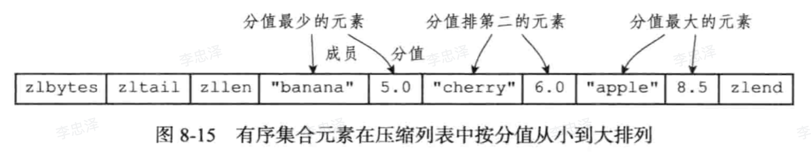

如果满足如下规则，ZSet 就用 ZIPLIST 编码：

1. 列表对象保存的所有字符串对象长度都小于 64 字节；
2. 列表对象元素个数少于 128 个。

两个条件任何一条不满足，编码机构就用 SKIPLIST+HT，其中 SKIPLIST 也是底层数据结构。SKIPLIST 是一种可以快速查找的多级链表结构，通过 skiplist 可以快速定位到数据所在。它的排名操作、范围查询性能都很高。除了 SKIPLIST，Redis 还使用了 HT 来配合查询，这样可以在 O(1) 时间复杂度查到成员的分数值。

### 底层数据结构跳表

#### 跳表的结构

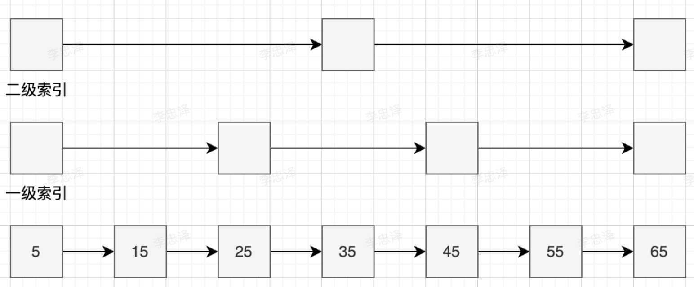

可以看到，这个图某些节点不光只有一层，如果只用普通链表，只能一步一步往后走，如果用这种有高层的节点，那是不是可以一次多走几步，理论上，层次越高平均步长越大，但并不完全像示意图一样是绝对均衡的，节点的层高其实是概率随机的。

为了理解这个结构有什么好处，我们分几个场景来分析：

场景一：查找分数为35的数据

如果只有原始的链表，那需要走4步，如果有图中的二级索引，只用走一步，那如果找45呢，其实就是从第1个节点出发，通过二级索引走到35，再查看到下一个节点是65，已经超过了，所以降低到下方的索引，这里直接是原始链表，再走一步，就到了。

场景二：插入一条score为36的数据

首先，定位到第一个比score大的位置，这里是45，定位方式和查询类似，不再赘述。然后，构造一个新的节点，这里我们假设节点层高随机到3，最后，将各层链表补齐，其实就是在每一层进行链接，效果如图：

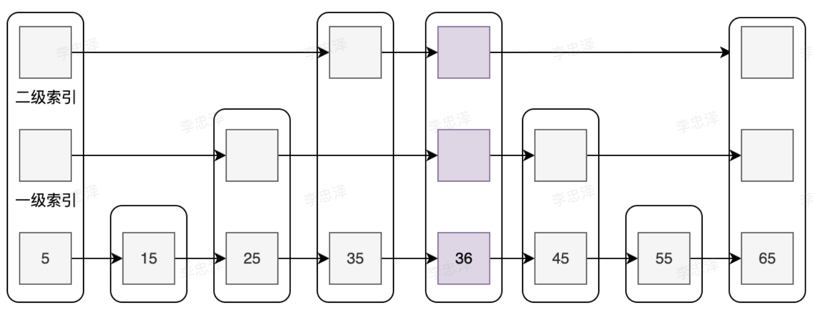

在Redis中，跳表是用来支持有序集合的，标准的跳表有如下限制：

1. score值不能重复；
2. 只有向前指针，没有回退指针。

所以Redis对跳表做了一些优化，下面我们来看看Redis的跳表。

#### Redis的跳表实现

我们直接看这个示意图，score可以重复并且我们的每个节点多了一下回退指针。


下面我们结合源码，来和示意图对照学习，以加深理解，这是Redis 跳表单个节点的定义：

```c
// from Redis 7.0.8
/* ZSETs use a specialized version of Skiplists */
typedef struct zskiplistNode {
    sds ele;
    double score;
    struct zskiplistNode *backward;
    struct zskiplistLevel {
        struct zskiplistNode *forward;
        unsigned long span;
    } level[];
} zskiplistNode;
```

- ele：SDS结构，用来存储数据。
- score：节点的分数，浮点型数据。
- backward：指向上一个节点的回退指针。
- level：是个zskiplistLevel结构体数组，zskiplistLevel这个结构体包含了两个字段，一个是forward，指向该层下个能跳到的节点，span记录了距离下个节点的步数，数组结构就表示每个节点都可能是个多层结构。

#### Redis跳表单个节点有几层？

层次的决定，需要比较随机，才能在各个场景表现出较为平均的性能，这里Redis使用概率均衡的思路来确定新插入节点的层数。

Redis 跳表决定每一个节点，是否能增加一层的概率为25%，而最大层数限制在 Redis 5.0 是64层，在 Redis 7.0 是32层。

#### Redis跳表的性能优化了多少

这个其实可以很容易想到，跳表的查找过程，其实是走高层，行得通跳过去，行不通走相对下层，很像二叉树的另一种表现形式，实际上他们性能也是差不多的，平均时间复杂度都是O(logn)，区别是二叉树平均情况下也是 O(logn) 比较稳定，而跳表的最坏时间复杂度是O(N)。当然，实际的生产过程中，体现出来的基本都是跳表的平均时间复杂度。

有序集合无论是查找、还是增加删除元素，都是需要先定位到数据位置，所以跳表将这三个操作的时间复杂度，都从O(N)降低到了log(N)。

### ZSet面试与分析

#### 面试题

##### ZSet底层有几种编码方式？

分析：基础知识考查，ZSet的底层编码可以是 ziplist 或者 skiplist+字典 ，需要分情况说出不同的编码类型。ziplist 和 skiplist + 字典 编码的选择阈值不一定可以记得清，记不清说大概是128或者256也可。当有ZSet对象可以同时满足以下两个条件时，对象使用ziplist编码：

- ZSet保存的元素数量小于128个；
- ZSet保存的所有元素成员的长度都小于64字节。

不能满足以上两个条件的有序集合对象将使用 skiplist + 字典编码。

回答：ZSet 就是有序集合对象，ZSet 对象的底层有两种编码方式：ziplist 或者 skiplist+字典。如果一个ZSet对象中的所有元素同时满足：元素数量小于128个以及所有元素成员的长度都小于64字节，那么会使用 ziplist 编码，否则使用 skiplist+字典编码。

##### 跳表编码模式下，查询节点总数的平均时间复杂度是多少？

分析：这个问题是对 Redis 跳表数据结构的考察，首先我们可以想想跳表的表头结构：

```c
typedef struct zskiplist {
    struct zskiplistNode *header, *tail;
    // 节点数量
    unsigned long length;
    int level;
} zskiplist;
```

跳表的表头结构中定义了保存节点数量的字段：length，所以对 Redis 跳表查询节点总数的平均时间复杂度应该为 O(1)。我们也可以进一步查看相关的API底层源码：

```c
unsigned int zsetLength(robj *zobj) {
    int length = -1;
    // O(N)
    if (zobj->encoding == REDIS_ENCODING_ZIPLIST) {
        length = zzlLength(zobj->ptr);
    // O(1)
    } else if (zobj->encoding == REDIS_ENCODING_SKIPLIST) {
        length = ((zset*)zobj->ptr)->zsl->length;
    } else {
        redisPanic("Unknown sorted set encoding");
    }
    return length;
}
```

查询有序集合成员总数的API是 zsetLength，而当编码模式是REDIS_ENCODING_SKIPLIST，源码中会直接返回跳表表头结构的length字段，平均时间复杂度是 O(1)。

回答：跳表编码模式下，查询节点总数的平均时间复杂度是 O(1)，因为跳表的表头结构中定义了一个保存节点数量的字段 length，源码中调用查询节点总数的 API 时会直接返回这个字段。

##### 跳表中一个节点的层高是怎么决定的？

分析：这个问题是对跳表这种数据结构本身的考察，跳表中插入一个节点之前会选择一个随机化的层数，因为如果跳表的层数从下至上呈一定的比例关系，那么后期插入和删除的时候就又需要去维护这种比例关系，会使时间复杂度退化。所以跳表选择在插入节点的时候，选择一个随机化的层数。

但是生成的随机层数得遵循一个算法，使得生成小数值层数的概率很大，而生成大数值层数的概率很小，这个算法就是幂次定律。跳表在插入新节点之前，会利用这个幂次定律算法生成一个随机层数。

回答：跳表在插入新节点之前会计算一个随机的层高，具体来说，跳表的每一个节点一开始默认都是1层，然后每增加一层的概率都是 25%，Redis 7.0 最高为32层。

##### 跳表插入一条数据的平均时间复杂度是多少？

分析：这个问题同样是对跳表这种数据结构本身的考察，跳表实际上就是在一维链表上建立多层索引的二维链表，多出来的层数可以让跳表实现类似二分查找的算法。所以跳表的插入平均时间复杂度是O(logn)。

回答：跳跃表是一种支持多级索引的结构，查询效率可以媲美二分查找，它插入一条数据的平均时间复杂度是O(logN)。

##### 为什么跳表和HashTable要配合使用？

分析：使用了两种数据结构来实现 ZSet，为了让有序集合拥有这两种数据结构的优势。可以结合跳表和字典相较于各自的优势来进行回答。

回答：为了结合这两种数据结构各自的优势，当ZSet要根据成员来查找分值的时候，将使用字典来查找，时间复杂度为O(1)。而当ZSet要执行范围操作时，比如ZRANK、ZRANGE等命令时，将使用原本就有序的跳跃表来实现。

##### 为什么用跳表而不是 B+ 树？

分析：这个问题可以结合跳表和B+树的结构，以及B+树是为了解决什么问题而被作为MySQL的索引结构来回答。

B+树属于多路平衡查找树，由于是多叉树所以层数低，可以减少磁盘访问；而且数据只储存在叶子节点中，非叶子节点只储存索引值，使得一次IO读取的数据量很大。这样的设计使得 B+ 树非常适合作为磁盘数据库索引的结构。

而 Redis 是内存型数据库，要求的是高效率以及低内存，显然 Redis 对 B+ 树层数低的优点并不感冒，除此之外跳表占用内存更少、实现更加简单。而且跳表的插入性能更高，虽然两者的插入平均时间复杂度相当，但是跳表插入数据后只需要修改前进和后退指针即可，而B+树还需要维护树的平衡。

回答：B+ 树的数据都存在叶子节点中，而且它是多叉树，这两个特点使得它适合磁盘存储。而Redis是一个内存数据库，要求的是高效率以及低内存，跳表相较于 B+ 树占用内存更少、实现更加简单。而且跳表的插入性能更高，虽然两者的插入平均时间复杂度相当，但是跳表插入数据后只需要修改前进和后退指针即可，而 B+ 树还需要维护树的平衡。

##### 为什么用跳表而不是用红黑树？

分析：这个问题可以结合跳表和红黑树的结构、两者的内存占用、实现的难易程度来回答。

回答：

- 跳表的范围查询操作比红黑树简单，红黑树找到指定范围的小值之后，还需要以中序遍历的顺序继续寻找其它不超过大值的节点。而在跳表上进行范围查找就非常简单，只需要在找到小值之后，对第 1 层链表进行若干步的遍历就可以实现。
- 跳表的内存占用少于红黑树，跳表的调整只需要维护相邻节点，而红黑树调整的是一颗子树，更加耗费内存。
- 跳表的算法实现更加简单，红黑树的插入和删除操作可能引发子树的调整，逻辑复杂，而跳表的插入和删除只需要修改相邻节点的指针，操作简单又快速。

### Stream

#### 是什么？

Stream 是 Redis 5.0 版本新增加的操作对象。  Stream 可以看作一个拥有持久化能力的轻量级消息队列。

#### 适用场景

Stream可以作为轻量级队列，可以支持发布订阅场景。

#### 常用操作

流 ID 可以独一无二地标志一个Stream。

##### 写操作

`XADD key ID(流ID，可以用*自动生成) field string [field string ...]`

功能：向 Stream 中添加流数据，如果没有就新建一个Stream，返回值是一个流ID,如果输入时是自定义流ID，返回值与之相同，如果用 * 自动生成，返回的就是自动生成的流ID。

##### 读操作

`XLEN key`

功能：返回流数目。

`XRANGE key start end [COUNT count]`

功能：范围查询流信息。

##### 群组操作

除了常规的读写操作，Stream 还支持按群组操作，这里单独列出来。如果了解过 Kafka 的同学，应该知道 Kafka 也有消费者组的概念，虽然实现南辕北辙，但逻辑上很相似。

Stream 群组具备如下特性：

1. 群组里可以多个成员，成员名称由消费方自定义，组内唯一即可。
2. 同个群组共享消息，消息被其中一个消费者消费之后，其它消费者不会再重复消费。
3. 不在群组内的客户端，也可以通过XREAD命令来和群组一起消费，即群组和非群组可以混用，这个时候其实把不在群组的客户端理解为一个单独的群组。

`XGROUP CREATE key groupname id-or-$`

功能：创建一个新的消费群组，成功返回OK。

`XREADGROUP GROUP ${group_id} ${member_id} COUNT ${num} STREAMS ${stream_id}`

- group_id：群组id，也就是群组名字；
- member_id：群组成员id；
- num：消费几条数据；
- stream_id：stream流id。

功能：消费流中的数据。

### 其他操作对象

#### Bitmaps

Bitmaps 提供二进制位操作，可以设置位的值，可以获取位的值。举个例子，你需要存储一个 unit8 的二进制数据，并支持更改他的位值，比如原来这个uint8是 10000000，你想将其最后一位改为 1，变成 10000001，就可以用 Bitmaps 对象。

##### 应用场景

假设有1000个传感器，需要记录每小时这1000个传感器是否有上报，就可以用Bitmaps。

##### 基本操作

`SETBIT key offset value`

功能：设置位图对应位置为1，返回值为更新前的值。

`GETBIT key offset`

功能：设置位图对应位置为1，返回对应数据。

#### HyperLogLog

Redis 在 2.8.9 版本添加了 HyperLogLog 结构。Redis HyperLogLog 是用来做基数统计的算法，HyperLogLog 的优点是，在输入元素的数量或者体积非常非常大时，计算基数所需的空间总是固定的、并且是很小的。在 Redis 里面，每个 HyperLogLog 键只需要花费 12 KB 内存，就可以计算接近 2^64 个不同元素的基数。这和计算基数时，元素越多耗费内存就越多的集合形成鲜明对比。但是，因为 HyperLogLog 只会根据输入元素来计算基数，而不会储存输入元素本身，所以 HyperLogLog 不能像集合那样，返回输入的各个元素。

#### Geospatial

在 Redis 的3.2版本中加入了地理空间 Geospatial 的功能，在特定的地理应用里能发挥作用。

### 对象过期时间

Redis 的过期时间是给一个 key，指定一个时间点，等达到这个时间，数据就被认为是过期数据，可以由 Redis 进行回收。

如果不是需要常驻的数据，设置过期时间，可以有效地节约内存。另外，有些场景功能也需要过期时间支持，比如缓存，如果存在时间过久，就可能导致和数据源数据差距过大，而设置过期时间，可以很方便的清楚缓存以便后续再次加载进去。又比如分布式锁，就是需要一定时间之后，数据自动消失，以实现最大占据时间的特性。

#### 怎么设置过期时间

如果是简单的字符串对象，可以使用如下语法：

- `SET key value EX seconds`：设置多少秒之后过期；
- `SET key value PX milliseconds`：设置多少毫秒之后过期；
- `TTL key`：查看还有多久过期。

更通用的过期命令是 EXPIRE，它可以对所有数据对象设置过期时间，EXPIRE 也分秒和毫秒：

- `EXPIRE key seconds`：设置一个key的过期时间，单位秒；
- `PEXPIRE key milliseconds`：设置一个key的过期时间，单位毫秒。

#### 键过期了多久删除

过期之后的键实际上不是立刻删除的，一般过期键清除策略有三种，分别是定时删除、定期删除和惰性删除。

- 定时删除，是在设置键的过期时间的同时，创建一个定时器，让定时器在键的过期时间来临时，立即执行对键的删除操作，定时删除对内存比较友好，但是对CPU不友好，如果某个时间段比较多的Key过期，可能会影响命令处理性能。
- 惰性删除，是指使用的时候，发现Key过期了，此时再进行删除，这个策略的思路是对应用而言，只要不访问，那么才用感知到过期，但是这样的代价就是如果某些Key一直不来访问，那本该过期的Key，就变成常驻的Key。这种策略对CPU最友好，对内存不太友好。
- 定期删除，每隔一段时间，程序就对数据库进行一次检查，每次删除一部分过期键，这属于一种渐进式兜底策略。

定时删除实现起来其实没有想象的容易，主要考虑是如果出现异常，有Key遗漏了怎么办，以及如果程序重启，原来的定时器就随重启消失了，那就需要在启动时对过期键进行一些操作，可能是重建定时器，这些都是额外的工作，而且引入了多余的复杂度。

从实际功能而言，其实并不需要那么实时，所以惰性删除是可以考虑的，但是出于应删尽删的考虑，要保证最终没有漏网之鱼，那就需要加上定期删除作为兜底。所以Redis过期键采用的是惰性删除+定期删除二者结合的方式进行删除的。

惰性删除不用再多说，Redis每次访问Key前都会进行检查，如已过期就删除。定期删除就需要关注两个问题：

1. 定期删除的频率

这个其实取决于 Redis 周期任务的执行频率，周期任务里面会做关闭过期客户端、删除过期Key的一系列任务，可以用 INFO 查看周期任务频率。

2. 每次删除的数量

每次检查的数量是写死在代码里的，每次20个，但是这里还会检查过期key数量占比，大于 25%，则再抽出20个来检查，重复流程，这里是一个循环。

Redis 为了保证定期删除不会出现循环过度，导致线程卡死现象，为此增加了定期删除循环流程的时间上限，默认不会超过 25ms。

### 对象引用计数

引用计数，顾名思义是记录某个了内存对象被引用了多少次，它是计算机里一种内存管理技术，通常而言，引用计数大于0，就代表这个对象还在被引用，引用计数等于0，说明这个对象已经没有被引用，可以对其进行释放。

#### Redis对象的引用计数

redisObject的结构定义，其中有个字段叫refcount，这个refcount就是Redis中的引用计数。

```c
typedef struct redisObject {
    unsigned type:4;
    unsigned encoding:4;
    unsigned lru:LRU_BITS; /* LRU time (relative to global lru_clock) or
                            * LFU data (least significant 8 bits frequency
                            * and most significant 16 bits access time). */
    int refcount;
    void *ptr;
} robj;
```

当 refcount 减少到0，就会触发对象的释放。Redis的引用计数，目前是为整数数据服务的。

Redis会在初始化服务器时，会创建10000个数值从0到9999的字符串对象。当服务器、新创建的键需要用到值为0到9999的字符串对象时，服务器就会使用这些共享对象，而不是新创建对象。

为什么只做0-9999的字符串对象池呢，关键因素有两点：

1. 0-9999的整数，被使用的几率是很大的，复用是有场景的。
2. 整数存储空间比较小，而每个redisObject内部结构至少占16字节，这比整数本身占据的空间还大，频繁分配整数是比较大的开销。
3. 要复用对象，就需要进行数值比较，而整数对象进行比较，成本最低，如果是其它字符串，需要遍历字符串所有字符，而其它如List、ZSet的对比成本就更高了。

#### 引用计数验证

我们可以使用`OBJECT REFCOUNT [arguments [arguments ...]]`命令查看Redis对象的引用计数，比如，我们设置num为100，再查看num的引用计数：

```bash
127.0.0.1:6379> SET num 100
OK
127.0.0.1:6379> OBJECT REFCOUNT num
(integer) 2147483647
```

这里看到num引用计数是2147483647，因为设置为100，是属于0到9999这个覆盖，所以引用计数不止是1，这个不奇怪，但是为什么会是2147483647这么大呢，实际上2147483647，就是int32的最大值，为了更加清晰，我们来看下源码，初始化服务器函数是initServer，它会调用createSharedObjects函数来创建共享对象，我们关注这个片段：

```c
for (j = 0; j < OBJ_SHARED_INTEGERS; j++) {
    shared.integers[j] =
        makeObjectShared(createObject(OBJ_STRING,(void*)(long)j));
    shared.integers[j]->encoding = OBJ_ENCODING_INT;
}
```

OBJ_SHARED_INTEGERS 定义是 10000，也就是为从 0 到 9999 的数字创建共享对象。makeObjectShared 中指定了 refCount 为 OBJ_SHARED_REFCOUNT。

```c
robj *makeObjectShared(robj *o) {
    serverAssert(o->refcount == 1);
    o->refcount = OBJ_SHARED_REFCOUNT;
    return o;
}
```

OBJ_SHARED_REFCOUNT是多少呢？

```c
#define OBJ_SHARED_REFCOUNT INT_MAX
```

是的，就是INT的最大值。所以0-9999这个范围的数字，都是共享对象，同时引用计数会保持在INT_MAX。

#### 引用计数这个字段就用在这？

这里看起来有一点不合理，为什么不直接共享 [0-9999] 的数据是不是可以呢，而需要多引入一个引用计数的字段。在 redisObject 头里面增加了一个 refCount，足足有4字节，在其它地方都是一点一点节约内存，这里加个字段，每个对象都多四字节。

这个是大家稍微了解Redis Object结构之后，可能会有的疑问，事实上，对于外部能操作的对象，refcount 还真没啥用，就 [0-9999] 的区间可以复用，而且这个数值还是统一在INT_MAX，不会更改，refcount 可以说没有意义。

但是，在Redis内部很多场景，其实是用 refcount 来进行引用计数的，最大的作用其实是最大的应用是传递参数，避免拷贝。

## Redis 是怎么运作的

### Redis 在内存中是怎么存储的

#### 数据库结构

redisDb代表Redis数据库结构，各种操作对象，就是存储在dict数据结构里。

```c
// from Redis 5.0.5

/* Redis database representation. There are multiple databases identified
 * by integers from 0 (the default database) up to the max configured
 * database. The database number is the 'id' field in the structure. */
typedef struct redisDb {
    dict *dict;                 /* The keyspace for this DB */
    dict *expires;              /* Timeout of keys with a timeout set */
    dict *blocking_keys;        /* Keys with clients waiting for data (BLPOP)*/
    dict *ready_keys;           /* Blocked keys that received a PUSH */
    dict *watched_keys;         /* WATCHED keys for MULTI/EXEC CAS */
    int id;                     /* Database ID */
    long long avg_ttl;          /* Average TTL, just for stats */
    list *defrag_later;         /* List of key names to attempt to defrag one by one, gradually. */
} redisDb;
```

这里我们重点关注dict结构，其它字段可以先忽略，它代表了我们存入的key-value存储，我们平常添加数据，就是往dict里添加。可以看到，dict其实就是我们前面介绍的Hash对象结构。

```c
typedef struct dict {
    dictType *type;
    void *privdata;
    dictht ht[2];
    long rehashidx; /* rehashing not in progress if rehashidx == -1 */
    unsigned long iterators; /* number of iterators currently running */
} dict;
```

redisDb即数据库对象，指向了数据字典，字典里包含了我们平常存储的k-v数据，k是字符串对象，value支持任意Redis对象。


#### 过期键

Redis数据都可以设置过期键，这样到了一定的时间，这些对象就会自动过期并回收。那么过期键，又是存储在哪里的呢？过期键是存在expires字典上。

```c
/* Redis database representation. There are multiple databases identified
 * by integers from 0 (the default database) up to the max configured
 * database. The database number is the 'id' field in the structure. */
typedef struct redisDb {
    dict *dict;                 /* The keyspace for this DB */
    dict *expires;              /* Timeout of keys with a timeout set */
    dict *blocking_keys;        /* Keys with clients waiting for data (BLPOP)*/
    dict *ready_keys;           /* Blocked keys that received a PUSH */
    dict *watched_keys;         /* WATCHED keys for MULTI/EXEC CAS */
    int id;                     /* Database ID */
    long long avg_ttl;          /* Average TTL, just for stats */
    list *defrag_later;         /* List of key names to attempt to defrag one by one, gradually. */
} redisDb;
```

注意，这里的dict中和expires中Key对象，实际都是存储的String对象指针，所以并不是会重复占用内容，Redis对内存的使用都是很珍惜的。

### Redis内存面试与分析

#### 面试题

##### SET a b，这个数据的存储结构是怎样的？

分析：考察对内存存储的理解，在Redis中，存储是一个字典结构。

回答：Redis中的存储是字典结构，SET a b之后，a会放在字典的对应偏移位置，b作为对应的value进行存储。

### Redis是单线程，还是多线程？

Redis是一个能高效处理请求的组件，一般而言，对这种组件，我们都需要了解其并发模型是怎样的，比如 Nginx 是多进程模型，Mysql 是多线程模型，那 Redis 又是什么呢？多线程模型吗？

先说结论，核心处理逻辑，Redis一直都是单线程的，其它辅助模块也会有一些多线程、多进程的功能，比如：复制模块用的多进程；

某些异步流程从 4.0 开始用的多线程，例如 UNLINK、FLUSHALL ASYNC、FLUSHDB ASYNC 等非阻塞的删除操作；

网络I/O解包从 6.0 开始用的是多线程；

但是这种分支模块，都只是辅助，最核心的还是处理架构，这块 Redis 始终是单线程的。

#### Redis 为何选择单线程？

Redis 的核心处理模块选择用单线程来实现，这可能会让人很疑惑，毕竟多线程可以充分利用多核的优势，而 Redis 官方的对于此的回答是：Redis 的定位，是内存k-v存储，是做短平快的热点数据处理，一般来说执行会很快，执行本身不应该成为瓶颈，而瓶颈通常在网络 I/O，处理逻辑多线程并不会有太大收益。

同时，Redis本身秉持简洁高效的理念，代码的简单性、可维护性是Redis一直以来的追求，引入多线程带来的复杂性远比想象的要大，而且多线程本身也会引入额外成本，分析如下：

1. 多线程引入的复杂性是极大的

首先，多线程引入之后，Redis原来的顺序执行特性就不复存在，为了支持事务的原子性、隔离性，Redis就不得不引入一些很复杂的实现；

其次，Redis的数据结构，可以说是极其高效，在单线程模式下做了很多特性的优化，如果引入多线程，那么所有底层数据结构都要改造为线程安全，这会是极其复杂的工作；

而且，多线程模式也使得程序调试更加复杂和麻烦，会带来额外的开发成本及运营成本，也更容易犯错。

所以，引入多线程，会带来很大的复杂度，对于追求简洁的Redis而言，这是一个需要非常谨慎的事，事实上，Redis 6.0 之后为 I/O 处理引入了多线程来提高性能，核心处理逻辑还是保留单线程，但是即使这样，6.0 之后的复杂性还是多了许多，更别说完全改成多线程处理了。

2. 多线程带来额外的成本

除了引入复杂度，多线程还会带来额外的成本。包括：

- 上下文切换成本，多线程调度需要切换线程上下文，这个操作先存储当前线程的本地数据、程序指针等，然后载入另一个线程数据，这种内核操作的成本不可忽视。
- 同步机制的开销，一些公共资源，在单线程模式下直接访问就行了，多线程需要通过加锁等方式去进行同步，这也是不可忽视的CPU开销。
- 一个线程本身也占据内存大小，对 Redis 这种内存数据库而言，内存非常珍贵，多线程本身带来的内存使用的成本也需要谨慎决策。

所以综合来看，多线程其实会带来非常多的成本，如果将处理模块改为多线程，即使在性能上，可能也很难有一个很高的预期，毕竟 Redis 单线程的处理，已经够快了。

### 单线程为什么能这么快

我们前面说到，Redis核心的请求处理是单线程，通常来说，单线程的处理能力要比多线程差很多，但是 Redis 却能使用单线程模型达到每秒数万级别的处理能力，这是为什么呢？其实，这是 Redis 多方面极致设计的一个综合结果。

几个关键点：

第一，Redis 的大部分操作在内存上完成，内存操作本身就特别快；

第二，Redis追求极致，选择了很多高效的数据结构，并做了非常多的优化，比如ziplist, hash，跳表，有时候一种对象底层有几种实现以应对不同场景；

第三，Redis 采用了多路复用机制，使其在网络 IO 操作中能并发处理大量的客户端请求，实现高吞吐量。

#### I/O 可能的潜在点

首先，我们知道 Redis 是完全在内存中处理数据，所以我们最应该考虑的瓶颈是 I/O，我们下面通过分析一次请求，来看一下，一个单线程在一次完整的处理中，会有哪些地方可能拖慢整个流程。

Redis 的服务端在启动的时候，已经 bind 了端口，并且用 listen 操作监听客户端请求，此时客户端就可以发起连接请求。

此时，客户端发起一次处理请求，比如，客户端发来一个GET请求，服务端需要哪些事情：

1. 客户端请求到来时候，使用accept建立连接；
2. 调用recv从套接字中读取请求；
3. 解析客户端发送请求，拿到参数；
4. 处理请求，这里是 Get，那么 Redis 就是通过 Key 获取对应的数据；
5. 最后将数据通过 send 发送给客户端。

我们要知道，套接字是默认阻塞模式的，这里阻塞可能会发生在两个地方。一个是 accept，比如 accept 建立时间过长，另一个是 recv 时客户端一直没有发送数据。此时，Redis 服务就会阻塞在那里。

Redis本身定位就是单线程，发生这种阻塞会将整个服务都卡住。所以不能让这两个操作阻塞，这里Redis将套接字设置为非阻塞式的，这样accept和recv都可以非阻塞调用。

非阻塞调用下，如果没数据，不会阻塞在那里，而是让你返回做其它事情。这样可以解决卡死的问题。但我们也需要一种机制，能回过头来看看这些操作是否已经就绪。

最简单的思路，我们可以通过一个循环来不断轮询，但这种方式显然低效。好在各个操作系统实现了一种机制，叫I/O多路复用。

什么叫 I/O 多路复用，简单理解来说，就是有 I/O 操作触发的时候，就会产生通知，收到通知，再去处理通知对应的事件，针对 I/O 多路复用，Redis 做了一层包装，叫 Reactor 模型。

如下图，本质就是监听各种事件，当事件发生时，将事件分发给不同的处理器。

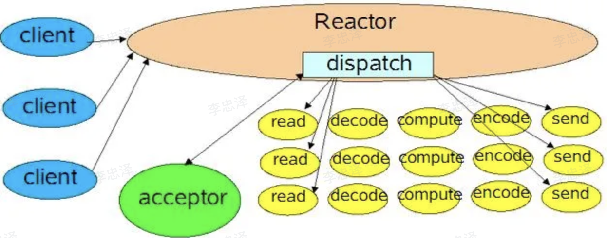

这样就不会阻塞在某一个操作上，充分发挥性能，可以说 I/O 多路复用让 Redis 单线程也有了较大的并发度，注意这里是并发，而不是并行，在这种模式下，Redis 单核的性能可以说是被充分的利用了。

### Redis处理过程-源码解析

#### Redis的 AE 库

redis实现了一个AE库，它是“A simple Event drived programming library”的简写，翻译过来就是一个简单的事件驱动库，它会根据系统的内核版本自动选择select，epoll，kqueue等不同多路复用的方式。

由于生产环境通常是在linux上面，所以下面我们以常见的epoll为例，以下代码片段均来自自redis 5.0.5。

#### 处理流程

##### 监听端口，注册事件

main->initServer 中，使用 listenToPort 监听端口，创建监听套接字。

```c
listenToPort(server.port,&server.ipfd)  
```

接下来，还是在 initServer 函数中，会调用 aeCreateFileEvent 函数绑定对应的接收处理函数 acceptTcpHandler，绑定之后等到客户端连接请求发回来，就可以关联到这个处理函数。

```c
/* Create an event handler for accepting new connections in TCP and Unix
 * domain sockets. */
for (j = 0; j < server.ipfd_count; j++) {
    if (aeCreateFileEvent(server.el, server.ipfd[j], AE_READABLE,
        acceptTcpHandler,NULL) == AE_ERR)
        {
            serverPanic(
                "Unrecoverable error creating server.ipfd file event.");
        }
}
```

main 函数调用 initServer 之后，就开始在 aeMain 函数中开始一个 EvenLoop 事件循环，通过 epoll_wait() 的方式等待连接达到，此时暂时还没有已经建立的连接，所以没有读写事件的发生，另外计时器等事件也是注册在事件框架中，但这里我们主要还是关注 I/O 事件。

```c
// from Redis 5.0.5
void aeMain(aeEventLoop *eventLoop) {
    eventLoop->stop = 0;
    while (!eventLoop->stop) {
        if (eventLoop->beforesleep != NULL)
            eventLoop->beforesleep(eventLoop);
        aeProcessEvents(eventLoop, AE_ALL_EVENTS|AE_CALL_AFTER_SLEEP);
    }
}
```

##### 连接到达处理

当一个连接到达，事件循环就能收到这个信息，在监听套接字关联的 acceptTcpHandler 函数这时候就开始行动了，先生成一个客户端套接字，但这里也不是马上开始读客户端发送过来的数据，因为也没法确定此时一定能无阻塞地读取到完整的请求包，因此为它注册一个可读事件，仍然放到如上所述的同一个 epoll 实例中，让内核去通知我们该 fd 已经就绪了，这样就解决了 recv 阻塞等待的问题。其源码是从在回调函数中注册回调函数。

acceptTcpHandler -> acceptCommonHandler -> createClient 

createClient中关键片段：

```c
// from Redis 5.0.5

client *c = zmalloc(sizeof(client));

/* passing -1 as fd it is possible to create a non connected client.
 * This is useful since all the commands needs to be executed
 * in the context of a client. When commands are executed in other
 * contexts (for instance a Lua script) we need a non connected client. */
if (fd != -1) {
    anetNonBlock(NULL,fd);
    anetEnableTcpNoDelay(NULL,fd);
    if (server.tcpkeepalive)
        anetKeepAlive(NULL,fd,server.tcpkeepalive);
    if (aeCreateFileEvent(server.el,fd,AE_READABLE,
        readQueryFromClient, c) == AE_ERR)
    {
        close(fd);
        zfree(c);
        return NULL;
    }
}
```

可以看到，这里关键信息是创建了一个客户端对象，然后将客户端套接字设置为非阻塞，然后加入到事件循环里，这里的关联函数是 readQueryFromClient，这里大家应该已经能理解，等这个客户端套接字的读请求过来，就会关联到 readQueryFromClient 来处理。

##### 客户端数据处理

收到一个客户端发来的数据后，readQueryFromClient 就开始行动了，这里我们聚焦关注命令处理，忽略其它细节。

readQueryFromClient->processInputBuffer->processCommand，processInputBuffer 会解析命令，实际执行命令是在 processCommand 中：

第一步：使用lookupCommand，找到对应命令，

```c
/* Now lookup the command and check ASAP about trivial error conditions
 * such as wrong arity, bad command name and so forth. */
c->cmd = c->lastcmd = lookupCommand(c->argv[0]->ptr);
```

第二步：做各项检查，比如检查，确认Redis可以执行本条命令。

第三步：真正执行命令，更改内存数据，下面是说如果客户端启动了事务，则将命令放入队列中，这里我们不过多关注。如果没有开启事务，则调用 call 方法更改内存。

```c
/* Exec the command */
if (c->flags & CLIENT_MULTI &&
    c->cmd->proc != execCommand && c->cmd->proc != discardCommand &&
    c->cmd->proc != multiCommand && c->cmd->proc != watchCommand)
{
    queueMultiCommand(c);
    addReply(c,shared.queued);
} else {
    call(c,CMD_CALL_FULL);
    c->woff = server.master_repl_offset;
    if (listLength(server.ready_keys))
        handleClientsBlockedOnKeys();
}
```

call 里面的实现关键是调用了 proc 方法，这个方法对应的就是命令执行函数。

```c
c->cmd->proc(c);
```

如果看完了这一系列操作，可能会比较奇怪，回包是在哪里进行的呢？实际上，执行完成之后，Redis 会将结果放入 client 结构的输出缓冲区中，这个逻辑是在命令执行函数中，比如GET 命令，它的 proc 其实就是：

```c
void getCommand(client *c) {
    getGenericCommand(c);
}
```

getGenericCommand 里面使用 addReply 将结果放入 client 的输出缓冲区。

```c
int getGenericCommand(client *c) {
    robj *o;

    if ((o = lookupKeyReadOrReply(c,c->argv[1],shared.nullbulk)) == NULL)
        return C_OK;

    if (o->type != OBJ_STRING) {
        addReply(c,shared.wrongtypeerr);
        return C_ERR;
    } else {
        addReplyBulk(c,o);
        return C_OK;
    }
}
```

注意这里也没有直接 send() 到客户端，那么什么时候出发回包到客户端呢？

##### 给客户端回包

我们回到上面aeMain主循环的地方。

```c
void aeMain(aeEventLoop *eventLoop) {
    eventLoop->stop = 0;
    while (!eventLoop->stop) {
        if (eventLoop->beforesleep != NULL)
            eventLoop->beforesleep(eventLoop);
        aeProcessEvents(eventLoop, AE_ALL_EVENTS|AE_CALL_AFTER_SLEEP);
    }
}
```

在进入aeProcessEvents之前会调用eventLoop->beforesleep(eventLoop)，beforeSleep中有handleClientsWithPendingWrites，就是专门做回包的。

```c
/* This function is called just before entering the event loop, in the hope
 * we can just write the replies to the client output buffer without any
 * need to use a syscall in order to install the writable event handler,
 * get it called, and so forth. */
int handleClientsWithPendingWrites(void)
```

其具体工作就是将client结构输出缓冲区的内容，发送给对应的客户端socket。

### 多线程是怎么回事

#### Redis多线程模型

由于Redis从一开始就是基于单线程模型的，Redis 里所有的数据结构都是非线程安全的，规避了数据竞争问题，使得Redis对各种数据结构的操作非常简单、便捷。

Redis选择单线程的核心原因是Redis是都是内存操作，CPU处理都非常快，瓶颈更容易出现在I/O而不是CPU，所以选择了单线程模型。

随着时代的发展，很多业务的请求量都达到了一个曾经难以想象的高度，I/O 操作确实成为了瓶颈，而之前Redis处理流程中读取请求、发送回包都属于 I/O 操作，所以 Redis 引入了多线程，这里的多线程也不是说将整个处理逻辑都多线程化，如果这么做，需要对所有数据结构进行线程安全重构，这是巨大的成本，并且，也不见得能有多大提升，甚至可能因为损耗而降低，毕竟瓶颈大多时候都不在处理，瓶颈实际一般都在于网络 IO。

因为上述情况，Redis选择了引入多线程来处理网络I/O，仍然使用单线程框架来执行Redis命令，这样既保持了Redis核心的单线程处理架构，完全兼容以前的实现，又引入了多线程解决提升网络I/O的性能。

下面是 Redis 多线程的设计思路，如下图：

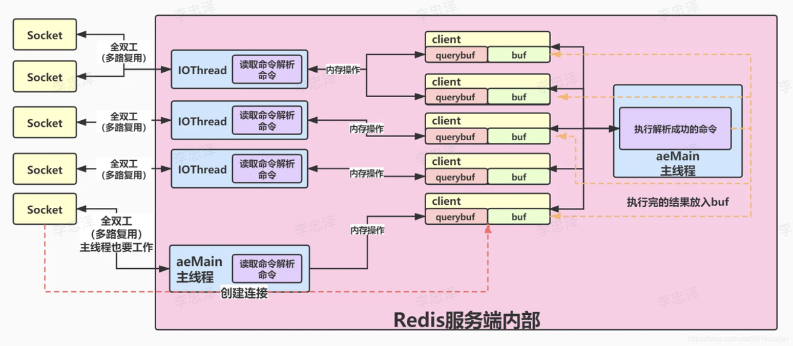

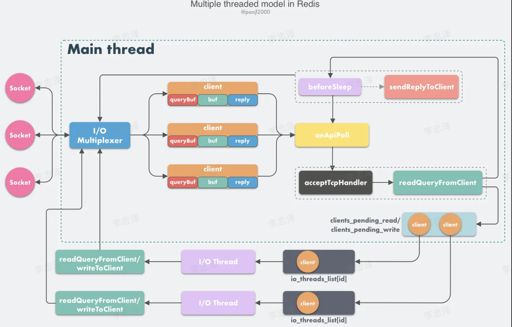

首先，看下什么时候启动多线程：

服务初始化的时候，会调用 initThreadedIO 来初始化多线程，根据 server.io_thread 来配置，如果为 1，表示只有一个主线程，那这里就不会再创建其它线程，如果大于1，并且不超过128，则会进入多线程模式，第一步就是会为多线程模式创建资源。

```c
/* Spawn and initialize the I/O threads. */
for (int i = 0; i < server.io_threads_num; i++) {
    /* Things we do for all the threads including the main thread. */
    io_threads_list[i] = listCreate();
    if (i == 0) continue; /* Thread 0 is the main thread. */

    /* Things we do only for the additional threads. */
    pthread_t tid;
    pthread_mutex_init(&io_threads_mutex[i],NULL);
    setIOPendingCount(i, 0);
    pthread_mutex_lock(&io_threads_mutex[i]); /* Thread will be stopped. */
    if (pthread_create(&tid,NULL,IOThreadMain,(void*)(long)i) != 0) {
        serverLog(LL_WARNING,"Fatal: Can't initialize IO thread.");
        exit(1);
    }
    io_threads[i] = tid;
}
```

这里为所有线程在 io_threads_list 中创建对象，提前锁定了pthread_mutex_lock 互斥锁资源，pthread_create 就创建了多线程，子线程运行 IOThreadMain 操作，IOThreadMain 是一个无限循环函数，也就是说子线程会一直处于运行状态，直至进程结束。

注意，Redis 的多线程模式默认是关闭的，需要用户在 redis.conf 配置文件中开启：

```c
io-threads 4
io-threads-do-reads yes
```

#### 主线程视角

##### 事件循环

主线程和 6.0 版本之前一样，还是使用aeMain来处理事件循环。

```c
void aeMain(aeEventLoop *eventLoop) {
    eventLoop->stop = 0;
    while (!eventLoop->stop) {
        aeProcessEvents(eventLoop, AE_ALL_EVENTS|
                                   AE_CALL_BEFORE_SLEEP|
                                   AE_CALL_AFTER_SLEEP);
    }
}
```

当有客户端有连接过来，acceptTcpHandler 被调用，主线程使用 AE 的 API 将 readQueryFromClient 命令读取处理器绑定到新连接对应的文件描述符上，并初始化一个 client 绑定这个客户端连接。

当 client 的读写请求过来，就会调用 readQueryFromClient 这个方法，老版本是在 readQueryFromClient 函数中同步完成读取、解析、执行、将回包放入客户端输出缓冲区。但是多线程模式下，则只会调用 postponeClientRead 将 client 加入到 clients_pending_read 任务队列中去，后面主线程再分配 I/O 线程去读取客户端请求命令：

```c
void readQueryFromClient(connection *conn) {
    client *c = connGetPrivateData(conn);
    int nread, big_arg = 0;
    size_t qblen, readlen;

    /* Check if we want to read from the client later when exiting from
     * the event loop. This is the case if threaded I/O is enabled. */
    if (postponeClientRead(c)) return;
    
    // 省略...
 }
```

```c
int postponeClientRead(client *c) {
    if (server.io_threads_active &&
        server.io_threads_do_reads &&
        !ProcessingEventsWhileBlocked &&
        !(c->flags & (CLIENT_MASTER|CLIENT_SLAVE|CLIENT_BLOCKED)) &&
        io_threads_op == IO_THREADS_OP_IDLE)
    {
        listAddNodeHead(server.clients_pending_read,c);
        c->pending_read_list_node = listFirst(server.clients_pending_read);
        return 1;
    } else {
        return 0;
    }
}
```

放进队列之后，主线程会在事件循环 beforeSleep 函数中，调用 handleClientsWithPendingReadsUsingThreads，目的是通过  Round-Robin 轮询负载均衡策略把所有任务分配给 I/O 线程和主线程去读取并解析客户端命令。

handleClientsWithPendingReadsUsingThreads 步骤如下：

1. 分开clients给不同的线程；

```c
    /* Distribute the clients across N different lists. */
    listIter li;
    listNode *ln;
    listRewind(server.clients_pending_read,&li);
    int item_id = 0;
    while((ln = listNext(&li))) {
        client *c = listNodeValue(ln);
        int target_id = item_id % server.io_threads_num;
        listAddNodeTail(io_threads_list[target_id],c);
        item_id++;
    }
```

2. 激活其它线程，其它线程会将请求数据存入 client 的 querybuf 中，并解析第一个命令；

```c
 /* Give the start condition to the waiting threads, by setting the
     * start condition atomic var. */
    io_threads_op = IO_THREADS_OP_READ;
    for (int j = 1; j < server.io_threads_num; j++) {
        int count = listLength(io_threads_list[j]);
        setIOPendingCount(j, count);
    }
```

3. 主线程也去读自己负责的一部分

```c
/* Also use the main thread to process a slice of clients. */
listRewind(io_threads_list[0],&li);
while((ln = listNext(&li))) {
    client *c = listNodeValue(ln);
    readQueryFromClient(c->conn);
}
listEmpty(io_threads_list[0]);
```

4. 等待其它线程也完成读取

```c
/* Wait for all the other threads to end their work. */
while(1) {
    unsigned long pending = 0;
    for (int j = 1; j < server.io_threads_num; j++)
        pending += getIOPendingCount(j);
    if (pending == 0) break;
}
```

5. 执行上面读取完的所有命令，具体执行函数为processPendingCommandAndInputBuffer，在这个函数中，会先调用 processCommandAndResetClient 执行第一条已经解析好的命令，然后调用 processInputBuffer 解析并执行客户端连接的所有命令。

```c
int processPendingCommandAndInputBuffer(client *c) {
    if (c->flags & CLIENT_PENDING_COMMAND) {
        c->flags &= ~CLIENT_PENDING_COMMAND;
        if (processCommandAndResetClient(c) == C_ERR) {
            return C_ERR;
        }
    }

    /* Now process client if it has more data in it's buffer.
     *
     * Note: when a master client steps into this function,
     * it can always satisfy this condition, because its querbuf
     * contains data not applied. */
    if (c->querybuf && sdslen(c->querybuf) > 0) {
        return processInputBuffer(c);
    }
    return C_OK;
}
```

##### 回包

和单线程时候一样，多线程版本也是在 beforeSleep 来触发回包，不同的是多线程版本下的beforeSleep会使用多线程来进行回包，关键函数handleClientsWithPendingWritesUsingThreads，

```c
/* Handle writes with pending output buffers. */
handleClientsWithPendingWritesUsingThreads();
```

利用 Round-Robin 轮询负载均衡策略，把等待回包队列中的连接均匀地分配给 I/O 线程各自的本地 FIFO 任务队列 和主线程自己，主线程轮询等待所有 I/O 线程完成回包任务。

```c
/* Wait for all the other threads to end their work. */
while(1) {
    unsigned long pending = 0;
    for (int j = 1; j < server.io_threads_num; j++)
        pending += getIOPendingCount(j);
    if (pending == 0) break;
}
```

#### 子线程视角

##### 等待事件

1. 自旋1000000次等待资源
2. 获取 io_threads_mutex 互斥锁，一开始会阻塞在这里。

此时，就需要等待主线程来触发资源。

##### 处理事件

I/O 线程在会感知到主线程通知的事件变化，会遍历自己的本地任务队列 io_threads_list，取出client 来执行。

可以看到，相比于主线程，子线程的逻辑还是比较清晰简单的。子线程会根据事件类型来决定是回包 writeToClient，还是读取数据 readQueryFromClient。

如果是writeToClient，就通过socket把缓冲区数据发送给客户端，如果是读取操作，就通过socket读取客户端命令，存入读取缓存，这里最终只会解析到第一条命令，然后就结束，不会去执行命令。

在全部任务执行完之后把自己的原子计数器置 0，以告知主线程自己已经完成了工作。

```c
while(1) {
    /* Wait for start */
    for (int j = 0; j < 1000000; j++) {
        if (getIOPendingCount(id) != 0) break;
    }

    /* Give the main thread a chance to stop this thread. */
    if (getIOPendingCount(id) == 0) {
        pthread_mutex_lock(&io_threads_mutex[id]);
        pthread_mutex_unlock(&io_threads_mutex[id]);
        continue;
    }

    serverAssert(getIOPendingCount(id) != 0);

    /* Process: note that the main thread will never touch our list
     * before we drop the pending count to 0. */
    listIter li;
    listNode *ln;
    listRewind(io_threads_list[id],&li);
    while((ln = listNext(&li))) {
        client *c = listNodeValue(ln);
        if (io_threads_op == IO_THREADS_OP_WRITE) {
            writeToClient(c,0);
        } else if (io_threads_op == IO_THREADS_OP_READ) {
            readQueryFromClient(c->conn);
        } else {
            serverPanic("io_threads_op value is unknown");
        }
    }
    listEmpty(io_threads_list[id]);
    setIOPendingCount(id, 0);
}
```

#### Redis多线程性能

多线程性能比单线程提高了一倍左右。

### Redis 命令执行面试与分析

#### 面试题

##### Redis是单线程还是多线程？

分析：

回答：

##### Redis单线程性能如何？

分析：

回答：

##### 为什么单线程还能这么快？

分析：

回答：

##### Redis6.0之后引入了多线程，你知道为什么吗？

分析：

回答：

##### Redis6.0的多线程是默认开启的吗？

分析：

回答：

##### Redis6.0的多线程主要负责命令执行的哪一块？

分析：

回答：

### 内存满了怎么办？

#### Redis可以存多少数据？

使用 maxmemory 配置，默认是被注释掉的，也就是默认值是 0，在 32 位操作系统中，maxmemory 的默认值是 3G，因为 32 位的机器最大只支持 4GB 的内存，而系统本身就需要一定的内存资源来支持运行，默认 3G 相对合理。

现在的机器基本都是64位机器，64位机器不会限制内存的使用。

我们也可以主动配置 maxmemory，当Redis存储超过这个配置值，则触发Redis内存淘汰。

#### 内存淘汰

Redis支持多久淘汰策略，大的方向有两个，一个是 noeviction，默认就是这种策略，此时如果内存达到 maxmemory，则写入操作会失败，但不会淘汰已有数据。

第二个是多种淘汰策略，主要支持LRU，LFU，RANDOM, TTL 这几个方式：

- lru：根据LRU（Least recently used，最近最少使用）算法尝试回收最长时间未使用的；
- lfu：根据LFU（Least Frequently Use）驱逐最不常用的键，lfu是在4.0引入的；
- random：回收随机的键使得新添加的数据有空间存放；
- ttl：回收在过期集合的键，并且优先回收存活时间（TTL）较短的键，使得新添加的数据有空间存放。

这四种策略，可以选择volatile，也就是设置了过期时间的Key，或者是allkeys，即全部的Key，所以一共有8种淘汰方式。

#### 选择哪种淘汰算法

淘汰算法根据业务需求决定，比如，如果数据非常重要，不能丢失，那就选择不淘汰，这种情况会导致写入失败，有完善的告警机制配合人工介入。

如果是缓存场景，业务方一般使用 LRU/LFU 这种灵活的淘汰策略。

#### 淘汰时机

什么时候触发淘汰呢？实际上，每次运行读写命令的时候，都会调用 processCommand 函数，processCommand 中又会调用 freeMemoryIfNeeded，这时候就会尝试去释放一定内存，策略就按我们上述配置的策略。

### 内存淘汰算法-LRU

LRU一直以来都是一个非常流行的资源淘汰算法，为了减少内存消耗，Redis 使用了近似 LRU ，下面我们来介绍一个LRU算法是什么，为什么Redis不用标准的LRU，Redis的近似LRU是怎样的？

#### LRU 算法是什么？

最近最久未使用，即记录每个 Key 的最近访问时间，维护一个访问时间的数据。

#### Redis 用 LRU 算法会有什么问题？

如果为所有数据维护一个顺序列表，实际就是做一个双向链表，但是如果Redis数据稍微多些，这个链表就是巨大的成本，对于Redis而言，内存是最宝贵的，所以Redis选择了近似LRU算法。

#### Redis 近似 LRU 算法

在 LRU 模式，redisObject 对象中 lru 字段存储的是 key 被访问时 Redis 的时钟server.lruclock，当 key 被访问的时候，Redis 会更新这个 key 的 redisObject 的 lru 字段。

注意，Redis 为了保证核心单线程服务性能，缓存了 Unix 操作系统时钟，默认每毫秒更新一次，缓存的值是 Unix 时间戳取模 2^24。

近似 LRU 算法在现有数据结构的基础上采用随机采样的方式来淘汰元素，当内存不足时，就执行一次近似 LRU 算法。

具体步骤是随机采样 n 个 key，这个采样个数默认为 5，然后根据时间戳淘汰掉最旧的那个 key，如果淘汰后内存还是不足，就继续随机采样来淘汰。

##### 采样范围

Redis可以选择范围策略，有两种：

1. allkeys，所有key中随机采样。
2. volatile，从有过期时间的 key 随机采样。

分别对应 allkeys-lru，volatitle-lru。

##### 淘汰池优化

近似LRU，优点在于节约了内存，但是它的缺点就是不是一个完整的LRU，随机采样得到的结果，其实不是全局真正的最久未访问，在数据量大的情况，尤其是这样。

Redis 3.0 对近似 LRU 算法进行了一些优化。新算法会维护一个大小为 16 的候选池，池中的数据根据访问时间进行排序。第一次随机选取的 key 都会放入池中，然后淘汰掉最久未访问的，比如第一次选了 5 个，淘汰了 1 个，剩下 4 个继续留在池子里。

随后每次随机选取的 key 只有活性比池子里活性最小的 key 还小时才会放入池中，当池子装满了，如果有新的 key 需要放入，则将池中活性最大的 key 移除。

通过池子存储，在池子里的数据会越来越接近真实的活性最低，所以其表现也会非常接近真正的LRU。

### 内存淘汰算法-LFU

LFU 淘汰算法，即 Least Frequently Used，最不频繁淘汰算法，顾名思义，优先淘汰活跃最低，使用频率最低的。

#### 源码分析

我们复习下redisObject，其结构如下：

```c
typedef struct redisObject {
    unsigned type:4;
    unsigned encoding:4;
    unsigned lru:LRU_BITS; /* LRU time (relative to global lru_clock) or
                            * LFU data (least significant 8 bits frequency
                            * and most significant 16 bits access time). */
    int refcount;
    void *ptr;
} robj;
```

如果使用 LRU，那么 redisObject 中 lru 字段，就是用来存储最近访问时间的，这个字段长度是 LRU_BITS，这个值一直都是24位。

如果是 LFU，因为 LRU、LFU 是不会同时开启的，所以两者可以说是互斥，基于这个情况，加上节约内存的考虑，Redis 在 LFU 策略下复用 lru 字段，还是用它来表示 LFU 的信息，不过将 24 拆解，高 16bit 存储 ldt(Last Decrement Time)，低 8bit 存储 logc(Logistic Counter)。高的16位保存了上次访问时间戳，因为少了8位，所以LFU下时间精度是1分钟。后8位存储的是一个访问次数。

一个 Key 是否活跃，就是这两个字段综合决定的。如果上一次访问时间很久，那么访问次数就会衰减。而本身访问，会增加访问次数。

```c
/* ===================== Creation and parsing of objects ==================== */

robj *createObject(int type, void *ptr) {
    robj *o = zmalloc(sizeof(*o));
    o->type = type;
    o->encoding = OBJ_ENCODING_RAW;
    o->ptr = ptr;
    o->refcount = 1;

    /* Set the LRU to the current lruclock (minutes resolution), or
     * alternatively the LFU counter. */
    if (server.maxmemory_policy & MAXMEMORY_FLAG_LFU) {
        o->lru = (LFUGetTimeInMinutes()<<8) | LFU_INIT_VAL;
    } else {
        o->lru = LRU_CLOCK();
    }
    return o;
}
```

其中，LFU_INIT_VAL 初始值为 5。

```c
/* Update LFU when an object is accessed.
 * Firstly, decrement the counter if the decrement time is reached.
 * Then logarithmically increment the counter, and update the access time. */
void updateLFU(robj *val) {
    unsigned long counter = LFUDecrAndReturn(val);
    counter = LFULogIncr(counter);
    val->lru = (LFUGetTimeInMinutes()<<8) | counter;
}
```

1. 计算次数衰减。因为无论是多快，相对于上次访问，一定有时间间隔，根据间隔，来计算应该减少的次数。使用的函数就是 LFUDecrAndReturn。
2. 一定概率增加访问次数。这里可能会疑问，为什么是一定概率增加访问次数，次数不足5次，那一定会增加，如果大于5次，小于255次，会一定概率加1，原来的次数越大，越困难。除了原来的次数影响之外，还有一个 lfu-log-factor 参数可以被设置的。也就是说，可以通过 lfu-log-factor 参数来调节难度，这个越大，难度也越大，如果为0，那么每次必然+1，很快就能255。
3. 更新。当前时间更新到高16位，次数更新到低8位。

### 内存淘汰面试与分析

#### 面试题

##### Redis有几种内存回收策略？

分析：

回答：大的方向有两种，一种是 noeviction 不进行淘汰，此时如果内存达到 maxmemory，写入操作失败，但是不会淘汰已有数据。另一种是多种淘汰策略，lru（最近最少使用，算法尝试回收最长时间未使用的）、lfu（驱逐最不常用的（次数）），random（回收随机的键）、ttl（回收过期集合的键，优先回收存活时间（ttl）较短的键）。

##### 内存回收是什么时候发起？

分析：

回答：实际上，每次进行读写的时候，都会调用 processCommand 函数，processCommand 函数又会调用 freememoryIfNeeded，这个时候就会尝试去释放一定的内存。

##### 介绍下Redis LRU回收算法

分析：

回答：LRU 最近最久未使用，即记录每个key的最近访问时间，维护一个访问时间的数据。

##### Redis LRU算法是标准的吗？为什么不用标准的？

分析：

回答：采用近似 LRU，如果为所有的数据维护一个顺序列表，实际上就是做一个双向链表，但是如果 redis 数据过大这个链表的成本就巨大，对于 redis 来说内存是宝贵的，所以 redis 采用采样的方式来做，也就是近似 LRU 算法。

首先。redisObject 对象中的 lru 字段存储的是 key 被访问时 redis 的时钟，当 key 被访问的时候，redis 会更新这个 key 的 redisObject 的 lru 字段。近似 lru 算法在原有的基础上采用随机采样的方式来淘汰元素，当内存不足时，执行一次近似 lru 算法。具体步骤为随机采样 n 个 key（默认为5）然后根据时间戳淘汰掉最旧的那个 key，有两种采样范围，allkeys，所有的key随机采样，allkeys-lru；volatile 从有过期时间的 key 随机采样，volatile-lru。

##### 什么是LFU算法，为什么Redis要引入LFU算法？

分析：

回答：LFU，最不频繁淘汰算法，优先淘汰活跃度最低，使用频率最低的。对于 lru，只是记录了访问时间，而我们会有根据访问频率淘汰的时候，所以就出现了 lfu。redis 的 lru 字段一共是 24 位，高十六位存储上一次访问的时间戳，低八位存储访问次数，因此，一个key是否活跃是由两个字段来决定的。

## Redis 数据丢失怎么办

### 持久化介绍

Redis 是跑在内存里的，当程序重启或者服务崩溃，数据就会丢失，如果业务场景希望重启之后数据还在，就需要持久化，即把数据保存到可永久保存的存储设备中。

#### 持久化方式

Redis 提供两种方式来持久化：

1. RDB（Redis Database），记录 Redis 某个时刻的全部数据，这种方式本质就是数据快照，直接保存二进制数据到磁盘，后续通过加载 RDB 文件恢复数据。
2. AOF（Append Only File），记录执行的每条命令，重启之后通过重放命令来恢复数据，AOF本质是记录操作日志，后续通过日志重放恢复数据。

RDB是快照恢复，AOF是日志恢复，区别如下：

- 体积方面：相同数据量下，RDB体积更小，因为RDB是记录的二进制紧凑型数据。
- 恢复速度：RDB是数据快照，可以直接加载，而AOF文件恢复，相当于重放情况，RDB显然会更快。
- 数据完整性：AOF记录了每条日志，RDB是间隔一段时间记录一次，用AOF恢复数据通常会更为完整。

#### 用RDB好，还是AOF好

还是根据业务场景来：

- 如果业务本身只是缓存数据且并不是一个海量访问，可以不用开持久化。
- 如果对数据非常重视，可以同时开启 RDB 和 AOF，同时开启的情况下，优先使用 AOF，逻辑是 AOF 的内容通常会比 RDB 更全。
- 如果可以接受丢几分钟级别的数据，那么建议只开 RDB。单独开 AOF，Redis 官方不建议，因为如果决定要走数据备份，那么镜像保存始终是数据库领域非常行之有效的解决方案，所以在配置中 RDB 是默认打开的，而 AOF 不是。

### RDB详解

#### 怎么开启RDB持久化

我们先从实践上入手，看一下怎么开启RDB持久化。

首先，我们打开redis配置文件， mac 下是在 /usr/local/etc/redis.conf，在其中搜索可以发现如下配置：

```c
save 900 1
save 300 10
save 60 10000
```

这里的配置语法是 save interval num，表示每间隔 interval 秒，至少有 num 条写数据操作，写数据操作指增加、删除及更新，就会激活 RDB 持久化。

上面有 3 条 save 配置，他们的意思分别是：每900s，有1条写数据操作；每300s，有10条写数据操作；每60s，有10000写数据操作。

他们之间是并集关系，即只要满足其中一个条件，就达到了RDB持久化的条件。

这三条配置不是我们增加，是默认就存在的，这就是说redis默认已经开启了RDB持久化。

#### RDB文件存哪里

下面的参数决定了文件会存到哪里：

```c
 # The filename where to dump the DB
 dbfilename dump.rdb

 # The working directory.
 dir /Users/niuniumart/code/redis
```

#### 什么时候进行持久化？

Redis持久化会在下面三种情况下进行：

1. 主动执行命令 save。执行了 save 命令，就会在主线程生成 RDB 文件，由于和执行操作命令在同一个线程，所以如果写入 RDB 文件的时间太长，会阻塞主线程，这个命令慎用。
2. 主动执行命令 bgsave。和save不同，会创建一个子进程来生成 RDB 文件，这样可以避免主线程的阻塞。
3. 达到持久化配置阈值。上面有提到，Redis可以配置持久化策略，达到策略就会触发持久化，这里的持久化使用的命令是 bgsave，可以看到 Redis 比较推荐的方式也是后台执行持久化，尽可能减少对主流程影响。达到阈值之后，是由周期函数触发持久化。
4. 在程序正常关闭的时候执行。在关闭时，Redis会启动一次持久化，以记录更全的数据。所以正常关闭丢失的数据不会太多，崩溃才会。

#### RDB具体做了什么

我们这里聚焦达到RDB持久化策略时，是如何进行持久化的，我们先看一下Redis输出：

```bash
62581:M 01 Jan 2023 09:04:26.279 * 1 changes in 3600 seconds. Saving...
62581:M 01 Jan 2023 09:04:26.281 * Background saving started by pid 50162
50162:C 01 Jan 2023 09:04:26.283 * DB saved on disk
62581:M 01 Jan 2023 09:04:26.383 * Background saving terminated with success
```

从输出能看出，RDB确实是通过子进程来进行的，具体做了什么呢？下面是官方的答案：

```bash
How it works
Whenever Redis needs to dump the dataset to disk, this is what happens:
1.Redis forks. We now have a child and a parent process.
2.The child starts to write the dataset to a temporary RDB file.
3.When the child is done writing the new RDB file, it replaces the old one.
This method allows Redis to benefit from copy-on-write semantics.
```

从整体上，是做了以下事项：

1. Fork出一个子进程来专门做 RDB 持久化；
2. 子进程写数据到临时的 RDB 文件；
3. 写完之后，用新 RDB 文件替换旧的 RDB 文件。

下面还有一句：This method allows Redis to benefit from copy-on-write semantics. 就是说这种方式让 Redis 从写时复制技术受益，Redis 官方文档基本没废话，这句话看似无关轻重，实际上说明了：执行 RDB 持久化过程中，Redis 依然可以继续处理操作命令的，也就是数据是能被修改的，这就是通过写时复制技术实现的。

具体而言，fork 创建子进程之后，通过写时复制技术，子进程和父进程是共享同一片内存数据的，因为创建子进程的时候，会复制父进程的页表，但是页表指向的物理内存还是一个。只有在发生修改内存数据的情况时，物理内存才会被复制一份。

就是这样，Redis 使用 bgsave 对当前内存中的所有数据做快照，这个操作是由 bgsave 子进程在后台完成的，执行时不会阻塞父进程中的主线程，这就使得主线程同时可以修改数据。

这样的目的是为了减少创建子进程时的性能损耗，从而加快创建子进程的速度，毕竟创建子进程的过程中，是会阻塞主线程的。

可以看到，复制期间，读数据互不影响，如果有写操作发生，则复制一份给子进程，主进程再修改原来的数据。

### AOF详解

#### AOF写入流程

执行请求时，每条日志都会写入到AOF。这不免会让人担心，是否会影响 Redis 的执行性能，答案是肯定的，多了一步操作，或多或少都会带来些损耗，但是Redis实际是提供了不同的策略来选择不同程度的损耗。Redis 提供了 3 种刷盘策略：

1. appendfsync always，每次请求都刷入AOF，用官方的话说，非常慢，非常安全。
2. appendfsync everysec，每秒刷一次盘，用官方的话来说就是足够快了，但是在崩溃场景下你可能会丢失1秒的数据。
3. appendfsync no，不主动刷盘，让操作系统自己刷，一般情况Linux会每30秒刷一次盘，这种策略下，可以说对性能的影响最小，但是如果发生崩溃，可能会丢失相对比较多的数据。

Redis建议是方案二，也就是每秒刷一次盘，这种方式下速度也足够快了，同时崩溃时损失的数据只有1s，这在大多数场景都是可以接受的。

当然了，我们要根据实际业务来选择，比如就是做简单的缓存，并且不存在什么超级热点缓存，那么丢失30秒也不是什么大事，这时候如果追求性能的机制，可以选择方案3。

方案一说实话倒是很少有场景会使用，因为Redis本身是无法做到完全不丢数据，Redis的定位就不是完全可靠，通常也就没必要损耗大量性能去追求立刻刷盘。

#### 写入AOF细节

写入AOF，其实是分了好几步来的。

第一步，其实是将数据写入 AOF 缓存中，这个缓存名字是 aof_buf，其实就是一个sds数据，

```
sds aof_buf;      /* AOF buffer, written before entering the event loop */
```

第二步，aof_buf 对应数据刷入磁盘缓冲区，什么时候做这个事情呢？事实上，Redis源码中一共有4个时机，会调用一个叫 flushAppendOnlyFile 的函数，这个函数会使用 write 函数来将数据写入操作系统缓冲区：

1. 处理完事件处理后，等待下一次事件到来之前，也就是 beforeSleep 中。
2. 周期函数serverCron中。
3. 服务器退出之前的准备工作时。
4. 通过配置指令关闭AOF功能时。

注意，如果是 appendfsync everysec 策略，那么在上一次 fsync 还没完成之前，并且时长不超过两秒时，就本次 flushAppendOnlyFile 就会放弃，也就是说先不写入 aof_buf。

第三步，刷盘，即调用系统的flush函数，刷盘其实还是在 flushAppendOnlyFile 函数中，是在write 之后，但是不一定调用了 flushAppendOnlyFile，flush 就一定会被调用，这里其实是支持一个刷盘时机的配置，这一步受刷盘策略影响是最深的，如下面代码所示，如果是 appendfsync always 策略，那么就立刻调用 redis_fsync 刷盘，如果是 AOF_FSYNC_EVERYSEC 策略，满足条件后会用 aof_background_fsync 使用后台线程异步刷盘。

```c
/* Perform the fsync if needed. */
if (server.aof_fsync == AOF_FSYNC_ALWAYS) {
    /* redis_fsync is defined as fdatasync() for Linux in order to avoid
     * flushing metadata. */
    latencyStartMonitor(latency);
    redis_fsync(server.aof_fd); /* Let's try to get this data on the disk */
    latencyEndMonitor(latency);
    latencyAddSampleIfNeeded("aof-fsync-always",latency);
    server.aof_last_fsync = server.unixtime;
} else if ((server.aof_fsync == AOF_FSYNC_EVERYSEC &&
            server.unixtime > server.aof_last_fsync)) {
    if (!sync_in_progress) aof_background_fsync(server.aof_fd);
    server.aof_last_fsync = server.unixtime;
}
```

讲到这里，我们应该可以很清晰画出一个相对宏观的完整写入示意图：

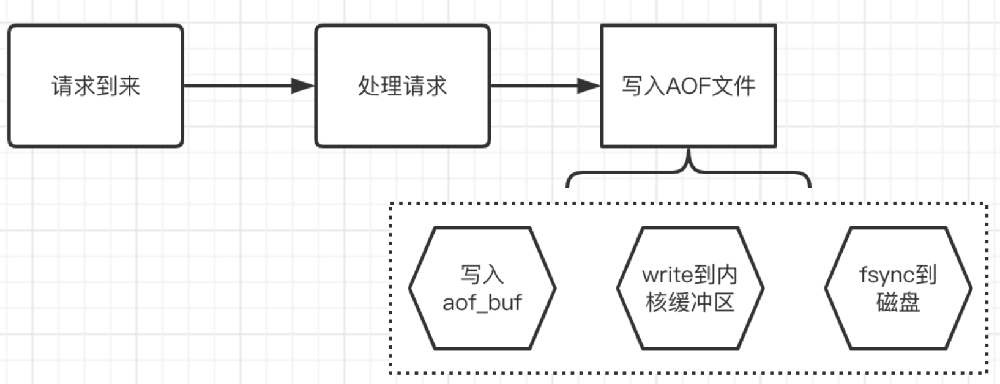

#### AOF 重写

AOF 是不断写入的，这很容易带来一个疑问，如此下去 AOF 不是会不断膨胀吗？

针对这个问题，Redis 采用了重写的方式来解决：

Redis 可以在 AOF 文件体积变得过大时，自动地在后台 Fork 一个子进程，专门对 AOF 进行重写。说白了，就是针对相同 Key 的操作，进行合并，比如同一个 Key 的 set 操作，那就是后面覆盖前面。

在重写过程中，Redis 不但将新的操作记录在原有的 AOF 缓冲区，而且还会记录在 AOF 重写缓冲区。一旦新 AOF 文件创建完毕，Redis 就会将重写缓冲区内容，追加到新的 AOF 文件，再用新 AOF 文件替换原来的 AOF 文件。

这里可能会问，AOF达到多大会重写，实际上，这也是配置决定，默认如下，同时满足这两个条件则重写。

```c
# 相比上次重写时候数据增长100%
auto-aof-rewrite-percentage 100
# 超过
auto-aof-rewrite-min-size 64mb
```

也就是说，超过64M的情况下，相比上次重写时的数据大一倍，则触发重启，很明显，最后实际上还是在周期函数来检查和触发的。

### 混合持久化

混合部署实际发生在AOF重写阶段，将当前状态保存为RDB二进制内容，写入AOF文件，再将重写缓冲区的内容追加到AOF文件。

此时的AOF文件，就不再单纯的是日志数据，而是二进制数据+日志数据的混合体，所以叫混合持久化。

#### 混合持久化解决什么问题？

混合持久化是是发生在原有的 AOF 流程，如果从这个视角来看，其实本质还是 AOF，只是重写时使用了 RDB 进行了优化。

如果从更高层面来看，这个确实是属于 RDB 和 AOF 优点的融合，属于一种折中方案吧，变成了可读性降低的 AOF 或者说性能变差的 RDB？

如果是考虑到对 Redis 核心处理性能的影响，那还是需要用 RDB，如果是为了相对更可靠的数据记录，也就是尽可能丢失更少的数据，那还是得用 AOF，同时，如果对可读性没有太大执念，那进一步开启混合持久化，是一个很好的选择，毕竟其实生产上，关注 AOF 可读性的情况实际比较少。

#### 混合持久化开启之后，服务启动时如何加载持久化数据

如果同时启用了 AOF 和 RDB，Redis 重新启动时，会使用 AOF 文件来重建数据集，因为通常来说， AOF 的数据会更完整，那这里其实是一样的，混合持久化还是属于 AOF，所以如果有混合持久化，那肯定是优先使用混合持久化的数据。至于如何区别是否有AOF混合持久化的数据，可以使用文件开头是否为“REDIS”来判断。

完整的具体加载流程如下：

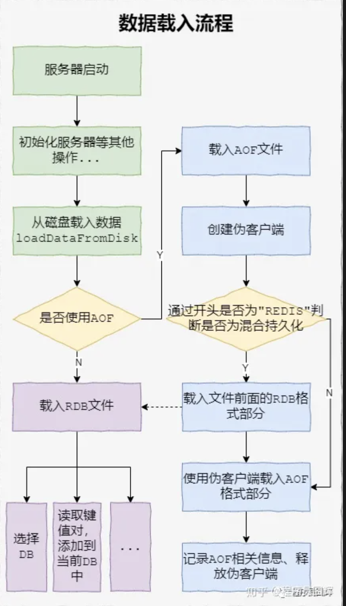

### MP-AOF方案

Redis AOF 文件随着不断膨胀，会通过重写机制来减少 AOF 文件大小。功能上，倒是没啥问题，但是从性能和方案上来说，AOF 重写功能都显得比较粗糙，这也是正常的，持久化作为一个相对分支的模块，在前期没有花费太多精力去优化完全可以理解，随着 Redis 不断完善，AOF 重写功能终于在 7.0 得到了一个很大程度的优化。

#### 原有AOF重写方案弊端

我们详细分析下原有的方案：

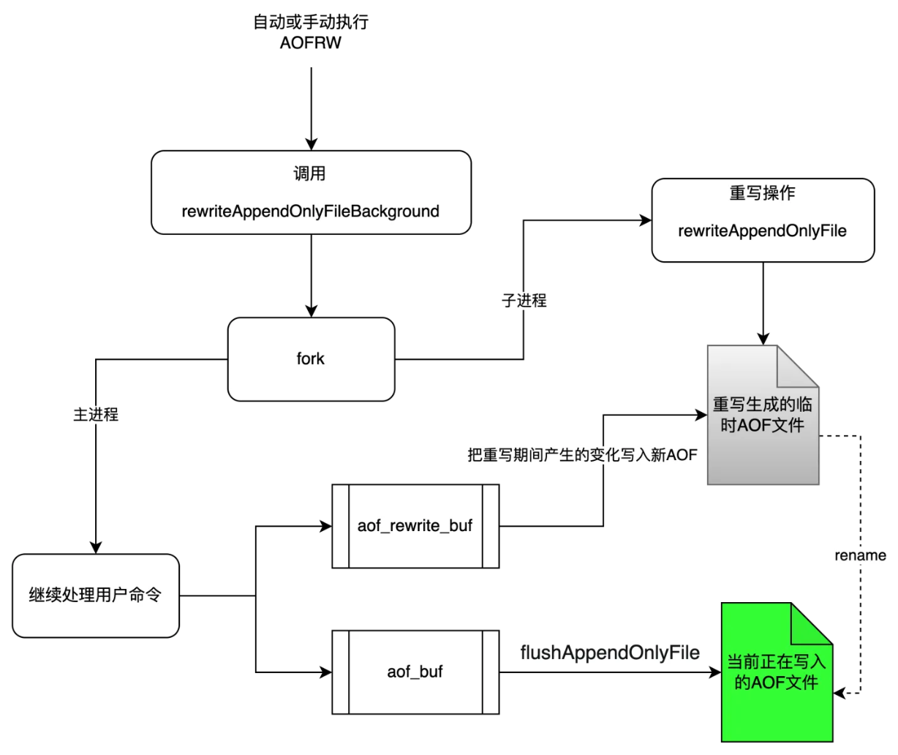

优势：

1. 方案容易想到，前期快速实现。

劣势：

1. 占用主进程CPU时间，在重写期间额外向 aof_rewrite_buf 写数据；通过管道向子进程发送 aof_rewrite_buf 中的数据；以及子进程结束后将剩余 aof_rewrite_buf 写入临时文件，这都是需要消耗 CPU 时间的，而 Redis 核心执行是单线程的，CPU资源的损耗会带来响应速度的降低。
2. 额外的内存开销，在 AOF 重写期间，主进程会将 fork 之后的数据变化同时写进 aof_buf 和 aof_rewrite_buf 中，这部分内容是重复的。另外在子进程读取时候，会开辟一个读取内存空间，下面代码展示了读取时候会开辟内存缓冲区。

```c
// from Redis 5.0.5
/* This function is called by the child rewriting the AOF file to read
 * the difference accumulated from the parent into a buffer, that is
 * concatenated at the end of the rewrite. */
ssize_t aofReadDiffFromParent(void) {
    char buf[65536]; /* Default pipe buffer size on most Linux systems. */
    ssize_t nread, total = 0;

    while ((nread =
            read(server.aof_pipe_read_data_from_parent,buf,sizeof(buf))) > 0) {
        server.aof_child_diff = sdscatlen(server.aof_child_diff,buf,nread);
        total += nread;
    }
    return total;
}
```

3. 额外磁盘开销，主进程除了会将执行过的写命令写到 aof_buf 之外，还会写一份到 aof_rewrite_buf 中。aof_buf 最终写入老文件，aof_rewrite_buf 最终写入新AOF文件，这相当于是两次磁盘消耗，而数据明明是一样的。

为了解决上述问题，我们需要先认清为什么问题的本质是有两个不太合理的设计：

1. 同时向 aof_buf 和 aof_rewrite_buf 写入；
2. 父子进程传输文件数据。

这两个是问题的本质，理清楚了本质，优化起来并不难，Redis 在 7.0 版本引入了 MP-AOF 方案。

#### MP-AOF 方案概述

MP-AOF，全称 Multi Part AOF，也就是多部件 AOF，通俗点说就是原来是一个 AOF 文件，现在变成了多个 AOF 文件的配合。MP-AOF 文件核心有两个Part组成：

1. BASE AOF文件，基础AOF文件，记录了基本的命令。
2. INCR AOF文件，记录了在重写过程中新增的操作命令。

这两个部件，就可以一起组成完整的AOF操作记录，原来是一个 AOF 文件，里面包含了操作的命令记录，MP-AOF 则是提出了 BASE AOF 和 INCR AOF 两种文件的组合，一个 BASE AOF 结合  INCR AOF，一起来表示所有的操作命令。

MP-AOF 的流程如下：

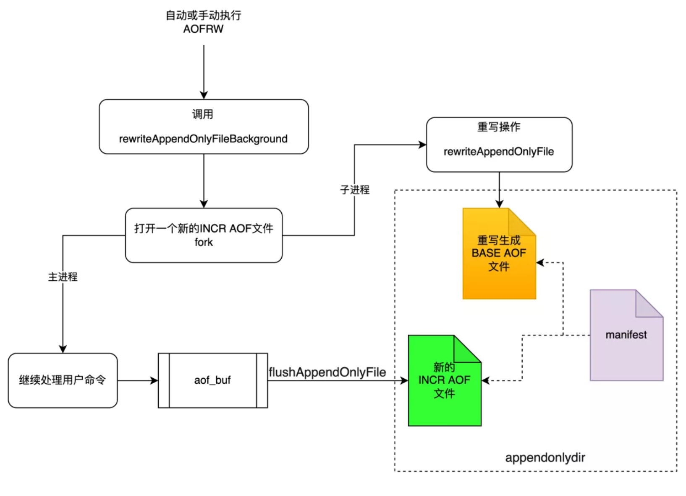

可以看到，现在重写阶段，在主进程中写 aof_buf 即可，aof_buf 的数据最终落入新打开的INCR AOF 文件，至于子进程，就安心将原来的 BASE AOF 重写并生成新的一个BASE AOF 文件。新生成的 BASE AO F和新打开的 INCR AOF 就代表了当前时刻 Redis 的全部数据。

写完之后呢，也不是覆盖原有的 BASE AOF 和 INCR AOF，而只需要更新 manifest 文件，manifest 是文件清单，描述了当前有效的 BASE AOF、INCR AOF 是哪个，这里可以简单理解为 manifest 就是一个配置。

那之前旧的 BASE AOF、INCR AOF 文件怎么办呢？Redis是将它们标记为 HISTORY AOF，这些 HISTORY AOF 会被 Redis 异步删除掉。

通过上述讲解，我们可以看到：

1. 我们在 AOFRW 期间不再需要 aof_rewrite_buf；
2. 我们也不再需要父子进程通过管道传输操作数据；

如此一来，CPU、内存、磁盘的性能损耗会降低很多，甚至代码复杂度也会降低，整体更为简单清晰，这也符合 Redis 的简洁的理念。

### 持久化面试题

#### 面试题

##### RDB 和 AOF 本质区别是什么？

分析：如果是讲区别可以从文件类型，文件恢复速度，安全性来进行回答，但本质区别就是RDB 是使用快照进行持久化，AOF是日志。

其他可以列举的区别点 都是能从快照与日志中的对比找出的：

- 文件类型：RDB 生成的是二进制文件（快照），AOF 生成的是文本文件（追加日志）。
- 安全性：缓存宕机时，RDB 容易丢失较多的数据，AOF 根据策略决定（默认的 everysec 可以保证最多有一秒的丢失）。
- 文件恢复速度：由于 RDB 是二进制文件，所以恢复速度也比 AOF 更快。
- 操作的开销：每一次 RDB 保存都是一次全量保存，操作比较重，通常设置至少 5 分钟保存一次数据。而 AOF 的刷盘是一次追加操作，操作比较轻，通常设置策略为每一秒进行一次刷盘。

回答：本质区别就是 RDB 是保存快照进行持久化，而 AOF 则是 追加日志文件进行持久化。

##### RDB 为什么不每一秒做一次快照？

分析：

回答：虽然可以通过 fork 出的子进程来做全量快照，但是如果每一秒一次，会导致很大的恶性能开销，可能这一秒的快照都没完成，下一秒又 fork 出一个子进程来做快照，而 fork 子进程是会导致住县城阻塞的，所以 RDB 的快照触发间隔是比较难确定的。

##### 如果RDB和AOF只能选一种，你选哪个？

分析：其实就是让我们在性能和 可靠之间做一个选择。这里不提供给大家一个所谓完全正确的答案，主要是让大家对两种持久化方式有更深刻的理解。

回答：如果我们能接受分钟级别的数据丢失，可以考虑选择RDB；如果需要尽量保证数据安全，可以考虑混合持久化；如果只用AOF，那么优先选择 everysec 策略进行刷盘（在可靠和性能之间有一个平衡）。Redis 不推荐单独开 AOF，如果需要持久化，快照始终是一个好办法，从默认配置也能看出来 RDB 是默认的，AOF 不是。

##### RDB 触发条件是什么？触发时机又是什么？

分析：从源码来看，RDB持久化函数整体上在这几个地方会被使用：

- Redis Shutdown（Redis关闭之前进行一次持久化）；
- 客户端发送save命令；
- 客户端发送bgsave命令；
- 每一次事件循环ServerCron检查是否需要bgsave（也就是判断我们的RDB配置）；
- 主从全量复制发送RDB文件（也进行一次RDB持久化）；
- 客户端执行数据库清空命令FLUSHALL。

虽然 RDB 的触发条件有很多，但实际执行过程很简单，而区别点在于是子进程来执行还是主进程执行这个流程：

- 打开一个临时的RDB文件（c语言库函数fopen）；
- 将执行命令这一时刻数据库数据写入到 IO缓冲区（c语言库函数fwrite）；
- 执行fflush（将 IO 缓冲区里的数据刷新到内核缓冲区）；
- 执行fsync（可以将内核缓冲区里的数据刷到磁盘）；
- 执行fclose （关闭这个临时文件）；
- 修改临时文件名字，并让后台线程 BIO_LAZY_FREE 去删除旧的RDB（到此，一次RDB过程结束）。

简单来说 RDB 的流程就是触发RDB持久化时，让主进程或子进程（区分条件）来将这一时刻的数据库数据写到一个新的 RDB 文件中。

回答：根据分析理清楚RDB流程是怎样的，触发条件大致有哪些，酌情回答(无须细究源码，大概了解就行)。

##### AOF 触发条件是什么？触发时机又是什么？

分析：首先一定要弄清楚AOF的流程是怎样的，整个 AOF 的流程可以分为三个过程：命令追加（append到aod_buf）、文件写入（write进内核缓冲区）、文件同步（fsync让内核缓冲区数据进入磁盘文件 ）。

从源码来看，AOF刷盘函数在三个地方会被触发：

- Redis Shutdown的时候；
- 每一次事件循环 钩子函数 beforeSleep()；
- 每一次事件循环的时间事件对应的handler——serverCron()。

回答：根据分析 理清楚AOF流程是怎样的，不同appendfsync策略是如何执行的，酌情回答。

##### RDB 对主流程有什么影响？

分析：主要从RDB的整个流程来寻找一些明显或潜在的风险。

回答：

- 当执行Save命令的时候，由主进程进行 RDB快照保存，会阻塞主进程。
- 当执行BgSave或是配置自动触发时，由fork出的子进程来进行RDB快照保存。
	- 如果数据量比较大的时候，会导致fork子进程 这个操作比较耗时，从而阻塞主进程。
	- 由于采用了 写时复制技术，如果在进行 RDB 快照保存的时候，有大量的写入操作执行，会导致主进程多拷贝一份数据给子进程，消耗大量额外的内存。

##### AOF 对主流程有什么影响？

分析：

- 明显的影响：使用 AOF 持久化，如果我们选择 always 的策略，每当 Redis 命令执行之后，需要由主进程进行 write + fsync 的操作，如果数据过大的话，主进程就会花费较大的时间 用于写 AOF 日志，对后续请求影响较大（阻塞知道写 AOF 完成，才能响应客户端执行成功）
- 潜在的影响：
  - 如果我们选择 everysecond 策略，虽然 fsync 是交给后台线程 BIO_AOF_FSYNC 来完成，但是主进程还需要进行 write 操作，如果后台线程上一轮 fsync 没有完成，那么主进程进 write 的时候仍然会阻塞（因为 write 作用在一个正在 fsync 的 fd 上，会阻塞）。
  - AOF 重写是由 fork 出的子进程进行的，类似于上面提到的风险，fork 子进程这个操作有可能阻塞主进程。

回答：

- 当 appendfsync 使用 always，如果AOF写入日志压力过大会导致主进程无法继续处理其他请求。
- 当 appendfsync 使用 everysec，如果后台线程上一轮的 fsync 没有完成，会导致我们本轮主线程执行 write 被阻塞（直到fsync完成）。
- 当 AOF 重写发生时，如果数据量比较大，会导致 fork 子进程 这个操作比较耗时，从而阻塞主进程。

##### AOF 混合持久化方案是什么？

分析：需要记住的是，AOF混合持久化，就是在AOF重写的基础上做了一些改动。

回答：

- AOF 混合持久化会使用 RDB 持久化函数将内存数据写入到新的 AOF 文件中 （数据格式也是 RDB 格式）。
- 而重写期间新的写入命令追加到新的 AOF 文件仍然是 AOF 格式。
- 此时新的 AOF 文件就是由 RDB 格式和 AOF 格式组成的日志文件。

##### AOF 混合持久化有什么优缺点？

分析：

回答：

优点：重写之后的 AOF 文件体积更小，并且含有 RDB 格式（二进制）的数据，能加快恢复的速度。

缺点：含有一部分 RDB 格式数据，降低了可读性（对于人来说）。

##### 简单描述AOF重写流程

分析： 记住简单流程：

- 可以将 AOF 重写流程 记为 ”一次拷贝，两处日志“；
- 一次拷贝：重写发生时，主进程会 fork 出一个子进程，让子进程将这些 Redis 数据写入重写日志；
- 两处日志：重写发生时，我们需要注意  AOF 缓冲和 AOF 重写缓冲；当重写时，有新的写入命令执行，会由主进程分别写入 AOF 缓冲 和 AOF 重写缓冲；AOF 缓冲用于保证此时发生宕机，原来的 AOF 日志也是完整的，可用于恢复。AOF 重写缓冲用于保证新的 AOF 文件也不会丢失最新的写入操作。
- 额外补充：在重写时 AOF 重写缓冲会通过管道传送给子进程，再由子进程刷入新的 AOF 日志（此时，AOF 重写完成）。

回答：我将AOF重写流程理解成 “一次拷贝，两处日志”：

- 一次拷贝：重写发生时，主进程会 fork 出一个子进程，被将 Redis 内存拷贝给子进程，让子进程将这些内存写入重写日志。
- 两处日志：当重写时，有新的写入命令执行，会由主进程分别写入 AOF 缓冲 和 AOF 重写缓冲；AOF 缓冲用于保证 此时发生宕机，原来的 AOF 日志也是完整，可用于恢复。AOF 重写缓冲用于保证新的 AOF 文件也不会丢失最新的写入操作。

##### AOF 重写你觉得有什么不足之处么？

分析：我们可以从上题的 “一次拷贝，两处日志”来进行分析：

- 一次拷贝：使用子进程来重写日志，没有问题。
- 两处日志：重写期间 新的写命令，会将数据写入到两份日志（AOF 缓冲和 AOF 重写缓冲）中，这是额外的 CPU 和内存开销 ；重写时会将 AOF 缓冲和 AOF 重写缓冲分别写入到 旧日志和新日志中，这是额外的磁盘开销。
- 除了清楚 AOF 的不足之处，如果还知道改进方案，那么会令人刮目相看，Redis 7.0 就做了新的改进。

回答：

不足之处：

- 额外的CPU开销：在重写时，主进程需要将新的写入数据 写入到 AOF重写缓冲(aof_rewrite_buf)；主进程 还需要通过管道向子进程发送AOF重写缓冲的数据;  子进程还需要将这些数据 写入到新的AOF日志中。
- 额外的内存开销：在重写时，AOF缓冲 和 AOF重写缓冲 中的数据都是一样的（浪费了一份）。
- 额外的磁盘开销：在重写时，AOF缓冲需要刷入 旧的AOF日志，AOF重写缓冲也需要刷入 到新的AOF日志，导致在重写时磁盘多占一份数据。

改进之处：

- 在 Redis 7.0 版本，对 AOF 重新作出了优化，提出了 MP-AOF 方案，原来的 AOF 重写缓冲被移除，AOF 日志也分成了 Base AOF 日志 ，Incr AOF 日志。MP-AOF：Multi Part AOF = one BASE AOF + many INCR AOFs。
- Base AOF 日志记录重写之前的命令；Incr AOF 日志记录重写时新的写入命令（正常 AOF 刷盘的时候写的是 Incr AOF）。
- 当重写发生时，主进程 fork 出一个 子进程，对 AOF 日志进行重写（将当前内存数据写入到新的 Base AOF 日志）；如果此时有新的写入命令，会由主进程写入到 aof_buf，再将缓冲数据刷入新的 Incr AOF 日志。这样新的 Incr AOF日志 + 新的 Base AOF 日志就构成了完整的新的 AOF 日志。
- 子进程重写结束时，主进程会负责更新 manifest 文件，将新生成的 BASE AOF 和 INCR AOF 信息加进清单，并将之前的 BASE AOF 和 INCR AOF 标记为 HISTORY。mianfest 用于追踪管理AOF文件。
- 这些 HISTORY 文件默认会被 Redis 异步删除（unlink），一旦 manifest 文件更新完成，就代表着整个 AOFRW 流程结束。

## Redis 版本特性

只需要记住 6.0 版本引入了多线程。

# Redis 学习指引

## 数据结构

### Redis 常见数据类型和应用场景

#### String

String 是最基本的 key-value 结构，key 是唯一标识，value 是具体的值，value其实不仅是字符串， 也可以是数字（整数或浮点数），value 最多可以容纳的数据长度是 512M。

##### 内部实现

String 类型的底层的数据结构实现主要是 int 和 SDS（简单动态字符串）。

SDS 和我们认识的 C 字符串不太一样，之所以没有使用 C 语言的字符串表示，因为 SDS 相比于 C 的原生字符串：

- SDS 不仅可以保存文本数据，还可以保存二进制数据。因为 SDS 使用 len 属性的值而不是空字符来判断字符串是否结束，并且 SDS 的所有 API 都会以处理二进制的方式来处理 SDS 存放在 buf[] 数组里的数据。所以 SDS 不光能存放文本数据，而且能保存图片、音频、视频、压缩文件这样的二进制数据。
- SDS 获取字符串长度的时间复杂度是 O(1)。因为 C 语言的字符串并不记录自身长度，所以获取长度的复杂度为 O(n)；而 SDS 结构里用 len 属性记录了字符串长度，所以复杂度为 O(1)。
- Redis 的 SDS API 是安全的，拼接字符串不会造成缓冲区溢出。因为 SDS 在拼接字符串之前会检查 SDS 空间是否满足要求，如果空间不够会自动扩容，所以不会导致缓冲区溢出的问题。

字符串对象的内部编码（encoding）有 3 种 ：int、raw和 embstr。

如果一个字符串对象保存的是整数值，并且这个整数值可以用 long 类型来表示，那么字符串对象会将整数值保存在字符串对象结构的 ptr 属性里面（将void * 转换成 long），并将字符串对象的编码设置为 int。

如果字符串对象保存的是一个字符串，并且这个字符申的长度小于等于 32 字节（redis 2.+版本），那么字符串对象将使用一个简单动态字符串（SDS）来保存这个字符串，并将对象的编码设置为embstr， embstr编码是专门用于保存短字符串的一种优化编码方式。

如果字符串对象保存的是一个字符串，并且这个字符串的长度大于 32 字节（redis 2.+版本），那么字符串对象将使用一个简单动态字符串（SDS）来保存这个字符串，并将对象的编码设置为raw。

注意，embstr 编码和 raw 编码的边界在 redis 不同版本中是不一样的：

- redis 2.+ 是 32 字节
- redis 3.0-4.0 是 39 字节
- redis 5.0 是 44 字节

embstr 和 raw 编码都会使用SDS来保存值，但不同之处在于 embstr 会通过一次内存分配函数来分配一块连续的内存空间来保存 redisObject 和 SDS，而 raw 编码会通过调用两次内存分配函数来分别分配两块空间来保存 redisObject 和 SDS。Redis 这样做会有很多好处：

- embstr 编码将创建字符串对象所需的内存分配次数从 raw 编码的两次降低为一次；
- 释放 embstr 编码的字符串对象同样只需要调用一次内存释放函数；
- 因为 embstr 编码的字符串对象的所有数据都保存在一块连续的内存里面可以更好的利用 CPU 缓存提升性能。

但是 embstr 也有缺点的：

如果字符串的长度增加需要重新分配内存时，整个 redisObject 和 sds 都需要重新分配空间，所以 embstr 编码的字符串对象实际上是只读的，redis 没有为 embstr 编码的字符串对象编写任何相应的修改程序。当我们对 embstr 编码的字符串对象执行任何修改命令（例如append）时，程序会先将对象的编码从 embstr 转换成 raw，然后再执行修改命令。

##### 应用场景

###### 缓存对象

使用 String 来缓存对象有两种方式：

- 直接缓存整个对象的 JSON，命令例子： `SET user:1 '{"name":"xiaolin", "age":18}'`。
- 采用将 key 进行分离为 user:ID: 属性，采用 MSET 存储，用 MGET 获取各属性值，命令例子： `MSET user:1:name xiaolin user:1:age 18 user:2:name xiaomei user:2:age 20`。

###### 常规计数

因为 Redis 处理命令是单线程，所以执行命令的过程是原子的。因此 String 数据类型适合计数场景，比如计算访问次数、点赞、转发、库存数量等等。

###### 分布式锁

SET 命令有个 NX 参数可以实现「key不存在才插入」，可以用它来实现分布式锁：

- 如果 key 不存在，则显示插入成功，可以用来表示加锁成功；
- 如果 key 存在，则会显示插入失败，可以用来表示加锁失败。

一般而言，还会对分布式锁加上过期时间，分布式锁的命令如下：

```c
SET lock_key unique_value NX PX 10000
```

- lock_key 就是 key 键；
- unique_value 是客户端生成的唯一的标识；
- NX 代表只在 lock_key 不存在时，才对 lock_key 进行设置操作；
- PX 10000 表示设置 lock_key 的过期时间为 10s，这是为了避免客户端发生异常而无法释放锁。

而解锁的过程就是将 lock_key 键删除，但不能乱删，要保证执行操作的客户端就是加锁的客户端。所以，解锁的时候，我们要先判断锁的 unique_value 是否为加锁客户端，是的话，才将 lock_key 键删除。

可以看到，解锁是有两个操作，这时就需要 Lua 脚本来保证解锁的原子性，因为 Redis 在执行 Lua 脚本时，可以以原子性的方式执行，保证了锁释放操作的原子性。

```lua
// 释放锁时，先比较 unique_value 是否相等，避免锁的误释放
if redis.call("get",KEYS[1]) == ARGV[1] then
    return redis.call("del",KEYS[1])
else
    return 0
end
```

这样一来，就通过使用 SET 命令和 Lua 脚本在 Redis 单节点上完成了分布式锁的加锁和解锁。

###### 共享 Session 信息

通常我们在开发后台管理系统时，会使用 Session 来保存用户的会话(登录)状态，这些 Session 信息会被保存在服务器端，但这只适用于单系统应用，如果是分布式系统此模式将不再适用。

例如用户一的 Session 信息被存储在服务器一，但第二次访问时用户一被分配到服务器二，这个时候服务器并没有用户一的 Session 信息，就会出现需要重复登录的问题，问题在于分布式系统每次会把请求随机分配到不同的服务器。

因此，我们需要借助 Redis 对这些 Session 信息进行统一的存储和管理，这样无论请求发送到那台服务器，服务器都会去同一个 Redis 获取相关的 Session 信息，这样就解决了分布式系统下 Session 存储的问题。

#### List

List 列表是简单的字符串列表，按照插入顺序排序，可以从头部或尾部向 List 列表添加元素。列表的最大长度为 2^32 - 1，也即每个列表支持超过 40 亿个元素。

##### 内部实现

List 类型的底层数据结构是由双向链表或压缩列表实现的：

- 如果列表的元素个数小于 512 个（默认值，可由 list-max-ziplist-entries 配置），列表每个元素的值都小于 64 字节（默认值，可由 list-max-ziplist-value 配置），Redis 会使用压缩列表作为 List 类型的底层数据结构；
- 如果列表的元素不满足上面的条件，Redis 会使用双向链表作为 List 类型的底层数据结构；

但是在 Redis 3.2 版本之后，List 数据类型底层数据结构就只由 quicklist 实现了，替代了双向链表和压缩列表。

##### 应用场景

###### 消息队列

消息队列在存取消息时，必须要满足三个需求，分别是消息保序、处理重复的消息和保证消息可靠性。

Redis 的 List 和 Stream 两种数据类型，就可以满足消息队列的这三个需求。这里先了解基于 List 实现消息队列的方法。

1. 如何满足消息保序需求？

List 本身就是按先进先出的顺序对数据进行存取的，所以，如果使用 List 作为消息队列保存消息的话，就已经能满足消息保序的需求了。

List 可以使用 LPUSH + RPOP （或者反过来，RPUSH+LPOP）命令实现消息队列。

- 生产者使用`LPUSH key value[value...]`将消息插入到队列的头部，如果 key 不存在则会创建一个空的队列再插入消息。

- 消费者使用`RPOP key`依次读取队列的消息，先进先出。

不过，在消费者读取数据时，有一个潜在的性能风险点。

在生产者往 List 中写入数据时，List 并不会主动地通知消费者有新消息写入，如果消费者想要及时处理消息，就需要在程序中不停地调用 RPOP 命令（比如使用一个while(1)循环）。如果有新消息写入，RPOP命令就会返回结果，否则，RPOP命令返回空值，再继续循环。

所以，即使没有新消息写入List，消费者也要不停地调用 RPOP 命令，这就会导致消费者程序的 CPU 一直消耗在执行 RPOP 命令上，带来不必要的性能损失。

为了解决这个问题，Redis提供了 BRPOP 命令。BRPOP 命令也称为阻塞式读取，客户端在没有读到队列数据时，自动阻塞，直到有新的数据写入队列，再开始读取新数据。和消费者程序自己不停地调用RPOP命令相比，这种方式能节省CPU开销。

2. 如何处理重复的消息？

消费者要实现重复消息的判断，需要 2 个方面的要求：

- 每个消息都有一个全局的 ID。
- 消费者要记录已经处理过的消息的 ID。当收到一条消息后，消费者程序就可以对比收到的消息 ID 和记录的已处理过的消息 ID，来判断当前收到的消息有没有经过处理。如果已经处理过，那么，消费者程序就不再进行处理了。

但是 List 并不会为每个消息生成 ID 号，所以我们需要自行为每个消息生成一个全局唯一ID，生成之后，我们在用 LPUSH 命令把消息插入 List 时，需要在消息中包含这个全局唯一 ID。

3. 如何保证消息可靠性？

当消费者程序从 List 中读取一条消息后，List 就不会再留存这条消息了。所以，如果消费者程序在处理消息的过程出现了故障或宕机，就会导致消息没有处理完成，那么，消费者程序再次启动后，就没法再次从 List 中读取消息了。

为了留存消息，List 类型提供了 BRPOPLPUSH 命令，这个命令的作用是让消费者程序从一个 List 中读取消息，同时，Redis 会把这个消息再插入到另一个 List（可以叫作备份 List）留存。

这样一来，如果消费者程序读了消息但没能正常处理，等它重启后，就可以从备份 List 中重新读取消息并进行处理了。

好了，到这里可以知道基于 List 类型的消息队列，满足消息队列的三大需求（消息保序、处理重复的消息和保证消息可靠性）。

- 消息保序：使用 LPUSH + RPOP；
- 阻塞读取：使用 BRPOP；
- 重复消息处理：生产者自行实现全局唯一 ID；
- 消息的可靠性：使用 BRPOPLPUSH。

> List 作为消息队列有什么缺陷？

List 不支持多个消费者消费同一条消息，因为一旦消费者拉取一条消息后，这条消息就从 List 中删除了，无法被其它消费者再次消费。

要实现一条消息可以被多个消费者消费，那么就要将多个消费者组成一个消费组，使得多个消费者可以消费同一条消息，但是 List 类型并不支持消费组的实现。

这就要说起 Redis 从 5.0 版本开始提供的 Stream 数据类型了，Stream 同样能够满足消息队列的三大需求，而且它还支持「消费组」形式的消息读取。

#### Hash

Hash 是一个键值对（key - value）集合，其中 value 的形式如： `value=[{field1，value1}，...{fieldN，valueN}]`。Hash 特别适合用于存储对象。

##### 内部实现

Hash 类型的底层数据结构是由压缩列表或哈希表实现的：

- 如果哈希类型元素个数小于 512 个（默认值，可由 hash-max-ziplist-entries 配置），所有值小于 64 字节（默认值，可由 hash-max-ziplist-value 配置）的话，Redis 会使用压缩列表作为 Hash 类型的底层数据结构；
- 如果哈希类型元素不满足上面条件，Redis 会使用哈希表作为 Hash 类型的 底层数据结构。

在 Redis 7.0 中，压缩列表数据结构已经废弃了，交由 listpack 数据结构来实现了。

##### 应用场景

###### 缓存对象

Hash 类型的 （key，field， value） 的结构与对象的（对象id， 属性， 值）的结构相似，也可以用来存储对象。

###### 购物车

以用户 id 为 key，商品 id 为 field，商品数量为 value，恰好构成了购物车的3个要素。


涉及的命令如下：

- 添加商品：`HSET cart:{用户id} {商品id} 1`
- 添加数量：`HINCRBY cart:{用户id} {商品id} 1`
- 商品总数：`HLEN cart:{用户id}`
- 删除商品：`HDEL cart:{用户id} {商品id}`
- 获取购物车所有商品：`HGETALL cart:{用户id}`

当前仅仅是将商品ID存储到了Redis 中，在回显商品具体信息的时候，还需要拿着商品 id 查询一次数据库，获取完整的商品的信息。

#### Set

Set 类型是一个无序并唯一的键值集合，它的存储顺序不会按照插入的先后顺序进行存储。

一个集合最多可以存储 2^32-1 个元素。概念和数学中个的集合基本类似，可以交集，并集，差集等等，所以 Set 类型除了支持集合内的增删改查，同时还支持多个集合取交集、并集、差集。

Set 类型和 List 类型的区别如下：

- List 可以存储重复元素，Set 只能存储非重复元素；
- List 是按照元素的先后顺序存储元素的，而 Set 则是无序方式存储元素的。

##### 内部实现

Set 类型的底层数据结构是由哈希表或整数集合实现的：

- 如果集合中的元素都是整数且元素个数小于 512 （默认值，set-maxintset-entries 配置）个，Redis 会使用整数集合作为 Set 类型的底层数据结构；
- 如果集合中的元素不满足上面条件，则 Redis 使用哈希表作为 Set 类型的底层数据结构。

##### 应用场景

集合的主要几个特性，无序、不可重复、支持并交差等操作。

因此 Set 类型比较适合用来数据去重和保障数据的唯一性，还可以用来统计多个集合的交集、错集和并集等，当我们存储的数据是无序并且需要去重的情况下，比较适合使用集合类型进行存储。

但是要提醒你一下，这里有一个潜在的风险。Set 的差集、并集和交集的计算复杂度较高，在数据量较大的情况下，如果直接执行这些计算，会导致 Redis 实例阻塞。

在主从集群中，为了避免主库因为 Set 做聚合计算（交集、差集、并集）时导致主库被阻塞，我们可以选择一个从库完成聚合统计，或者把数据返回给客户端，由客户端来完成聚合统计。

###### 点赞

Set 类型可以保证一个用户只能点一个赞，这里举例子一个场景，key 是文章id，value 是用户id。`uid:1` 、`uid:2`、`uid:3`三个用户分别对`article:1`文章点赞了。

```bash
# uid:1 用户对文章 article:1 点赞
> SADD article:1 uid:1
(integer) 1
# uid:2 用户对文章 article:1 点赞
> SADD article:1 uid:2
(integer) 1
# uid:3 用户对文章 article:1 点赞
> SADD article:1 uid:3
(integer) 1
```

`uid:1` 取消了对 `article:1` 文章点赞。

```bash
> SREM article:1 uid:1
(integer) 1
```

获取`article:1`文章所有点赞用户 :

```bash
> SMEMBERS article:1
1) "uid:3"
2) "uid:2"
```

获取`article:1`文章的点赞用户数量：

```bash
> SCARD article:1
(integer) 2
```

判断用户`uid:1`是否对文章`article:1`点赞了：

```bash
> SISMEMBER article:1 uid:1
(integer) 0  # 返回0说明没点赞，返回1则说明点赞了
```

###### 共同关注

Set 类型支持交集运算，所以可以用来计算共同关注的好友、公众号等。key 可以是用户 id，value 则是已关注的公众号的 id。

`uid:1`用户关注公众号 id 为 5、6、7、8、9，`uid:2` 用户关注公众号 id 为 7、8、9、10、11。

```bash
# uid:1 用户关注公众号 id 为 5、6、7、8、9
> SADD uid:1 5 6 7 8 9
(integer) 5
# uid:2  用户关注公众号 id 为 7、8、9、10、11
> SADD uid:2 7 8 9 10 11
(integer) 5
```

`uid:1`和`uid:2`共同关注的公众号：

```bash
# 获取共同关注
> SINTER uid:1 uid:2
1) "7"
2) "8"
3) "9"
```

给`uid:2`推荐`uid:1`关注的公众号：

```bash
> SDIFF uid:1 uid:2
1) "5"
2) "6"
```

验证某个公众号是否同时被`uid:1`或`uid:2`关注:

```bash
> SISMEMBER uid:1 5
(integer) 1 # 返回0，说明关注了
> SISMEMBER uid:2 5
(integer) 0 # 返回0，说明没关注
```

###### 抽奖活动

存储某活动中中奖的用户名 ，Set 类型因为有去重功能，可以保证同一个用户不会中奖两次。key 为抽奖活动名，value为员工名称，把所有员工名称放入抽奖箱 ：

```bash
>SADD lucky Tom Jerry John Sean Marry Lindy Sary Mark
(integer) 5
```

如果允许重复中奖，可以使用 SRANDMEMBER 命令。

```bash
# 抽取 1 个一等奖：
> SRANDMEMBER lucky 1
1) "Tom"
# 抽取 2 个二等奖：
> SRANDMEMBER lucky 2
1) "Mark"
2) "Jerry"
# 抽取 3 个三等奖：
> SRANDMEMBER lucky 3
1) "Sary"
2) "Tom"
3) "Jerry"
```

如果不允许重复中奖，可以使用 SPOP 命令。

```bash
# 抽取一等奖1个
> SPOP lucky 1
1) "Sary"
# 抽取二等奖2个
> SPOP lucky 2
1) "Jerry"
2) "Mark"
# 抽取三等奖3个
> SPOP lucky 3
1) "John"
2) "Sean"
3) "Lindy"
```

#### Zset

Zset 类型（有序集合类型）相比于 Set 类型多了一个排序属性 score（分值），对于有序集合 ZSet 来说，每个存储元素相当于有两个值组成的，一个是有序集合的元素值，一个是排序值。有序集合保留了集合不能有重复成员的特性（分值可以重复），但不同的是，有序集合中的元素可以排序。

##### 内部实现

Zset 类型的底层数据结构是由压缩列表或跳表实现的：

- 如果有序集合的元素个数小于 128 个，并且每个元素的值小于 64 字节时，Redis 会使用压缩列表作为 Zset 类型的底层数据结构；
- 如果有序集合的元素不满足上面的条件，Redis 会使用跳表作为 Zset 类型的底层数据结构；

在 Redis 7.0 中，压缩列表数据结构已经废弃了，交由 listpack 数据结构来实现了。

##### 应用场景

Zset 类型（Sorted Set，有序集合） 可以根据元素的权重来排序，我们可以自己来决定每个元素的权重值。比如说，我们可以根据元素插入 Sorted Set 的时间确定权重值，先插入的元素权重小，后插入的元素权重大。

在面对需要展示最新列表、排行榜等场景时，如果数据更新频繁或者需要分页显示，可以优先考虑使用 Sorted Set。

###### 排行榜

有序集合比较典型的使用场景就是排行榜。例如学生成绩的排名榜、游戏积分排行榜、视频播放排名、电商系统中商品的销量排名等。

我们以博文点赞排名为例，小林发表了五篇博文，分别获得赞为 200、40、100、50、150。

```bash
# arcticle:1 文章获得了200个赞
> ZADD user:xiaolin:ranking 200 arcticle:1
(integer) 1
# arcticle:2 文章获得了40个赞
> ZADD user:xiaolin:ranking 40 arcticle:2
(integer) 1
# arcticle:3 文章获得了100个赞
> ZADD user:xiaolin:ranking 100 arcticle:3
(integer) 1
# arcticle:4 文章获得了50个赞
> ZADD user:xiaolin:ranking 50 arcticle:4
(integer) 1
# arcticle:5 文章获得了150个赞
> ZADD user:xiaolin:ranking 150 arcticle:5
(integer) 1
```

文章`arcticle:4`新增一个赞，可以使用 ZINCRBY 命令（为有序集合key中元素member的分值加上increment）：

```bash
> ZINCRBY user:xiaolin:ranking 1 arcticle:4
"51"
```

查看某篇文章的赞数，可以使用 ZSCORE 命令（返回有序集合key中元素个数）：

```bash
> ZSCORE user:xiaolin:ranking arcticle:4
"50"
```

获取小林文章赞数最多的 3 篇文章，可以使用 ZREVRANGE 命令（倒序获取有序集合 key 从start 下标到 stop 下标的元素）：

```bash
# WITHSCORES 表示把 score 也显示出来
> ZREVRANGE user:xiaolin:ranking 0 2 WITHSCORES
1) "arcticle:1"
2) "200"
3) "arcticle:5"
4) "150"
5) "arcticle:3"
6) "100"
```

获取小林 100 赞到 200 赞的文章，可以使用 ZRANGEBYSCORE 命令（返回有序集合中指定分数区间内的成员，分数由低到高排序）：

```bash
> ZRANGEBYSCORE user:xiaolin:ranking 100 200 WITHSCORES
1) "arcticle:3"
2) "100"
3) "arcticle:5"
4) "150"
5) "arcticle:1"
6) "200"
```

###### 电话、姓名排序

使用有序集合的 ZRANGEBYLEX 或 ZREVRANGEBYLEX 可以帮助我们实现电话号码或姓名的排序，我们以 ZRANGEBYLEX （返回指定成员区间内的成员，按 key 正序排列，分数必须相同）为例。

注意：不要在分数不一致的 SortSet 集合中去使用 ZRANGEBYLEX和 ZREVRANGEBYLEX 指令，因为获取的结果会不准确。

1. 电话排序

我们可以将电话号码存储到 SortSet 中，然后根据需要来获取号段：

```bash
> ZADD phone 0 13100111100 0 13110114300 0 13132110901 
(integer) 3
> ZADD phone 0 13200111100 0 13210414300 0 13252110901 
(integer) 3
> ZADD phone 0 13300111100 0 13310414300 0 13352110901 
(integer) 3
```

获取所有号码：

```bash
> ZRANGEBYLEX phone - +
1) "13100111100"
2) "13110114300"
3) "13132110901"
4) "13200111100"
5) "13210414300"
6) "13252110901"
7) "13300111100"
8) "13310414300"
9) "13352110901"
```

获取 132 号段的号码：

```bash
> ZRANGEBYLEX phone [132 (133
1) "13200111100"
2) "13210414300"
3) "13252110901"
```

获取132、133号段的号码：

```bash
> ZRANGEBYLEX phone [132 (134
1) "13200111100"
2) "13210414300"
3) "13252110901"
4) "13300111100"
5) "13310414300"
6) "13352110901"
```

2. 姓名排序

```bash
> zadd names 0 Toumas 0 Jake 0 Bluetuo 0 Gaodeng 0 Aimini 0 Aidehua 
(integer) 6
```

获取所有人的名字：

```bash
> ZRANGEBYLEX names - +
1) "Aidehua"
2) "Aimini"
3) "Bluetuo"
4) "Gaodeng"
5) "Jake"
6) "Toumas"
```

获取名字中大写字母A开头的所有人：

```bash
> ZRANGEBYLEX names [A (B
1) "Aidehua"
2) "Aimini"
```

获取名字中大写字母 C 到 Z 的所有人：

```bash
> ZRANGEBYLEX names [C [Z
1) "Gaodeng"
2) "Jake"
3) "Toumas"
```

#### BitMap

Bitmap，即位图，是一串连续的二进制数组（0和1），可以通过偏移量（offset）定位元素。BitMap 通过最小的单位 bit 来进行 0|1 的设置，表示某个元素的值或者状态，时间复杂度为O(1)。

由于 bit 是计算机中最小的单位，使用它进行储存将非常节省空间，特别适合一些数据量大且使用二值统计的场景。

##### 内部实现

Bitmap 本身是用 String 类型作为底层数据结构实现的一种统计二值状态的数据类型。

String 类型是会保存为二进制的字节数组，所以，Redis 就把字节数组的每个 bit 位利用起来，用来表示一个元素的二值状态，你可以把 Bitmap 看作是一个 bit 数组。

##### 应用场景

Bitmap 类型非常适合二值状态统计的场景，这里的二值状态就是指集合元素的取值就只有 0 和 1 两种，在记录海量数据时，Bitmap 能够有效地节省内存空间。

###### 签到统计

在签到打卡的场景中，我们只用记录签到（1）或未签到（0），所以它就是非常典型的二值状态。

签到统计时，每个用户一天的签到用 1 个 bit 位就能表示，一个月（假设是 31 天）的签到情况用 31 个 bit 位就可以，而一年的签到也只需要用 365 个 bit 位，根本不用太复杂的集合类型。

假设我们要统计 ID 100 的用户在 2022 年 6 月份的签到情况，就可以按照下面的步骤进行操作。

第一步，执行下面的命令，记录该用户 6 月 3 号已签到。

```bash
SETBIT uid:sign:100:202206 2 1
```

第二步，检查该用户 6 月 3 日是否签到。

```bash
GETBIT uid:sign:100:202206 2 
```

第三步，统计该用户在 6 月份的签到次数。

```bash
BITCOUNT uid:sign:100:202206
```

这样，我们就知道该用户在 6 月份的签到情况了。

> 如何统计这个月首次打卡时间呢？

Redis 提供了`BITPOS key bitValue [start] [end]`指令，返回数据表示 Bitmap 中第一个值为 bitValue 的 offset 位置。

在默认情况下， 命令将检测整个位图， 用户可以通过可选的 start 参数和 end 参数指定要检测的范围。所以我们可以通过执行这条命令来获取 userID = 100 在 2022 年 6 月份首次打卡日期：

```bash
BITPOS uid:sign:100:202206 1
```

需要注意的是，因为 offset 从 0 开始的，所以我们需要将返回的 value + 1 。

###### 判断用户登陆态

Bitmap 提供了 GETBIT、SETBIT 操作，通过一个偏移值 offset 对 bit 数组的 offset 位置的 bit 位进行读写操作，需要注意的是 offset 从 0 开始。

只需要一个 key = login_status 表示存储用户登陆状态集合数据， 将用户 ID 作为 offset，在线就设置为 1，下线设置 0。通过 GETBIT 判断对应的用户是否在线。 5000 万用户只需要 6 MB 的空间。假如我们要判断 ID = 10086 的用户的登陆情况：

第一步，执行以下指令，表示用户已登录。

```bash
SETBIT login_status 10086 1
```

第二步，检查该用户是否登陆，返回值 1 表示已登录。

```bash
GETBIT login_status 10086
```

第三步，登出，将 offset 对应的 value 设置成 0。

```bash
SETBIT login_status 10086 0
```

###### 连续签到用户总数

如何统计出这连续 7 天连续打卡用户总数呢？我们把每天的日期作为 Bitmap 的 key，userId 作为 offset，若是打卡则将 offset 位置的 bit 设置成 1。key 对应的集合的每个 bit 位的数据则是一个用户在该日期的打卡记录。

一共有 7 个这样的 Bitmap，如果我们能对这 7 个 Bitmap 的对应的 bit 位做 『与』运算。同样的 UserID offset 都是一样的，当一个 userID 在 7 个 Bitmap 对应的 offset 位置的 bit = 1 就说明该用户 7 天连续打卡。

结果保存到一个新 Bitmap 中，我们再通过 BITCOUNT 统计 bit = 1 的个数便得到了连续打卡 7 天的用户总数了。

Redis 提供了`BITOP operation destkey key [key ...]`这个指令用于对一个或者多个 key 的 Bitmap 进行位元操作。

- operation 可以是 and、OR、NOT、XOR。当 BITOP 处理不同长度的字符串时，较短的那个字符串所缺少的部分会被看作 0 。空的 key 也被看作是包含 0 的字符串序列。

假设要统计 3 天连续打卡的用户数，则是将三个 bitmap 进行 AND 操作，并将结果保存到 destmap 中，接着对 destmap 执行 BITCOUNT 统计，如下命令：

```bash
# 与操作
BITOP AND destmap bitmap:01 bitmap:02 bitmap:03
# 统计 bit 位 =  1 的个数
BITCOUNT destmap
```

即使一天产生一个亿的数据，Bitmap 占用的内存也不大，大约占 12 MB 的内存（10^8/8/1024/1024），7 天的 Bitmap 的内存开销约为 84 MB。同时我们最好给 Bitmap 设置过期时间，让 Redis 删除过期的打卡数据，节省内存。

#### HyperLogLog

Redis HyperLogLog 是 Redis 2.8.9 版本新增的数据类型，是一种用于「统计基数」的数据集合类型，基数统计就是指统计一个集合中不重复的元素个数。但要注意，HyperLogLog 是统计规则是基于概率完成的，不是非常准确，标准误算率是 0.81%。所以，简单来说 HyperLogLog 提供不精确的去重计数。

HyperLogLog 的优点是，在输入元素的数量或者体积非常非常大时，计算基数所需的内存空间总是固定的、并且是很小的。在 Redis 里面，每个 HyperLogLog 键只需要花费 12 KB 内存，就可以计算接近 2^64 个不同元素的基数，和元素越多就越耗费内存的 Set 和 Hash 类型相比，HyperLogLog 就非常节省空间。

##### 应用场景

###### 百万级网页 UV 计数

Redis HyperLogLog 优势在于只需要花费 12 KB 内存，就可以计算接近 2^64 个元素的基数，和元素越多就越耗费内存的 Set 和 Hash 类型相比，HyperLogLog 就非常节省空间。所以，非常适合统计百万级以上的网页 UV 的场景。

在统计 UV 时，你可以用 PFADD 命令（用于向 HyperLogLog 中添加新元素）把访问页面的每个用户都添加到 HyperLogLog 中。

```bash
PFADD page1:uv user1 user2 user3 user4 user5
```

接下来，就可以用 PFCOUNT 命令直接获得 page1 的 UV 值了，这个命令的作用就是返回 HyperLogLog 的统计结果。

```bash
PFCOUNT page1:uv
```

不过，有一点需要你注意一下，HyperLogLog 的统计规则是基于概率完成的，所以它给出的统计结果是有一定误差的，标准误算率是 0.81%。这也就意味着，你使用 HyperLogLog 统计的 UV 是 100 万，但实际的 UV 可能是 101 万。虽然误差率不算大，但是，如果你需要精确统计结果的话，最好还是继续用 Set 或 Hash 类型。

#### GEO

Redis GEO 是 Redis 3.2 版本新增的数据类型，主要用于存储地理位置信息，并对存储的信息进行操作。在日常生活中，我们越来越依赖搜索“附近的餐馆”、在打车软件上叫车，这些都离不开基于位置信息服务（Location-Based Service，LBS）的应用。LBS 应用访问的数据是和人或物关联的一组经纬度信息，而且要能查询相邻的经纬度范围，GEO 就非常适合应用在 LBS 服务的场景中。

##### 内部实现

GEO 本身并没有设计新的底层数据结构，而是直接使用了 Sorted Set 集合类型。

GEO 类型使用 GeoHash 编码方法实现了经纬度到 Sorted Set 中元素权重分数的转换，这其中的两个关键机制就是「对二维地图做区间划分」和「对区间进行编码」。一组经纬度落在某个区间后，就用区间的编码值来表示，并把编码值作为 Sorted Set 元素的权重分数。

这样一来，我们就可以把经纬度保存到 Sorted Set 中，利用 Sorted Set 提供的“按权重进行有序范围查找”的特性，实现 LBS 服务中频繁使用的“搜索附近”的需求。

##### 应用场景

###### 滴滴叫车

假设车辆 ID 是 33，经纬度位置是（116.034579，39.030452），我们可以用一个 GEO 集合保存所有车辆的经纬度，集合 key 是 cars:locations。

执行下面的这个命令，就可以把 ID 号为 33 的车辆的当前经纬度位置存入 GEO 集合中：

```bash
GEOADD cars:locations 116.034579 39.030452 33
```

当用户想要寻找自己附近的网约车时，LBS 应用就可以使用 GEORADIUS 命令。

例如，LBS 应用执行下面的命令时，Redis 会根据输入的用户的经纬度信息（116.054579，39.030452 ），查找以这个经纬度为中心的 5 公里内的车辆信息，并返回给 LBS 应用。

```bash
GEORADIUS cars:locations 116.054579 39.030452 5 km ASC COUNT 10
```

#### Stream

Redis Stream 是 Redis 5.0 版本新增加的数据类型，Redis 专门为消息队列设计的数据类型。在 Redis 5.0 Stream 没出来之前，消息队列的实现方式都有着各自的缺陷，例如：

- 发布订阅模式，不能持久化也就无法可靠的保存消息，并且对于离线重连的客户端不能读取历史消息的缺陷；
- List 实现消息队列的方式不能重复消费，一个消息消费完就会被删除，而且生产者需要自行实现全局唯一 ID。

基于以上问题，Redis 5.0 便推出了 Stream 类型也是此版本最重要的功能，用于完美地实现消息队列，它支持消息的持久化、支持自动生成全局唯一 ID、支持 ack 确认消息的模式、支持消费组模式等，让消息队列更加的稳定和可靠。

##### 应用场景

###### 消息队列

生产者通过 XADD 命令插入一条消息：

```bash
# * 表示让 Redis 为插入的数据自动生成一个全局唯一的 ID
# 往名称为 mymq 的消息队列中插入一条消息，消息的键是 name，值是 xiaolin
> XADD mymq * name xiaolin
"1654254953808-0"
```

插入成功后会返回全局唯一的 ID："1654254953808-0"。消息的全局唯一 ID 由两部分组成：

- 第一部分“1654254953808”是数据插入时，以毫秒为单位计算的当前服务器时间；
- 第二部分表示插入消息在当前毫秒内的消息序号，这是从 0 开始编号的。例如，“1654254953808-0”就表示在“1654254953808”毫秒内的第 1 条消息。

消费者通过 XREAD 命令从消息队列中读取消息时，可以指定一个消息 ID，并从这个消息 ID 的下一条消息开始进行读取（注意是输入消息 ID 的下一条信息开始读取，不是查询输入ID的消息）。

```bash
# 从 ID 号为 1654254953807-0 的消息开始，读取后续的所有消息（示例中一共 1 条）。
> XREAD STREAMS mymq 1654254953807-0
1) 1) "mymq"
   2) 1) 1) "1654254953808-0"
         2) 1) "name"
            2) "xiaolin"
```

如果想要实现阻塞读（当没有数据时，阻塞住），可以调用 XRAED 时设定 BLOCK 配置项，实现类似于 BRPOP 的阻塞读取操作。

比如，下面这命令，设置了 BLOCK 10000 的配置项，10000 的单位是毫秒，表明 XREAD 在读取最新消息时，如果没有消息到来，XREAD 将阻塞 10000 毫秒（即 10 秒），然后再返回。

```bash
# 命令最后的“$”符号表示读取最新的消息
> XREAD BLOCK 10000 STREAMS mymq $
(nil)
(10.00s)
```

Stream 的基础方法，使用 xadd 存入消息和 xread 循环阻塞读取消息的方式可以实现简易版的消息队列。

> 前面介绍的这些操作 List 也支持的，接下来看看 Stream 特有的功能。

Stream 可以以使用 XGROUP 创建消费组，创建消费组之后，Stream 可以使用 XREADGROUP 命令让消费组内的消费者读取消息。

创建两个消费组，这两个消费组消费的消息队列是 mymq，都指定从第一条消息开始读取：

```bash
# 创建一个名为 group1 的消费组，0-0 表示从第一条消息开始读取。
> XGROUP CREATE mymq group1 0-0
OK
# 创建一个名为 group2 的消费组，0-0 表示从第一条消息开始读取。
> XGROUP CREATE mymq group2 0-0
OK
```

消费组 group1 内的消费者 consumer1 从 mymq 消息队列中读取所有消息的命令如下：

```bash
# 命令最后的参数“>”，表示从第一条尚未被消费的消息开始读取。
> XREADGROUP GROUP group1 consumer1 STREAMS mymq >
1) 1) "mymq"
   2) 1) 1) "1654254953808-0"
         2) 1) "name"
            2) "xiaolin"
```

消息队列中的消息一旦被消费组里的一个消费者读取了，就不能再被该消费组内的其他消费者读取了，即同一个消费组里的消费者不能消费同一条消息。

比如说，我们执行完刚才的 XREADGROUP 命令后，再执行一次同样的命令，此时读到的就是空值了：

```bash
> XREADGROUP GROUP group1 consumer1 STREAMS mymq >
(nil)
```

但是，不同消费组的消费者可以消费同一条消息（但是有前提条件，创建消息组的时候，不同消费组指定了相同位置开始读取消息）。

比如说，刚才 group1 消费组里的 consumer1 消费者消费了一条 id 为 1654254953808-0 的消息，现在用 group2 消费组里的 consumer1 消费者消费消息：

```bash
> XREADGROUP GROUP group2 consumer1 STREAMS mymq >
1) 1) "mymq"
   2) 1) 1) "1654254953808-0"
         2) 1) "name"
            2) "xiaolin"
```

因为我创建两组的消费组都是从第一条消息开始读取，所以可以看到第二组的消费者依然可以消费 id 为 1654254953808-0 的这一条消息。因此，不同的消费组的消费者可以消费同一条消息。

使用消费组的目的是让组内的多个消费者共同分担读取消息，所以，我们通常会让每个消费者读取部分消息，从而实现消息读取负载在多个消费者间是均衡分布的。

例如，我们执行下列命令，让 group2 中的 consumer1、2、3 各自读取一条消息：

```bash
# 让 group2 中的 consumer1 从 mymq 消息队列中消费一条消息
> XREADGROUP GROUP group2 consumer1 COUNT 1 STREAMS mymq >
1) 1) "mymq"
   2) 1) 1) "1654254953808-0"
         2) 1) "name"
            2) "xiaolin"
# 让 group2 中的 consumer2 从 mymq 消息队列中消费一条消息
> XREADGROUP GROUP group2 consumer2 COUNT 1 STREAMS mymq >
1) 1) "mymq"
   2) 1) 1) "1654256265584-0"
         2) 1) "name"
            2) "xiaolincoding"
# 让 group2 中的 consumer3 从 mymq 消息队列中消费一条消息
> XREADGROUP GROUP group2 consumer3 COUNT 1 STREAMS mymq >
1) 1) "mymq"
   2) 1) 1) "1654256271337-0"
         2) 1) "name"
            2) "Tom"
```

> 基于 Stream 实现的消息队列，如何保证消费者在发生故障或宕机再次重启后，仍然可以读取未处理完的消息？

Streams 会自动使用内部队列（也称为 PENDING List）留存消费组里每个消费者读取的消息，直到消费者使用 XACK 命令通知 Streams “消息已经处理完成”。

消费确认增加了消息的可靠性，一般在业务处理完成之后，需要执行 XACK 命令确认消息已经被消费完成。

如果消费者没有成功处理消息，它就不会给 Streams 发送 XACK 命令，消息仍然会留存。此时，消费者可以在重启后，用 XPENDING 命令查看已读取、但尚未确认处理完成的消息。

例如，我们来查看一下 group2 中各个消费者已读取、但尚未确认的消息个数，命令如下：

```bash
127.0.0.1:6379> XPENDING mymq group2
1) (integer) 3
2) "1654254953808-0"  # 表示 group2 中所有消费者读取的消息最小 ID
3) "1654256271337-0"  # 表示 group2 中所有消费者读取的消息最大 ID
4) 1) 1) "consumer1"
      2) "1"
   2) 1) "consumer2"
      2) "1"
   3) 1) "consumer3"
      2) "1"
```

如果想查看某个消费者具体读取了哪些数据，可以执行下面的命令：

```bash
# 查看 group2 里 consumer2 已从 mymq 消息队列中读取了哪些消息
> XPENDING mymq group2 - + 10 consumer2
1) 1) "1654256265584-0"
   2) "consumer2"
   3) (integer) 410700
   4) (integer) 1
```

可以看到，consumer2 已读取的消息的 ID 是 1654256265584-0。一旦消息 1654256265584-0 被 consumer2 处理了，consumer2 就可以使用 XACK 命令通知 Streams，然后这条消息就会被删除。

```bash
> XACK mymq group2 1654256265584-0
(integer) 1
```

当我们再使用 XPENDING 命令查看时，就可以看到，consumer2 已经没有已读取、但尚未确认处理的消息了。

```bash
> XPENDING mymq group2 - + 10 consumer2
(empty array)
```

总结一下：

- 消息保序：XADD/XREAD；
- 阻塞读取：XREAD block；
- 重复消息处理：Stream 在使用 XADD 命令，会自动生成全局唯一 ID；
- 消息可靠性：内部使用 PENDING List 自动保存消息，使用 XPENDING 命令查看消费组已经读取但是未被确认的消息，消费者使用 XACK 确认消息；
- 支持消费组形式消费数据。

> Redis 基于 Stream 消息队列与专业的消息队列有哪些差距？

一个专业的消息队列，必须要做到两大块：

- 消息不丢。
- 消息可堆积。

1. Redis Stream 消息会丢失吗？

使用一个消息队列，其实就分为三大块：生产者、队列中间件、消费者，所以要保证消息就是保证三个环节都不能丢失数据。

Redis Stream 消息队列能不能保证三个环节都不丢失数据？

- Redis 生产者会不会丢消息？生产者会不会丢消息，取决于生产者对于异常情况的处理是否合理。 从消息被生产出来，然后提交给 MQ 的过程中，只要能正常收到 （ MQ 中间件） 的 ack 确认响应，就表示发送成功，所以只要处理好返回值和异常，如果返回异常则进行消息重发，那么这个阶段是不会出现消息丢失的。
- Redis 消费者会不会丢消息？不会，因为 Stream （ MQ 中间件）会自动使用内部队列（也称为 PENDING List）留存消费组里每个消费者读取的消息，但是未被确认的消息。消费者可以在重启后，用 XPENDING 命令查看已读取、但尚未确认处理完成的消息。等到消费者执行完业务逻辑后，再发送消费确认 XACK 命令，也能保证消息的不丢失。
- Redis 消息中间件会不会丢消息？会，Redis 在以下 2 个场景下，都会导致数据丢失：
	- AOF 持久化配置为每秒写盘，但这个写盘过程是异步的，Redis 宕机时会存在数据丢失的可能；
	- 主从复制也是异步的，主从切换时，也存在丢失数据的可能。

可以看到，Redis 在队列中间件环节无法保证消息不丢。像 RabbitMQ 或 Kafka 这类专业的队列中间件，在使用时是部署一个集群，生产者在发布消息时，队列中间件通常会写「多个节点」，也就是有多个副本，这样一来，即便其中一个节点挂了，也能保证集群的数据不丢失。

2. Redis Stream 消息可堆积吗？

Redis 的数据都存储在内存中，这就意味着一旦发生消息积压，则会导致 Redis 的内存持续增长，如果超过机器内存上限，就会面临被 OOM 的风险。

所以 Redis 的 Stream 提供了可以指定队列最大长度的功能，就是为了避免这种情况发生。

当指定队列最大长度时，队列长度超过上限后，旧消息会被删除，只保留固定长度的新消息。这么来看，Stream 在消息积压时，如果指定了最大长度，还是有可能丢失消息的。

但 Kafka、RabbitMQ 专业的消息队列它们的数据都是存储在磁盘上，当消息积压时，无非就是多占用一些磁盘空间。

因此，把 Redis 当作队列来使用时，会面临的 2 个问题：

- Redis 本身可能会丢数据；
- 面对消息挤压，内存资源会紧张；

所以，能不能将 Redis 作为消息队列来使用，关键看你的业务场景：

- 如果你的业务场景足够简单，对于数据丢失不敏感，而且消息积压概率比较小的情况下，把 Redis 当作队列是完全可以的。
- 如果你的业务有海量消息，消息积压的概率比较大，并且不能接受数据丢失，那么还是用专业的消息队列中间件吧。

> 补充：Redis 发布/订阅机制为什么不可以作为消息队列？

发布订阅机制存在以下缺点，都是跟丢失数据有关：

1. 发布/订阅机制没有基于任何数据类型实现，所以不具备「数据持久化」的能力，也就是发布/订阅机制的相关操作，不会写入到 RDB 和 AOF 中，当 Redis 宕机重启，发布/订阅机制的数据也会全部丢失。
2. 发布订阅模式是“发后既忘”的工作模式，如果有订阅者离线重连之后不能消费之前的历史消息。
3. 当消费端有一定的消息积压时，也就是生产者发送的消息，消费者消费不过来时，如果超过 32M 或者是 60s 内持续保持在 8M 以上，消费端会被强行断开，这个参数是在配置文件中设置的，默认值是`client-output-buffer-limit pubsub 32mb 8mb 60`。

所以，发布/订阅机制只适合即时通讯的场景，比如构建哨兵集群的场景采用了发布/订阅机制。

### Redis 数据结构

#### SDS 

字符串在 Redis 中是很常用的，键值对中的键是字符串类型，值有时也是字符串类型。

Redis 是用 C 语言实现的，但是它没有直接使用 C 语言的 char * 字符数组来实现字符串，而是自己封装了一个名为简单动态字符串（simple dynamic string，SDS） 的数据结构来表示字符串，也就是 Redis 的 String 数据类型的底层数据结构是 SDS。

##### C 语言字符串的缺陷

C 语言的字符串其实就是一个字符数组，即数组中每个元素是字符串中的一个字符。在 C 语言里，对字符串操作时，char * 指针只是指向字符数组的起始位置，而字符数组的结尾位置就用 “\0” 表示，意思是指字符串的结束。

因此，C 语言标准库中的字符串操作函数就通过判断字符是不是 “\0” 来决定要不要停止操作，如果当前字符不是 “\0” ，说明字符串还没结束，可以继续操作，如果当前字符是 “\0” 是则说明字符串结束了，就要停止操作。

C 语言获取字符串长度的时间复杂度是 O（N），而且 C 语言字符串用 “\0” 字符作为结尾标记有个缺陷。假设有个字符串中有个 “\0” 字符，这时在操作这个字符串时就会提早结束，这个限制使得 C 语言的字符串只能保存文本数据，不能保存像图片、音频、视频文化这样的二进制数据。

另外， C 语言标准库中字符串的操作函数是很不安全的，对程序员很不友好，稍微一不注意，就会导致缓冲区溢出。

##### SDS 结构设计

下图就是 Redis 5.0 的 SDS 的数据结构：

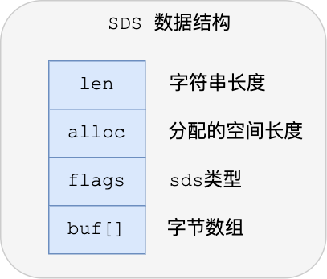

结构中的每个成员变量分别介绍下：

- len，记录了字符串长度。这样获取字符串长度的时候，只需要返回这个成员变量值就行，时间复杂度只需要 O（1）。
- alloc，分配给字符数组的空间长度。这样在修改字符串的时候，可以通过 alloc - len 计算出剩余的空间大小，可以用来判断空间是否满足修改需求，如果不满足的话，就会自动将 SDS 的空间扩展至执行修改所需的大小，然后才执行实际的修改操作，所以使用 SDS 既不需要手动修改 SDS 的空间大小，也不会出现前面所说的缓冲区溢出的问题。
- flags，用来表示不同类型的 SDS。一共设计了 5 种类型，分别是 sdshdr5、sdshdr8、sdshdr16、sdshdr32 和 sdshdr64，后面在说明区别之处。
- buf[]，字符数组，用来保存实际数据。不仅可以保存字符串，也可以保存二进制数据。

总的来说，Redis 的 SDS 结构在原本字符数组之上，增加了三个元数据：len、alloc、flags，用来解决 C 语言字符串的缺陷。

1. O（1）复杂度获取字符串长度

C 语言的字符串长度获取 strlen 函数，需要通过遍历的方式来统计字符串长度，时间复杂度是 O（N）。而 Redis 的 SDS 结构因为加入了 len 成员变量，那么获取字符串长度的时候，直接返回这个成员变量的值就行，所以复杂度只有 O（1）。

2. 二进制安全

因为 SDS 不需要用 “\0” 字符来标识字符串结尾了，而是有个专门的 len 成员变量来记录长度，所以可存储包含 “\0” 的数据。但是 SDS 为了兼容部分 C 语言标准库的函数， SDS 字符串结尾还是会加上 “\0” 字符。

因此， SDS 的 API 都是以处理二进制的方式来处理 SDS 存放在 buf[] 里的数据，程序不会对其中的数据做任何限制，数据写入的时候时什么样的，它被读取时就是什么样的。

通过使用二进制安全的 SDS，而不是 C 字符串，使得 Redis 不仅可以保存文本数据，也可以保存任意格式的二进制数据。

3. 不会发生缓冲区溢出

C 语言的字符串标准库提供的字符串操作函数，大多数都是不安全的，因为这些函数把缓冲区大小是否满足操作需求的工作交由开发者来保证，程序内部并不会判断缓冲区大小是否足够用，当发生了缓冲区溢出就有可能造成程序异常结束。

所以，Redis 的 SDS 结构里引入了 alloc 和 len 成员变量，这样 SDS API 通过 alloc - len 计算，可以算出剩余可用的空间大小，这样在对字符串做修改操作的时候，就可以由程序内部判断缓冲区大小是否足够用。

而且，当判断出缓冲区大小不够用时，Redis 会自动扩大 SDS 的空间大小，以满足修改所需的大小。

SDS 扩容的规则为：

- 如果所需的 sds 长度小于 1 MB，那么最后的扩容是按照翻倍扩容来执行的，即 2 倍的newlen；
- 如果所需的 sds 长度超过 1 MB，那么最后的扩容长度应该是 newlen + 1MB。

在扩容 SDS 空间之前，SDS API 会优先检查未使用空间是否足够，如果不够的话，API 不仅会为 SDS 分配修改所必须要的空间，还会给 SDS 分配额外的「未使用空间」。

这样的好处是，下次在操作 SDS 时，如果 SDS 空间够的话，API 就会直接使用「未使用空间」，而无须执行内存分配，有效的减少内存分配次数。

所以，使用 SDS 即不需要手动修改 SDS 的空间大小，也不会出现缓冲区溢出的问题。

4. 节省内存空间

SDS 结构中有个 flags 成员变量，表示的是 SDS 类型。Redis 一共设计了 5 种类型，分别是 sdshdr5、sdshdr8、sdshdr16、sdshdr32 和 sdshdr64。这 5 种类型的主要区别就在于，它们数据结构中的 len 和 alloc 成员变量的数据类型不同。

之所以 SDS 设计不同类型的结构体，是为了能灵活保存不同大小的字符串，从而有效节省内存空间。比如，在保存小字符串时，结构头占用空间也比较少。

除了设计不同类型的结构体，Redis 在编程上还使用了专门的编译优化来节省内存空间，即在 struct 声明了`__attribute__ ((packed))` ，它的作用是：告诉编译器取消结构体在编译过程中的优化对齐，按照实际占用字节数进行对齐。

#### 链表

先来看看「链表节点」结构的样子：

```c
typedef struct listNode {
    //前置节点
    struct listNode *prev;
    //后置节点
    struct listNode *next;
    //节点的值
    void *value;
} listNode;
```

Redis 在 listNode 结构体基础上又封装了 list 这个数据结构，这样操作起来会更方便，链表结构如下：

```c
typedef struct list {
    //链表头节点
    listNode *head;
    //链表尾节点
    listNode *tail;
    //节点值复制函数
    void *(*dup)(void *ptr);
    //节点值释放函数
    void (*free)(void *ptr);
    //节点值比较函数
    int (*match)(void *ptr, void *key);
    //链表节点数量
    unsigned long len;
} list;
```

##### 链表的优势与缺陷

Redis 的链表实现优点如下：

- listNode 链表节点的结构里带有 prev 和 next 指针，获取某个节点的前置节点或后置节点的时间复杂度只需 O(1)，而且这两个指针都可以指向 NULL，所以链表是无环链表；
- list 结构因为提供了表头指针 head 和表尾节点 tail，所以获取链表的表头节点和表尾节点的时间复杂度只需 O(1)；
- list 结构因为提供了链表节点数量 len，所以获取链表中的节点数量的时间复杂度只需O(1)；
- listNode 链表节使用 void * 指针保存节点值，并且可以通过 list 结构的 dup、free、match 函数指针为节点设置该节点类型特定的函数，因此链表节点可以保存各种不同类型的值；

缺点如下：

- 链表每个节点之间的内存都是不连续的，意味着无法很好利用 CPU 缓存。能很好利用 CPU 缓存的数据结构就是数组，因为数组的内存是连续的，这样就可以充分利用 CPU 缓存来加速访问。
- 还有一点，保存一个链表节点的值都需要一个链表节点结构头的分配，内存开销较大。

因此，Redis 3.0 的 List 对象在数据量比较少的情况下，会采用「压缩列表」作为底层数据结构的实现，它的优势是节省内存空间，并且是内存紧凑型的数据结构。

不过，压缩列表存在性能问题，所以 Redis 在 3.2 版本设计了新的数据结构 quicklist，并将 List 对象的底层数据结构改由 quicklist 实现。

然后在 Redis 5.0 设计了新的数据结构 listpack，沿用了压缩列表紧凑型的内存布局，最终在最新的 Redis 版本，将 Hash 对象和 Zset 对象的底层数据结构实现之一的压缩列表，替换成由 listpack 实现。

#### 压缩列表 Ziplist

压缩列表的最大特点，就是它被设计成一种内存紧凑型的数据结构，占用一块连续的内存空间，不仅可以利用 CPU 缓存，而且会针对不同长度的数据，进行相应编码，这种方法可以有效地节省内存开销。

但是，压缩列表的缺陷也是有的：

- 不能保存过多的元素，否则查询效率就会降低；
- 新增或修改某个元素时，压缩列表占用的内存空间需要重新分配，甚至可能引发连锁更新的问题。

因此，Redis 对象（List 对象、Hash 对象、Zset 对象）包含的元素数量较少，或者元素值不大的情况才会使用压缩列表作为底层数据结构。

##### 压缩列表结构设计

压缩列表是 Redis 为了节约内存而开发的，它是由连续内存块组成的顺序型数据结构，有点类似于数组。


- zlbytes，记录整个压缩列表占用对内存字节数；
- zltail，记录压缩列表「尾部」节点距离起始地址多少字节，也就是列表尾的偏移量；
- zllen，记录压缩列表包含的节点数量；
- zlend，标记压缩列表的结束点，固定值 0xFF（十进制255）。

在压缩列表中，如果我们要查找定位第一个元素和最后一个元素，可以通过表头三个字段（zllen）的长度直接定位，复杂度是 O(1)。而查找其他元素时，就没有这么高效了，只能逐个查找，此时的复杂度就是 O(N) 了，因此压缩列表不适合保存过多的元素。

另外，压缩列表节点（entry）的构成如下：

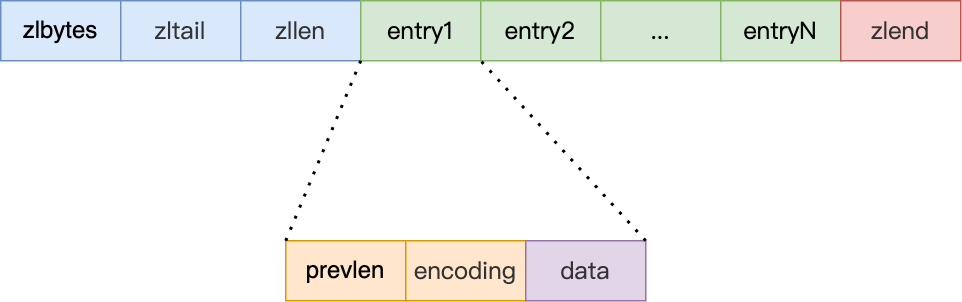

压缩列表节点包含三部分内容：

- prevlen，记录了「前一个节点」的长度，目的是为了实现从后向前遍历；
- encoding，记录了当前节点实际数据的「类型和长度」，类型主要有两种：字符串和整数。
- data，记录了当前节点的实际数据，类型和长度都由 encoding 决定；

当我们往压缩列表中插入数据时，压缩列表就会根据数据类型是字符串还是整数，以及数据的大小，会使用不同空间大小的 prevlen 和 encoding 这两个元素里保存的信息，这种根据数据大小和类型进行不同的空间大小分配的设计思想，正是 Redis 为了节省内存而采用的。

压缩列表里的每个节点中的 prevlen 属性都记录了「前一个节点的长度」，而且 prevlen 属性的空间大小跟前一个节点长度值有关，比如：

- 如果前一个节点的长度小于 254 字节，那么 prevlen 属性需要用 1 字节的空间来保存这个长度值；
- 如果前一个节点的长度大于等于 254 字节，那么 prevlen 属性需要用 5 字节的空间来保存这个长度值；

encoding 属性的空间大小跟数据是字符串还是整数，以及字符串的长度有关。

- 如果当前节点的数据是整数，则 encoding 会使用 1 字节的空间进行编码，也就是 encoding 长度为 1 字节。通过 encoding 确认了整数类型，就可以确认整数数据的实际大小了，比如如果 encoding 编码确认了数据是 int16 整数，那么 data 的长度就是 int16 的大小。
- 如果当前节点的数据是字符串，根据字符串的长度大小，encoding 会使用 1 字节/2字节/5字节的空间进行编码，encoding 编码的前两个 bit 表示数据的类型，后续的其他 bit 标识字符串数据的实际长度，即 data 的长度。

##### 连锁更新

压缩列表除了查找复杂度高的问题，还有一个问题。压缩列表新增某个元素或修改某个元素时，如果空间不够，压缩列表占用的内存空间就需要重新分配。而当新插入的元素较大时，可能会导致后续元素的 prevlen 占用空间都发生变化，从而引起「连锁更新」问题，导致每个元素的空间都要重新分配，造成访问压缩列表性能的下降。

##### 压缩列表的缺陷

空间扩展操作也就是重新分配内存，因此连锁更新一旦发生，就会导致压缩列表占用的内存空间要多次重新分配，这就会直接影响到压缩列表的访问性能。

所以说，虽然压缩列表紧凑型的内存布局能节省内存开销，但是如果保存的元素数量增加了，或是元素变大了，会导致内存重新分配，最糟糕的是会有「连锁更新」的问题。

因此，压缩列表只会用于保存的节点数量不多的场景，只要节点数量足够小，即使发生连锁更新，也是能接受的。

虽说如此，Redis 针对压缩列表在设计上的不足，在后来的版本中，新增设计了两种数据结构：quicklist（Redis 3.2 引入） 和 listpack（Redis 5.0 引入）。这两种数据结构的设计目标，就是尽可能地保持压缩列表节省内存的优势，同时解决压缩列表的「连锁更新」的问题。

#### 哈希表

哈希表是一种保存键值对（key-value）的数据结构。哈希表中的每一个 key 都是独一无二的，程序可以根据 key 查找到与之关联的 value，或者通过 key 来更新 value，又或者根据 key 来删除整个 key-value 等。

Redis 的 Hash 对象的底层实现之一是压缩列表（最新 Redis 代码已将压缩列表替换成 listpack）。Hash 对象的另外一个底层实现就是哈希表。

哈希表优点在于，它能以 O(1) 的复杂度快速查询数据。怎么做到的呢？将 key 通过 Hash 函数的计算，就能定位数据在表中的位置，因为哈希表实际上是数组，所以可以通过索引值快速查询到数据。

但是存在的风险也是有，在哈希表大小固定的情况下，随着数据不断增多，那么哈希冲突的可能性也会越高。解决哈希冲突的方式，有很多种。

Redis 采用了「链式哈希」来解决哈希冲突，在不扩容哈希表的前提下，将具有相同哈希值的数据串起来，形成链接起，以便这些数据在表中仍然可以被查询到。

Redis 的哈希表结构如下：

```c
typedef struct dictht {
    //哈希表数组
    dictEntry **table;
    //哈希表大小
    unsigned long size;  
    //哈希表大小掩码，用于计算索引值
    unsigned long sizemask;
    //该哈希表已有的节点数量
    unsigned long used;
} dictht;
```

哈希表节点的结构如下：

```c
typedef struct dictEntry {
    //键值对中的键
    void *key;
  
    //键值对中的值
    union {
        void *val;
        uint64_t u64;
        int64_t s64;
        double d;
    } v;
    //指向下一个哈希表节点，形成链表
    struct dictEntry *next;
} dictEntry;
```

dictEntry 结构里不仅包含指向键和值的指针，还包含了指向下一个哈希表节点的指针，这个指针可以将多个哈希值相同的键值对链接起来，以此来解决哈希冲突的问题，这就是链式哈希。

dictEntry 结构里键值对中的值是一个「联合体 v」定义的，因此，键值对中的值可以是一个指向实际值的指针，或者是一个无符号的 64 位整数或有符号的 64 位整数或double 类的值。这么做的好处是可以节省内存空间，因为当「值」是整数或浮点数时，就可以将值的数据内嵌在 dictEntry 结构里，无需再用一个指针指向实际的值，从而节省了内存空间。

##### 哈希冲突

哈希表实际上是一个数组，数组里多每一个元素就是一个哈希桶。当一个键值对的键经过 Hash 函数计算后得到哈希值，再将(哈希值 % 哈希表大小)取模计算，得到的结果值就是该 key-value 对应的数组元素位置，也就是第几个哈希桶。

因此，当有两个以上数量的 kay 被分配到了哈希表中同一个哈希桶上时，此时称这些 key 发生了冲突。

##### 链式哈希

「链式哈希」实现的方式就是每个哈希表节点都有一个 next 指针，用于指向下一个哈希表节点，因此多个哈希表节点可以用 next 指针构成一个单项链表，被分配到同一个哈希桶上的多个节点可以用这个单项链表连接起来，这样就解决了哈希冲突。

不过，链式哈希局限性也很明显，随着链表长度的增加，在查询这一位置上的数据的耗时就会增加，毕竟链表的查询的时间复杂度是 O(n)。要想解决这一问题，就需要进行 rehash，也就是对哈希表的大小进行扩展。

##### rehash

Redis 定义一个 dict 结构体，这个结构体里定义了两个哈希表（ht[2]）。

```c
typedef struct dict {
    …
    //两个Hash表，交替使用，用于rehash操作
    dictht ht[2]; 
    …
} dict;
```

在正常服务请求阶段，插入的数据，都会写入到「哈希表 1」，此时的「哈希表 2 」 并没有被分配空间。随着数据逐步增多，触发了 rehash 操作，这个过程分为三步：

- 给「哈希表 2」 分配空间，一般会比「哈希表 1」 大 2 倍；
- 将「哈希表 1 」的数据迁移到「哈希表 2」 中；
- 迁移完成后，「哈希表 1 」的空间会被释放，并把「哈希表 2」 设置为「哈希表 1」，然后在「哈希表 2」 新创建一个空白的哈希表，为下次 rehash 做准备。

这个过程看起来简单，但是其实第二步很有问题，如果「哈希表 1 」的数据量非常大，那么在迁移至「哈希表 2 」的时候，因为会涉及大量的数据拷贝，此时可能会对 Redis 造成阻塞，无法服务其他请求。

##### 渐进式 rehash

为了避免 rehash 在数据迁移过程中，因拷贝数据的耗时，影响 Redis 性能的情况，所以 Redis 采用了渐进式 rehash，也就是将数据的迁移的工作不再是一次性迁移完成，而是分多次迁移。渐进式 rehash 步骤如下：

- 给「哈希表 2」 分配空间；
- 在 rehash 进行期间，每次哈希表元素进行新增、删除、查找或者更新操作时，Redis 除了会执行对应的操作之外，还会顺序将「哈希表 1 」中索引位置上的所有 key-value 迁移到「哈希表 2」 上；
- 随着处理客户端发起的哈希表操作请求数量越多，最终在某个时间点会把「哈希表 1 」的所有 key-value 迁移到「哈希表 2」，从而完成 rehash 操作。

这样就巧妙地把一次性大量数据迁移工作的开销，分摊到了多次处理请求的过程中，避免了一次性 rehash 的耗时操作。

在进行渐进式 rehash 的过程中，会有两个哈希表，所以在渐进式 rehash 进行期间，哈希表元素的删除、查找、更新等操作都会在这两个哈希表进行。

比如，查找一个 key 的值的话，先会在「哈希表 1」 里面进行查找，如果没找到，就会继续到哈希表 2 里面进行找到。

另外，在渐进式 rehash 进行期间，新增一个 key-value 时，会被保存到「哈希表 2 」里面，而「哈希表 1」 则不再进行任何添加操作，这样保证了「哈希表 1 」的 key-value 数量只会减少，随着 rehash 操作的完成，最终「哈希表 1 」就会变成空表。

##### rehash 触发条件

rehash 的触发条件跟负载因子（load factor）有关系。负载因子的计算公式为：`负载因子 = 哈希表已保存节点数量 / 哈希表大小`。触发 rehash 操作的条件，主要有两个：

- 当负载因子大于等于 1 ，并且 Redis 没有在执行 bgsave 命令或者 bgrewiteaof 命令，也就是没有执行 RDB 快照或没有进行 AOF 重写的时候，就会进行 rehash 操作。
- 当负载因子大于等于 5 时，此时说明哈希冲突非常严重了，不管有没有有在执行 RDB 快照或 AOF 重写，都会强制进行 rehash 操作。

#### 整数集合

整数集合是 Set 对象的底层实现之一。当一个 Set 对象只包含整数值元素，并且元素数量不大时，就会使用整数集这个数据结构作为底层实现。

整数集合本质上是一块连续内存空间，它的结构定义如下：

```c
typedef struct intset {
    //编码方式
    uint32_t encoding;
    //集合包含的元素数量
    uint32_t length;
    //保存元素的数组
    int8_t contents[];
} intset;
```

可以看到，保存元素的容器是一个 contents 数组，虽然 contents 被声明为 int8_t 类型的数组，但是实际上 contents 数组并不保存任何 int8_t 类型的元素，contents 数组的真正类型取决于 intset 结构体里的 encoding 属性的值。

##### 整数集合的升级操作

整数集合会有一个升级规则，就是当我们将一个新元素加入到整数集合里面，如果新元素的类型（int32_t）比整数集合现有所有元素的类型（int16_t）都要长时，整数集合需要先进行升级，也就是按新元素的类型（int32_t）扩展 contents 数组的空间大小，然后才能将新元素加入到整数集合里，当然升级的过程中，也要维持整数集合的有序性。

整数集合升级的过程不会重新分配一个新类型的数组，而是在原本的数组上扩展空间，然后在将每个元素按间隔类型大小分割，如果 encoding 属性值为 INTSET_ENC_INT16，则每个元素的间隔就是 16 位。

> 整数集合升级有什么好处呢？

如果要让一个数组同时保存 int16_t、int32_t、int64_t 类型的元素，最简单做法就是直接使用 int64_t 类型的数组。不过这样的话，当如果元素都是 int16_t 类型的，就会造成内存浪费的情况。

整数集合升级就能避免这种情况，如果一直向整数集合添加 int16_t 类型的元素，那么整数集合的底层实现就一直是用 int16_t 类型的数组，只有在我们要将 int32_t 类型或 int64_t 类型的元素添加到集合时，才会对数组进行升级操作。

因此，整数集合升级的好处是节省内存资源。

> 整数集合支持降级操作吗？

不支持降级操作，一旦对数组进行了升级，就会一直保持升级后的状态。

#### 跳表

Redis 只有 Zset 对象的底层实现用到了跳表，跳表的优势是能支持平均 O(logN) 复杂度的节点查找。

zset 结构体里有两个数据结构：一个是跳表，一个是哈希表。这样的好处是既能进行高效的范围查询，也能进行高效单点查询。

```c
typedef struct zset {
    dict *dict;
    zskiplist *zsl;
} zset;
```

Zset 对象在执行数据插入或是数据更新的过程中，会依次在跳表和哈希表中插入或更新相应的数据，从而保证了跳表和哈希表中记录的信息一致。

Zset 对象能支持范围查询（如 ZRANGEBYSCORE 操作），这是因为它的数据结构设计采用了跳表，而又能以常数复杂度获取元素权重（如 ZSCORE 操作），这是因为它同时采用了哈希表进行索引。

跳表是在链表基础上改进过来的，实现了一种「多层」的有序链表，「跳表节点」的数据结构了，如下：

```c
typedef struct zskiplistNode {
    //Zset 对象的元素值
    sds ele;
    //元素权重值
    double score;
    //后向指针
    struct zskiplistNode *backward;
  
    //节点的level数组，保存每层上的前向指针和跨度
    struct zskiplistLevel {
        struct zskiplistNode *forward;
        unsigned long span;
    } level[];
} zskiplistNode;
```

Zset 对象要同时保存「元素」和「元素的权重」，对应到跳表节点结构里就是 sds 类型的 ele 变量和 double 类型的 score 变量。每个跳表节点都有一个后向指针（struct zskiplistNode * backward），指向前一个节点，目的是为了方便从跳表的尾节点开始访问节点，这样倒序查找时很方便。

跳表是一个带有层级关系的链表，而且每一层级可以包含多个节点，每一个节点通过指针连接起来，实现这一特性就是靠跳表节点结构体中的zskiplistLevel 结构体类型的 level 数组。

level 数组中的每一个元素代表跳表的一层，也就是由 zskiplistLevel 结构体表示，比如 leve[0] 就表示第一层，leve[1] 就表示第二层。zskiplistLevel 结构体里定义了「指向下一个跳表节点的指针」和「跨度」，跨度时用来记录两个节点之间的距离。

##### 为什么用跳表而不用平衡树？

这是一个常见的面试题：为什么 Zset 的实现用跳表而不用平衡树（如 AVL树、红黑树等）？

官方主要是从内存占用、对范围查找的支持、实现难易程度这三方面总结的原因：

- 它们不是非常内存密集型的。基本上由你决定。改变关于节点具有给定级别数的概率的参数将使其比 btree 占用更少的内存。
- Zset 经常需要执行 ZRANGE 或 ZREVRANGE 的命令，即作为链表遍历跳表。通过此操作，跳表的缓存局部性至少与其他类型的平衡树一样好。
- 它们更易于实现、调试等。例如，由于跳表的简单性，我收到了一个补丁（已经在Redis master中），其中扩展了跳表，在 O(log(N) 中实现了 ZRANK。它只需要对代码进行少量修改。

补充：

- 从内存占用上来比较，跳表比平衡树更灵活一些。平衡树每个节点包含 2 个指针（分别指向左右子树），而跳表每个节点包含的指针数目平均为 1/(1-p)，具体取决于参数 p 的大小。如果像 Redis里的实现一样，取 p=1/4，那么平均每个节点包含 1.33 个指针，比平衡树更有优势。
- 在做范围查找的时候，跳表比平衡树操作要简单。在平衡树上，我们找到指定范围的小值之后，还需要以中序遍历的顺序继续寻找其它不超过大值的节点。如果不对平衡树进行一定的改造，这里的中序遍历并不容易实现。而在跳表上进行范围查找就非常简单，只需要在找到小值之后，对第 1 层链表进行若干步的遍历就可以实现。
- 从算法实现难度上来比较，跳表比平衡树要简单得多。平衡树的插入和删除操作可能引发子树的调整，逻辑复杂，而跳表的插入和删除只需要修改相邻节点的指针，操作简单又快速。

#### quicklist

在 Redis 3.0 之前，List 对象的底层数据结构是双向链表或者压缩列表。然后在 Redis 3.2 的时候，List 对象的底层改由 quicklist 数据结构实现。

其实 quicklist 就是「双向链表 + 压缩列表」组合，因为一个 quicklist 就是一个链表，而链表中的每个元素又是一个压缩列表。

虽然压缩列表是通过紧凑型的内存布局节省了内存开销，但是因为它的结构设计，如果保存的元素数量增加，或者元素变大了，压缩列表会有「连锁更新」的风险，一旦发生，会造成性能下降。quicklist 解决办法，通过控制每个链表节点中的压缩列表的大小或者元素个数，来规避连锁更新的问题。因为压缩列表元素越少或越小，连锁更新带来的影响就越小，从而提供了更好的访问性能。

quicklist 的结构体跟链表的结构体类似，都包含了表头和表尾，区别在于 quicklist 的节点是 quicklistNode。

```c
typedef struct quicklist {
    //quicklist的链表头
    quicklistNode *head;      //quicklist的链表头
    //quicklist的链表尾
    quicklistNode *tail; 
    //所有压缩列表中的总元素个数
    unsigned long count;
    //quicklistNodes的个数
    unsigned long len;       
    ...
} quicklist;
```

```c
typedef struct quicklistNode {
    //前一个quicklistNode
    struct quicklistNode *prev;     //前一个quicklistNode
    //下一个quicklistNode
    struct quicklistNode *next;     //后一个quicklistNode
    //quicklistNode指向的压缩列表
    unsigned char *zl;              
    //压缩列表的的字节大小
    unsigned int sz;                
    //压缩列表的元素个数
    unsigned int count : 16;        //ziplist中的元素个数 
    ....
} quicklistNode;
```

可以看到，quicklistNode 结构体里包含了前一个节点和下一个节点指针，这样每个 quicklistNode 形成了一个双向链表。但是链表节点的元素不再是单纯保存元素值，而是保存了一个压缩列表，所以 quicklistNode 结构体里有个指向压缩列表的指针 * zl。

在向 quicklist 添加一个元素的时候，不会像普通的链表那样，直接新建一个链表节点。而是会检查插入位置的压缩列表是否能容纳该元素，如果能容纳就直接保存到 quicklistNode 结构里的压缩列表，如果不能容纳，才会新建一个新的 quicklistNode 结构。

quicklist 会控制 quicklistNode 结构里的压缩列表的大小或者元素个数，来规避潜在的连锁更新的风险，但是这并没有完全解决连锁更新的问题。

#### listpack

quicklist 虽然通过控制 quicklistNode 结构里的压缩列表的大小或者元素个数，来减少连锁更新带来的性能影响，但是并没有完全解决连锁更新的问题。

因为 quicklistNode 还是用了压缩列表来保存元素，压缩列表连锁更新的问题，来源于它的结构设计，所以要想彻底解决这个问题，需要设计一个新的数据结构。

于是，Redis 在 5.0 新设计一个数据结构叫 listpack，目的是替代压缩列表，它最大特点是 listpack 中每个节点不再包含前一个节点的长度了，压缩列表每个节点正因为需要保存前一个节点的长度字段，就会有连锁更新的隐患。我看了 Redis 的 Github，在最新 6.2 发行版本中，Redis Hash 对象、ZSet 对象的底层数据结构的压缩列表还未被替换成 listpack，而 Redis 的最新代码（还未发布版本）已经将所有用到压缩列表底层数据结构的 Redis 对象替换成 listpack 数据结构来实现，估计不久将来，Redis 就会发布一个将压缩列表为 listpack 的发行版本。

listpack 采用了压缩列表的很多优秀的设计，比如还是用一块连续的内存空间来紧凑地保存数据，并且为了节省内存的开销，listpack 节点会采用不同的编码方式保存不同大小的数据。

listpack 头包含两个属性，分别记录了 listpack 总字节数和元素数量，然后 listpack 末尾也有个结尾标识。图中的 listpack entry 就是 listpack 的节点了。

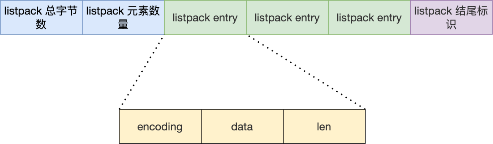

主要包含三个方面内容：

- encoding，定义该元素的编码类型，会对不同长度的整数和字符串进行编码；
- data，实际存放的数据；
- len，encoding+data的总长度；

可以看到，listpack 没有压缩列表中记录前一个节点长度的字段了，listpack 只记录当前节点的长度，当我们向 listpack 加入一个新元素的时候，不会影响其他节点的长度字段的变化，从而避免了压缩列表的连锁更新问题。

### 深入理解Redis跳跃表的基本实现和特性

#### 跳表 Skip List

##### 跳表的特点

注意：只能用于元素有序的情况。所以，跳表（skip list）对表的是平衡树（AVL Tree）和 二分查找，是一种插入、删除、搜索都是 O(logN) 的数据结构。它的最大优势是原理简单、容易实现、方便扩展、效率更高。因此在一些热门的项目里用来替代平衡树，如 Redis、LevelDB等。

#### 如何给有序的链表加速

假设有一个有序的链表，1 3 4 5 7 8 9 10 这么一个原始的链表。它的时间复杂度查询肯定是 O(n)，那么如何优化？可以让它的查询时间复杂度变低，也就是加速它的查询。

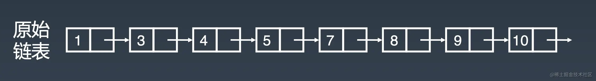

其中，查询的时间复杂度是 O(N)。

> 上面这么一个结构，它是一维的数据结构，现在它是有序了，也就是说我们有附加的信息了，那么如何加速对吧？一般来说这种加速的方式的话，就类似于星际穿越里面这有点玄学，但是你一定要记住一个概念就行了，一维的数据结构要加速的话，经常采用的方式就是升维也就是说变成二维。为什么要多一层维度，因为你多了一个维度之后，就会有多一级的信息在里面，这样多一级的信息就可以帮助你可以很快地得到一维里面你必须挨个走才能走到的那些元素

##### 添加第一级索引

如何提高链表线性查找的效率？

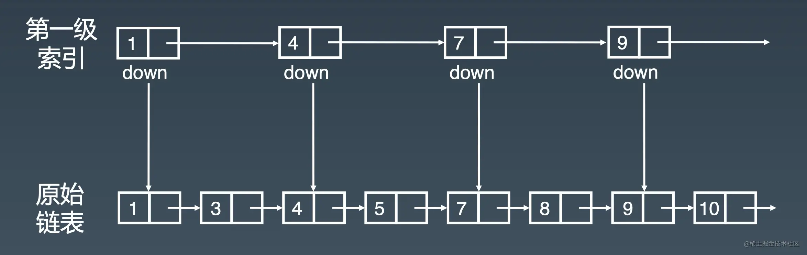

具体我们来看上图，在原始链表的情况下，我们再增加一个维度，也就是在上面再增加一层索引，我们叫做第一级索引，那么第一级索引的话就不是指向它元素的 next 元素了，而是指向它的 next next ，也就是说你可以理解为 next  + 1 就行了，所以第一级索引的话就是第一个元素，马上第三个元素、第五个元素、第七个元素。

- 这里你就会发现如果你要找7的话，我们怎么办？我们这么查找，先查找第一级索引看有没有1 4 7 ，如果有那就说明 7 存在这个链表里面是存在的，说明我们查询到了。
- 我们再看要查另一个元素，比如说 8，我们怎么走？还是先找第一级，8是大于 1 的，所以后继往后到达 4 索引的值，8 是大于 4的，继续往后到了7，8 也大于7的，再继续往后发现 9  大于 8 了。说明 8 是存在于 7 和 9 这两个索引之间的元素里面的，那么这个时候从第一级元素向下走到原始的链表了，从对应的位置挨个找就会发现 8 找到了，说明 8 也是存在的。

##### 添加第二级索引

那么有的朋友可能就会想了，你加一级索引的话，每次相当于步伐加 2 了，但是它的速度的话也就是比原来稍微快了一点，能不能更快呢？对你这个想法是非常有道理的，也是很好的。

那么在一级索引的基础上，我们可以再加索引就行了，也就是说同理可得，在第一级索引的基础上，我们把它当作是一个原始链表一样，往上再加一级索引，也就是说每次针对第一级索引走两步。那么它相等于原始链表相当于每次就走了四步。对不对，就乘于 2，那这样的话，速度就更加高效了。

- 比如我举个例子要查8，先找 1，8 比 1要大，再找 7 ，这时候你会发现 8 也是比 7 大的，再找，假设这个元素后面的话是 11 或者 12 好了，这时候你会发现 8 是小于它后面的元素，所以 7 这里的话就必须向下再走一级索引了，走到第一级索引的 7 来，再类似于之前 7 和 9 之间，然后再走到8 这样一直走下来。

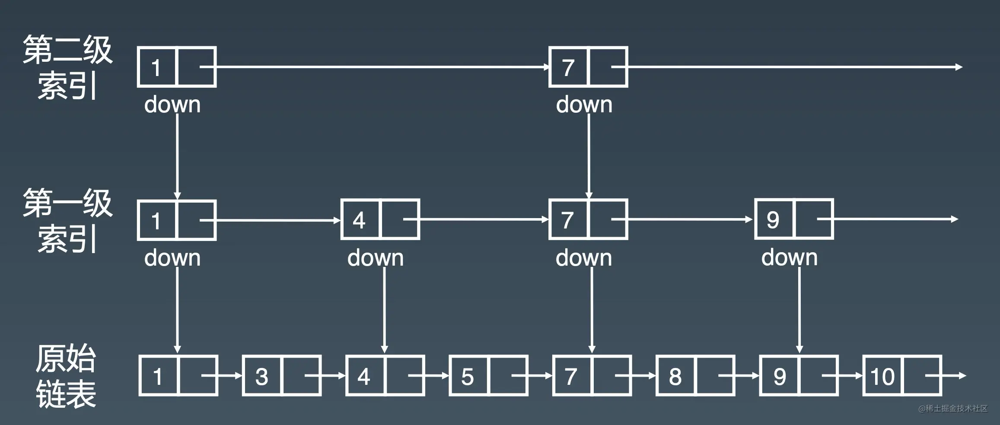

##### 添加多级索引

以此类推，增加多级索引。

假设有五级索引的这么一个原始链表，那么我们要查一个元素，比如说要查 62 元素或者中间元素，就类似于下图，一级一级一级一级走下来，最后的话就可以查到我们需要的 62 这个元素。当然的话你最后查到原始链表，你会发现比如说是我们要查 63 或者 61，原始链表里面没有，我们就说元素不存在，在我们这个有序的链表里面，也就是说在跳表里面查不到这么一个元素，最后也可以得出这样的结论。

#### Redis 跳跃表的实现

Redis 的跳跃表由`redis.h/zskiplistNode`和`redis.h/zskiplist`两个结构定义， 其中 zskiplistNode 结构用于表示跳跃表节点， 而 zskiplist 结构则用于保存跳跃表节点的相关信息， 比如节点的数量， 以及指向表头节点和表尾节点的指针， 等等。

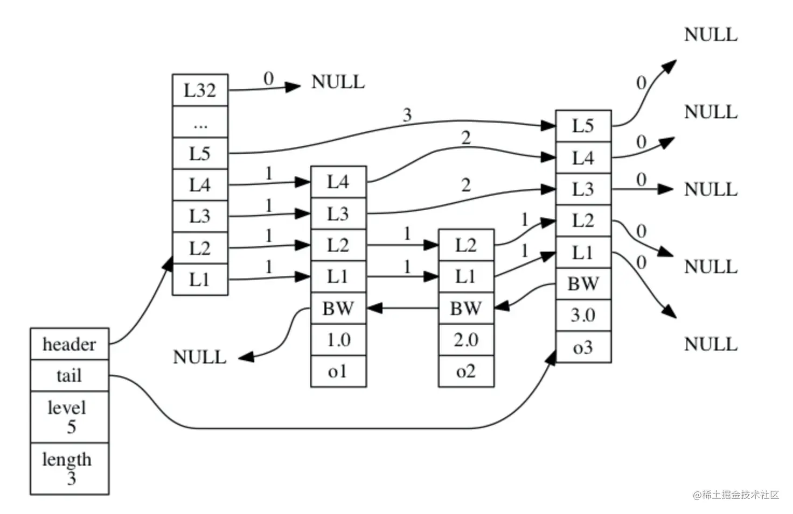

上图展示了一个跳跃表示例，位于图片最左边的示 zskiplist 结构，该结构包含以下属性：

- header ：指向跳跃表的表头节点。
- tail ：指向跳跃表的表尾节点。
- level ：记录目前跳跃表内，层数最大的那个节点的层数（表头节点的层数不计算在内）。
- length ：记录跳跃表的长度，也即是，跳跃表目前包含节点的数量（表头节点不计算在内）。

位于 zskiplist 结构右方的是四个 zskiplistNode 结构， 该结构包含以下属性：

- 层（level）：节点中用 L1 、 L2 、 L3 等字样标记节点的各个层， L1 代表第一层， L2 代表第二层，以此类推。每个层都带有两个属性：前进指针和跨度。前进指针用于访问位于表尾方向的其他节点，而跨度则记录了前进指针所指向节点和当前节点的距离。在上面的图片中，连线上带有数字的箭头就代表前进指针，而那个数字就是跨度。当程序从表头向表尾进行遍历时，访问会沿着层的前进指针进行。
- 后退（backward）指针：节点中用 BW 字样标记节点的后退指针，它指向位于当前节点的前一个节点。后退指针在程序从表尾向表头遍历时使用。
- 分值（score）：各个节点中的 1.0 、 2.0 和 3.0 是节点所保存的分值。在跳跃表中，节点按各自所保存的分值从小到大排列。
- 成员对象（obj）：各个节点中的 o1 、 o2 和 o3 是节点所保存的成员对象。

注意：表头节点和其他节点的构造是一样的： 表头节点也有后退指针、分值和成员对象， 不过表头节点的这些属性都不会被用到， 所以图中省略了这些部分， 只显示了表头节点的各个层。

跳跃表节点的实现由`redis.h/zskiplistNode`结构定义：

```c
typedef struct zskiplistNode {
    // 后退指针
    struct zskiplistNode *backward;
    // 分值
    double score;
    // 成员对象
    robj *obj;
    // 层
    struct zskiplistLevel {
        // 前进指针
        struct zskiplistNode *forward;
        // 跨度
        unsigned int span;
    } level[];
} zskiplistNode;
```

##### 层

跳跃表节点的 level 数组可以包含多个元素，每个元素都包含一个指向其他节点的指针，程序可以通过这些层来加快访问其他节点的速度，一般来说，层的数量越多，访问其他节点的速度就越快。

每次创建一个新跳跃表节点的时候， 程序都根据幂次定律随机生成一个介于 1 和 32 之间的值作为 level 数组的大小， 这个大小就是层的“高度”。

##### 前进指针

每个层都有一个指向表尾方向的前进指针`level[i].forward`属性， 用于从表头向表尾方向访问节点。

##### 跨度

层的跨度`level[i].span`属性，用于记录两个节点之间的距离：

- 两个节点之间的跨度越大， 它们相距得就越远。
- 指向 NULL 的所有前进指针的跨度都为 0 ， 因为它们没有连向任何节点。

##### 后退指针

节点的后退指针`backward`属性，用于从表尾向表头方向访问节点： 跟可以一次跳过多个节点的前进指针不同， 因为每个节点只有一个后退指针， 所以每次只能后退至前一个节点。

##### 分值和成员

- 节点的分值`score`属性是一个 double 类型的浮点数， 跳跃表中的所有节点都按分值从小到大来排序。
- 节点的成员对象`obj`属性是一个指针， 它指向一个字符串对象， 而字符串对象则保存着一个 SDS（简单动态字符串） 值。

在同一个跳跃表中， 各个节点保存的成员对象必须是唯一的， 但是多个节点保存的分值却可以是相同的： 分值相同的节点将按照成员对象在字典序中的大小来进行排序， 成员对象较小的节点会排在前面（靠近表头的方向）， 而成员对象较大的节点则会排在后面（靠近表尾的方向）。

#### 跳跃表

虽然仅靠多个跳跃表节点就可以组成一个跳跃表，但通过使用一个 zskiplist 结构来持有这些节点， 程序可以更方便地对整个跳跃表进行处理， 比如快速访问跳跃表的表头节点和表尾节点， 又或者快速地获取跳跃表节点的数量（也即是跳跃表的长度）等信息。zskiplist 结构的定义如下：

```c
typedef struct zskiplist {

    // 表头节点和表尾节点
    struct zskiplistNode *header, *tail;

    // 表中节点的数量
    unsigned long length;

    // 表中层数最大的节点的层数
    int level;

} zskiplist;
```

- header 和 tail 指针分别指向跳跃表的表头和表尾节点， 通过这两个指针， 程序定位表头节点和表尾节点的复杂度为 O(1) 。
- 通过使用 length 属性来记录节点的数量， 程序可以在 O(1) 复杂度内返回跳跃表的长度。
- level 属性则用于在 O(1) 复杂度内获取跳跃表中层高最大的那个节点的层数量， 注意表头节点的层高并不计算在内。

## 单线程

### 高性能IO模型：为什么单线程Redis能那么快？

#### Redis 为什么用单线程？

##### 多线程的开销

日常写程序时，我们经常会听到一种说法：“使用多线程，可以增加系统吞吐率，或是可以增加系统扩展性。”的确，对于一个多线程的系统来说，在有合理的资源分配的情况下，可以增加系统中处理请求操作的资源实体，进而提升系统能够同时处理的请求数，即吞吐率。

通常情况下，在我们采用多线程后，如果没有良好的系统设计，实际得到的结果并不好，我们刚开始增加线程数时，系统吞吐率会增加，但是，再进一步增加线程时，系统吞吐率就增长迟缓了，有时甚至还会出现下降的情况。

为什么会出现这种情况呢？一个关键的瓶颈在于，系统中通常会存在被多线程同时访问的共享资源，比如一个共享的数据结构。当有多个线程要修改这个共享资源时，为了保证共享资源的正确性，就需要有额外的机制进行保证，而这个额外的机制，就会带来额外的开销。

并发访问控制一直是多线程开发中的一个难点问题，如果没有精细的设计，比如说，只是简单地采用一个粗粒度互斥锁，就会出现不理想的结果：即使增加了线程，大部分线程也在等待获取访问共享资源的互斥锁，并行变串行，系统吞吐率并没有随着线程的增加而增加。

而且，采用多线程开发一般会引入同步原语来保护共享资源的并发访问，这也会降低系统代码的易调试性和可维护性。为了避免这些问题，Redis 直接采用了单线程模式。

#### 单线程 Redis 为什么那么快？

通常来说，单线程的处理能力要比多线程差很多，但是 Redis 却能使用单线程模型达到每秒数十万级别的处理能力，这是为什么呢？其实，这是 Redis 多方面设计选择的一个综合结果。

一方面，Redis 的大部分操作在内存上完成，再加上它采用了高效的数据结构，例如哈希表和跳表，这是它实现高性能的一个重要原因。另一方面，就是 Redis 采用了多路复用机制，使其在网络 IO 操作中能并发处理大量的客户端请求，实现高吞吐率。首先，我们要弄明白网络操作的基本 IO 模型和潜在的阻塞点。毕竟，Redis 采用单线程进行 IO，如果线程被阻塞了，就无法进行多路复用了。

##### 基本 IO 模型与阻塞点

以 Get 请求为例，SimpleKV 为了处理一个 Get 请求，需要监听客户端请求（bind/listen），和客户端建立连接（accept），从 socket 中读取请求（recv），解析客户端发送请求（parse），根据请求类型读取键值数据（get），最后给客户端返回结果，即向 socket 中写回数据（send）。

但是，在这里的网络 IO 操作中，有潜在的阻塞点，分别是 accept() 和 recv()。当 Redis 监听到一个客户端有连接请求，但一直未能成功建立起连接时，会阻塞在 accept() 函数这里，导致其他客户端无法和 Redis 建立连接。类似的，当 Redis 通过 recv() 从一个客户端读取数据时，如果数据一直没有到达，Redis 也会一直阻塞在 recv()。

这就导致 Redis 整个线程阻塞，无法处理其他客户端请求，效率很低。不过，幸运的是，socket 网络模型本身支持非阻塞模式。

##### 非阻塞模式

Socket 网络模型的非阻塞模式设置，主要体现在三个关键的函数调用上，如果想要使用 socket 非阻塞模式，就必须要了解这三个函数的调用返回类型和设置模式。

在 socket 模型中，不同操作调用后会返回不同的套接字类型。socket() 方法会返回主动套接字，然后调用 listen() 方法，将主动套接字转化为监听套接字，此时，可以监听来自客户端的连接请求。最后，调用 accept() 方法接收到达的客户端连接，并返回已连接套接字。


针对监听套接字，我们可以设置非阻塞模式：当 Redis 调用 accept() 但一直未有连接请求到达时，Redis 线程可以返回处理其他操作，而不用一直等待。但是，你要注意的是，调用 accept() 时，已经存在监听套接字了。虽然 Redis 线程可以不用继续等待，但是总得有机制继续在监听套接字上等待后续连接请求，并在有请求时通知 Redis。

类似的，我们也可以针对已连接套接字设置非阻塞模式：Redis 调用 recv() 后，如果已连接套接字上一直没有数据到达，Redis 线程同样可以返回处理其他操作。我们也需要有机制继续监听该已连接套接字，并在有数据达到时通知 Redis。

这样才能保证 Redis 线程，既不会像基本 IO 模型中一直在阻塞点等待，也不会导致 Redis 无法处理实际到达的连接请求或数据。

##### 基于多路复用的高性能 I/O 模型

Linux 中的 IO 多路复用机制是指一个线程处理多个 IO 流，就是我们经常听到的 select/epoll 机制。简单来说，在 Redis 只运行单线程的情况下，该机制允许内核中，同时存在多个监听套接字和已连接套接字。内核会一直监听这些套接字上的连接请求或数据请求。一旦有请求到达，就会交给 Redis 线程处理，这就实现了一个 Redis 线程处理多个 IO 流的效果。

下图就是基于多路复用的 Redis IO 模型。图中的多个 FD 就是刚才所说的多个套接字。Redis 网络框架调用 epoll 机制，让内核监听这些套接字。此时，Redis 线程不会阻塞在某一个特定的监听或已连接套接字上，也就是说，不会阻塞在某一个特定的客户端请求处理上。正因为此，Redis 可以同时和多个客户端连接并处理请求，从而提升并发性。


为了在请求到达时能通知到 Redis 线程，select/epoll 提供了基于事件的回调机制，即针对不同事件的发生，调用相应的处理函数。

那么，回调机制是怎么工作的呢？其实，select/epoll 一旦监测到 FD 上有请求到达时，就会触发相应的事件。

这些事件会被放进一个事件队列，Redis 单线程对该事件队列不断进行处理。这样一来，Redis 无需一直轮询是否有请求实际发生，这就可以避免造成 CPU 资源浪费。同时，Redis 在对事件队列中的事件进行处理时，会调用相应的处理函数，这就实现了基于事件的回调。因为 Redis 一直在对事件队列进行处理，所以能及时响应客户端请求，提升 Redis 的响应性能。

以连接请求和读数据请求为例，具体解释一下。

这两个请求分别对应 Accept 事件和 Read 事件，Redis 分别对这两个事件注册 accept 和 get 回调函数。当 Linux 内核监听到有连接请求或读数据请求时，就会触发 Accept 事件和 Read 事件，此时，内核就会回调 Redis 相应的 accept 和 get 函数进行处理。

这就像病人去医院瞧病。在医生实际诊断前，每个病人（等同于请求）都需要先分诊、测体温、登记等。如果这些工作都由医生来完成，医生的工作效率就会很低。所以，医院都设置了分诊台，分诊台会一直处理这些诊断前的工作（类似于 Linux 内核监听请求），然后再转交给医生做实际诊断。这样即使一个医生（相当于 Redis 单线程），效率也能提升。

## 多线程

### 面试官：你确定 Redis 是单线程的进程吗？

#### Redis 是单线程吗？

Redis 单线程指的是「接收客户端请求->解析请求 ->进行数据读写等操作->发生数据给客户端」这个过程是由一个线程（主线程）来完成的，这也是我们常说 Redis 是单线程的原因。

但是，Redis 程序并不是单线程的，Redis 在启动的时候，是会启动后台线程（BIO）的：

- Redis 在 2.6 版本，会启动 2 个后台线程，分别处理关闭文件、AOF 刷盘这两个任务；
- Redis 在 4.0 版本之后，新增了一个新的后台线程，用来异步释放 Redis 内存，也就是 lazyfree 线程。例如执行 unlink key / flushdb async / flushall async 等命令，会把这些删除操作交给后台线程来执行，好处是不会导致 Redis 主线程卡顿。因此，当我们要删除一个大 key 的时候，不要使用 del 命令删除，因为 del 是在主线程处理的，这样会导致 Redis 主线程卡顿，因此我们应该使用 unlink 命令来异步删除大 key。

之所以 Redis 为「关闭文件、AOF 刷盘、释放内存」这些任务创建单独的线程来处理，是因为这些任务的操作都是很耗时的，如果把这些任务都放在主线程来处理，那么 Redis 主线程就很容易发生阻塞，这样就无法处理后续的请求了。

后台线程相当于一个消费者，生产者把耗时任务丢到任务队列中，消费者（BIO）不停轮询这个队列，拿出任务就去执行对应的方法即可。

关闭文件、AOF 刷盘、释放内存这三个任务都有各自的任务队列：

- BIO_CLOSE_FILE，关闭文件任务队列：当队列有任务后，后台线程会调用 close(fd) ，将文件关闭；
- BIO_AOF_FSYNC，AOF 刷盘任务队列：当 AOF 日志配置成 everysec 选项后，主线程会把 AOF 写日志操作封装成一个任务，也放到队列中。当发现队列有任务后，后台线程会调用 fsync(fd)，将 AOF 文件刷盘，
- BIO_LAZY_FREE，lazy free 任务队列：当队列有任务后，后台线程会 free(obj) 释放对象 / free(dict) 删除数据库所有对象 / free(skiplist) 释放跳表对象；

#### Redis 单线程模式是怎样的？

Redis 6.0 版本之前的单线模式如下图：

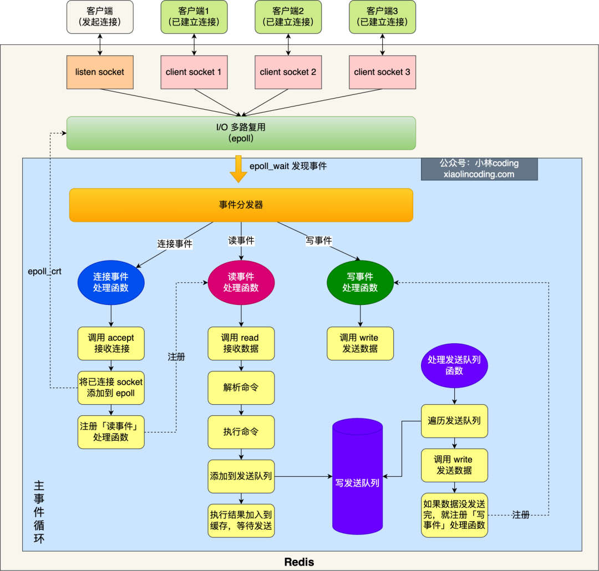

图中的蓝色部分是一个事件循环，是由主线程负责的，可以看到网络 I/O 和命令处理都是单线程。Redis 初始化的时候，会做下面这几件事情：

- 首先，调用 epoll_create() 创建一个 epoll 对象和调用 socket() 创建一个服务端 socket；
- 然后，调用 bind() 绑定端口和调用 listen() 监听该 socket；
- 然后，将调用 epoll_crt() 将 listen socket 加入到 epoll，同时注册「连接事件」处理函数。

初始化完后，主线程就进入到一个事件循环函数，主要会做以下事情：

- 首先，先调用处理发送队列函数，看是发送队列里是否有任务，如果有发送任务，则通过 write 函数将客户端发送缓存区里的数据发送出去，如果这一轮数据没有发生完，就会注册写事件处理函数，等待 epoll_wait 发现可写后再处理 。
- 接着，调用 epoll_wait 函数等待事件的到来：
	- 如果是连接事件到来，则会调用连接事件处理函数，该函数会做这些事情：调用 accpet 获取已连接的 socket -> 调用 epoll_ctr 将已连接的 socket 加入到 epoll -> 注册「读事件」处理函数；
	- 如果是读事件到来，则会调用读事件处理函数，该函数会做这些事情：调用 read 获取客户端发送的数据 -> 解析命令 -> 处理命令 -> 将客户端对象添加到发送队列 -> 将执行结果写到发送缓存区等待发送；
	- 如果是写事件到来，则会调用写事件处理函数，该函数会做这些事情：通过 write 函数将客户端发送缓存区里的数据发送出去，如果这一轮数据没有发生完，就会继续注册写事件处理函数，等待 epoll_wait 发现可写后再处理 。

#### Redis 采用单线程为什么还这么快？

之所以 Redis 采用单线程（网络 I/O 和执行命令）那么快，有如下几个原因：

- Redis 的大部分操作都在内存中完成，并且采用了高效的数据结构，因此 Redis 瓶颈可能是机器的内存或者网络带宽，而并非 CPU，既然 CPU 不是瓶颈，那么自然就采用单线程的解决方案了；
- Redis 采用单线程模型可以避免了多线程之间的竞争，省去了多线程切换带来的时间和性能上的开销，而且也不会导致死锁问题。
- Redis 采用了 I/O 多路复用机制处理大量的客户端 Socket 请求，IO 多路复用机制是指一个线程处理多个 IO 流，就是我们经常听到的 select/epoll 机制。简单来说，在 Redis 只运行单线程的情况下，该机制允许内核中，同时存在多个监听 Socket 和已连接 Socket。内核会一直监听这些 Socket 上的连接请求或数据请求。一旦有请求到达，就会交给 Redis 线程处理，这就实现了一个 Redis 线程处理多个 IO 流的效果。

#### Redis 6.0 之前为什么使用单线程？

官方的意思是：CPU 并不是制约 Redis 性能表现的瓶颈所在，更多情况下是受到内存大小和网络 I/O 的限制，所以 Redis 核心网络模型使用单线程并没有什么问题，如果你想要使用服务的多核 CPU，可以在一台服务器上启动多个节点或者采用分片集群的方式。

除了上面的官方回答，选择单线程的原因也有下面的考虑。

使用了单线程后，可维护性高，多线程模型虽然在某些方面表现优异，但是它却引入了程序执行顺序的不确定性，带来了并发读写的一系列问题，增加了系统复杂度、同时可能存在线程切换、甚至加锁解锁、死锁造成的性能损耗。

#### Redis 6.0 之后为什么引入了多线程？

虽然 Redis 的主要工作（网络 I/O 和执行命令）一直是单线程模型，但是在 Redis 6.0 版本之后，也采用了多个 I/O 线程来处理网络请求，这是因为随着网络硬件的性能提升，Redis 的性能瓶颈有时会出现在网络 I/O 的处理上。

所以为了提高网络请求处理的并行度，Redis 6.0 对于网络请求采用多线程来处理。但是对于命令执行，Redis 仍然使用单线程来处理，所以大家不要误解 Redis 有多线程同时执行命令。

Redis 官方表示，Redis 6.0 版本引入的多线程 I/O 特性对性能提升至少是一倍以上。

Redis 6.0 版本支持的 I/O 多线程特性，默认是 I/O 多线程只处理写操作（write client socket），并不会以多线程的方式处理读操作（read client socket）。要想开启多线程处理客户端读请求，就需要把Redis.conf配置文件中的 io-threads-do-reads 配置项设为 yes。同时， Redis.conf配置文件中提供了IO 多线程个数的配置项。

关于线程数的设置，官方的建议是如果为 4 核的 CPU，建议线程数设置为 2 或 3，如果为 8 核 CPU 建议线程数设置为 6，线程数一定要小于机器核数，线程数并不是越大越好。因此， Redis 6.0 版本之后，Redis 在启动的时候，默认情况下会有 6 个线程：

- Redis-server ：Redis 的主线程，主要负责执行命令；
- bio_close_file、bio_aof_fsync、bio_lazy_free：三个后台线程，分别异步处理关闭文件任务、AOF 刷盘任务、释放内存任务；
- io_thd_1、io_thd_2、io_thd_3：三个 I/O 线程，io-threads 默认是 4 ，所以会启动 3（4-1）个 I/O 多线程，用来分担 Redis 网络 I/O 的压力。

### Redis 6.0 新特性：带你 100% 掌握多线程模型

#### Redis 6.0 之前单线程指的是 Redis 只有一个线程干活么？

非也，Redis 在处理客户端的请求时，包括获取 (socket 读)、解析、执行、内容返回 (socket 写) 等都由一个顺序串行的主线程处理，这就是所谓的「单线程」。

其中执行命令阶段，由于 Redis 是单线程来处理命令的，所有每一条到达服务端的命令不会立刻执行，所有的命令都会进入一个 Socket 队列中，当 socket 可读则交给单线程事件分发器逐个被执行。

此外，有些命令操作可以用后台线程或子进程执行（比如数据删除、快照生成、AOF 重写）。

#### 那 Redis 6.0 为啥要引入多线程呀？

随着硬件性能提升，Redis 的性能瓶颈可能出现网络 IO 的读写，也就是：单个线程处理网络读写的速度跟不上底层网络硬件的速度。

读写网络的 read/write 系统调用占用了 Redis 执行期间大部分 CPU 时间，瓶颈主要在于网络的 IO 消耗, 优化主要有两个方向：

- 提高网络 IO 性能，典型的实现比如使用 DPDK 来替代内核网络栈的方式。
- 使用多线程充分利用多核，提高网络请求读写的并行度，典型的实现比如 Memcached。

添加对用户态网络协议栈的支持，需要修改 Redis 源码中和网络相关的部分（例如修改所有的网络收发请求函数），这会带来很多开发工作量。而且新增代码还可能引入新 Bug，导致系统不稳定。

所以，Redis 采用多个 IO 线程来处理网络请求，提高网络请求处理的并行度。需要注意的是，Redis 多 IO 线程模型只用来处理网络读写请求，对于 Redis 的读写命令，依然是单线程处理。这是因为，网络处理经常是瓶颈，通过多线程并行处理可提高性能。而继续使用单线程执行读写命令，不需要为了保证 Lua 脚本、事务、等开发多线程安全机制，实现更简单。

#### 主线程与 IO 多线程是如何实现协作呢？

如下图：

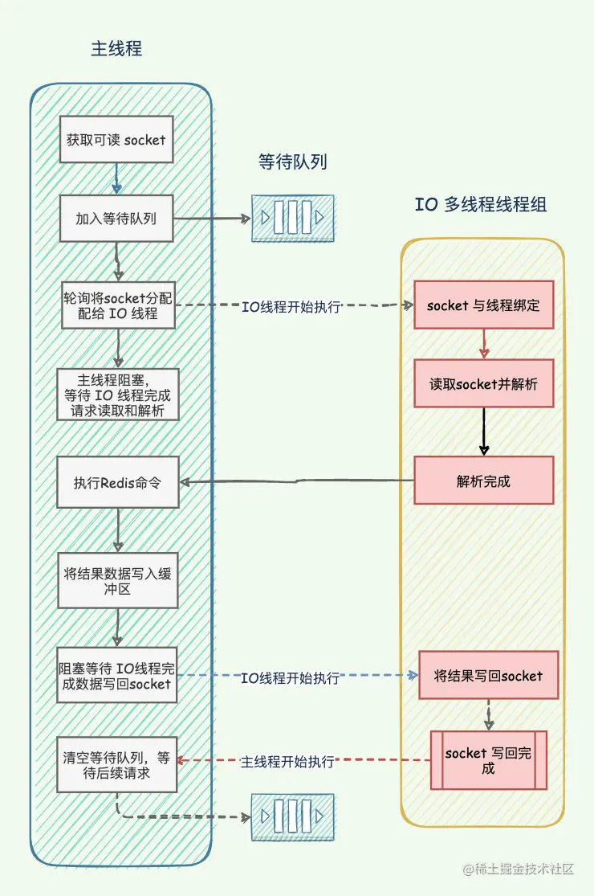

主要流程：

1. 主线程负责接收建立连接请求，获取 socket 放入全局等待读处理队列；
2. 主线程通过轮询将可读 socket 分配给 IO 线程；
3. 主线程阻塞等待 IO 线程读取 socket 完成；
4. 主线程执行 IO 线程读取和解析出来的 Redis 请求命令；
5. 主线程阻塞等待 IO 线程将指令执行结果写回 socket完毕；
6. 主线程清空全局队列，等待客户端后续的请求。

思路：将主线程 IO 读写任务拆分出来给一组独立的线程处理，使得多个 socket 读写可以并行化，但是 Redis 命令还是主线程串行执行。

## 缓存过期删除和缓存淘汰

### Redis 过期删除策略和内存淘汰策略有什么区别？

#### 过期删除策略

##### 如何设置过期时间？

设置 key 过期时间的命令一共有 4 个：

- `expire <key> <n>`：设置 key 在 n 秒后过期，比如`expire key 100`表示设置 key 在 100 秒后过期；
- `pexpire <key> <n>`：设置 key 在 n 毫秒后过期，比如`pexpire key2 100000`表示设置 key2 在 100000 毫秒（100 秒）后过期。
- `expireat <key> <n>`：设置 key 在某个时间戳（精确到秒）之后过期，比如`expireat key3 1655654400`表示 key3 在时间戳 1655654400 后过期（精确到秒）；
- `pexpireat <key> <n>`：设置 key 在某个时间戳（精确到毫秒）之后过期，比如`pexpireat key4 1655654400000`表示 key4 在时间戳 1655654400000 后过期（精确到毫秒）。

当然，在设置字符串时，也可以同时对 key 设置过期时间，共有 3 种命令：

- `set <key> <value> ex <n>` ：设置键值对的时候，同时指定过期时间（精确到秒）；
- `set <key> <value> px <n>` ：设置键值对的时候，同时指定过期时间（精确到毫秒）；
- `setex <key> <n> <valule>` ：设置键值对的时候，同时指定过期时间（精确到秒）。

如果你想查看某个 key 剩余的存活时间，可以使用`TTL <key>`命令。如果突然反悔，取消 key 的过期时间，则可以使用`PERSIST <key>`命令。

##### 如何判定 key 已过期了？

每当我们对一个 key 设置了过期时间时，Redis 会把该 key 带上过期时间存储到一个过期字典（expires dict）中，也就是说「过期字典」保存了数据库中所有 key 的过期时间。

过期字典存储在 redisDb 结构中，如下：

```c
typedef struct redisDb {
    dict *dict;    /* 数据库键空间，存放着所有的键值对 */
    dict *expires; /* 键的过期时间 */
    ....
} redisDb;
```

字典实际上是哈希表，哈希表的最大好处就是让我们可以用 O(1) 的时间复杂度来快速查找。当我们查询一个 key 时，Redis 首先检查该 key 是否存在于过期字典中.

##### 过期删除策略有哪些？

常见的三种过期删除策略：

- 定时删除；
- 惰性删除；
- 定期删除；

> 定时删除策略是怎么样的？

定时删除策略的做法是，在设置 key 的过期时间时，同时创建一个定时事件，当时间到达时，由事件处理器自动执行 key 的删除操作。

定时删除策略的优点：

- 可以保证过期 key 会被尽快删除，也就是内存可以被尽快地释放。因此，定时删除对内存是最友好的。

定时删除策略的缺点：

- 在过期 key 比较多的情况下，删除过期 key 可能会占用相当一部分 CPU 时间，在内存不紧张但 CPU 时间紧张的情况下，将 CPU 时间用于删除和当前任务无关的过期键上，无疑会对服务器的响应时间和吞吐量造成影响。所以，定时删除策略对 CPU 不友好。

> 惰性删除策略是怎么样的？

惰性删除策略的做法是，不主动删除过期键，每次从数据库访问 key 时，都检测 key 是否过期，如果过期则删除该 key。

惰性删除策略的优点：

- 因为每次访问时，才会检查 key 是否过期，所以此策略只会使用很少的系统资源，因此，惰性删除策略对 CPU 时间最友好。

惰性删除策略的缺点：

- 如果一个 key 已经过期，而这个 key 又仍然保留在数据库中，那么只要这个过期 key 一直没有被访问，它所占用的内存就不会释放，造成了一定的内存空间浪费。所以，惰性删除策略对内存不友好。

> 定期删除策略是怎么样的？

定期删除策略的做法是，每隔一段时间「随机」从数据库中取出一定数量的 key 进行检查，并删除其中的过期key。

定期删除策略的优点：

- 通过限制删除操作执行的时长和频率，来减少删除操作对 CPU 的影响，同时也能删除一部分过期的数据减少了过期键对空间的无效占用。

定期删除策略的缺点：

- 内存清理方面没有定时删除效果好，同时没有惰性删除使用的系统资源少。
- 难以确定删除操作执行的时长和频率。如果执行的太频繁，定期删除策略变得和定时删除策略一样，对CPU不友好；如果执行的太少，那又和惰性删除一样了，过期 key 占用的内存不会及时得到释放。

##### Redis 过期删除策略是什么？

Redis 选择「惰性删除+定期删除」这两种策略配和使用，以求在合理使用 CPU 时间和避免内存浪费之间取得平衡。

> Redis 是怎么实现惰性删除的？

Redis 的惰性删除策略由 db.c 文件中的 expireIfNeeded 函数实现，代码如下：

```c
int expireIfNeeded(redisDb *db, robj *key) {
    // 判断 key 是否过期
    if (!keyIsExpired(db,key)) return 0;
    ....
    /* 删除过期键 */
    ....
    // 如果 server.lazyfree_lazy_expire 为 1 表示异步删除，反之同步删除；
    return server.lazyfree_lazy_expire ? dbAsyncDelete(db,key) :
                                         dbSyncDelete(db,key);
}
```

Redis 在访问或者修改 key 之前，都会调用 expireIfNeeded 函数对其进行检查，检查 key 是否过期：

- 如果过期，则删除该 key，至于选择异步删除，还是选择同步删除，根据 lazyfree_lazy_expire 参数配置决定（Redis 4.0版本开始提供参数），然后返回 null 客户端；
- 如果没有过期，不做任何处理，然后返回正常的键值对给客户端；

> Redis 是怎么实现定期删除的？

定期删除策略的做法：每隔一段时间「随机」从数据库中取出一定数量的 key 进行检查，并删除其中的过期key。

1. 这个间隔检查的时间是多长呢？

在 Redis 中，默认每秒进行 10 次过期检查一次数据库，此配置可通过 Redis 的配置文件 redis.conf 进行配置，配置键为 hz 它的默认值是 hz 10。

特别强调下，每次检查数据库并不是遍历过期字典中的所有 key，而是从数据库中随机抽取一定数量的 key 进行过期检查。

2. 随机抽查的数量是多少呢？

定期删除的实现在`expire.c`文件下的 activeExpireCycle 函数中，其中随机抽查的数量由 ACTIVE_EXPIRE_CYCLE_LOOKUPS_PER_LOOP 定义的，它是写死在代码中的，数值是 20。也就是说，数据库每轮抽查时，会随机选择 20 个 key 判断是否过期。

接下来，详细说说 Redis 的定期删除的流程：

- 从过期字典中随机抽取 20 个 key；
- 检查这 20 个 key 是否过期，并删除已过期的 key；
- 如果本轮检查的已过期 key 的数量，超过 5 个（20/4），也就是「已过期 key 的数量」占比「随机抽取 key 的数量」大于 25%，则继续重复步骤 1；如果已过期的 key 比例小于 25%，则停止继续删除过期 key，然后等待下一轮再检查。

可以看到，定期删除是一个循环的流程。那 Redis 为了保证定期删除不会出现循环过度，导致线程卡死现象，为此增加了定期删除循环流程的时间上限，默认不会超过 25ms。

#### Redis 内存淘汰策略有哪些？

Redis 内存淘汰策略共有八种，这八种策略大体分为「不进行数据淘汰」和「进行数据淘汰」两类策略。

1. 不进行数据淘汰的策略

noeviction（Redis3.0之后，默认的内存淘汰策略） ：它表示当运行内存超过最大设置内存时，不淘汰任何数据，这时如果有新的数据写入，则会触发 OOM，但是如果没用数据写入的话，只是单纯的查询或者删除操作的话，还是可以正常工作。

2. 进行数据淘汰的策略

针对「进行数据淘汰」这一类策略，又可以细分为「在设置了过期时间的数据中进行淘汰」和「在所有数据范围内进行淘汰」这两类策略。

在设置了过期时间的数据中进行淘汰：

- volatile-random：随机淘汰设置了过期时间的任意键值；
- volatile-ttl：优先淘汰更早过期的键值。
- volatile-lru（Redis3.0 之前，默认的内存淘汰策略）：淘汰所有设置了过期时间的键值中，最久未使用的键值；
- volatile-lfu（Redis 4.0 后新增的内存淘汰策略）：淘汰所有设置了过期时间的键值中，最少使用的键值；

在所有数据范围内进行淘汰：

- allkeys-random：随机淘汰任意键值;
- allkeys-lru：淘汰整个键值中最久未使用的键值；
- allkeys-lfu（Redis 4.0 后新增的内存淘汰策略）：淘汰整个键值中最少使用的键值。

##### LRU 算法和 LFU 算法有什么区别？

LFU 内存淘汰算法是 Redis 4.0 之后新增内存淘汰策略，那为什么要新增这个算法？那肯定是为了解决 LRU 算法的问题。

> 什么是 LRU 算法？

LRU 全称是 Least Recently Used 翻译为最近最少使用，会选择淘汰最近最少使用的数据。

传统 LRU 算法的实现是基于「链表」结构，链表中的元素按照操作顺序从前往后排列，最新操作的键会被移动到表头，当需要内存淘汰时，只需要删除链表尾部的元素即可，因为链表尾部的元素就代表最久未被使用的元素。

Redis 并没有使用这样的方式实现 LRU 算法，因为传统的 LRU 算法存在两个问题：

- 需要用链表管理所有的缓存数据，这会带来额外的空间开销；
- 当有数据被访问时，需要在链表上把该数据移动到头端，如果有大量数据被访问，就会带来很多链表移动操作，会很耗时，进而会降低 Redis 缓存性能。

> Redis 是如何实现 LRU 算法的？

Redis 实现的是一种近似 LRU 算法，目的是为了更好的节约内存，它的实现方式是在 Redis 的对象结构体中添加一个额外的字段，用于记录此数据的最后一次访问时间。

当 Redis 进行内存淘汰时，会使用随机采样的方式来淘汰数据，它是随机取 5 个值（此值可配置），然后淘汰最久没有使用的那个。

Redis 实现的 LRU 算法的优点：

- 不用为所有的数据维护一个大链表，节省了空间占用；
- 不用在每次数据访问时都移动链表项，提升了缓存的性能；

但是 LRU 算法有一个问题，无法解决缓存污染问题，比如应用一次读取了大量的数据，而这些数据只会被读取这一次，那么这些数据会留存在 Redis 缓存中很长一段时间，造成缓存污染。

因此，在 Redis 4.0 之后引入了 LFU 算法来解决这个问题。

> 什么是 LFU 算法？

LFU 全称是 Least Frequently Used 翻译为最近最不常用，LFU 算法是根据数据访问次数来淘汰数据的，它的核心思想是“如果数据过去被访问多次，那么将来被访问的频率也更高”。

所以， LFU 算法会记录每个数据的访问次数。当一个数据被再次访问时，就会增加该数据的访问次数。这样就解决了偶尔被访问一次之后，数据留存在缓存中很长一段时间的问题，相比于 LRU 算法也更合理一些。

> Redis 是如何实现 LFU 算法的？

LFU 算法相比于 LRU 算法的实现，多记录了「数据的访问频次」的信息。Redis 对象的结构如下：

```c
typedef struct redisObject {
    ...
      
    // 24 bits，用于记录对象的访问信息
    unsigned lru:24;  
    ...
} robj;
```

Redis 对象头中的 lru 字段，在 LRU 算法下和 LFU 算法下使用方式并不相同。

在 LRU 算法中，Redis 对象头的 24 bits 的 lru 字段是用来记录 key 的访问时间戳，因此在 LRU 模式下，Redis可以根据对象头中的 lru 字段记录的值，来比较最后一次 key 的访问时间长，从而淘汰最久未被使用的 key。

在 LFU 算法中，Redis对象头的 24 bits 的 lru 字段被分成两段来存储，高 16bit 存储 ldt(Last Decrement Time)，低 8bit 存储 logc(Logistic Counter)。ldt 是用来记录 key 的访问时间戳，logc 是用来记录 key 的访问频次，它的值越小表示使用频率越低，越容易淘汰，每个新加入的 key 的logc 初始值为 5。

注意，logc 并不是单纯的访问次数，而是访问频次（访问频率），因为 logc 会随时间推移而衰减的。

在每次 key 被访问时，会先对 logc 做一个衰减操作，衰减的值跟前后访问时间的差距有关系，如果上一次访问的时间与这一次访问的时间差距很大，那么衰减的值就越大，这样实现的 LFU 算法是根据访问频率来淘汰数据的，而不只是访问次数。访问频率需要考虑 key 的访问是多长时间段内发生的。key 的先前访问距离当前时间越长，那么这个 key 的访问频率相应地也就会降低，这样被淘汰的概率也会更大。

对 logc 做完衰减操作后，就开始对 logc 进行增加操作，增加操作并不是单纯的 + 1，而是根据概率增加，如果 logc 越大的 key，它的 logc 就越难再增加。

所以，Redis 在访问 key 时，对于 logc 是这样变化的：

1. 先按照上次访问距离当前的时长，来对 logc 进行衰减；
2. 然后，再按照一定概率增加 logc 的值

redis.conf 提供了两个配置项，用于调整 LFU 算法从而控制 logc 的增长和衰减：

- lfu-decay-time 用于调整 logc 的衰减速度，它是一个以分钟为单位的数值，默认值为1，lfu-decay-time 值越大，衰减越慢；
- lfu-log-factor 用于调整 logc 的增长速度，lfu-log-factor 值越大，logc 增长越慢。

## 持久化

### AOF 持久化是怎么实现的？

#### AOF 日志

试想一下，如果 Redis 每执行一条写操作命令，就把该命令以追加的方式写入到一个文件里，然后重启 Redis 的时候，先去读取这个文件里的命令，并且执行它，这不就相当于恢复了缓存数据了吗？这种保存写操作命令到日志的持久化方式，就是 Redis 里的 AOF(Append Only File) 持久化功能，注意只会记录写操作命令，读操作命令是不会被记录的，因为没意义。

在 Redis 中 AOF 持久化功能默认是不开启的。

Redis 是先执行写操作命令后，才将该命令记录到 AOF 日志里的，这么做其实有两个好处：

- 避免额外的检查开销；
- 不会阻塞当前写操作命令的执行。

AOF 持久化功能的风险：

- 执行写操作命令和记录日志是两个过程，那当 Redis 在还没来得及将命令写入到硬盘时，服务器发生宕机了，这个数据就会有丢失的风险。
- 由于写操作命令执行成功后才记录到 AOF 日志，所以不会阻塞当前写操作命令的执行，但是可能会给「下一个」命令带来阻塞风险。

#### 三种写回策略

Redis 写入 AOF 日志的过程，如下图：

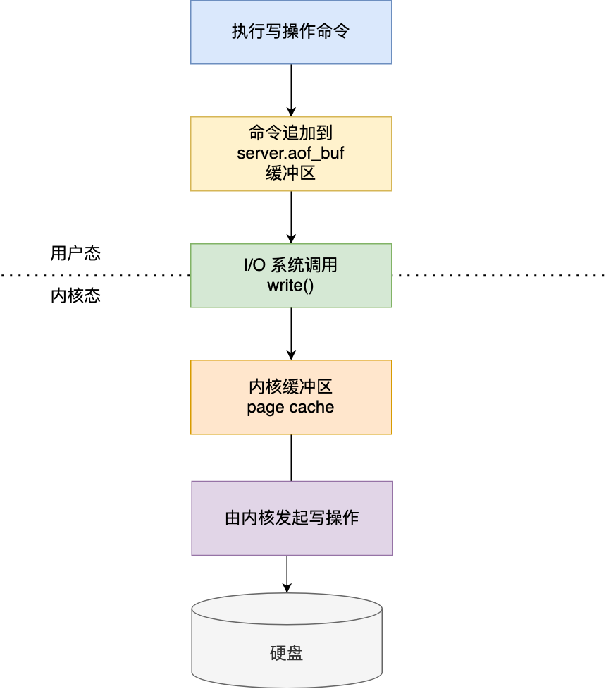

1. Redis 执行完写操作命令后，会将命令追加到 server.aof_buf 缓冲区；
2. 然后通过 write() 系统调用，将 aof_buf 缓冲区的数据写入到 AOF 文件，此时数据并没有写入到硬盘，而是拷贝到了内核缓冲区 page cache，等待内核将数据写入硬盘；
3. 具体内核缓冲区的数据什么时候写入到硬盘，由内核决定。

Redis 提供了 3 种写回硬盘的策略，控制的就是上面说的第三步的过程。

在 redis.conf 配置文件中的 appendfsync 配置项可以有以下 3 种参数可填：

- Always，这个单词的意思是「总是」，所以它的意思是每次写操作命令执行完后，同步将 AOF 日志数据写回硬盘；
- Everysec，这个单词的意思是「每秒」，所以它的意思是每次写操作命令执行完后，先将命令写入到 AOF 文件的内核缓冲区，然后每隔一秒将缓冲区里的内容写回到硬盘；
- No，意味着不由 Redis 控制写回硬盘的时机，转交给操作系统控制写回的时机，也就是每次写操作命令执行完后，先将命令写入到 AOF 文件的内核缓冲区，再由操作系统决定何时将缓冲区内容写回硬盘。

这 3 种写回策略都无法能完美解决「主进程阻塞」和「减少数据丢失」的问题，因为两个问题是对立的，偏向于一边的话，就会要牺牲另外一边，原因如下：

- Always 策略的话，可以最大程度保证数据不丢失，但是由于它每执行一条写操作命令就同步将 AOF 内容写回硬盘，所以是不可避免会影响主进程的性能；
- No 策略的话，是交由操作系统来决定何时将 AOF 日志内容写回硬盘，相比于 Always 策略性能较好，但是操作系统写回硬盘的时机是不可预知的，如果 AOF 日志内容没有写回硬盘，一旦服务器宕机，就会丢失不定数量的数据；
- Everysec 策略的话，是折中的一种方式，避免了 Always 策略的性能开销，也比 No 策略更能避免数据丢失，当然如果上一秒的写操作命令日志没有写回到硬盘，发生了宕机，这一秒内的数据自然也会丢失。

#### AOF 重写机制

AOF 日志是一个文件，随着执行的写操作命令越来越多，文件的大小会越来越大。

如果当 AOF 日志文件过大就会带来性能问题，比如重启 Redis 后，需要读 AOF 文件的内容以恢复数据，如果文件过大，整个恢复的过程就会很慢。

所以，Redis 为了避免 AOF 文件越写越大，提供了 AOF 重写机制，当 AOF 文件的大小超过所设定的阈值后，Redis 就会启用 AOF 重写机制，来压缩 AOF 文件。

AOF 重写机制是在重写时，读取当前数据库中的所有键值对，然后将每一个键值对用一条命令记录到「新的 AOF 文件」，等到全部记录完后，就将新的 AOF 文件替换掉现有的 AOF 文件。

这里说一下为什么重写 AOF 的时候，不直接复用现有的 AOF 文件，而是先写到新的 AOF 文件再覆盖过去。

因为如果 AOF 重写过程中失败了，现有的 AOF 文件就会造成污染，可能无法用于恢复使用。

所以 AOF 重写过程，先重写到新的 AOF 文件，重写失败的话，就直接删除这个文件就好，不会对现有的 AOF 文件造成影响。

#### AOF 后台重写

写入 AOF 日志的操作虽然是在主进程完成的，因为它写入的内容不多，所以一般不太影响命令的操作。

但是在触发 AOF 重写时，比如当 AOF 文件大于 64M 时，就会对 AOF 文件进行重写，这时是需要读取所有缓存的键值对数据，并为每个键值对生成一条命令，然后将其写入到新的 AOF 文件，重写完后，就把现在的 AOF 文件替换掉。

这个过程其实是很耗时的，所以重写的操作不能放在主进程里。

所以，Redis 的重写 AOF 过程是由后台子进程 bgrewriteaof 来完成的，这么做可以达到两个好处：

- 子进程进行 AOF 重写期间，主进程可以继续处理命令请求，从而避免阻塞主进程；
- 子进程带有主进程的数据副本，这里使用子进程而不是线程，因为如果是使用线程，多线程之间会共享内存，那么在修改共享内存数据的时候，需要通过加锁来保证数据的安全，而这样就会降低性能。而使用子进程，创建子进程时，父子进程是共享内存数据的，不过这个共享的内存只能以只读的方式，而当父子进程任意一方修改了该共享内存，就会发生「写时复制」，于是父子进程就有了独立的数据副本，就不用加锁来保证数据安全。

子进程是怎么拥有主进程一样的数据副本的呢？

主进程在通过 fork 系统调用生成 bgrewriteaof 子进程时，操作系统会把主进程的「页表」复制一份给子进程，这个页表记录着虚拟地址和物理地址映射关系，而不会复制物理内存，也就是说，两者的虚拟空间不同，但其对应的物理空间是同一个。

这样一来，子进程就共享了父进程的物理内存数据了，这样能够节约物理内存资源，页表对应的页表项的属性会标记该物理内存的权限为只读。

不过，当父进程或者子进程在向这个内存发起写操作时，CPU 就会触发写保护中断，这个写保护中断是由于违反权限导致的，然后操作系统会在「写保护中断处理函数」里进行物理内存的复制，并重新设置其内存映射关系，将父子进程的内存读写权限设置为可读写，最后才会对内存进行写操作，这个过程被称为「写时复制(Copy On Write)」。

写时复制顾名思义，在发生写操作的时候，操作系统才会去复制物理内存，这样是为了防止 fork 创建子进程时，由于物理内存数据的复制时间过长而导致父进程长时间阻塞的问题。

当然，操作系统复制父进程页表的时候，父进程也是阻塞中的，不过页表的大小相比实际的物理内存小很多，所以通常复制页表的过程是比较快的。

不过，如果父进程的内存数据非常大，那自然页表也会很大，这时父进程在通过 fork 创建子进程的时候，阻塞的时间也越久。

所以，有两个阶段会导致阻塞父进程：

- 创建子进程的途中，由于要复制父进程的页表等数据结构，阻塞的时间跟页表的大小有关，页表越大，阻塞的时间也越长；
- 创建完子进程后，如果子进程或者父进程修改了共享数据，就会发生写时复制，这期间会拷贝物理内存，如果内存越大，自然阻塞的时间也越长；

触发重写机制后，主进程就会创建重写 AOF 的子进程，此时父子进程共享物理内存，重写子进程只会对这个内存进行只读，重写 AOF 子进程会读取数据库里的所有数据，并逐一把内存数据的键值对转换成一条命令，再将命令记录到重写日志（新的 AOF 文件）。

但是子进程重写过程中，主进程依然可以正常处理命令。

如果此时主进程修改了已经存在 key-value，就会发生写时复制，注意这里只会复制主进程修改的物理内存数据，没修改物理内存还是与子进程共享的。

所以如果这个阶段修改的是一个 bigkey，也就是数据量比较大的 key-value 的时候，这时复制的物理内存数据的过程就会比较耗时，有阻塞主进程的风险。

还有个问题，重写 AOF 日志过程中，如果主进程修改了已经存在 key-value，此时这个 key-value 数据在子进程的内存数据就跟主进程的内存数据不一致了，这时要怎么办呢？

为了解决这种数据不一致问题，Redis 设置了一个 AOF 重写缓冲区，这个缓冲区在创建 bgrewriteaof 子进程之后开始使用。

在重写 AOF 期间，当 Redis 执行完一个写命令之后，它会同时将这个写命令写入到 「AOF 缓冲区」和 「AOF 重写缓冲区」。

当子进程完成 AOF 重写工作（扫描数据库中所有数据，逐一把内存数据的键值对转换成一条命令，再将命令记录到重写日志）后，会向主进程发送一条信号，信号是进程间通讯的一种方式，且是异步的。

主进程收到该信号后，会调用一个信号处理函数，该函数主要做以下工作：

- 将 AOF 重写缓冲区中的所有内容追加到新的 AOF 的文件中，使得新旧两个 AOF 文件所保存的数据库状态一致；
- 新的 AOF 的文件进行改名，覆盖现有的 AOF 文件。

信号函数执行完后，主进程就可以继续像往常一样处理命令了。

在整个 AOF 后台重写过程中，除了发生写时复制会对主进程造成阻塞，还有信号处理函数执行时也会对主进程造成阻塞，在其他时候，AOF 后台重写都不会阻塞主进程。

### RDB 快照是怎么实现的？

#### 快照怎么用？

Redis 提供了两个命令来生成 RDB 文件，分别是 save 和 bgsave，他们的区别就在于是否在「主线程」里执行：

- 执行了 save 命令，就会在主线程生成 RDB 文件，由于和执行操作命令在同一个线程，所以如果写入 RDB 文件的时间太长，会阻塞主线程；
- 执行了 bgsave 命令，会创建一个子进程来生成 RDB 文件，这样可以避免主线程的阻塞；

RDB 文件的加载工作是在服务器启动时自动执行的，Redis 并没有提供专门用于加载 RDB 文件的命令。Redis 还可以通过配置文件的选项来实现每隔一段时间自动执行一次 bgsave 命令。

这里提一点，Redis 的快照是全量快照，也就是说每次执行快照，都是把内存中的「所有数据」都记录到磁盘中。

所以可以认为，执行快照是一个比较重的操作，如果频率太频繁，可能会对 Redis 性能产生影响。如果频率太低，服务器故障时，丢失的数据会更多。

#### 执行快照时，数据能被修改吗？

关键的技术就在于写时复制技术（Copy-On-Write, COW）。执行 bgsave 命令的时候，会通过 fork() 创建子进程，此时子进程和父进程是共享同一片内存数据的，因为创建子进程的时候，会复制父进程的页表，但是页表指向的物理内存还是一个。

这样的目的是为了减少创建子进程时的性能损耗，从而加快创建子进程的速度，毕竟创建子进程的过程中，是会阻塞主线程的。

所以，创建 bgsave 子进程后，由于共享父进程的所有内存数据，于是就可以直接读取主线程（父进程）里的内存数据，并将数据写入到 RDB 文件。主线程（父进程）对这些共享的内存数据也都是只读操作，那么，主线程（父进程）和 bgsave 子进程相互不影响。

但是，如果主线程（父进程）要修改共享数据里的某一块数据（比如键值对 A）时，就会发生写时复制，于是这块数据的物理内存就会被复制一份（键值对 A'），然后主线程在这个数据副本（键值对 A'）进行修改操作。与此同时，bgsave 子进程可以继续把原来的数据（键值对 A）写入到 RDB 文件。

就是这样，Redis 使用 bgsave 对当前内存中的所有数据做快照，这个操作是由 bgsave 子进程在后台完成的，执行时不会阻塞主线程，这就使得主线程同时可以修改数据。

bgsave 快照过程中，如果主线程修改了共享数据，发生了写时复制后，RDB 快照保存的是原本的内存数据，而主线程刚修改的数据，是没办法在这一时间写入 RDB 文件的，只能交由下一次的 bgsave 快照。

所以 Redis 在使用 bgsave 快照过程中，如果主线程修改了内存数据，不管是否是共享的内存数据，RDB 快照都无法写入主线程刚修改的数据，因为此时主线程（父进程）的内存数据和子进程的内存数据已经分离了，子进程写入到 RDB 文件的内存数据只能是原本的内存数据。

如果系统恰好在 RDB 快照文件创建完毕后崩溃了，那么 Redis 将会丢失主线程在快照期间修改的数据。

另外，写时复制的时候会出现这么个极端的情况。在 Redis 执行 RDB 持久化期间，刚 fork 时，主进程和子进程共享同一物理内存，但是途中主进程处理了写操作，修改了共享内存，于是当前被修改的数据的物理内存就会被复制一份。那么极端情况下，如果所有的共享内存都被修改，则此时的内存占用是原先的 2 倍。所以，针对写操作多的场景，我们要留意下快照过程中内存的变化，防止内存被占满了。

#### RDB 和 AOF 合体

尽管 RDB 比 AOF 的数据恢复速度快，但是快照的频率不好把握：

- 如果频率太低，两次快照间一旦服务器发生宕机，就可能会比较多的数据丢失；
- 如果频率太高，频繁写入磁盘和创建子进程会带来额外的性能开销。

将 RDB 和 AOF 合体使用，这个方法是在 Redis 4.0 提出的，该方法叫混合使用 AOF 日志和内存快照，也叫混合持久化。混合持久化工作在 AOF 日志重写过程。

当开启了混合持久化时，在 AOF 重写日志时，fork 出来的重写子进程会先将与主线程共享的内存数据以 RDB 方式写入到 AOF 文件，然后主线程处理的操作命令会被记录在重写缓冲区里，重写缓冲区里的增量命令会以 AOF 方式写入到 AOF 文件，写入完成后通知主进程将新的含有 RDB 格式和 AOF 格式的 AOF 文件替换旧的的 AOF 文件。

也就是说，使用了混合持久化，AOF 文件的前半部分是 RDB 格式的全量数据，后半部分是 AOF 格式的增量数据。

这样的好处在于，重启 Redis 加载数据的时候，由于前半部分是 RDB 内容，这样加载的时候速度会很快。

加载完 RDB 的内容后，才会加载后半部分的 AOF 内容，这里的内容是 Redis 后台子进程重写 AOF 期间，主线程处理的操作命令，可以使得数据更少的丢失。

### Redis持久化RDB和AOF优缺点是什么，怎么实现的？我应该用哪一个？

Redis为了保证效率，数据缓存在内存中，Redis 会周期性的把更新的数据写入磁盘或者把修改操作写入追加的记录文件，以保证数据的持久化。

Redis是一个支持持久化的内存数据库，可以将内存中的数据同步到磁盘保证持久化。

Redis的持久化策略：

- RDB：快照形式是直接把内存中的数据保存到一个 dump 文件中，定时保存，保存策略。
- AOF：把所有的对Redis的服务器进行修改的命令都存到一个文件里，命令的集合。

Redis默认是快照RDB的持久化方式。当 Redis 重启时，它会优先使用 AOF 文件来还原数据集，因为 AOF 文件保存的数据集通常比 RDB 文件所保存的数据集更完整。你甚至可以关闭持久化功能，让数据只在服务器运行时存。

#### RDB 持久化

默认 Redis 是会以快照 “RDB” 的形式将数据持久化到磁盘的，一个二进制文件，dump.rdb。

当 Redis 需要做持久化时，Redis 会 fork 一个子进程，子进程将数据写到磁盘上一个临时 RDB 文件中。当子进程完成写临时文件后，将原来的 RDB 替换掉，这样的好处就是可以 copy-on-write。

Redis默认情况下，是快照 RDB 的持久化方式，将内存中的数据以快照的方式写入二进制文件中，默认的文件名是 dump.rdb 。当然我们也可以手动执行 save 或者 bgsave（异步）做快照。

##### RDB 的优点

这种文件非常适合用于进行备份： 比如说，你可以在最近的 24 小时内，每小时备份一次 RDB 文件，并且在每个月的每一天，也备份一个 RDB 文件。 这样的话，即使遇上问题，也可以随时将数据集还原到不同的版本。RDB 非常适用于灾难恢复（disaster recovery）。

##### RDB 的缺点

如果你需要尽量避免在服务器故障时丢失数据，那么 RDB 不适合你。 虽然 Redis 允许你设置不同的保存点（save point）来控制保存 RDB 文件的频率， 但是， 因为RDB 文件需要保存整个数据集的状态， 所以它并不是一个轻松的操作。 因此你可能会至少 5 分钟才保存一次 RDB 文件。 在这种情况下， 一旦发生故障停机， 你就可能会丢失好几分钟的数据。

#### AOF 持久化

使用 AOF 做持久化，每一个写命令都通过write函数追加到 appendonly.aof 中,配置方式：启动 AOF 持久化的方式。

AOF 就可以做到全程持久化，只需要在配置文件中开启（默认是no），appendonly yes 开启 AOF 之后，Redis 每执行一个修改数据的命令，都会把它添加到 AOF 文件中，当 Redis 重启时，将会读取 AOF 文件进行“重放”以恢复到 Redis 关闭前的最后时刻。

##### AOF 的优点

使用 AOF 持久化会让 Redis 变得非常耐久（much more durable）：你可以设置不同的 fsync 策略，比如无 fsync ，每秒钟一次 fsync ，或者每次执行写入命令时 fsync 。 AOF 的默认策略为每秒钟 fsync 一次，在这种配置下，Redis 仍然可以保持良好的性能，并且就算发生故障停机，也最多只会丢失一秒钟的数据（ fsync 会在后台线程执行，所以主线程可以继续努力地处理命令请求）。

##### AOF 的缺点

对于相同的数据集来说，AOF 文件的体积通常要大于 RDB 文件的体积。根据所使用的 fsync 策略，AOF 的速度可能会慢于 RDB。 在一般情况下， 每秒 fsync 的性能依然非常高， 而关闭 fsync 可以让 AOF 的速度和 RDB 一样快， 即使在高负荷之下也是如此。 不过在处理巨大的写入载入时，RDB 可以提供更有保证的最大延迟时间（latency）。

#### 二者的区别

RDB持久化是指在指定的时间间隔内将内存中的数据集快照写入磁盘，实际操作过程是fork一个子进程，先将数据集写入临时文件，写入成功后，再替换之前的文件，用二进制压缩存储。

AOF持久化以日志的形式记录服务器所处理的每一个写、删除操作，查询操作不会记录，以文本的方式记录，可以打开文件看到详细的操作记录。

#### RDB 和 AOF，我应该用哪一个？

- 如果你非常关心你的数据,但仍然可以承受数分钟以内的数据丢失， 那么你可以只使用 RDB 持久。
- AOF 将 Redis 执行的每一条命令追加到磁盘中，处理巨大的写入会降低 Redis 的性能，不知道你是否可以接受。

数据库备份和灾难恢复：定时生成 RDB 快照（snapshot）非常便于进行数据库备份， 并且 RDB 恢复数据集的速度也要比 AOF 恢复的速度要快。

## Redis 高可用

### 你了解 Redis 的三种集群模式吗？

#### 主从复制模式

##### 主从复制的作用

通过持久化功能，Redis保证了即使在服务器重启的情况下也不会丢失（或少量丢失）数据，因为持久化会把内存中数据保存到硬盘上，重启会从硬盘上加载数据。 但是由于数据是存储在一台服务器上的，如果这台服务器出现硬盘故障等问题，也会导致数据丢失。

为了避免单点故障，通常的做法是将数据库复制多个副本以部署在不同的服务器上，这样即使有一台服务器出现故障，其他服务器依然可以继续提供服务。

为此， Redis 提供了复制（replication）功能，可以实现当一台数据库中的数据更新后，自动将更新的数据同步到其他数据库上。

在复制的概念中，数据库分为两类，一类是主数据库（master），另一类是从数据库(slave）。主数据库可以进行读写操作，当写操作导致数据变化时会自动将数据同步给从数据库。而从数据库一般是只读的，并接受主数据库同步过来的数据。一个主数据库可以拥有多个从数据库，而一个从数据库只能拥有一个主数据库。

引入主从复制机制的目的有两个：

- 一个是读写分离，分担 "master" 的读写压力。
- 一个是方便做容灾恢复。

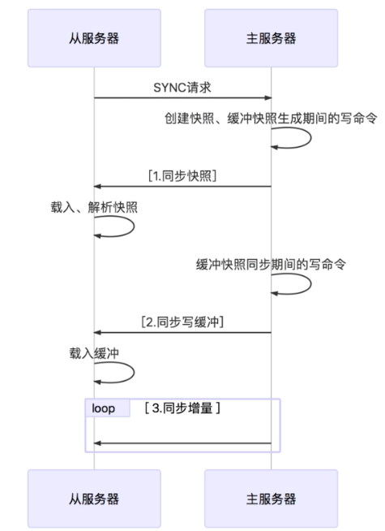

- 从数据库启动成功后，连接主数据库，发送 SYNC 命令；
- 主数据库接收到 SYNC 命令后，开始执行 BGSAVE 命令生成 RDB 文件并使用缓冲区记录此后执行的所有写命令；
- 主数据库 BGSAVE 执行完后，向所有从数据库发送快照文件，并在发送期间继续记录被执行的写命令；
- 从数据库收到快照文件后丢弃所有旧数据，载入收到的快照；
- 主数据库快照发送完毕后开始向从数据库发送缓冲区中的写命令；
- 从数据库完成对快照的载入，开始接收命令请求，并执行来自主数据库缓冲区的写命令；（从数据库初始化完成）
- 主数据库每执行一个写命令就会向从数据库发送相同的写命令，从数据库接收并执行收到的写命令（从数据库初始化完成后的操作）
- 出现断开重连后，2.8 之后的版本会将断线期间的命令传给从数据库，增量复制；
- 主从刚刚连接的时候，进行全量同步；全同步结束后，进行增量同步。当然，如果有需要，slave 在任何时候都可以发起全量同步。Redis 的策略是，无论如何，首先会尝试进行增量同步，如不成功，要求从机进行全量同步。

##### 主从复制优缺点

优点：

- 支持主从复制，主机会自动将数据同步到从机，可以进行读写分离；
- 为了分载 Master 的读操作压力，Slave 服务器可以为客户端提供只读操作的服务，写服务仍然必须由Master来完成；
- Slave 同样可以接受其它 Slaves 的连接和同步请求，这样可以有效的分载 Master 的同步压力；
- Master Server 是以非阻塞的方式为 Slaves 提供服务。所以在 Master-Slave 同步期间，客户端仍然可以提交查询或修改请求；
- Slave Server 同样是以非阻塞的方式完成数据同步。在同步期间，如果有客户端提交查询请求，Redis则返回同步之前的数据；

缺点：

- Redis不具备自动容错和恢复功能，主机从机的宕机都会导致前端部分读写请求失败，需要等待机器重启或者手动切换前端的IP才能恢复（也就是要人工介入）；
- 主机宕机，宕机前有部分数据未能及时同步到从机，切换IP后还会引入数据不一致的问题，降低了系统的可用性；
- 如果多个 Slave 断线了，需要重启的时候，尽量不要在同一时间段进行重启。因为只要 Slave 启动，就会发送sync 请求和主机全量同步，当多个 Slave 重启的时候，可能会导致 Master IO 剧增从而宕机。
- Redis 较难支持在线扩容，在集群容量达到上限时在线扩容会变得很复杂。

#### Sentinel（哨兵）模式

第一种主从同步/复制的模式，当主服务器宕机后，需要手动把一台从服务器切换为主服务器，这就需要人工干预，费事费力，还会造成一段时间内服务不可用。这不是一种推荐的方式，更多时候，我们优先考虑哨兵模式。

哨兵模式是一种特殊的模式，首先 Redis 提供了哨兵的命令，哨兵是一个独立的进程，作为进程，它会独立运行。其原理是哨兵通过发送命令，等待Redis服务器响应，从而监控运行的多个 Redis 实例。

##### 哨兵模式的作用

- 通过发送命令，让 Redis 服务器返回监控其运行状态，包括主服务器和从服务器；
- 当哨兵监测到 master 宕机，会自动将 slave 切换成 master ，然后通过发布订阅模式通知其他的从服务器，修改配置文件，让它们切换主机；

然而一个哨兵进程对Redis服务器进行监控，也可能会出现问题，为此，我们可以使用多个哨兵进行监控。各个哨兵之间还会进行监控，这样就形成了多哨兵模式。

##### 故障切换的过程

假设主服务器宕机，哨兵 1 先检测到这个结果，系统并不会马上进行 failover 过程，仅仅是哨兵 1 主观的认为主服务器不可用，这个现象成为主观下线。当后面的哨兵也检测到主服务器不可用，并且数量达到一定值时，那么哨兵之间就会进行一次投票，投票的结果由一个哨兵发起，进行 failover 操作。切换成功后，就会通过发布订阅模式，让各个哨兵把自己监控的从服务器实现切换主机，这个过程称为客观下线。这样对于客户端而言，一切都是透明的。

##### 哨兵模式的工作方式

- 每个 Sentinel（哨兵）进程以每秒钟一次的频率向整个集群中的 Master 主服务器、Slave 从服务器以及其他 Sentinel（哨兵）进程发送一个 PING 命令；
- 如果一个实例（instance）距离最后一次有效回复 PING 命令的时间超过 down-after-milliseconds 选项所指定的值， 则这个实例会被 Sentinel（哨兵）进程标记为主观下线（SDOWN）；
- 如果一个 Master 主服务器被标记为主观下线（SDOWN），则正在监视这个 Master 主服务器的所有 Sentinel（哨兵）进程要以每秒一次的频率确认 Master 主服务器的确进入了主观下线状态；
- 当有足够数量的 Sentinel（哨兵）进程（大于等于配置文件指定的值）在指定的时间范围内确认 Master 主服务器进入了主观下线状态（SDOWN）， 则 Master 主服务器会被标记为客观下线（ODOWN）；
- 在一般情况下， 每个 Sentinel（哨兵）进程会以每 10 秒一次的频率向集群中的所有 Master 主服务器、Slave 从服务器发送 INFO 命令；
- 当 Master 主服务器被 Sentinel（哨兵）进程标记为客观下线（ODOWN）时，Sentinel（哨兵）进程向下线的 Master 主服务器的所有 Slave 从服务器发送 INFO 命令的频率会从 10 秒一次改为每秒一次；
- 若没有足够数量的 Sentinel（哨兵）进程同意 Master主服务器下线， Master 主服务器的客观下线状态就会被移除。若 Master 主服务器重新向 Sentinel（哨兵）进程发送 PING 命令返回有效回复，Master主服务器的主观下线状态就会被移除。

##### 哨兵模式的优缺点

优点：

- 哨兵模式是基于主从模式的，所有主从的优点，哨兵模式都具有。
- 主从可以自动切换，系统更健壮，可用性更高(可以看作自动版的主从复制)。

缺点：

- Redis 较难支持在线扩容，在集群容量达到上限时在线扩容会变得很复杂。

#### Cluster 集群模式（Redis官方）

Redis Cluster是一种服务器 Sharding 技术，3.0版本开始正式提供。

Redis 的哨兵模式基本已经可以实现高可用，读写分离 ，但是在这种模式下每台 Redis 服务器都存储相同的数据，很浪费内存，所以在 redis3.0上加入了 Cluster 集群模式，实现了 Redis 的分布式存储，也就是说每台 Redis 节点上存储不同的内容。

##### 集群的数据分片

Redis 集群没有使用一致性 hash，而是引入了哈希槽 hash slot 的概念。

Redis 集群有16384 个哈希槽，每个 key 通过 CRC16 校验后对 16384 取模来决定放置哪个槽。集群的每个节点负责一部分hash槽，举个例子，比如当前集群有3个节点，那么：

- 节点 A 包含 0 到 5460 号哈希槽
- 节点 B 包含 5461 到 10922 号哈希槽
- 节点 C 包含 10923 到 16383 号哈希槽

这种结构很容易添加或者删除节点。比如如果我想新添加个节点 D ， 我需要从节点 A， B， C 中得部分槽到 D 上。如果我想移除节点 A ，需要将 A 中的槽移到 B 和 C 节点上，然后将没有任何槽的 A 节点从集群中移除即可。由于从一个节点将哈希槽移动到另一个节点并不会停止服务，所以无论添加删除或者改变某个节点的哈希槽的数量都不会造成集群不可用的状态。

在 Redis 的每一个节点上，都有这么两个东西，一个是插槽（slot），它的的取值范围是：0-16383。还有一个就是 cluster，可以理解为是一个集群管理的插件。当我们的存取的 Key到达的时候，Redis 会根据 CRC16 的算法得出一个结果，然后把结果对 16384 求余数，这样每个 key 都会对应一个编号在 0-16383 之间的哈希槽，通过这个值，去找到对应的插槽所对应的节点，然后直接自动跳转到这个对应的节点上进行存取操作。

##### Redis 集群的主从复制模型

为了保证高可用，redis-cluster集群引入了主从复制模型，一个主节点对应一个或者多个从节点，当主节点宕机的时候，就会启用从节点。当其它主节点 ping 一个主节点 A 时，如果半数以上的主节点与 A 通信超时，那么认为主节点 A 宕机了。如果主节点 A 和它的从节点 A1 都宕机了，那么该集群就无法再提供服务了。

##### 集群的特点

- 所有的 redis 节点彼此互联（PING-PONG机制），内部使用二进制协议优化传输速度和带宽。
- 节点的 fail 是通过集群中超过半数的节点检测失效时才生效。
- 客户端与 Redis 节点直连，不需要中间代理层.客户端不需要连接集群所有节点，连接集群中任何一个可用节点即可。

### 主从复制是怎么实现的？

#### 第一次同步

多台服务器之间要通过什么方式来确定谁是主服务器，或者谁是从服务器呢？

我们可以使用 replicaof（Redis 5.0 之前使用 slaveof）命令形成主服务器和从服务器的关系。

比如，现在有服务器 A 和 服务器 B，我们在服务器 B 上执行下面这条命令：

```bash
# 服务器 B 执行这条命令
replicaof <服务器 A 的 IP 地址> <服务器 A 的 Redis 端口号>
```

接着，服务器 B 就会变成服务器 A 的「从服务器」，然后与主服务器进行第一次同步。

主从服务器间的第一次同步的过程可分为三个阶段：

- 第一阶段是建立链接、协商同步；
- 第二阶段是主服务器同步数据给从服务器；
- 第三阶段是主服务器发送新写操作命令给从服务器。

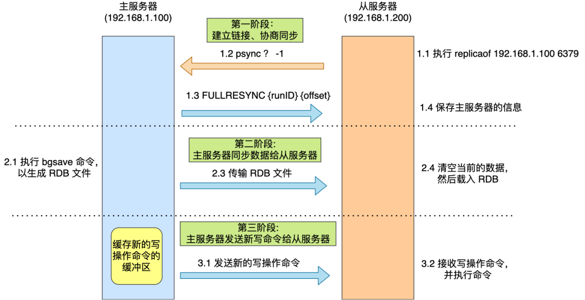

第一阶段：建立链接、协商同步

执行了 replicaof 命令后，从服务器就会给主服务器发送 psync 命令，表示要进行数据同步。

psync 命令包含两个参数，分别是主服务器的 runID 和复制进度 offset。

- runID，每个 Redis 服务器在启动时都会自动生产一个随机的 ID 来唯一标识自己。当从服务器和主服务器第一次同步时，因为不知道主服务器的 run ID，所以将其设置为 "?"。
- offset，表示复制的进度，第一次同步时，其值为 -1。

主服务器收到 psync 命令后，会用 FULLRESYNC 作为响应命令返回给对方。

并且这个响应命令会带上两个参数：主服务器的 runID 和主服务器目前的复制进度 offset。从服务器收到响应后，会记录这两个值。

FULLRESYNC 响应命令的意图是采用全量复制的方式，也就是主服务器会把所有的数据都同步给从服务器。

所以，第一阶段的工作时为了全量复制做准备。

第二阶段：主服务器同步数据给从服务器

接着，主服务器会执行 bgsave 命令来生成 RDB 文件，然后把文件发送给从服务器。

从服务器收到 RDB 文件后，会先清空当前的数据，然后载入 RDB 文件。

这里有一点要注意，主服务器生成 RDB 这个过程是不会阻塞主线程的，因为 bgsave 命令是产生了一个子进程来做生成 RDB 文件的工作，是异步工作的，这样 Redis 依然可以正常处理命令。

但是，这期间的写操作命令并没有记录到刚刚生成的 RDB 文件中，这时主从服务器间的数据就不一致了。

那么为了保证主从服务器的数据一致性，主服务器在下面这三个时间间隙中将收到的写操作命令，写入到 replication buffer 缓冲区里：

- 主服务器生成 RDB 文件期间；
- 主服务器发送 RDB 文件给从服务器期间；
- 「从服务器」加载 RDB 文件期间；

第三阶段：主服务器发送新写操作命令给从服务器

在主服务器生成的 RDB 文件发送完，从服务器收到 RDB 文件后，丢弃所有旧数据，将 RDB 数据载入到内存。完成 RDB 的载入后，会回复一个确认消息给主服务器。

接着，主服务器将 replication buffer 缓冲区里所记录的写操作命令发送给从服务器，从服务器执行来自主服务器 replication buffer 缓冲区里发来的命令，这时主从服务器的数据就一致了。

至此，主从服务器的第一次同步的工作就完成了。

#### 命令传播

主从服务器在完成第一次同步后，双方之间就会维护一个 TCP 连接。

后续主服务器可以通过这个连接继续将写操作命令传播给从服务器，然后从服务器执行该命令，使得与主服务器的数据库状态相同。

而且这个连接是长连接的，目的是避免频繁的 TCP 连接和断开带来的性能开销。

上面的这个过程被称为基于长连接的命令传播，通过这种方式来保证第一次同步后的主从服务器的数据一致性。

#### 分摊主服务器的压力

主从服务器在第一次数据同步的过程中，主服务器会做两件耗时的操作：生成 RDB 文件和传输 RDB 文件。

主服务器是可以有多个从服务器的，如果从服务器数量非常多，而且都与主服务器进行全量同步的话，就会带来两个问题：

- 由于是通过 bgsave 命令来生成 RDB 文件的，那么主服务器就会忙于使用 fork() 创建子进程，如果主服务器的内存数据非大，在执行 fork() 函数时是会阻塞主线程的，从而使得 Redis 无法正常处理请求；
- 传输 RDB 文件会占用主服务器的网络带宽，会对主服务器响应命令请求产生影响。

Redis 从服务器可以有自己的从服务器，我们可以把拥有从服务器的从服务器当作经理角色，它不仅可以接收主服务器的同步数据，自己也可以同时作为主服务器的形式将数据同步给从服务器。通过这种方式，主服务器生成 RDB 和传输 RDB 的压力可以分摊到充当经理角色的从服务器。

我们在「从服务器」上执行下面这条命令，使其作为目标服务器的从服务器：

```bash
replicaof <目标服务器的IP> 6379
```

此时如果目标服务器本身也是「从服务器」，那么该目标服务器就会成为「经理」的角色，不仅可以接受主服务器同步的数据，也会把数据同步给自己旗下的从服务器，从而减轻主服务器的负担。

#### 增量复制

主从服务器在完成第一次同步后，就会基于长连接进行命令传播。可是，网络说延迟就延迟，说断开就断开。

如果主从服务器间的网络连接断开了，那么就无法进行命令传播了，这时从服务器的数据就没办法和主服务器保持一致了，客户端就可能从「从服务器」读到旧的数据。

那么问题来了，如果此时断开的网络，又恢复正常了，要怎么继续保证主从服务器的数据一致性呢？

在 Redis 2.8 之前，如果主从服务器在命令同步时出现了网络断开又恢复的情况，从服务器就会和主服务器重新进行一次全量复制，很明显这样的开销太大了，必须要改进一波。

所以，从 Redis 2.8 开始，网络断开又恢复后，从主从服务器会采用增量复制的方式继续同步，也就是只会把网络断开期间主服务器接收到的写操作命令，同步给从服务器。

主要有三个步骤：

- 从服务器在恢复网络后，会发送 psync 命令给主服务器，此时的 psync 命令里的 offset 参数不是 -1；
- 主服务器收到该命令后，然后用 CONTINUE 响应命令告诉从服务器接下来采用增量复制的方式同步数据；
- 然后主服务将主从服务器断线期间，所执行的写命令发送给从服务器，然后从服务器执行这些命令。

那么关键的问题来了，主服务器怎么知道要将哪些增量数据发送给从服务器呢？

- repl_backlog_buffer，是一个「环形」缓冲区，用于主从服务器断连后，从中找到差异的数据；
- replication offset，标记上面那个缓冲区的同步进度，主从服务器都有各自的偏移量，主服务器使用 master_repl_offset 来记录自己「写」到的位置，从服务器使用 slave_repl_offset 来记录自己「读」到的位置。

那 repl_backlog_buffer 缓冲区是什么时候写入的呢？

在主服务器进行命令传播时，不仅会将写命令发送给从服务器，还会将写命令写入到 repl_backlog_buffer 缓冲区里，因此 这个缓冲区里会保存着最近传播的写命令。

网络断开后，当从服务器重新连上主服务器时，从服务器会通过 psync 命令将自己的复制偏移量 slave_repl_offset 发送给主服务器，主服务器根据自己的 master_repl_offset 和 slave_repl_offset 之间的差距，然后来决定对从服务器执行哪种同步操作：

- 如果判断出从服务器要读取的数据还在 repl_backlog_buffer 缓冲区里，那么主服务器将采用增量同步的方式；
- 相反，如果判断出从服务器要读取的数据已经不存在 repl_backlog_buffer 缓冲区里，那么主服务器将采用全量同步的方式。

当主服务器在 repl_backlog_buffer 中找到主从服务器差异（增量）的数据后，就会将增量的数据写入到 replication buffer 缓冲区，它是缓存将要传播给从服务器的命令。

repl_backlog_buffer 缓行缓冲区的默认大小是 1M，并且由于它是一个环形缓冲区，所以当缓冲区写满后，主服务器继续写入的话，就会覆盖之前的数据。因此，当主服务器的写入速度远超于从服务器的读取速度，缓冲区的数据一下就会被覆盖。

那么在网络恢复时，如果从服务器想读的数据已经被覆盖了，主服务器就会采用全量同步，这个方式比增量同步的性能损耗要大很多。

因此，为了避免在网络恢复时，主服务器频繁地使用全量同步的方式，我们应该调整下 repl_backlog_buffer 缓冲区大小，尽可能的大一些，减少出现从服务器要读取的数据被覆盖的概率，从而使得主服务器采用增量同步的方式。

#### 面试题

##### Redis主从节点时长连接还是短连接？

长连接

##### 怎么判断 Redis 某个节点是否正常工作？

Redis 判断节点是否正常工作，基本都是通过互相的 ping-pong 心态检测机制，如果有一半以上的节点去 ping 一个节点的时候没有 pong 回应，集群就会认为这个节点挂掉了，会断开与这个节点的连接。

Redis 主从节点发送的心态间隔是不一样的，而且作用也有一点区别：

- Redis 主节点默认每隔 10 秒对从节点发送 ping 命令，判断从节点的存活性和连接状态，可通过参数repl-ping-slave-period控制发送频率。
- Redis 从节点每隔 1 秒发送 replconf ack{offset} 命令，给主节点上报自身当前的复制偏移量，目的是为了：
	- 实时监测主从节点网络状态；
	- 上报自身复制偏移量， 检查复制数据是否丢失， 如果从节点数据丢失， 再从主节点的复制缓冲区中拉取丢失数据。

##### 主从复制架构中，过期key如何处理？

主节点处理了一个key或者通过淘汰算法淘汰了一个key，这个时间主节点模拟一条del命令发送给从节点，从节点收到该命令后，就进行删除key的操作。

##### Redis 是同步复制还是异步复制？

Redis 主节点每次收到写命令之后，先写到内部的缓冲区，然后异步发送给从节点。

##### 主从复制中两个 Buffer(replication buffer 、repl backlog buffer)有什么区别？

replication buffer 、repl backlog buffer 区别如下：

- 出现的阶段不一样：
	- repl backlog buffer 是在增量复制阶段出现，一个主节点只分配一个 repl backlog buffer；
	- replication buffer 是在全量复制阶段和增量复制阶段都会出现，主节点会给每个新连接的从节点，分配一个 replication buffer；
- 这两个 Buffer 都有大小限制的，当缓冲区满了之后，发生的事情不一样：
	- 当 repl backlog buffer 满了，因为是环形结构，会直接覆盖起始位置数据；
	- 当 replication buffer 满了，会导致连接断开，删除缓存，从节点重新连接，重新开始全量复制。

##### 如何应对主从数据不一致？

> 为什么会出现主从数据不一致？

主从数据不一致，就是指客户端从从节点中读取到的值和主节点中的最新值并不一致。

之所以会出现主从数据不一致的现象，是因为主从节点间的命令复制是异步进行的，所以无法实现强一致性保证（主从数据时时刻刻保持一致）。

具体来说，在主从节点命令传播阶段，主节点收到新的写命令后，会发送给从节点。但是，主节点并不会等到从节点实际执行完命令后，再把结果返回给客户端，而是主节点自己在本地执行完命令后，就会向客户端返回结果了。如果从节点还没有执行主节点同步过来的命令，主从节点间的数据就不一致了。

> 如何如何应对主从数据不一致？

第一种方法，尽量保证主从节点间的网络连接状况良好，避免主从节点在不同的机房。

第二种方法，可以开发一个外部程序来监控主从节点间的复制进度。具体做法：

- Redis 的 INFO replication 命令可以查看主节点接收写命令的进度信息（master_repl_offset）和从节点复制写命令的进度信息（slave_repl_offset），所以，我们就可以开发一个监控程序，先用 INFO replication 命令查到主、从节点的进度，然后，我们用 master_repl_offset 减去 slave_repl_offset，这样就能得到从节点和主节点间的复制进度差值了。
- 如果某个从节点的进度差值大于我们预设的阈值，我们可以让客户端不再和这个从节点连接进行数据读取，这样就可以减少读到不一致数据的情况。不过，为了避免出现客户端和所有从节点都不能连接的情况，我们需要把复制进度差值的阈值设置得大一些。

##### 主从切换如何减少数据丢失？

主从切换过程中，产生数据丢失的情况有两种：

- 异步复制同步丢失
- 集群产生脑裂数据丢失

我们不可能保证数据完全不丢失，只能做到使得尽量少的数据丢失。

###### 异步复制同步丢失

对于 Redis 主节点与从节点之间的数据复制，是异步复制的，当客户端发送写请求给主节点的时候，客户端会返回 ok，接着主节点将写请求异步同步给各个从节点，但是如果此时主节点还没来得及同步给从节点时发生了断电，那么主节点内存中的数据会丢失。

> 减少异步复制的数据丢失的方案

Redis 配置里有一个参数 min-slaves-max-lag，表示一旦所有的从节点数据复制和同步的延迟都超过了 min-slaves-max-lag 定义的值，那么主节点就会拒绝接收任何请求。

假设将 min-slaves-max-lag 配置为 10s 后，根据目前 master->slave 的复制速度，如果数据同步完成所需要时间超过10s，就会认为 master 未来宕机后损失的数据会很多，master 就拒绝写入新请求。这样就能将 master 和 slave 数据差控制在10s内，即使 master 宕机也只是这未复制的 10s 数据。

那么对于客户端，当客户端发现 master 不可写后，我们可以采取降级措施，将数据暂时写入本地缓存和磁盘中，在一段时间（等 master 恢复正常）后重新写入 master 来保证数据不丢失，也可以将数据写入 kafka 消息队列，等 master 恢复正常，再隔一段时间去消费 kafka 中的数据，让将数据重新写入 master 。

###### 集群产生脑裂数据丢失

先来理解集群的脑裂现象，这就好比一个人有两个大脑，那么到底受谁控制呢？

那么在 Redis 中，集群脑裂产生数据丢失的现象是怎样的呢？

在 Redis 主从架构中，部署方式一般是「一主多从」，主节点提供写操作，从节点提供读操作。

如果主节点的网络突然发生了问题，它与所有的从节点都失联了，但是此时的主节点和客户端的网络是正常的，这个客户端并不知道 Redis 内部已经出现了问题，还在照样的向这个失联的主节点写数据（过程A），此时这些数据被主节点缓存到了缓冲区里，因为主从节点之间的网络问题，这些数据都是无法同步给从节点的。

这时，哨兵也发现主节点失联了，它就认为主节点挂了（但实际上主节点正常运行，只是网络出问题了），于是哨兵就会在从节点中选举出一个 leeder 作为主节点，这时集群就有两个主节点了 —— 脑裂出现了。

这时候网络突然好了，哨兵因为之前已经选举出一个新主节点了，它就会把旧主节点降级为从节点（A），然后从节点（A）会向新主节点请求数据同步，因为第一次同步是全量同步的方式，此时的从节点（A）会清空掉自己本地的数据，然后再做全量同步。所以，之前客户端在过程 A 写入的数据就会丢失了，也就是集群产生脑裂数据丢失的问题。

总结一句话就是：由于网络问题，集群节点之间失去联系。主从数据不同步；重新平衡选举，产生两个主服务。等网络恢复，旧主节点会降级为从节点，再与新主节点进行同步复制的时候，由于会从节点会清空自己的缓冲区，所以导致之前客户端写入的数据丢失了。

> 减少脑裂的数据丢的方案

当主节点发现「从节点下线的数量太多」，或者「网络延迟太大」的时候，那么主节点会禁止写操作，直接把错误返回给客户端。

在 Redis 的配置文件中有两个参数我们可以设置：

- min-slaves-to-write x，主节点必须要有至少 x 个从节点连接，如果小于这个数，主节点会禁止写数据。
- min-slaves-max-lag x，主从数据复制和同步的延迟不能超过 x 秒，如果主从同步的延迟超过 x 秒，主节点会禁止写数据。

我们可以把 min-slaves-to-write 和 min-slaves-max-lag 这两个配置项搭配起来使用，分别给它们设置一定的阈值，假设为 N 和 T。

这两个配置项组合后的要求是，主节点连接的从节点中至少有 N 个从节点，「并且」主节点进行数据复制时的 ACK 消息延迟不能超过 T 秒，否则，主节点就不会再接收客户端的写请求了。

即使原主节点是假故障，它在假故障期间也无法响应哨兵心跳，也不能和从节点进行同步，自然也就无法和从节点进行 ACK 确认了。这样一来，min-slaves-to-write 和 min-slaves-max-lag 的组合要求就无法得到满足，原主节点就会被限制接收客户端写请求，客户端也就不能在原主节点中写入新数据了。

等到新主节点上线时，就只有新主节点能接收和处理客户端请求，此时，新写的数据会被直接写到新主节点中。而原主节点会被哨兵降为从节点，即使它的数据被清空了，也不会有新数据丢失。我再来给你举个例子。

##### 主从如何做到故障自动切换？

主节点挂了 ，从节点是无法自动升级为主节点的，这个过程需要人工处理，在此期间 Redis 无法对外提供写操作。

此时，Redis 哨兵机制就登场了，哨兵在发现主节点出现故障时，由哨兵自动完成故障发现和故障转移，并通知给应用方，从而实现高可用性。

### 为什么要有哨兵？

在 Redis 的主从架构中，由于主从模式是读写分离的，如果主节点（master）挂了，那么将没有主节点来服务客户端的写操作请求，也没有主节点给从节点（slave）进行数据同步了。

这时如果要恢复服务的话，需要人工介入，选择一个「从节点」切换为「主节点」，然后让其他从节点指向新的主节点，同时还需要通知上游那些连接 Redis 主节点的客户端，将其配置中的主节点 IP 地址更新为「新主节点」的 IP 地址。

这样也不太“智能”了，要是有一个节点能监控「主节点」的状态，当发现主节点挂了 ，它自动将一个「从节点」切换为「主节点」的话，那么可以节省我们很多事情啊！

Redis 在 2.8 版本以后提供的哨兵（Sentinel）机制，它的作用是实现主从节点故障转移。它会监测主节点是否存活，如果发现主节点挂了，它就会选举一个从节点切换为主节点，并且把新主节点的相关信息通知给从节点和客户端。

#### 哨兵机制是如何工作的？

哨兵其实是一个运行在特殊模式下的 Redis 进程，所以它也是一个节点。从“哨兵”这个名字也可以看得出来，它相当于是“观察者节点”，观察的对象是主从节点。当然，它不仅仅是观察那么简单，在它观察到有异常的状况下，会做出一些“动作”，来修复异常状态。

哨兵节点主要负责三件事情：监控、选主、通知。

#### 如何判断主节点真的故障了？

哨兵会每隔 1 秒给所有主从节点发送 PING 命令，当主从节点收到 PING 命令后，会发送一个响应命令给哨兵，这样就可以判断它们是否在正常运行。

如果主节点或者从节点没有在规定的时间内响应哨兵的 PING 命令，哨兵就会将它们标记为「主观下线」。这个「规定的时间」是配置项 down-after-milliseconds 参数设定的，单位是毫秒。

之所以针对「主节点」设计「主观下线」和「客观下线」两个状态，是因为有可能「主节点」其实并没有故障，可能只是因为主节点的系统压力比较大或者网络发送了拥塞，导致主节点没有在规定时间内响应哨兵的 PING 命令。

所以，为了减少误判的情况，哨兵在部署的时候不会只部署一个节点，而是用多个节点部署成哨兵集群（最少需要三台机器来部署哨兵集群），通过多个哨兵节点一起判断，就可以就可以避免单个哨兵因为自身网络状况不好，而误判主节点下线的情况。同时，多个哨兵的网络同时不稳定的概率较小，由它们一起做决策，误判率也能降低。

具体是怎么判定主节点为「客观下线」的呢？

当一个哨兵判断主节点为「主观下线」后，就会向其他哨兵发起命令，其他哨兵收到这个命令后，就会根据自身和主节点的网络状况，做出赞成投票或者拒绝投票的响应。

当这个哨兵的赞同票数达到哨兵配置文件中的 quorum 配置项设定的值后，这时主节点就会被该哨兵标记为「客观下线」。

quorum 的值一般设置为哨兵个数的二分之一加1，例如 3 个哨兵就设置 2。

#### 由哪个哨兵进行主从故障转移？

需要在哨兵集群中选出一个 leader，让 leader 来执行主从切换。选举 leader 的过程其实是一个投票的过程，在投票开始前，肯定得有个「候选者」。

哪个哨兵节点判断主节点为「客观下线」，这个哨兵节点就是候选者，所谓的候选者就是想当 Leader 的哨兵。

举个例子，假设有三个哨兵。当哨兵 B 先判断到主节点「主观下线」后，就会给其他实例发送 is-master-down-by-addr 命令。接着，其他哨兵会根据自己和主节点的网络连接情况，做出赞成投票或者拒绝投票的响应。当哨兵 B 收到赞成票数达到哨兵配置文件中的 quorum 配置项设定的值后，就会将主节点标记为「客观下线」，此时的哨兵 B 就是一个Leader 候选者。

> 候选者如何选举成为 Leader？

候选者会向其他哨兵发送命令，表明希望成为 Leader 来执行主从切换，并让所有其他哨兵对它进行投票。

每个哨兵只有一次投票机会，如果用完后就不能参与投票了，可以投给自己或投给别人，但是只有候选者才能把票投给自己。

那么在投票过程中，任何一个「候选者」，要满足两个条件：

- 第一，拿到半数以上的赞成票；
= 第二，拿到的票数同时还需要大于等于哨兵配置文件中的 quorum 值。

举个例子，假设哨兵节点有 3 个，quorum 设置为 2，那么任何一个想成为 Leader 的哨兵只要拿到 2 张赞成票，就可以选举成功了。如果没有满足条件，就需要重新进行选举。

如果某个时间点，刚好有两个哨兵节点判断到主节点为客观下线，那这时不就有两个候选者了？这时该如何决定谁是 Leader 呢？

每位候选者都会先给自己投一票，然后向其他哨兵发起投票请求。如果投票者先收到「候选者 A」的投票请求，就会先投票给它，如果投票者用完投票机会后，收到「候选者 B」的投票请求后，就会拒绝投票。这时，候选者 A 先满足了上面的那两个条件，所以「候选者 A」就会被选举为 Leader。

> 为什么哨兵节点至少要有 3 个？

如果哨兵集群中只有 2 个哨兵节点，此时如果一个哨兵想要成功成为 Leader，必须获得 2 票，而不是 1 票。

所以，如果哨兵集群中有个哨兵挂掉了，那么就只剩一个哨兵了，如果这个哨兵想要成为 Leader，这时票数就没办法达到 2 票，就无法成功成为 Leader，这时是无法进行主从节点切换的。

因此，通常我们至少会配置 3 个哨兵节点。这时，如果哨兵集群中有个哨兵挂掉了，那么还剩下两个个哨兵，如果这个哨兵想要成为 Leader，这时还是有机会达到 2 票的，所以还是可以选举成功的，不会导致无法进行主从节点切换。

quorum 的值建议设置为哨兵个数的二分之一加1，例如 3 个哨兵就设置 2，5 个哨兵设置为 3，而且哨兵节点的数量应该是奇数。

#### 主从故障转移的过程是怎样的？

在哨兵集群中通过投票的方式，选举出了哨兵 leader 后，就可以进行主从故障转移的过程了，主从故障转移操作包含以下四个步骤：

- 第一步：在已下线主节点（旧主节点）属下的所有「从节点」里面，挑选出一个从节点，并将其转换为主节点；
- 第二步：让已下线主节点属下的所有「从节点」修改复制目标，修改为复制「新主节点」；
- 第三步：将新主节点的 IP 地址和信息，通过「发布者/订阅者机制」通知给客户端；
- 第四步：继续监视旧主节点，当这个旧主节点重新上线时，将它设置为新主节点的从节点。

##### 步骤一：选出新主节点

故障转移操作第一步要做的就是在已下线主节点属下的所有「从节点」中，挑选出一个状态良好、数据完整的从节点，然后向这个「从节点」发送 SLAVEOF no one 命令，将这个「从节点」转换为「主节点」。

首先把已经下线的从节点过滤掉，然后把以往网络连接状态不好的从节点也给过滤掉。

怎么判断从节点之前的网络连接状态不好呢？

Redis 有个叫 down-after-milliseconds * 10 配置项，其down-after-milliseconds 是主从节点断连的最大连接超时时间。如果在 down-after-milliseconds 毫秒内，主从节点都没有通过网络联系上，我们就可以认为主从节点断连了。如果发生断连的次数超过了 10 次，就说明这个从节点的网络状况不好，不适合作为新主节点。

至此，我们就把网络状态不好的从节点过滤掉了，接下来要对所有从节点进行三轮考察：优先级、复制进度、ID 号。在进行每一轮考察的时候，哪个从节点优先胜出，就选择其作为新主节点。

第一轮考察：优先级最高的从节点胜出。Redis 有个叫 slave-priority 配置项，可以给从节点设置优先级。

第二轮考察：复制进度最靠前的从节点胜出。

什么是复制进度？主从架构中，主节点会将写操作同步给从节点，在这个过程中，主节点会用 master_repl_offset 记录当前的最新写操作在 repl_backlog_buffer 中的位置，而从节点会用 slave_repl_offset 这个值记录当前的复制进度。

如果某个从节点的 slave_repl_offset 最接近 master_repl_offset，说明它的复制进度是最靠前的，于是就可以将它选为新主节点。

第三轮考察：ID 号小的从节点胜出。

什么是 ID 号？每个从节点都有一个编号，这个编号就是 ID 号，是用来唯一标识从节点的。

在选举出从节点后，哨兵 leader 向被选中的从节点发送 SLAVEOF no one 命令，让这个从节点解除从节点的身份，将其变为新主节点。

在发送 SLAVEOF no one 命令之后，哨兵 leader 会以每秒一次的频率向被升级的从节点发送 INFO 命令（没进行故障转移之前，INFO 命令的频率是每十秒一次），并观察命令回复中的角色信息，当被升级节点的角色信息从原来的 slave 变为 master 时，哨兵 leader 就知道被选中的从节点已经顺利升级为主节点了。

##### 步骤二：将从节点指向新主节点

当新主节点出现之后，哨兵 leader 下一步要做的就是，让已下线主节点属下的所有「从节点」指向「新主节点」，这一动作可以通过向「从节点」发送 SLAVEOF 命令来实现。

##### 步骤三：通知客户的主节点已更换

主要通过 Redis 的发布者/订阅者机制来实现的。每个哨兵节点提供发布者/订阅者机制，客户端可以从哨兵订阅消息。

客户端和哨兵建立连接后，客户端会订阅哨兵提供的频道。主从切换完成后，哨兵就会向 +switch-master 频道发布新主节点的 IP 地址和端口的消息，这个时候客户端就可以收到这条信息，然后用这里面的新主节点的 IP 地址和端口进行通信了。

通过发布者/订阅者机制机制，有了这些事件通知，客户端不仅可以在主从切换后得到新主节点的连接信息，还可以监控到主从节点切换过程中发生的各个重要事件。这样，客户端就可以知道主从切换进行到哪一步了，有助于了解切换进度。

##### 步骤四：将旧主节点变为从节点

故障转移操作最后要做的是，继续监视旧主节点，当旧主节点重新上线时，哨兵集群就会向它发送 SLAVEOF 命令，让它成为新主节点的从节点。

#### 哨兵集群是如何组成的？

哨兵节点之间是通过 Redis 的发布者/订阅者机制来相互发现的。在主从集群中，主节点上有一个名为`__sentinel__:hello`的频道，不同哨兵就是通过它来相互发现，实现互相通信的。

哨兵 A 把自己的 IP 地址和端口的信息发布到`__sentinel__:hello`频道上，哨兵 B 和 C 订阅了该频道。那么此时，哨兵 B 和 C 就可以从这个频道直接获取哨兵 A 的 IP 地址和端口号。然后，哨兵 B、C 可以和哨兵 A 建立网络连接。

> 哨兵集群会对「从节点」的运行状态进行监控，那哨兵集群如何知道「从节点」的信息？

主节点知道所有「从节点」的信息，所以哨兵会每 10 秒一次的频率向主节点发送 INFO 命令来获取所有「从节点」的信息。

哨兵 B 给主节点发送 INFO 命令，主节点接受到这个命令后，就会把从节点列表返回给哨兵。接着，哨兵就可以根据从节点列表中的连接信息，和每个从节点建立连接，并在这个连接上持续地对从节点进行监控。哨兵 A 和 C 可以通过相同的方法和从节点建立连接。

正式通过 Redis 的发布者/订阅者机制，哨兵之间可以相互感知，然后组成集群，同时，哨兵又通过 INFO 命令，在主节点里获得了所有从节点连接信息，于是就能和从节点建立连接，并进行监控了。

### 切片集群：数据增多了，是该加内存还是加实例？

我曾遇到过这么一个需求：要用 Redis 保存 5000 万个键值对，每个键值对大约是 512B，为了能快速部署并对外提供服务，我们采用云主机来运行 Redis 实例，那么，该如何选择云主机的内存容量呢？

我粗略地计算了一下，这些键值对所占的内存空间大约是 25GB（5000 万 *512B）。所以，当时，我想到的第一个方案就是：选择一台 32GB 内存的云主机来部署 Redis。因为 32GB 的内存能保存所有数据，而且还留有 7GB，可以保证系统的正常运行。同时，我还采用 RDB 对数据做持久化，以确保 Redis 实例故障后，还能从 RDB 恢复数据。

但是，在使用的过程中，我发现，Redis 的响应有时会非常慢。后来，我们使用 INFO 命令查看 Redis 的 latest_fork_usec 指标值（表示最近一次 fork 的耗时），结果显示这个指标值特别高，快到秒级别了。

这跟 Redis 的持久化机制有关系。在使用 RDB 进行持久化时，Redis 会 fork 子进程来完成，fork 操作的用时和 Redis 的数据量是正相关的，而 fork 在执行时会阻塞主线程。数据量越大，fork 操作造成的主线程阻塞的时间越长。所以，在使用 RDB 对 25GB 的数据进行持久化时，数据量较大，后台运行的子进程在 fork 创建时阻塞了主线程，于是就导致 Redis 响应变慢了。

看来，第一个方案显然是不可行的，我们必须要寻找其他的方案。这个时候，我们注意到了 Redis 的切片集群。虽然组建切片集群比较麻烦，但是它可以保存大量数据，而且对 Redis 主线程的阻塞影响较小。

切片集群，也叫分片集群，就是指启动多个 Redis 实例组成一个集群，然后按照一定的规则，把收到的数据划分成多份，每一份用一个实例来保存。回到我们刚刚的场景中，如果把 25GB 的数据平均分成 5 份（当然，也可以不做均分），使用 5 个实例来保存，每个实例只需要保存 5GB 数据。

那么，在切片集群中，实例在为 5GB 数据生成 RDB 时，数据量就小了很多，fork 子进程一般不会给主线程带来较长时间的阻塞。采用多个实例保存数据切片后，我们既能保存 25GB 数据，又避免了 fork 子进程阻塞主线程而导致的响应突然变慢。

#### 如何保存更多数据？

在刚刚的案例里，为了保存大量数据，我们使用了大内存云主机和切片集群两种方法。实际上，这两种方法分别对应着 Redis 应对数据量增多的两种方案：纵向扩展（scale up）和横向扩展（scale out）。

- 纵向扩展：升级单个 Redis 实例的资源配置，包括增加内存容量、增加磁盘容量、使用更高配置的 CPU。
- 横向扩展：横向增加当前 Redis 实例的个数。

那么，这两种方式的优缺点分别是什么呢？

首先，纵向扩展的好处是，实施起来简单、直接。不过，这个方案也面临两个潜在的问题。

第一个问题，当使用 RDB 对数据进行持久化时，如果数据量增加，需要的内存也会增加，主线程 fork 子进程时就可能会阻塞（比如刚刚的例子中的情况）。不过，如果你不要求持久化保存 Redis 数据，那么，纵向扩展会是一个不错的选择。

不过，这时，你还要面对第二个问题：纵向扩展会受到硬件和成本的限制。这很容易理解，毕竟，把内存从 32GB 扩展到 64GB 还算容易，但是，要想扩充到 1TB，就会面临硬件容量和成本上的限制了。

与纵向扩展相比，横向扩展是一个扩展性更好的方案。这是因为，要想保存更多的数据，采用这种方案的话，只用增加 Redis 的实例个数就行了，不用担心单个实例的硬件和成本限制。在面向百万、千万级别的用户规模时，横向扩展的 Redis 切片集群会是一个非常好的选择。

不过，在只使用单个实例的时候，数据存在哪儿，客户端访问哪儿，都是非常明确的，但是，切片集群不可避免地涉及到多个实例的分布式管理问题。要想把切片集群用起来，我们就需要解决两大问题：

- 数据切片后，在多个实例之间如何分布？
- 客户端怎么确定想要访问的数据在哪个实例上？

#### 数据切片和实例的对应分布关系

在切片集群中，数据需要分布在不同实例上，那么，数据和实例之间如何对应呢？要先弄明白切片集群和 Redis Cluster 的联系与区别。

实际上，切片集群是一种保存大量数据的通用机制，这个机制可以有不同的实现方案。在 Redis 3.0 之前，官方并没有针对切片集群提供具体的方案。从 3.0 开始，官方提供了一个名为 Redis Cluster 的方案，用于实现切片集群。Redis Cluster 方案中就规定了数据和实例的对应规则。

具体来说，Redis Cluster 方案采用哈希槽（Hash Slot，接下来我会直接称之为 Slot），来处理数据和实例之间的映射关系。在 Redis Cluster 方案中，一个切片集群共有 16384 个哈希槽，这些哈希槽类似于数据分区，每个键值对都会根据它的 key，被映射到一个哈希槽中。

具体的映射过程分为两大步：首先根据键值对的 key，按照 CRC16 算法计算一个 16 bit 的值；然后，再用这个 16bit 值对 16384 取模，得到 0~16383 范围内的模数，每个模数代表一个相应编号的哈希槽。

那么，这些哈希槽又是如何被映射到具体的 Redis 实例上的呢？

我们在部署 Redis Cluster 方案时，可以使用 cluster create 命令创建集群，此时，Redis 会自动把这些槽平均分布在集群实例上。例如，如果集群中有 N 个实例，那么，每个实例上的槽个数为 16384/N 个。

当然， 我们也可以使用 cluster meet 命令手动建立实例间的连接，形成集群，再使用 cluster addslots 命令，指定每个实例上的哈希槽个数。

举个例子，假设集群中不同 Redis 实例的内存大小配置不一，如果把哈希槽均分在各个实例上，在保存相同数量的键值对时，和内存大的实例相比，内存小的实例就会有更大的容量压力。遇到这种情况时，你可以根据不同实例的资源配置情况，使用 cluster addslots 命令手动分配哈希槽。不过，在手动分配哈希槽时，需要把 16384 个槽都分配完，否则 Redis 集群无法正常工作。

#### 客户端如何定位数据？

在定位键值对数据时，它所处的哈希槽是可以通过计算得到的，这个计算可以在客户端发送请求时来执行。但是，要进一步定位到实例，还需要知道哈希槽分布在哪个实例上。

一般来说，客户端和集群实例建立连接后，实例就会把哈希槽的分配信息发给客户端。但是，在集群刚刚创建的时候，每个实例只知道自己被分配了哪些哈希槽，是不知道其他实例拥有的哈希槽信息的。

那么，客户端为什么可以在访问任何一个实例时，都能获得所有的哈希槽信息呢？这是因为，Redis 实例会把自己的哈希槽信息发给和它相连接的其它实例，来完成哈希槽分配信息的扩散。当实例之间相互连接后，每个实例就有所有哈希槽的映射关系了。

客户端收到哈希槽信息后，会把哈希槽信息缓存在本地。当客户端请求键值对时，会先计算键所对应的哈希槽，然后就可以给相应的实例发送请求了。

但是，在集群中，实例和哈希槽的对应关系并不是一成不变的，最常见的变化有两个：

- 在集群中，实例有新增或删除，Redis 需要重新分配哈希槽；
- 为了负载均衡，Redis 需要把哈希槽在所有实例上重新分布一遍。

此时，实例之间还可以通过相互传递消息，获得最新的哈希槽分配信息，但是，客户端是无法主动感知这些变化的。这就会导致，它缓存的分配信息和最新的分配信息就不一致了，那该怎么办呢？

Redis Cluster 方案提供了一种重定向机制，所谓的“重定向”，就是指，客户端给一个实例发送数据读写操作时，这个实例上并没有相应的数据，客户端要再给一个新实例发送操作命令。

那客户端又是怎么知道重定向时的新实例的访问地址呢？当客户端把一个键值对的操作请求发给一个实例时，如果这个实例上并没有这个键值对映射的哈希槽，那么，这个实例就会给客户端返回下面的 MOVED 命令响应结果，这个结果中就包含了新实例的访问地址。

```bash
GET hello:key
(error) MOVED 13320 172.16.19.5:6379
```

其中，MOVED 命令表示，客户端请求的键值对所在的哈希槽 13320，实际是在 172.16.19.5 这个实例上。通过返回的 MOVED 命令，就相当于把哈希槽所在的新实例的信息告诉给客户端了。这样一来，客户端就可以直接和 172.16.19.5 连接，并发送操作请求了。

如果这时候 Slot 还在迁移的话，会返回一个报错信息：

```bash
GET hello:key
(error) ASK 13320 172.16.19.5:6379
```

这个结果中的 ASK 命令就表示，客户端请求的键值对所在的哈希槽 13320，在 172.16.19.5 这个实例上，但是这个哈希槽正在迁移。此时，客户端需要先给 172.16.19.5 这个实例发送一个 ASKING 命令。这个命令的意思是，让这个实例允许执行客户端接下来发送的命令。然后，客户端再向这个实例发送 GET 命令，以读取数据。

ASK 命令表示两层含义：第一，表明 Slot 数据还在迁移中；第二，ASK 命令把客户端所请求数据的最新实例地址返回给客户端。和 MOVED 命令不同，ASK 命令并不会更新客户端缓存的哈希槽分配信息。

### 缓存高可用：缓存如何保证高可用？

#### Redis 的主从复制

主从复制技术在关系型数据库、缓存等各类存储节点中都有比较广泛的应用。Redis 的主从复制，可以将一台服务器的数据复制到其他节点，在 Redis 中，任何节点都可以成为主节点，通过 Slaveof 命令可以开启复制。

主从复制一方面可以作为数据备份，通过实现主从节点之间的最终数据一致性，保证数据尽量不丢失。除了数据备份，从节点还可以扩展主节点的读请求支持能力，实现读写分离，主节点作为写节点，从节点支持读请求。当主节点的系统水位不能承担前台业务请求并发量时，可以将请求路由到从节点，实现集群内的动态均衡。

Redis 的主从复制如何选举呢？

我们先来了解下 MySQL 的选主，也就是故障转移机制，和主从机器之间的数据同步方式有很大关系，同步方式包括半同步、全同步，关于 GTID 的复制等方式，MySQL 缺少一个选举决策的节点，一般是人工干预选主流程。

再来看一下 Redis 的主从配置，正常情况下，当主节点发生故障宕机，需要运维工程师手动从从节点服务器列表中，选择一个晋升为主节点，并且需要更新上游客户端的配置，这种方式显然是非常原始的，我们希望有一个机制，可以自动实现 Failover，也就是自动故障转移 。在 Redis 集群中，依赖 Sentinel，就可以实现上面的需求。

#### Redis Sentinel——Redis 哨兵

Redis Sentinel 就是我们常说的 Redis 哨兵机制，也是官方推荐的高可用解决方案，上面我们提到的主从复制场景，就可以依赖 Sentinel 进行集群监控。

Redis-Sentinel 是一个独立运行的进程，假如主节点宕机，它还可以进行主从之间的切换。主要实现了以下的功能：

- 不定期监控 Redis 服务运行状态
- 发现 Redis 节点宕机，可以通知上游的客户端进行调整
- 当发现 Master 节点不可用时，可以选择一个 Slave 节点，作为新的 Master 机器，并且更新集群中的数据同步关系

Sentinel 也存在单点问题，如果 Sentinel 宕机，高可用也就无法实现了，所以，Sentinel 必须支持集群部署。

实际上，Redis Sentine 方案是一个包含了多个 Sentinel 节点，以及多个数据节点的分布式架构。除了监控 Redis 数据节点的运行状态，Sentinel 节点之间还会互相监控，当发现某个 Redis 数据节点不可达时，Sentinel 会对这个节点做下线处理，如果是 Master 节点，会通过投票选择是否下线 Master 节点，完成故障发现和故障转移。

Sentinel 在操作故障节点的上下线时，还会通知上游的业务方，整个过程不需要人工干预，可以自动执行。

#### Redis Cluster 集群

Redis Cluster 是官方的集群方案，是一种无中心的架构，可以整体对外提供服务。

为什么是无中心呢？因为在 Redis Cluster 集群中，所有 Redis 节点都可以对外提供服务，包括路由分片、负载信息、节点状态维护等所有功能都在 Redis Cluster 中实现。

Redis 各实例间通过 Gossip 通信，这样设计的好处是架构清晰、依赖组件少，方便横向扩展，有资料介绍 Redis Cluster 集群可以扩展到 1000 个以上的节点。

Redis Cluster 另外一个好处是客户端直接连接服务器，避免了各种 Proxy 中的性能损耗，可以最大限度的保证读写性能。

## 缓存

### 什么是缓存雪崩、击穿、穿透？

#### 缓存雪崩

通常我们为了保证缓存中的数据与数据库中的数据一致性，会给 Redis 里的数据设置过期时间，当缓存数据过期后，用户访问的数据如果不在缓存里，业务系统需要重新生成缓存，因此就会访问数据库，并将数据更新到 Redis 里，这样后续请求都可以直接命中缓存。

那么，当大量缓存数据在同一时间过期（失效）或者 Redis 故障宕机时，如果此时有大量的用户请求，都无法在 Redis 中处理，于是全部请求都直接访问数据库，从而导致数据库的压力骤增，严重的会造成数据库宕机，从而形成一系列连锁反应，造成整个系统崩溃，这就是缓存雪崩的问题。

可以看到，发生缓存雪崩有两个原因：

- 大量数据同时过期；
- Redis 故障宕机；

##### 大量数据同时过期

针对大量数据同时过期而引发的缓存雪崩问题，常见的应对方法有下面这几种：

1. 均匀设置过期时间

如果要给缓存数据设置过期时间，应该避免将大量的数据设置成同一个过期时间。我们可以在对缓存数据设置过期时间时，给这些数据的过期时间加上一个随机数，这样就保证数据不会在同一时间过期。

2. 互斥锁

当业务线程在处理用户请求时，如果发现访问的数据不在 Redis 里，就加个互斥锁，保证同一时间内只有一个请求来构建缓存（从数据库读取数据，再将数据更新到 Redis 里），当缓存构建完成后，再释放锁。未能获取互斥锁的请求，要么等待锁释放后重新读取缓存，要么就返回空值或者默认值。

实现互斥锁的时候，最好设置超时时间，不然第一个请求拿到了锁，然后这个请求发生了某种意外而一直阻塞，一直不释放锁，这时其他请求也一直拿不到锁，整个系统就会出现无响应的现象。

3. 后台更新缓存

业务线程不再负责更新缓存，缓存也不设置有效期，而是让缓存“永久有效”，并将更新缓存的工作交由后台线程定时更新。

事实上，缓存数据不设置有效期，并不是意味着数据一直能在内存里，因为当系统内存紧张的时候，有些缓存数据会被“淘汰”，而在缓存被“淘汰”到下一次后台定时更新缓存的这段时间内，业务线程读取缓存失败就返回空值，业务的视角就以为是数据丢失了。

解决上面的问题的方式有两种。

第一种方式，后台线程不仅负责定时更新缓存，而且也负责频繁地检测缓存是否有效，检测到缓存失效了，原因可能是系统紧张而被淘汰的，于是就要马上从数据库读取数据，并更新到缓存。

这种方式的检测时间间隔不能太长，太长也导致用户获取的数据是一个空值而不是真正的数据，所以检测的间隔最好是毫秒级的，但是总归是有个间隔时间，用户体验一般。

第二种方式，在业务线程发现缓存数据失效后（缓存数据被淘汰），通过消息队列发送一条消息通知后台线程更新缓存，后台线程收到消息后，在更新缓存前可以判断缓存是否存在，存在就不执行更新缓存操作；不存在就读取数据库数据，并将数据加载到缓存。这种方式相比第一种方式缓存的更新会更及时，用户体验也比较好。

在业务刚上线的时候，我们最好提前把数据缓起来，而不是等待用户访问才来触发缓存构建，这就是所谓的缓存预热，后台更新缓存的机制刚好也适合干这个事情。

##### Redis 故障宕机

针对 Redis 故障宕机而引发的缓存雪崩问题，常见的应对方法有下面这几种：

1. 服务熔断或请求限流机制

因为 Redis 故障宕机而导致缓存雪崩问题时，我们可以启动服务熔断机制，暂停业务应用对缓存服务的访问，直接返回错误，不用再继续访问数据库，从而降低对数据库的访问压力，保证数据库系统的正常运行，然后等到 Redis 恢复正常后，再允许业务应用访问缓存服务。

服务熔断机制是保护数据库的正常允许，但是暂停了业务应用访问缓存服系统，全部业务都无法正常工作

为了减少对业务的影响，我们可以启用请求限流机制，只将少部分请求发送到数据库进行处理，再多的请求就在入口直接拒绝服务，等到 Redis 恢复正常并把缓存预热完后，再解除请求限流的机制。

2. 构建 Redis 缓存高可靠集群

服务熔断或请求限流机制是缓存雪崩发生后的应对方案，我们最好通过主从节点的方式构建 Redis 缓存高可靠集群。

如果 Redis 缓存的主节点故障宕机，从节点可以切换成为主节点，继续提供缓存服务，避免了由于 Redis 故障宕机而导致的缓存雪崩问题。

#### 缓存击穿

我们的业务通常会有几个数据会被频繁地访问，比如秒杀活动，这类被频地访问的数据被称为热点数据。

如果缓存中的某个热点数据过期了，此时大量的请求访问了该热点数据，就无法从缓存中读取，直接访问数据库，数据库很容易就被高并发的请求冲垮，这就是缓存击穿的问题。

可以发现缓存击穿跟缓存雪崩很相似，你可以认为缓存击穿是缓存雪崩的一个子集。

应对缓存击穿可以采取前面说到两种方案：

- 互斥锁方案，保证同一时间只有一个业务线程更新缓存，未能获取互斥锁的请求，要么等待锁释放后重新读取缓存，要么就返回空值或者默认值；
- 不给热点数据设置过期时间，由后台异步更新缓存，或者在热点数据准备要过期前，提前通知后台线程更新缓存以及重新设置过期时间。

#### 缓存穿透

当发生缓存雪崩或击穿时，数据库中还是保存了应用要访问的数据，一旦缓存恢复相对应的数据，就可以减轻数据库的压力，而缓存穿透就不一样了。

当用户访问的数据，既不在缓存中，也不在数据库中，导致请求在访问缓存时，发现缓存缺失，再去访问数据库时，发现数据库中也没有要访问的数据，没办法构建缓存数据，来服务后续的请求。那么当有大量这样的请求到来时，数据库的压力骤增，这就是缓存穿透的问题。

缓存穿透的发生一般有这两种情况：

- 业务误操作，缓存中的数据和数据库中的数据都被误删除了，所以导致缓存和数据库中都没有数据；
- 黑客恶意攻击，故意大量访问某些读取不存在数据的业务；

应对缓存穿透的方案，常见的方案有三种。

- 第一种方案，非法请求的限制；
- 第二种方案，缓存空值或者默认值；
- 第三种方案，使用布隆过滤器快速判断数据是否存在，避免通过查询数据库来判断数据是否存在。

第一种方案，非法请求的限制

当有大量恶意请求访问不存在的数据的时候，也会发生缓存穿透，因此在 API 入口处我们要判断求请求参数是否合理，请求参数是否含有非法值、请求字段是否存在，如果判断出是恶意请求就直接返回错误，避免进一步访问缓存和数据库。

第二种方案，缓存空值或者默认值

当我们线上业务发现缓存穿透的现象时，可以针对查询的数据，在缓存中设置一个空值或者默认值，这样后续请求就可以从缓存中读取到空值或者默认值，返回给应用，而不会继续查询数据库。

第三种方案，使用布隆过滤器快速判断数据是否存在，避免通过查询数据库来判断数据是否存在。

我们可以在写入数据库数据时，使用布隆过滤器做个标记，然后在用户请求到来时，业务线程确认缓存失效后，可以通过查询布隆过滤器快速判断数据是否存在，如果不存在，就不用通过查询数据库来判断数据是否存在。

即使发生了缓存穿透，大量请求只会查询 Redis 和布隆过滤器，而不会查询数据库，保证了数据库能正常运行，Redis 自身也是支持布隆过滤器的。

##### 布隆过滤器的介绍

布隆过滤器由「初始值都为 0 的位图数组」和「 N 个哈希函数」两部分组成。当我们在写入数据库数据时，在布隆过滤器里做个标记，这样下次查询数据是否在数据库时，只需要查询布隆过滤器，如果查询到数据没有被标记，说明不在数据库中。

布隆过滤器会通过 3 个操作完成标记：

- 第一步，使用 N 个哈希函数分别对数据做哈希计算，得到 N 个哈希值；
- 第二步，将第一步得到的 N 个哈希值对位图数组的长度取模，得到每个哈希值在位图数组的对应位置。
- 第三步，将每个哈希值在位图数组的对应位置的值设置为 1；

查询布隆过滤器说数据存在，并不一定证明数据库中存在这个数据，但是查询到数据不存在，数据库中一定就不存在这个数据。

### 缓存策略：面试中如何回答缓存穿透、雪崩等问题？

#### 案例背景 

我们来模拟一个面试场景：

系统收到用户的频繁查询请求时，会先从缓存中查找数据，如果缓存中有数据，直接从中读取数据，响应给请求方；如果缓存中没有数据，则从数据库中读取数据，然后再更新缓存，这样再获取这条数据时，可以直接从缓存中获取，不用再读取数据库。

这是一种常见的解决“查询请求频繁”的设计方案，那么这种方案在查询请求并发较高时，会存在什么问题呢？

#### 案例分析

从“案例背景”中，你可以发现，在面试中面试官通常考察“缓存设计”的套路是：给定一个场景（如查询请求量较高的场景）先让候选人说明场景中存在的问题，再给出解决方案。

我们以“电商平台商品详情页”为例，商品详情页中缓存了商品名称、描述、价格、优惠政策等信息，在双十一大促时，商品详情页的缓存经常存在缓存穿透、缓存并发、缓存雪崩，以及缓存设计等问题，接下来我们就重点解决这些高频问题，设计出一套高可用高性能的缓存架构方案。

#### 案例解答

##### 缓存穿透问题

缓存穿透指的是每次查询个别 key 时，key 在缓存系统不命中，此时应用系统就会从数据库中查询，如果数据库中存在这条数据，则获取数据并更新缓存系统。但如果数据库中也没有这条数据，这个时候就无法更新缓存，就会造成一个问题：查询缓存中不存在的数据时，每次都要查询数据库。

那么如果有人利用“查询缓存中不存在的数据时，每次都要查询数据库”恶意攻击的话，数据库会承担非常大的压力，甚至宕机。

解决缓存穿透的通用方案是： 给所有指定的 key 预先设定一个默认值，比如空字符串“Null”，当返回这个空字符串“Null”时，我们可以认为这是一个不存在的 key，在业务代码中，就可以判断是否取消查询数据库的操作，或者等待一段时间再请求这个 key。如果此时取到的值不再是“Null”，我们就可以认为缓存中对应的 key 有值了，这就避免出现请求访问到数据库的情况，从而把大量的类似请求挡在了缓存之中。

##### 缓存并发问题

假设在缓存失效的同时，出现多个客户端并发请求获取同一个 key 的情况，此时因为 key 已经过期了，所有请求在缓存数据库中查询 key 不命中，那么所有请求就会到数据库中去查询，然后当查询到数据之后，所有请求再重复将查询到的数据更新到缓存中。

这里就会引发一个问题，所有请求更新的是同一条数据，这不仅会增加数据库的压力，还会因为反复更新缓存而占用缓存资源，这就叫缓存并发。那你怎么解决缓存并发呢？

解决缓存并发的步骤：

1. 首先，客户端发起请求，先从缓存中读取数据，判断是否能从缓存中读取到数据；
2. 如果读取到数据，则直接返回给客户端，流程结束；
3. 如果没有读取到数据，那么就在 Redis 中使用 setNX 方法设置一个状态位，表示这是一种锁定状态；
4. 如果锁定状态设置成功，表示已经锁定成功，这时候请求从数据库中读取数据，然后更新缓存，最后再将数据返回给客户端；
5. 如果锁定状态没有设置成功，表示这个状态位已经被其他请求锁定，此时这个请求会等待一段时间再重新发起数据查询；
6. 再次查询后发现缓存中已经有数据了，那么直接返回数据给客户端。

这样就能保证在同一时间只能有一个请求来查询数据库并更新缓存系统，其他请求只能等待重新发起查询，从而解决缓存并发的问题。

##### 缓存雪崩问题

我们在实际开发过程中，通常会不断地往缓存中写数据，并且很多情况下，程序员在开发时，会将缓存的过期时间设置为一个固定的时间常量（比如 1 分钟、5 分钟）。这就可能出现系统在运行中，同时设置了很多缓存 key，并且这些 key 的过期时间都一样的情况，然后当 key 到期时，缓存集体同时失效，如果此时请求并发很高，就会导致大面积的请求打到数据库，造成数据库压力瞬间增大，出现缓存雪崩的现象。

对于缓存雪崩问题，我们可以采用两种方案解决。

- 将缓存失效时间随机打散： 我们可以在原有的失效时间基础上增加一个随机值（比如 1 到 10 分钟）这样每个缓存的过期时间都不重复了，也就降低了缓存集体失效的概率。
- 设置缓存不过期： 我们可以通过后台服务来更新缓存数据，从而避免因为缓存失效造成的缓存雪崩，也可以在一定程度上避免缓存并发问题。

#### 缓存设计问题

在通常情况下，面试官还会出一些缓存设计问题，比如：

- 怎么设计一个动态缓存热点数据的策略？
- 怎么设计一个缓存操作与业务分离的架构？

面试官会这样问：由于数据存储受限，系统并不是将所有数据都需要存放到缓存中的，而只是将其中一部分热点数据缓存起来，那么就引出来一个问题，即如何设计一个缓存策略，可以动态缓存热点数据呢？

我们同样举电商平台场景中的例子，现在要求只缓存用户经常访问的 Top 1000 的商品。 

那么缓存策略的总体思路：就是通过判断数据最新访问时间来做排名，并过滤掉不常访问的数据，只留下经常访问的数据，具体细节如下：

1. 先通过缓存系统做一个排序队列（比如存放 1000 个商品），系统会根据商品的访问时间，更新队列信息，越是最近访问的商品排名越靠前。
2. 同时系统会定期过滤掉队列中排名最后的 200 个商品，然后再从数据库中随机读取出 200 个商品加入队列中。
3. 这样当请求每次到达的时候，会先从队列中获取商品 ID，如果命中，就根据 ID 再从另一个缓存数据结构中读取实际的商品信息，并返回。
4. 在 Redis 中可以用 zadd 方法和 zrange 方法来完成排序队列和获取 200 个商品的操作。

前面的内容中，我们都是将缓存操作与业务代码耦合在一起，这样虽然在项目初期实现起来简单容易，但是随着项目的迭代，代码的可维护性会越来越差，并且也不符合架构的“高内聚，低耦合”的设计原则，那么如何解决这个问题呢？

回答的思路可以是这样：将缓存操作与业务代码解耦，实现方案上可以通过 MySQL Binlog + Canal + MQ 的方式。

我举一个实际的场景，比如用户在应用系统的后台添加一条配置信息，配置信息存储到了 MySQL 数据库中，同时数据库更新了 Binlog 日志数据，接着再通过使用 Canal 组件来获读取最新的 Binlog 日志数据，然后解析日志数据，并通过事先约定好的数据格式，发送到 MQ 消息队列中，最后再由应用系统将 MQ 中的数据更新到 Redis 中，这样就完成了缓存操作和业务代码之间的解耦。

### 【字节二面】缓存一致性如何保证？

mysql的数据随着时间流逝，可能会发生更新，此时redis缓存数据就会落后，我们如何保证它们的一致性呢？

这里要明白一点，面试官要考察的，一定是符合实际场景的最终一致性，如果非要杠强一致性，那么八成是希望你告诉他，强一致性带来的成本巨大，还不如不用缓存。

#### 解决方案

##### 方案一：等待过期，顺其自然

使用redis的过期时间，mysql更新时，redis不做处理，等待缓存过期失效，再从mysql拉取缓存。

这种方式实现简单，但不一致的时间会比较明显，具体由你的业务来配置。如果读请求非常频繁，且过期时间设置较长，则会产生很多脏数据。

优点：

- redis原生接口，开发成本低，易于实现；
- 管理成本低，出问题的概率会比较小。

不足：

- 完全依赖过期时间，时间太短容易造成缓存频繁失效，太长容易有较长时间不一致，对编程者的业务能力，有一定要求。

##### 方案二：尝试删除，从头再来

在方案一的基础上扩展，不光通过key的过期时间兜底，还需要在更新 mysql 时，同时尝试删除 redis，如果删除成功，下次访问该数据，则会直接查询 mysql 的数据，此时再写入 redis，就完成了数据同步。这里为什么说是尝试删除呢？因为有了 key 本身的过期时间作为保障，最终一致性是一定达成的，主动删除 redis 数据只是为了减少不一致的时间，但不能让其成为一个关键路径，影响核心流程。

优点：

- 相对方案一，达成最终一致性的延迟更小；
- 实现成本较低，只是在方案一的基础上，增加了删除逻辑。

不足：

- 如果更新mysql成功，删除redis却失败，就退化到了方案一；
- 在高并发场景，业务server需要和mysql、redis同时进行连接，这样是损耗双倍的连接资源，容易造成连接数过多的问题。

##### 方案三：主动更新，信箱投递

从被动防守，到主动进攻，在更新 mysql 之后，redis 也要更新，怎么更新呢？用消息队列！具体来说，是将更新操作交给消息队列，由消息队列保证可靠性，此外再搭建一个消费服务订阅消息队列，来异步更新 redis 数据。

优点：

- 使用消息队列，就相当于将请求投递至信箱，只要投递成功即完成任务，不用关心结果，实现了进一步解耦；
- 消息队列本身具有可靠性，在投递成功的前提下，通过手动提交等手段去消费，可以保证更新操作至少在redis中执行一次。

不足：

- 有时序性问题。举个例子，两台业务服务器在同一时间发出 a = 1和a = 5 两条请求，若mysql 中先执行 a = 1 再执行 a = 5，则 mysql 中 a 的值最终为 5；但由于网络传输本身有延迟，所以无法保证两条请求谁先进入消息队列，最终 redis 的结果可能是 1 也可能是 5，如果是 1，mysql 和 redis 中的数据就会产生不一致；
- 引入了消息队列，同时要增加消费服务，成本较高；
- 依旧有消耗更多客户端连接数的问题。

##### 方案四：订阅日志，完全解耦

把我们搭建的消费服务作为 mysql 的一个 slave，订阅 mysql 的 binlog 日志，解析日志内容，再更新到 redis。此方案和业务完全解耦，redis 的更新对业务方透明，可以减少心智成本。

优点：

- 在同步服务压力不大情况下，延迟较低；
- 和业务完全解耦，在更新 mysql 时，不需要做额外操作；
- 解决了时序性问题，可靠性强。

缺点：

- 要单独搭建一个同步服务，并且引入 binlog 同步机制，成本较大；
- 同步服务如果压力比较大，或者崩溃了，那么在较长时间内，redis 中都是老旧数据。

##### 方案选型

1. 首先确认产品上对延迟性的要求，如果要求极高，且数据有可能变化，别用缓存。
2. 通常来说，方案1就够了。牛哥咨询过4、5个团队，基本都是用方案1，因为使用缓存方案，通常是读多写少场景，同时业务上对延迟具有一定的包容性。方案1虽然有一定延时，但比较实用。
3. 如果想增加更新时的即时性，就选择方案2，不过一定要注意，针对redis老数据的删除操作不要作为关键路径，影响核心流程。
4. 方案3、方案4均适用于对延时要求比较高的业务，其区别为前者是推模式，后者是拉模式，而后者具有更强的可靠性，且无时序性问题。既然都愿意花功夫做处理消息的逻辑，不如一步到位，用方案4！

### 数据库和缓存如何保证一致性？

由于引入了缓存，那么在数据更新时，不仅要更新数据库，而且要更新缓存，这两个更新操作存在前后的问题：

- 先更新数据库，再更新缓存；
- 先更新缓存，再更新数据库；

#### 先更新数据库，再更新缓存

举个例子，比如「请求 A 」和「请求 B 」两个请求，同时更新「同一条」数据，则可能出现这样的顺序：

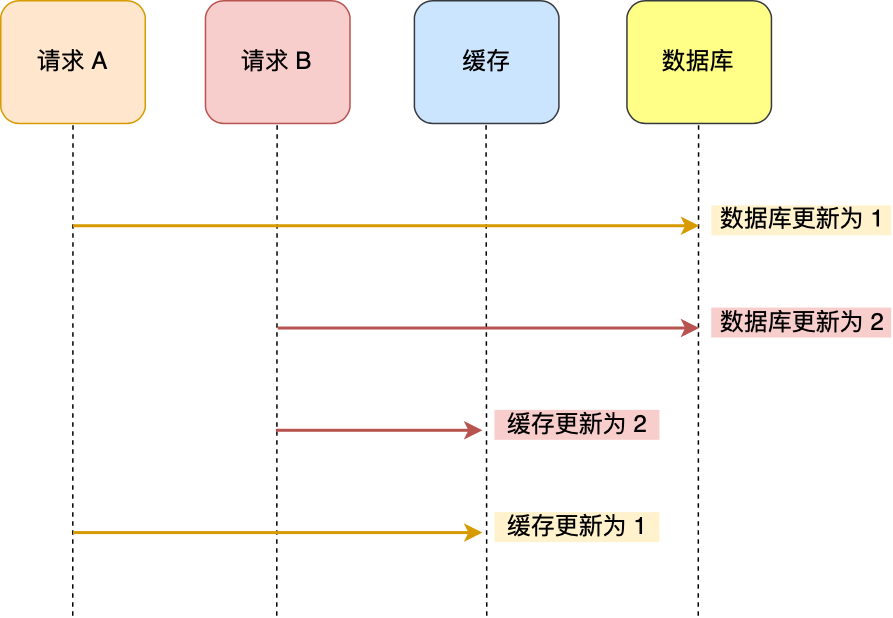

A 请求先将数据库的数据更新为 1，然后在更新缓存前，请求 B 将数据库的数据更新为 2，紧接着也把缓存更新为 2，然后 A 请求更新缓存为 1。

此时，数据库中的数据是 2，而缓存中的数据却是 1，出现了缓存和数据库中的数据不一致的现象。

#### 先更新缓存，再更新数据库

假设「请求 A 」和「请求 B 」两个请求，同时更新「同一条」数据，则可能出现这样的顺序：

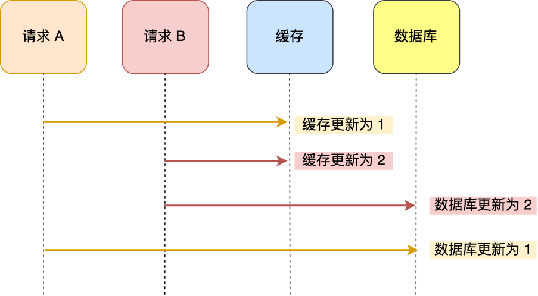

A 请求先将缓存的数据更新为 1，然后在更新数据库前，B 请求来了， 将缓存的数据更新为 2，紧接着把数据库更新为 2，然后 A 请求将数据库的数据更新为 1。

此时，数据库中的数据是 1，而缓存中的数据却是 2，出现了缓存和数据库中的数据不一致的现象。

#### 先更新数据库，还是先删除缓存？

如果在更新数据时，不更新缓存，而是删除缓存中的数据。然后，到读取数据时，发现缓存中没了数据之后，再从数据库中读取数据，更新到缓存中。

这个策略叫 Cache Aside 策略，中文是叫旁路缓存策略。

该策略又可以细分为「读策略」和「写策略」。

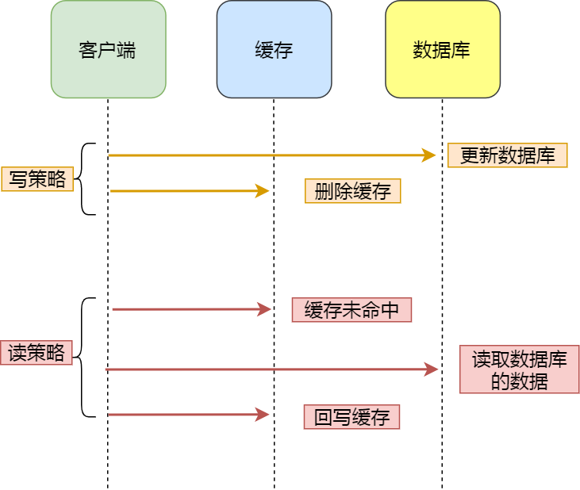

写策略的步骤：

- 更新数据库中的数据；
- 删除缓存中的数据。

读策略的步骤：

- 如果读取的数据命中了缓存，则直接返回数据；
- 如果读取的数据没有命中缓存，则从数据库中读取数据，然后将数据写入到缓存，并且返回给用户。

但是写策略也有两种顺序。

##### 先删除缓存，再更新数据库

假设某个用户的年龄是 20，请求 A 要更新用户年龄为 21，所以它会删除缓存中的内容。这时，另一个请求 B 要读取这个用户的年龄，它查询缓存发现未命中后，会从数据库中读取到年龄为 20，并且写入到缓存中，然后请求 A 继续更改数据库，将用户的年龄更新为 21。

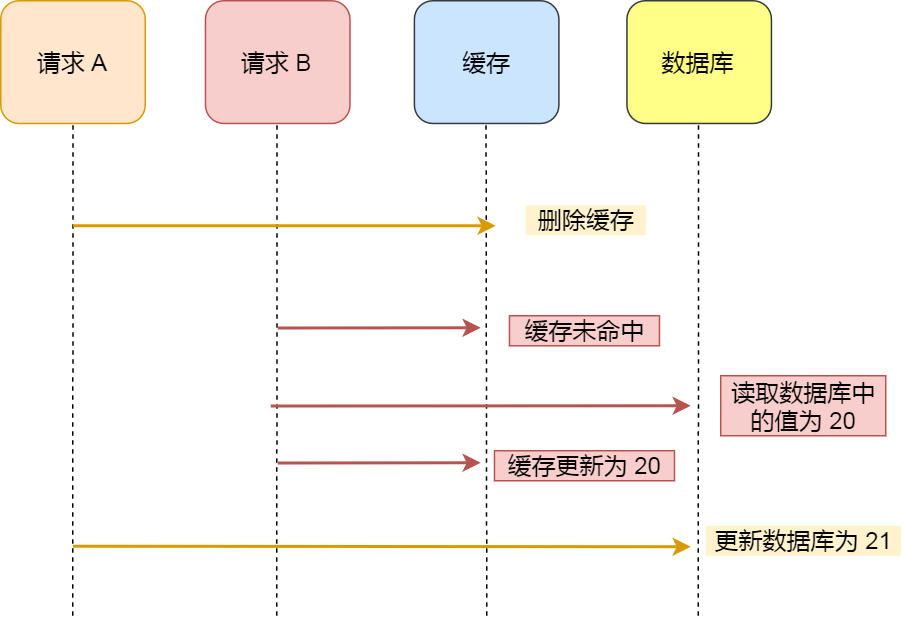

最终，该用户年龄在缓存中是 20（旧值），在数据库中是 21（新值），缓存和数据库的数据不一致。

可以看到，先删除缓存，再更新数据库，在「读 + 写」并发的时候，还是会出现缓存和数据库的数据不一致的问题。

##### 先更新数据库，再删除缓存

假如某个用户数据在缓存中不存在，请求 A 读取数据时从数据库中查询到年龄为 20，在未写入缓存中时另一个请求 B 更新数据。它更新数据库中的年龄为 21，并且清空缓存。这时请求 A 把从数据库中读到的年龄为 20 的数据写入到缓存中。

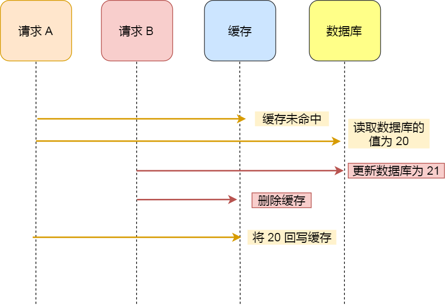

最终，该用户年龄在缓存中是 20（旧值），在数据库中是 21（新值），缓存和数据库数据不一致。

从上面的理论上分析，先更新数据库，再删除缓存也是会出现数据不一致性的问题，但是在实际中，这个问题出现的概率并不高。

因为缓存的写入通常要远远快于数据库的写入，所以在实际中很难出现请求 B 已经更新了数据库并且删除了缓存，请求 A 才更新完缓存的情况。

而一旦请求 A 早于请求 B 删除缓存之前更新了缓存，那么接下来的请求就会因为缓存不命中而从数据库中重新读取数据，所以不会出现这种不一致的情况。

所以，「先更新数据库 + 再删除缓存」的方案，是可以保证数据一致性的。

但是「先更新数据库， 再删除缓存」其实是两个操作，前面的所有分析都是建立在这两个操作都能同时执行成功，如果在删除缓存（第二个操作）的时候失败了，会导致缓存中的数据是旧值。

##### 如何保证两个操作都能执行成功？

举个例子，来说明下。

应用要把数据 X 的值从 1 更新为 2，先成功更新了数据库，然后在 Redis 缓存中删除 X 的缓存，但是这个操作却失败了，这个时候数据库中 X 的新值为 2，Redis 中的 X 的缓存值为 1，出现了数据库和缓存数据不一致的问题。

那么，后续有访问数据 X 的请求，会先在 Redis 中查询，因为缓存并没有删除，所以会缓存命中，但是读到的却是旧值 1。

其实不管是先操作数据库，还是先操作缓存，只要第二个操作失败都会出现数据一致的问题。

问题原因知道了，该怎么解决呢？有两种方法：

- 重试机制；
- 订阅 MySQL binlog，再操作缓存。

###### 重试机制

我们可以引入消息队列，将第二个操作（删除缓存）要操作的数据加入到消息队列，由消费者来操作数据。

- 如果应用删除缓存失败，可以从消息队列中重新读取数据，然后再次删除缓存，这个就是重试机制。当然，如果重试超过的一定次数，还是没有成功，我们就需要向业务层发送报错信息了。
- 如果删除缓存成功，就要把数据从消息队列中移除，避免重复操作，否则就继续重试。

举个例子，来说明重试机制的过程：

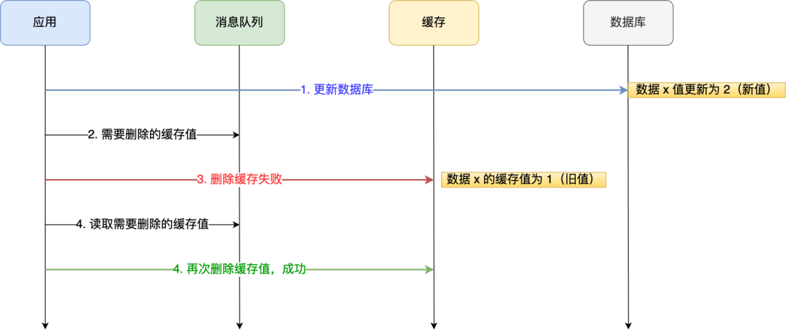

###### 订阅 MySQL binlog，再操作缓存

「先更新数据库，再删缓存」的策略的第一步是更新数据库，那么更新数据库成功，就会产生一条变更日志，记录在 binlog 里。

于是我们就可以通过订阅 binlog 日志，拿到具体要操作的数据，然后再执行缓存删除，阿里巴巴开源的 Canal 中间件就是基于这个实现的。

Canal 模拟 MySQL 主从复制的交互协议，把自己伪装成一个 MySQL 的从节点，向 MySQL 主节点发送 dump 请求，MySQL 收到请求后，就会开始推送 Binlog 给 Canal，Canal 解析 Binlog 字节流之后，转换为便于读取的结构化数据，供下游程序订阅使用。

所以，如果要想保证「先更新数据库，再删缓存」策略第二个操作能执行成功，我们可以使用「消息队列来重试缓存的删除」，或者「订阅 MySQL binlog 再操作缓存」，这两种方法有一个共同的特点，都是采用异步操作缓存。

##### 为什么是删除缓存，而不是更新缓存呢？

删除一个数据，相比更新一个数据更加轻量级，出问题的概率更小。在实际业务中，缓存的数据可能不是直接来自数据库表，也许来自多张底层数据表的聚合。

比如商品详情信息，在底层可能会关联商品表、价格表、库存表等，如果更新了一个价格字段，那么就要更新整个数据库，还要关联的去查询和汇总各个周边业务系统的数据，这个操作会非常耗时。 从另外一个角度，不是所有的缓存数据都是频繁访问的，更新后的缓存可能会长时间不被访问，所以说，从计算资源和整体性能的考虑，更新的时候删除缓存，等到下次查询命中再填充缓存，是一个更好的方案。

系统设计中有一个思想叫 Lazy Loading，适用于那些加载代价大的操作，删除缓存而不是更新缓存，就是懒加载思想的一个应用。

## 分布式锁

### Redis分布式锁，你用对了吗？

#### 分布式锁有哪些特性？

- 互斥性：锁的目的是获取资源的使用权，所以只让一个竞争者持有锁，这一点要尽可能保证；
- 安全性：避免死锁情况发生。当一个竞争者在持有锁期间内，由于意外崩溃而导致未能主动解锁，其持有的锁也能够被正常释放，并保证后续其它竞争者也能加锁；
- 对称性：同一个锁，加锁和解锁必须是同一个竞争者。不能把其他竞争者持有的锁给释放了，这又称为锁的可重入性；
- 可靠性：需要有一定程度的异常处理能力、容灾能力。

#### 分布式锁的常用实现方式

分布式锁，一般会依托第三方组件来实现，而利用Redis实现则是工作中应用最多的一种。

##### 最简化的版本

首先，当然是搭建一个最简单的实现方式，直接用 Redis 的 setnx 命令，这个命令的语法是：

```redis
setnx key value
```

如果key不存在，则会将 key 设置为 value，并返回 1；如果 key 存在，不会有任务影响，返回0。

基于这个特性，我们就可以用 setnx 实现加锁的目的：通过 setnx 加锁，加锁之后其他服务无法加锁，用完之后，再通过 delete 解锁。

##### 支持过期时间

最简化版本有一个问题：如果获取锁的服务挂掉了，那么锁就一直得不到释放。所以，我们需要一个超时来兜底。

Redis 中有 expire 命令，用来设置一个 key 的超时时间。但是 setnx 和 expire 不具备原子性，如果 setnx 获取锁之后，服务挂掉，依旧是泥牛入海，所以要使用如下命令：

```redis
set key value nx ex seconds
```

nx 表示具备 setnx 特定，ex 表示增加了过期时间，最后一个参数就是过期时间的值。能够支持过期时间，目前这个锁基本上是能用了。

但是存在一个问题：会存在服务A释放掉服务B的锁的可能。

##### 加上 owner

我们来试想一下如下场景：服务 A 获取了锁，由于业务流程比较长，或者网络延迟、GC 卡顿等原因，导致锁过期，而业务还会继续进行。这时候，业务 B 已经拿到了锁，准备去执行，这个时候服务 A 恢复过来并做完了业务，就会释放锁，而 B 却还在继续执行。

在真实的分布式场景中，可能存在几十个竞争者，那么上述情况发生概率就很高，导致同一份资源频繁被不同竞争者同时访问，分布式锁也就失去了意义。

基于这个场景，我们可以发现，问题关键在于，竞争者可以释放其他人的锁。那么在异常情况下，就会出现问题，所以我们可以进一步给出解决方案：分布式锁需要满足谁申请谁释放原则，不能释放别人的锁，也就是说，分布式锁，是要有归属的。

##### 引入 Lua

其实还存在一个小问题，我们完整的流程是竞争者获取锁执行任务，执行完毕后检查锁是不是自己的，最后进行释放。流程一梳理，执行完毕后，检查锁，再释放，这些操作不是原子化的。

可能锁获取时还是自己的，删除时却已经是别人的了。这可怎么办呢？Redis + Lua，可以说是专门为解决原子问题而生。Lua 将检查锁和再释放合在一起执行。

#### 可靠性如何保证

针对一些异常场景，包括Redis挂掉了、业务执行时间过长、网络波动等情况，需要考虑容灾。前面的内容基本是基于单机考虑的，如果Redis挂掉了，那锁就不能获取了。这个问题该如何解决呢？

一般来说，有两种方法：主从容灾和多级部署。

##### 主从容灾

最简单的一种方式，就是为Redis配置从节点，当主节点挂了，用从节点顶包。

但是主从切换，需要人工参与，会提高人力成本。不过 Redis 已经有成熟的解决方案，也就是哨兵模式，可以灵活自动切换，不再需要人工介入。

通过增加从节点的方式，虽然一定程度解决了单点的容灾问题，但并不是尽善尽美的，由于同步有时延，Slave可能会损失掉部分数据，分布式锁可能失效，这就会发生短暂的多机获取到执行权限。

##### 多机部署

如果对一致性的要求高一些，可以尝试多机部署，比如 Redis 的 RedLock，大概的思路就是多个机器，通常是奇数个，达到一半以上同意加锁才算加锁成功，这样，可靠性会向 ETCD 靠近。

现在假设有 5 个 Redis 主节点，基本保证它们不会同时宕掉，获取锁和释放锁的过程中，客户端会执行以下操作：

1. 向 5 个 Redis 申请加锁；
2. 只要超过一半，也就是 3 个 Redis 返回成功，那么就是获取到了锁。如果超过一半失败，需要向每个 Redis 发送解锁命令；
3. 由于向 5 个 Redis 发送请求，会有一定时耗，所以锁剩余持有时间，需要减去请求时间。这个可以作为判断依据，如果剩余时间已经为 0，那么也是获取锁失败；
4. 使用完成之后，向 5 个 Redis 发送解锁请求。

这种模式的好处在于，如果挂了2台Redis，整个集群还是可用的，给了运维更多时间来修复。

另外，单点Redis的所有手段，这种多机模式都可以使用，比如为每个节点配置哨兵模式，由于加锁是一半以上同意就成功，那么如果单个节点进行了主从切换，单个节点数据的丢失，就不会让锁失效了。这样增强了可靠性。

是不是有RedLock，就一定能保证可靠的分布式锁？

由于分布式系统中的三大困境（简称NPC），所以没有完全可靠的分布式锁！

- N：Network Delay（网络延迟）

当分布式锁获得返回包的时间过长，此时可能虽然加锁成功，但是锁可能很快过期。RedLock 做了些考量，也就是前面所说的锁剩余持有时间，需要减去请求时间，如此一来，就可以一定程度解决网络延迟的问题。

- P：Process Pause（进程暂停）

比如发生 GC，获取锁之后 GC 了，处于 GC 执行中，然后锁超时。其他锁获取，这种情况几乎无解。这时候 GC 回来了，那么两个进程就获取到了同一个分布式锁。

也许你会说，在GC回来之后，可以再去查一次啊？

这里有两个问题，首先你怎么知道 GC 回来了？这个可以在做业务之前，通过时间，进行一个粗略判断，但也是很吃场景经验的；第二，如果你判断的时候是 ok 的，但是判断完 GC 了呢？这点 RedLock 是无法解决的。

- C：Clock Drift（时钟漂移）

如果竞争者 A，获得了 RedLock，在5台分布式机器上都加上锁。为了方便分析，我们直接假设 5 台机器都发生了时钟漂移，锁瞬间过期了。这时候竞争者 B 拿到了锁，此时 A 和 B 拿到了相同的执行权限。

根据上述的分析，可以看出，RedLock 也不能扛住 NPC 的挑战，因此，单单从分布式锁本身出发，完全可靠是不可能的。要实现一个相对可靠的分布式锁机制，还是需要和业务的配合，业务本身要幂等可重入，这样的设计可以省却很多麻烦。

### 分布式系统中，如何回答锁的实现原理？

#### 案例背景

分布式锁是解决协调分布式系统之间，同步访问共享资源的一种方式。详细来讲：在分布式环境下，多个系统在同时操作共享资源（如写数据）时，发起操作的系统通常会通过一种方式去协调其他系统，然后获取访问权限，得到访问权限后才可以写入数据，其他系统必须等待权限释放。

很多面试官都会问候选人与分布式锁相关的问题，在一些细节上挖得还比较细。比如在分布式系统中涉及共享资源的访问，一些面试官会深挖如何控制并发访问共享资源；如何解决资源争抢等技术细节，这些问题在下单场景、优惠券场景都会被考察到，足以证明“分布式锁”考点的重要性。

那么假设你正在面试，面试官模拟了系统秒杀的场景：为了防止商品库存超售，在并发场景下用到了分布式锁的机制，做商品扣减库存的串行化操作。然后问你：“你如何实现分布式锁？”你该怎么回答呢？

#### 案例分析

针对上面的问题，可选的方式有很多，比如：

- 基于关系型数据库 MySQL 实现分布式锁；
- 基于分布式缓存 Redis 实现分布式锁；

你从中选择一个熟悉的实现方式，然后和面试官展开拉锯式的问答环节。

如果面试官觉得你回答问题的思路清晰有条理，给出的实现方案也可以落地，并且满足你的业务场景，那么他会认可你具备初中级研发工程师该具备的设计能力，但不要高兴得太早。

因为有些面试官会继续追问：“分布式锁用 Zookeeper 实现行不行？”，“分布式锁用 etcd 实现行不行？” 借机考察你对分布式协调组件的掌握。你可能会觉得开源组件那么多，自己不可能每一个都用过，答不出来也无妨。但面试官提问的重点不是停留在组件的使用上，而是你对分布式锁的原理问题的掌握程度。

换句话说，“如果让借助第三方组件，你怎么设计分布式锁？” 这背后涉及了分布式锁的底层设计逻辑，是你需要掌握的。

然你可以借助数据库 DB、Redis 和 ZooKeeper 等方式实现分布式锁，但要设计一个分布式锁，就需要明确分布式锁经常出现哪些问题，以及如何解决。

总的来说，设计分布式锁服务，至少要解决上面最核心的几个问题，才能评估锁的优劣，从问题本质来回答面试中的提问，以不变应万变。接下来，我就以开篇的 “库存扣减” 为例，带你了解分布式锁的常见实现方式、优缺点，以及方案背后的原理。

#### 案例解答

##### 基于关系型数据库实现分布式锁

基于关系型数据库（如 MySQL） 来实现分布式锁是任何阶段的研发同学都需要掌握的，做法如下：先查询数据库是否存在记录，为了防止幻读取（幻读取：事务 A 按照一定条件进行数据读取，这期间事务 B 插入了相同搜索条件的新数据，事务 A 再次按照原先条件进行读取时，发现了事务 B 新插入的数据 ）通过数据库行锁 select for update 锁住这行数据，然后将查询和插入的 SQL 在同一个事务中提交。

以订单表为例：

```mysql
select id from order where order_id = xxx for update
```

基于关系型数据库实现分布式锁比较简单，不过你要注意，基于 MySQL 行锁的方式会出现交叉死锁，比如事务 1 和事务 2 分别取得了记录 1 和记录 2 的排它锁，然后事务 1 又要取得记录 2 的排它锁，事务 2 也要获取记录 1 的排它锁，那这两个事务就会因为相互锁等待，产生死锁。

当然，你可以通过“超时控制”解决交叉死锁的问题，但在高并发情况下，出现的大部分请求都会排队等待，所以“基于关系型数据库实现分布式锁”的方式在性能上存在缺陷，所以如果你回答“基于关系型数据库 MySQL 实现分布式锁”，通常会延伸出下面两个问题。

- 数据库的事务隔离级别

如果你想让系统支持海量并发，那数据库的并发处理能力就尤为重要，而影响数据库并发能力最重要的因素是数据库的事务隔离机制。数据库的四种隔离级别从低到高分别是：

- 读未提交（READ UNCOMMITTED）；
- 读已提交（READ COMMITTED）；
- 可重复读（REPEATABLE READ）；
- 可串行化（SERIALIZABLE）。

其中，可串行化操作就是按照事务的先后顺序，排队执行，然而一个事务操作可能要执行很久才能完成，这就没有并发效率可言了，所以数据库隔离级别越高，系统的并发性能就越差。

- 基于乐观锁的方式实现分布式锁

在数据库层面，select for update 是悲观锁，会一直阻塞直到事务提交，所以为了不产生锁等待而消耗资源，你可以基于乐观锁的方式来实现分布式锁，比如基于版本号的方式，首先在数据库增加一个 int 型字段 ver，然后在 SELECT 同时获取 ver 值，最后在 UPDATE 的时候检查 ver 值是否为与第 2 步或得到的版本值相同。

```mysql
## SELECT 同时获取 ver 值

select amount, old_ver from order where order_id = xxx

## UPDATE 的时候检查 ver 值是否与第 2 步获取到的值相同

update order set ver = old_ver + 1, amount = yyy where order_id = xxx and ver = old_ver
```

此时，如果更新结果的记录数为1，就表示成功，如果更新结果的记录数为 0，就表示已经被其他应用更新过了，需要做异常处理。

##### 基于分布式缓存实现分布式锁

因为数据库的性能限制了业务的并发量，所以针对“ 618 和双 11 大促”等请求量剧增的场景，你要引入基于缓存的分布式锁，这个方案可以避免大量请求直接访问数据库，提高系统的响应能力。基于缓存实现的分布式锁，就是将数据仅存放在系统的内存中，不写入磁盘，从而减少 I/O 读写。

在加锁的过程中，实际上就是在给 Key 键设置一个值，为避免死锁，还要给 Key 键设置一个过期时间。

```redis
SET lock_key unique_value NX PX 10000
```

- lock_key 就是 key 键；
- unique_value 是客户端生成的唯一的标识；
- NX 代表只在 lock_key 不存在时，才对 lock_key 进行设置操作；
- PX 10000 表示设置 lock_key 的过期时间为 10s，这是为了避免客户端发生异常而无法释放锁。

而解锁的过程就是将 lock_key 键删除，但不能乱删，要保证执行操作的客户端就是加锁的客户端。而这个时候， unique_value 的作用就体现出来，实现方式可以通过 lua 脚本判断 unique_value 是否为加锁客户端。

选用 Lua 脚本是为了保证解锁操作的原子性。因为 Redis 在执行 Lua 脚本时，可以以原子性的方式执行，从而保证了锁释放操作的原子性。

```lua
// 释放锁时，先比较 unique_value 是否相等，避免锁的误释放

if redis.call("get",KEYS[1]) == ARGV[1] then

    return redis.call("del",KEYS[1])

else

    return 0

end
```

以上，就是基于 Redis 的 SET 命令和 Lua 脚本在 Redis 单节点上完成了分布式锁的加锁、解锁，不过在实际面试中，你不能仅停留在操作上，因为这并不能满足应对面试需要掌握的知识深度， 所以你还要清楚基于 Redis 实现分布式锁的优缺点；Redis 的超时时间设置问题；站在架构设计层面上 Redis 怎么解决集群情况下分布式锁的可靠性问题。

需要注意的是，你不用一股脑全部将其说出来，而是要做好准备，以便跟上面试官的思路，同频沟通。

- 基于 Redis 实现分布式锁的优缺点

基于数据库实现分布式锁的方案来说，基于缓存实现的分布式锁主要的优点主要有三点：

1. 性能高效（这是选择缓存实现分布式锁最核心的出发点）。
2. 实现方便。很多研发工程师选择使用 Redis 来实现分布式锁，很大成分上是因为 Redis 提供了 setnx 方法，实现分布式锁很方便。但是需要注意的是，在 Redis2.6.12 的之前的版本中，由于加锁命令和设置锁过期时间命令是两个操作（不是原子性的），当出现某个线程操作完成 setnx 之后，还没有来得及设置过期时间，线程就挂掉了，就会导致当前线程设置 key 一直存在，后续的线程无法获取锁，最终造成死锁的问题，所以要选型 Redis 2.6.12 后的版本或通过 Lua 脚本执行加锁和设置超时时间（Redis 允许将 Lua 脚本传到 Redis 服务器中执行, 脚本中可以调用多条 Redis 命令，并且 Redis 保证脚本的原子性）。
3. 避免单点故障（因为 Redis 是跨集群部署的，自然就避免了单点故障）。

当然，基于 Redis 实现分布式锁也存在缺点，主要是不合理设置超时时间，以及 Redis 集群的数据同步机制，都会导致分布式锁的不可靠性。

- 如何合理设置超时时间？

通过超时时间来控制锁的失效时间，不太靠谱，比如在有些场景中，一个线程 A 获取到了锁之后，由于业务代码执行时间可能比较长，导致超过了锁的超时时间，自动失效，后续线程 B 又意外的持有了锁，当线程 A 再次恢复后，通过 del 命令释放锁，就错误的将线程 B 中同样 key 的锁误删除了。

那么如何合理设置超时时间呢？ 你可以基于续约的方式设置超时时间：先给锁设置一个超时时间，然后启动一个守护线程，让守护线程在一段时间后，重新设置这个锁的超时时间。实现方式就是：写一个守护线程，然后去判断锁的情况，当锁快失效的时候，再次进行续约加锁，当主线程执行完成后，销毁续约锁即可。

不过这种方式实现起来相对复杂，我建议你结合业务场景进行回答，所以针对超时时间的设置，要站在实际的业务场景中进行衡量。

- Redis 如何解决集群情况下分布式锁的可靠性？

在回答基于 Redis 实现分布式锁时候，你需要具备的答题思路和扩展点。其中也提到了基于 Redis 集群节点实现分布式锁会存在高可用的问题。

由于 Redis 集群数据同步到各个节点时是异步的，如果在 Redis 主节点获取到锁后，在没有同步到其他节点时，Redis 主节点宕机了，此时新的 Redis 主节点依然可以获取锁，所以多个应用服务就可以同时获取到锁。

其实 Redis 官方已经设计了一个分布式锁算法 Redlock 解决了这个问题。而如果你能基于 Redlock 原理回答出怎么解决 Redis 集群节点实现分布式锁的问题，会成为面试的加分项。那官方是怎么解决的呢？

为了避免 Redis 实例故障导致锁无法工作的问题，Redis 的开发者 Antirez 设计了分布式锁算法 Redlock。Redlock 算法的基本思路，是让客户端和多个独立的 Redis 实例依次请求申请加锁，如果客户端能够和半数以上的实例成功地完成加锁操作，那么我们就认为，客户端成功地获得分布式锁，否则加锁失败。

这样一来，即使有某个 Redis 实例发生故障，因为锁的数据在其他实例上也有保存，所以客户端仍然可以正常地进行锁操作，锁的数据也不会丢失。那 Redlock 算法是如何做到的呢？

我们假设目前有 N 个独立的 Redis 实例， 客户端先按顺序依次向 N 个 Redis 实例执行加锁操作。这里的加锁操作和在单实例上执行的加锁操作一样，但是需要注意的是，Redlock 算法设置了加锁的超时时间，为了避免因为某个 Redis 实例发生故障而一直等待的情况。

当客户端完成了和所有 Redis 实例的加锁操作之后，如果有超过半数的 Redis 实例成功的获取到了锁，并且总耗时没有超过锁的有效时间，那么就是加锁成功。

### Redis 分布式锁的正确实现原理演化历程与 Redisson 实战总结

#### 分布式锁应该满足哪些特性？

1. 互斥：在任何给定时刻，只有一个客户端可以持有锁；
2. 无死锁：任何时刻都有可能获得锁，即使获取锁的客户端崩溃；
3. 容错：只要大多数 Redis 的节点都已经启动，客户端就可以获取和释放锁。

#### 正确设置锁超时

##### 锁的超时时间怎么计算合适呢？

这个时间不能瞎写，一般要根据在测试环境多次测试，然后压测多轮之后，比如计算出平均执行时间 200 ms。

那么锁的超时时间就放大为平均执行时间的 3~5 倍。

##### 为啥要放大呢？

因为如果锁的操作逻辑中有网络 IO 操作、GC 等，线上的网络不会总一帆风顺，我们要给网络抖动留有缓冲时间。

##### 有没有完美的方案呢？不管时间怎么设置都不大合适。

我们可以让获得锁的线程开启一个守护线程，用来给快要过期的锁「续航」。加锁的时候设置一个过期时间，同时客户端开启一个「守护线程」，定时去检测这个锁的失效时间。

如果快要过期，但是业务逻辑还没执行完成，自动对这个锁进行续期，重新设置过期时间。

#### 实现可重入锁

##### Redis Hash 可重入锁

Redisson 类库就是通过 Redis Hash 来实现可重入锁。当线程拥有锁之后，往后再遇到加锁方法，直接将加锁次数加 1，然后再执行方法逻辑。退出加锁方法之后，加锁次数再减 1，当加锁次数为 0 时，锁才被真正的释放。

可以看到可重入锁大特性就是计数，计算加锁的次数。所以当可重入锁需要在分布式环境实现时，我们也就需要统计加锁次数。我们可以使用 Redis hash 结构实现，key 表示被锁的共享资源， hash 结构的 fieldKey 的 value 则保存加锁的次数。

通过 Lua 脚本实现原子性，假设 KEYS1 = 「lock」, ARGV「1000，uuid」：

```lua
---- 1 代表 true
---- 0 代表 false
if (redis.call('exists', KEYS[1]) == ) then
    redis.call('hincrby', KEYS[1], ARGV[2], 1);
    redis.call('pexpire', KEYS[1], ARGV[1]);
    return 1;
end ;
if (redis.call('hexists', KEYS[1], ARGV[2]) == 1) then
    redis.call('hincrby', KEYS[1], ARGV[2], 1);
    redis.call('pexpire', KEYS[1], ARGV[1]);
    return 1;
end ;
return ;
```

加锁代码首先使用 Redis 的 exists 命令判断当前 lock 这个锁是否存在。如果锁不存在的话，直接使用 hincrby 创建一个键为 lock 的hash 表，并且为 Hash 表中键为 uuid 初始化为 0，然后再次加 1，后再设置过期时间。如果当前锁存在，则使用 hexists 判断当前 lock 对应的 hash 表中是否存在 uuid 这个键，如果存在，再次使用 hincrby 加 1，后再次设置过期时间。如果上述两个逻辑都不符合，直接返回。

```lua
-- 判断 hash set 可重入 key 的值是否等于 
-- 如果为  代表 该可重入 key 不存在
if (redis.call('hexists', KEYS[1], ARGV[1]) == ) then
    return nil;
end ;
-- 计算当前可重入次数
local counter = redis.call('hincrby', KEYS[1], ARGV[1], -1);
-- 小于等于  代表可以解锁
if (counter > ) then
    return ;
else
    redis.call('del', KEYS[1]);
    return 1;
end ;
return nil;
```

首先使用 hexists 判断 Redis 的 Hash 表是否存给定的域。如果 lock 对应 Hash 表不存在，或者 Hash 表不存在 uuid 这个 key，直接返回 nil。

若存在的情况下，代表当前锁被其持有，首先使用 hincrby 使可重入次数减 1 ，然后判断计算之后可重入次数，若小于等于 0，则使用 del 删除这把锁。

解锁代码执行方式与加锁类似，只不过解锁的执行结果返回类型使用 Long。这里之所以没有跟加锁一样使用 Boolean ,这是因为解锁 lua 脚本中，三个返回值含义如下：

- 1 代表解锁成功，锁被释放；
- 0 代表可重入次数被减 1；
- null 代表其他线程尝试解锁，解锁失败。

#### 主从架构带来的问题

之前分析的场景都是，锁在「单个」Redis 实例中可能产生的问题，并没有涉及到 Redis 主从模式导致的问题。我们通常使用「Cluster 集群」或者「哨兵集群」的模式部署保证高可用。

这两个模式都是基于「主从架构数据同步复制」实现的数据同步，而 Redis 的主从复制默认是异步的。

试想下如下场景会发生什么问题：

1. 客户端 A 在 master 节点获取锁成功。
2. 还没有把获取锁的信息同步到 slave 的时候，master 宕机。
3. slave 被选举为新 master，这时候没有客户端 A 获取锁的数据。
4. 客户端 B 就能成功的获得客户端 A 持有的锁，违背了分布式锁定义的互斥。

#### 什么是 Redlock

Redlock 红锁是为了解决主从架构中当出现主从切换导致多个客户端持有同一个锁而提出的一种算法。想用使用 Redlock，官方建议在不同机器上部署 5 个 Redis 主节点，节点都是完全独立，也不使用主从复制，使用多个节点是为容错。

一个客户端要获取锁有 5 个步骤：

1. 客户端获取当前时间 T1（毫秒级别）；
2. 使用相同的 key和 value顺序尝试从 N个 Redis实例上获取锁。
	- 每个请求都设置一个超时时间（毫秒级别），该超时时间要远小于锁的有效时间，这样便于快速尝试与下一个实例发送请求。
	- 比如锁的自动释放时间 10s，则请求的超时时间可以设置 5~50 毫秒内，这样可以防止客户端长时间阻塞。
3. 客户端获取当前时间 T2 并减去步骤 1 的 T1 来计算出获取锁所用的时间（T3 = T2 -T1）。当且仅当客户端在大多数实例（N/2 + 1）获取成功，且获取锁所用的总时间 T3 小于锁的有效时间，才认为加锁成功，否则加锁失败。

如果第 3 步加锁成功，则执行业务逻辑操作共享资源，key 的真正有效时间等于有效时间减去获取锁所使用的时间（步骤 3 计算的结果）。

如果因为某些原因，获取锁失败（没有在至少 N/2+1 个 Redis 实例取到锁或者取锁时间已经超过了有效时间），客户端应该在所有的 Redis 实例上进行解锁（即便某些 Redis 实例根本就没有加锁成功）。

## 事务

### 事务机制：Redis能实现ACID属性吗？

#### Redis 如何实现事务？

事务的执行过程包含三个步骤，Redis 提供了 MULTI、EXEC 两个命令来完成这三个步骤：

第一步，客户端要使用一个命令显式地表示一个事务的开启。在 Redis 中，这个命令就是 MULTI。

第二步，客户端把事务中本身要执行的具体操作（例如增删改数据）发送给服务器端。这些操作就是 Redis 本身提供的数据读写命令，例如 GET、SET 等。不过，这些命令虽然被客户端发送到了服务器端，但 Redis 实例只是把这些命令暂存到一个命令队列中，并不会立即执行。

第三步，客户端向服务器端发送提交事务的命令，让数据库实际执行第二步中发送的具体操作。Redis 提供的 EXEC 命令就是执行事务提交的。当服务器端收到 EXEC 命令后，才会实际执行命令队列中的所有命令。

#### Redis 的事务机制能保证哪些属性？

##### 原子性

如果事务正常执行，没有发生任何错误，那么，MULTI 和 EXEC 配合使用，就可以保证多个操作都完成。但是，如果事务执行发生错误了，原子性还能保证吗？我们需要分三种情况来看：

第一种情况是，在执行 EXEC 命令前，客户端发送的操作命令本身就有错误（比如语法错误，使用了不存在的命令），在命令入队时就被 Redis 实例判断出来了。

对于这种情况，在命令入队时，Redis 就会报错并且记录下这个错误。此时，我们还能继续提交命令操作。等到执行了 EXEC 命令之后，Redis 就会拒绝执行所有提交的命令操作，返回事务失败的结果。这样一来，事务中的所有命令都不会再被执行了，保证了原子性。

```bash
#开启事务
127.0.0.1:6379> MULTI
OK
#发送事务中的第一个操作，但是Redis不支持该命令，返回报错信息
127.0.0.1:6379> PUT a:stock 5
(error) ERR unknown command `PUT`, with args beginning with: `a:stock`, `5`, 
#发送事务中的第二个操作，这个操作是正确的命令，Redis把该命令入队
127.0.0.1:6379> DECR b:stock
QUEUED
#实际执行事务，但是之前命令有错误，所以Redis拒绝执行
127.0.0.1:6379> EXEC
(error) EXECABORT Transaction discarded because of previous errors.
```

第二种情况是事物操作入队时，命令和操作的数据类型不匹配，但 Redis 实例没有检查出错误。在执行完 EXEC 命令以后，Redis 实际执行这些事务操作时，就会报错。不过，需要注意的是，虽然 Redis 会对错误命令报错，但还是会把正确的命令执行完。在这种情况下，事务的原子性就无法得到保证了。

```bash
#开启事务
127.0.0.1:6379> MULTI
OK
#发送事务中的第一个操作，LPOP命令操作的数据类型不匹配，此时并不报错
127.0.0.1:6379> LPOP a:stock
QUEUED
#发送事务中的第二个操作
127.0.0.1:6379> DECR b:stock
QUEUED
#实际执行事务，事务第一个操作执行报错
127.0.0.1:6379> EXEC
1) (error) WRONGTYPE Operation against a key holding the wrong kind of value
2) (integer) 8
```

Redis 中并没有提供回滚机制。虽然 Redis 提供了 DISCARD 命令，但是，这个命令只能用来主动放弃事务执行，把暂存的命令队列清空，起不到回滚的效果。

第三种情况是在执行事务的 EXEC 命令时，Redis 实例发生了故障，导致事务执行失败。

在这种情况下，如果 Redis 开启了 AOF 日志，那么，只会有部分的事务操作被记录到 AOF 日志中。我们需要使用 redis-check-aof 工具检查 AOF 日志文件，这个工具可以把未完成的事务操作从 AOF 文件中去除。这样一来，我们使用 AOF 恢复实例后，事务操作不会再被执行，从而保证了原子性。

当然，如果 AOF 日志并没有开启，那么实例重启后，数据也都没法恢复了，此时，也就谈不上原子性了。

##### 一致性

事务的一致性保证会受到错误命令、实例故障的影响。所以，我们按照命令出错和实例故障的发生时机，分成三种情况来看。

第一种情况是命令入队时就报错。在这种情况下，事务本身就会被放弃执行，所以可以保证数据库的一致性。

第二种情况是命令入队时没报错，实际执行时报错。在这种情况下，有错误的命令不会被执行，正确的命令可以正常执行，也不会改变数据库的一致性。

第三种情况是 EXEC 命令执行时实例发生故障。在这种情况下，实例故障后会进行重启，这就和数据恢复的方式有关了，我们要根据实例是否开启了 RDB 或 AOF 来分情况讨论下。

如果我们没有开启 RDB 或 AOF，那么，实例故障重启后，数据都没有了，数据库是一致的。

如果我们使用了 RDB 快照，因为 RDB 快照不会在事务执行时执行，所以，事务命令操作的结果不会被保存到 RDB 快照中，使用 RDB 快照进行恢复时，数据库里的数据也是一致的。

如果我们使用了 AOF 日志，而事务操作还没有被记录到 AOF 日志时，实例就发生了故障，那么，使用 AOF 日志恢复的数据库数据是一致的。如果只有部分操作被记录到了 AOF 日志，我们可以使用 redis-check-aof 清除事务中已经完成的操作，数据库恢复后也是一致的。

##### 隔离性

事务的隔离性保证，会受到和事务一起执行的并发操作的影响。而事务执行又可以分成命令入队（EXEC 命令执行前）和命令实际执行（EXEC 命令执行后）两个阶段，所以，我们就针对这两个阶段，分成两种情况来分析：

1. 并发操作在 EXEC 命令前执行，此时，隔离性的保证要使用 WATCH 机制来实现，否则隔离性无法保证；
2. 并发操作在 EXEC 命令后执行，此时，隔离性可以保证。

先来看第一种情况。一个事务的 EXEC 命令还没有执行时，事务的命令操作是暂存在命令队列中的。此时，如果有其它的并发操作，我们就需要看事务是否使用了 WATCH 机制。

WATCH 机制的作用是，在事务执行前，监控一个或多个键的值变化情况，当事务调用 EXEC 命令执行时，WATCH 机制会先检查监控的键是否被其它客户端修改了。如果修改了，就放弃事务执行，避免事务的隔离性被破坏。然后，客户端可以再次执行事务，此时，如果没有并发修改事务数据的操作了，事务就能正常执行，隔离性也得到了保证。WATCH 机制的具体实现是由 WATCH 命令实现的，如下图：

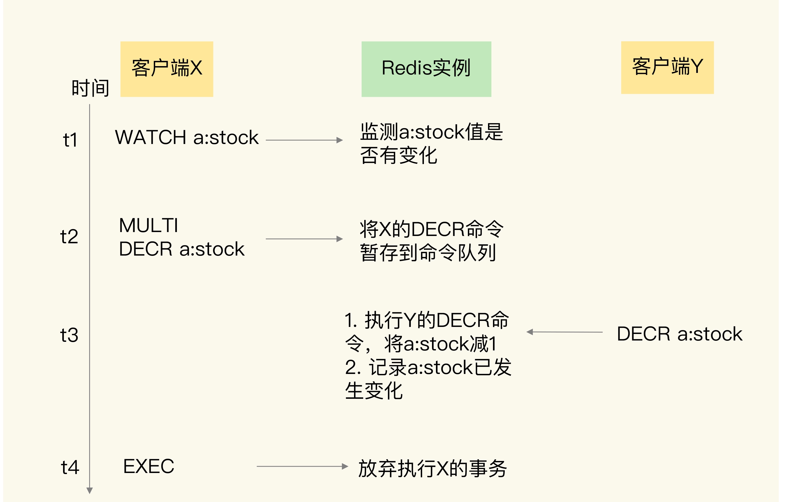

如果没有使用 WATCH 机制，在 EXEC 命令前执行的并发操作是会对数据进行读写的。而且，在执行 EXEC 命令的时候，事务要操作的数据已经改变了，在这种情况下，Redis 并没有做到让事务对其它操作隔离，隔离性也就没有得到保障。

第二种情况，并发操作在 EXEC 命令之后被服务器端接收并执行。因为 Redis 是用单线程执行命令，而且，EXEC 命令执行后，Redis 会保证先把命令队列中的所有命令执行完。所以，在这种情况下，并发操作不会破坏事务的隔离性。

##### 持久性

因为 Redis 是内存数据库，所以，数据是否持久化保存完全取决于 Redis 的持久化配置模式。

如果 Redis 没有使用 RDB 或 AOF，那么事务的持久化属性肯定得不到保证。如果 Redis 使用了 RDB 模式，那么，在一个事务执行后，而下一次的 RDB 快照还未执行前，如果发生了实例宕机，这种情况下，事务修改的数据也是不能保证持久化的。

如果 Redis 采用了 AOF 模式，因为 AOF 模式的三种配置选项 no、everysec 和 always 都会存在数据丢失的情况，所以，事务的持久性属性也还是得不到保证。

所以，不管 Redis 采用什么持久化模式，事务的持久性属性是得不到保证的。

## 热 key 和大 key

### Hot Key和Big Key引发的问题怎么应对？

#### Hot Key

##### 问题描述

对于大多数互联网系统，数据是分冷热的。比如最近的新闻、新发表的微博被访问的频率最高，而比较久远的之前的新闻、微博被访问的频率就会小很多。而在突发事件发生时，大量用户同时去访问这个突发热点信息，访问这个 Hot key，这个突发热点信息所在的缓存节点就很容易出现过载和卡顿现象，甚至会被 Crash。

##### 原因分析

Hot key 引发缓存系统异常，主要是因为突发热门事件发生时，超大量的请求访问热点事件对应的 key，比如微博中数十万、数百万的用户同时去吃一个新瓜。数十万的访问请求同一个 key，流量集中打在一个缓存节点机器，这个缓存机器很容易被打到物理网卡、带宽、CPU 的极限，从而导致缓存访问变慢、卡顿。

##### 业务场景

引发 Hot key 的业务场景很多，比如明星结婚、离婚、出轨这种特殊突发事件，比如奥运、春节这些重大活动或节日，还比如秒杀、双12、618 等线上促销活动，都很容易出现 Hot key 的情况。

##### 解决方案

首先要找出这些 Hot key 来。对于重要节假日、线上促销活动、集中推送这些提前已知的事情，可以提前评估出可能的热 key 来。而对于突发事件，无法提前评估，可以通过 Spark，对应流任务进行实时分析，及时发现新发布的热点 key。而对于之前已发出的事情，逐步发酵成为热 key 的，则可以通过 Hadoop 对批处理任务离线计算，找出最近历史数据中的高频热 key。

找到热 key 后，就有很多解决办法了。首先可以将这些热 key 进行分散处理，比如一个热 key 名字叫 hotkey，可以被分散为 hotkey#1、hotkey#2、hotkey#3，……hotkey#n，这 n 个 key 分散存在多个缓存节点，然后 client 端请求时，随机访问其中某个后缀的 hotkey，这样就可以把热 key 的请求打散，避免一个缓存节点过载，

其次，也可以 key 的名字不变，对缓存提前进行多副本+多级结合的缓存架构设计。

再次，如果热 key 较多，还可以通过监控体系对缓存的 SLA 实时监控，通过快速扩容来减少热 key 的冲击。

最后，业务端还可以使用本地缓存，将这些热 key 记录在本地缓存，来减少对远程缓存的冲击。

#### Big key

##### 问题描述

大 key，是指在缓存访问时，部分 Key 的 Value 过大，读写、加载易超时的现象。

##### 原因分析

如果这些大 key 占总体数据的比例很小，存 Mc，对应的 slab 较少，导致很容易被频繁剔除，DB 反复加载，从而导致查询较慢。如果业务中这种大 key 很多，而这种 key 被大量访问，缓存组件的网卡、带宽很容易被打满，也会导致较多的大 key 慢查询。另外，如果大 key 缓存的字段较多，每个字段的变更都会引发对这个缓存数据的变更，同时这些 key 也会被频繁地读取，读写相互影响，也会导致慢查现象。最后，大 key 一旦被缓存淘汰，DB 加载可能需要花费很多时间，这也会导致大 key 查询慢的问题。

##### 业务场景

大 key 的业务场景也比较常见。比如互联网系统中需要保存用户最新 1 万个粉丝的业务，比如一个用户个人信息缓存，包括基本资料、关系图谱计数、发 feed 统计等。微博的 feed 内容缓存也很容易出现，一般用户微博在 140 字以内，但很多用户也会发表 1 千字甚至更长的微博内容，这些长微博也就成了大 key。

##### 解决方案

对于大 key，给出 3 种解决方案。

- 第一种方案，如果数据存在 Mc 中，可以设计一个缓存阀值，当 value 的长度超过阀值，则对内容启用压缩，让 KV 尽量保持小的 size，其次评估大 key 所占的比例，在 Mc 启动之初，就立即预写足够数据的大 key，让 Mc 预先分配足够多的 trunk size 较大的 slab。确保后面系统运行时，大 key 有足够的空间来进行缓存。
- 第二种方案，如果数据存在 Redis 中，比如业务数据存 set 格式，大 key 对应的 set 结构有几千几万个元素，这种写入 Redis 时会消耗很长的时间，导致 Redis 卡顿。此时，可以扩展新的数据结构，同时让 client 在这些大 key 写缓存之前，进行序列化构建，然后通过 restore 一次性写入。
- 第三种方案时，将大 key 分拆为多个 key，尽量减少大 key 的存在。同时由于大 key 一旦穿透到 DB，加载耗时很大，所以可以对这些大 key 进行特殊照顾，比如设置较长的过期时间，比如缓存内部在淘汰 key 时，同等条件下，尽量不淘汰这些大 key。

## 面试题

### Redis

#### 基础摸底

**问：**你知道Redis是什么吗？

**答：**Redis是一个数据库，不过与传统RDBM不同，Redis属于NoSQL，也就是非关系型数据库，它的存储结构是Key-Value。Redis的数据直接存在内存中，读写速度非常快，因此 Redis被广泛应用于缓存方向。

**问：**那NoSQL的BASE理论是什么？

**答：**可以说BASE理论是CAP中一致性的妥协。和传统事务的ACID截然不同，BASE不追求强一致性，而是允许数据在一段时间内是不一致的，但最终达到一致状态，从而获得更高的可用性和性能。

**问：**先说说你最常用的Redis命令吧？

**答：**我最常用的读操作是get a，表示获取a对应的数据；最常用的写操作是setex a t b，表示将a的数据设置为b，并且在t秒后过期。

**问：**你提到了过期时间，那你知道Redis的过期键清除策略吗？

**答：**过期键清除策略有三种，分别是定时删除、定期删除和惰性删除。

定时删除，是在设置键的过期时间的同时，创建一个定时器，让定时器在键的过期时间来临时，立即执行对键的删除操作；

定期删除，每隔一段时间，程序就对数据库进行一次检查，删除里面的过期键；

惰性删除，是指使用的时候，发现Key过期了，此时再进行删除。

Redis过期键采用的是定期删除+惰性删除二者结合的方式进行删除的。

**问：**如果过期键没有被访问，而周期性删除又跟不上新键产生的速度，内存不就慢慢耗尽了吗？

**答：**Redis支持内存淘汰，配置参数maxmemory_policy决定了内存淘汰策略的策略。这个参数一共有8个枚举值。

**问：**内存淘汰用到的是LRU算法吗？

**答：**嗯...Redis用的是近似LRU算法，LRU算法需要一个双向链表来记录数据的最近被访问顺序，但是出于节省内存的考虑，Redis的LRU算法并非完整的实现。

Redis通过对少量键进行取样，然后和目前维持的淘汰池综合比较，回收其中的最久未被访问的键。通过调整每次回收时的采样数量maxmemory-samples，可以实现调整算法的精度。

#### 数据结构

**问：**你知道Redis有多少数据结构吗 ？

**答：**对外暴露5种Redis对象，分别是String、List、Hash、Set、Zset。底层实现依托于sds、ziplist、skiplist、dict等更基础数据结构。

**问：**那Redis字符串有什么特点？

**答：**Redis的字符串如果保存的对象是整数类型，那么就用int存储。如果不能用整数表示，就用SDS来表示，SDS通过记录长度，和预分配空间，可以高效计算长度，进行append操作。

**问：**Hash扩容过程是怎样的？

**答：**两张Hash表，平常起作用的都是0号表，当装载因子超过阈值时就会进行Rehash，将0号每上每一个bucket慢慢移动到1号表，所以叫渐进式Rehash，这种方式可以减少迁移系统的影响。

**问：**慢慢移动？能详细说下Rehash过程吗？

**答：**当周期函数发现为装载因子超过阈值时就会进行Rehash。Rehash的流程大概分成三步。

首先，生成新Hash表 ht[1]，为 ht[1] 分配空间。此时字典同时持有 ht[0] 和 ht[1] 两个哈希表。字典的偏移索引从静默状态 -1，设置为 0，表示 Rehash 工作正式开始。

然后，迁移 ht[0] 数据到 ht[1]。在 Rehash 进行期间，每次对字典执行增删查改操作，程序会顺带迁移一个 ht[0] 上的数据，并更新偏移索引。与此同时，周期函数也会定时迁移一批。

最后，ht[1] 和 ht[0] 指针对象交换。随着字典操作的不断执行， 最终在某个时间点上，ht[0]的所有键值对都会被 Rehash 至 ht[1]，此时再将 ht[1] 和 ht[0] 指针对象互换，同时把偏移索引的值设为 -1，表示 Rehash 操作已完成。

**问：**如果字典正在Rehash，此时有请求过来，Redis会怎么处理？

**答：**针对新增Key，是往ht[1]里面插入。针对读请求，先从ht[0]读，没找到再去ht[1]找。至于删除和更新，其实本质是先找到位置，再进行操作，所以和读请求一样，先找ht[0]，再找ht[1]，找到之后再进行操作。

**问：**接下来讲讲跳表的实现吧。

**答：**跳表本质上是对链表的一种优化，通过逐层跳步采样的方式构建索引，以加快查找速度。如果只用普通链表，只能一个一个往后找。跳表就不一样了，可以高层索引，一次跳跃多个节点，如果找过头了，就用更下层的索引。

**问：**那每个节点有多少层呢？

**答：**使用概率均衡的思路，确定新插入节点的层数。Redis使用随机函数决定层数。直观上来说，默认1层，和丢硬币一样，如果是正面就继续往上，这样持续迭代，最大层数32层。

可以看到，50%的概率被分配到第一层，25%的概率被分配到第二层，12.5%的概率被分配到第三层。这种方式保证了越上层数量越少，自然跨越起来越方便。

**问：**Redis的Zset为什么同时需要字典和跳表来实现？

**答：**Zset是一个有序列表，字典和跳表分别对应两种查询场景，字典用来支持按成员查询数据，跳表则用以实现高效的范围查询，这样两个场景，性能都做到了极致。

#### 系统容灾

**问：**Redis是基于内存的存储，如果服务重启，数据不就丢失了吗？

**答：**可以通过持久化机制，备份数据。有两种方式，一种是开启RDB，RDB是Redis的二进制快照文件，优点是文件紧凑，占用空间小，恢复速度比较快。同时，由于是子进程Fork的模式，对Redis本身读写性能的影响很小。

另一种方式是AOF，AOF中记录了Redis的操作命令，可以重放请求恢复现场，AOF的文件会比RDB大很多。

出于性能考虑，如果开启了AOF，会将命令先记录在AOF缓冲，之后再刷入磁盘。数据刷入磁盘的时机根据参数决定，有三种模式：1.关闭时刷入；2.每秒定期刷入；3.执行命令后立刻触发。

AOF的优点是故障情况下，丢失的数据会比RDB更少。如果是执行命令后立马刷入，AOF会拖累执行速度，所以一般都是配置为每秒定期刷入，这样对性能影响不会很大。

**问：**这样看起来，AOF文件会越来越大，最后磁盘都装不下？

**答：**不会的，Redis可以在AOF文件体积变得过大时，自动地在后台Fork一个子进程，专门对AOF进行重写。说白了，就是针对相同Key的操作，进行合并，比如同一个Key的set操作，那就是后面覆盖前面。

在重写过程中，Redis不但将新的操作记录在原有的AOF缓冲区，而且还会记录在AOF重写缓冲区。一旦新AOF文件创建完毕，Redis 就会将重写缓冲区内容，追加到新的AOF文件，再用新AOF文件替换原来的AOF文件。

**问：**Redis机器挂掉怎么办？

**答：**可以用主从模式部署，即有一个或多个备用机器，备用机会作为Slave同步Master的数据，在Redis出现问题的时候，把Slave升级为Master。

**问：**主从可以自动切换吗？

**答：**本身是不能，但可以写脚本实现，只是需要考虑的问题比较多。Redis已经有了现成的解决方案：哨兵模式。哨兵来监测Redis服务是否正常，异常情况下，由哨兵代理切换。为避免哨兵成为单点，哨兵也需要多机部署。

**问：**如果Master挂掉，会选择哪个Slave呢？

**答：**当哨兵集群选举出哨兵Leader后，由哨兵Leader从Redis从节点中选择一个Redis节点作为主节点：

1. 过滤故障的节点；
2. 选择优先级slave-priority最大的从节点作为主节点，如不存在，则继续；
3. 选择复制偏移量最大的从节点作为主节点，如果都一样，则继续。这里解释下，数据偏移量记录写了多少数据，主服务器会把偏移量同步给从服务器，当主从的偏移量一致，则数据是完全同步；
4. 选择runid最小的从节点作为主节点。Redis每次启动的时候生成随机的runid作为Redis的标识。

**问：**前面你提到了哨兵Leader，那它是怎么来的呢？

**答：**每一个哨兵节点都可以成为Leader，当一个哨兵节点确认Redis集群的主节点主观下线后，会请求其他哨兵节点要求将自己选举为Leader。被请求的哨兵节点如果没有同意过其他哨兵节点的选举请求，则同意该请求，也就是选举票数+1，否则不同意。

如果一个哨兵节点获得的选举票数超过节点数的一半，且大于quorum配置的值，则该哨兵节点选举为Leader；否则重新进行选举。

#### 性能优化

**问：**Redis性能怎么样？

**答：**只能说在十万级。使用之前，要跑BenchMark，实际情况下会受带宽、负载、单个数据大小、是否开启多线程等因素影响，脱开具体场景谈性能，就没有意义。

**问：**Redis性能这么高，那它是协程模型，还是多线程模型？

**答：**Redis是单线程Reactor模型，通过高效的IO复用以及内存处理实现高性能。如果是6.0之前我会毫不犹豫说是单线程，6.0之后，我还是会说单线程，但会补充一句，IO解包通过多线程进行了优化，而处理逻辑，还是单线程。

另外，如果考虑到 RDB 的 Fork，一些定时任务的处理，那么 Redis 也可以说多进程，这没有问题。但是 Redis 对数据的处理，至始至终，都是单线程。

**问：**可以详细说下6.0版本发布的多线程功能吗？

**答：**多线程功能，主要用于提高解包的效率。和传统的Multi Reactor多线程模型不同，Redis的多线程只负责处理网络IO的解包和协议转换，一方面是因为Redis的单线程处理足够快，另一方面也是为了兼容性做考虑。

**问：**如果数据太大，Redis存不下了怎么办？

**答：**使用集群模式。也就是将数据分片，不同的Key根据Hash路由到不同的节点。集群索引是通过一致性Hash算法来完成，这种算法可以解决服务器数量发生改变时，所有的服务器缓存在同一时间失效的问题。

同时，基于Gossip协议，集群状态变化时，如新节点加入、节点宕机、Slave提升为新Master，这些变化都能传播到整个集群的所有节点并达成一致。

**问：**一致性Hash能详细讲一下吗？

**答：**好的，传统的Hash分片，可以将某个Key，落到某个节点。但有一个问题，当节点扩容或者缩容，路由会被完全打乱。如果是缓存场景，很容易造成缓存雪崩问题。

为了优化这种情况，一致性Hash就应运而生了。一致性Hash是说将数据和服务器，以相同的Hash函数，映射到同一个Hash环上，针对一个对象，在哈希环上顺时针查找距其最近的机器，这个机器就负责处理该对象的相关请求。

这种情况下，增加节点，只会分流后面一个节点的数据。减少节点，那么请求会由后一个节点继承。也就是说，节点变化操作，最多只会影响后面一个节点的数据。

#### 场景应用

**问：**Redis经常用作缓存，那数据一致性怎么保证？

**答：**从设计思路来说，有 Cache Aside 和 Read/Write Through 两种模式，前者是把缓存责任交给应用层，后者是将缓存的责任，放置到服务提供方。

**问：**你说到两种模式，那么哪种模式更好呢？

**答：**两种模式各有优缺点，从透明性考虑，服务方比较合适；如果从性能极致来说，业务方会更有优势，毕竟可以减去服务RPC的损耗。

**问：**嗯，如果数据发生变化，你会怎样去更新缓存？

**答：**更新方式的话，大概有四种：

1. 数据存到数据库中，成功后，再让缓存失效，等到读缓存不命中的时候，再加载进去；
2. 通过消息队列更新缓存；
3. 先更新缓存，再更新服务，这种情况相当于把Cache也做Buffer用；
4. 起一个同步服务，作为MySQL一个从节点，通过解析binlog同步重要缓存。

**问：**那我们来谈谈Redis缓存雪崩。

**答：**缓存雪崩表示在某一时间段，缓存集中失效，导致请求全部走数据库，有可能搞垮数据库，使整个服务瘫痪。雪崩原因一般是由于缓存过期时间设置得相同造成的。

针对这种情况，可以借鉴 ETCD 中 Raft 选举的优化，让过期时间随机化，避免同一批请求，在同一时间过期。另一方面，还可以业务层面容灾，为热点数据使用双缓存。

**问：**那Redis缓存穿透又是什么？

**答：**缓存穿透指请求数据库里面根本没有的数据，高频请求不存在的Key，有可能是正常的业务逻辑，但更可能的，是黑客的攻击。

可以用布隆过滤器来应对，布隆过滤器是一种比较巧妙的概率型数据结构，特点是高效地插入和查询，可以用来告诉我们 “某样东西一定不存在或者可能存在”。

**问：**那你说一下布隆过滤器的实现吧。

**答：**布隆过滤器底层是一个64位的整型，将字符串用多个 Hash 函数映射不同的二进制位置，将整型中对应位置设置为 1。

在查询的时候，如果一个字符串所有 Hash 函数映射的值都存在，那么数据可能存在。为什么说可能呢，就是因为其他字符可能占据该值，提前点亮。

可以看到，布隆过滤器优缺点都很明显，优点是空间、时间消耗都很小，缺点是结果不是完全准确。

**问：**还有个概念叫缓存击穿，你能讲讲看吗？

**答：**嗯...缓存击穿，是指某一热键，被超高的并发访问，在失效的一瞬间，还没来得及重新产生，就有海量数据，直达数据库，可谓是兵临城下。

这种情况和缓存雪崩的不同之处，在于雪崩是大量缓存赶巧儿一起过期，击穿只是单个超热键失效。

这种超高频Key，我们要提高待遇，可以让它不过期，再单独实现数据同步逻辑，来维护数据的一致性。当然，无论如何，对后端肯定是需要限频的，不然如果Redis数据丢失，数据库还是会被打崩。限频方式可以是分布式锁或分布式令牌桶。

**问：**那Redis可以做消息队列吗？

**答：**嗯...可以是可以，但我觉得用它来做消息队列不合适。Redis本身没有支持AMQP规范，消息队列该有的能力缺胳膊少腿，消息可靠性不强。

因为总有人拿Redis做消息队列。Redis的作者都看不下去了，赶紧出了个Disque来专事专做，虽然没大红大紫，但至少明确告诉了我们，Redis，别拿来做消息队列！

**问：**那你能谈谈Redis在秒杀场景的应用吗？

**答：**Redis主要是起到选拔流量的作用，记录商品总数，还有就是已下单数，等达到总数之后拦截所有请求。可以多放些请求进来，然后塞入消息队列。

蚂蚁金服的云Redis提到消息队列可以用Redis来实现，但我觉得更好的方式是用Kafka这种标准消息队列组件。

**问：**你能继续说说Redis在分布式锁中的应用吗？

**答：**锁是计算机领域一个非常常见的概念，分布式锁也依赖存储组件，针对请求量的不同，可以选择Etcd、MySQL、Redis等。前两者可靠性更强，Redis性能更高。

**问：**那我们再聊聊Redis在限流场景的应用吧。

**答：**在微服务架构下，限频器也需要分布式化。无论是哪种算法，都可以结合Redis来实现。这里我比较熟悉的是基于Redis的分布式令牌桶。

很显然，Redis负责管理令牌，微服务需要进行函数操作，就向Redis申请令牌，如果Redis当前还有令牌，就发放给它。拿到令牌，才能进行下一步操作。

另一方面，令牌不光要消耗，还需要补充，出于性能考虑，可以使用懒生成的方式：使用令牌时，顺便生成令牌。这样子还有个好处：令牌的获取，和令牌的生成，都可以在一个Lua脚本中，保证了原子性。

### Redis 常见面试题

#### 认识 Redis

##### 什么是 Redis？

Redis 是一种基于内存的数据库，对数据的读写操作都是在内存中完成，因此读写速度非常快，常用于缓存，消息队列、分布式锁等场景。

Redis 提供了多种数据类型来支持不同的业务场景，比如 String(字符串)、Hash(哈希)、 List (列表)、Set(集合)、Zset(有序集合)、Bitmaps（位图）、HyperLogLog（基数统计）、GEO（地理信息）、Stream（流），并且对数据类型的操作都是原子性的，因为执行命令由单线程负责的，不存在并发竞争的问题。

除此之外，Redis 还支持事务 、持久化、Lua 脚本、多种集群方案（主从复制模式、哨兵模式、切片机群模式）、发布/订阅模式，内存淘汰机制、过期删除机制等等。

##### Redis 和 Memcached 有什么区别？

很多人都说用 Redis 作为缓存，但是 Memcached 也是基于内存的数据库，为什么不选择它作为缓存呢？要解答这个问题，我们就要弄清楚 Redis 和 Memcached 的区别。 Redis 与 Memcached 共同点：

1. 都是基于内存的数据库，一般都用来当做缓存使用。
2. 都有过期策略。
3. 两者的性能都非常高。

Redis 与 Memcached 区别：

- Redis 支持的数据类型更丰富（String、Hash、List、Set、ZSet），而 Memcached 只支持最简单的 key-value 数据类型；
- Redis 支持数据的持久化，可以将内存中的数据保持在磁盘中，重启的时候可以再次加载进行使用，而 Memcached 没有持久化功能，数据全部存在内存之中，Memcached 重启或者挂掉后，数据就没了；
- Redis 原生支持集群模式，Memcached 没有原生的集群模式，需要依靠客户端来实现往集群中分片写入数据；
- Redis 支持发布订阅模型、Lua 脚本、事务等功能，而 Memcached 不支持；

##### 为什么用 Redis 作为 MySQL 的缓存？

主要是因为 Redis 具备「高性能」和「高并发」两种特性。

#### Redis 数据结构

##### Redis 数据类型以及使用场景分别是什么？

Redis 提供了丰富的数据类型，常见的有五种数据类型：String（字符串），Hash（哈希），List（列表），Set（集合）、Zset（有序集合）。随着 Redis 版本的更新，后面又支持了四种数据类型： BitMap（2.2 版新增）、HyperLogLog（2.8 版新增）、GEO（3.2 版新增）、Stream（5.0 版新增）。

- String 类型的应用场景：缓存对象、常规计数、分布式锁、共享 session 信息等。
- List 类型的应用场景：消息队列（但是有两个问题：1. 生产者需要自行实现全局唯一 ID；2. 不能以消费组形式消费数据）等。
- Hash 类型：缓存对象、购物车等。
- Set 类型：聚合计算（并集、交集、差集）场景，比如点赞、共同关注、抽奖活动等。
- Zset 类型：排序场景，比如排行榜、电话和姓名排序等。
- BitMap（2.2 版新增）：二值状态统计的场景，比如签到、判断用户登陆状态、连续签到用户总数等；
- HyperLogLog（2.8 版新增）：海量数据基数统计的场景，比如百万级网页 UV 计数等；
- GEO（3.2 版新增）：存储地理位置信息的场景，比如滴滴叫车；
- Stream（5.0 版新增）：消息队列，相比于基于 List 类型实现的消息队列，有这两个特有的特性：自动生成全局唯一消息ID，支持以消费组形式消费数据。

##### 五种常见的 Redis 数据类型是怎么实现？

> String 类型内部实现

String 类型的底层的数据结构实现主要是 SDS（简单动态字符串）。 SDS 和我们认识的 C 字符串不太一样，之所以没有使用 C 语言的字符串表示，因为 SDS 相比于 C 的原生字符串：

- SDS 不仅可以保存文本数据，还可以保存二进制数据。因为 SDS 使用 len 属性的值而不是空字符来判断字符串是否结束，并且 SDS 的所有 API 都会以处理二进制的方式来处理 SDS 存放在 buf[] 数组里的数据。所以 SDS 不光能存放文本数据，而且能保存图片、音频、视频、压缩文件这样的二进制数据。
- SDS 获取字符串长度的时间复杂度是 O(1)。因为 C 语言的字符串并不记录自身长度，所以获取长度的复杂度为 O(n)；而 SDS 结构里用 len 属性记录了字符串长度，所以复杂度为 O(1)。
- Redis 的 SDS API 是安全的，拼接字符串不会造成缓冲区溢出。因为 SDS 在拼接字符串之前会检查 SDS 空间是否满足要求，如果空间不够会自动扩容，所以不会导致缓冲区溢出的问题。

> List 类型内部实现

List 类型的底层数据结构是由双向链表或压缩列表实现的：

- 如果列表的元素个数小于 512 个（默认值，可由 list-max-ziplist-entries 配置），列表每个元素的值都小于 64 字节（默认值，可由 list-max-ziplist-value 配置），Redis 会使用压缩列表作为 List 类型的底层数据结构；
- 如果列表的元素不满足上面的条件，Redis 会使用双向链表作为 List 类型的底层数据结构；

但是在 Redis 3.2 版本之后，List 数据类型底层数据结构就只由 quicklist 实现了，替代了双向链表和压缩列表。

> Hash 类型内部实现

Hash 类型的底层数据结构是由压缩列表或哈希表实现的：

- 如果哈希类型元素个数小于 512 个（默认值，可由 hash-max-ziplist-entries 配置），所有值小于 64 字节（默认值，可由 hash-max-ziplist-value 配置）的话，Redis 会使用压缩列表作为 Hash 类型的底层数据结构；
- 如果哈希类型元素不满足上面条件，Redis 会使用哈希表作为 Hash 类型的底层数据结构。

在 Redis 7.0 中，压缩列表数据结构已经废弃了，交由 listpack 数据结构来实现了。

> Set 类型内部实现

Set 类型的底层数据结构是由哈希表或整数集合实现的：

- 如果集合中的元素都是整数且元素个数小于 512 （默认值，set-maxintset-entries配置）个，Redis 会使用整数集合作为 Set 类型的底层数据结构；
- 如果集合中的元素不满足上面条件，则 Redis 使用哈希表作为 Set 类型的底层数据结构。

> ZSet 类型内部实现

Zset 类型的底层数据结构是由压缩列表或跳表实现的：

- 如果有序集合的元素个数小于 128 个，并且每个元素的值小于 64 字节时，Redis 会使用压缩列表作为 Zset 类型的底层数据结构；
- 如果有序集合的元素不满足上面的条件，Redis 会使用跳表作为 Zset 类型的底层数据结构；

在 Redis 7.0 中，压缩列表数据结构已经废弃了，交由 listpack 数据结构来实现了。

#### Redis 线程模型

##### Redis 是单线程吗？

Redis 单线程指的是「接收客户端请求->解析请求 ->进行数据读写等操作->发送数据给客户端」这个过程是由一个线程（主线程）来完成的，这也是我们常说 Redis 是单线程的原因。

但是，Redis 程序并不是单线程的，Redis 在启动的时候，是会启动后台线程（BIO）的：

- Redis 在 2.6 版本，会启动 2 个后台线程，分别处理关闭文件、AOF 刷盘这两个任务；
- Redis 在 4.0 版本之后，新增了一个新的后台线程，用来异步释放 Redis 内存，也就是 lazyfree 线程。例如执行 unlink key / flushdb async / flushall async 等命令，会把这些删除操作交给后台线程来执行，好处是不会导致 Redis 主线程卡顿。因此，当我们要删除一个大 key 的时候，不要使用 del 命令删除，因为 del 是在主线程处理的，这样会导致 Redis 主线程卡顿，因此我们应该使用 unlink 命令来异步删除大key。

之所以 Redis 为「关闭文件、AOF 刷盘、释放内存」这些任务创建单独的线程来处理，是因为这些任务的操作都是很耗时的，如果把这些任务都放在主线程来处理，那么 Redis 主线程就很容易发生阻塞，这样就无法处理后续的请求了。

后台线程相当于一个消费者，生产者把耗时任务丢到任务队列中，消费者（BIO）不停轮询这个队列，拿出任务就去执行对应的方法即可。

关闭文件、AOF 刷盘、释放内存这三个任务都有各自的任务队列：

- BIO_CLOSE_FILE，关闭文件任务队列：当队列有任务后，后台线程会调用 close(fd) ，将文件关闭；
- BIO_AOF_FSYNC，AOF刷盘任务队列：当 AOF 日志配置成 everysec 选项后，主线程会把 AOF 写日志操作封装成一个任务，也放到队列中。当发现队列有任务后，后台线程会调用 fsync(fd)，将 AOF 文件刷盘，
- BIO_LAZY_FREE，lazy free 任务队列：当队列有任务后，后台线程会 free(obj) 释放对象 / free(dict) 删除数据库所有对象 / free(skiplist) 释放跳表对象；

##### Redis 单线程模式是怎样的？


图中的蓝色部分是一个事件循环，是由主线程负责的，可以看到网络 I/O 和命令处理都是单线程。 Redis 初始化的时候，会做下面这几件事情：

- 首先，调用 epoll_create() 创建一个 epoll 对象和调用 socket() 创建一个服务端 socket ；
- 然后，调用 bind() 绑定端口和调用 listen() 监听该 socket；
- 然后，将调用 epoll_ctl() 将 listen socket 加入到 epoll，同时注册「连接事件」处理函数。

初始化完后，主线程就进入到一个事件循环函数，主要会做以下事情：

- 首先，先调用处理发送队列函数，看是发送队列里是否有任务，如果有发送任务，则通过 write 函数将客户端发送缓存区里的数据发送出去，如果这一轮数据没有发送完，就会注册写事件处理函数，等待 epoll_wait 发现可写后再处理 。
- 接着，调用 epoll_wait 函数等待事件的到来：
	- 如果是连接事件到来，则会调用连接事件处理函数，该函数会做这些事情：调用 accpet 获取已连接的 socket -> 调用 epoll_ctl 将已连接的 socket 加入到 epoll -> 注册「读事件」处理函数；
	- 如果是读事件到来，则会调用读事件处理函数，该函数会做这些事情：调用 read 获取客户端发送的数据 -> 解析命令 -> 处理命令 -> 将客户端对象添加到发送队列 -> 将执行结果写到发送缓存区等待发送；
	- 如果是写事件到来，则会调用写事件处理函数，该函数会做这些事情：通过 write 函数将客户端发送缓存区里的数据发送出去，如果这一轮数据没有发送完，就会继续注册写事件处理函数，等待 epoll_wait 发现可写后再处理 。

##### Redis 采用单线程为什么还这么快？

之所以 Redis 采用单线程（网络 I/O 和执行命令）那么快，有如下几个原因：

- Redis 的大部分操作都在内存中完成，并且采用了高效的数据结构，因此 Redis 瓶颈可能是机器的内存或者网络带宽，而并非 CPU，既然 CPU 不是瓶颈，那么自然就采用单线程的解决方案了；
- Redis 采用单线程模型可以避免了多线程之间的竞争，省去了多线程切换带来的时间和性能上的开销，而且也不会导致死锁问题；
- Redis 采用了 I/O 多路复用机制处理大量的客户端 Socket 请求，IO 多路复用机制是指一个线程处理多个 IO 流，就是我们经常听到的 select/epoll 机制。简单来说，在 Redis 只运行单线程的情况下，该机制允许内核中，同时存在多个监听 Socket 和已连接 Socket。内核会一直监听这些 Socket 上的连接请求或数据请求。一旦有请求到达，就会交给 Redis 线程处理，这就实现了一个 Redis 线程处理多个 IO 流的效果。

##### Redis 6.0 之前为什么使用单线程？

CPU 并不是制约 Redis 性能表现的瓶颈所在，更多情况下是受到内存大小和网络 I/O 的限制，所以 Redis 核心网络模型使用单线程并没有什么问题，如果你想要使用服务的多核CPU，可以在一台服务器上启动多个节点或者采用分片集群的方式。

使用了单线程后，可维护性高，多线程模型虽然在某些方面表现优异，但是它却引入了程序执行顺序的不确定性，带来了并发读写的一系列问题，增加了系统复杂度、同时可能存在线程切换、甚至加锁解锁、死锁造成的性能损耗。

##### Redis 6.0 之后为什么引入了多线程？

虽然 Redis 的主要工作（网络 I/O 和执行命令）一直是单线程模型，但是在 Redis 6.0 版本之后，也采用了多个 I/O 线程来处理网络请求，这是因为随着网络硬件的性能提升，Redis 的性能瓶颈有时会出现在网络 I/O 的处理上。

所以为了提高网络 I/O 的并行度，Redis 6.0 对于网络 I/O 采用多线程来处理。但是对于命令的执行，Redis 仍然使用单线程来处理，所以大家不要误解 Redis 有多线程同时执行命令。

Redis 6.0 版本支持的 I/O 多线程特性，默认情况下 I/O 多线程只针对发送响应数据（write client socket），并不会以多线程的方式处理读请求（read client socket）。要想开启多线程处理客户端读请求，就需要把 Redis.conf 配置文件中的 io-threads-do-reads 配置项设为 yes。同时， Redis.conf 配置文件中提供了 IO 多线程个数的配置项。

关于线程数的设置，官方的建议是如果为 4 核的 CPU，建议线程数设置为 2 或 3，如果为 8 核 CPU 建议线程数设置为 6，线程数一定要小于机器核数，线程数并不是越大越好。

因此， Redis 6.0 版本之后，Redis 在启动的时候，默认情况下会额外创建 6 个线程（这里的线程数不包括主线程）：

- Redis-server ： Redis的主线程，主要负责执行命令；
- bio_close_file、bio_aof_fsync、bio_lazy_free：三个后台线程，分别异步处理关闭文件任务、AOF刷盘任务、释放内存任务；
- io_thd_1、io_thd_2、io_thd_3：三个 I/O 线程，io-threads 默认是 4 ，所以会启动 3（4-1）个 I/O 多线程，用来分担 Redis 网络 I/O 的压力。

#### Redis 持久化

##### Redis 如何实现数据不丢失？

Redis 的读写操作都是在内存中，所以 Redis 性能才会高，但是当 Redis 重启后，内存中的数据就会丢失，那为了保证内存中的数据不会丢失，Redis 实现了数据持久化的机制，这个机制会把数据存储到磁盘，这样在 Redis 重启就能够从磁盘中恢复原有的数据。

Redis 共有三种数据持久化的方式：

- AOF 日志：每执行一条写操作命令，就把该命令以追加的方式写入到一个文件里；
- RDB 快照：将某一时刻的内存数据，以二进制的方式写入磁盘；
- 混合持久化方式：Redis 4.0 新增的方式，集成了 AOF 和 RBD 的优点；

##### AOF 日志是如何实现的？

Redis 在执行完一条写操作命令后，就会把该命令以追加的方式写入到一个文件里，然后 Redis 重启时，会读取该文件记录的命令，然后逐一执行命令的方式来进行数据恢复。

> 为什么先执行命令，再把数据写入日志呢？

这么做其实有两个好处：

- 避免额外的检查开销：因为如果先将写操作命令记录到 AOF 日志里，再执行该命令的话，如果当前的命令语法有问题，那么如果不进行命令语法检查，该错误的命令记录到 AOF 日志里后，Redis 在使用日志恢复数据时，就可能会出错。
- 不会阻塞当前写操作命令的执行：因为当写操作命令执行成功后，才会将命令记录到 AOF 日志。

当然，这样做也会带来风险：

- 数据可能会丢失： 执行写操作命令和记录日志是两个过程，那当 Redis 在还没来得及将命令写入到硬盘时，服务器发生宕机了，这个数据就会有丢失的风险。
- 可能阻塞其他操作： 由于写操作命令执行成功后才记录到 AOF 日志，所以不会阻塞当前命令的执行，但因为 AOF 日志也是在主线程中执行，所以当 Redis 把日志文件写入磁盘的时候，还是会阻塞后续的操作无法执行。

> AOF 写回策略有几种？

具体的 AOF 刷盘过程为：

1. Redis 执行完写操作命令后，会将命令追加到 server.aof_buf 缓冲区；
2. 然后通过 write() 系统调用，将 aof_buf 缓冲区的数据写入到 AOF 文件，此时数据并没有写入到硬盘，而是拷贝到了内核缓冲区 page cache，等待内核将数据写入硬盘；
3. 具体内核缓冲区的数据什么时候写入到硬盘，由内核决定。

Redis 提供了 3 种写回硬盘的策略，控制的就是上面说的第三步的过程。 在 Redis.conf 配置文件中的 appendfsync 配置项可以有以下 3 种参数可填：

- Always，这个单词的意思是「总是」，所以它的意思是每次写操作命令执行完后，同步将 AOF 日志数据写回硬盘；
- Everysec，这个单词的意思是「每秒」，所以它的意思是每次写操作命令执行完后，先将命令写入到 AOF 文件的内核缓冲区，然后每隔一秒将缓冲区里的内容写回到硬盘；
- No，意味着不由 Redis 控制写回硬盘的时机，转交给操作系统控制写回的时机，也就是每次写操作命令执行完后，先将命令写入到 AOF 文件的内核缓冲区，再由操作系统决定何时将缓冲区内容写回硬盘。

> AOF 日志过大，会触发什么机制？

AOF 日志是一个文件，随着执行的写操作命令越来越多，文件的大小会越来越大。 如果当 AOF 日志文件过大就会带来性能问题，比如重启 Redis 后，需要读 AOF 文件的内容以恢复数据，如果文件过大，整个恢复的过程就会很慢。

所以，Redis 为了避免 AOF 文件越写越大，提供了 AOF 重写机制，当 AOF 文件的大小超过所设定的阈值后，Redis 就会启用 AOF 重写机制，来压缩 AOF 文件。

AOF 重写机制是在重写时，读取当前数据库中的所有键值对，然后将每一个键值对用一条命令记录到「新的 AOF 文件」，等到全部记录完后，就将新的 AOF 文件替换掉现有的 AOF 文件。

> 重写 AOF 日志的过程是怎样的？

Redis 的重写 AOF 过程是由后台子进程 bgrewriteaof 来完成的，这么做可以达到两个好处：

- 子进程进行 AOF 重写期间，主进程可以继续处理命令请求，从而避免阻塞主进程；
- 子进程带有主进程的数据副本，这里使用子进程而不是线程，因为如果是使用线程，多线程之间会共享内存，那么在修改共享内存数据的时候，需要通过加锁来保证数据的安全，而这样就会降低性能。而使用子进程，创建子进程时，父子进程是共享内存数据的，不过这个共享的内存只能以只读的方式，而当父子进程任意一方修改了该共享内存，就会发生「写时复制」，于是父子进程就有了独立的数据副本，就不用加锁来保证数据安全。

触发重写机制后，主进程就会创建重写 AOF 的子进程，此时父子进程共享物理内存，重写子进程只会对这个内存进行只读，重写 AOF 子进程会读取数据库里的所有数据，并逐一把内存数据的键值对转换成一条命令，再将命令记录到重写日志（新的 AOF 文件）。

但是重写过程中，主进程依然可以正常处理命令，那问题来了，重写 AOF 日志过程中，如果主进程修改了已经存在 key-value，那么会发生写时复制，此时这个 key-value 数据在子进程的内存数据就跟主进程的内存数据不一致了，这时要怎么办呢？

为了解决这种数据不一致问题，Redis 设置了一个 AOF 重写缓冲区，这个缓冲区在创建 bgrewriteaof 子进程之后开始使用。

在重写 AOF 期间，当 Redis 执行完一个写命令之后，它会同时将这个写命令写入到 「AOF 缓冲区」和 「AOF 重写缓冲区」。

也就是说，在 bgrewriteaof 子进程执行 AOF 重写期间，主进程需要执行以下三个工作:

- 执行客户端发来的命令；
- 将执行后的写命令追加到 「AOF 缓冲区」；
- 将执行后的写命令追加到 「AOF 重写缓冲区」；

当子进程完成 AOF 重写工作（扫描数据库中所有数据，逐一把内存数据的键值对转换成一条命令，再将命令记录到重写日志）后，会向主进程发送一条信号，信号是进程间通讯的一种方式，且是异步的。

主进程收到该信号后，会调用一个信号处理函数，该函数主要做以下工作：

- 将 AOF 重写缓冲区中的所有内容追加到新的 AOF 的文件中，使得新旧两个 AOF 文件所保存的数据库状态一致；
- 新的 AOF 的文件进行改名，覆盖现有的 AOF 文件。

##### RDB 快照是如何实现的呢？

因为 AOF 日志记录的是操作命令，不是实际的数据，所以用 AOF 方法做故障恢复时，需要全量把日志都执行一遍，一旦 AOF 日志非常多，势必会造成 Redis 的恢复操作缓慢。

为了解决这个问题，Redis 增加了 RDB 快照。所谓的快照，就是记录某一个瞬间东西，比如当我们给风景拍照时，那一个瞬间的画面和信息就记录到了一张照片。

所以，RDB 快照就是记录某一个瞬间的内存数据，记录的是实际数据，而 AOF 文件记录的是命令操作的日志，而不是实际的数据。

因此在 Redis 恢复数据时， RDB 恢复数据的效率会比 AOF 高些，因为直接将 RDB 文件读入内存就可以，不需要像 AOF 那样还需要额外执行操作命令的步骤才能恢复数据。

> RDB 做快照时会阻塞线程吗？

Redis 提供了两个命令来生成 RDB 文件，分别是 save 和 bgsave，他们的区别就在于是否在「主线程」里执行：

- 执行了 save 命令，就会在主线程生成 RDB 文件，由于和执行操作命令在同一个线程，所以如果写入 RDB 文件的时间太长，会阻塞主线程；
- 执行了 bgsave 命令，会创建一个子进程来生成 RDB 文件，这样可以避免主线程的阻塞；

Redis 的快照是全量快照，也就是说每次执行快照，都是把内存中的「所有数据」都记录到磁盘中。所以执行快照是一个比较重的操作，如果频率太频繁，可能会对 Redis 性能产生影响。如果频率太低，服务器故障时，丢失的数据会更多。

> RDB 在执行快照的时候，数据能修改吗？

可以的，执行 bgsave 过程中，Redis 依然可以继续处理操作命令的，也就是数据是能被修改的，关键的技术就在于写时复制技术（Copy-On-Write, COW）。

执行 bgsave 命令的时候，会通过 fork() 创建子进程，此时子进程和父进程是共享同一片内存数据的，因为创建子进程的时候，会复制父进程的页表，但是页表指向的物理内存还是一个，此时如果主线程执行读操作，则主线程和 bgsave 子进程互相不影响。

如果主线程执行写操作，则被修改的数据会复制一份副本，然后 bgsave 子进程会把该副本数据写入 RDB 文件，在这个过程中，主线程仍然可以直接修改原来的数据。

##### 为什么会有混合持久化？

RDB 优点是数据恢复速度快，但是快照的频率不好把握。频率太低，丢失的数据就会比较多，频率太高，就会影响性能。

AOF 优点是丢失数据少，但是数据恢复不快。

为了集成了两者的优点， Redis 4.0 提出了混合使用 AOF 日志和内存快照，也叫混合持久化，既保证了 Redis 重启速度，又降低数据丢失风险。

混合持久化工作在 AOF 日志重写过程，当开启了混合持久化时，在 AOF 重写日志时，fork 出来的重写子进程会先将与主线程共享的内存数据以 RDB 方式写入到 AOF 文件，然后主线程处理的操作命令会被记录在重写缓冲区里，重写缓冲区里的增量命令会以 AOF 方式写入到 AOF 文件，写入完成后通知主进程将新的含有 RDB 格式和 AOF 格式的 AOF 文件替换旧的的 AOF 文件。也就是说，使用了混合持久化，AOF 文件的前半部分是 RDB 格式的全量数据，后半部分是 AOF 格式的增量数据。

这样的好处在于，重启 Redis 加载数据的时候，由于前半部分是 RDB 内容，这样加载的时候速度会很快。加载完 RDB 的内容后，才会加载后半部分的 AOF 内容，这里的内容是 Redis 后台子进程重写 AOF 期间，主线程处理的操作命令，可以使得数据更少的丢失。

混合持久化优点：

- 混合持久化结合了 RDB 和 AOF 持久化的优点，开头为 RDB 的格式，使得 Redis 可以更快的启动，同时结合 AOF 的优点，有减低了大量数据丢失的风险。

混合持久化缺点：

- AOF 文件中添加了 RDB 格式的内容，使得 AOF 文件的可读性变得很差；
- 兼容性差，如果开启混合持久化，那么此混合持久化 AOF 文件，就不能用在 Redis 4.0 之前版本了。

#### Redis 集群

##### Redis 如何实现服务高可用？

要想设计一个高可用的 Redis 服务，一定要从 Redis 的多服务节点来考虑，比如 Redis 的主从复制、哨兵模式、切片集群。

> 主从复制

主从复制是 Redis 高可用服务的最基础的保证，实现方案就是将从前的一台 Redis 服务器，同步数据到多台从 Redis 服务器上，即一主多从的模式，且主从服务器之间采用的是「读写分离」的方式。

主服务器可以进行读写操作，当发生写操作时自动将写操作同步给从服务器，而从服务器一般是只读，并接受主服务器同步过来写操作命令，然后执行这条命令。

也就是说，所有的数据修改只在主服务器上进行，然后将最新的数据同步给从服务器，这样就使得主从服务器的数据是一致的。

注意，主从服务器之间的命令复制是异步进行的。具体来说，在主从服务器命令传播阶段，主服务器收到新的写命令后，会发送给从服务器。但是，主服务器并不会等到从服务器实际执行完命令后，再把结果返回给客户端，而是主服务器自己在本地执行完命令后，就会向客户端返回结果了。如果从服务器还没有执行主服务器同步过来的命令，主从服务器间的数据就不一致了。

所以，无法实现强一致性保证（主从数据时时刻刻保持一致），数据不一致是难以避免的。

> 哨兵模式

在使用 Redis 主从服务的时候，会有一个问题，就是当 Redis 的主从服务器出现故障宕机时，需要手动进行恢复。为了解决这个问题，Redis 增加了哨兵模式（Redis Sentinel），因为哨兵模式做到了可以监控主从服务器，并且提供主从节点故障转移的功能。

> 切片集群模式

当 Redis 缓存数据量大到一台服务器无法缓存时，就需要使用 Redis 切片集群（Redis Cluster ）方案，它将数据分布在不同的服务器上，以此来降低系统对单主节点的依赖，从而提高 Redis 服务的读写性能。

Redis Cluster 方案采用哈希槽（Hash Slot），来处理数据和节点之间的映射关系。在 Redis Cluster 方案中，一个切片集群共有 16384 个哈希槽，这些哈希槽类似于数据分区，每个键值对都会根据它的 key，被映射到一个哈希槽中，具体执行过程分为两大步：

- 根据键值对的 key，按照 CRC16 算法计算一个 16 bit 的值。
- 再用 16bit 值对 16384 取模，得到 0~16383 范围内的模数，每个模数代表一个相应编号的哈希槽。

接下来的问题就是，这些哈希槽怎么被映射到具体的 Redis 节点上的呢？有两种方案：

- 平均分配： 在使用 cluster create 命令创建 Redis 集群时，Redis 会自动把所有哈希槽平均分布到集群节点上。比如集群中有 9 个节点，则每个节点上槽的个数为 16384/9 个。
- 手动分配： 可以使用 cluster meet 命令手动建立节点间的连接，组成集群，再使用 cluster addslots 命令，指定每个节点上的哈希槽个数。

##### 集群脑裂导致数据丢失怎么办？

> 什么是脑裂？

在 Redis 主从架构中，部署方式一般是「一主多从」，主节点提供写操作，从节点提供读操作。 如果主节点的网络突然发生了问题，它与所有的从节点都失联了，但是此时的主节点和客户端的网络是正常的，这个客户端并不知道 Redis 内部已经出现了问题，还在照样的向这个失联的主节点写数据（过程A），此时这些数据被旧主节点缓存到了缓冲区里，因为主从节点之间的网络问题，这些数据都是无法同步给从节点的。

这时，哨兵也发现主节点失联了，它就认为主节点挂了（但实际上主节点正常运行，只是网络出问题了），于是哨兵就会在「从节点」中选举出一个 leader 作为主节点，这时集群就有两个主节点了 —— 脑裂出现了。

然后，网络突然好了，哨兵因为之前已经选举出一个新主节点了，它就会把旧主节点降级为从节点（A），然后从节点（A）会向新主节点请求数据同步，因为第一次同步是全量同步的方式，此时的从节点（A）会清空掉自己本地的数据，然后再做全量同步。所以，之前客户端在过程 A 写入的数据就会丢失了，也就是集群产生脑裂数据丢失的问题。

> 解决方案

当主节点发现从节点下线或者通信超时的总数量小于阈值时，那么禁止主节点进行写数据，直接把错误返回给客户端。

在 Redis 的配置文件中有两个参数我们可以设置：

- min-slaves-to-write x，主节点必须要有至少 x 个从节点连接，如果小于这个数，主节点会禁止写数据。
- min-slaves-max-lag x，主从数据复制和同步的延迟不能超过 x 秒，如果超过，主节点会禁止写数据。

我们可以把 min-slaves-to-write 和 min-slaves-max-lag 这两个配置项搭配起来使用，分别给它们设置一定的阈值，假设为 N 和 T。

这两个配置项组合后的要求是，主库连接的从库中至少有 N 个从库，和主库进行数据复制时的 ACK 消息延迟不能超过 T 秒，否则，主库就不会再接收客户端的写请求了。

即使原主库是假故障，它在假故障期间也无法响应哨兵心跳，也不能和从库进行同步，自然也就无法和从库进行 ACK 确认了。这样一来，min-slaves-to-write 和 min-slaves-max-lag 的组合要求就无法得到满足，原主库就会被限制接收客户端写请求，客户端也就不能在原主库中写入新数据了。

等到新主库上线时，就只有新主库能接收和处理客户端请求，此时，新写的数据会被直接写到新主库中。而原主库会被哨兵降为从库，即使它的数据被清空了，也不会有新数据丢失。

#### Redis 过期删除与内存淘汰

##### Redis 使用的过期删除策略是什么？

Redis 是可以对 key 设置过期时间的，因此需要有相应的机制将已过期的键值对删除，而做这个工作的就是过期键值删除策略。

每当我们对一个 key 设置了过期时间时，Redis 会把该 key 带上过期时间存储到一个过期字典（expires dict）中，也就是说「过期字典」保存了数据库中所有 key 的过期时间。

当我们查询一个 key 时，Redis 首先检查该 key 是否存在于过期字典中：

- 如果不在，则正常读取键值；
- 如果存在，则会获取该 key 的过期时间，然后与当前系统时间进行比对，如果比系统时间大，那就没有过期，否则判定该 key 已过期。

Redis 使用的过期删除策略是「惰性删除+定期删除」这两种策略配和使用。

> 什么是惰性删除策略？

惰性删除策略的做法是，不主动删除过期键，每次从数据库访问 key 时，都检测 key 是否过期，如果过期则删除该 key。

惰性删除策略的优点：

- 因为每次访问时，才会检查 key 是否过期，所以此策略只会使用很少的系统资源，因此，惰性删除策略对 CPU 时间最友好。

惰性删除策略的缺点：

- 如果一个 key 已经过期，而这个 key 又仍然保留在数据库中，那么只要这个过期 key 一直没有被访问，它所占用的内存就不会释放，造成了一定的内存空间浪费。所以，惰性删除策略对内存不友好。

> 什么是定期删除策略？

定期删除策略的做法是，每隔一段时间「随机」从数据库中取出一定数量的 key 进行检查，并删除其中的过期key。

Redis 的定期删除的流程：

1. 从过期字典中随机抽取 20 个 key；
2. 检查这 20 个 key 是否过期，并删除已过期的 key；
3. 如果本轮检查的已过期 key 的数量，超过 5 个（20/4），也就是「已过期 key 的数量」占比「随机抽取 key 的数量」大于 25%，则继续重复步骤 1；如果已过期的 key 比例小于 25%，则停止继续删除过期 key，然后等待下一轮再检查。

可以看到，定期删除是一个循环的流程。那 Redis 为了保证定期删除不会出现循环过度，导致线程卡死现象，为此增加了定期删除循环流程的时间上限，默认不会超过 25ms。

定期删除策略的优点：

- 通过限制删除操作执行的时长和频率，来减少删除操作对 CPU 的影响，同时也能删除一部分过期的数据减少了过期键对空间的无效占用。

定期删除策略的缺点：

- 难以确定删除操作执行的时长和频率。如果执行的太频繁，就会对 CPU 不友好；如果执行的太少，那又和惰性删除一样了，过期 key 占用的内存不会及时得到释放。

可以看到，惰性删除策略和定期删除策略都有各自的优点，所以 Redis 选择「惰性删除+定期删除」这两种策略配和使用，以求在合理使用 CPU 时间和避免内存浪费之间取得平衡。

##### Redis 持久化时，对过期键会如何处理的？

Redis 持久化文件有两种格式：RDB（Redis Database）和 AOF（Append Only File），下面我们分别来看过期键在这两种格式中的呈现状态。

RDB 文件分为两个阶段，RDB 文件生成阶段和加载阶段。

- RDB 文件生成阶段：从内存状态持久化成 RDB（文件）的时候，会对 key 进行过期检查，过期的键「不会」被保存到新的 RDB 文件中，因此 Redis 中的过期键不会对生成新 RDB 文件产生任何影响。
- RDB 加载阶段：RDB 加载阶段时，要看服务器是主服务器还是从服务器，分别对应以下两种情况：
	- 如果 Redis 是「主服务器」运行模式的话，在载入 RDB 文件时，程序会对文件中保存的键进行检查，过期键「不会」被载入到数据库中。所以过期键不会对载入 RDB 文件的主服务器造成影响；
	- 如果 Redis 是「从服务器」运行模式的话，在载入 RDB 文件时，不论键是否过期都会被载入到数据库中。但由于主从服务器在进行数据同步时，从服务器的数据会被清空。所以一般来说，过期键对载入 RDB 文件的从服务器也不会造成影响。

AOF 文件分为两个阶段，AOF 文件写入阶段和 AOF 重写阶段。

- AOF 文件写入阶段：当 Redis 以 AOF 模式持久化时，如果数据库某个过期键还没被删除，那么 AOF 文件会保留此过期键，当此过期键被删除后，Redis 会向 AOF 文件追加一条 DEL 命令来显式地删除该键值。
- AOF 重写阶段：执行 AOF 重写时，会对 Redis 中的键值对进行检查，已过期的键不会被保存到重写后的 AOF 文件中，因此不会对 AOF 重写造成任何影响。

##### Redis 主从模式中，对过期键会如何处理？

当 Redis 运行在主从模式下时，从库不会进行过期扫描，从库对过期的处理是被动的。也就是即使从库中的 key 过期了，如果有客户端访问从库时，依然可以得到 key 对应的值，像未过期的键值对一样返回。

从库的过期键处理依靠主服务器控制，主库在 key 到期时，会在 AOF 文件里增加一条 del 指令，同步到所有的从库，从库通过执行这条 del 指令来删除过期的 key。

##### Redis 内存满了，会发生什么？

在 Redis 的运行内存达到了某个阀值，就会触发内存淘汰机制，这个阀值就是我们设置的最大运行内存，此值在 Redis 的配置文件中可以找到，配置项为 maxmemory。

##### Redis 内存淘汰策略有哪些？

Redis 内存淘汰策略共有八种，这八种策略大体分为「不进行数据淘汰」和「进行数据淘汰」两类策略。

1. 不进行数据淘汰的策略

noeviction（Redis3.0之后，默认的内存淘汰策略） ：它表示当运行内存超过最大设置内存时，不淘汰任何数据，而是不再提供服务，直接返回错误。

2. 进行数据淘汰的策略

针对「进行数据淘汰」这一类策略，又可以细分为「在设置了过期时间的数据中进行淘汰」和「在所有数据范围内进行淘汰」这两类策略。 在设置了过期时间的数据中进行淘汰：

- volatile-random：随机淘汰设置了过期时间的任意键值；
- volatile-ttl：优先淘汰更早过期的键值；
- volatile-lru（Redis3.0 之前，默认的内存淘汰策略）：淘汰所有设置了过期时间的键值中，最久未使用的键值；
- volatile-lfu（Redis 4.0 后新增的内存淘汰策略）：淘汰所有设置了过期时间的键值中，最少使用的键值；

在所有数据范围内进行淘汰：

- allkeys-random：随机淘汰任意键值；
- allkeys-lru：淘汰整个键值中最久未使用的键值；
- allkeys-lfu（Redis 4.0 后新增的内存淘汰策略）：淘汰整个键值中最少使用的键值。

##### LRU 算法和 LFU 算法有什么区别？

> 什么是 LRU 算法？

LRU 全称是 Least Recently Used 翻译为最近最少使用，会选择淘汰最近最少使用的数据。

传统 LRU 算法的实现是基于「链表」结构，链表中的元素按照操作顺序从前往后排列，最新操作的键会被移动到表头，当需要内存淘汰时，只需要删除链表尾部的元素即可，因为链表尾部的元素就代表最久未被使用的元素。

Redis 并没有使用这样的方式实现 LRU 算法，因为传统的 LRU 算法存在两个问题：

- 需要用链表管理所有的缓存数据，这会带来额外的空间开销；
- 当有数据被访问时，需要在链表上把该数据移动到头端，如果有大量数据被访问，就会带来很多链表移动操作，会很耗时，进而会降低 Redis 缓存性能。

> Redis 是如何实现 LRU 算法的？

Redis 实现的是一种近似 LRU 算法，目的是为了更好的节约内存，它的实现方式是在 Redis 的对象结构体中添加一个额外的字段，用于记录此数据的最后一次访问时间。

当 Redis 进行内存淘汰时，会使用随机采样的方式来淘汰数据，它是随机取 5 个值（此值可配置），然后淘汰最久没有使用的那个。

Redis 实现的 LRU 算法的优点：

- 不用为所有的数据维护一个大链表，节省了空间占用；
- 不用在每次数据访问时都移动链表项，提升了缓存的性能。

但是 LRU 算法有一个问题，无法解决缓存污染问题，比如应用一次读取了大量的数据，而这些数据只会被读取这一次，那么这些数据会留存在 Redis 缓存中很长一段时间，造成缓存污染。

> 什么是 LFU 算法？

LFU 全称是 Least Frequently Used 翻译为最近最不常用的，LFU 算法是根据数据访问次数来淘汰数据的，它的核心思想是“如果数据过去被访问多次，那么将来被访问的频率也更高”。

所以， LFU 算法会记录每个数据的访问次数。当一个数据被再次访问时，就会增加该数据的访问次数。这样就解决了偶尔被访问一次之后，数据留存在缓存中很长一段时间的问题，相比于 LRU 算法也更合理一些。

> Redis 是如何实现 LFU 算法的？

LFU 算法相比于 LRU 算法的实现，多记录了「数据的访问频次」的信息。Redis 对象的结构如下：

```c
typedef struct redisObject {
    ...
      
    // 24 bits，用于记录对象的访问信息
    unsigned lru:24;  
    ...
} robj;
```

Redis 对象头中的 lru 字段，在 LRU 算法下和 LFU 算法下使用方式并不相同。

在 LRU 算法中，Redis 对象头的 24 bits 的 lru 字段是用来记录 key 的访问时间戳，因此在 LRU 模式下，Redis可以根据对象头中的 lru 字段记录的值，来比较最后一次 key 的访问时间长，从而淘汰最久未被使用的 key。

在 LFU 算法中，Redis 对象头的 24 bits 的 lru 字段被分成两段来存储，高 16bit 存储 ldt(Last Decrement Time)，用来记录 key 的访问时间戳；低 8bit 存储 logc(Logistic Counter)，用来记录 key 的访问频次。

#### Redis 缓存设计

##### 如何避免缓存雪崩、缓存击穿、缓存穿透？

> 如何避免缓存雪崩？

通常我们为了保证缓存中的数据与数据库中的数据一致性，会给 Redis 里的数据设置过期时间，当缓存数据过期后，用户访问的数据如果不在缓存里，业务系统需要重新生成缓存，因此就会访问数据库，并将数据更新到 Redis 里，这样后续请求都可以直接命中缓存。

那么，当大量缓存数据在同一时间过期（失效）时，如果此时有大量的用户请求，都无法在 Redis 中处理，于是全部请求都直接访问数据库，从而导致数据库的压力骤增，严重的会造成数据库宕机，从而形成一系列连锁反应，造成整个系统崩溃，这就是缓存雪崩的问题。

对于缓存雪崩问题，我们可以采用两种方案解决。

- 将缓存失效时间随机打散： 我们可以在原有的失效时间基础上增加一个随机值（比如 1 到 10 分钟）这样每个缓存的过期时间都不重复了，也就降低了缓存集体失效的概率。
- 设置缓存不过期： 我们可以通过后台服务来更新缓存数据，从而避免因为缓存失效造成的缓存雪崩，也可以在一定程度上避免缓存并发问题。

> 如何避免缓存击穿？

我们的业务通常会有几个数据会被频繁地访问，比如秒杀活动，这类被频地访问的数据被称为热点数据。如果缓存中的某个热点数据过期了，此时大量的请求访问了该热点数据，就无法从缓存中读取，直接访问数据库，数据库很容易就被高并发的请求冲垮，这就是缓存击穿的问题。

可以发现缓存击穿跟缓存雪崩很相似，你可以认为缓存击穿是缓存雪崩的一个子集。 应对缓存击穿可以采取两种方案：

- 互斥锁方案（Redis 中使用 setNX 方法设置一个状态位，表示这是一种锁定状态），保证同一时间只有一个业务线程请求缓存，未能获取互斥锁的请求，要么等待锁释放后重新读取缓存，要么就返回空值或者默认值；
- 不给热点数据设置过期时间，由后台异步更新缓存，或者在热点数据准备要过期前，提前通知后台线程更新缓存以及重新设置过期时间。

> 如何避免缓存穿透？

当发生缓存雪崩或击穿时，数据库中还是保存了应用要访问的数据，一旦缓存恢复相对应的数据，就可以减轻数据库的压力，而缓存穿透就不一样了。

当用户访问的数据，既不在缓存中，也不在数据库中，导致请求在访问缓存时，发现缓存缺失，再去访问数据库时，发现数据库中也没有要访问的数据，没办法构建缓存数据，来服务后续的请求。那么当有大量这样的请求到来时，数据库的压力骤增，这就是缓存穿透的问题。

缓存穿透的发生一般有这两种情况：

- 业务误操作，缓存中的数据和数据库中的数据都被误删除了，所以导致缓存和数据库中都没有数据；
- 黑客恶意攻击，故意大量访问某些读取不存在数据的业务；

应对缓存穿透的方案，常见的方案有三种：

- 非法请求的限制：当有大量恶意请求访问不存在的数据的时候，也会发生缓存穿透，因此在 API 入口处我们要判断求请求参数是否合理，请求参数是否含有非法值、请求字段是否存在，如果判断出是恶意请求就直接返回错误，避免进一步访问缓存和数据库。
- 设置空值或者默认值：当我们线上业务发现缓存穿透的现象时，可以针对查询的数据，在缓存中设置一个空值或者默认值，这样后续请求就可以从缓存中读取到空值或者默认值，返回给应用，而不会继续查询数据库。
- 使用布隆过滤器快速判断数据是否存在，避免通过查询数据库来判断数据是否存在：我们可以在写入数据库数据时，使用布隆过滤器做个标记，然后在用户请求到来时，业务线程确认缓存失效后，可以通过查询布隆过滤器快速判断数据是否存在，如果不存在，就不用通过查询数据库来判断数据是否存在，即使发生了缓存穿透，大量请求只会查询 Redis 和布隆过滤器，而不会查询数据库，保证了数据库能正常运行，Redis 自身也是支持布隆过滤器的。

##### 如何设计一个缓存策略，可以动态缓存热点数据呢？


